#  第一章：运行时数据区

## 1.1 概述

* 之前，我们就知道了，JVM 是通过`类加载器`将`字节码文件`加载到内存中，以便后续使用。在进行加载的时候，JVM 会使用到两块内存区域 --- `方法区`和`堆`。


* `方法区`和`堆`都属于 JVM 管理的内存区域；由于是 JVM 在运行过程中使用到的内存区域，我们也称之为`运行时数据区域`。

> [!NOTE]
>
> 作用：负责保存字节码信息、程序实例化的对象、方法的参数、返回值、局部变量和计算的中间结果。

## 1.2 运行时数据区域

* JVM 在运行 Java 程序过程中所管理的内存区域，称之为`运行时数据区域`。
* 《[JVM虚拟机规范](https://docs.oracle.com/javase/specs/jvms/se17/html/jvms-2.html#jvms-2.5)》中规定了每一部分的作用。

> [!NOTE]
>
> * ① 线程`不共享`的内存区域有：`程序计数器`、`Java 虚拟机栈`以及`本地方法栈`。
> * ② 线程`共享`的内存区域有：`方法区`和`堆区`。

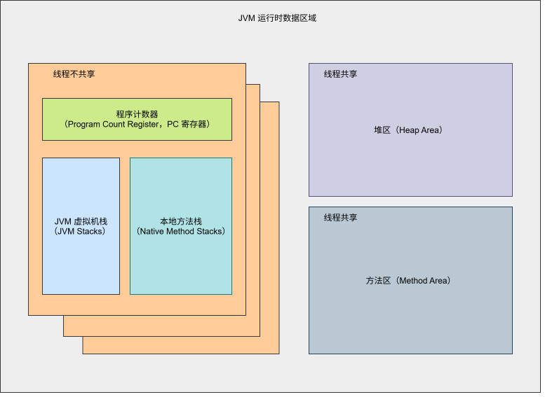

> [!CAUTION]
>
> * ① 线程不共享指的就是每创建一个线程，JVM 就会帮助我们创建一份程序计数器、JVM 虚拟机栈以及本地方法栈。换言之，每个线程都维护自己的数据，别的线程不能去访问，数据没有办法进行共享；但是，`安全性`比较高（当线程的生命周期结束之后，线程对应的内存区域也会被释放掉）。
> * ② 线程共享就是只要我们向堆区或方法区中放入任何数据，每个线程都可以去获取并使用。虽然可以做到数据共享，但是会出现`线程安全`问题，使用的时候需要注意！！！

* 其实，JVM 运行时数据区域，也可以这么画，如下所示：

> [!NOTE]
>
> `灰色的`为单独线程独享，`红色的`为多个线程共享，即：
>
> * ① `每个线程`独立包含`程序计数器`、`Java 虚拟机栈（栈）`、`本地方法栈`（其生命周期和线程一一对应，随着线程的启动而创建，随着线程的结束而销毁）。
> * ② `线程`共享`堆`和`方法区`（其生命周期和 JVM 一一对应，随着 JVM 启动而创建，随着 JVM 退出而销毁）。

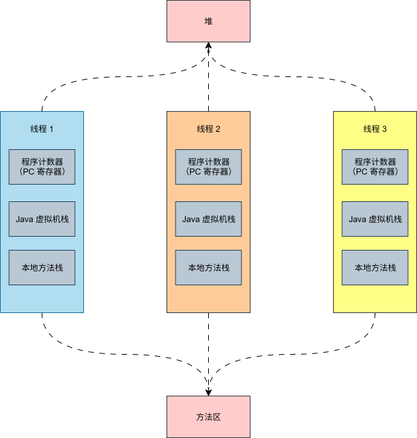

## 1.3 运行时数据区的应用场景

* ① 解决面试难题：

```txt
Java 中的内存区域分为哪几个部分？详细介绍一下。
```

```txt
Java 内存中的哪些部分会内存溢出（Out of Memory，OOM）？
```

```txt
JDK7 和 JDK8 的内存结构上有什么区别？
```

* ② 解决工作实际问题 --- 内存溢出。

> [!NOTE]
>
> * ① 内存溢出是指程序请求的内存超过了系统可用的内存资源，导致程序无法继续运行。
> * ② 这通常发生在程序尝试分配更多内存，而操作系统无法满足请求时。

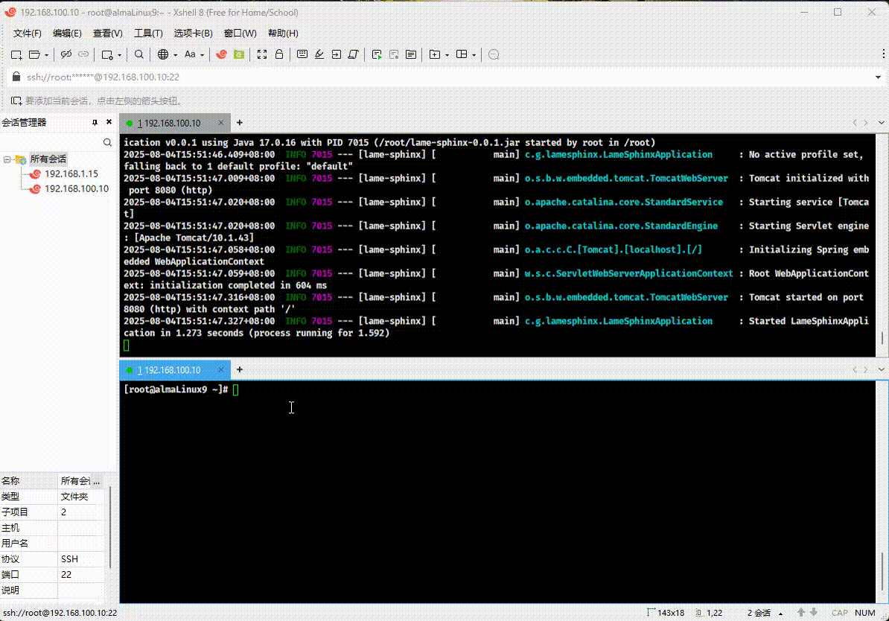

## 1.4 内存调优学习路线（⭐）

* ① `了解运行时内存结构`：了解 JVM 运行过程中每一部分的内存结构以及哪些部分容易出现内存溢出。
* ② `掌握内存问题的产生原因`：学习代码中常见的几种内存泄漏、性能问题的常见原因。
* ③ `掌握内存调优的基本方法`：学习内存泄漏、性能问题等常见 JVM 问题的常规解决方案。


# 第二章：程序计数器

## 2.1 概述

* 程序计数器（Program Counter Register，PC 寄存器）：每个线程都有单独的 PC 寄存器。

> [!NOTE]
>
> * ① JVM 中的`程序计数器`（Program Counter Register，PC 寄存器）中的 Register 的命名来源于 CPU 中的`寄存器`，即：存储相关指令的现场信息。需要说明的是，CPU 只有将数据装载到寄存器中才能够执行。
> * ② 需要注意的是，这里所说的并非广义上所指的物理寄存器，将其翻译为`PC 计数器`（指令计数器，程序钩子）会更加贴切，并且也不太容易引起一些不必要的误会。换言之，JVM 中的`程序计数器`是对`物理 PC 寄存器`的一种抽象模拟（JVM 中的程序计数器是一种软件层面上的模拟）。

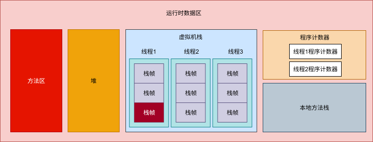

## 2.2 回顾字节码指令的执行过程

* 假设代码是这样的，如下所示：

```java
public class Test {
    public static void main(String[] args) {
        int i = 0;
        if(i == 0){
            i--;
        }
        i++;
    }
}
```

* 其对应的字节码指令，如下所示：

```txt
 0 iconst_0
 1 istore_1
 2 iload_1
 3 ifne 9 (+6)
 6 iinc 1 by -1
 9 iinc 1 by 1
12 return
```

* 当字节码指令被加载到内存的时候，会在 Java 虚拟机栈中形成两个内存区域，即：`操作数栈`和`局部变量表`。

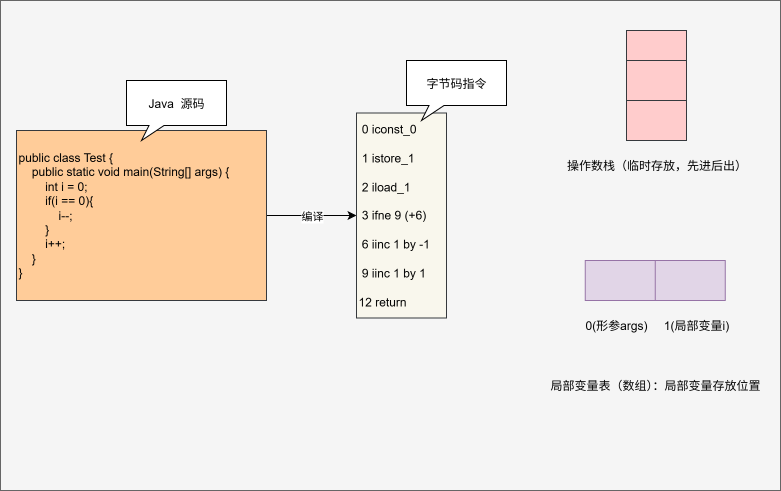

* 其执行流程，如下所示：

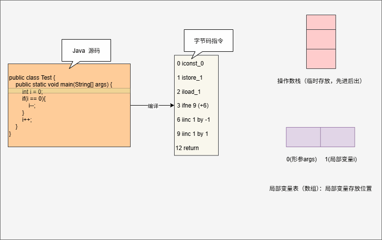

## 2.3 程序计数器

* 在`加载`阶段，JVM 会通过`类加载器`将`字节码文件`中的`指令`读取到`内存`中，并将`源文件`中的`偏移量`替换成`内存地址`，每一条字节码指令都有一个内存地址。

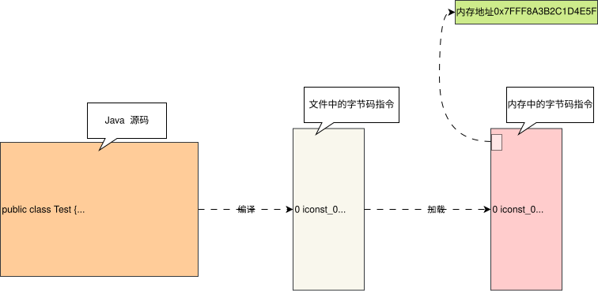

* 在代码执行过程中，程序计数器`包含`当前`正在执行`的`指令`的`地址`。

> [!NOTE]
>
> * ① 为了直观演示，使用`偏移量`来代替`内存地址`！！！
> * ② 程序计数器可以控制程序指令的执行，实现分支、跳转、异常等逻辑。
> * ③ `程序计数器`需要和`执行引擎`（解释器、JIT）配合使用，即：`执行引擎`从`程序计数器`根据`地址`取出指令，执行该指令，`程序计数器`自动`更新`为下一条指令的地址（取指 --> 执行 --> PC 更新）。
> * ④ JVM 规范层面：`PC 寄存器`代表的是`当前正在执行的指令的位置`；但是，`实现层面`（HotSpot 等主流实现）：`PC 寄存器`通常保存的是`下一条指令的地址`。
> * ⑤ 如果执行的是 Java 方法，线程的`程序计数器`保存的是当前方法的`字节码位置`（符号引用、偏移量或内存地址）。
> * ⑥ 如果执行的是 Native 方法（使用 native 关键字修饰的方法），线程的`程序计数器`保存的是 `null` 。

> [!NOTE]
>
> ::: details  点我查看 JVM 指令执行的完整流程
>
> | JVM 指令执行完整流程                        | 米猫叔                                                       |
> | ------------------------------------------- | ------------------------------------------------------------ |
> | :one: 取指（Fetch）                         | PC 寄存器指向某条字节码指令。<br>解释器根据 PC 寄存器从方法字节码里取出这条指令。 |
> | :two: 执行 (Execute)                        | **解释执行模式**下：解释器将字节码“翻译成”一系列 **本地机器指令**（例如 x86/ARM 的加法、内存访问等），并直接执行。<br>**JIT 模式**下：JVM 会把热点字节码提前编译成本地代码，再直接运行，性能更高。 |
> | :three: 作用于栈帧（局部变量表 + 操作数栈） | 大部分字节码不是直接操作寄存器/内存，而是依赖`局部变量表`和 `操作数栈`。<br>例如：`iload_1` → 从局部变量表 slot 1 取值 → 压入操作数栈 |
> | :four: 更新 PC                              | 执行完一条指令，PC 更新到下一条字节码的位置。<br>如果遇到分支/异常/方法调用，PC 会跳转或切换。 |
>
> :::


* 在多线程环境下，JVM 会对线程进行调度，切换正在运行的线程。

> [!NOTE]
>
> * ① 当线程被挂起并切换时，当前线程的`程序计数器`值会被保存在其线程的上下文中。
> * ② 下次该线程被调度时，JVM 会从程序计数器保存的值恢复执行，从而使得线程能够继续从中断的地方执行。

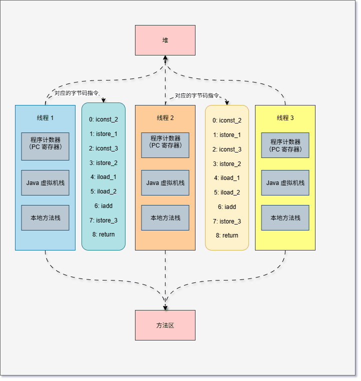

## 2.4 细节

* 【问】程序计数器在运行的时候会出现内存溢出的？
* 【答】不会。内存溢出指的是程序在使用某一块内存区域时，存放的数据需要占用的内存大小超过了虚拟机能提供的内存上限。因为每个线程只存储一个固定长度的内存地址，程序计数器是不会发生内存溢出的。程序员无需对程序计数器做任何处理。

## 2.5 细节

* 【问】程序计数器为什么被设定为线程私有？
* 【答】多线程在一个特定的时间段内只会执行其中某一个线程的方法，CPU 会不停地做任务切换，这样必然导致经常中断或恢复，如何保证分毫无差呢？为了能够准确地记录各个线程正在执行的当前字节码指令地址，最好的办法自然是为每一个线程都分配一个 PC 寄存器，这样一来各个线程之间便可以进行独立计算，从而不会出现相互干扰的情况。


# 第三章：Java 虚拟机栈

## 3.1 概述

* 在《[JVM虚拟机规范](https://docs.oracle.com/javase/specs/jvms/se17/html/jvms-2.html#jvms-2.5)》中，`栈`被分为了`Java 虚拟机栈`以及`本地方法栈`。


* 它们本质上都属于`栈`结构，遵循`先进后出`原则。

> [!NOTE]
>
> * ① `Java 虚拟机栈`以及`本地方法栈`只是在《[JVM虚拟机规范](https://docs.oracle.com/javase/specs/jvms/se17/html/jvms-2.html#jvms-2.5)》中做了一个明确的划分而已。
> * ② `Java 虚拟机栈`是用来保存 Java 语言实现的方法，每次执行方法都会将该方法中的信息保存在这个栈中。
> * ③ `本地方法栈`是用来保存哪些使用`native`关键字修饰的方法，其底层是使用 C++ 语言来实现的方法。
> * ④ 在`HotSpot`中，JDK 的开发人员在实现过程中发现，不管是使用个 Java 语言实现的方法，还是使用 C++ 语言实现的本地方法，本质上都是方法；换言之，只使用了一种栈结构来保存这两种不同方法的信息，即：`Java 虚拟机栈`和`本地方法栈`进行了合并。

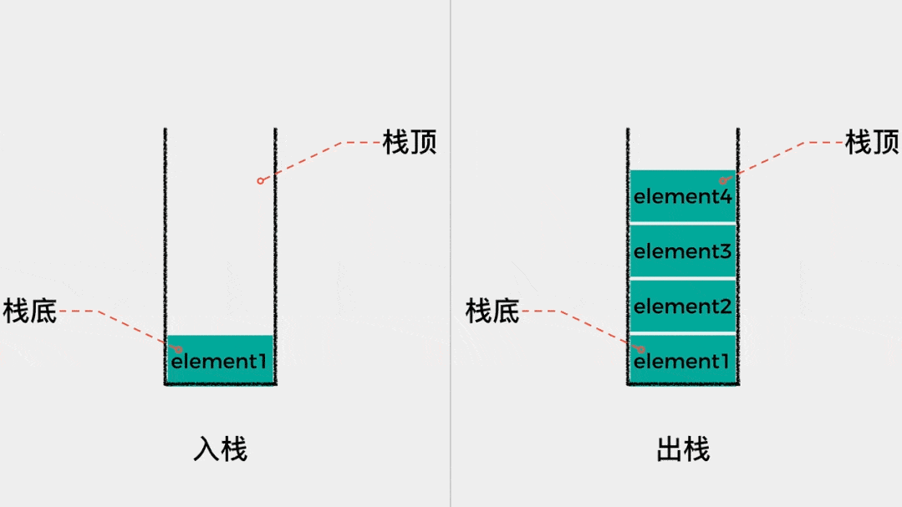

* 那么，`JVM 运行时数据区域`就是这样的，如下所示：

> [!NOTE]
>
> `Java 虚拟机栈`中保存着一个个的`栈帧`（Stack Frame），对应着一次次的 Java 方法的调用。

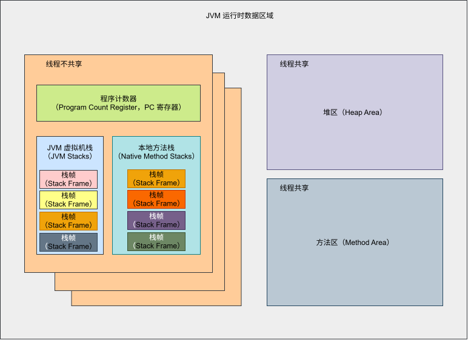

## 3.2 虚拟机栈出现的背景

### 3.2.1 概述

* 计算机中各种硬件处理速度的对比，如下所示：

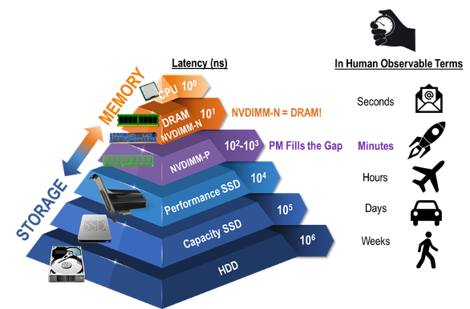

* 计算机的各个设备部件的延迟从高到低的排列，依次是机械硬盘（HDD）、固态硬盘（SSD）、内存、CPU 。

> [!NOTE]
>
> CPU 是最快的，一个时钟周期是 0.3 ns ，内存访问需要 120 ns ，固态硬盘访问需要 50-150 us，传统的硬盘访问需要 1-10 ms，而网络访问是最慢，需要 40 ms 以上。

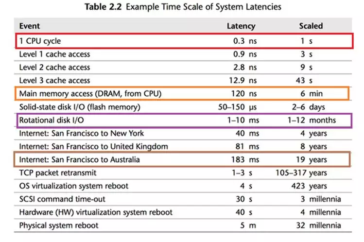

* 按着上图，将计算机世界的时间和人类世界的时候进行对比，如下所示：

```txt
如果 CPU 的时钟周期按照 1 秒计算，
那么，内存访问就需要 6 分钟；
那么，固态硬盘就需要 2-6 天；
那么，传统硬盘就需要 1-12 个月；
那么，网络访问就需要 4 年以上。
```

* 对于 CPU 来说，整个世界真的太慢了；其实，中国古代的文人也有很多作品来表示这种速度的差异：

> [!NOTE]
>
> 对于`蜉蝣`来说，从早到晚就是一生；而对于我们`人类`而言，却仅仅只是一天。

```txt
鹤寿千岁，以极其游，蜉蝣朝生而暮死，尽其乐，盖其旦暮为期，远不过三日尔。
	                                        --- 出自 西汉淮南王刘安《淮南子》
```

```txt
寄蜉蝣于天地，渺沧海之一粟。 哀吾生之须臾，羡长江之无穷。 
挟飞仙以遨游，抱明月而长终。 知不可乎骤得，托遗响于悲风。
	                                        --- 出自 苏轼《赤壁赋》
```

* 存储器的层次结构（CPU 中也有存储器，即：寄存器、高速缓存 L1、L2 和 L3），如下所示：

> [!NOTE]
>
> 以层次化的方式，展示了价格信息，揭示了一个真理，即：鱼和熊掌不可兼得。
>
> - ① 存储器越往上速度越快，但是价格越来越贵， 越往下速度越慢，但是价格越来越便宜。
> - ② 正是由于计算机各个部件的速度不同，容量不同，价格不同，导致了计算机系统/编程中的各种问题以及相应的解决方案。

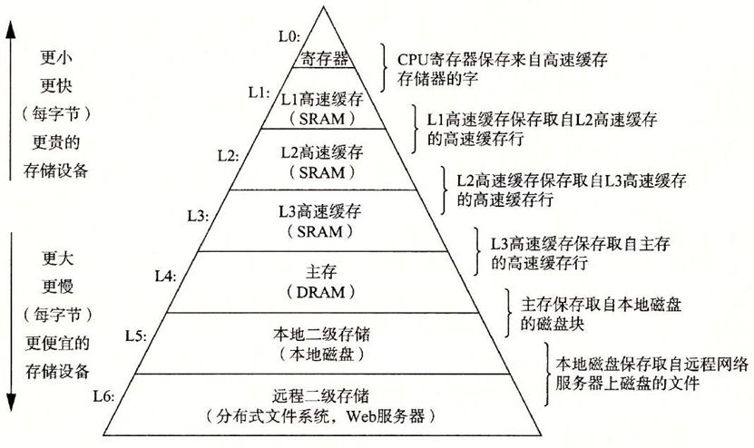

* 其实，对于虚拟机来说，有两种架构，如下所示：
  * :one: 基于`栈`架构的虚拟机：栈是位于内存中，速度较慢。
  * :two: 基于`寄存器`架构的虚拟机：寄存器是位于 CPU 内部，速度较快。

### 3.2.2 Java 虚拟机

* JVM 是基于`栈`（操作数栈）架构设计的虚拟机。

> [!NOTE]
>
> * ① 这种架构的优点是`跨平台`，指令集小（8 位），编译器容易实现。
> * ② 这种架构的缺点是`性能下降`（实现同样的功能，需要更多的指令）。

* 假设我们的代码是这样的，如下所示：

```java [Test.java]
public class Test {
    public static void main(String[] args){
        int a = 1; // [!code highlight:3]
        int b = 2;
        int c = a + b;
    }
}
```

* 其编译之后，对应的`字节码指令`，如下所示：

```java
class Test {
  Test();
       0: aload_0
       1: invokespecial #1                  // Method java/lang/Object."<init>":()V
       4: return


  public static void main(java.lang.String[]);
       0: iconst_1 // [!code highlight:8]
       1: istore_1
       2: iconst_2
       3: istore_2
       4: iload_1
       5: iload_2
       6: iadd
       7: istore_3
       8: return
}
```

* 这种架构的`计算模型`是使用`操作数栈`来进行计算的。

> [!NOTE]
>
> * ① 数据的存储位置：操作数从局部变量加载到栈，计算在栈顶进行。
> * ② 指令风格：零地址或一地址指令（隐式操作栈）。

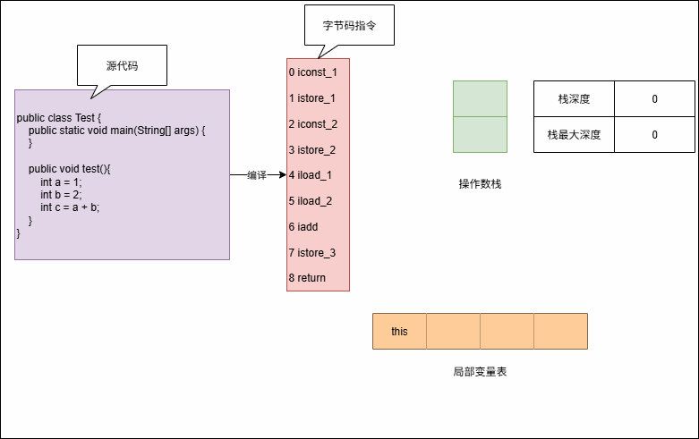

### 3.2.3 Dalvik VM（ART VM）

* Dalvik VM（Android 早期使用）或现代的 ART（Android Runtime） 则是基于`寄存器`架构设计的虚拟机。

> [!NOTE]
>
> * ① 这种架构的优点是`性能高`，指令集大（往往以一地址指令、二进制指令和三地址指令为主）。
> * ② 这种架构的缺点是`可移植性差`（完全依赖于硬件）。

* 假设 Kotlin 的代码是这样的，如下所示：

```kotlin
fun add(a: Int, b: Int): Int {
    return a + b
}
```

* 那么，使用 Kotlin/Native 就可以编译为目标平台的代码，如下所示：

```kotlin
mov eax, edi    ; a -> eax 
add eax, esi    ; a + b
ret             ; 返回 eax
```

* 这种架构的`计算模型`是基于`寄存器`来进行计算的。

> [!NOTE]
>
> * ① 数据的存储位置：指令直接操作寄存器中的值
> * ② 指令风格：多地址指令（显式指定寄存器）。

### 3.2.4 总结

* 基于栈 VS 基于寄存器，如下所示：

| 对比维度         | 基于栈          | 基于寄存器     |
| ---------------- | --------------- | -------------- |
| 指令模型         | 隐式操作栈      | 显式操作寄存器 |
| 指令数量         | 多              | 少             |
| 字节码大小       | 大              | 小             |
| 实现难度         | 简单            | 复杂           |
| 执行效率（解释） | 较低            | 较高           |
| 优化潜力         | 高（JIT 强大）  | 高（接近硬件） |
| 典型代表         | Java HotSpot VM | Dalvik, ART    |

* JVM 采用基于`栈`的设计，强调`简单性、可移植性和安全性`。
* 基于`寄存器`的虚拟机（ART）强调`执行效率和紧凑性`，更适合资源受限环境。
* 两者各有优劣，现代高性能 JVM 通过 JIT 技术弥补了栈模型的性能劣势，实际运行性能依然非常强大。

## 3.3 Java 虚拟机栈

* Java 虚拟机栈（Java Virtual Machine Stack）采用了`栈`的数据结构来管理方法调用中的基本信息。

> [!NOTE]
>
> * ① 遵循`先进后出`（First In Last Out，FILO）的原则。
> * ② 其内部保存着一个个的`栈帧`（Stack Frame），对应着一次次的 Java 方法的调用。

* 那么，对应的代码和执行过程就是这样的，如下所示：

::: code-group

```java [Test.java]
public class Test {   
    public static void main(String[] args) {        
         study();    
     }

    public static void study(){
        eat();

        sleep();
    }   
    
    public static void eat(){       
         System.out.println("吃饭");   
    }    
    
    public static void sleep(){        
        System.out.println("睡觉");    
    }
  }
```

```md:img [cmd 控制台]
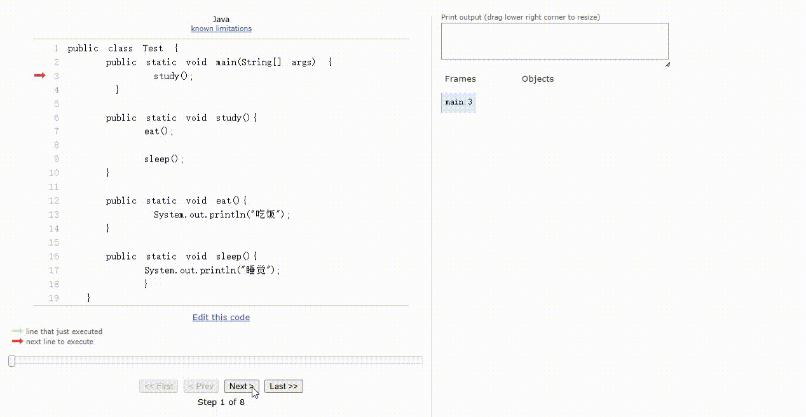
```

```md:img [cmd 控制台]
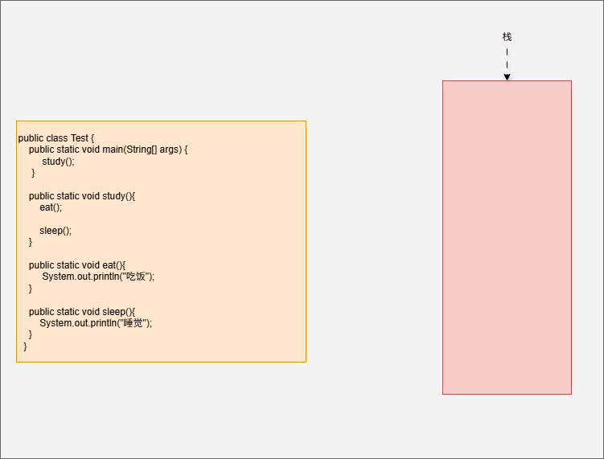
```

:::

* 其实，在 IDEA 中也可以看到对应的栈帧：

::: code-group

```java [Test.java]
public class Test {   
    public static void main(String[] args) {        
         study();    
     }

    public static void study(){
        eat();

        sleep();
    }   
    
    public static void eat(){       
         System.out.println("吃饭");   
    }    
    
    public static void sleep(){        
        System.out.println("睡觉");    
    }
  }
```

```md:img [cmd 控制台]
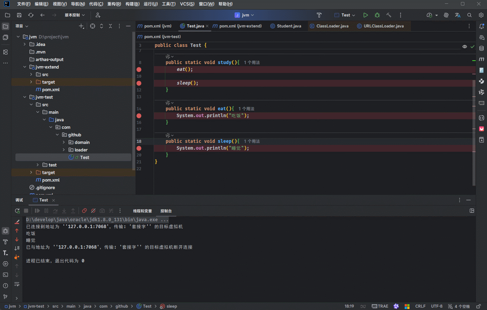
```

:::

* `Java 虚拟机栈`会随着线程的创建而创建，当线程销毁的时候也会回收对应的`Java 虚拟机栈`。

> [!NOTE]
>
> * ① `Java 虚拟机栈`的生命周期和`线程`的生命周期一致。
> * ② 由于`方法`可能会在不同的线程中执行，每个`线程`都会包含自己独立的`虚拟机栈`。
> * ③ `Java 虚拟机栈`主管 Java 程序的运行，其保存方法的局部变量（8 种基本数据类型和引用数据类型）、部分结果，并参与方法的调用和返回。
> * ④ Java 方法有两种方法返回的方式，都会导致栈帧被弹出：
>   * :one: 函数正常结束，以 return 结尾。
>   * :two: 方法执行中出现未捕获的异常，以抛出异常的方式结束。

::: code-group

```java [Test.java]
package com.github;

public class Test {
    public static void main(String[] args) {
        study();

        Thread t = new Thread(() -> {
            a();
            b();
            c();
        }, "线程 A");
        t.start();
    }

    private static void c() {
        System.out.println(Thread.currentThread().getName()+"--> c");
    }

    private static void b() {
        System.out.println(Thread.currentThread().getName()+"--> b");
    }

    private static void a() {
        System.out.println(Thread.currentThread().getName()+"--> a");
    }

    public static void study(){
        System.out.println("学习");
        sleep();
    }

    public static void sleep(){
        System.out.println("睡觉");
    }
}
```

```md:img [cmd 控制台]
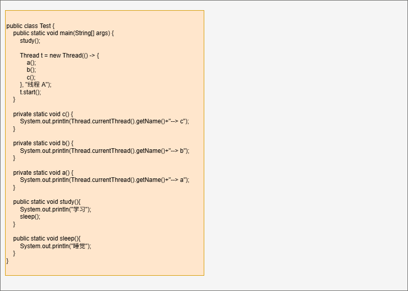
```

```md:img [cmd 控制台]
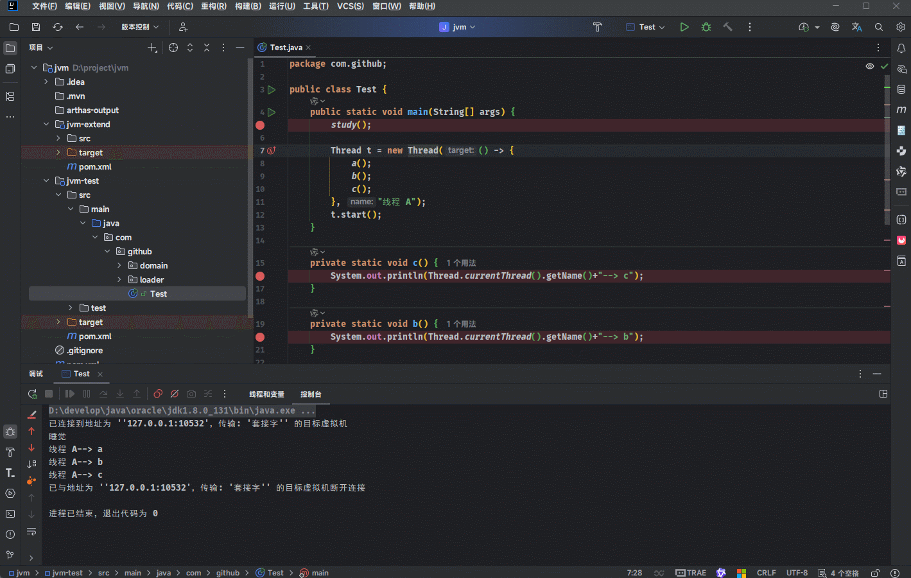
```

:::

## 3.4 栈帧（Stack Frame）

### 3.4.1 概述

* 每个`线程`都有自己的`栈`（Java 虚拟机栈），`栈`中的数据都是以`栈帧`（Stack Frame）的格式存在。

> [!NOTE]
>
> * ① 在线程中正在执行的每个`方法`都对应着各自独立的`栈帧`（Stack Frame），即：一个方法开始执行，就对应着栈帧的压栈操作；一个方法结束执行，就对应着栈帧的弹栈操作。
>
> * ② 栈帧是一个内存区块，是一个数据集，维系着方法执行过程中的各种数据信息。

* `栈`（Java 虚拟机栈）中的`栈帧`包含了`局部变量表`、`操作数栈`以及`帧数据`。

> [!NOTE]
>
> * ① `局部变量表`（Local Variables）：用于在运行过程中存放所有的局部变量。
> * ② `操作数栈`（Operand Stack）：用于存放虚拟机在执行字节码指令过程中的临时数据。
> * ③ `帧数据`（Frame Data）：主要包含的一些信息，如：动态链接等。
>   * `动态链接`（Dynamic Linking）：指向运行时常量池的方法引用。
>   * `(方法)返回地址`（Return Address）：方法退出或者异常退出的定义。
>   * `附加信息`。


### 3.4.2 局部变量表（Local Variables）

#### 3.4.2.1 概述

* `局部变量表`也被称为`本地变量表`或`局部变量数组`。

> [!NOTE]
>
> * ① `局部变量表`是一个`固定大小`的`数组`(由编译器在`编译期`确定`大小`)，用于存储`方法`执行过程中所需的`局部数据`。其仅对当前方法可见，是方法执行的"私有工作区"。
> * ② 关键特性：
>
> | 关键特性             | 描述                                              |
> | -------------------- | ------------------------------------------------- |
> | :one: 大小固定       | 在 `.class` 文件中已确定（Code 属性中的`locals`） |
> | :two: 线程私有       | 每个方法调用都有独立的局部变量表。                |
> | :three: 按 Slot 索引 | 通过索引号（0, 1, 2...）访问                      |
> | :four: 仅限方法内部  | 不能用于方法间通信                                |
>
> * ③ 局部变量表中包含的内容，如下所示：
>   * :one: 方法参数，包括隐式参数（实例方法有 this）。
>   * :two: 方法体中声明的局部变量。
>   * :three: 编译器生成的临时变量，如：循环变量、异常处理变量、Lambda 表达式相关变量等。

* `局部变量表`有两种，如下所示：
  * ① `字节码文件`中`局部变量表`。
  * ② `栈帧`中的`局部变量表`。

> [!NOTE]
>
> 栈帧中的局部变量表是根据字节码文件中的内容生成的。

#### 3.4.2.2 Java 中变量的分类

##### 3.4.2.2.1 概述

* Java 中的变量根据`声明位置`的不同，可以分为三类，如下所示：
  * 局部变量：方法、构造器或代码块内部。
  * 成员变量：
    * 实例变量：声明在类中，但在方法、构造器或语句块之外。
    * 类变量（静态变量）：使用 static 关键字修饰。

##### 2.4.2.2.2 局部变量

* 局部变量的特点：

| 特点       | 说明                                                 |
| ---------- | ---------------------------------------------------- |
| 声明位置   | 声明在方法、构造器或代码块内部。                     |
| 生命周期   | 当方法、构造器或代码块执行时创建，执行结束后被销毁。 |
| 作用域     | 仅在声明它们的花括号内可见和可用。                   |
| 内存位置   | 存储在栈中。                                         |
| 默认初始化 | 局部变量不会被自动初始化，必须在使用前手动赋值。     |


* 示例：

```java
public class Test {
    // 静态成员变量（静态变量）
    static int x = 10; 
    // 实例成员变量（成员变量）
    int y = 20;

    public static void main(String[] args) {
        // 局部变量
        int num = 30; // [!code highlight]
    }
}
```

##### 2.4.2.2.3 成员变量

* 成员变量的特点：

| 特点       | 说明                                                         |
| ---------- | ------------------------------------------------------------ |
| 声明位置   | 声明在类中，但在方法、构造器或语句块之外。                   |
| 生命周期   | 与所属的对象生命周期相同，当对象被创建时分配内存，当对象结束生命周期时才被释放。 |
| 作用域     | 其作用域与所属的对象相同。                                   |
| 内存位置   | 存储在堆中。                                                 |
| 默认初始化 | 会被默认初始化。                                             |


* 示例：

```java
public class Test {
    // 静态成员变量（静态变量）
    static int x = 10;
    // 实例成员变量（成员变量）
    int y = 20; // [!code highlight]

    public static void main(String[] args) {
        // 局部变量
        int num = 30;
    }
}
```

##### 2.4.2.2.4 类变量

* 类变量的特点：

| 特点       | 说明                                                         |
| ---------- | ------------------------------------------------------------ |
| 声明位置   | 声明在类中，方法外，并使用 `static` 关键字修饰。             |
| 生命周期   | 当类被加载到内存中时就被分配空间，并且随着程序的结束而结束。 |
| 作用域     | 与特定对象无关，而是属于整个类。                             |
| 内存位置   | 存储在方法区的静态区。                                       |
| 默认初始化 | 可以通过类名直接访问，如： `ClassName.staticVariable`。      |


* 示例：

```java
public class Test {
    // 静态成员变量（静态变量）
    static int x = 10; // [!code highlight]
    // 实例成员变量（成员变量）
    int y = 20; 

    public static void main(String[] args) {
        // 局部变量
        int num = 30;
    }
}
```

#### 3.4.2.3 字节码文件中的局部变量表

* `当我们编译源代码形成字节码文件的时候，就已经确定了局部变量表中的内容`。

* 假设源码代码是这样的，其对应的`局部变量表`可以通过 `Jclasslib` 插件来查看：

::: code-group

```java [Test.java]
public class Test {
    public static void main(String[] args) {

    }

    public static void test1(){ // [!code highlight:4]
        int i = 0;
        long j = 1;
    }

}
```

```md:img [cmd 控制台]
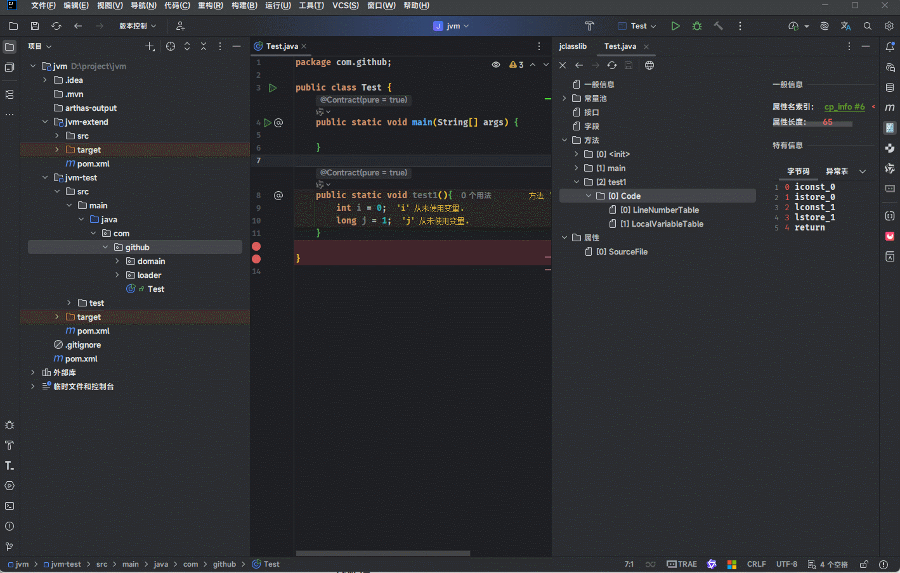
```

:::

* 其过程就是这样的，如下所示：

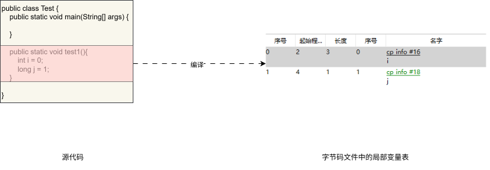

* 其中，`局部变量表`中的`序号`指的是`源码`中`局部变量`的`编号`。

> [!NOTE]
>
> 在源码中，i 在前，j 在后；那么，i 在局部变量表中的编号就是 0，j 在局部变量表中的编号就是 1 。

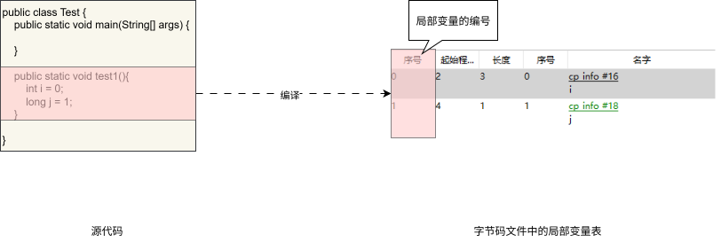

* 其中，`起始程序计数器`和`长度`是用来`限制局部变量的生效范围（作用域范围）`。

> [!NOTE]
>
> * ① `int i = 0;`对应的`字节码指令`是`前两行`；那么，`偏移量`就是 `0` 和 `1` 。
> * ② `long j = 1;`对应的`字节码指令`是`后两行`；那么，`偏移量`就是 `2` 和 `3` 。
> * ③ 对于`i`变量来说，必须经过偏移量`0`步骤和`1`步骤（初始化以及赋值）之后，才可以使用；那么，`i`的起始程序计数器就是`2`，`i`的长度是`3`，就意味着只有`2`、`3`、`4`三条指令才可以使用`i`变量。
> * ④ 对于`j`变量来说，必须经过偏移量`2`步骤和`3`步骤（初始化以及赋值）之后，才可以使用；那么，`j`的起始程序计数器就是`4`，`j`的长度是`1`，就意味着只有`4`三条指令才可以使用`j`变量。
> * ⑤ JVM 通过`局部变量表`来`控制`每一个`局部变量`能否访问`字节码指令`的范围。 换言之，如果在超过这个生效范围的字节码指令中去访问这个局部变量，该指令就会判断有问题，JVM 会拒绝执行，提高了一定的安全性。

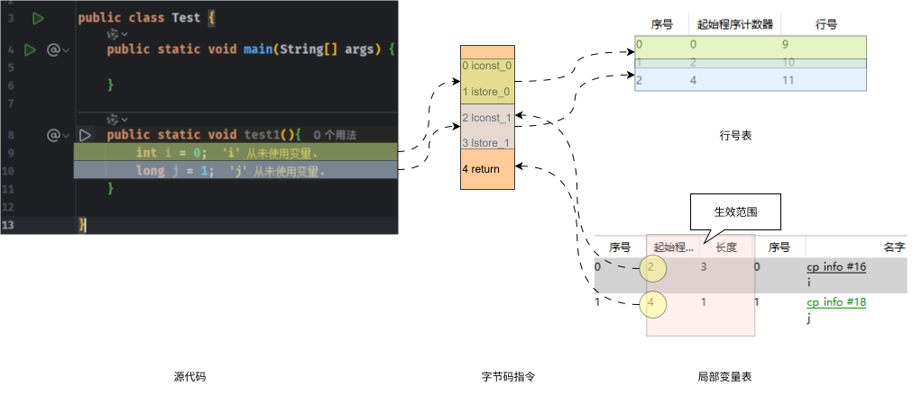

> [!CAUTION]
>
> `栈帧`中的`局部变量表`并不是上述的样子，刚才看到的只是`字节码文件`中的`局部变量表`！！！

#### 3.4.2.4 栈帧中的局部变量表

* `栈帧`中的`局部变量表`是一个`数组`，数组中的每一个位置称之为`槽`（slot）：

> [!NOTE]
>
> * ① `局部变量`在`局部变量表`中的`存放`：从`0`索引开始，到`数组长度 - 1`索引结束。
> * ② 对于 boolean、byte、char、short、int、float 以及 reference（引用数据类型）以及 returnAddress（返回地址类型），占用 1 个槽。
> * ③ 对于 long 和 double ，占用 2 个槽（slot）。
> * ④ 如果需要访问`局部变量表`中`变量值`的时候，只需要使用`前一个索引`即可（long 和 double 占用 2 个槽）。


* `实例方法`中的序号为`0`的位置存放的是`this`，指的是当前调用方法的对象，运行时会在内存中存放实例对象的地址。

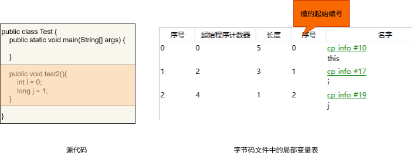

* `方法参数`也会保存在`局部变量表`中，其顺序和方法中参数的定义顺序一致。

> [!NOTE]
>
> 局部变量表中保存的内容有：`实例方法的 this 对象`，`方法的参数`以及`方法体中声明的局部变量`。

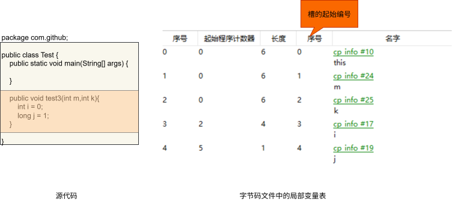

#### 3.4.2.5 细节

* 需求：以下代码在局部变量表中会占用几个槽？

```java
package com.github;

public class Test {
    public static void main(String[] args) {
    }

    public void test(int k,int m){ // [!code highlight:11]
        {
            int a = 1;
            int b = 2;
        }
        {
            int c = 1;
        }
        int i = 0;
        long j = 1;
    }
}

```

> [!NOTE]
>
> ::: details 点我查看 具体详情
>
> * ① 为了节省空间，`局部变量表`中`槽`是可以复用的，即：如果一个局部变量过了其作用域，那么在其作用域之后声明的新的局部变量就有可能会复用过期的变量变量的槽，从而达到`节省资源`的目的。
> * ② 槽是 6 ，而不是 9 。
>
> 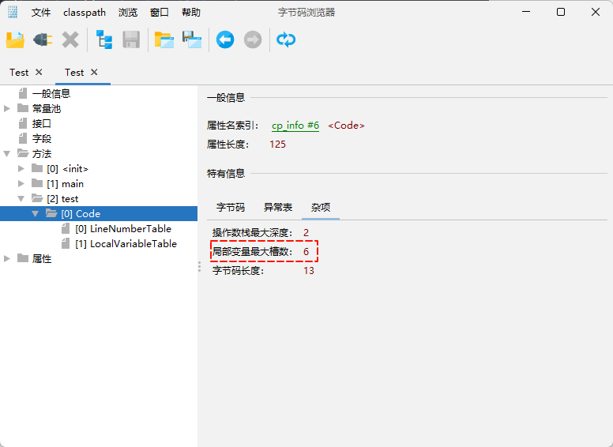
>
> :::


* 示例：执行过程的动态图

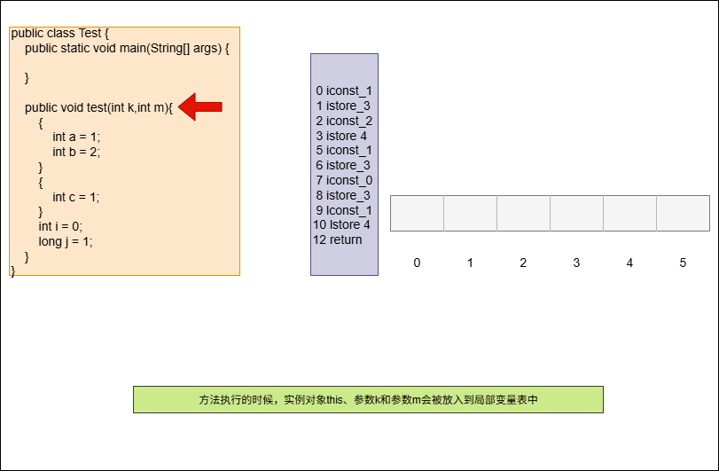

#### 3.4.2.6 细节

* `类变量`有两次初始化的机会，如下所示：
  * 第一次是在`链接阶段`中的`准备阶段`，会对类变量赋值零值，即：默认初始化。
  * 第二次是在`初始化阶段`，会赋予程序员在代码中定义的初始化值，即：显示初始化。

* 和`类变量`初始化不同的是，`局部变量表`是`不存在`系统初始化的过程。

> [!NOTE]
>
> 一旦定义了局部变量，则必须在使用之前进行手动初始化；否则，编译将不会通过！！！


* 示例：

```java
public class Test {
    
    public static void main(String[] args){
        int num;
        // ❌ 在使用之前没有对局部变量进行手动初始化
        System.out.println(num); // [!code error]
    }
}
```

### 3.4.3 操作数栈（Operand Stack）

#### 3.4.3.1 概述

* `操作数栈`是`栈帧`中`虚拟机`在执行`字节码指令`过程中用来存放`临时数据`的一块内存区域。

> [!NOTE]
>
> * ① 如果一条指令将一个值压入到`操作数栈`中，则后面的指令可以弹出并使用该值。
> * ② `栈`可以使用`数组`和`链表`来实现，JVM 中的`栈`就是使用`数组`来实现的；但是，虽然`栈`是使用数组来实现的，却只能对元素进行压栈（push）或弹栈（pop），并不能根据索引直接修改或删除指定的元素。
> * ③ Java 虚拟机的执行引擎（解释器）是基于`栈`的执行引擎，其中的`栈`指的就是`操作数栈`。
> * ④ 如果被调用的方法带有返回值的话，其返回值将会被压入当前栈帧的操作数栈中，并更新`程序计数器`为下一条需要执行的字节码指令。

#### 3.4.3.2 特点

* `编译期就可以确定操作数栈的最大深度，从而在执行的时候正确地分配内存大小`。

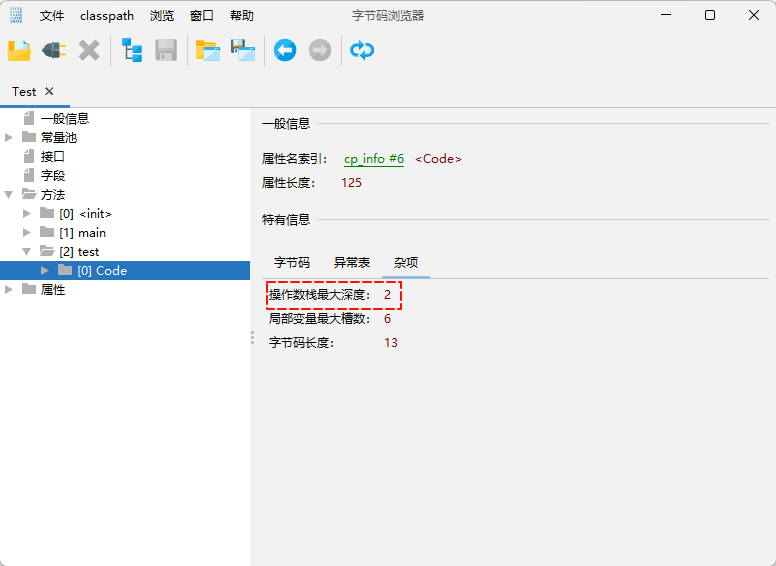


* 示例：演示操作数栈的最大深度

::: code-group

```txt [faq 计算过程]
iconst_1    // 栈深度: 0→1, 最大深度: 1
istore_1    // 栈深度: 1→0, 最大深度: 1
iconst_2    // 栈深度: 0→1, 最大深度: 1  
istore_2    // 栈深度: 1→0, 最大深度: 1
iload_1     // 栈深度: 0→1, 最大深度: 1
iload_2     // 栈深度: 1→2, 最大深度: 2
iadd        // 栈深度: 2→1, 最大深度: 2
istore_3    // 栈深度: 1→0, 最大深度: 2
```

```md:img [cmd 控制台]

```

:::

### 3.4.4 代码追踪

* 需求：演示`JVM`执行`字节码指令`时对应`程序计数器`、`局部变量表`以及`操作数栈`的工作过程。


* 示例：

::: code-group

```java [Test.java]
public class Test {
    public static void main(String[] args) {
        int i = 15; // [!code highlight:3]
        int j = 8;
        int k = i + j;
    }
}
```

```md:img [cmd 控制台]
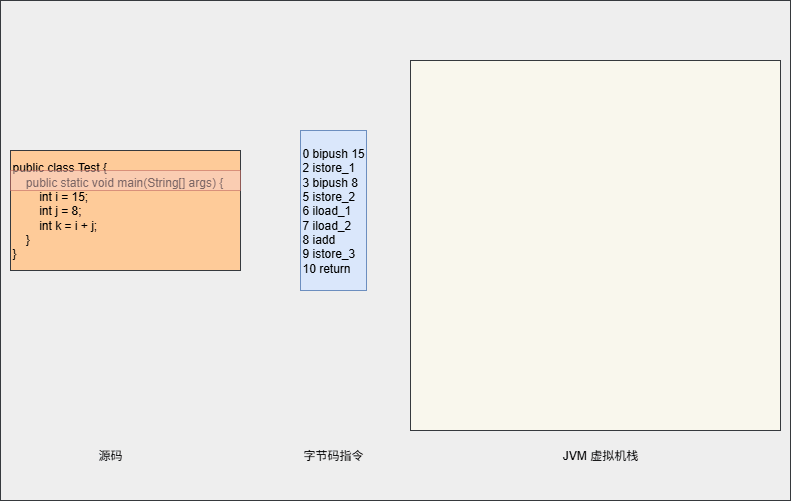
```

:::

### 3.4.5 帧数据（Frame Data）

#### 3.4.5.1 概述

* `操作数栈`和`局部变量表`，对于每个 Java 虚拟机，都是按照 《[Java虚拟机规范](https://docs.oracle.com/javase/specs/jvms/se17/html/jvms-2.html#jvms-2.5)》实现的。
* `栈数据`主要包含`动态链接`、`返回地址`以及`附加信息`。

> [!NOTE]
>
> 不同的 Java 虚拟机对于`帧数据`有不同的扩展！！！

#### 3.4.5.2 动态链接（Dynamic Linking）

* 在`字节码文件`中是存在`常量池`的，我们也经常称为`静态常量池`，如下所示：

> [!NOTE]
>
> ::: details 点我查看 常量池是什么？
>
> * ① 常量池（静态常量池）是 `.class` 文件中的一个结构，用于存储编译期间生成的各种`字面量`（Literal）和`符号引用`（Symbolic Reference），如下所示：
>
>   * :one: 类和接口的全限定名。
>
>   * :two: 字段名和描述符。
>
>   * :three: 方法名和描述符。
>
>   * :four: 字符串字面量，如："HelloWorld"。
>
>   * :five: 值常量，如：100、3.14 等。
>
>   * :six: 方法句柄、动态调用点等（JDK7+）。
>
> * ② 上述内容在运行时会被 JVM 加载并解析，转换为直接引用。
>
> :::

> [!NOTE]
>
> ::: details 点我查看 为什么需要常量池（静态常量池）？
>
> * ① 避免重复存储，节省空间：
>
>   * 如果没有常量池，每个使用到字符串 `"Hello"` 的地方都要完整存储一遍该字符串，会造成大量冗余。
>   * 常量池统一存储一次，其他地方只需引用其索引，如： `#1`，大大节省空间。
>   * 例如：多个地方调用 `System.out.println("Hello")`，"Hello" 只在常量池存一份。 
>
> * ② 支持符号引用 → 直接引用的动态解析：
>
>   * Java 是动态链接语言，类在运行时才被加载。
>   * 编译时无法知道某个类/方法/字段在内存中的真实地址，所以只能用“符号”来表示。
>
>   ```java
>   // 编译时只知道要调用 PrintStream.println(String)
>   // 但不知道 PrintStream 类在哪儿，println 方法地址是多少
>   System.out.println("Hello");
>   ```
>
>   * 这些符号（类名、方法名、描述符）都存储在常量池中，在类加载的`解析阶段`，JVM 会将这些符号引用替换为内存中的直接指针（直接引用），即：常量池是实现“动态链接”的关键桥梁。
>
> * ③ 提高运行时访问效率：
>
>   * 常量池中的数据在类加载时被加载到方法区（或元空间）的运行时常量池中，可以通过索引快速访问，避免重复解析和查找。
>   * 例如：`invokevirtual #5` —— `#5` 是常量池索引，指向某个方法符号引用，JVM 可快速定位并调用。
>
> * ④ 支持反射、动态代理、注解等高级特性：
>
>   * 反射机制需要通过类名、方法名、字段名动态查找成员，这些名称都来自常量池，即：没有常量池，反射就无法工作。
>   * 注解的值、动态代理生成的类名、Lambda 表达式的方法引用等，也都依赖常量池存储元数据。
>
> * ⑤ 支持字符串常量优化（如字符串驻留）：
>
>   * Java 中的字符串字面量会自动“驻留”（intern）到字符串常量池，避免重复创建对象，如：
>
>   ```java
>   String s1 = "hello";
>   String s2 = "hello";
>   System.out.println(s1 == s2); // true —— 指向同一个常量池对象
>   ```
>
>   * 上述的 `"hello"` 就存储在常量池中。
>
> :::

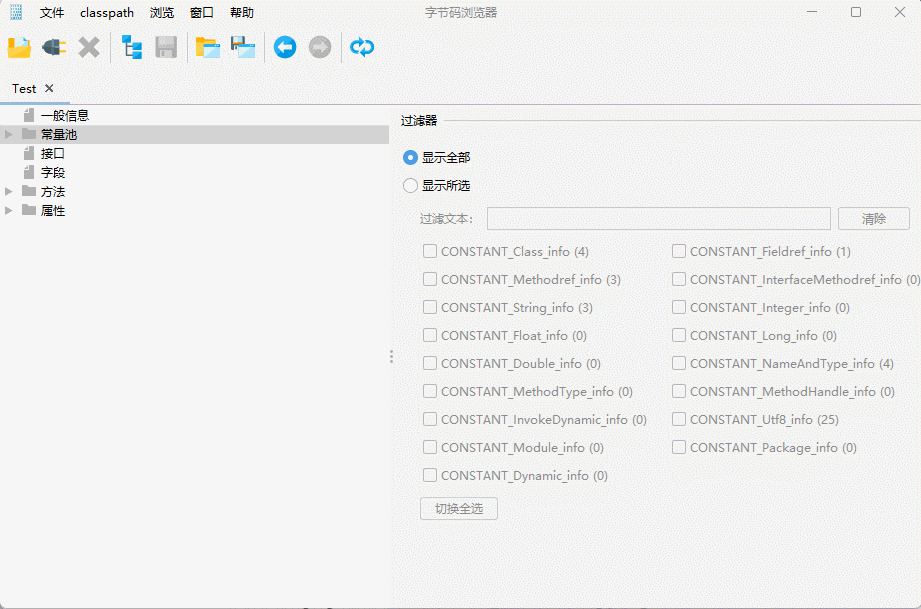

* `字节码文件`被加载到内存时，会在`解析`阶段，将`静态常量池`转换为`运行时常量池`。

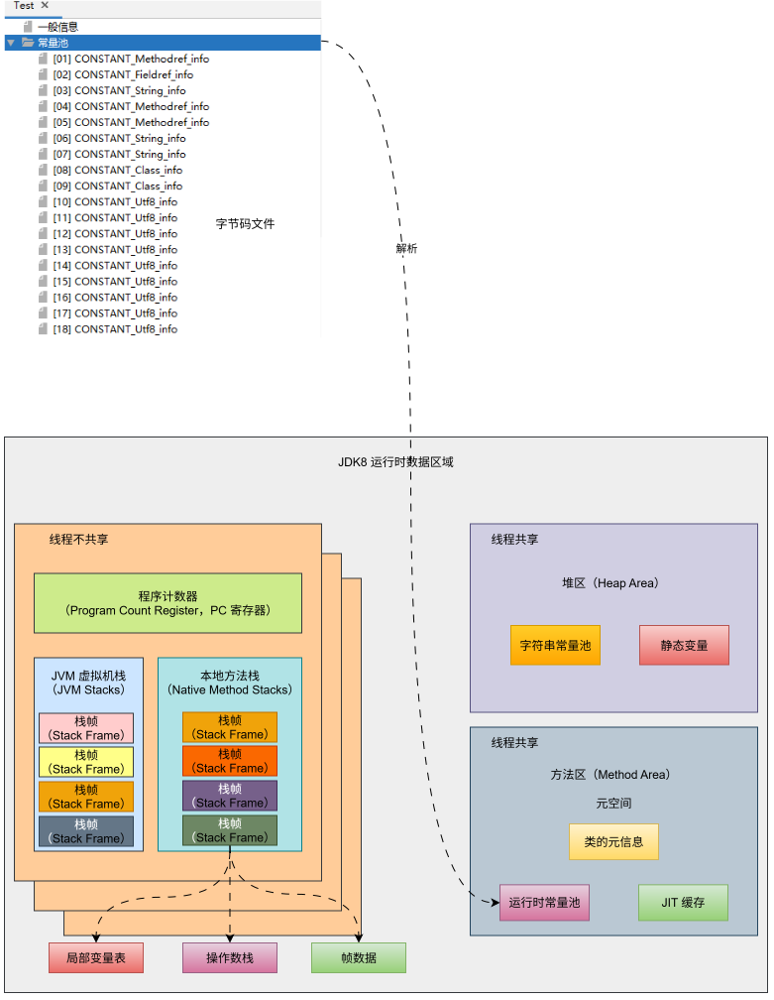

* 每个`栈帧`内部包含一个`指向运行时常量池`的`方法引用`，其目的是为了支持当前方法的代码能够实现`动态链接`，如：`invokevirtual #4` 。

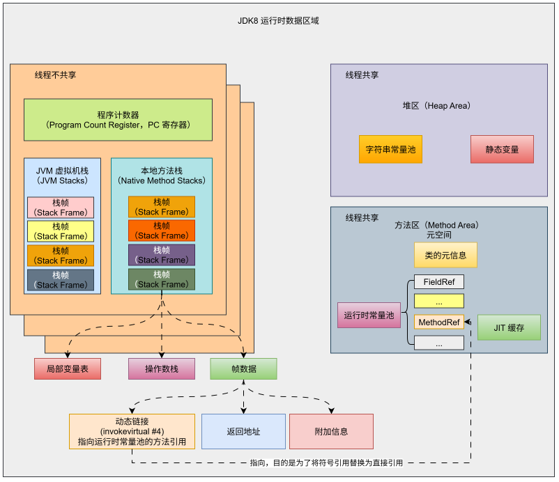

* 之前，我们提过在`类加载`生命周期中的`链接`阶段（解析阶段）是将常量池中的`符号引用`替换为`直接引用`。

> [!NOTE]
>
> * ① 有些字节码指令是这样的，如：`invokevirtual #4`。
> * ② `#4` 是`符号引用`，在执行引擎执行的时候，会将 `#4` （符号引用）`转换`为`内存地址`（直接引用），如：`#4 --> 0x12457832`，即：`动态链接`就保存了`编号`（偏移量）到`运行时常量池`的内存地址的映射关系。


#### 3.4.5.3 方法的调用

##### 3.4.5.3.1 概述

* 在 JVM 中，将`符号引用`替换为`直接引用`和`方法的绑定机制`有关。

> [!NOTE]
>
> 在`解析`阶段并不能将`所有`的`符号引用`都替换为`直接引用`，如：虚方法调用（多态）。

##### 3.4.5.3.2 静态链接

* 在`类加载`的`解析阶段`或`编译期`，就确定方法调用的具体目标，绑定后不再改变。

> [!NOTE]
>
> 静态链接（Static Linking）：在`编译期`就把`符号引用`变成`直接引用`，如：Java 中静态方法的调用。

* `静态链接`对应的`执行流程图`，如下所示：

> [!NOTE]
>
> ::: details 点我查看 静态链接过程
>
> * ① 类加载 → 验证 → 解析阶段。
> * ② 将常量池中的符号引用（如 `#3 = Methodref: Animal/speak`）替换为直接引用（内存地址或偏移），即：早期绑定。
> * ③ 之后调用直接跳转，无需再解析。
>
> :::

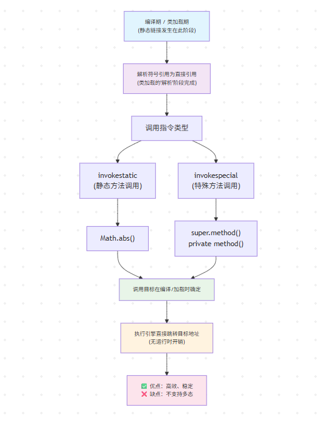

* `静态链接`对应着`非虚方法`（不需要经过虚方法表），即：如果方法在编译期就确定了具体的调用版本，这个版本在运行时是不可变的，那么这样的方法就是`非虚方法`。

> [!NOTE]
>
> 在 Java 中，静态方法、私有方法、final 方法、实例构造器以及父类方法都是非虚方法。


* 示例：

```java
package com.github;

class Father {
    public void show() {
        System.out.println("Father");
    }
    void normalMethod() {
        System.out.println("normalMethod");
    }

}

class Son extends Father {
    @Override
    public void show() {
        super.normalMethod(); // invokespecial → 静态绑定到 Father.normalMethod
        privateMethod(); // invokespecial → 静态绑定到 Son.privateMethod
        Math.max(1, 2); // invokestatic → 静态绑定到 Math.max
        System.out.println("Son");
    }


    private void privateMethod() {
        System.out.println("Son privateMethod");
    }
}


public class Test {
    public static void main(String[] args) {
        Father father = new Son();
        father.show(); // 动态绑定
    }
}
```

##### 3.4.5.3.3 动态链接

* `动态链接`：在方法调用时，根据对象的实际类型（运行时类型），动态解析并绑定到具体实现方法的过程。

> [!NOTE]
>
> 动态链接（Dynamic Linking）：在`运行时`才把`符号引用`解析成`直接引用`，即：Java 中的多态。

* `动态链接`对应的`执行流程图`，如下所示：

> [!NOTE]
>
> ::: details 点我查看 动态链接过程
>
> * ① 首次调用 `invokevirtual` 时，触发“动态解析”。
> * ② JVM 根据对象头中的 `Klass 指针` → 找到实际类型 → 查找其 `vtable`。
> * ③ 根据方法签名在 vtable 中找到实际方法入口 → 缓存（方法调用）→ 后续直接调用。
> * ④ JIT 编译后可能内联或优化为直接调用（去虚拟化）。
>
> :::


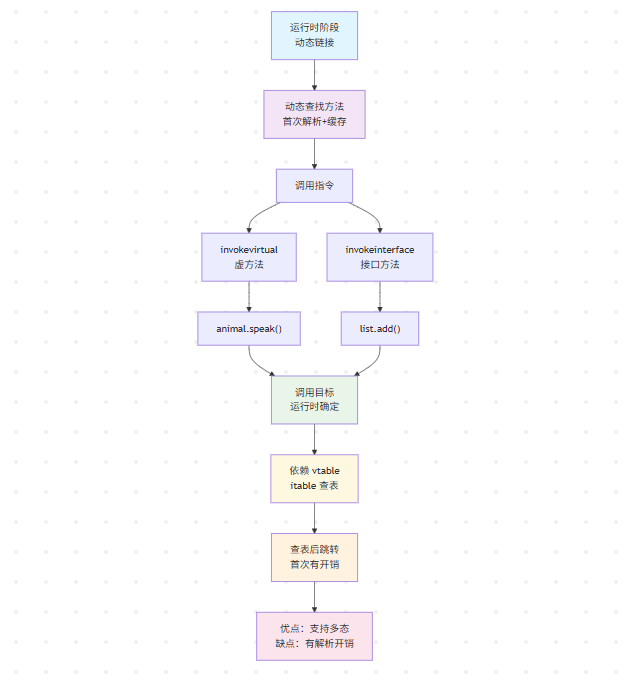

* `动态链接`对应着`虚方法`（需要经过虚方法表），即：在编译期无法确定具体调用版本，必须在运行时根据对象的实际类型动态决定调用哪个方法实现的方法，那么这样的方法是`虚方法`。

> [!NOTE]
>
> 在 Java 中，所有可以被子类重写的 public / protected /default 实例方法，默认都是虚方法。


* 示例：

```java
package com.github;

class Animal {
    public void speak() {
        System.out.println("Animal speaks.");
    }
}

class Dog extends Animal {
    @Override
    public void speak() {
        System.out.println("Dog barks!");
    }
}

class Cat extends Animal {
    @Override
    public void speak() {
        System.out.println("Cat meows!");
    }
}


public class Test {
    public static void main(String[] args) {
        Animal a1 = new Dog();
        Animal a2 = new Cat();

        a1.speak(); // invokevirtual — 实际调用 Dog.speak()
        a2.speak(); // invokevirtual — 实际调用 Cat.speak()
    }
}
```

##### 3.4.5.3.4 为什么会出现动态绑定？

* 随着高级语言的横空出世，类似于 Java 一样的基于面向对象的编程语言如今越来越多，尽管这类编程语言在语法风格上存在一定的差别，但是它们彼此之间始终保持着一个共性，那就是都支持封装、继承和多态等面向对象特性，`既然这一类的编程语言具备多态特性，那么自然也就具备早期绑定和晚期绑定两种绑定方式`。
* Java 中任何一个普通的方法其实都具备`虚函数`的特征，它们相当于 C++ 语言中的虚函数（C++ 中则需要使用关键字 virtual 来显式定义）。如果在 Java 程序中不希望某个方法拥有虚函数的特征时，则可以使用关键字 final 来标记这个方法。

##### 3.4.5.3.5 如何确定虚方法和非虚方法

* `静态链接`对应着`非虚方法`（不需要经过虚方法表），即：如果方法在编译期就确定了具体的调用版本，这个版本在运行时是不可变的，那么这样的方法就是`非虚方法`。

> [!NOTE]
>
> 在 Java 中，静态方法、私有方法、final 方法、实例构造器以及父类方法都是非虚方法。

* `动态链接`对应着`虚方法`（需要经过虚方法表），即：在编译期无法确定具体调用版本，必须在运行时根据对象的实际类型动态决定调用哪个方法实现 的方法，那么这样的方法是`虚方法`。

> [!NOTE]
>
> 在 Java 中，所有可以被子类重写的 public / protected /default 实例方法，默认都是虚方法。

* 我们可以通过`方法调用`对应的`字节码指令`来区分什么是虚方法，什么是非虚方法。

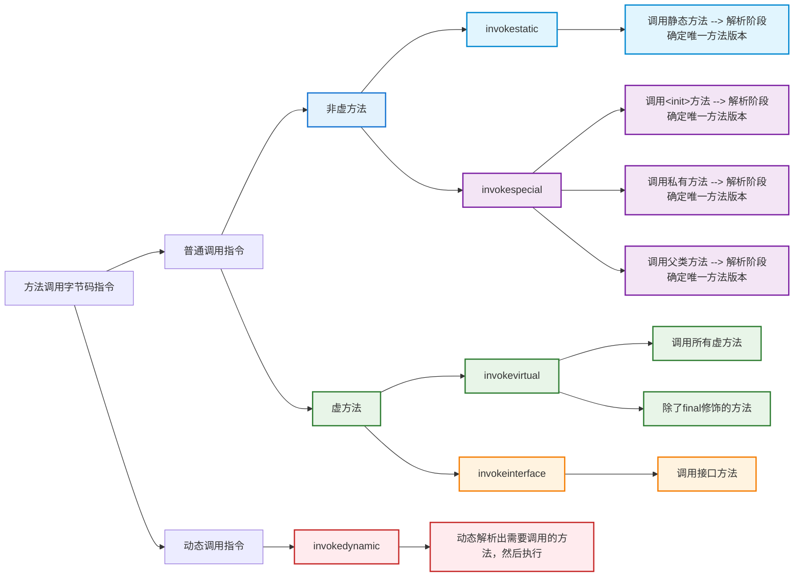
```mermaid
flowchart LR
    A[方法调用字节码指令] --> B[普通调用指令]
    A --> C[动态调用指令]
    
    B --> D[非虚方法]
    B --> E[虚方法]
    
    D --> F[invokestatic]
    D --> G[invokespecial]
    
    E --> H[invokevirtual]
    E --> I[invokeinterface]
    
    C --> J[invokedynamic]
    
    F --> F1[调用静态方法 --> 解析阶段确定唯一方法版本]
    
    G --> G1[调用&lt;init&gt;方法 --> 解析阶段确定唯一方法版本]
    G --> G2[调用私有方法 --> 解析阶段确定唯一方法版本]
    G --> G3[调用父类方法 --> 解析阶段确定唯一方法版本]
    
    H --> H1[调用所有虚方法]
    H --> H2[除了final修饰的方法]
    
    I --> I1[调用接口方法]
    
    J --> J1[动态解析出需要调用的方法，然后执行]
    
    classDef nonVirtual fill:#e3f2fd,stroke:#1976d2,stroke-width:2px
    classDef virtual fill:#e8f5e8,stroke:#2e7d32,stroke-width:2px
    classDef dynamic fill:#ffebee,stroke:#c62828,stroke-width:2px
    classDef staticCall fill:#e1f5fe,stroke:#0288d1,stroke-width:2px
    classDef specialCall fill:#f3e5f5,stroke:#7b1fa2,stroke-width:2px
    classDef virtualCall fill:#e8f5e8,stroke:#2e7d32,stroke-width:2px
    classDef interfaceCall fill:#fff3e0,stroke:#f57c00,stroke-width:2px
    
    class D nonVirtual
    class E virtual
    class F,F1,F2 staticCall
    class G,G1,G2,G3,G4 specialCall
    class H,H1,H2 virtualCall
    class I,I1 interfaceCall
    class J,J1,J2 dynamic
```

* 前四条指令固化在虚拟机内部，方法的调用执行不可人为干预，而 invokedynamic 指令则支持由用户确定方法版本。

> [!NOTE]
>
> * ① JVM 字节码指令集一直比较稳定，一直到 Java7 中才增加了一个 invokedynamic 指令，这是 Java 为了实现『动态类型语言」支持而做的一种改进。
> * ② 在 Java7 中并没有提供直接生成 invokedynamic 指令的方法，需要借助 ASM 这种底层字节码工具来产生 invokedynamic 指令。直到 Java8 的 Lambda 表达式的出现，invokedynamic 指令的生成，在 Java 中才有了直接的生成
>   方式。
> * ③ Java7 中增加的动态语言类型支持的本质是对 Java 虚拟机规范的修改，而不是对 Java 语言规则的修改，这一块相对来讲比较复杂，增加了虚拟机中的方法调用，最直接的受益者就是运行在 Java 平台的动态语言的编译器。


* 示例：

```java
public class Test {

    public static void main(String[] args) {
        // 1. 调用静态方法 → invokestatic
        staticMethod();

        // 2. 调用构造器 → invokespecial
        NonVirtualExample obj = new NonVirtualExample();

        // 3. 调用私有方法 → invokespecial
        obj.privateMethod();

        // 4. 调用 final 方法 → invokevirtual（但 JVM 知道不可重写，可静态优化）
        obj.finalMethod();

        // 5. 调用父类方法 → invokespecial
        obj.callSuper();
    }

    // 1. 静态方法 → 非虚
    public static void staticMethod() {
        System.out.println("Static method called");
    }

    // 2. 构造器 → 非虚
    public NonVirtualExample() {
        System.out.println("Constructor called");
    }

    // 3. 私有方法 → 非虚
    private void privateMethod() {
        System.out.println("Private method called");
    }

    // 4. final 方法 → 非虚（不可被重写）
    public final void finalMethod() {
        System.out.println("Final method called");
    }

    // 5. 调用父类方法示例
    public void callSuper() {
        super.toString(); // 调用 Object.toString() → invokespecial
    }
}
```

##### 3.4.5.3.6 总结

* 静态链接 VS 动态链接：

| 对比点   | 静态链接（Static Linking）      | 动态链接（Dynamic Linking）            |
| -------- | ------------------------------- | -------------------------------------- |
| 发生时机 | 类加载解析阶段 / 编译期         | 运行时（首次调用）                     |
| 指令     | `invokestatic`, `invokespecial` | `invokevirtual`, `invokeinterface`     |
| 绑定目标 | 固定，编译时可知                | 由对象实际类型决定（多态）             |
| 性能     | ⚡ 极快（直接跳转）              | ⏱️ 首次慢（查表），后续快（缓存/JIT）   |
| 灵活性   | ❌ 不支持重写/多态               | ✅ 支持继承、接口、运行时替换           |
| 典型应用 | 工具类方法、构造器、私有方法    | 面向对象核心：接口、抽象类、策略模式等 |

* `类加载`的`解析阶段`是 `能静态确定的先解析好`。
* `动态链接`是`运行时根据实际对象和上下文动态解析`，尤其是支持`多态`和`延迟绑定`的核心机制。

#### 3.4.5.3 返回地址（Return Address）

##### 3.4.5.3.1 概述

* 当一个方法开始执行的时候，有两种方式可以退出，如下所示：

| 方法退出方式                                 | 描述                                                         |
| -------------------------------------------- | ------------------------------------------------------------ |
| :one: 正常完成出口（通过字节码指令 return ） | 执行引擎遇到任意一个方法返回的字节码指令，即：方法执行完毕，正常退出。 |
| :two: 异常完成出口（通过异常处理表）         | 在方法执行过程中遇到异常，并且该异常没有被捕获，即：方法没有执行完毕，非正常退出。 |

* 无论那种退出方式，在方法退出后，都需要返回到该方法被调用的位置。

> [!CAUTION]
>
> `正常完成出口`和`异常完成出口`的区别：通过异常完成出口退出，不会给它的上层调用者产生任何返回值。


* 示例：正常完成出口

::: code-group

```java [Test.java]
package com.github;

public class Test {
    public static void main(String[] args) {
        System.out.println("main start ...");
        
        // 调用 methodA 
        methodA(); 
        
        // methodA() 方法返回后，从这里继续
        System.out.println("main end ...");
    }

    public static void methodA(){
        System.out.println("methodA start ...");

        // 调用 methodB
        methodB();

        // methodB() 方法返回后，从这里继续 
        System.out.println("methodA end ...");
        
        // 正常完成出口，对应的指令是 return
        // 不写，也相当于 return;
        return; // [!code highlight]
    }

    private static int methodB() {

        System.out.println("methodB start ...");

        // 调用 methodC
        methodC();

        // methodC() 方法返回后，从这里继续 
        System.out.println("methodB end ...");

        // 正常完成出口，对应的指令是 ireturn
        return 1;  // [!code highlight]
    }

    public static double methodC(){
        System.out.println("methodC start ...");

        System.out.println("...");

        System.out.println("methodC end ...");

        // 正常完成出口，对应的指令是 dreturn
        return 1.0; // [!code highlight]
    }

}
```

```cmd [控制台]
methodA start ...
methodB start ...
methodC start ...
...
methodC end ...
methodB end ...
methodA end ...
```

```md:img [cmd 控制台]
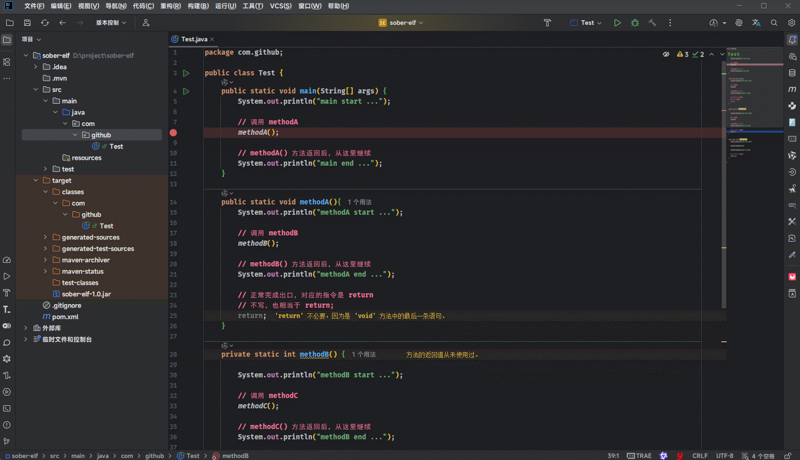
```

```md:img [cmd 控制台]
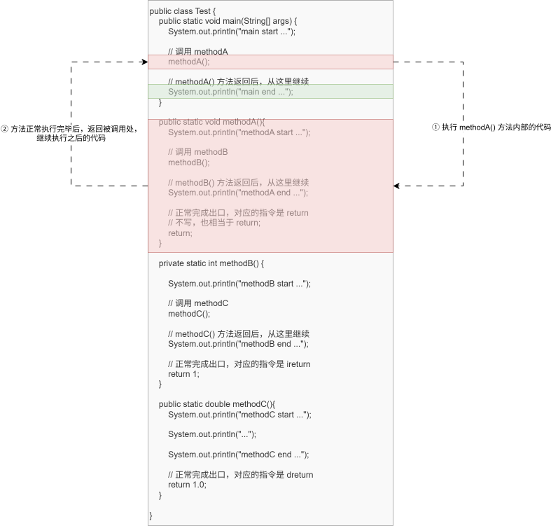
```

:::


* 示例：异常完成出口

::: code-group

```java [Test.java]
package com.github;

public class Test {
    public static void main(String[] args) {
        System.out.println("main start ...");
        
        // 调用 methodA 
        methodA(); 
        
        // methodA() 方法返回后，从这里继续
        System.out.println("main end ...");
    }

    public static void methodA(){
        System.out.println("methodA start ...");

        // 调用 methodB
        methodB();

        // methodB() 方法返回后，从这里继续 
        System.out.println("methodA end ...");
        
        // 正常完成出口，对应的指令是 return
        // 不写，也相当于 return;
        return; 
    }

    private static int methodB() {

        System.out.println("methodB start ...");

        // 调用 methodC
        // 没有对 methodC 进行异常捕获，程序会在这里停止执行
        methodC();   // [!code highlight]

        // methodC() 方法返回后，从这里继续 
        System.out.println("methodB end ...");

        // 正常完成出口，对应的指令是 ireturn
        return 1;  
    }

    public static double methodC(){
        System.out.println("methodC start ...");

        System.out.println("...");
        
        // 出现异常；但是，没有处理
        int i = 10 / 0; // [!code highlight]

        System.out.println("methodC end ...");

        // 正常完成出口，对应的指令是 dreturn
        return 1.0; 
    }

}
```

```cmd
main start ...
methodA start ...
methodB start ...
methodC start ...
...
Exception in thread "main" java.lang.ArithmeticException: / by zero
	at com.github.Test.methodC(Test.java:48)
	at com.github.Test.methodB(Test.java:33)
	at com.github.Test.methodA(Test.java:18)
	at com.github.Test.main(Test.java:8)
```

```md:img [cmd 控制台]
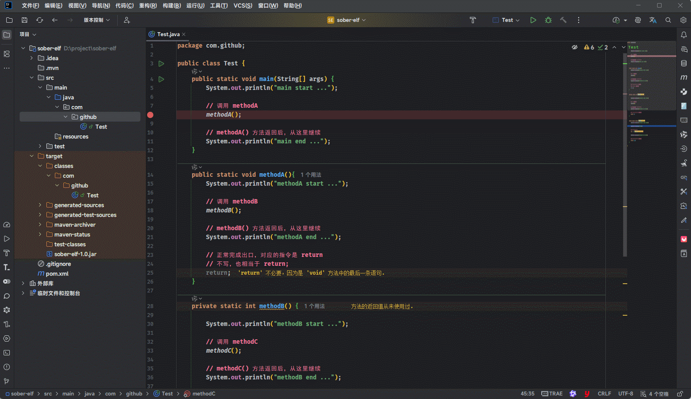
```

```md:img [cmd 控制台]
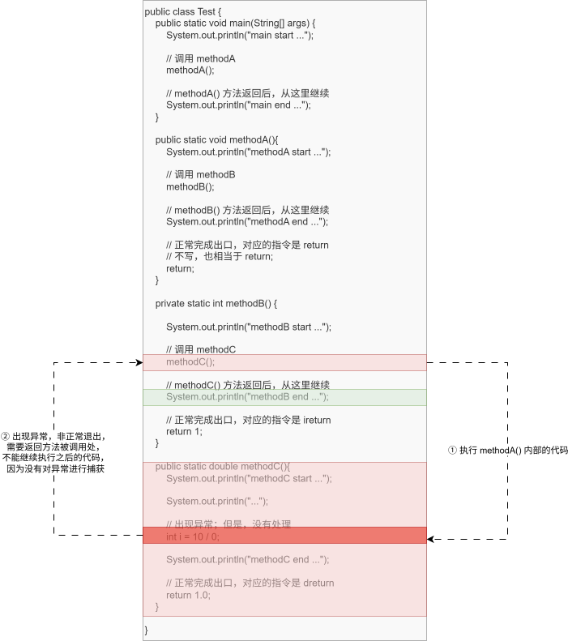
```

:::

##### 3.4.5.3.2 返回地址

* `方法返回地址`是`调用者方法中调用指令的下一条指令的地址`，`被保存在被调用方法的栈帧中`。

> [!NOTE]
>
> * ① 一个方法的结束，有两种方式：
>   * :one: 正常执行完成。
>   * :two: 非正常退出，即：出现异常，但是没有处理。
> * ② 无论那种方式退出，在方法退出后都应该返回到该方法被调用的位置：
>   * :one: 如果是正常退出，调用者的 PC 寄存器的值作为返回地址，即：调用该方法指令的下一条指令的地址。
>   * :two: 如果异常退出，返回地址是通过异常处理表来确定的；换言之，此时的栈帧是不会保存这部分信息的。
> * ③ 当方法执行完，JVM 使用返回地址来设置调用者的 PC 寄存器的值，从而继续执行。
> * ④ 本质上，方法的退出就是当前栈帧出栈的过程。此时，需要恢复上层方法的局部变量表、操作数栈、将返回值压入调用者栈帧的操作数栈、设置 PC 寄存器值等，让调用者的方法继续执行下去。


* 示例：Java 代码、执行结果和对应的字节码指令

::: code-group

```java [Test.java]
public class Test {
    public static void main(String[] args) {
        System.out.println("Step 1");
        foo();                         // ← 调用 foo()
        System.out.println("Step 3");  // ← foo() 返回后，从这里继续！
    }

    public static void foo() {
        System.out.println("Step 2");
    }
}
```

```cmd 
Step 1
Step 2
Step 3
```

```txt [字节码指令]
public static void main(java.lang.String[]);
  Code:
     0: getstatic     #2      // System.out
     3: ldc           #3      // "Step 1"
     5: invokevirtual #4      // println
     8: invokestatic  #5      // foo() ← 调用 foo()，下一条指令是 11
    11: getstatic     #2      // System.out ← ★返回地址指向这里★
    14: ldc           #6      // "Step 3"
    16: invokevirtual #4      // println
    19: return

public static void foo();
  Code:
     0: getstatic     #2      // System.out
     3: ldc           #7      // "Step 2"
     5: invokevirtual #4      // println
     8: return                 // ← 执行 return，触发“返回操作”
```

```md:img [cmd 控制台]
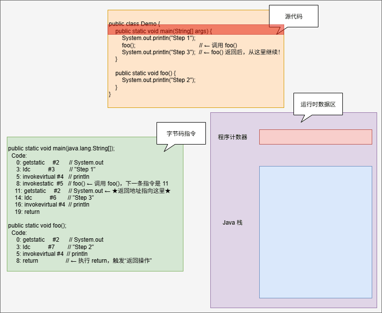
```

:::

#### 3.4.5.4 附加信息

* 栈帧中还允许携带和 JVM 相关的一些附加信息，如下所示：

| 栈帧中的附加信息   | 描述                                  |
| ------------------ | ------------------------------------- |
| 调试信息           | 行号、变量名等，用于调试器            |
| 性能监控数据       | 方法执行时间、调用次数，用于 Profiler |
| JIT 编译相关元数据 | ...                                   |
| 异常处理表         | ...                                   |

## 3.5 内存溢出（Java虚拟机栈）

### 3.5.1 概述

* `Java虚拟机栈`中的`栈帧`过多，占用内存超过`栈内存`可以分配的最大大小就会出现`内存溢出`。


* `JVM`给`虚拟机栈`分配内存有一个上限，如果超过了这个上限，就会出现`内存溢出`。

> [!NOTE]
>
> * ① 当出现`内存溢出`的时候，JVM 会抛出 StackOverflowError 的错误，并且线程也会停止执行。
> * ② 如果我们不指定栈空间的大小，JVM 将会创建一个`默认大小`的栈，该值取决于操作系统。
>
> | 平台（操作系统） | 默认栈分配的内存空间大小 |
> | ---------------- | ------------------------ |
> | Linux            | 1024 KB（1 MB）          |
> | Windows          | 基于操作系统的默认值     |
> * ③《Java 虚拟机规范》并未强制要求栈必须是固定大小，它允许实现支持动态扩展或收缩。
> * ④ HotSpot 选择使用固定大小的栈，出于性能和实现简单性的考虑，即：HotSpot JVM 的栈在运行时是“固定大小”的（一旦线程创建，其栈空间就分配好了，不会自动增长）。
>   * 如果方法调用深度超过栈容量，会抛出 **`StackOverflowError`**。
>   * 如果系统无法为新线程分配足够的栈空间（受 `-Xss` 和系统内存限制），会抛出 **`OutOfMemoryError: unable to create new native thread`**。

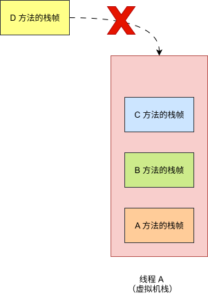


* 示例：查询默认的栈大小

::: code-group

```bash
java -XX:+PrintFlagsFinal -version | grep ThreadStackSize
```

```md:img [Linux]
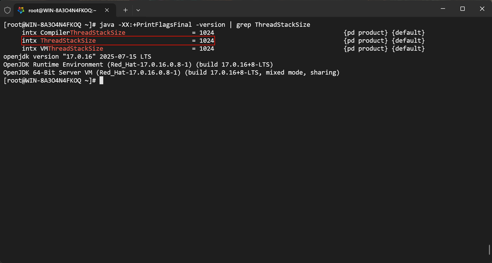
```

```md:img [Windows]
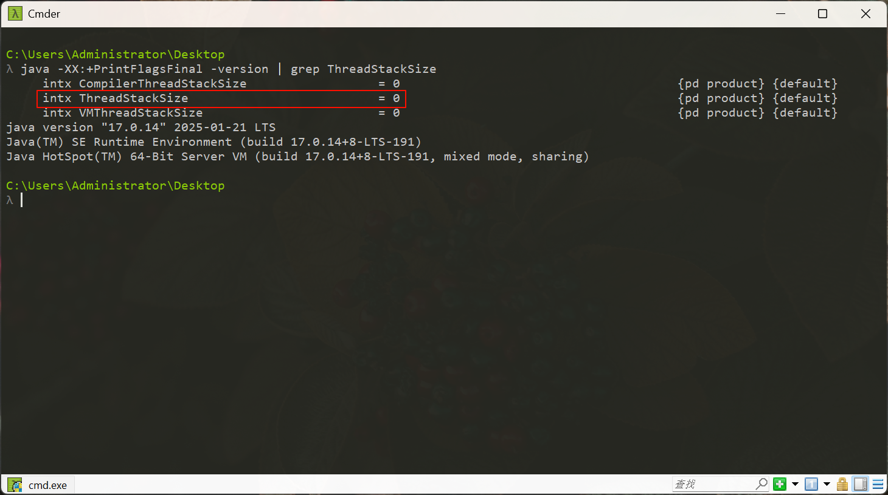
```

:::

### 3.5.2 模拟栈内存溢出

* 需求：使用`递归`让方法自身调用自己，无需设置退出条件。

> [!NOTE]
>
> * ① 定义调用次数的变量，每调用一次让变量 +1 。
> * ② 查看错误发生时的总调用次数。


* 示例：

::: code-group

```java [Test.java]
package com.github;

public class Test {
    
    private static int count = 0;

    public static void main(String[] args) {
        recursion();
    }

    /**
     * 递归
     */
    public static void recursion(){
        System.out.println(++count);
        recursion();
    }
}
```

```md:img [cmd 控制台]
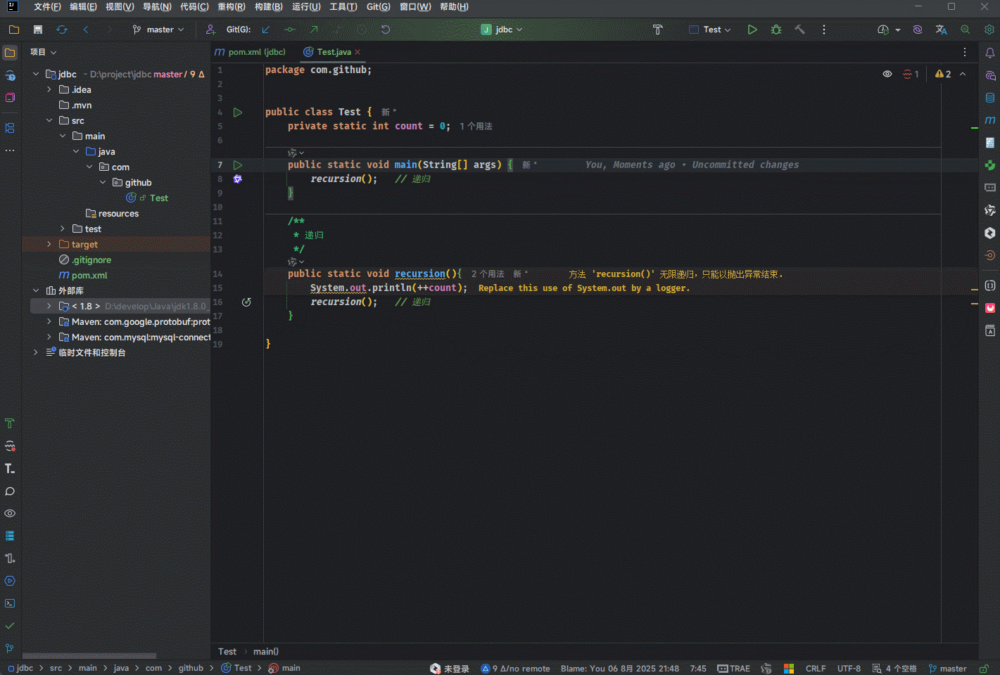
```

:::

### 3.5.3 手动设置大小

* 可以通过修改 JVM 参数，达到修改`Java虚拟机栈`大小的目的。
* 语法：

```java
-Xss栈大小
```

> [!NOTE]
>
> * ① 单位：字节（默认，必须是 1024 的整数倍）、k或者K(KB)、m或者M(MB)、g或者G(GB) 。
> * ② 和`-Xss`类似，也可以使用`-XX:ThreadStackSize`来配置堆栈大小，如：`-XX:ThreadStackSize=1024`。
> * ③ HotSpot JVM 对栈大小的最大值和最小值有要求：
> 
> | 操作系统 | JDK 版本 | 位数  | 测试最小值 | 测试最大值 |
> | -------- | -------- | ----- | ---------- | ---------- |
>| Windows  | JDK 8    | 64 位 | 180 KB     | 1024 MB    |
> 
> * ④ 局部变量过多、操作数栈深度过大也会影响栈内存的大小。

> [!TIP]
>
> * ① 一般情况下，工作中即便使用了递归进行操作，栈的深度最多也只能到几百，不会出现栈的溢出。
> * ② 参数可以手动指定为 -Xss256k 节省内存；但是，通常不需要设置。


* 示例：IDEA 配置 JVM 参数来调整栈大小

::: code-group

```bash
-Xss1024m
```

```java [Test.java]
package com.github;


public class Test {
    
    private static int count = 0;

    public static void main(String[] args) {
        recursion();
    }

    /**
     * 递归
     */
    public static void recursion(){
        System.out.println(++count);
        recursion();
    }
}
```

```md:img [cmd 控制台]
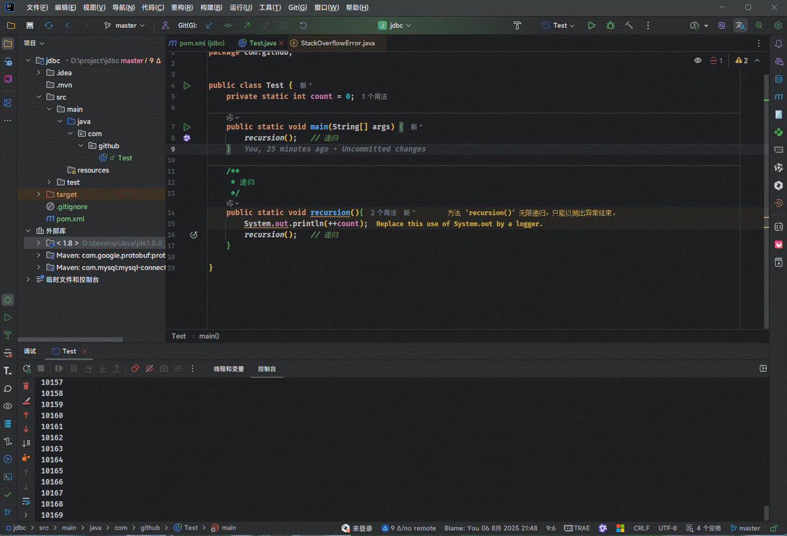
```

:::


# 第四章：本地接口

## 4.1 概述


# 第五章：本地方法栈

## 5.1 概述

* `Java虚拟机栈`存储了 Java 方法调用时的栈帧，而`本地方法栈`存储的是 native 方法的栈帧。

> [!NOTE]
>
> * ① 在 Hotspot 虚拟机中，`Java虚拟机栈`和`本地方法栈`实现上使用了同一个栈空间。
>
> * ② `本地方法栈`会在栈内存上生成一个栈帧，包含了`局部变量表`、`操作数栈`以及`帧数据`。


## 4.2 演示

* 只要使用了 native 关键字修饰的方法就是本地方法，在调用的时候，就会创建本地方法栈。

> [!NOTE]
>
> 在 Hotspot 虚拟机中，`Java虚拟机栈`和`本地方法栈`实现上使用了同一个栈空间。


* 示例：

::: code-group

```java [Test.java]
package com.github;

import java.io.FileNotFoundException;
import java.io.FileOutputStream;
import java.io.IOException;

public class Test {
    public static void main(String[] args){
        try {
            FileOutputStream fileOutputStream = new FileOutputStream("H:\\123.txt");
            fileOutputStream.write(1);
        } catch (FileNotFoundException e) {
            e.printStackTrace();
        } catch (IOException e) {
            e.printStackTrace();
        }
    }

}
```

```md:img [cmd 控制台]
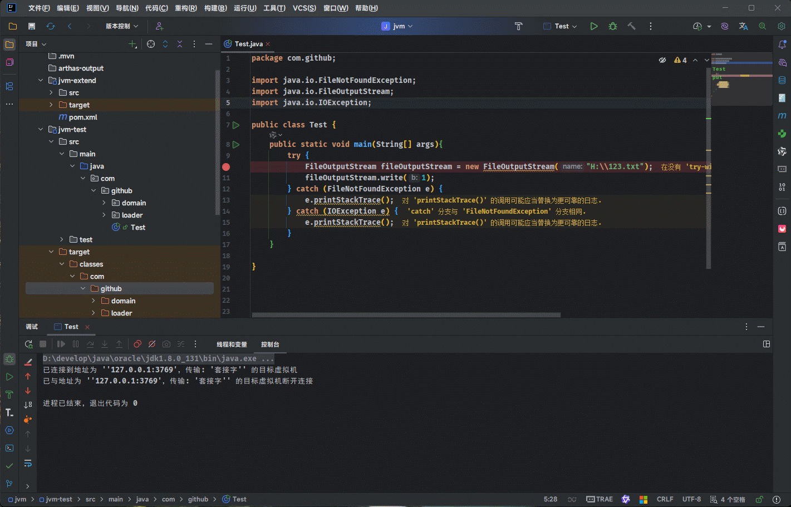
```

:::


