# 第一章：堆内存

## 5.1 概述

* 我们已经学习了`运行时数据区`中的`程序计数器`、`栈`，下面将学习`堆`、`方法区`和`直接内存`。

> [!NOTE]
>
> * ① 线程`不共享`的内存区域有：`程序计数器`、`Java 虚拟机栈`以及`本地方法栈`。
> * ② 线程`共享`的内存区域有：`方法区`、`堆区`以及`直接内存`。


## 5.2 堆内存

* Java 程序中`堆内存`是`内存空间`中最大的一块内存区域，创建出来的对象都是位于`堆内存`中。

> [!NOTE]
>
> * ① `栈`中的`局部变量表`中，可以存放`堆`中`对象`的`引用`。
> * ② `静态变量`也可以存放`堆对象`的`引用`，通过`静态变量`就可以实现对象在线程之间共享。

::: code-group

```java [Student.java]
public class Student {
    String name;
    int age;
    static String teacherName;
    
    public void show() {
        System.out.println("Student{"
                + "name='" + name
                + '\'' + ", age=" + age
                + '\'' + ", teacherName='" + teacherName 
                + '\'' + '}');
    }
}
```

```java [StudentTest.java]
public class StudentTest {
    public static void main(String[] args) {
        Student.teacherName = "苍老师";  

        // 创建第一个对象
        Student s1 = new Student();
        s1.name = "张三";
        s1.age = 18;
        s1.show();

        // 创建第二个对象
        Student s2 = new Student();
        s2.name = "李四";
        s2.age = 20;
        s2.show();
    }
}
```

```md:img [cmd 控制台]
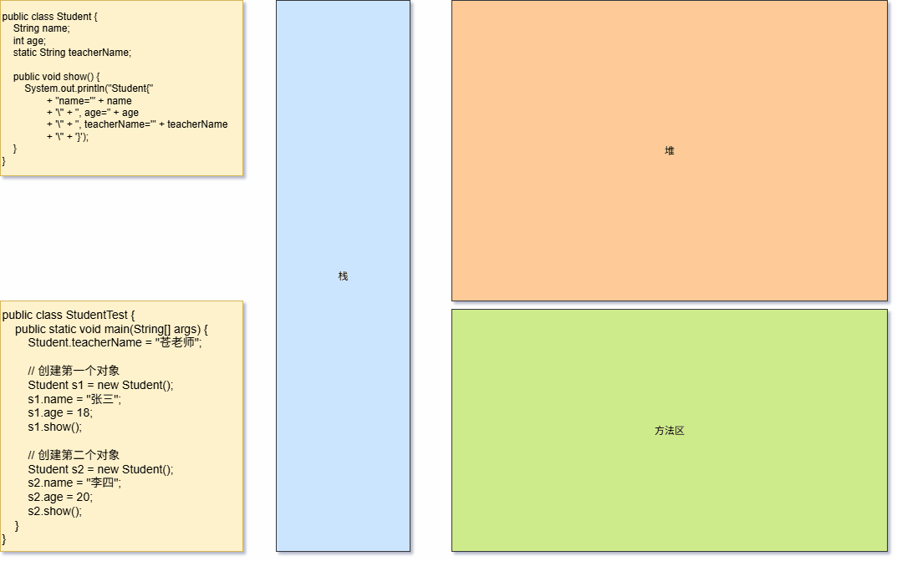
```

:::

## 5.3 内存溢出（堆内存） 

### 5.3.1 模拟堆内存溢出

* 需求：通过 new 关键字不同的创建对象，放入到集合中，观察堆溢出之后的异常信息。

> [!NOTE]
>
> 堆内存大小是有上限的，当一直向堆中放入对象达到上限之后，就会抛出 OutOfMemoryError 错误。


* 示例：

::: code-group

```java [Test.java]
package com.github;

import java.util.ArrayList;
import java.util.List;

public class Test {
    public static void main(String[] args) throws InterruptedException {
        List<Object> objList = new ArrayList<>();
        while (true) {
            objList.add(new byte[1024 * 1024 * 100]);
        }

    }

}
```

```md:img [cmd 控制台]
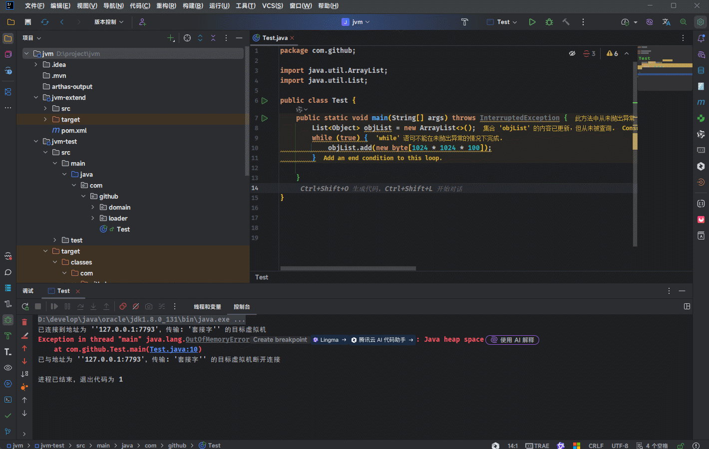
```

:::

### 5.3.2 相关值

* 堆空间有三个需要关注的值，即：used、total 和 max 。

| 堆空间相关值 | 描述                            |
| ------------ | ------------------------------- |
| used         | 当前已经使用的堆内存。          |
| total        | Java 虚拟机分配的可用的堆内存。 |
| max          | Java 虚拟机分配的最大堆内存。   |

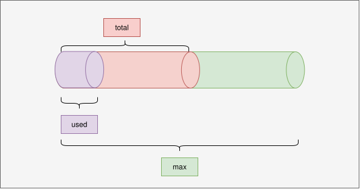

* 我们可以通过 Arthas 来查看这三个值：

::: code-group

```java [Test.java]
package com.github;

import java.io.IOException;
import java.util.ArrayList;
import java.util.List;

public class Test {
    public static void main(String[] args) throws IOException {
        List<Object> objList = new ArrayList<>();
        for (int i = 0; i < 10; i++) {
            objList.add(new byte[1024 * 1024 * 100]);
        }

        System.in.read();
    }

}
```

```bash [Arthas]
# 类似于 Linux 中的 free 命令
memory

 # 类似于 top 或 glances 命令
dashboard -i
```

```md:img [cmd 控制台]
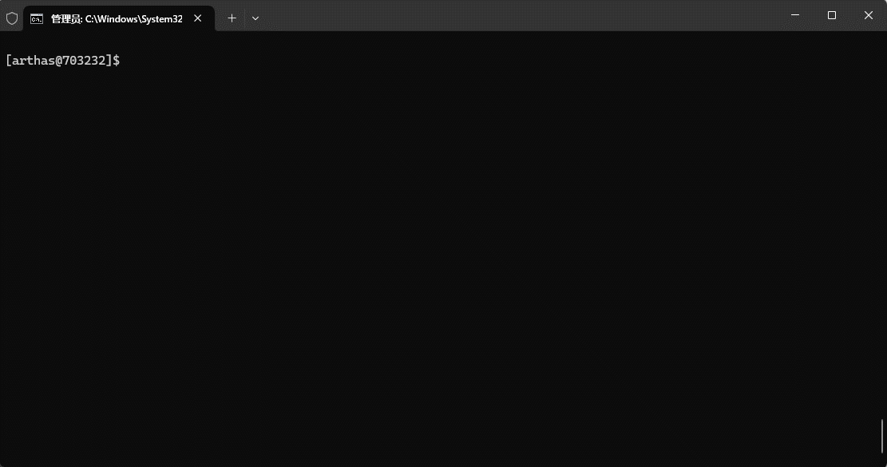
```

:::

* 随着堆中对象的增多，used 会越来越接近于 total ，如下所示：

::: code-group

```java [Test.java]
import java.io.IOException;
import java.util.ArrayList;
import java.util.List;

public class Test {
    public static void main(String[] args) throws IOException {
        List<Object> objList = new ArrayList<>();
        while(true) {
            // 阻塞，直到键盘输入字符为止
            System.in.read();
            objList.add(new byte[1024 * 1024 * 100]);
        }
    }

}
```

```md:img [faq 动态图]
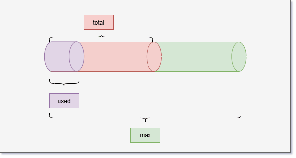
```

```bash [Arthas]
# 类似于 Linux 中的 free 命令
memory

 # 类似于 top 或 glances 命令
dashboard -i
```

```md:img [cmd 控制台]
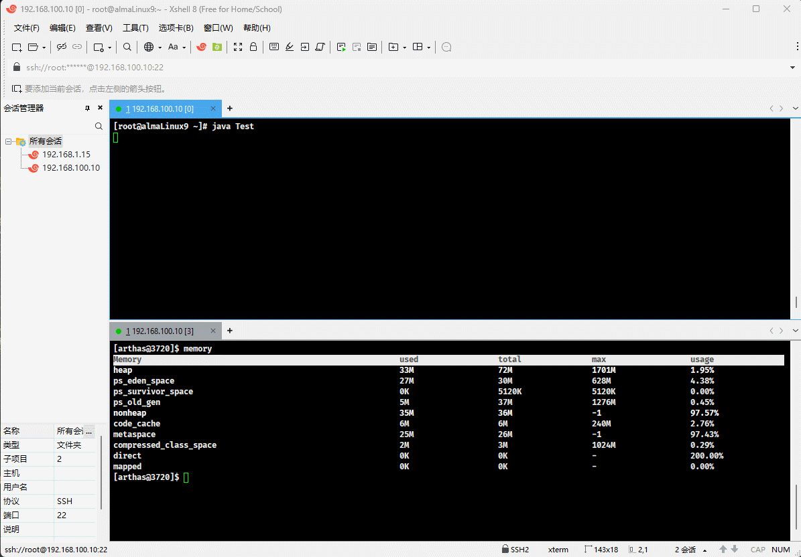
```

:::

* 如果 used 和 total 非常接近，JVM 将继续分配内存给 total，这样就可以继续向堆中增加对象。

::: code-group

```java [Test.java]
import java.io.IOException;
import java.util.ArrayList;
import java.util.List;

public class Test {
    public static void main(String[] args) throws IOException {
        List<Object> objList = new ArrayList<>();
        while(true) {
            // 阻塞，直到键盘输入字符为止
            System.in.read();
            objList.add(new byte[1024 * 1024 * 100]);
        }
    }

}
```

```md:img [faq 动态图]
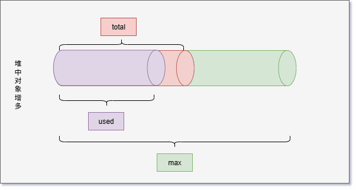
```

```bash [Arthas]
# 类似于 Linux 中的 free 命令
memory

 # 类似于 top 或 glances 命令
dashboard -i
```

```md:img [cmd 控制台]
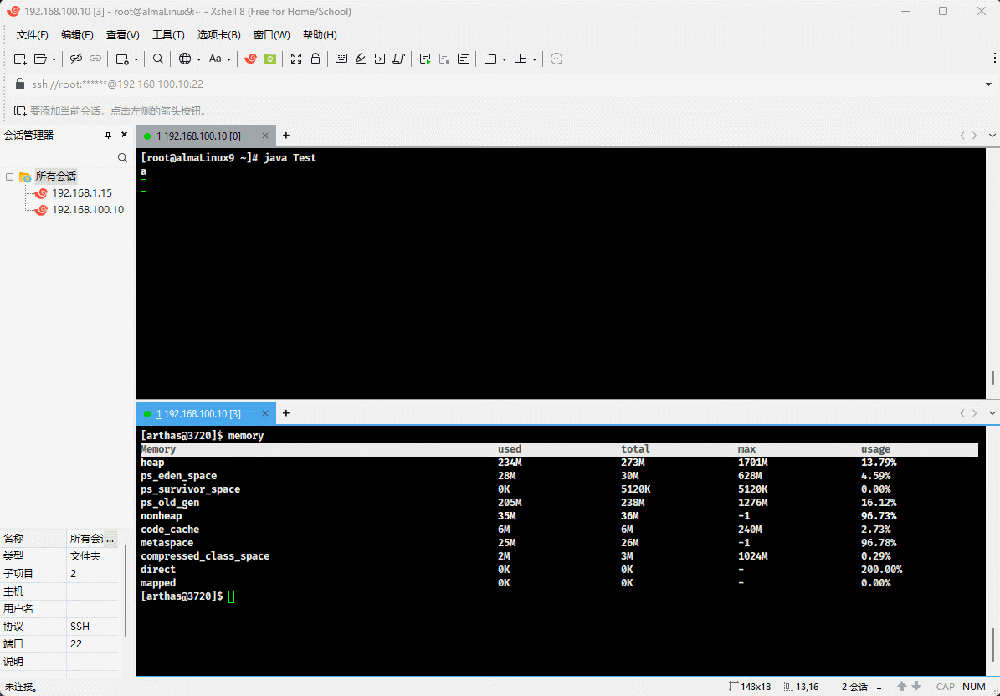
```

:::

* 但是，JVM 并不会一直给 total 分配内存，极限情况就是 used = total = max 。

::: code-group

```java [Test.java]
import java.io.IOException;
import java.util.ArrayList;
import java.util.List;

public class Test {
    public static void main(String[] args) throws IOException {
        List<Object> objList = new ArrayList<>();
        while(true) {
            // 阻塞，直到键盘输入字符为止
            System.in.read();
            objList.add(new byte[1024 * 1024 * 10]);
        }
    }

}
```

```md:img [faq 动态图]
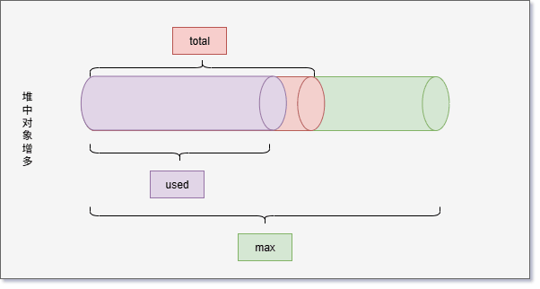
```

```bash [Arthas]
# 类似于 Linux 中的 free 命令
memory

 # 类似于 top 或 glances 命令
dashboard -i
```

```md:img [cmd 控制台]
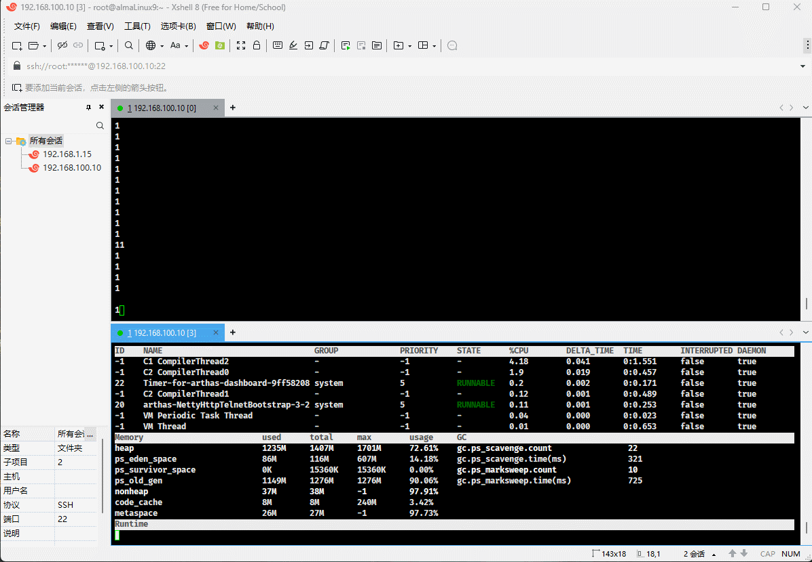
```

:::

### 5.3.3 细节

* 【问】如果 used = total = max 的时候，堆内存就开始内存溢出？
* 【答】不是，`堆内存`出现`内存溢出`的判断条件比较复杂，在《垃圾回收》中有详细的介绍。

### 5.3.4 细节

* 【问】为什么 Arthas 中显示的 heap 堆大小和设置的值不一样？
* 【答】Arthas 中的 heap 堆内存使用了 JMX 技术来获取的，这种方式和垃圾回收器有关，计算的是可以分配对象的内存，而不是总内存。

### 5.3.5 默认堆内存大小

* 默认情况下，max 是系统内存的 1/4，total 是系统内存的 1/64 。

> [!NOTE]
>
> * ① [文档地址](https://docs.oracle.com/javase/8/docs/technotes/guides/vm/gctuning/ergonomics.html)。
> * ② 在实际应用中一般都需要设置 total 和 max 的值。


* 示例：

::: code-group

```bash
java -XX:+PrintFlagsFinal -version | grep -i HeapSize
```

```md:img [cmd 控制台]
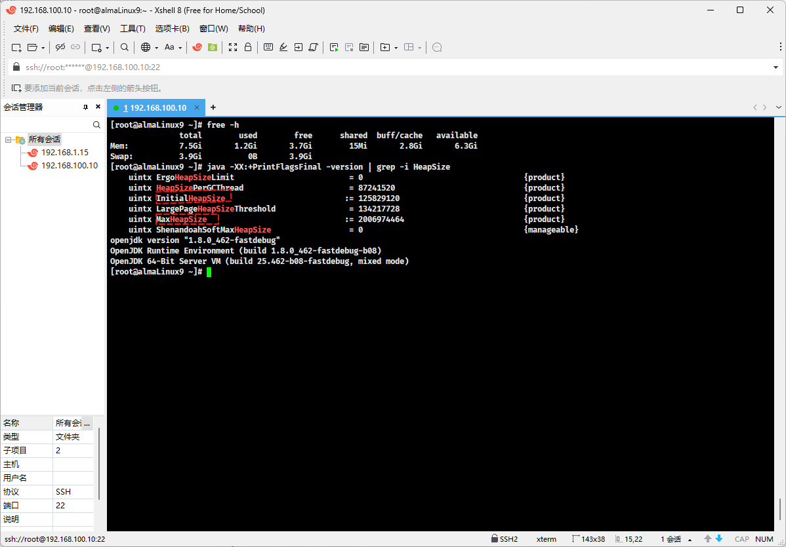
```

:::

### 5.3.6 手动设置大小

* 可以使用 JVM 参数来修改堆内存大小。
* 语法：

```java
// 初始 total
-Xms值 
// max 最大值    
-Xmx值
```

> [!NOTE]
>
> * ① 单位：字节（默认，必须是 1024 的整数倍）、k或者K(KB)、m或者M(MB)、g或者G(GB) 。
> * ② 和`-Xms`类似，也可以使用`-XX:InitalHeapSize`来配置堆大小，如：`-XX:InitalHeapSize=1024`。
> * ③ 和`-Xmx`类似，也可以使用`-XX:MaxHeapSize`来配置堆大小，如：`-XX:MaxHeapSize=1024`。
> * ④ -Xms 必须大于 1MB；而 -Xms 必须大于 2 MB。
>

> [!TIP]
>
> * ① Java 服务端程序开发时，建议将 `-Xmx` 和 `-Xms` 设置为相同的值，这样在程序启动之后可使用的总内存就是最大内存，而无需向 JVM 再次申请，减少了申请并分配内存时间上的开销，同时也不会出现内存过剩之后堆收缩的情况。
> * ② `-Xmx` 具体设置的值与实际的应用程序运行环境有关，在《实战篇》中会给出设置方案。


* 示例：IDEA 配置 JVM 参数来调整堆大小

::: code-group

```bash
-Xms1g -Xmx1g
```

```java [Test.java]
package com.github;

import java.io.IOException;
import java.util.ArrayList;
import java.util.List;

public class Test {
    public static void main(String[] args) throws IOException {
        List<Object> objList = new ArrayList<>();
        while (true){
            System.in.read();
            objList.add(new byte[1024 * 1024 * 100]);
        }
    }

}
```

```md:img [cmd 控制台]
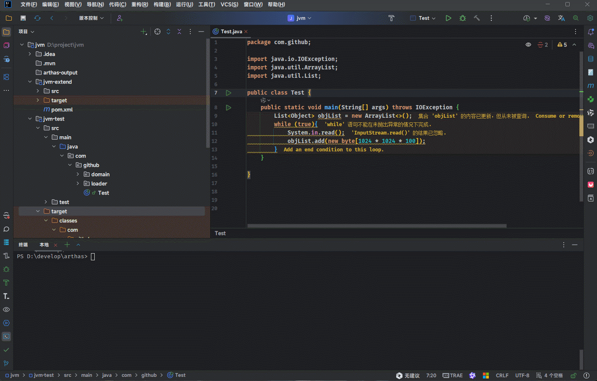
```

:::


# 第二章：方法区

## 6.1 概述

* 我们已经学习了`运行时数据区`中的`程序计数器`、`栈`，下面将学习`堆`、`方法区`和`直接内存`。

> [!NOTE]
>
> * ① 线程`不共享`的内存区域有：`程序计数器`、`Java 虚拟机栈`以及`本地方法栈`。
> * ② 线程`共享`的内存区域有：`方法区`、`堆区`以及`直接内存`。

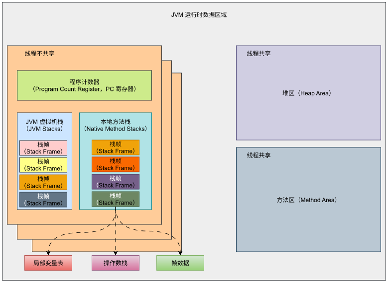

* 方法区中存放了`类的元信息`、`运行时常量池`以及`字符串常量池`：

| 方法区中的内容 | 描述                             |
| -------------- | -------------------------------- |
| ① 类的元信息   | 保存了所有类的基本信息。         |
| ② 运行时常量池 | 保存了字节码文件中的常量池内容。 |
| ③ 字符串常量池 | 保存了字符串常量。               |

## 6.2 保存类的元信息

* 方法区可以用来保存每个类的`基本信息`（元信息），通常称之为`Instanceklass`对象。

> [!NOTE]
>
> * ① 在类加载阶段，`JVM`通过`类加载器`将类字节码信息读取到内存中，并创建名为`Instanceklass`的对象。
> * ② 字节码信息中的基本信息，常量池、字段、属性、虚方法表全部保存在`Instanceklass`对象中。

> [!CAUTION]
>
> * ① 像常量池、方法等信息在虚拟机实现中，并不是存放在`Instanceklass`对象中。
> * ② 在虚拟机底层实现中，会使用单独的一块内存区域去存放，即：在`Instanceklass`对象中只是存放了它们的引用。

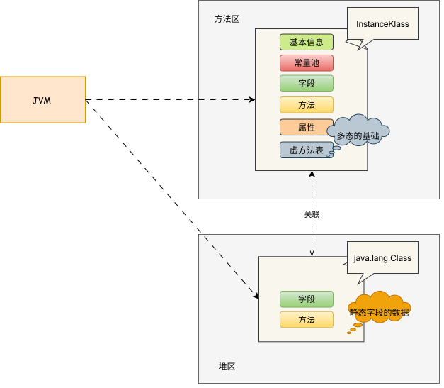

## 6.3 运行时常量池

* 字节码文件中通过`编号`表的的方式找到常量（符号引用），这种常量池称为`静态常量池`。


* 当静态常量池加载到内存之后，可以通过内存地址快速的定位到常量池中的内容，这种常量池称为`运行时常量池`。

> [!NOTE]
>
> * ① 其实，就是在`加载`和`链接`阶段，将`符号引用`替换为`直接引用`（内存地址），以便提高程序的性能。
>
> * ② 方法区中除了存放类的元信息之外，还存放了运行时常量池，其主要用来提升性能。

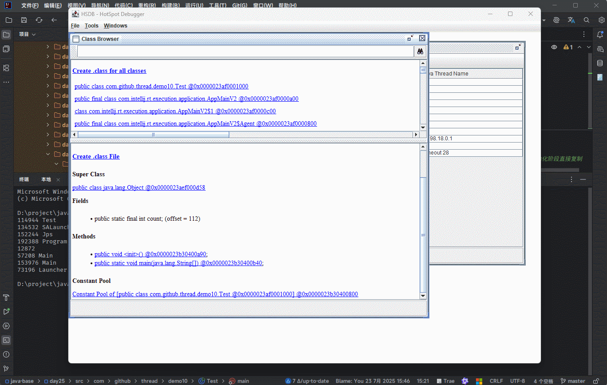

## 6.4 方法区的具体表现

### 6.4.1 概述

* 方法区是《[JVM虚拟机规范](https://docs.oracle.com/javase/specs/jvms/se17/html/jvms-2.html#jvms-2.5)》中设计的虚拟概念，不同的 JVM 在实现上各有不同。

> [!NOTE]
>
> 不同版本的 Hotspot （默认的 JVM）的实现也是不一样！！！

| JDK 版本         | 描述                                                         | 备注                                                   |
| ---------------- | ------------------------------------------------------------ | ------------------------------------------------------ |
| 1.7 以及之前版本 | `方法区`存放在堆区中的`永久代`空间。                         | 堆的大小由虚拟机参数来空间。                           |
| 1.8 以及之后版本 | `方法区`是存放在`元空间`中的，元空间使用的是本地内存（Native Memory），不受对堆空间大小限制。 | 默认情况下只要不超过操作系统承受的上限，可以一直分配。 |

* 其实`方法区`和`永久代`或者`元空间`相当于 Java 中的`类`和接口的关系，即：

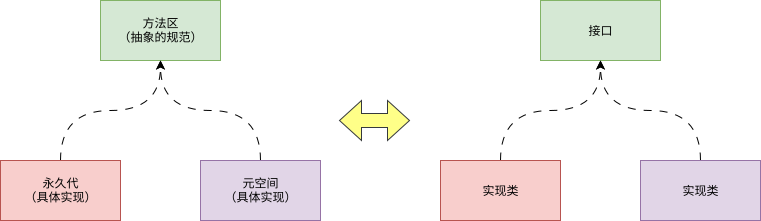

* 那么，JDK7 中的方法区就是这样的，如下所示：

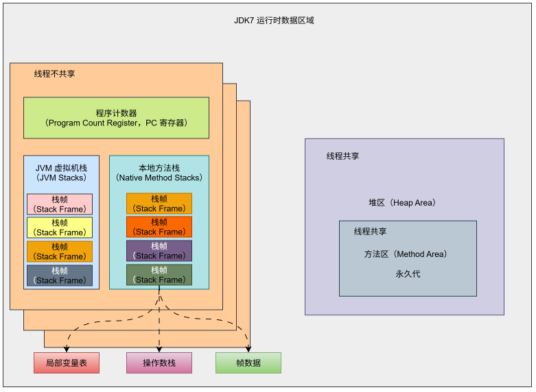

* 那么，JDK8 中的方法区就是这样的，如下所示：

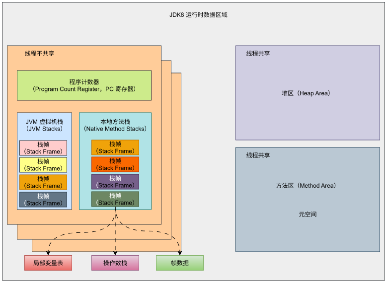

### 6.4.2 Arthas 中查看方法区

* 可以使用 Arthas 中的 `memory` 命令查看方法区的具体实现。

> [!NOTE]
>
> * ① 本人已经将对应版本的 JDK 和 Arthas 通过 Docker 封装到一起并推送到 Docker Hub 中。
> * ② 我们只需要运行 Dokcer 容器就可以查看到结果。


* 示例：JDK 7 的永久代

::: code-group

```txt [结果] {9}
[arthas@40]$ memory | plaintext
Memory                            used        total      max         usage
heap                              38M         246M       455M        8.57%
ps_eden_space                     17M         64M        150M        11.94%
ps_survivor_space                 10M         10M        10M         99.87%
ps_old_gen                        10M         171M       341M        3.10%
nonheap                           17M         23M        130M        13.75%
code_cache                        718K        2496K      49152K      1.46%
ps_perm_gen                       17M         21M        82M(有上限)  20.94%
direct                            0K          0K         -           0.00%
mapped                            0K          0K         -           0.00%
```

```bash
docker run --rm aurorxa/jdk7-jvm:latest
```

```md:img [cmd 控制台]
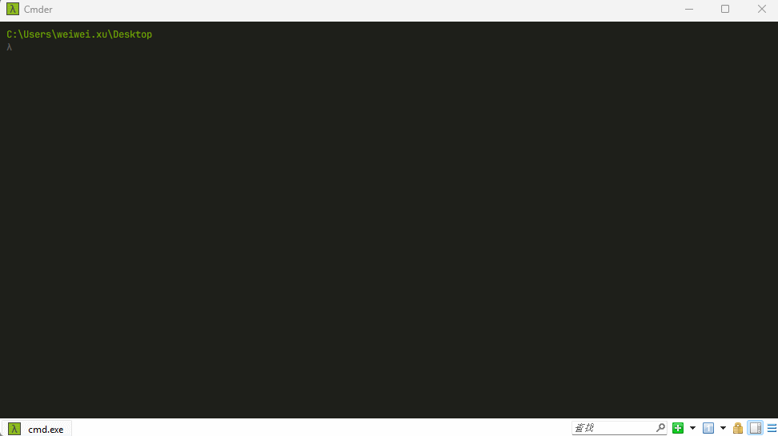
```

:::


* 示例：JDK8 的元空间

::: code-group

```txt [结果] {9}
[arthas@50]$ memory | plaintext
Memory                            used        total      max         usage
heap                              52M         245M       455M        11.52%
ps_eden_space                     33M         64M        149M        22.62%
ps_survivor_space                 0K          10752K     10752K      0.00%
ps_old_gen                        18M         171M       341M        5.46%
nonheap                           34M         35M        -1          97.63%
code_cache                        7M          7M         240M        2.93%
metaspace                         24M         25M        -1(无上限)   97.54%
compressed_class_space            2M          3M         1024M       0.28%
direct                            0K          0K         -           0.00%
mapped                            0K          0K         -           0.00%
```

```bash
docker run --rm aurorxa/jdk8-jvm:latest
```

```md:img [cmd 控制台]
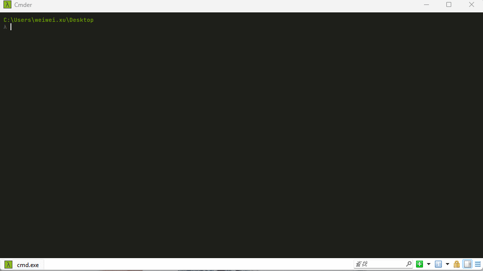
```

:::

### 6.4.3 模拟方法区溢出

* 需求：通过 ByteBuddy 框架，动态生成字节码数据，并通过死循环加载到方法区中，观察方法区中是否有内存溢出。

> [!NOTE]
>
> ::: details 点我查看 ByteBuddy 的使用
>
> * ① 导入依赖坐标：
>
> ```xml
> <dependency>
>     <groupId>net.bytebuddy</groupId>
>     <artifactId>byte-buddy</artifactId>
>     <version>1.17.6</version>
> </dependency>
> ```
>
> * ② 创建 ClassWriter 对象：
>
> ```java
> ClassWriter classWriter = new ClassWriter(0);
> ```
>
> * ③ 调用 visit 方法，创建字节码数据：
>
> ```java
> classWriter.visit(Opcodes.V1_7, Opcodes.ACC_PUBLIC, "类的全限定名",
>         null, "java/lang/Object", null);
> byte[] byteArray = classWriter.toByteArray();
> ```
>
> :::


* 示例：JDK7 的测试

::: code-group

```java [Main.java]
package com.github;

import net.bytebuddy.jar.asm.ClassWriter;
import net.bytebuddy.jar.asm.Opcodes;

public class Main {
    // 自定义类加载器
    static class ByteClassLoader extends ClassLoader {
        public Class<?> defineClass(String name, byte[] b) {
            return defineClass(name, b, 0, b.length);
        }
    }
    public static void main(String[] args) throws Exception {
        int count = 0;
        ByteClassLoader loader = new ByteClassLoader();
        while (true) {
            String name = "Class" + count;
            ClassWriter classWriter = new ClassWriter(0);
            classWriter.visit(Opcodes.V1_7, Opcodes.ACC_PUBLIC, name,
                    null, "java/lang/Object", null);
            byte[] byteArray = classWriter.toByteArray();
            loader.defineClass(name.replace("/", "."), byteArray);
            System.out.println(++count);
        }
    }
}
```

```md:img [cmd 控制台]
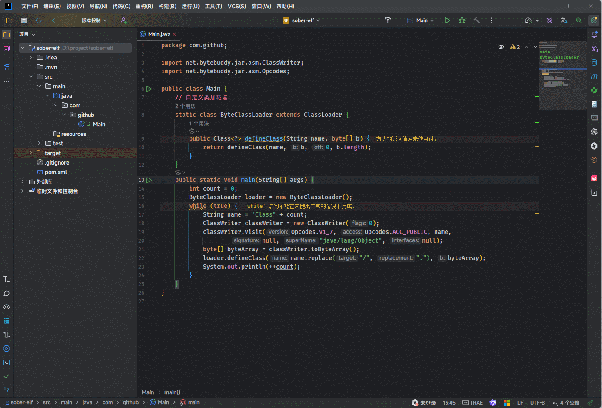
```

:::


* 示例：JDK8 的测试

::: code-group

```java [Main.java]
package com.github;

import net.bytebuddy.jar.asm.ClassWriter;
import net.bytebuddy.jar.asm.Opcodes;

public class Main {
    // 自定义类加载器
    static class ByteClassLoader extends ClassLoader {
        public Class<?> defineClass(String name, byte[] b) {
            return defineClass(name, b, 0, b.length);
        }
    }
    public static void main(String[] args) {
        int count = 0;
        ByteClassLoader loader = new ByteClassLoader();
        while (true) {
            String name = "Class" + count;
            ClassWriter classWriter = new ClassWriter(0);
            classWriter.visit(Opcodes.V1_8, Opcodes.ACC_PUBLIC, name,
                    null, "java/lang/Object", null);
            byte[] byteArray = classWriter.toByteArray();
            loader.defineClass(name.replace("/", "."), byteArray);
            System.out.println(++count);
        }
    }
}
```

```md:img [cmd 控制台]
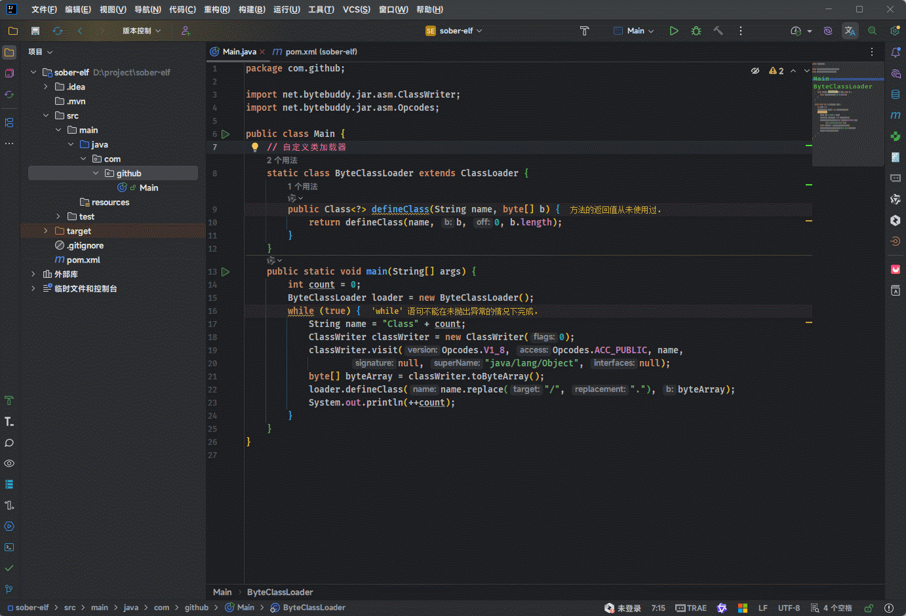
```

:::

### 6.4.4 方法区溢出总结

* 通过实验，我们不难发现这样的结果：
  * ① JDK7 上在方法区中短时间加载 11 万个字节码信息，就出现了永久代错误。
  * ② JDK8 上在方法区中短时间加载百万次个字节码信息，程序也没有出现错误；但是，内存会直线升高。

* JDK7 是将`方法区`存放在`堆区中的永久代空间`，堆的大小可以通过虚拟机参数`-XX:maxPermsize=值`来控制。


* JDK8 是将`方法区`存放在`元空间`中，元空间是在进程地址空间中，默认情况下只要不超过操作系统的上限，可以一致分配，并且可以使用`-XX:MaxMetaspaceSize=值`来限制元空间的大小。

> [!NOTE]
>
> * ① 在实际开发中，一台服务器上可能会部署多个程序，如：Java 进程、MySQL 服务以及 Redis 服务等。
> * ② 如果 Java 程序在`方法区`处理上出现了问题，如：不停地将字节码信息加载到方法区，将会导致 Java 进程的内存逐渐升高，当到达操作系统内存上限的时候，将使得其他程序出现内存不足而停止工作。


## 6.5 字符串常量池

### 6.5.1 概述

* 方法区中除了类的元信息、运行时常量池之外，还有一块区域叫做`字符串常量池`。
* `字符串常量池` 是 JVM 为了提升性能和减少内存消耗针对字符串（String 类）专门开辟的一块区域，主要目的是为了避免字符串的重复创建。

### 6.5.2 演示

* `字符串常量池`中存储的是代码中定义的常量字符串，如下所示：

::: code-group

```java [Test.java]
public class Test {
    public static void main(String[] args) {
        String str = "aaa"; // "aaa" 就是常量字符串
        String str2 = "aaa";
        System.out.println(str == str2);
    }
}
```

```md:img [cmd 控制台]
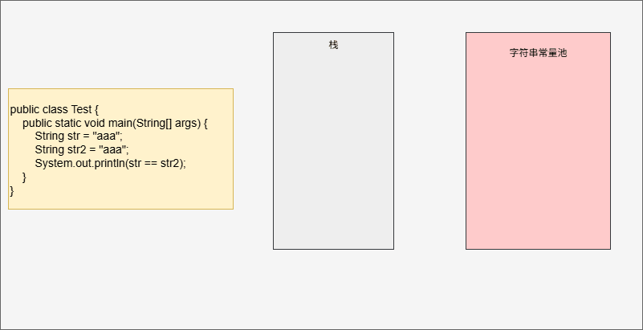
```

:::

* 但是，如果使用了 new 关键字，还会在堆中保存一份，如下所示：

::: code-group

```java [Test.java]
public class Test {
    public static void main(String[] args) {
        String str = new String("aaa"); // 会在堆中和字符串常量池中各保存一份
        String str2 = "aaa";
        System.out.println(str == str2);
    }
}
```

```md:img [cmd 控制台]
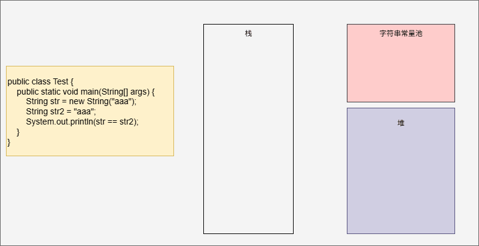
```

:::

### 6.5.3 字符串常量池的演变

* 在 JDK6 中，`字符串常量池`、`运行时常量池`、`静态变量`和`JIT 缓存`等在`方法区`中，而`方法区`中是在`堆`中的`永久代`。

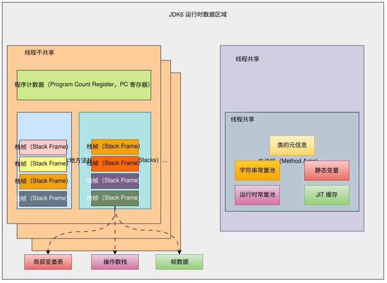

* 在 JDK7 中，`静态变量`和`字符串常量池`从`永久代`中移除，迁移到`堆`中。

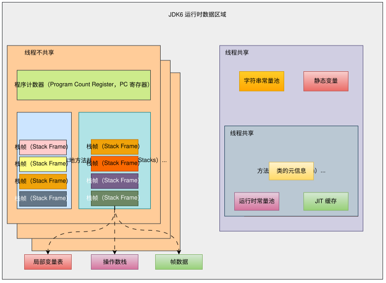

* 在 JDK8 中，将`方法区`的实现由`永久代`改为`元空间`，`静态变量`和`字符串常量池`还在`堆`中。

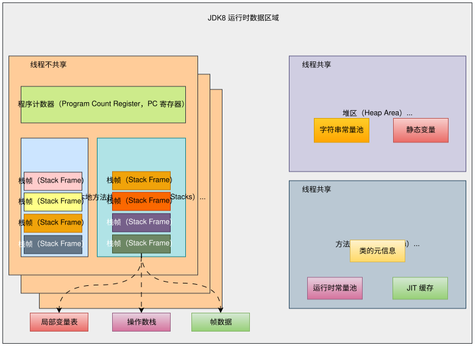


# 第三章：对象的实例化内存布局和访问定位


# 第四章：直接内存

## 7.1 概述

* 众所周知，当今世界上绝大部多数操作系统（Win、Linux 等）都是使用 C/C++ 语言编写的。

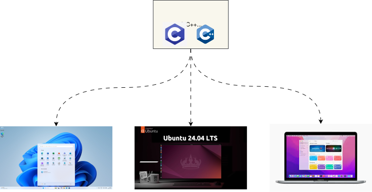

* 目前的操作系统都是`多用户`、`多任务`、`图形化`、`网络化`的操作系统。

> [!NOTE]
>
> 所谓的`多任务`就是支持运行多个应用程序（进程）。

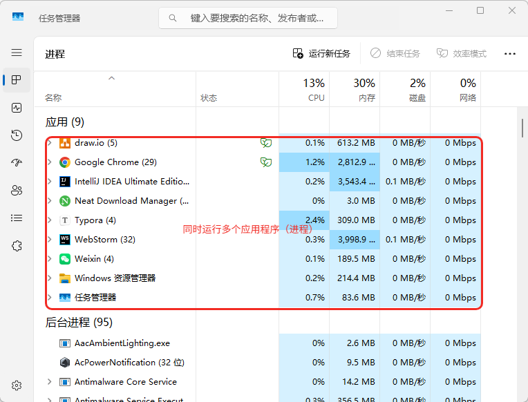

* 如果你学习过 C 程序，那么一定知道可以通过`&`运算符来获取变量的内存地址，如下所示：

```java
#include <stdio.h>

// 全局变量
int a = 10;
int b = 20;

int main() {

    // 禁用 stdout 缓冲区
    setbuf(stdout, nullptr);

    printf("a = %p\n", &a); // a = 0x55fda7351010
    printf("b = %p\n", &b); // b = 0x55fda7351014

    return 0;
}
```

* 其实上述的内存地址都不是真实的物理地址，而是虚拟的地址（虚地址）。

> [!NOTE]
>
> * ① 虚拟地址（虚地址）需要通过 CPU 内部的 MMU（Memory Management Unit，内存管理单元）来将这些虚拟地址（虚地址）转换为物理地址（实地址）。
> * ② 如果没有虚拟地址，将会带来以下的问题：
>   * 进程间隔离实现困难。
>   * 不利于程序员管理内存。
>   * 内存碎片化无可避免、导致内存利用率低下。
>   * 无法共享内存。
>   * 复杂性很高，难以实现。
> * ③ 如果存在虚拟地址，那么`站在一个进程的角度来说`，它所“看到”的是操作系统为其分配的一片连续的虚拟内存空间，进程获取的内存地址不是真实的物理内存地址（实地址），而是虚拟内存空间的地址（虚地址）。换言之，对于每个进程，它都认为自己完全拥有了整台计算机，并使用了整台计算机的资源，这样的设计使得内存管理的复杂性大大的降低（对程序员来说是降低）。

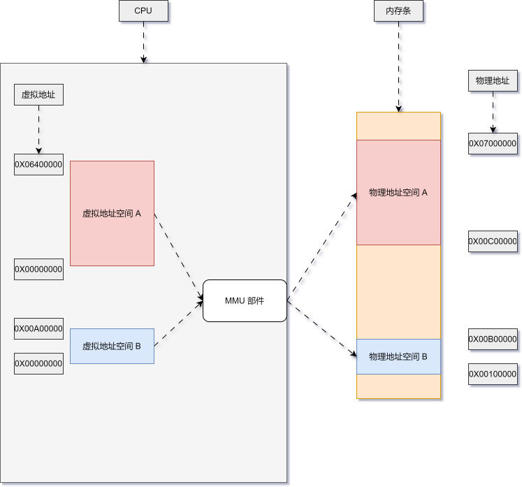

* 为了更好的管理程序，操作系统将虚拟地址空间分为了不同的内存区域，这些内存区域存放的数据、用途、特点等皆有不同。

> [!NOTE]
>
> `存储式程序`中的`程序`分为`指令`和`数据`；其中，`代码段`中保存的是`指令`，`数据段`中保存的是`数据`。

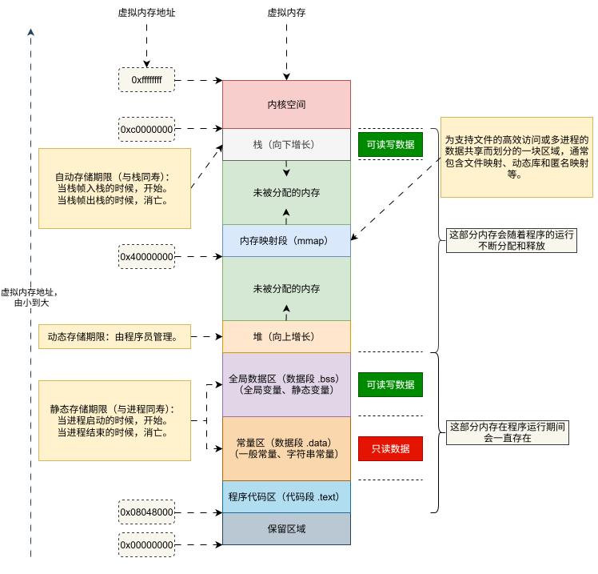

* Java 程序运行在 JVM 之上，JVM 是使用 C++ 来编写的，即：`运行时数据区域`就在 JVM 的堆中。

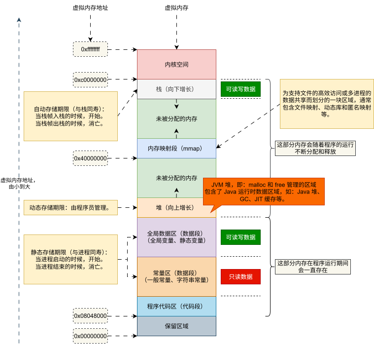

* 其实，从操作系统的视角，JVM 进程的虚拟地址空间的内容就是这样的：

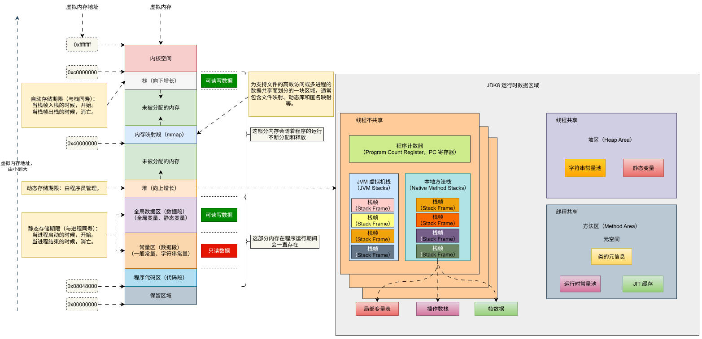

* 但是，Java 中的线程是通过 JNI 调用的 C++ 层实现的，即：本地线程栈，如下所示：

> [!NOTE]
>
> * ① Java 进程占用的内存（Java Memory/JVM Memory），即：JVM 向操作系统申请的内存，包括：方法区、Java 堆内存（Java Heap/Heap Memory）、线程栈、JVM 代码段、JVM 数据段等。 
> * ② 本地内存：Java 进程占用的内存（Java Memory/JVM Memory）- Java 堆内存（Java Heap/Heap Memory），如：元空间（MetaSpace）、线程栈、JVM 代码端、GC 、JNI 等。
> * ③ JVM 通过 malloc 等申请的堆内存也被称为本地堆（Native Heap）和 Java 对象运行的堆内存（Java Heap/Heap Memory）是不一样的。

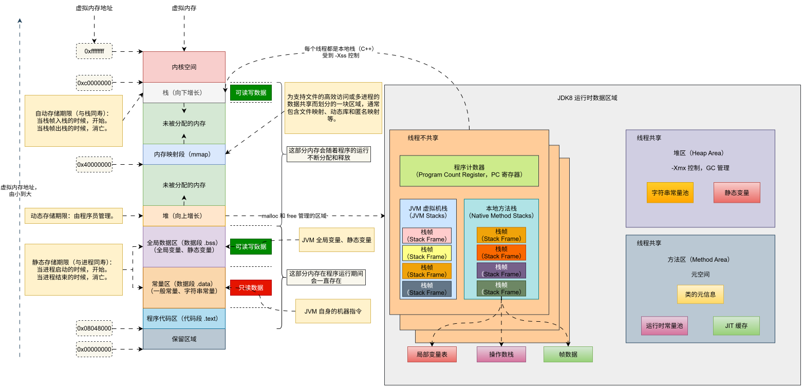

* 当我们在 Arthas 中通过 `memory` 命令查看内存时，会出现如下的结果：

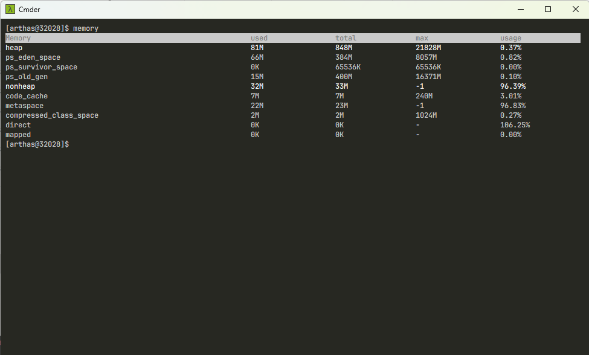

* 这是因为对于 Java 程序而言，除了`堆内存`之外，还有`本地内存`（堆外内存），如下所示：

```markmap
# Java 程序（Java Memory）

## 堆内存（Heap Memory）
### 年轻代
#### 伊甸园
#### s0 幸存者区
#### s1 幸存者区
### 老年代

## 本地内存（Native Memory）
### 元空间（Metaspace）
### 线程栈（Threads）
### 代码缓存（Code Cache）
### 直接内存（DirectBuffer）
### GC
### JNI
```


## 7.2 直接内存

### 7.2.1 概述

* 在 JDK1.4 中引入了 NIO 机制，就是使用了直接内存（Direct Memory），如下所示：

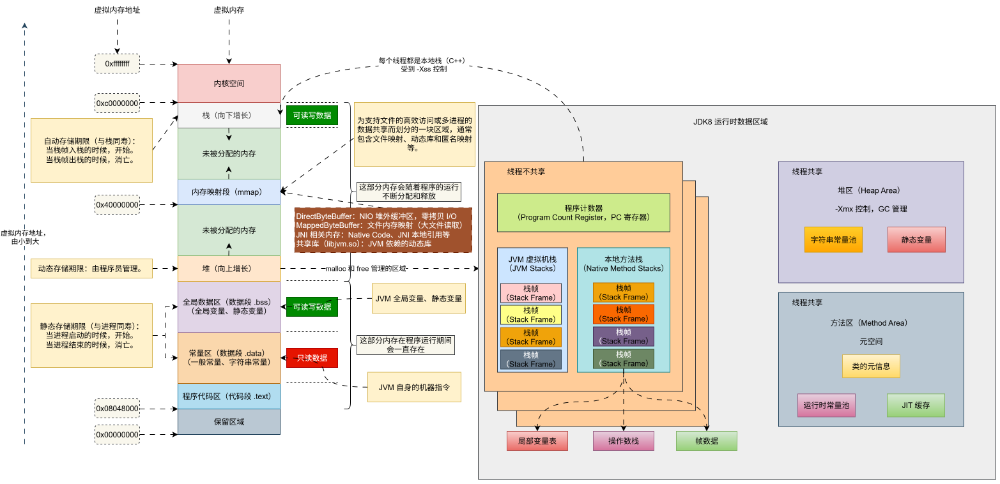

* 其主要解决了以下两个问题：
  * :one: Java 堆中的对象，如果不再使用会被 GC 回收，如果此时用户正在使用系统，正好出现 JVM 去回收堆中不再使用的对象，整个回收的过程，可能会导致用户在使用的过程中，感觉卡顿，影响用户的体验。而直接内存的出现，就可以实现在回收这部分内存的时候，不会影响到堆上对象的创建和使用，这样就不会对用户的使用产生影响了。
  * :two: 直接内存的出现可以提升 IO 的效率，即：避免 JVM 堆与操作系统内核之间的数据拷贝，提升 I/O 性能。

### 7.2.2 传统的 BIO 模型

* 传统的 BIO ，需要在`内核缓冲区`和`用户缓冲区`中不停地复制，效率较低。

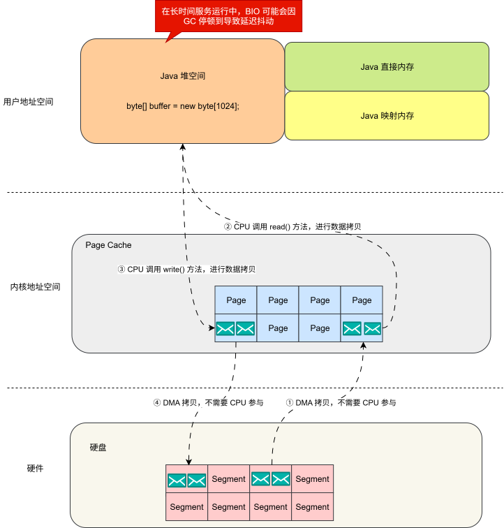

* 传统 BIO 模型需要进行 4 次数据拷贝：

```txt
磁盘 → 内核缓冲区 → 用户缓冲区 → 内核缓冲区 → 磁盘
```

* 传统 BIOS 模型的特点：
  * :one: 4 次上下文切换（用户态 <--> 内核态）。
  * :two: 4 次数据拷贝（其中 2 次是用户空间和内核空间之间的复制）。
  * :three: 需要使用堆内存（Java Heap Memory），GC 管理。
  * :four: 简单易用，适合小文件和低并发场景。
  * :five: 性能较低，尤其是在大文件传输的时候，CPU 和内存开销很大。


* 示例：测试 BIO 的效率

::: code-group

```java [Test.java]
package com.github;

import java.io.FileInputStream;
import java.io.FileOutputStream;
import java.io.IOException;
import java.io.RandomAccessFile;
import java.nio.ByteBuffer;
import java.nio.channels.FileChannel;

public class Test {

    private static final int BUFFER_SIZE = 8192; // 8KB 缓冲区
    private static final String SOURCE_FILE = "D:\\test.zip";
    private static final String DEST_FILE_1 = "D:\\test-copy1.zip";
    private static final String DEST_FILE_2 = "D:\\test-copy2.zip";
    private static final String DEST_FILE_3 = "D:\\test-copy3.zip";
    private static final String DEST_FILE_4 = "D:\\test-copy4.zip";

    public static void main(String[] args) throws IOException {
        bioWithHeapMemory();
    }


    /**
     * BIO + 堆内存
     */
    public static void bioWithHeapMemory() {
        System.out.println("=== BIO + 堆内存 ===");
        long startTime = System.currentTimeMillis();

        try (FileInputStream fis = new FileInputStream(SOURCE_FILE);
             FileOutputStream fos = new FileOutputStream(DEST_FILE_1)) {

            // 在 JVM 堆中分配字节数组
            byte[] buffer = new byte[BUFFER_SIZE];
            System.out.println("堆内存缓冲区创建: " + buffer.length + " bytes");
            int len;
            // 调用 read 方法：磁盘 → 内核缓冲区（Kernel Buffer） → 用户缓冲区（User Buffer，即：Java 中的 buffer）
            while ((len = fis.read(buffer)) != -1) {
                // 调用 write 方法：用户缓冲区（User Buffer，即：Java 中的 buffer） → 内核缓冲区（Kernel Buffer） → 磁盘
                fos.write(buffer, 0, len);
            }

            fos.flush(); // 确保数据写入磁盘

            System.out.println("数据拷贝路径:磁盘 → 内核缓冲区 → 用户缓冲区 → 内核缓冲区 → 磁盘");
        } catch (IOException e) {
            throw new RuntimeException(e);
        }

        System.out.println("传统IO耗时：" + (System.currentTimeMillis() - startTime));
    }

}
```

```md:img [cmd 控制台]
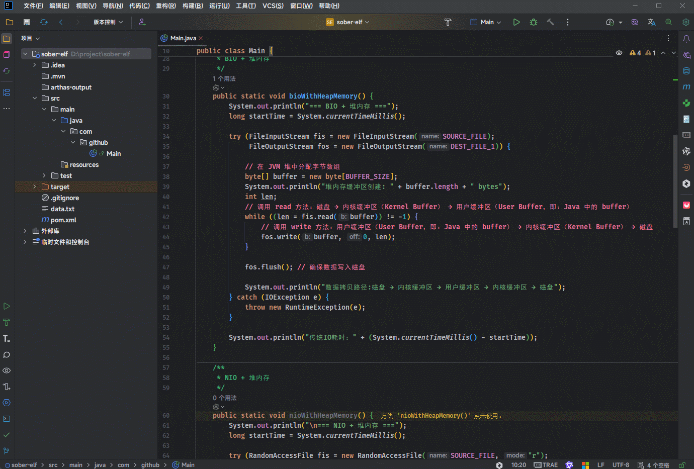
```

:::

### 7.2.3 NIO 模型

* NIO 模型，也需要在`内核缓冲区`和`用户缓冲区`中不停地复制，其原理是将数据复制到`直接内存`（Direct Memory）中。

> [!NOTE]
>
> 和传统的 BIO 相对，`直接内存`（Direct Memory）是分配在堆外的，不受 GC 管理，适合长期复用，性能相对 BIO 要高一点。

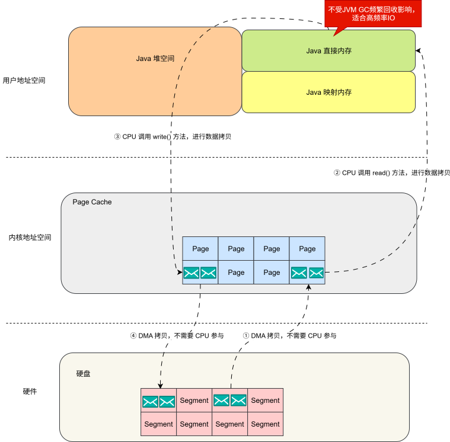

* `直接内存`（Direct Memory）在`用户地址空间`中是这样的，如下所示：


* NIO 模型需要进行 4 次数据拷贝：

```txt
磁盘 → 内核缓冲区 → 直接内存（Direct Memory） → 内核缓冲区 → 磁盘
```

* NIO 模型中使用`直接内存`的特点：
  * :one: 4 次上下文切换（用户态 <--> 内核态）。
  * :two: 4 次数据拷贝（其中 2 次是用户空间和内核空间之间的复制）。
  * :three: 缓冲区是在直接内存（Direct Memory）中，不受 JVM GC 频繁回收影响，适合高频率 IO。
  * :four: 减少 GC 压力，性能略优于BIO，但本质仍是“全路径拷贝”。
  * :five: 虽然叫“直接内存”，但它不是`零拷贝`，数据仍需经过用户空间（只是在堆外）。


* 示例：测试 BIO 和 NIO（直接内存） 的效率

::: code-group

```java [Test.java]
package com.github;

import java.io.FileInputStream;
import java.io.FileOutputStream;
import java.io.IOException;
import java.io.RandomAccessFile;
import java.nio.ByteBuffer;
import java.nio.channels.FileChannel;
import java.time.Instant;
import java.time.temporal.ChronoUnit;

public class Test {

    private static final int BUFFER_SIZE = 8192; // 8KB 缓冲区
    private static final String SOURCE_FILE = "D:\\test.zip";
    private static final String DEST_FILE_1 = "D:\\test-copy1.zip";
    private static final String DEST_FILE_2 = "D:\\test-copy2.zip";
    private static final String DEST_FILE_3 = "D:\\test-copy3.zip";
    private static final String DEST_FILE_4 = "D:\\test-copy4.zip";

    public static void main(String[] args) throws IOException {
        bioWithHeapMemory();
        nioWithHeapMemory();
        nioWithDirectMemory();
    }


    /**
     * BIO + 堆内存
     */
    public static void bioWithHeapMemory() {
        System.out.println("=== BIO + 堆内存 ===");
        Instant start = Instant.now();

        try (FileInputStream fis = new FileInputStream(SOURCE_FILE);
             FileOutputStream fos = new FileOutputStream(DEST_FILE_1)) {

            // 在 JVM 堆中分配字节数组
            byte[] buffer = new byte[BUFFER_SIZE];
            System.out.println("堆内存缓冲区创建: " + buffer.length + " bytes");
            int len;
            // 调用 read 方法：磁盘 → 内核缓冲区（Kernel Buffer） → 用户缓冲区（User Buffer，即：Java 中的 buffer）
            while ((len = fis.read(buffer)) != -1) {
                // 调用 write 方法：用户缓冲区（User Buffer，即：Java 中的 buffer） → 内核缓冲区（Kernel Buffer） → 磁盘
                fos.write(buffer, 0, len);
            }

            fos.flush(); // 确保数据写入磁盘

            System.out.println("数据拷贝路径:磁盘 → 内核缓冲区 → 用户缓冲区 → 内核缓冲区 → 磁盘");
        } catch (IOException e) {
            throw new RuntimeException(e);
        }

        System.out.println("BIO + 堆内存 ==> 耗时：" + 
                           ChronoUnit.MILLIS.between(start, Instant.now()));
    }

    /**
     * NIO + 堆内存
     */
    public static void nioWithHeapMemory() {
        System.out.println("\n=== NIO + 堆内存 ===");
        Instant start = Instant.now();

        try (RandomAccessFile fis = new RandomAccessFile(SOURCE_FILE, "r");
             RandomAccessFile fos = new RandomAccessFile(DEST_FILE_2, "rw");
             FileChannel inChannel = fis.getChannel();
             FileChannel outChannel = fos.getChannel()) {

            // NIO 中使用堆内存缓冲区
            ByteBuffer buffer = ByteBuffer.allocate(BUFFER_SIZE);
            System.out.println("NIO 堆内存缓冲区: " + buffer.capacity() + " bytes");
            System.out.println("是否为直接内存: " + buffer.isDirect());

            while (inChannel.read(buffer) != -1) {
                // 切换到读模式
                buffer.flip();
                // 写入目标文件
                outChannel.write(buffer);
                // 清空缓冲区，准备下次读取
                buffer.clear();
            }

            outChannel.force(true); // 确保数据写入磁盘

            System.out.println("数据拷贝路径: 磁盘 → 内核缓冲区 → 用户缓冲区 → 内核缓冲区 → 磁盘");
        } catch (IOException e) {
            throw new RuntimeException(e);
        }

        System.out.println("NIO + 堆内存 ==> 耗时：" + 
                           ChronoUnit.MILLIS.between(start, Instant.now()));

    }

    /**
     * NIO + 直接内存
     */
    public static void nioWithDirectMemory() {
        System.out.println("\n=== NIO + 直接内存 ===");
        Instant start = Instant.now();

        try (RandomAccessFile sourceFile = new RandomAccessFile(SOURCE_FILE, "r");
             RandomAccessFile destFile = new RandomAccessFile(DEST_FILE_3, "rw");
             FileChannel inChannel = sourceFile.getChannel();
             FileChannel outChannel = destFile.getChannel()) {

            // 分配直接内存缓冲区（堆外内存）
            ByteBuffer directBuffer = ByteBuffer.allocateDirect(BUFFER_SIZE);
            System.out.println("直接内存缓冲区: " + directBuffer.capacity() + " bytes");
            System.out.println("是否为直接内存: " + directBuffer.isDirect());

            // 读取数据：磁盘 → 内核缓冲区 → 直接缓冲区（堆外内存）
            while (inChannel.read(directBuffer) != -1) { // buffer接收数据（写模式）
                // 切换到读模式
                directBuffer.flip();
                // 写入数据：直接缓冲区（堆外内存） → 内核缓冲区 → 磁盘
                outChannel.write(directBuffer); // buffer 提供数据（读模式）
                // 重置为写模式
                directBuffer.clear();
            }

            outChannel.force(true); // 确保数据写入磁盘

            System.out.println("数据拷贝路径: 磁盘 → 内核缓冲区 → 堆外内存（直接内存） → 内核缓冲区 → 磁盘");

        } catch (IOException e) {
            throw new RuntimeException(e);
        }

        System.out.println("NIO + 直接内存 ==> 耗时：" + 
                           ChronoUnit.MILLIS.between(start, Instant.now()));

    }
    
}
```

```md:img [cmd 控制台]
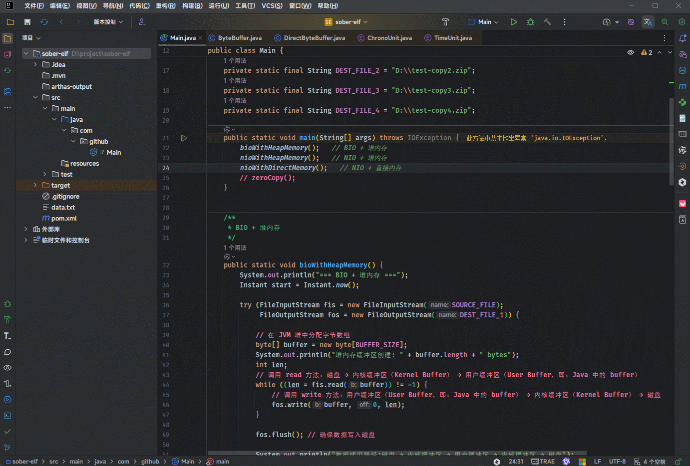
```

:::

### 7.2.4 直接内存的限制

* 可以通过如下的命令查看直接内存相关参数：

```bash
java -XX:+PrintFlagsFinal -version | grep MaxDirectMemorySize
```

> [!NOTE]
>
> * ① `MaxDirectMemorySize=0`表示未显示设置，JVM 将使用默认策略：
>   * :one: 默认值 = `-Xmx` 的值。
>   * :two: 如果 `-Xmx` 也没有设置，则使用 JVM 默认堆大小。
> * ② 可以通过 JVM 参数`-XX:MaxDirectMemorySize=值`来手动调整直接内存大小。


* 示例：查询直接内存大小

::: code-group

```bash
java -XX:+PrintFlagsFinal -version | grep MaxDirectMemorySize
```

```md:img [cmd 控制台]
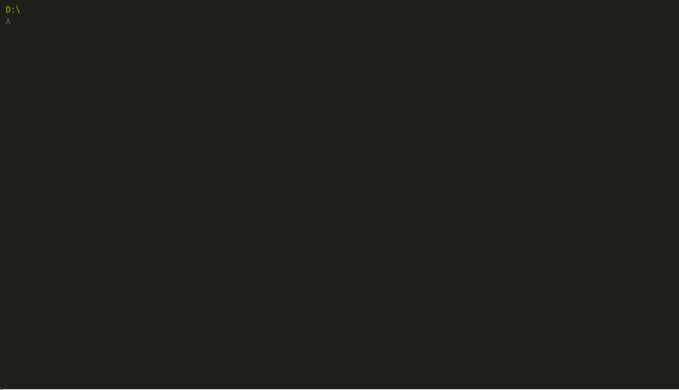
```

:::


* 示例：测试直接内存溢出

::: code-group

```bash
# 虚拟机参数
-XX:MaxDirectMemorySize=2g -Xmx1g
```

```java [Test.java]
package com.github;

import java.nio.ByteBuffer;
import java.util.ArrayList;
import java.util.List;

public class Test {

    private static final List<ByteBuffer> bufferList = new ArrayList<>();

    public static void main(String[] args) {
        System.out.println("尝试分配直接内存...");
        long count = 0;
        while (true) {
            // 分配 100MB 的 DirectBuffer
            ByteBuffer buffer = ByteBuffer.allocateDirect(1024 * 1024 );
            bufferList.add(buffer);
            count++;
            System.out.println("已分配: " + count  + " MB");
        }
    }
}
```

```md:img [cmd 控制台]
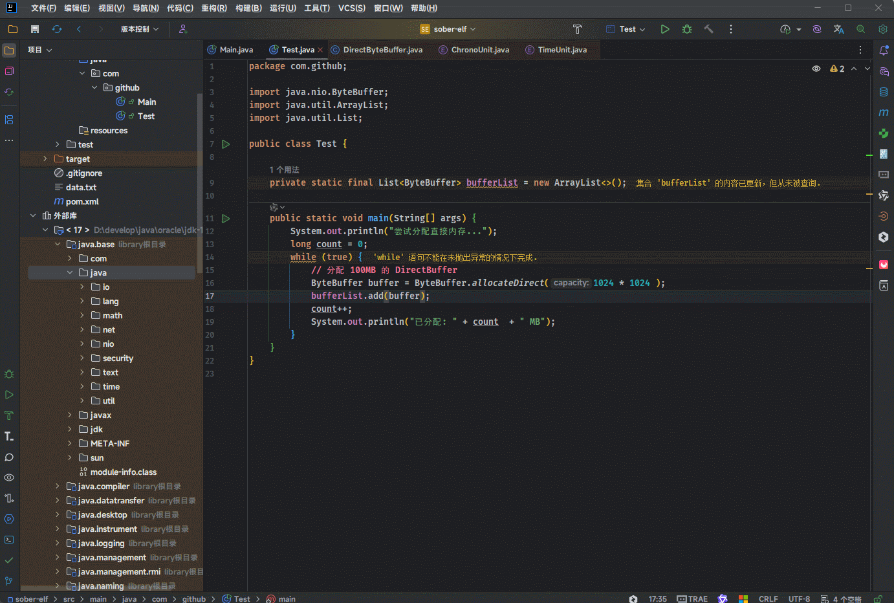
```

:::

## 7.3 零拷贝

* JDK 在 NIO 中引入了`零拷贝`技术，其核心原理是通过`虚拟内存映射`来达到数据`不经过用户空间`。

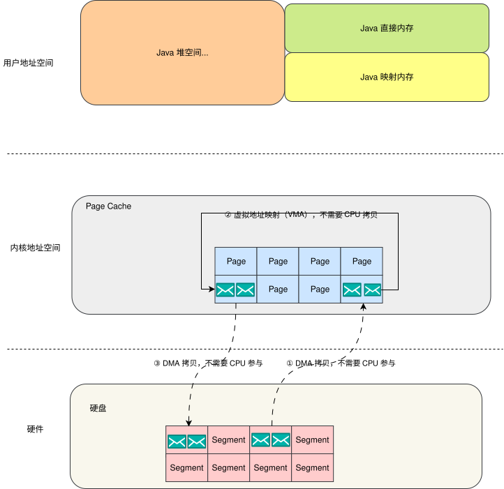

* NIO 模型（零拷贝）需要进行 2 次数据拷贝：

```txt
磁盘 → 内核缓冲区 -(虚拟映射)→ 目标文件缓冲区 → 磁盘
```

* NIO 模型（零拷贝）的特点：
  * :one: 数据始终在内核空间，不进入用户空间。
  * :two: 第 2 步是虚拟地址映射（VMA），不是物理拷贝，不需要 CPU 的参与。
  * :three: 2次上下文切换，比 BIO 少了一半。
  * :four: 减少 GC 压力，性能略优于BIO，但本质仍是“全路径拷贝”。
  * :five: 虽然叫“直接内存”，但它不是`零拷贝`，数据仍需经过用户空间（只是在堆外）。


* 示例：测试 BIO 、NIO（直接内存）以及 NIO（零拷贝）的效率

::: code-group

```java [Test.java]
package com.github;

import java.io.FileInputStream;
import java.io.FileOutputStream;
import java.io.IOException;
import java.io.RandomAccessFile;
import java.nio.ByteBuffer;
import java.nio.channels.FileChannel;
import java.time.Instant;
import java.time.temporal.ChronoUnit;

public class Test {

    private static final int BUFFER_SIZE = 8192; // 8KB 缓冲区
    private static final String SOURCE_FILE = "D:\\test.zip";
    private static final String DEST_FILE_1 = "D:\\test-copy1.zip";
    private static final String DEST_FILE_2 = "D:\\test-copy2.zip";
    private static final String DEST_FILE_3 = "D:\\test-copy3.zip";
    private static final String DEST_FILE_4 = "D:\\test-copy4.zip";

    public static void main(String[] args) throws IOException {
        bioWithHeapMemory();
        nioWithHeapMemory();
        nioWithDirectMemory();
        zeroCopy();
    }


    /**
     * BIO + 堆内存
     */
    public static void bioWithHeapMemory() {
        System.out.println("=== BIO + 堆内存 ===");
        Instant start = Instant.now();

        try (FileInputStream fis = new FileInputStream(SOURCE_FILE);
             FileOutputStream fos = new FileOutputStream(DEST_FILE_1)) {

            // 在 JVM 堆中分配字节数组
            byte[] buffer = new byte[BUFFER_SIZE];
            System.out.println("堆内存缓冲区创建: " + buffer.length + " bytes");
            int len;
            // 调用 read 方法：磁盘 → 内核缓冲区（Kernel Buffer） → 用户缓冲区（User Buffer，即：Java 中的 buffer）
            while ((len = fis.read(buffer)) != -1) {
                // 调用 write 方法：用户缓冲区（User Buffer，即：Java 中的 buffer） → 内核缓冲区（Kernel Buffer） → 磁盘
                fos.write(buffer, 0, len);
            }

            fos.flush(); // 确保数据写入磁盘

            System.out.println("数据拷贝路径:磁盘 → 内核缓冲区 → 用户缓冲区 → 内核缓冲区 → 磁盘");
        } catch (IOException e) {
            throw new RuntimeException(e);
        }

        System.out.println("BIO + 堆内存 ==> 耗时：" + ChronoUnit.MILLIS.between(start, Instant.now()));
    }

    /**
     * NIO + 堆内存
     */
    public static void nioWithHeapMemory() {
        System.out.println("\n=== NIO + 堆内存 ===");
        Instant start = Instant.now();

        try (RandomAccessFile fis = new RandomAccessFile(SOURCE_FILE, "r");
             RandomAccessFile fos = new RandomAccessFile(DEST_FILE_2, "rw");
             FileChannel inChannel = fis.getChannel();
             FileChannel outChannel = fos.getChannel()) {

            // NIO 中使用堆内存缓冲区
            ByteBuffer buffer = ByteBuffer.allocate(BUFFER_SIZE);
            System.out.println("NIO 堆内存缓冲区: " + buffer.capacity() + " bytes");
            System.out.println("是否为直接内存: " + buffer.isDirect());

            while (inChannel.read(buffer) != -1) {
                // 切换到读模式
                buffer.flip();
                // 写入目标文件
                outChannel.write(buffer);
                // 清空缓冲区，准备下次读取
                buffer.clear();
            }

            outChannel.force(true); // 确保数据写入磁盘

            System.out.println("数据拷贝路径: 磁盘 → 内核缓冲区 → 用户缓冲区 → 内核缓冲区 → 磁盘");
        } catch (IOException e) {
            throw new RuntimeException(e);
        }

        System.out.println("NIO + 堆内存 ==> 耗时：" + ChronoUnit.MILLIS.between(start, Instant.now()));

    }

    /**
     * NIO + 直接内存
     */
    public static void nioWithDirectMemory() {
        System.out.println("\n=== NIO + 直接内存 ===");
        Instant start = Instant.now();

        try (RandomAccessFile sourceFile = new RandomAccessFile(SOURCE_FILE, "r");
             RandomAccessFile destFile = new RandomAccessFile(DEST_FILE_3, "rw");
             FileChannel inChannel = sourceFile.getChannel();
             FileChannel outChannel = destFile.getChannel()) {

            // 分配直接内存缓冲区（堆外内存）
            ByteBuffer directBuffer = ByteBuffer.allocateDirect(BUFFER_SIZE);
            System.out.println("直接内存缓冲区: " + directBuffer.capacity() + " bytes");
            System.out.println("是否为直接内存: " + directBuffer.isDirect());

            // 读取数据：磁盘 → 内核缓冲区 → 直接缓冲区（堆外内存）
            while (inChannel.read(directBuffer) != -1) { // buffer接收数据（写模式）
                // 切换到读模式
                directBuffer.flip();
                // 写入数据：直接缓冲区（堆外内存） → 内核缓冲区 → 磁盘
                outChannel.write(directBuffer); // buffer 提供数据（读模式）
                // 重置为写模式
                directBuffer.clear();
            }

            outChannel.force(true); // 确保数据写入磁盘

            System.out.println("数据拷贝路径: 磁盘 → 内核缓冲区 → 堆外内存（直接内存） → 内核缓冲区 → 磁盘");

        } catch (IOException e) {
            throw new RuntimeException(e);
        }

        System.out.println("NIO + 直接内存 ==> 耗时：" + ChronoUnit.MILLIS.between(start, Instant.now()));

    }

    /**
     * 零拷贝
     */
    public static void zeroCopy() {
        System.out.println("\n=== 零拷贝 ===");
        Instant start = Instant.now();

        try (RandomAccessFile sourceFile = new RandomAccessFile(SOURCE_FILE, "r");
             RandomAccessFile destFile = new RandomAccessFile(DEST_FILE_4, "rw");
             FileChannel sourceChannel = sourceFile.getChannel();
             FileChannel destChannel = destFile.getChannel()) {

            // 使用 transferTo 实现零拷贝
            long size = sourceChannel.size();
            long transferred = 0;
            while (transferred < size) {
                transferred += sourceChannel.transferTo(transferred, size - transferred, destChannel);
            }

            destChannel.force(true);

            System.out.println("数据拷贝路径: 磁盘 → 内核缓冲区 -(虚拟映射)→ 目标文件缓冲区 → 磁盘");

        } catch (IOException e) {
            throw new RuntimeException(e);
        }

        System.out.println("零拷贝 ==> 耗时：" + ChronoUnit.MILLIS.between(start, Instant.now()));
    }
}

```

```md:img [cmd 控制台]
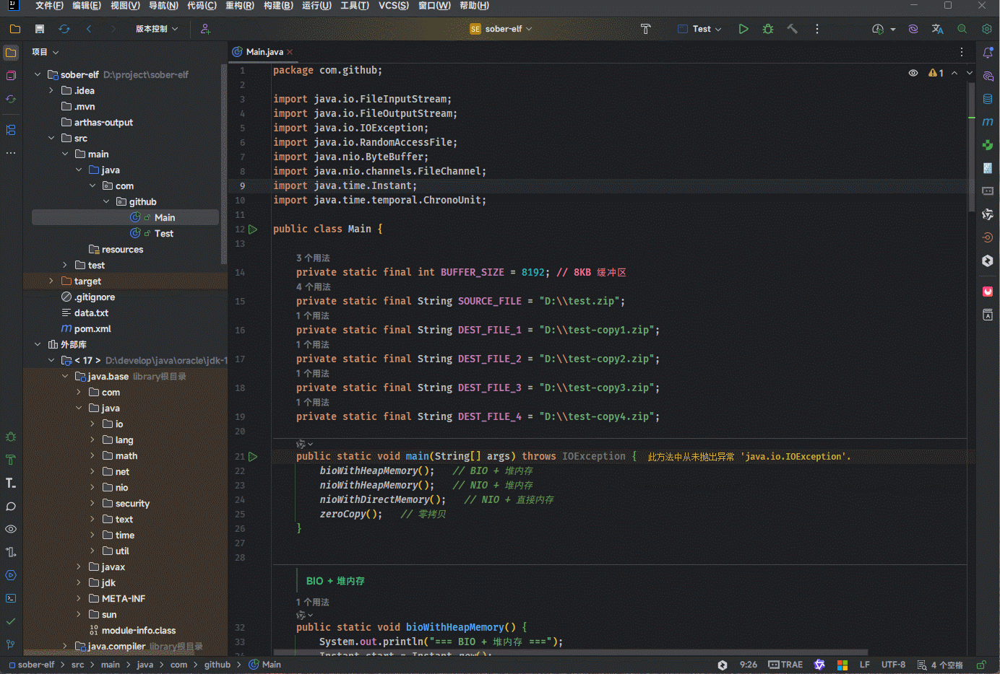
```

:::


# 第五章：执行引擎


# 第六章：字符串常量池

