# 第一章：String Table

## 1.1 String 的基本特性

### 1.1.1 字符串常量池（String Pool）

* ① 字面量方式创建的字符串（`"hello"`）会被存储在`字符串常量池` 中（位于堆内存中的特殊区域）。

> [!NOTE]
>
> 字符串常量池中不会存储相同内容的字符串，如下所示：
>
> * String 的字符串常量池（String Pool）是一个固定大小的 Hashtable，默认值大小长度是 1009 。如果放进 String Pool 的 String 非常多，就会造成 Hash 冲突严重，从而导致链表会很长，而链表长了后造成的直接影响就是当调用 String.intern() 时性能会大幅度下降。
> * 使用 `-XX:StringTableSize` 可以设置 StringTable 的长度。
> * 在 JDK6 中的 StringTable 是固定的，就是 1009 的长度；所以，如果字符串常量池（String Pool）中的字符串过多就会导致性能下降很快，并且 StringTableSize 参数设置没有要求。
> * 在 JDK7 中的 StringTable 的长度默认值是 60013，并且 StringTableSize 参数设置没有要求。
> * 在 JDK8 中的 StringTable 的长度默认值是 60013，并且 StringTableSize 参数设置中 1009 是最小值。 

* ② 如果常量池中已存在相同内容的字符串，则直接复用，避免重复创建。
* ③ 使用 `new String("...")` 会强制在堆中创建新对象，即使内容相同。

> [!NOTE]
>
>  `==` 比较引用， `.equals()` 比较内容。 


* 示例：

```java
package com.github;
public class Test {
    public static void main(String[] args) {
        
        String a = "hello";
        String b = "hello";
        System.out.println(a == b); // true（引用相同）
        
    }
}
```


* 示例：

```java
package com.github;
public class Test {
    public static void main(String[] args) {
        
        String c = new String("hello");
        String d = new String("hello");
        System.out.println(c == d); // false（堆中不同对象）
        
    }
}
```

### 1.1.2 不可变性（Immutability）

* ① 一旦创建，`String` 对象的内容就无法被修改。
* ② 所有看似“修改”字符串的方法（ `substring()`、`concat()`、`replace()` 等）实际上都会返回一个新的 `String` 对象，而原对象保持不变。
* ③ 不可变性带来了线程安全、缓存哈希值、字符串池优化等优势。


* 示例：

```java
package com.github;
public class Test {
    public static void main(String[] args) {
        
        String s1 = "hello";
        String s2 = s1.concat(" world"); // 创建新对象
        System.out.println(s1 == s2); // false
        System.out.println(s1); // 输出: hello（未变）
        
    }
}
```

### 1.1.3 final 类

* ① `String` 类被声明为 `final`，不能被继承。
* ② 其内部的字符数组 `value`（在 Java 8 及之前是 `char[]`，Java 9+ 改为 `byte[]` + 编码标识）也是 `final` 的，确保内容不可变。

> [!NOTE]
>
> - Java 9 引入了 `Compact Strings` 优化：
>   - 若字符串仅包含 Latin-1 字符（0~255），使用 `byte[]` 存储，每个字符占 1 字节。
>   - 否则使用 UTF-16 编码（每个字符占 2 字节）。
> - 减少了内存占用，提升性能。

* ③ `String` 实现了 `CharSequence` 接口，因此可以与 `StringBuilder`、`StringBuffer` 等统一处理。


* 示例：

```java
public final class String // [!code highlight]
    implements java.io.Serializable, Comparable<String>, CharSequence { // [!code highlight]
    
    private final char value[]; // [!code highlight]
    
    ...
        
}
```

### 1.1.4 重写了 Object 的关键方法

* ① `equals(Object obj)`：按内容比较字符串是否相等。
* ② `hashCode()`：基于字符串内容计算哈希值，用于哈希表，如： `HashMap`。
* ③ `toString()`：返回字符串本身。


* 示例：

```java
package com.github;
public class Test {
    public static void main(String[] args) {
        
        String s1 = new String("abc");
        String s2 = new String("abc");
        System.out.println(s1.equals(s2)); // true（内容相同）
        
    }
}
```

## 1.2 String 的内存分配

### 1.2.1 概述

* 在 Java 语言中有 8 种基本数据类型和 String 类型（特殊的引用数据类型） 。这些类型为了使它们在运行过程中速度更快、更节省内存，都提供了一种`常量池`的概念。
* `常量池`就类似于 Java 系统级别提供的缓存；8 种基本数据类型的常量池都是系统协调的，而 `String 类型的常量池就比较特殊`。
* 对于 String 类型的常量池，主要有两种使用方法，如下所示：
  * ① 直接使用双引号声明出来的 String 对象会直接存储在常量池中，即：字面量声明的方式。
  * ② 如果不是双引号声明出来的 String 对象，可以使用 String 提供的 intern() 方法，让其存储到常量池中。

### 1.2.2 字符串常量池的迁移

* 在 JDK6 之前，`字符串常量池`是存放在`永久代`中。


* 在 JDK7 中，Hotspot 将`字符串常量池`的位置由方法区（永久代）迁移到了`堆`中。

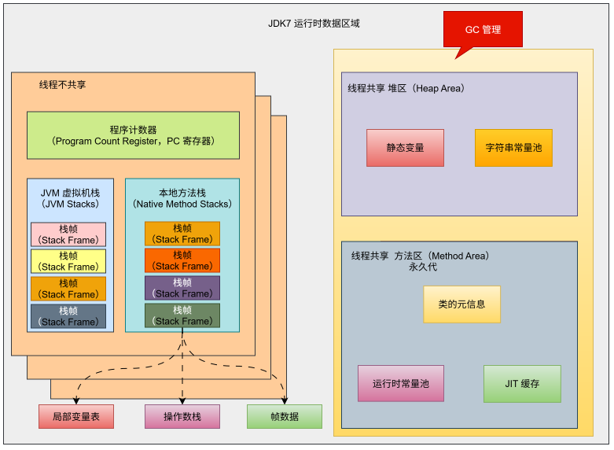

* 在 JDK8 ，永久代被元空间取代；但是，`字符串常量池`还是在`堆`中。


### 1.2.3 验证

* 需求：不断的向字符串常量池中添加字符串，看报错信息，以观察字符串常量池的位置。

> [!NOTE]
>
> ::: details 点我查看 准备代码
>
> ```java
> package com.github;
> 
> import java.util.ArrayList;
> import java.util.List;
> 
> public class Test {
>     public static void main(String[] args) {
>         List<String> list = new ArrayList<String>();
> 
>         int i = 0;
>         while (true){
>             list.add(String.valueOf(i++).intern());
>         }
>     }
> }
> ```
>
> :::


* 示例：JDK6

::: code-group

```bash
-XX:PermSize=6m -XX:MaxPermSize=6m -Xms6m -Xmx6m 
```

```md:img [cmd 控制台]

```

:::


* 示例：JDK8

::: code-group

```bash
-XX:MetaspaceSize=32m -XX:MaxMetaspaceSize=32m -Xms6m -Xmx6m 
```

```md:img [cmd 控制台]
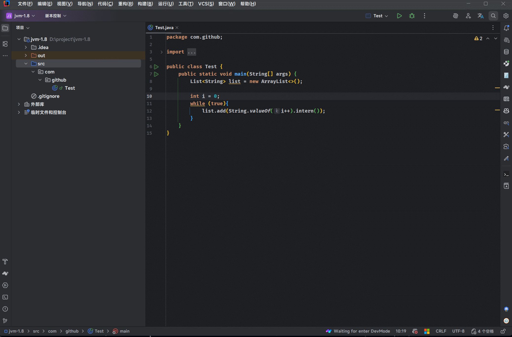
```

:::

## 1.3 String 的基本操作

* Java 语言规范中要求完全相同的字符串字面量，应该包含同样的 Unicode 字符序列（包含同一份码点序列的常量），并且必须是指向同一个 String 类实例。


* 示例：

::: code-group

```java [Test.java]
package com.github;

public class Test {
    public static void main(String[] args) {
        System.out.println("1"); // 2109
        System.out.println("2"); // 2111
        System.out.println("3");
        System.out.println("4");
        System.out.println("5");
        System.out.println("6");
        System.out.println("7");
        System.out.println("8");
        System.out.println("9");
        System.out.println("10"); // 2119

        System.out.println("1"); // 2120
        System.out.println("2"); // 2120
        System.out.println("3");
        System.out.println("4");
        System.out.println("5");
        System.out.println("6");
        System.out.println("7");
        System.out.println("8");
        System.out.println("9");
        System.out.println("10"); // 2120
    }
}
```

```md:img [cmd 控制台]
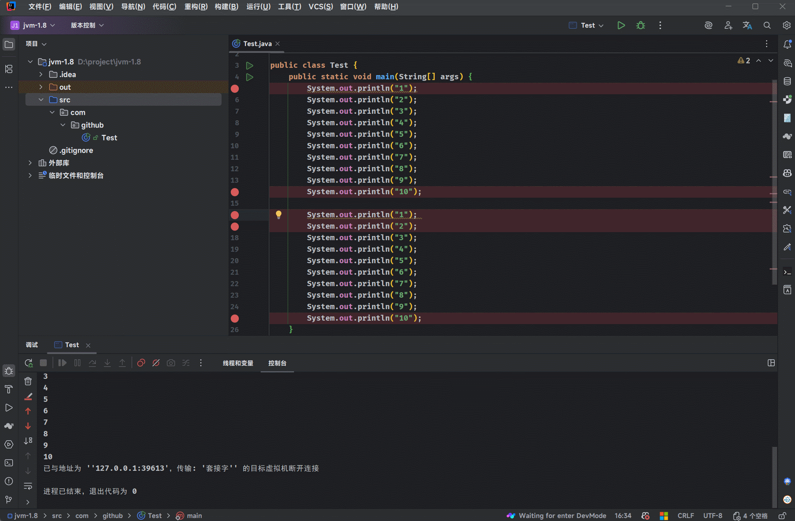
```

:::

## 1.4 字符串的拼接操作

### 1.4.1 概述

* ① 常量和常量的拼接结果在常量池中，原理是编译期优化。
* ② 常量池中不会存在相同内容的常量。
* ③ 只要其中有一个是变量，结果就在堆中，原理是 StringBuilder 。
* ④ 如果拼接的结果调用了 intern() 方法，则主动将常量池中还没有的字符串对象放入池中，并返回此对象地址。

### 1.4.2 应用示例

* 常量和常量的拼接结果在常量池中，原理是编译期优化。

> [!NOTE]
>
> 在编译期生成字节码的时候，就可以看出`常量和常量的拼接结果`在`常量池`中。


* 示例：

::: code-group

```java [Test.java]
package com.github;

public class Test {
    public static void main(String[] args) {
        String s1 = "a" + "b" + "c"; // 等同于 "abc"
        String s2 = "abc";
		
        System.out.println(s1 == s2); // true
        System.out.println(s1.equals(s2)); // true
    }
}
```

```txt [字节码指令]
 0 ldc #2 <abc>  // 从常量池中加载 "abc"
 2 astore_1
 3 ldc #2 <abc>  // 从常量池中加载 "abc"
 5 astore_2
 6 getstatic #3 <java/lang/System.out : Ljava/io/PrintStream;>
 9 aload_1
10 aload_2
11 if_acmpne 18 (+7)
14 iconst_1
15 goto 19 (+4)
18 iconst_0
19 invokevirtual #4 <java/io/PrintStream.println : (Z)V>
22 getstatic #3 <java/lang/System.out : Ljava/io/PrintStream;>
25 aload_1
26 aload_2
27 invokevirtual #5 <java/lang/String.equals : (Ljava/lang/Object;)Z>
30 invokevirtual #4 <java/io/PrintStream.println : (Z)V>
33 return
```

:::

### 1.4.3 应用示例

* 如果拼接符号的前后出现了变量，则相当于在堆空间中 new String()，具体的内容为拼接后的结果。

> [!NOTE]
>
> * ① 底层其实是 new StringBuilder().append(xx).append(xxx)....toString(); 
> * ② 字符串拼接操作底层不一定使用 StringBuilder，如果拼接符号左右两边是字符串常量或者使用 final 修饰的量，则依然是编译期优化，即：非 StringBuilder 的方式。


* 示例：

::: code-group

```java [Test.java]
package com.github;

public class Test {
    public static void main(String[] args) {
        String s1 = "java";
        String s2 = "EE";

        String s3 = "javaEE";
        String s4 = "java" + "EE"; // 编译期优化
        System.out.println(s3 == s4); // true

        String s5 = s1 + "EE";
        System.out.println(s3 == s5); // false

        String s6 = "java"+ s2;
        System.out.println(s3 == s6); // false

        String s7 = s1 + s2;
        System.out.println(s3 == s7); // false
    }
}
```

```txt [字节码指令]
  0 ldc #2 <java> // 从常量池中加载 "abc"
  2 astore_1
  3 ldc #3 <EE> // 从常量池中加载 "abc"
  5 astore_2
  6 ldc #4 <javaEE> // 从常量池中加载 "abc"
  8 astore_3
  9 ldc #4 <javaEE> // 从常量池中加载 "abc"
 11 astore 4
 13 getstatic #5 <java/lang/System.out : Ljava/io/PrintStream;>
 16 aload_3
 17 aload 4
 19 if_acmpne 26 (+7)
 22 iconst_1
 23 goto 27 (+4)
 26 iconst_0
 27 invokevirtual #6 <java/io/PrintStream.println : (Z)V>
 30 new #7 <java/lang/StringBuilder> // 创建 StringBuilder() 对象
 33 dup
 34 invokespecial #8 <java/lang/StringBuilder.<init> : ()V>
 37 aload_1
 38 invokevirtual #9 <java/lang/StringBuilder.append : (Ljava/lang/String;)Ljava/lang/StringBuilder;> // 调用 append() 方法
 41 ldc #3 <EE>
 43 invokevirtual #9 <java/lang/StringBuilder.append : (Ljava/lang/String;)Ljava/lang/StringBuilder;>
 46 invokevirtual #10 <java/lang/StringBuilder.toString : ()Ljava/lang/String;>
 49 astore 5
 51 getstatic #5 <java/lang/System.out : Ljava/io/PrintStream;>
 54 aload_3
 55 aload 5
 57 if_acmpne 64 (+7)
 60 iconst_1
 61 goto 65 (+4)
 64 iconst_0
 65 invokevirtual #6 <java/io/PrintStream.println : (Z)V>
 68 new #7 <java/lang/StringBuilder>
 71 dup
 72 invokespecial #8 <java/lang/StringBuilder.<init> : ()V>
 75 ldc #2 <java>
 77 invokevirtual #9 <java/lang/StringBuilder.append : (Ljava/lang/String;)Ljava/lang/StringBuilder;>
 80 aload_2
 81 invokevirtual #9 <java/lang/StringBuilder.append : (Ljava/lang/String;)Ljava/lang/StringBuilder;>
 84 invokevirtual #10 <java/lang/StringBuilder.toString : ()Ljava/lang/String;>
 87 astore 6
 89 getstatic #5 <java/lang/System.out : Ljava/io/PrintStream;>
 92 aload_3
 93 aload 6
 95 if_acmpne 102 (+7)
 98 iconst_1
 99 goto 103 (+4)
102 iconst_0
103 invokevirtual #6 <java/io/PrintStream.println : (Z)V>
106 new #7 <java/lang/StringBuilder>
109 dup
110 invokespecial #8 <java/lang/StringBuilder.<init> : ()V>
113 aload_1
114 invokevirtual #9 <java/lang/StringBuilder.append : (Ljava/lang/String;)Ljava/lang/StringBuilder;>
117 aload_2
118 invokevirtual #9 <java/lang/StringBuilder.append : (Ljava/lang/String;)Ljava/lang/StringBuilder;>
121 invokevirtual #10 <java/lang/StringBuilder.toString : ()Ljava/lang/String;>
124 astore 7
126 getstatic #5 <java/lang/System.out : Ljava/io/PrintStream;>
129 aload_3
130 aload 7
132 if_acmpne 139 (+7)
135 iconst_1
136 goto 140 (+4)
139 iconst_0
140 invokevirtual #6 <java/io/PrintStream.println : (Z)V>
143 return

```

:::

## 1.5 intern() 的使用

* 如果调用 intern() 方法，会将`字符串对象`尝试放入`字符串常量池`中：
  * 如果`字符串常量池`中有，则并不会放入，而是返回已有的`字符串常量池`中的`字符串对象地址`。
  * 如果`字符串常量池`中没有，则会将`对象的引用地址复制一份`，放入`字符串常量池`中，并返回`字符串常量池`中的`引用地址`。


* 示例：

```java
package com.github;

public class Test {
    public static void main(String[] args) {
        String s1 = "java";
        String s2 = "EE";

        String s3 = "javaEE";

        String s5 = s1 + "EE";
        System.out.println(s3 == s5); // false
        System.out.println(s3 == s5.intern()); // true
        System.out.println(s3 == (s1+s2).intern()); // true
    }
}
```

## 1.6 面试题

* new String("ab") 创建了几个对象？


* 示例：

::: code-group

```bash
2
```

```java [Test.java]
package com.github;

public class Test {
    public static void main(String[] args) {
        new String("ab");
    }
}
```

```txt [字节码指令]
 0 new #2 <java/lang/String> // 在堆中创建对象，并且属性值是 "ab"
 3 dup
 4 ldc #3 <ab> 从常量池中加载 "ab"
 6 invokespecial #4 <java/lang/String.<init> : (Ljava/lang/String;)V>
 9 pop
10 return
```

:::

## 1.7 String Table 的垃圾回收

* 由于字符串常量池在 JDK7 之后迁移到了堆中，所以 GC 也会对`字符串常量池`进行垃圾回收。


* 示例：

::: code-group

```bash
-Xms15m -Xmx15m -XX:+PrintStringTableStatistics -XX:+PrintGCDetails
```

```java [Test.java]
package com.github;

public class Test {
    public static void main(String[] args) {
        for (int i = 0; i < 10_1000; i++) {
            String.valueOf(i).intern();
        }
    }
}
```

```md:img [cmd 控制台]

```

:::


# 第二章：执行引擎

## 2.1 概述

* `执行引擎`是 JVM 核心的组成部分之一，如下所示：

> [!NOTE]
>
> * ① `虚拟机`是相对于`物理机`的概念，这两种机器都有代码执行的能力。
> * ② `物理机`的`执行引擎`是直接建立在处理器、缓存、指令集和操作系统层面上的。
> * ③ `虚拟机`的`执行引擎`是由软件自行实现的，因此可以`不受物理条件约束`来`定制`指令集和执行引擎的结构体系，`能够执行哪些不被硬件直接执行的指令集格式`。

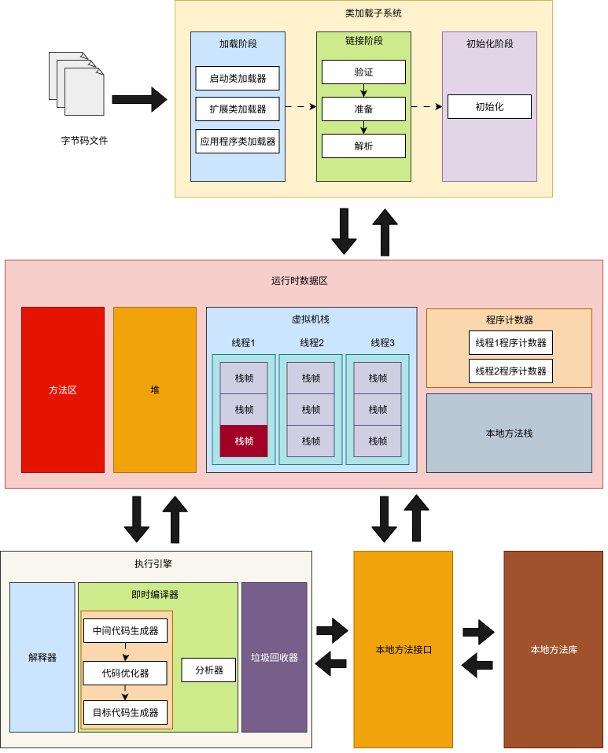

* JVM 的主要任务是负责`装载字节码到其内部`；但是，字节码并不能够直接运行在操作系统之上，因为`字节码指令`并不等价于`本地机器指令`，其内部包含的仅仅只是一些能够被 JVM 所识别的字节码指令、符号表以及其它的辅助信息。

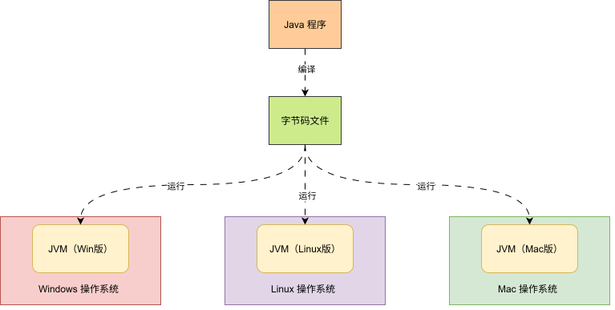

* 如果想要让一个 Java 程序运行起来，`执行引擎`（Execution Engine）的任务就是`将字节码指令解释或编译为对应平台上的机器指令，以便计算机执行`。换言之，JVM 的`执行引擎`就充当了`高级语言`翻译为`机器语言`的`翻译官`。

> [!NOTE]
>
> * ① `执行引擎`是在 JVM 内部的，是`后端编译器`，如：解释器或即时编译器（JIT）。
> * ② `执行引擎`不是`前端编译器`，如：javac 等。

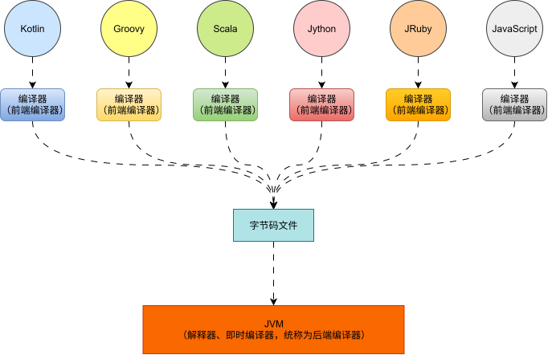

## 2.2 执行引擎的工作过程

* `执行引擎`在执行的过程中究竟需要执行什么样的字节码指令完全依赖于`程序计数器`（PC 寄存器）：每当执行一个指令操作后，`程序计数器`就会更新下一条需要被执行的指令地址。

> [!NOTE]
>
> 在方法的执行过程中，`执行引擎`有可能通过存储在`局部变量表`中的`对象引用`准确定位到存储在`Java 堆区`中的对象实例信息，以及通过`对象头`中的`元数据指针`定位到`目标对象`的`类型信息`。

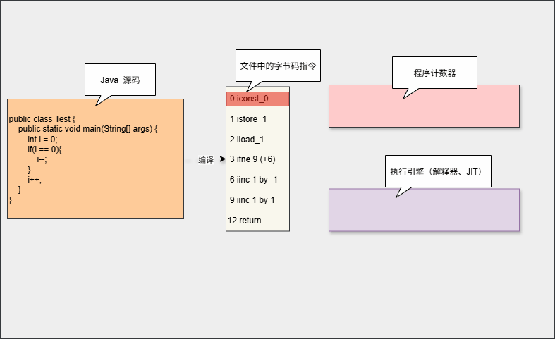

* 在方法的执行过程中，`执行引擎`有可能通过存储在`局部变量表`中的`对象引用`准确定位到存储在`Java 堆区`中的对象实例信息，以及通过`对象头`中的`元数据指针`定位到`目标对象`的`类型信息`。

::: code-group

```java [Test.java]
package com.github;

class Customer {

    String id;
    String name;
    Account account;

    public Customer(String id, String name, Account account) {
        this.id = id;
        this.name = name;
        this.account = account;
    }
}

class Account {

    String id;
    Double balance;

    public Account(String id, Double balance) {
        this.id = id;
        this.balance = balance;
    }
}

public class Test {
    public static void main(String[] args) {
        Customer customer = new Customer("C0001", "张三",
                                         new Account("A0001", 100.0));
    }
}
```

```md:img [cmd 控制台]
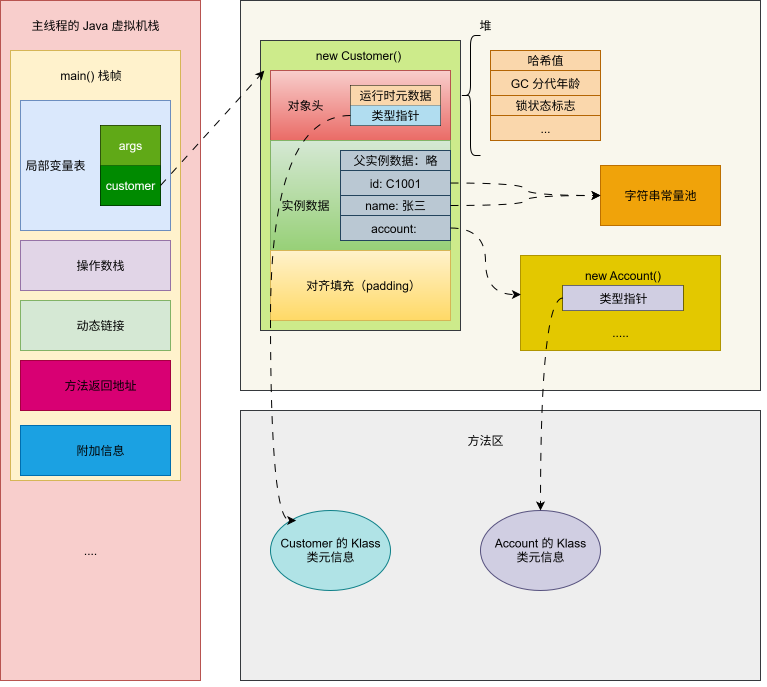
```

:::

* 所有的 JVM 的执行引擎的输入和输出都是一致的：输入的是字节码二进制流，处理过程是字节码解析执行的等效过程，输出的是执行结果。

## 2.3 Java 代码编译和执行过程

### 2.3.1 概述

* 大部分的程序代码在转换为物理机的目标代码或虚拟机能执行的指令集之前，都需要经过如下的各个步骤：

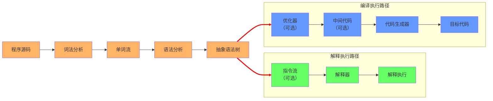
```mermaid
graph LR
    A[程序源码] --> B[词法分析]
    B --> C[单词流]
    C --> D[语法分析]
    D --> E[抽象语法树]

    E --> F
    E --> I

    subgraph interpret["解释执行路径"]
        direction TB
        F[指令流\n（可选）] --> G[解释器]
        G --> H[解释执行]
    end

    subgraph compile["编译执行路径"]
        direction TB
        I[优化器\n（可选）] --> J[中间代码\n（可选）]
        J --> K[代码生成器]
        K --> L[目标代码]
    end

    style A fill:#ffb366
    style B fill:#ffb366
    style C fill:#ffb366
    style D fill:#ffb366
    style E fill:#ffb366
    style F fill:#66ff66
    style G fill:#66ff66
    style H fill:#66ff66
    style I fill:#6699ff
    style J fill:#6699ff
    style K fill:#6699ff
    style L fill:#6699ff

    linkStyle 4 stroke:#ff0000,stroke-width:3px
    linkStyle 5 stroke:#ff0000,stroke-width:3px
```

### 2.3.2 Java 代码的编译过程

* `java 代码`编译是由 Java 源码编译器来完成的，即：`javac`，如下所示：

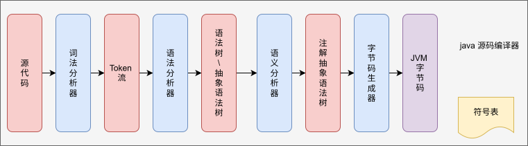

### 2.3.3 Java 代码的执行过程

* `java 字节码`的执行由 JVM 的执行引擎来完成，如下所示：

> [!NOTE]
>
> * ① 解释器：当 JVM 启动的时候，会根据 JVM 规范对字节码采`取逐行解释`的方式执行，将每条字节码文件的内容翻译为对应平台的本地机器指令，以便计算机可以执行。
> * ② JIT（Just In Time Compiler，即时编译器）：JVM 将源代码直接编译为和本地机器平台相关的机器语言。

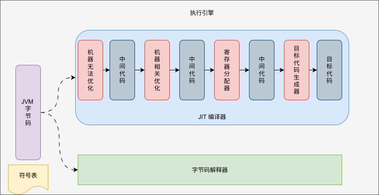

### 2.2.4 细节

* 【问】为什么说 Java 是半解释半解释型的编程语言？
* 【答】在 JDK1.0 的时候，Java 语言定位为`解释执行`还是比较准确的；但是，后来为了提高程序执行的效率，Java 也发展出了可以直接生成本地代码的编译器，即：JIT。

### 2.2.5 细节

* 目前的 JVM 在执行 Java 代码的时候，通常会将`解释执行`和`编译执行`二者结合起来执行。

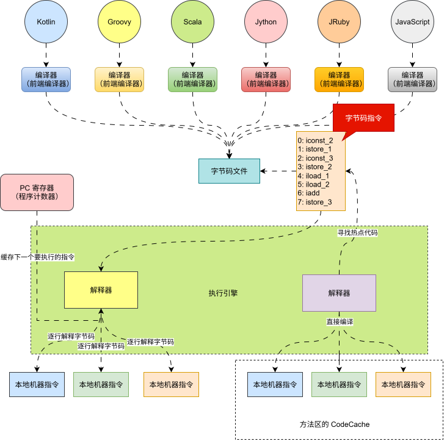

## 2.4 机器码、指令、汇编语言等

### 2.4.1 机器码（机器语言）

* 机器码（Machine Code）是由二进制数字 0 或 1 组成的代码，是 CPU 能直接识别和执行的唯一形式。刚开始人们使用它来编写程序，也称为机器语言（Machine Language）。
* 机器码（Machine Code）和具体的 CPU 架构强相关，如：x86、ARM 以及 RISC-V 等。
* 每条机器码对应一个**操作码（Opcode）**，可能附带操作数，如：地址、立即数等。
* 机器码虽然能够被计算机所理解和接受；但是，和人类的语言差别太大，不易被人们理解和记忆，用它编程容易出错且不太容易去排查。


* 示例：x86

```txt
10111000 00000001 00000000 00000000 00000000  // 表示 mov eax, 1
```

### 2.4.2 指令

* 由于机器码是由 0 或 1 组成的二进制序列，可读性太差，于是人们发明了指令。
* 指令就是将机器码中的 0 或 1 序列，简化为对应的指令（通常为英文简写，如：mov、inc 等），可读性稍好。

> [!NOTE]
>
> 两种视角：
>
> * **硬件视角**：指令 = 一串二进制机器码。
> * **程序员视角**：指令 = 汇编中的助记符，如： `ADD R1, R2`。

*  简单理解：一条指令 = 一个操作；机器码是该指令的二进制编码。


* 示例：

```txt
数据传输：MOV（移动数据）、LOAD（加载）、STORE（存储）
算术运算：ADD（加法）、SUB（减法）、MUL（乘法）
逻辑运算：AND、OR、NOT、XOR
控制流：JMP（跳转）、CALL（调用）、RET（返回）
比较判断：CMP（比较）、TEST（测试）
```

### 2.4.3 指令集

* 不同的硬件平台，各自支持的指令，是有差别的；因此，每个平台所支持的指令，称之为对应平台的指令集。
* 在计算机体系结构中，常说的`指令集`就是 CPU 支持的所有操作的集合，如：ADD、MOV、JMP 等。


* 示例：常见的指令集

```txt
x86 指令集 // 对应的是 x86 架构的平台
arm 指令集 // 对应的是 arm 架构的平台
```

### 2.4.4 汇编语言

* 由于指令的可读性还是太差，于是人们又发明了汇编语言。
* 在汇编语言中，用`助记符`（Mnemonics）代替`机器指令的操作码`，用`地址符号`（Symbol）或`标号`（Label）代替`指令或操作数的地址`。
* 在不同的硬件平台，汇编语言对应着不同的机器语言指令集，通过汇编过程转换成机器指令。

> [!NOTE]
>
> * ① 由于计算机只认识指令码，所以用汇编语言编写的程序还必须翻译成机器指令码，计算机才能识别和执行。
> * ② 汇编语言是机器码的符号化表示，使用助记符代替二进制数字，是最接近机器语言的人类可读编程语言。


* 示例：汇编语言

```txt
机器码:    B8 05 00 00 00    (十六进制)
汇编语言:  MOV EAX, 5         (将数字5移动到EAX寄存器)

机器码:    01 C3             
汇编语言:  ADD EBX, EAX       (将EAX加到EBX)
```


* 示例：`汇编语言`、`机器码`和`指令操作`之间的关系

```txt
汇编语言 --[汇编器]--> 机器码 --[CPU执行]--> 指令操作

MOV AX, 5  →  B8 05 00  →  CPU将5存入AX寄存器
```

```txt
汇编语言 ≈ 指令的文本表示 + 汇编器指令

汇编语言包含：
├── CPU指令的助记符 (如 MOV, ADD, JMP)  ← 这部分对应 CPU 指令
├── 汇编器指令/伪指令 (如 .data, .text, EQU)  ← 这部分不是 CPU 指令
├── 宏定义
└── 标签、注释等辅助元素
```

```txt
如果将指令看成是 Linux 中的命令，那么汇编语言就是 Shell 脚本或 Python 脚本
```


* 示例：汇编语言

```txt
.data              ; 汇编器指令(伪指令)，不会生成机器码
msg DB "Hello"     ; 汇编器指令，定义数据

.code              ; 汇编器指令(伪指令)
start:             ; 标签，不是指令
    MOV AX, 5      ; ← 这是CPU指令
    ADD AX, 3      ; ← 这是CPU指令
    JMP done       ; ← 这是CPU指令
    
done:              ; 标签
    RET            ; ← 这是CPU指令
```

### 2.4.5 高级语言

* 为了使计算机用户编写程序更加容易，后来就出现了各种高级计算机语言。高级语言比机器语言和汇编语言更`接近于人的语言`。
* 当计算机执行高级语言编写的程序时，`依然需要将程序解释和翻译成机器的指令码`，完成这个过程的程序就叫做`解释程序`或`编译程序`。

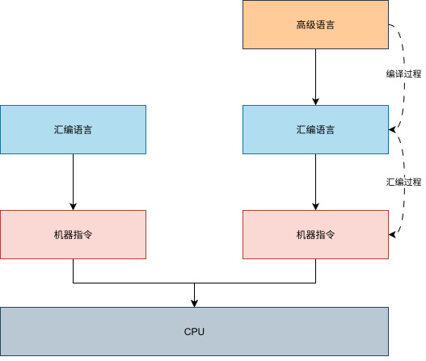

* C/C++ 源程序的编译过程分为：编译和汇编，如下所示：

> [!NOTE]
>
> * ① 编译过程：读取源程序（字符流），对编代码编译过程之进行词法和语法的分析，将高级语言指
>   令转换为功能等效的汇编代码。
> * ② 汇编过程：把汇编语言代码翻译为目标机器指令的过程。

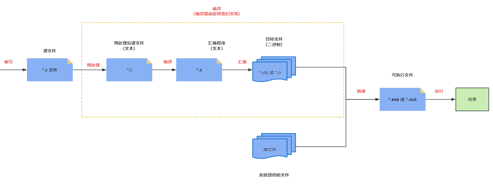

### 2.4.6 字节码

* 字节码是一种`中间状态`（中间码）的二进制文件，它比机器码更抽象，需要解释器或 JIT 等翻译后才能成为机器码。


* 通过前端编译器（javac）将源码翻译为字节码，JVM 中的执行引擎（后端编译器，解释器和 JIT）将字节码翻译为机器可以直接运行的指令。

## 2.5 解释器

### 2.5.1 概述

* JVM 的设计者的初衷仅仅只是`为了满足 Java 程序实现跨平台的特性`，而避免采用`静态编译`的方式直接生成本地机器指令，从而诞生了实现解释器在运行时采用`逐行解释`字节码的想法。


### 2.5.2 解释器的工作机制

* 解释器就是一个运行时的`翻译官`，将字节码文件中的内容`翻译`为对应平台的本地机器指令，以便计算机可以执行。

### 2.5.3 解释器的分类

#### 2.5.3.1 概述

* 在 Java 的发展历史中，一共有两套解释执行器，即：古老的`字节码解释器`和现代普遍使用的`模板解释器`。

#### 2.5.3.2 字节码解释器

* 字节码解释器在执行的时候通过`纯软件代码`模拟字节码的执行，效率非常低下。


#### 2.5.3.3 模板解释器

* 模板解释器将`每一条字节码`和`一个模板函数`相关联，模板函数中直接产生这条字节码执行时的机器码，从而很大程序上提高了解释器的性能。

> [!NOTE]
>
> 在 HotSpot VM 中，解释器由 Interpreter 模块和 Code 模块构成，如下所示：
>
> * Interpreter 模块：实现了解释器的核心功能。
> * Code 模块：用于管理 HotSpot VM 在运行时生成的本地机器指令。


### 2.5.4 现状

* 由于解释器在设计和实现上非常简单，因此除了 Java 语言之外，还有很多高级语言也是采取基于解释器的形式执行的，如：Python 、Ruby 等。
* 但是，`基于解释器执行已经沦落为低效的代名词`，并且时常被 C/C++ 程序员所调侃。
* 为了接近这个问题，JVM 平台支持了一种叫做`即时编译`的技术。其目的是避免函数被解释执行，而是`将整个函数体编译为机器码，每次函数执行的时候，只执行编译后的机器码`，这种方式可以使得程序的执行效率大幅度提高。
* 无论如何，基于解释器的执行模式依然为中间语言的发展做出了不可磨灭的贡献。换言之，当今通用的 JVM 依然采取的是`解释器和 JIT 并存`的架构。

## 2.6 JIT 编译器

### 2.6.1 概述

* Java 代码的执行分为两类，如下所示：

> [!NOTE]
>
> * ① 第一种是将源代码编译成字节码文件，然后在运行时通过解释器将字节码文件转为机器码执行。
> * ② 第二种是编译执行（直接编译成机器码）。现代虚拟机为了提高执行效率，会使用即时编译技术（JIT）将方法编译成机器码后再执行。


* HotSpot VM 是目前市面上高性能虚拟机的代表作之一。它采用`解释器与即时编译器`并存的架构。在 Java 虚拟机运行时，`解释器和即时编译器`能够相互协作，各自取长补短，尽力去选择最合适的方式来权衡：编译本地代码的时间和直接解释执行代码的时间。

### 2.6.2 疑问？

* 有些开发人员会感觉到疑惑，既然 HotSpot VM 中已经内置 JIT 编译器了，那么为什么还需要再使用`解释器`来“拖累”程序的执行性能呢？比如 JRockit VM 内部就不包含解释器，字节码全部都依靠即时编译器编译后执行。
* 首先明确的是，当程序启动后，`解释器`可以马上发挥作用，省去编译的时间，立即执行。

> [!NOTE]
>
> 解释器相对于编译器来说，就是响应速度快，JVM 一启动就可以立即解释执行字节码指令。

* `编译器`要想发挥作用，把代码编译成本地代码，需要一定的执行时间。但编译为本地代码后，执行效率高。

> [!NOTE]
>
> 编译器相对于来解释器说，执行效率高；但是，需要先编译（需要时间），再执行。即：响应速度慢。

* 尽管 JRockit VM 中程序的执行性能会非常高效，但程序在启动时必然需要花费更长的时间来进行编译。对于服务端应用来说，启动时间并非是关注重点，但对于那些看中启动时间的应用场景而言，或许就需要采用解释器与即时编译器并存的架构来换取一个平衡点。

> [!NOTE]
>
> * ① 在此模式下，当 Java 虚拟器启动时，解释器可以首先发挥作用，而不必等待即时编译器全部编译完成后再执行，这样可以省去许多不必要的编译时间。
> * ② 随着时间的推移，编译器发挥作用，把越来越多的代码编译成本地代码，获得更高的执行效率。

* 同时，解释执行在编译器进行激进优化不成立的时候，作为编译器的“逃生门”。

### 2.6.3 HotSopt VM 的执行方式

* 当虚拟机启动的时候，`解释器`可以首先发挥作用，而不必等待`即时编译器`全部编译完成再执行，这样可以`省去许多不必要的编译时间`。并且随着程序运行时间的推移，`即时编译器`逐渐发挥作用，根据`热点探测`功能，`将有价值的字节码编译为本地机器指令`，以换取更高的程序执行效率。


* 示例：证明 JIT 的存在

::: code-group

```java [Test.java]
package com.github;

import java.util.ArrayList;
import java.util.List;
import java.util.concurrent.TimeUnit;

public class Test {
    public static void main(String[] args) throws InterruptedException {
        List<String> list = new ArrayList<>();

        int i = 0;
        while (true) {
            list.add(String.valueOf(i++));

            TimeUnit.SECONDS.sleep(1);
        }
    }

}
```

```md:img [cmd 控制台]
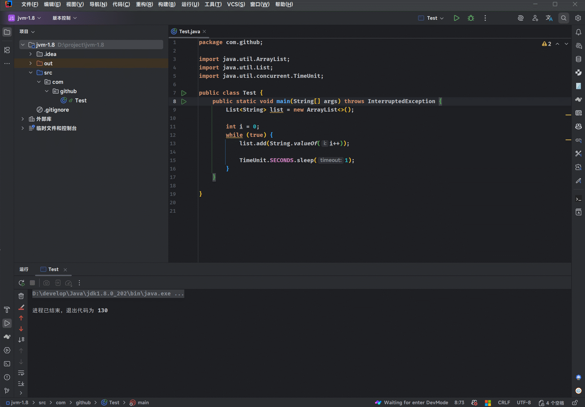
```

```md:img [cmd 控制台]
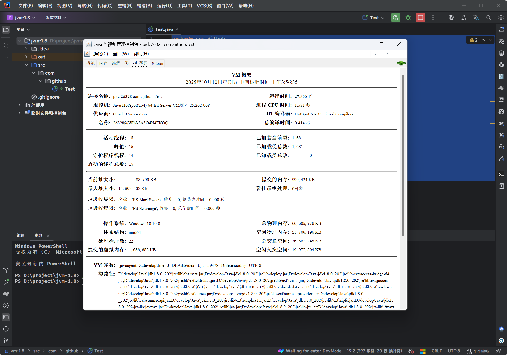
```

:::

### 2.6.4 Java 编译器

* Java 语言的`编译期`其实是一段`不确定`的操作过程，因为它可能是一个`前端编译器`，即：将 `.java` 文件转变为 `.class` 文件的过程。
* 也可能是指 JVM 的`后端运行时编译期`（JIT 编译器，Just In Time Compiler），即：将`.class` 文件转变为机器码的过程。
* 还可能是指`静态提前编译器`（AOT 编译器，Ahead Of Time Compiler），即：直接将`.class` 文件机器码的过程（静态编译成一个独立的、平台相关的本地可执行文件）。

> [!NOTE]
>
> 目前，AOT 编译器需要先用 `javac` 编译源码，再用 `native-image` 工具进行 AOT 编译。

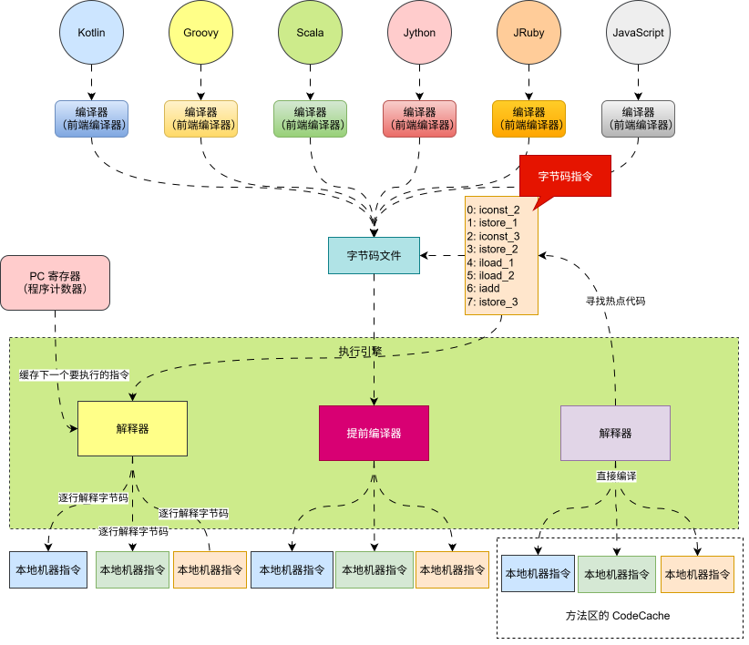

### 2.6.5 热点代码以及探测方式

#### 2.6.5.1 概述

* 是否需要启动`JIT 编译器`将`字节码`直接编译为对应平台上的`本地机器指令`，则需要根据代码`被调用的频率`而定。
* 关于哪些需要被编译为本地代码的字节码，我们称之为`热点代码`，JIT 编译器在运行时会针对哪些频繁被调用的`热点代码`做出`深度优化`，将其直接编译为对应平台的本地机器指令，以便提高 Java 程序的执行性能。

#### 2.6.5.2 热点代码

* `一个被多次调用的方法`或者`一个方法体内部循环次数较多的循环体`都可以被称为`热点代码`，都可以使用 JIT 编译器将其编译为本地机器指令。
* 由于这种`编译方式`发生在`方法的执行过程`中，因此也被称为`栈上替换`（OSR，On Stack Replacement）。


* 示例：

::: code-group

```java [Test.java]
package com.github;

public class Test {
    public static void main(String[] args) throws InterruptedException {
        long start = System.currentTimeMillis();

        // 这个循环会执行 10 亿次，是典型的热点代码区域
        long sum = 0;
        for (int i = 0; i < 1_000_000_000; i++) {
            sum += compute(i);
        }

        long end = System.currentTimeMillis();
        System.out.println("Sum: " + sum);
        System.out.println("Time: " + (end - start) + " ms");
    }

    // 这个方法会被频繁调用（10 亿次），成为热点方法
    public static int compute(int x) {
        return x * x + 2 * x + 1;
    }

}
```

```bash
# JVM 参数用来打印被 JIT 编译的方法
-XX:+PrintCompilation 
```

```md:img [cmd 控制台]
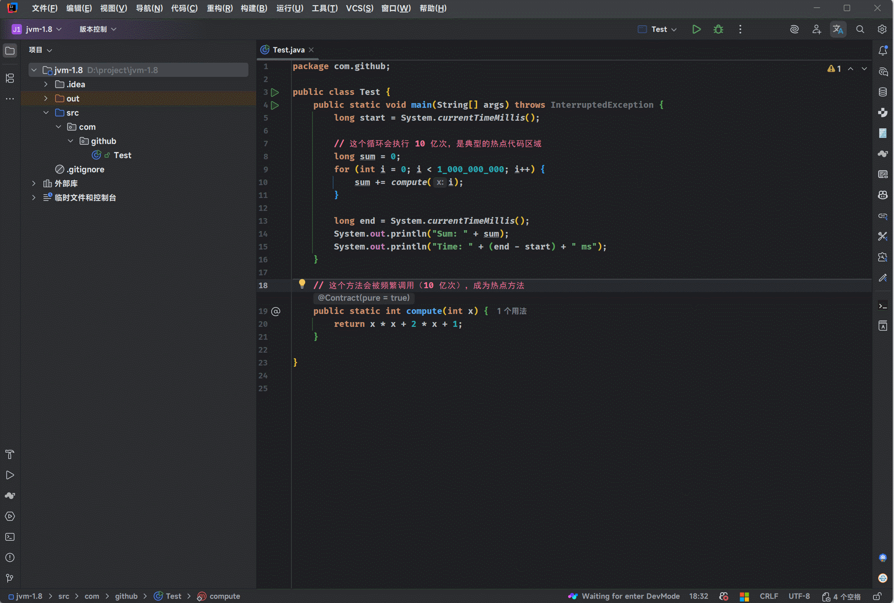
```

```txt [日志] {26-28}
73    2       3       java.lang.Object::<init> (1 bytes)
73    1       3       java.lang.AbstractStringBuilder::ensureCapacityInternal (27 bytes)
73    3       3       java.lang.StringBuilder::append (8 bytes)
73    8       3       java.lang.String::hashCode (55 bytes)
73    9       3       java.lang.AbstractStringBuilder::append (50 bytes)
74   10       3       java.lang.CharacterData::of (120 bytes)
74   11       3       java.lang.CharacterDataLatin1::getProperties (11 bytes)
74    7       4       java.lang.String::length (6 bytes)
74    5       4       sun.misc.ASCIICaseInsensitiveComparator::toLower (16 bytes)
74    6       4       sun.misc.ASCIICaseInsensitiveComparator::isUpper (18 bytes)
74    4       4       java.lang.String::charAt (29 bytes)
76   12       3       java.lang.String::equals (81 bytes)
76   13       3       java.lang.String::lastIndexOf (52 bytes)
76   14       3       java.lang.StringBuilder::toString (17 bytes)
76   15       3       java.lang.String::indexOf (70 bytes)
76   17     n 0       java.lang.System::arraycopy (native)   (static)
77   18       3       java.lang.String::startsWith (72 bytes)
77   19       3       java.lang.Math::min (11 bytes)
77   16       3       java.lang.StringBuilder::<init> (7 bytes)
77   20       3       java.lang.String::startsWith (7 bytes)
77   21       1       sun.instrument.TransformerManager::getSnapshotTransformerList (5 bytes)
77   22       3       java.io.WinNTFileSystem::isSlash (18 bytes)
77   23       3       java.lang.AbstractStringBuilder::append (29 bytes)
77   24  s    3       java.lang.StringBuffer::append (13 bytes)
77   25       3       sun.nio.cs.ext.DoubleByte$Encoder::encodeChar (21 bytes)
78   26       3       com.github.Test::compute (10 bytes)
78   27       1       com.github.Test::compute (10 bytes)
78   26       3       com.github.Test::compute (10 bytes)   made not entrant
79   28       3       java.lang.String::getChars (62 bytes)
80   29 %     3       com.github.Test::main @ 9 (95 bytes)
80   30       3       com.github.Test::main (95 bytes)
81   33       3       java.lang.String::<init> (82 bytes)
81   32       3       java.util.BitSet::checkInvariants (111 bytes)
81   31       3       java.util.BitSet::wordIndex (5 bytes)
81   34 %     4       com.github.Test::main @ 9 (95 bytes)
81   35       3       java.lang.String::indexOf (7 bytes)
82   37     n 0       sun.misc.Unsafe::getObjectVolatile (native)   
82   36       3       java.util.concurrent.ConcurrentHashMap::tabAt (21 bytes)
84   29 %     3       com.github.Test::main @ -2 (95 bytes)   made not entrant
497   34 %     4       com.github.Test::main @ -2 (95 bytes)   made not entrant
```

:::

#### 2.6.5.3 探测方式

##### 2.6.5.3.1 概述

* 一个方法究竟要`被调用多少次`，或者一个循环体内究竟需要执行`多少次循环`才能达到这个标准，必须需要一个明确的`阈值`，JIT 编译器才会将这些`热点代码`编译为本地机器指令，这里依靠的是`热点探测功能`。

* `目前 HotSpot VM 所采用的热点探测方式是基于计数器的热点探测`。
* 采用基于计数器的热点探测，HotSpot VM 将会为每个方法都建立 2 个不同类型的计数器，如下所示：
  * `方法调用计数器`（Invocation Counter）：用于统计方法的调用次数。
  * `回边计数器`（Back Edge Counter）：用于统计循环体执行的循环次数。

##### 2.6.5.3.2 方法调用计数器

* 方法调用计数器用于统计方法被调用的次数，它的默认阈值在 Client 模式下是 1500 次，在 Server 模式下是 10000 次，超过这个阈值，就会触发 JIT 编译。
* 这个阈值可以通过虚拟机参数 `-XX:CompileThreshold` 来人为指定，通常没有必要。

::: code-group

```bash
java -XX:+PrintFlagsFinal -version | grep -i CompileThreshold
```

```md:img [cmd 控制台]
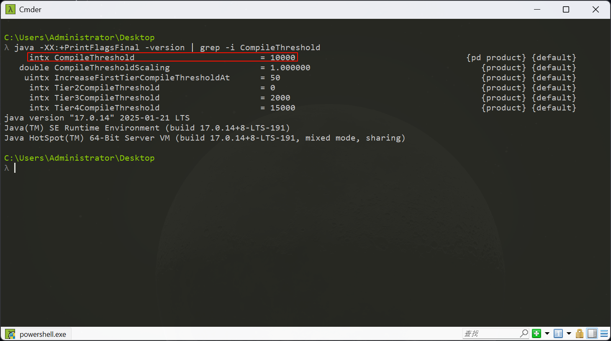
```

:::

* 当一个方法被调用的时候，先检查该方法是否存在被 JIT 编译过的版本。如果存在，则优先使用编译后的本地代码来执行。如果不存在已经编译过的版本，则将此方法的调用计数器值 +1 ，然后判断`方法调用计数器和回边计数器的值之和`是否超过了`阈值`。如果超过了阈值，就会向 JIT 提交一个该方法的代码编译请求。

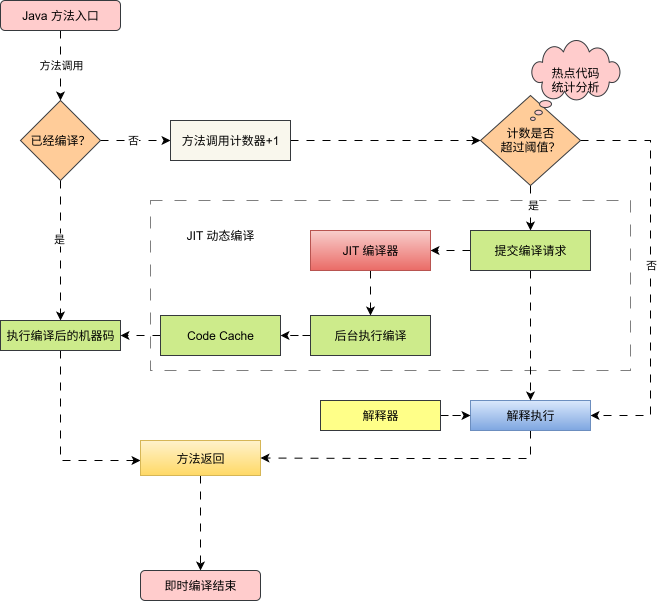

* 如果不做任何设置，`方法调用计数器`统计的并不是方法被调用的绝对次数，而是一个相对的执行频率，即：`一段时间之内该方法被调用的次数`。当超过了`一定的时间限度`，如果方法的调用次数依然不足以让其被提交给 JIT 编译器，那么该方法的`调用计数器`就会被`减少一半`，这个过程称为`方法调用计数器`的`热度衰减`（Counter Decay），而`这段时间`就成为此方法统计的`半衰周期`（Counter Half Life Time）。
* 进行`热度衰减`的动作是在虚拟机进行`垃圾收集`时顺便进行的，可以使用虚拟机参数 `-XX:-UseCounterDecay` 来关闭热度衰减，让`方法计数器`统计方法调用的绝对次数，这样，只要系统运行时间足够长，绝大部分方法都会被编译成本地代码。
* 另外，可以使用 `-XX:CounterHalfLifeTime` 参数设置半衰周期的时间，单位是秒。

##### .6.5.3.3 回边计数器

* `回边计数器`是统计一个方法中`循环体代码执行的次数`，在字节码中遇到控制流向跳转的指令称为`回边`（Back Edge），其也是为了触发 OSR 编译。

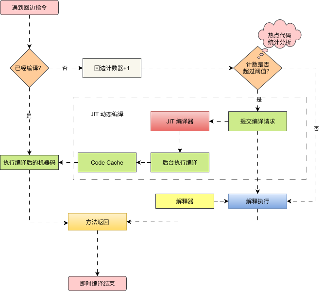

### 2.6.6 HotSpot VM 中设置程序执行方式

* 默认情况下，HotSpot VM 是采用`解释器`和 `JIT`并存的架构。
* 程序员可以根据具体的应用场景，通过命令显示地为 JVM 在`运行时`到底是`完全采用解释器`执行，还是`完全采用 JIT` 执行。

```bash
-Xint: 完全采用解释器模式执行程序
-Xcomp：完全采用 JIT 模式执行程序；但是，如果 JIT 出现问题，会退出解释器执行
-Xmixed： 采用解释器 + JIT 混合的模式执行程序
```


* 示例：默认情况（混合模式）

::: code-group

```bash
java -version
```

```md:img [cmd 控制台]
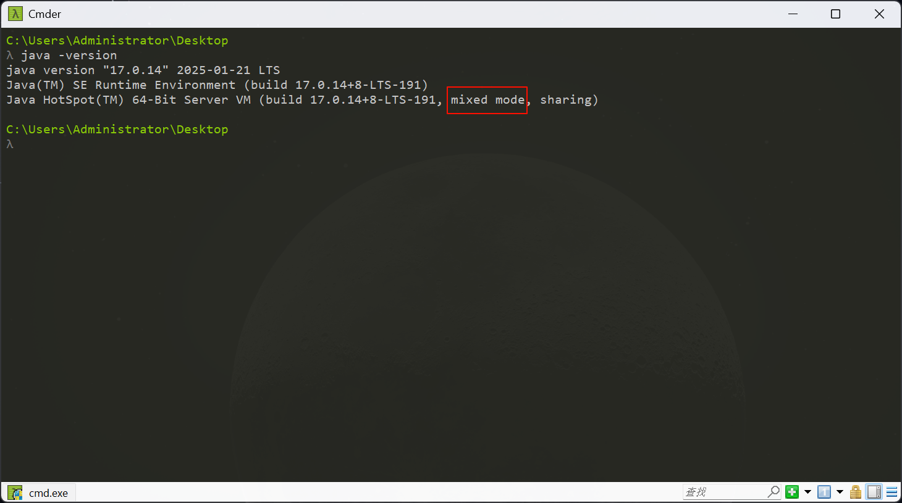
```

:::


* 示例：切换为完全解释器模式

::: code-group

```bash
java -Xint -version
```

```md:img [cmd 控制台]
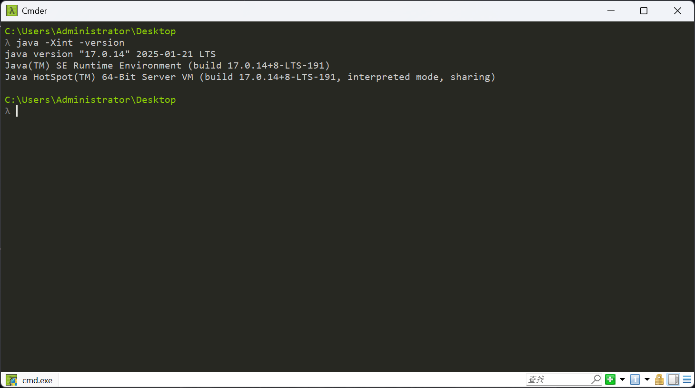
```

:::


* 示例：切换为完全 JIT 模式

::: code-group

```bash
java -Xcomp -version
```

```md:img [cmd 控制台]
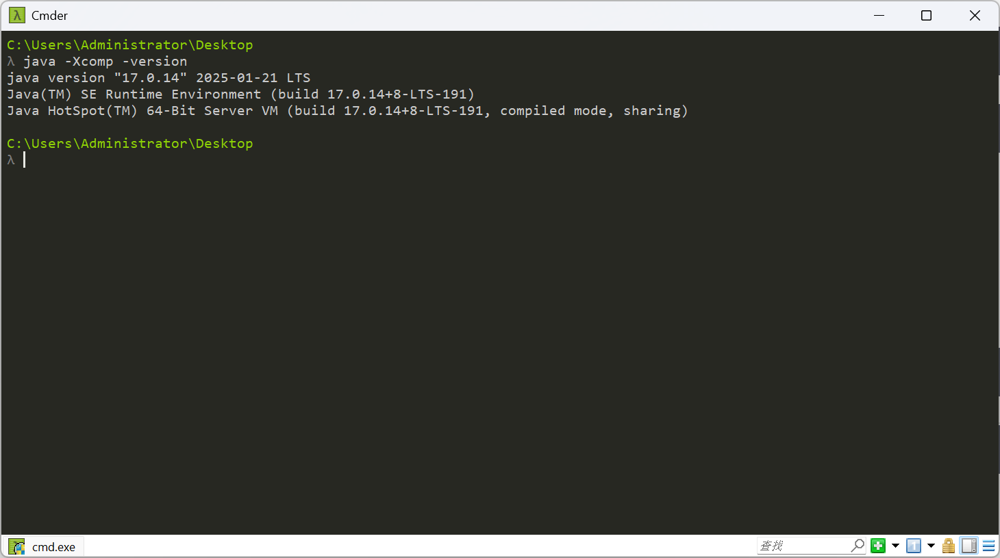
```

:::


* 示例：切换为混合模式

::: code-group

```bash
java -Xmixed -version
```

```md:img [cmd 控制台]
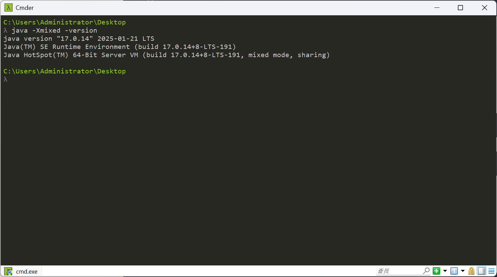
```

:::

### 2.6.7 HotSpot 中 JIT 的分类

#### 2.6.7.1 概述

* 在 HotSpot VM 中内嵌有两个 JIT 编译器，分别为 Client Compiler 和 Server Compiler，但大多数情况下我们简称为 C1 编译器和 C2 编译器。
* 开发人员可以通过如下命令显式指定Java虚拟机在运行时到底使用哪一种即时编译器。

```txt
-client：指定Java虚拟机运行在Client模式下，并使用 c1 编译器
-server：指定Java虚拟机运行在Server模式下，并使用 c2 编译器。
```

> [!NOTE]
>
> * ① C1 编译器会对字节码进行`简单和可靠的优化，耗时短`，以达到更快的编译速度。
> * ② C2 编译器进行`耗时较长的优化，以及激进优化`，但优化的代码执行效率更高。

* 64 位操作系统是不能设置 `-client` 参数的，因为 64 位操作系统模式就是 Server 模式。

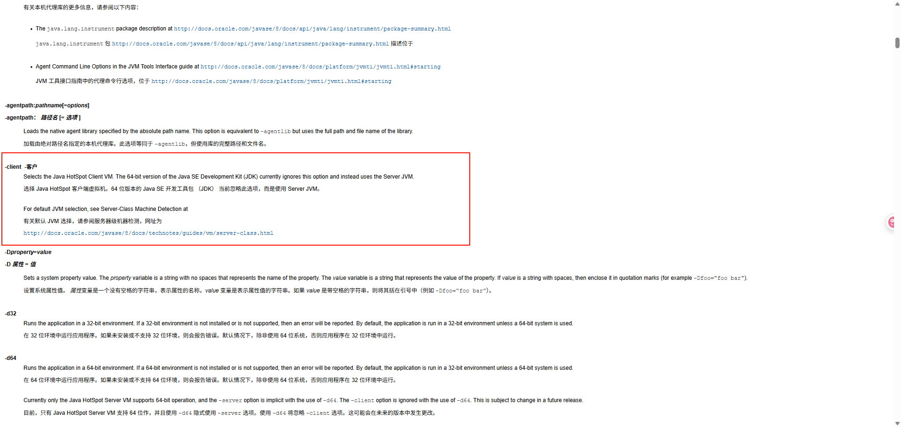

#### 2.6.7.2 C1 编译器和 C2 编译器不同的优化策略

* `C1 编译器`上主要有`方法内敛`、`去虚拟化`以及`冗余消除`的优化策略。

| C1 编译器的优化策略 | 描述                                                         |
| ------------------- | ------------------------------------------------------------ |
| 方法内联            | 将引用的函数代码编译到引用点处，这样可以减少栈帧的生成，减少参数传递以及跳转过程。 |
| 去虚拟化            | 对唯一的实现类进行内联。                                     |
| 冗余消除            | 在运行期间把一些不会执行的代码折叠掉。                       |

* `C2 编译器`的优化主要是在全局层面，逃逸分析是优化的基础。

| C2 编译器的优化策略 | 描述                                   |
| ------------------- | -------------------------------------- |
| 标量替换            | 用标量值代替聚合对象的属性值。         |
| 栈上分配            | 对于未逃逸的对象分配对象在栈而不是堆。 |
| 同步消除            | 清除同步操作，通常指 synchronized 。   |

