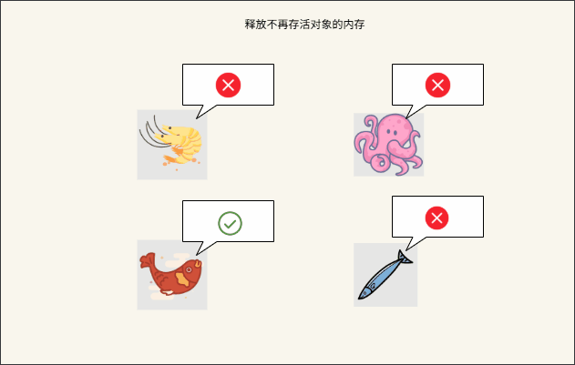
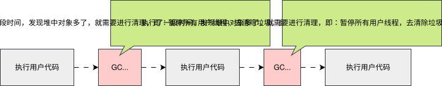
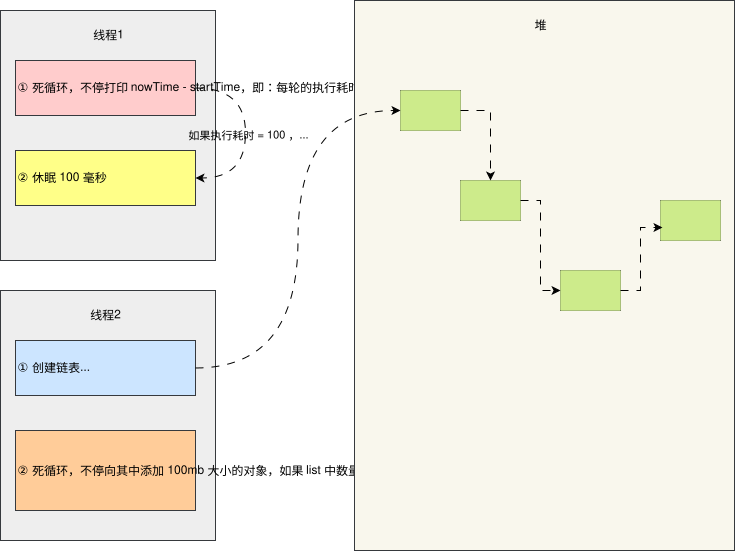
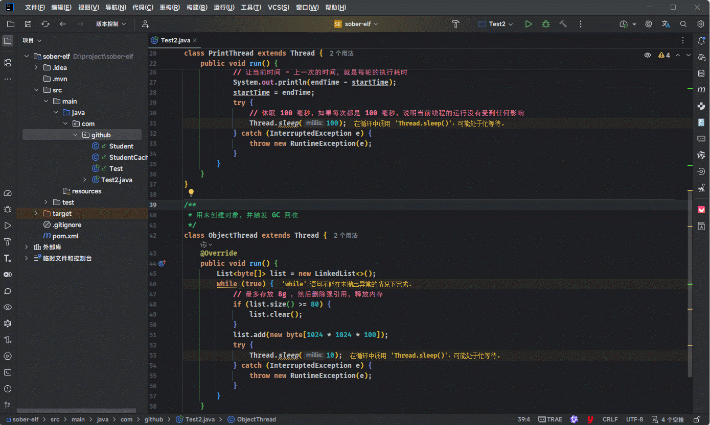
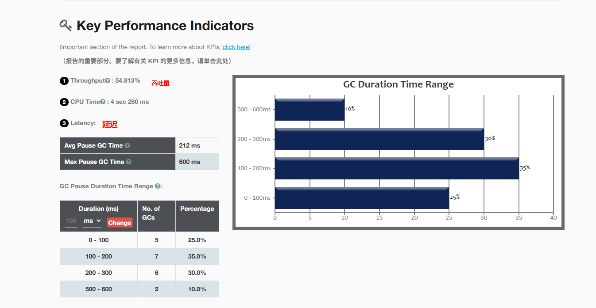
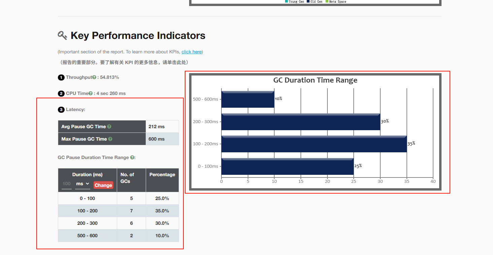
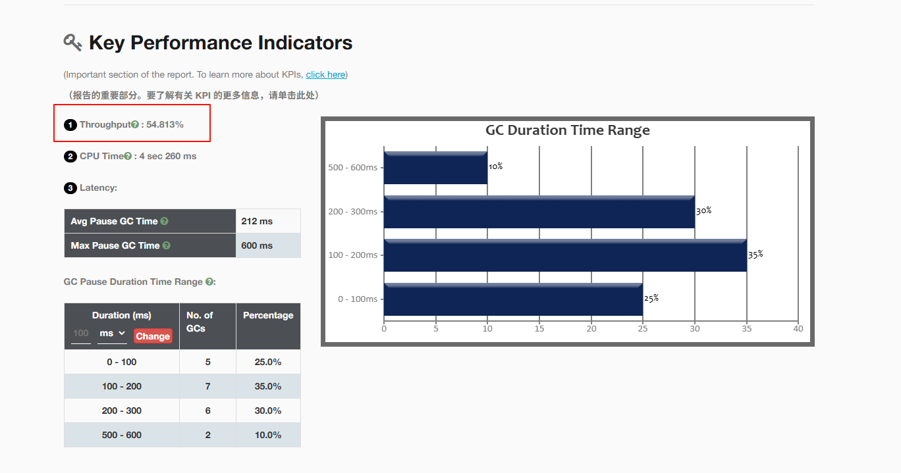
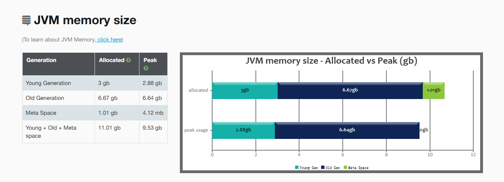

# 第一章：垃圾回收算法

## 1.1 核心思想

* JVM 要完成垃圾回收，需要做两件事情：
* :one: 对内存中的对象进行分类（可达性分析算法），目的是为了找到可以存活的对象。


* :two: 释放不再存活对象的内存，使得程序能够再次利用这部分空间。



## 1.2 垃圾回收算法的历史

### 1.2.1 早期阶段（手动内存管理）

* 在最早的计算机程序设计中，内存管理主要依赖开发者手动分配和释放内存（如 C、C++ 中的 `malloc` 和 `free`）。
* 这种方法虽然高效，但容易导致内存泄漏或内存错误。

### 1.2.2 自动垃圾回收的提出

* 1959 年：LISP（一种编程语言）最早实现了自动垃圾回收。LISP 的设计者 John McCarthy提 出了垃圾回收的概念，旨在避免程序员手动管理内存。LISP 的垃圾回收使用了`引用计数`技术来管理内存。

* 1960 年：其他语言，如：ALGOL，也开始探索垃圾回收，但当时的算法普遍效率较低，导致了性能上的问题。

## 1.3 垃圾算法的分类

* 1960 年，JohnMcCarthy 发布了第一个 GC 算法，即：标记 --- 清除算法。
* 1963 年，Marvin L.Minsky 发布了复制算法。
* ... 

> [!NOTE]
>
> 本质上后续所有的垃圾回收算法，都是在上述两种算法的基础上优化而来。

```markmap
# GC 算法
## 标记--清除算法（Mark Sweep GC）
## 复制算法（Copying GC）
## 标记--整理算法（Mark Compact GC）
## 分代 GC（Generational GC）
```

> [!NOTE]
>
> 之所以会出现这么多的 GC 算法，是因为其有自己的优缺点，适应的场景不同！！！

## 1.4 垃圾回收算法的评价标准

### 1.4.1 概述

* 在 Java 中，垃圾回收需要通过一个单独的 GC 线程来完成。
* 但是，不管使用哪一种 GC 算法，都会有`部分阶段`需要停止所有的用户线程，这个过程被称为 STW（Stop The World）。

> [!NOTE]
>
> * ① 在用户线程停止的情况下，程序是没有办法处理用户的请求的，即：用户在使用过程中，程序的处理突然停止，用户只能干等着，用户的体验比较差。
> * ② 假设去银行办事，由于银行内部的原因，如：停电了，导致正在办理业务的这些用户只能干等着，什么也做不了，导致用户的体验非常差。
> * ③ 换言之，如果 SWT 时间过长会影响用户的使用。



### 1.4.2 演示 SWT

* 需求：演示 SWT 对应用程序的影响。

> [!NOTE]
>
> * ① 设计一个线程，通过死循环不停打印`当前时间 - 上一轮时间`的时候，即：每轮的执行耗时，之后休眠 100 毫秒。如果每次执行耗时都是 100 毫秒，则说明当前线程的运行是没有受到任何影响的。
> * ② 设计另一个线程，通过死循环不停地向`链表`添加 100MB 大小的对象；但是，如果链表中的对象的数量 >=80 ，则清空链接，让链表和其保存的对象之间的强引用断开，以便让 GC 回收内存，之后休眠 10  毫秒。
> * ③ 如果是秒杀场景，现在距离秒杀结束还剩 5 秒结束；此时，用户正在进行下单，恰好 Java 应用程序在执行 GC 回收，并且整个执行耗时比较长，SWT 的时间长达 6~8 秒。本来用户是可以下单成功的；但是，由于垃圾回收影响了用户的正常下单操作，导致用户下单没有成功，对用户的体验非常差，下次可能就不再使用该软件。


* 实验的流程图，如下所示：



* 示例：

::: code-group

```bash
# JVM 参数
-XX:+UseSerialGC  -Xmx10g -verbose:gc
```

```java [Test.java]
package com.github;

import java.util.LinkedList;
import java.util.List;

public class Test {
    public static void main(String[] args)  {
        PrintThread printThread = new PrintThread();
        ObjectThread objectThread = new ObjectThread();

        printThread.start();
        objectThread.start();

    }
}

/**
 * 用来打印当前时间
 */
class PrintThread extends Thread {
    @Override
    public void run() {
        long startTime = System.currentTimeMillis();
        while (true) {
            long endTime = System.currentTimeMillis();
            // 让当前时间 - 上一次的时间，就是每轮的执行耗时
            System.out.println(endTime - startTime);
            startTime = endTime;
            try {
                // 休眠 100 毫秒，如果每次都是 100 毫秒，说明当前线程的运行没有受到任何影响
                Thread.sleep(100);
            } catch (InterruptedException e) {
                throw new RuntimeException(e);
            }
        }
    }
}

/**
 * 用来创建对象，并触发 GC 回收
 */
class ObjectThread extends Thread {
    @Override
    public void run() {
        List<byte[]> list = new LinkedList<>();
        while (true) {
            // 最多存放 8g ，然后删除强引用，释放内存
            if (list.size() >= 80) {
                list.clear();
            }
            list.add(new byte[1024 * 1024 * 100]);
            try {
                Thread.sleep(10);
            } catch (InterruptedException e) {
                throw new RuntimeException(e);
            }
        }
    }
}
```

```md:img [cmd 控制台]

```

```txt [日志]
0
[GC (Allocation Failure)  374313K->307949K(1520448K), 0.1026225 secs]
171
[GC (Allocation Failure)  626981K->615127K(1520448K), 0.0998841 secs]
148
[GC (Allocation Failure)  940292K->922327K(1520448K), 0.0980729 secs]
141
[GC (Allocation Failure)  1340925K->1331927K(1827660K), 0.1343144 secs]
[Full GC (Allocation Failure)  1331927K->1331926K(1827660K), 0.0022907 secs]
200 # 时间 > 100 毫秒，说明这段时间没有执行打印线程
101
[GC (Allocation Failure)  2169592K->2151127K(3218920K), 0.2640030 secs]
308 # 时间 > 100 毫秒，说明这段时间没有执行打印线程
100
[GC (Allocation Failure)  2988409K->2970327K(3935748K), 0.2898396 secs]
[Full GC (Allocation Failure)  2970327K->2970327K(3935748K), 0.0101412 secs]
319 # 时间 > 100 毫秒，说明这段时间没有执行打印线程
102
100
[GC (Allocation Failure)  4749529K->4711128K(6930920K), 0.6008220 secs]
101
700 # 时间 > 100 毫秒，说明这段时间没有执行打印线程
100
[GC (Allocation Failure)  6546634K->6451960K(8466980K), 0.6150610 secs]
[Full GC (Allocation Failure)  6451960K->6451960K(8466980K), 0.0177261 secs]
681 # 时间 > 100 毫秒，说明这段时间没有执行打印线程
101
100
100
```

:::

### 1.4.2 评价标准

#### 1.4.2.1 概述

* 判断一个 GC 算法是否优秀，可以从以下几个方面考虑：

| GC 指标                             | 描述                                                 |
| ----------------------------------- | ---------------------------------------------------- |
| GC 延迟（GC Latency）               | 关注 GC 对程序响应时间的影响，即：“停多久”           |
| GC 吞吐量（GC Throughput）          | 关注 GC 占用资源的比例，即：“效率多高”               |
| 占用空间（Footprint ）              | 关注内存资源的消耗，即：“开销多大”                   |
| 应用程序指标（Application Metrics） | 响应时间（Response Time）<br/>吞吐量（ Throughput ） |

> [!NOTE]
>
> * ① `应用程序指标`并不是`GC 指标`。但是，GC 调优的最终目的是为了提高整体应用程序的性能。
> * ② 因此，需要将`GC 指标`和`应用程序指标`一起研究，以确保调整`GC 指标`确实能提高应用程序性能。
> * ③ 可以通过 [gceasy](https://gceasy.io/) 网站来证明`GC 指标`，对应的 JVM 参数是：
>
> ```bash
> -XX:+UseSerialGC  -Xmx10g -verbose:gc -XX:+PrintGCDetails -XX:+PrintGCTimeStamps -Xloggc:D:/demo/gc-%t.log
> ```


* 示例：GC 关键指标



####  1.4.2.2 延迟（Latency）

* `GC 延迟`是主要的 GC 性能指标。当 GC 开始执行垃圾回收时（GC 事件开始运行，STW），其会暂用所有的用户线程，以便可以执行内存管理任务。换言之，在 GC 事件完成之前，是无法处理用户的任何请求的。衡量每个 GC 事件`暂停应用程序多长时间`的指标称为`GC 延迟`。



* `GC 延迟`是以`时间单位`（毫秒、秒、分钟）进行报告的，即：写到日志中的。其中，`平均 GC 暂停时间`、`最大 GC 暂停时间`以及`GC 暂停时间范围`非常重要。

> [!NOTE]
>
> `高性能的应用程序`应该以`低延迟`为`主要目标`，即：越低越好（每次 STW 要短，以保证响应性/实时性）。

* 理想的 GC 暂停时间，取决于应用程序。

> [!NOTE]
>
> * ① `高性能应用程序`（交互式应用程序），如：网页、游戏、股票交易平台、太空任务等，需要以`毫秒`为单位的暂停时间，即：追求低延迟。
> * ② `企业业务应用程序`，如：ERP、CRM、银行核心系统等，通常可以容忍`1-5 秒`的暂停时间。
> * ③ `批处理 / 大数据应用`，如：离线分析、ETL 作业等，通常可以容忍`数秒至数十秒`的暂停时间。

#### 1.4.2.4 吞吐量（Throughput）

* `GC 吞吐量`指的是`CPU 用于指定用户代码的时间` 和`CPU 总时间`的比值。

$$
\text{吞吐量} = \frac{\text{执行用户代码时间}}{\text{执行用户代码时间} + \text{GC时间}}
$$

> [!NOTE]
>
> `GC 时间`：程序运行期间所有垃圾回收事件所消耗时间的总和，包括：标记、清理、压缩等阶段的耗时（含暂停时



* 假设虚拟机一共运行了 100 分钟，其中 GC 花掉了 1 分钟，那么吞吐量就是 99% 。

$$
\text{吞吐量} = \frac{\text{执行用户代码时间}}{\text{总运行时间}} = \frac{100 - 1}{100} = \frac{99}{100} = 99\%
$$

* 理想的 GC 吞吐量，取决于应用程序。通常情况下，面向客户的应用程序，应该将 GC 吞吐量提高到 98% 以上。

#### 1.4.2.5 占用空间（Footprint ）

* `占用空间`是 Java 性能的一个关键方面，指的是 Java 应用程序在执行过程中使用的内存量。



* `占用空间`指标衡量 Java 应用程序的总内存使用情况，包括：Java 堆、JVM 内部的本机内存、线程堆栈和其他数据结构。

> [!NOTE]
>
> ::: details 点我查看 具体细节
>
> * ① 占用空间 = 堆内存 + GC 元数据 + 堆外内存 + GC 运行时开销（严格讲不算），即：占用空间不包括应用程序本身的业务数据，而是指为了实现自动内存管理（即 GC）所付出的“额外代价”。
> * ② 堆内存：最直观的就是`年轻代`和`老年代`。
>   * 更大的堆可以减少 GC 频率，提升吞吐量，但会增加 Footprint。
> * ③ GC 元数据：这是不同 GC 算法引入的额外内存开销，用于高效追踪对象引用和回收空间。
>
> | 元数据                         | 用途                         | GC                       |
> | ------------------------------ | ---------------------------- | ------------------------ |
> | 卡表（Card Table）             | 记录老年代到年轻代的跨代引用 | CMS、G1、ZGC、Shenandoah |
> | 记忆集（Remembered Set, RSet） | G1 中记录 Region 间的引用    | G1 GC（开销大）          |
> | 位图（Bitmaps）                | 标记存活对象、引用状态       | 所有 GC（如 G1、ZGC）    |
> | SATB 标记栈                    | 并发标记时保存对象快照       | G1、Shenandoah           |
> | 转发指针 / Brooks 指针         | 对象移动时的转发记录         | Shenandoah               |
>
> * ④ 堆外内存：某些 GC 将元数据放在 JVM 堆之外，但仍占系统内存（RSS）
>
> | 堆外内存                         | 用途                                                         |
> | -------------------------------- | ------------------------------------------------------------ |
> | ZGC 的映射表                     | 使用`mmap`分配本地内存存储元数据（如 PageTable、ZAddressArray） |
> | G1 的 CSet（Collection Set）结构 | 管理待回收 Region 的元数据                                   |
> | GC 线程栈                        | 每个 GC 线程默认栈大小 1MB，多线程时累积显著                 |
>
> * ⑤  GC 运行时资源开销（间接 Footprint）：虽然严格来说不属于“内存 Footprint”，但在实际评估中常被关联讨论。
>
> | GC 运行时资源开销               | 用途                                           |
> | ------------------------------- | ---------------------------------------------- |
> | CPU 消耗                        | 并发标记、写屏障、压缩等操作占用 CPU，影响吞吐 |
> | 线程数量                        | ZGC/Shenandoah 使用多个并发线程，增加调度开销  |
> | 写屏障（Write Barrier）指令开销 | 每次对象引用更新都要执行额外代码               |
>
> :::

#### 1.4.2.6 总结

* 通常而言，延迟（暂停时间）、吞吐量以及占用空间，只能三选二。

> [!NOTE]
>
> * ① 一般来说，占用空间越大，最大暂停时间就会越大，那么延迟就会稍微高些。
> * ② 为了降低延时，可以将大的暂停时间分为多个小的暂停时间，即：增加 GC 的频率。
> * ③ 但是，这会导致 GC 的消耗增多（每次执行 GC ，都需要执行一些重复的准备工作），导致 GC 的总时间是上升的，进而导致吞吐量降低。

* 不同的 GC 算法适用于不同的应用场景。

## 1.5 标记清除算法

### 1.5.1 概述

* 标记清除算法的核心思想分为两个阶段：

| 阶段           | 描述                                                         |
| -------------- | ------------------------------------------------------------ |
| :one: 标记阶段 | 使用可达性分析算法，从 GC Root 开始通过引用链遍历出所有存活对象。<br>对所有存活对象进行标记。 |
| :two: 清除阶段 | 从内存中删除没有被标记的对象，即：非存活对象。               |

### 1.5.2 演示

* 标记阶段：对所有存活对象进行标记。


## 1.6 复制算法


## 1.7 标记整理算法


## 1.8 分代垃圾算法


# 第二章：垃圾回收器

