> [!IMPORTANT]
>
> ::: details 点我查看 前置条件
>
> | 软件       | 版本                                    | 说明                                 |
> | ---------- | --------------------------------------- | ------------------------------------ |
> | JDK        | 8u202 及之前版本 <br>17.0.12 及之前版本 | Java 开发工具包                      |
> | IDEA       | 最新                                    | 开发工具                             |
> | Linux      | AlmaLinux9                              | 操作系统                             |
> | Maven      | 3.9.x                                   | 项目构建工具                         |
> | SpringBoot | 3.x                                     | 简化 Spring 应用的初始搭建和开发过程 |
>
> :::


# 第一章：Java 上层技术和 JVM

## 1.1 概述

* 我们在项目中使用的`框架`等高级技术，都是基于 Java API ，而 Java API 是运行在 JVM 之上。

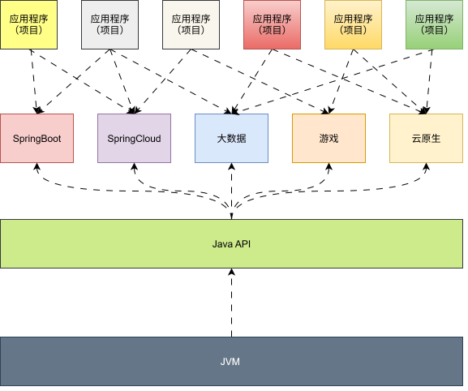

## 1.2 开发人员是如何看待上层框架？

* 一些有一定工作经验的开发人员，一直觉得`SSM`、`微服务`、`云原生`等上层技术才是重点，基础技术（底层技术）并不重要，这其实是一种`“本末倒置”`的想法。

> [!NOTE]
>
> * ① 计算机考研，简称：408 ，除了考`数学`等课程之外，还会考四个科目，如：`《数据结构和算法》`、`《计算机组成原理》`、`《操作系统》`和`《计算机网络》`，这些科目和`高级编程语言`（Java、Python 等）没有太多关联，只是因为这些是作为专业性人才必须懂得的基础课程。
> * ② 万丈高楼平地起，勿在浮沙筑高台。

* 如果将`核心类库的 API` 比做`数学公式`；那么，`Java 虚拟机知识`就类似于`公式的推导过程`。

## 1.3 为什么要学习 JVM？

* ① 正在运行的系统突然卡死，系统无法访问，甚至出现 OOM（Out Of Memory，内存溢出）。
* ② 想解决线上 JVM GC 问题；但是，无从下手。
* ③ 新项目上线，对各种 JVM 参数设置一脸迷茫，直接默认，却导致项目运行缓慢，乃至项目失败。
* ④ 每次面试之前都需要重新背一遍 JVM 一些原理性概念的东西；但是，面试官却经常问我们在实际项目中如何对 JVM 参数进行调优，如何解决 GC、OOM 等问题，我们却一脸懵逼！


# 第二章：功能强大的 JVM

## 2.1 Java 生态圈

* Java 生态圈是指围绕 Java 编程语言所形成的一整套技术体系、开发工具、框架、标准和社区。

| 类别            | 主要技术                                                    | 说明                                                      |
| --------------- | ----------------------------------------------------------- | --------------------------------------------------------- |
| 核心平台        | JDK / JVM                                                   | Java 运行基础，推荐使用 OpenJDK LTS 版本（如 Java 17/21） |
| 构建工具        | Maven、Gradle                                               | Maven 简单规范，Gradle 更灵活高效（Android 默认）         |
| 开发框架        | Spring Boot、Spring Cloud                                   | 企业开发主流，微服务首选                                  |
| ^^              | Jakarta EE                                                  | 传统企业标准，适用于老系统                                |
| ^^              | Quarkus、Micronaut                                          | 新一代云原生框架，启动快、支持原生编译                    |
| ^^              | JDBC、JPA/Hibernate、MyBatis                                | 数据库操作，Spring Data 简化集成                          |
| ^^              | JUnit、Mockito                                              | 单元测试标配                                              |
| 开发工具（IDE） | IntelliJ IDEA、Eclipse                                      | IDEA 更智能，Eclipse 开源免费                             |
| 微服务组件      | Eureka/Nacos（注册）、Gateway（网关）、Config/Nacos（配置） | Spring Cloud 常用组合                                     |
| 消息队列        | Kafka、RabbitMQ                                             | 分布式系统解耦与异步处理                                  |
| 监控追踪        | Prometheus+Grafana、SkyWalking                              | 指标监控与链路追踪                                        |
| 日志            | SLF4J + Logback / Log4j2                                    | 通用日志门面与实现                                        |
| 云原生          | Docker、Kubernetes                                          | 容器化部署标准环境                                        |
| 大数据          | Spark、Flink（Java/Scala）                                  | 支持 Java 接口的大数据处理引擎                            |
| 移动开发        | Android（Java/Kotlin）                                      | Java 曾是 Android 主要语言                                |

## 2.2 Java & JVM

### 2.2.1 Java 是跨平台的语言

* Java 凭借其“一次编写，到处运行”的跨平台特性，在企业级开发、移动开发、大数据、云计算等领域占据重要地位。

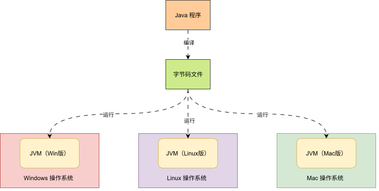

### 2.2.2 JVM 是跨语言的平台

* JVM 虽然最初是为运行 Java 语言设计的，但经过多年发展，它已经演变为一个强大、高效、跨语言的运行平台，支持多种编程语言在上面运行。

> [!NOTE]
>
> * ① 随着 Java7 的正式发布，Java 虚拟机的设计者们通过 JSR-292 规范，基本上实现在
Java虚拟机平台上运行非 Java 语言编写的程序。
> * ② Java 虚拟机根本不关心运行在其内部的程序到底是使用何种编程语言编写的，它只关心“字节码”文件。也就是说 Java虚拟机拥有语言无关性，并不会单纯地与 Java 语言“终身绑定”，只要其他编程语言的编译结果满足并包含 Java 虚
>   拟机的内部指令集、符号表以及其他的辅助信息，它就是一个有效的字节码文件，就能够被虚拟机所识别并装载运行。

* JVM 已从“Java 虚拟机”演变为“通用语言运行平台”，是多语言共存、高可靠性、企业级应用的重要基石。

> [!NOTE]
>
> Java 语言不是最强大的语言；但是，JVM 是最强大的虚拟机。

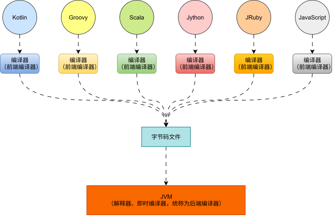

### 2.2.3 多语言混合编程

* 在大型项目中，合理利用`JVM 平台的多语言混合编程能力`，可以充分发挥不同语言的优势，提升开发效率、代码可维护性和系统性能。Java 生态经过多年发展，已从“单一语言平台”演变为“多语言共存”的成熟生态系统。

* 其`核心理念`就是`按照场景选语言，不迷信“统一语言”`。

> [!NOTE]
>
> 目标不是`所有模块都用同一种语言`，而是`每个模块用最适合的语言`。

| 语言    | 优势                     | 适用场景                                |
| ------- | ------------------------ | --------------------------------------- |
| Java    | 稳定、生态全、团队熟悉   | 核心业务、老系统维护、企业级服务        |
| Kotlin  | 简洁、空安全、函数式     | 新业务开发、Android、Spring Boot 微服务 |
| Scala   | 强类型、函数式、高表达力 | 大数据（Spark）、高并发中间件           |
| Groovy  | 脚本化、DSL 友好         | 构建脚本（Gradle）、测试、自动化        |
| Clojure | Lisp 风格、不可变性      | 高并发、规则引擎、函数式核心            |

* 大型项目中的典型混合编程架构，如下所示：

```txt
大型电商平台（JVM 多语言架构）
│
├── 核心订单服务（Java）        → 稳定性优先，团队熟悉，对接老系统
├── 用户推荐系统（Scala）       → 使用 Spark/Flink 做实时计算
├── 管理后台（Kotlin + Spring Boot） → 快速开发，减少样板代码
├── 构建脚本（Groovy/Kotlin DSL） → Gradle 构建配置
├── 自动化测试（Groovy + Spock） → Spock 框架写 BDD 测试
├── 规则引擎（Clojure）         → 处理促销规则、风控逻辑（高表达力）
└── CI/CD 脚本（Kotlin）        → 使用 Kotlin 写自定义 Gradle 插件
```

* 对于这些运行于 JVM 之上的、Java 之外的编程语言，来自系统级的、底层的支持正在迅速地增强，以 JSR-292为核心的一系列项目和功能改进（DaVinciMachine 项目、Nashorn 引擎、InvokeDynamic 指令、java.lang.invoke 包等），推动 JVM 从 `Java语言的虚拟机` 向 `多语言虚拟机` 的方向发展。

## 2.3 Java 发展史上的重大事件

* 1990 年，在 Sun 公司中，由 Patrick Naughton、MikeSheridan 及 James Gosling 领导的小组 Green Team，开发出的新的程序语言，命名为 Oak，后期命名为 Java 。

> [!NOTE]
>
> * 目标是为智能家电开发新语言和系统，后演变为 Java 起源。
> * 最初用于嵌入式设备，因名字已被注册，后改名为 Java。

* 1995 年，Sun 正式发布 Java 和 HotJava 产品，Java 首次公开亮相。

> [!NOTE]
>
> 提出 “Write Once, Run Anywhere” 理念。

* 1996 年 1 月 23 日，Sun 发布了JDK 1.0。

> [!NOTE]
>
> Java 正式进入开发者视野，包含 AWT、JavaBeans、JDBC 等核心 API。

* 1998 年，JDK 1.2 版本发布。同时，Sun 发布了 JSP/Servlet、EJB 规范，以及将 Java 分成了 J2EE、J2SE 和 J2ME。

> [!NOTE]
>
> Java 正式进入企业级（EJB、Servlet）、桌面（Swing）和移动（ME）领域。

* 2000 年，JDK 1.3 发布，`HotSpot Virtual Machine 正式发布，成为 Java 的默认虚拟机`。

> [!NOTE]
>
> 替代早期的 Classic VM，显著提升性能，奠定 JVM 长期统治地位。

* 2002 年，JDK 1.4 发布，古老的 Classic 虚拟机退出历史舞台。

> [!NOTE]
>
> 功能大幅增强，Classic VM 正式退出历史舞台

* 2003 年底，`Java 平台的 Scala 正式发布，同年 Groovy 也加入了 Java 阵营`。

> [!NOTE]
>
> JVM 多语言生态开启，Scala 推动函数式编程，Groovy 提供脚本能力

* 2004 年，JDK 1.5 发布。同时 JDK 1.5 改名为 JavaSE 5.0。

> [!NOTE]
>
> 引入泛型、注解、自动装箱、枚举、并发包（java.util.concurrent）等现代特性。

* 2006 年，JDK 6 发布。

> [!NOTE]
>
> * 支持脚本引擎（JSR 223）、JDBC 4.0、编译器优化；Java EE 容器广泛部署。
>
> * 同年，`Java 开源并建立了 OpenJDK，Hotspot 虚拟机也成为了OpenJDK 中的默认虚拟机`。

* 2007 年，`Java 平台迎来了新伙伴 clojure` 。

> [!NOTE]
>
> Lisp 风格的函数式语言加入 JVM 生态，强调不可变性和并发安全。

* 2008 年，Oracle 收购了 BEA，`得到了 JRockit 虚拟机`。

> [!NOTE]
>
> JRockit 以低延迟著称，为后续 JVM 整合埋下伏笔。

* 2009 年，Twitter 宣布把后台大部分程序从 Ruby 迁移到 Scala，这是Java平台的又一次大规模应用。

> [!NOTE]
>
> 展示 JVM 在高并发、大规模系统中的优势，推动 Scala 流行。

* 2010 年，Oracle 收购了 Sun，`获得 Java 商标和最真价值的 HotSpot 虚拟机`。

> [!NOTE]
>
> * Java 进入 Oracle 时代，引发社区对闭源化的担忧。
> * 此时，Oracle 拥有市场占用率最高的两款虚拟机 HotSpot 和 JRockit ，并计划在未来对它们进行整合：HotRockit 。

* 2011 年，JDK 7 发布。在 JDK1.7u4 中，`正式启用了新的垃圾回收器 G1`。

> [!NOTE]
>
> * 新特性：`try-with-resources`、`String in switch`、NIO.2、Fork/Join 框架。
>
> * G1 GC 正式启用。

* 2014 年，JDK 8 发布，史上最成功的版本，至今仍被广泛使用。

> [!NOTE]
>
> * 里程碑版本：引入 Lambda 表达式、Stream API、Optional、新的日期时间 API（JSR 310）、默认方法。
> * 函数式编程普及。

* 2017 年，JDK 9 发布。`将 G1 设置为默认 GC，替代 CMS。`

> [!NOTE]
>
> * 模块化系统（JPMS）上线、`G1 成为默认 GC`（取代 CMS）、JShell（REPL）工具、Jigsaw 项目落地。
> * 同年，IBM 的 J9 开源，形成了现在的 Open J9 社区（与 OpenJDK 并行的轻量级 JVM，适合容器和云原生环境）。

* 2018 年，Android 的 Java 侵权案判决，Google 赔偿 Oracle 计 88 亿美元（后经上诉，2021 年美国最高法院裁定为“合理使用”，免于赔偿）。

> [!NOTE]
>
> * 同年，Oracle 宣告 JavaEE 成为历史名词，JDBC、JMS、Servlet 赠予 Eclipse 基金会（Java EE 正式“去 Oracle 化”，开启开源新篇章）。
> * 同年，JDK 11 发布，LTS 版本的 JDK 发布革命性的 ZGC，调整 JDK 授权许可（生产推荐版本：ZGC（实验性）、HTTP Client（标准库）、移除 JavaFX 和 CORBA；商业授权变更（Oracle JDK 开始收费））。

* 2019 年，JDK 12 发布，加入 RedHat 领导开发的 Shenandoah GC。

> [!NOTE]
>
> 引入 Shenandoah GC（Red Hat 开发，低延迟 GC）；Switch 表达式（预览）。

* 2021 年，JDK 17（LTS） 发布。

> [!NOTE]
>
> * LTS 版本：密封类（sealed classes）、模式匹配（预览）、移除 Applet API。
>
> * Oracle 宣布 OpenJDK 商业使用免费（仅限 LTS 版本）。

* 2023 年，JDK 21（LTS） 发布。

> [!NOTE]
>
> LTS 版本：虚拟线程（Virtual Threads，原 Project Loom）、结构化并发、模式匹配（稳定）、记录类（Records）稳定。

* 2024 年，JDK 22 发布。

> [!NOTE]
>
> 持续优化虚拟线程、外部函数与内存 API（Foreign Function & Memory API）等。

## 2.4 虚拟机

### 2.4.1 概述

* 所谓的虚拟机（Virtual Machine）就是一台虚拟的计算机，其是一款`软件`，用来执行一系列虚拟的计算机指令。
* `虚拟机`大致可以分为`系统虚拟机`和`程序虚拟机`两类。
* 其中，`系统虚拟机`是`完全对物理计算机的仿真`，提供了一个可以运行`完整操作系统`的软件平台，如：VMWare 等。

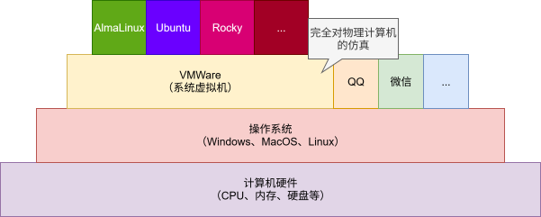

* 其中，`程序虚拟机`是`专门为执行单个计算机程序而设计的`，如：JVM（只能执行字节码指令）。

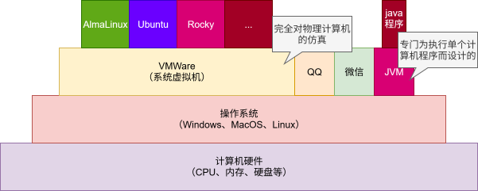

* 无论是`系统虚拟机`还是`程序虚拟机`，在上门运行的软件都被限制于虚拟机提供的资源。

### 2.4.2 Java 虚拟机（JVM）

#### 2.4.2.1 概述

* Java 虚拟机是一台执行 Java 字节码的虚拟计算机，它拥有独立的运行机制，其运行的 Java 字节码未必由 Java 语言编译而成。
* JVM 平台的各种语言可以共享 Java 虚拟机带来的跨平台性、优秀的垃圾回收器，以及可靠的即时编译器。
* Java 技术的核心就是`Java 虚拟机`（JVM，Javaa Virtual Machine)，因为所有的Java程序都运行在Java虚拟机内部。

#### 2.4.2.2 JVM 的作用及其特点

* Java 虚拟机作用：`Java 虚拟机就是二进制字节码的运行环境`。

> [!NOTE]
>
> * ① 负责装载字节码到其内部，解释或编译为对应平台上的机器指令并执行。
>
> * ② 每一条 Java 指令，JVM 虚拟机规范中都有详细的定义，如：怎么取操作数、怎么处理操作数、处理的结果放在哪里。

* Java 虚拟机特点：

  * 一次编译，到处运行。
  * 自动内存管理。
  * 自己垃圾回收功能。

#### 2.4.2.3 JVM 的位置

* JVM 是运行在操作系统之上，其没有和硬件直接交互。


* 我们也可以从`Java SE 平台架构图`中找到 JVM 的位置。

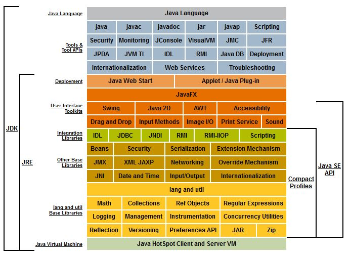

#### 2.4.2.4 JVM 的整体结构

* `HotSpot VM`是目前市面上高性能虚拟机的代表作之一，其采用了`解释器`和`即时编译器`并存的结构。

> [!NOTE]
>
> 在今天，Java 程序的运行性能早已脱胎换骨，已经达到了可以和 C/C++ 程序一较高下的地步。

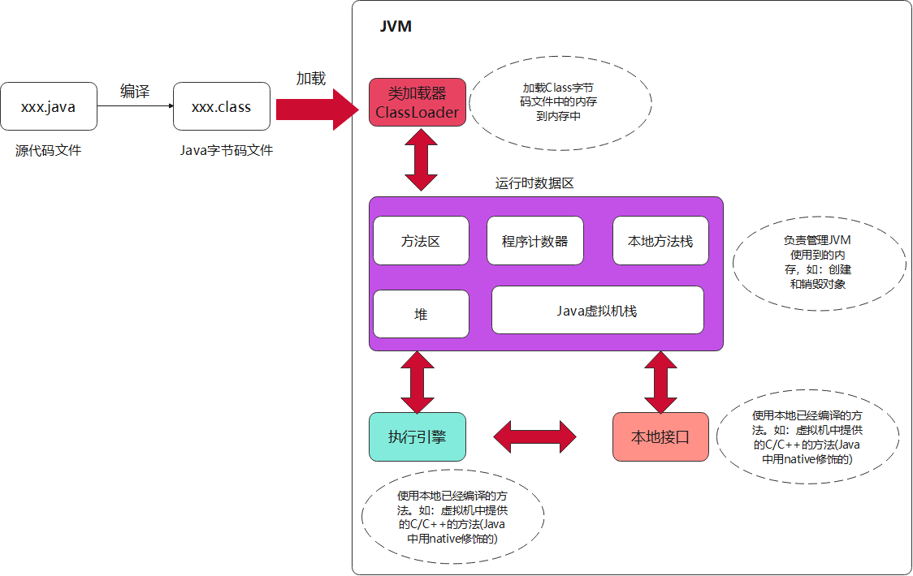

* `HotSpot VM`的详细架构图，如下所示：

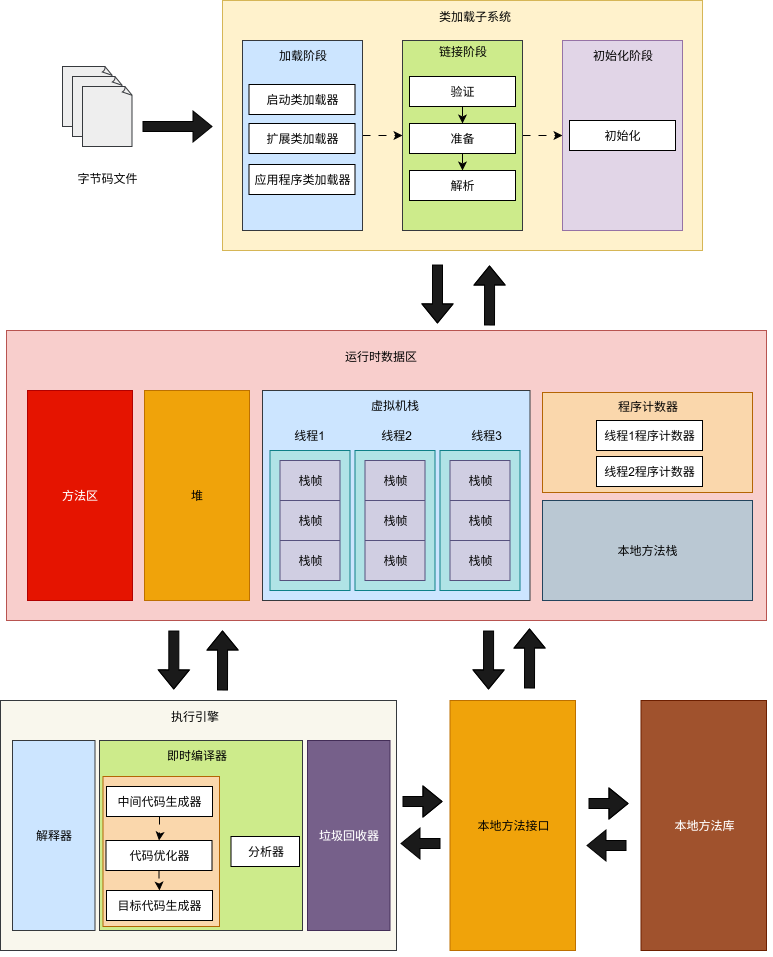

### 2.4.3 Java 代码的执行流程

#### 2.4.3.1 概述

* 通常我们会认为 Java 源代码的执行，分为以下三个步骤：

| 步骤                                                         | 例子                                         |
| ------------------------------------------------------------ | -------------------------------------------- |
| ① 编写 Java 源代码文件                                       | `vim HelloWorld.java`                        |
| ② 使用 javac 命令将 Java 源文件翻译为字节码文件              | `javac HelloWorld.java --> HelloWorld.class` |
| ③ 使用 Java 命令执行字节码文件，本质上是使用 Java 虚拟机加载并运行 Java 字节码文件，此时会启动一个新的 Java 进程。 | `java HelloWorld`                            |


* 示例：

::: code-group

```java [HelloWorld.java]
public class HelloWorld {
    public static void main(String[] args){
        System.out.println("Hello World!!!");
    }
}
```

```md:img [cmd 控制台]
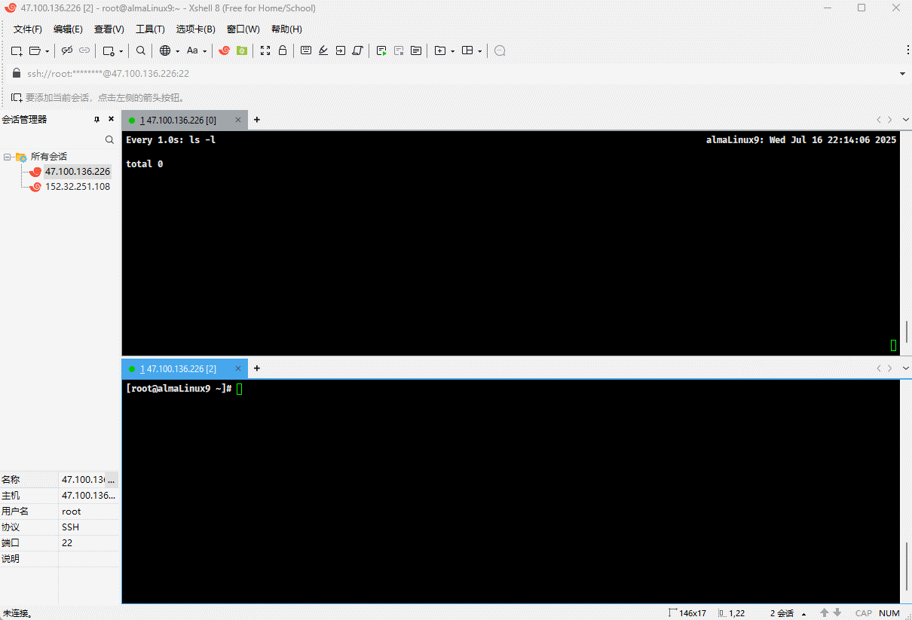
```

:::

#### 2.4.3.2 完整执行流程

* 其实，Java 源代码会经过`前端编译器(javac)`以及`后端编译器（解释器、即时编译器）`方可执行。

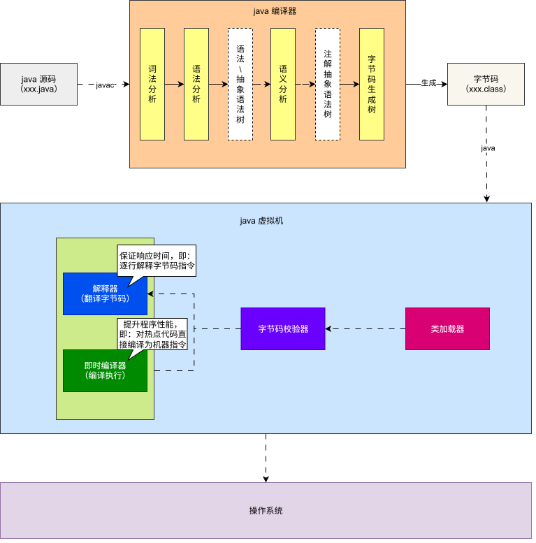

### 2.4.4 JVM 的生命周期

* JVM 的生命周期包含了启动、执行和退出，如下所示：

| JVM 生命周期    | 描述                                                         |
| --------------- | ------------------------------------------------------------ |
| :one: JVM 启动  | JVM 启动是通过`启动类加载器`创建一个初始化类来完成的，这个类是由虚拟机的具体实现指定的。 |
| :two: JVM 执行  | 一个运行的 Java 虚拟机由一个清晰的任务，即：执行 Java 程序。 <br>程序开始的时候它才运行，程序结束的时候它就停止。 <br/>执行一个所谓的 Java 程序的时候，真真正正在执行的是一个叫做 Java 虚拟机的进程。 |
| :three:JVM 退出 | 程序正常执行结束。 程序在执行过程中遇到了异常或错误而异常终止。 <br/>由于操作系统用现错误而导致 Java 虚拟机进程终止。 <br/>某线程调用 Runtime 类或 System 类的 exit 方法，或 Runtime 类的 halt 方法，并且 Java 安全管理器也允许这次 exit 或 halt 操作。<br/>除此之外，JNI（Java Native Interface）规范描述了用 JNI Invocation API 来加载或卸载 Java 虚拟机时，Java 虚拟机的退出情况。 |


# 第三章：JVM 的功能（⭐）

## 3.1 概述

* JVM 的功能，如下所示：

| JVM 的功能 | 描述                                                         |
| ---------- | ------------------------------------------------------------ |
| 解释和运行 | 对字节码文件中的指令，实时翻译成机器码，以便计算机执行。     |
| 内存管理   | 自动为对象、方法等分配内存。<br>自动的垃圾回收机制，回收不再使用的对象。 |
| 即时编译   | 针对热点代码进行优化，以提升执行效率。                       |

## 3.2 解释和运行

* 的`解释和运行`，就是将字节码文件中的指令实时翻译为机器码，以便计算机中执行。

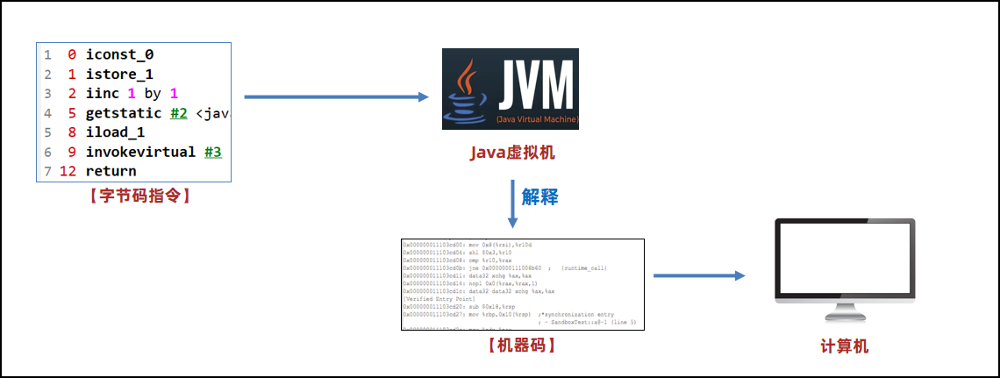

## 3.3 内存管理

### 3.3.1 概述

* 所谓的内存管理，指的是如下的两个方面：
  * ① Java 虚拟机可以自动地为对象、方法等分配内存。
  * ② Java 虚拟机内置了垃圾回收机制，可以回收不再使用的对象。

### 3.3.2 手动内存管理 VS 自动内存管理

* 在 C/C++ 等语言中，对象的回收需要程序员手动编写代码去完成，即：手动内存管理。

> [!NOTE]
>
> ::: details 点我查看 手动内存管理的优缺点
>
> | 类型         | 优点                                                         | 缺点                                                         |
> | ------------ | ------------------------------------------------------------ | ------------------------------------------------------------ |
> | 手动内存管理 | :one: 程序员完全控制内存分配和释放的时机。<br>:two: 没有垃圾回收器的性能开销。<br/>:three: 更适合系统级编程和性能敏感的应用。<br/>:four: 内存使用效率高，可以精确控制内存布局。<br/>:five: 实时性好，没有垃圾回收暂停。<br/>:six: 可以管理各种资源，如：文件、网络连接等。<br>:seven: 运行时性能更高，响应时间一致性好。 | :one: 容易出现内存泄漏，即：忘记释放内存。<br>:two: 可能发生悬空指针，即：使用已释放的内存。<br/>:three: 双重释放错误，即：释放同一块内存两次。<br/>:four: 需要更多的编程经验和仔细的设计。<br/>:five: 开发效率低，需要额外时间处理内存管理。<br/>:six: 调试困难，内存相关 bug 难以定位。<br/>:seven: 学习成本高，需要深入理解内存管理机制。<br/>:eight: 维护成本高，代码重构时容易引入错误。 |
>
> :::

* 在 Java 等语言中，对象的回收不需要程序员手动编写代码去完成，降低了开发的难度，即：自动内存管理。

> [!NOTE]
>
> ::: details 点我查看 自动内存管理的优缺点
>
> | 类型         | 优点                                                         | 缺点                                                         |
> | ------------ | ------------------------------------------------------------ | ------------------------------------------------------------ |
> | 手动内存管理 | :one: 编程简单，无需手动管理内存，专注业务逻辑。<br/>:two: 自动避免内存泄漏、悬空指针等问题。<br/>:three: 开发效率高，减少内存管理代码，加快开发速度。<br/>:four: 代码简洁，易于阅读和维护。<br/>:five: 学习成本低，初学者更容易上手。<br/>:six: 类型安全，通常配合类型安全的语言特性。<br/>:seven: 调试相对简单，减少内存相关错误。<br/>:eight: 团队协作效率高，降低对程序员技能要求。 | :one: 性能开销，垃圾回收器消耗 CPU 和内存资源。<br/>:two: 暂停时间，垃圾回收时可能造成程序暂停。<br/>:three: 内存使用多，通常使用更多内存，存在内存开销。<br/>:four: 控制受限，无法精确控制内存分配和释放时机。<br/>:five: 不适合实时系统，垃圾回收的不确定性。<br/>:six: 调优复杂，垃圾回收器的调优需要专业知识。<br/>:seven: 可能存在循环引用问题。<br/>:eight: 启动时间可能较慢（JIT 编译等）。 |
>
> :::


* 示例：手动内存管理

```c
#include <stdio.h>

int main(){
    
    int *data = NULL;
    
    // 分配内存
    data = (int*)malloc(5 * sizeof(int));
    if (data == NULL) { // [!code highlight]
        printf("内存分配失败！\n");
        return;
    }
    
    // 使用内存
    for (int i = 0; i < 5; i++) {
        data[i] = i * 2;
    }
    
    printf("数据: ");
    for (int i = 0; i < 5; i++) {
        printf("%d ", data[i]);
    }
    printf("\n");
    
    // 最终释放内存
    free(data); // [!code highlight]
    data = NULL; // [!code highlight]
    
    printf("内存正确释放\n\n");
    
    return 0;
}
```


* 示例：自动内存管理

```java
public class Test {
    public static void main(String[] args){
        int[] arr = new int[5];
        
        for(int i =0;i< arr.length;i++){
            System.out.println(arr[i]);
        }
        
        // 当没有强引用，GC 会自动回收
        arr = null;  // [!code highlight]
        
    }
}
```

## 3.4 即时编译

### 3.4.1 概述

* 即时编译就是针对热点代码进行优化，以提升执行效率。

> [!NOTE]
>
> `即时编译`并不仅仅存在于 Java 虚拟机中，Chrome 的 V8 引擎中也有`即时编译`的思想！！！

* 即时编译这个功能非常强大，甚至可以说是提升 Java 程序性能最核心的手段。

### 3.4.2 Java 性能低的主要原因

* Java 语言如果不做任何优化，其性能是不如 C/C++ 语言的，其主要原因就在于：`在程序运行的过程中，Java 虚拟机需要将字节码指令实时的翻译成计算机能识别的机器码，这个过程在运行的时候可能需要反复地执行，所以性能相对较低`。

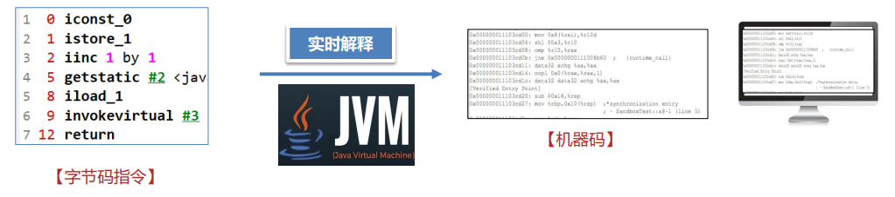

* C/C++ 语言性能高的主要原因在于：`只需要将源代码直接编译，生成的可执行文件直接包含了计算机能识别的机器码，即：不需要在运行过程中实时地解释，节省了解释的过程，所以性能相对较高`。


### 3.4.3 Java 的跨平台特性

* Java 之所以需要实时解释，就是为了支持`跨平台`特性。

> [!NOTE]
>
> * ① 将同一份字节码指令，交给 Linux 和 Windows 等不同的平台，这些平台上安装有对应平台的虚拟机，这些虚拟机分别将字节码指令解释为自己平台的机器码，然后就可以交给不同的平台去运行，这样就达到跨平台的特点。
> * ② Java 追求`跨平台`特性，性能相对 C/C++ 差点。

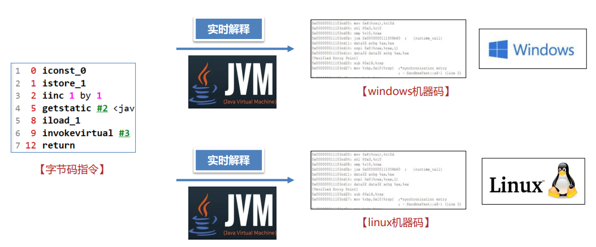

* C/C++ 等语言，如果要想让程序在不同的平台上运行，就需要将一份源代码在不同平台上分别编译，相对比较麻烦。

> [!NOTE]
>
> * ① 如果是纯 C 语言项目，可以使用`预定义宏`来实现跨平台；但是，远不如 Java 内置的简单和方便。
> * ② C/C++ 追求性能；但是，不具备开箱即用的`跨平台`特性。

```c
#include <stdio.h>

#if _WIN32 // 如果是 Windows 平台, 就引入 <windows.h>
#include <windows.h>
#define SLEEP(t) Sleep(t * 1000)
#elif __linux__ // 如果是 Linux 平台， 就引入<unistd.h>
#include <unistd.h>
#define SLEEP sleep
#endif

int main() {

    // 禁用 stdout 缓冲区
    setbuf(stdout, nullptr);

    SLEEP(5);
    printf("hello, 大家好~");

    return 0;
}
```

### 3.4.4 即时编译

* 由于 JVM 需要实时解释`字节码`指令，不做任何优化，性能确实不如直接运行机器码的 C/C++ 等语言。

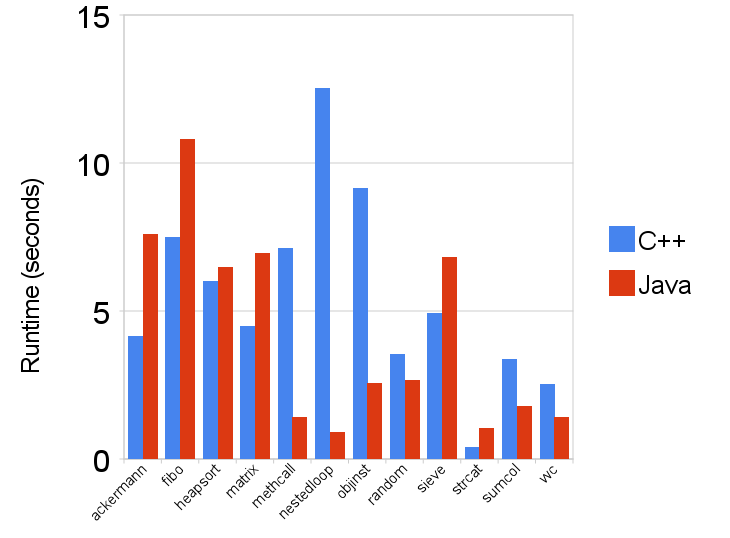

* 在早期，Java 的性能问题一直被人诟病。JDK 的开发者在 JDK1.1 版本中推出了`即时编译`功能去优化对应的功能。

> [!NOTE]
>
> * ① 虚拟机在运行过程中如果发现某一个方法甚至是循环是热点代码（在很短的时间内被多次调用），即时编译器会优化这段代码（主动将代码进行优化并解释成计算机能够执行的机器码），并将优化后的机器码保存到内存中。
> * ② 如果第二次再去执行这段代码，Java 虚拟机会将机器码从内存中取出来直接进行调用；这样节省了一次解释的步骤，同时执行的是优化后的代码，效率较高。
> * ③ Java 通过`即时编译`（Just In Time，简称 JIT）进行性能的优化，最终能达到接近 C/C++ 语言的性能，在某些特定的场景下甚至可以实现超越。

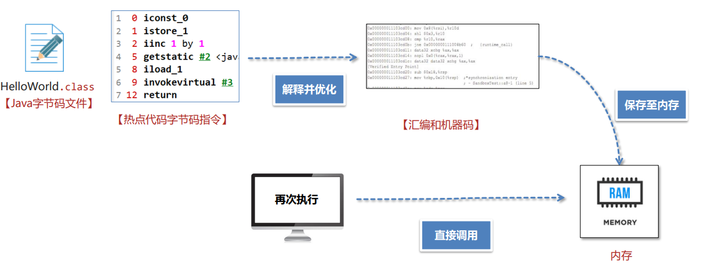

## 3.5 解释器和即时编译器

### 3.5.1 概述

* 当执行 Java 代码的时候，`执行引擎`需要将`字节码文件`中的`字节码指令`翻译为`本地机器指令`。

> [!NOTE]
>
> * ① `执行引擎`包含了`解释器`、`即时编译器`以及`垃圾回收器`。
> * ② `解释器`（Interpreter）和`即时编译器`（JIT, Just-In-Time Compiler）是 JVM（Java 虚拟机）中两种核心的代码执行机制，它们共同协作，使 Java 程序既能跨平台运行，又能获得接近本地代码的高性能。

* 假设 Java 源代码是这样的，如下所示：

```java
class Test {
    public static void main(String[] args) {
        int i = 2; // [!code highlight:3]
        int j = 3;
        int result = i + j;
        System.out.println(result);
    }
}
```

* 那么，Java 编译器就会将其编译为字节码文件，其内容如下：

```txt {9-16}
class Test {
  Test();
       0: aload_0
       1: invokespecial #1                  // Method java/lang/Object."<init>":()V
       4: return


  public static void main(java.lang.String[]);
       0: iconst_2
       1: istore_1
       2: iconst_3
       3: istore_2
       4: iload_1
       5: iload_2
       6: iadd
       7: istore_3
       8: getstatic     #7                  // Field java/lang/System.out:Ljava/io/PrintStream;
      11: iload_3
      12: invokevirtual #13                 // Method java/io/PrintStream.println:(I)V
      15: return
}
```

### 3.5.2 解释器

* 当`解释器`开始工作的时候，其会`逐行解释`执行`字节码文件`中的`指令`，并生成本地机器指令。

> [!NOTE]
>
> * ① `解释器`启动速度快，无需编译（类似即时编译器），程序一加载就开始执行，即：响应时间短（暂停时间短），用户体验好。
> * ② `优点`：解释器内存占用小，以及启动快的特点，适合程序初识阶段。
> * ③ `缺点`：解释器执行效率低，即：每次执行都要重新解释同一条指令。
> * ④ `生活类比`：像一位实时翻译，一边读原文一边口译，即时但慢。

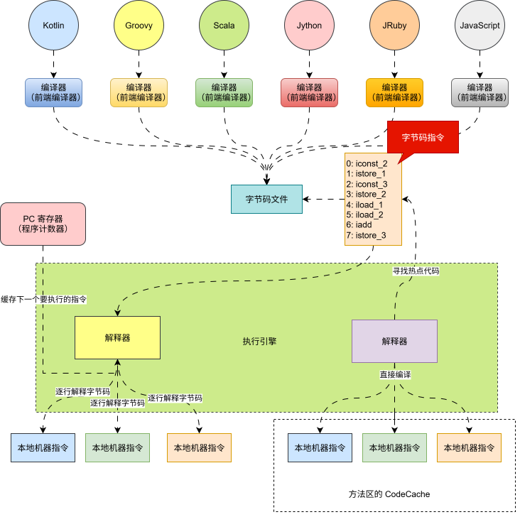

### 3.5.3 即时编译器

* `即时编译器`会监听代码执行频率，将`热点代码`（当某段方法或循环被执行多次）`直接编译`为优化后的`本地代码`，后续调用直接执行本地代码，跳过`解释`过程。

> [!NOTE]
>
> * ① `即时编译器`启动较慢（编译耗时），并且占用一定的内存空间，程序要等会才开始执行，即：响应时间长（暂停时间长），用户体验差（会感觉有一段时间的卡顿）。
> * ② `优点`：执行速度快，接近 C/C++ 性能。
> * ③ `缺点`：编译耗时，占用额外内存（初始启动阶段无法发挥作用）。
> * ④ `生活类比`：像把常看的英文文献翻译成母语并保存，以后直接读译本，更快但需要前期投入。


### 3.5.4 现代 JVM 的策略

* `现代JVM`采取的是`解释+JIT`混合模式，使得`JVM`在`启动速度`和`运行性能`之间取得良好平衡。

> [!NOTE]
>
> * ① 程序启动时，解释器快速启动执行。
>
> * ② 同时，JVM 收集性能数据，如：方法调用次数、循环次数。
>
> * ③ 当某段代码被识别为“热点”，JIT 编译器将其编译为本地代码。
>
> * ④ 之后调用该方法时，直接执行编译后的机器码。
>
> * ⑤ 极端情况：分层编译（Tiered Compilation）
>
>   - 第 1 层：简单 JIT 编译（C1 编译器），低开销优化。
>
>   - 第 2 层：深度优化 JIT 编译（C2 编译器），高开销但高性能。

### 3.5.5 解释器 VS 即时编译器

* 解释器 VS 即时编译器，如下所示：

| 特性     | 解释器           | JIT 编译器         |
| -------- | ---------------- | ------------------ |
| 执行方式 | 逐条解释字节码   | 编译为本地机器码   |
| 启动速度 | 快               | 慢（需编译）       |
| 运行性能 | 低               | 高（尤其热点代码） |
| 内存占用 | 小               | 大（存储编译代码） |
| 适用场景 | 初次执行、冷代码 | 频繁执行的热点代码 |

* 解释器：保证 Java 程序“快速启动、跨平台运行”。
* JIT 编译器：通过动态编译和优化，实现“高性能执行”。


# 第四章：常见的 JVM（⭐）

## 4.1 概述

* 目前，市场上的 JVM 非常多，如果没有统一的标准（JVM 虚拟机规范），Java 的跨平台特性就无从谈起！！！
* [《Java虚拟机规范》](https://docs.oracle.com/javase/specs/index.html)由 Oracle 制定，内容主要包含了Java虚拟机在设计和实现时需要遵守的规范，主 要包含 class 字节码文件的定义、类和接口的加载和初始化、指令集等内容。
* [《Java虚拟机规范》](https://docs.oracle.com/javase/specs/index.html)是对虚拟机设计的要求，而不是对 Java 设计的要求，也就是说虚拟机可以运行在其他的语言，如：Groovy、Scala生成的 class 字节码文件之上。

## 4.2 Hotspot 虚拟机

* 目前，市场上的 JVM 很多，如下所示：

| 名称                       | 作者    | 支持版本                                  | 社区活跃度  | 特性                                                         | 适用场景                             |
| -------------------------- | ------- | ----------------------------------------- | ----------- | ------------------------------------------------------------ | ------------------------------------ |
| HotSpot (Oracle JDK版)     | Oracle  | 所有版本                                  | 高(闭源)    | 使用最广泛，稳定可靠，社区活跃<br>JIT 支持 Oracle JDK 默认虚拟机 | 默认                                 |
| HotSpot (Open JDK版)       | Oracle  | 所有版本                                  | 中(16.1k)   | 同上开源，Open JDK 默认虚拟机                                | 默认对 JDK 有二次开发需求            |
| GraalVM                    | Oracle  | 11、17、19                                | 高（18.7k） | 多语言支持高性能、JIT、AOT 支持                              | 微服务、云原生架构需要多语言混合编程 |
| Dragonwell JDK             | Alibaba | 标准版： (8、11、17) <br>扩展版：(11、17) | 低(3.9k)    | 基于 OpenJDK 的增强高性能、bug 修复、安全性提升 JWarmup、ElasticHeap、Wisp 特性支持 | 电商、物流、金融领域对性能要求比较高 |
| Eclipse OpenJ9 (原 IBM J9) | IBM     | 8、11、17、19、20                         | 低(3.1k)    | 高性能、可扩展 JIT、AOT 特性支持                             | 微服务、云原生架构                   |

* 但是，平时广泛使用的是 Hotspot 虚拟机：

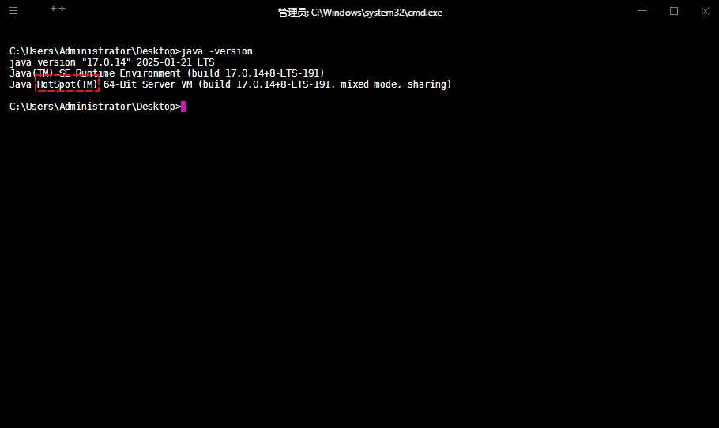

## 4.3 Hotspot 发展史

* HotSpot 是 Java 生态系统最重要的虚拟机之一，其发展历程反映了Java 性能优化的演进过程。

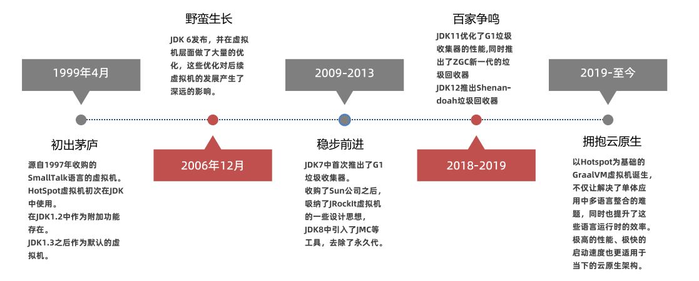


# 第五章：JVM 的发展历史

## 5.1 SUN Classic VM（淘汰）

* 早在 1996 年 Java 1.0 版本的时候，Sun 公司发布了一款名为 Sun Classic VM 的 Java 虚拟机，它同时也是`世界上第一款商用 Java 虚拟机`，JDK1.4 时完全被淘汰。
* 这款虚拟机内部只提供解释器。
* 如果使用 JIT 编译器，就需要进行外挂；但是，一旦使用了 JIT 编译器，JIT 就会接管虚拟机的执行系统，解释器就不再工作。

> [!NOTE]
>
> 解释器和编译器不能配合工作。

* 现在的 HotSpot 内置了`解释器`和`JIT 编译器`。

## 5.2 Exact VM（淘汰）

* 为了解决上一个虚拟机问题，jdk 1.2 时，Sun 提供了Exact VM 的 Java 虚拟机。

* Exact Memory Management：准确式内存管理。

  * 也可以叫 Non-Conservative/Accurate Memory Management。
  * 此虚拟机可以知道内存中某个位置的数据具体是什么类型。

* 具备现代高性能虚拟机的维形，如：
  * 热点探测。
  * 编译器与解释器混合工作模式。
* 只在 Solaris 平台短暂使用，其他平台上还是 classic vm。

## 5.3 HotSpot VM

* HotSpot 历史：

  * 最初由一家名为 “Longview Technologies” 的小公司设计。
  * 1997 年，此公司被 Sun 收购。
  * 2009 年，Sun 公司被甲骨文收购。
  * `JDK 1.3 时，HotSpot VM 成为默认虚拟机`。

* `目前 Hotspot 占有绝对的市场地位，称霸武林`。

> [!NOTE]
>
> 目前默认的虚拟机都是HotSpot，Sun / Oracle JDK 和 OpenJDK 的默认虚拟机。

* 从服务器、桌面到移动端、嵌入式都有应用。
* 名称中的 HotSpot 指的就是它的热点代码探测技术。
  * 通过计数器找到最具编译价值代码，触发`即时编译`或`栈上替换`。
  *  通过`编译器`与`解释器`协同工作，在`最优化的程序响应时间`与`最佳执行性能`中取得平衡。

##  5.4 JRockit VM

* `专注于服务器端应用`，即：不太关注程序启动速度，因此 JRockit 内部不包含解析器实现，全部代码都靠`即时编译器`编译后执行。

* 大量的行业基准测试显示，`JRockit JVM 是世界上最快的 JVM` 。

* 优势：全面的 Java 运行时解决方案组合，如下所示：
  - JRockit 面向延迟敏感型应用的解决方案。
  - JRockit Real Time 提供以毫秒或微秒级的JVM响应时间，适合财务、军事指挥、电信网络的需要。
  - MissionControl 服务套件，它是一组以极低的开销来监控、管理和分析生产环境中的应用程序的工具。

* 2008年，JRockit 被 Oracle 收购。

> [!NOTE]
>
> * ① Oracle 表达了整合两大优秀虚拟机的工作，大致在 JDK8 中完成。
> * ② 整合的方式是在HotSpot的基础上，移植 JRockit 的优秀特性；但是，比较困难，架构不一样！！！

## 5.5 J9 VM

* 全称：IBM Technology for Java Virtual Machine，简称 IT4J，内部代号：J9 。
* 市场定位与 HotSpot 接近，服务器端、桌面应用、嵌入式等多用途 VM ，广泛用于 IBM 的各种 Java 产品。
* 目前，有影响力的三大商用服务器之一，也号称是世界上最快的 Java 虚拟机。
* 2017 年左右，IBM 发布了开源 J9 VM，命名为 OpenJ9，交给 Eclipse 基金会管理，也称为 Ecilpse OpenJ9 。

## 5.6 Azul VM

* 前面三大“高性能Java虚拟机”使用在`通用`硬件平台上。

> [!NOTE]
>
> 指的是 HotSpot、JRockit  和 J9 。

* 这里 Azul VM 和 BEA Liquid VM 是与`特定`硬件平台绑定、软硬件配合的专有虚拟机，高性能 Java 虚拟机中的战斗机。
* Azul VM 是 Azul Systems 公司在 HotSpot 基础上进行大量改进，运行于 Azul Systems 公司的专有硬件 Vega 系统上的 Java 虚拟机。
* `每个 Azul VM 实例都可以管理至少数十个 CPU 和数百 GB 内存的硬件资源，并提供在巨大内存范围内实现可控的 GC 时间的垃圾收集器、专有硬件优化的线程调度等优秀特性`。
* 2010 年，Azul Systems 公司开始从硬件转向软件，发布了自己的 Zing JVM，可以在通用 x86 平台上提供接近于 Vega 系统的特性。

## 5.7 Micorsoft JVM

- 微软为了在 IE3 浏览器中支持 Java Applets，开发了 Microsoft JVM。
- 只能在 Windows 平台下运行；但是，的确是当时 Windows 下性能最好的 Java VM。
- 1997 年，Sun 以侵犯商标、不正当竞争罪名指控微软成功，赔了 Sun 很多钱。
- 微软 WindowsXP SP3 中抹掉了其 VM 。现在 Windows 上安装的 JDK 都是 HotSpot。

##  5.8 Dalvik VM

- 谷歌开发的，应用于 Android 系统，并在 Android2.2 中提供了 JIT，发展迅猛。

> [!NOTE]
>
> Dalvik VM 只能称作虚拟机，而不能称作 “Java虚拟机”，它没有遵循 Java 虚拟机规范，不能直接执行 Java 的 Class 文件。

- `基于寄存器架构，不是 JVM 的栈架构`。
- 执行的是编译以后的 dex（Dalvik Executable）文件，执行效率比较高。

> [!NOTE]
>
> 它执行的 dex（Dalvik Executable）文件可以通过 class 文件转化而来，使用 Java 语法编写应用程序，可以直接使用大部分的 Java API 等。

- Android 5.0 使用支持提前编译（Ahead of Time Compilation，AoT）的 ART VM 替换 Dalvik VM。

## 5.9 Graal VM

- 2018 年 4 月，Oracle Labs 公开了 Graal VM，号称 "Run Programs Faster Anywhere"，野心勃勃。
- 与 1995 年 Java 的 ”write once，run anywhere" 遥相呼应。
- Graal VM 在 HotSpot VM 基础上增强而成的跨语言全栈虚拟机，可以作为“任何语言” 的运行平台使用。

> [!NOTE]
>
> 语言包括：Java、Scala、Groovy、Kotlin；C、C++、Javascript、Ruby、Python、R 等。

- 支持不同语言中混用对方的接口和对象，支持这些语言使用已经编写好的本地库文件

> [!NOTE]
>
> 工作原理：
>
> * ① 将这些语言的源代码或源代码编译后的中间格式，通过解释器转换为能被 Graal VM 接受的中间表示。
> * ② Graal VM 提供 Truffle 工具集快速构建面向一种新语言的解释器。
> * ③ 在运行时还能进行即时编译优化，获得比原生编译器更优秀的执行效率。 

- 如果 HotSpot 有一天真的被取代，Graal VM 希望最大；但是，Java 软件生态没有丝毫变化。
