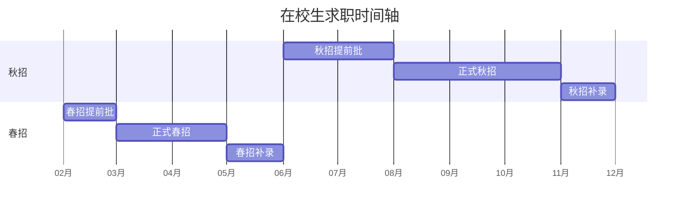

## 专业术语

+ **Offer：`录用通知，公司向候选人发出的正式录用信。`**
+ **OC (Offer Call)：`录用电话，在发正式 offer 前，HR 会打电话沟通薪资等信息。`**
+ **JD (Job Description)：`职位描述，详细说明了公司的招聘岗位、工作职责、任职要求等信息。`**
+ **HC (Headcount)：`招聘名额，指公司计划招聘的员工数量。`**
+ **BG (Business Group)：`事业群，通常是公司内的一个大的业务单元。`**
+ **BU (Business Unit)：`业务单元，比 BG 更小的业务单元。`**

## 投递周期

