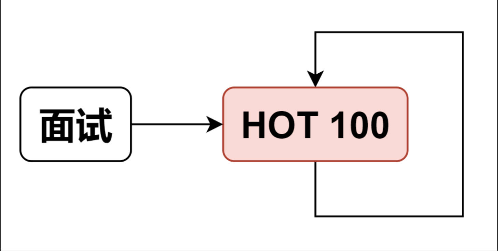

## 突击训练

如果即将面试，时间紧迫，可以刷 HOT 100，这些都是经典面试题。

另外还有一个 面试 150 题单，其实它和 HOT 100 有很多重复题目，如果刷完 HOT 100 还有时间的话，可以刷这个 150 题单。

答疑

> 问：初次接触一个专题时，我应该如何学习？

答：可以把专题中的第一道题当作例题，学习题解中的理论讲解。其余题目当作配套练习。

> 问：做题没思路，思考多久可以看题解？

答：十分钟到数小时都可以。如果看完题解觉得题解很妙，那就学到了一个自己不会的技巧。如果看完题解觉得自己是xx，可以再多思考下，或者换个时间段（早/中/晚/洗澡的时候）思考，说不定就有思路了。（注：这在心理学上叫做孵化效应，即在离开问题后，大脑会在无意识中处理问题，从而在重返问题时突然产生新的思路。）

> 问：很多题目没有思路，感到焦虑怎么办？

答：学算法是需要时间沉淀的，坚持刷题吧。现在不会的算法/题目，过段时间再来看，会有新的感悟。对于初次刷题的同学，推荐先完成难度分低于 1700 的题目，跳过暂时无法理解的题目。

> 问：如何根据数据范围，估计题目允许的时间复杂度，从而估计要用什么算法？

答：一般每秒能执行约 10^8 次运算（Python 可能要除以 10），可以据此估计能通过的时间复杂度，如下表所示。