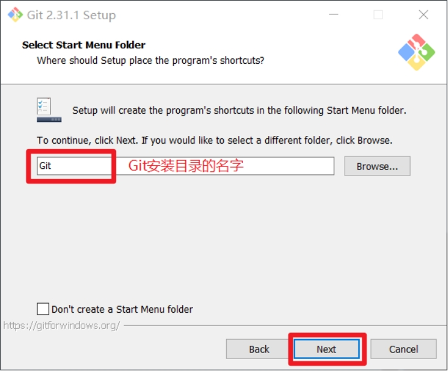
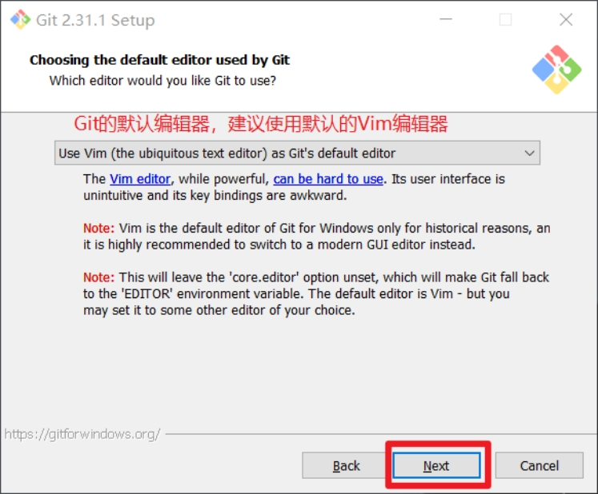
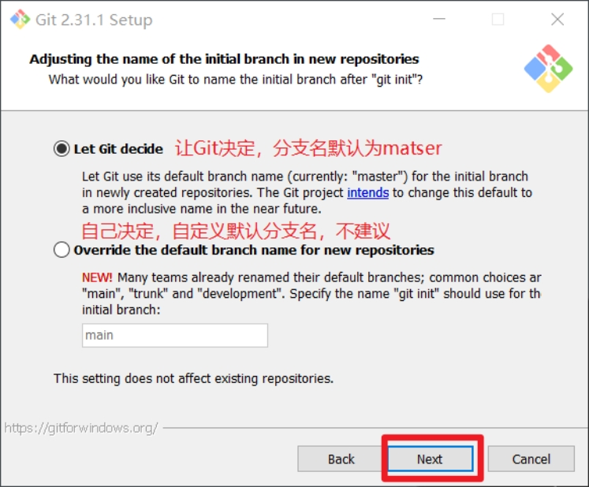
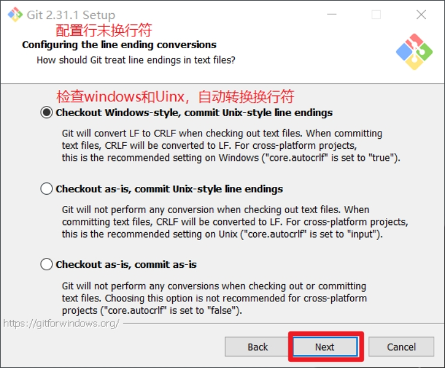
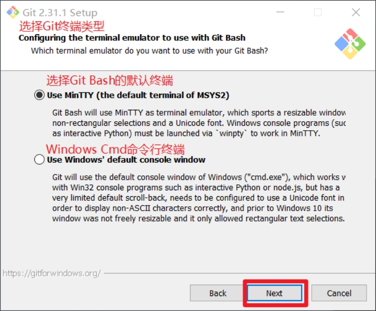
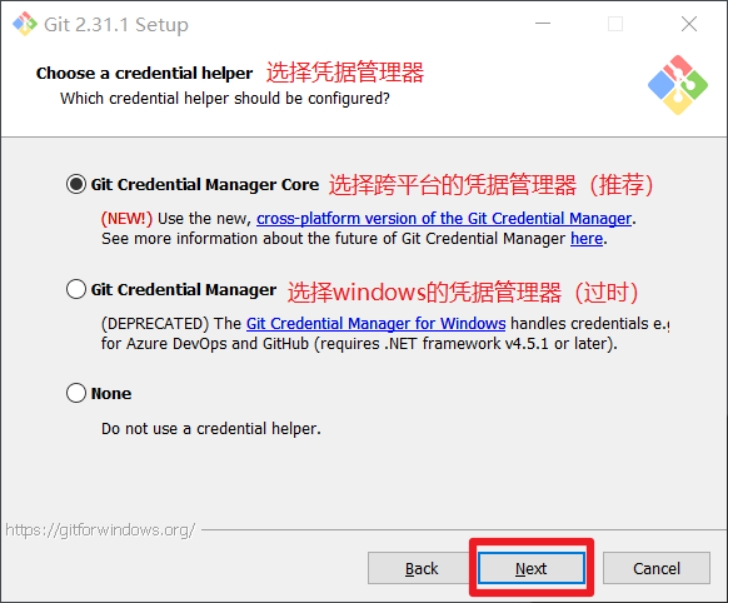
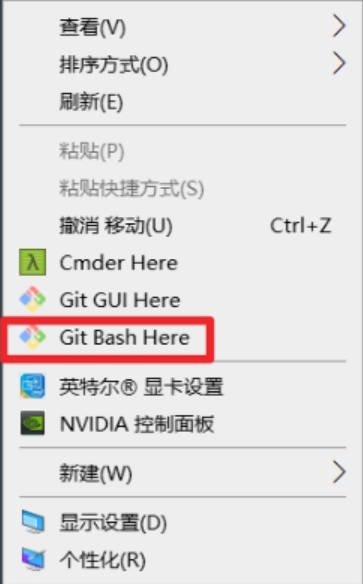
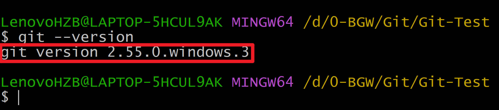

::: info
**官网地址：** [git-scm.com](https://git-scm.com/) | [Git for Windows Releases](https://github.com/git-for-windows/git/releases)
:::

::: tip 
推荐安装 Git 2.40.0 版本
:::

## 安装步骤

1. **查看GNU协议**，直接点击下一步。

   

2. **选择安装位置**，要求是非中文且没有空格的目录，然后下一步。

   

3. **Git选项配置**，推荐默认设置，然后下一步。

   

4. **Git安装目录名**，不用修改，直接点击下一步。

   

5. **Git默认编辑器**，建议使用默认的Vim编辑器，然后点击下一步。

   

6. **默认分支名设置**，选择让Git决定，分支名默认为master，下一步。

   

7. **修改Git环境变量**，选第一个（不修改环境变量，只在Git Bash里使用Git）。

   

8. **选择后台客户端连接协议**，选默认值OpenSSL，然后下一步。

   

9. **配置行末换行符**，Windows使用CRLF，Linux使用LF，选择第一个自动转换，然后下一步。

   

10. **选择Git终端类型**，选择默认的Git Bash终端，然后下一步。

    

11. **选择Git pull合并模式**，选择默认，然后下一步。

    

12. **选择Git凭据管理器**，选择默认的跨平台凭据管理器，然后下一步。

    

13. **其他配置**，选择默认设置，然后下一步。

    

14. **实验室功能**，技术还不成熟，有已知bug，不要勾选，点击右下角的 **Install** 按钮开始安装。

    

## 安装完成

15. 点击 **Finish** 按钮，Git安装成功！

    

16. 右键任意位置，在菜单里选择 **Git Bash Here** 即可打开命令行终端。

    

17. 在Git Bash终端输入 `git --version` 查看版本，如图所示，说明安装成功。

    
