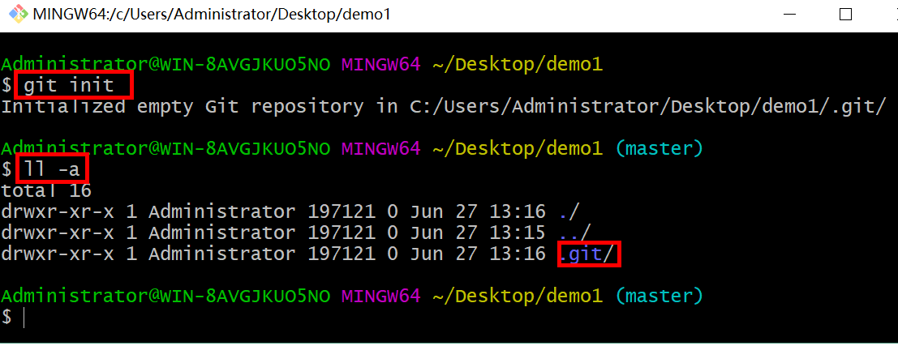
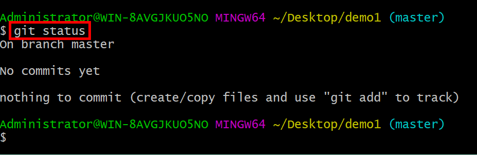
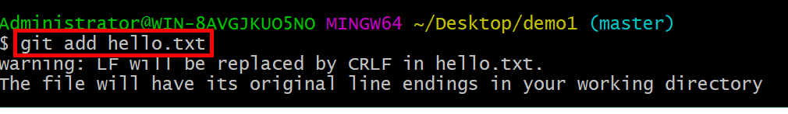
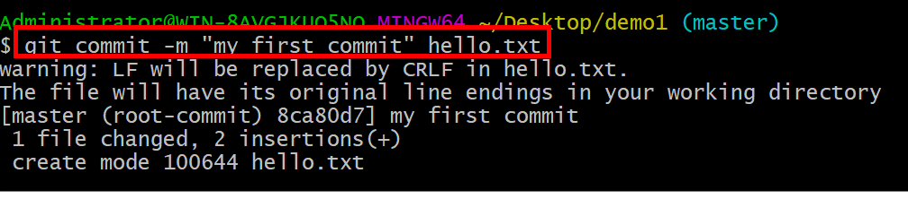
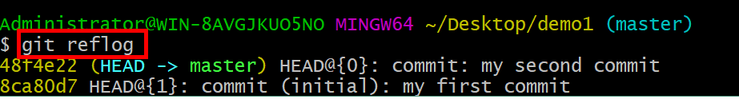
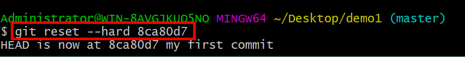

| **命令名称**                         | **作用**     |
| ------------------------------------ | -------------- |
| git config --global user.name 用户名 | 设置用户签名   |
| git config --global user.email 邮箱  | 设置用户邮箱   |
| git init                             | 初始化本地库   |
| git status                           | 查看本地库状态 |
| git add 文件名                       | 添加到暂存区   |
| git commit -m "日志信息" 文件名      | 提交到本地库   |
| git reflog                           | 查看历史记录   |
| git reset --hard 版本号              | 版本穿梭       |

## 1. 设置用户签名

### 1.1 基本语法

git config --global user.name 用户名

git config --global user.email 邮箱

### 1.2 案例实操

全局范围的签名设置：

```shell
git config --global user.name Layne
git config --global user.email Layne@atguigu.com
git config --list # 查看全局配置
cat ~/.gitconfig  # cat linux中查看文本的命令  ~ 家 [你当前用户的家]/ .gitconfig
```

说明：

签名的作用是区分不同操作者身份。用户的签名信息在每一个版本的提交信息中能够看到，以此确认本次提交是谁做的。Git首次安装必须设置一下用户签名，否则无法提交代码。

※注意：这里设置用户签名和将来登录GitHub（或其他代码托管中心）的账号没有任何关系。


## 2. 初始化本地库

### 2.1 基本语法

**git init**

### 2.2 案例实操



结果查看


## 3. 查看本地库状态

### 3.1 基本语法

**git status**

### 3.2 案例实操

#### （1）首次查看（工作区没有文件）



#### （2）新增文件


#### （3）再次查看（检测到未追踪文件）


## 4. 添加暂存区

### 4.1 将工作区的文件添加到暂存区

#### （1）基本语法

**git** **add** **文件名**

#### （2）案例实操



### 4.2 查看状态（检测到暂存区有新文件）


## 5. 提交本地库

### 5.1 暂存区文件提交到本地库

#### （1）基本语法

**git commit -m "日志信息" 文件名**

#### （2）案例实操



### 5.2 查看状态（没有文件需要提交）


## 6. 修改文件（hello.txt）

### 6.1 查看状态（检测到工作区有文件被修改）


### 6.2 将修改的文件再次添加暂存区


### 6.3 查看状态（工作区的修改添加到了暂存区）


### 6.4 将暂存区文件提交到本地库


## 7. 历史版本

### 7.1 查看历史版本

#### （1）基本语法

**git reflog** **查看版本信息**

git reflog -n 数量

**git log** **查看版本详细信息**

#### （2）案例实操



### 7.2 版本穿梭

#### （1）基本语法

**git reset --hard** **版本号**

#### （2）案例实操

--首先查看当前的历史记录，可以看到当前是在48f4e22这个版本


--切换到之前版本，8ca80d7版本，也就是我们第一次提交的版本



--切换完毕之后再查看历史记录，当前成功切换到了8ca80d7版本


--然后查看文件hello.txt，发现文件内容已经变化


Git切换版本，底层其实是移动的HEAD指针。
