## 1 配置Git忽略文件

### 1.1 IDEA特定文件

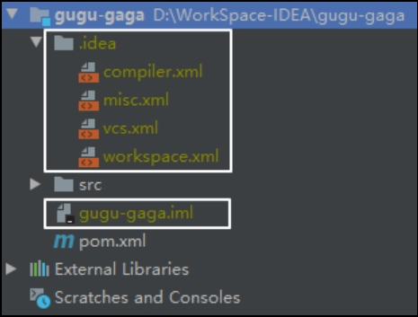 

### 1.2 Maven工程的target目录

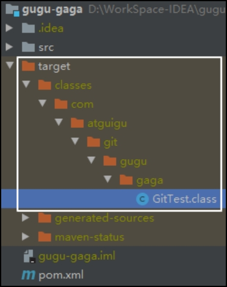 


### 1.3 为什么要忽略他们

与项目的实际功能无关，不参与服务器上部署运行。把它们忽略掉能够屏蔽IDE工具之间的差异。


### 1.4 怎么忽略

#### （1）创建忽略规则文件

* **文件名称：xxxx.ignore**（前缀名随便起，建议是git.ignore）

* 这个文件的存放位置原则上在哪里都可以，为了便于让~/.gitconfig文件引用，建议也放在用户家目录下

* git.ignore文件模版内容如下

```ignore
# Compiled class file
*.class

# Log file
*.log

# BlueJ files
*.ctxt

# Mobile Tools for Java (J2ME)
.mtj.tmp/

# Package Files #
*.jar
*.war
*.nar
*.ear
*.zip
*.tar.gz
*.rar

# virtual machine crash logs, see http://www.java.com/en/download/help/error_hotspot.xml
hs_err_pid*

.classpath
.project
.settings
target
.idea
*.iml
```

#### （2）在.gitconfig文件中引用

（此文件在Windows的家目录中）

```
[user]
	name = Layne
	email = Layne@atguigu.com
[core]
	excludesfile = C:/Users/asus/git.ignore   \\  \\  \\   
```

注意：这里要使用正斜线（/），不要使用反斜线（\）


## 2 定位Git程序

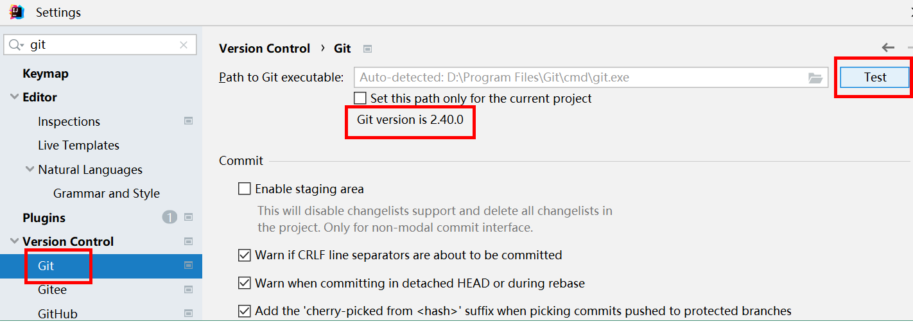 


## 3初始化本地库

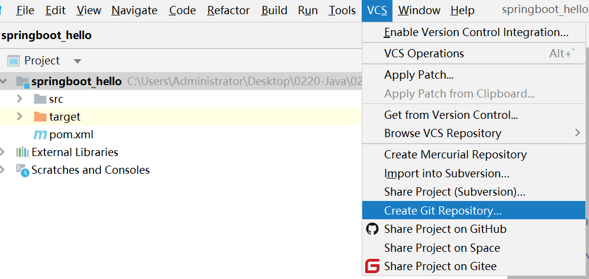 

 选择要创建Git本地仓库的工程。

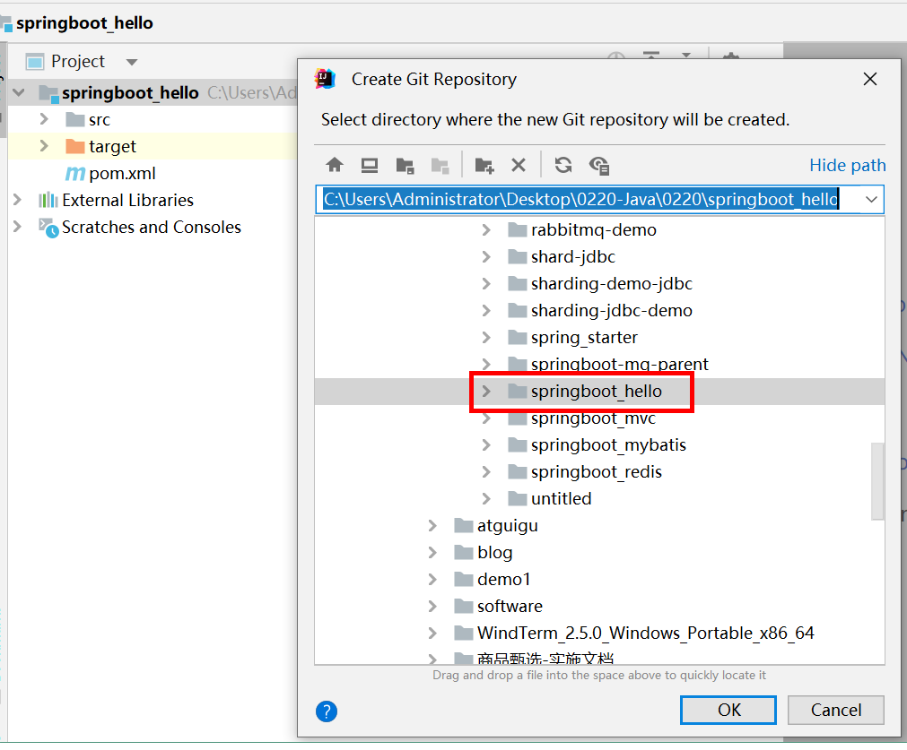

 


## 4 添加到暂存区

右键点击项目选择Git -> Add将项目添加到暂存区。

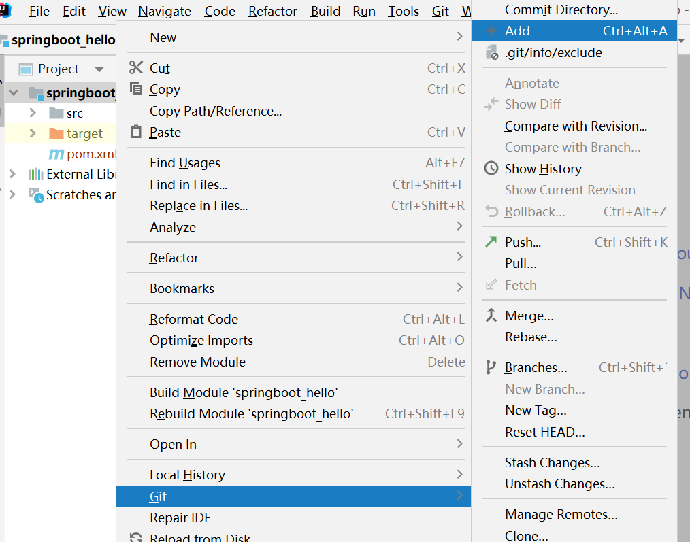

 


## 5 **提交到本地库**


 


## 6 **切换版本**

查看历史版本

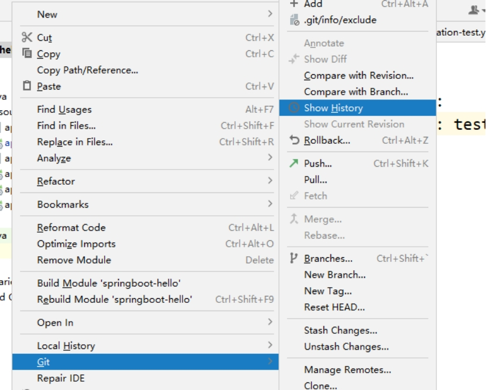 

 

右键选择要切换的版本，然后在菜单里点击Checkout Revision。

 

 


## 7 创建分支

选择Git，在Repository里面，点击Branches按钮。

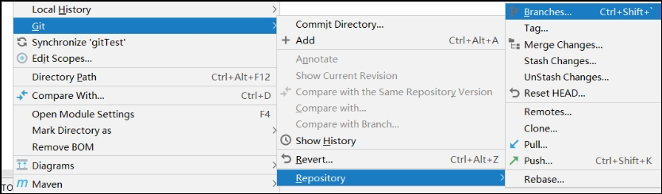 

在弹出的Git Branches框里，点击New Branch按钮。

 

填写分支名称，创建hot-fix分支。

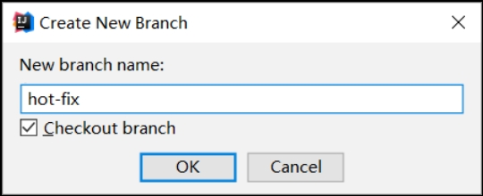 

然后看到hot-fix，说明分支创建成功，并且当前已经切换成hot-fix分支

 


## 8 **切换分支**

切换到master分支

 

 


## 9 **合并分支**

切换到master分支，将hot-fix分支合并到当前master分支。

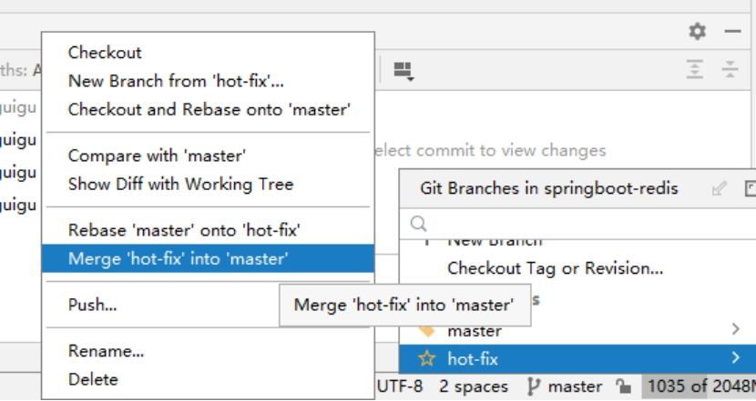 

如果代码没有冲突，分支直接合并成功，分支合并成功以后，代码自动提交，无需手动提交本地库。

 


## 10 **解决冲突**

如图所示，如果master分支和hot-fix分支都修改了代码，在合并分支的时候就会发生冲突。

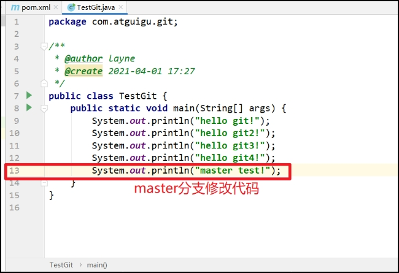 

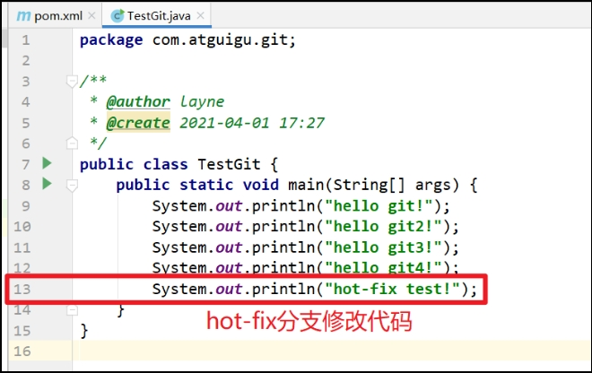 

我们现在站在master分支上合并hot-fix分支，就会发生代码冲突。

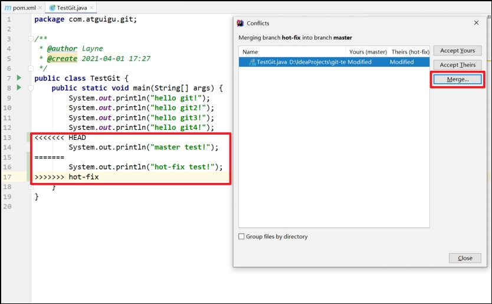 

点击Conflicts框里的Merge按钮，进行手动合并代码。

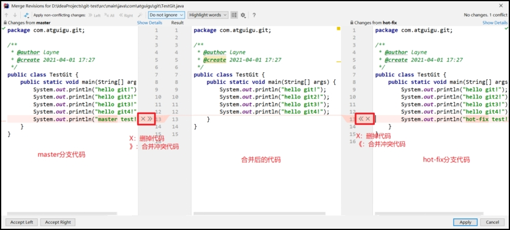 

手动合并完代码以后，点击右下角的Apply按钮。

 

代码冲突解决，自动提交本地库。

