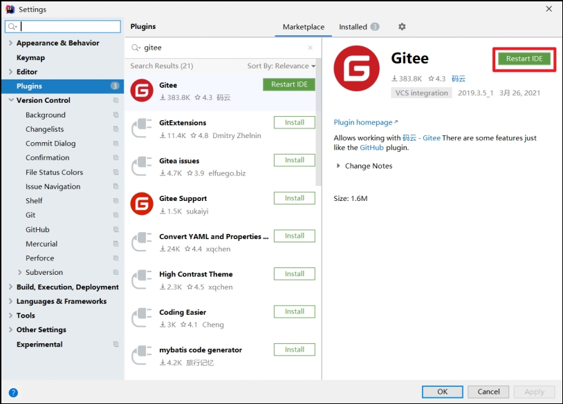
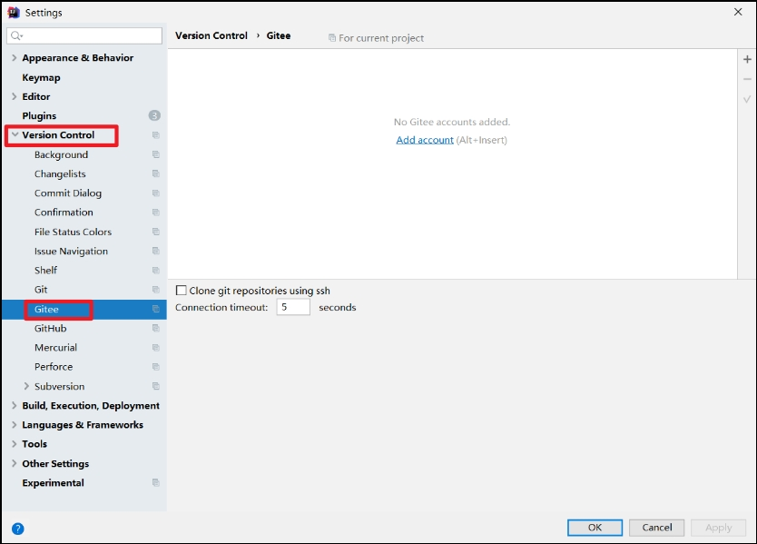
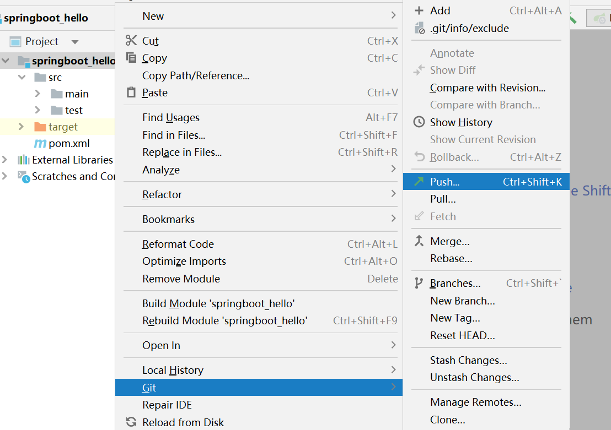
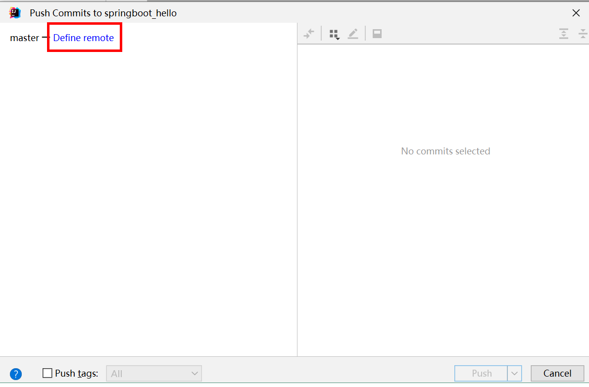
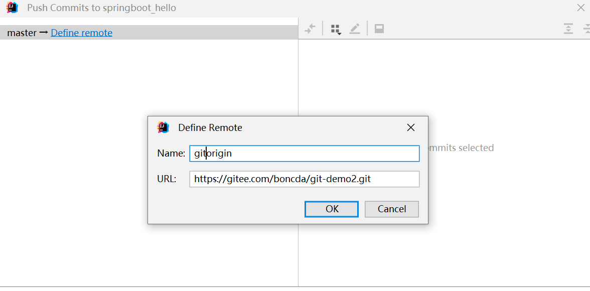
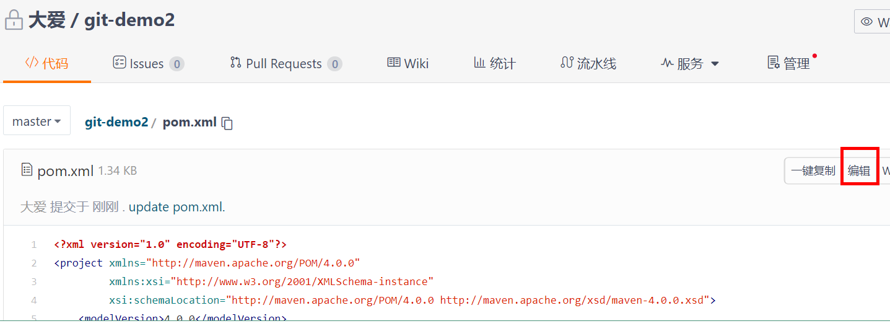
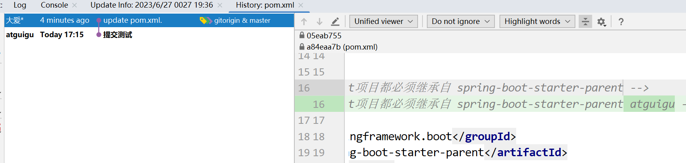
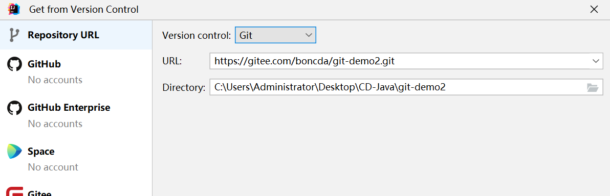
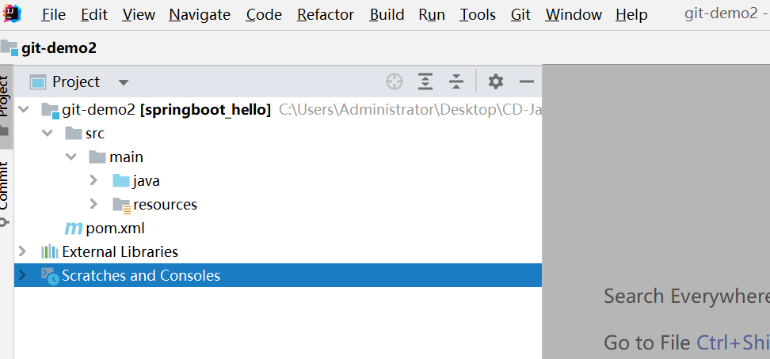

## 1 IDEA安装码云插件

Idea默认不带码云插件，我们第一步要安装Gitee插件

如图所示，在Idea插件商店搜索Gitee，然后点击右侧的Install按钮。

 

安装成功后，重启Idea

 

​	Idea重启以后在Version Control设置里面看到Gitee，说明码云插件安装成功

 

​	然后在码云插件里面添加码云帐号，我们就可以用Idea连接码云了。

 

 

## 2 push推送本地库到远程库

首先在Idea里面创建一个工程，初始化git工程，然后将代码添加到暂存区，提交到本地库，这些步骤上面已经讲过，此处不再赘述。

将本地代码push到码云远程库

 

自定义远程库链接。

 

给远程库链接定义个name，然后再URL里面填入码云远程库的链接即可

 

然后选择定义好的远程链接，点击Push即可

 

 去码云远程库查看代码。

 

## 3 pull拉取远程库到本地库

（1）在码云上直接修改代码内容，之后提交，为了进行测试

（2）右键点击项目，可以将远程仓库的内容pull到本地仓库。

 

（3）选择远程库

 

（4）pull了远程库中最新内容

注意：pull是拉取远端仓库代码到本地，如果远程库代码和本地库代码不一致，会自动合并，如果自动合并失败，还会涉及到手动解决冲突的问题。 

## 4 clone克隆远程库到本地

（1）选择Clone

 

（2）输入远程码云仓库地址

 

（3）完成clone操作

