## 安装前准备工作

```shell
xingji@LAPTOP-5HCUL9AK:~$ cd /mnt/d/0-ProgrammingSoftware/Hermes
# 进入自己安装Hermes的目录
xingji@LAPTOP-5HCUL9AK:/mnt/d/0-ProgrammingSoftware/Hermes$
```

## 安装和升级

不建议按照[官方文档](https://hermes-agent.nousresearch.com/docs/getting-started/quickstart)操作，官方文档仅供参考用。

> **前置条件，检查主机上是否安装了`git环境`。**

### 克隆源代码

```shell
git clone https://github.com/NousResearch/hermes-agent
```

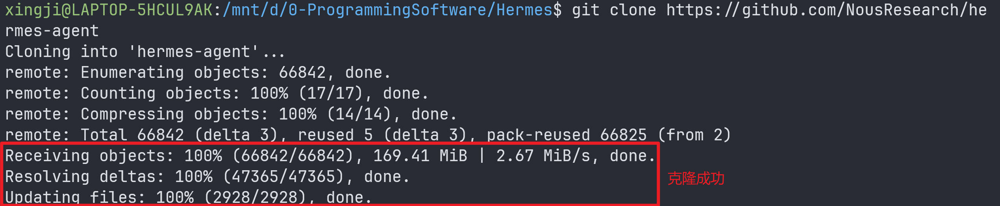

### 查找最新的[release版本](https://github.com/NousResearch/hermes-agent/tags)

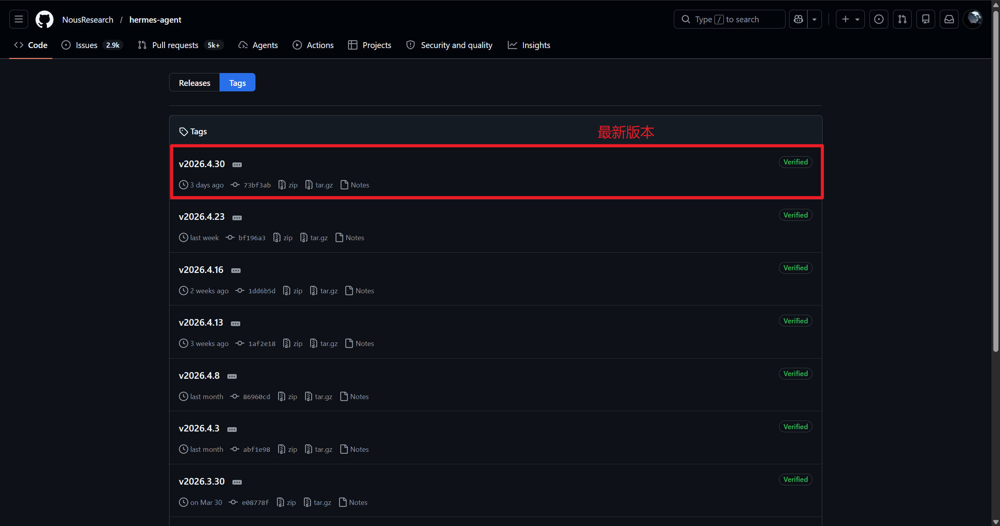

```shell
cd hermes-agent
git checkout v2026.4.30
```

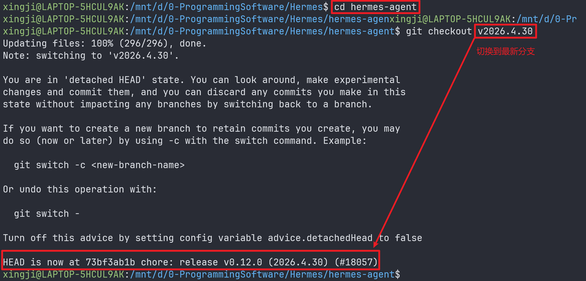

### 安装hermes

```shell
# 安装
./setup-hermes.sh
# 刷新系统配置
source ~/.bashrc
```

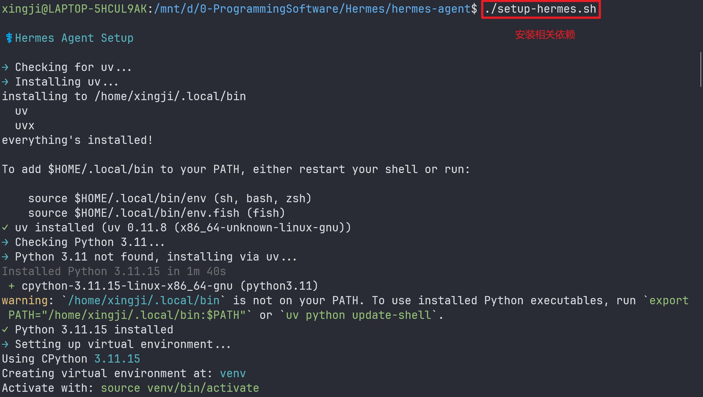

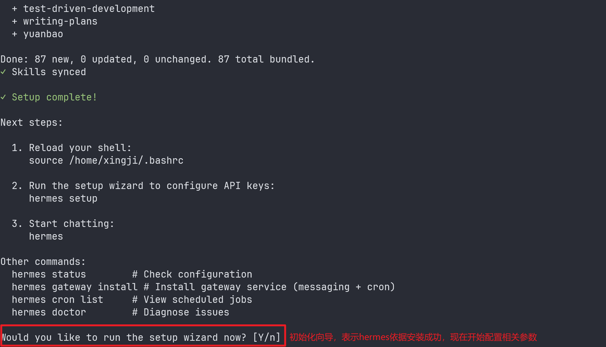

## 初始化hermes相关配置

### 设置Hermes模型

```shell
How would you like to set up Hermes?
您希望如何设置 Hermes？

 → (●) Quick setup — provider, model & messaging (recommended)
   快速设置 — 选择服务商、模型和消息风格（推荐）

   (○) Full setup — configure everything
   完整设置 — 配置所有选项
```

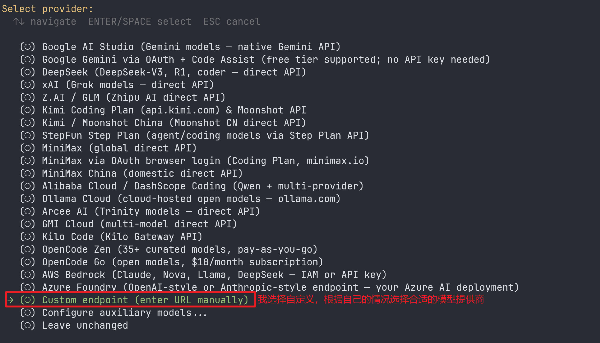

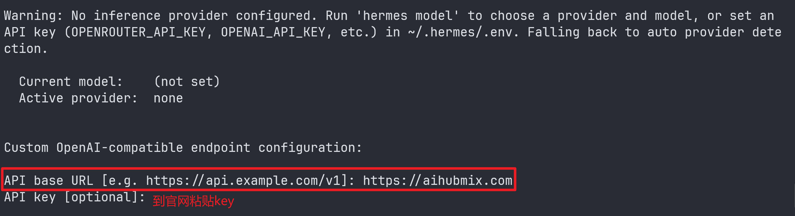

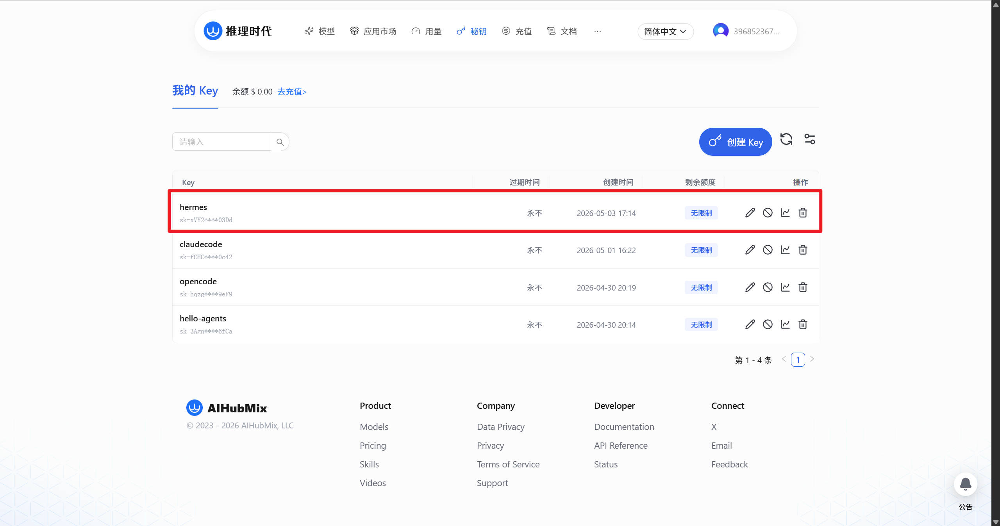

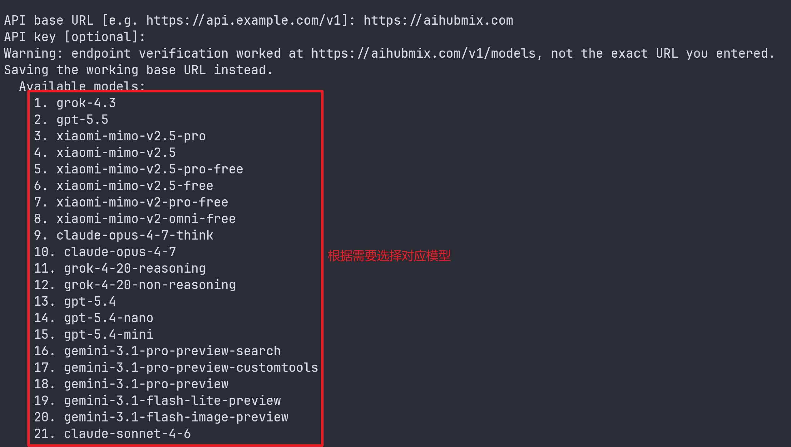

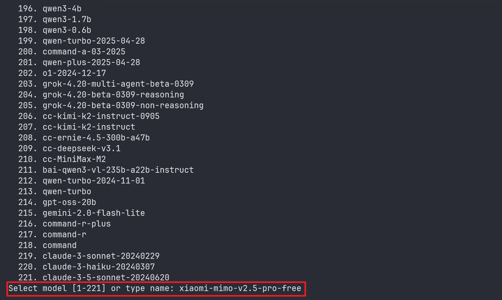

### 选择接入消息平台

```shell
Connect a messaging platform? (Telegram, Discord, etc.)
是否要接入消息平台？（如 Telegram、Discord 等）

 → (●) Set up messaging now (recommended)
   立即设置消息平台（推荐）
   
   (○) Skip — set up later with 'hermes setup gateway'
   跳过 — 稍后通过 'hermes setup gateway' 再设置
   

# 我选择的是飞书
Select platforms to configure:
选择要配置的平台：

   [ ] 📱 Telegram  (not configured)       // Telegram（未配置）
   [ ] 💬 Discord  (not configured)        // Discord（未配置）
   [ ] 💼 Slack  (not configured)          // Slack（未配置）
   [ ] 🔐 Matrix  (not configured)         // Matrix（未配置）
   [ ] 💬 Mattermost  (not configured)     // Mattermost（未配置）
   [ ] 📲 WhatsApp  (not configured)       // WhatsApp（未配置）
   [ ] 📡 Signal  (not configured)         // Signal（未配置）
   [ ] 📧 Email  (not configured)          // 邮箱（未配置）
   [ ] 📱 SMS (Twilio)  (not configured)   // 短信（Twilio）（未配置）
   [ ] 💬 DingTalk  (not configured)       // 钉钉（未配置）
 → [✓]   Feishu / Lark  (not configured)   // 飞书 / Lark（未配置）
   [ ] 💬 WeCom (Enterprise WeChat)  (not configured)   // 企业微信（未配置）
   [ ] 💬 WeCom Callback (Self-Built App)  (not configured) // 企业微信回调（自建应用）（未配置）
   [ ] 💬 Weixin / WeChat  (not configured) // 微信（未配置）
   [ ] 💬 BlueBubbles (iMessage)  (not configured) // BlueBubbles（iMessage）（未配置）
   [ ] 🐧 QQ Bot  (not configured)         // QQ 机器人（未配置）
   [ ] 💎 Yuanbao  (not configured)        // 元宝（未配置）
   [ ] 💬 IRC  (not configured)            // IRC（未配置）
   [ ] 💼 Microsoft Teams  (not configured) // Microsoft Teams（未配置）
```

+ **选择飞书(根据自己需要进行选择)**

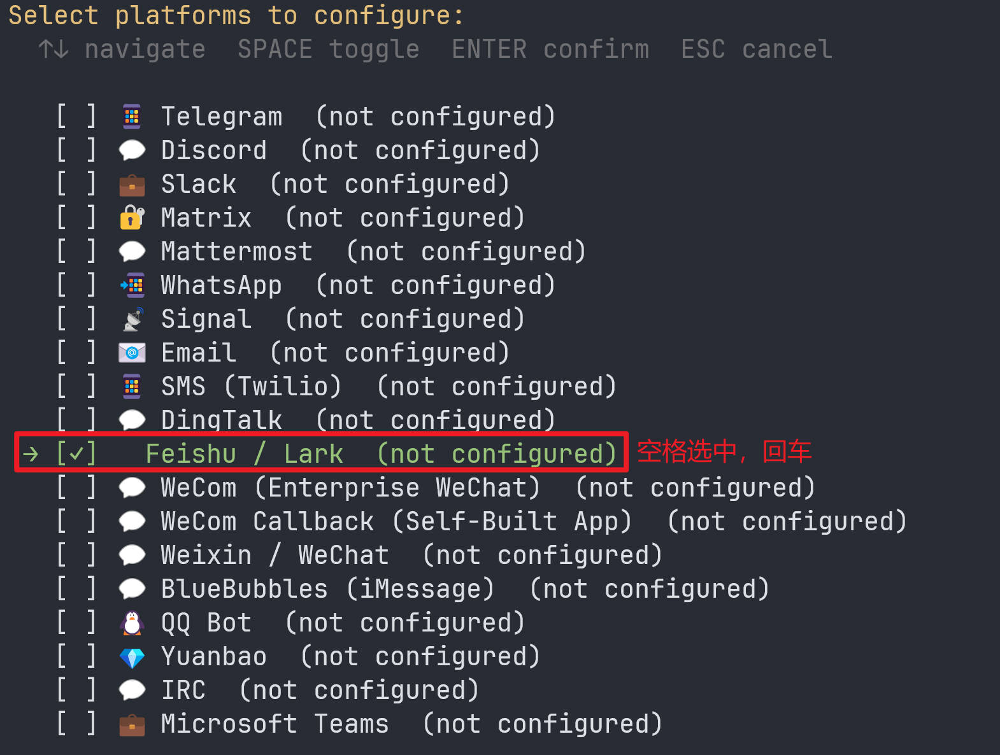

### 设置飞书 / Lark

```shell
How would you like to set up Feishu / Lark?
如何设置飞书 / Lark？

 → (●) Scan QR code to create a new bot automatically (recommended)
   扫描二维码自动创建新机器人（推荐）
   
   (○) Enter existing App ID and App Secret manually
   手动输入已有的 App ID 和 App Secret
```

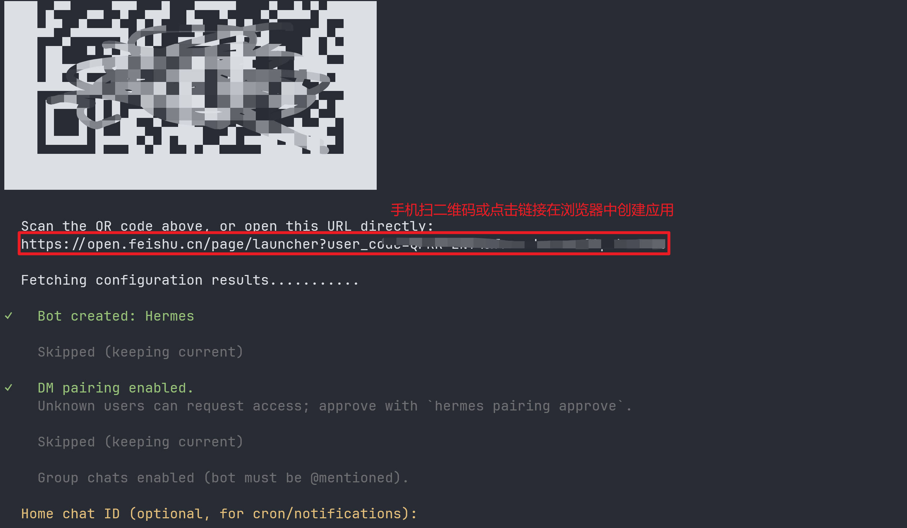

## 验证Hermes安装效果

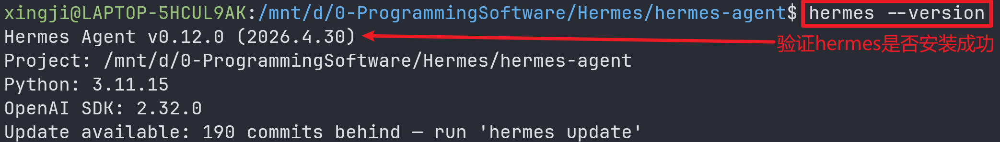

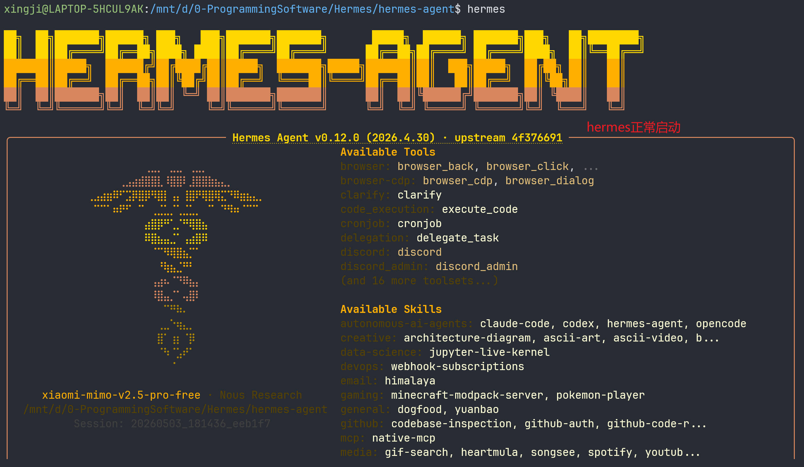

## 对接飞书

### 启动gateway(网关服务-与飞书进行通信)

```shell
hermes gateway start  # 启动gateway
hermes gateway status  # 查看启动gateway的状态
```

::: tip 

+ **解决启动gateway报错**

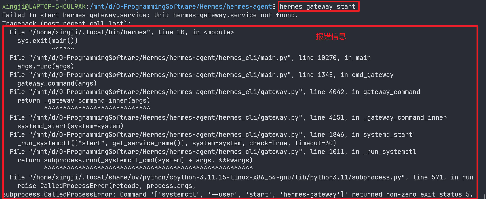

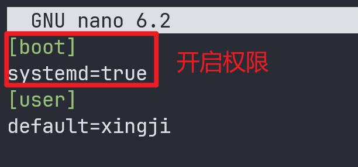

```shell
hermes gateway install
# 安装 hermes 网关服务

systemctl --user enable hermes-gateway
# 启用当前用户的 hermes-gateway 服务（开机自启）

systemctl --user start hermes-gateway
# 启动当前用户的 hermes-gateway 服务
```

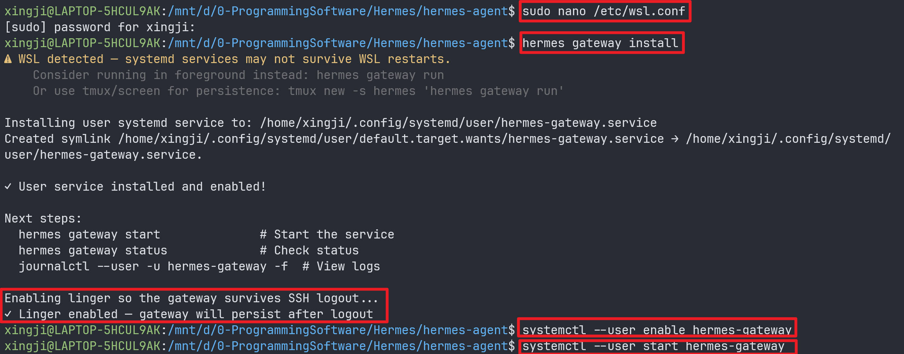

:::

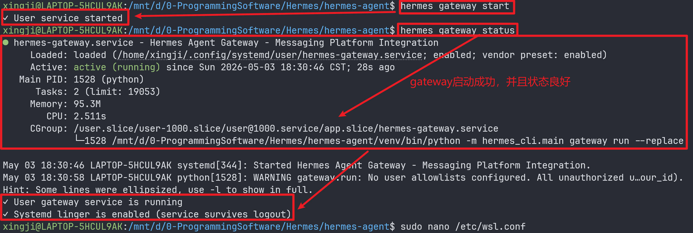

### hermes与飞书配对

```shell
hermes pairing approve feishu xxxxx(Hermes发送的配对码)
```

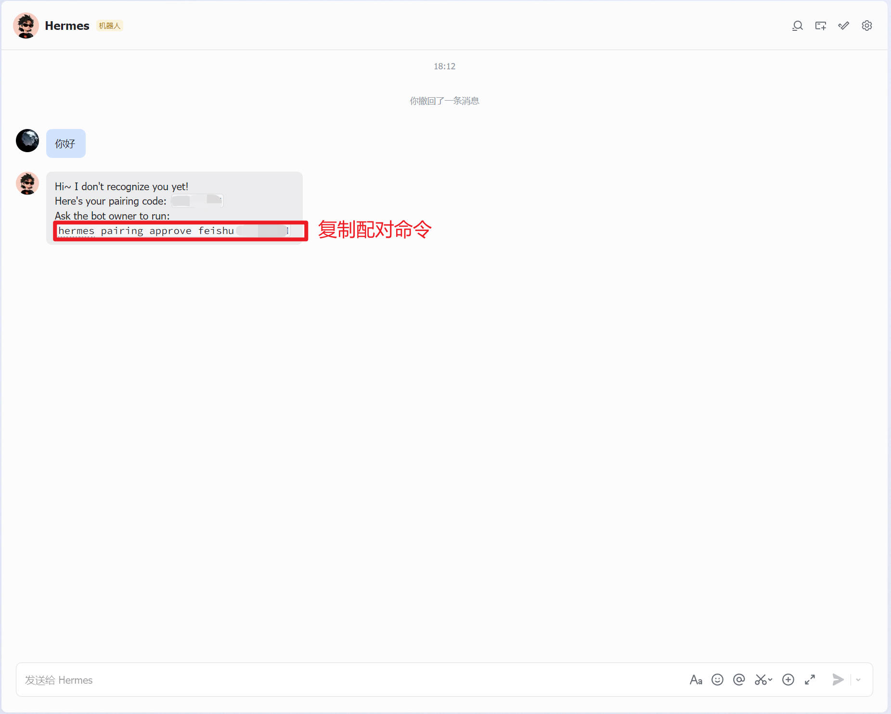

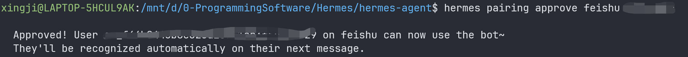

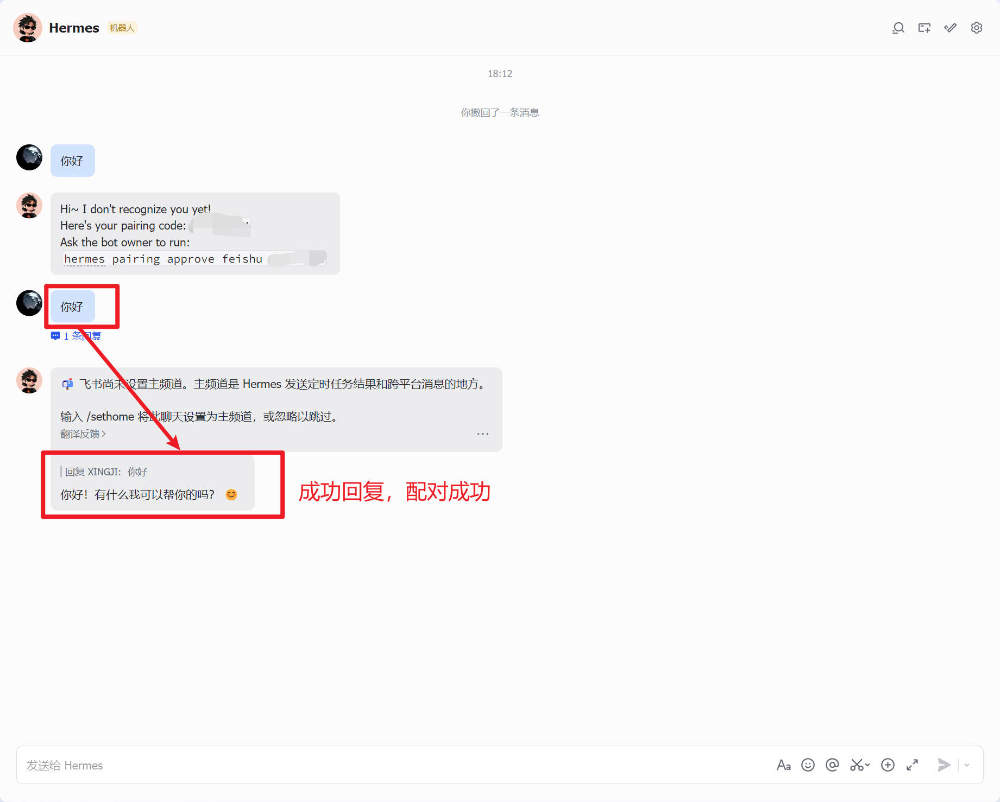

## 升级hermes

```shell
# 进入hermes源码
cd hermes-agent
# 切换到主分支
git checkout main
# 拉取最新代码
git pull
# 切换到指定tag，例如
git checkout v2026.5.9
# 覆盖安装
./setup-hermes.sh
# 刷新系统配置
source ~/.bashrc
```

## 配置

在第一步安装命令，会提示配置各项内容，执行如下命令可以对指定的配置做修改。

```shell
hermes model          # 选择模型供应商
hermes tools          # 选择开启哪些工具
hermes gateway setup  # 配置消息交流平台
hermes gateway start  # 启动gateway
hermes config set     # 修改指定配置
hermes setup          # 重新执行向导模式
```

## 可视化管理

参考GitHub项目 [https://github.com/EKKOLearnAI/hermes-web-ui](https://github.com/EKKOLearnAI/hermes-web-ui)

### 安装

```shell
npm install -g hermes-web-ui # 全局安装
hermes-web-ui start
```

> 安装后访问：[http://localhost:8648](http://localhost:8648)

### webui的其他相关操作

```shell
# Start in background (daemon mode)
hermes-web-ui start
# Start on custom port
hermes-web-ui start --port 9000
# Stop background process
hermes-web-ui stop
# Restart background process
hermes-web-ui restart
# 检查运行状态
hermes-web-ui status
# 更新到新版本，并重启
hermes-web-ui update
# 查看版本
hermes-web-ui -v
```

## 卸载

### 停止gateway

```shell
hermes gateway stop
```

删除gateway注册的系统服务（这个操作可选，如果没有设置为开启启动，则不用执行）

```shell
# Linux: 
systemctl --user disable hermes-gateway
# macOS: 
launchctl remove ai.hermes.gateway
```

### 使用hermes封装的命令卸载

```shell
hermes uninstall
```

### 手动卸载

```shell
rm -f ~/.local/bin/hermes
rm -rf /path/to/hermes-agent
rm -rf ~/.hermes            # Optional — keep if you plan to reinstall
```
