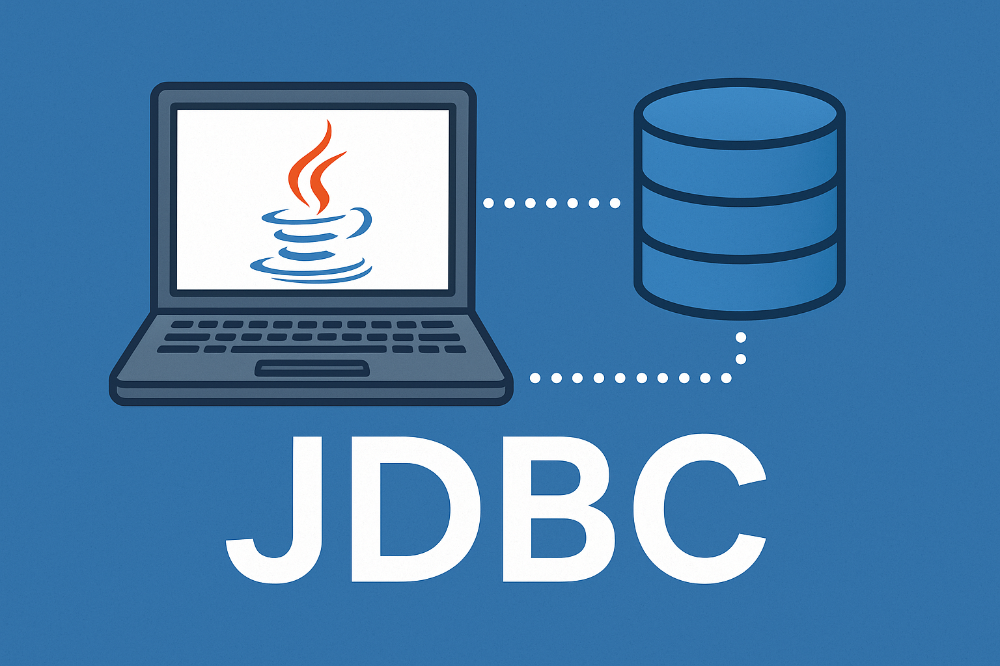

## 什么是事务

> **事务是一个完整的业务，在这个业务中需要多条DML语句共同联合才能完成，而事务可以保证多条DML语句同时成功或者同时失败，从而保证数据的安全。例如A账户向B账户转账一万，A账户减去一万(update)和B账户加上一万(update)，`必须同时成功或者同时失败`，才能`保证数据是正确的`。**

## 使用转账案例演示事务

### 表和数据的准备

> t_act表：
> 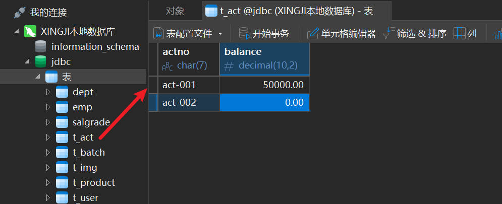

### 实现转账功能

```java title="java"
package com.powernode.jdbc;

import com.powernode.jdbc.utils.DbUtils;

import java.sql.Connection;
import java.sql.PreparedStatement;
import java.sql.SQLException;

/**
 *实现转账功能
 */
public class JDBCTest19 {
    public static void main(String[] args) {
        // 转账金额
        double money = 10000.0;
        // 实现转账功能
        Connection conn = null;
        PreparedStatement ps1 = null;
        PreparedStatement ps2 = null;

        try{
            // 获取连接
            conn = DbUtils.getConnection();

            // 将 act-001 账户的余额减去一万
            String sql1 = "update t_act set balance = balance - ? where actno = ?";
            ps1 = conn.prepareStatement(sql1);
            ps1.setDouble(1, money);
            ps1.setString(2, "act-001");
            int count1 = ps1.executeUpdate();

            // 将 act-002 账户的余额加上一万
            String sql2 = "update t_act set balance = balance + ? where actno = ?";
            ps1 = conn.prepareStatement(sql2);
            ps1.setDouble(1, money);
            ps1.setString(2, "act-002");
            int count2 = ps1.executeUpdate();

        }catch(SQLException e){
            throw  new RuntimeException(e);
        }finally {
            // 释放资源
            DbUtils.close(conn,ps1,null);
            DbUtils.close(conn,ps2,null);
            DbUtils.close(conn,null,null);
        }
    }
}
```
执行结果：
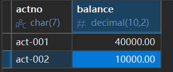

### JDBC事务默认是自动提交的

> **JDBC事务默认情况下是`自动提交`的，所谓的`自动提交`是指：`只要执行一条DML语句则自动提交一次`。**测试一下，在以下代码位置添加断点：
> 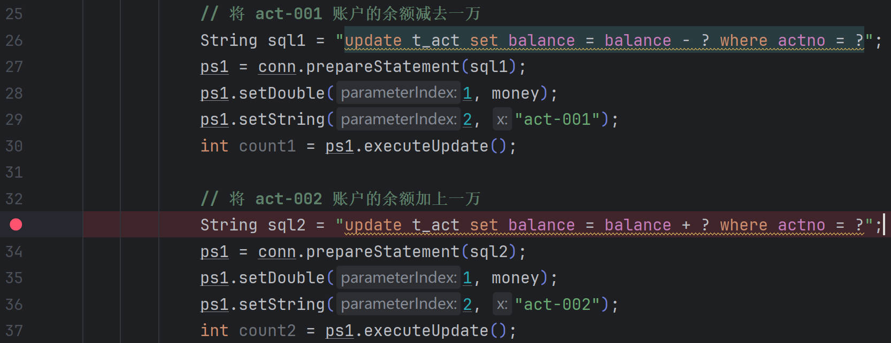
> **让代码执行到`断点处`：**
> 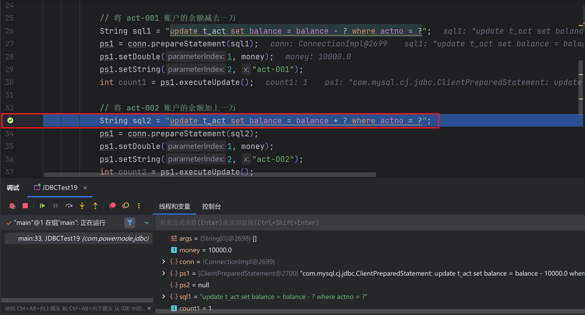
> 让程序停在此处，看看数据库表中的数据是否发生变化：
> 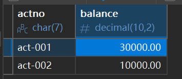
> **可以看到，整个转账的业务还没有执行完毕，`act-001 账户的余额`已经被`修改为 30000`了，为什么修改为 30000了，因为JDBC事务默认情况下是`自动提交`，`只要执行一条DML语句则自动提交一次`。这种自动提交是极其危险的。如果在此时程序发生了异常，`act-002账户的余额未成功更新`，则`钱会丢失一万`。**

> 我们可以测试一下：测试前先将数据恢复到起初的时候
> 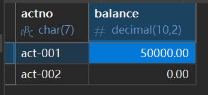
> 在以下代码位置，让其发生异常：
> 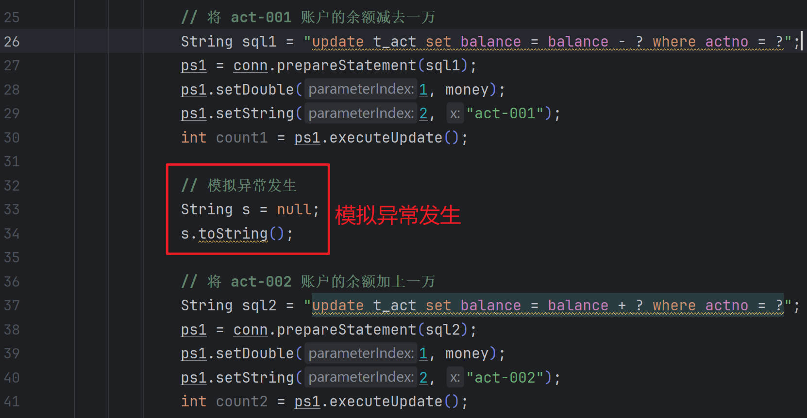
> 执行结果如下：
> 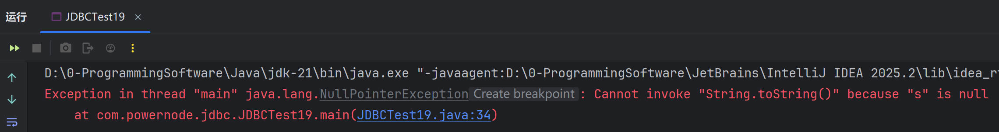
> 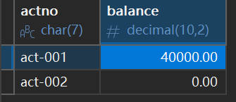
> **经过测试得知，`丢失了一万元`。**

### 添加事务控制

**如何解决以上问题，分三步：**

> **第一步：将JDBC事务的`自动提交机制`修改为`手动提交（即开启事务）`**
>
> ```java title="java"
> conn.setAutoCommit(false);
> ```

> **第二步：`当整个业务完整结束后`，`手动提交事务（即提交事务，事务结束）`**
>
> ```java title="java"
> conn.commit();
> ```

> **第三步：在处理业务过程中，如果`发生异常`，则`进入catch语句块进行异常处理`，`手动回滚事务（即回滚事务，事务结束）`**
>
> ```java title="java"
> conn.rollback();
> ```

代码如下：
```java title="java"
package com.powernode.jdbc;

import com.powernode.jdbc.utils.DbUtils;

import java.sql.Connection;
import java.sql.PreparedStatement;
import java.sql.SQLException;

/**
 *实现转账功能
 */
public class JDBCTest19 {
    public static void main(String[] args) {
        // 转账金额
        double money = 10000.0;
        // 实现转账功能
        Connection conn = null;
        PreparedStatement ps1 = null;
        PreparedStatement ps2 = null;

        try{
            // 获取连接
            conn = DbUtils.getConnection();

            // 第一步：开启事务（将JDBC事务的自动提交机制修改为手动提交）
            conn.setAutoCommit(false);

            // 将 act-001 账户的余额减去一万
            String sql1 = "update t_act set balance = balance - ? where actno = ?";
            ps1 = conn.prepareStatement(sql1);
            ps1.setDouble(1, money);
            ps1.setString(2, "act-001");
            int count1 = ps1.executeUpdate();

            // 模拟异常发生
            String s = null;
            s.toString();

            // 将 act-002 账户的余额加上一万
            String sql2 = "update t_act set balance = balance + ? where actno = ?";
            ps1 = conn.prepareStatement(sql2);
            ps1.setDouble(1, money);
            ps1.setString(2, "act-002");
            int count2 = ps1.executeUpdate();

            // 第二步：当整个业务流程成功的完整的结束了，提交事务（事务结束）
            conn.commit();

        }catch(Exception e){

            // 第三步：只要有任何一个异常发生，则回滚事务（事务结束）
            try{
                conn.rollback();
            }catch(SQLException ex){
                throw  new RuntimeException(ex);
            }

            throw  new RuntimeException(e);
        }finally {
            // 释放资源
            DbUtils.close(conn,ps1,null);
            DbUtils.close(conn,ps2,null);
            DbUtils.close(conn,null,null);
        }
    }
}
```

将数据恢复如初：

执行程序，仍然会出现异常：
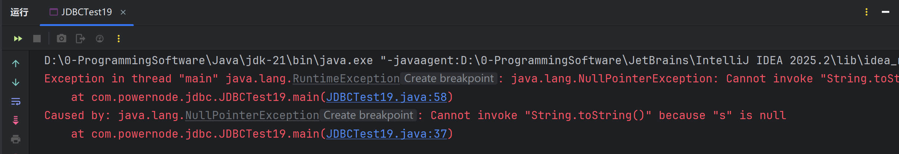
但是数据库表中的数据是安全的：

当程序不出现异常时：
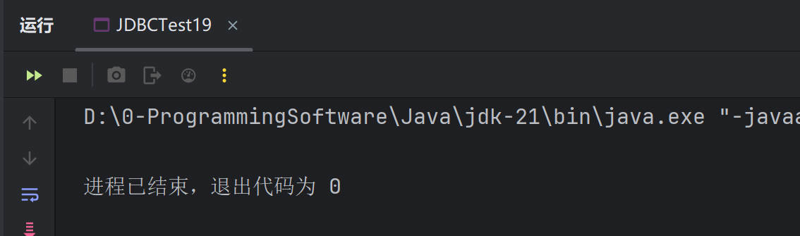
数据库表中的数据也是正确的：
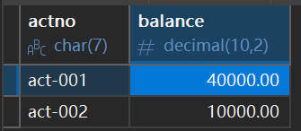
这样就采用了JDBC事务解决了数据安全的问题。

## 设置JDBC事务隔离级别

设置事务的隔离级别也是比较重要的，在JDBC程序中应该如何设置事务的隔离级别呢？代码如下：
```java title="java"
package com.powernode.jdbc;

import com.powernode.jdbc.utils.DbUtils;

import java.sql.Connection;
import java.sql.SQLException;

/**
 * 在JDBC当中，如何使用Java代码设置事务的隔离级别呢？
 */
public class JDBCTest20 {
    public static void main(String[] args) {
        Connection conn = null;

        try{
            conn = DbUtils.getConnection();

            // 设置当前事务的隔离级别
            conn.setTransactionIsolation(Connection.TRANSACTION_REPEATABLE_READ);

        }catch(SQLException e){
            throw  new RuntimeException(e);
        }finally {
            DbUtils.close(conn,null,null);
        }
    }
}
```
