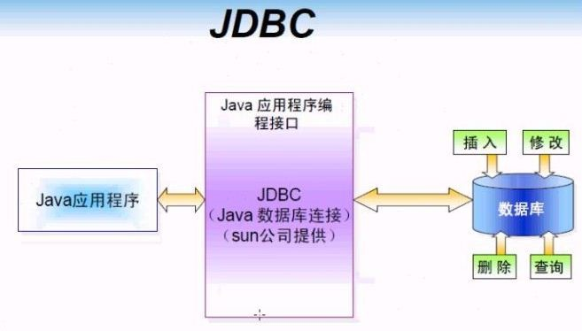
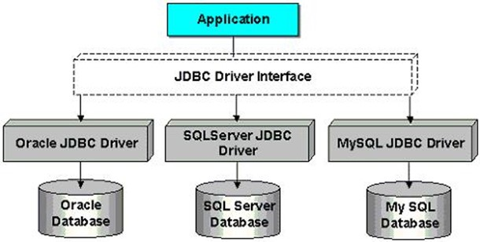
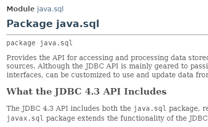
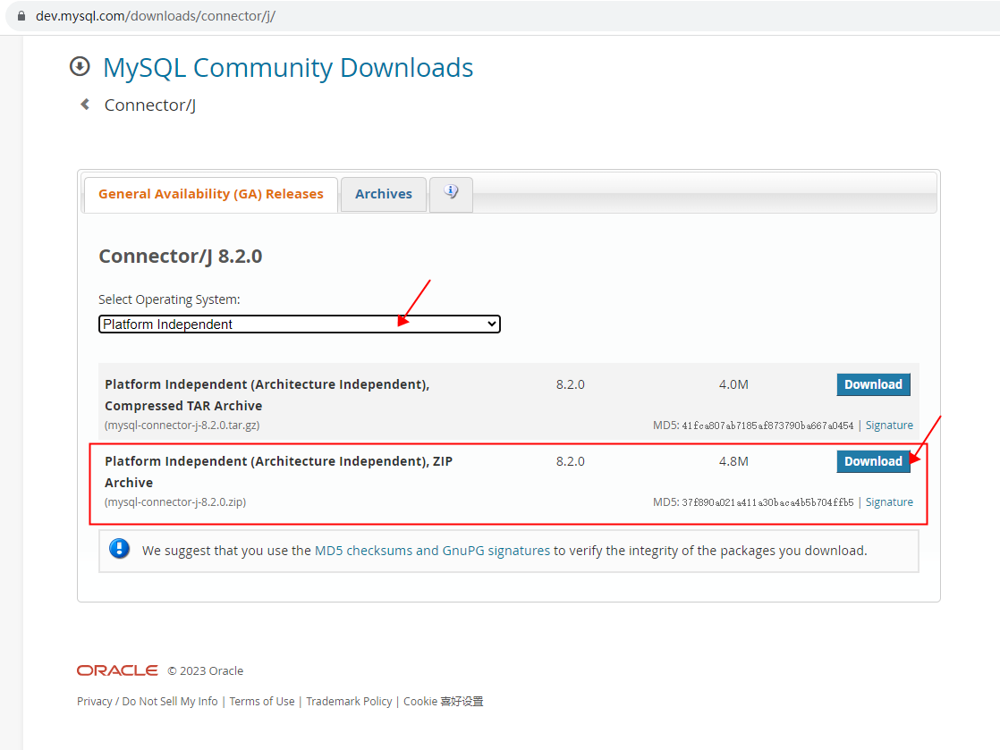
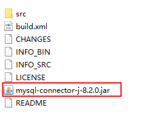
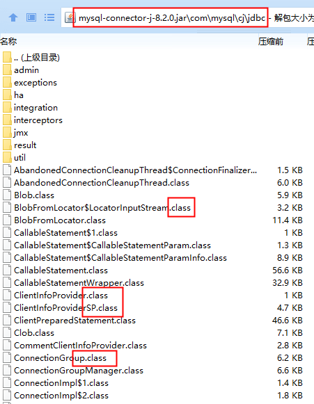
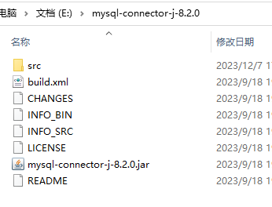
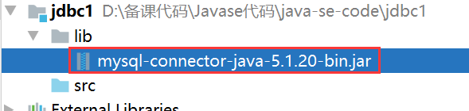
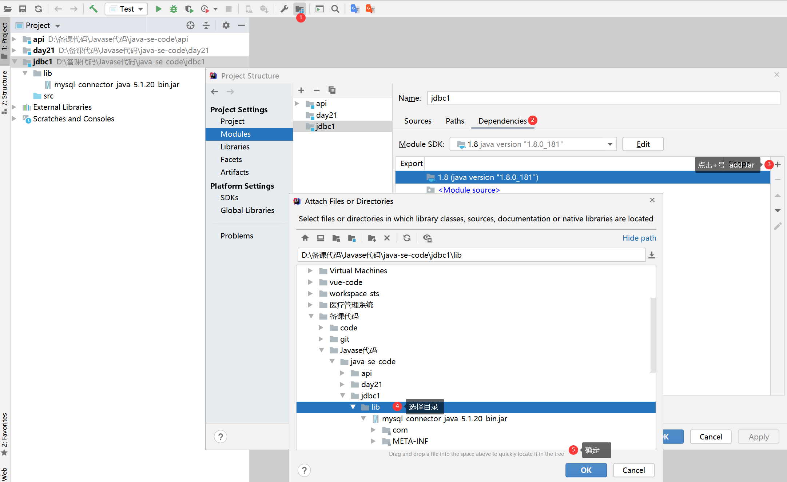
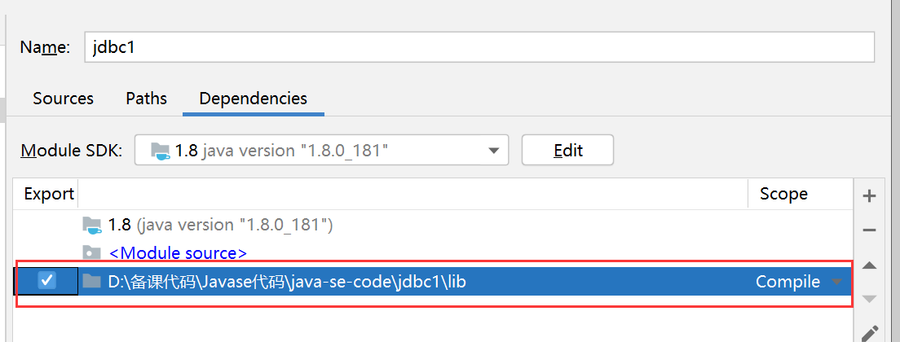

## 什么是JDBC

JDBC（Java DataBase Connectivity）就是Java数据库连接，说白了就是用Java语言来操作数据库。原来我们操作数据库是在控制台使用SQL语句来操作数据库，JDBC是用Java语言向数据库发送SQL语句。


> **Java语言连接数据库的一套`API(Application Programming Interface 应用程序编程接口)`**

## JDBC原理

早期SUN公司的天才们想编写一套可以连接天下所有数据库的API，但是当他们刚刚开始时就发现这是不可完成的任务，因为各个厂商的数据库服务器差异太大了。后来SUN开始与数据库厂商们讨论，最终得出的结论是，由SUN提供一套访问数据库的规范（就是一组接口），并提供连接数据库的协议标准，然后各个数据库厂商会遵循SUN的规范提供一套访问自己公司数据库服务器的API。SUN提供的规范命名为JDBC，而各个厂商提供的，遵循了JDBC规范的，可以访问自己数据库的API被称之为驱动！

JDBC是接口，而JDBC驱动才是接口的实现，没有驱动无法完成数据库连接！每个数据库厂商都有自己的驱动，用来连接自己公司的数据库。
当然还有第三方公司专门为某一数据库提供驱动，这样的驱动往往不是开源免费的！

## 模拟JDBC接口

### 接口在开发中的作用

Java中接口的作用主要有以下几个方面：

1.  定义标准：接口可以用于定义标准，规范应该如何完成某个任务或应该具有哪些属性、方法等。 
2.  隐藏实现：接口隔离了类的实现和外界的逻辑使用，使得外部无论是访问接口的常量或是接口的方法都不需要关心接口的实现。 
3.  实现多态：一个类实现多个接口，在实现接口的过程中，类便会具有接口中的所有方法。这样我们就可以在实际应用中方便的实现多态的效果。 
4.  扩展性和灵活性：通过接口可以为项目提供更好的扩展性和灵活性，接口定义了一个共同的标准，使得新的类可以很容易地加入到已有的系统中，而且不需要修改现有的代码。 

总的来说，Java中的接口可以让我们通过规范来编写更加标准和灵活的代码，使得代码易于维护和扩展，并通过多态的特性来提高代码的重用性和可读性。**Java接口在使用场景中，一定是存在两个角色的，一个是接口的调用者，一个是接口的实现者，接口的出现让调用者和实现者解耦合了。**


### 编写程序模拟JDBC接口

**接口的制定者**：SUN公司负责制定的

```java title="java"
// SUN公司负责制定JDBC接口
public interface JDBC {
    // 负责连接数据库的方法
    void getConnection();
}
```

**接口的实现者**：各大数据库厂商分别对`JDBC接口进行实现`，实现类被称为**驱动**
`MySQL数据库厂商`对JDBC接口的实现：`MySQL驱动`

```java title="java"
public class MySQLDriver implements JDBC{
    public void getConnection(){
        System.out.println("与MySQL数据库连接建立成功，您正在操作MySQL数据库");
    }
}
```
`Oracle数据库厂商`对JDBC接口的实现：`Oracle驱动`

```java title="java"
public class OracleDriver implements JDBC{
    public void getConnection(){
        System.out.println("与Oracle数据库连接建立成功，您正在操作Oracle数据库");
    }
}
```

**接口的调用者**：要操作数据库的`Java程序员`（我们）

```java title="java"
public class Client{
    public static void main(String[] args){
        
        JDBC jdbc = new MySQLDriver();
        
        // 只需要面向接口编程即可，不需要关心具体的实现，不需要关心具体是哪个厂商的数据库
        jdbc.getConnection();
    }
}
```
以上是操作MySQL数据库，如果要操作Oracle数据库的话，需要new OracleDriver()：
```java title="java"
public class Client{
    public static void main(String[] args){
        
        JDBC jdbc = new OracleDriver();
        
        // 只需要面向接口编程即可，不需要关心具体的实现，不需要关心具体是哪个厂商的数据库
        jdbc.getConnection();
    }
}
```
可能你会说，最终还是修改了java代码，不符合OCP原则呀，如果你想达到OCP，那可以将创建对象的任务交给反射机制，将类名配置到文件中，例如：
配置文件如下：

```properties title="properties"
driver=MySQLDriver
```
Java代码如下：
```java title="java"
import java.util.ResourceBundle;

public class Client{
    public static void main(String[] args) throws Exception{
        
        String driverClassName = ResourceBundle.getBundle("jdbc").getString("driver");
        Class c = Class.forName(driverClassName);
        JDBC jdbc = (JDBC)c.newInstance();
        
        // 只需要面向接口编程即可，不需要关心具体的实现，不需要关心具体是哪个厂商的数据库
        jdbc.getConnection();
    }
}
```
最终通过修改jdbc.properties配置文件即可做到数据库的切换。这样就完全做到了调用者和实现者的解耦合。调用者不需要关心实现者，实现者也不需要关心调用者。双方都是面向接口编程。这就是JDBC的本质：它就是一套接口。

## 配置CLASSPATH

经过上面内容的讲解，大家应该知道JDBC开发有三个角色的参与：

- 我们（对数据库中数据进行增删改查的Java程序员）
- JDBC接口的制定者
- JDBC接口的实现者（驱动）

以上三者凑齐了我们才能进行JDBC的开发。它们三个都在哪里呢？“我们”就不用多说了，写操作数据库的代码就行了。JDBC接口在哪（接口的class文件在哪）？JDBC接口实现类在哪（驱动在哪）？

### JDBC接口在哪

JDBC接口在JDK中。对应的包是：**java.sql.*;**
JDBC API帮助文档就在JDK的帮助文档当中。



### 驱动在哪

驱动是JDBC接口的实现类，这些实现类是各大数据库厂家自己实现的，所以这些实现类的就需要去数据库厂商相关的网站上下载了。通常这些实现类被全部放到一个xxx.jar包中。下面演示一下mysql的驱动如何下载【下载mysql的驱动jar包】：
打开页面：[https://dev.mysql.com/downloads/connector/j/](https://dev.mysql.com/downloads/connector/j/)

下载后：

解压：

上图中的“mysql-connector-j-8.2.0.jar”就是mysql数据库的驱动，8.2.0这个版本适用于目前最新版本的mysql数据库。可以使用解压工具打开这个jar包，看看里面是什么？

可以看到这个jar包中都是xxx.class文件，这就是JDBC接口的实现类。这个jar包就是连接mysql数据库的驱动。如果是oracle的驱动就需要去oracle的官网下载了。这里不再赘述。

### 如果使用文本编辑器开发

如果使用文本编辑器开发，不使用集成开发环境的话，以上的jar包就需要手动配置到环境变量CLASSPATH当中，配置如下：
如果jar包放在这里：

就需要这样配置环境变量CLASSPATH：

注意配置路径中的当前路径“.”是不能省略的。

### 如果使用IDEA工具开发

如果是采用集成开发工具，例如IDEA，就不需要手动配置CLASSPATH了，只需要将jar包放到IDEA中（实际上放到IDEA工具中的过程就是等同于在配置CLASSPATH）

第一步：创建lib目录，将jar包拷贝到lib目录


第二步：把lib包引入项目环境




