## JDBC编程六步

JDBC编程的步骤是很固定的，通常包含以下六步：

- 第一步：`注册驱动`
   - 作用一：将 JDBC 驱动程序从硬盘上的文件系统中加载到内存中。
   - 作用二：使得 DriverManager 可以通过一个统一的接口来管理该驱动程序的所有连接操作。
- 第二步：`获取数据库连接`
   - 获取`java.sql.Connection对象`，该对象的创建标志着mysql进程和jvm进程之间的通道打开了。
- 第三步：`获取数据库操作对象`
   - 获取`java.sql.Statement对象`，该对象负责将SQL语句发送给数据库，数据库负责`执行该SQL语句`。
- 第四步：`执行SQL语句`
   - 执行具体的SQL语句，例如：`insert delete update select`等。
- 第五步：`处理查询结果集`
   - 如果之前的操作是`DQL查询语句`，才会有`处理查询结果集`这一步。
   - 执行DQL语句通常会返回查询结果集对象：`java.sql.ResultSet`。
   - 对于ResultSet查询结果集来说，通常的操作是针对查询结果集进行结果集的遍历。
- 第六步：`释放资源`
   - 释放资源可以避免资源的浪费。在 JDBC 编程中，每次使用完` Connection、Statement、ResultSet`**(从左往右打开，从右往左关闭)**等资源后，都需要显式地调用对应的 close() 方法来释放资源，避免资源的浪费。
   - 释放资源可以避免出现内存泄露问题。在 Java 中，当一个对象不再被引用时，会被 JVM 的垃圾回收机制进行回收。但是在 JDBC 编程中，如果不显式地释放资源，那么这些资源就不会被 JVM 的垃圾回收机制自动回收，从而导致内存泄露问题。

## 数据的准备

使用PowerDesigner设计用户表t_user。
使用Navicat for MySQL创建数据库，创建表，插入数据。

### PowerDesigner与Navicat for MySQL的区别

Navicat for MySQL 是一款常用的 MySQL 数据库管理工具，提供了丰富的数据库管理和开发工具，可以方便地进行数据库的连接、查询、管理、模型设计等操作，是 MySQL 开发和管理的效率工具。

而 PowerDesigner 工具则是一款专业的建模工具，它支持多种数据库和操作系统，可以完成数据库设计、数据建模、过程建模、企业业务建模等工作。PowerDesigner 可以帮助开发人员在数据库设计和开发过程中更好地理解和管理数据，便于协同开发和项目管理。各种数据库技术的建模形式都可以实现，有单个数据库建模到多个数据库建模和业务建模等高级功能，**非常适用于大型项目中的数据库设计和建模**。同时，PowerDesigner 还支持 UML，Java 等编程语言的建模，可以与开发语言无缝整合。

因此，Navicat for MySQL 和 PowerDesigner 的功能是不同的，可以根据实际需要来选用。如果只是针对 MySQL 的数据库连接、查询、管理等操作，可以使用 Navicat for MySQL 工具，而如果需要进行更复杂的数据库设计、建模和整合等工作，可以使用 PowerDesigner 工具来实现。**如果使用 MySQL 数据库进行开发，使用 Navicat for MySQL 和 PowerDesigner 这两个工具相互配合，可以提高开发效率和数据管理质量**。

### PowerDesigner工具的安装

来这里下载该工具：链接：[https://pan.baidu.com/s/1lRWC069K8GE-8rxr259ArQ?pwd=2009](https://pan.baidu.com/s/1lRWC069K8GE-8rxr259ArQ?pwd=2009) 提取码：2009
双击安装包：

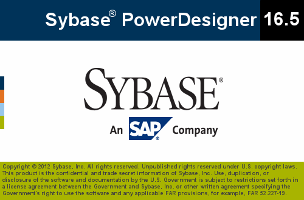

欢迎页：
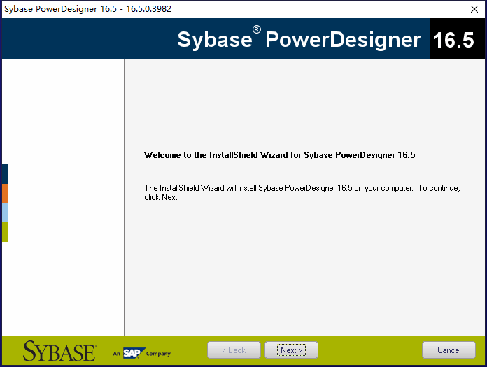

选择试用15天：
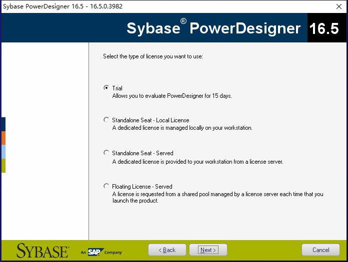

选择香港，以及接受：
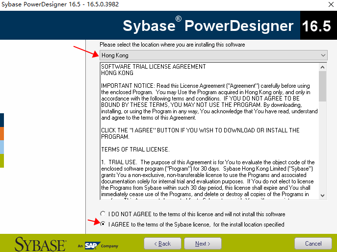

设置安装位置：
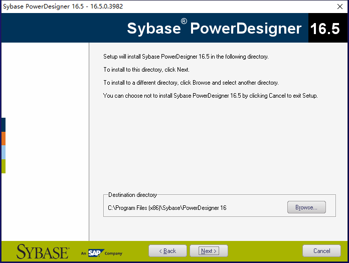

选择你要安装的（默认就行）：
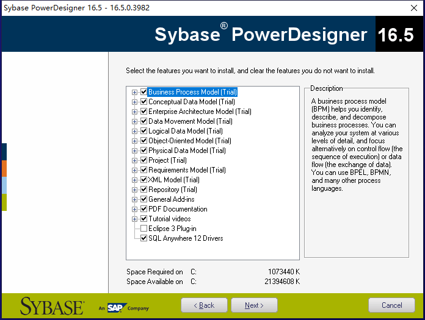

选择要安装的用户配置文件（默认即可）：
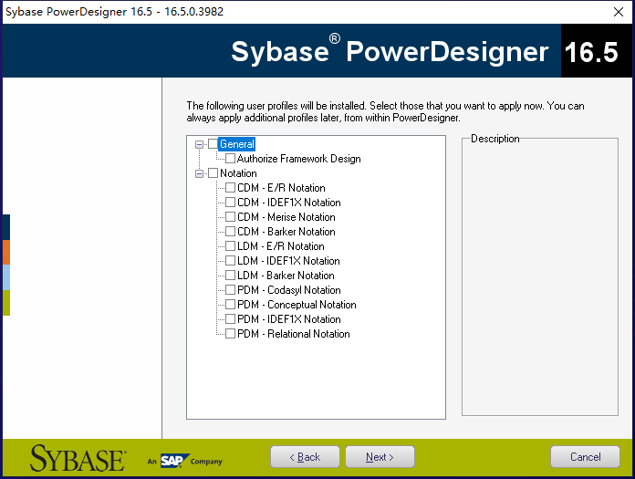

添加图标：


安装概览信息：
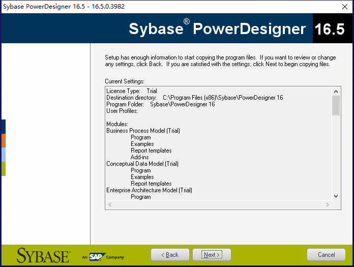

安装中：
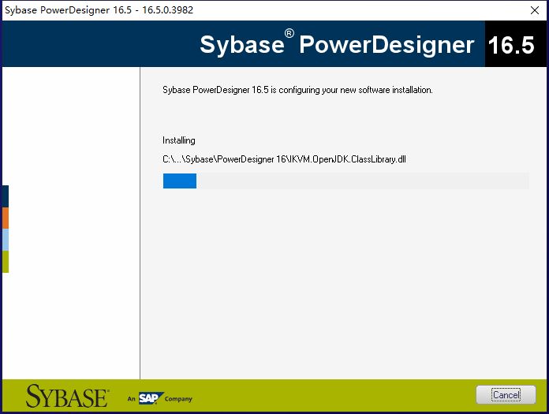

安装完成：
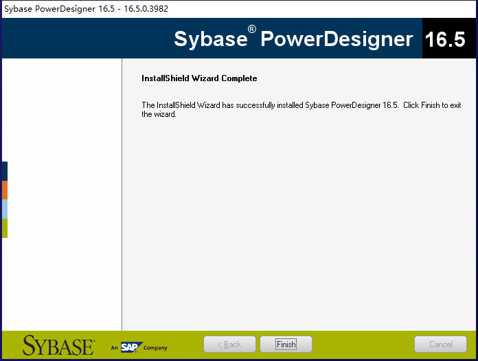

如何破解？看到这个文件了吗？
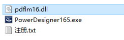
把这个文件拷贝到这个安装目录当中：
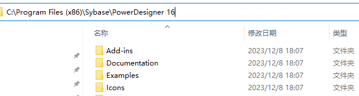
会自动提醒你替换：
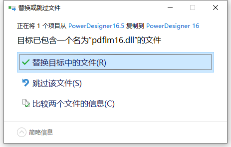
替换即可完成破解！！！！

### 使用PowerDesigner进行物理数据建模

打开PowerDesigner：
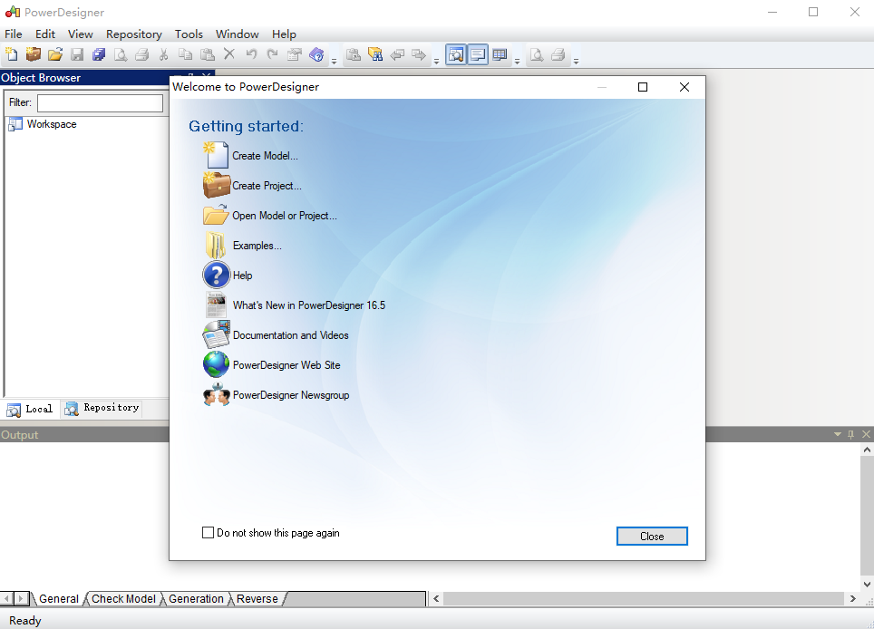

点击“Create Model...”来创建PDM（Physical Data Model，物理数据模型）：
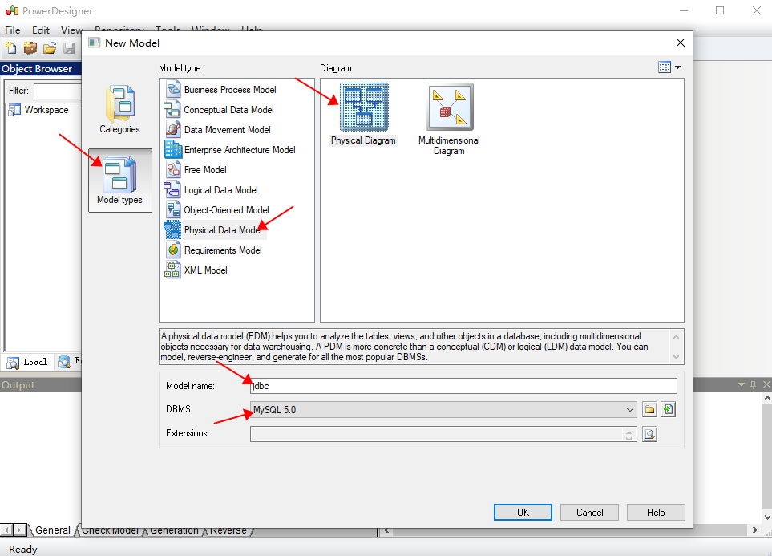

**什么是物理数据模型PDM？**
`物理数据模型（Physical Data Model，PDM）是数据管理领域中表示数据库逻辑设计后，通过物理设计最终转化为实际数据结构的过程，即在逻辑模型的基础上，进行数据存储结构的设计。PDM 是一个详细的数据库设计计划，它描述了如何在关系数据库中存储数据。物理数据模型包含了所有数据表，列、键和索引以及物理存储的详细信息，包括数据类型、字段宽度、默认值、统计信息等。此外，PDM 还描述了如何将数据表存储在文件或表空间中，这些信息可以帮助开发人员建立实际的数据库系统。通常，PDM 包含了完整的 ER 模型，数据表和关系的详细信息，包括数据的主键、外键、唯一键、索引、约束条件等。物理数据模型可以使用各种建模工具来手工创建或自动生成。在数据库设计阶段，生成 PDM 是非常重要的一步，是将逻辑设计转换为实际实现的重要步骤之一。它可以帮助开发人员在实现时更加清晰地了解数据的存储结构，同时也方便后续的数据库管理和维护工作。`

创建完成后是这样的：
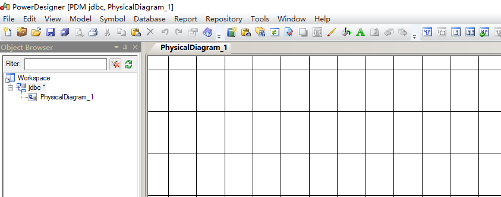
注意：右侧的小格子是可以放大和缩小的。看着像是很大的一张网。在每个格子当中可以容纳多个表。并且在这张网上可以清晰的看到表与表的关系。（一对多，一对一，多对多等。)

记得保存，ctrl+s保存时会生成一个xxx.pdm文件，以后如果要修改设计，双击这个xxx.pdm文件即可打开，进行编辑：
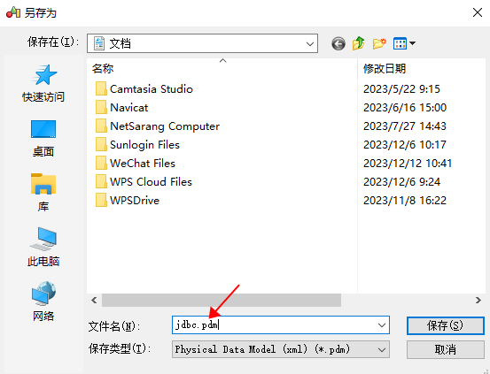
保存后的文件：
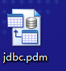

开始进行表的设计，这里不搞那么复杂，先创建一张表即可：t_user，用户表：
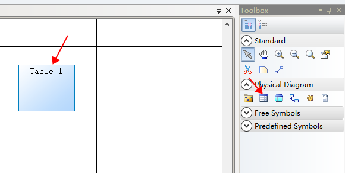

双击后，弹出设计窗口：
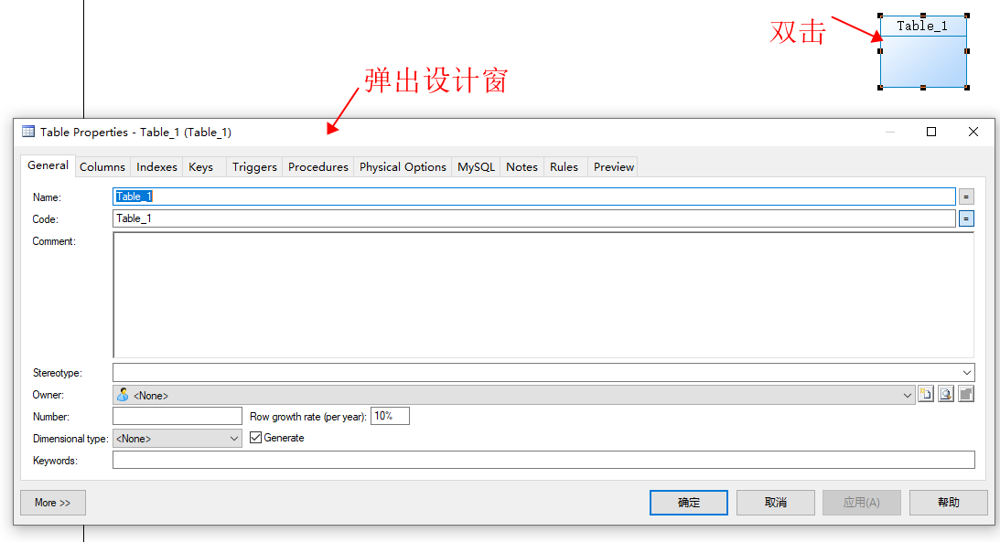

设计表名：
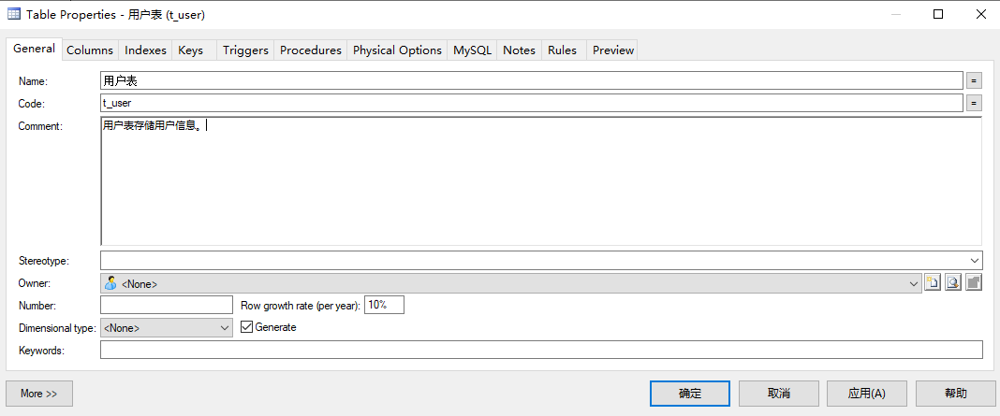
注意：

1. Name：用来设置显示的表名
2. Code：用来设置数据库中真实创建的表名
3. Comment：对表的注释说明

设计字段：

把每个字段设计好，包括：字段名，数据类型，长度，约束等。

设计完成后：
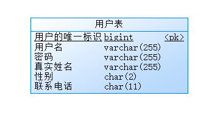

### 使用PowerDesigner导出建表语句

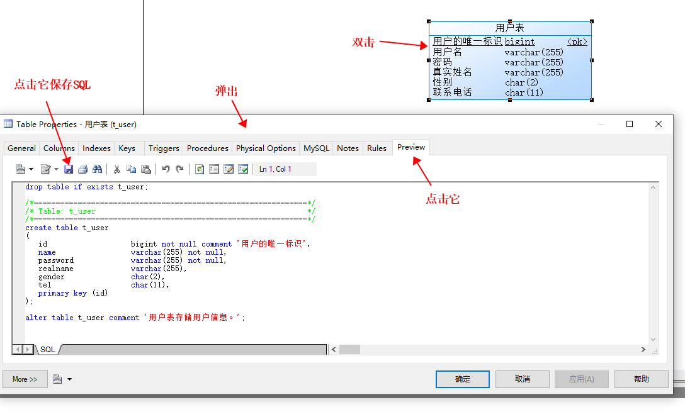

```sql
drop table if exists t_user;

/*==============================================================*/
/* Table: t_user                                                */
/*==============================================================*/
create table t_user
(
   id                   bigint not null comment '用户的唯一标识',
   name                 varchar(255) not null,
   password             varchar(255) not null,
   realname             varchar(255),
   gender               char(2),
   tel                  char(11),
   primary key (id)
);

alter table t_user comment '用户表存储用户信息。';
```

## 使用Navicat for MySQL初始化数据

### 建库

使用Navicat for MySQL创建一个MySQL数据库，起名：jdbc
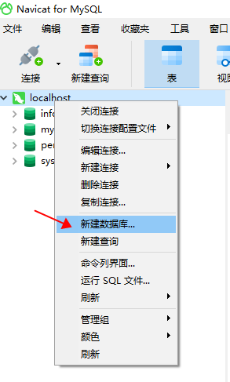
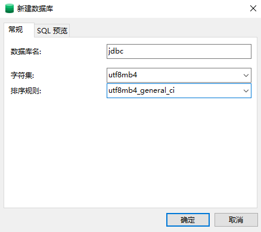

### 建表
执行jdbc.sql脚本：
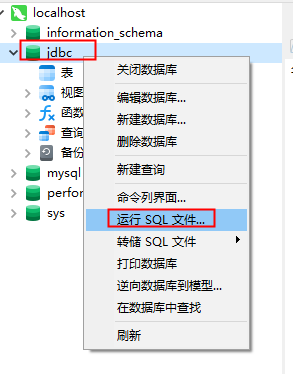
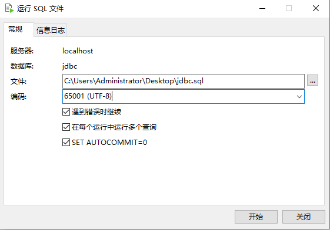

最终创建的表：
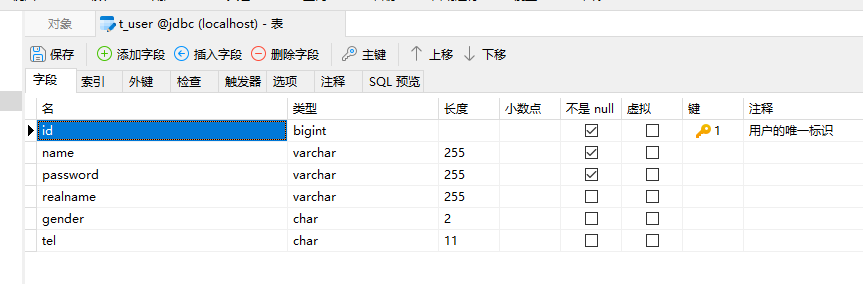

### 插入数据

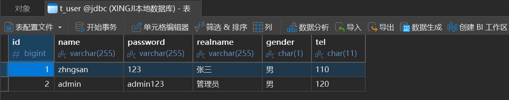

**注意：这里我将主键设置为了自增：auto_increment。其实这个也可以在PowerDesigner中设计时指定自增：勾选上它即可。**

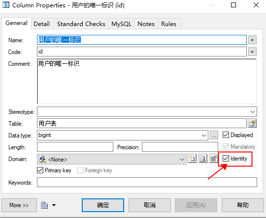

## JDBC完成新增操作

新增操作就是让数据库执行insert语句。通过这个操作来学习一下JDBC编程的每一步。刚开始编写JDBC代码的时候，建议使用文本编辑器，先不借助任何IDE。

### JDBC编程第一步：注册驱动

注册驱动有两个作用：

1. 将 JDBC 驱动程序从硬盘上的文件系统中加载到内存。
2. 让 DriverManager 可以通过一个统一的接口来管理该驱动程序的所有连接操作。  

API帮助文档：
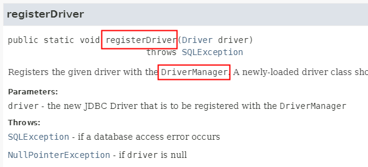

代码如下：
```java title="java"
/*
   使用JDBC程序向jdbc.t_user表中插入一条数据
 */
import java.sql.Driver;
import java.sql.DriverManager;
import java.sql.SQLException;

public class JDBCTest01 {
    public static void main(String[] args) {

        try{
            //1.注册驱动
            //com.mysql.cj.jdbc.Driver 是MySQL的驱动最核心的类
            //这个类实现了 java.sql.Driver 接口
            Driver driver = new com.mysql.cj.jdbc.Driver(); //创建核心驱动对象
            DriverManager.registerDriver(driver); //注册驱动
            //DriverManager.registerDriver(new com.mysql.cj.jdbc.Driver());

            //2.获取连接
            //3.获取数据库操作对象
            //4.执行SQL语句
        }catch(SQLException e){
            e.printStackTrace();
        }finally {
            //6.释放资源
        }
    }
}
```
**注意：注册驱动调用的是java.sql.DriverManager的registerDriver()方法。这些方法的使用要参阅JDK的API帮助文档。**
**思考1：为什么以上代码中new的时候，后面类名要带上包名呢？**
**思考2：以上代码中哪些是JDBC接口，哪些是JDBC接口的实现？**

### JDBC编程第二步：获取连接

获取java.sql.Connection对象，该对象的创建标志着mysql进程和jvm进程之间的通道打开了。

#### 代码实现

API帮助文档：
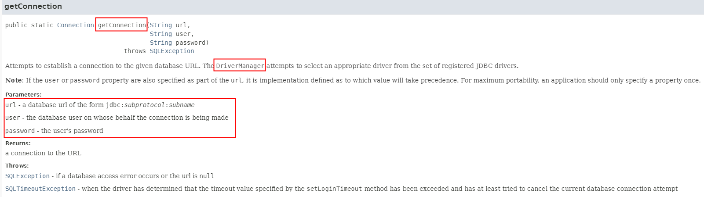

代码如下：
```java title="java"
/*
   使用JDBC程序向jdbc.t_user表中插入一条数据
 */
import java.sql.Driver;
import java.sql.DriverManager;
import java.sql.SQLException;
import java.sql.Connection;

public class JDBCTest01 {
    public static void main(String[] args) {

        try{
            //1.注册驱动
            //com.mysql.cj.jdbc.Driver 是MySQL的驱动最核心的类
            //这个类实现了 java.sql.Driver 接口
            Driver driver = new com.mysql.cj.jdbc.Driver(); //创建核心驱动对象
            DriverManager.registerDriver(driver); //注册驱动

            //DriverManager.registerDriver(new com.mysql.cj.jdbc.Driver());

            //2.获取连接
            String url = "jdbc:mysql://localhost:3306/jdbc";
            String user = "root";
            String password = "1225";
            Connection conn = DriverManager.getConnection(url,user,password);

            // 连接对象：com.mysql.cj.jdbc.ConnectionImpl@3b0090a4
            // com.mysql.cj.jdbc.ConnectionImpl , 这是什么？
            // MySQL数据库厂家对 java.sql.Connection 接口的实现。
            // java.sql.Connection 是SUN制定的接口
            // com.mysql.cj.jdbc.ConnectionImpl是该接口的实现类

            // 注意：其实我们不需要关心具体的实现类是谁，我们只需要面向JDBC接口编写代码即可。
            System.out.println("连接对象：" + conn);

            //3.获取数据库操作对象

            //4.执行SQL语句
        }catch(SQLException e){
            e.printStackTrace();
        }finally {
            //6.释放资源
        }
    }
}
```

执行结果如下：
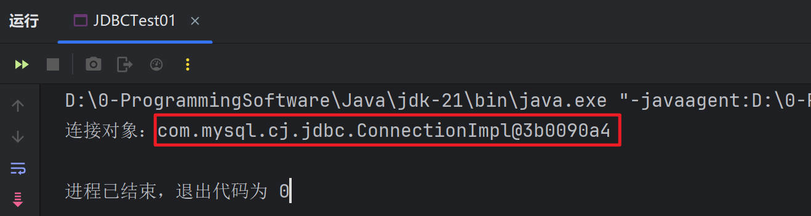
看到以上的输出结果，表示数据库已经连接成功了。

通过以上程序的输出结果得知：`com.mysql.cj.jdbc.ConnectionImpl`是`java.sql.Connection`接口的`实现类`，大家可以想象一下，如果换成`Oracle数据库`的话，这个实现类的类名是不是就会换一个呢？答案是肯定的。不过对于我们来说是`不需要关心具体实现类的`，因为后续的代码都是直接面向`java.sql.Connection`接口来调用方法的。面向接口编程在这里体现的淋漓尽致。确实`降低了耦合度`。

以上程序中演示了连接数据库需要提供三个信息：`url，用户名，密码`。其中`用户名和密码`容易理解。**url是什么**？

#### 什么是URL

URL 是`统一资源定位符 (Uniform Resource Locator)` 的缩写，是互联网上`标识、定位、访问资源`的`字符串`。它可以用来指定互联网上各种类型的资源的位置，如网页、图片、视频等。

URL 通常由`协议、服务器名、服务器端口、路径和查询字符串`组成。其中：

- `协议`是规定了访问资源所采用的`通信协议`，例如 `HTTP、HTTPS、FTP `等；
- `服务器名`是资源所在的服务器`主机名或 IP 地址`，可以是`域名或 IP 地址`；
- `服务器端口`是资源所在的`服务器的端口号`；
- `路径`是资源所在的服务器上的`路径、文件名`等信息；
- `查询字符串`是向服务器`提交的参数信息，用来定位更具体的资源`。

URL 在互联网中广泛应用，比如在浏览器中输入 URL 来访问网页或下载文件，在网站开发中使用 URL 来访问 API 接口或文件，在移动应用和桌面应用中使用 URL 来访问应用内部的页面或功能，在搜索引擎中使用 URL 来爬取网页内容等等。

总之，URL 是互联网上所有资源的唯一识别标识，是互联网通信的基础和核心技术之一。

#### JDBC连接MySQL时的URL格式

JDBC URL 是在使用 JDBC 连接数据库时的一个 URL 字符串，它用来标识要连接的数据库的位置、认证信息和其他配置参数等。JDBC URL 的格式可以因数据库类型而异，但通常包括以下几个部分：

- 协议：表示要使用的数据库管理系统（DBMS）的类型，如 `jdbc:mysql` 表示要`使用 MySQL 数据库`，`jdbc:postgresql` 表示要`使用 PostgreSQL 数据库`。
- 主机地址和端口号：表示要连接的数据库所在的服务器的 IP 地址或域名，以及数据库所在服务器监听的端口号。
- 数据库名称：表示要连接的数据库的名称。
- 其他可选参数：这些参数包括连接的超时时间、使用的字符集、连接池相关配置等。

例如，连接 MySQL 数据库的 JDBC URL 的格式一般如下：

```
jdbc:mysql://<host>:<port>/<database_name>?<connection_parameters>
```

其中：

- `<host>` 是 MySQL 数据库服务器的主机名或 IP 地址；
- `<port>` 是 MySQL 服务器的端口号（默认为 3306）；
- `<database_name>` 是要连接的数据库名称；
- `<connection_parameters>` 包括`连接的额外参数`，例如`用户名、密码、字符集`等。

JDBC URL 是连接数据库的关键，通过 JDBC URL，应用程序可以通过特定的 JDBC 驱动程序与数据库服务器进行通信，从而实现与数据库的交互。在开发 Web 应用和桌面应用时，使用 JDBC URL 可以轻松地连接和操作各种类型的数据库，例如 MySQL、PostgreSQL、Oracle 等。

以下是一个常见的JDBC MySQL URL：
```
jdbc:mysql://localhost:3306/jdbc
```
`jdbc:mysql://`是协议
`localhost`表示连接本地主机的MySQL数据库，也可以写作`127.0.0.1`
`3306`是MySQL数据库的端口号
`jdbc`是数据库实例名

#### MySQL URL中的其它常用配置

在 JDBC MySQL URL 中，常用的配置参数有：

- `serverTimezone`：MySQL 服务器时区，默认为 `UTC`，可以通过该参数来`指定客户端和服务器的时区`；

在 JDBC URL 中设置 `serverTimezone` 的作用是指定数据库服务器的时区。这个时区信息会影响 JDBC 驱动在处理日期时间相关数据类型时如何将其映射到服务器上的日期时间值。
如果不设置 `serverTimezone`，则 JDBC 驱动程序默认将使用本地时区，也就是客户端机器上的系统时区，来处理日期时间数据。在这种情况下，如果服务器的时区和客户端机器的时区不同，那么处理日期时间数据时可能会出现问题，从而导致数据错误或不一致。
例如，假设`服务器`位于`美国加州`，而`客户端`位于`中国上海`，如果不设置 `serverTimezone` 参数，在客户端执行类似下面的查询：

```sql
SELECT * FROM orders WHERE order_date = '2022-11-11';
```
由于客户端和服务器使用了不同的时区，默认使用的是客户端本地的时区，那么实际查询的时间就是客户端本地时间对应的时间，而不是服务器的时间。这可能会导致查询结果不正确，因为服务器上的时间可能是比客户端慢或者快了多个小时。
通过在 JDBC URL 中设置 `serverTimezone` 参数，可以明确告诉 JDBC 驱动程序使用哪个时区来处理日期时间值，从而避免这种问题。在上述例子中，如果把时区设置为 `America/Los_Angeles`（即加州的时区）：
```
jdbc:mysql://localhost:3306/mydatabase?user=myusername&password=mypassword&serverTimezone=America/Los_Angeles
```
那么上面的查询就会在数据库服务器上以加州的时间来执行，结果更加准确。

- `useSSL`：是否使用 SSL 进行连接，默认为 true；

`useSSL` 参数用于配置是否使用 SSL（Secure Sockets Layer）安全传输协议来加密 JDBC 和 MySQL 数据库服务器之间的通信。其设置为 `true` 表示使用 SSL 连接，设置为 `false` 表示不使用 SSL 连接。其区别如下：
当设置为 `true` 时，JDBC 驱动程序将使用 SSL 加密协议来保障客户端和服务器之间的通信安全。这种方式下，所有数据都会使用 SSL 加密后再传输，可以有效防止数据在传输过程中被窃听、篡改等安全问题出现。当然，也要求服务器端必须支持 SSL，否则会连接失败。
当设置为 `false` 时，JDBC 驱动程序会以明文方式传输数据，这种方式下，虽然数据传输的速度会更快，但也会存在被恶意攻击者截获和窃听数据的风险。因此，在不安全的网络环境下，或是要求数据传输安全性较高的情况下，建议使用 SSL 加密连接。
需要注意的是，使用 SSL 连接会对系统资源和性能消耗有一定的影响，特别是当连接数较多时，对 CPU 和内存压力都比较大。因此，在性能和安全之间需要权衡，根据实际应用场景合理设置 `useSSL` 参数。

- useUnicode：是否使用Unicode编码进行数据传输，默认是true启用

`useUnicode`是 JDBC 驱动程序连接数据库时的一个参数，用于告诉驱动程序在`传输数据时是否使用 Unicode 编码`。Unicode 是计算机科学中的一种字符编码方案，可以用于表示全球各种语言中的字符，包括 ASCII 码、中文、日文、韩文等。因此，使用 Unicode 编码可以确保数据在传输过程中能够正确、完整地呈现各种语言的字符。
具体地说，如果设置 `useUnicode=true`，JDBC 驱动程序会在传输数据时使用 Unicode 编码。这意味着，无论数据源中使用的是什么编码方案，都会先将数据转换为 Unicode 编码进行传输，确保数据能够跨平台、跨数据库正确传输。当从数据库中获取数据时，驱动程序会根据 `characterEncoding` 参数指定的字符集编码将数据转换为指定编码格式，以便应用程序正确处理数据。
需要注意的是，如果设置 `useUnicode=false`，则表示使用当前平台默认的字符集进行数据传输。这可能会导致在跨平台或跨数据库时出现字符编码不一致的问题，因此通常建议在进行数据传输时启用 Unicode 编码。
综上所述，设置 `useUnicode` 参数可以确保数据在传输过程中正确呈现各种字符集编码。对于应用程序处理多语言环境数据的场景，启用 `useUnicode` 参数尤为重要。

- `characterEncoding`：连接使用的字符编码，默认为 UTF-8；

`characterEncoding` 参数用于设置 MySQL 服务器和 JDBC 驱动程序之间进行字符集转换时使用的字符集编码。其设置为 `UTF-8` 表示使用 UTF-8 编码进行字符集转换，设置为 `GBK` 表示使用 GBK 编码进行字符集转换。其区别如下：
UTF-8 编码是一种可变长度的编码方式，可以表示世界上的所有字符，包括 ASCII、Unicode 和不间断空格等字符，是一种通用的编码方式。UTF-8 编码在国际化应用中被广泛使用，并且其使用的字节数较少，有利于提高数据传输的效率和节约存储空间。
GBK 编码是一种固定长度的编码方式，只能表示汉字和部分符号，不能表示世界上的所有字符。GBK 编码通常只用于中文环境中，因为在英文和数字等字符中会出现乱码情况。
因此，在 MySQL 中使用 `UTF-8` 编码作为字符集编码的优势在于能够支持世界上的所有字符，而且在国际化应用中使用广泛，对于不同语言和地区的用户都能够提供良好的支持。而使用 `GBK` 编码则主要在于适用于中文环境中的数据存储和传输。
需要注意的是，在选择编码方式时需要考虑到应用本身的实际需要和数据的特性，根据具体情况进行选择，避免出现字符集编码错误的问题。同时，还要确保 MySQL 服务器、JDBC 驱动程序和应用程序之间的字符集编码一致，避免出现字符集转换错误的问题。

**注意：useUnicode和characterEncoding有什么区别？**

- **useUnicode设置的是数据在传输过程中是否使用Unicode编码方式。**
- **characterEncoding设置的是数据被传输到服务器之后，服务器采用哪一种字符集进行编码。**

例如，连接 MySQL 数据库的 JDBC URL 可以如下所示：
```
jdbc:mysql://localhost:3306/jdbc?useUnicode=true&serverTimezone=Asia/Shanghai&useSSL=true&characterEncoding=utf-8
```
这里演示的是使用本地 MySQL 数据库，使用Unicode编码进行数据传输，服务器时区为 Asia/Shanghai，启用 SSL 连接，服务器接收到数据后使用 UTF-8 编码。

### JDBC编程第三步：获取数据库操作对象

数据库操作对象是这个接口：`java.sql.Statement`。这个对象负责将SQL语句发送给数据库服务器，服务器接收到SQL后进行编译，然后执行SQL。

API帮助文档如下：
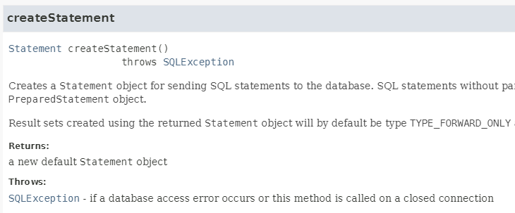

获取数据库操作对象代码如下：
```java title="java"
/*
   使用JDBC程序向jdbc.t_user表中插入一条数据
 */
import java.sql.Driver;
import java.sql.DriverManager;
import java.sql.SQLException;
import java.sql.Connection;
import java.sql.Statement;

public class JDBCTest01 {
    public static void main(String[] args) {

        try{
            //1.注册驱动
            //com.mysql.cj.jdbc.Driver 是MySQL的驱动最核心的类
            //这个类实现了 java.sql.Driver 接口
            Driver driver = new com.mysql.cj.jdbc.Driver(); //创建核心驱动对象
            DriverManager.registerDriver(driver); //注册驱动

            //DriverManager.registerDriver(new com.mysql.cj.jdbc.Driver());

            //2.获取连接
            String url = "jdbc:mysql://localhost:3306/jdbc";
            String user = "root";
            String password = "1225";
            Connection conn = DriverManager.getConnection(url,user,password);

            // 连接对象：com.mysql.cj.jdbc.ConnectionImpl@3b0090a4
            // com.mysql.cj.jdbc.ConnectionImpl , 这是什么？
            // MySQL数据库厂家对 java.sql.Connection 接口的实现。
            // java.sql.Connection 是SUN制定的接口
            // com.mysql.cj.jdbc.ConnectionImpl是该接口的实现类

            // 注意：其实我们不需要关心具体的实现类是谁，我们只需要面向JDBC接口编写代码即可。
            // System.out.println("连接对象：" + conn);

            //3.获取数据库操作对象
            Statement stmt = conn.createStatement();
            System.out.println("数据库操作对象stmt = " + stmt); //数据库操作对象stmt = com.mysql.cj.jdbc.StatementImpl@1c1bbc4e

            //Statement stmt2 = conn.createStatement();
            //System.out.println("数据库操作对象stmt2 = " + stmt2); //数据库操作对象stmt2 = com.mysql.cj.jdbc.StatementImpl@55fe41ea

            //4.执行SQL语句
        }catch(SQLException e){
            e.printStackTrace();
        }finally {
            //6.释放资源
        }
    }
}
```

执行结果如下：
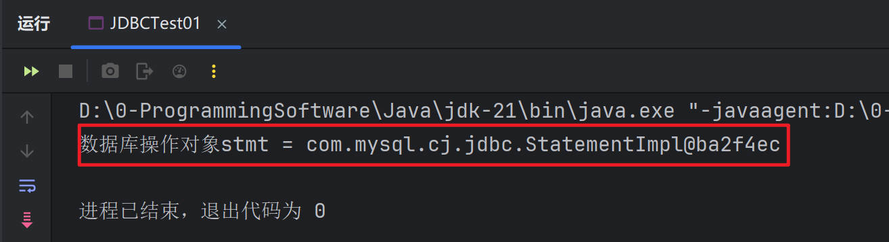

同样可以看到：`java.sql.Statement`接口在MySQL驱动中的实现类是：`com.mysql.cj.jdbc.StatementImpl`。不过我们同样是不需要关心这个具体的实现类。因为后续的代码仍然是`面向Statement接口`写代码的。

另外，要知道的是通过一个Connection对象是可以创建多个Statement对象的：
```java title="java"
/*
   使用JDBC程序向jdbc.t_user表中插入一条数据
 */
import java.sql.Driver;
import java.sql.DriverManager;
import java.sql.SQLException;
import java.sql.Connection;
import java.sql.Statement;

public class JDBCTest01 {
    public static void main(String[] args) {

        try{
            //1.注册驱动
            //com.mysql.cj.jdbc.Driver 是MySQL的驱动最核心的类
            //这个类实现了 java.sql.Driver 接口
            Driver driver = new com.mysql.cj.jdbc.Driver(); //创建核心驱动对象
            DriverManager.registerDriver(driver); //注册驱动

            //DriverManager.registerDriver(new com.mysql.cj.jdbc.Driver());

            //2.获取连接
            String url = "jdbc:mysql://localhost:3306/jdbc";
            String user = "root";
            String password = "1225";
            Connection conn = DriverManager.getConnection(url,user,password);

            // 连接对象：com.mysql.cj.jdbc.ConnectionImpl@3b0090a4
            // com.mysql.cj.jdbc.ConnectionImpl , 这是什么？
            // MySQL数据库厂家对 java.sql.Connection 接口的实现。
            // java.sql.Connection 是SUN制定的接口
            // com.mysql.cj.jdbc.ConnectionImpl是该接口的实现类

            // 注意：其实我们不需要关心具体的实现类是谁，我们只需要面向JDBC接口编写代码即可。
            // System.out.println("连接对象：" + conn);

            //3.获取数据库操作对象
            Statement stmt = conn.createStatement();
            System.out.println("数据库操作对象stmt = " + stmt); //数据库操作对象stmt = com.mysql.cj.jdbc.StatementImpl@1c1bbc4e

            Statement stmt2 = conn.createStatement();
            System.out.println("数据库操作对象stmt2 = " + stmt2); //数据库操作对象stmt2 = com.mysql.cj.jdbc.StatementImpl@55fe41ea

            //4.执行SQL语句
        }catch(SQLException e){
            e.printStackTrace();
        }finally {
            //6.释放资源
        }
    }
}
```

执行结果：
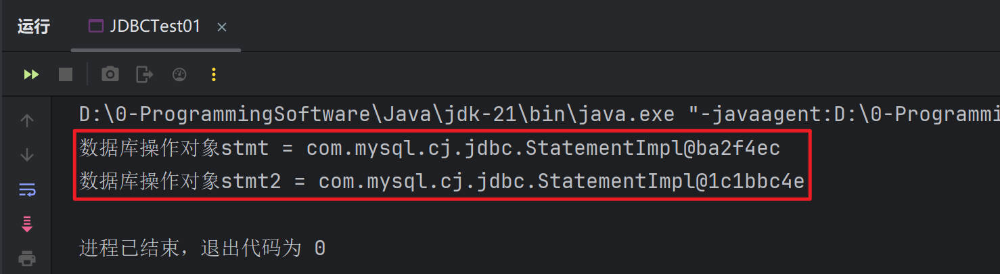

### JDBC编程第四步：执行SQL

当获取到Statement对象后，调用这个接口中的相关方法即可执行SQL语句。

API帮助文档如下：
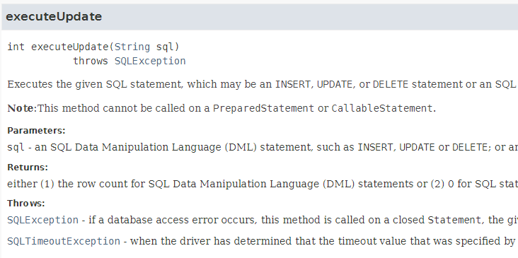

**该方法的参数是一个`SQL语句`，只要将`insert语句`传递过来即可。当执行`executeUpdate(sql)方法`时，JDBC会`将sql语句发送给数据库服务器`，数据库服务器对SQL语句进行`编译`，然后执行`SQL`。**
**该方法的返回值是`int类型`，`返回值的含义`是：`影响了数据库表当中几条记录`。例如：`返回1`表示`1条数据插入成功`，`返回2`表示`2条数据插入成功`，以此类推。如果`一条也没有插入`，则`返回0`。**
**该方法适合执行的SQL语句是`DML`，包括：`insert delete update`。**

代码实现如下：
```java title="java"
/*
   使用JDBC程序向jdbc.t_user表中插入一条数据
 */
import java.sql.Driver;
import java.sql.DriverManager;
import java.sql.SQLException;
import java.sql.Connection;
import java.sql.Statement;

public class JDBCTest01 {
    public static void main(String[] args) {

        try{
            //1.注册驱动
            //com.mysql.cj.jdbc.Driver 是MySQL的驱动最核心的类
            //这个类实现了 java.sql.Driver 接口
            Driver driver = new com.mysql.cj.jdbc.Driver(); //创建核心驱动对象
            DriverManager.registerDriver(driver); //注册驱动

            //DriverManager.registerDriver(new com.mysql.cj.jdbc.Driver());

            //2.获取连接
            String url = "jdbc:mysql://localhost:3306/jdbc";
            String user = "root";
            String password = "1225";
            Connection conn = DriverManager.getConnection(url,user,password);

            // 连接对象：com.mysql.cj.jdbc.ConnectionImpl@3b0090a4
            // com.mysql.cj.jdbc.ConnectionImpl , 这是什么？
            // MySQL数据库厂家对 java.sql.Connection 接口的实现。
            // java.sql.Connection 是SUN制定的接口
            // com.mysql.cj.jdbc.ConnectionImpl是该接口的实现类

            // 注意：其实我们不需要关心具体的实现类是谁，我们只需要面向JDBC接口编写代码即可。
            // System.out.println("连接对象：" + conn);

            //3.获取数据库操作对象
            Statement stmt = conn.createStatement();
            //System.out.println("数据库操作对象stmt = " + stmt); //数据库操作对象stmt = com.mysql.cj.jdbc.StatementImpl@1c1bbc4e

            //Statement stmt2 = conn.createStatement();
            //System.out.println("数据库操作对象stmt2 = " + stmt2); //数据库操作对象stmt2 = com.mysql.cj.jdbc.StatementImpl@55fe41ea

            //4.执行SQL语句
            // 注意这个SQL语句最后的分号可以省略。
            String sql = "insert into t_user(name,password,realname,gender,tel) values('wangwu','123','王五','女','12345678911')";
            // 返回值的含义：当sql语句是一个DQL语句的时候，并且查询到了结果，返回true。
            // 当sql语句是dml语句或者没有查询到任何结果的时候，返回false。
            // 这个方法功能比较广泛（不够专业），适合所有的SQL语句，很少用。
            //boolean isSuccess = stmt.execute(sql);
            //System.out.println(isSuccess ? "插入失败" : "插入成功");

            // 凡是执行dml语句(insert delete udpate)，建议直接使用 executeUpdate 方法。
            int count = stmt.executeUpdate(sql);
            System.out.println(count == 1 ? "插入成功" : "插入失败");

        }catch(SQLException e){
            e.printStackTrace();
        }finally {
            //6.释放资源
        }
    }
}
```

执行结果如下：
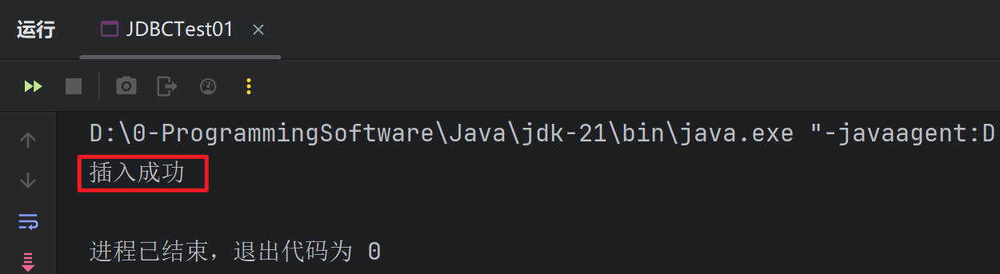
数据库表变化了：
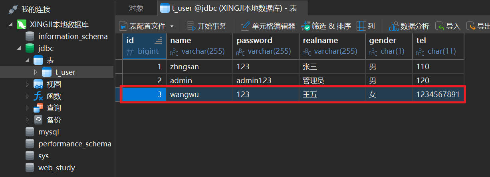

### JDBC编程第六步：释放资源

第五步去哪里了？第五步是处理查询结果集，以上操作不是select语句，所以第五步直接跳过，直接先看一下第六步释放资源。【后面学习查询语句的时候，再详细看第五步】

#### 为什么要释放资源

在 JDBC 编程中，建立数据库连接、创建 Statement 对象等操作都需要申请系统资源，例如打开网络端口、申请内存等。为了避免占用过多的系统资源和避免出现内存泄漏等问题，我们需要在使用完资源后及时释放它们。

#### 释放资源的原则

原则1：在finally语句块中释放

- 建议在finally语句块中释放，因为程序执行过程中如果出现了异常，finally语句块中的代码是一定会执行的。也就是说：我们需要保证程序在执行过程中，不管是否出现了异常，最后的关闭是一定要执行的。当然了，也可以使用Java7的新特性：Try-with-resources。Try-with-resources 是 Java 7 引入的新特性。它简化了资源管理的代码实现，可以自动释放资源，减少了代码出错的可能性，同时也可以提供更好的代码可读性和可维护性。

原则2：释放有顺序

- 从小到大依次释放，创建的时候，先创建Connection，再创建Statement。那么关闭的时候，先关闭Statement，再关闭Connection。

原则3：分别进行try...catch...

- 关闭的时候调用close()方法，该方法有异常需要处理，建议分别对齐try...catch...进行异常捕获。如果只编写一个try...catch...进行一块捕获，在关闭过程中，如果某个关闭失败，会影响下一个资源的关闭。

#### 代码如何实现

```java title="java"
/*
   使用JDBC程序向jdbc.t_user表中插入一条数据
 */
import java.sql.Driver;
import java.sql.DriverManager;
import java.sql.SQLException;
import java.sql.Connection;
import java.sql.Statement;

public class JDBCTest01 {
    public static void main(String[] args) {
        Connection conn = null;
        Statement stmt = null;

        try{
            //1.注册驱动
            //com.mysql.cj.jdbc.Driver 是MySQL的驱动最核心的类
            //这个类实现了 java.sql.Driver 接口
            Driver driver = new com.mysql.cj.jdbc.Driver(); //创建核心驱动对象
            DriverManager.registerDriver(driver); //注册驱动

            //DriverManager.registerDriver(new com.mysql.cj.jdbc.Driver());

            //2.获取连接
            String url = "jdbc:mysql://localhost:3306/jdbc";
            String user = "root";
            String password = "1225";
            conn = DriverManager.getConnection(url,user,password);

            // 连接对象：com.mysql.cj.jdbc.ConnectionImpl@3b0090a4
            // com.mysql.cj.jdbc.ConnectionImpl , 这是什么？
            // MySQL数据库厂家对 java.sql.Connection 接口的实现。
            // java.sql.Connection 是SUN制定的接口
            // com.mysql.cj.jdbc.ConnectionImpl是该接口的实现类

            // 注意：其实我们不需要关心具体的实现类是谁，我们只需要面向JDBC接口编写代码即可。
            // System.out.println("连接对象：" + conn);

            //3.获取数据库操作对象
            stmt = conn.createStatement();
            //System.out.println("数据库操作对象stmt = " + stmt); //数据库操作对象stmt = com.mysql.cj.jdbc.StatementImpl@1c1bbc4e

            //Statement stmt2 = conn.createStatement();
            //System.out.println("数据库操作对象stmt2 = " + stmt2); //数据库操作对象stmt2 = com.mysql.cj.jdbc.StatementImpl@55fe41ea

            //4.执行SQL语句
            // 注意这个SQL语句最后的分号可以省略。
            String sql = "insert into t_user(name,password,realname,gender,tel) values('wangwu','123','王五','女','12345678911')";
            // 返回值的含义：当sql语句是一个DQL语句的时候，并且查询到了结果，返回true。
            // 当sql语句是dml语句或者没有查询到任何结果的时候，返回false。
            // 这个方法功能比较广泛（不够专业），适合所有的SQL语句，很少用。
            //boolean isSuccess = stmt.execute(sql);
            //System.out.println(isSuccess ? "插入失败" : "插入成功");

            // 凡是执行dml语句(insert delete udpate)，建议直接使用 executeUpdate 方法。
            int count = stmt.executeUpdate(sql);
            System.out.println(count == 1 ? "插入成功" : "插入失败");

        }catch(SQLException e){
            e.printStackTrace();
        }finally {
            //6.释放资源
            // 原则：从小到大按照这个顺序关闭
            // 关闭前最好判断一下是否为空、
            if(stmt != null){
                try{
                    stmt.close();
                }catch(SQLException e){
                    e.printStackTrace();
                }
            }
            if(conn != null) {
                try {
                    conn.close();
                } catch (SQLException e) {
                    e.printStackTrace();
                }
            }
        }
    }
}
```

## JDBC完成修改操作

修改操作就是执行update语句。仍然调用Statement接口的executeUpdate(sql)方法即可。
业务要求：将name是wangwu的所有信息进行修改。
修改前的数据：
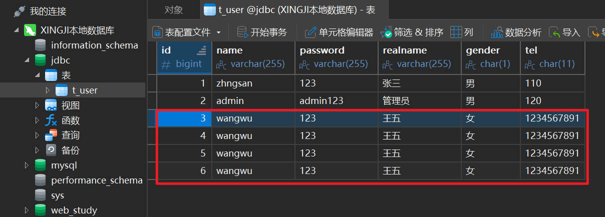

代码如下：
```java title="java"
/*
	修改所有的wangwu
*/
import java.sql.Connection;
import java.sql.Driver;
import java.sql.DriverManager;
import java.sql.SQLException;
import java.sql.Statement;

public class JDBCTest02 {
    public static void main(String[] args) {
        Connection conn = null;
        Statement stmt = null;
        try {
            // 1.注册驱动
            Driver driver = new com.mysql.cj.jdbc.Driver();
            DriverManager.registerDriver(driver);

            // 2.获取连接
            conn =  DriverManager.getConnection("jdbc:mysql://localhost:3306/jdbc", "root", "1225");

            // 3.获取数据库操作对象
            stmt = conn.createStatement();

            // 4.执行SQL
            String sql = "update t_user set name='wuwang', password='11111', realname='王武', gender='男', tel='11222222222' where name='wangwu'";
            int count = stmt.executeUpdate(sql);
            System.out.println("修改了" + count + "条记录");

        }catch (SQLException e){
            e.printStackTrace();
        }finally {
            // 6.释放资源
            if(stmt!=null){
                try {
                    stmt.close();
                } catch (SQLException e) {
                    e.printStackTrace();
                }
            }
            if(conn!=null){
                try {
                    conn.close();
                }catch (SQLException e){
                    e.printStackTrace();
                }
            }
        }
    }
}
```

执行结果：
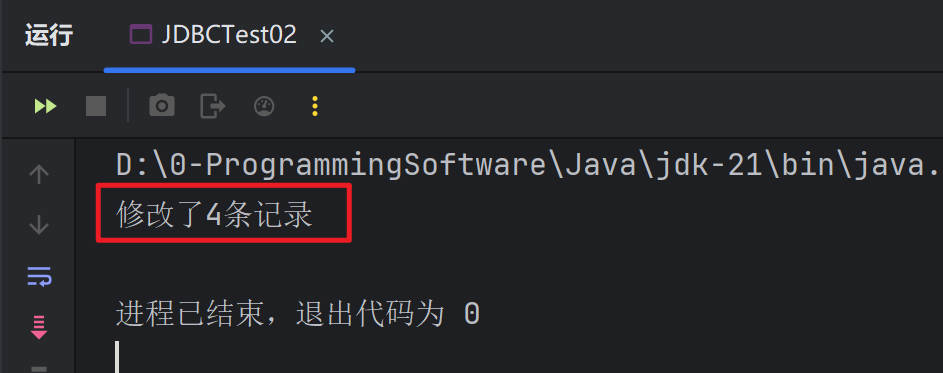

更新后的数据：
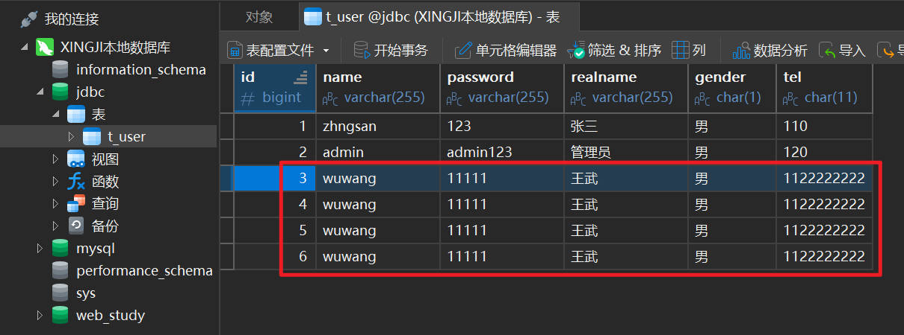

## JDBC完成删除操作

删除操作就是执行delete语句。仍然调用Statement接口的executeUpdate(sql)方法即可。
业务要求：将name是wuwang的数据删除。
删除前的数据：


代码如下：
```java title="java"
/*
	删除所有的wangwu
*/
import java.sql.Connection;
import java.sql.Driver;
import java.sql.DriverManager;
import java.sql.SQLException;
import java.sql.Statement;

public class JDBCTest03 {
    public static void main(String[] args) {
        Connection conn = null;
        Statement stmt = null;
        try {
            // 1.注册驱动
            Driver driver = new com.mysql.cj.jdbc.Driver();
            DriverManager.registerDriver(driver);

            // 2.获取连接
            conn =  DriverManager.getConnection("jdbc:mysql://localhost:3306/jdbc", "root", "1225");

            // 3.获取数据库操作对象
            stmt = conn.createStatement();

            // 4.执行SQL
            String sql = "delete from t_users where name='wuwang'";
            int count = stmt.executeUpdate(sql);
            System.out.println("删除了" + count + "条记录");

        }catch (SQLException e){
            e.printStackTrace();
        }finally {
            // 6.释放资源
            if(stmt!=null){
                try {
                    stmt.close();
                } catch (SQLException e) {
                    e.printStackTrace();
                }
            }
            if(conn!=null){
                try {
                    conn.close();
                }catch (SQLException e){
                    e.printStackTrace();
                }
            }
        }
    }
}
```
执行结果如下：
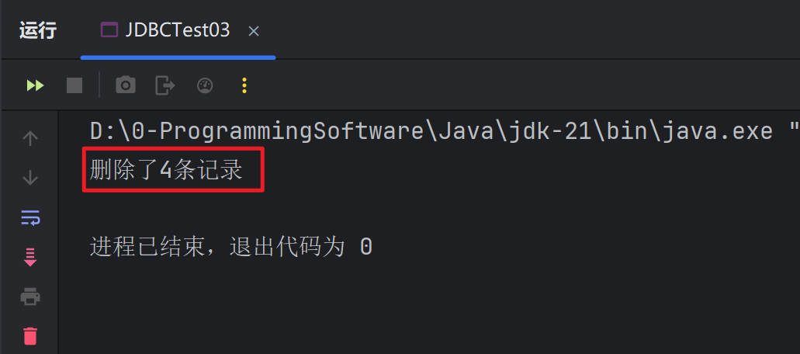

删除后的数据：
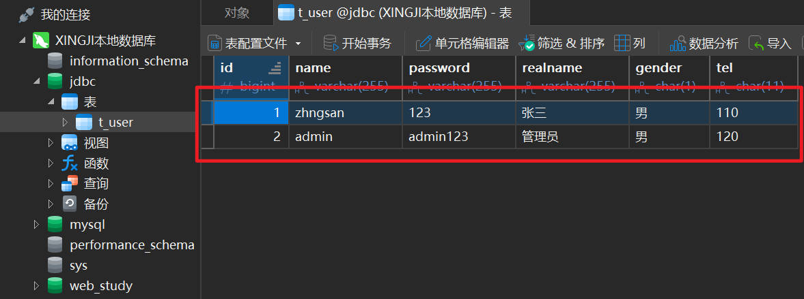

## 注册驱动的常用方式

上面在注册驱动的时候，执行了这样的代码：
```java title="java"
java.sql.Driver driver = new com.mysql.cj.jdbc.Driver();
java.sql.DriverManager.registerDriver(driver);
```

这种方式是自己new驱动对象，然后调用DriverManager的registerDriver()方法来完成驱动注册，还有另一种方式，并且这种方式是常用的：
```java title="java"
Class.forName("com.mysql.cj.jdbc.Driver");
```

为什么这种方式常用？

- 第一：代码少了很多。
- 第二：这种方式可以很方便的将`com.mysql.cj.jdbc.Driver`类名配置到属性文件当中。

实现原理是什么？找一下`com.mysql.cj.jdbc.Driver`的源码：
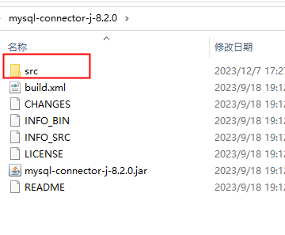


通过源码不难发现，在`com.mysql.cj.jdbc.Driver`类中有一个`静态代码块`，在这个静态代码块中调用了`java.sql.DriverManager.registerDriver(new Driver());`完成了`驱动的注册`。而`Class.forName("com.mysql.cj.jdbc.Driver");`代码的作用就是让`com.mysql.cj.jdbc.Driver`类完成加载，执行它的`静态代码块`。

编写代码测试一下：
```java title="java"
/*
   注册驱动的第二种方式：常用的
 */
import java.sql.*;

public class JDBCTest04 {
    public static void main(String[] args) throws SQLException, ClassNotFoundException {
        // 注册驱动
        // 第一种方式
        //Driver driver = new com.mysql.cj.jdbc.Driver();
        //DriverManager.registerDriver(driver);

        //第二种方式
        // 本质上和第一种方式还是相同的
        // 因为以下代码在执行的时候，会将com.mysql.cj.jdbc.Driver进行类加载
        // 类加载的时候会执行 com.mysql.cj.jdbc.Driver 类中的静态代码块
        // Class.forName("com.mysql.cj.jdbc.Driver");

        //获取连接
        String url = "jdbc:mysql://localhost:3306/jdbc?useUnicode=true&serverTimezone=Asia/Shanghai&useSSL=true&characterEncoding=utf-8";
        String username = "root";
        String password = "1225";
        Connection conn = DriverManager.getConnection(url,username,password);
        System.out.println(conn);
    }
}

// 这个com.mysql.cj.jdbc.Driver类中的静态代码块如下：
/*
    static {
        try {
            java.sql.DriverManager.registerDriver(new Driver());
        } catch (SQLException E) {
            throw new RuntimeException("Can't register driver!");
        }
    }
*/
```

## JDBC 4.0后不用手动注册驱动（了解）

从JDBC 4.0（**也就是Java6**）版本开始，驱动的注册不需要再手动完成，由系统自动完成。
```java title="java"
import java.sql.DriverManager;
import java.sql.SQLException;
import java.sql.Connection;
import java.sql.Statement;

public class JDBCTest03 {
    public static void main(String[] args){
        Connection conn = null;
        Statement stmt = null;
        try {
            // 2. 获取连接
            String url = "jdbc:mysql://localhost:3306/jdbc?useUnicode=true&serverTimezone=Asia/Shanghai&useSSL=true&characterEncoding=utf-8";
            String user = "root";
            String password = "123456";
            conn = DriverManager.getConnection(url, user, password);

            // 3. 获取数据库操作对象
            stmt = conn.createStatement();

            // 4. 执行SQL语句
            String sql = "insert into t_user(name,password,realname,gender,tel) values('tangsanzang','123','唐三藏','男','12566568956')"; // sql语句最后的分号';'可以不写。
            int count = stmt.executeUpdate(sql);
            System.out.println("插入了" + count + "条记录");
            
        } catch(SQLException e){
            e.printStackTrace();
        } finally {
            // 6. 释放资源
            if(stmt != null){
                try{
                    stmt.close();
                }catch(SQLException e){
                    e.printStackTrace();
                }
            }
            if(conn != null){
                try{
                    conn.close();
                }catch(SQLException e){
                    e.printStackTrace();
                }
            }
        }
    }
}
```


**注意：虽然大部分情况下不需要进行手动注册驱动了，但在实际的开发中有些数据库驱动程序不支持自动发现功能，仍然需要手动注册。所以建议大家还是别省略了。**

## 使用IDEA工具编写JDBC程序

### 创建空的工程并设置JDK

创建一个空的工程：jdbc
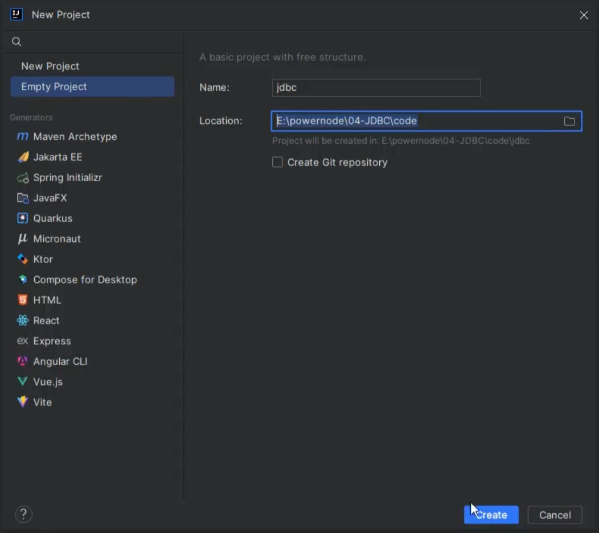

工程结构：
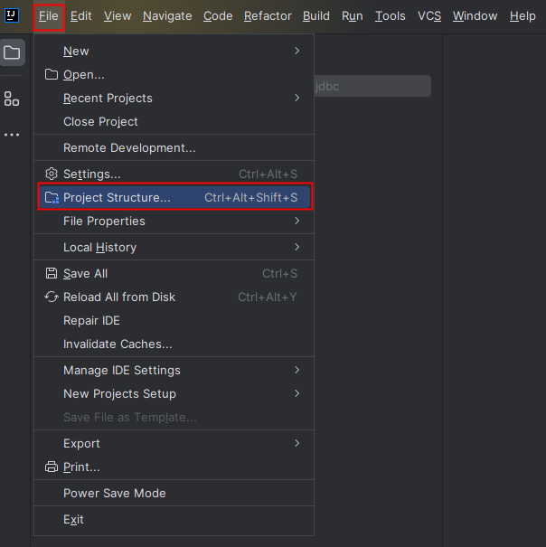

设置JDK以及编译器版本：
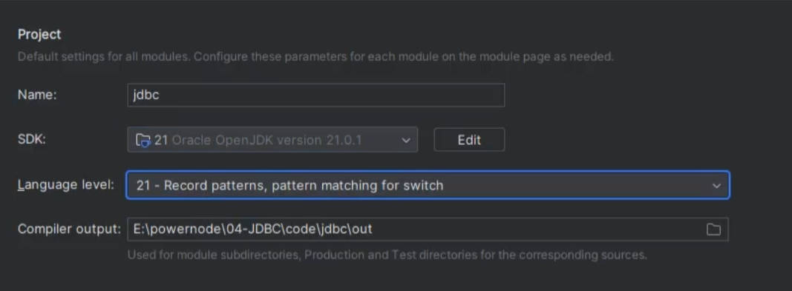

### 创建一个模块

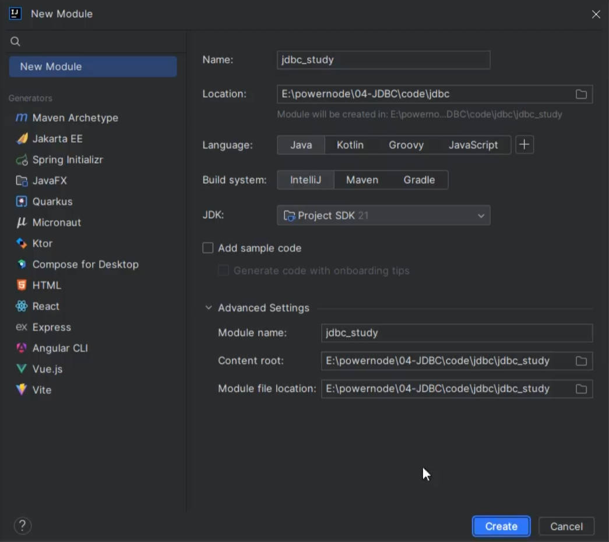

### 将驱动加入到CLASSPATH

在模块jdbc下创建一个目录：lib
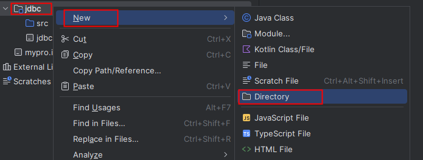


将mysql的驱动jar包拷贝到lib目录当中：
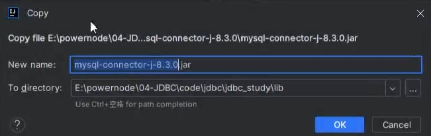


将jar包加入到classpath：
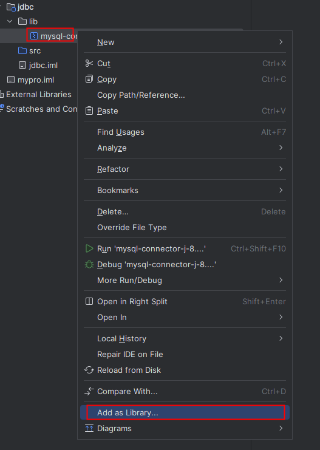


### 编写JDBC程序

新建软件包：com.powernode.jdbc


新建JDBCTest01类：
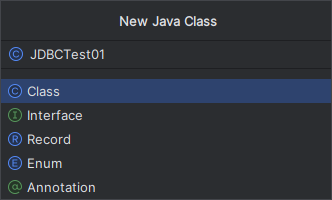

在JDBCTest01类中编写main方法，main方法中编写JDBC代码：
```java title="java"
package com.powernode.jdbc;

import java.sql.Connection;
import java.sql.DriverManager;
import java.sql.SQLException;

public class JDBCTest01 {
    public static void main(String[] args) {
        Connection conn = null;
        try {
            // 1.注册驱动
            Class.forName("com.mysql.cj.jdbc.Driver");

            // 2.获取连接
            String url = "jdbc:mysql://localhost:3306/jdbc?useUnicode=true&serverTimezone=Asia/Shanghai&useSSL=true&characterEncoding=utf-8";
            String username = "root";
            String password = "1225";

            conn = DriverManager.getConnection(url, username, password);
            System.out.println(conn);

        }catch(SQLException e){
            throw new RuntimeException(e);
        }catch(ClassNotFoundException e){
            throw new RuntimeException(e);
        }finally {
            if (conn != null) {
                try {
                    conn.close();
                } catch (SQLException e) {
                    throw new RuntimeException(e);
                }
            }
        }
    }
}
```

## 动态配置连接数据库的信息

为了程序的通用性，为了切换数据库的时候不需要修改Java程序，为了符合OCP开闭原则，建议将连接数据库的信息配置到属性文件jdbc.properties中，例如：
```properties title="properties"
driver=com.mysql.cj.jdbc.Driver
url=jdbc:mysql://localhost:3306/jdbc?useUnicode=true&serverTimezone=Asia/Shanghai&useSSL=true&characterEncoding=utf-8
user=root
password=1225
```

然后使用IO流读取属性文件，动态获取连接数据库的信息：
```java title="java"
package com.powernode.jdbc;

import java.sql.Connection;
import java.sql.DriverManager;
import java.sql.SQLException;
import java.util.ResourceBundle;

public class JDBCTest01 {
    public static void main(String[] args) {

        //读取属性文件，获取连接数据库的信息
        ResourceBundle bundle = ResourceBundle.getBundle("com.powernode.jdbc.jdbc");
        String driver = bundle.getString("driver");
        String url = bundle.getString("url");
        String user = bundle.getString("user");
        String password = bundle.getString("password");

        Connection conn = null;
        try {
            // 1.注册驱动
            Class.forName(driver);

            // 2.获取连接
            conn = DriverManager.getConnection(url, user, password);
            System.out.println(conn);

        }catch(SQLException e){
            throw new RuntimeException(e);
        }catch(ClassNotFoundException e){
            throw new RuntimeException(e);
        }finally {
            if (conn != null) {
                try {
                    conn.close();
                } catch (SQLException e) {
                    throw new RuntimeException(e);
                }
            }
        }
    }
}
```

## 获取连接的其他方式（了解）

上面我们讲到了第一种获取连接的方式：
```java title="java"
Connection conn = DriverManager.getConnection(url, user, password);
```

除了以上的这种方式之外，还有两种方式，通过API帮助文档可以看到：
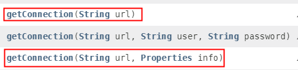

## getConnection(String url)

这种方式参数只有一个url，那用户名和密码放在哪里呢？可以放到url当中，代码如下：
```java title="java"
package com.powernode.jdbc;

import java.sql.Connection;
import java.sql.DriverManager;

public class JDBCTest02 {
    public static void main(String[] args) throws Exception {
        // getConnection的重载方法
        // getConnection(url)
        Class.forName("com.mysql.cj.jdbc.Driver");
        String url = "jdbc:mysql://localhost:3306/jdbc?user=root&password=1225&useUnicode=true&serverTimezone=Asia/Shanghai&useSSL=true&characterEncoding=utf-8";
        
        Connection conn = DriverManager.getConnection(url);
        
        System.out.println("连接对象：" + conn);

        // getConnection(url, info)
    }
}
```

执行结果：
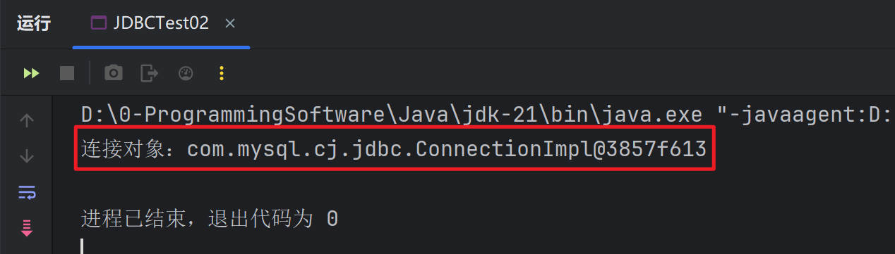

## getConnection(String url, Properties info)

这种方式有两个参数，一个是url，一个是Properties对象。

- url：可以`单纯提供一个url地址`
- info：可以将`url的参数`存放到该`对象`中

代码如下：
```java title="java"
package com.powernode.jdbc;

import java.sql.Connection;
import java.sql.DriverManager;
import java.util.Properties;

public class JDBCTest02 {
    public static void main(String[] args) throws Exception {
        // getConnection的重载方法
        // getConnection(url)
        /*Class.forName("com.mysql.cj.jdbc.Driver");
        String url = "jdbc:mysql://localhost:3306/jdbc?user=root&password=1225&useUnicode=true&serverTimezone=Asia/Shanghai&useSSL=true&characterEncoding=utf-8";
        Connection conn = DriverManager.getConnection(url);
        System.out.println("连接对象：" + conn);*/

        // getConnection(url, info)
        Class.forName("com.mysql.cj.jdbc.Driver");
        // url
        String url = "jdbc:mysql://localhost:3306/jdbc";
        // info
        Properties info = new Properties();
        info.put("user","root");
        info.put("password","1225");
        info.put("useUnicode","true");
        info.put("serverTimezone","Asia/Shanghai");
        info.put("useSSL","true");
        info.put("characterEncoding","utf-8");

        Connection conn = DriverManager.getConnection(url,info);

        System.out.println("连接对象：" + conn);
    }
}
```

执行结果：
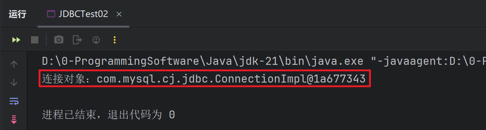

以上这两种方式作为了解，不是重点。