## JDBC的查询操作

`ResultSet` 是 `JDBC （Java 数据库连接） API 提供的接口`，它用于表示 SQL 查询的结果集。ResultSet 对象中包含了查询结果的所有行，可以通过 `next() 方法`逐行地获取并处理每一行的数据。它最常用于执行 `SELECT 语句查询出来`的`结果集`。

ResultSet 的遍历是基于 JDBC 的流式处理机制的，即`一行一行地获取结果`，**避免将所有结果全部取出后再进行处理导致`内存溢出`问题**。

在使用 ResultSet 遍历查询结果时，一般会采用以下步骤：

1. 执行 SQL 查询，获取 `ResultSet` 对象。
2. 使用 `ResultSet 的 next() 方法`移动游标指向结果集的下一行，判断是否有更多的数据行。
3. 如果有更多的数据行，则使用 ResultSet 对象提供的 getXXX() 方法获取当前行的各个字段（XXX 表示不同的数据类型）。例如，getLong("id") 方法用于获取当前行的 id 列对应的 Long 类型的值。
4. 处理当前行的数据，例如将其存入 Java 对象中。
5. 重复执行步骤 2~4，直到结果集中的所有行都被遍历完毕。
6. 调用 `ResultSet 的 close() 方法`释放资源。

需要注意的是，在使用完 ResultSet 对象之后，需要及时关闭它，以释放数据库资源并避免潜在的内存泄漏问题。否则，如果在多个线程中打开了多个 ResultSet 对象，并且没有正确关闭它们的话，可能会导致数据库连接过多，从而影响系统的稳定性和性能。

### 通过列索引获取数据（以String类型获取）

需求：获取t_user表中所有数据，在控制台打印输出每一行的数据。
```sql
select realname,id,name,password from t_user;
```
要查询的数据如下图：
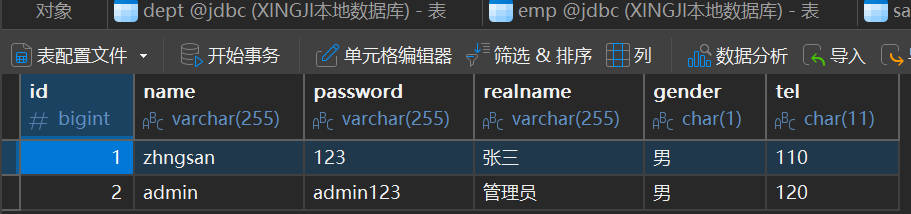
代码如下（重点关注第4步 第5步 第6步)：

```java title="java"
package com.powernode.jdbc;

import java.sql.Connection;
import java.sql.DriverManager;
import java.sql.ResultSet;
import java.sql.SQLException;
import java.sql.Statement;
import java.util.ResourceBundle;

/*
   第一次使用JDBC完成查询操作
 */
public class JDBCTest03 {
    public static void main(String[] args) throws Exception {

        //读取属性文件，获取连接数据库的信息
        ResourceBundle bundle = ResourceBundle.getBundle("com.powernode.jdbc.jdbc");
        String driver = bundle.getString("driver");
        String url = bundle.getString("url");
        String user = bundle.getString("user");
        String password = bundle.getString("password");

        Connection conn = null;
        Statement stmt = null;
        ResultSet rs = null;
        /*结果集*/
        try {
            // 1.注册驱动
            Class.forName(driver);

            // 2.获取连接
            conn = DriverManager.getConnection(url, user, password);
            System.out.println(conn);

            // 3.获取数据库操作对象
            stmt = conn.createStatement();

            // 4.执行SQL
            String sql = "select realname,id,name,password from t_user";
            rs = stmt.executeQuery(sql);

            // 5.处理查询结果
            // 这里的处理方式就是直接打印输出
            /*
            +----------+----+---------+----------+
            | realname | id | name    | password |
            +----------+----+---------+----------+
            | 张三     |  1 | zhngsan | 123      |
            | 管理员   |  2 | admin   | admin123 |
            +----------+----+---------+----------+
            */
            /*boolean hasNext = rs.next();
            if (hasNext) {
                // 取出光标指向的当前行的数据
                // 不管数据库表中是什么数据类型，统一以字符串的形式取出
                String realname = rs.getString(1);
                String id = rs.getString(2);
                String name = rs.getString(3);
                String pwd = rs.getString(4);

                System.out.println(realname + "\t" + id + "\t" + name + "\t" + pwd);
            }

            hasNext = rs.next();
            if (hasNext) {
                String realname = rs.getString(1);
                String id = rs.getString(2);
                String name = rs.getString(3);
                String pwd = rs.getString(4);

                System.out.println(realname + "\t" + id + "\t" + name + "\t" + pwd);
            }

            hasNext = rs.next();
            System.out.println(hasNext);*/
            while (rs.next()) {
                // 取出光标指向的当前行的数据
                // 不管数据库表中是什么数据类型，统一以字符串的形式取出
                String realname = rs.getString(1);
                String id = rs.getString(2);
                String name = rs.getString(3);
                String pwd = rs.getString(4);

                System.out.println(realname + "\t" + id + "\t" + name + "\t" + pwd);
            }

            // 查询所有员工信息
            String sql2 = "select empno,ename,sal from emp";
            /*
            +-------+--------+---------+
            | empno | ename  | sal     |
            +-------+--------+---------+
            |  7369 | SMITH  |  800.00 |
            |  7499 | ALLEN  | 1600.00 |
            |  7521 | WARD   | 1250.00 |
            |  7566 | JONES  | 2975.00 |
            |  7654 | MARTIN | 1250.00 |
            |  7698 | BLAKE  | 2850.00 |
            |  7782 | CLARK  | 2450.00 |
            |  7788 | SCOTT  | 3000.00 |
            |  7839 | KING   | 5000.00 |
            |  7844 | TURNER | 1500.00 |
            |  7876 | ADAMS  | 1100.00 |
            |  7900 | JAMES  |  950.00 |
            |  7902 | FORD   | 3000.00 |
            |  7934 | MILLER | 1300.00 |
            +-------+--------+---------+
             */
            rs = stmt.executeQuery(sql2);
            while (rs.next()) {
                // 以指定的类型获取数据
                int empno = rs.getInt(1);
                String ename = rs.getString(2);
                double sal = rs.getDouble(3);
                System.out.println(empno + "," + ename + "," + sal * 10);
            }
            
        }catch(Exception e){
            e.printStackTrace();
        } finally {
            // 6.释放资源
            if (rs != null) {
                try {
                    rs.close();
                }catch (SQLException e){
                    e.printStackTrace();
                }
            }
            if (stmt != null) {
                try {
                    stmt.close();
                }catch (SQLException e){
                    e.printStackTrace();
                }
            }
            if (conn != null) {
                try {
                    conn.close();
                } catch (SQLException e) {
                    e.printStackTrace();
                }
            }

        }
    }
}
```

执行结果如下：
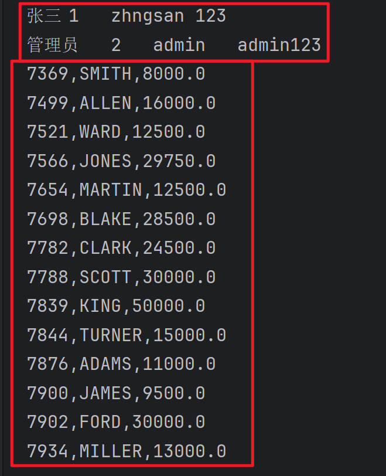

代码解读：
```java title="java"
// 4.执行SQL
String sql = "select realname,id,name,password from t_user";
rs = stmt.executeQuery(sql);
```
执行`insert delete update`语句的时候，调用`Statement接口`的`executeUpdate()方法`。
执行`select语句`的时候，**调用`Statement接口的executeQuery()`方法**。执行select语句后返回结果集对象：ResultSet。

代码解读：
```java title="java"
// 5. 处理查询结果集（这里的处理方式就是：遍历所有数据并输出）
while (rs.next()) {
    // 取出光标指向的当前行的数据
    // 不管数据库表中是什么数据类型，统一以字符串的形式取出
    String realname = rs.getString(1);
    String id = rs.getString(2);
    String name = rs.getString(3);
    String pwd = rs.getString(4);

    System.out.println(realname + "\t" + id + "\t" + name + "\t" + pwd);
}
```

- **rs.next() 将游标移动到下一行，如果移动后指向的这一行有数据则返回true，没有数据则返回false。**
- **while循环体当中的代码是处理`当前游标指向的这一行的数据`。（注意：是处理的`一行数据`）**
- **`rs.getString(int columnIndex) `其中 `int columnIndex` 是查询结果的`列下标`，`列下标从1开始，以1递增`。**

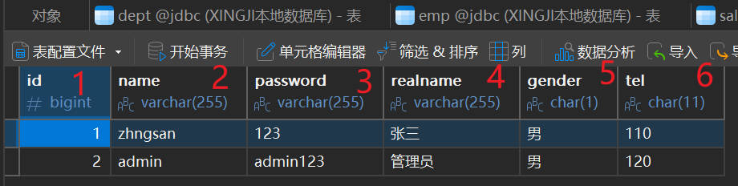

- **rs.getString(...) 方法在执行时，不管底层数据库中的数据类型是什么，统一以字符串String类型来获取。**

代码解读：
```java title="java"
// 6. 释放资源
if(rs != null){
    try{
        rs.close();
    }catch(SQLException e){
        e.printStackTrace();
    }
}
if(stmt != null){
    try{
        stmt.close();
    }catch(SQLException e){
        e.printStackTrace();
    }
}
if(conn != null){
    try{
        conn.close();
    }catch(SQLException e){
        e.printStackTrace();
    }
}
```
ResultSet最终也是需要关闭的。**先`关闭ResultSet`，再`关闭Statement`，最后`关闭Connection`**。

### 通过列名获取数据（以String类型获取）

获取当前行的数据，不仅可以通过列下标获取，还可以通过查询结果的列名来获取，通常这种方式是被推荐的，因为`可读性好`。
例如这样的SQL：

```sql
select empno a,ename b,sal c from emp;
```
执行结果是：

我们可以按照查询结果的列名来获取数据：
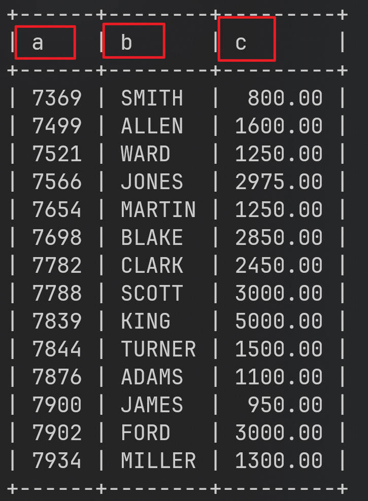
**注意：是根据`查询结果的列名`，而`不是表中的列名`。以上查询的时候将字段empno 起别名为a, ename起别名为b,sal起别名为c，所以要根据a,b,c来获取，而不能再根据empno,ename,sal来获取了。**

```java title="java"
package com.powernode.jdbc;

import java.sql.Connection;
import java.sql.DriverManager;
import java.sql.ResultSet;
import java.sql.SQLException;
import java.sql.Statement;
import java.util.ResourceBundle;

/*
   第一次使用JDBC完成查询操作
 */
public class JDBCTest03 {
    public static void main(String[] args) throws Exception {

        //读取属性文件，获取连接数据库的信息
        ResourceBundle bundle = ResourceBundle.getBundle("com.powernode.jdbc.jdbc");
        String driver = bundle.getString("driver");
        String url = bundle.getString("url");
        String user = bundle.getString("user");
        String password = bundle.getString("password");

        Connection conn = null;
        Statement stmt = null;
        ResultSet rs = null;
        /*结果集*/
        try {
            // 1.注册驱动
            Class.forName(driver);

            // 2.获取连接
            conn = DriverManager.getConnection(url, user, password);
            System.out.println(conn);

            // 3.获取数据库操作对象
            stmt = conn.createStatement();

            // 4.执行SQL
            String sql = "select realname,id,name,password from t_user";
            rs = stmt.executeQuery(sql);

            // 5.处理查询结果
            // 这里的处理方式就是直接打印输出
            String sql3 = "select empno a,ename b,sal c from emp";
            /*
            +------+--------+---------+
            | a    | b      | c       |
            +------+--------+---------+
            | 7369 | SMITH  |  800.00 |
            | 7499 | ALLEN  | 1600.00 |
            | 7521 | WARD   | 1250.00 |
            | 7566 | JONES  | 2975.00 |
            | 7654 | MARTIN | 1250.00 |
            | 7698 | BLAKE  | 2850.00 |
            | 7782 | CLARK  | 2450.00 |
            | 7788 | SCOTT  | 3000.00 |
            | 7839 | KING   | 5000.00 |
            | 7844 | TURNER | 1500.00 |
            | 7876 | ADAMS  | 1100.00 |
            | 7900 | JAMES  |  950.00 |
            | 7902 | FORD   | 3000.00 |
            | 7934 | MILLER | 1300.00 |
            +------+--------+---------+
            */
            rs = stmt.executeQuery(sql3);
            while (rs.next()) {
                int empno = rs.getInt("a");
                // 报错，原因：这是因为查询结果中没有empno这个列，只有a这个列
                // int empno = rs.getInt("empno");
                String ename = rs.getString("b");
                double sal = rs.getDouble("c");
                System.out.println(empno + "," + ename + "," + sal);
            }

        }catch(Exception e){
            e.printStackTrace();
        } finally {
            // 6.释放资源
            if (rs != null) {
                try {
                    rs.close();
                }catch (SQLException e){
                    e.printStackTrace();
                }
            }
            if (stmt != null) {
                try {
                    stmt.close();
                }catch (SQLException e){
                    e.printStackTrace();
                }
            }
            if (conn != null) {
                try {
                    conn.close();
                } catch (SQLException e) {
                    e.printStackTrace();
                }
            }

        }
    }
}
```

执行结果如下：
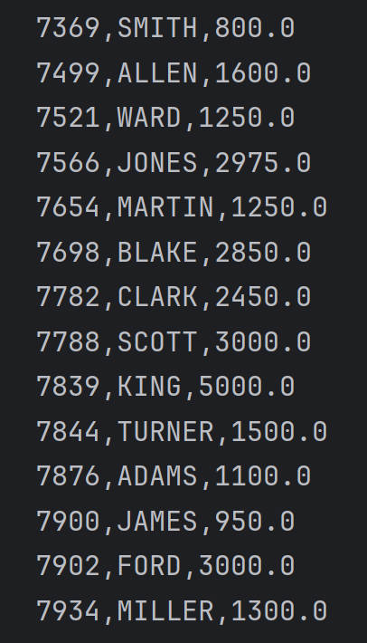

如果将上面代码中`rs.getString("a")`修改为`rs.getString("empno")`，执行就会出现以下错误：
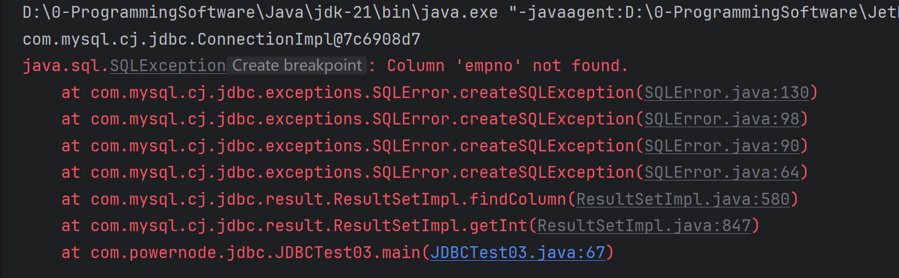
提示empno列是不存在的。所以一定是根据`查询结果中的列名来获取`，而`不是表中原始的列名`。

### 以指定的类型获取数据

前面的程序可以看到，不管数据库表中是什么数据类型，都以String类型返回。当然，也能以指定类型返回。
使用PowerDesigner再设计一张商品表：t_product，使用Navicat for MySQL工具准备数据如下：

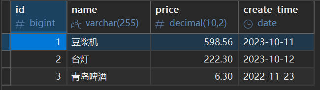

`id`以`long类型获取`，`name`以`String类型获取`，`price`以`double类型获取`，`create_time`以`java.sql.Date类型获取`，代码如下：

```java title="java"
package com.powernode.jdbc;

import java.sql.DriverManager;
import java.sql.SQLException;
import java.sql.Connection;
import java.sql.Statement;
import java.util.ResourceBundle;
import java.sql.ResultSet;

public class JDBCTest04 {
    public static void main(String[] args){

        // 通过以下代码获取属性文件中的配置信息
        ResourceBundle bundle = ResourceBundle.getBundle("com.powernode.jdbc.jdbc");
        String driver = bundle.getString("driver");
        String url = bundle.getString("url");
        String user = bundle.getString("user");
        String password = bundle.getString("password");

        Connection conn = null;
        Statement stmt = null;
        ResultSet rs = null;
        try {
            // 1. 注册驱动
            Class.forName(driver);

            // 2. 获取连接
            conn = DriverManager.getConnection(url, user, password);

            // 3. 获取数据库操作对象
            stmt = conn.createStatement();

            // 4. 执行SQL语句
            String sql = "select id,name,price,create_time as createTime from t_product";
            rs = stmt.executeQuery(sql);

            // 5. 处理查询结果集（这里的处理方式就是：遍历所有数据并输出）
            while(rs.next()){
                long id = rs.getLong("id");
                String name = rs.getString("name");
                double price = rs.getDouble("price");
                // 注意：从mysql数据库当中获取的日期类型的数据对应的java类型是：java.sql.Date。不是java.util.Date。
                java.sql.Date createTime = rs.getDate("createTime");
                // 以指定类型获取后是可以直接用的，例如获取到价格后，统一让价格乘以2
                System.out.println(id + "\t" + name + "\t" + price * 2 + "\t" + createTime);
            }

        } catch(SQLException | ClassNotFoundException e){
            e.printStackTrace();
        } finally {
            // 6. 释放资源
            if(rs != null){
                try{
                    rs.close();
                }catch(SQLException e){
                    e.printStackTrace();
                }
            }
            if(stmt != null){
                try{
                    stmt.close();
                }catch(SQLException e){
                    e.printStackTrace();
                }
            }
            if(conn != null){
                try{
                    conn.close();
                }catch(SQLException e){
                    e.printStackTrace();
                }
            }
        }
    }
}
```

执行结果如下：
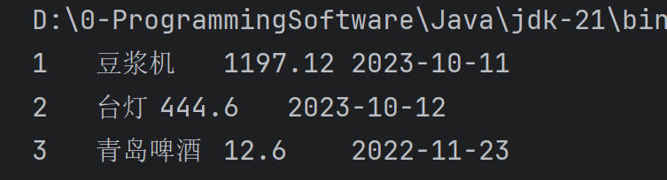

### 获取结果集的元数据信息（了解）

`ResultSetMetaData` 是一个接口，用于描述` ResultSet 中的元数据信息`，即`查询结果集的结构信息`，例如查询结果集中包含了`哪些列，每个列的数据类型、长度、标识符`等。

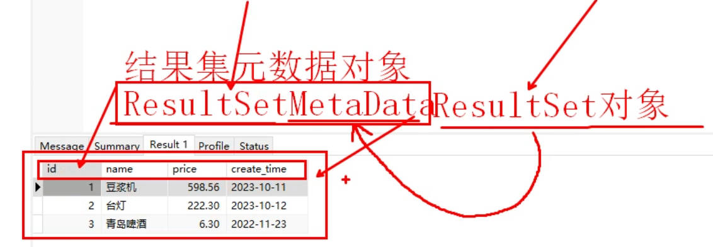

`ResultSetMetaData` 可以通过 `ResultSet` 接口的 `getMetaData() `方法获取，一般在对 ResultSet 进行元数据信息处理时使用。例如，可以使用 ResultSetMetaData 对象获取查询结果中列的信息，如`列名、列的类型、列的长度`等。通过 `ResultSetMetaData接口`的方法，可以实现对查询结果的基本描述信息操作，例如获取查询结果集中有多少列、列的类型、列的标识符等。以下是一段通过 ResultSetMetaData 获取查询结果中列的信息的示例代码：

```java title="java"
package com.powernode.jdbc;

import java.sql.DriverManager;
import java.sql.SQLException;
import java.sql.Connection;
import java.sql.Statement;
import java.util.ResourceBundle;
import java.sql.ResultSet;
import java.sql.ResultSetMetaData;
/**
 * 获取结果元数据信息
 */
public class JDBCTest05 {
    public static void main(String[] args){
        // 通过以下代码获取属性文件中的配置信息
        ResourceBundle bundle = ResourceBundle.getBundle("com.powernode.jdbc.jdbc");
        String driver = bundle.getString("driver");
        String url = bundle.getString("url");
        String user = bundle.getString("user");
        String password = bundle.getString("password");

        Connection conn = null;
        Statement stmt = null;
        ResultSet rs = null;
        try {
            // 1. 注册驱动
            Class.forName(driver);

            // 2. 获取连接
            conn = DriverManager.getConnection(url, user, password);

            // 3. 获取数据库操作对象
            stmt = conn.createStatement();

            // 4. 执行SQL语句
            String sql = "select * from t_product";
            rs = stmt.executeQuery(sql);

            // 5. 处理查询结果集（这里的处理方式就是：遍历所有数据并输出）

            ResultSetMetaData rsmd = rs.getMetaData();
            int columnCount = rsmd.getColumnCount();
            // 遍历每一列
            for (int i = 1; i <= columnCount; i++) {
                System.out.println("列名：" + rsmd.getColumnName(i) + "，数据类型：" + rsmd.getColumnTypeName(i) +
                        "，列的长度：" + rsmd.getColumnDisplaySize(i));
            }

        } catch(SQLException | ClassNotFoundException e){
            e.printStackTrace();
        } finally {
            // 6. 释放资源
            if(rs != null){
                try{
                    rs.close();
                }catch(SQLException e){
                    e.printStackTrace();
                }
            }
            if(stmt != null){
                try{
                    stmt.close();
                }catch(SQLException e){
                    e.printStackTrace();
                }
            }
            if(conn != null){
                try{
                    conn.close();
                }catch(SQLException e){
                    e.printStackTrace();
                }
            }
        }
    }
}
```

执行结果如下：

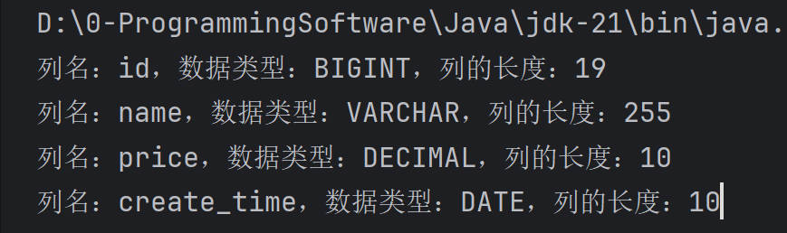

在上面的代码中，我们首先创建了一个 `Statement 对象`，然后执行了一条 SQL 查询语句，生成了一个 `ResultSet 对象`。接下来，我们通过` ResultSet 对象`的 `getMetaData() 方法`获取了 `ResultSetMetaData 对象`，进而获取了查询结果中列的信息并进行输出。需要注意的是，在进行列信息的获取时，列的编号从 1 开始计算。该示例代码将`获取查询结果集中所有列名、数据类型以及长度`等信息。

## 获取新增行的主键值

有很多表的主键字段值都是自增的，在某些特殊的业务环境下，当我们插入了新数据后，希望能够获取到这条新数据的主键值，应该如何获取呢？
在 JDBC 中，如果要获取插入数据后的主键值，可以使用 Statement 接口的 executeUpdate() 方法的重载版本，该方法接受一个额外的参数，用于指定是否需要获取自动生成的主键值。然后，通过以下两个步骤获取插入数据后的主键值：


1.  在执行 `executeUpdate() `方法时指定`一个标志位`，表示需要`返回插入的主键值`。

2.  调用 `Statement `对象的 `getGeneratedKeys() `方法，返回一个包含`插入的主键值`的 `ResultSet 对象`。 


```java title="java"
package com.powernode.jdbc;

import java.sql.DriverManager;
import java.sql.SQLException;
import java.sql.Connection;
import java.sql.Statement;
import java.util.ResourceBundle;
import java.sql.ResultSet;

/**
 * 获取新增行的主键值
 */
public class JDBCTest06 {
    public  static void main(String[] args) {
        // 通过以下代码获取属性文件中的配置信息
        ResourceBundle bundle = ResourceBundle.getBundle("com.powernode.jdbc.jdbc");
        String driver = bundle.getString("driver");
        String url = bundle.getString("url");
        String user = bundle.getString("user");
        String password = bundle.getString("password");

        Connection conn = null;
        Statement stmt = null;
        ResultSet rs = null;
        try {
            // 1. 注册驱动
            Class.forName(driver);

            // 2. 获取连接
            conn = DriverManager.getConnection(url, user, password);

            // 3. 获取数据库操作对象
            stmt = conn.createStatement();

            // 4. 执行SQL语句
            String sql = "insert into t_product(name,price,create_time) values('小米su7',1.0,'2024-02-23')";
            // 注意：第二个参数是标志位，用来表示是否将新插入的数据行的主键值返回
            int count = stmt.executeUpdate(sql, Statement.RETURN_GENERATED_KEYS);
            System.out.println("插入了" + count + "条记录");
            // 获取新增行的主键值
            // 返回的这个rs结果集中就包含了新增行的主键值
            rs = stmt.getGeneratedKeys();
            // 通过结果集取主键值
            if (rs.next()) {
                long id = rs.getLong(1);
                System.out.println("新增行的主键值：" + id);
            }

        } catch(SQLException | ClassNotFoundException e){
            e.printStackTrace();
        } finally {
            // 6. 释放资源
            if(rs != null){
                try{
                    rs.close();
                }catch(SQLException e){
                    e.printStackTrace();
                }
            }
            if(stmt != null){
                try{
                    stmt.close();
                }catch(SQLException e){
                    e.printStackTrace();
                }
            }
            if(conn != null){
                try{
                    conn.close();
                }catch(SQLException e){
                    e.printStackTrace();
                }
            }
        }
    }
}
```

执行结果如下：

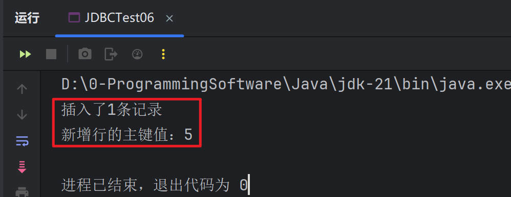


以上代码中，我们将 `Statement.RETURN_GENERATED_KEYS` 传递给 `executeUpdate() `方法，以指定`需要获取插入的主键值`。然后，通过调用 `Statement` 对象的 `getGeneratedKeys() `方法获取包含插入的主键值的` ResultSet 对象`，通过` ResultSet 对象`获取`主键值`。需要注意的是，在使用 `Statement `对象的 `getGeneratedKeys() `方法`获取自动生成的主键值`时，主键值的获取方式具有一定的差异，需要根据不同的数据库种类和版本来进行调整。
