## DbUtils工具类的封装

JDBC编程六步中，很多`代码是重复出现`的，可以为这些代码`封装一个工具类`。让`JDBC代码变的更简洁`。
```java title="java"
package com.powernode.jdbc.utils;

import java.sql.*;
import java.util.ResourceBundle;

/**
 * JDBC工具类
 */
public class DbUtils {
    /**
     * 工具类的构造方法一般都是私有的，因为工具类中一般都是静态的，
     * 工具类就是为了方便编程，所以工具类中的方法都是直接采用“类名.”
     * 的方法访问，因此不需要new对象
     */
    private DbUtils() {}

    // 静态变量
    private static String driver;

    private static String url;

    private static String user;

    private static String password;


    /**
     * 静态代码块
     *
     * 在类加载的时候，注册驱动，对于整个应用程序来说，注册驱动只需要做一次即可。所以选择静态代码块。
     * 静态代码块在类加载时执行，并且只执行一次。
     */
    static{
        // 通过以下代码获取属性文件中的配置信息
        ResourceBundle bundle = ResourceBundle.getBundle("com.powernode.jdbc.jdbc");
        driver = bundle.getString("driver");
        url = bundle.getString("url");
        user = bundle.getString("user");
        password = bundle.getString("password");

        // 注册驱动
        try {
            Class.forName(driver);
        } catch (ClassNotFoundException e) {
            throw new RuntimeException(e);
        }
    }


    /**
     * 获取数据库连接
     * @return 连接对象
     * @throws SQLException
     */
    public static Connection getConnection() throws SQLException {
        // 实际上这里每次调用 getConnection() 方法时都会获取一个全新的数据连接对象，实际这样的效率是比较低的，后期会使用连接池进行改造。
        Connection conn = DriverManager.getConnection(url,user,password);
        return conn;
    }

    /**
     * 释放资源
     * @param conn 连接对象
     * @param stmt 数据库操作对象
     * @param rs 结果集对象
     */
    public static void close(Connection conn, Statement stmt, ResultSet rs){
        if(rs != null){
            try {
                rs.close();
            } catch (SQLException e) {
                throw new RuntimeException(e);
            }
        }
        if (stmt != null) {
            try {
                stmt.close();
            } catch (SQLException e) {
                throw new RuntimeException(e);
            }
        }
        if (conn != null) {
            try {
                conn.close();
            } catch (SQLException e) {
                throw new RuntimeException(e);
            }
        }
    }
}
```

### 封装步骤

#### 代码块

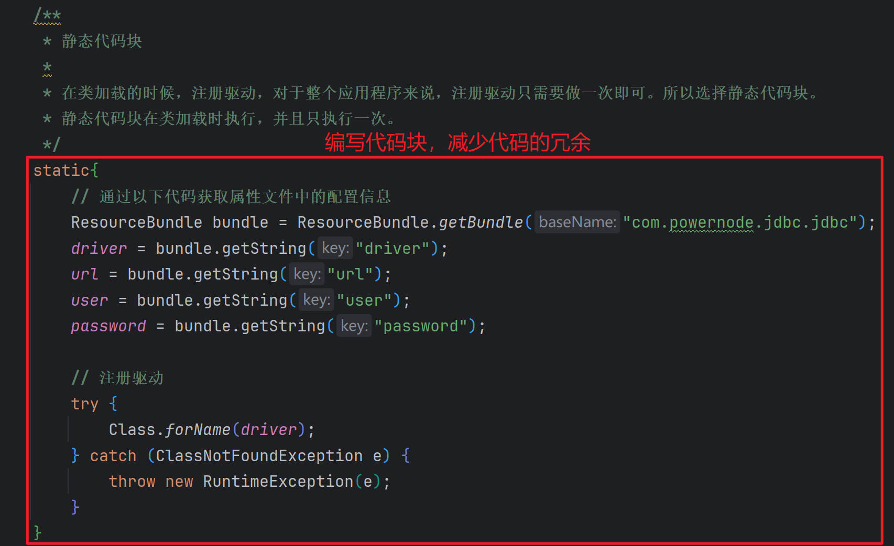

#### 连接数据库对象

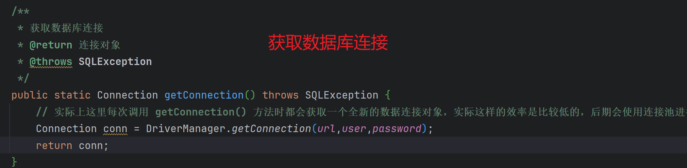

#### 释放资源

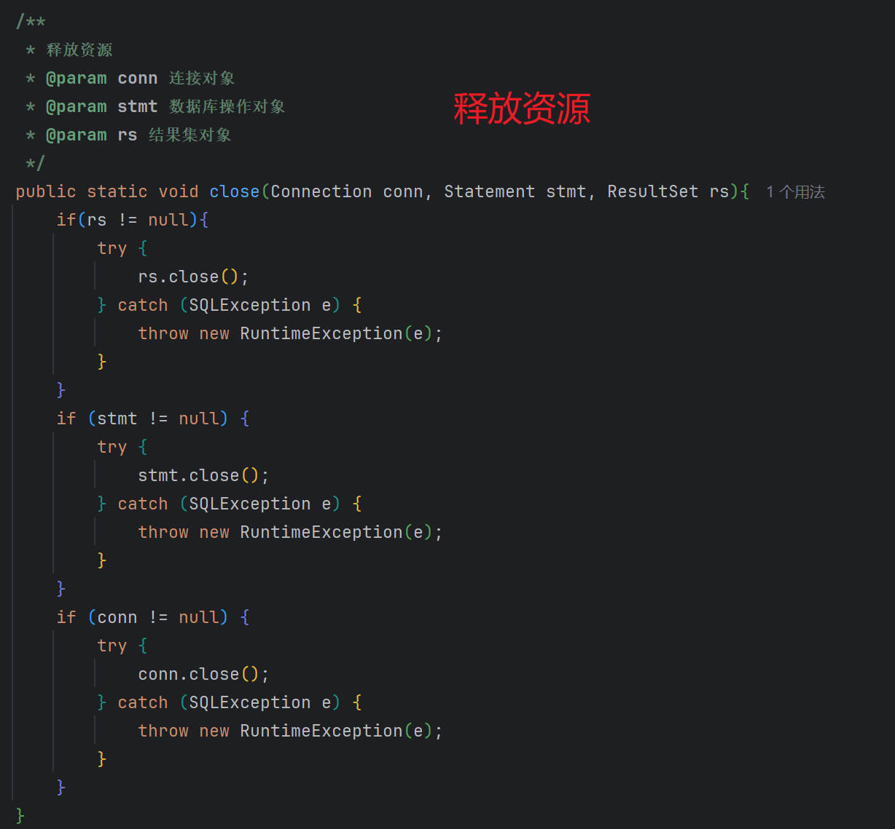

### 实际应用

```java title="java"
package com.powernode.jdbc;

import com.powernode.jdbc.utils.DbUtils;

import java.sql.Connection;
import java.sql.ResultSet;
import java.sql.SQLException;
import java.sql.Statement;

/**
 * DbUtils工具类的封装，让JDBC的代码变简洁
 */
public class JDBCTest07 {
    public static void main(String[] args) {

        Connection conn = null;
        Statement stmt = null;
        ResultSet rs = null;

        try {
            // 3. 获取数据库操作对象
            conn = DbUtils.getConnection();
            stmt = conn.createStatement();
            // 4. 执行SQL语句
            String sql = "insert into t_product(name,price,create_time) values('小米su7',1.0,'2024-02-23')";
            // 注意：第二个参数是标志位，用来表示是否将新插入的数据行的主键值返回
            int count = stmt.executeUpdate(sql, Statement.RETURN_GENERATED_KEYS);
            System.out.println("插入了" + count + "条记录");
            // 获取新增行的主键值
            // 返回的这个rs结果集中就包含了新增行的主键值
            rs = stmt.getGeneratedKeys();
            // 通过结果集取主键值
            if (rs.next()) {
                long id = rs.getLong(1);
                System.out.println("新增行的主键值：" + id);
            }

        }catch (SQLException e) {
            throw new RuntimeException(e);
        }finally{
            DbUtils.close(conn,stmt,rs);
        }
    }
}
```

执行结果如下：

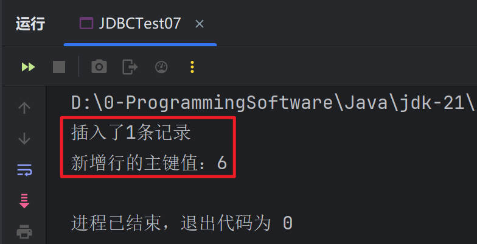

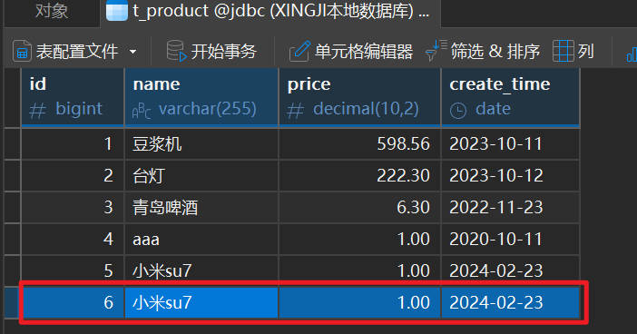

## SQL注入问题

`SQL注入问题`说的是：用户输入的信息中含有`SQL语句关键字`，和程序中的`SQL语句进行字符串拼接`，导致程序中的SQL语句改变了原意。**（`SQL注入问题是一种系统安全问题`）**
接下来我们来演示一下SQL注入问题。以用户登录为例。使用表：`t_user`
**业务描述：系统启动后，给出登录页面，用户可以输入用户名和密码，用户名和密码`全部正确`，则`登录成功`，反之，则`登录失败`。**
分析一下要执行怎样的SQL语句？是不是这样的？

```sql
select * from t_user where name = 用户输入的用户名 and password = 用户输入的密码;
```
> 如果以上的SQL语句`能够查询到结果`，说明`用户名和密码是正确的`，则`登录成功`。如果`查不到`，说明是`错误的`，则`登录失败`。

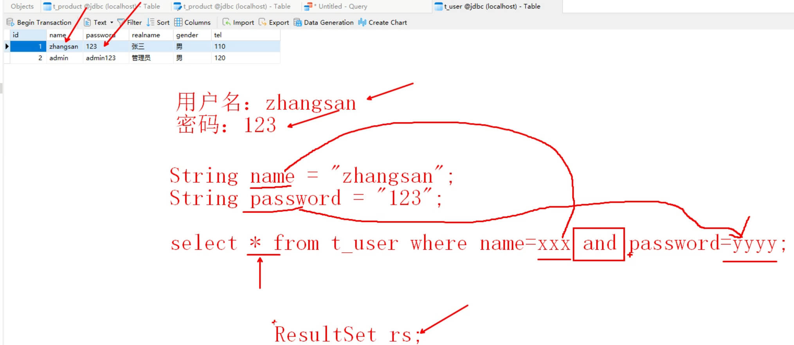

代码实现如下：

```java title="java"
package com.powernode.jdbc;

import com.powernode.jdbc.utils.DbUtils;

import java.sql.Connection;
import java.sql.ResultSet;
import java.sql.SQLException;
import java.sql.Statement;
import java.util.Scanner;

/**
 * 实现用户登录功能
 */
public class JDBCTest08 {
    public static void main(String[] args){
        Scanner scanner = new Scanner(System.in);
        // 初始化登录界面
        System.out.println("欢迎使用用户管理系统，请登录！");
        System.out.print("用户名：");
        String loginName = scanner.next();
        System.out.print("密码：");
        String loginPwd = scanner.next();

        // 连接数据库，验证用户名和密码是否正确
        Connection conn = null;
        Statement stmt = null;
        ResultSet rs = null;
        boolean loginSuccess = false;
        String realname = null;

        try {
            // 获取连接
            conn = DbUtils.getConnection();
            // 获取数据库操作对象
            stmt = conn.createStatement();
            // 执行sql语句
            String sql = "select * from t_user where name = '"+loginName+"' and password = '"+loginPwd+"'";
            System.out.println(sql);
            rs = stmt.executeQuery(sql);

            // 处理结果集（结果集中数据，表示登录成功，反之表示登录失败）
            if (rs.next()) {
               // 登录成功
                loginSuccess = true;
                // 获取真实的名字
                realname = rs.getString("realname");
            }

        }catch (SQLException e){
            throw new RuntimeException(e);
        }finally {
            // 释放资源
            DbUtils.close(conn,stmt,rs);
        }
        System.out.println(loginSuccess ? "登录成功，欢迎" + realname : "登录失败，你的用户名不存在或者密码错误！");
    }
}
```

如果用户名和密码正确的话，执行结果如下：
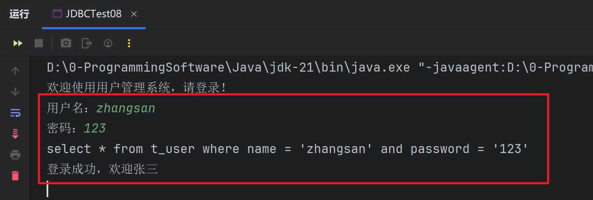

如果用户名不存在或者密码错误的话，执行结果如下：
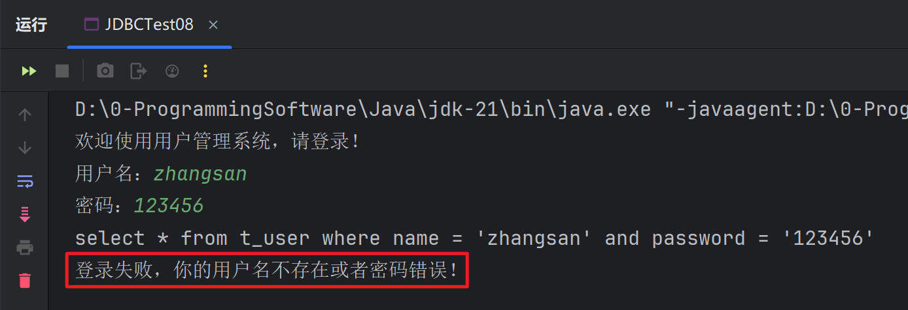

接下来，见证奇迹的时刻，当我分别输入以下的用户名和密码时，`系统被攻破了`：

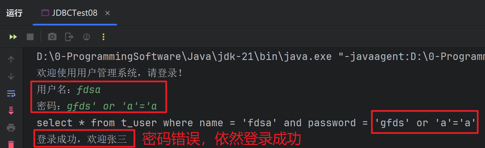

这种现象就叫做：**SQL注入**。为什么会发生以上的事儿呢？**原因是：用户提供的信息中有`SQL语句关键字`，并且和`底层的SQL字符串进行了拼接`，变成了一个`全新的SQL语句`。**

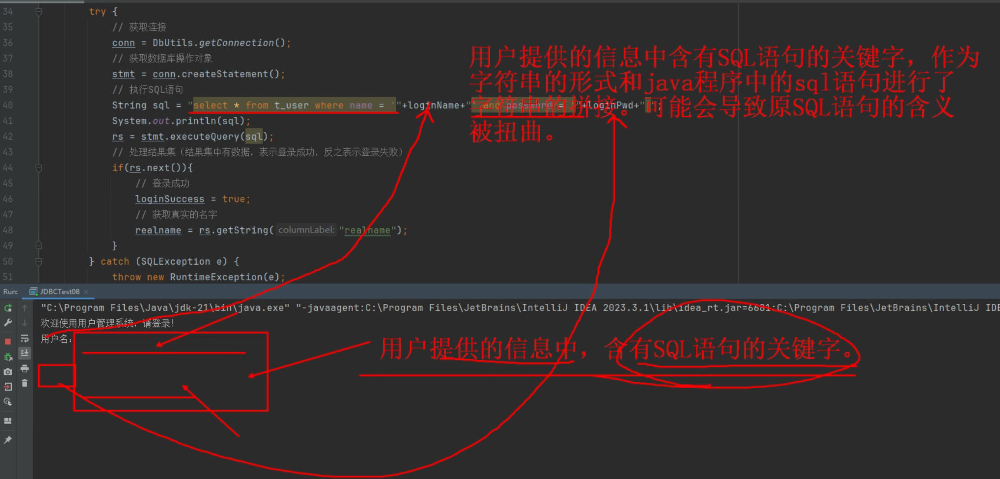

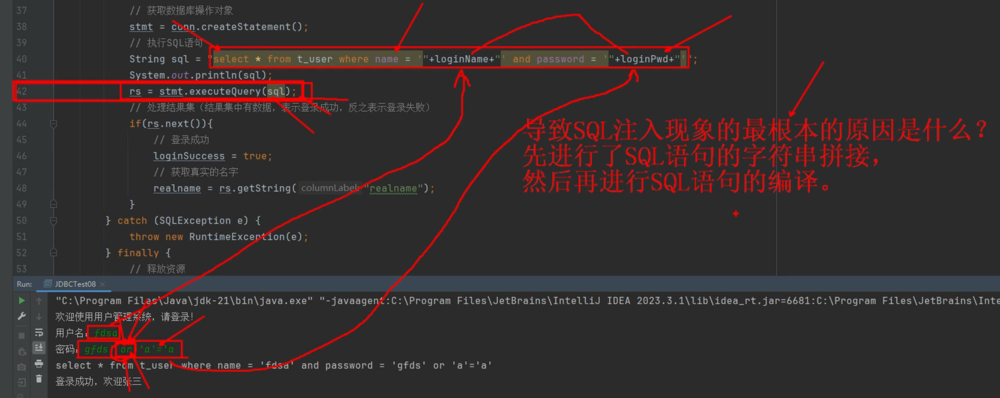

例如：本来程序想表达的是这样的SQL：

```sql
select * from t_user where name = 'zhangsan' and password = '123';
```
结果被SQL注入之后，SQL语句就变成这样了：
```sql
select * from t_user where name = 'fdsa' and password = 'gfds' or 'a'='a';
```
我们可以执行一下这条SQL，看看结果是什么？

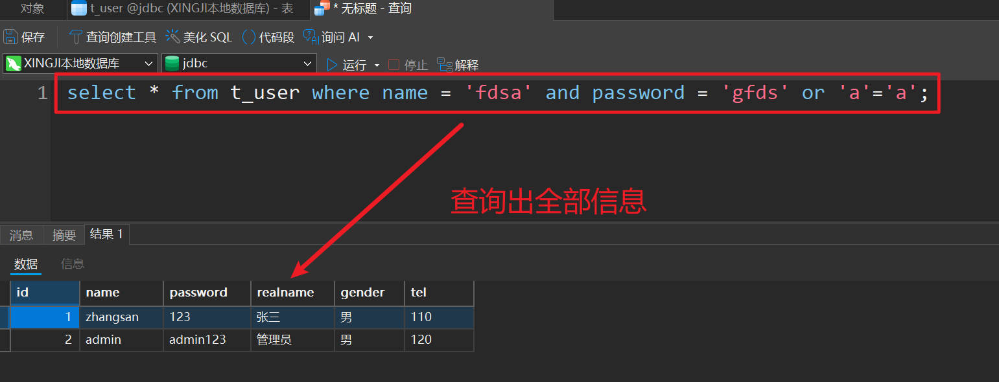
把所有结果全部查到了，这是因为 `'a'='a' 是恒成立的`，并且使用的是` or 运算符`，所以**or 前面的条件等于是`没有的`**。这样就会把所有数据全部查到。而在程序中的判断逻辑是只要结果集中有数据，则表示`登录成功`。所以以上的输入方式最终的结果就是登录成功。你设想一下，如果这个系统是一个高级别保密系统，只有登录成功的人才有权限，那么这个系统是不是极其危险了。

### 解决SQL注入问题

> 导致SQL注入的**根本原因**是什么？只有找到真正的原因，问题才能得到解决。

**最根本的原因是：`Statement`造成的。**

**`Statement执行原理`是：先进行`字符串的拼接`，将`拼接好的SQL语句发送给数据库服务器`，数据库服务器`进行SQL语句的编译`，然后执行。因此用户提供的信息中如果含有`SQL语句的关键字`，那么这些关键字正好参加了`SQL语句的编译`，所以`导致原SQL语句被扭曲`。**

**因此，JDBC为了解决这个问题，引入了一个新的接口：`PreparedStatement`，我们称为：**预编译的数据库操作对象**。`PreparedStatement`是`Statement接口的子接口`。它俩是`继承关系`。**

**`PreparedStatement`执行原理是：先对`SQL语句进行预先的编译`，然后`再向SQL语句指定的位置传值`，也就是说：用户提供的信息中即使`含有SQL语句的关键字`，那么这个信息也只会被当做一个值传递给SQL语句，`用户提供的信息`不再参与`SQL语句的编译`了，这样就解决了`SQL注入问题`。**

使用PreparedStatement解决SQL注入问题：
```java title="java"
package com.powernode.jdbc;

import com.powernode.jdbc.utils.DbUtils;

import java.sql.*;
import java.util.Scanner;

/**
 * 使用PreparedStatement解决SQL注入问题
 *
 * PreparedStatement原理：
 *      第一步：先对SQL语句进行预先编译
 *      第二步：给SQL语句中占位符传值
 *
 * 重点注意事项：
 *      在使用预编译的数据库操作对象PreparedStatement时，需要先编写SQL语句，然后再获取PreparedStatement对象。
 *      这里编写的SQL语句中，所有“值”的位置都要使用占位符来代替，占位符采用 ?
 *      每一个问号 ? 是一个值。是一个占位符。
 *      另外，特别要注意：这个占位符问号 ? 两边不能使用单引号或双引号括起来。
 *
 * 解决SQL注入的本质是：先将带有占位符的SQL语句进行预先编译，然后给占位符传值。
 * 即使用户提供的信息中含有SQL语句关键字，但是这些关键字不会参与SQL语句的编译，自然不会扭曲SQL语句的原意。
 */
public class JDBCTest09 {
    public static void main(String[] args){
        Scanner scanner = new Scanner(System.in);
        // 初始化登录界面
        System.out.println("欢迎使用用户管理系统，请登录！");
        System.out.print("用户名：");
        String loginName = scanner.nextLine();
        System.out.print("密码：");
        String loginPwd = scanner.nextLine();

        // 连接数据库，验证用户名和密码是否正确
        Connection conn = null;
        PreparedStatement ps = null;
        ResultSet rs = null;
        boolean loginSuccess = false;
        String realname = null;

        try {
            // 获取连接
            conn = DbUtils.getConnection();
            // 获取预编译的数据库操作对象
            String sql = "select * from users where loginName=? and password=?";
            ps = conn.prepareStatement(sql);
            // 给 ？ 占位符 传值
            // 再次强调，在JDBC当中，所有的下标都是从1开始。不是从0开始。
            // 以下代码的含义是：给第1个占位符 ？ 传值
            ps.setString(1, loginName);
            // 以下代码的含义是：给第2个占位符 ？ 传值
            ps.setString(2, loginPwd);
            // 执行sql语句
            rs = ps.executeQuery();
            // 处理结果集（结果集中数据，表示登录成功，反之表示登录失败）
            if (rs.next()) {
                // 登录成功
                loginSuccess = true;
                // 获取真实的名字
                realname = rs.getString("realname");
            }

        }catch (SQLException e){
            throw new RuntimeException(e);
        }finally {
            // 释放资源
            DbUtils.close(conn,ps,rs);
        }
        System.out.println(loginSuccess ? "登录成功，欢迎" + realname : "登录失败，你的用户名不存在或者密码错误！");
    }
}
```

用户名和密码正确的话，执行结果如下：
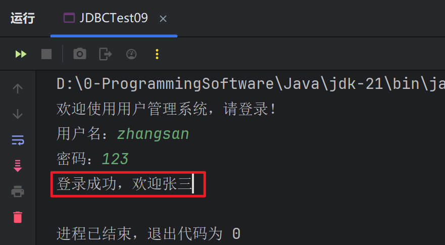

用户名和密码错误的话，执行结果如下：
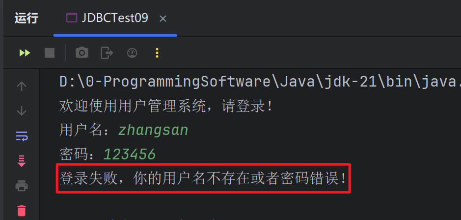

尝试SQL注入，看看还能不能？

通过测试得知，SQL注入问题已经解决了。**根本原因是：'gfds' or 'a'='a' 这个字符串中虽然含有SQL语句的关键字，但是只会被当做普通的值传到SQL语句中，并没有参与SQL语句的编译**。

**关于使用PreparedStatement要注意的是：**

- 带有`占位符 ?` 的SQL语句我们称为：`预处理SQL语句`。
- `占位符 ?` 不能使用`单引号或双引号`包裹。如果包裹，`占位符则不再是占位符`，是`一个普通的问号字符`。
- 在`执行SQL语句前`，必须`给每一个占位符 ? 传值。
- **如何给`占位符 ? 传值`，通过以下的方法：**
   - **`pstmt.setXxx(第几个占位符, 传什么值)`**
   - **“第几个占位符”：`从1开始`。`第1个占位符`则是`1`，`第2个占位符`则是`2`，以此类推。**
   - **“传什么值”：`具体要看调用的什么方法`？**
      - 如果调用`pstmt.setString`方法，则传的值`必须是一个字符串`。
      - 如果调用`pstmt.setInt`方法，则传的值`必须是一个整数`。
      - 以此类推......

> **`PreparedStatement`和`Statement`都是用于`执行SQL语句的接口`，它们的主要区别在于：**

- **`PreparedStatement预编译SQL语句`，`Statement直接提交SQL语句`；**
- **`PreparedStatement`执行速度更快，可以`避免SQL注入攻击`；(`PreparedStatement`对于同一条SQL语句来说，`编译一次，执行N次`。而`Statement`是`每次都要进行编译的`。因此`PreparedStatement效率略微高一些`。)**
- **`PreparedStatement`会做`类型检查`，是`类型安全的`；**

## PreparedStatement的使用

### 新增操作

> **需求：向 `emp 表中插入这样一条记录`：**
> **empno：8888
> ename：张三
> job：销售员
> mgr：7369
> hiredate：2024-01-01
> sal：1000.0
> comm：500.0
> deptno：10**

```java title="java"
package com.powernode.jdbc;

import com.powernode.jdbc.utils.DbUtils;

import java.sql.Connection;
import java.sql.PreparedStatement;
import java.sql.SQLException;
import java.time.LocalDate;

/**
 * 使用PreparedStatement完成新增操作
 */
public class JDBCTest10 {
    public static void main(String[] args) {
        /*
        需求：向 emp 表中插入这样一条记录：
        empno：8888
        ename：张三
        job：销售员
        mgr：7369
        hiredate：2024-01-01
        sal：1000.0
        comm：500.0
        deptno：10
         */
        Connection conn = null;
        PreparedStatement ps = null;
        try {
            // 1.注册驱动(因为我们使用了DbUtils，因此这一步不需要)
            // 2.获取连接
            conn = DbUtils.getConnection( );
            // 3.获取预编译的数据库操作对象
            String sql = "insert into emp(empno,ename,job,mgr,hiredate,sal,comm,deptno) values(?,?,?,?,?,?,?,?)";
            // 程序执行到这里会对“预处理的SQL语句”进行预编译操作
            ps = conn.prepareStatement(sql);
            // 给 ？ 占位符传值
            ps.setInt(1,8888);
            ps.setString(2,"张三");
            ps.setString(3,"销售员");
            ps.setInt(4,7369);
            LocalDate localDate = LocalDate.parse("2025-09-05");
            ps.setDate(5,java.sql.Date.valueOf(localDate));
            ps.setDouble(6,1000.0);
            ps.setDouble(7,500.0);
            ps.setInt(8,10);
            // 4.执行SQL语句
            int count = ps.executeUpdate();
            System.out.println("插入了"+ count +"条记录");
            // 5.处理查询结果集（因为现在是执行insert操作，所以这一步没有）
        }catch (SQLException e){
            throw  new RuntimeException(e);
        }finally {
            // 6.释放资源
            DbUtils.close(conn,ps,null);
        }
    }
}
```
重点学习内容：如何给占位符 ? 传值。
执行结果如下：
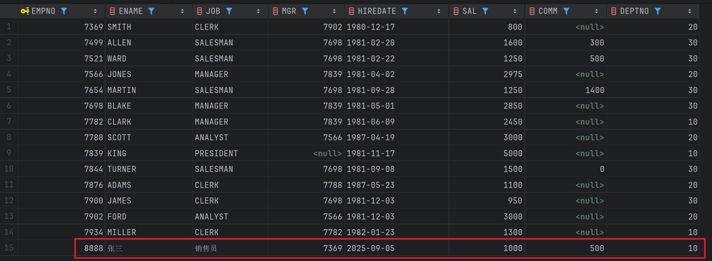

### 修改操作

> **需求：将`员工编号为8888`的员工，`姓名`修改为`李四`，`岗位`修改为`产品经理`，`月薪`修改为`5000.0`，其他不变。**

```java title="java"
package com.powernode.jdbc;

import com.powernode.jdbc.utils.DbUtils;

import java.sql.Connection;
import java.sql.PreparedStatement;
import java.sql.SQLException;

public class JDBCTest11 {
    public static void main(String[] args) {
        /*
         **需求：将员工编号为8888的员工，姓名修改为李四，岗位修改为产品经理，月薪修改为5000.0，其他不变。**
         */
        Connection conn = null;
        PreparedStatement ps = null;

        try {
            // 1.注册驱动
            // 2.获取连接
            conn = DbUtils.getConnection();
            // 3.获取预编译的数据库操作对象
            String sql = "update emp set ename = ?, job = ?, sal = ? where empno = ?";
            ps = conn.prepareStatement(sql);
            ps.setString(1,"李四");
            ps.setString(2,"产品经理");
            ps.setDouble(3,5000.0);
            ps.setInt(4,8888);
            // 4.执行SQL语句
            int count = ps.executeUpdate();
            System.out.println("更新了" + count + "条数据");
            // 5.处理查询结果集
        }catch (SQLException e){
            throw  new RuntimeException(e);
        }finally {
            DbUtils.close(conn,ps,null);
        }
    }
}
```
执行结果如下：
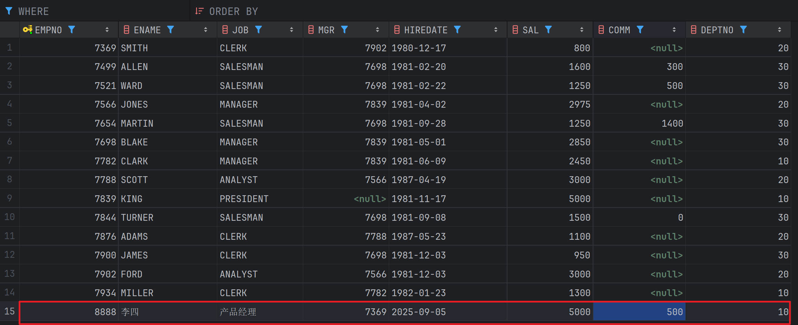

### 删除操作

> **需求：将`员工编号为8888的删除`。**

```java title="java"
package com.powernode.jdbc;

import com.powernode.jdbc.utils.DbUtils;

import java.sql.Connection;
import java.sql.PreparedStatement;
import java.sql.SQLException;

public class JDBCTest12 {
    public static void main(String[] args) {
        /*
         需求：将员工编号为8888的删除。
         使用 try-with-resources 语法。(java7的新特性)
         */
        String sql="delete from emp where empno = ?";

        try(Connection conn = DbUtils.getConnection()){
            PreparedStatement ps = conn.prepareStatement(sql);
            // 给 ？ 传值
            ps.setInt(1,8888);
            // 执行SQL语句
            int count = ps.executeUpdate();
            System.out.println("删除了" + count + "条记录");
        }catch(SQLException e){
            e.printStackTrace();
        }
    }
}
```
执行结果如下：


### 模糊查询

> **需求：`查询员工名字`中`第二个字母是 O` 的。**

```java title="java"
package com.powernode.jdbc;

import com.powernode.jdbc.utils.DbUtils;

import java.sql.Connection;
import java.sql.PreparedStatement;
import java.sql.ResultSet;
import java.sql.SQLException;

public class JDBCTest13 {
    public static void main(String[] args) {
        /*
        需求：查询员工名字中第二个字母是 O 的。
         */
        Connection conn = null;
        PreparedStatement ps = null;
        ResultSet rs = null;

        try{
            conn = DbUtils.getConnection();
            String sql = "select ename from emp where ename like ?";

            //这样是错误的
            //String sql = "select ename from emp where ename like "_?%"";

            ps = conn.prepareStatement(sql);
            ps.setString(1,"_O%");

            //ps.setString(1,"O");

            rs = ps.executeQuery();
            while(rs.next()){
                String ename = rs.getString("ename");
                System.out.println(ename);
            }
        }catch(SQLException e){
            throw  new RuntimeException(e);
        }finally {
            DbUtils.close(conn,ps,rs);
        }
    }
}
```
执行结果如下：
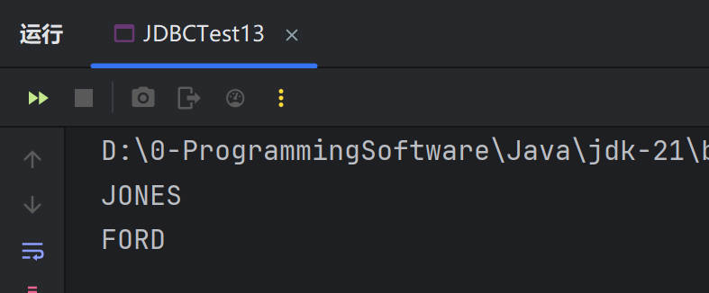
通过这个例子主要告诉大家，程序不能这样写：

```java title="java"
String sql = "select ename from emp where ename like '_?%'";
pstmt.setString(1, "O");
```
> **由于`占位符 ? `被`单引号`包裹，因此这个`占位符是无效的`。**

### 分页查询

> 对于MySQL来说，通用的分页SQL语句：
>
> + 假设每页`显示3条记录`：`pageSize = 3`
>   第1页：limit 0, 3
>   第2页：limit 3, 3
>   第3页：limit 6, 3
>
> + **第pageNo页：limit (pageNo - 1)*pageSize, pageSize**
>
> **需求：查询`所有员工姓名`，每页`显示3条(pageSize)`，显示`第2页(pageNo)`。**

```java title="java"
package com.powernode.jdbc;

import com.powernode.jdbc.utils.DbUtils;

import java.sql.Connection;
import java.sql.PreparedStatement;
import java.sql.ResultSet;
import java.sql.SQLException;

/**
 * 使用PreparedStatement完成分页查询
 */
public class JDBCTest14 {
    public static void main(String[] args) {
        /*
         需求：查询所有员工姓名，每页显示3条(pageSize)，显示第2页(pageNo)。
         */
        // 每页显示的记录条数
        int pageSize = 3;
        // 显示第几页（页码）
        int pageNo = 2;

        Connection conn = null;
        PreparedStatement ps = null;
        ResultSet rs = null;
        try {
            conn = DbUtils.getConnection();
            String sql = "select ename from emp limit ?,?";
            ps = conn.prepareStatement(sql);
            ps.setInt(1,(pageNo - 1)* pageSize);
            ps.setInt(2,pageSize);
            rs = ps.executeQuery();
            while (rs.next()) {
                String name = rs.getString("ename");
                System.out.println(name);
            }
        }catch (SQLException e){
            throw  new RuntimeException(e);
        }finally {
            DbUtils.close(conn,ps,rs);
        }
    }
}
```
执行结果如下：

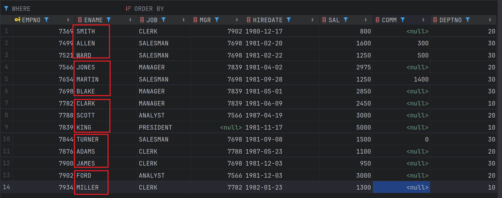

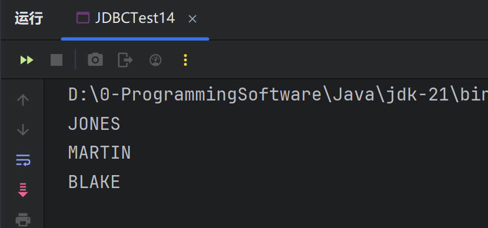

## blob数据的插入和读取
> 准备一张表：`t_img`，三个字段，一个`id主键`，一个图片名字`name`，一个`img`。
> 建表语句如下：
>
> ```sql
> create table `t_img` (
>   `id` bigint primary key auto_increment,
>   `name` varchar(255),
>   `img` blob
> ) engine=innodb;
> ```
>
> 准备一张图片：
>
> 


> **需求1：向`t_img 表`中`插入一张图片`。**
>
> 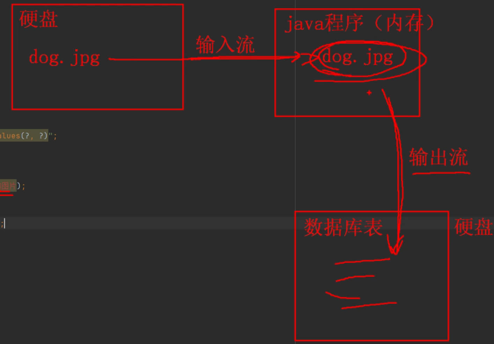

```java title="java"
package com.powernode.jdbc;

import com.powernode.jdbc.utils.DbUtils;

import java.io.FileInputStream;
import java.io.IOException;
import java.sql.Connection;
import java.sql.PreparedStatement;

/**
 * 使用PreparedStatement向数据库表中插入一张图片。
 */
public class JDBCTest15 {
    public static void main(String[] args) {
        Connection conn = null;
        PreparedStatement ps = null;
        FileInputStream in = null;

        try {
            conn = DbUtils.getConnection();
            // 获取预编译的数据库操作对象
            String sql = "insert into t_img(name, img) values(?, ?)";
            ps = conn.prepareStatement(sql);
            // 给 ？传值
            ps.setString(1, "狗狗的图片");
            in = new FileInputStream("D:\\Blog-Vuepress\\my-project\\docs\\JDBC\\SQL注入\\dog.jpg");
            ps.setBlob(2,in);
            // 执行SQL
            int count = ps.executeUpdate();
            System.out.println("插入了" + count + "条记录");
        }catch (Exception e){
            throw  new RuntimeException(e);
        }finally {
            if(in != null){
                try {
                    in.close();
                }catch (IOException e) {
                    throw new RuntimeException(e);
                }
            }
            DbUtils.close(conn,ps,null);
        }
    }
}
```
执行结果如下：
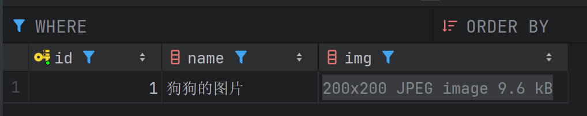

> **需求2：从`t_img 表`中`读取一张图片`。（从数据库中读取一张图片`保存到本地`。）**
>
> 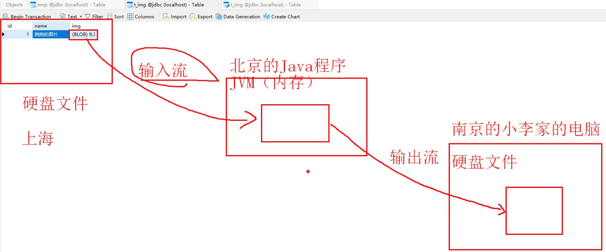

```java title="java"
package com.powernode.jdbc;

import com.powernode.jdbc.utils.DbUtils;

import java.io.FileOutputStream;
import java.io.InputStream;
import java.io.OutputStream;
import java.sql.Connection;
import java.sql.PreparedStatement;
import java.sql.ResultSet;

/**
 * 使用PreparedStatement将表中的图片查询出来。（将数据库中的图片读取到本地硬盘。）
 */
public class JDBCTest16 {
    public static void main(String[] args) {
        Connection conn = null;
        PreparedStatement ps = null;
        ResultSet rs = null;
        try {
            conn = DbUtils.getConnection();
            String sql = "select img from t_img where name = ?";
            ps = conn.prepareStatement(sql);
            ps.setString(1, "狗狗的图片");
            rs = ps.executeQuery();
            if(rs.next()){
                // 注意：图片就在结果集ResultSet对象当中。
                InputStream in = rs.getBinaryStream("img");
                OutputStream out = new FileOutputStream("E:/dog.jpg");
                byte[] bytes = new byte[1024];
                int readCount = 0;
                while((readCount = in.read(bytes)) != -1){
                    out.write(bytes, 0, readCount);
                }
                out.flush();
                in.close();
                out.close();
            }
        } catch (Exception e) {
            throw new RuntimeException(e);
        } finally {
            DbUtils.close(conn, ps, rs);
        }
    }
}
```
> 执行完毕之后，查看一下图片大小是否和原图片相同，打开看看是否可以正常显示。
>
> <!---->
>
> 


## JDBC批处理操作

> 准备一张`商品表`：`t_product`
> 建表语句如下：
>
> ```sql
> create table t_product(
>   id bigint primary key,
>   name varchar(255)
> );
> ```

### 不使用批处理

> **`不使用批处理`，向 t_product 表中`插入一万条商品信息`，并记录耗时！**

```java title="java"
package com.powernode.jdbc;

import com.powernode.jdbc.utils.DbUtils;

import java.sql.Connection;
import java.sql.PreparedStatement;
import java.sql.SQLException;

/**
 * 不使用批处理操作，向t_batch表中插入一万条记录，并且记录耗时。
 */
public class JDBCTest17 {
    public static void main(String[] args) {
        long begin = System.currentTimeMillis();
        Connection conn = null;
        PreparedStatement ps = null;

        try{
            conn = DbUtils.getConnection();
            String sql = "insert into t_batch(id,name) values(?,?)";
            ps = conn.prepareStatement(sql);
            int count = 0;
            for(int i = 1; i <= 10000; i++){
                ps.setLong(1,i);
                ps.setString(2,"batch" + i);
                count += ps.executeUpdate();
            }
            System.out.println("插入了" + count + "条记录");
        }catch(SQLException e){
            throw  new RuntimeException(e);
        }finally {
            DbUtils.close(conn,ps,null);
        }
        long end = System.currentTimeMillis();
        System.out.println("总耗时" + (end - begin) + "毫秒");
    }
}
```
执行结果如下：
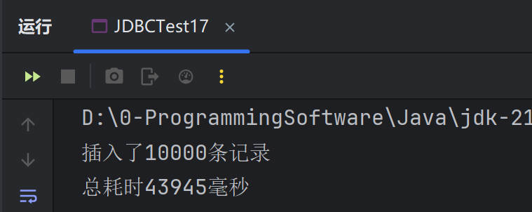

### 使用批处理

> `使用批处理`，向` t_product 表`中插入`一万条商品信息`，并记录耗时！
> **注意：启用批处理需要在URL后面添加这个的参数：`rewriteBatchedStatements=true`**
> 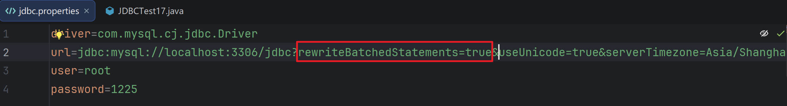

```java title="java"
package com.powernode.jdbc;

import com.powernode.jdbc.utils.DbUtils;

import java.sql.Connection;
import java.sql.PreparedStatement;
import java.sql.SQLException;

/**
 *使用批处理，向t_product 表中插入一万条商品信息，并记录耗时！
 */
public class JDBCTest18 {
    public static void main(String[] args) {
        long begin = System.currentTimeMillis();
        Connection conn = null;
        PreparedStatement ps = null;

        try{
            conn = DbUtils.getConnection();
            String sql = "insert into t_batch(id,name) values(?,?)";
            ps = conn.prepareStatement(sql);
            int count = 0;
            for(int i = 1; i <= 10000; i++){
                ps.setLong(1,i);
                ps.setString(2,"batch" + i);
                // count += ps.executeUpdate();
                // 打包
                ps.addBatch();
                // 如果打包够500个，执行一次（则磁盘IO一次）
                if(i % 500 ==0){
                    count += ps.executeBatch().length;
                }
            }
            // 循环结束之后，再次执行批量处理，防止数据丢失
            count += ps.executeBatch().length;
            
            System.out.println("插入了" + count + "条记录");
        }catch(SQLException e){
            throw  new RuntimeException(e);
        }finally {
            DbUtils.close(conn,ps,null);
        }
        long end = System.currentTimeMillis();
        System.out.println("总耗时" + (end - begin) + "毫秒");
    }
}
```
执行结果如下：
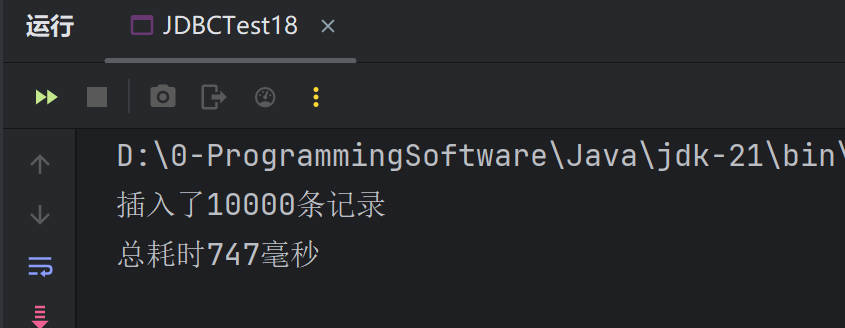

> **在进行大数据量插入时，批处理为什么可以提高程序的执行效率？**
>
> 1. `减少了网络通信次数`：JDBC 批处理会将多个 SQL 语句一次性发送给服务器，减少了客户端和服务器之间的通信次数，从而提高了数据写入的速度，特别是对于远程服务器而言，优化效果更为显著。 
>
> 2. `减少了数据库操作次数`：JDBC 批处理会将多个 SQL 语句合并成一条 SQL 语句进行执行，从而减少了数据库操作的次数，减轻了数据库的负担，大大提高了数据写入的速度。  