## IO流概述

### 简介

- **I/O 是 Input 和 Output 的缩写，IO 技术是非常实用的技术，用于 `处理设备之间的数据传输` ，如：读写文件、网络通讯等。**

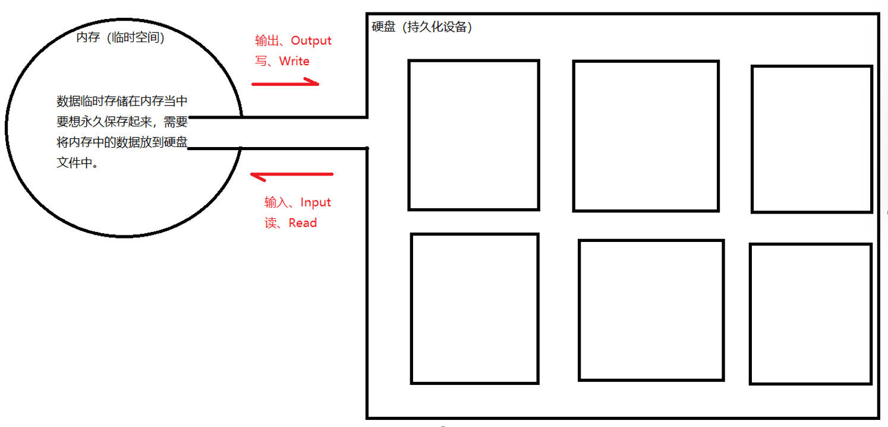

### 什么是IO流？

1. **IO流指的是：程序中`数据的流动`。数据可以`从内存流动到硬盘(输出)`，也可以`从硬盘流动到内存(输入)`。**

2. **Java中IO流最基本的作用是：完成文件的`读和写`。**

* 其中，IO 流可以将程序中的数据保存（写出）到本地文件中，我们称之为：`写`（Output，写出数据）。


* 其中，IO 流可以将本地文件中的数据读取（加载）到程序中，我们称之为：`读`（Input，读取数据）。

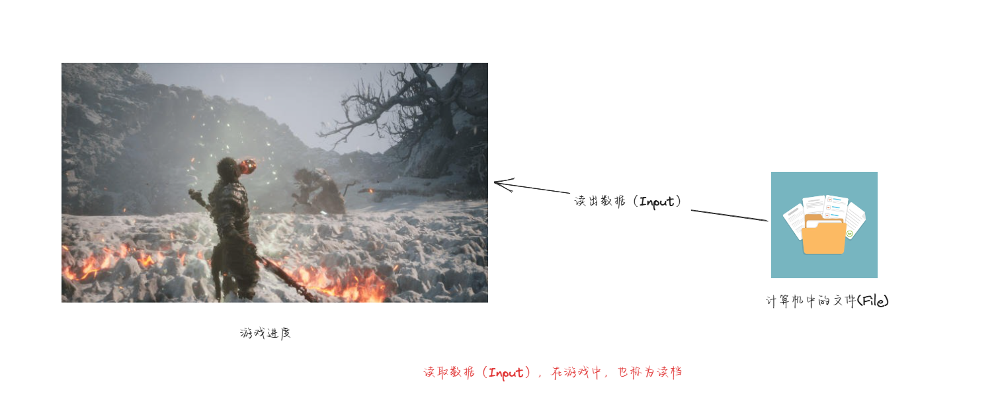

* 在 IO 流中，是以`程序`作为参照物来看读写的方向的。

> [!NOTE]
>
> * ① 是程序在读取文件中的数据，也是程序在向文件中写出数据。
> * ② 因为程序是运行在内存中，所以也可以将`内存`作为参照物来看读写的方向的。


### IO流的分类？

> **根据数据流向分为：输入和输出是相对于内存而言的。**

+ 输入流：从硬盘到内存。(输入又叫做读：read)

+ 输出流：从内存到硬盘。（输出又叫做写：write）


> **根据读写数据形式分为：**

+ 字节流：一次读取一个字节。适合读取非文本数据。例如图片、声音、视频等文件。（当然字节流是万能的。什么都可以读和写。）

+ 字符流：一次读取一个字符。只适合读取普通文本。不适合读取二进制文件。因为字符流统一使用Unicode编码，可以避免出现编码混乱的问题。


>  [!CAUTION]
>
> **注意：Java的所有IO流中凡是以`Stream结尾`的都是`字节流`。凡是以`Reader和Writer结尾`的都是`字符流`。**


> **根据流在IO操作中的作用和实现方式来分类:**

+ 节点流：节点流`负责数据源和数据目的地`的`连接`，是IO中最基本的组成部分。

+ 处理流：处理流对节点流进行`装饰/包装`，提供`更多高级处理操作`，方便用户进行数据处理。


> **Java中已经将io流实现了，在`java.io`包下，可以直接使用。**


## IO流的体系结构

### 概述

①下图是常用的IO流。实际上IO流远远不止这些。

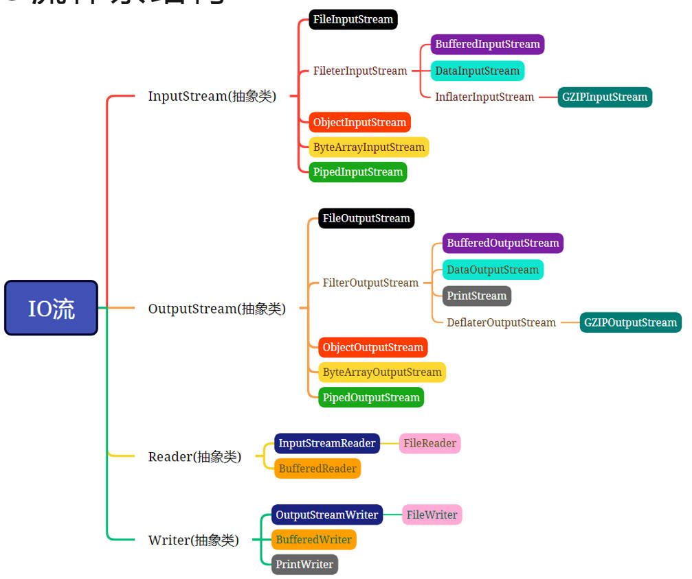

②**InputStream：字节输入流**

③**OutputStream：字节输出流**

④**Reader：字符输入流**

⑤**Writer：字符输出流**

⑥以上4个流都是抽象类，是所有IO流的四大头领！！！

⑦**所有的流`都实现了Closeable接口`，都有`close()方法`，流用完要关闭。**

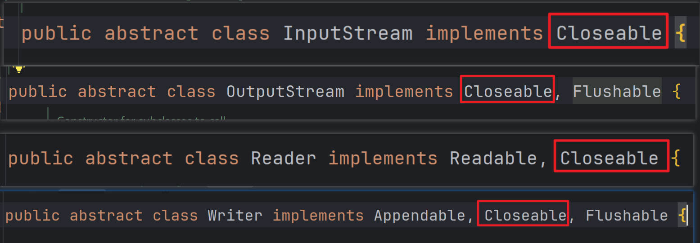

⑧**所有的输出流`都实现了Flushable接口`，都有`flush()方法`，flush方法的作用是，`将缓存清空，全部写出`。养成好习惯，以防数据丢失。**

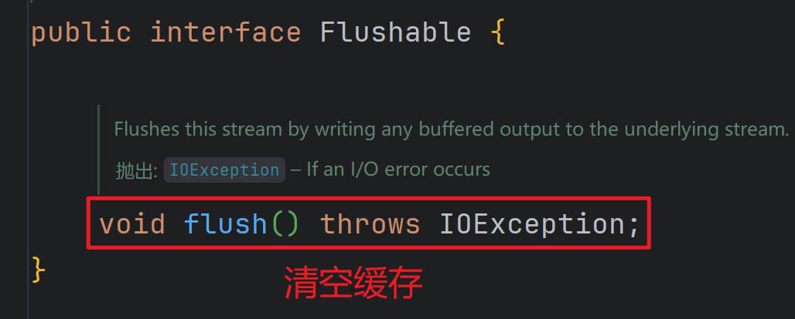


### IO 流体系

* IO 流按照`操作文件的类型`进行分类，可以分为`字节流`和`字符流`：


* 以`字节流`为例，按照`流的方向`进行分类，可以分为`字节输入流`和`字节输出流`：


* 以`字符流`为例，按照`流的方向`进行分类，可以分为`字符输入流`和`字符输出流`：


* 但是，InputStream、OutputStream、Reader 以及 Writer 都是抽象类，是不能实例化的：

> [!NOTE]
>
> ::: code-group
>
> ```java [InputStream.java]
> public abstract class InputStream implements Closeable {}
> ```
>
> ```java [OutputStream.java]
> public abstract class OutputStream implements Closeable, Flushable {}
> ```
>
> ```java [Reader.java]
> public abstract class Reader implements Readable, Closeable {}
> ```
>
> ```java [Writer.java]
> public abstract class Writer implements Appendable, Closeable, Flushable {}
> ```
>
> :::


> [!NOTE]
>
> 为了创建流的实例（对象），我们还需要它们的子类！！！

* 以字节输入流（InputStream）为例，其子类是 FileInputStream，如下所示：


* 以字节输出流（OutputStream）为例，其子类是 FileOutputStream，如下所示：


* 同理，字符输入流（Reader）和字符输出流（Writer）的继承体系就是这样，如下所示：


## 字符集

### 概述

* 之前，我们在学习字节流的时候，提过读取文件的时候，文件中的内容尽量是英文：

```java [Test.java]
package com.github.file;

import java.io.FileInputStream;
import java.io.IOException;
import java.io.InputStream;

public class Test {
    public static void main(String[] args) throws IOException {
        // 创建输入流对象
        InputStream is = new FileInputStream("day23\\a.txt");
        // 读取数据
        // 一次读取一个字节，读取的数据是在 ASCII 码表上字符对应的数字
        // 读取到文件末尾，返回 -1
        int b;
        while ((b = is.read()) != -1) {
            System.out.println(Character.toChars(b));
        }
        // 释放资源
        is.close();

    }
}
```

> 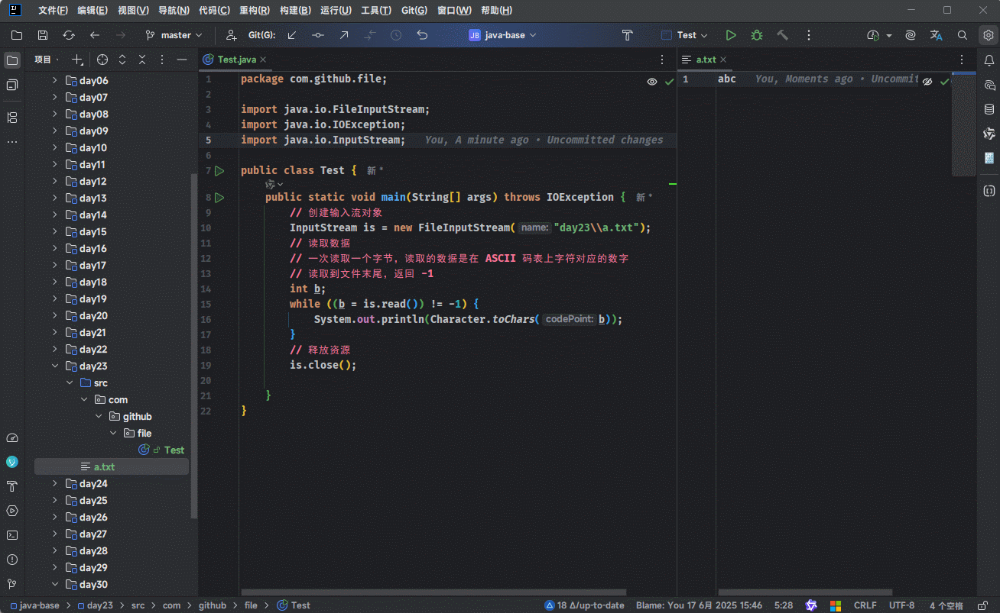

* 但是，劳资不信这个邪，我就要在读取文件的时候，文件中的内容是中文：

```java [Test.java]
package com.github.file;

import java.io.FileInputStream;
import java.io.IOException;
import java.io.InputStream;

public class Test {
    public static void main(String[] args) throws IOException {
        // 创建输入流对象
        InputStream is = new FileInputStream("day23\\a.txt");
        // 读取数据
        // 一次读取一个字节，读取的数据是在 ASCII 码表上字符对应的数字
        // 读取到文件末尾，返回 -1
        int b;
        while ((b = is.read()) != -1) {
            System.out.println(Character.toChars(b));
        }
        // 释放资源
        is.close();

    }
}
```

> 

> [!IMPORTANT]
>
> 我们会发现结果是乱码，要解释这个原因，就要将要学习`字符集`和`编码方式（编码规则）`有关了。


### 计算机的存储规则

#### 概述

* 要学习`字符集`和`编码方式（编码规则）`，我们有必要回顾之前学习过的`计算机的存储规则`。

#### 计算机的存储规则

* 在计算机中，任意的数据都是以二进制的形式进行存储的，包括：数字、字符、图片、视频等。


* 其实，所谓的二进制就是`0`或`1`，中文称为“比特”，英文称为“bit ”。

> [!NOTE]
>
> * ① 1 bit 只能存储 0 或 1 ，可以存储 2^1 个数字，即：可以表示 2 个数字。
> * ② 计算机中最小的存储单元是 bit 。


* 但是，一个`bit`能存储的数据太少了，通常我们会将`8`个`bit`分为一组，中文称为“字节”，英文称为“Byte”。

> [!NOTE]
>
> * ① 1 Byte 是 8 bit，可以存储 2^8 个数字，即：可以表示 256 个数字。
> * ② 计算机中最基本的存储单元是 Byte 。


> [!IMPORTANT]
>
> * ① 计算机存储英文的时候，1 个字节就可以了，因为英文字母一共 26 个，就算大小写也只有 52 个。
> * ② 计算机到底是如何存储英文的，就和将要学习的`字符集`和`编码方式（编码规则）`有关了。


### 字符集和编码方式（编码规则）

#### 概述

* 字符（Character）是各种文字和符号的总称，如：各个国家的文字、标点符号、数字符号等。

> [!NOTE]
>
> 在 Java 中，我们使用单引号`''`来将`字符`括起来，并使用`char` 来表示`字符`的`数据类型`：
>
> ```java
> char c = '1';
> char c2 = 'A';
> char c3 = '我';
> char c4 = '&';
> ```

* 字符集（Character Set）：字符集是字符的集合，规则了有哪些“字符”可以使用。

> [!NOTE]
>
> 字符集可以理解为：有哪些字符可以用！！！
>
> * ① ASCII 字符集包含了 A-Z、a-z、0-9 以及一些标点符号。
> * ② Unicode 字符集包含了世界上绝大多数的文字和符号，如：中文、日文、阿拉伯文、emoji 等。
> * ③ 常见的字符集：`ASCII`、`GBK` 以及 `Unicode` 。

* 编码方式（Character Encoding，计算机的存储规则）：就是如何将字符转换为二进制数字的规则，以便计算机可以进行存储和传输。

> [!NOTE]
>
> 编码方式可以理解为：字符是如何转变为 0 或 1 。
>
> * ① 每个字符分配一个或多个字节的二进制代码，如：ASCII 字符集，使用 1 个字节存储英文字符；而 GBK 字符集，使用 2 个字节存储汉字字符。
> * ② 同一个字符集可以有多种编码方式，如：Unicode 字符集中的编码方式有 UTF-16、UTF-32 以及 UTF-8 。


#### ASCII 字符集（ASCII 编码规则）

##### ASCII 字符集

* ASCII 字符集是基于`拉丁字母`的一套电脑字符集。

> [!NOTE]
>
> ASCII 是 American Standard Code for Information Interchange（美国信息互换标准代码）的缩写。


* 在 ASCII 字符集中记录了 128 个数据，包含了 A-Z、a-z、0-9 以及一些标点符号。

> [!NOTE]
>
> * ① ASCII 字符集对于大多数基于`拉丁字母`体系的国家来说够用了，如：美国、英国等。
> * ② 字符集可以理解为：有哪些字符可以用，如：`a`可以使用，而`汉`就不可以。


##### ASCII 编码规则

* 在 ASCII 字符集中记录了 128 个数据，包含了 A-Z、a-z、0-9 以及一些标点符号。

> [!NOTE]
>
> ASCII 字符集中字符的序号是 0 - 127 。


* 计算机在存储 ASCII 字符集的字符的时候，首先需要去 ASCII 字符集中查询字符对应的数字：


* 对于英文字符`a`，其在 ASCII 字符集中的数字编号是`97`，换算为二进制是`110 0001`，难道就这样直接存储到计算机中？


* 当然不对，因为计算机中最基本的存储单元是字节（Byte）。

> [!NOTE]
>
> 一个字节是 8 bit，而 97 的二进制只有 7 bit ，不足一个字节（Byte），是不能直接存储的！！！


* 计算机需要进行编码（将字符集中查询到的数据（十进制数字），按照一定的规则进行计算），变为计算机中实际能存储的二进制数据。

> [!NOTE]
>
> ASCII 的编码方式（编码规则，计算机的存储规则）：直接在前面补 0 ，形成 8 bit。


* 如果要进行读取操作，只需要将计算机中存储的二进制数据进行解码（将实际存储在计算机中的二进制数据，按照一定的规则进行计算），还原为字符集中对应的数据（十进制数字）：

> [!NOTE]
>
> ASCII 的解码方式（解码规则，计算机的解码规则）：直接转为十进制。


* 再根据获取到的数据（十进制数字）去 ASCII 字符集中查询对应的字符，即：英文字符`a`：


* 但是，我们经常会在网站上会看到这样的 ASCII 表，其实只是为了方便我们查看而已！！！

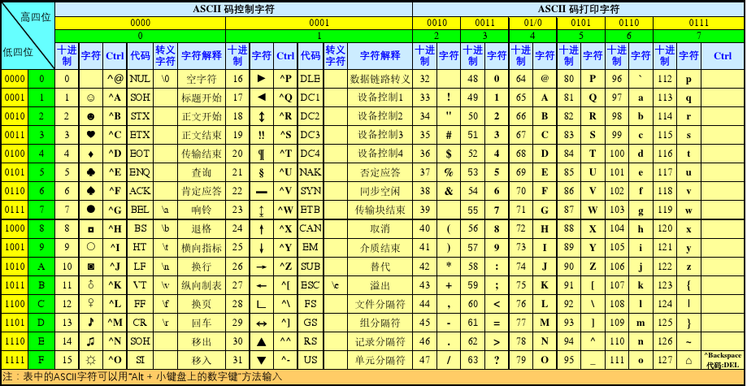


#### 其他字符集

* `ASCII`字符集中是没有汉字的，为了在计算机中表示汉字，必须设计一个字符集，让每个汉字和一个唯一的数字产生对应关系。
* `GB2312`字符集：1981 年 5 月 1 日实施的简体中文汉字编码国家标准。GB2312 对汉字采用双字节编码，收录 7445 个图形字符，其中包括 6763 个汉字。自 2017 年 3 月 23 日起，该标准转化为推荐性标准：GB/T2312-1980，不再强制执行。

* `BIG5`字符集：台湾地区繁体中文标准字符集，采用双字节编码，原始版本共收录 13053 个中文字，1984 年实施。后续版本增加 F9D6-F9DC 七个汉字，汉字总数 13060 个。
* `GBK`字符集：1995 年 12 月发布的汉字编码国家标准，是对 GB2312 编码的扩充，对汉字采用双字节编码。GBK 字符集共收录 21003 个汉字，包含国家标准 GB13000-1 中的全部中日韩汉字，和 BIG5 编码中的所有汉字。
* `GB18030`字符集：2000 年 3 月 17 日发布的汉字编码国家标准，是对 GBK 编码的扩充，覆盖中文、日文、朝鲜语和中国少数民族文字，其中收录 27484 个汉字。GB18030 字符集采用单字节、双字节和四字节三种方式对字符编码。兼容 GBK 和 GB2312 字符集。2005 年 11 月 8 日，发布了修订版本：GB18030-2005，共收录汉字七万余个。2022 年 7 月 19 日，发布了第二次修订版本：GB18030-2022，收录汉字总数八万余个。

* `Unicode`字符集：国际标准字符集，它将世界各种语言的每个字符定义一个唯一的编码，以满足跨语言、跨平台的文本信息转换。Unicode 采用四个字节为每个字符编码。

> [!NOTE]
>
> 在实际开发中，对我们最为重要的就是`GBK`字符集和`Unicode`字符集：
>
> * ① `GBK`字符集是 Windows 简体中文操作系统默认的字符集。
> * ② `Unicode`字符集和我们之后的工作息息相关。


#### GBK 字符集（GBK 编码规则）

##### 存储英文

* GBK 字符集是兼容 ASCII 字符集，即：GBK 字符集也是使用 1 个字节来存储英文的。


##### 存储中文

* 假设要存储的中文是`汉`，在 GBK 字符集中查询到的数字编号是`47802`，转换为二进制是`10111010 10111010`，需要 2 个字节来存储：


* GBK 字符集有如下的两个规律：
  * ① 汉字使用 2 个字节存储（理论上可以存储 2^16 = 65536 个字符，实际上一共存储了21886 个字符 ）。
  * ② 高位字节的二进制一定以 1 开头，转为十进制之后就是负数，如：47802 转换为十进制就是 `-70, -70`。

> [!NOTE]
>
> 之所以这么设计，就是为了兼容 ASCII 字符集：
>
> * ① ASCII 字符集（GBK 字符集兼容）在进行字符存储的时候，是二进制前补 0，即：以 `0` 开头 。
> * ② GBK 字符集在存储汉字的时候，二进制是以 `1` 开头的。
>
> 底层也正是通过上述的规则来区分到底是存储的`中文`还是存储的`英文`！！！

* 计算机需要进行编码（将字符集中查询到的数据（十进制数字），按照一定的规则进行计算），变为计算机中实际能存储的二进制数据。

> [!NOTE]
>
> GBK 的编码方式（编码规则，计算机的存储规则）：什么都不做，直接存储。


* 如果要进行读取操作，只需要将计算机中存储的二进制数据进行解码（将实际存储在计算机中的二进制数据，按照一定的规则进行计算），还原为字符集中对应的数据（十进制数字）：

> [!NOTE]
>
> ASCII 的解码方式（解码规则，计算机的解码规则）：直接转为十进制。


* 再根据获取到的数据（十进制数字）去 GBK 字符集中查询对应的字符，即：英文字符`汉`：


#### Unicode 字符集

##### 概述

* 为了方便美国人民（拉丁体系）使用计算机，美国推出了 ASCII 字符集。
* 为了方便中国人民（象形文字）使用计算机，中国推出了 GBK 字符集。
* ...

> [!NOTE]
>
> 各个国家都推出了属于自己的字符集，这很不利于软件的推广以及传播（用不了别的国家的软件）！！！

* 为了解决这个问题，由美国牵头，并联合各大电脑厂商组成了联盟，制定了 Unicode 字符集。


##### 存储规则

* 和之前一样，字符进行存储的时候，需要根据字符去字符集中查询对应的数字编号：


* 接着将数字编号转换为二进制数：


* 计算机需要进行编码，变为计算机中实际能存储的二进制数据。

> [!NOTE]
>
> 编码：将字符集中查询到的数据（十进制数字），按照一定的规则进行计算。

* 在 Uncode 字符集中有三种编码方式：
  * UTF-16：用 2 - 4 个字节保存。
  * UTF-32：用 4 个字节保存。
  * UTF-8：用 1 - 4 个字节。

> [!NOTE]
>
> UTF，Uniode Transfer Format，将 Unicode 中的数字进行转换格式化。

* 最开始出现的编码方式是`UTF-16`，其使用`2 - 4`个字节来保存。

> [!NOTE]
>
> * ① 因为最常用的是转换为`16`bit，所以命名为`UTF-16`。
> * ② UTF-16 对拉丁体系的文字（英文）非常不友好，本来可以使用 1 个字节存储，却需要使用 2 个字节存储，浪费空间！！！


* 接着有出现的编码方式是`UTF-32`，其使用`4`个字节来保存。

> [!NOTE]
>
> * ① 因为固定使用`32`个bit，所以命名为`UTF-32`。
> * ② UTF-32 对拉丁体系的文字（英文）更加不优化，固定使用4个字节来存储，更加浪费空间！！！


* 之后出现了我们经常使用的编码方式`UTF-8`，其使用`1-4`个字节来保存。

> [!NOTE]
>
> * ① UTF-8 的规则：
>   * `如果是 ASCII 字符集中出现的英文字母，统一使用  1 个字节来存储`。
>   * 如果是拉丁文、希腊文等，统一使用 2 个字节来存储。
>   * `如果是中日韩、东南亚、中东文字，统一使用 3 个字节来存储`。
>   * 如果是其他语言，统一使用功 4 个字节来存储。
> * ② UTF-8 的编码方式（具体细节）：
>
> | UTF-8 编码方式           | 二进制                                      |
> | ------------------------ | ------------------------------------------- |
> | ASCII 码                 | `0`xxxxxxx                                  |
> | 拉丁文、希腊文等         | `110`xxxxx `10`xxxxxx                       |
> | 中日韩、东南亚、中东文字 | `1110`xxxx `10`xxxxxx `10`xxxxxx            |
> | 其他语言                 | `11110`xxx `10`xxxxxx `10`xxxxxx `10`xxxxxx |


* 之后的读取，就是其存储的相反操作：


##### 总结

* Unicode 是字符集，UTF-8 是Unicode 字符集中最常用的一种编码方式。

> [!NOTE]
>
> 在实际开发中，我们通常不会区分的这么明显；很多时候，我们也会将 UTF-8 说成字符编码或字符集。

* UTF-8 编码格式的规则：

| 语言 | UTF-8 编码规则                                               |
| ---- | ------------------------------------------------------------ |
| 英文 | 一个英文占 1 个字节，二进制第一位是 0，转成十进制是正数。    |
| 中文 | 一个中文占 3 个字节，二进制第一位是1，第一个字节转成十进制是负数。 |


#### Java 对字符集的支持

* Java 提供了获取字符集的方法：

| Charset 类                                                   | 描述                                   |
| ------------------------------------------------------------ | -------------------------------------- |
| `public static SortedMap<String,Charset> availableCharsets()` | 获取 Java 平台支持的所有字符集         |
| `public static Charset defaultCharset() `                    | 获取当前默认的字符集                   |
| `public static Charset forName(String charsetName) `         | 获取指定名称的字符集                   |
| `public static boolean isSupported(String charsetName)`      | 判断当前 Java 平台是否支持指定的字符集 |

* 对于标准的字符集，Java 也提供了常量定义：

| StandardCharsets 类                                          | 描述                     |
| ------------------------------------------------------------ | ------------------------ |
| `public static final Charset US_ASCII = sun.nio.cs.US_ASCII.INSTANCE;` | ASCII 字符集             |
| `public static final Charset ISO_8859_1 = sun.nio.cs.ISO_8859_1.INSTANCE;` | ISO_8859_1 字符集        |
| `public static final Charset UTF_8 = sun.nio.cs.UTF_8.INSTANCE;` | UTF-8 编码（字符集）     |
| `public static final Charset UTF_16BE = new sun.nio.cs.UTF_16BE();` | UTF_16BE 编码（字符集）  |
| `public static final Charset UTF_16LE = new sun.nio.cs.UTF_16LE();` | UTF_16LE  编码（字符集） |
| `public static final Charset UTF_16 = new sun.nio.cs.UTF_16();` | UTF_16 编码（字符集）    |


* 示例：

```java
package com.github.io;

import java.io.IOException;
import java.nio.charset.Charset;
import java.util.SortedMap;

public class Test {
    public static void main(String[] args) throws IOException {
        SortedMap<String, Charset> stringCharsetSortedMap = Charset.availableCharsets();
        System.out.println(stringCharsetSortedMap.size()); // 173

        Charset charset = Charset.defaultCharset();
        System.out.println(charset); // UTF-8

        Charset charset2 = Charset.forName("GBK");
        System.out.println(charset2); // GBK

        System.out.println(Charset.isSupported("GBK")); // true
    }
}
```


* 示例：

```java
package com.github.io;

import java.io.IOException;
import java.nio.charset.StandardCharsets;

public class Test {
    public static void main(String[] args) throws IOException {
        System.out.println(StandardCharsets.US_ASCII);
        System.out.println(StandardCharsets.UTF_8);
        System.out.println(StandardCharsets.UTF_16);
    }
}
```


### 乱码以及解决方案

#### 概述

* 乱码出现的原因 1 ：读取数据时未读完整个汉字。
* 乱码出现的原因 2 ：编码的方式和解码的方式不统一。


#### 原因一

* 假设有这样的字符串 `abb爱你`，其 UTF-8 编码是这样的，如下所示：


* 现在，使用字节流去读取数据（一次读取一个字节），就是这样的，如下所示：


#### 原因二

* 假设有这样的字符串 `abb爱你`，其 UTF-8 编码是这样的，如下所示：


* 但是，此时我使用 GBK 来解码，就是这样的，如下所示：

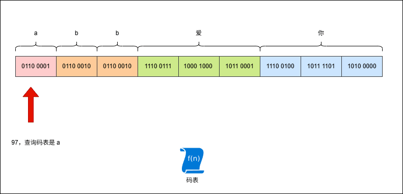


#### 如何解决乱码？

* 针对原因一的解决方案：不要使用字节流来读取文本。
* 针对原因二的解决方案：编码和解码使用同一个编码规则（编码方式）。


#### 扩展

* 【问】字节流读取中文会乱码，但是为什么拷贝文件不会乱码？

```java
package com.github.io;

import java.io.*;

public class Test {
    public static void main(String[] args) throws IOException {
        InputStream is = new FileInputStream("d:/a.txt");
        OutputStream os = new FileOutputStream("d:/b.txt");
        int b;
        while ((b = is.read()) != -1) {
            os.write(b);
        }
        os.close();
        is.close();
    }
}
```

* 【答】因为是一个字节一个字节拷贝的，数据并没有丢失。

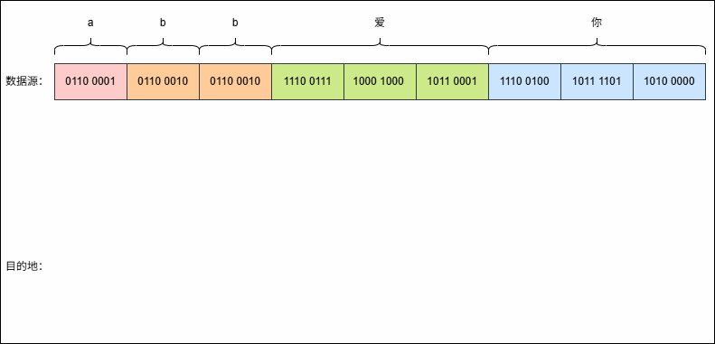


#### 扩展

* Java 提供了编码方法：

| String 类中的编码方法                          | 描述                                            |
| ---------------------------------------------- | ----------------------------------------------- |
| `public byte[] getBytes() {}`                  | 使用默认的方式进行编码（IDEA 中，默认是 UTF-8） |
| `public byte[] getBytes(Charset charset) {}`   | 使用指定的方式进行编码                          |
| `public byte[] getBytes(String charsetName){}` | 使用指定的方式进行编码                          |

* Java 提供了解码的方式：

| String 类中的解码方法                               | 描述                                            |
| --------------------------------------------------- | ----------------------------------------------- |
| `public String(byte[] bytes) {}`                    | 使用默认的方式进行解码（IDEA 中，默认是 UTF-8） |
| `public String(byte bytes[], Charset charset) {}`   | 使用指定的方式进行解码                          |
| `public String(byte bytes[], String charsetName){}` | 使用指定的方式进行解码                          |


* 示例：

```java
package com.github.io;

import java.io.IOException;
import java.util.Arrays;

public class Test {
    public static void main(String[] args) throws IOException {
        // 编码
        String str = "abb我爱你";
        byte[] bytes = str.getBytes();
        // [97, 98, 98, -26, -120, -111, -25, -120, -79, -28, -67, -96]
        System.out.println(Arrays.toString(bytes));

        // 解码
        String result = new String(bytes);
        // abb我爱你
        System.out.println(result);
    }
}
```


## 字节流


### FileInputStream

### 概述

```java
java.io.FileInputStream:
      1. 称为文件字节输入流。负责读。
          
      2. 是一个万能流，任何文件都能读。但还是建议读二进制文件。例如：图片，声音，视频等。
          
      3. 但是FileInputStream肯定也是可以读普通文本的。只不过一次读取一个字节。容易出现乱码问题。
          
      4. FileInputStream的常用构造方法：
          FileInputStream(String name) 通过文件路径构建一个文件字节输入流对象。
          
      5. FileInputStream的常用方法：
          int read(); 调用一次read()方法则读取一个字节，返回读到的字节本身。如果读不到任何数据则返回 -1
          int read(byte[] b); 一次最多可以读到b.length个字节(只要文件内容足够多)。返回值是读取到的字节数量。如果这一次没有读取到任何数据，则返回 -1
          int read(byte[] b, int off, int len); 一次读取len个字节。将读到的数据从byte数组的off位置开始放。
          void close() 关闭流
          long skip(long n); 跳过n个字节。
          int available(); 获取流中剩余的估计字节数。
```


### 常用方法

#### 一次读取一个字节

```java
 int read(); 调用一次read()方法则读取一个字节，返回读到的字节本身。如果读不到任何数据则返回 -1
```

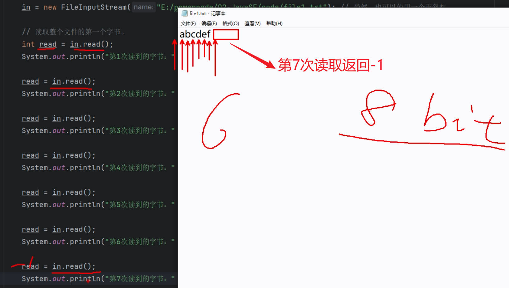

```java
package com.powernode.javase.io;

import java.io.FileInputStream;
import java.io.IOException;
import java.io.InputStream;

/**
1. FileInputStream的常用方法：
       int read(); 调用一次read()方法则读取一个字节，返回读到的字节本身。如果读不到任何数据则返回 -1
 */
public class FileInputStreamTest01 {
    public static void main(String[] args) {
        InputStream in = null;
        try {
            // in = new FileInputStream("D:\\0-JavaSE\\powernode-java\\file1.txt"); // 注意：这种写法需要两个反斜杠。
            in = new FileInputStream("D:/0-JavaSE/powernode-java/file1.txt"); // 当然，也可以使用一个正斜杠。


            // 读取整个文件的第一个字节。
            /*int read = in.read();
            System.out.println("第1次读到的字节：" + read); // 第1次读到的字节：97

            read = in.read();
            System.out.println("第2次读到的字节：" + read); // 第2次读到的字节：98

            read = in.read();
            System.out.println("第3次读到的字节：" + read); // 第3次读到的字节：99

            read = in.read();
            System.out.println("第4次读到的字节：" + read); // 第4次读到的字节：100

            read = in.read();
            System.out.println("第5次读到的字节：" + read); // 第5次读到的字节：101

            read = in.read();
            System.out.println("第6次读到的字节：" + read); // 第6次读到的字节：102

            read = in.read();
            System.out.println("第7次读到的字节：" + read); // 第7次读到的字节：-1*/

            // 第一次使用循环改进(死循环)
            /*while (true) {
                int readByte = in.read();
                if (readByte == -1) break;
                System.out.println(readByte);
                *//*
                97
                98
                99
                100
                101
                102
                 *//*
            }*/

            // 改进循环
            int readByte = 0;
            while ((readByte = in.read()) != -1) {
                System.out.println(readByte);
                /*
                97
                98
                99
                100
                101
                102*/
            }


        } catch (IOException e) {
            e.printStackTrace();
        }finally {
            // 关闭之前进行空处理
            if (in != null) {
                // 处理异常
                try {
                    in.close();
                } catch (IOException e) {
                    e.printStackTrace();
                }
            }

        }
    }
}
```


#### 读取-1的问题

```java
每个文件末尾都会有一个"结束标记",这个"结束标记"我们看不见,摸不着
    
而read()方法规定,如果读到了文件的结束标记,方法直接返回-1    
```


#### 一次读取一个字节数组

```java
int read(byte[] b); 一次最多可以读到b.length个字节(只要文件内容足够多)。返回值是读取到的字节数量。如果这一次没有读取到任何数据，则返回 -1
```

```java
package com.powernode.javase.io;

import java.io.FileInputStream;
import java.io.FileNotFoundException;
import java.io.IOException;

/**
 * 测试：int read(byte[] b); 一次最多可以读到b.length个字节(只要文件内容足够多)。返回值是读取到的字节数量。如果这一次没有读取到任何数据，则返回 -1
 */
public class FileInputStreamTest02 {
    public static void main(String[] args) {
        FileInputStream fis = null;

        try {
            fis = new FileInputStream("D:\\0-JavaSE\\powernode-java\\file1.txt");

            // 开始读
            // 提前准备一个byte[]数组(一次最多读取4个字节)
            byte[] bytes = new byte[4];

            // 第一次读
           /* int readCount = fis.read(bytes);
            System.out.println("第一次读取到的字节数量：" + readCount); // 第一次读取到的字节数量：4*/

            // 将byte数组转换成字符串
           /* String s1 = new String(bytes);
            System.out.println(s1); // abcd*/
           /* String s1 = new String(bytes, 0, readCount);
            System.out.println(s1); // abcd*/

            // 第二次读
           /* readCount = fis.read(bytes);
            System.out.println("第二次读取到的字节数量：" + readCount); // 第二次读取到的字节数量：2*/

            // 将byte数组转换成字符串
            /*String s2 = new String(bytes);
            System.out.println(s2); // efcd*/
           /* String s2 = new String(bytes, 0, readCount);
            System.out.println(s2); // ef*/

            // 第三次读
            /*readCount = fis.read(bytes);
            System.out.println("第三次读取到的字节数量：" + readCount); // 第三次读取到的字节数量：-1
*/
            // 第四次读
            /*readCount = fis.read(bytes);
            System.out.println("第四次读取到的字节数量：" + readCount); // 第四次读取到的字节数量：-1*/

            // 循环
            /*while(true){
                int readCount = fis.read(bytes);
                if(readCount==-1) break;
                String s = new String(bytes,0,readCount);
                System.out.print(s); // abcdef
            }*/

            // 优化循环
            int readCount = 0;
            while ((readCount = fis.read(bytes)) != -1) {
                System.out.print(new String(bytes, 0, readCount)); // abcdef
            }


        } catch (FileNotFoundException e) {
            e.printStackTrace();
        }catch (IOException e){
            e.printStackTrace();
        }
        finally {
            if (fis != null) {
                try {
                    fis.close();
                } catch (IOException e) {
                    e.printStackTrace();
                }
            }
        }
    }
}
```


#### 一次读取字节数组一部分

```java
int read(byte[] b, int off, int len);
         b:写的数组
         off:从数组的哪个索引开始写
         len:写多少个
一次读取len个字节。将读到的数据从byte数组的off位置开始放。
    
long skip(long n); 跳过n个字节。
    
int available(); 获取流中剩余的估计字节数。
```

```java
package com.powernode.javase.io;

import java.io.FileInputStream;
import java.io.FileNotFoundException;
import java.io.IOException;

/**
 * 测试：
 * int read(byte[] b, int off, int len); 一次读取len个字节。将读到的数据从byte数组的off位置开始放。
 * long skip(long n); 跳过n个字节。
 * int available(); 获取流中剩余的估计字节数。
 */
public class FileInputStreamTest03 {
    public static void main(String[] args) {
        FileInputStream fis = null;

        try {
            fis = new FileInputStream("D:\\0-JavaSE\\powernode-java\\file1.txt");

            /*byte[] bytes = new byte[10];

            int readCount = fis.read(bytes, 2, 5);
            System.out.println("读取到了多少个字节：" + readCount); // 读取到了多少个字节：5

            // 遍历
            for (byte b : bytes) {
                System.out.println(b);
                *//*
                0
                0
                97
                98
                99
                100
                101
                0
                0
                0
                 *//*
            }*/

           /* int readByte = fis.read();
            System.out.println(readByte); // 97*/

            // 跳过两个
            fis.skip(2);

            readByte = fis.read();
            System.out.println(readByte); // 100

            System.out.println("还剩几个字节没有读取？" + fis.available()); // 还剩几个字节没有读取？2

            // 简化步骤
            byte[] bytes = new byte[fis.available()];
            int readCount = fis.read(bytes);
            System.out.println(new String(bytes, 0, readCount)); // abcdef

        } catch (FileNotFoundException e) {
            throw new RuntimeException(e);
        } catch (IOException e) {
            throw new RuntimeException(e);
        } finally {
            if (fis != null) {
                try {
                    fis.close();
                } catch (IOException e) {
                    e.printStackTrace();
                }
            }
        }
    }
}
```


### FileOutputStream

#### 概述

```java
java.io.FileOutputStream
1. 文件字节输出流，负责写。

2. 常用构造方法：

FileOutputStream(String name)
	创建一个文件字节输出流对象，这个流在使用的时候，最开始会将原文件内容全部清空，然后写入。
         
FileOutputStream(String name, boolean append)
	创建一个文件字节输出流对象，当append是true的时候，不会清空原文件的内容，在原文件的末尾追加写入。
	创建一个文件字节输出流对象，当append是false的时候，会清空原文件的内容，然后写入。

注意：
	append==true表示：不会清空原文件内容，在原文件内容后面追加。
	append==false表示：清空原文件内容，在文件中写入。

3. 常用方法：
	void close();
	void flush();
	void write(int b); 写一个字节
	void write(byte[] b); 将整个byte字节数组写出
	void write(byte[] b, int off, int len) 将byte字节数组的一部分写出。
```


### 常用构造方法

```java
常用构造方法：

FileOutputStream(String name)
	创建一个文件字节输出流对象，这个流在使用的时候，最开始会将原文件内容全部清空，然后写入。
         
FileOutputStream(String name, boolean append)
	创建一个文件字节输出流对象，当append是true的时候，不会清空原文件的内容，在原文件的末尾追加写入。
	创建一个文件字节输出流对象，当append是false的时候，会清空原文件的内容，然后写入。
```


#### append==true

```java
append==true表示：不会清空原文件内容，在原文件内容后面追加。
(out = new FileOutputStream("E:\\powernode\\02-JavaSE\\code\\file2.txt", true);)
```

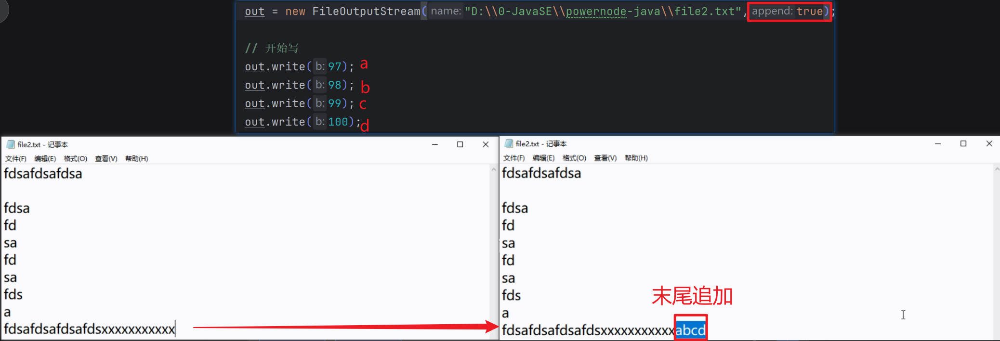


#### append==false

```java
append==false表示：清空原文件内容，在文件中写入。
(以下两行代码一样:
out = new FileOutputStream("E:\\powernode\\02-JavaSE\\code\\file2.txt");
out = new FileOutputStream("E:\\powernode\\02-JavaSE\\code\\file2.txt", false);)
```

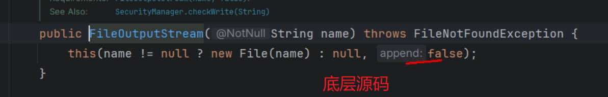

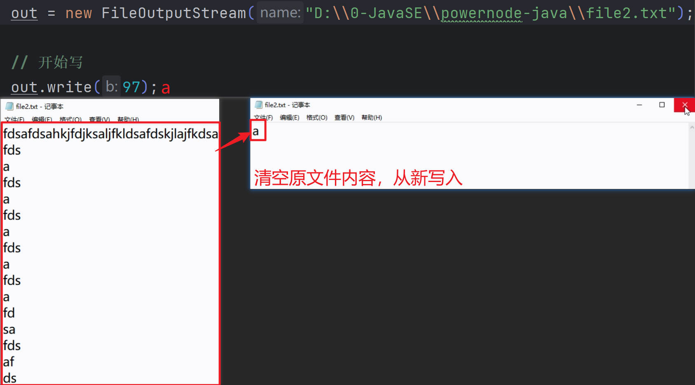


### 常用方法

```java
常用方法：
	void close();
	void flush();
	void write(int b); 写一个字节
	void write(byte[] b); 将整个byte字节数组写出
	void write(byte[] b, int off, int len) 将byte字节数组的一部分写出。
```

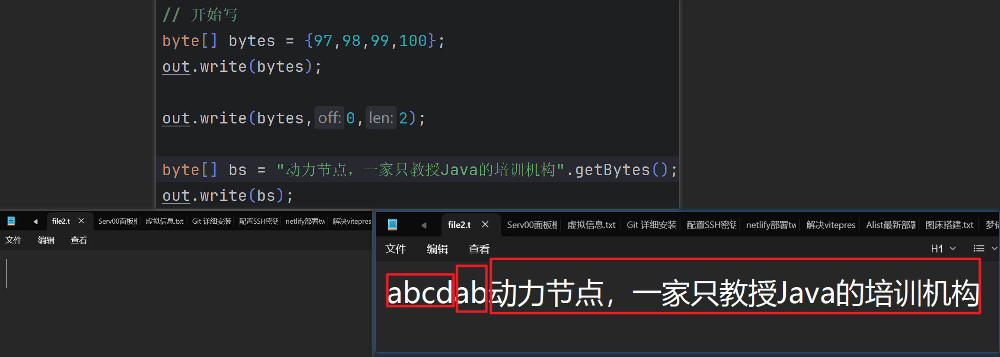

> **测试示例：**
>
> ```java
> package com.powernode.javase.io;
> 
> import java.io.FileNotFoundException;
> import java.io.FileOutputStream;
> import java.io.IOException;
> 
> public class FileOutputStreamTest01 {
>     public static void main(String[] args) {
>         // 创建文件字节输出流对象
>         FileOutputStream out = null;
>         try {
>             // out = new FileOutputStream("D:\\0-JavaSE\\powernode-java\\file2.txt", true);
> 
>             // 以下两行代码一样。
>             /*out = new FileOutputStream("E:\\powernode\\02-JavaSE\\code\\file2.txt");
>             out = new FileOutputStream("E:\\powernode\\02-JavaSE\\code\\file2.txt", false);*/
> 
>             out = new FileOutputStream("D:\\0-JavaSE\\powernode-java\\file2.txt");
> 
>             // 开始写
>             /*out.write(97);
>             out.write(98);
>             out.write(99);
>             out.write(100);*/
> 
>             // 开始写
>             byte[] bytes = {97,98,99,100};
>             out.write(bytes); // abcd
> 
>             out.write(bytes,0,2); // ab
> 
>             byte[] bs = "动力节点，一家只教授Java的培训机构".getBytes();
>             out.write(bs); // 动力节点，一家只教授Java的培训机构
> 
>             // 记着刷新
>             out.flush();
>         } catch (FileNotFoundException e) {
>             throw  new RuntimeException(e);
>         }catch (IOException e) {
>             throw  new RuntimeException(e);
>         }finally {
>             // 关闭资源
>             if (out != null) {
>                 try {
>                     out.close();
>                 } catch (IOException e) {
>                     throw new RuntimeException(e);
>                 }
>             }
>         }
>     }
> }
> ```


### 字节流完成文件的复制


#### 分析


#### 实现

```java
package com.powernode.javase.io;

import java.io.FileInputStream;
import java.io.FileNotFoundException;
import java.io.FileOutputStream;
import java.io.IOException;

/**
 * 文件拷贝，实现原理：
 * 使用FileInputStream读文件，使用FileOutputStream写文件。
 * 一边读一边写。
 */
public class FileInputOutputStreamCopy {
    public static void main(String[] args) {
        // 输入流
        FileInputStream in = null;
        // 输出流
        FileOutputStream out = null;

        try {
            in = new FileInputStream("D:\\0-JavaSE\\powernode-java\\文件一\\Maven.png");
            out = new FileOutputStream("D:\\0-JavaSE\\powernode-java\\文件二\\Maven.png");


            // 一次至少拷贝1KB
            byte[] bytes = new byte[1024];
            // 边读边写
            int readCount = 0;
            while ((readCount = in.read(bytes)) != -1) {
                out.write(bytes, 0, readCount);
            }

            // 刷新
            out.flush();
        } catch (FileNotFoundException e) {
            throw new RuntimeException(e);
        } catch (IOException e) {
            throw new RuntimeException(e);
        } finally {
            // 关闭（分别try..catch..）
            if (in != null) {
                try {
                    in.close();
                } catch (IOException e) {
                    throw new RuntimeException(e);
                }
            }
            if (out != null) {
                try {
                    out.close();
                } catch (IOException e) {
                    throw new RuntimeException(e);
                }
            }
        }
    }
}
```

> **测试效果：**
>
> `图片原始位置：`
>
> 
>
> `图片复制目标位置：`
>
> 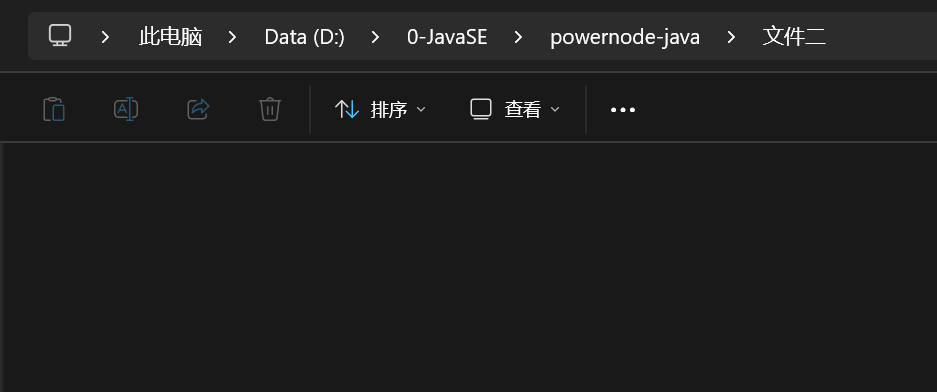
>
> **程序运行后图片复制目标位置：**
>
> 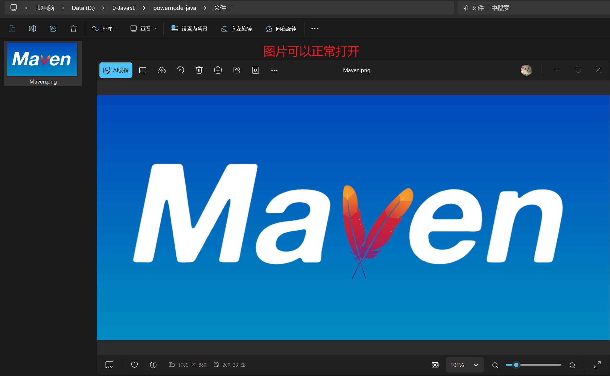


## Java7的新特性：try-with-resources(io异常处理方式,资源自动关闭)

```java
Java7的新特性：try-with-resources(资源自动关闭)
凡是实现了AutoCloseable接口的流都可以使用try-with-resources。都会自动关闭

try-with-resources语法格式：
         try(
             声明流;
             声明流;
             声明流;
             声明流;
             声明流;
        ){
             
	   }catch(Exception e){
        
       }
```

> **示例1:**

```java
package com.powernode.javase.io;

import java.io.FileInputStream;
import java.io.FileNotFoundException;
import java.io.FileOutputStream;
import java.io.IOException;

public class TryWithResources {
    public static void main(String[] args) {
        // 测试try-with-resources语法
        FileInputStream in2 = null;
        try(FileInputStream in = new FileInputStream("D:\\0-JavaSE\\powernode-java\\file1.txt")){

            in2 = in;
        } catch (FileNotFoundException e) {
            throw new RuntimeException(e);
        } catch (IOException e) {
            throw new RuntimeException(e);
        }

        try {
            System.out.println(in2.read());
        } catch (IOException e) {
            e.printStackTrace();
        }
    }
}
```

> **测试：**
>
> 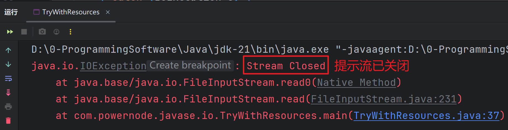


> **示例2：**

```java
package com.powernode.javase.io;

import java.io.FileInputStream;
import java.io.FileNotFoundException;
import java.io.FileOutputStream;
import java.io.IOException;

public class TryWithResources {
    public static void main(String[] args) {
        // 测试try-with-resources语法
        try(FileInputStream in = new FileInputStream("D:\\0-JavaSE\\powernode-java\\file1.txt");
            FileOutputStream out = new FileOutputStream("D:\\0-JavaSE\\powernode-java\\文件二\\file1.txt")){

            byte[] bytes = new byte[1024];
            int readCount = 0;
            while ((readCount = in.read(bytes)) != -1) {
                out.write(bytes, 0, readCount);
            }

        }catch (FileNotFoundException e){
            throw new  RuntimeException(e);
        }catch (IOException e){
            throw new  RuntimeException(e);
        }
    }
}
```

> **测试：**
>
> 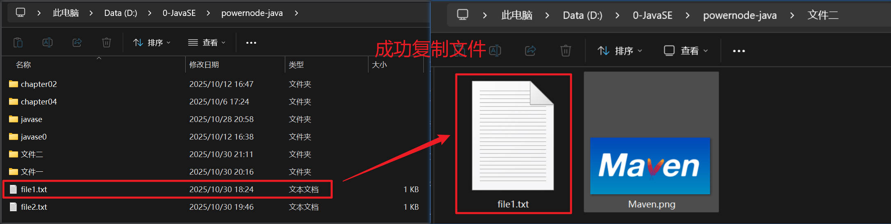


## 字符流


### 字节流读取中文的问题

```java
1.注意:
  字节流是万能流,更侧重于文件复制,但是尽量不要边读边看
      
2.原因:
  UTF-8:一个汉字占3个字节
  GBK:一个中文占2个字节
      
  如果按照字节读取,每次读取的字节没有构成一个汉字的字节数,就直接输出,汉字是显示不了的
      
3.解决: 
  将文本文档中的内容,按照字符去操作
```

> **话说回来:**
>
> 1.**按照字符去操作编码也要一致,如果不一致,照样会乱码**
>
> 2.**按照字节流去操作即使编码一致,边读边看,也有可能乱码**


### FileReader

> **字符流`专门操作文本文档的`,但是`复制操作`不要用`字符流`,要用`字节流`**

```java
1.概述:字符输入流 -> Reader -> 是一个抽象类
      子类:FileReader
2.作用:将文本文档中的内容读取到内存中来
3.构造:
  FileReader(File file)
  FileReader(String fileName)
4.方法:
  int read() -> 一次读取一个字符,返回的是读取字符对应的int值 
  int read(char[] cbuf) -> 一次读取一个字符数组,返回的是读取个数  
  int read(char[] cbuf, int off, int len) -> 一次读取一个字符数组一部分,返回的是读取个数
           cbuf:读取的数组
           off:从数组的哪个索引开始读
           len:读多少个
  void close() -> 关闭资源 
  long skip(long n); 跳过n个字节
```

```java
package com.powernode.javase.io;

import java.io.FileNotFoundException;
import java.io.FileReader;
import java.io.IOException;

/**
 * 文件字符输入流。读。以字符的形式读文件。一次至少读取一个完整的字符。
 */
public class FileReaderTest01 {
    public static void main(String[] args) {
        try(FileReader reader = new FileReader("D:\\0-JavaSE\\powernode-java\\file1.txt")){

            // 开始读
            char[] chars = new char[3];
            int readCount = 0;
            while((readCount = reader.read(chars)) != -1){
                System.out.print(new String(chars,0,readCount)); // abcdef
            }

        } catch (FileNotFoundException e) {
            throw new RuntimeException(e);
        } catch (IOException e) {
            throw new RuntimeException(e);
        }
    }
}
```


### FileWriter

```java
1.概述:字符输出流 -> Writer -> 抽象类
  子类:FileWriter
2.作用:将数据写到文件中
3.构造:
  FileWriter(File file) 
  FileWriter(String fileName)     
  FileWriter(String fileName, boolean append) -> 追加,续写 
4.方法:
  void write(int c) -> 一次写一个字符 
  void write(char[] cbuf) 一次写一个字符数组 
  void write(char[] cbuf, int off, int len) 一次写一个字符数组一部分  
  void write(String str) 直接写一个字符串
  void write(String str, int off, int len); 一次写一个字符数组一部分
  void flush()  将缓冲区中的数据刷到文件中 // 将缓冲区中的数据刷到文件中,后续流对象还能继续使用    
  void close()  关流 // 先刷新后关闭,后续流对象不能使用了  
  Writer append(CharSequence csq, int start, int end) -> 追加,续写
      
5.注意:FileWriterr底层自带一个缓冲区,我们写的数据会先保存到缓冲区中,所以我们需要将缓冲区中的数据刷到文件中
```

```java
package com.powernode.javase.io;

import java.io.FileWriter;
import java.io.IOException;

/**
 * 文件字符输出流。写。（写普通文本用的。）
 */
public class FileWriterTest01 {
    public static void main(String[] args) {
        try(FileWriter writer = new FileWriter("D:\\0-JavaSE\\powernode-java\\file3.txt")){
            // 开始写
            writer.write("hello world");
            writer.append("\n");
            writer.write("张三李四王五赵六",2,2);
            writer.append("\n");
            writer.write("张三李四王五".toCharArray());
            writer.append("\n");
            writer.write("张三李四王五".toCharArray(),2,2);
            writer.append("\n");

            writer.append("a");
            writer.append("b");
            writer.append("c");
            writer.append("d");


            // 建议手动刷新
            writer.flush();
        } catch (IOException e) {
            throw new RuntimeException(e);
        }
    }
}
```

> **测试:**
>
> 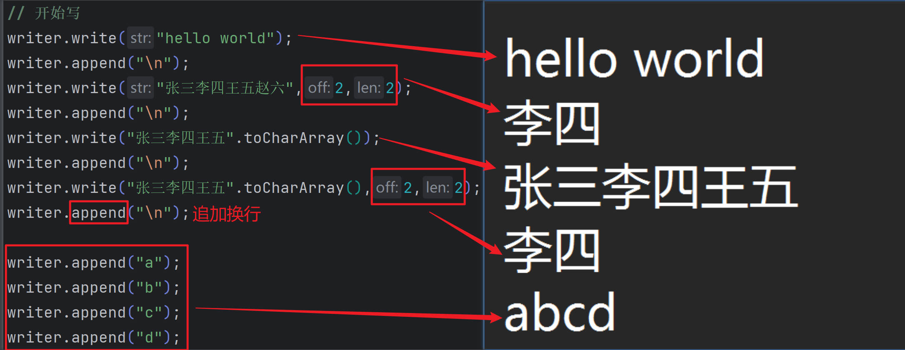


### 字符流完成文件的复制(普通文本文件)

> **提示：使用文件字符输入输出流进行文件复制，但是这种方式`只能复制普通文本文件`。**
>
> 
>
> **注意:复制非文本文件以外的`文件将无法正常打开`**

#### 分析

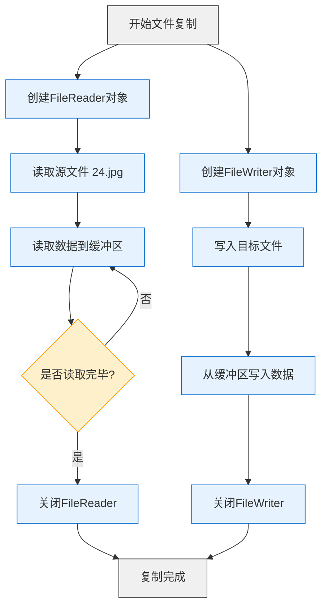
```mermaid
graph TD
    A[开始文件复制] --> B[创建FileReader对象]
    A --> C[创建FileWriter对象]
    
    B --> D[读取源文件 24.jpg]
    C --> E[写入目标文件]
    
    D --> F[读取数据到缓冲区]
    E --> G[从缓冲区写入数据]
    
    F --> H{是否读取完毕?}
    H -->|否| F
    H -->|是| I[关闭FileReader]
    
    G --> J[关闭FileWriter]
    
    I --> K[复制完成]
    J --> K
    
    %% 样式匹配图片风格
    classDef box fill:#f0f0f0,stroke:#333,stroke-width:1px
    classDef process fill:#e6f3ff,stroke:#0066cc,stroke-width:1px
    classDef decision fill:#fff0cc,stroke:#ff9900,stroke-width:1px
    
    class A,B,C,D,E,F,G,H,I,J,K box
    class B,C,D,E,F,G,I,J process
    class H decision
```


#### 实现

```java
package com.powernode.javase.io;

import java.io.FileNotFoundException;
import java.io.FileReader;
import java.io.FileWriter;
import java.io.IOException;

/**
 * 使用文件字符输入输出流进行文件复制，但是这种方式只能复制普通文本文件。
 */
public class FileReaderFileWriterCopy {
    public static void main(String[] args) {
        try(FileReader reader = new FileReader("D:\\0-JavaSE\\powernode-java\\file3.txt");
            FileWriter writer = new FileWriter("D:\\0-JavaSE\\powernode-java\\文件二\\file3.txt")){

            // 一边读一边写
            char[] chars = new char[3];
            int readCount = 0;
            while ((readCount = reader.read(chars)) != -1) {
                writer.write(chars, 0, readCount);
            }

            // 刷新
            writer.flush();
        } catch (FileNotFoundException e) {
            throw new RuntimeException(e);
        } catch (IOException e) {
            throw new RuntimeException(e);
        }
    }
}
```

> **测试:**
>
> 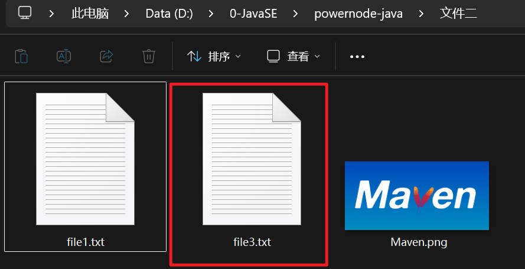


## 文件的路径问题

```java
package com.powernode.javase.io;

import java.io.FileInputStream;
import java.io.IOException;

/**
 * 关于IO流中读写文件时，文件的路径问题。
 */
public class AboutFilePath {
    public static void main(String[] args)throws IOException {
       FileInputStream in = new FileInputStream("D:\\0-JavaSE\\powernode-java\\file1.txt"); // 注意：这种写法需要两个反斜杠。
       FileInputStream in = new FileInputStream("D:/0-JavaSE/powernode-java/file1.txt"); // 当然，也可以使用一个正斜杠。


        // 我们尝试使用相对路径
        // 相对路径一定要搞清楚当前路径是哪里？相对路径一定是从当前所在的路径开始。
        // 在IDEA工具中，默认的当前路径是 project 的根。（项目的根就是当前路径）
        FileInputStream in = new  FileInputStream("log");


        // 读log2文件
        FileInputStream in = new FileInputStream("chapter08/src/log2");


        // 新的内容
        // 以下讲解内容有一些代码是和线程有关系的。大致理解一下。
        // 或者说这个代码死记硬背也是可以的。
        // 从类路径当中加载资源。
        // Thread.currentThread() 获取当前线程
        // Thread.currentThread().getContextClassLoader() 获取当前线程的类加载器
        // getResource()方法就表示从类的根路径下开始加载资源
        // 注意：这种方式只能从类路径当中加载资源。如果这个资源是放在类路径之外的，这种方式不合适。
        // 如果你代码是以下这种写法的，表示当前路径就是类的根路径。自动从类的根路径下开始加载资源。
        // 这种方式的优点：通用，在进行系统移植的时候，这种方式仍然是通用的。适应性强。
        // 这种方式的缺点：资源必须放在类路径当中。没有在类路径下，是无法加载到的。
        String path = Thread.currentThread().getContextClassLoader().getResource("test/file").getPath();
        System.out.println(path);

        FileInputStream in = new FileInputStream(path);
    }
}
```


## 缓冲流

### 概述

* 缓冲流就是对基本流进行了一层封装，额外增加了一些新的功能，如：基本流操作效率太慢，给它们增加缓冲区。

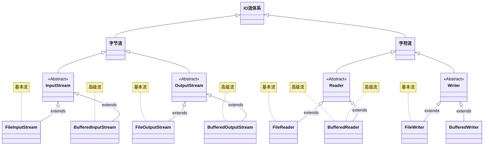
```mermaid
classDiagram
    IO 流体系 <|-- 字节流 
    IO 流体系 <|-- 字符流 
    字节流 <|-- InputStream 
    字节流 <|-- OutputStream 
    字符流 <|-- Reader 
    字符流 <|-- Writer 
    InputStream <|-- FileInputStream :extends
    note for FileInputStream "基本流" 
    InputStream <|-- BufferedInputStream :extends
    note for BufferedInputStream "高级流" 
    OutputStream <|-- FileOutputStream :extends
    note for FileOutputStream "基本流" 
    OutputStream <|-- BufferedOutputStream :extends
    note for BufferedOutputStream "高级流" 
    Reader <|-- FileReader :extends
    note for FileReader "基本流" 
    Reader <|-- BufferedReader :extends
    note for BufferedReader "高级流"
    Writer <|-- FileWriter :extends
    note for FileWriter "基本流" 
    Writer <|-- BufferedWriter :extends
    note for BufferedReader "高级流"
    class InputStream{
        <<Abstract>>
    }
    class OutputStream{
        <<Abstract>>
    }
    class Reader{
        <<Abstract>>
    }
    class Writer{
        <<Abstract>>
    }

```

* `字节流`的`基本流`是没有缓冲区的，而`字节流`的`缓冲流`提供了缓冲区，所以效率提升的很明显。
* `字符流`的`基本流`本来就有缓冲区，所以`字符流`的`缓冲流`的效率提升的并不是很明显；但是，字符流的缓冲流提供了几个好用的方法。

```java
1. BufferedInputStream、BufferedOutputStream（适合读写非普通文本文件）

2. BufferedReader、BufferedWriter（适合读写普通文本文件。）

3. 缓冲流的读写速度快，原理是：在内存中准备了一个缓存。读的时候从缓存中读。写的时候将缓存中的数据一次写出。都是在减少和磁盘的交互次数。如何理解缓冲区？家里盖房子，有一堆砖头要搬在工地100米外，单字节的读取就好比你一个人每次搬一块砖头，从堆砖头的地方搬到工地，这样肯定效率低下。然而聪明的人类会用小推车，每次先搬砖头搬到小车上，再利用小推车运到工地上去，这样你再从小推车上取砖头是不是方便多了呀！这样效率就会大大提高，缓冲流就好比我们的小推车，给数据暂时提供一个可存放的空间。
    
4.缓冲流都是处理流/包装流。FileInputStream/FileOutputStream是节点流。

5.关闭流只需要关闭最外层的处理流即可，通过源码就可以看到，当关闭处理流时，底层节点流也会关闭。
    
6. 输出效率是如何提高的？
    在缓冲区中先将字符数据存储起来，当缓冲区达到一定大小或者需要刷新缓冲区时，再将数据一次性输出到目标设备。

7. 输入效率是如何提高的？ 
    read()方法从缓冲区中读取数据。当缓冲区中的数据不足时，它会自动从底层输入流中读取一定大小的数据，并将数据存储到缓冲区中。大部分情况下，我们调用read()方法时，都是从缓冲区中读取，而不需要和硬盘交互。
    
8. 可以编写拷贝的程序测试一下缓冲流的效率是否提高了！
    
9. 缓冲流的特有方法（输入流）：以下两个方法的作用是允许我们在读取数据流时回退到原来的位置（重复读取数据时用）

    void mark(int readAheadLimit); 标记位置（在Java21版本中，参数无意义。低版本JDK中参数表示在标记处最多可以读取的字符数量，如果你读取的字符数超出的上限值，则调用reset()方法时出现IOException。）

    void reset(); 重新回到上一次标记的位置

    这两个方法有先后顺序：先mark再reset，另外这两个方法不是在所有流中都能用。有些流中有这个方法，但是不能用。
```


### 字节缓冲流


#### BufferedInputStream

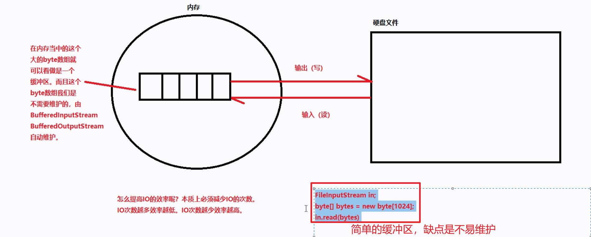

```java
1. java.io.BufferedInputStream的用法和FileInputStream用法相同。

2. 他们的不同点是：
     FileInputStream是节点流。
     BufferedInputStream是缓冲流(包装流/处理流)。这个流的效率高。自带缓冲区。并且自己维护这个缓冲区。读大文件的时候建议采用这个缓冲流来读取。

3. BufferedInputStream对 FileInputStream 进行了功能增强。增加了一个缓冲区的功能。

4. 怎么创建一个BufferedInputStream对象呢？构造方法：
      BufferedInputStream(InputStream in)
```

```java
package com.powernode.javase.io;

import java.io.BufferedInputStream;
import java.io.FileInputStream;
import java.io.IOException;

public class BufferedInputStreamTest01 {
    public static void main(String[] args) {
        BufferedInputStream bis = null;
        try {
            // 创建节点流
            //FileInputStream in = new FileInputStream("file.txt");
            // 创建包装流
            //bis = new BufferedInputStream(in);

            // 组合起来写
            bis = new BufferedInputStream(new FileInputStream("D:\\0-JavaSE\\powernode-java\\file3.txt"));

            // 读，和FileInputStream用法完全相同
            byte[] bytes = new byte[1024];
            int readCount = 0;
            while ((readCount = bis.read(bytes)) != -1) {
                System.out.println(new String(bytes, 0, readCount));
            }

        } catch (Exception e) {
            e.printStackTrace();
        }finally {
            // 包装流以及节点流，你只需要关闭最外层的那个包装流即可。节点流不需要手动关闭。
            if (bis != null) {
                try {
                    bis.close();
                } catch (IOException e) {
                    e.printStackTrace();
                }
            }
        }
    }
}
```

> **测试:**
>
> 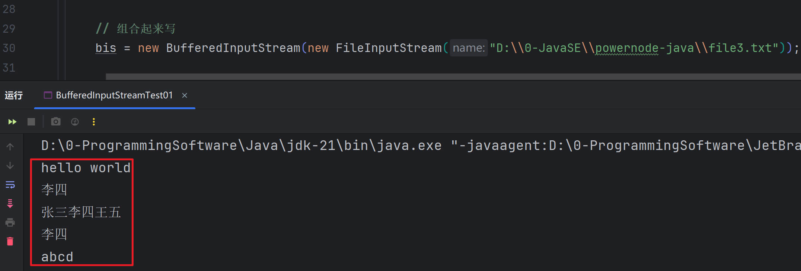


#### BufferedOutputStream

```java
1. java.io.BufferedOutputStream也是一个缓冲流。属于输出流。
    
2. 怎么创建BufferedOutputStream对象？
     BufferedOutputStream(OutputStream out)
    
3. FileOutputStream是节点流。 BufferedOutputStream是包装流。
```

```java
package com.powernode.javase.io;

import java.io.BufferedOutputStream;
import java.io.FileOutputStream;
import java.io.IOException;

public class BufferedOutputStreamTest01 {
    public static void main(String[] args) {
        BufferedOutputStream bos = null;
        try {
            bos = new BufferedOutputStream(new FileOutputStream("D:\\0-JavaSE\\powernode-java\\file3.txt"));

            bos.write("动力节点".getBytes());

            // 缓冲流需要手动刷新。
            bos.flush();
        } catch (Exception e) {
            e.printStackTrace();
        }finally {
            if (bos != null) {
                try {
                    // 只需要关闭最外层的包装流即可。
                    bos.close();
                } catch (IOException e) {
                    e.printStackTrace();
                }
            }
        }
    }
}
```

> **测试:**
>
> 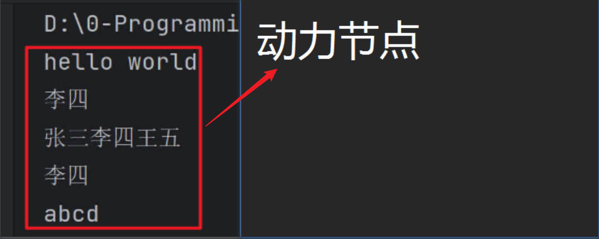


#### 字节缓冲流完成文件的复制

```java
package com.powernode.javase.io;

import java.io.*;

/**
 * 使用BufferedInputStream BufferedOutputStream完成文件的复制。
 */
public class BufferedInputOutputStreamCopy {
    public static void main(String[] args) {

        long begin = System.currentTimeMillis();

        try (BufferedInputStream bis = new BufferedInputStream(new FileInputStream("D:\\0-JavaSE\\powernode-java\\文件一\\Maven.png"));
             BufferedOutputStream bos = new BufferedOutputStream(new FileOutputStream("D:\\0-JavaSE\\powernode-java\\文件二\\Maven.png"))) {

            // 一边读一边写
            byte[] bytes = new byte[1024];
            int readCount = 0;
            while ((readCount = bis.read(bytes)) != -1) {
                bos.write(bytes, 0, readCount);
            }

            // 手动刷新
            bos.flush();
        } catch (FileNotFoundException e) {
            throw new RuntimeException(e);
        } catch (IOException e) {
            throw new RuntimeException(e);
        }

        long end = System.currentTimeMillis();
        System.out.println("带有缓冲区的拷贝耗时"+(end - begin)+"毫秒"); // 5毫秒
    }
}
```

> **测试:**
>
> 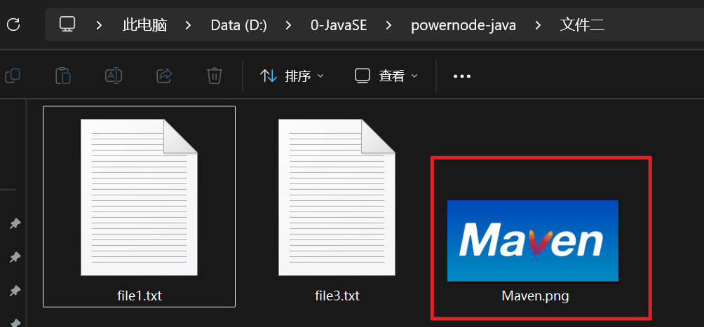


### 字符缓冲流


#### BufferedReader

```java
package com.powernode.javase.io;

import java.io.BufferedReader;
import java.io.FileReader;

/**
 * 带有缓冲区的字符输入流。
 */
public class BufferedReaderTest01 {
    public static void main(String[] args) throws Exception {

        // BufferedWriter bw = new BufferedWriter(new FileWriter(""));

        // 创建带有缓冲区的字符输入流对象
        BufferedReader br = new BufferedReader(new FileReader("D:\\0-JavaSE\\powernode-java\\file3.txt"));

        // 开始读（br.readLine()方法每次读取一行，如果读取不到任何数据，则返回null。）
        String s = null;
        while ((s = br.readLine()) != null) {
            System.out.println(s); // 动力节点
        }

        br.close();
    }
}
```

> **测试:**
>
> 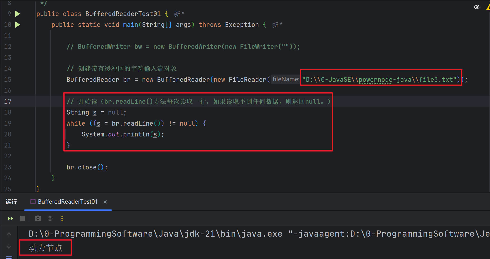


##### 缓冲流(输入流)特有方法

```java
BufferedReader/BufferedInputStream的两个方法：
      1. mark方法：在当前的位置上打标记
      2. reset方法：回到上一次打标记的位置
    
这两个方法的调用顺序是：
     1. 先调用mark，再调用reset。
     2. 这两个方法组合起来完成的任务是：某段内容重复读取。
```

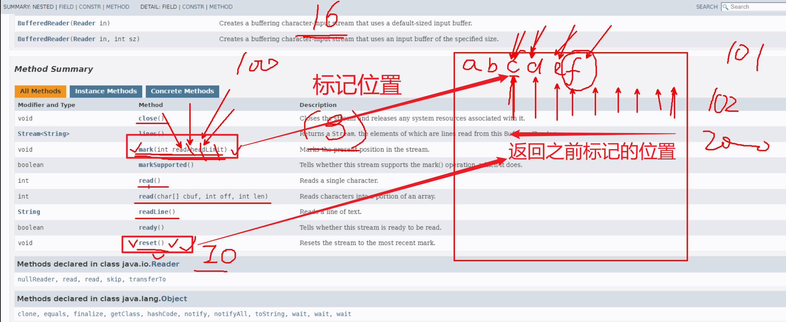

```java
package com.powernode.javase.io;

import java.io.BufferedReader;
import java.io.FileReader;

/**
 * BufferedReader/BufferedInputStream的两个方法：
 *      1. mark方法：在当前的位置上打标记
 *      2. reset方法：回到上一次打标记的位置
 *
 *      这两个方法的调用顺序是：
 *          先调用mark，再调用reset。
 *      这两个方法组合起来完成的任务是：某段内容重复读取。
 */
public class BufferedReaderMarkTest {
    public static void main(String[] args) throws Exception {
        // 创建文件字符输入流（这个看起来像节点流，其实不是，为什么？一会再说！！！！）
        //FileReader reader = new FileReader("E:\\powernode\\02-JavaSE\\code\\file1.txt");
        // 创建带有缓冲区的字符输入流（一般把BufferedReader叫做处理流/包装流）
        //BufferedReader br = new BufferedReader(reader);

        BufferedReader br = new BufferedReader(new FileReader("D:\\0-JavaSE\\powernode-java\\file1.txt"));

        // 开始读
        System.out.println(br.read()); // 97
        System.out.println(br.read()); // 98
        System.out.println(br.read()); // 99

        // 标记
        br.mark(3);

        System.out.println(br.read()); // 100
        System.out.println(br.read()); // 101

        // 回到上一次打标记的位置上
        br.reset();

        // 重新读刚才的内容
        System.out.println(br.read()); // 100
        System.out.println(br.read()); // 101

        // 再次回到上一次打标记的位置上
        br.reset();

        System.out.println(br.read()); // 100
        System.out.println(br.read()); // 101

        // 关闭流
        br.close();
    }
}
```

> **测试:**
>
> 


## 转换流


### 概述

* `转换流`也是一种`高级流`，其是用来包装基本流的，并且转换流也有输入和输出之分。

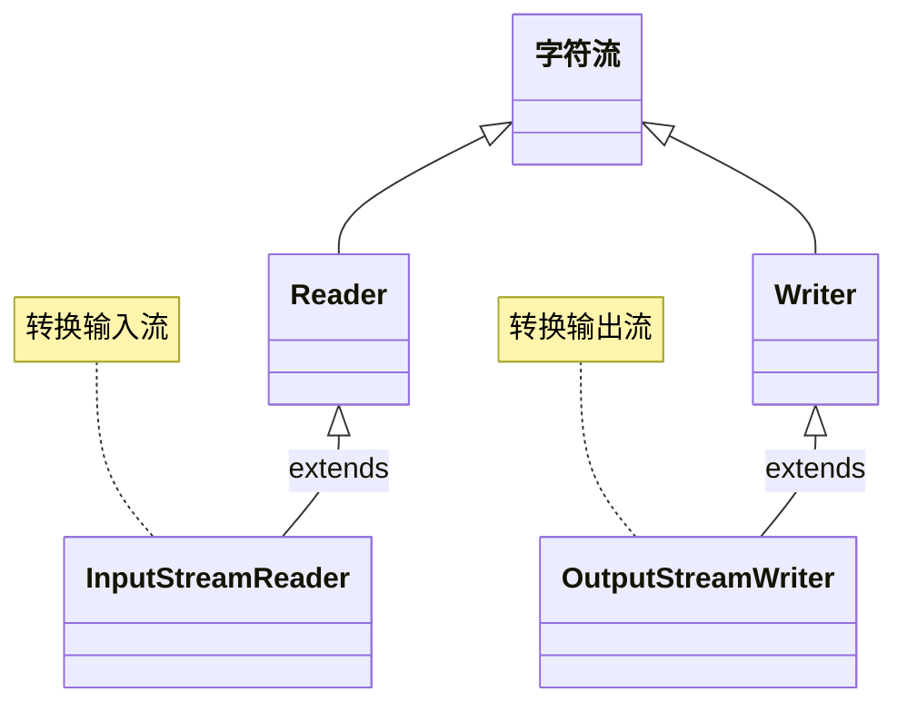
```mermaid
classDiagram
    字符流 <|-- Reader
    字符流 <|-- Writer
    Reader <|-- InputStreamReader :extends
    note for InputStreamReader "转换输入流"
    Writer <|-- OutputStreamWriter :extends
    note for OutputStreamWriter "转换输出流"
```

* 当我们创建转换流对象用来读取数据时，如下所示：

```java
InputStreamReader reader = new InputStreamReader(new FileInputStream("?"));
```

* 其底层是将字节输入流转换为字符输入流（解码）。

> [!NOTE]
>
> * ① 读取数据不会乱码。
> * ② 可以根据指定的字符集一次读取多个字节。


* 当我们创建转换流对象用来写出数据时，如下所示：

```java
OutputStreamWriter writer = new OutputStreamWriter(new FileOutputStream("?"));
```

* 其底层是将字符输出流转换为字节输出流（编码）。

> [!NOTE]
>
> * ① 写出数据不会乱码。
> * ② 可以根据指定的字符集一次写出多个字节。


* 其实，字符流的基本流 FileReader 和 FileWriter 的底层就是转换流：

```java [FileReader.java]
public class FileReader extends InputStreamReader {
    ...
}
```

```java [FileWriter.java]
public class FileWriter extends OutputStreamWriter {
    ...
}
```


### 应用场景

* 转换流的应用场景：
  * ① 指定字符集进行读写。
  * ② 字节流想要使用字符流中的方法。

> [!NOTE]
>
> 转化流的作用已经不是那么重要了，有如下的几个方面：
>
> * ① 在实际开发中，我们会统一使用 UTF-8 编码来进行开发，如：Tomcat（早期有过一段时间使用 ISO8859-1 编码；但是，现在都统一为 UTF-8 编码）、SpringBoot 等。
> * ② 在 JDK11 的时候，FileReader 和 FileWriter 也增加了指定字符集来进行读写的功能。
> * ③ 在 JDK18 的时候，FileReader 和 FileWriter 不再使用本地字符集（Windows 简体中文，默认是 GBK）来进行读写，而统一采取 UTF-8 来进行读写。


### InputStreamReader（主要解决读的乱码问题）

```java
1.使用InputStreamReader时，可以指定解码的字符集。用来解决读过程中的乱码问题。
 	InputStreamReader是一个字符流。是一个转换流。
 	InputStreamReader是一个输入的过程。
 	InputStreamReader是一个解码的过程。
 
2.InputStreamReader常用的构造方法：
       InputStreamReader(InputStream in) 采用平台默认的字符集进行解码。
       InputStreamReader(InputStream in, String charsetName) 采用指定的字符集进行解码。
    
3. FileReader实际上是InputStreamReader的子类。
    
Reader reader = new InputStreamReader(new FileInputStream(“file.txt”)); //采用平台默认字符集
Reader reader = new FileReader(“file.txt”); //采用平台默认字符集
因此FileReader的出现简化了代码的编写。

以下代码本质上也是一样的：
Reader reader = new InputStreamReader(new FileInputStream(“file.txt”), “GBK”);
Reader reader = new FileReader("e:/file1.txt", Charset.forName("GBK"));
    
4. FileReader也是一个包装流，不是节点流。
```

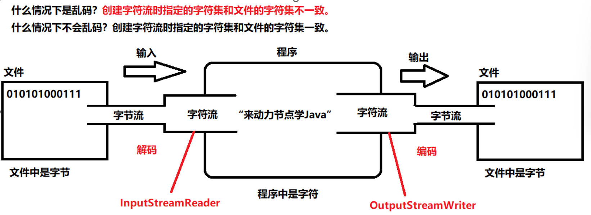

```java
package com.powernode.javase.io;

import java.io.FileReader;
import java.nio.charset.Charset;

public class InputStreamReaderDecodingTest {
    public static void main(String[] args) throws Exception {
        // 创建一个转换流对象（输入流）
        // 节点流
        //FileInputStream in = new FileInputStream("D:\0-JavaSE\powernode-java\file3.txt");
        // 包装流
        //InputStreamReader isr = new InputStreamReader(in);

        // 合并节点流和包装流
        //InputStreamReader isr = new InputStreamReader(new FileInputStream("D:\\0-JavaSE\\powernode-java\\file3.txt"),"GBK");

        // 以上代码太长了。在IO流的继承体系结构中，IO流又给InputStreamReader提供了一个子类：FileReader
        // 代码可以这样写了：
        //FileReader isr = new FileReader("D:\0-JavaSE\powernode-java\file3.txt", Charset.defaultCharset());
        FileReader isr = new FileReader("D:\\0-JavaSE\\powernode-java\\file3.txt", Charset.forName("GBK"));

        // 开始读
        char[] chars = new char[1024];
        int readCount = 0;
        while((readCount = isr.read(chars)) != -1){
            System.out.println(new String(chars,0,readCount)); // 来动力节点学Java
        }

        // 关闭流
        isr.close();
    }
}
```

> **测试:**
>
> 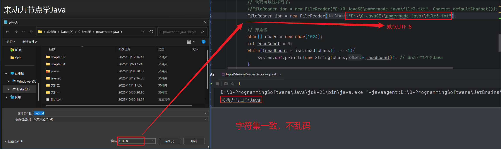
>
> 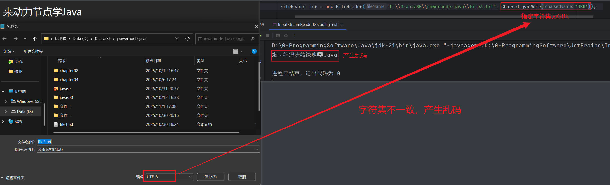


### OutputStreamWriter（主要解决写的乱码问题）

```java
1.使用OutputStreamWriter时，可以指定解码的字符集。用来解决读过程中的乱码问题。
	OutputStreamWriter也是一个字符流。也是一个转换流。
	OutputStreamWriter是一个编码的过程。
	如果OutputStreamWriter在编码的过程中使用的字符集和文件的字符集不一致时会出现乱码。

2.OutputStreamWriter常用的构造方法：
       OutputStreamWriter(OutputStream in) 采用平台默认的字符集进行解码。
       OutputStreamWriter(OutputStream in, String charsetName) 采用指定的字符集进行解码。

3. FileWriter是OutputStreamWriter的子类。

Writer writer = new OutputStreamWriter(new FileOutputStream(“file1.txt”)); // 采用平台默认字符集
Writer writer = new FileWriter(“file1.txt”); // 采用平台默认字符集
因此FileWriter的出现，简化了代码。

以下代码本质上也是一样的：
Writer writer = new OutputStreamWriter(new FileOutputStream(“file1.txt”), “GBK”);
Writer writer = new FileWriter(“file1.txt”, Charset.forName(“GBK”));

4. FileWriter是一个包装流，不是节点流。
```


```java
package com.powernode.javase.io;

import java.io.FileWriter;
import java.nio.charset.Charset;

public class OutputStreamWriterEncodingTest {
    public static void main(String[] args) throws Exception {
        // 创建转换流对象OutputStreamWriter
        // 以下代码采用的是UTF-8的字符集进行编码。（采用平台默认的字符集）
        // 注意：以下代码中输出流以覆盖的方式输出/写。
        //OutputStreamWriter osw = new OutputStreamWriter(new FileOutputStream("D:\\0-JavaSE\\powernode-java\\file4.txt"));

        //OutputStreamWriter osw = new OutputStreamWriter(new FileOutputStream("D:\\0-JavaSE\\powernode-java\\file4.txt"),"GBK");

        //OutputStreamWriter osw = new OutputStreamWriter(new FileOutputStream("D:\\0-JavaSE\\powernode-java\\file4.txt",true),"GBK");

        // OutputStreamWriter osw = new OutputStreamWriter(new FileOutputStream("D:\\0-JavaSE\\powernode-java\\file4.txt",true));

        //OutputStreamWriter osw = new OutputStreamWriter(new FileOutputStream("D:\\0-JavaSE\\powernode-java\\file4.txt", true), "GBK");

        FileWriter osw = new FileWriter("D:\\0-JavaSE\\powernode-java\\file4.txt", Charset.forName("UTF-8"),true);

        // 开始写
        osw.write("来动力节点学Java");

        // 刷新流
        osw.flush();

        // 关闭流
        osw.close();
    }
}
```

> **测试:**
>
> 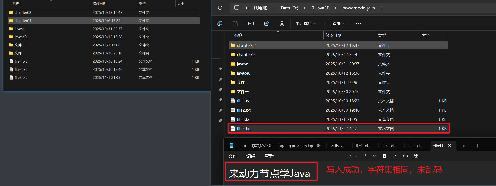
>
> 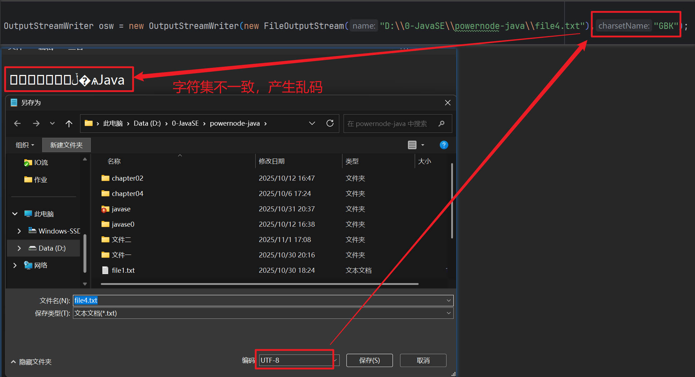


## 数据流

```java
1. 这两个流都是包装流，读写数据专用的流。

2.DataOutputStream直接将程序中的数据写入文件，不需要转码，效率高。程序中是什么样子，原封不动的写出去。写完后，文件是打不开的。即使打开也是乱码，文件中直接存储的是二进制。

3.使用DataOutputStream写的文件，只能使用DataInputStream去读取。并且读取的顺序需要和写入的顺序一致，这样才能保证数据恢复原样。

4.构造方法：
DataInputStream(InputStream in)

DataOutputStream(OutputStream out)

5.写的方法：
writeByte()、writeShort()、writeInt()、writeLong()、writeFloat()、writeDouble()、writeBoolean()、writeChar()、writeUTF(String)

6.读的方法：
readByte()、readShort()、readInt()、readLong()、readFloat()、readDouble()、readBoolean()、readChar()、readUTF()
```


### DataOutputStream

```java
java.io.DataOutputStream：数据流（数据字节输出流）
  作用：将java程序中的数据直接写入到文件，写到文件中就是二进制。
  DataOutputStream写的效率很高，原因是：写的过程不需要转码。
  DataOutputStream写到文件中的数据，只能由DataInputStream来读取。
```

```java
package com.powernode.javase.io;

import java.io.DataOutputStream;
import java.io.FileOutputStream;

public class DataOutputStreamTest {
    public static void main(String[] args) throws Exception {
        // 节点流
        //OutputStream os = new FileOutputStream("D:\\0-JavaSE\\powernode-java\\file4.txt");
        // 包装流
        //DataOutputStream dos = new DataOutputStream(os);

        DataOutputStream dos = new DataOutputStream(new FileOutputStream("data"));

        // 准备数据
        byte b = -127;
        short s = 32767;
        int i = 2147483647;
        long l = 1111111111L;
        float f = 3.0F;
        double d = 3.14;
        boolean flag = false;
        char c = '国';
        String str = "动力节点";

        // 开始写
        dos.writeByte(b);
        dos.writeShort(s);
        dos.writeInt(i);
        dos.writeLong(l);
        dos.writeFloat(f);
        dos.writeDouble(d);
        dos.writeBoolean(flag);
        dos.writeChar(c);
        dos.writeUTF(str);


        // 刷新
        dos.flush();

        // 关闭流
        dos.close();
    }
}
```

> **测试:**
>
> 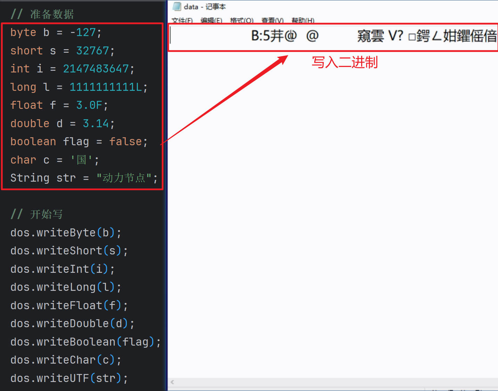


### DataInputStream

```java
java.io.DataInputStream：数据流（数据字节输入流）
 	作用：专门用来读取使用DataOutputStream流写入的文件。
 	注意：读取的顺序要和写入的顺序一致。（要不然无法恢复原样。）
```

```java
package com.powernode.javase.io;

import java.io.DataInputStream;
import java.io.FileInputStream;

public class DataInputStreamTest {
    public static void main(String[] args) throws Exception{
        // 创建数据字节输入流对象
        DataInputStream dis = new DataInputStream(new FileInputStream("data"));

        //System.out.println(dis.readBoolean()); // true

        // 开始读
        byte b = dis.readByte();
        short s = dis.readShort();
        int i = dis.readInt();
        long l = dis.readLong();
        float f = dis.readFloat();
        double d = dis.readDouble();
        boolean flag = dis.readBoolean();
        char c = dis.readChar();
        String str = dis.readUTF();

        System.out.println(b);
        System.out.println(s);
        System.out.println(i);
        System.out.println(l);
        System.out.println(f);
        System.out.println(d);
        System.out.println(flag);
        System.out.println(c);
        System.out.println(str);

        // 关闭流
        dis.close();

        /*FileInputStream fis = new FileInputStream("data");

        System.out.println(fis.read());
        System.out.println(fis.read());
        System.out.println(fis.read());
        System.out.println(fis.read());

        fis.close();*/


    }
}
```

> **测试:**
>
> 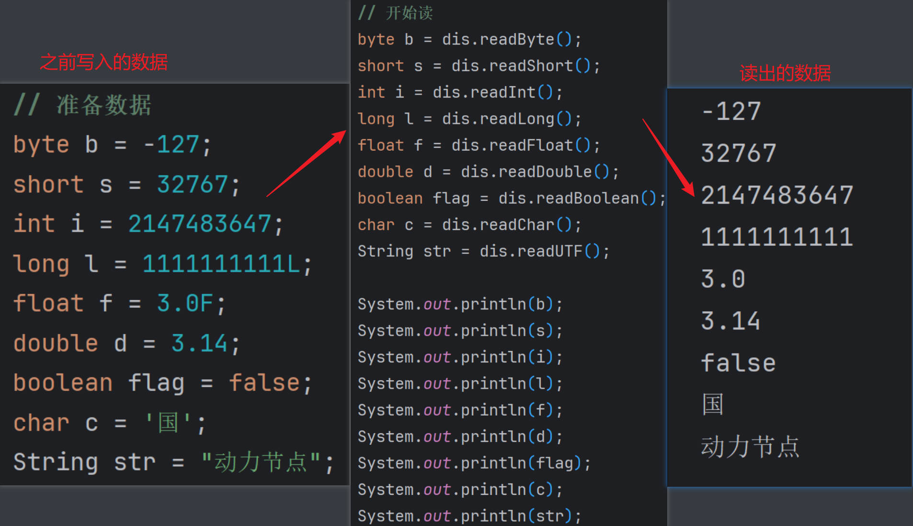


## 对象流(序列化流)


### 概述

* 序列化流也是高级流，其是用来包装基本流的，并且序列化流是字节流的一种。

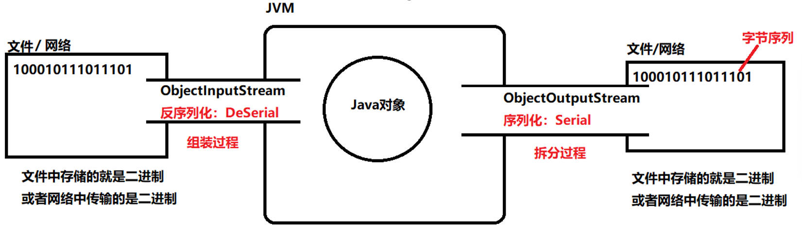

> [!NOTE]
>
> * ① 序列化流负责输出数据，即：将 Java 中的对象（内存中的数据）写出到本地文件中。
> * ② 反序列化流负责读取数据，即：将本地文件中的数据读取为 Java 中的对象（内存中的数据）。

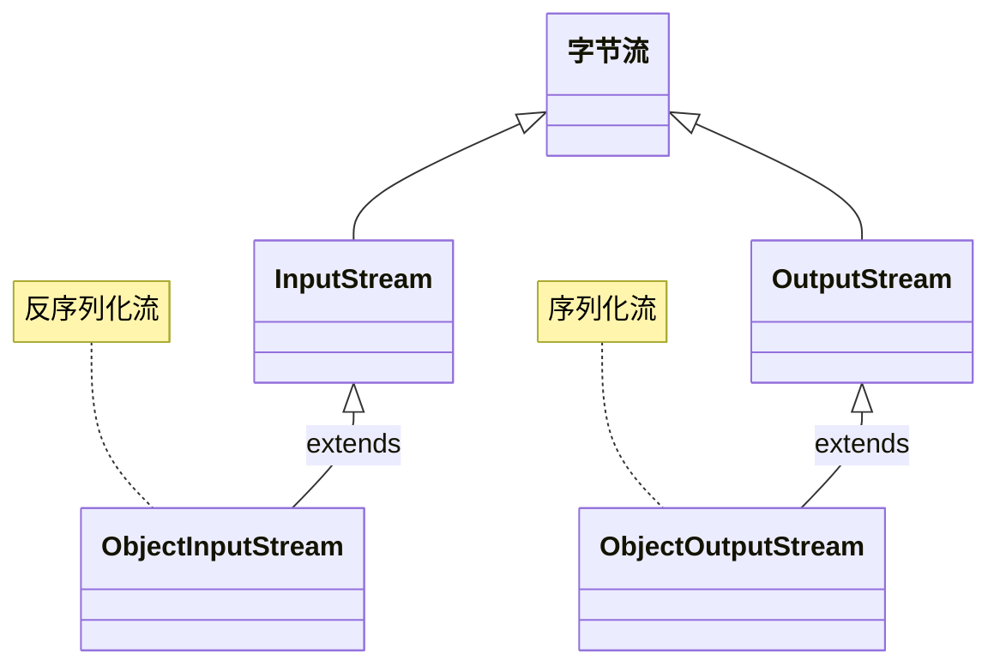
```mermaid
classDiagram
    字节流 <|-- InputStream
    字节流 <|-- OutputStream
    InputStream <|-- ObjectInputStream :extends
    note for ObjectInputStream "反序列化流"
    OutputStream <|-- ObjectOutputStream :extends
    note for ObjectOutputStream "序列化流"
```

### 序列化流

#### 概述

* 序列化流可以将 Java 中的对象（内存中的数据）写到本地文件中。


> [!NOTE]
>
> 实现序列化流的前提条件：JavaBean 需要实现 `java.io.Serializable` 接口。
>


#### 步骤

* ① 创建序列化流对象：

| 构造方法                                         | 描述                 |
| ------------------------------------------------ | -------------------- |
| `public ObjectOutputStream(OutputStream out) {}` | 将基本流包装成高级流 |

* ② 写出数据：

| 成员方法                                       | 描述                       |
| ---------------------------------------------- | -------------------------- |
| `public final void writeObject(Object obj){} ` | 将对象序列化后写出到文件中 |

* ③ 关闭流：

| 成员方法                  | 描述     |
| ------------------------- | -------- |
| `public void close()  {}` | 释放资源 |


* 示例：

```java [ObjectOutputStreamTest]
package com.powernode.javase.io;

import java.io.FileOutputStream;
import java.io.ObjectOutputStream;
import java.util.Date;

/**
 * java.io.ObjectOutputStream：对象流（对象字节输出流）
 * 1. 它的作用是完成对象的序列化过程。
 * 2. 它可以将JVM当中的Java对象序列化到文件中/网络中。
 * 3. 序列化：将Java对象转换为字节序列的过程。（字节序列可以在网络中传输。）
 * 4. 序列化：serial
 */
public class ObjectOutputStreamTest {
    public static void main(String[] args) throws Exception {
        // 创建“对象字节输出流”对象
        // 包装流
        ObjectOutputStream oos = new ObjectOutputStream(new FileOutputStream("object"));

        // 准备一个Java对象
        Date nowTime = new Date();

        // 序列化serial
        oos.writeObject(nowTime);

        // 刷新
        oos.flush();

        // 关闭流
        oos.close();
    }
}
```

```java [ObjectOutputStreamTest02]
package com.powernode.javase.io;

import java.io.FileOutputStream;
import java.io.ObjectOutputStream;
import java.util.ArrayList;
import java.util.Date;
import java.util.List;

/**
 * 序列化对象如果是多个对象的话，一般会序列化一个集合。
 */
public class ObjectOutputStreamTest02 {
    public static void main(String[] args) throws Exception {
        
        // 创建多个对象
        Date date1 = new Date();
        Date date2 = new Date();
        Date date3 = new Date();
        Date date4 = new Date();
        Date date5 = new Date();
        Date date6 = new Date();

        List<Date> list = new ArrayList<>();

        list.add(date1);
        list.add(date2);
        list.add(date3);
        list.add(date4);
        list.add(date5);
        list.add(date6);
        
        
        // 序列化
        ObjectOutputStream dos = new ObjectOutputStream(new FileOutputStream("dates"));

        dos.writeObject(list);

        // 刷新流
        dos.flush();
        // 关闭流
        dos.close();
    }
}
```


### 反序列化流

#### 概述

* 反序列化流可以将序列化到本地文件中的对象，读取到程序中。


#### 步骤

* ① 创建反序列化流对象：

| 构造方法                                       | 描述                 |
| ---------------------------------------------- | -------------------- |
| `public ObjectInputStream(InputStream in)  {}` | 将基本流包装成高级流 |

* ② 写出数据：

| 成员方法                              | 描述                                   |
| ------------------------------------- | -------------------------------------- |
| `public final Object readObject() {}` | 序列化到本地文件中的对象，读取到程序中 |

* ③ 关闭流：

| 成员方法                  | 描述     |
| ------------------------- | -------- |
| `public void close()  {}` | 释放资源 |


* 示例：

```java [ObjectInputStreamTest]
package com.powernode.javase.io;

import java.io.FileInputStream;
import java.io.ObjectInputStream;

/**
 * java.io.ObjectInputStream：对象流（对象字节输入流）
 * 1. 专门完成反序列化的。（将字节序列转换成JVM当中的java对象。）
 */
public class ObjectInputStreamTest {
    public static void main(String[] args) throws Exception {
        // 包装流
        ObjectInputStream ois = new ObjectInputStream(new FileInputStream("object"));

        // 开始读
        Object o = ois.readObject();
        System.out.println(o); // Sun Nov 02 17:05:17 CST 2025

        // 关闭流
        ois.close();
    }
}
```

```java [ObjectInputStreamTest02]
package com.powernode.javase.io;

import java.io.FileInputStream;
import java.io.ObjectInputStream;
import java.util.Date;
import java.util.List;

/**
 * 反序列化
 */
public class ObjectInputStreamTest02 {
    public static void main(String[] args) throws Exception {
        ObjectInputStream ois = new ObjectInputStream(new FileInputStream("dates"));

        // 反序列化
        List<Date> dates = (List<Date>) ois.readObject();

        for(Date date : dates){
            System.out.println(date);
            /*
            Sun Nov 02 17:19:21 CST 2025
            Sun Nov 02 17:19:21 CST 2025
            Sun Nov 02 17:19:21 CST 2025
            Sun Nov 02 17:19:21 CST 2025
            Sun Nov 02 17:19:21 CST 2025
            Sun Nov 02 17:19:21 CST 2025
             */
        }

        // 关闭流
        ois.close();
    }
}
```


### 自定义类进行序列化和反序列化

```java
package com.powernode.javase.io;

import java.io.Serial;
import java.io.Serializable;

/**
 * 1. 重点：凡是参与序列化和反序列化的对象必须实现 java.io.Serializable 可序列化的接口。
 * 2. 这个接口是一个标志接口，没有任何方法。只是起到一个标记的作用。
 * 3. 它到底是标记什么呢？？？？？？
 * 4. 当java程序中类实现了Serializable接口，编译器会自动给该类添加一个“序列化版本号”。
 *      序列化版本号：serialVersionUID
 * 5. 序列化版本号有什么用？
 *      在Java语言中是如何区分class版本的？
 *      首先通过类的名字，然后再通过序列化版本号进行区分的。
 *      在java语言中，不能仅仅通过一个类的名字来进行类的区分，这样太危险了。
 * 6. 为了保证序列化的安全，只有同一个class才能进行序列化和反序列化。在java中是如何保证同一个class的？
 *      类名 + 序列化版本号：serialVersionUID
 *
 * java.io.InvalidClassException: com.powernode.javase.io.Student;
 * local class incompatible:
 *      stream classdesc serialVersionUID = -4936871645261081394,  （三年前的学生对象，是三年前的Student.class创建的学生对象。）
 *      local class serialVersionUID = 5009257763737485728  （三年后，Student.class升级了。导致了版本发生了变化。）
 */
public class Student implements Serializable {

    // 建议：不是必须的。
    // 如果你确定这个类确实还是以前的那个类。类本身是合法的。没有问题。
    // 建议你将序列化版本号写死！
    @Serial
    private static final long serialVersionUID = 1134806885454190545L;

    private String name;

    private transient int age; // transient关键字修饰的属性不会参与序列化。

    private  String addr;

    public String getAddr() {
        return addr;
    }

    public void setAddr(String addr) {
        this.addr = addr;
    }

    @Override
    public String toString() {
        return "Student{" +
                "name='" + name + '\'' +
                ", age=" + age +
                '}';
    }

    public Student() {
    }

    public Student(String name, int age) {
        this.name = name;
        this.age = age;
    }

    public String getName() {
        return name;
    }

    public void setName(String name) {
        this.name = name;
    }

    public int getAge() {
        return age;
    }

    public void setAge(int age) {
        this.age = age;
    }
}
```

> **例子1：**

```java
package com.powernode.javase.io;

import java.io.FileOutputStream;
import java.io.ObjectOutputStream;

/**
 * 序列化Student对象
 */
public class ObjectOutputStreamTest03 {
    public static void main(String[] args) throws Exception {
        // 创建流对象
        ObjectOutputStream oos = new ObjectOutputStream(new FileOutputStream("student"));

        // 创建对象
        Student stu = new Student("zhangsan", 20);

        // 写出数据
        oos.writeObject(stu);

        // 刷新
        oos.flush();

        // 释放资源
        oos.close();
    }
}
```

```java
package com.powernode.javase.io;

import java.io.FileInputStream;
import java.io.ObjectInputStream;

/**
 * 反序列化过程：将文件中的Student字节序列恢复到内存中，变成Student对象。
 */
public class ObjectInputStreamTest03 {
    public static void main(String[] args) throws Exception {

        ObjectInputStream ois = new ObjectInputStream(new FileInputStream("student"));

        // 反序列化
        System.out.println(ois.readObject()); // Student{name='zhangsan', age=20}

        // 关闭流
        ois.close();
    }
}
```

> **例子2：**

```java
package com.powernode.javase.io;

import java.io.FileOutputStream;
import java.io.ObjectOutputStream;

/**
 * 序列化
 */
public class ObjectOutputStreamTest04 {
    public static void main(String[] args) throws Exception {
        ObjectOutputStream oos = new ObjectOutputStream(new FileOutputStream("student2"));


        Student student = new Student("zhangsan", 20);

        // 序列化
        oos.writeObject(student);

        // 其实ObjectOutputStream中也有这些方法，和DataOutputStream中的方法一样。
        /*oos.writeInt(100);
        oos.writeBoolean(false);
        oos.writeUTF("张三");*/

        // 刷新流
        oos.flush();

        // 关闭流
        oos.close();
    }
}
```

```java
package com.powernode.javase.io;

import java.io.FileInputStream;
import java.io.ObjectInputStream;

/**
 * 反序列化
 */
public class ObjectInputStreamTest04 {
    public static void main(String[] args) throws Exception {

        ObjectInputStream ois = new ObjectInputStream(new FileInputStream("student2"));

        Object o = ois.readObject();
        // 序列化
        System.out.println(o);
        /*
        参加序列化(name)：Student{name='zhangsan', age=20}
        未参加序列化(name)：Student{name='zhangsan', age=0}
         */

        // 关闭流
        ois.close();
    }
}
```


### 细节

#### 细节一

* `JavaBean`不实现`java.io.Serializable`接口，会出现`NotSerializableException`异常。

```java
public class Student {

    private String name;

    private int age;
	
    ...
}   
```

> [!NOTE]
>
> 解决方案：让`JavaBean`实现`java.io.Serializable`接口！！！

* 示例：

```java [Student.java]
package com.powernode.javase.io;

public class Student {

    private String name;

    private  int age;

    private String addr;

    @Override
    public String toString() {
        return "Student{" +
                "name='" + name + '\'' +
                ", age=" + age +
                '}';
    }

    public Student() {
    }

    public Student(String name, int age) {
        this.name = name;
        this.age = age;
    }

    public String getName() {
        return name;
    }

    public void setName(String name) {
        this.name = name;
    }

    public int getAge() {
        return age;
    }

    public void setAge(int age) {
        this.age = age;
    }
}
```

```java [Test.java]
package com.powernode.javase.io;

import java.io.FileOutputStream;
import java.io.ObjectOutputStream;

/**
 * 序列化Student对象
 */
public class ObjectOutputStreamTest03 {
    public static void main(String[] args) throws Exception {
        // 创建流对象
        ObjectOutputStream oos = new ObjectOutputStream(new FileOutputStream("student"));

        // 创建对象
        Student stu = new Student("zhangsan", 20);

        // 写出数据
        oos.writeObject(stu);

        // 刷新
        oos.flush();

        // 释放资源
        oos.close();
    }
}
```

> **测试:**
>
> 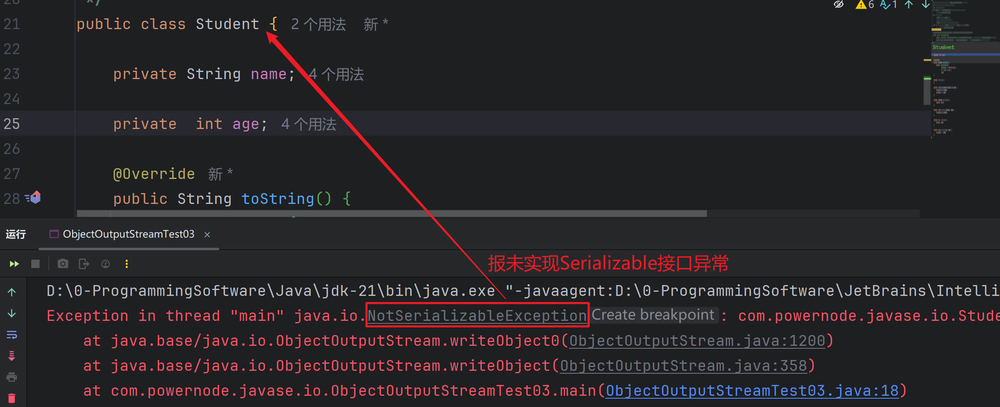


#### 细节二

* 如果一个类实现了`Serializable`接口，就表明这个类的对象是可序列化的：

```java
public class Student implements Serializable {

    private String name;

    private int age;
	
    ...
}   
```

* Java 在底层会根据类的信息，如：类名、包名、成员变量、静态变量、构造方法等生成一个 `serialVersionUID`，在序列化对象的时候，JVM 会将`serialVersionUID` 和类的其他元数据一同写入本地文件中，这个过程是自动的。


* 在反序列化的时候，Java 底层也会将本地文件中的`serialVersionUID`和当前类的字节码文件计算出来的`serialVersionUID`进行比较，如果不匹配，将会报错。


* 我们可以通过`serialver`命令来计算出对应的`serialVersionUID`：

```bash
serialver -classpath D:\project\java-base\out\production\day23 com.github.io.Student
```


* 我们可以通过反序列化来读取文件中的`serialVersionUID`：

```java [Test.java]
package com.github.io;

import java.io.FileInputStream;
import java.io.IOException;
import java.io.ObjectInputStream;
import java.io.ObjectStreamClass;

public class Test {
    public static void main(String[] args) throws Exception {
        // 创建流对象
        ObjectInputStream oi = new ObjectInputStream(
            new FileInputStream("day23\\stu.txt"));

        // 读取数据
        Object obj = oi.readObject();

        ObjectStreamClass lookup = ObjectStreamClass.lookup(obj.getClass());
        System.out.println(lookup); // 6233301834653560958L

        // 释放资源
        oi.close();

    }

}
```


* 换言之，只要我们修改了类的信息，Java 底层就会自动计算`serialVersionUID`：


* 在实际开发中，随着业务的发展，我们绝对有可能去修改类的信息，为了避免文件中的版本号和JavaBean中的版本号不匹配而引发错误，我们只需要在类中显示声明`serialVersionUID`，Java 就不会在自动计算，而使用我们自己提供的值。

> [!NOTE]
>
> * ① 如果没有显示声明`serialVersionUID`，Java 会自动计算并存储一个`serialVersionUID`，这个值是基于类的字节码的。
> * ② 如果已经显示声明`serialVersionUID`，Java 就不会自动计算它，只会使用我们提供的值。

```java [Student.java]
package com.github.io;

import java.io.Serializable;

public class Student implements Serializable {

    private static final long serialVersionUID = 1L; // [!code highlight]

    private String name;

    private int age;

    private String sex;

    public Student(String name, int age) {
        this.name = name;
        this.age = age;
    }

    public String getName() {
        return name;
    }

    public void setName(String name) {
        this.name = name;
    }

    public int getAge() {
        return age;
    }

    public void setAge(int age) {
        this.age = age;
    }

    @Override
    public String toString() {
        return "Student{" +
                "name='" + name + '\'' +
                ", age=" + age +
                '}';
    }
}

```


* 我们可以开启快速生成`serialVersionUID` 的功能：


* 这样，我们在写代码的时候，就可以让 IDEA 帮我们计算`serialVersionUID`了：


### 展望

* 由于以下原因，在实际开发中，我们并不建议使用 Java 内置的序列化。
  * ① `安全性差`：Java 序列化允许任意类型反序列化，容易被攻击。
  * ② `性能差`：序列化后的体积大，效率低。
  * ③ `不可控、脆弱`：一个类结构稍微变动就可能导致反序列化失败。
  * ④ `黑盒机制`：对开发者几乎是不可见的魔法，难以调试和管理。

* 我们可以使用其他替代方案：

| 替代方案               | 特点                                            |
| ---------------------- | ----------------------------------------------- |
| Jackson / Gson（JSON） | 简单、可读、安全，适合 Web 应用                 |
| Kryo                   | 高性能二进制序列化，适用于分布式系统，如：Spark |
| Protobuf               | Google 出品，结构清晰、高压缩率、跨语言支持强   |


## 打印流


### 概述

* 打印流是高级流，其是用来保证基本流的；但是，打印流只能写，不能读。

> [!NOTE]
>
> 打印流只能是输出流！！！

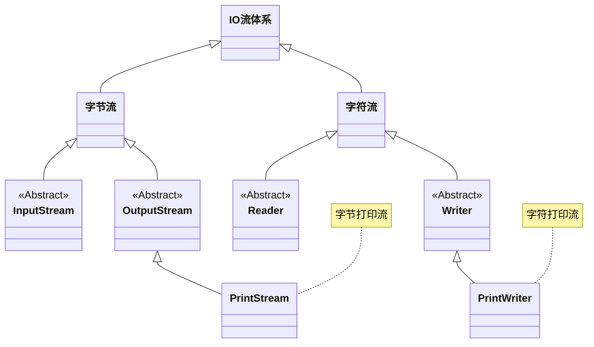
```mermaid
classDiagram
    IO 流体系 <|-- 字节流 
    IO 流体系 <|-- 字符流 
    字节流 <|-- InputStream 
    字节流 <|-- OutputStream 
    字符流 <|-- Reader 
    字符流 <|-- Writer 
    OutputStream <|-- PrintStream
    note for PrintStream "字节打印流"
    Writer <|-- PrintWriter
    note for PrintWriter "字符打印流"
    class InputStream{
        <<Abstract>>
    }
    class OutputStream{
        <<Abstract>>
    }
    class Reader{
        <<Abstract>>
    }
    class Writer{
        <<Abstract>>
    }

```

* 其实，我们之前经常使用的`打印语句`就是`字节打印流`：

```java
public final class System {
    
    public static final PrintStream out = null;
    
}
```


### 特点

* ① 打印流只能操作文件的目的地，不能操作数据源。

* ② 特有的写出方法可以实现，数据原样输出，即：print() 方法或 println() 方法。

* ③ 特有的写出方法，可以实现自动刷新，自动换行，即：println() 方法


### 字节打印流(PrintStream)

```java
1.构造:
   PrintStream(String fileName)
       
2.方法:
   a.println(): 原样输出,自带换行效果
   b.print():  原样输出,不带换行效果
 
3.便捷在哪里？
	直接输出各种数据类型
	自动刷新和自动换行（println方法）
	支持字符串转义
	自动编码（自动根据环境选择合适的编码方式）

4.格式化输出？调用printf方法。
	%s 表示字符串
	%d 表示整数
	%f 表示小数（%.2f 这个格式就代表保留两位小数的数字。）
	%c 表示字符
```

```java
package com.powernode.javase.io;

import java.io.PrintStream;

/**
 * 1. java.io.PrintStream：打印流（专业的负责打印的流，字节形式。）
 * 2. PrintStream不需要手动刷新，自动刷新。
 */
public class PrintStreamTest {
    public static void main(String[] args) throws Exception {
        // 创建一个打印流对象
        // 构造方法：PrintStream(OutputStream out)
        // 构造方法：PrintStream(String fileName)
        PrintStream ps = new PrintStream("log1");

        // 没有这样的构造方法。
        //PrintStream ps2 = new PrintStream(new FileWriter(""));

        //PrintStream ps2 = new PrintStream(new FileOutputStream("log1"));

        // 打印流可以打印各种数据类型数据。
        ps.print(100); // 100
        ps.println(false); // false
        ps.println("abc"); // abc
        ps.println('T'); // T
        ps.println(3.14); // 3.14
        ps.println("hell world"); // hell world
        ps.println(200); // 200

        ps.println("\"hello world!\""); // "hello world!"

        String name = "张三";
        double score = 95.5;

        ps.printf("姓名：%s，考试成绩：%.2f", name, score); // 姓名：张三，考试成绩：95.50

        // 关闭流
        ps.close();
    }
}
```

> **测试:**
>
> 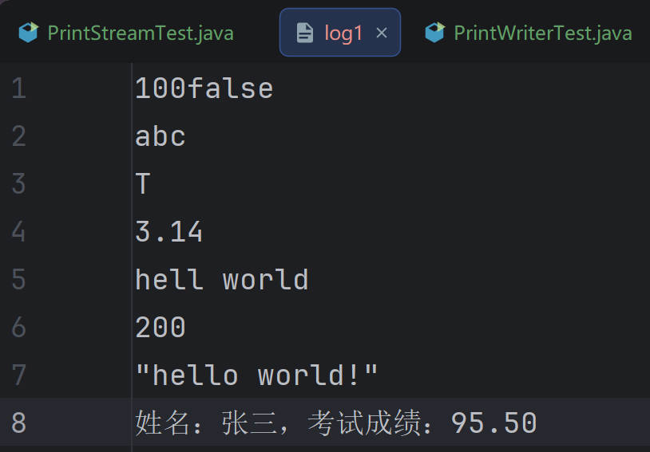


### 字符打印流(PrintStream)

```java
1.PrintWriter比PrintStream多一个构造方法：
     PrintStream构造方法：
           PrintStream(OutputStream)
     PrintWriter构造方法：
           PrintWriter(OutputStream)
           PrintWriter(Writer)
       
2.方法:
   a.println(): 原样输出,自带换行效果
   b.print():  原样输出,不带换行效果
       
3.打印流（字符形式）注意PrintWriter使用时需要手动调用flush()方法进行刷新。

4.格式化输出？调用printf方法。
	%s 表示字符串
	%d 表示整数
	%f 表示小数（%.2f 这个格式就代表保留两位小数的数字。）
	%c 表示字符
```

```java
package com.powernode.javase.io;

import java.io.FileWriter;
import java.io.PrintWriter;

public class PrintWriterTest {
    public static void main(String[] args) throws Exception {
        // 创建字符打印流
        //PrintWriter pw = new PrintWriter(new FileOutputStream("log2"));

        PrintWriter pw = new PrintWriter(new FileWriter("log2"), true);

        // 打印
        pw.println("world hello!!!");
        pw.println("zhangsan hello!!!");

        // 刷新流
        //pw.flush();

        // 关闭流
        pw.close();
    }
}
```

> **测试:**
>
> 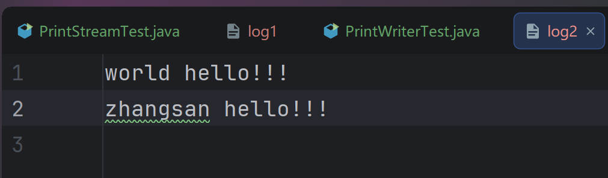


## 标准输入流&标准输出流


### 标准输入流

```java
标准输入流：System.in
       1. 标准输入流怎么获取？
           System.in
    
       2. 标准输入流是从哪个数据源读取数据的？
           控制台。
    
       3. 普通输入流是从哪个数据源读取数据的？
           文件或者网络或者其他.....
    
       4. 标准输入流是一个全局的输入流，不需要手动关闭。JVM退出的时候，JVM会负责关闭这个流。
    
       5. 对于标准输入流来说，也是可以改变数据源的。不让其从控制台读数据。也可以让其从文件中或网络中读取数据。
       
       6. 也可以使用BufferedReader对标准输入流进行包装。这样可以方便的接收用户在控制台上的输入。（这种方式太麻烦了，因此JDK中提供了更好用的Scanner。）

BufferedReader br = new BufferedReader(new InputStreamReader(System.in));
String s = br.readLine();

        7. 当然，你也可以修改输入流的方向（System.setIn()）。让其指向文件。
        // 修改标准输入流的数据源。
        System.setIn(new FileInputStream("log2"));
```


+ 控制台输入源

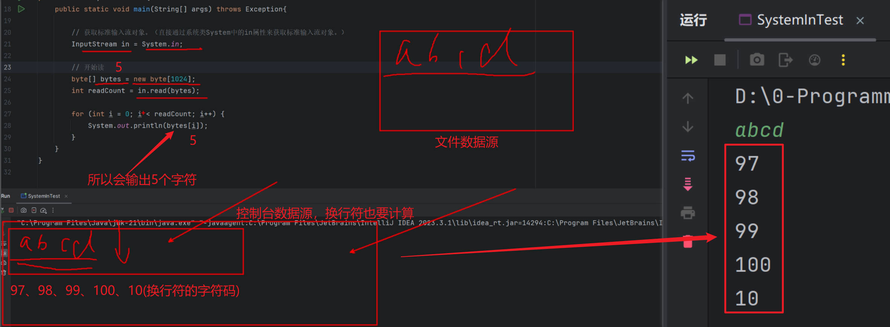

```java
package com.powernode.javase.io;

import java.io.InputStream;

public class SystemInTest {
    public static void main(String[] args) throws Exception {
        // 获取标准输入流对象。（直接通过系统类System中的in属性来获取标准输入流对象。）
        InputStream in = System.in;

        // 开始读
        byte[] bytes = new byte[1024];
        int readCount = in.read(bytes);

        for (int i = 0; i < readCount; i++) {
            System.out.println(bytes[i]);
            /*
            abcd
            97
            98
            99
            100
            10(换行符的字节大小)
             */
        }
    }
}
```


+ 文件输入源

```java
package com.powernode.javase.io;

import java.io.FileInputStream;
import java.io.InputStream;

/**
 * 对于标准输入流来说，也是可以改变数据源的。不让其从控制台读数据。也可以让其从文件中或网络中读取数据。
 */
public class SystemInTest02 {
    public static void main(String[] args) throws Exception {
        // 修改标准输入流的数据源。
        System.setIn(new FileInputStream("log2"));

        // 获取标准输入流
        InputStream in = System.in;

        byte[] bytes = new byte[1024];
        int readCount = 0;
        while ((readCount = in.read(bytes)) != -1) {
            System.out.println(new String(bytes, 0, readCount));
            /*
            world hello!!!
            zhangsan hello!!!
             */
        }
    }
}
```

> **测试:**
>
> 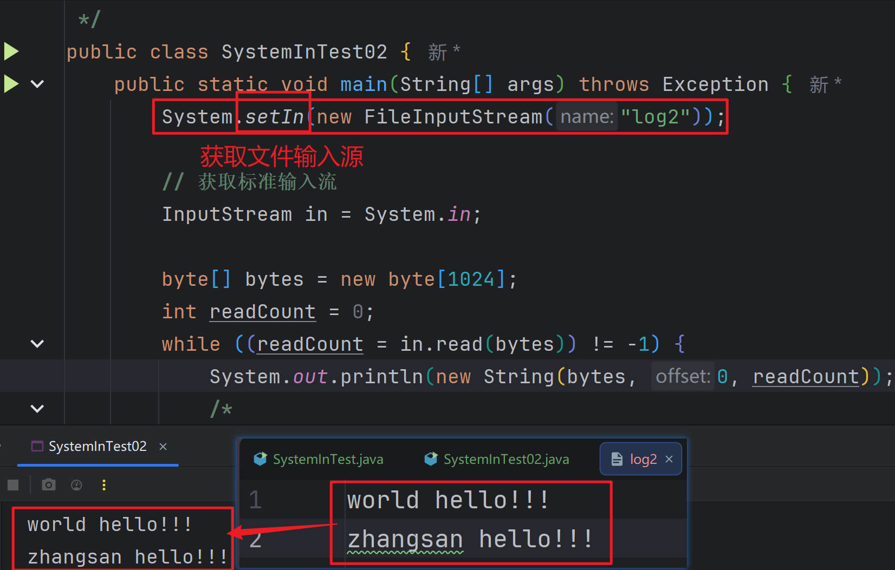


+ BufferedReader包装输入流(完成从键盘接收用户的输入)

```java
package com.powernode.javase.io;

import java.io.BufferedReader;
import java.io.InputStreamReader;

/**
 * 使用BufferedReader去包装一下这个标准输入流，来完成从键盘接收用户的输入。
 */
public class SystemInTest03 {
    public static void main(String[] args) throws Exception {
        // 创建BufferedReader对象
        BufferedReader br = new BufferedReader(new InputStreamReader(System.in));

        /*
        分开包装
        InputStream in = System.in;
        Reader reader = new InputStreamReader(in);
        BufferedReader br = new BufferedReader(reader);*/

        String s = null;
        while ((s = br.readLine()) != null) {
            if(s.equals("exit")){
                break;
            }
            System.out.println("您输入了：" + s);
        }

        /*Scanner scanner = new Scanner(System.in);

        String name = scanner.next();
        System.out.println("您的姓名是：" + name);*/
    }
}
```

> **测试:**
>
> 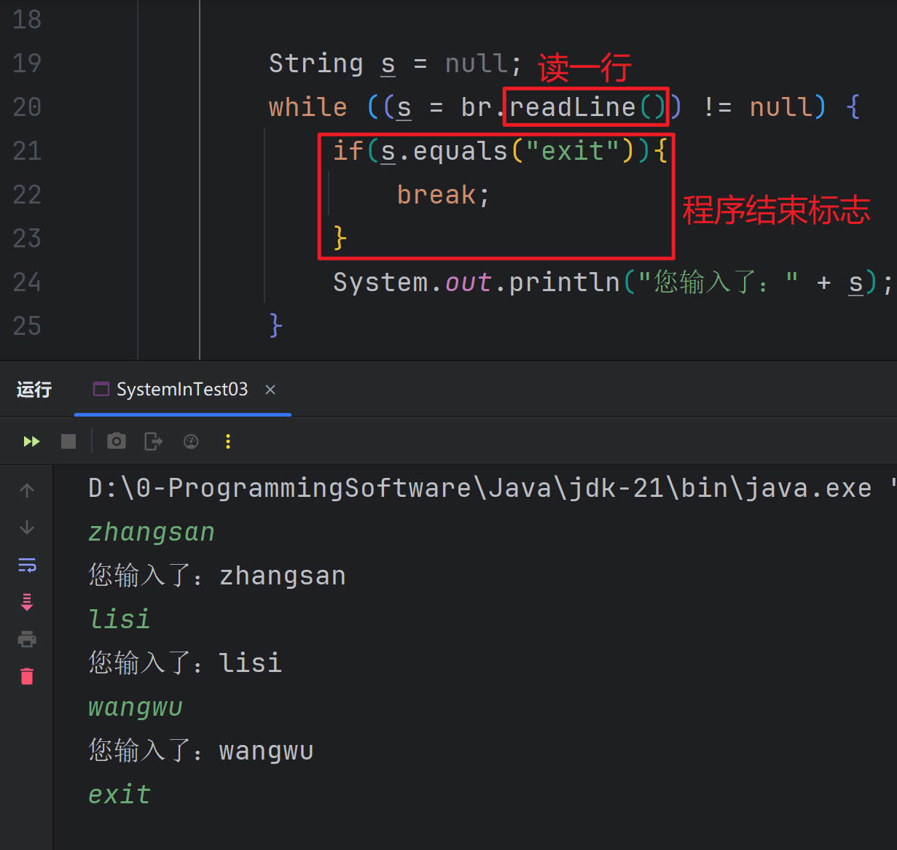


### 标准输出流

```java
标准输出流：System.out
       1. 标准输出流怎么获取？
           System.out
    
       2. 标准输出流是向哪里输出呢？
           控制台。
    
       3. 普通输出流是向哪里输出呢？
           文件或者网络或者其他.....
    
       4. 标准输出流是一个全局的输出流，不需要手动关闭。JVM退出的时候，JVM会负责关闭这个流。
    
       5. 当然，你也可以修改输出流的方向（System.setOut()）。让其指向文件。
          // 标准输出流也是可以改变输出方向的
          System.setOut(new PrintStream("log"));
```

```java
package com.powernode.javase.io;

import java.io.PrintStream;
import java.text.SimpleDateFormat;
import java.util.Date;

public class SystemOutTest {
    public static void main(String[] args) throws Exception {
        // 获取标准输出流，标准输出流默认会向控制台输出。
        PrintStream out = System.out;

        // 输出
        out.println("hello world");
        out.println("hello world");
        out.println("hello world");
        out.println("hello world");
        out.println("hello world");

        // 标准输出流也是可以改变输出方向的。
        System.setOut(new PrintStream("log"));

        System.out.println("zhangsan");
        System.out.println("lisi");
        System.out.println("wangwu");
        System.out.println("zhaoliu");

        // 获取系统当前时间
        Date now = new Date();
        SimpleDateFormat sdf = new SimpleDateFormat("yyyy-MM-dd HH:mm:ss SSS");
        String str = sdf.format(now);
        System.out.println(str + ": SystemOutTest's main method invoked!");
    }
}
```

> **测试:**
>
> + **标准输出流默认会向控制台输出**
>
> 
>
> + **标准输出流改变输出方向**
>
> 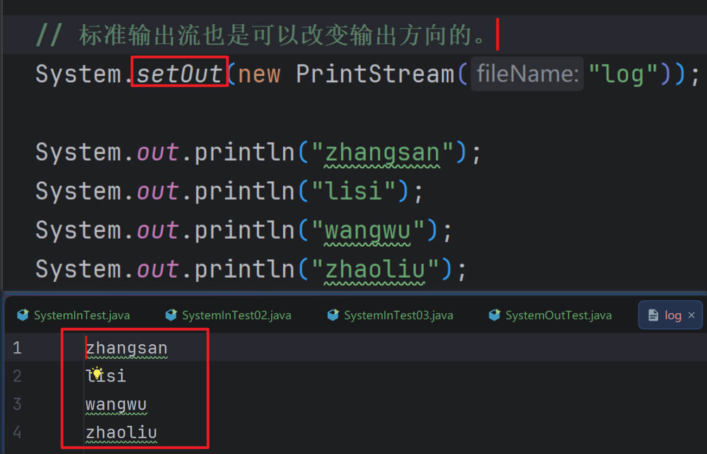
>
> + **获取系统当前时间(通常用于保存日志)**
>
> 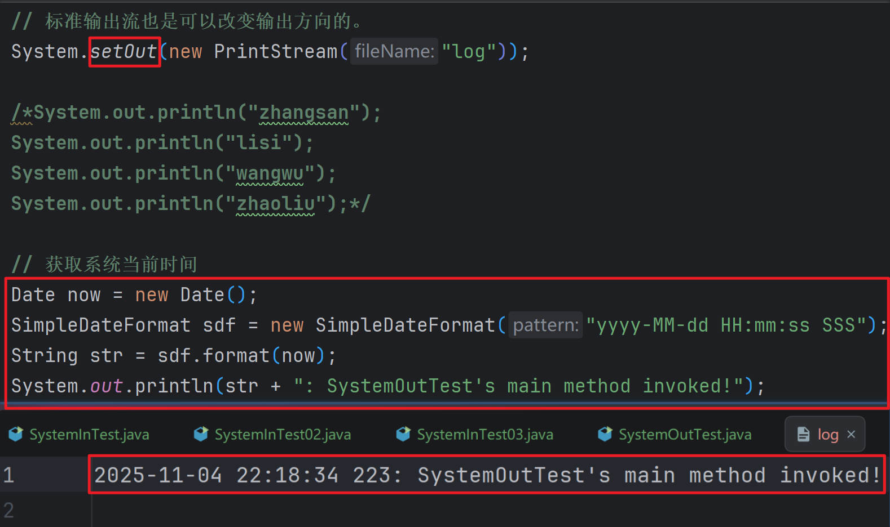


## File类

### 概述

```java
计算机常识:
  1.以.jpg结尾的一定是图片吗?
    不一定,有可能是文件夹
      
  2.什么是文本文档?
    用记事本打开,人能看懂的文件 -> txt  html css  
  
  3.E:\Idea\io\1.jpg 中的1.jpg的父路径是谁?
    E:\Idea\io
        
  4.分隔符:
    a.路径名称分隔符:
      windows: \
      linux: /    
    b.路径分隔符:一个路径和其他路径之间的分隔符
      ;
```

```java
1.java.io.File
    1.File是路径的抽象表示形式。
    2.File和IO流没有继承关系，父类是Object，通过File不能完成文件的读和写。
    3.File可能是一个文件，也可能是一个目录。
    
2.概述:文件和目录(文件夹)路径名的抽象表示   
    
3.简单理解:
  我们在创建File对象的时候,需要传递一个路径,这个路径定为到哪个文件或者文件夹上,我们的File就代表哪个对象
  File file = new File("E:\Idea\io\1.jpg")    
```


### File的常用方法(1)

```java
package com.powernode.javase.io;

import java.io.File;

public class FileTest01 {
    public static void main(String[] args) throws Exception {
        // 构造一个File对象
        File file = new File("D:\\0-JavaSE\\powernode-java\\file");

        // 调用File对象的相关方法
        System.out.println(file.exists() ? "存在" : "不存在"); // 不存在

        // 如果不存在则以新文件的形式创建
        /*if(!file.exists()){
            // 以新的文件的形式创建出来
            file.createNewFile();
        }*/

        // 如果不存在则以目录的形式新建
        if(!file.exists()){
            file.mkdir();
        }

        // 构造一个File对象
        File file2 = new File("D:\\0-JavaSE\\powernode-java\\a\\b\\c\\d");
        // 如果不存在则以目录的形式新建
        if(!file2.exists()){
            file2.mkdirs();
        }
    }
}
```

> **测试:**
>
> 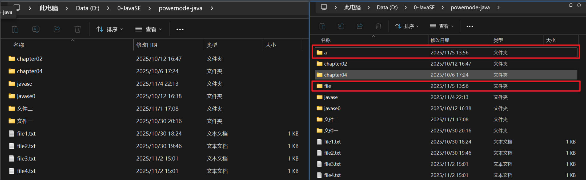


### File的常用方法(2)

```java
package com.powernode.javase.io;

import java.io.File;

/**
 * File类中的其他常见方法
 */
public class FileTest02 {
    public static void main(String[] args) {
        // 构造一个File对象
        File file1 = new File("D:\\0-JavaSE\\powernode-java\\新建文本文档.txt");

        // 判断文件是否存在，如果存在则删除
        if(file1.exists()){
            file1.delete();
        }

        File file2 = new File("D:\\0-JavaSE\\powernode-java\\a\\b\\c\\d");
        if(file2.exists()){
            file2.delete();
        }

        // 创建File对象
        File file3 = new File("log");

        // 获取绝对路径
        System.out.println("log文件的绝对路径：" + file3.getAbsolutePath()); // log文件的绝对路径：D:\0-JavaSE\powernode-java\javase\log

        // 获取名字
        System.out.println("文件名：" + file3.getName()); // 文件名：log

        // 创建File对象
        File file4 = new File("D:\\0-JavaSE\\powernode-java\\a\\b\\c");
        // 获取父路径
        System.out.println("父路径：" + file4.getParent());  // 父路径：D:\0-JavaSE\powernode-java\a\b

        // 判断该路径是否为绝对路径
        System.out.println(file4.isAbsolute()? "是绝对路径" : "不是绝对路径"); // 是绝对路径

        // 判断某个File是目录还是文件。
        File file5 = new File("D:\\0-JavaSE\\powernode-java\\file");

        System.out.println(file5.isDirectory() ? "是目录" : "是文件"); // 是文件
        System.out.println(file5.isFile() ? "是文件" : "是目录"); // 是目录

    }
}
```


### File的常用方法(3)

```java
package com.powernode.javase.io;

import java.io.File;
import java.text.SimpleDateFormat;
import java.util.Date;

/**
 * File类的常用方法
 */
public class FileTest03 {
    public static void main(String[] args) {
        // 创建一个File对象
        File file1 = new File("D:\\0-JavaSE\\powernode-java\\file.txt");

        // 判断该文件是否是隐藏文件
        System.out.println(file1.isHidden() ? "隐藏文件" : "非隐藏文件"); // 非隐藏文件

        // 获取文件的最后修改时间点
        long l = file1.lastModified();
        Date time = new Date(l);
        SimpleDateFormat sdf = new SimpleDateFormat("yyyy-MM-dd HH:mm:ss SSS");
        String str = sdf.format(time);
        System.out.println("文件最后修改时间点：" + str); // 文件最后修改时间点：2025-11-05 15:06:55 056

        // 获取文件的大小：总字节数
        System.out.println(file1.getName() + "文件的总字节数：" + file1.length() + "字节"); // file.txt文件的总字节数：6字节

        // 重命名
        File file2 = new File("file2");
        file1.renameTo(file2);
    }
}
```


### File的遍历方法

```java
File[] listFiles()-> 遍历指定的文件夹,返回的是File数组 ->这个推荐使用
    
细节:listFiles方法底层还是list方法
     调用list方法,遍历文件夹,返回一个Stirng数组,遍历数组,将数组中的内容一个一个封装到File对象中,然后再将File对象放到File数组中
```

```java
package com.powernode.javase.io;

import java.io.File;
import java.io.FilenameFilter;

/**
 * File类的常用方法：File[] listFiles();
 */
public class FileTest04 {
    public static void main(String[] args) {

        File file = new File("D:\\0-JavaSE\\powernode-java");

        // 获取所有的子文件，包括子目录。
        File[] files = file.listFiles();

        // 遍历数组
        for(File f : files){
            System.out.println(f.getName());
            /*
            a
            chapter02
            chapter04
            file1.txt
            file2.txt
            file3.txt
            file4.txt
            javase
            javase0
            文件一
            文件二
             */
        }

        System.out.println("=====================================");

        File file1 = new File("D:\\0-JavaSE\\powernode-java");

        File[] files1 = file1.listFiles(new FilenameFilter() {
            @Override
            public boolean accept(File dir, String name) {
                /*if (name.endsWith(".txt")) {
                    return true;
                }
                return false;*/
                return name.endsWith(".txt");
            }
        });

        for(File f : files1){
            System.out.println(f.getName());
            /*
            file1.txt
            file2.txt
            file3.txt
            file4.txt
             */
        }
    }
}
```


### 目录的递归拷贝(练习)

```java
package com.powernode.javase.io;

import java.io.*;

/**
 * 目录拷贝。
 */
public class CopyDir {
    public static void main(String[] args) {
        // 拷贝源
        File src = new File("D:\\0-JavaSE\\powernode-java\\chapter04"); // D:\0-JavaSE\powernode-java\chapter04\ArrayTest.java

        // 拷贝目标
        File dest = new File("D:\\0-JavaSE\\powernode-java\\a\\b\\c"); // D:\0-JavaSE\powernode-java\a\b\c\0-JavaSE\powernode-java\chapter04\ArrayTest.java

        // 开始拷贝
        copy(src, dest);
    }

    /**
     * 拷贝目录的方法
     *
     * @param src  拷贝源
     * @param dest 拷贝目标
     */
    private static void copy(File src, File dest) {
        if (src.isFile()) {
            // 是文件的时候要拷贝。
            try(FileInputStream in = new FileInputStream(src);
                FileOutputStream out = new FileOutputStream(dest.getAbsolutePath() + src.getAbsolutePath().substring(2))) {

                // 开始拷贝
                byte[] bytes = new byte[1024*1024];
                int readCount = 0;
                while ((readCount = in.read(bytes)) != -1) {
                    out.write(bytes, 0, readCount);
                }
                // 刷新流
                out.flush();
            } catch (IOException e) {
                e.printStackTrace();
            }
            return;
        }

        // 假设src是一个目录
        // 程序能够执行到此处一定是一个目录
        // 创建目录
        File newDir = new File(dest.getAbsolutePath() + src.getAbsolutePath().substring(2));
        if (!newDir.exists()) {
            newDir.mkdirs();
        }

        // 递归操作
        File[] files = src.listFiles();
        for (File file : files) {
            //System.out.println(file.getAbsoluteFile());
            copy(file, dest);
        }
    }
}
```

> **测试:**
>
> 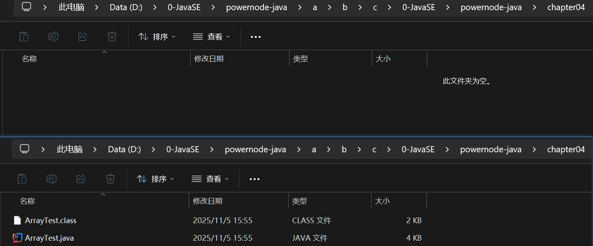


### 练习:遍历指定文件夹下所有的.jpg文件

```java
 1.创建File对象,指定要遍历的文件夹路径
 2.调用listFiles(),遍历文件夹,返回File数组
 3.遍历File数组,在遍历的过程中判断,如果是文件,获取文件名,判断是否以.jpg结尾的
   如果是,输出
 4.否则证明是文件夹,继续调用listFiles,遍历文件夹,然后重复 2 3 4步骤 -> 递归    
```

```java
public class Demo04File {
    public static void main(String[] args) {
        // 1.创建File对象,指定要遍历的文件夹路径
        File file = new File("E:\\Idea\\io\\aa");
        method(file);
    }

    private static void method(File file) {
       // 2.调用listFiles(),遍历文件夹,返回File数组
        File[] files = file.listFiles();
        // 3.遍历File数组,在遍历的过程中判断,如果是文件,获取文件名,判断是否以.jpg结尾的 如果是,输出
        for (File file1 : files) {
            if (file1.isFile()){
                String name = file1.getName();
                if (name.endsWith(".jpg")){
                    System.out.println(name);
                }
            }else {
       // 4.否则证明是文件夹,继续调用listFiles,遍历文件夹,然后重复 2 3 4步骤 -> 递归
               method(file1);
            }
        }
    }
}
```


### 相对路径和绝对路径

```java
1.绝对路径:从盘符开始写的路径
  E:\\idea\\io\\1.txt
2.相对路径:不从盘符名开始写的路径
    
3.针对idea中写相对路径:
  a.口诀:哪个路径是参照路径,哪个路径就可以省略不写,剩下的就是在idea中的相对路径写法
        在idea中参照路径其实就是当前project的绝对路径
      
  b.比如:在module21下创建了一个1.txt
    先找1.txt的绝对路径:E:\Idea\idea2022\workspace\javase\module21\1.txt
    再找参照路径:E:\Idea\idea2022\workspace\javase
    参照路径可以省略:module21\1.txt
        
4.总结:
  在idea中写的相对路径,其实就是从模块名开始写
      
5.注意:
  如果直接写一个文件名1.txt,它所在的位置默认是在当前project下
```


## 读取属性配置文件

### 概述

```java
Properties + IO

1.xxx.properties文件称为属性配置文件。
    
2.属性配置文件可以配置一些简单的信息，例如连接数据库的信息通常配置到属性文件中。这样可以做到在不修改java代码的前提下，切换数据库。
    
3.属性配置文件的格式：
	key1=value1
	key2=value2
	key3=value3
	注意：使用 # 进行注释。key不能重复，key重复则value覆盖。key和value之间用等号分割。等号两边不要有空格。
    
4.当然，也可以使用Java中的工具类快速获取配置信息：ResourceBundle
	这种方式要求文件必须是xxx.properties
	属性配置文件必须放在类路径当中
```


### 第一种方式

```jdbc.properties
#connect mysql database info
driver=com.mysql.cj.jdbc.Driver
url=jdbc:mysql://localhost:3306/powernode
user=admin
password=123456789
```

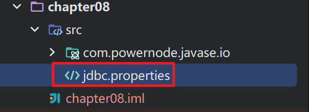

```java
package com.powernode.javase.io;

import java.io.FileReader;
import java.util.Properties;

/**
 * 使用Properties集合类 + IO流来读取属性配置文件。
 * 将属性配置文件中的配置信息加载到内存中。
 */
public class LoadProperties {
    public static void main(String[] args) throws Exception {
        // 创建输入流对象
        //FileReader reader = new  FileReader("chapter08/src/jdbc.properties");
        String path = Thread.currentThread().getContextClassLoader().getResource("jdbc.properties").getPath();
        FileReader reader = new FileReader(path);

        // 创建一个Map集合（属性类对象）
        Properties pro = new Properties();

        // 加载：将jdbc.properties文件中的配置信息加载到Properties对象中。
        pro.load(reader);

        // 获取所有key
        /*Enumeration<?> names = pro.propertyNames();
        while (names.hasMoreElements()) {
            String name = (String)names.nextElement();
            String value = pro.getProperty(name);
            System.out.println(name + "=" + value);
        }*/

        // 通过key来获取value
        String driver = pro.getProperty("driver");
        String url = pro.getProperty("url");
        String user = pro.getProperty("user");
        String password = pro.getProperty("password");

        System.out.println(driver);
        System.out.println(url);
        System.out.println(user);
        System.out.println(password);
        /*
        com.mysql.cj.jdbc.Driver
        jdbc:mysql://localhost:3306/powernode
        admin
        123456789
         */

        // 关闭输入流
        reader.close();
    }
}
```


### 第二种方式

```jdbc.properties
//当然，也可以使用Java中的工具类快速获取配置信息：ResourceBundle
	//这种方式要求文件必须是xxx.properties
	//属性配置文件必须放在类路径当中
#connect mysql database info
driver=com.mysql.cj.jdbc.Driver
url=jdbc:mysql://192.168.137.154:3306/powernode
user=admin
password=11111
```

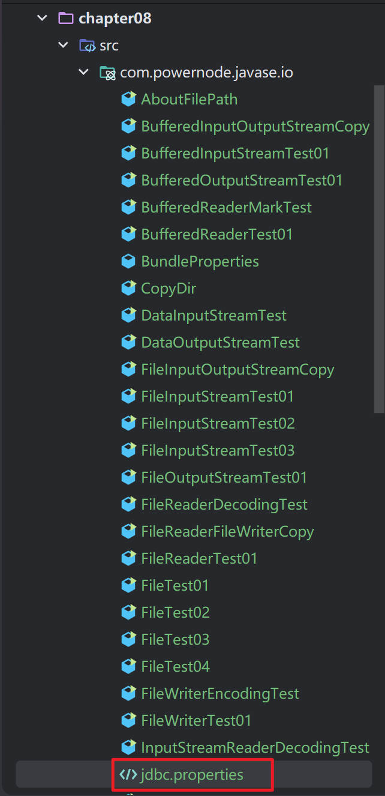

```java
package com.powernode.javase.io;

import java.util.ResourceBundle;

/**
 * 使用JDK中提供的资源绑定器来绑定属性配置文件。
 */
public class BundleProperties {
    public static void main(String[] args) {
        // 获取资源绑定器对象
        // 使用这个工具要求文件也必须是一个属性配置文件。xxx.properties
        ResourceBundle bundle = ResourceBundle.getBundle("com.powernode.javase.io.jdbc");
        //ResourceBundle bundle = ResourceBundle.getBundle("com/powernode/javase/io/jdbc");

        // 这个获取的是类的根路径下的jdbc.properties文件。
        //ResourceBundle bundle = ResourceBundle.getBundle("jdbc");
        // 这个代码的意思是从类的根路径下找db.properties文件。
        //ResourceBundle bundle = ResourceBundle.getBundle("db");

        // 以下两行都是错误的：资源找不到。
        //ResourceBundle bundle = ResourceBundle.getBundle("com.powernode.javase.io.db.properties");
        //ResourceBundle bundle = ResourceBundle.getBundle("com/powernode/javase/io/db.properties");

        // 通过key获取value
        String driver = bundle.getString("driver");
        String url = bundle.getString("url");
        String user = bundle.getString("user");
        String password = bundle.getString("password");

        System.out.println(driver);
        System.out.println(url);
        System.out.println(user);
        System.out.println(password);
        /*
        com.mysql.cj.jdbc.Driver
        jdbc:mysql://192.168.137.154:3306/powernode
        admin
        11111
         */
    }
}
```


## 装饰器设计模式(Decorator Pattern)


### 概述

```java
1.思考：如何扩展一个类的功能？继承确实也可以扩展对象的功能，但是接口下的实现类很多，每一个子类都需要提供一个子类。就需要编写大量的子类来重写父类的方法。会导致子类数量至少翻倍，会导致类爆炸问题。
    
2.装饰器设计模式是GoF23种设计模式之一，属于结构型设计模式。（结构型设计模式通常处理对象和类之间的关系，使程序员能够更好地组织代码并更好地利用现有代码。）
    
3.IO流中使用了大量的装饰器设计模式。
    
4.装饰器设计模式作用：装饰器模式可以做到在不修改原有代码的基础之上，完成功能扩展，符合OCP原则。并且避免了使用继承带来的类爆炸问题。
    
5.装饰器设计模式中涉及到的角色包括：
	抽象的装饰者
	具体的装饰者1、具体的装饰者2
	被装饰者
	装饰者和被装饰者的公共接口/公共抽象类
```

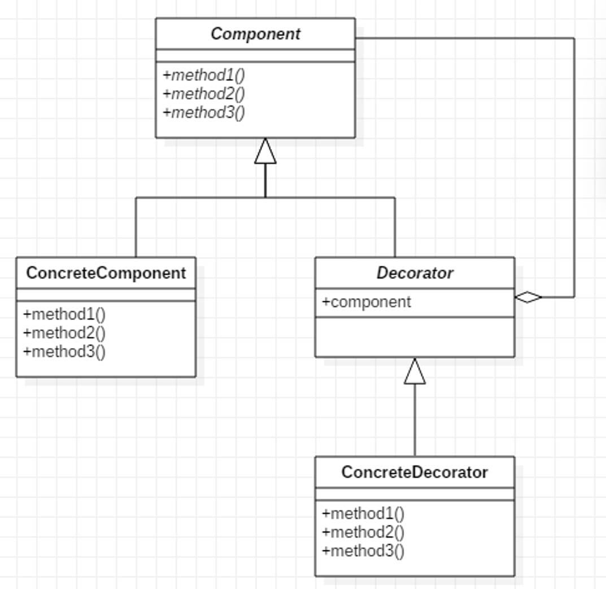


### 优化前

```java
使用子类对父类的方法进行扩展。
 	这种功能扩展方式，虽然符合OCP。没有修改之前的原代码。
 	但是这种继承导致的问题有两个：
       第一个：代码耦合度高。
       第二个：类爆炸问题。
```

```java
package com.powernode.javase.io.decorator;

/**
 * 可飞翔的
 */
public interface Flyable {
    /**
     * 飞翔
     */
    void fly();
}
```

```java
package com.powernode.javase.io.decorator;

public class Cat implements Flyable {
    @Override
    public void fly() {
        System.out.println("Cat fly");
    }
}
```

```java
package com.powernode.javase.io.decorator;

public class Bird implements Flyable {
    @Override
    public void fly() {
        System.out.println("Bird fly");
    }
}
```

```java
package com.powernode.javase.io.decorator;

public class CatSub extends Cat{
    @Override
    public void fly() {
        long begin = System.currentTimeMillis();
        super.fly();
        long end = System.currentTimeMillis();
        System.out.println("耗时"+(end - begin)+"毫秒");
    }
}
```

```java
package com.powernode.javase.io.decorator;

/**
 * 采用继承的方式，写了一个子类，对父类的行为进行功能扩展。
 */
public class BirdSub extends Bird{
    @Override
    public void fly() {
        long begin = System.currentTimeMillis();
        super.fly();
        long end = System.currentTimeMillis();
        System.out.println("耗时"+(end - begin)+"毫秒");
    }
}
```

```java
package com.powernode.javase.io.decorator;

public class Test {
    public static void main(String[] args) {
        //Flyable flyable1 = new Cat();
        Flyable flyable1 = new CatSub();
        flyable1.fly();

        //Flyable flyable2 = new Bird();
        Flyable flyable2 = new BirdSub();
        flyable2.fly();
    }
}
```

> **测试:**
>
> 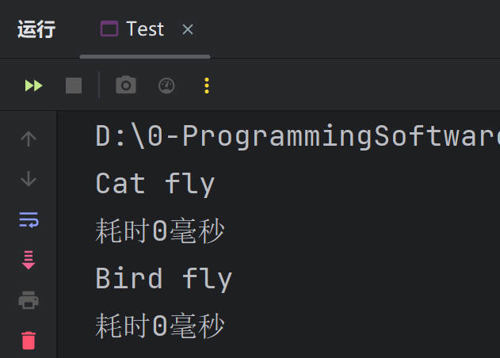


### 优化后

```java
0. 装饰器设计模式的主要目标：在松耦合的前提下，能够完成功能的扩展。
    
1. 在装饰器设计模式中有两个非常重要的角色：装饰者，被装饰者。
    
2. 装饰器设计模式当中要求：装饰者 与 被装饰者 应实现同一个接口/同一些接口，继承同一个抽象类....
    
3. 为什么装饰者 与 被装饰者 要实现同一个接口呢？
	因为实现了同一个接口之后，对于客户端程序来说，使用装饰者的时候就向在使用被装饰者一样。
    
4. 装饰者含有被装饰者的引用。(A has a B。尽量使用has a【耦合度低一些】。不要使用is a。)
```


```java
package com.powernode.javase.io.decorator1;

public interface Flyable {
    void fly();
}
```

```java
package com.powernode.javase.io.decorator1;

// 被装饰者
public class Cat implements Flyable {
    @Override
    public void fly() {
        System.out.println("Cat fly!");
    }
}
```

```java
package com.powernode.javase.io.decorator1;

// 被装饰者
public class Bird implements Flyable {
    @Override
    public void fly() {
        System.out.println("Bird fly!");
    }
}
```

```java
package com.powernode.javase.io.decorator1;

/**
 * 所有的装饰者应该有一个共同的父类。这个父类通常是一个抽象类。
 * 所有装饰者的头领。
 */
public abstract class FlyableDecorator implements Flyable {
    private Flyable flyable;

    public FlyableDecorator(Flyable flyable) {
        this.flyable = flyable;
    }

    @Override
    public void fly() {
        flyable.fly();
    }
}
```

```java
package com.powernode.javase.io.decorator1;

// 装饰者
public class TimerDecorator extends FlyableDecorator {

    // 有一个被装饰者的引用。
    // 这个引用的类型最好是抽象的。不是具体的。
    // 因为Cat和Bird都实现了接口Flyable。
    // 因此这里的被装饰者引用，它的类型是 Flyable
    //private Flyable flyable;
    public TimerDecorator(Flyable flyable) {
        super(flyable);
    }

    @Override
    public void fly() {
        // 这里可以添加代码（前增强）
        long begin = System.currentTimeMillis();
        super.fly();
        // 这里可以添加代码（后增强）
        long end = System.currentTimeMillis();
        System.out.println("耗时"+(end - begin)+"毫秒");
    }
}
```

```java
package com.powernode.javase.io.decorator1;

import java.text.SimpleDateFormat;
import java.util.Date;

// 装饰者
public class LogDecorator extends FlyableDecorator {

    public LogDecorator(Flyable flyable) {
        super(flyable);
    }

    @Override
    public void fly() {
        Date now = new Date();
        SimpleDateFormat sdf = new SimpleDateFormat("yyyy-MM-dd HH:mm:ss SSS");
        System.out.println(sdf.format(now) + ": 起飞前的准备");

        super.fly();

        now = new Date();
        System.out.println(sdf.format(now) + ": 安全降落");
    }
}
```

```java
package com.powernode.javase.io.decorator1;

public class Test {
    public static void main(String[] args) {
        //Flyable flyable1 = new Cat();
        Flyable flyable1 = new TimerDecorator(new Cat());
        //Flyable flyable1 = new LogDecorator(new Cat());
        flyable1.fly();

        //Flyable flyable2 = new Bird();
        Flyable flyable2 = new TimerDecorator(new Bird());
        //Flyable flyable2 = new LogDecorator(new Cat());
        flyable2.fly();
    }
}
```


## 压缩和解压缩流


### 概述

* 在现实生活中，如果在网络中我们要传输的数据太大，此时我们就可以先压缩再传输。


* 同理，如果我们接收到一个压缩包，还需要解压（解压缩）才能使用。


### IO 体系

* `解压缩流`主要是读取压缩包中的内容，所以它属于`读`，即：输入流。
* `压缩流`主要是将文件中的数据写到压缩包中，属于它属于`写`，即：输出流。

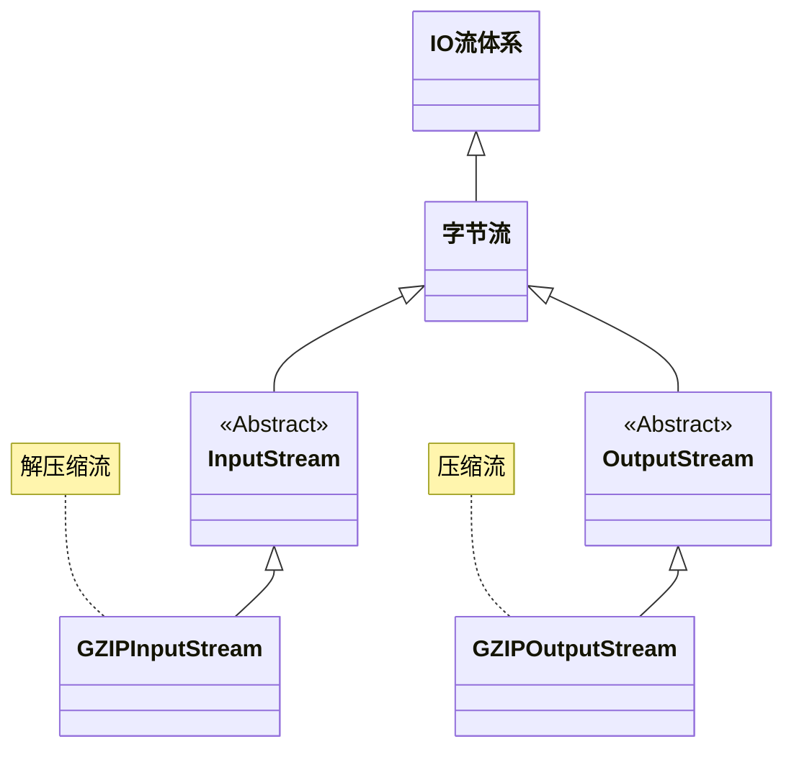
```mermaid
classDiagram
    IO 流体系 <|-- 字节流 
    字节流 <|-- InputStream 
    字节流 <|-- OutputStream 
    InputStream <|-- GZIPInputStream
    note for GZIPInputStream "解压缩流"
    OutputStream <|-- GZIPOutputStream
    note for GZIPOutputStream "压缩流"
    class InputStream{
        <<Abstract>>
    }
    class OutputStream{
        <<Abstract>>
    }
```


### GZIPOutputStream（压缩）

```java
1.GZIPOutputStream（压缩）
使用GZIPOutputStream可以将文件制作为压缩文件，压缩文件的格式为 .gz 格式。
    
2.核心代码：
	FileInputStream fis = new FileInputStream("d:/test.txt"); // 被压缩的文件：test.txt
	GZIPOutputStream gzos = new GZIPOutputStream(new FileOutputStream("d:/test.txt.gz")) // 压缩后的文件
	接下来就是边读边写：
	int length;
	while ((length = fis.read(buffer)) > 0) {
		gzos.write(buffer, 0, length);
	}
	gzos.finish(); // 在压缩完所有数据之后调用finish()方法，以确保所有未压缩的数据都被刷新到输出流中，并生成必要的 Gzip 结束标记，标志着压缩数据的结束。

3.注意（补充）：实际上所有的输出流中，只有带有缓冲区的流才需要手动刷新，节点流是不需要手动刷新的，节点流在关闭的时候会自动刷新。
```

```java
package com.powernode.javase.io;

import java.io.FileInputStream;
import java.io.FileOutputStream;
import java.util.zip.GZIPOutputStream;

/**
 * java.util.zip.GZIPOutputStream：专门进行文件压缩的。（生成的文件格式是: xxx.gz）
 */
public class GZIPOutputStreamTest {
    public static void main(String[] args) throws Exception {

        // 创建文件字节输入流（读某个文件，这个文件将来就是被压缩的。）
        FileInputStream in = new FileInputStream("D:\\0-JavaSE\\powernode-java\\test.txt");

        // 创建一个GZIP压缩流对象
        GZIPOutputStream gzip = new GZIPOutputStream(new FileOutputStream("D:\\0-JavaSE\\powernode-java\\test.txt.gz"));

        // 开始压缩（一边读一边写）
        byte[] bytes = new byte[1024];
        int readCount = 0;
        while ((readCount = in.read(bytes)) != -1) {
            gzip.write(bytes, 0, readCount);
        }


        // 非常重要的代码需要调用
        // 刷新并且最终生成压缩文件。
        gzip.finish();

        // 关闭流
        in.close();
        gzip.close();
    }
}
```

> **测试:**
>
> 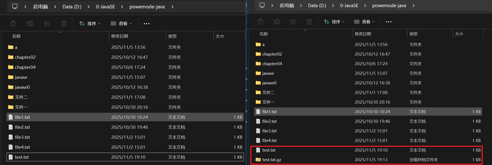


### GZIPInputStream（解压缩）

```java
1.GZIPInputStream（解压缩）
使用GZIPInputStream可以将 .gz 格式的压缩文件解压。
    
2.核心代码：
	GZIPInputStream gzip = new GZIPInputStream(new 			FileInputStream("d:/test.txt.gz"));
	FileOutputStream out = new FileOutputStream("d:/test.txt");
	byte[] bytes = new byte[1024];
	int readCount = 0;
	while((readCount = gzip.read(bytes)) != -1){
		out.write(bytes, 0, readCount);
	}
```

```java
package com.powernode.javase.io;

import java.io.FileInputStream;
import java.io.FileOutputStream;
import java.util.zip.GZIPInputStream;

/**
 * java.util.zip.GZIPInputStream：负责解压缩的。解压缩的文件扩展名：xxx.gz
 */
public class GZIPInputStreamTest {
    public  static void main(String[] args) throws Exception {
        // 创建GZIP解压缩流对象
        GZIPInputStream gzip = new GZIPInputStream(new FileInputStream("D:\\0-JavaSE\\powernode-java\\test.txt.gz"));

        // 创建文件字节输出流
        FileOutputStream out = new FileOutputStream("D:\\0-JavaSE\\powernode-java\\test.txt");

        // 一边读一边写
        byte[] bytes = new byte[1024];
        int readCount = 0;
        while ((readCount = gzip.read(bytes)) != -1) {
            out.write(bytes, 0, readCount);
        }

        // 关闭流
        gzip.close();
        // 节点流关闭的时候会自动刷新，包装流是需要手动刷新的。（补充的知识点。）
        out.close();
    }
}
```

> **测试:**
>
> 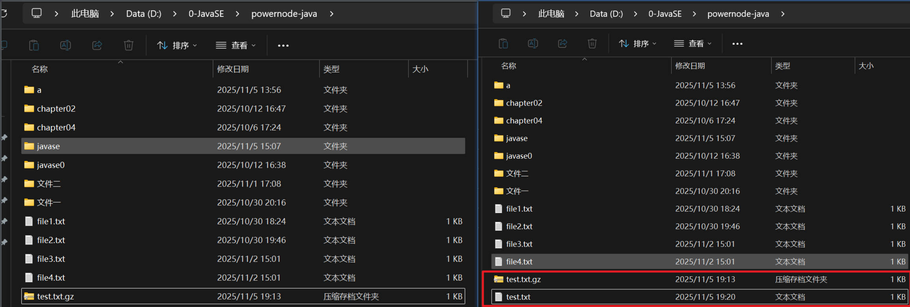


## 字节数组流(内存流)

### 概述

```java
1.ByteArrayInputStream和ByteArrayOutputStream都是内存操作流，不需要打开和关闭文件等操作。这些流是非常常用的，可以将它们看作开发中的常用工具，能够方便地读写字节数组、图像数据等内存中的数据。
    
2.ByteArrayInputStream和ByteArrayOutputStream都是节点流。
    
3.ByteArrayOutputStream，将数据写入到内存中的字节数组当中。
    
4.ByteArrayInputStream，读取内存中某个字节数组中的数据。
```

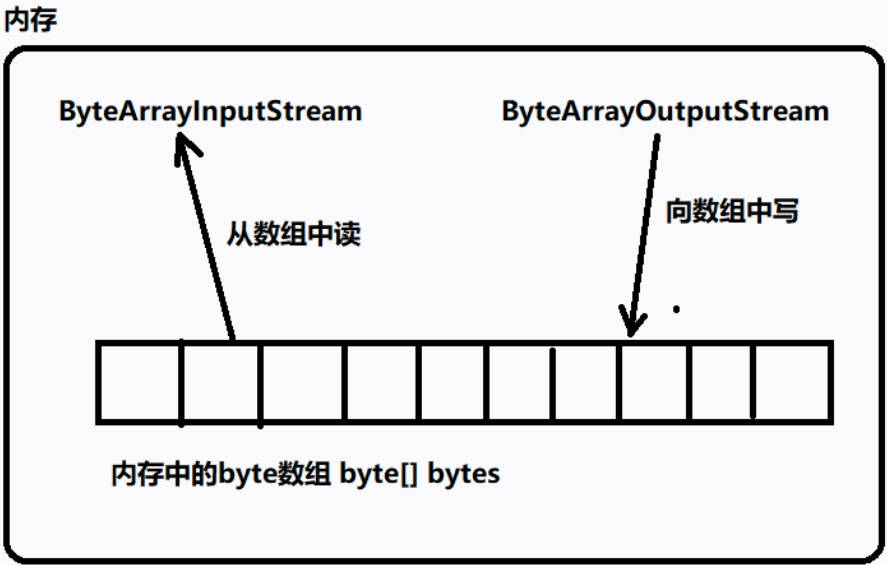


### ByteArrayOutputStream

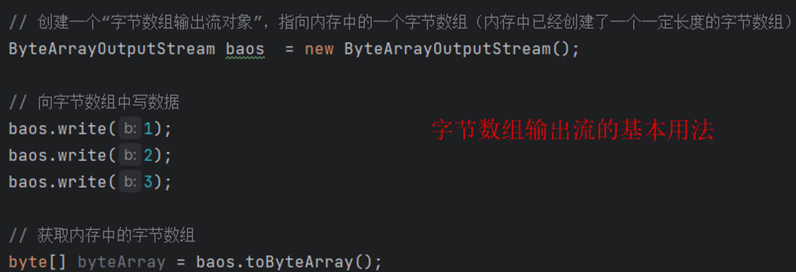

```java
package com.powernode.javase.io;

import java.io.ByteArrayOutputStream;

/**
 * java.io.ByteArrayOutputStream：向内存中的字节数组写数据。
 */
public class ByteArrayOutputStreamTest01 {
    public static void main(String[] args) {

        // ByteArrayOutputStream的基本用法。
        ByteArrayOutputStream baos = new ByteArrayOutputStream(); //节点流

        // 开始写
        baos.write(1);
        baos.write(2);
        baos.write(3);

        // 怎么获取内存中的哪个byte[]数组呢？
        byte[] byteArray = baos.toByteArray();
        for(byte b : byteArray){
            System.out.println(b);
            /*
            1
            2
            3
             */
        }
    }
}
```


### ByteArrayInputStream和ByteArrayOutputStream结合使用

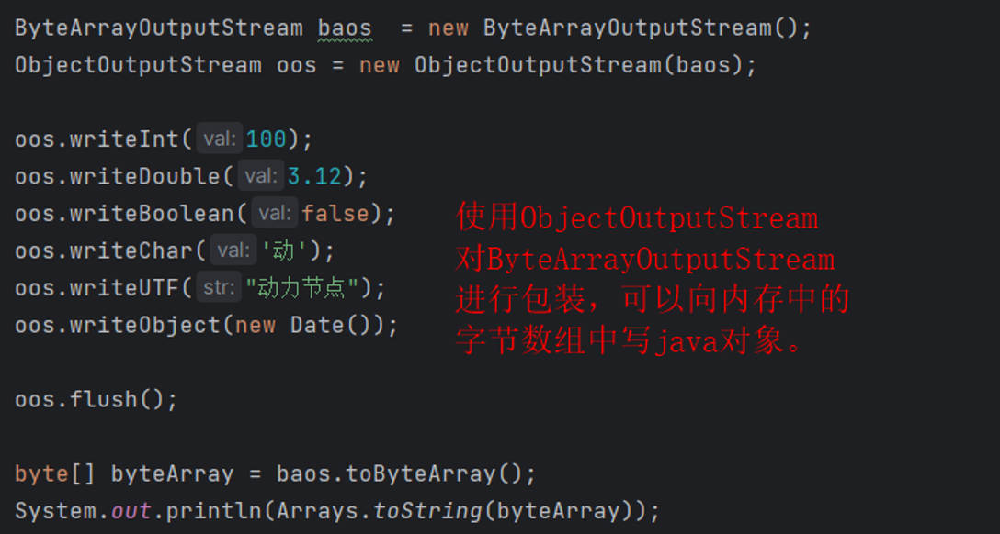

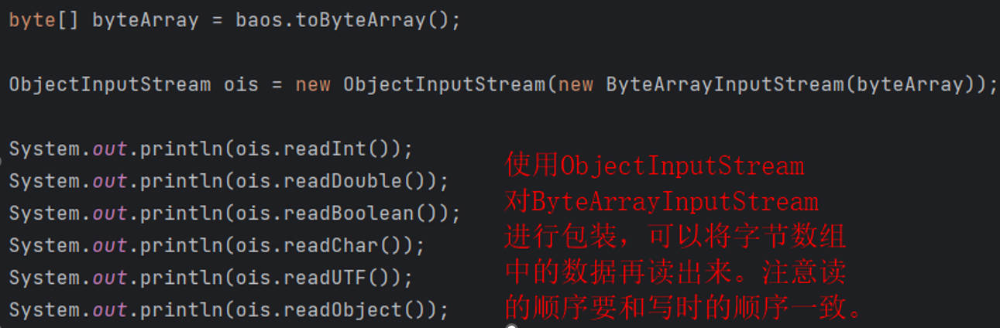

```java
package com.powernode.javase.io;

import java.io.ByteArrayInputStream;
import java.io.ByteArrayOutputStream;
import java.io.ObjectInputStream;
import java.io.ObjectOutputStream;
import java.util.Date;

/**
 * 了解了装饰器设计模式之后，我们就知道了，包装流和节点流是可以随意组合的。
 * ObjectOutputStream（包装流）和ByteArrayOutputStream（节点流）进行组合。
 */
public class ByteArrayOutputStreamTest02 {
    public static void main(String[] args) throws Exception {

        // 节点流
        ByteArrayOutputStream baos = new ByteArrayOutputStream();

        // 包装流
        ObjectOutputStream oos = new ObjectOutputStream(baos);

        // 开始写
        oos.writeInt(100);
        oos.writeBoolean(false);
        oos.writeDouble(3.14);
        oos.writeUTF("动力节点");
        oos.writeObject(new Date());

        // 使用了包装流就需要手动刷新一下。
        oos.flush();

        // 获取内存中的大byte数组
        byte[] byteArray = baos.toByteArray();
        /*for(byte b : byteArray){
            System.out.println(b);
        }*/


        // 使用ByteArrayInputStream将上面这个byte数组恢复。
        // 读的过程，读内存中的大byte数组。
        // 节点流
        ByteArrayInputStream bais = new ByteArrayInputStream(byteArray);
        // 包装流
        ObjectInputStream ois = new ObjectInputStream(bais);

        // 开始读
        System.out.println(ois.readInt()); // 100
        System.out.println(ois.readBoolean()); // false
        System.out.println(ois.readDouble()); // 3.14
        System.out.println(ois.readUTF()); // 动力节点
        System.out.println(ois.readObject()); // Wed Nov 05 19:56:00 CST 2025
    }
}
```


## 对象克隆

### 对象的深克隆

```java
1.除了我们之前所讲的深克隆方式（之前的深克隆是重写clone()方法）。使用字节数组流也可以完成对象的深克隆。

2.原理是：将要克隆的Java对象写到内存中的字节数组中，再从内存中的字节数组中读取对象，读取到的对象就是一个深克隆。

3.目前为止，对象拷贝方式：

	3.1.调用Object的clone方法，默认是浅克隆，需要深克隆的话，就需要重写clone方法。

	3.2.可以通过序列化和反序列化完成对象的克隆。

	3.3.也可以通过ByteArrayInputStream和ByteArrayOutputStream完成深克隆。
```

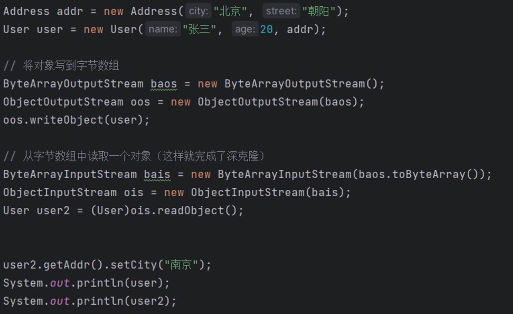

```java
package com.powernode.javase.io.clone;

import java.io.Serial;
import java.io.Serializable;

public class User implements Serializable {

    @Serial
    private static final long serialVersionUID = 5814035595699736480L;

    private String name;
    private int age;
    private Address addr;

    public User() {
    }

    public User(String name, int age, Address addr) {
        this.name = name;
        this.age = age;
        this.addr = addr;
    }

    public String getName() {
        return name;
    }

    public void setName(String name) {
        this.name = name;
    }

    public int getAge() {
        return age;
    }

    public void setAge(int age) {
        this.age = age;
    }

    public Address getAddr() {
        return addr;
    }

    public void setAddr(Address addr) {
        this.addr = addr;
    }

    @Override
    public String toString() {
        return "User{" +
                "name='" + name + '\'' +
                ", age=" + age +
                ", addr=" + addr +
                '}';
    }
}
```

```java
package com.powernode.javase.io.clone;

import java.io.Serial;
import java.io.Serializable;

public class Address implements Serializable {

    @Serial
    private static final long serialVersionUID = -7874768952114783060L;

    private String city;
    private String street;

    public Address() {
    }

    public Address(String city, String street) {
        this.city = city;
        this.street = street;
    }

    public String getCity() {
        return city;
    }

    public void setCity(String city) {
        this.city = city;
    }

    public String getStreet() {
        return street;
    }

    public void setStreet(String street) {
        this.street = street;
    }

    @Override
    public String toString() {
        return "Address{" +
                "city='" + city + '\'' +
                ", street='" + street + '\'' +
                '}';
    }
}
```

```java
package com.powernode.javase.io.clone;

import java.io.ByteArrayInputStream;
import java.io.ByteArrayOutputStream;
import java.io.ObjectInputStream;
import java.io.ObjectOutputStream;

/**
 * 使用ByteArrayOutputStream和ByteArrayInputStream直接复制的对象就是一个深克隆。
 */
public class DeepCloneTest {
    public static void main(String[] args) throws Exception {
        // 准备对象
        Address addr = new Address("北京","朝阳");
        User user = new User("zhangsan",20,addr);

        // 将Java对象写到一个byte数组中。
        ByteArrayOutputStream bos = new ByteArrayOutputStream();
        ObjectOutputStream oos = new ObjectOutputStream(bos);

        oos.writeObject(user);

        oos.flush();

        // 从byte数组中读取数据恢复java对象
        ByteArrayInputStream bis = new ByteArrayInputStream(bos.toByteArray());
        ObjectInputStream ois = new ObjectInputStream(bis);

        // 这就是哪个经过深拷贝之后的新对象
        User user2 = (User)ois.readObject();

        user2.getAddr().setCity("南京");

        System.out.println(user); // User{name='zhangsan', age=20, addr=Address{city='北京', street='朝阳'}}
        System.out.println(user2); // User{name='zhangsan', age=20, addr=Address{city='南京', street='朝阳'}}
    }
}
```
