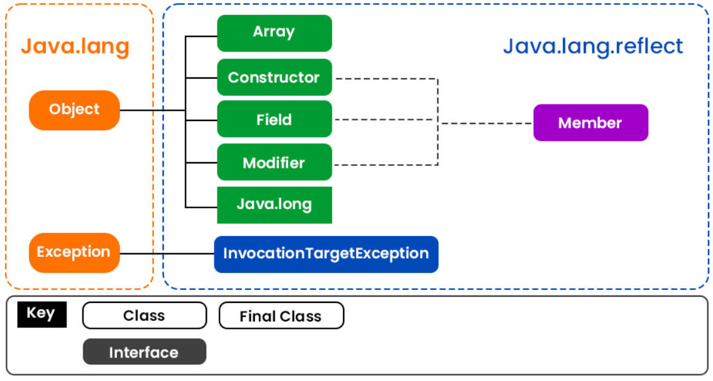
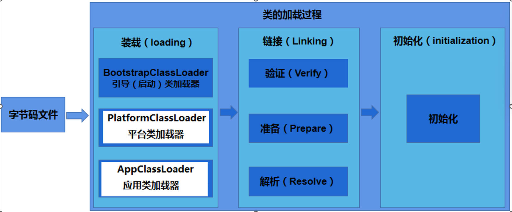
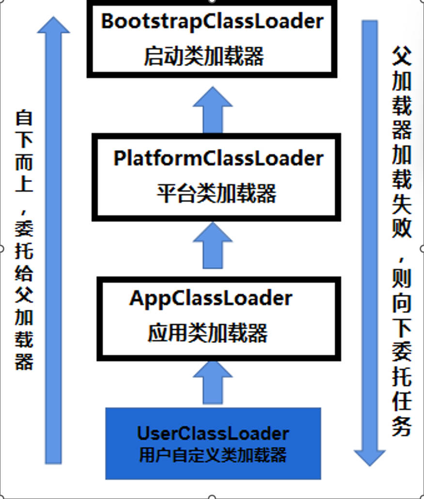

## 反射机制概述

```java
1. 反射机制是JDK中的一套类库，这套类库可以帮助我们操作/读取 class 字节码文件。

2. 后期学习的大量的java框架，底层都是基于反射机制实现的，所以必须掌握（要能够数量的使用反射机制中的方法）。

3. 反射机制可以让程序更加灵活。怎么灵活？？？？
    
4. 反射机制最核心的几个类：
      java.lang.Class：Class类型的实例代表硬盘上的某个class文件。或者说代表某一种类型。
      java.lang.reflect.Filed：Filed类型的实例代表类中的属性/字段
      java.lang.reflect.Constructor: Constructor类型的实例代表类中的构造方法
      java.lang.reflect.Method: Method类型的实例代表类中的方法
```

> **Java反射机制`核心包`：`java.lang.reflect.*`**



> **Java 的反射 API 提供了一系列的`类和接口`来`操作 Class 对象`。主要的类包括：**

- **`java.lang.Class`**：表示类的对象。提供了方法来获取类的字段、方法、构造函数等。
- **`java.lang.reflect.Field`**：表示类的字段（属性）。提供了访问和修改字段的能力。
- **`java.lang.reflect.Method`**：表示类的方法。提供了调用方法的能力。
- **`java.lang.reflect.Constructor`**：表示类的构造函数。提供了创建对象的能力。


## 获取Class的方式

```java
Java中获取Class对象有以下三种方式：

1. 调用Object类的getClass()方法
可以通过对象的getClass()方法来获取Class对象，例如：
Object obj = new Object();
Class clazz = obj.getClass();
注意：这个方法是通过(对象实例)引用去调用的。

2. 使用“类.class”语法
可以使用“类.class”语法来获取Class对象，例如：
Class clazz = Object.class;

3. 使用Class类的forName()方法
Class c = Class.forName("完整的全限定类名");
可以使用Class类的forName()方法来获取Class对象，例如：
Class clazz = Class.forName("java.lang.Object");
注意：
	1.全限定类名是带有包名的。
	2.是lang包下的，java.lang也不能省略。
	3.这是个字符串(String)参数。
	4.如果这个类根本不存在，运行时会报异常：java.lang.ClassNotFoundException
	5.这个方法的执行会导致类的加载动作的发生。
```

```java
package com.powernode.javase.reflect;

public class User {

    static{
        System.out.println("User类的静态代码块执行了!");
    }

    private String name;
    private int age;

    public User() {
    }

    public User(String name, int age) {
        this.name = name;
        this.age = age;
    }

    public String getName() {
        return name;
    }

    public void setName(String name) {
        this.name = name;
    }

    public int getAge() {
        return age;
    }

    public void setAge(int age) {
        this.age = age;
    }

    @Override
    public String toString() {
        return "User{" +
                "name='" + name + '\'' +
                ", age=" + age +
                '}';
    }
}
```

```java
package com.powernode.javase.reflect;

public class ReflectTest01 {
    public static void main(String[] args) throws ClassNotFoundException {

        // stringClass 就代表 String类型。
        // stringClass 就代表硬盘上的 String.class文件。
        Class stringClass = Class.forName("java.lang.String");

        // 获取 User 类型(自定义类型)
        Class userClass = Class.forName("com.powernode.javase.reflect.User");


        String s1 = "动力节点";
        Class stringClass2 = s1.getClass();
        // 某种类型的字节码文件在内存当中只有一份。
        // stringClass 和 stringClass2 都代表了同一种类型：String类型
        System.out.println(stringClass == stringClass2); // true


        // 获取 User 类型(自定义类型)
        User user = new User("zhangsan",20);
        Class userClass2 = user.getClass();
        // userClass 和 userClass2 都代表了同一种类型：User类型
        System.out.println(userClass == userClass2);


        // intClass 代表的就是基本数据类型 int类型
        Class intClass = int.class;
        Class doubleClass = double.class;
        Class stringClass3 = String.class;
        Class userClass3 = User.class;

        System.out.println(stringClass3 == stringClass); // true
    }
}
```

```java
User类的静态代码块执行了!
true
true
true
```


### 获取到Class类型实例后的作用

> **反射可以`动态创建类的实例`，支持调用`无参构造和有参构造`**
>
> + **`clazz.newInstance()` 仅支持`无参构造`，且要求`构造器为公有`；**
>
> > **通过 Class 对象的 `newInstance()` 方法**
>
> ```java
> Class userClass = Class.forName("com.powernode.javase.reflect.User"); // userClass 代表的就是 User类型。
> User user = (User) userClass.newInstance();
> ```

```java
package com.powernode.javase.reflect;

public class User {

    static{
        System.out.println("User类的静态代码块执行了!");
    }

    private String name;
    private int age;

    public User() {
        System.out.println("User类的无参数构造方法执行了！");
    }

    public User(String name, int age) {
        this.name = name;
        this.age = age;
    }

    public String getName() {
        return name;
    }

    public void setName(String name) {
        this.name = name;
    }

    public int getAge() {
        return age;
    }

    public void setAge(int age) {
        this.age = age;
    }
}
```

```java
package com.powernode.javase.reflect;

/**
 * 获取到Class之后能干啥？
 *      1. 至少可以实例化对象。
 */
public class ReflectTest02 {
    public static void main(String[] args) throws Exception {

        // 获取到Class类型的实例之后，可以实例化对象
        // 通过反射机制实例化对象
        Class userClass = Class.forName("com.powernode.javase.reflect.User"); // userClass 代表的就是 User类型。

        // 通过userClass来实例化User类型的对象
        // 底层实现原理是：调用了User类的无参数构造方法完成了对象的实例化。
        // 要使用这个方法实例化对象的话，必须保证这个类中是存在无参数构造方法的。如果没有无参数构造方法，则出现异常：java.lang.InstantiationException
        User user = (User) userClass.newInstance();

        System.out.println(user);

        User user2 = (User) userClass.newInstance();
        // 底层实例化出两个对象，指向的地址不同
        System.out.println(user == user2); // flase
    }
}
```

```java
User类的静态代码块执行了!
User类的无参数构造方法执行了！
com.powernode.javase.reflect.User@2f4d3709
User类的无参数构造方法执行了！
false
```


## 反射作用的体现

```java
1.在属性配置文件中配置类名：classInfo.properties
className=java.util.Date

2.通过IO流读取属性配置文件，获取类名，再通过反射机制实例化对象。

3.如果要创建其他类的实例对象，只需要修改classInfo.properties配置文件即可。

4.这说明反射机制可以让程序变的更加灵活。在进行系统扩展时，可以达到OCP开闭原则。
```

```classInfo.properties
className=java.util.Date
```

```java
package com.powernode.javase.reflect;

import java.util.ResourceBundle;

/**
 * 读取属性配置文件，获取类名，通过反射机制实例化对象。
 * 通过这个案例的演示就知道反射机制是灵活的。这个程序可以做到对象的动态创建。
 * 只要修改属性配置文件就可以完成不同对象的实例化。
 */
public class ReflectTest03 {
    public static void main(String[] args) throws Exception {
        // 资源绑定器
        ResourceBundle bundle = ResourceBundle.getBundle("com.powernode.javase.reflect.classInfo");

        // 通过key获取value
        String className = bundle.getString("className");

        // 通过反射机制实例化对象
        Class classObj = Class.forName(className);

        // 实例化
        Object obj = classObj.newInstance();

        System.out.println(obj);
    }
}
```

```java
Thu Nov 13 16:26:36 CST 2025
```


## 反射Field

```java
功能：表示类的字段（属性），提供了访问和修改字段值的方法。

主要方法：
	get(Object obj)：获取指定对象的字段值。
	set(Object obj, Object value)：设置指定对象的字段值。
    getName(): 获取属性名（如 name、age）
	getType()：获取属性类型（如 int、String）
    	     getSimpleName(): 获取不带包名的简短类名（如 java.lang.String 简短类名为 String）
	getModifiers()：获取字段的修饰符（如 public、private）。
```


### 通过反射机制获取Field

```java
一方面：通过反射机制获取Field
	Field field = clazz.getDeclaredField("fieldName"); // 通过属性名获取 

	Field[] fields = clazz.getDeclaredFields(); // 获取所有的属性，包括私有的
```

```java
package com.powernode.javase.reflect;

/**
 * 有Class，能不能获取类型名？
 */
public class ReflectTest05 {
    public static void main(String[] args) {
        // c 代表 String 类型
        Class c = "动力节点".getClass();

        // 获取类型名
        System.out.println(c.getName()); // java.lang.String

        // 获取不带包名的简短类名
        System.out.println(c.getSimpleName()); // String
    }
}
```

```java
package com.powernode.javase.reflect;

public class Vip {
    // Field(属性)
    public String name; // 公开的

    private int age; // 私有的

    protected String birth; // 受保护的

    boolean gender; // 默认的

    public static String address = "北京海淀"; // 静态的

    public static final String GRADE = "金牌"; // 常量
}
```

```java
package com.powernode.javase.reflect;

import java.lang.reflect.Field;
import java.lang.reflect.Modifier;

/**
 * 关于反射机制中的 java.lang.reflect.Field（代表的是一个类中的字段/属性）
 */
public class ReflectTest04 {
    public static void main(String[] args) throws Exception {
        // 获取Vip类
        Class vipClass = Class.forName("com.powernode.javase.reflect.Vip");

        /*// 获取Vip类中所有 public 修饰的属性/字段
        Field[] fields = vipClass.getFields();
        System.out.println(fields.length);

        // 遍历数组
        for(Field field : fields){
            System.out.println(field.getName());
            /*
            name
            address
            GRADE
        }*/

        // 获取所有的属性，包括私有的
        Field[] fields = vipClass.getDeclaredFields();

        for (Field field : fields) {
            // 获取属性名
            System.out.println(field.getName());
            /*
            name
            age
            birth
            gender
            address
            GRADE
             */

            // 获取属性类型
            Class fieldType = field.getType();
            // 获取属性类型的简单名称
            System.out.println(fieldType.getSimpleName());
            /*
            String
            int
            String
            boolean
            String
            String
             */

            // 获取属性的修饰符
            // System.out.println(field.getModifiers());
            System.out.println(Modifier.toString(field.getModifiers()));
            /*
            public
            private
            protected

            public static
            public static final
             */
        }
    }
}
```


### 反编译某个(如 java.lang.String)类中所有的属性

```java
package com.powernode.javase.reflect;

public class Vip {
    // Field(属性)
    public String name; // 公开的

    private int age; // 私有的

    protected String birth; // 受保护的

    boolean gender; // 默认的

    public static String address = "北京海淀"; // 静态的

    public static final String GRADE = "金牌"; // 常量
}
```

```java
package com.powernode.javase.reflect;

import java.lang.reflect.Field;
import java.lang.reflect.Modifier;

public class ReflectTest06 {
    public static void main(String[] args) throws Exception {
        // 获取Vip类
       Class stringClass = Class.forName("com.powernode.javase.reflect.Vip");

        // 字符串拼接
        StringBuffer sb = new StringBuffer();

        // 获取类的修饰符
        sb.append(Modifier.toString(stringClass.getModifiers()));

        sb.append(" class ");

        //sb.append(stringClass.getSimpleName());
        sb.append(stringClass.getName());

        sb.append(" extends ");

        // 获取当前类的父类
        sb.append(stringClass.getSuperclass().getName());

        // 获取当前类的实现的所有接口
        Class[] interfaces = stringClass.getInterfaces();
        if (interfaces.length > 0) {
            sb.append(" implements ");
            for (int i = 0; i < interfaces.length; i++) {
                Class interfaceClass = interfaces[i];
                sb.append(interfaceClass.getName());
                if (i != interfaces.length - 1) {
                    sb.append(",");
                }
            }
        }

        sb.append("{\n");

        // 获取所有属性
        Field[] fields = stringClass.getDeclaredFields();
        for (Field field : fields){
            sb.append("\t");
            sb.append(Modifier.toString(field.getModifiers()));
            sb.append(" ");
            sb.append(field.getType().getName());
            sb.append(" ");
            sb.append(field.getName());
            sb.append(";\n");
        }

        sb.append("}");

        // 输出
        System.out.println(sb);
    }
}
```

> **输出结果:**

```java
public class com.powernode.javase.reflect.Vip extends java.lang.Object{
	public java.lang.String name;
	private int age;
	protected java.lang.String birth;
	 boolean gender;
	public static java.lang.String address;
	public static final java.lang.String GRADE;
}
```


### 通过Filed访问对象的属性

```java
另一方面：通过Filed访问对象的属性
	Object fieldValue = field.get(myObject); // 读取某个对象的属性值

	field.set(myObject, newValue); // 修改某个对象的属性值
```

```java
package com.powernode.javase.reflect;

public class Customer {
    public String name;
    private int age;
}
```

```java
package com.powernode.javase.reflect;

import java.lang.reflect.Field;

/**
 * 通过反射机制如何访问Field，如何给属性赋值，如何读取属性的值。
 */
public class ReflectTest07 {
    public static void main(String[] args) throws Exception{

        // 如果不使用反射机制，怎么访问对象的属性？
        Customer customer = new Customer();

        // 修改属性的值(set动作)
        // customer要素一
        // name要素二
        // "张三"要素三
        customer.name = "张三";

        // 读取属性的值(get动作)
        // 读取哪个对象的哪个属性
        System.out.println(customer.name);


        // 如果使用反射机制，怎么访问对象的属性？
        // 获取类
        Class clazz = Class.forName("com.powernode.javase.reflect.Customer");

        // 获取对应的Field
        Field ageField = clazz.getDeclaredField("age");

        // 调用方法打破封装
        ageField.setAccessible(true);

        // 修改属性的值
        // 给对象属性赋值三要素：给哪个对象 的 哪个属性 赋什么值
        ageField.set(customer,30);

        // 读取属性的值
        System.out.println("年龄：" + ageField.get(customer));

        // 通过反射机制给name属性赋值，和读取name属性的值
        Field nameField = clazz.getDeclaredField("name");
        // 修改属性name的值
        nameField.set(customer, "李四");
        // 读取属性name的值
        System.out.println(nameField.get(customer));
    }
}
```

```java
张三
年龄：30
李四
```


## 反射Method

```java
功能：表示类的方法，提供了调用方法的能力。
    
主要方法：
	invoke(Object obj, Object... args)：调用指定对象的方法。
	getReturnType()：获取方法的返回类型。
	getParameterTypes()：获取方法的参数类型。
	getModifiers()：获取方法的修饰符（如 public、private）。
```


### 通过反射机制获取Method

```java
一方面：通过反射机制获取Method
	Method method = clazz.getDeclaredMethod("methodName", paramTypes);
```

```java
package com.powernode.javase.reflect;

public class UserService {

    /**
     * 登录系统的方法
     * @param username 用户名
     * @param password 密码
     * @return
     */
    public boolean login(String username,String password){
        /*if(("admin").equals(username)&&("123456").equals(password)){
            return true;
        }
        return false;*/
        return "admin".equals(username) && "123456".equals(password);
    }


    /**
     * 退出系统的方法
     */
    public void logout(){
        System.out.println("系统已安全退出!");
    }
}
```

```java
package com.powernode.javase.reflect;

import java.lang.reflect.Method;
import java.lang.reflect.Modifier;
import java.lang.reflect.Parameter;

/**
 * 通过反射机制获取Method
 */
public class ReflectTest08 {
    public static void main(String[] args) throws Exception {
        // 获取类
        Class clazz = Class.forName("com.powernode.javase.reflect.UserService");

        // 获取所有的方法，包含私有的方法
        Method[] methods = clazz.getDeclaredMethods();
        // System.out.println(methods.length); // 2


        // 遍历
        for (Method method : methods) {
            // 方法修饰符
            System.out.println(Modifier.toString(method.getModifiers()));
            /*
            public
            public
             */

            // 方法返回值类型
            System.out.println(method.getReturnType().getName());
            /*
            boolean
            void
             */

            // 方法名
            System.out.println(method.getName());
            /*
            loging
            logout
             */

            // 方法的参数列表
            /*Class<?>[] parameterTypes = method.getParameterTypes();
            for (Class parameterType : parameterTypes) {
                System.out.println(parameterType.getName());
                *//*
                java.lang.String
                java.lang.String
                 *//*
            }*/
            Parameter[] parameters = method.getParameters();
            for (Parameter parameter : parameters) {
                System.out.println(parameter.getType().getName());
                System.out.println(parameter.getName()); // arg0, arg1, arg2......
                /*
                arg0
                arg1
                 */
            }
        }
    }
}
```

```java
public
void
logout
public
boolean
login
java.lang.String
arg0
java.lang.String
arg1
```


### 反编译某个(如 java.lang.String)类中所有的属性

```java
package com.powernode.javase.reflect;

public class UserService {

    /**
     * 登录系统的方法
     * @param username 用户名
     * @param password 密码
     * @return
     */
    public boolean login(String username,String password){
        /*if(("admin").equals(username)&&("123456").equals(password)){
            return true;
        }
        return false;*/
        return "admin".equals(username) && "123456".equals(password);
    }


    /**
     * 退出系统的方法
     */
    public void logout(){
        System.out.println("系统已安全退出!");
    }
}
```

```java
package com.powernode.javase.reflect;

import java.lang.reflect.Method;
import java.lang.reflect.Modifier;
import java.lang.reflect.Parameter;

/**
 * 反射一个类中所有的方法，然后进行拼接字符串。
 */
public class ReflectTest09 {
    public static void main(String[] args) throws Exception {
        StringBuffer sb = new StringBuffer();
        Class stringClass = Class.forName("com.powernode.javase.reflect.UserService");

        // 获取类的修饰符
        sb.append(Modifier.toString(stringClass.getModifiers()));
        sb.append(" class ");
        // 获取类名
        sb.append(stringClass.getName());
        // 获取父类名
        sb.append(" extends ");
        sb.append(stringClass.getSuperclass().getName());
        // 获取父类接口
        Class[] interfaces = stringClass.getInterfaces();
        if (interfaces.length > 0) {
            sb.append(" implements ");
            for (int i = 0; i < interfaces.length; i++) {
                sb.append(interfaces[i].getName());
                if (i != interfaces.length - 1) {
                    sb.append(", ");
                }
            }
        }
        sb.append("{\n");

        // 类体
        // 获取所有的方法
        Method[] methods = stringClass.getDeclaredMethods();
        for(Method method : methods){
            sb.append("\t");
            // 追加修饰符
            sb.append(Modifier.toString(method.getModifiers()));
            // 追加返回值类型
            sb.append(" ");
            sb.append(method.getReturnType().getName());
            // 追加方法名
            sb.append(" ");
            sb.append(method.getName());
            sb.append("(");
            // 追加参数列表
            Parameter[] parameters = method.getParameters();
            for (int i = 0; i < parameters.length; i++) {
                Parameter parameter = parameters[i];
                sb.append(parameter.getType().getName());
                sb.append(" ");
                sb.append(parameter.getName());
                if(i != parameters.length - 1){
                    sb.append(",");
                }
            }
            sb.append("){}\n");
        }

        sb.append("}");

        // 输出
        System.out.println(sb);
    }
}
```

> **输出结果:**

```java
public class com.powernode.javase.reflect.UserService extends java.lang.Object{
	public boolean login(java.lang.String arg0,java.lang.String arg1){}
	public void logout(){}
}
```


### 通过Method调用方法

```java
另一方面：通过Method调用方法
	Class clazz = MyClass.class;
	Method method = clazz.getDeclaredMethod("methodName", paramTypes);
	Object[] args = {arg1, arg2, arg3};
	Object result = method.invoke(myObject, args);
```

```java
package com.powernode.javase.reflect;

public class UserService {

    /**
     * 登录系统的方法
     * @param username 用户名
     * @param password 密码
     * @return
     */
    public boolean login(String username,String password){
        /*if(("admin").equals(username)&&("123456").equals(password)){
            return true;
        }
        return false;*/
        return "admin".equals(username) && "123456".equals(password);
    }


    /**
     * 退出系统的方法
     */
    public void logout(){
        System.out.println("系统已安全退出!");
    }
}
```

```java
package com.powernode.javase.reflect;

import java.lang.reflect.Method;

/**
 * 通过反射机制调用Method
 */
public class ReflectTest10 {
    public static void main(String[] args) throws Exception {
        // 不使用反射机制怎么调用方法？
        // 创建对象
        UserService userService = new UserService();

        // 调用方法
        // 分析：调用一个方法需要几个要素？四要素
        // 调用哪个对象的哪个方法，传什么参数，返回什么值
        boolean isSuccess = userService.login("admin", "123456");
        System.out.println(isSuccess ? "登录成功" : "登录失败"); // 登录成功

        // 调用方法
        userService.logout(); // 系统已安全退出!


        // 通过反射机制调用login方法
        // 获取Class
        Class clazz = Class.forName("com.powernode.javase.reflect.UserService");

        // 获取login方法
        Method loginMethod = clazz.getDeclaredMethod("login", String.class, String.class);

        // 调用login方法
        Object retValue = loginMethod.invoke(userService, "admin", "123456");
        System.out.println(retValue); // true

        // 调用logout方法
        Method logoutMethod = clazz.getMethod("logout");
        logoutMethod.invoke(userService); // 系统已安全退出!
    }
}
```

```java
登录成功
系统已安全退出!
true
系统已安全退出!
```


## 反射Constructor

```java
功能：表示类的构造函数，提供了创建对象的能力。
    
主要方法：
	newInstance(Object... initargs)：创建一个新实例，使用指定的构造函数参数。
	getParameterTypes()：获取构造函数的参数类型。
	getModifiers()：获取构造函数的修饰符（如 public、private）。
```


### 反编译某个(如 java.lang.String)类中所有的属性

```java
一方面：通过反射机制获取Constructor
	Constructor constructor2 = clazz.getDeclaredConstructor(paramTypes); 
```

```java
package com.powernode.javase.reflect;

public class Order {
    private String no; // 编号
    private double price; // 价格
    private String state; // 状态

    @Override
    public String toString() {
        return "Order{" +
                "no='" + no + '\'' +
                ", price=" + price +
                ", state='" + state + '\'' +
                '}';
    }

    public Order() {
    }

    public Order(String no, double price, String state) {
        this.no = no;
        this.price = price;
        this.state = state;
    }

    public String getNo() {
        return no;
    }

    public void setNo(String no) {
        this.no = no;
    }

    public double getPrice() {
        return price;
    }

    public void setPrice(double price) {
        this.price = price;
    }

    public String getState() {
        return state;
    }

    public void setState(String state) {
        this.state = state;
    }
}
```

```java
package com.powernode.javase.reflect;

import java.lang.reflect.Constructor;
import java.lang.reflect.Modifier;
import java.lang.reflect.Parameter;

/**
 * 通过反射机制获取一个类中所有的构造方法
 */
public class ReflectTest11 {
    public static void main(String[] args) throws Exception {
        StringBuilder sb = new StringBuilder();
        // 获取类
        Class clazz = Class.forName("com.powernode.javase.reflect.Order");
        // 类的修饰符
        sb.append(Modifier.toString(clazz.getModifiers()));
        sb.append(" class ");
        // 类名
        sb.append(clazz.getName());
        sb.append(" extends ");
        // 父类名
        sb.append(clazz.getSuperclass().getName());
        // 实现的接口
        Class[] interfaces = clazz.getInterfaces();
        if(interfaces.length > 0) {
            sb.append(" implements ");
            for (int i = 0; i < interfaces.length; i++) {
                sb.append(interfaces[i].getName());
                if(i != interfaces.length - 1){
                    sb.append(",");
                }
            }
        }
        sb.append("{\n");

        //类体
        // 获取所有的构造方法
        Constructor[] cons = clazz.getDeclaredConstructors();
        // 遍历所有的构造方法
        for(Constructor con : cons){
            sb.append("\t");
            // 构造方法修饰符
            sb.append(Modifier.toString(con.getModifiers()));
            sb.append(" ");
            // 构造方法名
            sb.append(con.getName());
            sb.append("(");

            // 构造方法参数列表
            Parameter[] parameters = con.getParameters();
            for (int i = 0; i < parameters.length; i++) {
                Parameter parameter = parameters[i];
                sb.append(parameter.getType().getName());
                sb.append(" ");
                sb.append(parameter.getName());
                if(i != parameters.length - 1){
                    sb.append(",");
                }
            }

            sb.append("){}\n");
        }

        sb.append("}");

        System.out.println(sb);
    }
}
```

> **输出结果:**

```java
public class com.powernode.javase.reflect.Order extends java.lang.Object{
	public com.powernode.javase.reflect.Order(){}
	public com.powernode.javase.reflect.Order(java.lang.String arg0,double arg1,java.lang.String arg2){}
}
```


###  通过Constructor创建对象

```java
另一方面：通过Constructor创建对象
	Class clazz = MyClass.class;
	Constructor constructor = clazz.getDeclaredConstructor(paramTypes);
	Object[] args = {arg1, arg2, arg3};
	Object myObject = constructor.newInstance(args);
```

```java
package com.powernode.javase.reflect;

public class Order {
    private String no; // 编号
    private double price; // 价格
    private String state; // 状态

    @Override
    public String toString() {
        return "Order{" +
                "no='" + no + '\'' +
                ", price=" + price +
                ", state='" + state + '\'' +
                '}';
    }

    public Order() {
    }

    public Order(String no, double price, String state) {
        this.no = no;
        this.price = price;
        this.state = state;
    }

    public String getNo() {
        return no;
    }

    public void setNo(String no) {
        this.no = no;
    }

    public double getPrice() {
        return price;
    }

    public void setPrice(double price) {
        this.price = price;
    }

    public String getState() {
        return state;
    }

    public void setState(String state) {
        this.state = state;
    }
}
```

```java
package com.powernode.javase.reflect;

import java.lang.reflect.Constructor;

/**
 * 通过反射机制调用构造方法来创建对象。
 */
public class ReflectTest12 {
    public static void main(String[] args) throws  Exception {
        // 不使用反射机制的时候，怎么创建的对象？
        Order order1 = new Order();
        System.out.println(order1); // Order{no='null', price=0.0, state='null'}

        Order order2 = new Order("1111122222",3650.5,"已完成");
        System.out.println(order2); // Order{no='1111122222', price=3650.5, state='已完成'}


        // 通过反射机制来实例化对象？
        Class clazz = Class.forName("com.powernode.javase.reflect.Order");
        // 这种方式依赖的是必须有一个无参数构造方法。如果没有会出现异常！
        // 在Java9的时候，这个方法被标注了已过时。不建议使用了。
        /*Object obj = clazz.newInstance();
        System.out.println(obj); // Order{no='null', price=0.0, state='null'}*/

        // 获取Order的无参数构造方法
        Constructor defaultCon = clazz.getDeclaredConstructor();
        // 调用无参数构造方法实例化对象
        Object obj = defaultCon.newInstance();
        System.out.println(obj); // Order{no='null', price=0.0, state='null'}

        // 获取三个参数的构造方法
        Constructor threeArgsCon= clazz.getDeclaredConstructor(String.class, double.class, String.class);

        // 调用三个参数的构造方法
        Object obj1 = threeArgsCon.newInstance("5552454222", 6985.0, "未完成");
        System.out.println(obj1); // Order{no='5552454222', price=6985.0, state='未完成'}
    }
}
```

```java
Order{no='null', price=0.0, state='null'}
Order{no='1111122222', price=3650.5, state='已完成'}
Order{no='null', price=0.0, state='null'}
Order{no='5552454222', price=6985.0, state='未完成'}
```


## 模拟框架的部分实现

```java
1. 配置文件中配置如下信息：config.properties
	className=com.powernode.javase.reflect.UserService
	methodName=concat
	parameterTypes=java.lang.String,java.lang.String,java.lang.String
	parameterValues=abc,def,xyz

2. 通过反射机制创建对象，调用配置的方法

3. 本案例的实现类似于Spring框架中部分实现，主要是通过修改配置文件来达到创建不同的对象，调用不同的方法。
```

```config.properties
className=com.powernode.javase.reflect.UserService
methodName=concat
parameterTypes=java.lang.String,java.lang.String,java.lang.String
parameterValues=abc,def,xyz
```

```java
package com.powernode.javase.reflect;

public class UserService {

    /**
     * 登录系统的方法
     * @param username 用户名
     * @param password 密码
     * @return
     */
    public boolean login(String username,String password){
        /*if(("admin").equals(username)&&("123456").equals(password)){
            return true;
        }
        return false;*/
        return "admin".equals(username) && "123456".equals(password);
    }

    public String concat(String s1, String s2, String s3){
        return s1 + s2 + s3;
    }

    /**
     * 退出系统的方法
     */
    public void logout(){
        System.out.println("系统已安全退出!");
    }
}
```

```java
package com.powernode.javase.reflect;

import java.lang.reflect.Constructor;
import java.lang.reflect.Method;
import java.util.ResourceBundle;

/**
 * 模拟框架的部分代码。通过读取属性配置文件，获取类信息，方法信息，然后通过反射机制调用方法。
 */
public class ReflectTest13 {
    public static void main(String[] args) throws Exception {
        // 读取属性配置文件
        ResourceBundle bundle = ResourceBundle.getBundle("com.powernode.javase.reflect.config");
        String className = bundle.getString("className");
        String methodName = bundle.getString("methodName");
        String parameterTypes =  bundle.getString("parameterTypes");
        String parameterValues = bundle.getString("parameterValues");

        // 通过反射机制调用方法
        // 创建对象（依赖无参数构造方法）
        Class<?> clazz = Class.forName(className);
        Constructor<?> defaultCon = clazz.getDeclaredConstructor();
        Object obj = defaultCon.newInstance();

        // 获取方法
        // java.lang.String,java.lang.String
        String[] strParameterTypes = parameterTypes.split(",");
        Class[] classParameterTypes = new Class[strParameterTypes.length];
        for (int i = 0; i < strParameterTypes.length; i++) {
            classParameterTypes[i] = Class.forName(strParameterTypes[i]);
        }
        Method method = clazz.getDeclaredMethod(methodName, classParameterTypes);

        // 调用方法
        // parameterValues=admin,123456
        Object retValue = method.invoke(obj, parameterValues.split(","));

        System.out.println(retValue); // true
    }
}
```


## 类加载


### 类加载的过程

```java
1.装载（loading）
	类加载器负责将类的class文件读入内存，并创建一个java.lang.Class对象
    
2.连接(linking)
	验证（Verify）
		确保加载类的信息符合JVM规范。
	准备（Prepare）
		正式为静态变量在方法区中开辟存储空间并设置默认值
		public static int k = 10; 此时：k会赋值0
		public static final int f = 10; 此时： f会赋值10
	解析（Resolve）
		将虚拟机常量池内的符号引用替换为直接引用（地址）的过程。
            
3.初始化（initialization）
	静态变量赋值，静态代码块执行

4.低版本的JDK中类加载器的名字：
	启动类加载器：负责加载rt.jar
	扩展类加载器：ext/*.jar
	系统类加载器：classpath
```




### 类加载器

```java
1.虚拟机内部有三个不同的类加载器：
	1. 启动类加载器：BootstrapClassLoader
		负责加载核心类库
    		注意：启动类加载器负责加载的是JDK核心类库，这个类加载器的名字看不到，直接输出的时候，结果是null。
    
	2. 平台类加载器：PlatformClassLoader
		负责加载扩展类库
    
	3. 应用类加载器：AppClassLoader
		负责加载classpath

2.类加载器也是可以自定义的，只要符合类加载器的规范即可。
	自定义的类加载器，我们一般称为：用户类加载器。
    
3.获取类加载器可以通过 getParent()方法一级一级获取(获取当前类加载器的 “父 类加载器)
```


```java
package com.powernode.javase.reflect;

public class ReflectTest15 {
    public static void main(String[] args) {
        // 通过自定义的类获取的类加载器是：应用类加载器。
        ClassLoader appClassLoader = ReflectTest15.class.getClassLoader();

        System.out.println("应用类加载器：" + appClassLoader); // 应用类加载器：jdk.internal.loader.ClassLoaders$AppClassLoader@36baf30c

        // 获取应用类加载器
        ClassLoader appClassLoader2 = ClassLoader.getSystemClassLoader();
        System.out.println("应用类加载器：" + appClassLoader2); // 应用类加载器：jdk.internal.loader.ClassLoaders$AppClassLoader@36baf30c

        // 获取应用类加载器
        ClassLoader appClassLoader3 = Thread.currentThread().getContextClassLoader();
        System.out.println("应用类加载器：" + appClassLoader3); // 应用类加载器：jdk.internal.loader.ClassLoaders$AppClassLoader@36baf30c

        // 通过 getParent() 方法可以获取当前类加载器的 “父 类加载器”。
        // 获取平台类加载器。
        System.out.println("平台类加载器：" + appClassLoader.getParent()); // 平台类加载器：jdk.internal.loader.ClassLoaders$PlatformClassLoader@4e50df2e

        // 获取启动类加载器。
        // 注意：启动类加载器负责加载的是JDK核心类库，这个类加载器的名字看不到，直接输出的时候，结果是null。
        System.out.println("启动类加载器：" + appClassLoader.getParent().getParent()); // 启动类加载器：null
    }
}
```


### 双亲委派机制

```java
1.某个类加载器接收到加载类的任务时，通常委托给“父 类加载”完成加载。
    
2.最“父 类加载器”无法加载时，一级一级向下委托加载任务。
    
3.作用：
	保护程序的安全。
	防止类加载重复。
```



```java
package com.powernode.javase.reflect;

public class ReflectTest15 {
    public static void main(String[] args) {
        // 通过 getParent() 方法可以获取当前类加载器的 “父 类加载器”。
        // 获取平台类加载器。
        System.out.println("平台类加载器：" + appClassLoader.getParent()); // 平台类加载器：jdk.internal.loader.ClassLoaders$PlatformClassLoader@4e50df2e

        // 获取启动类加载器。
        // 注意：启动类加载器负责加载的是JDK核心类库，这个类加载器的名字看不到，直接输出的时候，结果是null。
        System.out.println("启动类加载器：" + appClassLoader.getParent().getParent()); // 启动类加载器：null
    }
}
```


## 获取Class的第四种方式

```java
1.静态方法
	Class clazz = Class.forName(“全限定类名”)
    
2.实例方法
	Class clazz = 引用.getClass();

3.class属性
	Class clazz = 类型名.class;

4.通过类加载器获取
	ClassLoader classLoader = ClassLoader.getSystemClassLoader();
	Class clazz = classLoader.loadClass(“全限定类名”);

5.Class.forName和classLoader.loadClass()的区别？
	Class.forName()：类加载时会进行初始化(初始化静态代码块执行)。
	classLoader.loadClass()：类加载时不会进行初始化(初始化静态代码块执行)，直到第一次使用该类。
```

```java
package com.powernode.javase.reflect;

/**
 * 获取Class的第四种方式
 */
public class ReflectTest14 {
    public static void main(String[] args) throws Exception {
        // 获取类加载器对象（获取的是 系统类加载器/应用类加载器 ）
        ClassLoader systemClassLoader = ClassLoader.getSystemClassLoader();

        // jdk.internal.loader.ClassLoaders$AppClassLoader@36baf30c
        // 这个类加载器是负责加载 classpath 中的字节码文件的。
        // System.out.println(systemClassLoader);

        // 加载类：但是这个加载过程只是将类加载过程中的前两步完成了，第三步的初始化没做。
        // 什么时候做初始化？在这个类真正的被第一次使用的时候。
        Class<?> aClass = systemClassLoader.loadClass("com.powernode.javase.reflect.User");

        System.out.println(aClass.newInstance());
        /*
        User类的静态代码块执行了!
        User类的无参数构造方法执行了！
        com.powernode.javase.reflect.User@2f4d3709
         */

        // 这种方式会走完类加载的全部过程，三步齐全
        //Class clazz = Class.forName("com.powernode.javase.reflect.User");
    }
}
```


## 反射泛型（了解）

### 反射父类的泛型

```java
package com.powernode.javase.reflect.generic01;

/**
 * 在类上定义泛型
 * @param <x>
 * @param <y>
 * @param <z>
 */
public class Animal<x, y, z> {
}
```

```java
package com.powernode.javase.reflect.generic01;

public class Cat extends Animal<String, Integer, Double> {
}
```

```java
package com.powernode.javase.reflect.generic01;

import java.lang.reflect.ParameterizedType;
import java.lang.reflect.Type;

/**
 * 获取父类的泛型信息
 */
public class Test {
    public static void main(String[] args) {
        // 获取类
        Class<Cat> catClass = Cat.class;

        // 获取当前类的父类泛型
        Type genericSuperclass = catClass.getGenericSuperclass();
        // System.out.println(genericSuperclass instanceof Class); // false
        // System.out.println(genericSuperclass instanceof ParameterizedType); // true

        // 如果父类使用了泛型
        if(genericSuperclass instanceof ParameterizedType) {
            // 转型为参数化类型
            ParameterizedType parameterizedType = (ParameterizedType) genericSuperclass;
            // 获取泛型数组
            Type[] actualTypeArguments = parameterizedType.getActualTypeArguments();
            // 遍历泛型数组
            for(Type a : actualTypeArguments) {
                // 获取泛型的具体类型名
                System.out.println(a.getTypeName());
            }
        }
    }
}
```

```java
java.lang.String
java.lang.Integer
java.lang.Double
```


### 反射接口的泛型

```java
package com.powernode.javase.reflect.generic02;

public interface Flyable<X, Y> {
}
```

```java
package com.powernode.javase.reflect.generic02;

public class Mouse implements Flyable<String, Integer> ,Comparable<Mouse> {

    @Override
    public int compareTo(Mouse o) {
        return 0;
    }
}
```

```java
package com.powernode.javase.reflect.generic02;

import java.lang.reflect.ParameterizedType;
import java.lang.reflect.Type;

public class Test {
    public static void main(String[] args) {
        Class<Mouse> mouseClass = Mouse.class;
        // 获取接口上的泛型
        Type[] genericInterfaces = mouseClass.getGenericInterfaces();
        for (Type g : genericInterfaces) {
            // 使用了泛型
            if(g instanceof ParameterizedType){
                ParameterizedType parameterizedType = (ParameterizedType) g;
                Type[] actualTypeArguments = parameterizedType.getActualTypeArguments();
                for(Type a : actualTypeArguments){
                    System.out.println(a.getTypeName());
                }
            }
        }
    }
}
```

```java
java.lang.String
java.lang.Integer
com.powernode.javase.reflect.generic02.Mouse
```


### 反射属性上的泛型

```java
package com.powernode.javase.reflect.generic03;

import java.util.Map;

public class User {
    private Map<Integer, String> map;
}
```

```java
package com.powernode.javase.reflect.generic03;

import java.lang.reflect.Field;
import java.lang.reflect.ParameterizedType;
import java.lang.reflect.Type;

public class Test {
    public static void main(String[] args) throws Exception {
        // 获取这个类
        Class<User> userClass = User.class;
        // 获取属性上的泛型，需要先获取到属性
        Field mapField = userClass.getDeclaredField("map"); // 获取公开的以及私有的
        // 获取这个属性上的泛型
        Type genericType = mapField.getGenericType();
        // 用泛型了
        if(genericType instanceof ParameterizedType){
            ParameterizedType parameterizedType = (ParameterizedType) genericType;
            Type[] actualTypeArguments = parameterizedType.getActualTypeArguments();
            for(Type a : actualTypeArguments){
                System.out.println(a.getTypeName());
            }
        }
    }
}
```

```java
java.lang.Integer
java.lang.String
```


### 反射方法参数上的泛型和方法返回值的泛型

```java
package com.powernode.javase.reflect.generic04;

import java.util.List;
import java.util.Map;

public class MyClass {
    public Map<Integer, Integer> m(List<String> list, List<Integer> list2){
        return null;
    }
}
```

```java
package com.powernode.javase.reflect.generic04;

import java.lang.reflect.Method;
import java.lang.reflect.ParameterizedType;
import java.lang.reflect.Type;
import java.util.List;

/**
 * 获取方法参数上的泛型信息
 */
public class Test {
    public static void main(String[] args) throws Exception {
        // 获取类
        Class<MyClass> myClassClass = MyClass.class;

        // 获取方法
        Method mMethod = myClassClass.getDeclaredMethod("m", List.class, List.class);

        // 获取方法参数上的泛型
        Type[] genericParameterTypes = mMethod.getGenericParameterTypes();
        for(Type g : genericParameterTypes){
            // 如果这个参数使用了泛型
            if(g instanceof ParameterizedType){
                ParameterizedType parameterizedType = (ParameterizedType) g;
                Type[] actualTypeArguments = parameterizedType.getActualTypeArguments();
                for(Type a : actualTypeArguments){
                    System.out.println(a.getTypeName());
                }
            }
        }

        // 获取方法返回值上的泛型
        Type genericReturnType = mMethod.getGenericReturnType();
        if(genericReturnType instanceof ParameterizedType){
            ParameterizedType parameterizedType = (ParameterizedType) genericReturnType;
            Type[] actualTypeArguments = parameterizedType.getActualTypeArguments();
            for(Type a : actualTypeArguments){
                System.out.println(a.getTypeName());
            }
        }
    }
}
```

```java
java.lang.String
java.lang.Integer
java.lang.Integer
java.lang.Integer
```


### 反射构造方法参数上的泛型

```java
package com.powernode.javase.reflect.generic05;

import java.util.Map;

public class User {
    public User(Map<String, Integer> map) {
    }
}
```

```java
package com.powernode.javase.reflect.generic05;

import java.lang.reflect.Constructor;
import java.lang.reflect.ParameterizedType;
import java.lang.reflect.Type;
import java.util.Map;

public class Test {
    public static void main(String[] args) throws Exception {
        Class<User> userClass = User.class;
        Constructor<User> con = userClass.getDeclaredConstructor(Map.class);
        Type[] genericParameterTypes = con.getGenericParameterTypes();
        for(Type g :genericParameterTypes){
            if(g instanceof ParameterizedType){
                ParameterizedType parameterizedType = (ParameterizedType) g;
                Type[] actualTypeArguments = parameterizedType.getActualTypeArguments();
                for(Type a : actualTypeArguments){
                    System.out.println(a.getTypeName());
                }
            }
        }
    }
}
```

```java
java.lang.String
java.lang.Integer
```


