## 线程概述

### 什么是进程？什么是线程？它们的区别？

+ **进程是指操作系统中的一段程序，它是一个正在执行中的程序实例，`具有独立的内存空间和系统资源`，如文件、网络端口等。在计算机程序执行时，`先创建进程，再在进程中进行程序的执行`。一般来说，`一个进程`可以包含`多个线程`。**

> [!NOTE]
>
> **提示:**
>
> * Windows 资源管理器看到的都是进程，进程是操作系统管理的基本单元。
>
> 
>

+ **线程是`指进程中的一个执行单元`，是进程的一部分，它`负责在进程中执行程序代码`。每个线程`都有自己的栈和程序计数器`，并且可以`共享进程的资源`。多个线程`可以在同一时刻执行不同的操作`，从而提高了程序的执行效率。**

> [!NOTE]
>
> **提示:**
>
> * Windows 中查看线程信息，需要借助 [Process Explorer](https://learn.microsoft.com/zh-cn/sysinternals/downloads/process-explorer) 工具。
>
> 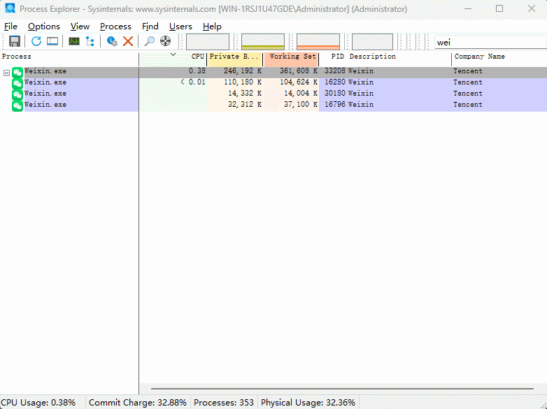
>


+ **现代的操作系统是支持多进程的，也就是可以`启动多个软件`，`一个软件就是一个进程`。称为：`多进程并发`。**

+ **通常一个进程都是`可以启动多个线程的`。称为：`多线程并发`。**


### 多线程的作用？

+ **提高处理效率。（多线程的优点之一是`能够使 CPU 在处理一个任务时同时处理多个线程`，这样可以充分利用 CPU 的资源，提高 CPU 的利用效率。）**


### JVM规范中规定

+ **`堆内存、方法区` 是`线程共享的`。**

+ **`虚拟机栈、本地方法栈、程序计数器 `是`每个线程私有的`。**

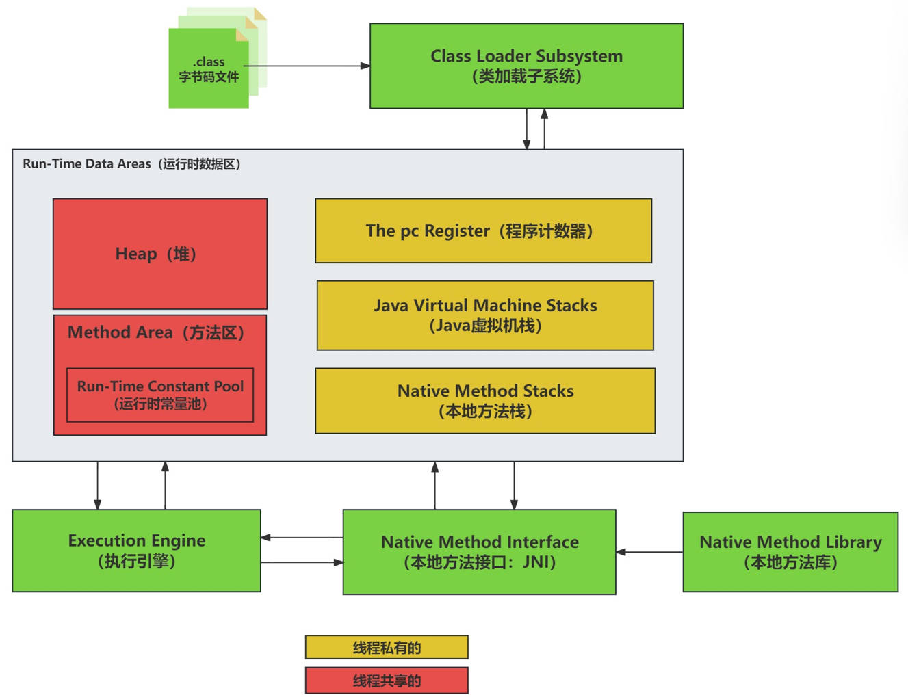


### 关于Java程序的运行原理

+ **“java HelloWorld”执行后，会启动JVM，JVM的启动表示一个进程启动了。**

+ **JVM进程会首先启动一个主线程（main-thread），主线程负责调用main方法。因此main方法是在主线程中运行的。**

+ **除了主线程之外，还启动了一个垃圾回收线程。因此启动JVM，至少启动了两个线程。**

+ **在main方法的执行过程中，程序员可以手动创建其他线程对象并启动。**

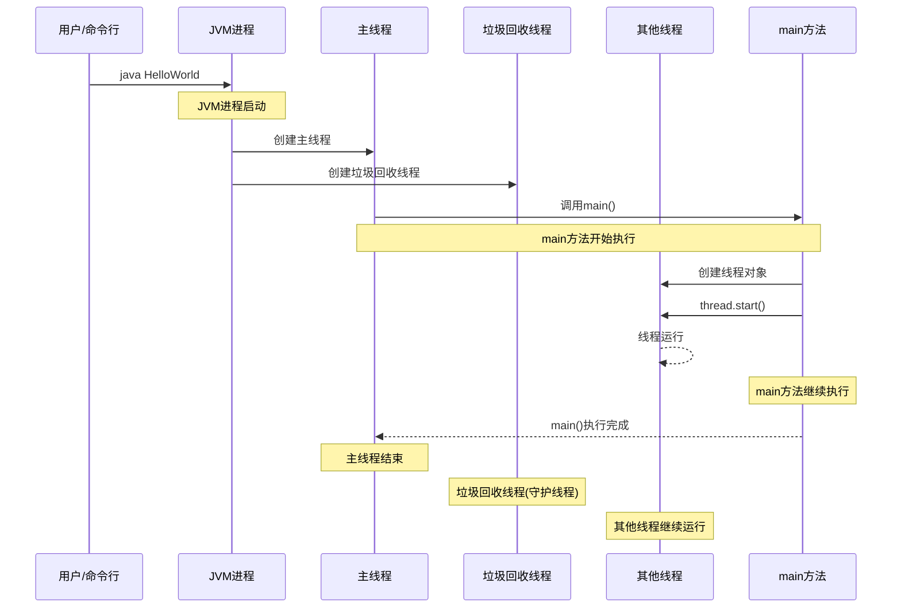
```mermaid
sequenceDiagram
    participant User as 用户/命令行
    participant JVM as JVM进程
    participant MainThread as 主线程
    participant GCThread as 垃圾回收线程
    participant OtherThread as 其他线程
    participant MainMethod as main方法

    User->>JVM: java HelloWorld
    Note over JVM: JVM进程启动
    
    JVM->>MainThread: 创建主线程
    JVM->>GCThread: 创建垃圾回收线程
    
    MainThread->>MainMethod: 调用main()
    
    Note over MainThread,MainMethod: main方法开始执行
    
    MainMethod->>OtherThread: 创建线程对象
    MainMethod->>OtherThread: thread.start()
    
    OtherThread-->>OtherThread: 线程运行
    
    Note over MainMethod: main方法继续执行
    MainMethod-->>MainThread: main()执行完成
    
    Note over MainThread: 主线程结束
    Note over GCThread: 垃圾回收线程(守护线程)
    Note over OtherThread: 其他线程继续运行
```


### 分析程序有多少个线程(练习)

```java
package com.powernode.javase.thread;

/**
 * 分析当前程序有多少个线程？
 *      这个程序除了GC线程之外，只有一个主线程。
 *      在JVM当中只有一个VM Stack。
 *      这个栈底部是main方法。
 *      栈顶部是m3方法。
 */
public class ThreadTest01 {
    public static void main(String[] args) {
        System.out.println("main begin");
        m1();
        System.out.println("main over");
    }

    public static void m1() {
        System.out.println("m1 begin");
        m2();
        System.out.println("m1 over");
    }

    public static void m2() {
        System.out.println("m2 begin");
        m3();
        System.out.println("m2 over");
    }

    public static void m3() {
        System.out.println("m3 execute!");
    }
}
```

> [!NOTE]
>
> **测试:**
>
> ```java
> main begin
> m1 begin
> m2 begin
> m3 execute!
> m2 over
> m1 over
> main over
> ```
>
> ```mermaid
> sequenceDiagram
>     participant Main as 主线程
>     participant VMStack as JVM栈
>     
>     Note over Main, VMStack: 程序开始执行
>     
>     Main->>VMStack: main() 入栈
>     Main->>+Main: System.out.println("main begin")
>     Main-->>-Main: 输出完成
>     Main->>+Main: m1() 调用
>     Main->>VMStack: m1() 入栈
>     
>     Note over Main, VMStack: 进入m1方法
>     Main->>+Main: System.out.println("m1 begin")
>     Main-->>-Main: 输出完成
>     Main->>+Main: m2() 调用
>     Main->>VMStack: m2() 入栈
>     
>     Note over Main, VMStack: 进入m2方法
>     Main->>+Main: System.out.println("m2 begin")
>     Main-->>-Main: 输出完成
>     Main->>+Main: m3() 调用
>     Main->>VMStack: m3() 入栈
>     
>     Note over Main, VMStack: 进入m3方法
>     Main->>+Main: System.out.println("m3 execute!")
>     Main-->>-Main: 输出完成
>     Main->>VMStack: m3() 出栈
>     
>     Note over Main, VMStack: 返回m2方法
>     Main->>+Main: System.out.println("m2 over")
>     Main-->>-Main: 输出完成
>     Main->>VMStack: m2() 出栈
>     
>     Note over Main, VMStack: 返回m1方法
>     Main->>+Main: System.out.println("m1 over")
>     Main-->>-Main: 输出完成
>     Main->>VMStack: m1() 出栈
>     
>     Note over Main, VMStack: 返回main方法
>     Main->>+Main: System.out.println("main over")
>     Main-->>-Main: 输出完成
>     Main->>VMStack: main() 出栈
>     
>     Note over Main, VMStack: 程序执行结束
> ```


## 并发与并行


### 并发（concurrency）

①**使用单核CPU的时候，同一时刻只能有一条指令执行，但多个指令被快速的轮换执行，使得在宏观上具有多个指令同时执行的效果，但在微观上并不是同时执行的，只是把时间分成若干端，使多个指令快速交替的执行。**

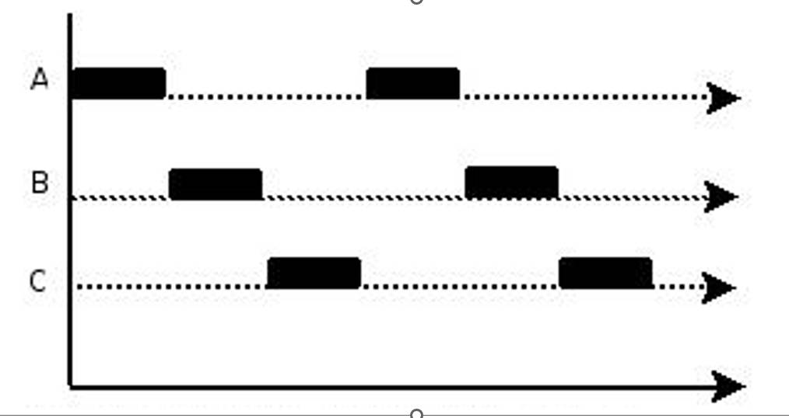

②**如上图所示，假设只有一个CPU资源，线程之间要竞争得到执行机会。图中的第一个阶段，在A执行的过程中，B、C不会执行，因为这段时间内这个CPU资源被A竞争到了，同理，第二阶段只有B在执行，第三阶段只有C在执行。其实，并发过程中，A、B、C并不是同时进行的（微观角度），但又是同时进行的（宏观角度）。**

③**在同一个时间点上，一个CPU只能支持一个线程在执行。因为CPU运行的速度很快，CPU使用抢占式调度模式在多个线程间进行着高速的切换，因此我们看起来的感觉就像是多线程一样，也就是看上去就是在同一时刻运行。**


### 并行（parallellism）

①**使用多核CPU的时候，同一时刻，有多条指令在多个CPU上同时执行。**

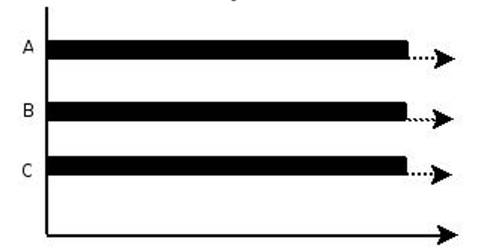

②**如图所示，在同一时刻，ABC都是同时执行（微观、宏观）**


### 并发编程与并行编程


#### 并发编程

**核心思想：** 在单个CPU核心上，通过时间分片的方式，让多个任务“看起来”是同时进行的。当一个任务等待（如等待I/O操作）时，CPU会立刻切换到另一个任务，从而充分利用CPU资源。

**时序图解释：**

下图展示了在**单核CPU**上，两个任务（任务A和任务B）并发执行的过程。

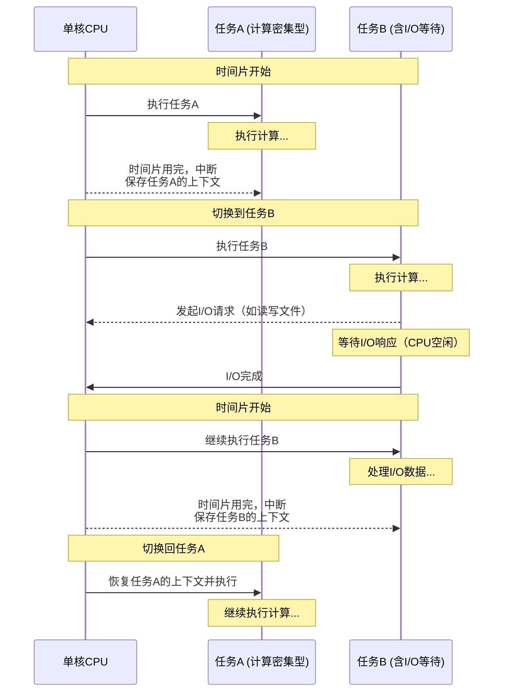
```mermaid
sequenceDiagram
    participant CPU as 单核CPU
    participant TaskA as 任务A (计算密集型)
    participant TaskB as 任务B (含I/O等待)

    Note over CPU, TaskB: 时间片开始
    CPU->>TaskA: 执行任务A
    Note over TaskA: 执行计算...
    CPU-->>TaskA: 时间片用完，中断<br>保存任务A的上下文

    Note over CPU, TaskB: 切换到任务B
    CPU->>TaskB: 执行任务B
    Note over TaskB: 执行计算...
    TaskB-->>CPU: 发起I/O请求（如读写文件）
    Note over TaskB: 等待I/O响应（CPU空闲）
    TaskB->>CPU: I/O完成

    Note over CPU, TaskB: 时间片开始
    CPU->>TaskB: 继续执行任务B
    Note over TaskB: 处理I/O数据...
    CPU-->>TaskB: 时间片用完，中断<br>保存任务B的上下文

    Note over CPU, TaskA: 切换回任务A
    CPU->>TaskA: 恢复任务A的上下文并执行
    Note over TaskA: 继续执行计算...
```

**时序图关键点：**

1. **单核资源**：整个流程只有一个CPU核心在工作。
2. **时间分片**：CPU将时间分成小片段，轮流分配给任务A和任务B。
3. **上下文切换**：每次切换任务时，CPU需要保存当前任务的状态（上下文），并加载下一个任务的状态。这个过程有一定开销。
4. **利用等待时间**：当任务B进行I/O操作（如读写文件、网络请求）时，它不需要CPU。此时CPU不会傻等，而是立即切换到任务A去执行。**这是并发编程提升效率的关键**。
5. **宏观与微观**：在宏观上（比如1秒钟内），任务A和B都在向前推进，好像是“同时”运行的；但在微观上（纳秒或毫秒级），它们在交替执行。

**并发的主要目的：** 提高程序的响应能力和资源（特别是CPU）的利用率


#### 并行编程

**核心思想：** 利用多个CPU核心，在同一时刻真正同时执行多个任务。

**时序图解释：**

下图展示了在**双核CPU**上，两个任务并行执行的过程。

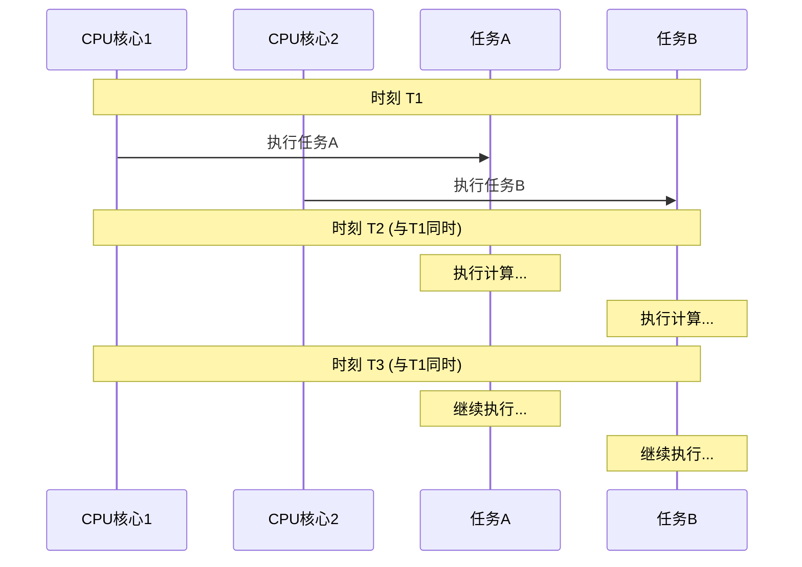
```mermaid
sequenceDiagram
    participant CPU1 as CPU核心1
    participant CPU2 as CPU核心2
    participant TaskA as 任务A
    participant TaskB as 任务B

    Note over CPU1, TaskB: 时刻 T1
    CPU1->>TaskA: 执行任务A
    CPU2->>TaskB: 执行任务B

    Note over CPU1, TaskB: 时刻 T2 (与T1同时)
    Note over TaskA: 执行计算...
    Note over TaskB: 执行计算...

    Note over CPU1, TaskB: 时刻 T3 (与T1同时)
    Note over TaskA: 继续执行...
    Note over TaskB: 继续执行...
```

**时序图关键点：**

1. **多核资源**：有多个CPU核心（这里是两个）作为执行单元。
2. **真正同时**：在同一个时钟周期（时刻T1），核心1执行任务A，核心2执行任务B。它们之间没有“交替”或“抢占”，是物理上的同时执行。
3. **无上下文切换**：每个任务独占一个核心，在其时间片内不需要被中断和切换，因此没有并发模式下的那种上下文切换开销。
4. **效率提升**：理想情况下，双核并行执行两个计算密集型任务，时间可以缩短到单核的一半。

**并行的主要目的：** 大幅提升计算速度，缩短问题的总体解决时间，通常用于处理计算密集型任务（如科学计算、大数据处理、图形渲染）。


#### 总结与关系

| 特性         | 并发                     | 并行             |
| :----------- | :----------------------- | :--------------- |
| **核心数量** | 单核即可                 | 必须多核         |
| **执行方式** | 交替执行                 | 同时执行         |
| **核心目标** | 提高响应和资源利用率     | 提升计算速度     |
| **是否同时** | 宏观同时，微观交替       | 宏观和微观都同时 |
| **适用场景** | I/O密集型任务、Web服务器 | 计算密集型任务   |

**相互关系：**

- **并行是并发的真子集**：一个系统如果可以并行，那么它必然可以并发（因为多个核心可以各自进行任务切换）。但可以并发的系统不一定能并行（比如在单核CPU上）。
- **现代编程通常结合两者**：在一个多核CPU上，可以同时运行多个程序（**并行**），而每个程序内部又通过多线程来实现**并发**。例如，一个Web服务器在8核CPU上运行，它可以同时处理8个用户请求（**并行**），而处理每个请求的线程在遇到数据库查询时，会释放CPU给其他线程使用（**并发**）。


## 线程的调度策略

### 概述

**如果`多个线程`被分配到`一个CPU内核中执行`，则同一时刻`只能允许有一个线程能获得CPU的执行权`，那么进程中的`多个线程`就会`抢夺CPU的执行权`，这就是涉及到`线程调度策略`。**

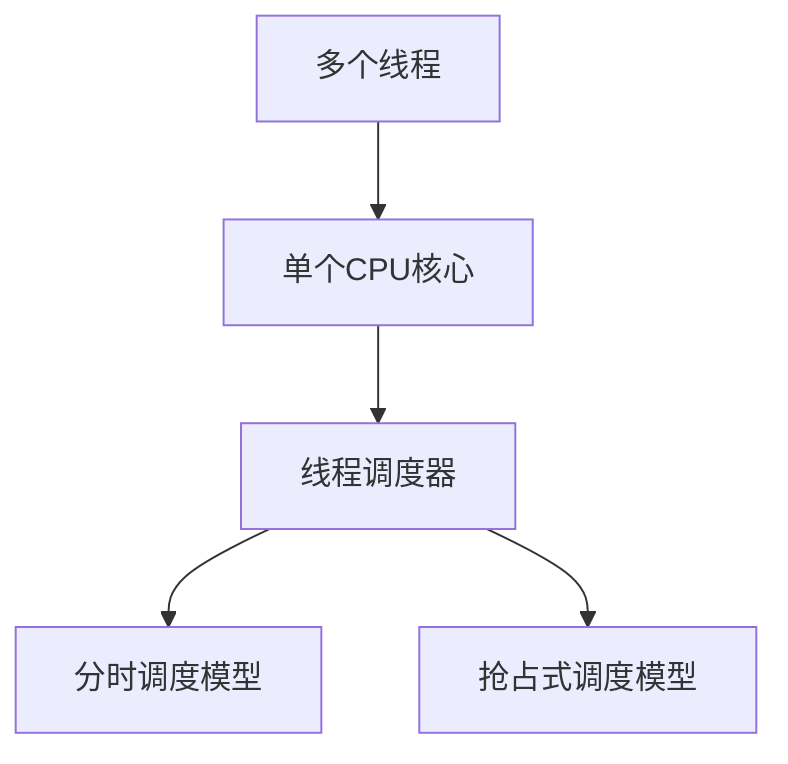
```mermaid
graph TB
    A[多个线程] --> B[单个CPU核心]
    B --> C[线程调度器]
    C --> D[分时调度模型]
    C --> E[抢占式调度模型]
```


### 线程的调度模型


#### 分时调度模型

> **所有线程轮流使用CPU的执行权，并且`平均的分配每个线程占用的CPU的时间`。**

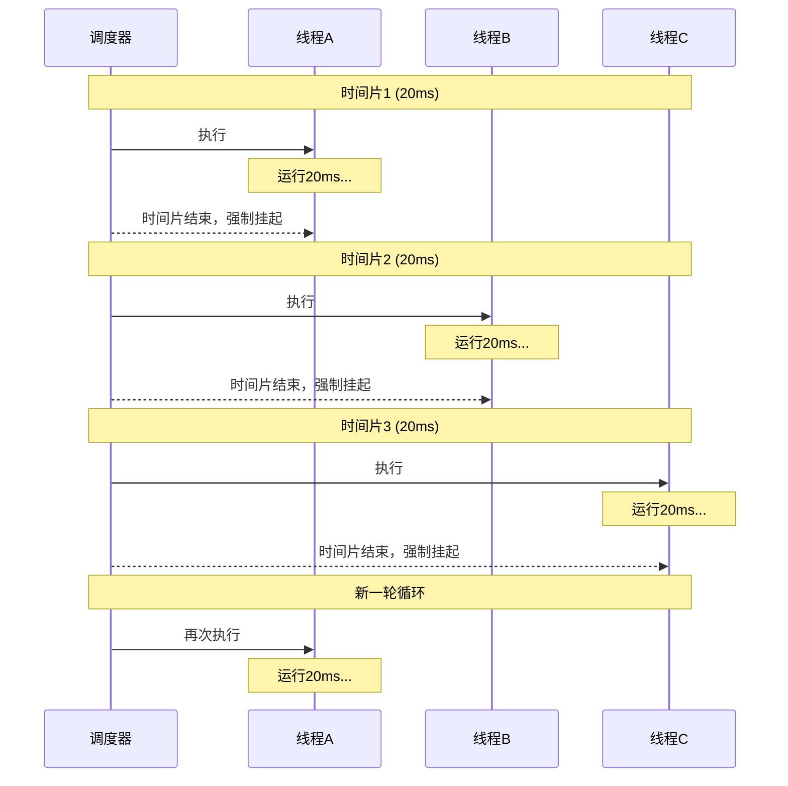
```mermaid
sequenceDiagram
    participant Scheduler as 调度器
    participant ThreadA as 线程A
    participant ThreadB as 线程B
    participant ThreadC as 线程C

    Note over Scheduler, ThreadC: 时间片1 (20ms)
    Scheduler->>ThreadA: 执行
    Note over ThreadA: 运行20ms...
    Scheduler-->>ThreadA: 时间片结束，强制挂起
    
    Note over Scheduler, ThreadC: 时间片2 (20ms)
    Scheduler->>ThreadB: 执行
    Note over ThreadB: 运行20ms...
    Scheduler-->>ThreadB: 时间片结束，强制挂起
    
    Note over Scheduler, ThreadC: 时间片3 (20ms)
    Scheduler->>ThreadC: 执行
    Note over ThreadC: 运行20ms...
    Scheduler-->>ThreadC: 时间片结束，强制挂起
    
    Note over Scheduler, ThreadC: 新一轮循环
    Scheduler->>ThreadA: 再次执行
    Note over ThreadA: 运行20ms...
```

**分时调度的关键点**：

- ⏱️ **固定时间片**：每个线程获得相等的CPU时间（如20ms）
- 🔄 **循环轮转**：按顺序轮流执行，保证公平性
- ⏸️ **强制切换**：时间片用完立即挂起，不管任务是否完成
- 🎯 **适用场景**：强调公平性的系统，早期Unix系统


#### 抢占式调度模型

> **让`优先级高的线程`以较大的概率`优先获得CPU的执行权`，如果`线程的优先级相同`，那么就会`随机选择一个线程获得CPU的执行权`，而`Java采用的就是抢占式调用`。**

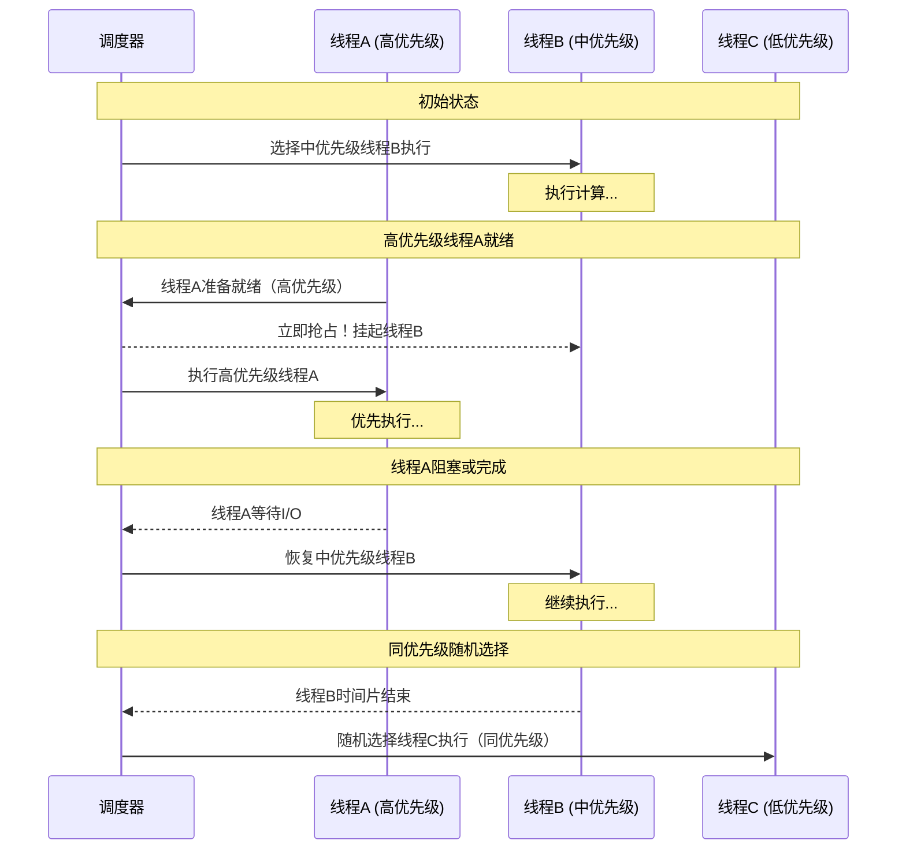
```mermaid
sequenceDiagram
    participant Scheduler as 调度器
    participant ThreadA as 线程A (高优先级)
    participant ThreadB as 线程B (中优先级)
    participant ThreadC as 线程C (低优先级)

    Note over Scheduler, ThreadC: 初始状态
    Scheduler->>ThreadB: 选择中优先级线程B执行
    Note over ThreadB: 执行计算...
    
    Note over Scheduler, ThreadC: 高优先级线程A就绪
    ThreadA->>Scheduler: 线程A准备就绪（高优先级）
    Scheduler-->>ThreadB: 立即抢占！挂起线程B
    Scheduler->>ThreadA: 执行高优先级线程A
    Note over ThreadA: 优先执行...
    
    Note over Scheduler, ThreadC: 线程A阻塞或完成
    ThreadA-->>Scheduler: 线程A等待I/O
    Scheduler->>ThreadB: 恢复中优先级线程B
    Note over ThreadB: 继续执行...
    
    Note over Scheduler, ThreadC: 同优先级随机选择
    ThreadB-->>Scheduler: 线程B时间片结束
    Scheduler->>ThreadC: 随机选择线程C执行（同优先级）
```

**抢占式调度的关键点**：

- 🏆 **优先级驱动**：高优先级线程优先执行，并可抢占低优先级线程
- 🎲 **同优先级随机**：优先级相同时，随机选择或轮转
- 🔄 **动态响应**：新就绪的高优先级线程能立即获得CPU
- ⚡ **Java采用**：这正是Java线程调度的方式


#### Java中的抢占式调度示例

```java
public class ThreadPriorityExample {
    public static void main(String[] args) {
        Thread highPriorityThread = new Thread(() -> {
            for (int i = 0; i < 5; i++) {
                System.out.println("高优先级线程执行");
            }
        });
        
        Thread lowPriorityThread = new Thread(() -> {
            for (int i = 0; i < 5; i++) {
                System.out.println("低优先级线程执行");
            }
        });
        
        // 设置优先级（1-10，默认5）
        highPriorityThread.setPriority(Thread.MAX_PRIORITY); // 10
        lowPriorityThread.setPriority(Thread.MIN_PRIORITY);  // 1
        
        lowPriorityThread.start();
        highPriorityThread.start(); // 高优先级线程可能先完成
    }
}
```


## 实现线程


### 第一种方式：继承Thread

```java
在Java语言中，实现线程，有两种方式，第一种方式：
 	第一步：编写一个类继承 java.lang.Thread
 	第二步：重写run方法
 	第三步：new线程对象
 	第四部：调用线程对象的start方法来启动线程。
```

```java
package com.powernode.javase.thread;

public class ThreadTest02 {
    public static void main(String[] args) {
        // 创建线程对象
        //MyThread mt = new MyThread();
        Thread t = new MyThread();

        // 直接调用run方法，不会启动新的线程。
        // java中有一个语法规则：对于方法体当中的代码，必须遵循自上而下的顺序依次逐行执行。
        // run()方法不结束，main方法是无法继续执行的。
        //t.run();

        // 调用start()方法，启动线程
        // java中有一个语法规则：对于方法体当中的代码，必须遵循自上而下的顺序依次逐行执行。
        // start()方法不结束，main方法是无法继续执行的。
        // start()瞬间就会结束，原因这个方法的作用是：启动一个新的线程，只要新线程启动成功了，start()就结束了。
        t.start();

        // 这里编写的代码在main方法中，因此这里的代码属于在主线程中执行。
        for (int i = 0; i < 100; i++) {
            System.out.println("main--->" + i);
        }
    }
}


// 自定义一个线程类
// java.lang.Thread本身就是一个线程。
// MyThread继承Thread，因此MyThread本身也是一个线程。
class MyThread extends Thread {
    @Override
    public void run() {
        for (int i = 0; i < 100; i++) {
            System.out.println("MyThread--->" + i);
        }
    }
}
```


####  正确执行流程（使用start()方法）

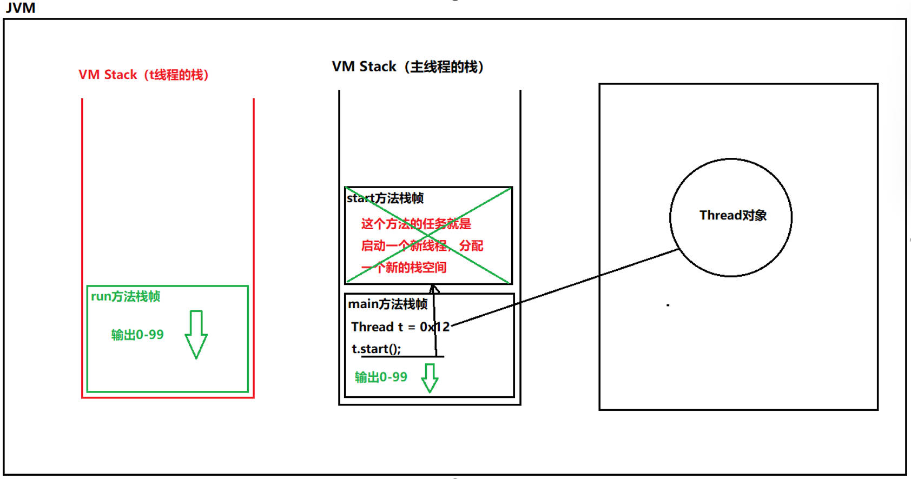

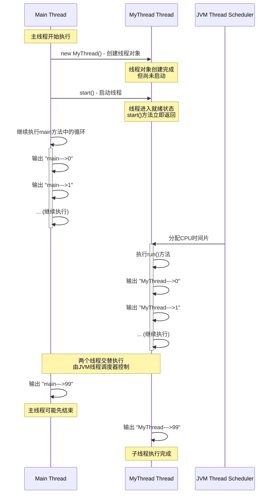
```mermaid
sequenceDiagram
    participant M as Main Thread
    participant T as MyThread Thread
    participant JVM as JVM Thread Scheduler
    
    Note over M: 主线程开始执行
    
    M->>T: new MyThread() - 创建线程对象
    Note over T: 线程对象创建完成<br/>但尚未启动
    
    M->>T: start() - 启动线程
    Note over T: 线程进入就绪状态<br/>start()方法立即返回
    
    M->>M: 继续执行main方法中的循环
    activate M
    M->>M: 输出 "main--->0"
    M->>M: 输出 "main--->1"
    M->>M: ... (继续执行)
    deactivate M
    
    JVM->>T: 分配CPU时间片
    activate T
    T->>T: 执行run()方法
    T->>T: 输出 "MyThread--->0"
    T->>T: 输出 "MyThread--->1"
    T->>T: ... (继续执行)
    deactivate T
    
    Note over M,T: 两个线程交替执行<br/>由JVM线程调度器控制
    
    M->>M: 输出 "main--->99"
    Note over M: 主线程可能先结束
    
    T->>T: 输出 "MyThread--->99"
    Note over T: 子线程执行完成
```

>  **使用`start()`方法的输出特点:**
>
> ```java
> main--->0
> MyThread--->0
> main--->1
> MyThread--->1
> main--->2
> MyThread--->2
> ...
> ```
>
> - **两个循环交替执行**
> - **执行顺序不确定，由线程调度器决定**
> - **主线程和子线程并发执行**


#### 错误执行流程（使用run()方法）

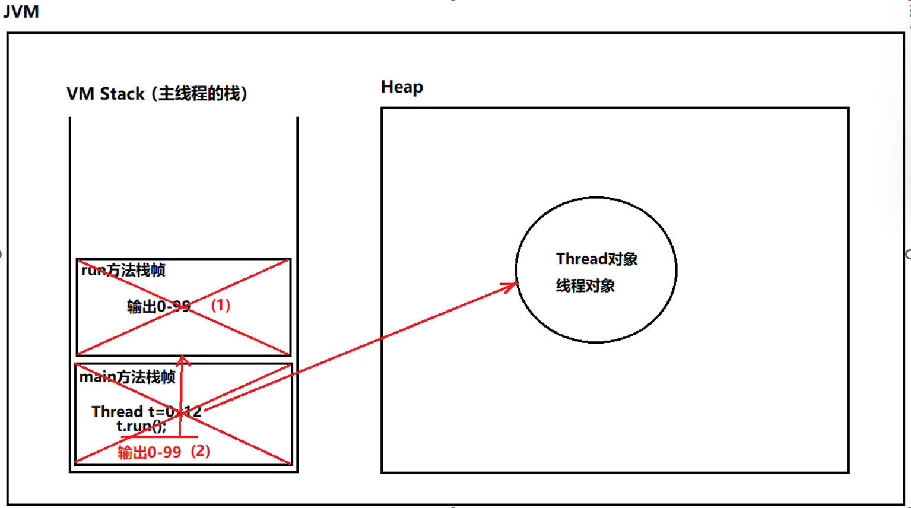

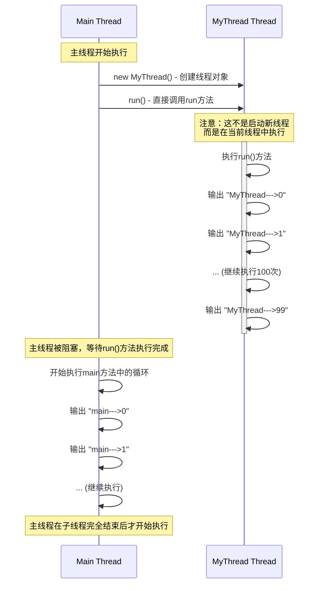
```mermaid
sequenceDiagram
    participant M as Main Thread
    participant T as MyThread Thread
    
    Note over M: 主线程开始执行
    
    M->>T: new MyThread() - 创建线程对象
    
    M->>T: run() - 直接调用run方法
    Note over T: 注意：这不是启动新线程<br/>而是在当前线程中执行
    
    activate T
    T->>T: 执行run()方法
    T->>T: 输出 "MyThread--->0"
    T->>T: 输出 "MyThread--->1"
    T->>T: ... (继续执行100次)
    T->>T: 输出 "MyThread--->99"
    deactivate T
    
    Note over M: 主线程被阻塞，等待run()方法执行完成
    
    M->>M: 开始执行main方法中的循环
    M->>M: 输出 "main--->0"
    M->>M: 输出 "main--->1"
    M->>M: ... (继续执行)
    
    Note over M: 主线程在子线程完全结束后才开始执行
```

> **使用`run()`方法的输出特点：**
>
> ```java
> MyThread--->0
> MyThread--->1
> ...
> MyThread--->99
>     
> main--->0
> main--->1
> ...
> main--->99
> ```
>
> - **先完整执行子线程的run方法**
> - **然后才执行主线程的循环**
> - **实际上是单线程顺序执行**


#### 总结

`start()` vs `run()` 的区别

| 方法      | 作用                                | 线程数量                 | 执行顺序 |
| :-------- | :---------------------------------- | :----------------------- | :------- |
| `start()` | 启动新线程，在新线程中执行run()方法 | 2个线程（主线程+新线程） | 并发执行 |
| `run()`   | 直接调用方法，不会启动新线程        | 1个线程（主线程）        | 顺序执行 |

> 1. **创建线程对象**只是创建了对象，线程并未启动
> 2. **调用`start()`** 会启动新线程，立即返回，主线程继续执行
> 3. **调用`run()`** 只是普通方法调用，不会启动新线程
> 4. **多线程并发执行**时，执行顺序由JVM线程调度器决定，具有不确定性


### 第二种方式：实现Runnable接口

```java
在Java语言中，实现线程，有两种方式，第二种方式：
       第一步：编写一个类实现 java.lang.Runnable接口（可运行的接口）
       第二步：实现接口中的run方法。
       第三步：new线程对象
       第四部：调用线程的start方法启动线程
 
  总结：实现线程两种方式：
       第一种：编写类直接继承Thread
       第二种：编写类实现Runnable接口
 
       推荐使用第二种，因为实现接口的同时，保留了类的继承。
```

```java
package com.powernode.javase.thread;

public class ThreadTest03 {
    public static void main(String[] args) {
        // 创建Runnable对象
        //Runnable r = new MyRunnable();
        // 创建线程对象
        //Thread t1 = new Thread(r);

        // 创建线程对象
        Thread t = new Thread(new MyRunnable());

        // 启动线程
        t.start();

        // 主线程中执行的。
        for (int i = 0; i < 100; i++) {
            System.out.println("main----->" + i);
        }
    }
}


// 严格来说，这个不是一个线程类
// 它是一个普通的类，只不过实现了一个Runnable接口。
class MyRunnable implements Runnable {

    @Override
    public void run() {
        for (int i = 0; i < 100; i++) {
            System.out.println("t----->" + i);
        }
    }
}
```

> **实现Runnable接口方式的执行流程:**
>
> ```mermaid
> sequenceDiagram
>     participant M as Main Thread
>     participant R as MyRunnable对象
>     participant T as Thread对象
>     participant JVM as JVM Thread Scheduler
>     
>     Note over M: 主线程开始执行
>     
>     M->>R: new MyRunnable() - 创建Runnable对象
>     Note over R: 普通对象，不是线程
>     
>     M->>T: new Thread(R) - 创建Thread对象并传入Runnable
>     Note over T: Thread对象持有Runnable引用
>     
>     M->>T: start() - 启动线程
>     Note over T: 线程进入就绪状态<br/>start()方法立即返回
>     
>     par 主线程执行
>         M->>M: 执行main方法中的循环
>         activate M
>         M->>M: 输出 "main----->0"
>         M->>M: 输出 "main----->1"
>         M->>M: ... (继续执行)
>         M->>M: 输出 "main----->99"
>         deactivate M
>     and 子线程执行
>         JVM->>T: 分配CPU时间片
>         activate T
>         T->>R: 调用run()方法
>         activate R
>         R->>R: 输出 "t----->0"
>         R->>R: 输出 "t----->1"
>         R->>R: ... (继续执行)
>         R->>R: 输出 "t----->99"
>         deactivate R
>         deactivate T
>     end
>     
>     Note over M,T: 两个线程并发执行<br/>输出结果交替出现
> ```
>
> **输出结果示例：**
>
> ```java
> main----->0
> t----->0
> main----->1
> t----->1
> main----->2
> t----->2
> ...
> main----->99
> t----->99
> ```


### 两种实现方式的对比

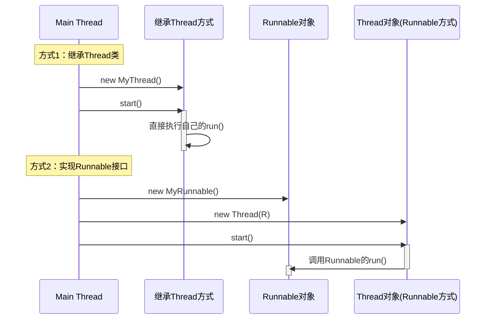
```mermaid
sequenceDiagram
    participant M as Main Thread
    participant T1 as 继承Thread方式
    participant R as Runnable对象
    participant T2 as Thread对象(Runnable方式)
    
    Note over M: 方式1：继承Thread类
    M->>T1: new MyThread()
    M->>T1: start()
    activate T1
    T1->>T1: 直接执行自己的run()
    deactivate T1
    
    Note over M: 方式2：实现Runnable接口
    M->>R: new MyRunnable()
    M->>T2: new Thread(R)
    M->>T2: start()
    activate T2
    T2->>R: 调用Runnable的run()
    activate R
    deactivate R
    deactivate T2
```

**两种方式的比较:**

| 特性         | 继承Thread类                    | 实现Runnable接口                          |
| :----------- | :------------------------------ | :---------------------------------------- |
| **代码结构** | `class MyThread extends Thread` | `class MyRunnable implements Runnable`    |
| **线程创建** | `Thread t = new MyThread()`     | `Thread t = new Thread(new MyRunnable())` |
| **执行方式** | 直接执行自己的run()方法         | 通过Thread调用Runnable的run()方法         |
| **继承限制** | 占用继承名额                    | 不占用继承名额                            |
| **资源共享** | 每个线程独立实例                | 多个线程可共享同一Runnable实例            |


### 优化方式二(匿名内部类创建多线程)

```java
匿名内部类回顾: 
  1.new 接口/抽象类(){
      重写方法
  }.重写的方法();

  2.接口名/类名 对象名 = new 接口/抽象类(){
      重写方法
  }
    对象名.重写的方法();
```

```java
package com.powernode.javase.thread;

/**
 * 采用匿名内部类的方式，少写一个Runnable接口的实现类。
 */
public class ThreadTest04 {
    public static void main(String[] args) {
        // 创建线程对象
        /*Thread t = new Thread(new Runnable() {
            @Override
            public void run() {
                for (int i = 0; i < 100; i++) {
                    System.out.println("t ---> " + i);
                }
            }
        });

        // 启动线程
        t.start();*/

        new Thread(new Runnable() {
            @Override
            public void run() {
                for (int i = 0; i < 100; i++) {
                    System.out.println("t--->" + i);
                }
            }
        }).start();

        for (int i = 0; i < 100; i++) {
            System.out.println("main ---> " + i);
        }
    }
}
```

> **输出结果示例：**
>
> ```java
> main ---> 0
> main ---> 1
> t--->0
> main ---> 2
> main ---> 3
> main ---> 4
> main ---> 5
> t--->1
> main ---> 6
> ...
> main----->99
> t----->99
> ```


### 第三种方式：实现Callable接口(实现call方法)

> [!NOTE]
>
> * ① 优点：扩展性强，实现该接口的同时还可以继承其他类。
> * ② 缺点：编程相对复杂，不能直接使用 Thread 类中的方法。

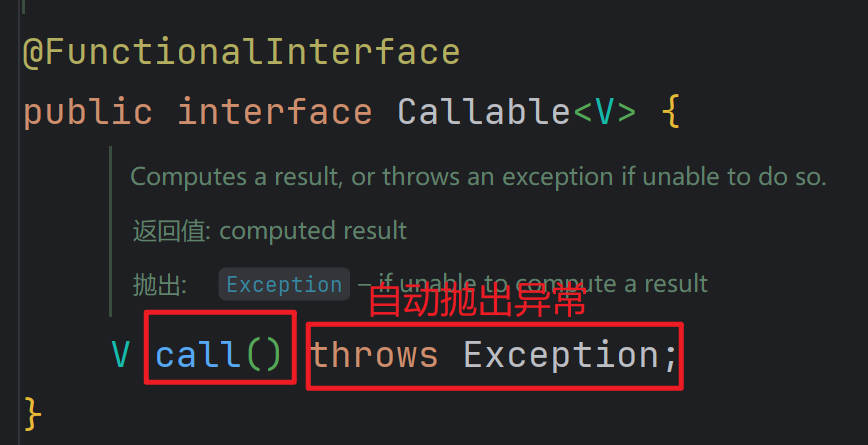

```java
package com.powernode.javase.thread24;

import java.util.concurrent.Callable;
import java.util.concurrent.FutureTask;

/**
 * 实现线程的第三种方式：实现Callable接口，实现call方法。
 * 这种方式实现的线程，是可以获取到线程返回值的。
 */
public class ThreadTest {
    public static void main(String[] args) {
        // 创建"未来任务"对象
        FutureTask<Integer> task = new FutureTask<>(new Callable<Integer>() {
            @Override
            public Integer call() throws Exception {
                // 处理业务......
                Thread.sleep(1000 * 5);
                return 1;
            }
        });

        // 创建线程对象
        Thread t = new Thread(task);
        t.setName("t1");

        // 启动线程
        t.start();


        try {
            // 获取“未来任务”线程的返回值
            // 阻塞当前线程，等待“未来任务”结束并返回值。
            // 拿到返回值，当前线程的阻塞才会解除。继续执行。
            Integer i = task.get();
            System.out.println(i);
        } catch (Exception e) {
            e.printStackTrace();
        }
    }
}


/*
class MyThread extends Thread {
    @Override
    public void run() {}
}

class MyRunnable implements Runnable {
    @Override
    public void run() {}
}*/
```

```java
1 (5s后返回结果)
```


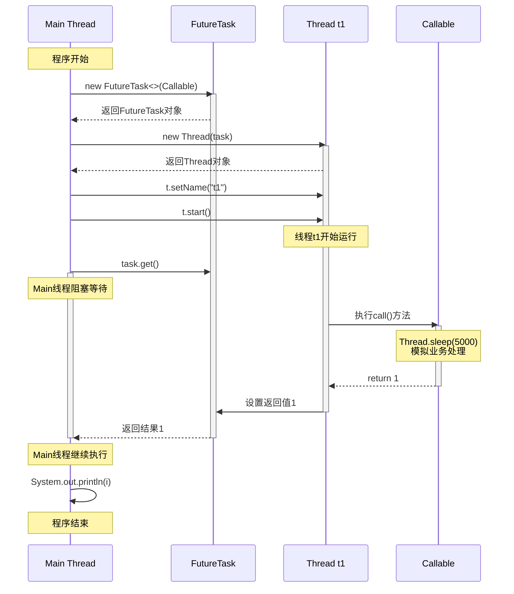
```mermaid
sequenceDiagram
    participant M as Main Thread
    participant F as FutureTask
    participant T as Thread t1
    participant C as Callable

    Note over M: 程序开始
    
    M->>F: new FutureTask<>(Callable)
    activate F
    F-->>M: 返回FutureTask对象
    
    M->>T: new Thread(task)
    activate T
    T-->>M: 返回Thread对象
    
    M->>T: t.setName("t1")
    M->>T: t.start()
    
    Note over T: 线程t1开始运行
    
    M->>F: task.get()
    activate M
    Note over M: Main线程阻塞等待
    
    T->>C: 执行call()方法
    activate C
    Note over C: Thread.sleep(5000)<br/>模拟业务处理
    C-->>T: return 1
    deactivate C
    
    T->>F: 设置返回值1
    deactivate T
    
    F-->>M: 返回结果1
    deactivate M
    deactivate F
    
    Note over M: Main线程继续执行
    M->>M: System.out.println(i)
    
    Note over M: 程序结束
```

> **总结:**
>
> 1. **初始化阶段**：
>    - Main线程创建FutureTask对象，传入Callable匿名内部类
>    - 创建Thread线程对象，将FutureTask作为任务传入
>    - 设置线程名并启动线程
> 2. **执行阶段**：
>    - Main线程调用`task.get()`方法，**进入阻塞状态**，等待计算结果
>    - 线程t1开始执行Callable的call()方法
>    - call()方法中睡眠5秒模拟业务处理，然后返回结果1
> 3. **结果返回阶段**：
>    - 线程t1将计算结果设置到FutureTask中
>    - FutureTask唤醒阻塞的Main线程
>    - Main线程获取到返回值1并打印


### 第四种方式：使用线程池技术

```java
创建线程的第四种方式：使用线程池技术
 	1.线程池本质上就是一个缓存：cache
    
 	2.一般都是服务器在启动的时候，初始化线程池
    
 	3.也就是说服务器在启动的时候，创建N多个线程对象
    
 	4.直接放到线程池中，需要使用线程对象的时候，直接从线程池中获取。
```

**使用步骤：**

* ① `通过 Executors 类的静态工厂方法创建线程池对象`。
* ② `通过调用线程池对象的 submit()、execute()、invokeAny() 以及 invokeAll() 方法将任务（线程）分配给线程池对象`。
* ③ `关闭线程池对象`。

```java
package com.powernode.javase.thread25;

import java.util.concurrent.ExecutorService;
import java.util.concurrent.Executors;

public class ThreadTest {
    public static void main(String[] args) {
        // 创建一个线程池对象（线程池中有3个线程）
        ExecutorService executorService = Executors.newFixedThreadPool(3);

        // 将任务交给线程池（你不需要触碰到这个线程对象，你只需要将要处理的任务交给线程池即可。）
        executorService.submit(new Runnable() {
            @Override
            public void run() {
                for (int i = 0; i < 10; i++) {
                    System.out.println(Thread.currentThread().getName() + "--->" + i);
                }
            }
        });

        // 最后记得关闭线程池
        executorService.shutdown();
    }
}
```

```java
pool-1-thread-1--->0
pool-1-thread-1--->1
pool-1-thread-1--->2
pool-1-thread-1--->3
pool-1-thread-1--->4
pool-1-thread-1--->5
pool-1-thread-1--->6
pool-1-thread-1--->7
pool-1-thread-1--->8
pool-1-thread-1--->9
```

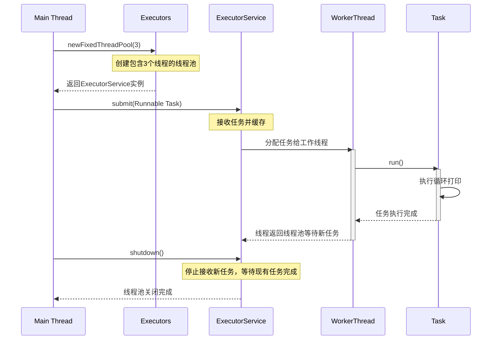
```mermaid
sequenceDiagram
    participant M as Main Thread
    participant EP as Executors
    participant ES as ExecutorService
    participant WT as WorkerThread
    participant T as Task

    M->>EP: newFixedThreadPool(3)
    Note over EP: 创建包含3个线程的线程池
    EP-->>M: 返回ExecutorService实例
    
    M->>ES: submit(Runnable Task)
    Note over ES: 接收任务并缓存
    
    ES->>WT: 分配任务给工作线程
    activate WT
    
    WT->>T: run()
    activate T
    T->>T: 执行循环打印
    T-->>WT: 任务执行完成
    deactivate T
    
    WT-->>ES: 线程返回线程池等待新任务
    deactivate WT
    
    M->>ES: shutdown()
    Note over ES: 停止接收新任务，等待现有任务完成
    ES-->>M: 线程池关闭完成
```

> **总结：**
>
> 1. **初始化阶段**：
>    - 主线程通过 `Executors.newFixedThreadPool(3)` 创建线程池
>    - 线程池内部初始化3个工作线程，但此时线程处于等待状态
> 2. **任务提交阶段**：
>    - 主线程调用 `executorService.submit()` 提交Runnable任务
>    - 线程池接收任务并将其放入任务队列
>    - 线程池选择一个空闲的工作线程来执行任务
> 3. **任务执行阶段**：
>    - 工作线程调用任务的 `run()` 方法
>    - 执行循环打印操作
>    - 任务完成后，工作线程返回到线程池等待新任务
> 4. **关闭阶段**：
>    - 主线程调用 `shutdown()` 方法
>    - 线程池停止接收新任务，但会等待已提交的任务执行完成
>    - 所有任务完成后，线程池正式关闭


## Thread类中的方法

```java
void start() -> 开启线程,jvm自动调用run方法
    
void run()  -> 设置线程任务,这个run方法是Thread重写的接口Runnable中的run方法
    
String getName()  -> 获取线程名字
    
void setName(String name) -> 给线程设置名字
    
static Thread currentThread() -> 获取正在执行的线程对象(此方法在哪个线程中使用,获取的就是哪个线程对象)   
```

```java
package com.powernode.javase.thread01;

/**
 * 关于线程中常用方法：
 *      实例方法：
 *          String getName();  获取线程对象的名字
 *          void setName(String threadName); 修改线程的名字
 *      静态方法：
 *          static Thread currentThread(); 获取当前线程对象的引用。
 */
public class ThreadTest {
    public static void main(String[] args) {
        // 获取当前线程对象
        Thread mainThread = Thread.currentThread();

        // 获取当前线程的名字
        System.out.println("主线程的名字：" + mainThread.getName()); // 主线程的名字：main

        // 创建线程对象
        Thread t = new MyThread("tt");
        // 修改线程的名字
        t.setName("t");
        // 启动线程
        t.start();

        // 创建线程对象
        Thread t1 = new MyThread("tt1");
        // 修改线程名字
        t1.setName("t1");
        // 启动线程
        t1.start();
    }
}

class MyThread extends Thread{

    public MyThread(String threadName) {
        super(threadName);
    }

    @Override
    public void run() {
        // 获取当前线程对象
        Thread t = Thread.currentThread();
        // 获取当前线程对象的名字
        System.out.println("分支线程的名字：" + t.getName()); // 分支线程的名字：Thread-0
    }
}
```

> **测试:**
>
> 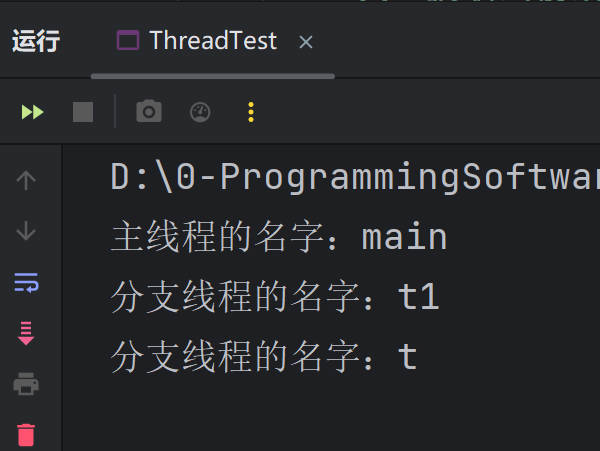


## 线程生命周期

> **`线程生命周期`指的是：从线程对象新建，到最终线程死亡的整个过程。**

```java
1.NEW
	新建状态
    
2.RUNNABLE
	可运行状态
	细分的话，又可以分为两个子状态：
	2.1就绪状态
	2.2运行状态
    
3.BLOCKED
	阻塞状态
	遇到锁之后进入阻塞状态。（什么是锁！！！）
    
4.WAITING
	等待状态
	无期限的等待，没有时长限定
    
5.TIMED_WAITING
	超时等待状态
	这种等待是有时长限定的。
    
6.TERMINATED
	终止状态(死亡状态)
    
面试的时候，线程的生命周期说几个状态呢？七个状态：
	1．新建状态
	2．就绪状态
	3，运行状态
	4．超时等待状态
	5．等待状态（等后面学习了线程之间的通信之后，可以添加这个状态。wait()方法。）
	6．阻塞状态（等后面学习了线程同步机制之后，可以添加这个状态。）
	7．终止状态
```

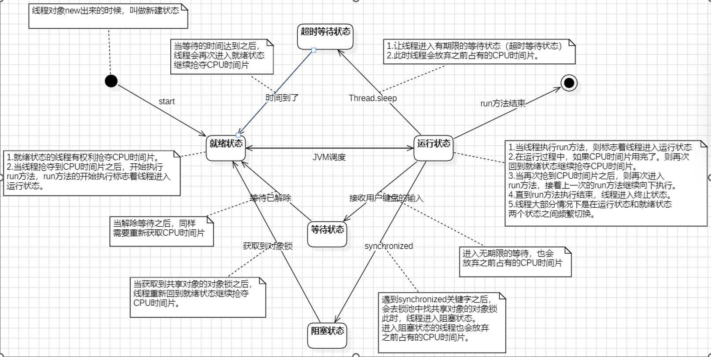

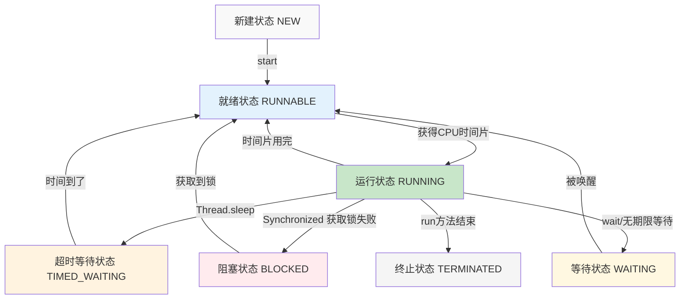
```mermaid
graph TD
    A[新建状态 NEW] -->|start| B[就绪状态 RUNNABLE]
    B -->|获得CPU时间片| C[运行状态 RUNNING]
    C -->|时间片用完| B
    C -->|Thread.sleep| D[超时等待状态 TIMED_WAITING]
    D -->|时间到了| B
    C -->|Synchronized 获取锁失败| E[阻塞状态 BLOCKED]
    E -->|获取到锁| B
    C -->|wait/无期限等待| F[等待状态 WAITING]
    F -->|被唤醒| B
    C -->|run方法结束| G[终止状态 TERMINATED]
    
    style A fill:#f9f9f9
    style B fill:#e3f2fd
    style C fill:#c8e6c9
    style D fill:#fff3e0
    style E fill:#ffebee
    style F fill:#fff8e1
    style G fill:#f5f5f5
```


### 线程的sleep方法

```java
关于线程的sleep方法：
       1. static void sleep(long millis)
           静态方法，没有返回值，参数是一个毫秒。1秒 = 1000毫秒
    
       2. 这个方法作用是：
           让当前线程进入休眠，也就是让当前线程放弃占有的CPU时间片，让其进入阻塞状态。
           意思：你别再占用CPU了，让给其他线程吧。
           阻塞多久呢？参数毫秒为准。在指定的时间范围内，当前线程没有权利抢夺CPU时间片了。
    
       3. 怎么理解“当前线程”呢？
           Thread.sleep(1000); 这个代码出现在哪个线程中，当前线程就是这个线程。
    
       4. run方法在方法重写的时候，不能在方法声明位置使用 throws 抛出异常。
    
       5. sleep方法可以模拟每隔固定的时间调用一次程序。
```

```java
package com.powernode.javase.thread02;

public class ThreadTest {
    public static void main(String[] args) {
        try {
            // 让当前线程睡眠5秒
            // 这段代码出现在主线程中，所以当前线程就是主线程
            // 让主线程睡眠5秒
            Thread.sleep(1000);
        } catch (InterruptedException e) {
            throw new RuntimeException(e);
        }

        for (int i = 0; i < 10; i++) {
            System.out.println(Thread.currentThread().getName() + "===>" + i);
        }

        // 启动线程
        Thread t = new Thread(new MyRunnable());
        t.setName("t");
        t.start();
    }
}


class MyRunnable implements Runnable {

    @Override
    public void run() {
        for (int i = 0; i < 10; i++) {
            System.out.println(Thread.currentThread().getName() + "===>" + i);
            try {
                Thread.sleep(1000);
            } catch (InterruptedException e) {
                throw new RuntimeException(e);
            }
        }
    }
}
```

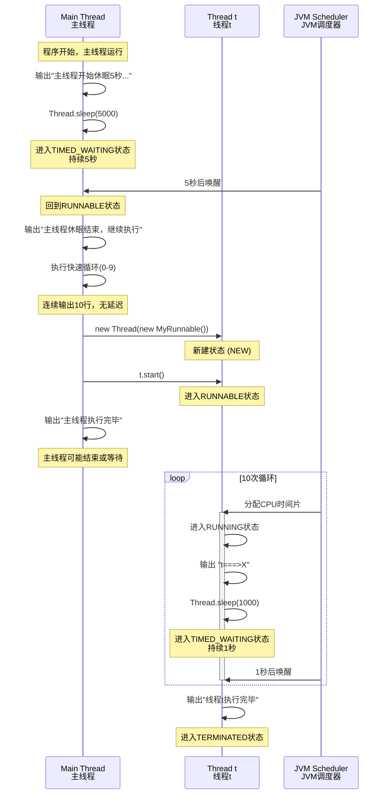
```mermaid
sequenceDiagram
    participant M as Main Thread<br/>主线程
    participant T as Thread t<br/>线程t
    participant JVM as JVM Scheduler<br/>JVM调度器

    Note over M: 程序开始，主线程运行
    
    M->>M: 输出"主线程开始休眠5秒..."
    M->>M: Thread.sleep(5000)
    Note over M: 进入TIMED_WAITING状态<br/>持续5秒
    
    JVM->>M: 5秒后唤醒
    Note over M: 回到RUNNABLE状态
    
    M->>M: 输出"主线程休眠结束，继续执行"
    M->>M: 执行快速循环(0-9)
    Note over M: 连续输出10行，无延迟
    
    M->>T: new Thread(new MyRunnable())
    Note over T: 新建状态 (NEW)
    
    M->>T: t.start()
    Note over T: 进入RUNNABLE状态
    
    M->>M: 输出"主线程执行完毕"
    Note over M: 主线程可能结束或等待
    
    loop 10次循环
        JVM->>T: 分配CPU时间片
        activate T
        T->>T: 进入RUNNING状态
        T->>T: 输出 "t===>X"
        T->>T: Thread.sleep(1000)
        Note over T: 进入TIMED_WAITING状态<br/>持续1秒
        
        JVM->>T: 1秒后唤醒
        deactivate T
    end
    
    T->>T: 输出"线程t执行完毕"
    Note over T: 进入TERMINATED状态
```


```java
main===>0(main(主线程)睡眠5秒后再执行)
main===>1
main===>2
main===>3
main===>4
main===>5
main===>6
main===>7
main===>8
main===>9
t===>0(每次循环睡眠1秒)
t===>1
t===>2
t===>3
t===>4
t===>5
t===>6
t===>7
t===>8
t===>9
```


### sleep面试题

> **关于sleep的面试题：以下程序中，是`main线程休眠5秒`，还是`分支线程休眠5秒`？**

```java
package com.powernode.javase.thread03;

public class ThreadTest {
    public static void main(String[] args) {
        MyThread t = new MyThread();
        t.setName("t");
        t.start();

        try {
            // 这行代码并不是让t线程睡眠，而是让当前线程睡眠。
            // 当前线程是main线程。
            t.sleep(1000 * 5); // 等同于：Thread.sleep(1000 * 5);
        } catch (InterruptedException e) {
            throw new RuntimeException(e);
        }

        for (int i = 0; i < 100; i++) {
            System.out.println(Thread.currentThread().getName() + "===>" + i);
        }
    }
}

class MyThread extends Thread {
    @Override
    public void run(){
        for (int i = 0; i < 100; i++) {
            System.out.println(Thread.currentThread().getName() + "===>" + i);
        }
    }
}
```

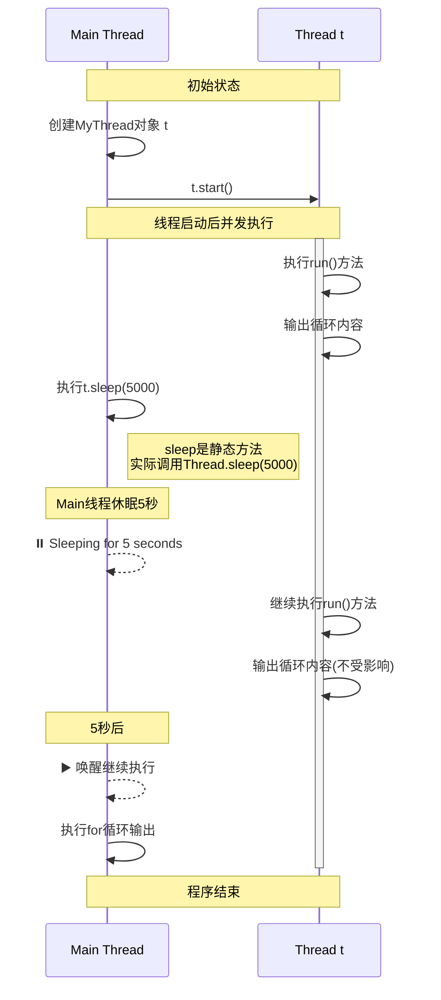
```mermaid
sequenceDiagram
    participant M as Main Thread
    participant T as Thread t

    Note over M,T: 初始状态
    M->>M: 创建MyThread对象 t
    M->>T: t.start()
    
    Note over M,T: 线程启动后并发执行
    activate T
    T->>T: 执行run()方法
    T->>T: 输出循环内容
    
    M->>M: 执行t.sleep(5000)
    Note right of M: sleep是静态方法<br/>实际调用Thread.sleep(5000)
    
    Note over M: Main线程休眠5秒
    M-->>M: ⏸️ Sleeping for 5 seconds
    
    T->>T: 继续执行run()方法
    T->>T: 输出循环内容(不受影响)
    
    Note over M: 5秒后
    M-->>M: ▶️ 唤醒继续执行
    M->>M: 执行for循环输出
    
    deactivate T
    Note over M,T: 程序结束
```

```java
t===>0
t===>1
t===>2
t===>3
...
t===>99
(main线程休眠5s后开始执行)
main===>0
main===>1
main===>2
main===>3
...
main===>99
```

> **结论:**
>
> 1. **初始阶段**
>    - Main线程创建Thread t对象
>    - 调用t.start()启动分支线程
> 2. **并发执行阶段**
>    - Thread t立即开始执行run()方法
>    - Main线程执行到`t.sleep(5000)`时，实际上是调用静态方法`Thread.sleep(5000)`
> 3. **休眠阶段**
>    - **Main线程进入5秒休眠状态**
>    - Thread t继续正常执行，不受sleep影响
> 4. **唤醒后阶段**
>    - Main线程5秒后唤醒，继续执行后续代码
>    - 两个线程都执行各自的循环输出


### 中断线程的睡眠

> **怎么中断一个线程的睡眠。（怎么解除线程因sleep导致的阻塞，让其开始抢夺CPU时间片。）**

```java
package com.powernode.javase.thread04;

public class ThreadTest {
    public static void main(String[] args) {
        // 创建线程对象并启动
        Thread t = new Thread(new Runnable(){
            @Override
            public void run() {
                System.out.println(Thread.currentThread().getName() + "===> begin");
                try {
                    // 睡眠一年
                    Thread.sleep(1000 * 60 * 60 * 24 * 365);
                } catch (InterruptedException e) {
                    // 打印异常信息
                    //e.printStackTrace();
                    System.out.println("知道了，这就起床！");
                }
                // 睡眠一年之后，起来干活了
                System.out.println(Thread.currentThread().getName() + " do some!");
            }
        });

        // 启动线程
        t.start();

        // 主线程
        // 要求：5秒之后，睡眠的Thread-0线程起来干活
        try {
            Thread.sleep(5*1000);
        } catch (InterruptedException e) {
            throw new RuntimeException(e);
        }

        // Thread-0起来干活了。
        // 这行代码的作用是终止 t 线程的睡眠。
        // interrupt方法是一个实例方法。
        // 以下代码含义：t线程别睡了。
        // 底层实现原理是利用了：异常处理机制。
        // 当调用这个方法的时候，如果t线程正在睡眠，必然会抛出：InterruptedException，然后捕捉异常，终止睡眠。
        t.interrupt();
    }
}
```

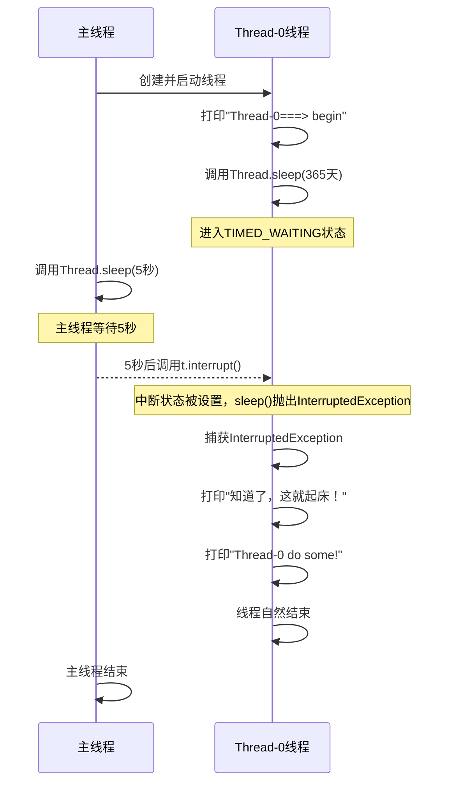
```mermaid
sequenceDiagram
    participant M as 主线程
    participant T as Thread-0线程

    M->>T: 创建并启动线程
    T->>T: 打印"Thread-0===> begin"
    T->>T: 调用Thread.sleep(365天)
    Note over T: 进入TIMED_WAITING状态
    
    M->>M: 调用Thread.sleep(5秒)
    Note over M: 主线程等待5秒
    
    M-->>T: 5秒后调用t.interrupt()
    Note over T: 中断状态被设置，sleep()抛出InterruptedException
    
    T->>T: 捕获InterruptedException
    T->>T: 打印"知道了，这就起床！"
    T->>T: 打印"Thread-0 do some!"
    
    T->>T: 线程自然结束
    M->>M: 主线程结束
```

```java
Thread-0===> begin
知道了，这就起床！
Thread-0 do some!
```

> **总结:**
>
> 1. **初始状态**：
>    - 主线程创建并启动Thread-0线程
>    - Thread-0进入长时间的睡眠状态
> 2. **中断机制**：
>    - `interrupt()`方法并不会立即停止线程
>    - 而是设置线程的中断标志位
>    - 当线程在阻塞状态（如sleep）时，会立即抛出`InterruptedException`
> 3. **异常处理**：
>    - Thread-0在sleep中被中断时，会抛出InterruptedException
>    - 程序捕获异常后继续执行后续代码
>    - 这样就实现了"唤醒"睡眠线程的效果
> 4. **线程状态变化**：
>    - RUNNABLE → TIMED_WAITING(sleep) → RUNNABLE(被中断) → TERMINATED
>
> **这种机制常用于实现线程的优雅终止，比如在需要停止后台任务时，通过中断来唤醒正在等待的线程。**


### 终止线程的执行

> **一个线程 t 一直在正常的运行，如何终止 t 线程的执行！！！！**

#### 方式一(已经过时)

```java
package com.powernode.javase.thread05;

public class ThreadTest {
    public static void main(String[] args) {
        Thread t = new Thread(new MyRunnable());

        t.setName("t");
        t.start();

        // 5秒之后，t线程停止！
        try {
            Thread.sleep(5000);
        } catch (InterruptedException e) {
            throw new RuntimeException(e);
        }
        // 终止线程t的执行。
        // 从java2开始就不建议使用了，因为这种方式是强行终止线程。容易导致数据丢失。
        // 没有保存的数据，在内存中的数据一定会因为此方式导致丢失。
        t.stop();
    }
}


class MyRunnable implements Runnable {
    @Override
    public void run() {
        for (int i = 0; i < 10; i++) {
            try {
                Thread.sleep(1000);
            } catch (InterruptedException e) {
                throw new RuntimeException(e);
            }
            System.out.println(Thread.currentThread().getName() + "===>" + i);
        }
    }
}
```


#### 方式二(优化后)

> **如何合理的，正常的方式`终止一个线程的执行`？**
>
>  *      **一般我们在实际开发中会使用`打标记`的方式，来终止一个线程的执行。**

```java
package com.powernode.javase.thread06;

public class ThreadTest {
    public static void main(String[] args) {
        // 创建线程对象
        MyRunnable mr = new MyRunnable();
        Thread t = new Thread(mr);

        t.setName("t");
        // 启动线程
        t.start();

        // 5秒之后终止线程t的执行
        try {
            Thread.sleep(5000);
        } catch (InterruptedException e) {
            throw new RuntimeException(e);
        }

        //终止线程t的执行。
        mr.run = false;
    }
}


class MyRunnable implements Runnable {
    /**
     * 是否继续执行的标记。
     * true表示：继续执行。
     * false表示：停止执行。
     */
    boolean run = true;

    @Override
    public void run() {
        for (int i = 0; i < 10; i++) {
            if (run) {
                System.out.println(Thread.currentThread().getName() + "==>" + i);
                try {
                    Thread.sleep(1000);
                } catch (InterruptedException e) {
                    throw new RuntimeException(e);
                }
            } else {
                return;
            }
        }
    }
}
```

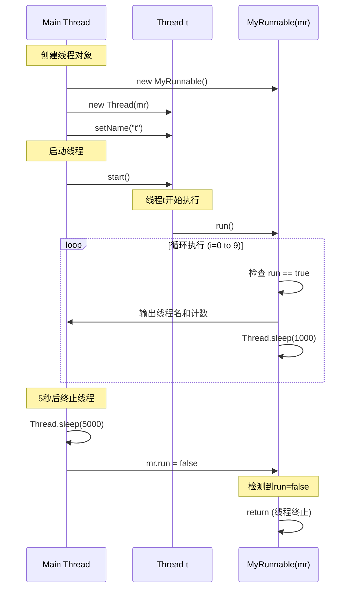
```mermaid
sequenceDiagram
    participant M as Main Thread
    participant T as Thread t
    participant R as MyRunnable(mr)

    Note over M: 创建线程对象
    M->>R: new MyRunnable()
    M->>T: new Thread(mr)
    M->>T: setName("t")
    
    Note over M: 启动线程
    M->>T: start()
    
    Note over T: 线程t开始执行
    T->>R: run()
    
    loop 循环执行 (i=0 to 9)
        R->>R: 检查 run == true
        R->>M: 输出线程名和计数
        R->>R: Thread.sleep(1000)
    end
    
    Note over M: 5秒后终止线程
    M->>M: Thread.sleep(5000)
    M->>R: mr.run = false
    
    Note over R: 检测到run=false
    R->>R: return (线程终止)
```

```java
t==>0
t==>1
t==>2
t==>3
t==>4
(5秒之后终止了线程t的执行)
进程已结束，退出代码为 0
```

> **总结:**
>
> ### 1. **初始化阶段**
>
> - 主线程创建 `MyRunnable` 对象和线程对象
> - 设置线程名并启动线程
>
> ### 2. **线程执行阶段**
>
> - 线程t开始执行`run()`方法
> - 在循环中不断检查`run`标志位
> - 每次循环输出信息并睡眠1秒
>
> ### 3. **终止阶段**
>
> - 主线程睡眠5秒后，将`run`标志设为`false`
> - 线程t在下次循环检查时发现`run`为`false`，立即返回终止执行


## 守护线程

* 设置当前线程为守护线程（后台线程）：

```java
public final void setDaemon(boolean on) {}
```

* 判断当前线程是否是守护线程（后台线程）：

```java
public final boolean isDaemon() {}
```

> [!NOTE]
>
> * ① Java 中默认创建的线程是非守护线程（普通线程，用户线程）。
> * ② 如果一个应用中只要有一个普通线程还在运行，应用程序就不会退出；反之，则会退出。
> * ③ 守护线程依赖于普通线程，当最后一个前台线程结束时，所有后台线程立即终止。
> * ④ Java 中的 GC 就是典型的守护线程。

```java
1. 在Java语言中，线程被分为两大类：
 	第一类：用户线程（非守护线程）
 	第二类：守护线程（后台线程）

2. 在JVM当中，有一个隐藏的守护线程一直在守护者，它就是GC线程。

3. 守护线程的特点：所有的用户线程结束之后，守护线程自动退出/结束。
 
4. 如何将一个线程设置为守护线程？
	t.setDaemon(true);
```

```java
package com.powernode.javase.thread07;

public class ThreadTest {
    public static void main(String[] args) {
        // 创建线程
        MyThread myThread = new MyThread();
        myThread.setName("t");

        // 在启动线程之前，设置线程为守护线程
        myThread.setDaemon(true);

        // 启动线程
        myThread.start();

        // 10s结束！
        // main线程中，main线程是一个用户线程。
        for (int i = 0; i < 10; i++) {
            System.out.println(Thread.currentThread().getName() + "===>" + i);
            try {
                Thread.sleep(1000);
            } catch (InterruptedException e) {
                throw new RuntimeException(e);
            }
        }
    }
}


class MyThread extends Thread {
    @Override
    public void run() {
        int i = 0;
        while (true) {
            System.out.println(Thread.currentThread().getName() + "==>" + (++i));
            try {
                Thread.sleep(1000);
            } catch (InterruptedException e) {
                throw new RuntimeException(e);
            }
        }
    }
}
```

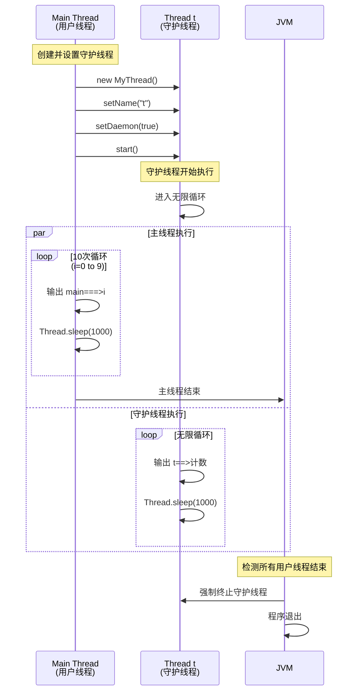
```mermaid
sequenceDiagram
    participant M as Main Thread<br/>(用户线程)
    participant T as Thread t<br/>(守护线程)
    participant JVM as JVM

    Note over M: 创建并设置守护线程
    M->>T: new MyThread()
    M->>T: setName("t")
    M->>T: setDaemon(true)
    M->>T: start()
    
    Note over T: 守护线程开始执行
    T->>T: 进入无限循环
    
    par 主线程执行
        loop 10次循环 (i=0 to 9)
            M->>M: 输出 main===>i
            M->>M: Thread.sleep(1000)
        end
        M->>JVM: 主线程结束
    and 守护线程执行
        loop 无限循环
            T->>T: 输出 t==>计数
            T->>T: Thread.sleep(1000)
        end
    end
    
    Note over JVM: 检测所有用户线程结束
    JVM->>T: 强制终止守护线程
    JVM->>JVM: 程序退出
```

```java
main===>0
t==>1
main===>1
t==>2
main===>2
t==>3
t==>4
main===>3
main===>4
t==>5
main===>5
t==>6
t==>7
main===>6
main===>7
t==>8
main===>8
t==>9
main===>9
t==>10
t==>11
```

> **总结:**
>
> ### 1. **初始化阶段**
>
> - 主线程创建`MyThread`对象
> - 设置线程名为"t"
> - **关键步骤**：调用`setDaemon(true)`将线程设置为守护线程
> - 启动线程
>
> ### 2. **并发执行阶段**
>
> - **主线程**：执行10次循环，每次睡眠1秒
> - **守护线程t**：执行无限循环，每次睡眠1秒
>
> ### 3. **终止阶段**
>
> - 主线程完成10次循环后自然结束
> - JVM检测到**所有用户线程**（这里只有main线程）都已结束
> - JVM**强制终止**所有守护线程（包括线程t）
> - 程序退出


## 定时任务(记录日志)

```java
1. JDK中提供的定时任务：
      java.util.Timer         定时器
      java.util.TimerTask     定时任务
    
2. 定时器 + 定时任务：可以帮我们在程序中完成：每间隔多久执行一次某段程序。

3. Timer的构造方法：
      Timer()
      Timer(boolean isDaemon) isDaemon是true表示该定时器是一个守护线程。
```

```java
package com.powernode.javase.thread08;

import java.text.SimpleDateFormat;
import java.util.Date;
import java.util.Timer;
import java.util.TimerTask;

public class ThreadTest {
    public static void main(String[] args) throws Exception {
        // 创建定时器对象（本质上就是一个线程）
        // 如果这个定时器执行的任务是一个后台任务，是一个守护任务，建议将其定义为守护线程。
        Timer timer = new Timer(true);

        // 指定定时任务
        SimpleDateFormat sdf = new SimpleDateFormat("yyyy-MM-dd HH:mm:ss");
        Date firstTime = sdf.parse("2025-11-9 15:13:00");
        //timer.schedule(定时任务,第一次执行时间,间隔多久一次);
        //timer.schedule(new LogTimerTask(), firstTime, 1000);

        // 匿名内部类的方式
        timer.schedule(new TimerTask() {
            int count = 0;

            @Override
            public void run() {
                // 执行任务
                Date now = new Date();
                String strTime = sdf.format(now);
                System.out.println(strTime + ": " + count++);
            }
        },firstTime,1000*5);

        for (int i = 0; i < 10; i++) {
            Thread.sleep(1000);
        }
    }
}
```

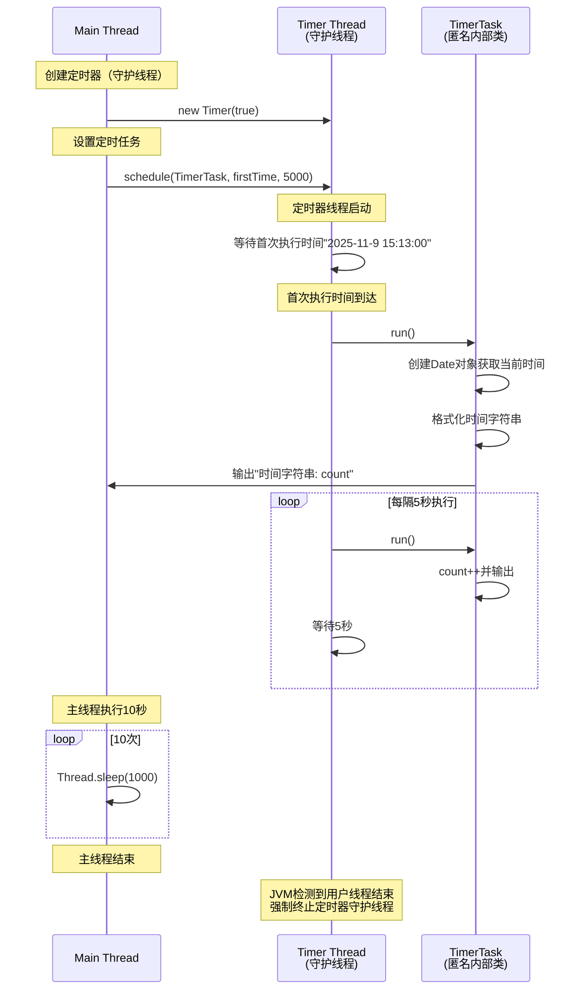
```mermaid
sequenceDiagram
    participant M as Main Thread
    participant T as Timer Thread<br/>(守护线程)
    participant TT as TimerTask<br/>(匿名内部类)

    Note over M: 创建定时器（守护线程）
    M->>T: new Timer(true)
    
    Note over M: 设置定时任务
    M->>T: schedule(TimerTask, firstTime, 5000)
    
    Note over T: 定时器线程启动
    T->>T: 等待首次执行时间"2025-11-9 15:13:00"
    
    Note over T: 首次执行时间到达
    T->>TT: run()
    TT->>TT: 创建Date对象获取当前时间
    TT->>TT: 格式化时间字符串
    TT->>M: 输出"时间字符串: count"
    
    loop 每隔5秒执行
        T->>TT: run()
        TT->>TT: count++并输出
        T->>T: 等待5秒
    end
    
    Note over M: 主线程执行10秒
    loop 10次
        M->>M: Thread.sleep(1000)
    end
    
    Note over M: 主线程结束
    Note over T: JVM检测到用户线程结束<br/>强制终止定时器守护线程
```

```java
2025-11-09 15:19:31: 0
2025-11-09 15:19:36: 1
2025-11-09 15:19:41: 2

进程已结束，退出代码为 0
```

> **总结:**
>
> **初始化阶段**
>
> - 主线程创建`Timer`对象，参数`true`表示设置为守护线程
> - 调用`schedule()`方法设置定时任务：
>   - **定时任务**：匿名内部类实现的`TimerTask`
>   - **首次执行时间**：`2025-11-9 15:13:00`
>   - **执行间隔**：5秒（5000毫秒）
>
> **定时器工作阶段**
>
> - 定时器线程（守护线程）启动并等待首次执行时间
> - 当系统时间到达指定时间时，执行第一次任务
> - 之后每隔5秒自动执行一次任务
> - 每次执行：
>   - 获取当前时间并格式化
>   - 输出时间字符串和计数器值
>   - 计数器自增
>
> **程序终止阶段**
>
> - 主线程执行10秒后结束
> - JVM检测到所有用户线程结束
> - 强制终止定时器守护线程
> - 程序退出
>
> **关键特点：**
>
> **Timer构造方法**：
>
> - `Timer()` - 创建用户线程定时器
> - `Timer(boolean isDaemon)` - 创建守护线程定时器
>
> **schedule方法参数**：
>
> 1. **TimerTask** - 要执行的任务（抽象类，需实现run方法）
> 2. **firstTime** - 首次执行时间（Date对象）
> 3. **period** - 执行间隔（毫秒）
>
> **守护线程的优势**：
>
> - 当应用程序主线程结束时，定时器自动停止
> - 避免程序无法正常退出的问题
> - 适合执行后台清理、监控等非关键任务


## 线程合并

```java
1. 调用join()方法完成线程合并。
    
2. join()方法是一个实例方法。（不是静态方法） t.join

3. 假设在main方法（main线程）中调用了 t.join()，后果是什么？
		t线程合并到主线程中。主线程进入阻塞状态。直到 t 线程执行结束。主线程阻塞解除。
    
4. t.join()方法其实是让当前线程进入阻塞状态，直到t线程结束，当前线程阻塞解除。
    
5. 和sleep方法有点类似，但不一样：
	第一：sleep方法是静态方法，join是实例方法。
	第二：sleep方法可以指定睡眠的时长，join方法不能保证阻塞的时长。
	第三：sleep和join方法都是让当前线程进入阻塞状态。
	第四：sleep方法的阻塞解除条件？时间过去了。 join方法的阻塞解除条件？调用join方法的那个线程结束了。
```

```java
package com.powernode.javase.thread09;

public class ThreadTest {
    public static void main(String[] args) throws InterruptedException {
        Thread t = new MyThread();
        t.setName("t");
        t.start();

        System.out.println("main begin");

        // 合并线程
        // t合并到main线程中。
        // main线程受到阻塞（当前线程受到阻塞）
        // t线程继续执行，直到t线程结束。main线程阻塞解除（当前线程阻塞解除）。
        // t.join();

        // join方法也可以有参数，参数是毫秒。
        // 以下代码表示 t 线程合并到 当前线程，合并时长 10 毫秒
        // 阻塞当前线程 10 毫秒
        //t.join(10);

        // 调用这个方法，是想让当前线程受阻10秒
        // 但不一定，如果在指定的阻塞时间内，t线程结束了。当前线程阻塞也会解除。
        t.join(1000 * 10);

        // 当前线程休眠10秒。
        //Thread.sleep(1000 * 10);

        // 主线程
        for (int i = 0; i <= 100; i++) {
            System.out.println(Thread.currentThread().getName() + "==>" + i);
        }

        System.out.println("main over");
    }
}


class MyThread extends Thread {
    @Override
    public void run() {
        for (int i = 0; i <= 100; i++) {
            System.out.println(Thread.currentThread().getName() + "==>" + i);
        }
    }
}
```

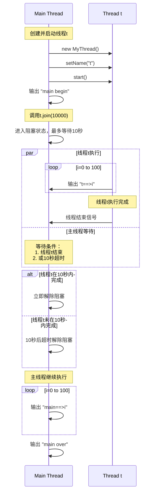
```mermaid
sequenceDiagram
    participant M as Main Thread
    participant T as Thread t

    Note over M: 创建并启动线程t
    M->>T: new MyThread()
    M->>T: setName("t")
    M->>T: start()
    
    M->>M: 输出 "main begin"
    
    Note over M: 调用t.join(10000)
    M->>M: 进入阻塞状态，最多等待10秒
    
    par 线程t执行
        loop i=0 to 100
            T->>M: 输出 "t==>i"
        end
        Note over T: 线程t执行完成
        T->>M: 线程结束信号
    and 主线程等待
        Note over M: 等待条件：<br/>1. 线程t结束<br/>2. 或10秒超时
    end
    
    alt 线程t在10秒内完成
        M->>M: 立即解除阻塞
    else 线程t未在10秒内完成
        M->>M: 10秒后超时解除阻塞
    end
    
    Note over M: 主线程继续执行
    loop i=0 to 100
        M->>M: 输出 "main==>i"
    end
    
    M->>M: 输出 "main over"
```

```java
main begin
(main线程受到阻塞（当前线程受到阻塞）)
t==>0
t==>1
t==>2
...
t==>100
(t线程继续执行，直到t线程结束。main线程阻塞解除（当前线程阻塞解除）)
main==>0
main==>1
...
main==>100
main over
```

> **总结:**
>
> ## 时序图详细解释：
>
> ### 1. **初始化阶段**
>
> - 主线程创建并启动线程t
> - 主线程输出"main begin"
>
> ### 2. **线程合并阶段** - 关键部分
>
> - 主线程调用`t.join(10000)`，进入阻塞状态
> - **阻塞条件**：主线程等待线程t结束，最多等待10秒
> - 线程t继续独立执行循环
>
> ### 3. **解除阻塞阶段**
>
> - **情况1**：线程t在10秒内完成执行 → 主线程立即解除阻塞
> - **情况2**：线程t未在10秒内完成 → 主线程10秒后超时解除阻塞
>
> ### 4. **继续执行阶段**
>
> - 主线程解除阻塞后继续执行自己的循环
> - 输出"main over"后程序结束
>
> 
>
> **join方法的三种形式：**
>
> 1. **无参join()**
>
> ```java
> t.join(); // 无限期等待，直到线程t结束
> ```
>
> 2. **带毫秒参数的join(long millis)**
>
> ```java
> t.join(10000); // 最多等待10秒
> ```
>
> 3. **带毫秒和纳秒参数的join(long millis, int nanos)**
>
> ```java
> t.join(10000, 500000); // 最多等待10秒500纳秒
> ```
>
> **join方法与sleep方法的对比：**
>
> | 特性         | join()                   | sleep()                  |
> | :----------- | :----------------------- | :----------------------- |
> | **方法类型** | 实例方法                 | 静态方法                 |
> | **阻塞时长** | 不确定（依赖目标线程）   | 确定（指定时间）         |
> | **阻塞条件** | 目标线程结束             | 时间到达                 |
> | **中断响应** | 支持InterruptedException | 支持InterruptedException |
> | **用途**     | 线程依赖执行顺序         | 定时等待、延迟执行       |


## JVM调度


### 线程优先级

```java
1. 优先级
    
2. 线程是可以设置优先级的，优先级较高的，获得CPU时间片的总体概率高一些。
    
3. JVM采用的是抢占式调度模型。谁的优先级高，获取CPU时间片的总体概率就高。
    
4. 默认情况下，一个线程的优先级是 5
    
5. 最低是1，最高是10
```

```java
package com.powernode.javase.thread10;

public class ThreadTest {
    public static void main(String[] args) {
        /*System.out.println("最低优先级：" + Thread.MIN_PRIORITY);
        System.out.println("最高优先级：" + Thread.MAX_PRIORITY);
        System.out.println("默认优先级：" + Thread.NORM_PRIORITY);

        // 获取main线程的优先级
        Thread mainThread = new Thread();

        System.out.println("main线程的优先级：" + mainThread.getPriority()); // 5

        // 设置优先级
        mainThread.setPriority(Thread.MAX_PRIORITY);

        System.out.println("main线程的优先级：" + mainThread.getPriority()); // 10*/

        Thread t1 = new MyThread();
        t1.setName("t1");

        Thread t2 = new MyThread();
        t2.setName("t2");

        t1.setPriority(Thread.MAX_PRIORITY);
        t2.setPriority(Thread.MIN_PRIORITY);

        // 启动线程
        t1.start();
        t2.start();
    }
}

class MyThread extends Thread {
    @Override
    public void run() {
        for (int i = 0; i <= 1000; i++) {
            System.out.println(Thread.currentThread().getName() + "==>" + i);
        }
    }
}
```

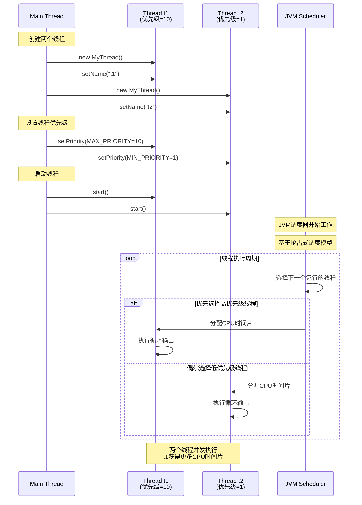
```mermaid
sequenceDiagram
    participant M as Main Thread
    participant T1 as Thread t1<br/>(优先级=10)
    participant T2 as Thread t2<br/>(优先级=1)
    participant S as JVM Scheduler

    Note over M: 创建两个线程
    M->>T1: new MyThread()
    M->>T1: setName("t1")
    M->>T2: new MyThread()
    M->>T2: setName("t2")
    
    Note over M: 设置线程优先级
    M->>T1: setPriority(MAX_PRIORITY=10)
    M->>T2: setPriority(MIN_PRIORITY=1)
    
    Note over M: 启动线程
    M->>T1: start()
    M->>T2: start()
    
    Note over S: JVM调度器开始工作
    Note over S: 基于抢占式调度模型
    
    loop 线程执行周期
        S->>S: 选择下一个运行的线程
        alt 优先选择高优先级线程
            S->>T1: 分配CPU时间片
            T1->>T1: 执行循环输出
        else 偶尔选择低优先级线程
            S->>T2: 分配CPU时间片
            T2->>T2: 执行循环输出
        end
    end
    
    Note over T1, T2: 两个线程并发执行<br/>t1获得更多CPU时间片
```

```java
t2==>0
t2==>1
t1==>0
t2==>2
t1==>1
t2==>3
...
t1==>1000
...
t2==>1000
```

> **总结:**
>
> ### 1. **初始化阶段**
>
> - 主线程创建两个`MyThread`对象
> - 分别设置线程名称为"t1"和"t2"
>
> ### 2. **优先级设置阶段** - 关键部分
>
> - 设置t1线程为最高优先级（10）
> - 设置t2线程为最低优先级（1）
>
> ### 3. **线程启动阶段**
>
> - 启动两个线程，它们进入就绪状态
> - JVM调度器开始工作
>
> ### 4. **调度执行阶段**
>
> - JVM基于**抢占式调度模型**分配CPU时间片
> - 优先级较高的t1线程**总体概率上**获得更多CPU时间片
> - 优先级较低的t2线程获得较少CPU时间片
> - 两个线程并发执行循环输出


### 线程的让位

```java
1. 让位
    
2. 静态方法：Thread.yield()
    
3. 让当前线程让位。
    
4. 注意：让位不会让其进入阻塞状态。只是放弃目前占有的CPU时间片，进入就绪状态，继续抢夺CPU时间片。
    
5. 只能保证大方向上的，大概率，到了某个点让位一次。
```

```java
package com.powernode.javase.thread11;

public class ThreadTest {
    public static void main(String[] args) {
        Thread t1 = new MyThread();
        t1.setName("t1");

        Thread t2 = new MyThread();
        t2.setName("t2");

        t1.start();
        t2.start();
    }
}

class MyThread extends Thread {
    @Override
    public void run() {
        for (int i = 0; i <= 100; i++) {
            if (Thread.currentThread().getName().equals("t1") && i % 10 == 0) {
                System.out.println(Thread.currentThread().getName() + "让位了，此时的i下标是：" + i);
                // 当前线程让位，这个当前线程一定是t1
                // t1会让位一次
                Thread.yield();
            }
            System.out.println(Thread.currentThread().getName() + "==>" + i);
        }
    }
}
```

```mermaid
sequenceDiagram
    participant Main as 主线程
    participant T1 as 线程t1
    participant T2 as 线程t2
    participant Scheduler as 线程调度器

    Note over Main: 程序启动
    
    Main->>T1: 创建并启动t1
    Main->>T2: 创建并启动t2
    
    Note over T1, T2: 两个线程开始并发执行
    
    loop t1循环 i=0 to 100
        T1->>T1: 执行循环体
        alt i % 10 == 0 (每10次)
            T1->>T1: 输出让位信息
            T1->>Scheduler: Thread.yield()<br/>主动让出CPU
            Scheduler->>T2: 可能切换到t2执行
        else 其他情况
            T1->>T1: 正常输出i的值
        end
    end
    
    loop t2循环 i=0 to 100
        T2->>T2: 执行循环体
        T2->>T2: 正常输出i的值<br/>(t2不会调用yield)
    end
    
    Note over Scheduler: 线程调度器负责<br/>在t1、t2间切换
    
    T1-->>Main: t1执行完成
    T2-->>Main: t2执行完成
```

```java
t2==>0
t2==>1
t2==>2
t2==>3
t2==>4
t2==>5
t1让位了，此时的i下标是：0
t2==>6
t2==>7
t2==>8
t1==>0
t2==>9
t1==>1
t2==>10
t1==>2
t2==>11
t2==>12
t2==>13
t2==>14
t2==>15
t2==>16
t2==>17
t2==>18
t1==>3
t2==>19
t1==>4
t1==>5
t1==>6
t1==>7
t1==>8
t1==>9
t2==>20
t1让位了，此时的i下标是：10
t2==>21
```

> **总结:**
>
> 1. **初始阶段**
>
> - 主线程创建并启动t1、t2两个线程
> - 两个线程进入就绪状态，等待CPU时间片
>
> 2. **并发执行阶段**
>
> - **t1线程**：每10次循环(i%10==0)时：
>   - 输出让位信息
>   - 调用`Thread.yield()`主动让出CPU
>   - 进入就绪状态，重新参与CPU竞争
> - **t2线程**：始终正常执行循环，不主动让位
>
> 3. **线程调度**
>
> - 线程调度器负责在t1、t2之间分配CPU时间片
> - 当t1调用yield()时，调度器可能（但不是必然）切换到t2执行
> - 两个线程交替执行，直到各自循环结束
>
> 4. **执行结果特点**
>
> - t1的输出会出现"让位了"的提示信息
> - 两个线程的输出会交错出现
> - t1让位时，t2可能获得更多执行机会
> - 但由于线程调度的不确定性，具体执行顺序每次运行可能不同


## 线程安全

```java
1. 什么情况下需要考虑线程安全问题？
          条件1：多线程的并发环境下
          条件2：有共享的数据
          条件3：共享数据涉及到修改的操作

2. 一般情况下：
	局部变量不存在线程安全问题。（尤其是基本数据类型不存在线程安全问题【在栈中，栈不是共享的】，如果是引用数据类型，就另说了！）
	实例变量可能存在线程安全问题。实例变量在堆中。堆是多线程共享的。
	静态变量也可能存在线程安全问题。静态变量在堆中。堆是多线程共享的。
```


### 线程异步机制


```java
1. 大家找一个现实生活中的例子，来说明一下，线程安全问题：比如同时取钱！
    
2. 以上多线程并发对同一个账户进行取款操作的时候，有安全问题？怎么解决？
	让线程t1和线程t2排队执行。不要并发。要排队。
	我们把线程排队执行，叫做：线程同步机制。（t1和t2线程，t1线程在执行的时候必须等待t2线程执行到某个位置之后，t1线程才能执行。只要t1和t2之间发生了等待，就认为是同步。）
	如果不排队，我们将其称为：线程异步机制。（t1和t2各自执行各自的，谁也不需要等对方。并发的，就认为是异步）
	异步：效率高。但是可能存在安全隐患。
	同步：效率低。排队了。可以保证数据的安全问题。
    
3. 以下程序存在安全问题。t1和t2线程同时对act一个账号进行取款操作。数据是错误的。
```

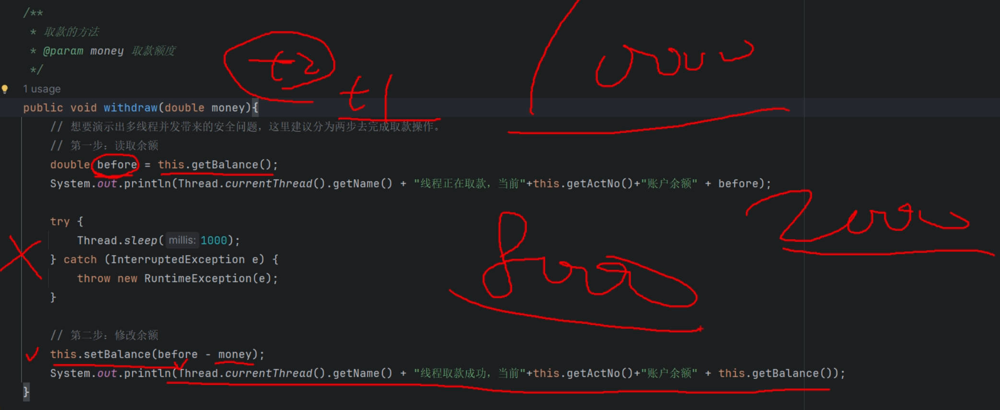

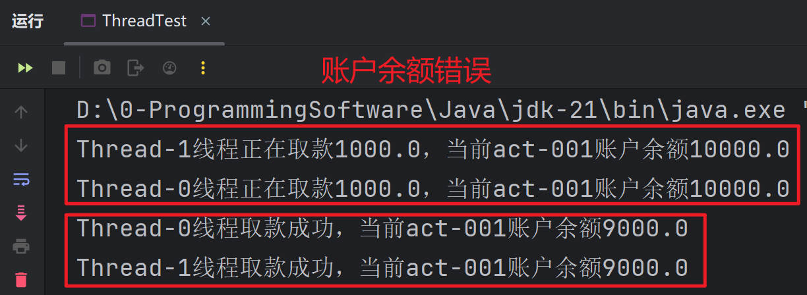

```java
package com.powernode.javase.thread12;

public class ThreadTest {
    public static void main(String[] args) {
        // 创建账户对象
        Account act = new Account("act-001",10000);

        // 创建线程对象1
        Thread t1 = new Thread(new Withdraw(act));

        // 创建线程对象2
        Thread t2 = new Thread(new Withdraw(act));

        // 启动线程
        t1.start();
        t2.start();
    }
}


class Withdraw implements Runnable{

    // 实例变量(共享数据)
    private Account act;

    public Withdraw(Account act) {
        this.act = act;
    }

    @Override
    public void run() {
        act.withdraw(1000);
    }
}


class Account {
    /**
     * 账号
     */
    private String actNo;
    /**
     * 余额
     */
    private double balance;

    public Account(String actNo, double balance) {
        this.actNo = actNo;
        this.balance = balance;
    }

    public String getActNo() {
        return actNo;
    }

    public void setActNo(String actNo) {
        this.actNo = actNo;
    }

    public double getBalance() {
        return balance;
    }

    public void setBalance(double balance) {
        this.balance = balance;
    }


    /**
     * 取款的方法
     *
     * @param money 取款额度
     */
    public void withdraw(double money) {
        //this.setBalance(this.getBalance()-money);
        // 想要演示出多线程并发带来的安全问题，这里建议分为两步去完成取款操作。
        // 第一步：读取余额
        double before = this.getBalance();
        System.out.println(Thread.currentThread().getName() + "线程正在取款" + money + "，当前" + this.getActNo() + "账户余额" + before);

        // 休眠1s
        try {
            Thread.sleep(1000);
        } catch (InterruptedException e) {
            throw new RuntimeException(e);
        }

        // 第二步：修改余额
        this.setBalance(before - money);
        System.out.println(Thread.currentThread().getName() + "线程取款成功，当前" + this.getActNo() + "账户余额" + this.getBalance());
    }
}
```


### 线程同步机制

```java
1. 线程同步的本质是：线程排队执行就是同步机制。
    
2. 语法格式：
       synchronized(必须是需要排队的这几个线程共享的对象){
          // 需要同步的代码
       }
 
           “必须是需要排队的这几个线程共享的对象” 这个必须选对了。
           这个如果选错了，可能会无故增加同步的线程数量，导致效率降低。
               
3. 原理是什么？
       synchronized(obj){
          // 同步代码块
       }
    假设obj是t1 t2两个线程共享的。
    t1和t2执行这个代码的时候，一定是有一个先抢到了CPU时间片。一定是有先后顺序的。
    假设t1先抢到了CPU时间片。t1线程找共享对象obj的对象锁，找到之后，则占有这把锁。只要能够占有obj对象的对象锁，就有权利进入同步代码块执行代码。
    当t1线程执行完同步代码块之后，会释放之前占有的对象锁（归还锁）。
    同样，t2线程抢到CPU时间片之后，也开始执行，也会去找共享对象obj的对象锁，但由于 t1线程占有这把锁，t2线程只能在同步代码块之外等待。

4. 注意同步代码块的范围，不要无故扩大同步的范围，同步代码块范围越小，效率越高。
```

```java
package com.powernode.javase.thread13;

public class ThreadTest {
    public static void main(String[] args) {
        // 创建账户对象
        Account act = new Account("act-001",10000);
        // 创建线程对象1
        Thread t1 = new Thread(new Withdraw(act));
        // 创建线程对象2
        Thread t2 = new Thread(new Withdraw(act));

        // 启动线程
        t1.start();
        t2.start();
    }
}

// 取款的线程类
class Withdraw implements Runnable{

    // 实例变量（共享数据）
    private Account act;

    public Withdraw(Account act) {
        this.act = act;
    }

    @Override
    public void run() {
        act.withdraw(1000);
    }
}


// 银行账户
class Account{

    private static Object obj = new Object();
    /**
     * 账号
     */
    private String actNo;
    /**
     * 余额
     */
    private double balance;

    public Account(String actNo, double balance) {
        this.actNo = actNo;
        this.balance = balance;
    }

    public String getActNo() {
        return actNo;
    }

    public void setActNo(String actNo) {
        this.actNo = actNo;
    }

    public double getBalance() {
        return balance;
    }

    public void setBalance(double balance) {
        this.balance = balance;
    }

    /**
     * 取款的方法
     * @param money 取款额度
     */
    public void withdraw(double money){
        // this是当前账户对象
        // 当前账户对象act，就是t1和t2共享的对象。
        synchronized (this){
            //synchronized (obj) {
            // 第一步：读取余额
            double before = this.getBalance();
            System.out.println(Thread.currentThread().getName() + "线程正在取款"+money+"，当前"+this.getActNo()+"账户余额" + before);

            try {
                Thread.sleep(1000);
            } catch (InterruptedException e) {
                throw new RuntimeException(e);
            }

            // 第二步：修改余额
            this.setBalance(before - money);
            System.out.println(Thread.currentThread().getName() + "线程取款成功，当前"+this.getActNo()+"账户余额" + this.getBalance());
        }
    }
}
```

```mermaid
sequenceDiagram
    participant Main as 主线程
    participant T1 as 线程1
    participant T2 as 线程2
    participant Account as 账户对象
    
    Main->>Account: 创建账户(act-001, 10000)
    Main->>T1: 创建线程1(共享账户)
    Main->>T2: 创建线程2(共享账户)
    Main->>T1: start()
    Main->>T2: start()
    
    Note over T1,T2: 线程开始竞争锁
    
    T1->>Account: 尝试获取对象锁
    Note right of T1: 获取锁成功
    
    T2->>Account: 尝试获取对象锁
    Note right of T2: 获取锁失败，进入阻塞状态
    
    T1->>Account: withdraw(1000)
    Note over T1,Account: 进入synchronized代码块
    
    T1->>Account: getBalance() = 10000
    T1->>T1: Thread.sleep(1000)
    T1->>Account: setBalance(9000)
    T1->>Account: getBalance() = 9000
    T1->>Account: 释放对象锁
    
    Note over T1,T2: 线程1释放锁后，线程2被唤醒
    
    T2->>Account: 获取对象锁成功
    T2->>Account: withdraw(1000)
    Note over T2,Account: 进入synchronized代码块
    
    T2->>Account: getBalance() = 9000
    T2->>T2: Thread.sleep(1000)
    T2->>Account: setBalance(8000)
    T2->>Account: getBalance() = 8000
    T2->>Account: 释放对象锁
```

```java
Thread-0线程正在取款1000.0，当前act-001账户余额10000.0
Thread-0线程取款成功，当前act-001账户余额9000.0
Thread-1线程正在取款1000.0，当前act-001账户余额9000.0
Thread-1线程取款成功，当前act-001账户余额8000.0
```

> **总结:**
>
> ## 关键点解释：
>
> 1. **锁的竞争**：
>    - 线程1和线程2同时尝试获取Account对象的锁
>    - 只有一个线程能成功获取锁（假设线程1先获取）
> 2. **同步执行**：
>    - 线程1获取锁后，线程2在`synchronized`块外阻塞等待
>    - 线程1执行完整个取款操作后释放锁
>    - 线程2被唤醒并获取锁，然后执行取款操作
> 3. **线程安全**：
>    - 由于使用了`synchronized(this)`，确保了同一时间只有一个线程能执行取款操作
>    - 避免了数据竞争和不一致的问题
> 4. **最终结果**：
>    - 初始余额：10000
>    - 线程1取款后：9000
>    - 线程2取款后：8000
>    - 最终余额正确为8000


### 线程同步机制(添加到实例方法上)

```java
在实例方法上也可以添加 synchronized 关键字：
       1. 在实例方法上添加了synchronized关键字之后，整个方法体是一个同步代码块。
       2. 在实例方法上添加了synchronized关键字之后，共享对象的对象锁一定是this的。
 
这种方式相对于之前所讲的局部同步代码块的方式要差一些：
       synchronized(共享对象){
           // 同步代码块
       }
 
       这种方式优点：灵活
           共享对象可以随便调整。
           同步代码块的范围可以随便调整。
```

```java
package com.powernode.javase.thread14;

public class ThreadTest {
    public static void main(String[] args) {
        // 创建账户对象
        Account act = new Account("act-001",10000);
        // 创建线程对象1
        Thread t1 = new Thread(new Withdraw(act));
        // 创建线程对象2
        Thread t2 = new Thread(new Withdraw(act));

        // 启动线程
        t1.start();
        t2.start();
    }
}

// 取款的线程类
class Withdraw implements Runnable{

    // 实例变量（共享数据）
    private Account act;

    public Withdraw(Account act) {
        this.act = act;
    }

    @Override
    public void run() {
        act.withdraw(1000);
    }
}


// 银行账户
class Account{

    private static Object obj = new Object();
    /**
     * 账号
     */
    private String actNo;
    /**
     * 余额
     */
    private double balance;

    public Account(String actNo, double balance) {
        this.actNo = actNo;
        this.balance = balance;
    }

    public String getActNo() {
        return actNo;
    }

    public void setActNo(String actNo) {
        this.actNo = actNo;
    }

    public double getBalance() {
        return balance;
    }

    public void setBalance(double balance) {
        this.balance = balance;
    }

    /**
     * 取款的方法
     * @param money 取款额度
     */
    public synchronized void withdraw(double money){
            // 第一步：读取余额
            double before = this.getBalance();
            System.out.println(Thread.currentThread().getName() + "线程正在取款"+money+"，当前"+this.getActNo()+"账户余额" + before);

            try {
                Thread.sleep(1000);
            } catch (InterruptedException e) {
                throw new RuntimeException(e);
            }

            // 第二步：修改余额
            this.setBalance(before - money);
            System.out.println(Thread.currentThread().getName() + "线程取款成功，当前"+this.getActNo()+"账户余额" + this.getBalance());
    }
}
```

```java
Thread-0线程正在取款1000.0，当前act-001账户余额10000.0
Thread-0线程取款成功，当前act-001账户余额9000.0
Thread-1线程正在取款1000.0，当前act-001账户余额9000.0
Thread-1线程取款成功，当前act-001账户余额8000.0
```


### 线程同步机制的面试题


#### 面试题(1)

> + **线程同步机制的面试题：分析以下程序 m2 方法在执行的时候，需要等待 m1 方法的结束吗？**
>
>  * **`不需要`**

```java
package com.powernode.javase.thread15;

public class ThreadTest {
    public static void main(String[] args) {
        MyClass mc = new MyClass();
        Thread t1 = new Thread(new MyRunnable(mc));
        Thread t2 = new Thread(new MyRunnable(mc));

        t1.setName("t1");
        t2.setName("t2");

        t1.start();
        try {
            Thread.sleep(1000);
        } catch (InterruptedException e) {
            throw new RuntimeException(e);
        }
        t2.start();
    }
}

class MyRunnable implements Runnable {

    private MyClass mc;

    public MyRunnable(MyClass mc) {
        this.mc = mc;
    }

    @Override
    public void run() {
        if("t1".equals(Thread.currentThread().getName())){
            mc.m1();
        }
        if("t2".equals(Thread.currentThread().getName())){
            mc.m2();
        }
    }
}

class MyClass {
    public synchronized void m1(){
        System.out.println("m1 begin");
        try {
            Thread.sleep(1000 * 5);
        } catch (InterruptedException e) {
            throw new RuntimeException(e);
        }
        System.out.println("m1 over");
    }

    public void m2(){
        System.out.println("m2 begin");
        System.out.println("m2 over");
    }
}
```

```mermaid
sequenceDiagram
    participant Main as 主线程
    participant T1 as 线程t1
    participant T2 as 线程t2
    participant MC as MyClass对象

    Main->>T1: 启动t1线程
    Main->>Main: sleep(1000ms)
    T1->>MC: 调用m1() - synchronized方法
    Note over T1,MC: t1获取对象锁
    
    T1->>T1: sleep(5000ms)
    
    Main->>T2: 启动t2线程
    T2->>MC: 调用m2() - 普通方法
    Note over T2,MC: m2()不需要锁，直接执行
    
    T2->>T2: 立即执行m2()
    T2-->>MC: m2 over (立即返回)
    
    T1->>T1: sleep结束
    T1-->>MC: m1 over
    Note over T1,MC: t1释放对象锁
```

```java
m1 begin
m2 begin
m2 over
m1 over
```

> **总结:**
>
> 1. **锁的作用范围**：
>    - `m1()`是`synchronized`方法，需要获取对象锁
>    - `m2()`是普通方法，不需要获取锁
> 2. **执行时序**：
>    - t1先启动，获取MC的对象锁，执行m1()
>    - 主线程sleep 1秒后启动t2
>    - t2调用m2()时，由于m2()不需要锁，可以立即执行
>    - m1()和m2()可以并发执行
> 3. **结论**：
>    - **m2()不需要等待m1()结束**
>    - 只有多个线程同时调用synchronized方法时才会相互等待
>    - 普通方法和synchronized方法之间不会产生竞争
>
> **这就是为什么m2()`不需要等待`m1()执行完成的原因。**


#### 面试题(2)

>  * **线程同步机制的面试题：分析以下程序 m2 方法在执行的时候，需要等待 m1 方法的结束吗？**
>  * **`需要`**

```java
package com.powernode.javase.thread16;

public class ThreadTest {
    public static void main(String[] args) {
        MyClass mc = new MyClass();
        Thread t1 = new Thread(new MyRunnable(mc));
        Thread t2 = new Thread(new MyRunnable(mc));

        t1.setName("t1");
        t2.setName("t2");

        t1.start();
        try {
            Thread.sleep(1000);
        } catch (InterruptedException e) {
            throw new RuntimeException(e);
        }
        t2.start();
    }
}

class MyRunnable implements Runnable {

    private MyClass mc;

    public MyRunnable(MyClass mc) {
        this.mc = mc;
    }

    @Override
    public void run() {
        if("t1".equals(Thread.currentThread().getName())){
            mc.m1();
        }
        if("t2".equals(Thread.currentThread().getName())){
            mc.m2();
        }
    }
}

class MyClass {
    public synchronized void m1(){
        System.out.println("m1 begin");
        try {
            Thread.sleep(1000 * 5);
        } catch (InterruptedException e) {
            throw new RuntimeException(e);
        }
        System.out.println("m1 over");
    }

    public synchronized void m2(){
        System.out.println("m2 begin");
        System.out.println("m2 over");
    }
}
```

```mermaid
sequenceDiagram
    participant Main as 主线程
    participant T1 as 线程t1
    participant T2 as 线程t2
    participant MC as MyClass对象

    Main->>T1: 启动t1线程
    Main->>Main: sleep(1000ms)
    
    T1->>MC: 调用m1() - synchronized方法
    Note over T1,MC: t1获取对象锁🔒
    
    T1->>T1: sleep(5000ms)
    Note over T1: m1执行中...
    
    Main->>T2: 启动t2线程
    T2->>MC: 尝试调用m2() - synchronized方法
    Note over T2,MC: t2等待对象锁⏳<br/>因为m2也是synchronized方法
    
    T1->>T1: sleep结束
    T1-->>MC: m1 over
    Note over T1,MC: t1释放对象锁🔓
    
    MC->>T2: t2获得对象锁
    T2->>MC: 执行m2()
    T2-->>MC: m2 over
    Note over T2,MC: t2释放对象锁
```

```java
m1 begin
m1 over
m2 begin
m2 over
```

> **总结:**
>
> 1. **锁的作用范围**：
>    - `m1()`是`synchronized`方法，需要获取对象锁
>    - `m2()`也是`synchronized`方法，同样需要获取对象锁
> 2. **执行时序**：
>    - t1先启动，获取MC的对象锁，执行m1()
>    - 主线程sleep 1秒后启动t2
>    - t2调用m2()时，由于m2()也需要对象锁，但锁已被t1持有
>    - t2必须等待t1释放锁后才能执行m2()
> 3. **锁竞争**：
>    - 两个synchronized方法共用同一个对象锁
>    - 同一时间只有一个线程能持有该锁
>    - t2在锁被占用时进入阻塞状态
> 4. **结论**：
>    - **m2()需要等待m1()结束**
>    - 因为两个方法都是synchronized的，共享同一个对象锁
>    - t2必须等待t1释放锁后才能执行m2()
>
> **这就是为什么在这个版本中m2()`需要等待`m1()执行完成的原因。**


#### 面试题(3)

> + **线程同步机制的面试题：分析以下程序 m2 方法在执行的时候，需要等待 m1 方法的结束吗？**
>
>  * **`不需要`**

```java
package com.powernode.javase.thread17;

public class ThreadTest {
    public static void main(String[] args) {
        MyClass mc1 = new MyClass();
        MyClass mc2 = new MyClass();
        Thread t1 = new Thread(new MyRunnable(mc1));
        Thread t2 = new Thread(new MyRunnable(mc2));

        t1.setName("t1");
        t2.setName("t2");

        t1.start();
        try {
            Thread.sleep(1000);
        } catch (InterruptedException e) {
            throw new RuntimeException(e);
        }
        t2.start();
    }
}

class MyRunnable implements Runnable {

    private MyClass mc;

    public MyRunnable(MyClass mc) {
        this.mc = mc;
    }

    @Override
    public void run() {
        if("t1".equals(Thread.currentThread().getName())){
            mc.m1();
        }
        if("t2".equals(Thread.currentThread().getName())){
            mc.m2();
        }
    }
}

class MyClass {
    public synchronized void m1(){
        System.out.println("m1 begin");
        try {
            Thread.sleep(1000 * 5);
        } catch (InterruptedException e) {
            throw new RuntimeException(e);
        }
        System.out.println("m1 over");
    }

    public synchronized void m2(){
        System.out.println("m2 begin");
        System.out.println("m2 over");
    }
}
```

```mermaid
sequenceDiagram
    participant Main as 主线程
    participant T1 as 线程t1
    participant T2 as 线程t2
    participant MC1 as MyClass对象mc1
    participant MC2 as MyClass对象mc2

    Main->>Main: 创建两个不同对象
    Note over Main: mc1 = new MyClass()<br/>mc2 = new MyClass()

    Main->>T1: 启动t1线程(mc1)
    Main->>Main: sleep(1000ms)
    
    T1->>MC1: 调用m1() - synchronized方法
    Note over T1,MC1: t1获取mc1的对象锁🔒
    
    T1->>T1: sleep(5000ms)
    Note over T1: m1执行中...
    
    Main->>T2: 启动t2线程(mc2)
    T2->>MC2: 调用m2() - synchronized方法
    Note over T2,MC2: t2获取mc2的对象锁🔒<br/>不同对象，互不干扰

    T2->>MC2: 立即执行m2()
    T2-->>MC2: m2 over (立即返回)
    Note over T2,MC2: t2释放mc2的对象锁🔓
    
    T1->>T1: sleep结束
    T1-->>MC1: m1 over
    Note over T1,MC1: t1释放mc1的对象锁🔓
```

```java
m1 begin
m2 begin
m2 over
m1 over
```

> **总结:**
>
> 1. **对象锁的作用范围**：
>    - `synchronized`实例方法锁定的是**当前对象实例**
>    - 每个MyClass对象都有自己的对象锁
> 2. **执行时序**：
>    - 创建了两个不同的MyClass对象：mc1和mc2
>    - t1操作mc1，t2操作mc2
>    - t1获取mc1的对象锁执行m1()
>    - t2获取mc2的对象锁执行m2()
> 3. **锁的独立性**：
>    - mc1和mc2是两个不同的对象
>    - 它们的对象锁是相互独立的
>    - t1和t2分别获取不同对象的锁，互不干扰
> 4. **结论**：
>    - **m2()不需要等待m1()结束**
>    - 因为操作的是不同的对象实例
>    - 每个对象的synchronized方法只影响该对象的锁竞争
>
> **这就是为什么在这个版本中m2()`不需要等待`m1()执行完成的原因。关键在于`两个线程`操作的是`不同的对象实例`，因此它们的`synchronized方法不会相互阻塞`。**


#### 面试题(4)

>  * **线程同步机制的面试题：分析以下程序 m2 方法在执行的时候，需要等待 m1 方法的结束吗？**
>  * **`需要等待`**
>
> 
>
>  * **在静态方法上`添加synchronized`之后，`线程会占有类锁`。**
>  * **类锁是，对于一个类来说，只有一把锁。`不管创建了多少个对象`，`类锁只有一把`。**
>  * **`静态方法上`添加synchronized，实际上是为了`保证静态变量的安全`。**
>  * **`实例方法上`添加synchronized，实际上是为了`保证实例变量的安全`。**

```java
package com.powernode.javase.thread18;

public class ThreadTest {
    public static void main(String[] args) {
        MyClass mc1 = new MyClass();
        MyClass mc2 = new MyClass();
        Thread t1 = new Thread(new MyRunnable(mc1));
        Thread t2 = new Thread(new MyRunnable(mc2));

        t1.setName("t1");
        t2.setName("t2");

        t1.start();
        try {
            Thread.sleep(1000);
        } catch (InterruptedException e) {
            throw new RuntimeException(e);
        }
        t2.start();
    }
}

class MyRunnable implements Runnable {

    private MyClass mc;

    public MyRunnable(MyClass mc) {
        this.mc = mc;
    }

    @Override
    public void run() {
        if("t1".equals(Thread.currentThread().getName())){
            mc.m1();
        }
        if("t2".equals(Thread.currentThread().getName())){
            mc.m2();
        }
    }
}

class MyClass {
    public static synchronized void m1(){
        System.out.println("m1 begin");
        try {
            Thread.sleep(1000 * 5);
        } catch (InterruptedException e) {
            throw new RuntimeException(e);
        }
        System.out.println("m1 over");
    }

    public static synchronized void m2(){
        System.out.println("m2 begin");
        System.out.println("m2 over");
    }
}
```

```mermaid
sequenceDiagram
    participant T1 as 线程t1
    participant T2 as 线程t2
    participant MC1 as mc1对象
    participant MC2 as mc2对象
    participant ClassLock as MyClass类锁

    Note over T1,ClassLock: 开始执行
    
    T1->>ClassLock: 请求获取类锁
    Note over ClassLock: 🔒 类锁被t1占用
    T1->>MC1: 执行m1()静态方法
    Note over T1: m1 begin<br/>sleep(5000ms)
    
    T2->>ClassLock: 请求获取类锁(阻塞等待)
    Note over T2: ❌ 等待类锁释放
    
    Note over T1: sleep结束
    T1->>MC1: m1 over
    T1->>ClassLock: 释放类锁
    Note over ClassLock: 🔓 类锁可用
    
    ClassLock->>T2: 分配类锁
    Note over ClassLock: 🔒 类锁被t2占用
    T2->>MC2: 执行m2()静态方法
    Note over T2: m2 begin
    T2->>T2: m2 over
    T2->>ClassLock: 释放类锁
    Note over ClassLock: 🔓 类锁释放
```

> **总结:**
>
> 1. **类锁概念**：
>
>    - `static synchronized` 方法使用**类锁**，而不是对象锁
>    - 无论创建多少个MyClass对象，类锁只有一把
>
> 2. **执行顺序**：
>
>    - t1先获取类锁执行m1()
>    - t2必须等待t1释放类锁后才能执行m2()
>    - 即使t2调用的是mc2对象的m2()，仍然需要等待
>
> 3. **输出结果**：
>
>    ```java
>    m1 begin
>    (等待5秒)
>    m1 over
>    m2 begin
>    m2 over
>    ```
>
>    
>
> 4. **如果去掉static**：
>
>    - 如果m1()和m2()不是静态方法，t1和t2可以同时执行
>    - 因为非静态synchronized方法使用对象锁，mc1和mc2有不同的对象锁
>
> **这就是为什么m2方法`需要等待`m1方法执行结束的原因。**


### Lock锁实现线程安全

```java
1.Lock是接口，从JDK5开始引入的。
    
2.Lock接口下有一个实现类：可重入锁（ReentrantLock）
	注意：要想使用ReentrantLock达到线程安全，假设要让t1 t2 t3线程同步，就需要让t1 t2 t3共享同一个lock。
    
3.Lock 和 synchronized 哪个好？Lock更好。为什么？因为更加灵活。
```

```java
package com.powernode.javase.thread23;

import java.util.concurrent.locks.ReentrantLock;

class SingletonTest {

    // 静态变量
    private static Singleton s1;
    private static Singleton s2;

    public static void main(String[] args) {

        // 获取某个类。这是反射机制中的内容。
        /*Class stringClass = String.class;
        Class singletonClass = Singleton.class;
        Class dateClass = java.util.Date.class;*/

        // 创建线程对象t1
        Thread t1 = new Thread(new Runnable() {
            @Override
            public void run() {
                s1 = Singleton.getSingleton();
            }
        });

        // 创建线程对象t2
        Thread t2 = new Thread(new Runnable() {
            @Override
            public void run() {
                s2 = Singleton.getSingleton();
            }
        });

        // 启动线程
        t1.start();
        t2.start();

        try {
            t1.join();
        } catch (InterruptedException e) {
            throw new RuntimeException(e);
        }
        try {
            t2.join();
        } catch (InterruptedException e) {
            throw new RuntimeException(e);
        }

        // 判断这两个Singleton对象是否一样。
        System.out.println(s1);
        System.out.println(s2);
        System.out.println(s1 == s2);

    }
}

/**
 * 懒汉式单例模式
 */
public class Singleton {
    private static Singleton singleton;

    private Singleton() {
        System.out.println("构造方法执行了！");
    }

    // 非线程安全的。
    /*public static Singleton getSingleton() {
        if (singleton == null) {
            try {
                Thread.sleep(2000);
            } catch (InterruptedException e) {
                throw new RuntimeException(e);
            }
            singleton = new Singleton();
        }
        return singleton;
    }*/

    // 线程安全的：第一种方案（同步方法），找类锁。
    /*public static synchronized Singleton getSingleton() {
        if (singleton == null) {
            try {
                Thread.sleep(2000);
            } catch (InterruptedException e) {
                throw new RuntimeException(e);
            }
            singleton = new Singleton();
        }
        return singleton;
    }*/

    // 线程安全的：第二种方案（同步代码块），找的类锁
    /*public static Singleton getSingleton() {
        // 这里有一个知识点是反射机制中的内容。可以获取某个类。
        synchronized (Singleton.class){
            if (singleton == null) {
                try {
                    Thread.sleep(2000);
                } catch (InterruptedException e) {
                    throw new RuntimeException(e);
                }
                singleton = new Singleton();
            }
        }
        return singleton;
    }*/

    // 线程安全的：这个方案对上一个方案进行优化，提升效率。
    /*public static Singleton getSingleton() {
        if(singleton == null){
            synchronized (Singleton.class){
                if (singleton == null) {
                    try {
                        Thread.sleep(2000);
                    } catch (InterruptedException e) {
                        throw new RuntimeException(e);
                    }
                    singleton = new Singleton();
                }
            }
        }
        return singleton;
    }*/

    // 使用Lock来实现线程安全
    // Lock是接口，从JDK5开始引入的。
    // Lock接口下有一个实现类：可重入锁（ReentrantLock）
    // 注意：要想使用ReentrantLock达到线程安全，假设要让t1 t2 t3线程同步，就需要让t1 t2 t3共享同一个lock。
    // Lock 和 synchronized 哪个好？Lock更好。为什么？因为更加灵活。
    private static final ReentrantLock lock = new ReentrantLock();

    public static Singleton getSingleton() {
        if(singleton == null){

            try {
                // 加锁
                lock.lock();
                if (singleton == null) {
                    try {
                        Thread.sleep(2000);
                    } catch (InterruptedException e) {
                        throw new RuntimeException(e);
                    }
                    singleton = new Singleton();
                }
            } finally {
                // 解锁（需要100%保证解锁，怎么办？finally）
                lock.unlock();
            }

        }
        return singleton;
    }
}
```

```mermaid
sequenceDiagram
    participant T1 as Thread 1
    participant T2 as Thread 2
    participant Lock as ReentrantLock
    participant Singleton as Singleton Class
    
    Note over T1,T2: 初始状态: singleton = null
    
    T1->>Singleton: getSingleton()
    T2->>Singleton: getSingleton()
    
    Note over T1,T2: 两个线程几乎同时调用getSingleton()
    
    T1->>Singleton: if(singleton == null) ✓
    T2->>Singleton: if(singleton == null) ✓
    
    T1->>Lock: lock.lock()
    Note over T1,Lock: T1成功获取锁
    
    T2->>Lock: lock.lock()
    Note over T2,Lock: T2被阻塞，等待锁释放
    
    T1->>Singleton: if(singleton == null) ✓
    T1->>Singleton: Thread.sleep(2000)
    T1->>Singleton: new Singleton()
    Note over Singleton: 构造方法执行了！
    T1->>Singleton: singleton = new Singleton()
    
    T1->>Lock: lock.unlock()
    Note over T2,Lock: T2获取到锁，继续执行
    
    T2->>Singleton: if(singleton == null) ✗
    T2->>Lock: lock.unlock()
    
    T1->>Singleton: return singleton
    T2->>Singleton: return singleton
    
    Note over T1,T2: 两个线程返回同一个实例对象
```

> **总结:**
>
> **1. 初始状态**
>
> - `singleton` 静态变量为 `null`
> - 两个线程 T1 和 T2 同时启动
>
> **2. 第一次空检查**
>
> ```java
> if(singleton == null)  // 两个线程都通过这个检查
> ```
>
> **3. 锁竞争阶段**
>
> - **T1** 先获取到锁：`lock.lock()`
> - **T2** 尝试获取锁时被阻塞，进入等待状态
>
> **4. T1 的执行流程**
>
> ```java
> // 在锁保护下再次检查
> if (singleton == null) {  // 仍然为null
>     Thread.sleep(2000);   // 模拟创建对象的耗时操作
>     singleton = new Singleton();  // 创建单例实例
> }
> // 在finally块中释放锁
> lock.unlock();
> ```
>
> 
>
> **5.T2 的执行流程**
>
> - 当 T1 释放锁后，T2 获取到锁
> - 再次检查 `singleton == null`，此时为 `false`（因为 T1 已经创建了实例）
> - 直接返回已存在的实例，释放锁


## 死锁

> **死锁的四个必要条件：**
>
> - ✅ **互斥条件**：资源不能被共享，只能由一个线程占用
> - ✅ **请求与保持条件**：线程已经保持了至少一个资源，但又提出了新的资源请求
> - ✅ **不剥夺条件**：线程已获得的资源，在未使用完之前，不能被剥夺
> - ✅ **循环等待条件**：t1等待t2，t2等待t1

```java
package com.powernode.javase.thread19;

public class ThreadTest {
    public static void main(String[] args) {
        Object o1 = new Object();
        Object o2 = new Object();
        // 创建线程对象
        Thread t1 = new Thread(new MyRunable(o1,o2));
        Thread t2 = new Thread(new MyRunable(o1,o2));

        t1.setName("t1");
        t2.setName("t2");

        // 启动线程
        t1.start();
        t2.start();
    }
}


class MyRunable implements Runnable {

    private Object o1;
    private Object o2;

    public MyRunable(Object o1, Object o2) {
        this.o1 = o1;
        this.o2 = o2;
    }

    @Override
    public void run() {
        if("t1".equals(Thread.currentThread().getName())) {
            synchronized (o1) {
                try {
                    Thread.sleep(1000);
                } catch (InterruptedException e) {
                    throw new RuntimeException(e);
                }
                synchronized (o2) {

                }
            }
        }else if("t2".equals(Thread.currentThread().getName())) {
            synchronized (o2) {
                try {
                    Thread.sleep(1000);
                } catch (InterruptedException e) {
                    throw new RuntimeException(e);
                }
                synchronized (o1) {

                }
            }
        }
    }
}
```

```mermaid
sequenceDiagram
    participant T1 as 线程t1
    participant T2 as 线程t2
    participant O1 as 锁对象o1
    participant O2 as 锁对象o2

    Note over T1,T2: 程序开始执行
    
    T1->>O1: 获取o1的锁
    T2->>O2: 获取o2的锁
    
    Note over T1: 持有o1，等待o2
    Note over T2: 持有o2，等待o1
    
    T1->>O2: 尝试获取o2的锁(等待中...)
    T2->>O1: 尝试获取o1的锁(等待中...)
    
    Note over T1,T2: 死锁状态形成！
    
    T1-->>T2: 互相等待，无法继续执行
    T2-->>T1: 互相等待，无法继续执行
```

> ## 死锁形成的详细步骤：
>
> 1. **t1线程执行**：
>    - 首先获取 `o1` 的锁
>    - 睡眠1秒钟
>    - 尝试获取 `o2` 的锁
> 2. **t2线程执行**：
>    - 首先获取 `o2` 的锁
>    - 睡眠1秒钟
>    - 尝试获取 `o1` 的锁
> 3. **死锁条件**：
>    - t1持有o1，等待o2
>    - t2持有o2，等待o1
>    - 两个线程互相等待对方释放锁，形成循环等待


### 卖票问题

```java
package com.powernode.javase.thread20;

/**
 * 模拟三个窗口卖票。
 */
public class SellTicket {
    public static void main(String[] args) {
        // 创建一个对象，这样让多个线程共享同一个对象
        MyRunnable mr = new MyRunnable();

        // 创建三个线程，模拟三个窗口
        Thread t1 = new Thread(mr);
        t1.setName("1");
        Thread t2 = new Thread(mr);
        t2.setName("2");
        Thread t3 = new Thread(mr);
        t3.setName("3");

        // 启动线程
        t1.start();
        t2.start();
        t3.start();
    }
}

class MyRunnable implements Runnable {

    // 实例变量(多线程共享)
    private int ticketTotal = 100;

    @Override
    public void run() {
        // 实现核心业务：卖票
        while (true) {
            // synchronized 是线程同步机制。
            // synchronized 又被称为互斥锁！
            synchronized (this) {
                if (ticketTotal <= 0) {
                    System.out.println("票已售完...");
                    break; // 停止售票
                }
                // 票还有（ticketTotal > 0）
                // 一般出票都需要一个时长，模拟一下
                try {
                    Thread.sleep(50);
                } catch (InterruptedException e) {
                    throw new RuntimeException(e);
                }
                // 出票了
                System.out.println("窗口" + Thread.currentThread().getName() + "售出一张票，还剩" + (--ticketTotal) + "张票");
            }
        }

    }
}
```

```java
窗口1售出一张票，还剩99张票
...
窗口3售出一张票，还剩35张票
...
窗口2售出一张票，还剩34张票
...
票已售完...
票已售完...
票已售完...
```

```mermaid
sequenceDiagram
    participant T1 as 窗口1
    participant T2 as 窗口2  
    participant T3 as 窗口3
    participant Lock as synchronized(this)
    participant Ticket as ticketTotal

    Note over T1,T3: 初始票数: 100
    
    T1->>Lock: 尝试获取锁
    Note over T1: 获取锁成功
    T1->>Ticket: 检查 ticketTotal > 0
    T1->>T1: 睡眠50ms(模拟出票时间)
    T1->>Ticket: --ticketTotal (99)
    T1->>Lock: 释放锁
    
    T2->>Lock: 尝试获取锁
    Note over T2: 获取锁成功  
    T2->>Ticket: 检查 ticketTotal > 0
    T2->>T2: 睡眠50ms(模拟出票时间)
    T2->>Ticket: --ticketTotal (98)
    T2->>Lock: 释放锁
    
    T3->>Lock: 尝试获取锁
    Note over T3: 获取锁成功
    T3->>Ticket: 检查 ticketTotal > 0
    T3->>T3: 睡眠50ms(模拟出票时间)
    T3->>Ticket: --ticketTotal (97)
    T3->>Lock: 释放锁

    Note over T1,T3: 循环执行直到票售完
    
    T1->>Lock: 尝试获取锁
    Note over T1: 获取锁成功
    T1->>Ticket: 检查 ticketTotal = 0
    T1->>T1: 输出"票已售完"
    T1->>Lock: 释放锁并退出循环
```


## 线程通信

```java
1. 内容是关于：线程通信。

2. 线程通信涉及到三个方法：
      wait()、notify()、notifyAll()

3. 以上三个方法都是Object类的方法。

4. 其中wait()方法重载了三个：
      wait():调用此方法，线程进入“等待状态”
      wait(毫秒)：调用此方法，线程进入“超时等待状态”
      wait(毫秒, 纳秒)：调用此方法，线程进入“超时等待状态”

5. 调用wait方法和notify相关方法的，不是通过线程对象去调用，而是通过共享对象去调用。

6. 例如调用了：obj.wait()，什么效果？
      obj是多线程共享的对象。
      当调用了obj.wait()之后，在obj对象上活跃的所有线程进入无期限等待。直到调用了该共享对象的 obj.notify() 方法进行了唤醒。
      而且唤醒后，会接着上一次调用wait()方法的位置继续向下执行。

7. obj.wait()方法调用之后，会释放之前占用的对象锁。

8. 关于notify和notifyAll方法：
      共享对象.notify(); 调用之后效果是什么？唤醒优先级最高的等待线程。如果优先级一样，则随机唤醒一个。
      共享对象.notifyAll(); 调用之后效果是什么？唤醒所有在该共享对象上等待的线程。
 
9.wait()和sleep的区别？
相同点：都会阻塞。

不同点：
	wait是Object类的实例方法。sleep是Thread的静态方法。
	wait只能用在同步代码块或同步方法中。sleep随意。
	wait方法执行会释放对象锁。sleep不会。
	wait结束时机是notify唤醒，或达到指定时间。sleep结束时机是到达指定时间。
```

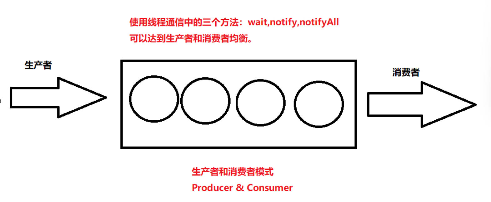


### 线程交替输出(1)

> **题目描述：`两个线程交替输出`**
> t1-->1
> t2-->2
> t1-->3
> t2-->4
> t1-->5
> t2-->6
> t1-->7
> t2-->8
> t1-->9
> t2-->10
> t1-->11
> t2-->12
> t1-->13
> t2-->14
> ....

```java
package com.powernode.javase.thread21;

public class ThreadTest {
    public static void main(String[] args) {
        // 创建一个对象，这样让多个线程共享同一个对象
        MyRunnable mr = new MyRunnable();

        // 创建二个线程
        Thread t1 = new Thread(mr);
        t1.setName("t1");
        Thread t2 = new Thread(mr);
        t2.setName("t2");

        // 启动线程
        t1.start();
        t2.start();
    }
}

class MyRunnable implements Runnable {

    // 实例变量：多线程共享
    private int count = 0;

    private Object obj = new Object();

    @Override
    public void run() {
        while (true) {
            //synchronized (this) {
            synchronized (obj) {

                // 记得唤醒t1线程
                // t2线程执行过程中把t1唤醒了。但是由于t2仍然占用对象锁，所以即使t1醒了，也不会往下执行。
                //this.notify();
                obj.notify();

                if (count >= 100) break;
                // 模拟延迟
                try {
                    Thread.sleep(50);
                } catch (InterruptedException e) {
                    e.printStackTrace();
                }
                // 程序执行到这里count一定是小于100
                System.out.println(Thread.currentThread().getName() + "==>" + (++count));

                // 让其中一个线程等待，这个等待的线程可能是t1，也可能是t2
                // 假设是t1线程等待。
                // t1线程进入无期限的等待，并且等待的时候，不占用对象锁。
                //this.wait();
                try {
                    obj.wait();
                } catch (InterruptedException e) {
                    e.printStackTrace();
                }
            }
        }
    }
}
```

```java
循环模式:
1. 线程A: [获取锁] → notify() → 业务逻辑 → wait() → [释放锁]
2. 线程B: [获取锁] → notify() → 业务逻辑 → wait() → [释放锁]
3. 重复步骤1

输出结果示例:
t1==>1
t2==>2
...
t1==>99
t2==>100
```

```mermaid
sequenceDiagram
    participant T1 as t1线程
    participant Lock as obj锁
    participant T2 as t2线程
    participant Count as 共享count

    Note over T1,T2: 初始状态: count=0
    
    rect rgb(119, 136, 153)
        Note over T1: t1获取obj锁
        T1->>Lock: 进入synchronized块
        T1->>T2: obj.notify() (无效果)
        T1->>T1: Thread.sleep(50)
        T1->>Count: count++ (0→1)
        T1->>T1: 输出 "t1==>1"
        T1->>Lock: obj.wait() 释放锁
        Note over T1: t1进入WAITING状态
    end

    rect rgb(70, 130, 180)
        Note over T2: t2获取obj锁
        T2->>Lock: 进入synchronized块
        T2->>T1: obj.notify() 唤醒t1
        Note over T1: t1变为BLOCKED状态
        T2->>T2: Thread.sleep(50)
        T2->>Count: count++ (1→2)
        T2->>T2: 输出 "t2==>2"
        T2->>Lock: obj.wait() 释放锁
        Note over T2: t2进入WAITING状态
    end

    rect rgb(119, 136, 153)
        Note over T1: t1重新获取obj锁
        T1->>Lock: 进入synchronized块
        T1->>T2: obj.notify() 唤醒t2
        Note over T2: t2变为BLOCKED状态
        T1->>T1: Thread.sleep(50)
        T1->>Count: count++ (2→3)
        T1->>T1: 输出 "t1==>3"
        T1->>Lock: obj.wait() 释放锁
        Note over T1: t1进入WAITING状态
    end

    rect rgb(70, 130, 180)
        Note over T2: t2重新获取obj锁
        T2->>Lock: 进入synchronized块
        T2->>T1: obj.notify() 唤醒t1
        Note over T1: t1变为BLOCKED状态
        T2->>T2: Thread.sleep(50)
        T2->>Count: count++ (3→4)
        T2->>T2: 输出 "t2==>4"
        T2->>Lock: obj.wait() 释放锁
        Note over T2: t2进入WAITING状态
    end

    Note over T1,T2: 如此循环直到count>=100
```

>  **线程状态转换流程**

```mermaid
stateDiagram-v2
    [*] --> RUNNABLE_t1 : 初始状态
    [*] --> BLOCKED_t2 : 初始状态
    
    state T1_线程 {
        RUNNABLE_t1 --> IN_SYNC_t1 : 获取obj锁
        IN_SYNC_t1 --> WAITING_t1 : obj.wait()
        WAITING_t1 --> BLOCKED_t1 : 被t2唤醒
        BLOCKED_t1 --> RUNNABLE_t1 : 重新获取锁
    }
    
    state T2_线程 {
        BLOCKED_t2 --> RUNNABLE_t2 : 获取obj锁
        RUNNABLE_t2 --> IN_SYNC_t2 : 进入同步块
        IN_SYNC_t2 --> WAITING_t2 : obj.wait()
        WAITING_t2 --> BLOCKED_t2 : 被t1唤醒
    }
    
    WAITING_t1 --> BLOCKED_t1 : t2.notify()
    WAITING_t2 --> BLOCKED_t2 : t1.notify()
```


### 线程交替输出(2)

> **新题目：**
>
>  * t1-->A
>  * t2-->B
>  * t3-->C
>  * t1-->A
>  * t2-->B
>  * t3-->C
>  * ....
>  * t1-->A
>  * t2-->B
>  * t3-->C

```java
package com.powernode.javase.thread22;

public class ThreadTest {

    // 共享对象（t1 t2 t3线程共享的一个对象，都去争夺这一把锁）
    private static final Object lock = new Object();

    // 给一个初始值，这个初始值表示第一次输出的时候，t1先输出。
    private static boolean t1Output = true;
    private static boolean t2Output = false;
    private static boolean t3Output = false;

    public static void main(String[] args) {
        // 创建三个线程

        // t1线程：负责输出A
        new Thread(new Runnable() {
            @Override
            public void run() {
                synchronized (lock) {
                    for (int i = 0; i < 10; i++) {
                        while (!t1Output) { // 只要不是t1线程输出
                            try {
                                lock.wait();
                            } catch (InterruptedException e) {
                                throw new RuntimeException(e);
                            }
                        }
                        // 程序到这里说明：该t1线程输出了，并且t1线程被唤醒了。
                        System.out.println(Thread.currentThread().getName() + " -->A");
                        // 该布尔标记的值
                        t1Output = false;
                        t2Output = true;
                        t3Output = false;
                        // 唤醒所有线程
                        lock.notifyAll();
                    }
                }
            }
        }).start();

        // t2线程：负责输出B
        new Thread(new Runnable() {
            @Override
            public void run() {
                synchronized (lock) {
                    for (int i = 0; i < 10; i++) {
                        while (!t2Output) { // 只要不是t2线程输出
                            try {
                                lock.wait();
                            } catch (InterruptedException e) {
                                throw new RuntimeException(e);
                            }
                        }
                        // 程序到这里说明：该t2线程输出了，并且t2线程被唤醒了。
                        System.out.println(Thread.currentThread().getName() + " -->B");
                        // 该布尔标记的值
                        t1Output = false;
                        t2Output = false;
                        t3Output = true;
                        // 唤醒所有线程
                        lock.notifyAll();
                    }
                }
            }

        }).start();

        // t3线程：负责输出C
        new Thread(new Runnable() {
            @Override
            public void run() {
                synchronized (lock) {
                    for (int i = 0; i < 10; i++) {
                        while (!t3Output) { // 只要不是t3线程输出
                            try {
                                lock.wait();
                            } catch (InterruptedException e) {
                                throw new RuntimeException(e);
                            }
                        }
                        // 程序到这里说明：该t3线程输出了，并且t3线程被唤醒了。
                        System.out.println(Thread.currentThread().getName() + " -->C");
                        // 该布尔标记的值
                        t1Output = true;
                        t2Output = false;
                        t3Output = false;
                        // 唤醒所有线程
                        lock.notifyAll();
                    }
                }
            }
        }).start();
    }
}
```

```java
Thread-0 -->A
Thread-1 -->B
Thread-2 -->C
...
Thread-0 -->A
Thread-1 -->B
Thread-2 -->C
```

```mermaid
sequenceDiagram
    participant T1 as Thread-1 (输出A)
    participant T2 as Thread-2 (输出B)
    participant T3 as Thread-3 (输出C)
    participant Lock as 共享锁对象

    Note over T1,T3: 初始状态: t1Output=true, t2Output=false, t3Output=false

    T1->>Lock: 获取锁(synchronized)
    T1->>T1: 检查t1Output=true，不等待
    T1->>T1: 输出"A"
    T1->>T1: 设置t1Output=false, t2Output=true, t3Output=false
    T1->>Lock: notifyAll()唤醒所有等待线程
    T1->>Lock: 释放锁(循环继续，重新获取锁)
    
    Note over T2,T3: 此时T2的t2Output=true，T1和T3的标记为false
    
    T2->>Lock: 获取锁成功
    T2->>T2: 检查t2Output=true，不等待
    T2->>T2: 输出"B"
    T2->>T2: 设置t1Output=false, t2Output=false, t3Output=true
    T2->>Lock: notifyAll()唤醒所有等待线程
    T2->>Lock: 释放锁(循环继续，重新获取锁)
    
    Note over T1,T3: 此时T3的t3Output=true，T1和T2的标记为false
    
    T3->>Lock: 获取锁成功
    T3->>T3: 检查t3Output=true，不等待
    T3->>T3: 输出"C"
    T3->>T3: 设置t1Output=true, t2Output=false, t3Output=false
    T3->>Lock: notifyAll()唤醒所有等待线程
    T3->>Lock: 释放锁(循环继续，重新获取锁)
    
    Note over T1,T3: 此时T1的t1Output=true，回到初始状态，开始新一轮循环
    
    T1->>Lock: 获取锁成功
    T1->>T1: 检查t1Output=true，不等待
    T1->>T1: 输出"A"(第二轮)
    T1->>T1: 设置标记，唤醒其他线程
    T1->>Lock: 释放锁
    
    Note over T1,T3: 如此循环10次...
```

> **总结:**
>
> 1. **初始状态**：只有T1可以执行，T2和T3在wait()中等待
> 2. **T1执行阶段**：
>    - 获取锁后检查`t1Output=true`，直接输出"A"
>    - 修改标记：`t1Output=false, t2Output=true, t3Output=false`
>    - 唤醒所有线程，释放锁
> 3. **T2执行阶段**：
>    - 获取锁后检查`t2Output=true`，直接输出"B"
>    - 修改标记：`t1Output=false, t2Output=false, t3Output=true`
>    - 唤醒所有线程，释放锁
> 4. **T3执行阶段**：
>    - 获取锁后检查`t3Output=true`，直接输出"C"
>    - 修改标记：`t1Output=true, t2Output=false, t3Output=false`（回到初始状态）
>    - 唤醒所有线程，释放锁
> 5. **循环重复**：这个过程重复10次，确保A→B→C的顺序输出各10次
>
> **同步机制核心：**
>
> - **锁保护**：synchronized确保同一时间只有一个线程执行
> - **条件等待**：while循环+wait()防止虚假唤醒
> - **状态切换**：布尔标记控制执行顺序
> - **通知机制**：notifyAll()唤醒所有等待线程


