## String类


### String初识

①Java中的`String`属于`引用数据类型`，代表`字符串`。

②Java专门在`堆`中为字符串准备了一个`字符串常量池`。因为字符串使用比较频繁，放在`字符串常量池`中省去了`对象的创建过程`，从而提高程序的执行效率。**（`常量池`属于一种`缓存技术`，缓存技术是`提高程序执行效率的重要手段`。）**

```java
1.在java程序当中，凡是带有双引号的字符串，在编译阶段就已经完全确定了：这些字符串字面量将来会放在字符串常量池中。

2.在JVM启动的时候，会进行一系列的初始化，其中就包括字符串常量池的初始化，在初始化字符串常量池的时候，会将所有的

3.字符串字面量全部提前创建好，放到字符串常量池中。在执行java程序的过程中，如果需要这个字符串字面量对象，直接从字符串常量池中获取。提高执行效率。

4.Java8之后：字符串常量池在堆内存当中。

5.字符串常量池是一种缓存技术。提前创建好对象放进去，用的时候直接拿。（字符串字面量在JVM启动的时候就会创建好。）


String s1 = “hello”; 

String s2 = “hello”;

System.out.println(s1 == s2); // true 说明s1和s2指向了字符串常量池中的同一个字符串对象。


String s3 = "test";
String s4 = new String("test");
System.out.println(s3 == s4); // false

// 比较两个字符串是否相等，靠谱一点的，还是equals方法。别用 ==
System.out.println(s3.equals(s4)); // true
```

**注意：`字符串字面量`在编译的时候就已经确定了将其放到`字符串常量池`中。`JVM启动`时会`立即启动程序中带有双引号的字符串全部放入字符串常量池`。**

③**`Java8之后`字符串常量池在`堆中`。`Java8之前`字符串常量池在`永久代`。**

④字符串一旦创建是`不可变的`。**（底层String源码中有一个属性：`private final byte[] value;`）**

```java
// x是可以变的。因为x只是一个普通的变量。
// 谁不能变？字符串字面量一旦创建不可变，在字符串常量池中。
// "helloworld" 不能改变了。
// "其他字符串" 不能改变了。
String x = "helloworld";
x = "其他字符串";
```


1. `String s = “hello”; `其中`“hello”存储在字符串常量池中`。

2. `“hello”不可变`。`不能变成“hello123”`。如果进行字符串拼接，必然`创建新的字符串对象`。

3. 是` “hello”不可变`，`不是s不可变`，s可以指向其它的字符串对象：`s = “xyz”;`


### String的拼接

```java
1.使用 + 进行拼接的生成的新的字符串不会被放到字符串常量池中。（+两边至少有一个是变量。）

2.当 + 两边都是字符串字面量的时候，编译器会进行自动优化。在编译阶段进行拼接。
```

①动态拼接之后的新字符串不会自动放到字符串常量池中：

```java
String s1 = “abc”;

String s2 = “def”;

String s3 = s1 + s2;

String s4 = “abcdef”;

System.out.println(s3 == s4); // false 说明拼接后的字符串并没有放到字符串常量池

1.以上程序中字符串常量中有三个： “abc” “def” “abcdef” 

2.以上程序中除了字符串常量池的字符串之外，在堆中还有一个字符串对象 “abcdef”
    
3.s3 指向的对象，没有在字符串常量池中,在堆中。

4. 底层实际上在进行 + 的时候（这个 + 两边至少有一个是变量），会创建一个StringBuilder对象，进行字符串的拼接。

5.最后的时候会自动调用StringBuilder对象的toString()方法，再将StringBuilder转换成String对象。
```

②两个字符串字面量拼接会做编译阶段的优化，在`编译阶段`就会进行`字符串的拼接`。

```java
String s1 = “aaa” + “bbb”;

// 以上程序会在编译阶段进行拼接，因此以上程序在字符串常量池中只有一个： “aaabbb”


// 以下程序中 + 两边都是字符串字面量，这种情况java对其进行优化：
//在编译的时候就完成了字符串的拼接。
String x = "java" + "test"; // 等同于：String x = "javatest";
String y = "javatest";
System.out.println(x == y); // true
```


### 频繁使用某个字符串用法

```java
intern() 方法的作用：

1.如果常量池中已存在该字符串，返回常量池中的引用

2.如果不存在，将字符串添加到常量池并返回引用

String s1 = "abc";
String s2 = "def";
String s3 = s1 + s2;
String s4 = "abcdef";

// 以上程序中s3指向了堆中的一个字符串对象，并没有在常量池中。
// 如果这个字符串使用比较频繁，希望将其加入到字符串常量池中，怎么办？
String s5 = s3.intern();
System.out.println(s4 == s5); // true

String m = "m";
String f = m + "e";
String str = f.intern(); // 将"me"放入字符串常量池中，并且将"me"对象的地址返回。

System.out.println(str == "me"); // true
```


### String类常用的构造方法

①**`String(char[] value)`：根据字符数组`创建一个新的字符串对象`。**

```java
// 有一个char[]数组，可以将char[]数组转换成字符串
char[] chars = new char[]{'动','力','节','点'};
// 转换成字符串
String s1 = new String(chars);
System.out.println(s1); // 动力节点
```


②`**String(char[] value, int offset, int count)`：根据`字符数组`的`指定部分创建一个新的字符串对象`。**

```java
// 将char[]数组的一部分转换成字符串
String s2 = new String(chars, 0, 2);
System.out.println(s2); // 动力
```


③**`String(byte[] bytes)`：根据`字节数组创建一个新的字符串对象`，默认使用平台`默认的字符集进行解码`。**

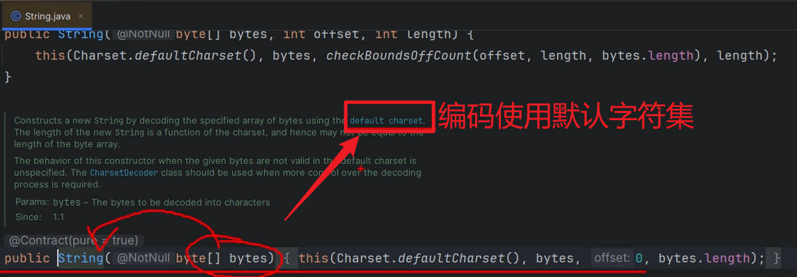

```java
// 有一个byte[]数组，可以将byte[]数组转换成字符串
byte[] bytes = {97,98,99,100};
// 将byte[]数组转换成字符串String，是一个解码的过程。（采用的是平台默认的字符编码方式进行的解码。）
String s3 = new String(bytes);
System.out.println(s3); // abcd
```


④**`String(byte[] bytes, int offset, int length)`：根据`字节数组的指定部分创建一个新的字符串对象`，默认使用平台`默认的字符集进行解码`。**

```java
// 将byte[]数组的一部分转换成字符串（解码的过程，也是采用平台默认的字符集。）
String s4 = new String(bytes, 0, 2);
System.out.println(s4); // ab
```


⑤**`String(byte[] bytes, Charset charset)`：**

1. 根据字节数组和指定的字符集创建一个新的字符串对象。

2. **new String(bytes, Charset.defaultCharset());**

```java
// 在不知道字符编码方式的时候，可以动态获取平台的编码方式。（使用平台默认的字符集进行编码）
byte[] bs2 = "动力节点".getBytes(Charset.defaultCharset());

// 使用平台默认的字符集进行解码。
String s6 = new String(bs2, Charset.defaultCharset());

System.out.println(s6); // 动力节点
```


⑥**`String(byte[] bytes, String charsetName)`：**

1. 根据字节数组和指定的字符集名称创建一个新的字符串对象。

2. 这是一个解码的过程。你需要`提前知道“byte[] bytes”是通过哪个编码方式进行编码`得到的。

3. 如果通过`GBK的方式进行编码得到的“byte[] bytes”`，调用以上`构造方法时采用UTF-8的方式进行解码`。就会`出现乱码`。

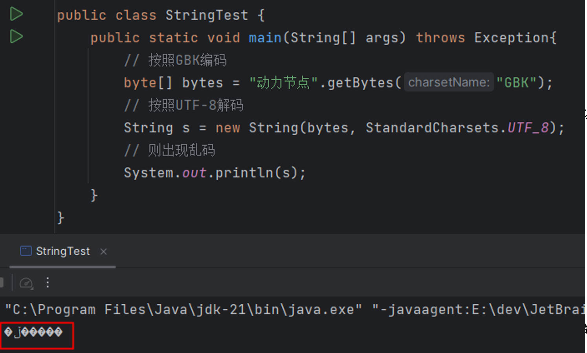

> **改正:**

```java
// 乱码的本质：在进行编码和解码的时候没有使用同一个字符编码方式。
// 先将字符串转换成byte[]数组（这个过程是一个编码的过程）
// 这里先按照GBK的字符集进行编码。（GBK是简体中文）
byte[] bs = "动力节点，一家只教授Java的培训机构".getBytes(StandardCharsets.UTF_8);

// 将以上的byte[]数组转换成字符串（这个过程是一个解码的过程）
String s5 = new String(bs, StandardCharsets.UTF_8);

System.out.println(s5); // 动力节点，一家只教授Java的培训机构
```


⑦**`String(String original)`：(了解)**

1. 通过`复制现有字符串创建一个新的字符串对象`。

2. 这个方法被`@IntrinsicCandidate标注`，这个注解的作用是告诉编译器,该方法或构造函数是`一个内在的候选方法`,可以被优化和替换为更高效的代码。因此它是**不建议使用的**。

3. **`new String(“hello”); `这个代码会让`常量池中有一个 “hello”`，并且`在堆中也有有一个String对象`。**

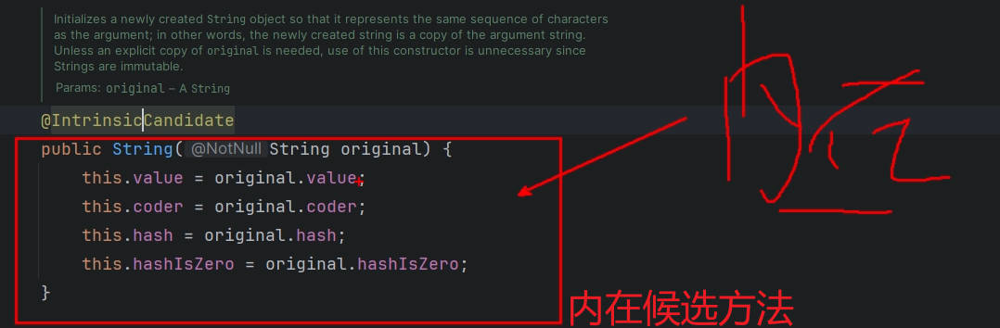

```java
// 创建一个字符串对象，也是可以这样做的。但不建议了。
// 内在的候选方法，不建议使用了。
// 被@IntrinsicCandidate注解标注了。这个注解是Java16引入的。
//String s7 = new String("STRING"); // 底层会有两个对象，一个是"STRING"在字符串常量池中。一个是在堆内存中。浪费内存。
String s8 = "STRING";
```


### String的常用方法(1)

①**char charAt(int index); `返回索引处的char值`**

```java
@Test
public void testCharAt() {
      char c = "动力节点".charAt(3);
      System.out.println(c); // 点
}
```


②**int length(); `获取字符串长度`**

```java
@Test
public void testLength() {
      // 注意：数组是length属性。字符串是length()方法。
      System.out.println("动力节点".length()); // 4
}
```


③**boolean isEmpty(); 判断`字符串是否为空字符串`，如果`length()是0就是空字符串`。**

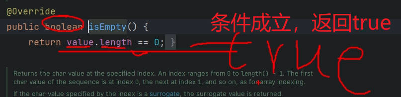

```java
@Test
public void testIsEmpty() {
    String s = "";
    System.out.println(s.isEmpty()); // true
    s = "hello";
    System.out.println(s.isEmpty()); // false
    s = " ";
    System.out.println(s.isEmpty()); // false
}
```


④**`boolean equals(Object anObject)`; 判断`两个字符串是否相等`。**

```java
@Test
public void testEquals() {
     String s1 = "abc";
     String s2 = new String("abc");
     System.out.println(s1.equals(s2)); // true
}
```


⑤**`boolean equalsIgnoreCase(String anotherString)`; 判断`两个字符串是否相等`，`忽略大小写`。**

```java
@Test
public void testEquals() {
    String s3 = "Java";
    String s4 = "java";
    System.out.println(s3.equals(s4)); // false
    System.out.println(s3.equalsIgnoreCase(s4)); // true
}
```


⑥**boolean contains(CharSequence s); 判断`当前字符串中是否包含某个子字符串`**

```java
@Test
public void testContains() {
     System.out.println("HelloWorld.java".contains(".java")); // true
     System.out.println("HelloWorld.java".contains(".txt")); // false
}
```


⑦**`boolean startsWith(String prefix)`; 判断当前字符串`是否以某个字符串开头`**

⑧**`boolean endsWith(String suffix)`; 判断当前字符串`是否以某个字符串结尾`**

```java
@Test
public void testStartsWithAndEndsWith() {
    System.out.println("http://www.baidu.com".startsWith("http://")); // true
    System.out.println("http://www.baidu.com".endsWith(".com")); // true

    System.out.println("http://www.baidu.com".startsWith("https://"));//false
    System.out.println("http://www.baidu.com".endsWith(".cn"));//false
}
```


⑨**`int compareTo(String anotherString);` 两个字符串按照`字典顺序比较大小`**

```java
@Test
public void testCompareTo() {
    System.out.println("a".compareTo("b")); // -1
    System.out.println("a".compareTo("c")); // -2
    System.out.println("b".compareTo("a")); // 1
    System.out.println("a".compareTo("a")); // 0

    System.out.println("A".compareTo("a")); // -32
}
```


⑩**`int compareToIgnoreCase(String str); `两个字符串按照`字典顺序比较大小`，比较时`忽略大小写`**

```java
@Test
public void testCompareTo() {
    
    System.out.println("A".compareToIgnoreCase("a")); // 0
}
```


⑪**`int indexOf(String str);` 获取当前字符串中`str字符串的第一次出现处的下标`。**

⑫`int indexOf(String str, int fromIndex); `从当前字符串的**fromIndex下标开始`往右搜索`**，获取`当前字符串中str字符串`的`第一次出现处的下标`。

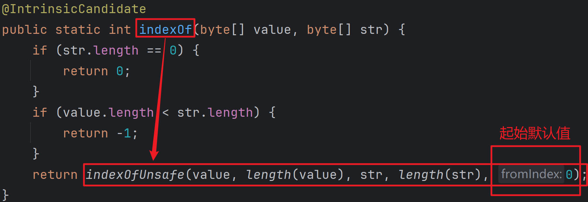

```java
@Test
public void testIndexOf() {
// 右向搜索
System.out.println("oraclec++javac#phppythongolangjavamysqloracle".indexOf("java")); // 9
   System.out.println("oraclec++javac#phppythongolangjavamysqloracle".indexOf("java", 10)); // 30
}
```


⑬**`int lastIndexOf(String str);` 获取当前字符串中`str字符串的最后一次出现处的下标`。**

⑭`int lastIndexOf(String str, int fromIndex); `从当前字符串的**fromIndex下标开始`往左搜索`**，获取`当前字符串中str字符串的最后一次出现处的下标`。

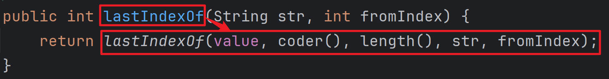

```java
@Test
public void testLastIndexOf(){
    // 左向搜索
    System.out.println("javamysqlc++oraclec++#".lastIndexOf("c++")); // 18
    System.out.println("javamysqlc++oraclec++#".lastIndexOf("c++", 17)); // 9
}
```


### String的常用方法(2)

①byte[] getBytes(); 将字符串转换成字节数组。其实就是对字符串进行编码。默认按照系统默认字符集。

②byte[] getBytes(String charsetName); 将字符串按照指定字符集的方式进行编码。

③byte[] getBytes(Charset charset);

```java
String text = "ABC";
        
// 方法1：默认编码
byte[] bytes1 = text.getBytes();
System.out.println("默认编码: " + bytes1.length + " 个字节"); //默认编码: 3个字节
        
// 方法2：指定编码名称
byte[] bytes2 = text.getBytes("UTF-8");
        System.out.println("UTF-8编码: " + bytes2.length + " 个字节"); //UTF-8编码: 3个字节
        
// 方法3：使用Charset对象
byte[] bytes3 = text.getBytes(StandardCharsets.UTF_8);
System.out.println("UTF-8编码(Charset): " + bytes3.length + " 个字节"); //UTF-8编码(Charset): 3个字节
```


④**char[] toCharArray(); `将字符串转换字符数组`。**

```java
@Test
public void testToCharArray(){
    // 将字符串转换成字符数组
    char[] chars = "动力节点".toCharArray();
    for (char c : chars){
        System.out.println(c); 
        /* 动
		  力
		  节
           点*/
    }
}
```


⑤**String toLowerCase();` 转小写`**

⑥**String toUpperCase(); `转大写`**

```java
@Test
public void testLowerUpperCase(){
    // 将字符串转换为全部小写/全部大写
    System.out.println("AbCdEf".toUpperCase()); // ABCDEF
    System.out.println("AbCdEf".toLowerCase()); // abcdef
}
```


⑦**`String concat(String str); `进行`字符串的拼接操作`。和` + `的区别？**

1. 既可以`进行求和`，也可以`进行字符串的拼接`，底层拼接时会`创建StringBuilder对象`进行拼接。**`+ 拼接null`时**不会**出现`空指针异常`**。

2. `concat方法参数`只能是`字符串类型`，拼接时`不会创建StringBuilder对象`，拼接完成后`返回一个新的String对象`。**拼接null会出现`空指针异常`**。

3. **使用较多。如果进行`大量字符串拼接`，这`两个都不合适`。**

```java
1.concat方法完成字符串的拼接操作。

2. + 和 concat() 都可以完成字符串的拼接。

3. + ：既可以求和，又可以进行字符串的拼接。底层拼接时会创建一个StringBuilder对象，最终调用toString()方法获取到拼接之后的字符串。
+ 拼接null时不会出现空指针异常。
String s = "";
for(int i = 1; i < 100000000; i++){
    s = s + i;
}

4. concat()方法：只能拼接String字符串。拼接null时会出现空指针异常。这种方式底层不会创建StringBuilder对象。直接concat()拼接完
        之后返回一个新的字符串对象。

5. + 使用居多。但是如果进行大量的字符串拼接操作。这两种方式都不推荐。（大量字符串拼接操作建议使用StringBuilder）
```

```java
@Test
public void testConcat(){
    
        String s1 = "test";
        String s2 = null;
        String s3 = s1 + s2;
        System.out.println(s3); // "testnull"

        String s1 = "test";
        String s2 = null;
        String s3 = s1.concat(s2); // 空指针异常
}
```

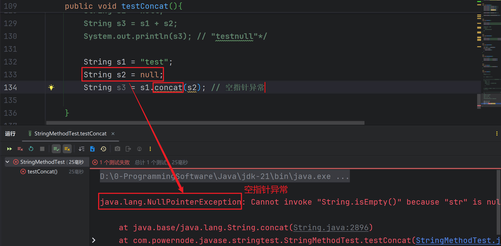


⑧**String substring(int beginIndex); 从指定`下标beginIndex开始截取子字符串`**

⑨**String substring(int beginIndex, int endIndex);  `beginIndex(开始下标)`, `endIndex(结束下标，不包括在截取字符串中)`**

```java
@Test
public void testSubstring(){
// 截取子字符串
System.out.println("http://www.baidu.com".substring(7)); // www.baidu.com
System.out.println("http://www.baidu.com".substring("http://".length())); // www.baidu.com

// substring(beginIndex, endIndex)
// 注意：不包括endIndex
System.out.println("http://127.0.0.1:8080/login?name=admin&password=123".substring(17, 21)); // 8080
}
```


⑩**`String trim();` 去除`字符串前后空白`（`只能去除ASCII码中的空格和制表符`）**

⑪**`String strip(); `去除`字符串前后空白`（支持`所有的编码形式的空白`，可以将`全角空格去除`，`\u3000是全角空格`，`Java11新增`）**

```java
@Test
public void testTrim(){
      // 去除字符串的前后空白
      // 注意：trim()方法只能去除什么空白？ASCII码的空白以及制表符tab。（无法去除全角空白）
      String s1 = "            abc    def                ";
      String s2 = s1.trim();
      System.out.println("===>" + s2 + "<====");

      String s3 = "\u3000\u3000\u3000\u3000\u3000\u3000\u3000\u3000\u3000a   b    c\u3000\u3000\u3000\u3000\u3000\u3000\u3000";
      String s4 = s3.strip(); // Java11新增的。
      System.out.println("===>" + s4 + "<====");
}
```

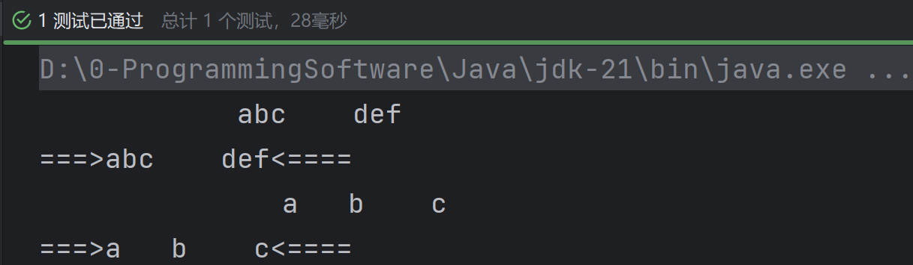


### String的常用方法(3)

①**String stripLeading(); 去除`前空白`**

②**String stripTrailing(); 去除`后空白`**

```java
@Test
public void testTrim(){
    
      String s3 = "\u3000\u3000\u3000\u3000\u3000\u3000\u3000\u3000\u3000a   b    c\u3000\u3000\u3000\u3000\u3000\u3000\u3000";

      String s5 = s3.stripLeading();
      System.out.println("===>" + s5 + "<====");

      String s6 = s3.stripTrailing();
      System.out.println("===>" + s6 + "<====");
}
```

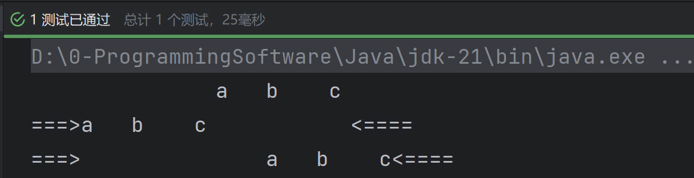


③**String toString();**

```java
@Test
public void testToString(){
     String s1 = new String("abc");
     // String类已经重写了toString()方法。
     System.out.println(s1); // "abc"
}
```


④**String intern(); 获取`字符串常量池中的字符串`，如果`常量池中没有`，则将`字符串加入常量池并返回`。**

```java
@Test
public void testIntern(){
     // 将字符串放入字符串常量池。
     byte[] bytes = {97,98,99,100};
     String s = new String(bytes);
     String s1 = s.intern();
     String s2 = "abcd"; // 将字符串 “abcd”放入字符串常量池并返回常量池中的字符串 “abcd”
     System.out.println(s1 == s2); // true
}
```


⑤**static String join(CharSequence d, CharSequence... elements); `将多个字符串以某个分隔符连接`（**`Java8新增`）**

```java
@Test
public void testJoin(){
     // 将多个字符串以某个符号进行拼接，生成一个全新的字符串
     String str = String.join("-", "java", "C++", "oracle", "mysql");
     System.out.println(str); // java-C++-oracle-mysql

     String year = "1970";
     String month = "10";
     String day = "11";
     System.out.println(String.join("/", year, month, day)); // 1970/10/11
}
```


⑥**static String join(CharSequence delimiter, Iterable<? extends CharSequence> elements);**

```java
@Test
public void testJoin(){
    // 创建一个集合对象
    List list = new ArrayList();
    list.add("abc");
    list.add("def");
    list.add("xyz");

    System.out.println(String.join("-", list)); // abc-def-xyz 
}
```


⑦**static String valueOf(boolean b); 以下`所有的静态方法valueOf`作用是`将非字符串类型的数据`转换为`字符串形式`。**

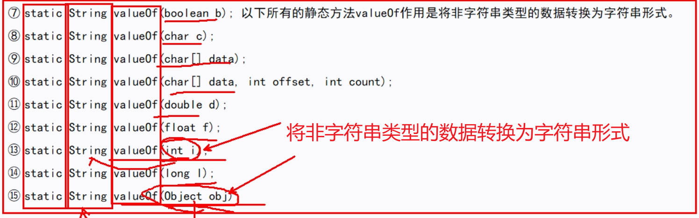

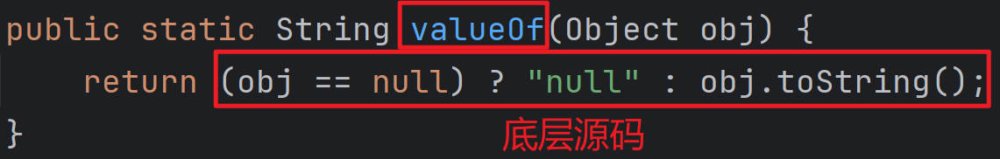

```java
static String valueOf(char c);

static String valueOf(char[] data);

static String valueOf(char[] data, int offset, int count);

static String valueOf(double d);

static String valueOf(float f);

static String valueOf(int i);

static String valueOf(long l);

static String valueOf(Object obj);
```

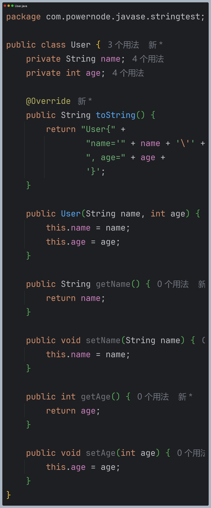

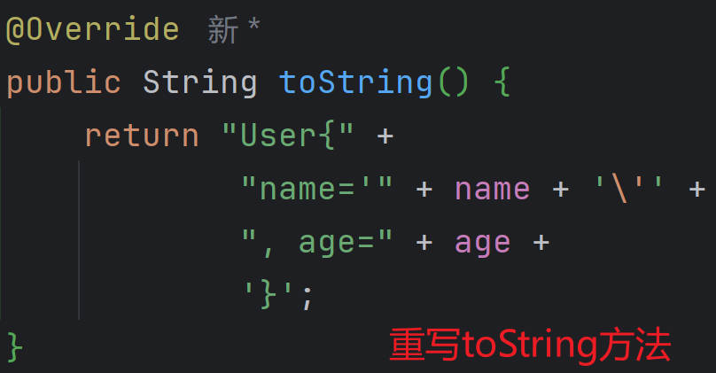

```java
@Test
public void testValueOf(){
    // 将非字符串类型的数据转换成字符串类型。
    String s1 = String.valueOf(1000);
    System.out.println(s1); // "1000"
    System.out.println(s1 instanceof String); // true

    // 这样做也可以将一个数字转换成字符串
    int a = 1000;
    String s2 = a + "";
    System.out.println(s2); // "1000"

    // 将Object转换成字符串
    Object obj = new Object();
    String s3 = String.valueOf(obj);
    System.out.println(s3); //java.lang.Object@十六进制 // "java.lang.Object@7ce3cb8e"

    User user = new User("jack", 20);
    String s4 = String.valueOf(user);
    System.out.println(s4); // "User{name='jack', age=20}"

    User user1 = null;
    String s5 = String.valueOf(user1);
    System.out.println(s5); // "null"

    // 空指针异常
    //System.out.println(user1.toString());
}
```


### 正则表达式初步

①`正则表达式（regular expression）`，简称为`regex`或`regexp`，是一种`用于描述特定模式的表达式`。它可以`匹配、查找、替换`文本中与`该模式匹配的内容`，被广泛应用于各种文本处理和匹配相关的应用中。

②正则表达式的应用:

1. **验证输入内容的`格式是否正确`。例如，`邮箱，手机号，密码`等**

2. **在文本编辑器中进行`搜索和替换`。例如，在代码编辑器中查找指定字符串或替换错误的代码成为`正确的代码块*`*

3. **`数据挖掘`和`信息提取`。正则表达式可以从`HTML、XML、JSON等格式的数据`中提取`所需的信息`**

4. **用于编写`脚本语言`，如`awk，grep和sed`**

5. **服务器端编程。正则表达式在处理数据和字符串时具有高效的性能，可以在开发Web应用程序时被广泛应用**

③正则表达式和Java语言的关系？

**Java语言中`可以使用正则表达式`。C语言以及其它大部分编程语言`都是支持正则表达式`的。**


#### 正则表达式常见符号

①**元字符**

```java
. 匹配除换行符以外的任意字符

\w 匹配字母或数字或下划线或汉字

\s 匹配任意的空白符

\d 匹配数字

\b 匹配单词的开始或结束

^ 匹配字符串的开始

$ 匹配字符串的结束
```


②**字符转义**

```java
\. 表示一个普通的.字符。  \* 表示一个普通*字符。
```


③**重复次数**

```java
\* 重复零次或更多次（0 - n）

\+ 重复一次或更多次(1 - n)

? 重复零次或一次 (0 或 1)

{n} 重复n次 (n)

{n,} 重复n次或更多次 ( >= n)

{n,m} 重复n到m次 (n - m)
```


④字符类

```java
[abcdef] 匹配abcdef这几个字符中的任意一个字符

[0-9] 匹配0-9中的任意一个数字

[a-zA-Z0-9]  匹配a-z，A-Z，0-9的任意一个字符

[.?!] 匹配标点符号（.或?或!）

[abc-] 匹配abc-四个字符中的任意一个字符（注意-只能出现在末尾。如果-在中间则表示区间）
```


⑤分支条件

```java
0\d{2}-\d{8}|0\d{3}-\d{7}这个表达式能匹配两种以连字号分隔的电话号码：

一种是三位区号，8位本地号(如010-12345678)，一种是4位区号，7位本地号(0376-2233445)
```


⑥分组

```java
(\d{1,3}.){3}\d{1,3}是一个简单的IP地址匹配表达式。要理解这个表达式，请按下列顺序分析它：\d{1,3}匹配1到3位的数字，

(\d{1,3}.){3}匹配三位数字加上一个英文句号(这个整体也就是这个分组)重复3次，最后再加上一个一到三位的数字(\d{1,3})
```


⑦反义

```java
\W  匹配任意不是字母，数字，下划线，汉字的字符

\S  匹配任意不是空白符的字符

\D  匹配任意非数字的字符

\B  匹配不是单词开头或结束的位置

[^x]  匹配除了x以外的任意字符

[^aeiou] 匹配除了aeiou这几个字母以外的任意字符
```


### String的正则表达式相关的方法

①**`String replace(CharSequence target, CharSequence replacement);` 将当前字符串中`所有的target`替换成`replacement`，返回`一个新的字符串`。**

```java
@Test
public void testReplace(){
    // 这个也是替换所有，只不过没有使用正则表达式
    String str1 = "oraclejavac++mysqlphppythonjavamysql".replace("java", "golang");
    System.out.println(str1); // oraclegolangc++mysqlphppythongolangmysql
}
```


②**`String replaceAll(String regex, String replacement);` 将当前字符串中`所有符合正则表达式的regex`替换成`replacement`。**

```java
@Test
public void testReplace(){
    // 替换所有，使用正则表达式
    String str2 = "a1b2c3d54e43f".replaceAll("\\d", "");
    System.out.println(str2); // abcdef
}
```


③**`String[] split(String regex); `将当前字符串`以某个正则表达式`表示的`子字符串进行分割`，返回`一个字符串数组`。**

```java
@Test
public void testSplit(){
     // 根据正则表达式进行字符串的拆分
     // 拆分后返回一个字符串数组
     String[] strs = "动1力2节3点4。".split("\\d");
     System.out.println(strs.length); // 5
     for(String s : strs){
         System.out.println(s);
         /*
         动
         力
         节
         点
          。
         */
      }

      String[] ymd = "1970-10-11".split("-");
      for(String s : ymd){
          System.out.println(s);
          /*
          1970
          10
          11
          */
       }

       String data = "name=zhangsan&password=123&email=zhangsan@123.com&gender=男";
       String[] params = data.split("&");
       for(String param : params) {
          //System.out.println(param);
           /*
           name=zhangsan
           password=123
           email=zhangsan@123.com
           gender=男
           */
         String[] nameAndValue = param.split("=");
         for(String s : nameAndValue){
             System.out.println(s);
             /*
             name
             zhangsan&password
             123&email
             zhangsan@123.com&gender
             男
             */
          }
     }
}
```


④**`boolean matches(String regex); `判断当前字符串`是否符合正则表达式regex`。**

```java
@Test
public void testMatches(){
     // 邮箱地址的正则表达式
     String emailRegExp = "^\\w+([-+.]\\w+)*@\\w+([-.]\\w+)*\\.\\w+([-.]\\w+)*$";
     String email = "dujubin@126.com";

     System.out.println(email.matches(emailRegExp)); // true

}
```


## String的面试题

```java
package com.powernode.javase.stringtest;

import org.junit.jupiter.api.Test;

/**
 * String类常见的面试题。
 */
public class StringExam {
    @Test
    public void test1(){
        String s1 = "abc";
        String s2 = new String("abc");
        System.out.println(s1 == s2); // false
        System.out.println(s1.equals(s2)); // true
    }

    @Test
    public void test2(){
        // 这种拼接会在编译阶段完成。编译器优化策略。
        String s1 = "a" + "b" + "c";
        String s2 = "abc";
        System.out.println(s1 == s2); // true
    }

    @Test
    public void test3(){
        String s1 = "abc";
        String s2 = "ab";
        String s3 = s2 + "c";
        System.out.println(s1 == s3); // false
        System.out.println(s1.equals(s3)); // true
    }

    @Test
    public void test4(){
        // 问题：创建了几个对象？
        // 字符串常量池中1个
        String s1 = "a";
        // 字符串常量池中1个 ，堆1个。
        String s2 = new String("b");
        // 堆中2个。（StringBuilder对象，String对象）
        String s3 = s1 + s2;
    }

    @Test
    public void test5(){
        // 问题：创建了几个对象？
        // 6个对象
        // 字符串常量池中2个
        // StringBuilder1个
        // 堆中的String 3个。
        String s = new String("a") + new String("b");
    }

    @Test
    public void test6(){
        // 这个程序会出现异常吗？如果没有异常，结果是什么？
        // 不会出现异常，结果是：nullnull
        String s1 = null;
        String s2 = s1 + null;
        System.out.println(s2); // nullnull
    }

    @Test
    public void test7(){

        String s1 = "ab";

        final String s2 = "b";
        String s3 = "a" + s2;

        // 和这个一样了。
        //String s3 = "a" + "b";

        System.out.println(s1 == s3); // true
    }

    @Test
    public void test8(){

        String s1 = "ab";

        final String s2 = getB();
        String s3 = "a" + s2;

        System.out.println(s1 == s3); // false // 调用getB()方法，getB()方法是可以变的，所有为false
    }

    public String getB(){
        return "b";
    }
    

    @Test
    public void test9(){
        String s1 = "a1";
        String s2 = "a" + 1;
        System.out.println(s1 == s2); // true // 1是一个变量
    }

    @Test
    public void test10(){
        String s1 = new String("abc");
        System.out.println(s1);

        StringBuilder s2 = new StringBuilder("abc");
        System.out.println(s2);

        // 类型不一样，没有比较的意义。
        // 类型不一样，结果一定是false。
        System.out.println(s1.equals(s2)); // false // equals比较时，需要保证比较的的两个变量的数据类型是一致的（s1是String类型，s2是StringBuilder类型,即s1和s2比较为false
    }
}
```


## 面试题(补充)

```java
package com.powernode.javase.stringtest;

import org.junit.jupiter.api.Test;

/**
 * 其它面试题，和String无关。
 */
public class OtherExam {

    static int a = method();

    static int b = 10;

    public static int method(){
        return b;
    }

    @Test
    public void test3(){
        System.out.println(a); // 0
    }

    @Test
    public void test2(){
        // 就近原则。
        m(null);
    }

    public void m(Object o){
        System.out.println("Object...");
    }
    public void m(String o){
        System.out.println("String..."); // String...
    }

    @Test
    public void test1(){
        System.out.println(get()); // false
    }

    public boolean get(){
        try {
            return true;
        } finally {
            return false;
        }

    }
}
```

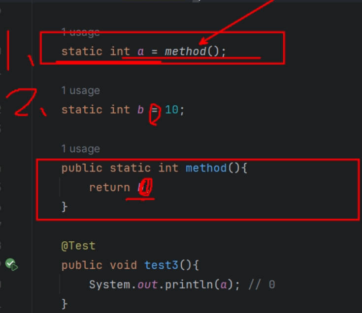


```java
package com.powernode.javase.stringtest;

/**
 * 面试题：代码的执行顺序
 */
public class Exam {
    public static void main(String[] args) {
        new B();
    }
}
class A {
    private static A a = new B();
    static {
        System.out.println("A的静态代码块执行了");
    }
    {
        System.out.println("A的构造代码块执行了");
    }
    public A(){
        System.out.println("A的构造方法执行了");
    }
}

class B extends A {
    static {
        System.out.println("B的静态代码块执行了");
    }
    {
        System.out.println("B的构造代码块执行了");
    }
    public B(){
        System.out.println("B的构造方法执行了");
    }
}
```

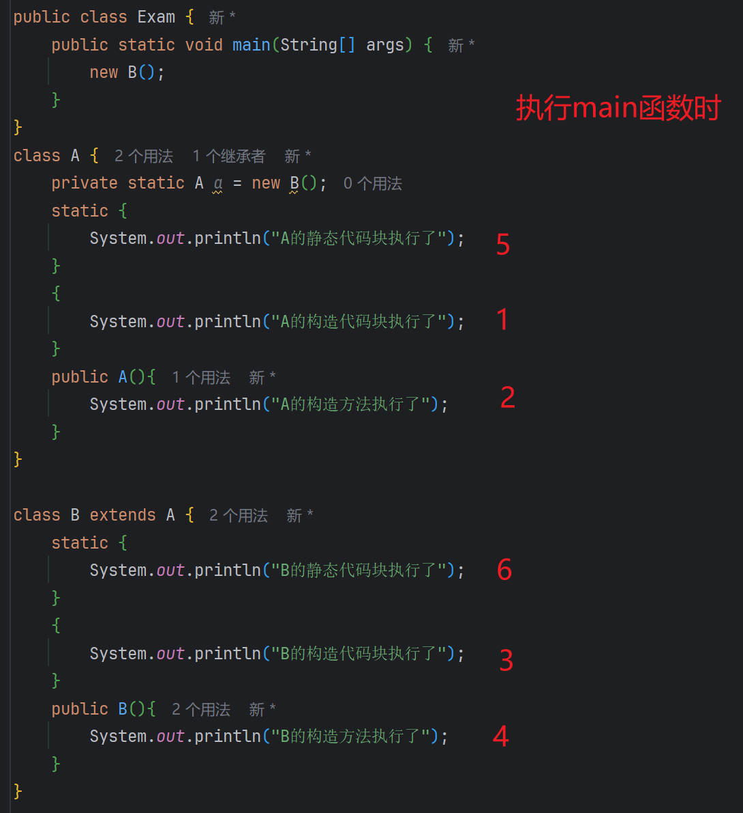

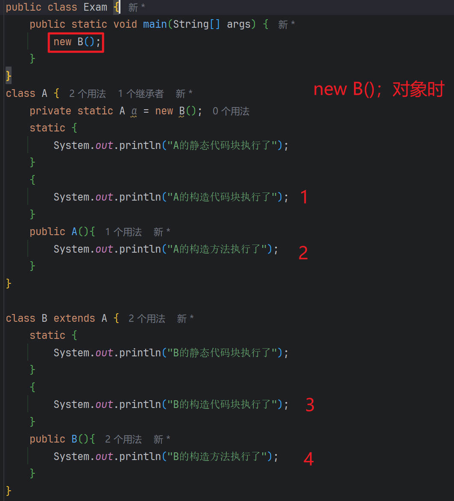

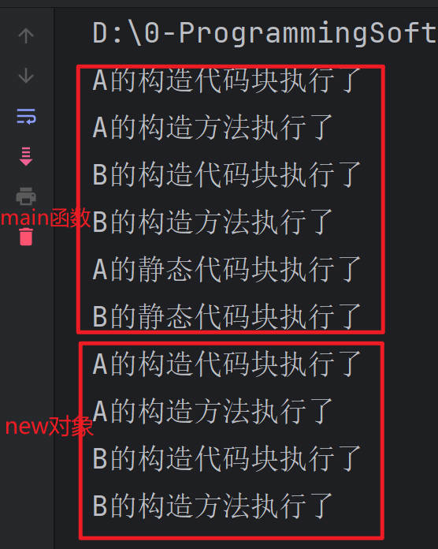


## String练习题

①**获取指定字符串中`大写字母、小写字母、数字`的`个数`**

```java
package com.powernode.javase.stringtest;

/**
 * 获取指定字符串中大写字母、小写字母、数字的个数
 */
public class StringTest04 {
    public static void main(String[] args) {

        // String s = "Ab1c2dE3f4G5HabcdeFJKFDSJKAkjf1ds3u4a5i6e67r7kds";
        String s = "a1bcA2B3C123";

        char[] chars = s.toCharArray();

        // 定义计数器
        int bigCount = 0, smallCount = 0, numCount = 0;

        for (int i = 0; i < chars.length; i++) {
            char c = chars[i];
            if (c >= 'A' && c <= 'Z') {
                bigCount++;
            }else if (c >= 'a' && c <= 'z') {
                smallCount++;
            }else if (c >= '0' && c <= '9') {
                numCount++;
            }
        }

        System.out.println("大写字母个数：" + bigCount);
        System.out.println("小写字母个数：" + smallCount);
        System.out.println("数字个数：" + numCount);
    }
}
```

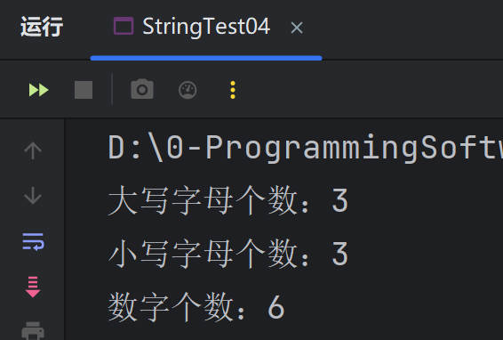


②**字符串的`反转`**

```java
package com.powernode.javase.stringtest;

/**
 * 字符串的反转
 */
public class StringTest05 {
    public static void main(String[] args) {
        String s = "hello";
        String newStr = reverse(s);
        System.out.println(s + "反转后的结果：" + newStr);
    }

    /**
     * 反转字符串
     * @param s
     * @return
     */
    private static String reverse(String s) {
        // 将s转换成char数组，然后将数组反转，然后返回String
        char[] chars = s.toCharArray();
        for (int i = 0; i < chars.length / 2; i++) {
            // chars[i] 首
            // chars[chars.length - 1 - i] 尾
            char temp = chars[i];
            chars[i] = chars[chars.length - i - 1];
            chars[chars.length - i - 1] = temp;
        }
        return new String(chars);
    }
}
```

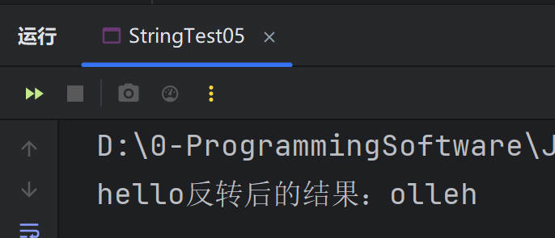


③**获取子字符串在整个字符串中`出现的次数`。**

```java
package com.powernode.javase.stringtest;

/**
 * 获取子字符串在整个字符串中出现的次数
 */
public class StringTest06 {
    public static void main(String[] args) {
        String s1 = "11oraclejavac++mysqloraclejavapythonphporacle";

        // 统计 s1 字符串中子字符串 "oracle" 出现的次数
        int index = 0;

        // 计数器
        int count = 0;
        while((index = s1.indexOf("oracle")) != -1){
            s1 = s1.substring(index + 1);
            count++;
        }

        System.out.println(count); // 3
    }
}
```


④**从身份证中`读取信息`，要求读取出这个人的`生日以及性别`**

```java
package com.powernode.javase.stringtest;

/**
 * 从身份证中读取信息，要求读取出这个人的生日以及性别
 * 身份证号：111111 19901211 1234
 * 7-14 是生日
 * 倒数第二位是性别：奇数表示男，偶数表示女
 */
public class StringTest07 {
    public static void main(String[] args) {
        // 身份证号
        String idCard = "111111199012111224";
        // 获取生日
        String birth = idCard.substring(6, 14);
        System.out.println("生日：" + birth);
        // 获取性别
        // '0' --> 48
        // '1' --> 49
        // '2' --> 50
        // ....
        int c = idCard.charAt(16);
        System.out.println(c % 2 == 0 ? "女" : "男");
    }
}
```

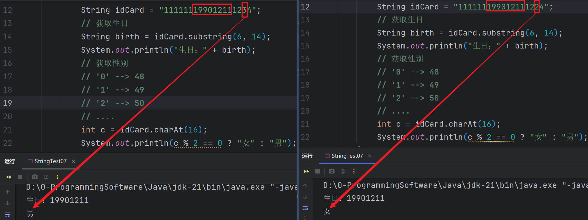


⑤**获取两个字符串中`最大相同的子字符串`。**

```java
package com.powernode.javase.stringtest;

/**
 * 获取两个字符串中最大相同的子字符串
 * 字符串1：abcdefghijklmnopqrstuvwxyz
 * 字符串2：xyzabcdefglmnopqrstu
 */
public class StringTest08 {
    public static void main(String[] args) {
        String s1 = "abcdefghijklmnopqrstuvwxyz";
        String s2 = "xyzabcdefglmnopqrstu";
        String maxSubstring = getMaxSubstring(s1, s2);
        System.out.println(maxSubstring); // lmnopqrstu
    }

    private static String getMaxSubstring(String s1, String s2) {

        // 记录下来两个字符串的长度
        int n1 = s1.length();
        int n2 = s2.length();

        // 把最大相同的子字符串的长度记录下来 maxLen
        // 把最大相同的子字符串的起始位置记录下来 start
        int maxLen = 0;
        int start = 0;
        
        // 下面这个循环套循环就是为了找出正确的maxLen，以及正确的start
        for (int i = 0; i < n1; i++) {
            for (int j = 0; j < n2; j++) {
                // k变量是用来记录 相同子字符串的长度
                int k = 0;
                while(i + k < n1 && j + k < n2 && s1.charAt(i + k) == s2.charAt(j + k)){
                    k++;
                }
                if(k > maxLen){
                    maxLen = k;
                    start = i;
                }
            }
        }
        return s1.substring(start, start + maxLen);
    }
}
```


## StringBuffer与StringBuilder


### StringBuffer和StringBuilder：可变长度字符串


**StringBuffer继承结构:**

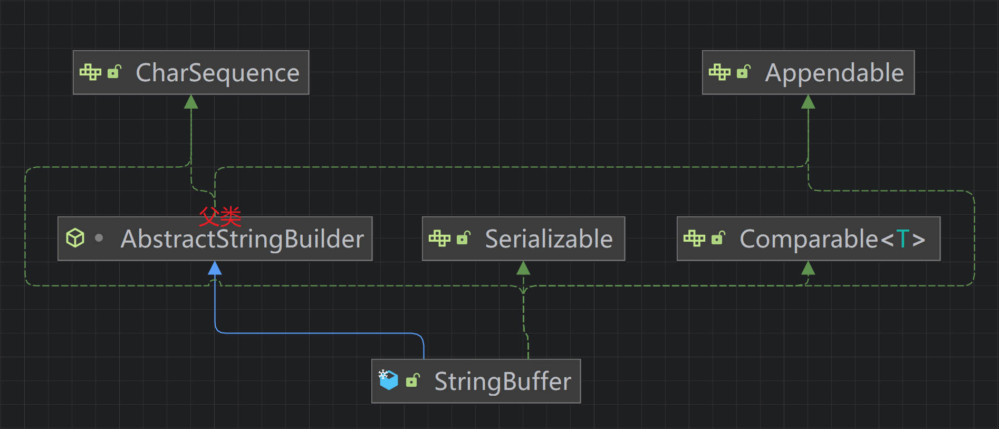


**StringBuilder继承结构:**

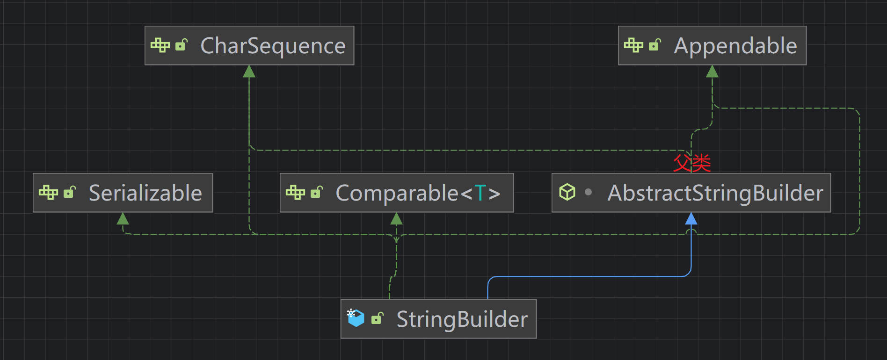

①**这两个类是专门为`频繁进行字符串拼接`而准备。**

②**StringBuffer先出现的，Java5的时候新增了StringBuilder。`StringBuffer是线程安全的`。在不需要考虑线程安全问题的情况下`优先选择StringBuilder`，效率较高一些。**

③**底层是 `byte[] 数组`，并且这个` byte[] 数组没有被final修饰`，这说明`如果byte[]数组满了`，可以`创建一个更大的新数组来达到扩容`，然后它可以`重新指向这个新的数组对象`。**

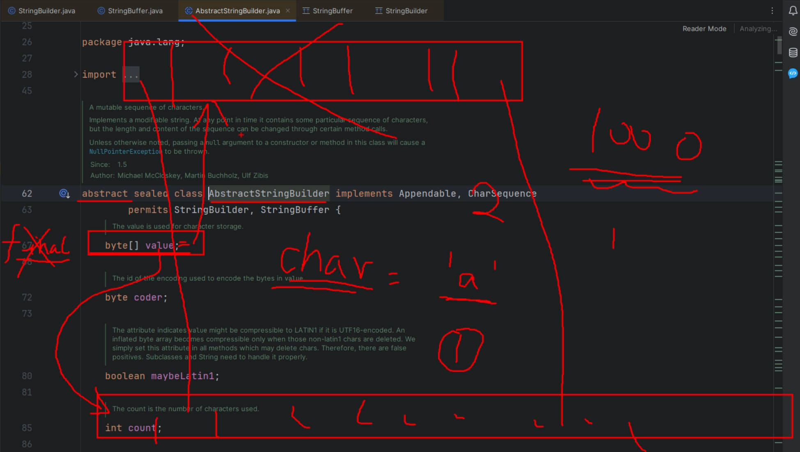

④**优化策略：`创建StringBuilder对象`时，预估计`字符串的长度`，给定一个合适的`初始化容量`，减少`底层数组的扩容`。**

⑤**`StringBuilder`默认初始化容量：`16`**

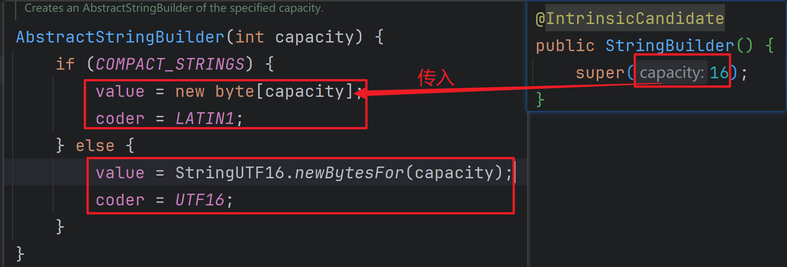

⑥**`StringBuilder一次扩容多少？`可以通过Debug跟踪一下`append方法`。扩容策略是：`从当前容量开始，每次扩容为原来的2倍再加上2`。**


### 构造方法

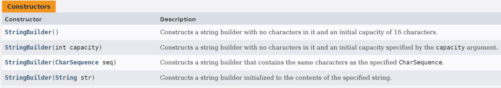

①**StringBuilder() 构造一个字符串生成器，其中不包含任何字符，初始容量为16个字符。**

②**StringBuilder(int capacity) 构造一个字符串生成器，其中不包含任何字符，并且具有由容量参数指定的初始容量。**

③**StringBuilder(String str) 构造初始化为指定字符串内容的字符串生成器**

```java
package com.powernode.javase.stringbuildertest;

/**
 * StringBuilder的构造方法
 */
public class StringBuilderTest02 {
    public static void main(String[] args) {
        // 初始化容量16
        StringBuilder sb1 = new StringBuilder();
        StringBuilder sb2 = new StringBuilder(320);
        StringBuilder sb3 = new StringBuilder("abcdef");
        StringBuilder sb4 = new StringBuilder(sb3);

        System.out.println(sb1);
        System.out.println(sb2);
        System.out.println(sb3);
        System.out.println(sb4);
    }
}
```


### 常用方法

```java
①StringBuilder append(Type data);

②StringBuilder delete(int start, int end);

③StringBuilder deleteCharAt(int index);

④StringBuilder insert(int offset, String str);

⑤StringBuilder replace(int start, int end, String str)

⑥StringBuilder reverse();

⑦void setCharAt(int index, char ch);

⑧void setLength(int newLength);

⑨char charAt(int index);

⑩int indexOf(String str);

⑪int indexOf(String str, int fromIndex);

⑫int lastIndexOf(String str);

⑬int lastIndexOf(String str, int fromIndex);

⑭int length();

⑮String substring(int start);

⑯String substring(int start, int end);

⑰String toString();
```

> **重点方法:**

```java
①StringBuilder append(Type data);

②StringBuilder delete(int start, int end);

③StringBuilder deleteCharAt(int index);

④StringBuilder insert(int offset, String str);

⑤StringBuilder replace(int start, int end, String str)

⑥StringBuilder reverse();

⑦void setCharAt(int index, char ch);

⑧void setLength(int newLength);
```


①**StringBuilder append(Type data);**

```java
@Test
public void testAppend() {
     StringBuffer s = new StringBuffer();
     s.append(10);
     s.append("abc");
     s.append(new Object());
     s.append(false);
     s.append(3.14);

   System.out.println(s.toString());//10abcjava.lang.Object@2b6faea6false3.14
}
```


②**StringBuilder delete(int start, int end);**

③**StringBuilder deleteCharAt(int index);**

```java
@Test
public void testDelete() {
    StringBuffer s = new StringBuffer();
    s.append(10);
    s.append("abc");
    s.append(new Object());
    s.append(false);
    s.append(3.14);

    System.out.println(s); // 10abcjava.lang.Object@48aaecc3false3.14
    
    // [3 , 5)
    s.delete(3,5);

    System.out.println(s); // 10ajava.lang.Object@48aaecc3false3.14

    s.deleteCharAt(0);

    System.out.println(s); // 0ajava.lang.Object@48aaecc3false3.14
}
```


④**StringBuilder insert(int offset, String str);**

```java
@Test
public void testInsert(){
    StringBuilder s = new StringBuilder();
    s.append(10);
    s.append("abc");
    s.insert(3, "hello world"); 
    System.out.println(s); // 10ahello worldbc
}
```


⑤**StringBuilder replace(int start, int end, String str)**

```java
@Test
public void testReplace(){
    StringBuilder s = new StringBuilder();
    s.append(10);
    s.append("abc");
    s.insert(3, "hello world");
    System.out.println(s); // 10ahello worldbc
    s.replace(3, "hello world".length() + 3, "动力节点");
    System.out.println(s); // 10a动力节点bc
}
```


⑥**StringBuilder reverse();**

```java
@Test
public void testReverse(){
    StringBuilder s = new StringBuilder();
    s.append(10);
    s.append("abc");
    s.insert(3, "hello world");
    System.out.println(s); // 10ahello worldbc
    s.replace(3, "hello world".length() + 3, "动力节点");
    System.out.println(s); // 10a动力节点bc
    s.reverse();
    System.out.println(s); // cb点节力动a01
}
```


⑦**void setCharAt(int index, char ch);**

```java
@Test
public void testSetCharAt(){
    StringBuilder s = new StringBuilder();
    s.append(10);
    s.setCharAt(0, 'A');
    System.out.println(s); // A0
}  
```


⑧**void setLength(int newLength);**

```java
@Test
public void testSetLength(){
    StringBuilder s = new StringBuilder();
    s.append("aaa111111111111111111111111111111111111111111111111111111");
    System.out.println(s); 
    // aaa111111111111111111111111111111111111111111111111111111

    // 谨慎使用，会把已有的数据抹掉。
    s.setLength(3);
    System.out.println(s); // aaa
}
```


### String的效率问题

①以下这种写法尽量避免，效率太低：

```java
String s = “”;

for(int i = 0; i < 100000; i++){

  // 优化策略：底层会新建一个StringBuilder对象

  // 然后调用StringBuilder的append(i)方法进行追加

  // 然后再调用StringBuilder toString()方法转成String类型

  // 也就是说：这里会频繁的创建String对象，导致效率很低

  // 同时给GC带来巨大压力。

  s += i;

}
```

**因此建议使用下面的方式，`只创建一个StringBuilder对象`。**

**String、StringBuilder、StringBuffer效率PK。**

```java
package com.powernode.javase.stringbuildertest;

public class StringBuilderTest03 {
    public static void main(String[] args) {
        /*long begin = System.currentTimeMillis();

        String s = "";
        for (int i = 0; i < 100000; i++) {
            s += i; // s = s + i;
        }

        long end = System.currentTimeMillis();
        System.out.println("总耗时：" + (end - begin) + "毫秒"); // 总耗时：3390毫秒*/

        long begin = System.currentTimeMillis();

        StringBuilder s = new StringBuilder(100000);
        for (int i = 0; i < 100000; i++) {
            s.append(i);
        }

        long end = System.currentTimeMillis();
        System.out.println("总耗时：" + (end - begin) + "毫秒"); // 总耗时：8毫秒
    }
}
```


## 包装类

### 什么是包装类？有什么用？

①为了方便开发，Java为`8种基本数据类型`分别又提供了对应的`包装类`。**（`包装类`都是`引用数据类型`。）**

| 8种基本数据类型 |         包装类          |
| :-------------: | :---------------------: |
|      byte       |     java.lang.Byte      |
|      short      |     java.lang.Short     |
|       int       |  **java.lang.Integer**  |
|      long       |     java.lang.Long      |
|      float      |     java.lang.Float     |
|     double      |    java.lang.Double     |
|     boolean     |    java.lang.Boolean    |
|      char       | **java.lang.Character** |

**声明：其中`Integer使用最多`，以它为代表进行学习。**

> **以Integer为例:**

```java
package com.powernode.javase.integertest;

/**
 * 自定义的类，代表一个int类型的数字。
 */
public class MyInteger {
    private int value;

    public MyInteger(int value) {
        this.value = value;
    }

    public int getValue() {
        return value;
    }

    public void setValue(int value) {
        this.value = value;
    }

    @Override
    public String toString() {
        return String.valueOf(value);
    }
}
```

```java
package com.powernode.javase.integertest;

public class IntegerTest01 {
    public static void main(String[] args) {

        // 基本数据类型
        int value = 10;

        // 将10进行包装，生成包装类
        MyInteger integer = new MyInteger(value);

        m(integer);
    }

    public static void m(Object obj){

    }
}
```


### 包装类中的6个数字类型都继承了Number类

①**`Byte、Short、Integer、Long、Float、Double`都`继承`了`Number类`，因此这些类中都有以下这些方法：**

```java
1.byteValue()

2.shortValue()

3.intValue()

4.longValue()

5.floatValue()

6.doubleValue()

这些方法的作用就是将包装类型的数据转换为基本数据类型。
```

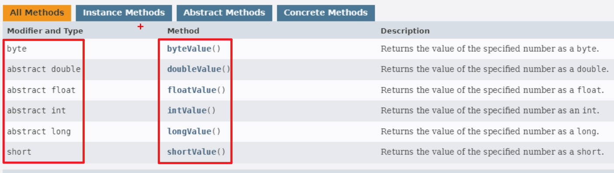

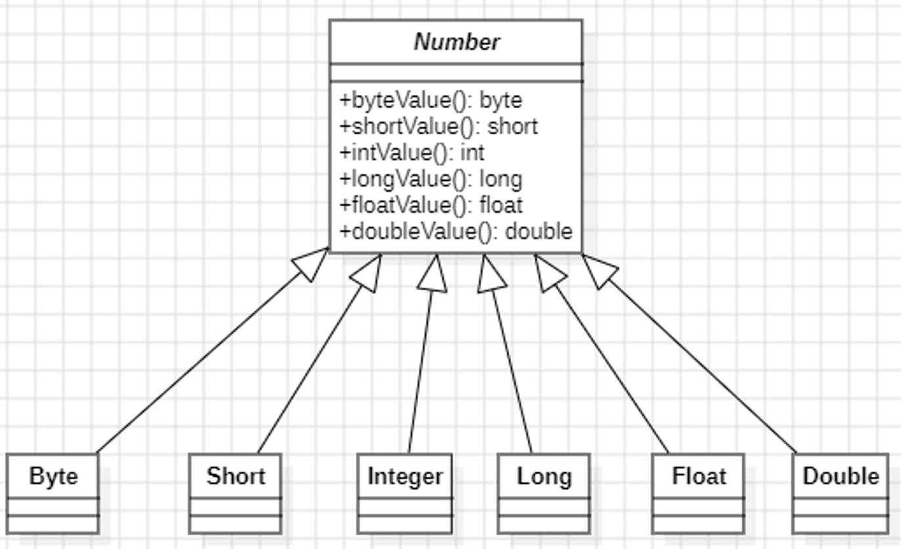

包装类转换成基本数据类型的过程我们称为：**拆箱 unboxing**

1. **Boolean的拆箱方法：`booleanValue();`**

2. **Character的拆箱方法：`charValue();`**


### Integer的常量

①通过Integer提供的常量可以获取int的最大值和最小值：

1. 最大值：Integer.MAX_VALUE

2. 最小值：Integer.MIN_VALUE

②当然，其它5个数字包装类也有对应的常量：

1. byte最大值：Byte.MAX_VALUE

2. byte最小值：Byte.MIN_VALUE

3. short最大值：Short.MAX_VALUE

4. short最小值：Short.MIN_VALUE

```java
package com.powernode.javase.integertest;

/**
 * 关于包装类的常量
 */
public class IntegerTest02 {
    public static void main(String[] args) {

        System.out.println("int类型最大值：" + Integer.MAX_VALUE); // int类型最大值：2147483647
        System.out.println("int类型最小值：" + Integer.MIN_VALUE); // int类型最小值：-2147483648

        System.out.println("byte类型最大值：" + Byte.MAX_VALUE); // byte类型最大值：127
        System.out.println("byte类型最小值：" + Byte.MIN_VALUE); // byte类型最小值：-128

        System.out.println(Boolean.FALSE); // false
        System.out.println(Boolean.TRUE); // true

        System.out.println(Double.MAX_VALUE); // 1.7976931348623157E308
        System.out.println(Double.MIN_VALUE); // 4.9E-324
    }
}
```


### Integer的构造方法

①**Integer(int value)**

1.Java9之后标记已过时，不建议使用。

2.该构造方法可以将`基本数据类型`转换成`包装类`。这个过程我们称为**装箱boxing**

```java
package com.powernode.javase.integertest;

/**
 * 关于包装类的构造方法
 */
public class IntegerTest03 {
    public static void main(String[] args) {
        // 创建一个Integer对象
        int i = 100;

        Integer i1 = new Integer(i); // 将基本数据类型包装成引用数据类型，这个过程我们称为：装箱 boxing

        System.out.println(i1); // 100

        // 再创建一个Integer对象
        Integer i2 = new Integer("100");

        System.out.println(i2); // 100 // 底层调用toString方法
    }
}
```


②**Integer(String s)**

1.Java9之后标记已过时，不建议使用。

2.该构造方法可以将`字符串数字`转换成`包装类`。但字符串`必须是整数数字`，如果不是会出现异常：**NumberFormatException**

```java
package com.powernode.javase.integertest;

/**
 * 关于包装类的构造方法
 */
public class IntegerTest03 {
    public static void main(String[] args) {
        // 非常常见的异常：java.lang.NumberFormatException
        Integer i3 = new Integer("abc");

        System.out.println(i3);
    }
}
```

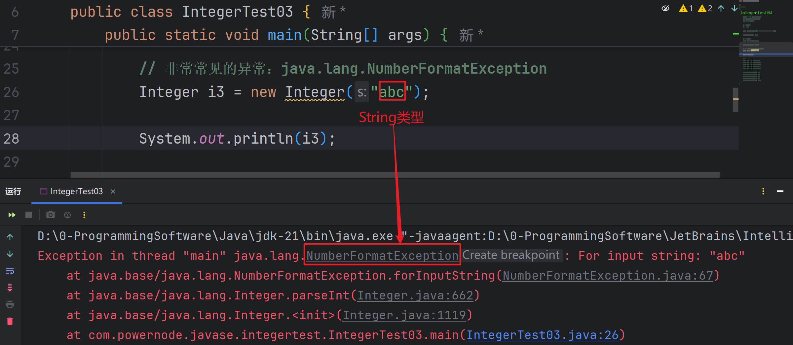

> 其它包装类的构造方法也是如此，例如`Boolean的构造方法`

①**Boolean(boolean value)**

②**Boolean(String s)**

```java
package com.powernode.javase.integertest;

/**
 * 关于包装类的构造方法
 */
public class IntegerTest03 {
    public static void main(String[] args) {
        // 装箱
        Boolean flag1 = new Boolean(true);
        Boolean flag2 = new Boolean("true");
        Boolean flag3 = new Boolean("True");
        Boolean flag4 = new Boolean("TRUE");
        Boolean flag5 = new Boolean("TRUE1");

        System.out.println(flag1); // true
        System.out.println(flag2); // true
        System.out.println(flag3); // true
        System.out.println(flag4); // true
        System.out.println(flag5); // false
    }
}
```

以上两个构造方法也都在Java9的时候标记已过时。


### Integer的常用方法

①**static int compare(int x, int y); `比较大小`**

```java
@Test
public void testCompare(){
    int result = Integer.compare(30, 20);
    System.out.println(result); // 1
}
```


②**static int max(int a, int b); `最大值`**

③**static int min(int a, int b); `最小值`**

```java
@Test
public void testMaxAndMin(){
    System.out.println(Integer.max(10, 20)); // 20
    System.out.println(Integer.min(10, 20)); // 10
}
```


④**static int parseInt(String s); 将字符串数字转换成数字类型。其它包装类也有这个方法：Double.parseDouble(String s)**

```java
@Test
public void testParseInt(){
    // 注意避免这个异常：java.lang.NumberFormatException
    //int num1 = Integer.parseInt("123a");
    int num1 = Integer.parseInt("123");

    double num2 = Double.parseDouble("3.14");

    long num3 = Long.parseLong("560");

    System.out.println(num1 + 1); // 124
    System.out.println(num2 + 1); // 4.140000000000001
    System.out.println(num3 + 1); // 561
}
```


⑤**static String toBinaryString(int i); 获取数字`二进制`的字符串表示形式**

⑥**static String toHexString(int i); 获取数字`十六进制`的字符串表示形式**

⑦**static String toOctalString(int i); 获取数字`八进制`的字符串表示形式**

```java
@Test
public void testToJinZhi(){
    int num = 20;
    System.out.println(num + "对应的十六进制" + Integer.toHexString(num)); // 20对应的十六进制14
    System.out.println(num + "对应的二进制" + Integer.toBinaryString(num)); // 20对应的十六进制10100
    System.out.println(num + "对应的八进制" + Integer.toOctalString(num)); // 20对应的十六进制24
}
```


⑧**int compareTo(Integer anotherInteger); `比较大小`，可见`实现了Comparable接口`**

```java
// 自定义学生类，实现Comparable接口
class Student implements Comparable<Student> {
    String name;
    int score;  // 成绩
    
    public Student(String name, int score) {
        this.name = name;
        this.score = score;
    }
    
    // 实现compareTo方法 - 按成绩比较
    @Override
    public int compareTo(Student other) {
        // 比较当前学生和另一个学生的成绩
        if (this.score < other.score) {
            return -1;  // 当前学生成绩更小
        } else if (this.score > other.score) {
            return 1;   // 当前学生成绩更大
        } else {
            return 0;   // 成绩相等
        }
    }
    
    @Override
    public String toString() {
        return name + "(" + score + "分)";
    }
}
```

```java
public class SimpleExample {
    public static void main(String[] args) {
        // 创建几个学生
        Student student1 = new Student("小明", 85);
        Student student2 = new Student("小红", 92);
        Student student3 = new Student("小刚", 85);
        
        // 比较学生成绩
        System.out.println("比较结果:");
        
        // 小明 vs 小红
        int result1 = student1.compareTo(student2);
        System.out.println(student1 + " 和 " + student2 + " 比较: " + result1);
        
        // 小明 vs 小刚
        int result2 = student1.compareTo(student3);
        System.out.println(student1 + " 和 " + student3 + " 比较: " + result2);
        
        // 小红 vs 小明
        int result3 = student2.compareTo(student1);
        System.out.println(student2 + " 和 " + student1 + " 比较: " + result3);
    }
}
```

> **测试结果:**
>
> ```java
> 比较结果:
> 小明(85分) 和 小红(92分) 比较: -1
> 小明(85分) 和 小刚(85分) 比较: 0
> 小红(92分) 和 小明(85分) 比较: 1
> ```


⑨**boolean equals(Object obj); `包装类`已经`重写了equals()方法`。**

⑩**String toString(); `包装类`已经`重写了toString()方法`。**

```java
@Test
public void testEqualsAndToString(){
    // Integer以及其它的包装类都已经将equals和toString重写了。
    Integer a = new Integer(100);
    Integer b = new Integer(100);
    System.out.println(a == b); // false
    System.out.println(a.equals(b)); // true

    System.out.println(a.toString()); // 100
    System.out.println(b.toString()); // 100
}
```


⑪**int intValue(); 将`包装类拆箱`为`基本数据类型`**

```java
@Test
public void testUnBoxing(){
    // 装箱
    Integer i = new Integer(100);
    // 拆箱
    int num = i.intValue();
    System.out.println(num + 1); // 101
}
```


⑫**static String toString(int i); 将`基本数据类型`转换成`字符串`**

```java
@Test
public void testToString(){
    // 将基本数据类型转换成String
    String str = Integer.toString(100);
    System.out.println(str); // 100

    // 这种方式也行。
    int i = 100;
    String s = i + "";
    System.out.println(s); // "100"
}
```


⑬**static Integer valueOf(int i); 将`基本数据类型`转换成`Integer`**

⑭**static Integer valueOf(String s) 将`字符串`转换成`Integer`（这个字符串`必须是数字字符串`才行，不然出现`NumberFormatException`）**

```java
@Test
public void testBoxing(){
    Integer i1 = Integer.valueOf(100);
    System.out.println(i1); // 100

    Integer i2 = Integer.valueOf("100");
    System.out.println(i2); // 100

    // 注意：java.lang.NumberFormatException
    //Integer i3 = Integer.valueOf("abc");
}
```


### String,int,Integer三种类型之间的转换

**String、int、Integer三种类型之间的互相转换（`String,double,Double转换原理相同`）**

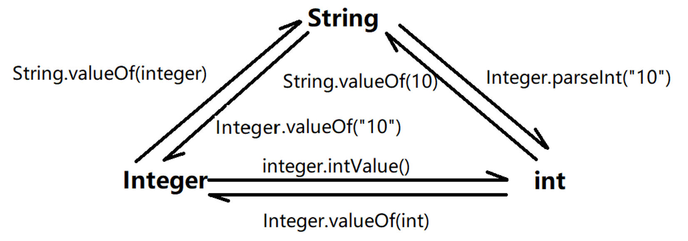

```java
package com.powernode.javase.integertest;

/**
 * String,int,Integer三种类型之间的转换。
 */
public class IntegerTest04 {
    public static void main(String[] args) {
        // String ---> int
        String s1 = "123";
        int i1 = Integer.parseInt(s1);
        System.out.println(i1 + 1);

        // int ---> String
        // 第一种
        int i2 = 123;
        String s2 = i2 + "";
        System.out.println(s2 + 1); // "1231"

        // 第二种
        String s3 = Integer.toString(i2);
        System.out.println(s3 + 1); // "1231"

        // String --> Integer
        String s4 = "123";
        Integer i3 = Integer.valueOf(s4);

        // Integer --> String
        String s5 = String.valueOf(i3);

        // int --> Integer
        int i4 = 100;
        Integer i5 = Integer.valueOf(i4);

        // Integer --> int
        int i6 = i5.intValue();
    }
}
```


### Java5新特性：自动装箱和自动拆箱

①**Java5之后为了开发方便，引入了新特性：自动拆箱和自动装箱。**

②**自动装箱：auto boxing**

```java
Integer a = 10000; // 程序在编译的时候底层实际上的代码是：Integer a = new Integer(10000);
```

③**自动拆箱：auto unboxing**

```java
int b = a; // 底层实际上会调用：int b = a.intValue();
```

④**System.out.println(a + 1); 这里的`a也会做自动拆箱`。**

⑤**注意空指针异常：**

```java
// 注意空指针：java.lang.NullPointerException
Integer a = null;

System.out.println(a + 1);
```

> 以上代码`出现空指针异常`的原因是`a在进行自动拆箱`时，会`调用 a.intValue()方法`。
>
> 因为`a是null`，访问`实例方法`会出现`空指针异常`，因此使用时应注意。
>
> 

```java
package com.powernode.javase.integertest;

/**
 * 关于自动装箱和自动拆箱
 *      1. Java5的新特性。
 *      2. 自动装箱和自动拆箱属于编译阶段的功能。
 *      3. 自动装箱：auto boxing
 *      4. 自动拆箱：auto unboxing
 *      5. 自动装箱和自动拆箱机制是为了方便写代码而存在的机制。
 *      6. 装箱：Integer i = new Integer(100);
 *      7. 拆箱：int num = i.intValue();
 */
public class IntegerTest05 {
    public static void m1(Integer i){
        // 发生自动拆箱
        // 注意空指针异常。（注意排除空引用）
        if (i != null) {
            System.out.println(i + 1); // 10001
        }
    }

    public static void main(String[] args) {

        // 这个过程其实就发生了自动装箱。
        m1(10000);
        m1(null);

        // 自动装箱
        Integer x = 1000; // 程序在编译的时候底层实际上的代码是：Integer x = new Integer(1000);

        /*Integer a = 10000;
        Integer b = 10000;
        System.out.println(a == b); // false（堆当中两个Integer对象，内存地址不同。）*/

        // 自动拆箱
        int num = x; // 底层实际上会调用：int num = x.intValue();

        // 注意空指针：java.lang.NullPointerException
        /*x = null;
        int num2 = x; // int num2 = x.intValue();*/
    }
}
```


### 整数型常量池

①**`[-128 ~ 127] `Java为这个区间的`Integer对象创建了整数型常量池`。**

②**也就是说如果`整数没有超出范围`的话，`直接从整数型常量池获取Integer对象`。**

③以下是一个面试题：请说出它的输出结果：

> **面试题:**

```java
package com.powernode.javase.integertest;

/**
 * 面试题
 */
public class IntegerTest06 {
    public static void main(String[] args) {

        Integer x = 10000; // Integer x = new Integer(10000);
        Integer y = 10000; // Integer x = new Integer(10000);
        System.out.println(x == y); // false

        // 整数型常量池。
        // [-128 ~ 127] 这些数字太常用了。
        // 为了提高效率，Java提供了一个整数型常量池。
        // 这个常量池是一个数组：Integer[] integerCache;
        // 这个数组中存储了256个Integer的引用。
        // 只要没有超出这个范围的数字，直接从整数型常量池中取。
        Integer a = 127;
        Integer b = 127;
        System.out.println(a == b); // true
    }
}
```


## 大数字


### 如果整数超过long的最大值怎么办？

①**java中提供了一种引用数据类型来解决这个问题：`java.math.BigInteger`。它的`父类是Number`。**

②**常用`构造方法`：`BigInteger(String val)`**

③常用方法：

```java
①BigInteger add(BigInteger val); 求和

②BigInteger subtract(BigInteger val); 相减

③BigInteger multiply(BigInteger val); 乘积

④BigInteger divide(BigInteger val); 商

⑤int compareTo(BigInteger val); 比较

⑥BigInteger abs(); 绝对值

⑦BigInteger max(BigInteger val); 最大值

⑧BigInteger min(BigInteger val); 最小值

⑨BigInteger pow(int exponent); 次幂

⑩BigInteger sqrt(); 平方根
```

> **示例程序：**

```java
package com.powernode.javase.bignumtest;

import java.math.BigInteger;

/**
 * 大数字：
 *      1. 超过long了怎么办？java.math.BigInteger
 *      2. BigInteger的父类Number
 *      3. BigInteger是引用数据类型。
 */
public class BigNumTest01 {
    public static void main(String[] args) {

        //long num = 999999999999999999L;

        // 编译报错，超范围。
        //long num = 99999999999999999999999L;

        // 创建一个大整数
        BigInteger num1 = new BigInteger("99999999999999999999999");
        System.out.println(num1); // 99999999999999999999999

        BigInteger num2 = new BigInteger("1");

        // 加法
        BigInteger result1 = num1.add(num2);
        System.out.println(result1); // 100000000000000000000000

        // 减法
        BigInteger result2 = num1.subtract(num2);
        System.out.println(result2); // 99999999999999999999998

        // 乘法
        BigInteger result3 = num1.multiply(num2);
        System.out.println(result3); // 99999999999999999999999

        // 除法
        BigInteger result4 = num1.divide(num2);
        System.out.println(result4); // 99999999999999999999999

        // 次幂
        BigInteger bigInteger = new BigInteger("2");
        BigInteger pow = bigInteger.pow(3);
        System.out.println(pow); // 8

        // 平方
        BigInteger bigInteger1 = new BigInteger("9");
        BigInteger sqrt = bigInteger1.sqrt();
        System.out.println(sqrt); // 3
    }
}
```


### 如果浮点型数据超过double的最大值怎么办？

①**java中提供了一种引用数据类型来解决这个问题：`java.math.BigDecimal`（`经常用在财务软件中`）。它的`父类是Number`。**

②**构造方法：`BigDecimal(String val)`**

③常用方法：

```java
①BigDecimal add(BigDecimal augend); 求和

②BigDecimal subtract(BigDecimal subtrahend); 相减

③BigDecimal multiply(BigDecimal multiplicand); 乘积

④BigDecimal divide(BigDecimal divisor); 商

⑤BigDecimal max(BigDecimal val); 最大值

⑥BigDecimal min(BigDecimal val); 最小值

⑦BigDecimal movePointLeft(int n); 向左移动小数点

⑧BigDecimal movePointRight(int n); 向右移动小数点
```

> **示例程序:**

```java
package com.powernode.javase.bignumtest;

import java.math.BigDecimal;

/**
 * java.math.BigDecimal 大浮点数字。经常使用在财务软件当中。
 */
public class BigNumTest02 {
    public static void main(String[] args) {
        BigDecimal num1 = new BigDecimal("10");
        BigDecimal num2 = new BigDecimal("2");

        // 加
        System.out.println(num1.add(num2)); // 12
        // 减
        System.out.println(num1.subtract(num2)); // 8
        // 乘
        System.out.println(num1.multiply(num2)); // 20
        // 除
        System.out.println(num1.divide(num2)); // 5

        BigDecimal num3 = new BigDecimal("123456789.123456789");
        // 向左移动小数点
        System.out.println(num3.movePointLeft(3)); // 123456.789123456789
        // 向右移动小数点
        System.out.println(num3.movePointRight(3)); // 123456789123.456789
    }
}
```


### 数字格式化

> **有时我们需要将数字以`某种格式展示`，在java中`如何格式化`呢？**

①**`java.text.DecimalFormat`类是专门用来`对数字进行格式的`。**

②常用数字格式：

1. **###,###.##  // 三个数字为一组，组和组之间使用逗号隔开，保留两位小数**

2. **###,###.0000 // 三个数字为一组，组和组之间使用逗号隔开，保留4位小数，不够补0**

③**构造方法：`DecimalFormat(String pattern)`**

④**常用方法：`String format(数字);`**

```java
package com.powernode.javase.bignumtest;

import java.text.DecimalFormat;

/**
 * 数字的格式化展示的时候，需要使用这个类。
 */
public class DecimalFormatTest {
    public static void main(String[] args) {
        // 创建一个数字格式化对象
        DecimalFormat df = new DecimalFormat("###,###.##");

        // 格式化
        String s = df.format(12345678.123);

        System.out.println(s); // "12,345,678.12"

        // 保留四位小数，要求不够补0
        DecimalFormat df2 = new DecimalFormat("###,###.0000");
        String s2 = df2.format(12345678.123);
        System.out.println(s2); // "12,345,678.1230"
    }
}
```


## 日期处理


### 日期相关API(1)

①**`long l = System.currentTimeMillis();` // 获取自1970年1月1日0时0分0秒到系统当前时间的总毫秒数。**

②**java.util.Date 日期类**

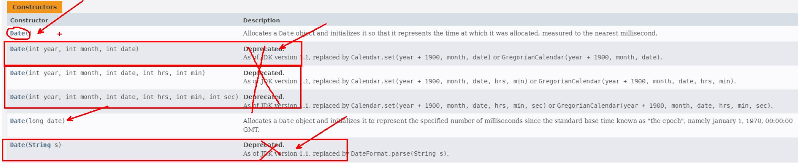

```java
构造方法：Date() :
// 获取系统当前时间
Date date = new Date();
System.out.println(date);

构造方法：Date(long 毫秒) :
// 获取指定的时间（参数的单位是毫秒数）
Date date1 = new Date(1000);
System.out.println(date1);
```

> **示例程序:**

```java
package com.powernode.javase.datetest;

// 注意：我们学习的是java.util.Date.
// 不是java.sql.Date（java.sql.Date的父类是java.util.Date）
import java.util.Date;

/**
 * java.util.Date 日期API。
 */
public class DateTest01 {
    public static void main(String[] args) {
        // Date类的构造方法
        // Date()
        // Date(long l)

        // 获取系统当前时间
        Date date = new Date();
        System.out.println(date); // Fri Oct 17 21:54:46 CST 2025

        // 获取指定的时间（参数的单位是毫秒数）
        Date date1 = new Date(1000);
        System.out.println(date1); // Thu Jan 01 08:00:01 CST 1970

        // 获取当前系统时间的前10分钟时间
        Date date2 = new Date(System.currentTimeMillis());
        System.out.println(date2); // Fri Oct 17 21:54:46 CST 2025

        Date date3 = new Date(System.currentTimeMillis() - 1000 * 60 * 10);
        System.out.println(date3); // Fri Oct 17 21:44:46 CST 2025
    }
}
```


③**java.util.SimpleDateFormat `日期格式化类`**

> **日期格式化步骤:**

```java
// 获取系统当前时间
Date now = new Date();

// 格式化
//SimpleDateFormat sdf = new SimpleDateFormat("yyyy-MM-dd HH:mm:ss SSS");
//SimpleDateFormat sdf = new SimpleDateFormat("dd/MM/yyyy");
//SimpleDateFormat sdf = new SimpleDateFormat("dd/MM/yy");
//SimpleDateFormat sdf = new SimpleDateFormat("HH:mm:ss");
SimpleDateFormat sdf = new SimpleDateFormat("指定日期格式");

// 调用format方法完成格式化
String str = sdf.format(now);

System.out.println(str);
```

> **日期格式：**
>
> 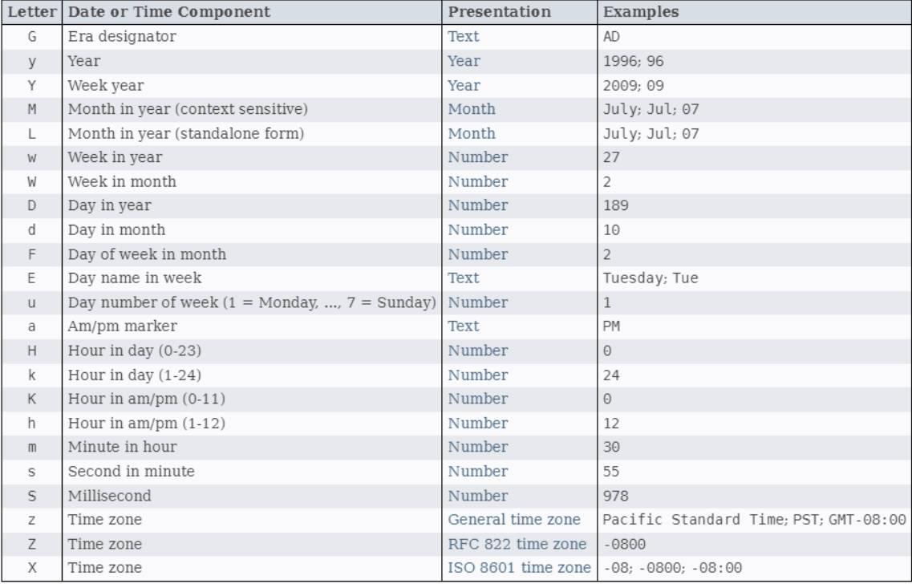

1. **日期转换成字符串（java.util.Date -> java.lang.String）**

```java
package com.powernode.javase.datetest;

import java.text.SimpleDateFormat;
import java.util.Date;

/**
 * 日期格式化，需要借助：
 *      java.text.DateFormat
 *      java.text.SimpleDateFormat（用这个。DateFormat是SimpleDateFormat的父类。）
 */
public class DateTest02 {
    public static void main(String[] args) {
        
        // java.util.Date ---> java.lang.String
        // 获取系统当前时间
        Date now = new Date();

        // 格式化
        //SimpleDateFormat sdf = new SimpleDateFormat("yyyy-MM-dd HH:mm:ss SSS");
        //SimpleDateFormat sdf = new SimpleDateFormat("dd/MM/yyyy");
        //SimpleDateFormat sdf = new SimpleDateFormat("dd/MM/yy");
        SimpleDateFormat sdf = new SimpleDateFormat("HH:mm:ss");

        // 调用format方法完成格式化
        String str = sdf.format(now);

        System.out.println(str); // 22:20:11
    }
}
```

2. **字符串转换成日期（java.lang.String -> java.util.Date）**

```java
package com.powernode.javase.datetest;

import java.text.ParseException;
import java.text.SimpleDateFormat;
import java.util.Date;

/**
 * 日期格式化，需要借助：
 *      java.text.DateFormat
 *      java.text.SimpleDateFormat（用这个。DateFormat是SimpleDateFormat的父类。）
 */
public class DateTest02 {
    public static void main(String[] args) throws ParseException {
        
        // java.lang.String ---> java.util.Date
        // 日期字符串
        String strDate = "2008-08-08 08:08:08 888";

        // 创建日期格式化对象
        SimpleDateFormat sdf2 = new SimpleDateFormat("yyyy-MM-dd HH:mm:ss SSS");

        // 解析：将字符串String转换成Date
        Date date = sdf2.parse(strDate);

        System.out.println(date);

    }
}
```


④**java.util.Calendar `日历类`**

1. **获取当前时间的日历对象：`Calendar c = Calendar.getInstance();`**

```java
// 获取当前时间的日历对象（调用一个静态方法）
Calendar calendar = Calendar.getInstance();
System.out.println(calendar);
/*
java.util.GregorianCalendar[time=1760762650848,areFieldsSet=true,areAllFieldsSet=true,lenient=true,zone=sun.util.calendar.ZoneInfo[id="Asia/Shanghai",offset=28800000,dstSavings=0,useDaylight=false,transitions=31,lastRule=null],firstDayOfWeek=2,minimalDaysInFirstWeek=1,ERA=1,YEAR=2025,MONTH=9,WEEK_OF_YEAR=42,WEEK_OF_MONTH=3,DAY_OF_MONTH=18,DAY_OF_YEAR=291,DAY_OF_WEEK=7,DAY_OF_WEEK_IN_MONTH=3,AM_PM=1,HOUR=0,HOUR_OF_DAY=12,MINUTE=44,SECOND=10,MILLISECOND=848,ZONE_OFFSET=28800000,DST_OFFSET=0]
*/
```

2. **获取日历中的某部分：`int year = c.get(Calendar.YEAR);`**

```java
package com.powernode.javase.datetest;

import java.util.Calendar;

/**
 * java.util.Calendar 日历类
 */
public class CalendarTest01 {
    public static void main(String[] args) {
        
        // 获取日历中年
        //int year = calendar.get(1);
        int year = calendar.get(Calendar.YEAR);
        System.out.println(year); // 2025

        // 获取日历中月
        int month = calendar.get(Calendar.MONTH);
        System.out.println(month); // 9 // 0-11 表示一年中的12个月。

        // 获取日历中的日
        int day = calendar.get(Calendar.DAY_OF_MONTH);
        System.out.println(day); // 18
    }
}
```

```java
Calendar.YEAR 获取年份
Calendar.MONTH 获取月份，0表示1月，1表示2月，...，11表示12月

Calendar.DAY_OF_MONTH 获取本月的第几天
Calendar.DAY_OF_YEAR 获取本年的第几天
Calendar.DAY_OF_WEEK 获取星期几，1表示星期日，...，7表示星期六

Calendar.HOUR_OF_DAY 小时，24小时制
Calendar.HOUR 小时，12小时制

Calendar.MINUTE 获取分钟
Calendar.SECOND 获取秒
Calendar.MILLISECOND 获取毫秒
```


### 日期相关API(2)

> **java.util.Calendar 日历类**

1.**日历的`set方法`：设置日历**

+ **calendar.set(Calendar.YEAR, 2023); **

```java
// 设置该日历的年是2008年
cal.set(Calendar.YEAR, 2008);
// 获取日历中年的年月日信息
System.out.println(cal.get(Calendar.YEAR) + "年" + (cal.get(Calendar.MONTH) + 1)  + "月" +  cal.get(Calendar.DAY_OF_MONTH) + "日"); // 2008年10月18日
```

+ **calendar.set(2008, Calendar.SEPTEMBER,8);**

```java
// 设置日历是2008年8月8日 8时8分8秒的日历
cal.set(2008, Calendar.AUGUST,8,8,8,8);
// 获取日历中年的年月日信息
System.out.println(cal.get(Calendar.YEAR) + "年" + (cal.get(Calendar.MONTH) + 1)  + "月" +  cal.get(Calendar.DAY_OF_MONTH) + "日"); // 2008年8月8日
```


2.**日历的`add方法`（日历中各个部分的加减）：**

+ **calendar.add(Calendar.YEAR, 1);**

```java
// 设置日历是2008年8月8日 8时8分8秒的日历
cal.set(2008, Calendar.AUGUST,8,8,8,8);
// 获取日历中年的年月日信息
        System.out.println(cal.get(Calendar.YEAR) + "年" + (cal.get(Calendar.MONTH) + 1)  + "月" +  cal.get(Calendar.DAY_OF_MONTH) + "日"); // 2008年8月8日


// 年加1
//cal.add(Calendar.YEAR, 2);
cal.add(Calendar.YEAR, -2);
// 获取日历的年月日信息
System.out.println(cal.get(Calendar.YEAR) + "年" + (cal.get(Calendar.MONTH) + 1) + "月" + cal.get(Calendar.DAY_OF_MONTH) + "日"); // 2006年8月8日
```


3.**日历对象的`setTime()让日历关联具体的时间`**

+ **calendar.setTime(new Date());**

```java
// 获取一个2008年5月12日 15:30:30的Date
String strDate = "2008-05-12 15:30:30";
SimpleDateFormat sdf = new SimpleDateFormat("yyyy-MM-dd HH:mm:ss");
Date date = sdf.parse(strDate);
cal.setTime(date);
       
// 获取这个日历的小时和分
System.out.println(cal.get(Calendar.HOUR_OF_DAY)); // 15
System.out.println(cal.get(Calendar.MINUTE)); // 30
```


4.**日历对象的`getTime()方法获取日历的具体时间`**

+ **Date time = calendar.getTime();**

```java
// 获取一个2008年5月12日 15:30:30的Date
String strDate = "2008-05-12 15:30:30";
SimpleDateFormat sdf = new SimpleDateFormat("yyyy-MM-dd HH:mm:ss");

// 获取日历代表的日期
cal.set(Calendar.SECOND, 56); // 修改日历中的秒
Date time = cal.getTime();
String s = sdf.format(time);
System.out.println(s); // 2008-05-12 15:30:56
```


## Java8的新日期API


### 传统的日期API存在线程安全问题，Java8又提供了一套全新的日期API

```java
①java.time.LocalDate、java.time.LocalTime、java.time.LocalDateTime 日期、时间、日期时间

②java.time.Instant 时间戳信息

③java.time.Duration 计算两个时间对象之间的时间间隔，精度为纳秒

④java.time.Period 计算两个日期之间的时间间隔，以年、月、日为单位。

⑤java.time.temporal.TemporalAdjusters 提供了一些方法用于方便的进行日期时间调整

⑥java.time.format.DateTimeFormatter 用于进行日期时间格式化和解析
```


### LocalDate日期、LocalTime时间、LocalDateTime日期时间

①**获取当前时间（精确到纳秒，1秒=1000毫秒，1毫秒=1000微秒，1微秒=1000纳秒）**

+ **LocalDateTime now = LocalDateTime.now(); **

```java
// 获取系统当前时间
LocalDateTime now = LocalDateTime.now();
System.out.println("系统当前时间：" + now); // 系统当前时间：2025-10-18T13:32:52.497199900
```


②**获取指定日期时间**

+ **LocalDateTime ldt = LocalDateTime.of(2008,8,8,8,8,8,8); // 获取指定的日期时间**

```java
// 获取指定的日期时间
LocalDateTime localDateTime = LocalDateTime.of(2008, 8, 8, 8, 8, 8, 8);
System.out.println(localDateTime); // 2008-08-08T08:08:08.000000008
```


③**加日期和加时间**

+ **LocalDateTime localDateTime = ldt.plusYears(1).plusMonths(1).plusDays(1).plusHours(1).plusMinutes(1).plusSeconds(1).plusNanos(1);**

```java
// 获取指定的日期时间
LocalDateTime localDateTime = LocalDateTime.of(2008, 8, 8, 8, 8, 8, 8);
System.out.println(localDateTime); // 2008-08-08T08:08:08.000000008

// 加日期时间
// 加年
LocalDateTime localDateTime1 = localDateTime.plusYears(1);
System.out.println(localDateTime1); // 2009-08-08T08:08:08.000000008
// 加秒
LocalDateTime localDateTime2 = localDateTime.plusSeconds(1);
System.out.println(localDateTime2); // 2008-08-08T08:08:09.000000008

// 对象的链式调用(合并以上加年和加秒操作)
LocalDateTime localDateTime1 = localDateTime.plusYears(1).plusSeconds(1);
System.out.println(localDateTime1); // 2009-08-08T08:08:09.000000008
```


> **补充：`对象的链式调用`**
>
> ```java
> public class DateTest01 {
> 
>     public DateTest01 m1() {
>         System.out.println("m1...");
>         return this;
>     }
> 
>     public DateTest01 m2() {
>         System.out.println("m2...");
>         return this;
>     }
> 
>     public DateTest01 m3() {
>         System.out.println("m3...");
>         return this;
>     }
> 
>     public static void main(String[] args) {
>         DateTest01 dateTest01 = new DateTest01();
>         dateTest01.m1().m2().m3();
>         /*
>         m1...
>         m2...
>         m3...
>          */
>     }
> }
> ```


④**减日期和减时间**

+ **LocalDateTime localDateTime = ldt.minusYears(1).minusMonths(1).minusDays(1).minusHours(1).minusMinutes(1).minusSeconds(1).minusNanos(1);**

```java
// 对象的链式调用。
LocalDateTime localDateTime1 = localDateTime.plusYears(1).plusSeconds(1);
System.out.println(localDateTime1); // 2009-08-08T08:08:09.000000008

// 减日期时间(合并减年和减月操作)
LocalDateTime localDateTime2 = localDateTime1.minusYears(2).minusMonths(1);
System.out.println(localDateTime2); // 2007-07-08T08:08:09.000000008
```


⑤获取年月日时分秒

```java
int year = now.getYear(); // 年 int month = now.getMonth().getValue(); // 月

int dayOfMonth = now.getDayOfMonth(); // 一个月的第几天 int dayOfWeek = now.getDayOfWeek().getValue(); // 一个周第几天

int dayOfYear = now.getDayOfYear(); // 一年的第几天 int hour = now.getHour(); // 时

int minute = now.getMinute(); // 分 int second = now.getSecond(); // 秒

int nano = now.getNano(); // 纳秒
```


### Instant 时间戳（获取1970年1月1日 0时0分0秒到某个时间的时间戳）

①**获取系统当前时间（UTC：全球标准时间）**

+ **Instant instant = Instant.now(); **

```java
package com.powernode.javase.java8datetest;

import java.time.Instant;

/**
 * 获取时间戳：自1970-1-1到当前系统时间的总毫秒数。
 */
public class DateTest02 {
    public static void main(String[] args) {
        long l = System.currentTimeMillis();
        System.out.println("时间戳：" + l); // 时间戳：1760767563889

        // Java8的API也可以获取时间戳。
        Instant now = Instant.now(); // 系统当前时间，基于UTC（全球标准时间。）
        System.out.println(now); // 2025-10-18T06:06:03.897080800Z
    }
}
```


②**获取时间戳**

+ **long epochMilli = instant.toEpochMilli(); **

```java
package com.powernode.javase.java8datetest;

import java.time.Instant;

/**
 * 获取时间戳：自1970-1-1到当前系统时间的总毫秒数。
 */
public class DateTest02 {
    public static void main(String[] args) {

        // Java8的API也可以获取时间戳。
        Instant now = Instant.now(); // 系统当前时间，基于UTC（全球标准时间。）
        System.out.println(now); // 2025-10-18T06:06:03.897080800Z

        long epochMilli = now.toEpochMilli();
        System.out.println("时间戳：" + epochMilli); // 时间戳：1760767637748
    }
}
```


### Duration 计算时间间隔

>  **计算两个时间相差时间间隔**

  ```java
  package com.powernode.javase.java8datetest;
  
  import java.time.Duration;
  import java.time.LocalDateTime;
  
  /**
   * 计算两个时间的差。java.time.Duration
   */
  public class DateTest03 {
      public static void main(String[] args) {
          // 获取时间1
          LocalDateTime time1 = LocalDateTime.of(2008, 7, 8, 8, 8, 8);
          // 获取时间2
          LocalDateTime time2 = LocalDateTime.of(2008, 8, 8, 8, 8, 8);
          // 获取两个时间的差
          Duration between = Duration.between(time1, time2);
          // 看看差多少天
          System.out.println("相差天数：" + between.toDays()); // 相差天数：31
          // 看看差多少个小时
          System.out.println("相差小时：" + between.toHours()); // 相差小时：744
      }
  }
  ```


### Period 计算日期间隔

>  **计算两个日期间隔**

  ```java
  package com.powernode.javase.java8datetest;
  
  import java.time.LocalDate;
  import java.time.Period;
  
  /**
   * 计算两个日期的差。java.time.Period
   */
  public class DateTest04 {
      public static void main(String[] args) {
          // 获取日期1
          //LocalDate date1 = LocalDate.of(2007,7,7);
          LocalDate date1 = LocalDate.of(2007,7,15);
          // 获取日期2
          LocalDate date2 = LocalDate.of(2008,8,8);
          // 计算两个日期差
          Period between = Period.between(date1, date2);
          // 相差的年
          System.out.println(between.getYears()); // 1
          // 相差的月
          System.out.println(between.getMonths()); // 0
          // 相差的日
          System.out.println(between.getDays()); // 24
      }
  }
  ```


### TemporalAdjusters  时间矫正器

```java
①LocalDateTime now = LocalDateTime.now(); // 获取系统当前时间

②now.with(TemporalAdjusters.firstDayOfMonth()); // 当前月的第一天

③now.with(TemporalAdjusters.firstDayOfNextYear()); // 下一年的第一天

④now.with(TemporalAdjusters.lastDayOfYear()); // 本年最后一天

⑤now.with(TemporalAdjusters.lastDayOfMonth()); // 本月最后一天

⑥now.with(TemporalAdjusters.next(DayOfWeek.MONDAY)); // 下周一
```

```java
package com.powernode.javase.java8datetest;

import java.time.DayOfWeek;
import java.time.LocalDateTime;
import java.time.temporal.TemporalAdjusters;

/**
 * 时间矫正器
 */
public class DateTest05 {
    public static void main(String[] args) {
        // 获取系统当前时间
        LocalDateTime now = LocalDateTime.now();

        // 矫正时间
        LocalDateTime localDateTime1 = now.with(TemporalAdjusters.lastDayOfYear());
        System.out.println(localDateTime1); // 2025-12-31T14:31:26.937956

        LocalDateTime localDateTime2 = now.with(TemporalAdjusters.firstDayOfMonth());
        System.out.println(localDateTime2); // 2025-10-01T14:31:26.937956

        // 下周一
        LocalDateTime localDateTime3 = now.with(TemporalAdjusters.next(DayOfWeek.MONDAY));
        System.out.println(localDateTime3); // 2025-10-20T14:31:26.937956
    }
}
```


### DateTimeFormatter 日期格式化

①**日期格式化 （LocalDateTime --> String）**

  ```java
  LocalDateTime now = LocalDateTime.now();
  
  DateTimeFormatter dtf = DateTimeFormatter.ofPattern("yyyy-MM-dd HH:mm:ss");
  
  String s = dtf.format(now);
  ```

```java
package com.powernode.javase.java8datetest;

import java.time.LocalDateTime;
import java.time.format.DateTimeFormatter;

/**
 * 日期格式化
 */
public class DateTest06 {
    public static void main(String[] args) {

        // LocalDateTime -> String
        // 获取一个日期时间
        LocalDateTime now = LocalDateTime.now();
        // 创建格式化对象
        DateTimeFormatter dateTimeFormatter = DateTimeFormatter.ofPattern("yyyy-MM-dd HH:mm:ss");
        // 格式化
        String s = dateTimeFormatter.format(now);
        System.out.println(s); // "2025-10-18 14:40:06"
    }
}
```


②**将字符串转换成日期（String --> LocalDateTime）**

   ```java
   DateTimeFormatter dtf = DateTimeFormatter.ofPattern("yyyy-MM-dd HH:mm:ss");
   
   LocalDateTime localDateTime = LocalDateTime.parse("2008-08-08 08:08:08", dtf);
   
   System.out.println(localDateTime);
   ```

```java
package com.powernode.javase.java8datetest;

import java.time.LocalDateTime;
import java.time.format.DateTimeFormatter;

/**
 * 日期格式化
 */
public class DateTest06 {
    public static void main(String[] args) {
        
        // String -> LocalDateTime
        LocalDateTime localDateTime = LocalDateTime.parse("2008-08-08 08:08:08", dateTimeFormatter);
        System.out.println(localDateTime); // 2008-08-08T08:08:08
    }
}
```


## Math

> **java.lang.Math 数学工具类，都是`静态方法`**

①常用属性：**static final double PI（圆周率）**

②常用方法：

```java
①static int abs(int a); 绝对值

②static double ceil(double a); 向上取整

③static double floor(double a); 向下取整

④static int max(int a, int b); 最大值

⑤static int min(int a, int b); 最小值

⑥static double random(); 随机数[0.0, 1.0)   int num = (int)(Math.random() * 100);可以获取[0-100)的随机数

⑦static long round(double a); 四舍五入

⑧static double sqrt(double a); 平方根

⑨static double pow(double a, double b);  a的b次幂
```

```java
package com.powernode.javase.mathtest;

/**
 * java.lang.Math 数学类。
 */
public class MathTest {
    public static void main(String[] args) {
        // 圆周率
        System.out.println("圆周率：" + Math.PI); // 圆周率：3.141592653589793

        // 绝对值
        int a = 100;
        int b = 396;
        System.out.println("相差：" + Math.abs(a - b)); // 相差：296

        // 向上取整
        System.out.println(Math.ceil(1.3)); // 2.0

        // 向下取整
        System.out.println(Math.floor(1.9999)); // 1.0

        // 取大值
        System.out.println(Math.max(10, 20)); // 20

        // 取小值
        System.out.println(Math.min(10, 20)); // 10

        // 四舍五入
        System.out.println(Math.round(3.4)); // 3
        System.out.println(Math.round(3.5)); // 4

        // 平方根
        System.out.println(Math.sqrt(9)); // 3.0
        System.out.println(Math.sqrt(10)); // 3.1622776601683795

        // a的b次幂
        System.out.println(Math.pow(2, 2)); // 4.0

        System.out.println("=========================");

        // 随机数[0.0 ~ 1.0)
        for (int i = 1; i < 10; i++) {
            //System.out.println(Math.random());
            System.out.println((int)(Math.random() * 100));
            /*
            52
            46
            93
            35
            49
            96
            26
            15
            50
             */
        }
    }
}
```


## 枚举

### 枚举（Java5新特性）

①**枚举类型在Java中是一种`引用数据类型`。**

②**合理使用枚举类型可以让`代码更加清晰、可读性更高`，可以有效地`避免一些常见的错误`。**

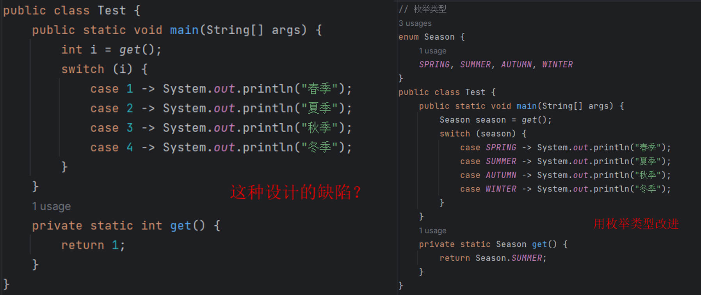

```java
package com.powernode.javase.enumtest01;

/**
 * 以下程序不使用枚举类型，大家分析这个程序存在的问题，或者说，这个程序哪里可以改进？
 *      两个问题：
 *          第一个问题：可读性差。
 *          第二个问题：错误没有在编译阶段提醒。
 *     程序的设计有一个原则：
 *          错误越早发现越好。完美的状态是：所有的错误，包括业务的错误尽可能在编译阶段检查出来。
 */
public class EnumTest01 {
    public static void main(String[] args) {
        int i = get();
        switch (i) {
            case 1 -> System.out.println("春季");
            case 2 -> System.out.println("夏季");
            case 3 -> System.out.println("秋季");
            case 4 -> System.out.println("冬季");
        }
    }

    /**
     * 这个方法可能会返回一个int类型值：
     *  1 2 3 4
     * @return
     */
    public static int get() {
        return 5;
    }
}
```


③**什么情况下考虑使用枚举类型？**

1. **这个数据是有限的，并且可以一枚一枚列举出来的。**

2. **枚举类型是类型安全的，它可以有效地防止使用错误的类型进行赋值。**

```java
package com.powernode.javase.enumtest01;

/**
 * 颜色枚举
 */
public enum Color {
    BLUE, GREEN, RED
}
```

```java
package com.powernode.javase.enumtest01;

/**
 * 枚举类型：季节
 */
public enum Season {
    // 直接定义枚举值，每一个枚举值可以看做类中的常量。
    SPRING, SUMMER, AUTUMN, WINTER
}
```

```java
package com.powernode.javase.enumtest01;

/**
 * 使用枚举类型，分析优点：
 *      第一个优点：可读性强了。
 *      第二个优点：做了类型的限定，做了类型的检查，在编译阶段就确定了类型的安全。
 */
public class EnumTest02 {
    public static void main(String[] args) {
        System.out.println(Color.BLUE); // BLUE
        System.out.println(Color.GREEN); // GREEN
        System.out.println(Color.RED); // RED

        Season season = get();
        switch (season){
            case SPRING -> System.out.println("春季");
            case SUMMER -> System.out.println("夏季");
            case AUTUMN -> System.out.println("秋季");
            case WINTER -> System.out.println("冬季");
        }
    }

    public static Season get() {
        return Season.SPRING; // 春季
    }
}
```


④**枚举如何定义？以下是最基本的格式：**

```java
enum 枚举类型名 {

  枚举值1, 枚举值2, 枚举值3, 枚举值4

}
```


⑤**通过反编译(javap)可以看到：**

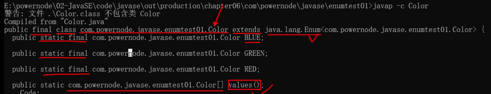

1. **所有枚举类型`默认继承java.lang.Enum`,因此`枚举类型无法继承其他类`。**

2. **所有的枚举类型`都被final修饰`，所以`枚举类型是无法继承的`**

3. **所有的`枚举值都是常量`**

4. **所有的枚举类型中`都有一个values数组`（可以`通过values()获取所有枚举值并遍历`）**

```java
package com.powernode.javase.enumtest01;

public class EnumTest03 {
    public static void main(String[] args) {
        
        // 获取所有的枚举值，遍历
        Color[] colors = Color.values();

        for (Color color : colors) {
            System.out.println(color);
            /*
            BLUE
            GREEN
            RED
             */
        }
    }
}
```


### 枚举的高级用法

①**普通类中可以编写的元素，枚举类型中也可以编写。**

| 静态代码块 | 构造代码块 |
| :--------: | :--------: |
|  实例方法  |  静态方法  |
|  实例变量  |  静态变量  |

```java
package com.powernode.javase.enumtest02;

/**
 * 季节枚举
 *
 * 枚举高级用法，语法点：
 *      1. 如果一个枚举类型中定义了普通类的东西，必须指定枚举值。
 *      2. 枚举值的定义只能出现在类体的最上面。
 *      3. 所有枚举值后面必须有“;”结尾。
 */
public enum Season {

    // 枚举值
    SPRING, SUMMER, AUTUMN, WINTER;

    // 对于枚举类型来说，里面可以定义什么呢？普通类中可以定义的，枚举类型也可以。
    // 静态代码块 构造代码块
    // 静态方法，实例方法
    // 静态变量，实例变量

    // 静态代码块
    static {
        System.out.println("枚举类型Season的静态代码块执行了");
    }

    // 构造代码块
    {
        System.out.println("构造代码块执行了");
    }

    // 静态变量
    public final static int A = 10;
    // 实例变量
    private final int b = 20;
    // 静态方法
    public static int getA() {
        return A;
    }
    // 实例方法
    public int getB() {
        return b;
    }
}
```


②**枚举类中的构造方法是私有化的（默认就是私有化的，只能在本类中调用）**

```java
1.构造方法调用时不能用new。直接使用“枚举值(实参);”调用。

2.每一个枚举值相当于枚举类型的实例。
```

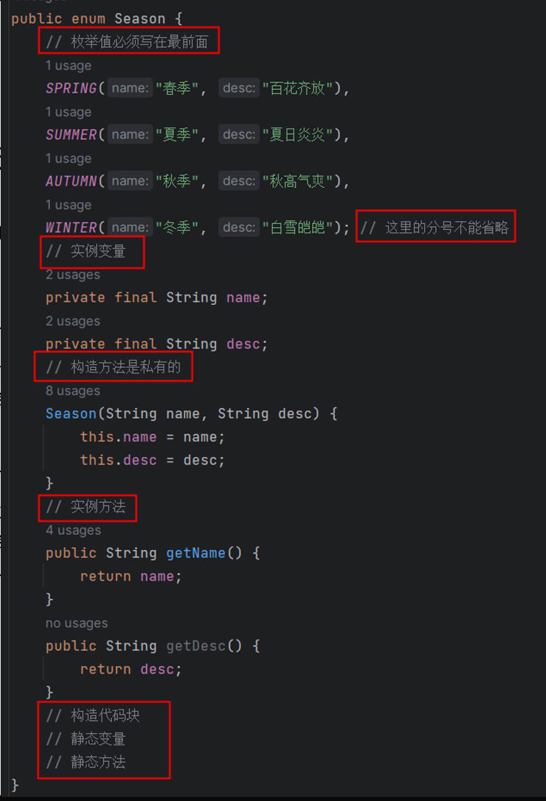


③**枚举类型中如果编写了其他代码，必须要有枚举值，`枚举值`的`定义要放到最上面`，最后一个枚举值的`分号不能省略`。**

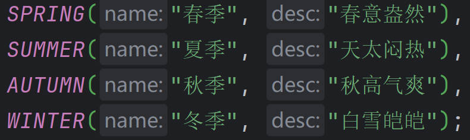


④**枚举类因为`默认继承了java.lang.Enum`，因此`不能再继承其他类`，但`可以实现接口`。**

> **第一种实现方式：在枚举类中实现**
>
> ```java
> package com.powernode.javase.enumtest02;
> 
> public interface Eatable {
>     void eat();
> }
> ```
>
> ```java
> package com.powernode.javase.enumtest02;
> 
> public enum Season implements Eatable {
>     
>     // 定义了有参数的构造方法之后
>     // 通过以下代码来调用构造方法
>     // 注意枚举类的构造方法不能使用new来调用。
>     // 并且枚举类的构造方法只能在本类中调用。
>     SPRING("春季", "春意盎然"),
>     SUMMER("夏季", "天太闷热"),
>     AUTUMN("秋季", "秋高气爽"),
>     WINTER("冬季", "白雪皑皑");
> 
>     // 提供属性
>     private final String name;
> 
>     private final String desc;
> 
>     public String getName() {
>         return name;
>     }
> 
>     public String getDesc() {
>         return desc;
>     }
>     
>     // 枚举类型也可以定义构造方法
>     // 构造方法是私有的。
>     Season(String name, String desc) {
>         this.name = name;
>         this.desc = desc;
>     }
> 
> 
>     // 在枚举类中实现
>     public void eat(){
>         System.out.println("吃啥都行！");
>     }
> }
> ```
>
> 


>  **第二种实现方式：让每一个枚举值实现接口**
>
> ```java
> package com.powernode.javase.enumtest02;
> 
> public interface Eatable {
>     void eat();
> }
> ```
>
> ```java
> package com.powernode.javase.enumtest02;
> 
> public enum Season implements Eatable {
> 
>     // 定义了有参数的构造方法之后
>     // 通过以下代码来调用构造方法
>     // 注意枚举类的构造方法不能使用new来调用。
>     // 并且枚举类的构造方法只能在本类中调用。
>     SPRING("春季", "春意盎然"){
>         @Override
>         public void eat(){
>             System.out.println("春季吃苹果");
>         }
>     },
>     SUMMER("夏季", "天太闷热"){
>         @Override
>         public void eat(){
>             System.out.println("夏季吃西瓜");
>         }
>     },
>     AUTUMN("秋季", "秋高气爽"){
>         @Override
>         public void eat(){
>             System.out.println("秋季吃苹果");
>         }
>     },
>     WINTER("冬季", "白雪皑皑"){
>         @Override
>         public void eat(){
>             System.out.println("冬季吃苹果");
>         }
>     };
> 
>     // 提供属性
>     private final String name;
> 
>     private final String desc;
> 
>     public String getName() {
>         return name;
>     }
> 
>     public String getDesc() {
>         return desc;
>     }
> 
>     // 枚举类型也可以定义构造方法
>     // 构造方法是私有的。
>     Season(String name, String desc) {
>         this.name = name;
>         this.desc = desc;
>     }
> }
> ```

> **测试结果:**
>
> ```java
> package com.powernode.javase.enumtest02;
> 
> public class SeasonTest {
>     public static void main(String[] args) {
>         Season season = get();
>         switch (season) {
>             case SPRING -> System.out.println(Season.SPRING.getDesc());
>             case SUMMER -> System.out.println(Season.SUMMER.getDesc());
>             case AUTUMN -> System.out.println(Season.AUTUMN.getDesc());
>             case WINTER -> System.out.println(Season.WINTER.getDesc());
>         }
> 
>         // 遍历
>         Season[] seasons = Season.values();
>         for(Season s : seasons){
>             System.out.println(s.getName() + "-->" + s.getDesc());
>             s.eat();
>         }
>     }
> 
>     public static Season get(){
>         return Season.SUMMER;
>     }
> }
> ```
>
> 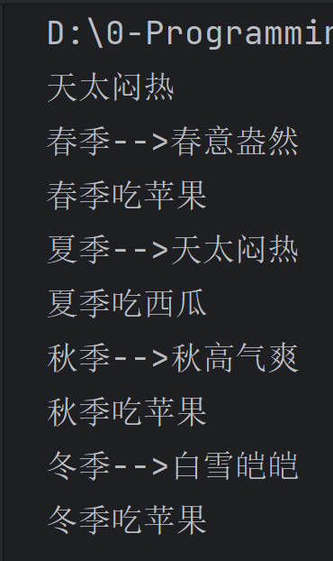


## Random

> **java.util.Random 随机数生成器（生成随机数的工具类）**

①常用构造方法：

+ Random()

```java
// 获取一个随机数生成器对象
Random random = new Random();
```


②常用方法：

+ **int nextInt(); 获取一个int类型取值范围内的随机int数**

```java
package com.powernode.javase.randomtest;

import java.util.Random;

/**
 * 专门生成随机数的一个类：java.util.Random;
 */
public class RandomTest {
    public static void main(String[] args) {

        // 获取一个随机数生成器对象
        Random random = new Random();

        for (int i = 0; i < 10; i++) {
            // 生成[-2147483648 ~ 2147483647]
            int num = random.nextInt();
            System.out.println(num);
            /*
            -2118945959
            773048899
            2101913884
            -2004592072
            1359916283
            -1600342181
            1739868043
            1363262715
            -1509456000
            -165435202
             */
        }
    }
}
```

+ **int nextInt(int bound); 获取[0,bound)区间的随机数**

```java
package com.powernode.javase.randomtest;

import java.util.Random;

/**
 * 专门生成随机数的一个类：java.util.Random;
 */
public class RandomTest {
    public static void main(String[] args) {

        // 获取一个随机数生成器对象
        Random random = new Random();

        // nextInt(int bound)
        // nextInt(101) 取[0, 100] 之间的随机数
        for (int i = 0; i < 10; i++) {
            int num = random.nextInt(101);
            System.out.println(num);
            /*
            28
            42
            56
            74
            42
            16
            3
            36
            46
            25
             */
        }
    }
}

```

+ **double nextDouble(); 获取[0.0, 1.0)的随机数。**

```java
package com.powernode.javase.randomtest;

import java.util.Random;

/**
 * 专门生成随机数的一个类：java.util.Random;
 */
public class RandomTest {
    public static void main(String[] args) {

        // 获取一个随机数生成器对象
        Random random = new Random();

        // nextDouble() [0.0 ~ 1.0)
        for (int i = 0; i < 10; i++) {
            double num = random.nextDouble();
            System.out.println(num);
            /*
            0.36154503385984094
            0.5313656848106317
            0.9583955452586301
            0.23470888243793508
            0.7663941168592813
            0.26212469844902375
            0.8387264120080571
            0.6614556887855899
            0.5126405809366774
            0.14793727657497047
             */
        }
    }
}
```


③**练一练：`生成5个不重复的随机数`。**

```java
package com.powernode.javase.randomtest;

import java.util.Random;

/**
 * 生成五个不重复的随机数。[0-5]
 */
public class RandomTest02 {
    public static void main(String[] args) {
        // 创建随机数生成器对象
        Random random = new Random();

        // 准备一个数组，长度5，给上默认值 -1
        int [] arr = {-1,-1,-1,-1,-1};

        // 循环生成随机数
        int index = 0;
        while(index < arr.length){
            int num = random.nextInt(5);
            if(!contains(arr, num)){
                arr[index++] = num;
            }
        }

        // 遍历
        for(int num : arr){
            System.out.println(num);
            /*
            1
            3
            2
            0
            4
             */
        }
    }

    /**
     * 判断数组arr中是否包含num
     * @param arr
     * @param num
     * @return
     */
    private static boolean contains(int[] arr, int num) {
        for(int i = 0; i < arr.length; i++){
            if(arr[i] == num){
                return true;
            }
        }
        return false;
    }
}
```

> **程序执行流程:**
>
> ```mermaid
> graph TD
>     A[程序开始] --> B[创建Random对象]
>     B --> C[初始化数组arr为-1,-1,-1,-1,-1]
>     C --> D[设置index=0]
>     D --> E{"index < 5?"}
>     E -->|是| F[生成0-4随机数num]
>     F --> G[调用contains方法]
>     G --> H{"num在数组中?"}
>     H -->|否| I["存入arr(index)位置"]
>     I --> J["index++"]
>     J --> E
>     H -->|是| E
>     E -->|否| K[遍历输出数组]
>     K --> L[程序结束]
>     
>     M["contains方法开始"] --> N["i=0"]
>     N --> O{"i < 数组长度?"}
>     O -->|是| P["arr(i)等于num?"]
>     P -->|是| Q[返回true]
>     P -->|否| R["i++"]
>     R --> O
>     O -->|否| S[返回false]
>     Q --> T["contains方法结束"]
>     S --> T
> ```


## System

> **java.lang.System类的常用方法：**

①常用属性：

```java
static final PrintStream err 标准错误输出流（System.err.println(“错误信息”);输出红色字体）

static final InputStream in 标准输入流

static final PrintStream out 标准输出流
```

```java
package com.powernode.javase.systemtest;

import java.io.InputStream;
import java.io.PrintStream;
import java.util.Scanner;

/**
 * java.lang.System 系统类。
 */
public class SystemTest {
    public static void main(String[] args) {

        // 标准的错误输出
        System.err.println("这是一个错误信息"); // 这是一个错误信息(输出红色字体)

        try {
            int a = 10;
            int b = 0;
            System.out.println(a / b);
        } catch(ArithmeticException e){
            System.err.println("除数不能为0"); // 除数不能为0(输出红色字体)
        }

        System.out.println("hello world!"); // hello world

        PrintStream printStream = System.out;
        printStream.println(100); // 100
        printStream.println(false); // false
        printStream.println("123"); // "123"
        printStream.println(1.23); // 1.23

        Scanner s = new Scanner(System.in);
        System.out.println(s.next());
        /*
        123
        123
        */

        InputStream inputStream = System.in;
        Scanner s2 = new Scanner(inputStream);
        System.out.println(s2.next());
        /*
        123
        123
        */
    }
}
```


②常用方法：

```java
static void arraycopy(Object src, int srcPos, Object dest, int destPos, int length); 数组拷贝

static void exit(int status); 退出虚拟机

static void gc(); 建议启动垃圾回收器

static long currentTimeMillis(); 获取自1970-01-01 00:00:00 000到系统当前时间的总毫秒数

static long nanoTime(); 获取自1970年1月1日0时0分0秒以来，当前时间的纳秒数

static Map<String,String> getenv(); 获取当前系统的环境变量，例如Path，JAVA_HOME，CLASSPATH等。

static Properties getProperties(); 获取当前系统的属性。

static String getProperty(String key); 通过key获取指定的系统属性。
```

```java
package com.powernode.javase.systemtest;

import java.util.Enumeration;
import java.util.Map;
import java.util.Properties;

public class SystemTest02 {
    public static void main(String[] args) {
        // 获取自1970-1-1 0:0:0 000到系统当前时间的总毫秒数
        long l = System.currentTimeMillis();
        System.out.println(l); // 1760787495915

        // 获取自1970-1-1 0:0:0 000到系统当前时间的总纳秒数
        long l1 = System.nanoTime();
        System.out.println(l1); // 1760787495915

        // 获取系统的环境变量
        Map<String, String> map = System.getenv();
        System.out.println(map);
        System.out.println(map.get("Path"));

        // 获取系统所有的属性
        Properties pro = System.getProperties();
        System.out.println(pro);

        System.out.println("==========================");
        Enumeration<Object> keys = pro.keys(); // 获取所有属性的名字。
        // 遍历名字。
        while(keys.hasMoreElements()){
            Object o = keys.nextElement();
            System.out.println(o);
        }
        System.out.println("==========================");

        // 根据系统属性的名字获取属性的值
        String vmName = System.getProperty("java.vm.name");
        System.out.println(vmName); // Java HotSpot(TM) 64-Bit Server VM

        System.out.println(System.getProperty("os.name")); // Windows 11
    }
}
```


## UUID

### UUID

1. **UUID（通用唯一标识符）是一种软件构建的标准，用来生成`具有唯一性的ID`。**

2. UUID具有以下特点：

+ **UUID可以在`分布式系统中生成唯一的标识符`，`避免因为主键冲突`等问题带来的麻烦。**

+ **UUID具有足够的唯一性，重复的概率相当低。UUID使用的是`128位数字`，除了传统的`16进制表示之外（32位的16进制表示）`，还有基于`62进制的表示`，可以更加简洁紧凑。**

+ **UUID生成时`不需要依赖任何中央控制器或数据库服务器`，可以在本地方便、快速地生成唯一标识符。**

+ **UUID生成后可以被许多编程语言`支持并方便地转化为字符串表示形式`，适用于多种应用场景。**

> **在Java开发中，UUID的使用是非常普遍的。它可以用于生成数据表主键、场景标识、链路追踪、缓存Key等。使用UUID可以方便地避免主键、缓存Key等因冲突而产生的问题，同时能够实现多种功能，例如追踪、缓存、日志记录等。**


### Java中的java.util.UUID类提供对UUID的支持

①**生成UUID：static UUID randomUUID();**

②**将UUID转换为字符串：String toString();**

```java
package com.powernode.javase.uuidtest;

import java.util.UUID;

/**
 * 使用java中的java.util.UUID工具类生成一个具有全球唯一性的标识。
 */
public class UUIDTest {
    public static void main(String[] args) {

        // 获取UUID对象
        UUID uuid = UUID.randomUUID();

        String s = uuid.toString();

        System.out.println(s); // 822ad08f-4ff9-4ea3-9237-fe6ffb2ea6b0

        // 去除-
        String s1 = s.replaceAll("-", "").toUpperCase();

        System.out.println(s1); // 822AD08F4FF94EA39237FE6FFB2EA6B0
    }
}
```
