## 异常概述

### 什么是异常？有什么用？

1. Java中的`异常`是指`程序运行时出现了错误或异常情况`，导致`程序无法继续正常执行`的现象。例如，`数组下标越界、空指针异常、类型转换异常`等都属于异常情况。

2. Java提供了`异常处理机制`，即在程序中对可能出现的`异常情况进行捕捉和处理`。异常机制可以帮助程序员更好地管理程序的`错误和异常情况`，避免程序崩溃或出现不可预测的行为。

3. 没有异常机制的话，程序中就可能会出现一些难以调试和预测的异常行为，可能导致程序崩溃，甚至可能造成数据损失或损害用户利益。因此，异常机制是一项非常重要的功能，是`编写可靠程序的基础`。

### 异常在Java中以类和对象的形式存在

1. 现实生活中也有异常，比如`地震，火灾`就是`异常`。也可以提取出`类和对象`，例如：

+ `地震`是`类`：`512大地震、唐山大地震`就是`对象`。

+ `空指针异常`是`类`：发生在`第52行的空指针异常`、发生在`第100行的空指针异常`就是`对象`。

2. 也就是说：在第52行和第100行发生空指针异常的时候，`底层一定分别new了一个NullPointerException对象`。

### 在程序中异常是如何发生的？

+ **第一个阶段：`创建异常对象`**

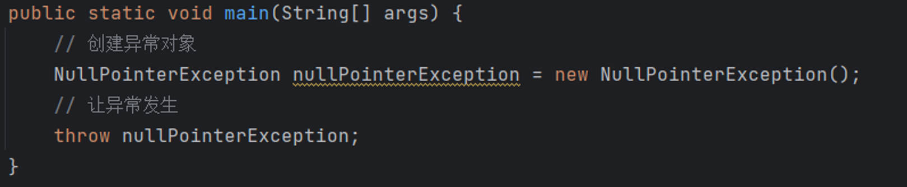

+ **第二个阶段：`让异常发生`**

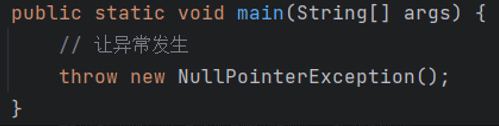

```java
package com.powernode.javase;

/**
 * 异常在程序中到底是如何发生的？
 */
public class ExceptionTest02 {
    public static void main(String[] args) {
        // 异常的发生要经历两个阶段
        // 第一个阶段：创建异常对象
        //NullPointerException e = new NullPointerException();
        // 第二个阶段：让异常发生（手动抛出异常）
        //throw e;

        // 合并一步
        throw new NullPointerException();

    }
}
```

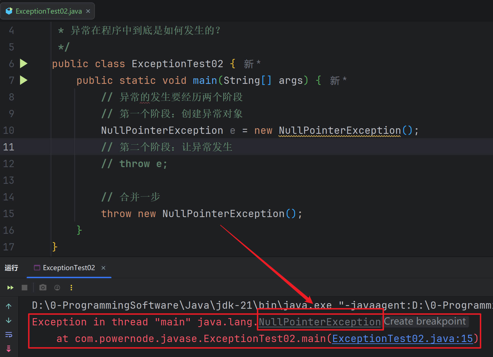


## 异常继承结构

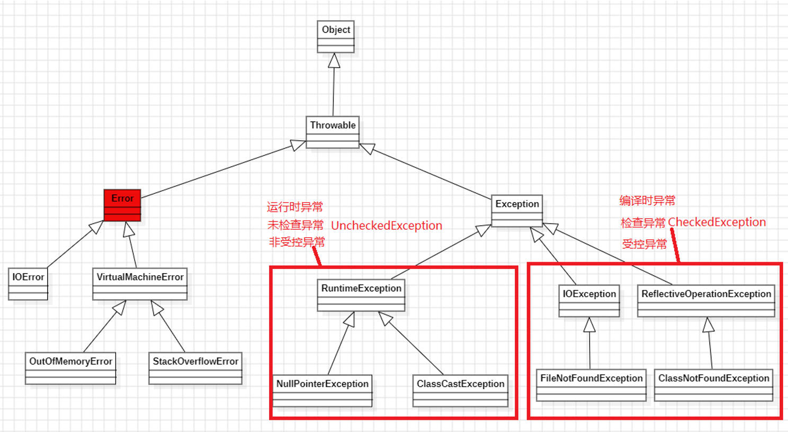

①所有的`异常和错误`都是`可抛出的`。都`继承了Throwable类`。

②`Error`是`无法处理的`，出现后只有一个结果：`JVM终止`。

③`Exception`是`可以处理的`。

④Exception的分类：

1. **所有的`RuntimeException`的子类：运行时异常/未检查异常`(UncheckedException)`/非受控异常**

   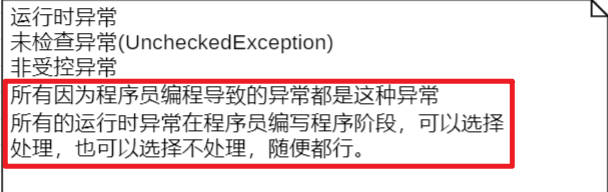

2. **Exception的子类`（除RuntimeException之外）`：编译时异常/检查异常`(CheckedException)`/受控异常**

   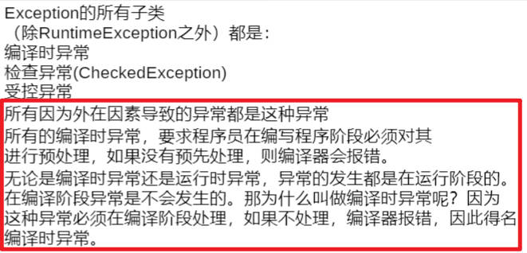

⑤`编译时异常`和`运行时异常`区别：

1. `编译时异常`特点：在`编译阶段必须提前处理`，如果`不处理编译器报错`。

2. `运行时异常`特点：在`编译阶段可以选择处理`，也`可以不处理`，没有硬性要求。

3. `编译时异常`一般是`由外部环境或外在条件引起的`，如`网络故障、磁盘空间不足、文件找不到`等

4. `运行时异常`一般是`由程序员的错误引起的`，并且`不需要强制进行异常处理`

**注意：编译时异常并不是在编译阶段发生的异常，`所有的异常发生都是在运行阶段的`，因为每个异常发生都是会`new异常对象的`，new异常对象只能在`运行阶段完成`。那为什么叫做编译时异常呢？这是因为这种异常必须在`编译阶段提前预处理`，如果`不处理编译器报错`，因此而得名`编译时异常`。**


## 自定义异常

### 自定义异常的步骤 

①**第一步：编写`异常类`继承`Exception/RuntimeException`**

②**第二步：提供`一个无参数构造方法`，再提供`一个带String msg参数的构造方法`，在构造方法中`调用父类的构造方法`。**

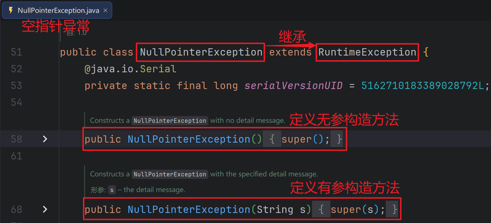

+ 定义一个运行时异常

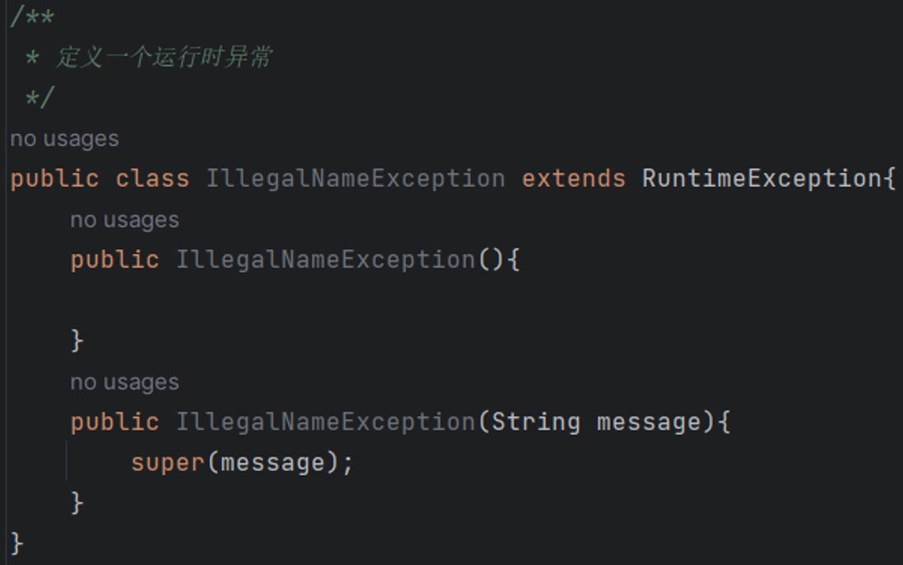

+ 定义一个编译时异常

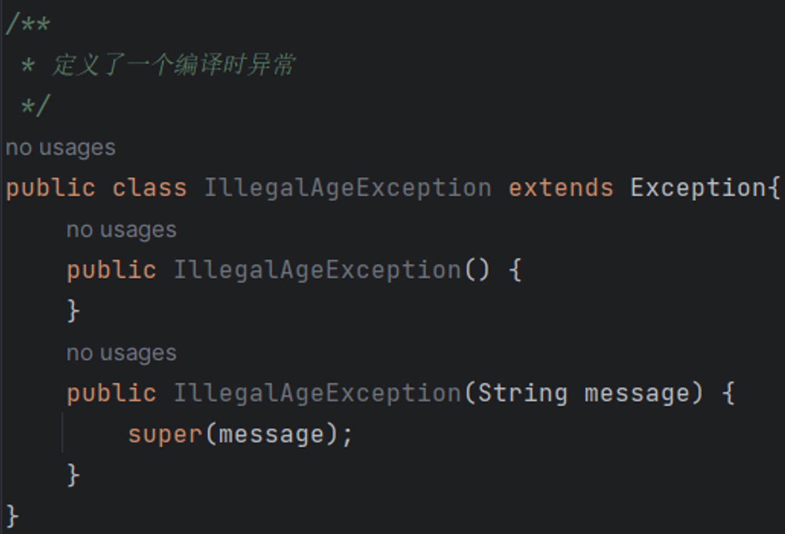


### 自定义异常练习

①定义两个编译时异常：

1. `IllegalNameException` ：**无效名字异常**

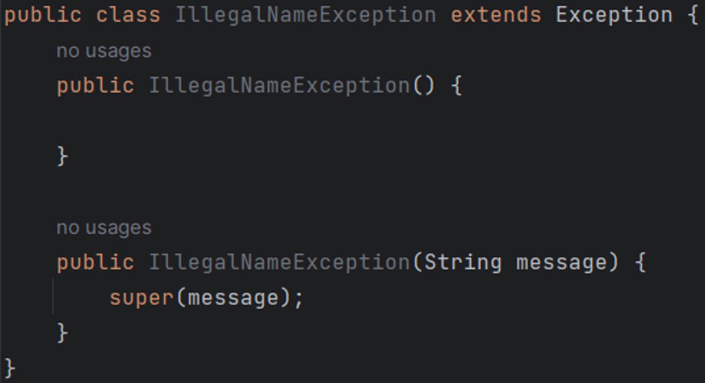

2. `IllegalAgeException`： **无效年龄异常**

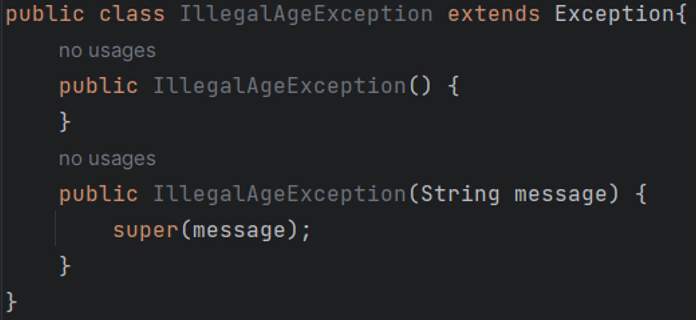

②完成这样的需求：

1. **编写一个用户注册的方法，该方法接收两个参数，一个是用户名，一个是年龄。如果用户名长度在`[6 - 12]位`，并且`年龄大于18岁`时，输出`用户注册成功`。**

2. **如果`用户名长度不是[6 - 12]位`时，让程序出现异常，让`IllegalNameException异常发生`！**

3. **如果`年龄小于18岁`时，让程序出现异常，让`IllegalAgeException异常发生`！**

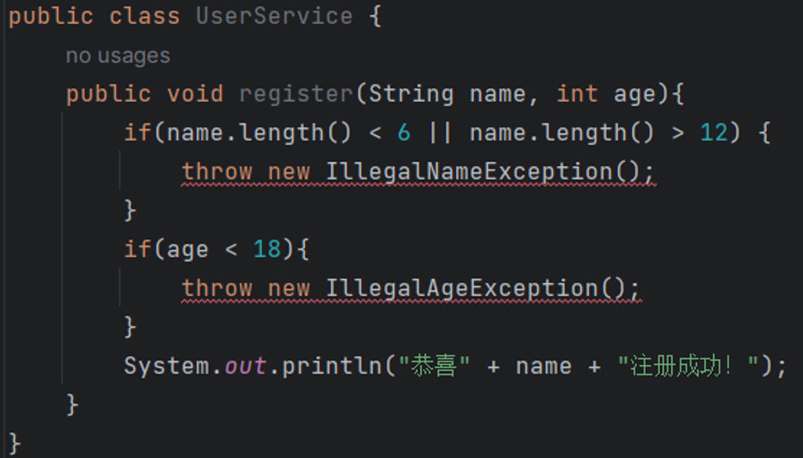


## 异常的处理

异常的处理包括两种方式：

1. **`声明异常`：类似于`推卸责任的处理方式`**

+ 在方法定义时使用`throws关键字声明异常`，告知调用者，调用这个方法`可能会出现异常`。这种处理方式的态度是：**如果出现了异常则会抛给`调用者来处理`。**

2. **`捕捉异常`：真正的`处理捕捉异常`**

+ 在可能出现异常的代码上使用`try..catch`进行`捕捉处理`。这种处理方式的态度是：**把异常抓住。其它方法如果调用这个方法，对于`调用者来说是不知道这个异常发生的`。因为这个`异常被抓住并处理掉了`。**

3. 异常在处理的整个过程中应该是：`声明和捕捉联合使用`。

4. 什么时候捕捉？什么时候声明？

+ 如果异常发生后`需要调用者来处理`的，`需要调用者知道`的，则采用`声明方式`。否则`采用捕捉`。


### 第一种处理方式：声明异常 （**throws**关键字）

如果一个异常发生后希望调用者来处理的，使用声明异常（俗话说：**交给上级处理**）

```java
public void m() throws AException, BException... {}
```

如果`AException`和`BException`都继承了`XException`，那么也可以这样写：

```java
public void m() throws XException{}
```

调用者在调用m()方法时，编译器会检测到该方法上用throws声明了异常，表示可能会抛出异常，编译器会继续检测该异常是否为编译时异常，如果为编译时异常则必须在编译阶段进行处理，如果不处理编译器就会报错。

如果`所有位置都采用throws`，包括`main方法的处理态度也是throws`，如果运行时出现了异常，`最终异常是抛给了main方法的调用者（JVM）`，`JVM`则会`终止程序的执行`。因此为了`保证程序在出现异常后不被中断`，至少`main方法不要再使用throws`进行声明了。

发生异常后，在发生异常的位置上，`往下的代码是不会执行的`，除非进行了异常的捕捉。

```java
package com.powernode.javase;

import com.powernode.javase.exception.IllegalAgeException;
import com.powernode.javase.exception.IllegalNameException;

import java.util.Scanner;

public class ExceptionTest03 {
    // public static void main(String[] args) throws IllegalNameException, IllegalAgeException {
    public static void main(String[] args) throws Exception {
    // public static void main(String[] args) throws IllegalRealnameException, IllegalAgeException {
        Scanner scanner =new Scanner(System.in);
        System.out.println("欢迎使用本系统，先进行用户注册：");
        System.out.print("请输入用户名：");
        String name = scanner.next();
        System.out.print("请输入年龄：");
        int age = scanner.nextInt();

        // 注册
        UserService userService = new UserService();
        userService.register(name, age); // 这里的代码可能出现异常，如果一旦出现异常，后续代码则不再执行。

        System.out.println("main over!");
    }
}

/**
 *用户的业务层
 */
class UserService {
    public void register(String name, int age) throws IllegalNameException, IllegalAgeException {
        System.out.println("正在注册，请稍后....");
        UserDao userDao = new UserDao();
        userDao.save(name, age); //这里有可能出现异常，出现了异常之后，后续程序则不再执行了。
        System.out.println("注册成功，欢迎[" + name +"]");
    }
}


/**
 * 操作数据库的一个类
 */
class UserDao{
    /**
     * 用户要注册，肯定最后用户名和年龄这个用户相关的信息是需要保存的。
     * @param name 用户名
     * @param age 年龄
     */
    public void save(String name, int age) throws IllegalNameException, IllegalAgeException {
        System.out.println("用户["+name+"]的信息正在保存....");
        if(name.length()< 6 || name.length()> 12){
            throw new IllegalNameException();
            // 这里不能写任何代码，因为这里的代码永远都不会执行。
            //System.out.println("hello world");
        }
        if(age < 18){
            throw new IllegalAgeException();
        }
        System.out.println("用户["+name+"]的信息保存成功！");
    }
}
```

> **测试结果:**
>
> 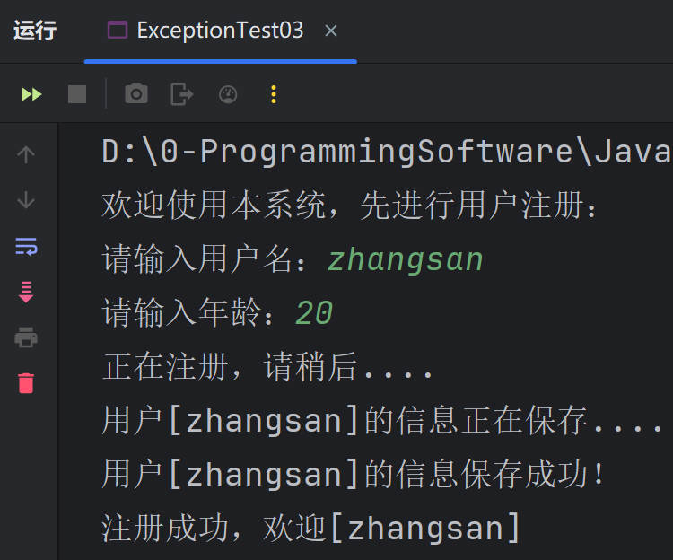
>
> 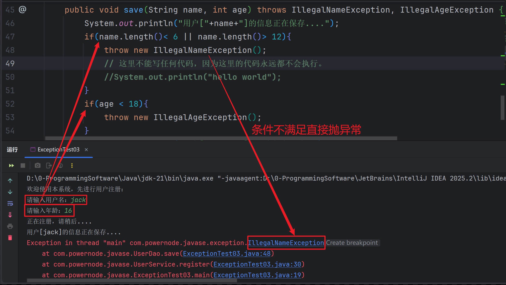


### 第二种处理方式：捕捉异常 (try...catch...关键字)

如果一个异常发生后，`不需要调用者知道`，也`不需要调用者来处理`，选择使用`捕捉方式处理`。

```java
try{
// 尝试执行可能会出现异常的代码
// try块中的代码如果执行出现异常，出现异常的位置往下的代码是不会执行的，直接进入catch块执行
}catch(AException e){
// 如果捕捉到AException类型的异常，在这里处理
}catch(BException e){
// 如果捕捉到BException类型的异常，在这里处理
}catch(XException e){
// 如果捕捉到XException类型的异常，在这里处理
}
// 当try..catch..将所有发生的异常捕捉后，这里的代码是会继续往下执行的。

另外注意：
   1.catch语句块可以看做是分支，try catch语句中，最多只有一个catch分支执行。
   2.catch可以写多个，但是必须遵循自上而下，从小到大。
```

**catch可以`写多个`。并且遵循`自上而下`，`从小到大`。**

```java
try {
      // 可能出现异常的代码
      userService.register(name, age);
      // 如果以上代码出现异常，这里不会执行。
      System.out.println("如果出现异常，这里的代码会不会执行！");
} catch (IllegalNameException e) {
       System.out.println("对不起，用户名不合法！");
} catch (IllegalAgeException e) {
       System.out.println("对不起，年龄不合法！");
}


try {
     // 可能出现异常的代码
     userService.register(name, age);
     // 如果以上代码出现异常，这里不会执行。
     System.out.println("如果出现异常，这里的代码会不会执行！");
} catch(Exception e){
     System.out.println("异常发生了");
}


try {
     // 可能出现异常的代码
     userService.register(name, age);
     // 如果以上代码出现异常，这里不会执行。
     System.out.println("如果出现异常，这里的代码会不会执行！");
}catch(IllegalNameException e){
     System.out.println("名字有问题！");
   //System.out.println(e);//com.powernode.javase.exception.IllegalNameException
}catch(Exception e){
     System.out.println("异常发生了");
}


// 编译报错
try {
     // 可能出现异常的代码
     userService.register(name, age);
     // 如果以上代码出现异常，这里不会执行。
     System.out.println("如果出现异常，这里的代码会不会执行！");
}catch(Exception e){
     System.out.println("异常发生了");
}catch(IllegalAgeException e){

}
```

Java7新特性：`catch后面小括号`中可以编写`多个异常`，使用`运算符“|”隔开`。

```java
// java7的新特性
try {
     // 可能出现异常的代码
     userService.register(name, age);
     // 如果以上代码出现异常，这里不会执行。
     System.out.println("如果出现异常，这里的代码会不会执行！");
}catch(IllegalNameException | IllegalAgeException e){
     System.out.println("对不起，参数不合法！");
}
```

> **小练习:**

```java
package com.powernode.javase.trytest;

import com.powernode.javase.exception.IllegalAgeException;
import com.powernode.javase.exception.IllegalNameException;

import java.util.Scanner;

public class ExceptionTest04 {
    public static void main(String[] args) {
        Scanner scanner =new Scanner(System.in);
        System.out.println("欢迎使用本系统，先进行用户注册：");
        System.out.print("请输入用户名：");
        String name = scanner.next();
        System.out.print("请输入年龄：");
        int age = scanner.nextInt();

        // 注册
        UserService userService = new UserService();
        /*try {
            // 可能出现异常的代码
            userService.register(name, age);
            // 如果以上代码出现异常，这里不会执行。
            System.out.println("如果出现异常，这里的代码会不会执行！");
        } catch (IllegalNameException e) {
            System.out.println("对不起，用户名不合法！");
        } catch (IllegalAgeException e) {
            System.out.println("对不起，年龄不合法！");
        }*/

        /*try {
            // 可能出现异常的代码
            userService.register(name, age);
            // 如果以上代码出现异常，这里不会执行。
            System.out.println("如果出现异常，这里的代码会不会执行！");
        } catch(Exception e){
            System.out.println("异常发生了");
        }*/

        /*try {
            // 可能出现异常的代码
            userService.register(name, age);
            // 如果以上代码出现异常，这里不会执行。
            System.out.println("如果出现异常，这里的代码会不会执行！");
        }catch(IllegalNameException e){
            System.out.println("名字有问题！");
            // System.out.println(e); //com.powernode.javase.exception.IllegalNameException
        }catch(Exception e){
            System.out.println("异常发生了");
        }*/

        // 编译报错
        /*try {
            // 可能出现异常的代码
            userService.register(name, age);
            // 如果以上代码出现异常，这里不会执行。
            System.out.println("如果出现异常，这里的代码会不会执行！");
        }catch(Exception e){
            System.out.println("异常发生了");
        }catch(IllegalAgeException e){

        }*/

        // java7的新特性
        try {
            // 可能出现异常的代码
            userService.register(name, age);
            // 如果以上代码出现异常，这里不会执行。
            System.out.println("如果出现异常，这里的代码会不会执行！");
        }catch(IllegalNameException | IllegalAgeException e){
            System.out.println("对不起，参数不合法！");
        }

        System.out.println("main over!");
    }
}


class UserService {
    public void register(String name, int age) throws IllegalNameException, IllegalAgeException {
        System.out.println("正在注册，请稍后....");
        UserDao userDao = new UserDao();
        userDao.save(name, age);
        System.out.println("注册成功，欢迎[" + name +"]");
    }
}


class UserDao{
    public void save(String name, int age) throws IllegalNameException, IllegalAgeException {
        System.out.println("用户["+name+"]的信息正在保存....");
        if(name.length()< 6 || name.length()> 12){
            throw new IllegalNameException();
        }
        if(age < 18){
            throw new IllegalAgeException();
        }
        System.out.println("用户["+name+"]的信息保存成功！");
    }
}
```

> **测试结果:**
>
> 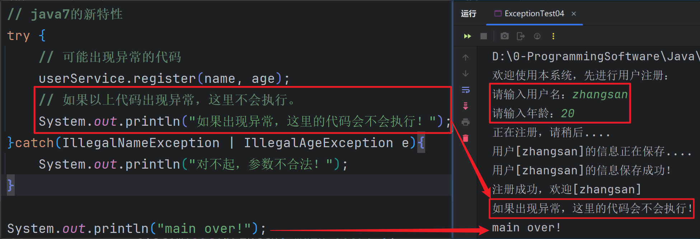
>
> 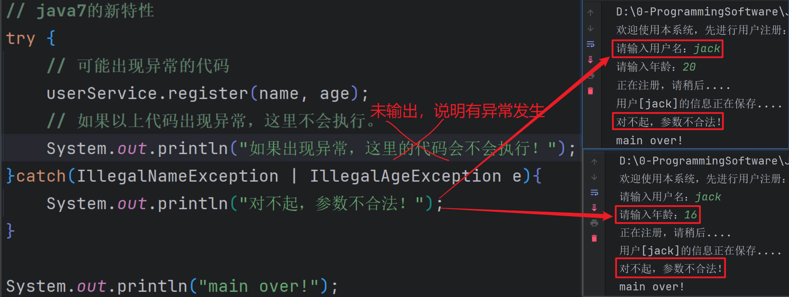


## 异常的常用方法

1. 获取异常的简单描述信息：

+ `nexception.getMessage();`
+ 获取的message是通过`构造方法创建异常对象时传递过去的message`。

```java
try {
    userService.register(name, age);
} catch (IllegalNameException e) {
        // 这个方法可以获取当时创建异常对象时给异常构造方法传递的String message参数的值。
        String  message = e.getMessage();
        System.out.println(message);
} catch (IllegalAgeException e) {
        String  message = e.getMessage();
        System.out.println(message);
}
```

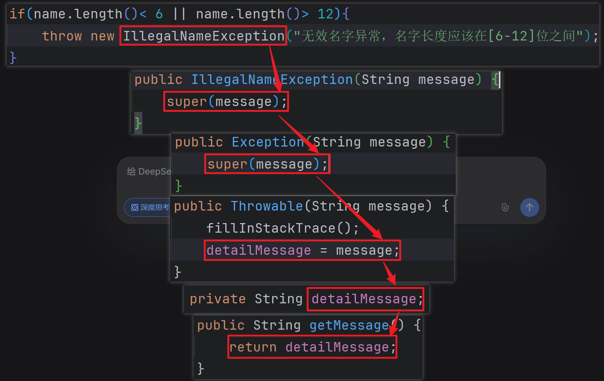

```java
package com.powernode.javase.exceptionmethod;

import com.powernode.javase.exception.IllegalAgeException;
import com.powernode.javase.exception.IllegalNameException;

import java.util.Scanner;

public class ExceptionTest07 {
    public static void main(String[] args) {

        Scanner scanner =new Scanner(System.in);
        System.out.println("欢迎使用本系统，先进行用户注册：");
        System.out.print("请输入用户名：");
        String name = scanner.next();
        System.out.print("请输入年龄：");
        int age = scanner.nextInt();

        // 注册
        UserService userService = new UserService();
        try {
            userService.register(name, age);
        } catch (IllegalNameException e) {
            // 这个方法可以获取当时创建异常对象时给异常构造方法传递的String message参数的值。
            String  message = e.getMessage();
            System.out.println(message);
        } catch (IllegalAgeException e) {
            String  message = e.getMessage();
            System.out.println(message);
        }
    }
}


class UserService {
    public void register(String name, int age) throws IllegalNameException, IllegalAgeException {
        System.out.println("正在注册，请稍后....");
        UserDao userDao = new UserDao();
        userDao.save(name, age);
        System.out.println("注册成功，欢迎[" + name +"]");
    }
}


class UserDao{
    public void save(String name, int age) throws IllegalNameException, IllegalAgeException {
        System.out.println("用户["+name+"]的信息正在保存....");
        if(name.length()< 6 || name.length()> 12){
            throw new IllegalNameException("无效名字异常，名字长度应该在[6-12]位之间");
        }
        if(age < 18){
            throw new IllegalAgeException("无效年龄异常，年龄需要大于18岁");
        }
        System.out.println("用户["+name+"]的信息保存成功！");
    }
}
```

> **测试结果:**
>
> 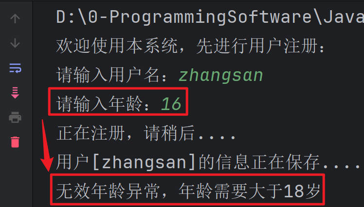
>
> 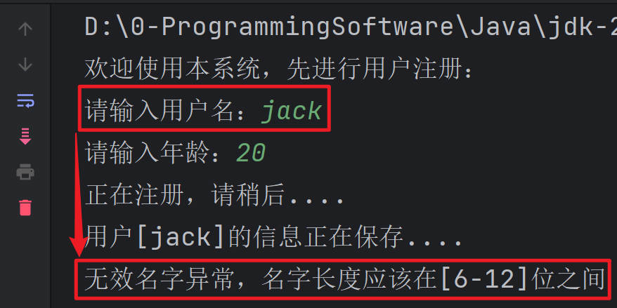


2. 打印异常堆栈信息：

+ `nexception.printStackTrace();`

```java
try {
        userService.register(name, age);
} catch (IllegalNameException e) {
        // 真正的开发中，这里不要空白。
        // 这个方法可以帮助我们程序员去调试程序。
        // 打印异常堆栈信息。
        e.printStackTrace();
} catch (IllegalAgeException e) {
        e.printStackTrace();
}
```

```java
package com.powernode.javase.exceptionmethod;

import com.powernode.javase.exception.IllegalAgeException;
import com.powernode.javase.exception.IllegalNameException;

import java.util.Random;
import java.util.Scanner;

public class ExceptionTest07 {
    public static void main(String[] args) {

        Scanner scanner =new Scanner(System.in);
        System.out.println("欢迎使用本系统，先进行用户注册：");
        System.out.print("请输入用户名：");
        String name = scanner.next();
        System.out.print("请输入年龄：");
        int age = scanner.nextInt();

        // 注册
        UserService userService = new UserService();
        try {
            userService.register(name, age);
        } catch (IllegalNameException e) {
            // 真正的开发中，这里不要空白。
            // 这个方法可以帮助我们程序员去调试程序。
            // 打印异常堆栈信息。
            e.printStackTrace();
        } catch (IllegalAgeException e) {
            e.printStackTrace();
        }

        Random r = new Random();
        int[] arr = new int[10000000];
        for (int i = 0; i < 10000000; i++) {
            arr[i] = r.nextInt(10000000);
        }
        System.out.println("hello world!");
    }
}


class UserService {
    public void register(String name, int age) throws IllegalNameException, IllegalAgeException {
        System.out.println("正在注册，请稍后....");
        UserDao userDao = new UserDao();
        userDao.save(name, age);
        System.out.println("注册成功，欢迎[" + name +"]");
    }
}


class UserDao{
    public void save(String name, int age) throws IllegalNameException, IllegalAgeException {
        System.out.println("用户["+name+"]的信息正在保存....");
        if(name.length()< 6 || name.length()> 12){
            throw new IllegalNameException("无效名字异常，名字长度应该在[6-12]位之间");
        }
        if(age < 18){
            throw new IllegalAgeException("无效年龄异常，年龄需要大于18岁");
        }
        System.out.println("用户["+name+"]的信息保存成功！");
    }
}
```

> **测试结果:**
>
> 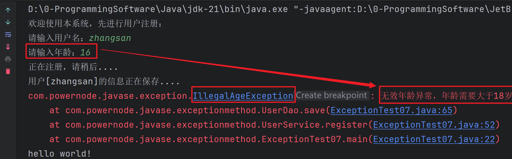

3. 要会看异常的堆栈信息：

+ 异常信息的打印是符合栈数据结构的。

+ 看异常信息主要看最开始的描述信息。看栈顶信息。

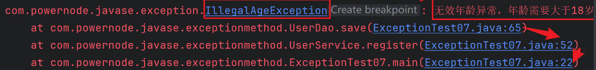


## finally语句块


### finally语句块的用法

1. finally语句块中的代码是一定会执行的。

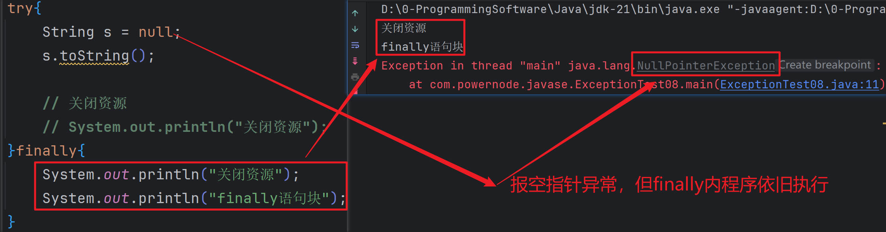

2. finally语句块不能单独使用，至少需要配合try语句块一起使用：

+ **try...finally**

+ **try...catch...finally**

3. 通常在finally语句块中完成`资源的释放`

+ 资源释放的工作比较重要，如果资源没有释放会一直占用内存。
+ 为了保证资源的关闭，也就是说：不管程序是否出现异常，`关闭资源的代码一定要保证执行`。
+ 因此在finally语句块中通常进行资源的释放。

> **IO流演示`try...catch...finally`用法:**

```java
package com.powernode.javase;

import java.io.FileInputStream;
import java.io.FileNotFoundException;
import java.io.IOException;

/**
 * 放在finally语句块当中的代码是一定会执行的，通常在finally语句块当中完成资源的释放。
 * 因为资源的释放是必须要执行的。为了保证资源一定能释放，建议写到finally语句块当中。
 */
public class ExceptionTest08 {
    public static void main(String[] args) {
        // IO程序，以后学习了IO流你就能看懂了
        FileInputStream in = null;
        try{
            // 创建文件输入流对象
            in = new FileInputStream("D:\\0-JavaSE\\powernode-java\\javase\\chapter05\\src\\com\\powernode\\javase\\ExceptionTest08.java");

            // 开始读
            byte[] bytes = new byte[1024]; // 一次读取1KB
            int readCount = 0;
            while((readCount = in.read(bytes)) != -1) {
                System.out.print(new String(bytes, 0, readCount));
            }

            // 关闭流释放资源
            //in.close();
        }catch(FileNotFoundException e){
            e.printStackTrace();
        }catch (IOException e){
            e.printStackTrace();
        }finally {
            if(in != null){
                try {
                    in.close();
                } catch (IOException e) {
                    e.printStackTrace();
                }
            }
        }
        // System.out.println("main over!");
    }
}
```

> **测试结果:**
>
> ```java
> D:\0-ProgrammingSoftware\Java\jdk-21\bin\java.exe "-javaagent:D:\0-ProgrammingSoftware\JetBrains\IntelliJ IDEA 2025.2\lib\idea_rt.jar=13219" -Dfile.encoding=UTF-8 -Dsun.stdout.encoding=UTF-8 -Dsun.stderr.encoding=UTF-8 -classpath D:\0-JavaSE\powernode-java\javase\out\production\chapter05 com.powernode.javase.ExceptionTest08
> package com.powernode.javase;
> 
> import java.io.FileInputStream;
> import java.io.FileNotFoundException;
> import java.io.IOException;
> 
> /**
>  * 放在finally语句块当中的代码是一定会执行的，通常在finally语句块当中完成资源的释放。
>  * 因为资源的释放是必须要执行的。为了保证资源一定能释放，建议写到finally语句块当中。
>  */
> public class ExceptionTest08 {
>     public static void main(String[] args) {
>         /*try{
>             String s = null;
>             s.toString();
> 
>             // 关闭资源
>             // System.out.println("关闭资源");
>         }finally{
>             System.out.println("关闭资源");
>             System.out.println("finally语句块");
>         }*/
> 
> 
>         // IO程序，以后学习了IO流你就能看懂了
>         FileInputStream in = null;
>         try{
>             // 创建文件输入流对象
>             in = new FileInputStream("D:\\0-JavaSE\\powernode-java\\javase\\chapter05\\src\\com\\powernode\\javase\\ExceptionTest08.java");
> 
>             // 开始读
>             byte[] bytes = new byte[1024]; // 一次读取1KB
>             int readCount = 0;
>             while((readCount = in.read(bytes)) != -1) {
>                 System.out.print(new String(bytes, 0, readCount));
>             }
> 
>             // 关闭流释放资源
>             //in.close();
>         }catch(FileNotFoundException e){
>             e.printStackTrace();
>         }catch (IOException e){
>             e.printStackTrace();
>         }finally {
>             if(in != null){
>                 try {
>                     in.close();
>                 } catch (IOException e) {
>                     e.printStackTrace();
>                 }
>             }
>         }
>         // System.out.println("main over!");
>     }
> }
> 
> 进程已结束，退出代码为 0
> ```

4. final、finally、finalize分别是什么？

+ `final是一个关键字`，修饰的类无法继承，修饰的方法无法覆盖，修饰的变量不能修改。

+ `finally是一个关键字`，和try一起使用，finally语句块中的代码一定会执行。

+ `finalize是一个标识符`，它是Object类中的一个方法名。


### 以下程序的执行结果？

```java
package com.powernode.javase;

/**
 * finally语句块
 */
public class ExceptionTest09 {
    public static void main(String[] args) {
        m();
        m1();
    }

    public static void m(){
        try {
            System.out.println("try....");
            return;
        } finally {
            System.out.println("finally...");
        }
    }

    public static void m1(){
        try {
            System.out.println("try....");
            return;
        } finally {
            System.out.println("finally...");
        }
        // 这里就不能写代码。
        //System.out.println("m1 over!");
    }
}
```

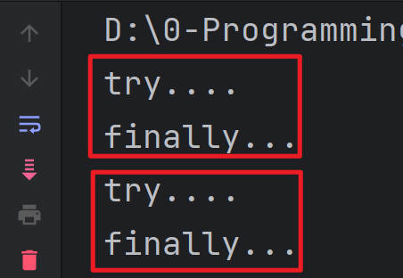

```java
package com.powernode.javase;

/**
 * finally语句块
 */
public class ExceptionTest09 {
    public static void main(String[] args) {
        m2();
    }

    public static void m2(){
        try {
            System.out.println("try....");
            // 退出JVM。
            System.exit(0);
        } finally {
            // 这里的代码无法执行了。
            System.out.println("finally...");
        }
    }
}
```

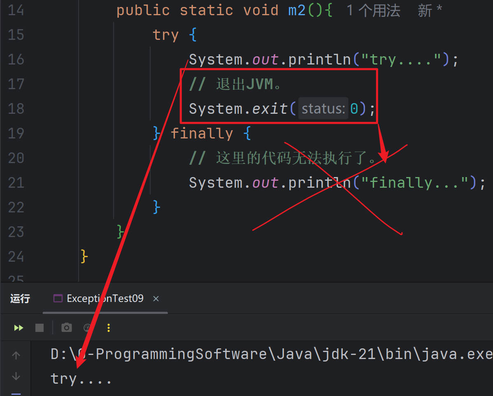

```java
package com.powernode.javase;

/**
 * finally语句块
 */
public class ExceptionTest09 {
    public static void main(String[] args) {

        int result = m3();
        System.out.println(result);
    }

    public static int m3(){
        int i = 100;
        try {
            return i;
        } finally {
            i++;
        }
    }
}
```

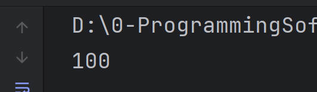

> **原因分析:**
>
> ```java
> public static int m3(){
>     int i = 100;
>     try {
>         return i;  // 这里保存了100到返回槽
>     } finally {
>         i++;       // i变成101，但不影响返回值
>         System.out.println("finally中i的值: " + i); // 输出101
>     }
> }
> ```
>
> 
>
> ```mermaid
> flowchart TD
>     A[开始m3方法] --> B[初始化 i = 100]
>     B --> C[进入try块]
>     C --> D[执行 return i]
>     D --> E[将i的值100保存到返回槽中]
>     E --> F[进入finally块]
>     F --> G[i++<br>i变为101]
>     G --> H[方法返回<br>返回槽中的值100]
>     H --> I[输出结果: 100]
> ```


## 方法覆盖与异常

**方法重写之后，`不能比父类方法抛出更多的异常`，可以`更少`。**

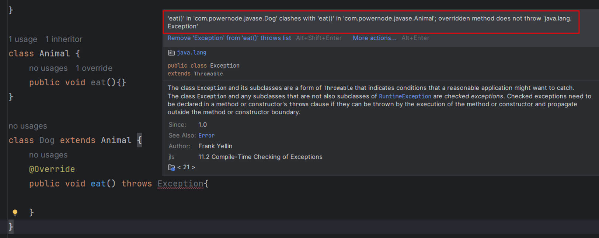


## 图书管理系统

实现一个简单的图书馆管理系统，在该系统中，你需要实现图书的分类管理、借阅和归还等功能。具体要求如下：

1. 定义一个抽象类Book，包含图书的基础属性，如书名、作者、价格、ISBN等。
2. 定义一个继承自Book的子类FictionBook，用来表示小说类图书。小说类图书包含一个level属性，表示小说的受众年龄段（如幼儿、青少年、成人等），重写toString()方法。
3. 定义一个继承自Book的子类NonFictionBook，用来表示非小说类图书。非小说类图书包含一个topic属性，表示非小说类图书的主题（如历史、科学、编程等），重写toString()方法。
4. 定义一个接口Lendable，包含借阅图书和归还图书两个方法。
5. 定义一个实现Lendable接口的类BookItem，表示图书的实例，保存图书的状态（借出或未借出）并提供相应的借阅和归还操作。
6. 定义一个库存类Stock，保存所有图书实例以及它们的当前状态，并提供查找和添加/删除图书实例的方法。
7. 对用户的输入进行异常处理，包括输入不合法的ISBN编号、无法找到指定的图书等情况。
8. 需要实现一个简单的命令行界面，让用户可以方便地进行库存管理和借阅/归还操作。

以上是一个简化版的需求，您可以根据自己的实际情况进行扩展和完善。

```java
import java.util.*;
import java.util.regex.Pattern;

// 抽象类 Book
abstract class Book {
    protected String title;
    protected String author;
    protected double price;
    protected String isbn;
    
    public Book(String title, String author, double price, String isbn) {
        this.title = title;
        this.author = author;
        this.price = price;
        this.isbn = isbn;
    }
    
    // getter 和 setter 方法
    public String getTitle() { return title; }
    public void setTitle(String title) { this.title = title; }
    
    public String getAuthor() { return author; }
    public void setAuthor(String author) { this.author = author; }
    
    public double getPrice() { return price; }
    public void setPrice(double price) { this.price = price; }
    
    public String getIsbn() { return isbn; }
    public void setIsbn(String isbn) { this.isbn = isbn; }
    
    @Override
    public abstract String toString();
    
    @Override
    public boolean equals(Object obj) {
        if (this == obj) return true;
        if (obj == null || getClass() != obj.getClass()) return false;
        Book book = (Book) obj;
        return Objects.equals(isbn, book.isbn);
    }
    
    @Override
    public int hashCode() {
        return Objects.hash(isbn);
    }
}

// 小说类图书
class FictionBook extends Book {
    private String level; // 受众年龄段
    
    public FictionBook(String title, String author, double price, String isbn, String level) {
        super(title, author, price, isbn);
        this.level = level;
    }
    
    public String getLevel() { return level; }
    public void setLevel(String level) { this.level = level; }
    
    @Override
    public String toString() {
        return String.format("小说[书名: %s, 作者: %s, 价格: %.2f, ISBN: %s, 受众: %s]", 
                           title, author, price, isbn, level);
    }
}

// 非小说类图书
class NonFictionBook extends Book {
    private String topic; // 主题
    
    public NonFictionBook(String title, String author, double price, String isbn, String topic) {
        super(title, author, price, isbn);
        this.topic = topic;
    }
    
    public String getTopic() { return topic; }
    public void setTopic(String topic) { this.topic = topic; }
    
    @Override
    public String toString() {
        return String.format("非小说[书名: %s, 作者: %s, 价格: %.2f, ISBN: %s, 主题: %s]", 
                           title, author, price, isbn, topic);
    }
}

// 借阅接口
interface Lendable {
    boolean borrowBook();    // 借阅图书
    boolean returnBook();    // 归还图书
    boolean isAvailable();   // 检查是否可借
}

// 图书实例类
class BookItem implements Lendable {
    private Book book;
    private String itemId;
    private boolean isBorrowed;
    private Date borrowDate;
    private Date returnDate;
    
    public BookItem(Book book, String itemId) {
        this.book = book;
        this.itemId = itemId;
        this.isBorrowed = false;
    }
    
    public Book getBook() { return book; }
    public String getItemId() { return itemId; }
    public Date getBorrowDate() { return borrowDate; }
    public Date getReturnDate() { return returnDate; }
    
    @Override
    public boolean borrowBook() {
        if (!isBorrowed) {
            isBorrowed = true;
            borrowDate = new Date();
            returnDate = null;
            return true;
        }
        return false;
    }
    
    @Override
    public boolean returnBook() {
        if (isBorrowed) {
            isBorrowed = false;
            returnDate = new Date();
            return true;
        }
        return false;
    }
    
    @Override
    public boolean isAvailable() {
        return !isBorrowed;
    }
    
    @Override
    public String toString() {
        String status = isBorrowed ? "已借出" : "可借阅";
        return String.format("图书实例[ID: %s, %s, 状态: %s]", itemId, book.toString(), status);
    }
}

// 库存管理类
class Stock {
    private Map<String, BookItem> bookItems; // ISBN -> BookItem
    private Map<String, List<BookItem>> titleIndex; // 书名 -> BookItem列表
    
    public Stock() {
        bookItems = new HashMap<>();
        titleIndex = new HashMap<>();
    }
    
    // 添加图书实例
    public boolean addBookItem(BookItem bookItem) {
        if (bookItems.containsKey(bookItem.getItemId())) {
            return false; // ID已存在
        }
        
        bookItems.put(bookItem.getItemId(), bookItem);
        
        // 更新书名索引
        String title = bookItem.getBook().getTitle();
        titleIndex.computeIfAbsent(title, k -> new ArrayList<>()).add(bookItem);
        
        return true;
    }
    
    // 删除图书实例
    public boolean removeBookItem(String itemId) {
        BookItem bookItem = bookItems.get(itemId);
        if (bookItem != null && !bookItem.isBorrowed()) {
            bookItems.remove(itemId);
            
            // 从书名索引中移除
            String title = bookItem.getBook().getTitle();
            List<BookItem> items = titleIndex.get(title);
            if (items != null) {
                items.remove(bookItem);
                if (items.isEmpty()) {
                    titleIndex.remove(title);
                }
            }
            return true;
        }
        return false;
    }
    
    // 根据ID查找图书实例
    public BookItem findBookItemById(String itemId) {
        return bookItems.get(itemId);
    }
    
    // 根据书名查找图书实例
    public List<BookItem> findBookItemsByTitle(String title) {
        return titleIndex.getOrDefault(title, new ArrayList<>());
    }
    
    // 根据ISBN查找图书实例
    public List<BookItem> findBookItemsByIsbn(String isbn) {
        List<BookItem> result = new ArrayList<>();
        for (BookItem item : bookItems.values()) {
            if (item.getBook().getIsbn().equals(isbn)) {
                result.add(item);
            }
        }
        return result;
    }
    
    // 获取所有可借阅的图书
    public List<BookItem> getAvailableBooks() {
        List<BookItem> available = new ArrayList<>();
        for (BookItem item : bookItems.values()) {
            if (item.isAvailable()) {
                available.add(item);
            }
        }
        return available;
    }
    
    // 获取所有图书实例
    public List<BookItem> getAllBookItems() {
        return new ArrayList<>(bookItems.values());
    }
    
    // 获取库存统计
    public void displayStockStats() {
        int total = bookItems.size();
        int available = getAvailableBooks().size();
        int borrowed = total - available;
        
        System.out.println("=== 库存统计 ===");
        System.out.println("总图书数量: " + total);
        System.out.println("可借阅数量: " + available);
        System.out.println("已借出数量: " + borrowed);
    }
}

// 异常类
class InvalidISBNException extends Exception {
    public InvalidISBNException(String message) {
        super(message);
    }
}

class BookNotFoundException extends Exception {
    public BookNotFoundException(String message) {
        super(message);
    }
}

class BookNotAvailableException extends Exception {
    public BookNotAvailableException(String message) {
        super(message);
    }
}

// ISBN验证工具类
class ISBNValidator {
    private static final Pattern ISBN10_PATTERN = Pattern.compile("^[0-9]{9}[0-9X]$");
    private static final Pattern ISBN13_PATTERN = Pattern.compile("^[0-9]{13}$");
    
    public static boolean isValidISBN(String isbn) {
        if (isbn == null) return false;
        
        isbn = isbn.replace("-", "").trim();
        
        if (isbn.length() == 10) {
            return isValidISBN10(isbn);
        } else if (isbn.length() == 13) {
            return isValidISBN13(isbn);
        }
        return false;
    }
    
    private static boolean isValidISBN10(String isbn) {
        if (!ISBN10_PATTERN.matcher(isbn).matches()) {
            return false;
        }
        
        int sum = 0;
        for (int i = 0; i < 9; i++) {
            sum += (i + 1) * Character.getNumericValue(isbn.charAt(i));
        }
        
        char lastChar = isbn.charAt(9);
        int lastDigit = (lastChar == 'X') ? 10 : Character.getNumericValue(lastChar);
        sum += 10 * lastDigit;
        
        return sum % 11 == 0;
    }
    
    private static boolean isValidISBN13(String isbn) {
        if (!ISBN13_PATTERN.matcher(isbn).matches()) {
            return false;
        }
        
        int sum = 0;
        for (int i = 0; i < 13; i++) {
            int digit = Character.getNumericValue(isbn.charAt(i));
            sum += (i % 2 == 0) ? digit : digit * 3;
        }
        
        return sum % 10 == 0;
    }
}

// 图书馆管理系统主类
public class LibraryManagementSystem {
    private Stock stock;
    private Scanner scanner;
    
    public LibraryManagementSystem() {
        stock = new Stock();
        scanner = new Scanner(System.in);
        initializeSampleData();
    }
    
    // 初始化示例数据
    private void initializeSampleData() {
        try {
            // 添加一些示例图书
            Book fiction1 = new FictionBook("三体", "刘慈欣", 45.0, "9787536692930", "成人");
            Book fiction2 = new FictionBook("活着", "余华", 32.0, "9787506365437", "青少年");
            Book nonFiction1 = new NonFictionBook("人类简史", "尤瓦尔·赫拉利", 68.0, "9787508647357", "历史");
            Book nonFiction2 = new NonFictionBook("Python编程", "Eric Matthes", 89.0, "9787115428028", "编程");
            
            stock.addBookItem(new BookItem(fiction1, "F001"));
            stock.addBookItem(new BookItem(fiction1, "F002"));
            stock.addBookItem(new BookItem(fiction2, "F003"));
            stock.addBookItem(new BookItem(nonFiction1, "NF001"));
            stock.addBookItem(new BookItem(nonFiction2, "NF002"));
            
        } catch (Exception e) {
            System.out.println("初始化示例数据时出错: " + e.getMessage());
        }
    }
    
    // 显示主菜单
    private void showMainMenu() {
        System.out.println("\n=== 图书馆管理系统 ===");
        System.out.println("1. 添加图书");
        System.out.println("2. 查找图书");
        System.out.println("3. 借阅图书");
        System.out.println("4. 归还图书");
        System.out.println("5. 查看所有图书");
        System.out.println("6. 查看可借阅图书");
        System.out.println("7. 库存统计");
        System.out.println("8. 删除图书");
        System.out.println("0. 退出系统");
        System.out.print("请选择操作: ");
    }
    
    // 运行系统
    public void run() {
        System.out.println("欢迎使用图书馆管理系统！");
        
        while (true) {
            try {
                showMainMenu();
                int choice = getIntInput();
                
                switch (choice) {
                    case 1:
                        addBook();
                        break;
                    case 2:
                        searchBooks();
                        break;
                    case 3:
                        borrowBook();
                        break;
                    case 4:
                        returnBook();
                        break;
                    case 5:
                        displayAllBooks();
                        break;
                    case 6:
                        displayAvailableBooks();
                        break;
                    case 7:
                        stock.displayStockStats();
                        break;
                    case 8:
                        removeBook();
                        break;
                    case 0:
                        System.out.println("感谢使用图书馆管理系统，再见！");
                        return;
                    default:
                        System.out.println("无效的选择，请重新输入！");
                }
            } catch (Exception e) {
                System.out.println("发生错误: " + e.getMessage());
            }
        }
    }
    
    // 添加图书
    private void addBook() {
        try {
            System.out.println("\n=== 添加新图书 ===");
            System.out.println("选择图书类型:");
            System.out.println("1. 小说");
            System.out.println("2. 非小说");
            System.out.print("请选择: ");
            int type = getIntInput();
            
            if (type != 1 && type != 2) {
                System.out.println("无效的图书类型！");
                return;
            }
            
            System.out.print("请输入书名: ");
            String title = scanner.nextLine();
            System.out.print("请输入作者: ");
            String author = scanner.nextLine();
            System.out.print("请输入价格: ");
            double price = getDoubleInput();
            System.out.print("请输入ISBN: ");
            String isbn = scanner.nextLine();
            
            // 验证ISBN
            if (!ISBNValidator.isValidISBN(isbn)) {
                throw new InvalidISBNException("无效的ISBN编号: " + isbn);
            }
            
            Book book;
            if (type == 1) {
                System.out.print("请输入受众年龄段: ");
                String level = scanner.nextLine();
                book = new FictionBook(title, author, price, isbn, level);
            } else {
                System.out.print("请输入主题: ");
                String topic = scanner.nextLine();
                book = new NonFictionBook(title, author, price, isbn, topic);
            }
            
            System.out.print("请输入图书实例ID: ");
            String itemId = scanner.nextLine();
            
            BookItem bookItem = new BookItem(book, itemId);
            if (stock.addBookItem(bookItem)) {
                System.out.println("图书添加成功！");
            } else {
                System.out.println("添加失败，图书实例ID可能已存在！");
            }
            
        } catch (InvalidISBNException e) {
            System.out.println("ISBN错误: " + e.getMessage());
        } catch (Exception e) {
            System.out.println("添加图书时出错: " + e.getMessage());
        }
    }
    
    // 查找图书
    private void searchBooks() {
        System.out.println("\n=== 查找图书 ===");
        System.out.println("1. 按书名查找");
        System.out.println("2. 按ISBN查找");
        System.out.println("3. 按实例ID查找");
        System.out.print("请选择查找方式: ");
        
        int choice = getIntInput();
        List<BookItem> results = new ArrayList<>();
        
        try {
            switch (choice) {
                case 1:
                    System.out.print("请输入书名: ");
                    String title = scanner.nextLine();
                    results = stock.findBookItemsByTitle(title);
                    break;
                case 2:
                    System.out.print("请输入ISBN: ");
                    String isbn = scanner.nextLine();
                    results = stock.findBookItemsByIsbn(isbn);
                    break;
                case 3:
                    System.out.print("请输入实例ID: ");
                    String itemId = scanner.nextLine();
                    BookItem item = stock.findBookItemById(itemId);
                    if (item != null) {
                        results.add(item);
                    }
                    break;
                default:
                    System.out.println("无效的选择！");
                    return;
            }
            
            if (results.isEmpty()) {
                System.out.println("未找到相关图书！");
            } else {
                System.out.println("找到 " + results.size() + " 本相关图书:");
                for (BookItem result : results) {
                    System.out.println(result);
                }
            }
            
        } catch (Exception e) {
            System.out.println("查找图书时出错: " + e.getMessage());
        }
    }
    
    // 借阅图书
    private void borrowBook() {
        try {
            System.out.println("\n=== 借阅图书 ===");
            System.out.print("请输入图书实例ID: ");
            String itemId = scanner.nextLine();
            
            BookItem bookItem = stock.findBookItemById(itemId);
            if (bookItem == null) {
                throw new BookNotFoundException("未找到ID为 " + itemId + " 的图书");
            }
            
            if (!bookItem.isAvailable()) {
                throw new BookNotAvailableException("该图书已被借出");
            }
            
            if (bookItem.borrowBook()) {
                System.out.println("借阅成功！");
                System.out.println("借阅图书: " + bookItem.getBook().getTitle());
            } else {
                System.out.println("借阅失败！");
            }
            
        } catch (BookNotFoundException | BookNotAvailableException e) {
            System.out.println("借阅失败: " + e.getMessage());
        } catch (Exception e) {
            System.out.println("借阅图书时出错: " + e.getMessage());
        }
    }
    
    // 归还图书
    private void returnBook() {
        try {
            System.out.println("\n=== 归还图书 ===");
            System.out.print("请输入图书实例ID: ");
            String itemId = scanner.nextLine();
            
            BookItem bookItem = stock.findBookItemById(itemId);
            if (bookItem == null) {
                throw new BookNotFoundException("未找到ID为 " + itemId + " 的图书");
            }
            
            if (bookItem.isAvailable()) {
                System.out.println("该图书未被借出，无需归还");
                return;
            }
            
            if (bookItem.returnBook()) {
                System.out.println("归还成功！");
                System.out.println("归还图书: " + bookItem.getBook().getTitle());
            } else {
                System.out.println("归还失败！");
            }
            
        } catch (BookNotFoundException e) {
            System.out.println("归还失败: " + e.getMessage());
        } catch (Exception e) {
            System.out.println("归还图书时出错: " + e.getMessage());
        }
    }
    
    // 删除图书
    private void removeBook() {
        try {
            System.out.println("\n=== 删除图书 ===");
            System.out.print("请输入要删除的图书实例ID: ");
            String itemId = scanner.nextLine();
            
            BookItem bookItem = stock.findBookItemById(itemId);
            if (bookItem == null) {
                throw new BookNotFoundException("未找到ID为 " + itemId + " 的图书");
            }
            
            if (bookItem.isAvailable()) {
                if (stock.removeBookItem(itemId)) {
                    System.out.println("删除成功！");
                } else {
                    System.out.println("删除失败！");
                }
            } else {
                System.out.println("该图书已被借出，无法删除！");
            }
            
        } catch (BookNotFoundException e) {
            System.out.println("删除失败: " + e.getMessage());
        } catch (Exception e) {
            System.out.println("删除图书时出错: " + e.getMessage());
        }
    }
    
    // 显示所有图书
    private void displayAllBooks() {
        System.out.println("\n=== 所有图书 ===");
        List<BookItem> allBooks = stock.getAllBookItems();
        if (allBooks.isEmpty()) {
            System.out.println("库存中没有图书！");
        } else {
            for (BookItem book : allBooks) {
                System.out.println(book);
            }
        }
    }
    
    // 显示可借阅图书
    private void displayAvailableBooks() {
        System.out.println("\n=== 可借阅图书 ===");
        List<BookItem> availableBooks = stock.getAvailableBooks();
        if (availableBooks.isEmpty()) {
            System.out.println("暂无可借阅的图书！");
        } else {
            for (BookItem book : availableBooks) {
                System.out.println(book);
            }
        }
    }
    
    // 获取整数输入
    private int getIntInput() {
        while (true) {
            try {
                String input = scanner.nextLine();
                return Integer.parseInt(input);
            } catch (NumberFormatException e) {
                System.out.print("请输入有效的数字: ");
            }
        }
    }
    
    // 获取浮点数输入
    private double getDoubleInput() {
        while (true) {
            try {
                String input = scanner.nextLine();
                return Double.parseDouble(input);
            } catch (NumberFormatException e) {
                System.out.print("请输入有效的价格: ");
            }
        }
    }
    
    public static void main(String[] args) {
        LibraryManagementSystem system = new LibraryManagementSystem();
        system.run();
    }
}
```
