## 数组概述

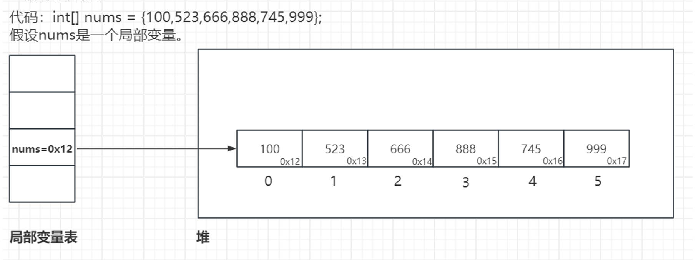

### 什么是数组？

1. 在Java中，数组是一种用于存储多个`相同数据类型元素`的容器。

2. 例如一个`存储整数`的数组：

```java
int[] nums = {100, 200, 300};
```

3. 例如一个`存储字符串`的数组：

```java
String[] names = {“jack”,“lucy”,“lisi”};
```

4. 数组是一种`引用数据类型`，`隐式继承Object`。因此数组也`可以调用Object类中的方法`。

5. 数组对象存储在`堆内存`中。

### 数组的分类？

1. 根据`维数`进行分类：`一维数组，二维数组，三维数组，多维数组`。

2. 根据`数组中存储的元素类型`分类：`基本类型数组，引用类型数组`。

3. 根据`数组初始化方式不同`分类：`静态数组，动态数组`。

### Java数组存储元素的特点？

1. `数组长度`一旦确定`不可变`。

2. 数组中元素`数据类型一致`，每个元素`占用空间大小相同`。

3. 数组中每个元素在空间存储上，内存地址是`连续的`。

4. 每个元素有索引，首元素`索引0`，`以1递增`。

5. 以`首元素的内存地址`作为`数组对象`在`堆内存中的地址`。

6. 所有数组对象`都有length属性`用来获取`数组元素个数`。`末尾元素`下标：`length-1`

### 数组优点？

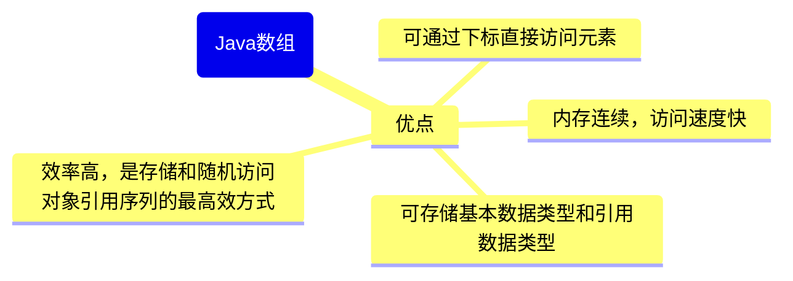
```mermaid
mindmap
  root(Java数组)
    优点
      内存连续，访问速度快
      可通过下标直接访问元素
      可存储基本数据类型和引用数据类型
      效率高，是存储和随机访问对象引用序列的最高效方式
```

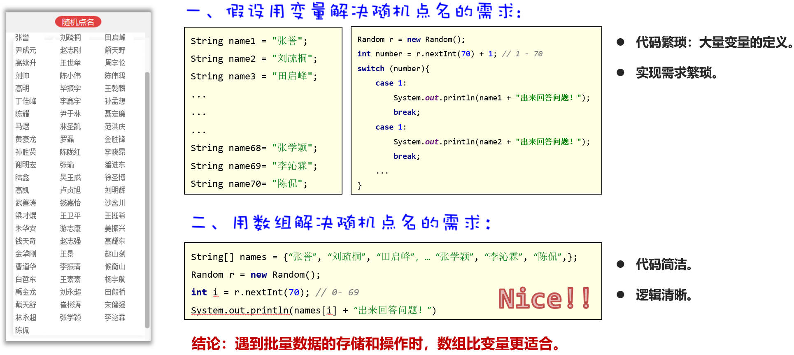

1. 根据`下标查询某个元素的效率极高`。数组中有100个元素和有100万个元素，`查询效率相同`。时间复杂度`O(1)`。也就是说在数组中根据下标查询某个元素时，不管数组的长短，`耗费时间是固定不变的`。

2. **原因：知道`首元素内存地址`，元素在`空间存储上内存地址`又是`连续的`，每个元素`占用空间大小相同`，只要知道下标，就可以通过数学表达式计算出来要查找元素的内存地址。`直接通过内存地址定位元素`。**

### 数组缺点？

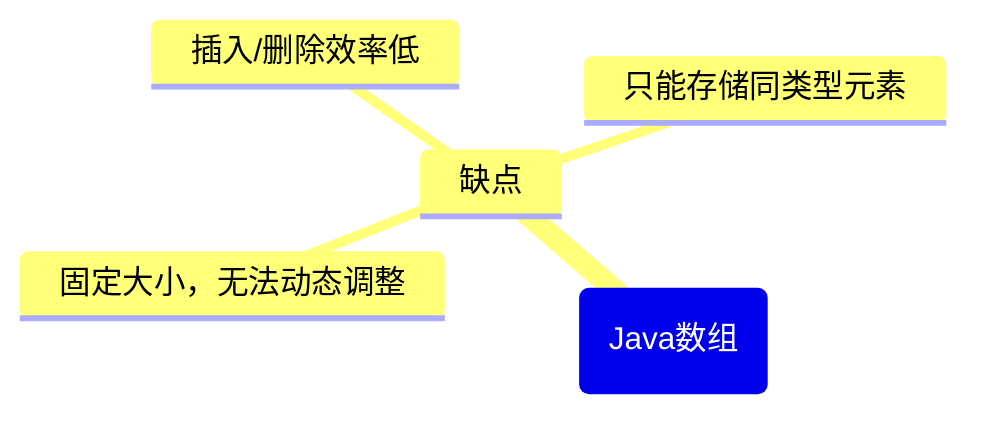
```mermaid
mindmap
  root(Java数组)
    缺点
      固定大小，无法动态调整
      插入/删除效率低
      只能存储同类型元素
```

1. 随机`增删元素的效率较低`。因为随机增删元素时，为了保证数组中元素的`内存地址连续`，就需要涉及到后续元素的`位移问题`。时间复杂度`O(n)`。O(n)表示的是`线性阶`，随着问题规模n的不断增大，时间复杂度不断增大，算法的执行`效率越低`。**（不过需要注意的是：对`数组末尾元素`的`增删效率是不受影响`的。）**

2. `无法存储大量数据`，因为很难在内存上找到`非常大的一块连续的内存`。


## 数组的定义和访问

数组有两种初始化的方式，一种是`静态初始化`、一种是`动态初始化`。我们先用`静态初始化来学习数组的操作。

### 数组的静态初始化

**所谓静态初始化指的是：在`定义数组时`直接给`数组中的数据赋值`。**

#### **静态初始化标准格式：**

```java
数据类型[] 变量名 = new 数据类型[]{元素1,元素2,元素3};
```

按照格式定义int类型、double类型数组

```java
//定义数组，用来存储多个年龄
int[] ages = new int[]{12, 24, 36}
//定义数组，用来存储多个成绩
double[] scores = new double[]{89.9, 99.5, 59.5, 88.0};
```


#### **静态初始化简化格式**

Java语言的设计者为了简化定义数组的写法，还为静态初始化提供了一种简化写法

```java
数据类型[] 变量名 = {元素1,元素2,元素3};
```

使用简化格式定义int类型、double类型数组

```java
//定义数组，用来存储多个年龄
int[] ages = {12, 24, 36}
//定义数组，用来存储多个成绩
double[] scores = {89.9, 99.5, 59.5, 88.0};
```


#### **注意哟！！**

- 定义数组时， `数据类型[] 数组名` 也可写成 `数据类型 数组名[]` 

```java
//以下两种写法是等价的。但是建议大家用第一种，因为这种写法更加普遍
int[] ages = {12, 24, 36};
int ages[] = {12, 24, 36}
```


#### **数组在计算机中的基本原理**

我们知道数组是怎么定义的之后，那么接下来看一下数组在计算机中的基本原理。

我们以`int[] ages = {12,24,36};`这句话为例，看一下这句话到底在计算机中做了那些事情。

- 首先，左边`int[] ages` 表示定义了一个数组类型的变量，变量名叫ages
- 其次，右边`{12,24,36}`表示创建一个数组对象，你完全可以把它理解成一个能装数据的东西。这个对象在内存中会有一个地址值`[I@4c873330`，每次创建一个数组对象都会有不用的地址值。
- 然后，把右边的地址值`[I@4c873330`赋值给左边的ages变量
- 所以，ages变量就可以通过地址值，找到数组这个东西。


### 数组的元素访问

各位同学，通过刚才的学习，我们知道数组是用来存储数据的。那么数组中存储的数据又如何访问呢？这里所说的访问，意思就是获取中数组中数据的值、或者给数组中的数据赋值。

这里先给大家统一几个概念，数组中存储的数据我们叫做元素；而且数组中的每一个元素都有一个编号与之对应，我们把这个编号叫做索引，这个索引是从0依次递增的整数。如下图所示


要想访问数组中的元素，格式如下

```java
//数组名可以找到数组对象的地址，再通过索引就可以定位到具体的元素了
数组名[索引]
```

接下来用代码来演示一下

```java
//索引：	   0   1   2
int[] arr = {12, 24, 36};
// 1、访问数组的全部数据
System.out.println(arr[0]); //12
System.out.println(arr[1]); //24
System.out.println(arr[2]); //36
//下面代码没有3索引，会出现ArrayIndexOutOfBoundsException 索引越界异常
//System.out.println(arr[3]); 

// 2、修改数组中的数据
arr[0] = 66;
arr[2] = 100;
System.out.println(arr[0]); //66
System.out.println(arr[1]); 0
System.out.println(arr[2]); //100
```

除了访问数组中的元素，我们可以获取数组中元素的个数，后面我们统称为数组的长度。

```java
// 3、访问数组的元素个数：数组名.length
System.out.println(arr.length);

// 技巧：获取数组的最大索引: arr.length - 1(前提是数组中存在数据)
System.out.println(arr.length - 1);

int[] arr2 = {};
System.out.println(arr2.length - 1);
```


### 数组的遍历

各位同学，接下来我们学习一个对数组最最最常见的操作——`数组遍历`。所谓遍历意思就是`将数组中的元素一个一个的取出来`。

#### 普通遍历:

我们刚才学习了数组中元素的访问，访问元素必须用到索引，如下列代码。

```java
int[] ages = {12, 24, 36};
System.out.println(ages[0]);
System.out.println(ages[1]);
System.out.println(ages[2]);
```

但是，如果数组中有很多很多元素，索引靠自己一个一个数肯定是不行的！我们可以使用for循环从0开始一直遍历到长度-1的位置，就可以获取所有的索引了。 

当你获取到每一个索引，那么每一个元素不就获取到了吗？上代码吧

```java
int[] ages = {12, 24, 36};

// 从前往后遍历
for (int i = 0; i < ages.length; i++) {
    // i的取值 = 0,1,2
    System.out.println(ages[i]); // 12 24 36
}

// 从后往前遍历
for (int i = ages.length-1; i >= 0; i--) {
    System.out.println(ages[i]); // 36 24 12
}
```


#### for-each遍历(优点是代码简洁,缺点是没有下标):

```java
增强for循环/for-each循环。JDK5的新特性。

for each语法结构：
     for(数据中元素的数据类型 变量名 : 数组名){

     }

 注意：变量名 代表数组中的每个元素。

for each的优点：代码简洁，可读性强。

for each的缺点：没有下标。（如果需求中需要使用到下标，这种方式就差一点。）
```

```java
package com.powernode.javase;

public class ArrayTest02 {
    public static void main(String[] args) {
        // 静态初始化一维数组
        int[] arr = {100, 200, 300};
        String[] names = {"jack", "lucy", "tom"};

        // 遍历arr数组(for-each)
        for(int num : arr){
            // num代表数组中的每个元素
            System.out.println(num);
        }

        // 需求：遍历数组arr，最后一个元素翻倍。
        for (int i = 0; i < arr.length; i++) {
            if(i == arr.length - 1){
                System.out.println(arr[i] * 2);
            }else{
                System.out.println(arr[i]);
            }
        }

        // 遍历names数组(for-each)
        for(String name : names){
            System.out.println(name);
        }
    }
}
```

> **测试结果:**
>
> 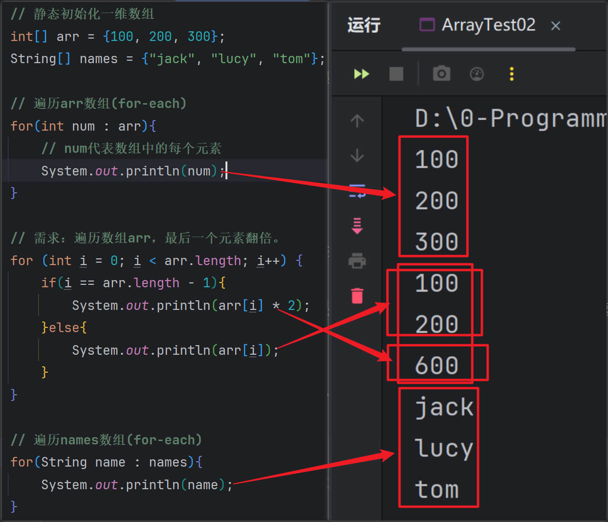


### 数组静态初始化案例

```java
需求：获取10个学生成绩，然后把成绩保存在数组中，接着遍历数组获得学生成绩，最后计算总分和平均分

需求分析：
	1.输入功能：获取10个学生的成绩
      double[] scores = {0,0,0,0,0,0,0,0,0,0};

        Scanner scanner = new Scanner(System.in);
        for (int i = 0; i < 10; i++) {
            System.out.print("请输入第"+(i + 1)+"个学生的成绩：");
            // 接收输入的成绩
            double score = scanner.nextDouble();
            // 将成绩存放到容器中
            scores[i] = score;
        }

     2.存储功能：将成绩保存在数组中
       // 遍历这个数组中的每个数据。
        double sum = 0.0;
        for (int i = 0; i < scores.length; i++) {
            System.out.println("学生" +(i + 1) + "的成绩是" + scores[i]);
            // i = 0  1  2  3  4  5  6  7  8  9
            sum += scores[i];
        }

     3.处理功能：计算总分和平均分
       System.out.println("总分:" + sum);
       System.out.println("平均分:" + sum / scores.length);
```

按照分析的思路来写代码

```java
package com.powernode.javase;

import java.util.Scanner;

/**
 * 获取10个学生成绩，然后把成绩保存在数组中，接着遍历数组获得学生成绩，最后计算总分和平均分
 */
public class ArrayTest03 {
    public static void main(String[] args) {
        // 定义一个一维数组（提醒：数组当中存储的元素类型是一致的。）
        // 容器：存放学生的成绩。
        double[] scores = {0,0,0,0,0,0,0,0,0,0};

        Scanner scanner = new Scanner(System.in);
        for (int i = 0; i < 10; i++) {
            System.out.print("请输入第"+(i + 1)+"个学生的成绩：");
            // 接收输入的成绩
            double score = scanner.nextDouble();
            // 将成绩存放到容器中
            scores[i] = score;
        }

        // 遍历这个数组中的每个数据。
        double sum = 0.0;
        for (int i = 0; i < scores.length; i++) {
            System.out.println("学生" +(i + 1) + "的成绩是" + scores[i]);
            // i = 0  1  2  3  4  5  6  7  8  9
            sum += scores[i];
        }

        // 计算总分和平均分
        System.out.println("总分:" + sum);
        System.out.println("平均分:" + sum / scores.length);
    }
}
```

> **测试结果:**
>
> 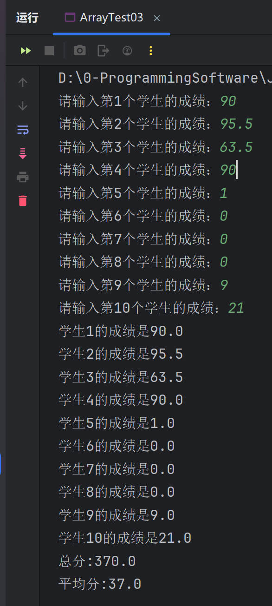


### 数组的动态初始化

各位同学，刚才我们初始化数组时，都是直接将元素写出来。但是还有另一个初始化数组的方式叫 **动态初始化**。

**动态初始化不需要我们写出具体的元素，而是`指定元素类型和长度就行`。**格式如下

```java
//数据类型[]  数组名 = new 数据类型[长度];
int[] arr = new int[3];
```

> **温馨提示:**
>
> 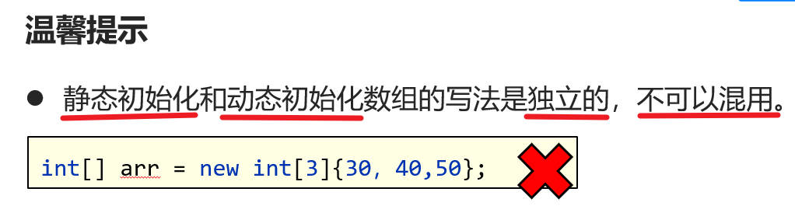

```java
// 后赋值
arr[0] = 10;
System.out.println(arr[0]); // 10
```

下面是动态初始化数组的原理图。我们发现`int[] arr` 其实就是一个变量，它记录了`数组对象的地址值`，而且数组中的`元素默认值是0`。


**注意：**

**使用`动态初始化定义数组`时，根据`元素类型不同`，`默认值也有所不同`。**


### 数组动态初始化案例

各位同学，接下来我们做一个数组动态初始化的案例。

```java
案例需求：
	某歌唱比赛，需要开发一个系统：可以录入6名评委的打分，录入完毕后立即输出平均分做
	选手得分

需求分析：
	1.需要录入6名评委的分数，可以用一个数组来保存。
	   因为在评委没有录入分数之前，还不确定数组中应该存哪些数据。
	   所以可以使用数组的动态初始化
	2.遍历数组中的每一个位置，并录入分数，将分数存入数组中
	3.遍历数组中的每一个元素，对元素求和
```

代码如下

```java
// 1、定义一个动态初始化的数组，负责后期存储6个评委的打分。
double[] scores = new double[6];

Scanner sc  = new Scanner(System.in);

// 2、遍历数组中的每个位置，录入评委的分数，存入到数组中去
for (int i = 0; i < scores.length; i++) {
    // i = 0 1 2 3 4 5
    System.out.println("请您输入当前第" + (i + 1) +"个评委的分数：");
    double score = sc.nextDouble();
    scores[i] = score;
}

// 3、遍历数组中的每个元素进行求和
double sum  = 0;
for (int i = 0; i < scores.length; i++) {
    sum += scores[i];
}
System.out.println("选手最终得分是：" + sum / scores.length);
```


## 操作数组时两个常见的问题

### 数组索引越界异常_ArrayIndexOutOfBoundsException

```java
1.原因:
  操作的索引超出了数组索引范围了
```

```java
public class Demo09Array {
    public static void main(String[] args) {
        int[] arr = new int[3];
        arr[0] = 100;
        arr[1] = 200;
        arr[2] = 300;
        //arr[3] = 400;//索引3超出了arr的索引范围

        //arr[-1] = 1000;//索引3超出了arr的索引范围

        for (int i = 0; i <= arr.length; i++) {
            System.out.println(arr[i]);//索引3超出了arr的索引范围
        }
    }
}
```

### 空指针异常_NullPointerException

```java
1.原因:
  当一个对象为null时,再调用此对象中的其他成员
```

```java
public class Demo10Array {
    public static void main(String[] args) {

        int[] arr = new int[3];
        System.out.println(arr.length);//3
        arr = null;
        System.out.println(arr.length);//NullPointerException
    }
}
```


> 以上两个问题我们只需要知道原因即可


## 数组在计算机中的执行原理

好的各位同学，在前面我们已经学习了数组的基本使用，也理解了数组的基本原理。由于数组是一个容器，变量也是一个容器，在理解他们执行原理的时候，有些同学就容易搞混，现在我把他们放在一起带着大家回顾一下他们的会执行原理，顺便带着大家详细理解一下Java程序的执行的内存原理。

### 数组的执行原理，Java程序的执行原理

我们以下面的代码，来讲解变量、数组的执原理。

> **例1:**

```java
public class ArrayDemo1 {
    public static void main(String[] args) {
        int a = 10;
        System.out.println(a);

        int[] arr = new int[]{11, 22, 33};
        System.out.println(arr);

        System.out.println(arr[1]);

        arr[0] = 44;
        arr[1] = 55;
        arr[2] = 66;

        System.out.println(arr[0]);
        System.out.println(arr[1]);
        System.out.println(arr[2]);
    }
}
```

前面我们给大家讲过，程序是在内存中执行的。实际上Java程序是把编译后的字节码加载到Java虚拟机中执行的。


Java为了便于虚拟机执行Java程序，将虚拟机的内存划分为 方法区、栈、堆、本地方法栈、寄存器 这5块区域。同学们需要重点关注的是  **方法区、栈、堆**。

下面把每一个块内存区域作用介绍一下，我们大致只需要知道每一部分存储什么内容就行。

- **方法区**：字节码文件先加载到这里
- **栈**：方法运行时所进入的内存区域，由于变量在方法中，所以变量也在这一块区域中
- **堆**：存储new出来的东西，并分配地址。由于数组是new 出来的，所以数组也在这块区域。

下面是上面案例执行的内存原理如下图所示，按照① ② ③ ④ ⑤ ⑥ 的标记的顺序来看


**总结一下`int a = 10`与 `int[] arr = new int[]{11,22,33}的区别`**

- **a**是一个变量，在栈内存中，**a**变量中存储的数据就是**10**这个值。
- **arr**也是一个变量，在栈中，存储的是数组对象在堆内存中的地址值

```java
// 这里的int a是一个基本类型变量，存储的是一个数值
int a = 10 ; 
//这里的int[] arr是一个引用类型的变量，存储的是一个地址值
int[] arr = new int[]{44,55,66};
```


> **例2:**


```java
package com.powernode.javase.oo;

/**
 * 父类
 */
public class Animal {
}
```

```java
package com.powernode.javase.oo;

public class Cat extends Animal {

    public void catcMouse() {
        System.out.println("猫吃老鼠!");
    }
}
```

```java
package com.powernode.javase.oo;

public class Bird extends Animal {

    public void fly(){
        System.out.println("鸟儿在飞翔！");
    }
}
```

```java
package com.powernode.javase.oo;

public class Test {
    public static void main(String[] args) {

        Bird b = new Bird();
        Cat c = new Cat();

        // 创建一个数组，让该数组既可以存储Cat，又可以存储Bird
        // 数组中存储的不是对象本身，实际上是对象在堆内存当中的地址。存储的是引用。
        Animal[] animals = {b, c, new Bird(), new Cat()};

        // 请遍历Animal数组，然后取出的Cat让它抓老鼠。取出的Bird让它飞。
        for (Animal animal : animals) {
            // 向下转型
            if(animal instanceof Cat){
                Cat cat = (Cat) animal;
                cat.catcMouse();
            }else if(animal instanceof Bird){
                Bird bird = (Bird) animal;
                bird.fly();
            }
        }

        /*// 创建一个数组，既能够存储A，又能存储B
        A a = new A();
        B b = new B();
        Cat c = new Cat();
        Object[] objs = {a, b, c};

        Bird bird = new Bird();
        // 编译报错。类型不统一/不一致。
        //Cat[] cats = {c, bird};
        // 这个可以。
        Object[] objs2 = {c, bird};*/
    }
}


class A {

}

class B {
}
```

> **测试结果:**
>
> 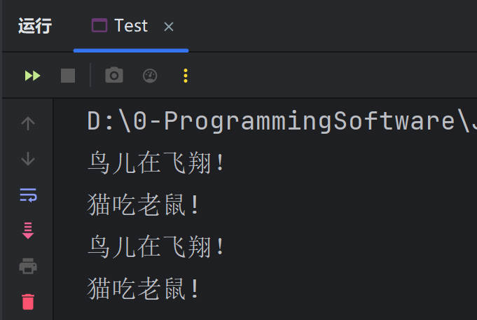


### 多个变量指向同一个数组的问题

各位同学，我们了解了数组在内存中的执行原理。我们知道数组类型的变量，指向的是堆内存中数组对象的地址。但是在实际开发中可能存在一种特殊情况，就是多个变量指向同一个数组对象的形式。

讲解这个知识点的目的，是让同学们注意多个变量指向同一个数组对象存在什么问题？

我们先看一段代码

```java
public class ArrayDemo2 {
    public static void main(String[] args) {
        // 目标：认识多个变量指向同一个数组对象的形式，并掌握其注意事项。
        int[] arr1 = {11, 22, 33};

        // 把int类型的数组变量arr1赋值给int类型的数组变量arr2
        int[] arr2 = arr1;

        System.out.println(arr1);
        System.out.println(arr2);

        arr2[1] = 99;
        System.out.println(arr1[1]);

        arr2 = null; // 拿到的数组变量中存储的值是null
        System.out.println(arr2);

        //System.out.println(arr2[0]);
        //System.out.println(arr2.length);
    }
}
```

我们重点关注这一段代码


刚执行完`int[] arr1 = {11,22,33};`时，内存原理如下


当执行完`int[] arr2 = arr1;`后，内存原理如下


当执行到`arr2[1]=99;时`，内存原理如下


**总结一下：**

- 两个变量指向同一个数组时，两个变量记录的是同一个地址值。

- 当一个变量修改数组中的元素时，另一个变量去访问数组中的元素，元素已经被修改过了。

到这里有关数组的基本操作，和内存原理我们就全部学习完了。

## 数组专项练习

接下来我们做一些专项练习题，把数组的常见操作练习一下。在学习这个案例时，重点掌握数组求最值的思路，代码只是用来表达你的思路的。

### 数组求最值

> **例1:**

```java
需求：定义一个int类型数组，求数组中元素的最大值，并打印最大值
```

我们先看一下选美比赛，是怎么选出颜值最高的人的。然后再以此思路，来写代码找出数组中元素的最大值。


```java
数组求最大值思路：
	1)先找出数组中0索引的元素，假设为最大值，用max表示【擂主】
	2)遍历后面的每一个元素和max比较，把较大的元素值重新赋值给max(擂主换人)
    3)最后max就是所有元素的最大值(最后站在台上的擂主)
```

```java
public class Test1 {
    public static void main(String[] args) {
        // 1、把颜值数据拿到程序中来，用数组装起来
        int[] faceScores = {15, 9000, 10000, 20000, 9500, -5};

        // 2、定义一个变量用于最终记住最大值。
        int max = faceScores[0];

        // 3、从数组的第二个位置开始遍历。
        for (int i = 1; i < faceScores.length; i++) {
            // i = 1  2  3  4  5
            // 判断一下当前遍历的这个数据，是否大于最大值变量max存储的数据，
            //如果大于，当前遍历的数据需要赋值给max
            if(faceScores[i] > max ){
                max = faceScores[i];
            }
        }
        System.out.println("最高颜值是：" + max);
    }
}
```

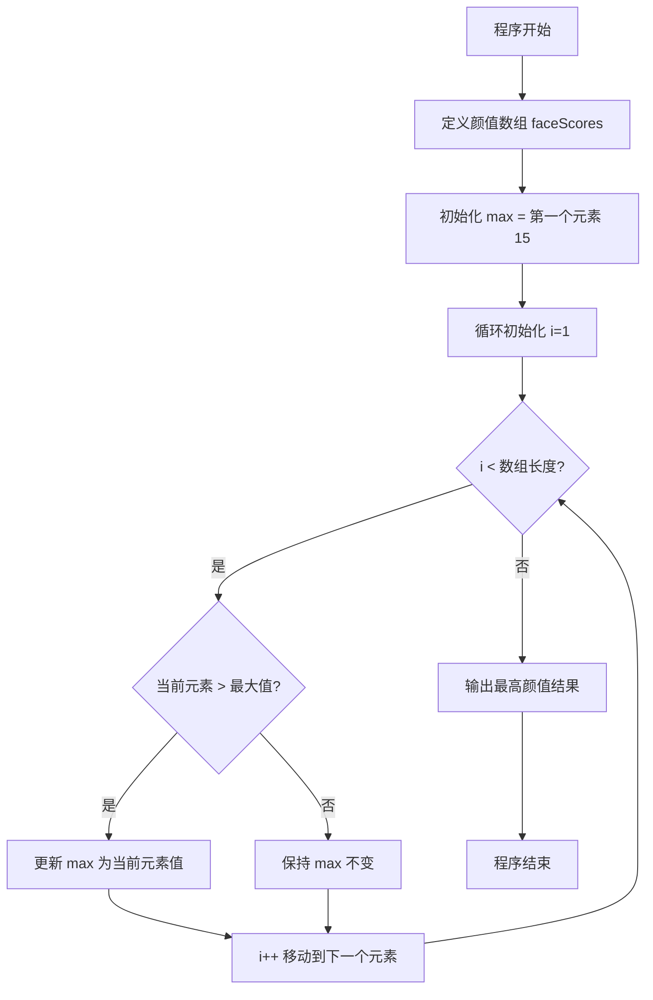
```mermaid
flowchart TD
    A[程序开始] --> B[定义颜值数组 faceScores]
    B --> C[初始化 max = 第一个元素 15]
    C --> D[循环初始化 i=1]
    D --> E{i < 数组长度?}
    
    E -- 是 --> F{当前元素 > 最大值?}
    F -- 是 --> G[更新 max 为当前元素值]
    F -- 否 --> H[保持 max 不变]
    
    G --> I[i++ 移动到下一个元素]
    H --> I
    I --> E
    
    E -- 否 --> J[输出最高颜值结果]
    J --> K[程序结束]
```

> **例2:**

```java
package com.powernode.javase;

/**
 * 找最值。
 */
public class ArrayTest06 {
    public static void main(String[] args) {
        int[] arr = {1,3,3,4,45,56,6,7,87,8,8898,1,2,1};
        System.out.println(arr.length);
        int max = searchMax(arr);
        System.out.println("最大值是:" + max);

        int maxIndex = searchMaxIndex(arr);
        System.out.println("最大值的下标是：" + maxIndex);
    }

    /**
     * 找最大值的下标
     * @param arr 数组
     * @return 最大值的下标
     */
    public static int searchMaxIndex(int[] arr) {
        // 假设第一个元素是最大的。
        int maxIndex = 0;
        // 遍历数组
        for (int i = 0; i < arr.length; i++) {
            if(arr[i] > arr[maxIndex]) {
                maxIndex = i;
            }
        }
        return maxIndex;
    }

    /**
     * 从arr数组中找最大值
     * @param arr
     * @return
     */
    public static int searchMax(int[] arr) {
        // 假设第一个是最大的
        int max = arr[0];
        // 遍历数组
        /*for (int num : arr) {
            if(num > max){
                max = num;
            }
        }*/

        for (int i = 0; i < arr.length; i++) {
            if (arr[i] > max) {
                max = arr[i];
            }
        }
        return max;
    }
}
```

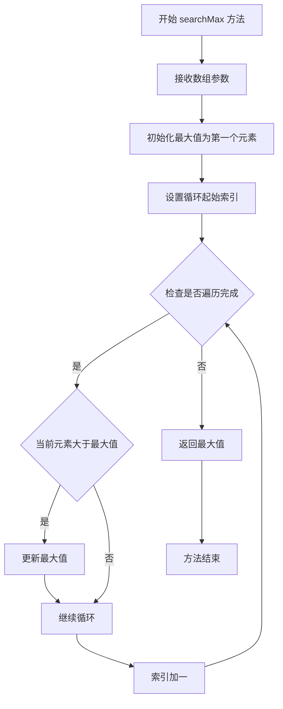
```mermaid
flowchart TD
    A[开始 searchMax 方法] --> B[接收数组参数]
    B --> C[初始化最大值为第一个元素]
    C --> D[设置循环起始索引]
    D --> E{检查是否遍历完成}
    E -- 是 --> F{当前元素大于最大值}
    F -- 是 --> G[更新最大值]
    F -- 否 --> H[继续循环]
    G --> H
    H --> I[索引加一]
    I --> E
    E -- 否 --> J[返回最大值]
    J --> K[方法结束]
```

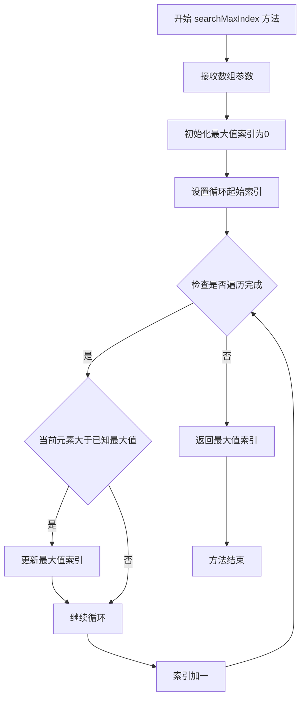
```mermaid
flowchart TD
    A[开始 searchMaxIndex 方法] --> B[接收数组参数]
    B --> C[初始化最大值索引为0]
    C --> D[设置循环起始索引]
    D --> E{检查是否遍历完成}
    E -- 是 --> F{当前元素大于已知最大值}
    F -- 是 --> G[更新最大值索引]
    F -- 否 --> H[继续循环]
    G --> H
    H --> I[索引加一]
    I --> E
    E -- 否 --> J[返回最大值索引]
    J --> K[方法结束]
```


### 数组元素反转

```java
需求：某个数组有5个数据：10,20,30,40,50，请将这个数组中的数据进行反转。
      [10, 20, 30, 40, 50]  反转后 [50, 40, 30, 20, 10]
```

数组元素反转的核心，其实是数组中两个数据的交换。我们可以认为两个数据分别存储在两个水杯中。想要交换两个水杯中的东西，我们得借助第三个水杯，如下图所示


数组中元素交换，就是用的借用第三方变量的思想。 我们把数组中的每一个元素当做一个水杯，然后索引控制哪两个元素互换位置。

> **例1:**

怎么样，才能达到元素反转的效果呢？我们只需将第一个和最后一个元素互换、第二个和倒数第二个互换、依次内推.... 如下图所示


```java
1.每次交换，需要有左右两边的两个索引，我们可以用i和j表示
	刚开始i=0，j=数组长度-1;
2.每次让i和j索引位置的两个元素互换位置
	arr[i]和arr[j]互换位置
3.每次还完位置之后，让i往右移动一位，让j往前移动一位
```

具体代码如下

```java
public class Test2 {
    public static void main(String[] args) {
        // 目标：完成数组反转。
        // 1、准备一个数组
        int[] arr = {10, 20, 30, 40, 50};  

        // 2、定义一个循环，设计2个变量，一个在前，一个在后
        for (int i = 0, j = arr.length - 1; i < j; i++, j--) {
            // arr[i]   arr[j]
            // 交换
            // 1、定义一个临时变量记住后一个位置处的值
            int temp = arr[j];
            // 2、把前一个位置处的值赋值给后一个位置了
            arr[j] = arr[i];
            // 3、把临时变量中记住的后一个位置处的值赋值给前一个位置处
            arr[i] = temp;
        }

        // 3、遍历数组中的每个数据，看是否反转成功了
        for (int i = 0; i < arr.length; i++) {
            System.out.print(arr[i] + " ");
        }
    }
}
```

> **例2:**
>
> 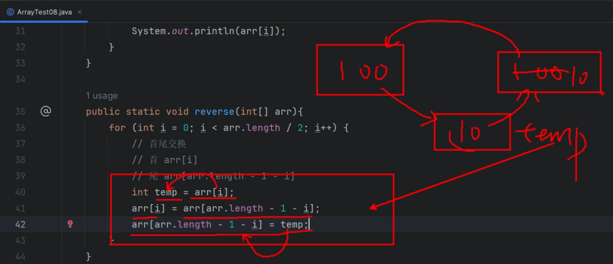

```java
package com.powernode.javase;

/**
 * 数组的反转
 *      第一种方式：创建一个新数组。
 *      第二种方式：首尾交换
 *
 *      假设数据有偶数个：
 *      {1,2,3,4}
 *      第一次循环：{4,2,3,1}
 *      第二次循环：{4,3,2,1}
 *
 *      假设数据有奇数个：
 *      {1,2,3,4,5}
 *      第一次循环：{5,2,3,4,1}
 *      第二次循环：{5,4,3,2,1}
 *
 *      无论数组中的数据量是奇数还是偶数，循环的次数都是：length / 2
 */
public class ArrayTest08 {
    // 首尾交换的方式完成数组的反转。
    public static void main(String[] args) {

        int[] arr = {1,2,3,4,5,6,7,8,9};

        // 反转
        reverse(arr);

        // 遍历
        for(int i = 0;i < arr.length; i++){
            System.out.println(arr[i]);
        }
    }

    /**
     * 这种方式完成的数组反转，不但效率高（循环次数少），而且还节省空间，因为不需要new新的数组对象。
     * @param arr
     */
    public static void reverse(int[] arr){
        for(int i = 0;i < arr.length / 2; i++){
            // 首尾交换
            // 首 arr[i]
            // 尾 arr[arr.length - 1 - i]
            int temp = arr[i];
            arr[i] = arr[arr.length - 1 - i];
            arr[arr.length - 1 - i] = temp;
        }
    }


    // 用创建一个新数组的方式进行数组的反转。
    /*public static void main(String[] args) {
        int[] arr = {1,2,3,4,5,6,7,8,9};

        // 反转
        reverse(arr);

        // 遍历
        for (int i = 0; i < arr.length; i++) {
            System.out.println(arr[i]);
        }
    }

    public static void reverse(int[] arr){
        // 第一种方式：创建新数组
        // 动态初始化一维数组
        int[] newArr = new int[arr.length];
        // 遍历新数组
        for (int i = 0; i < newArr.length; i++) {
            newArr[i] = arr[arr.length - 1 - i];
        }
        // 遍历新数组
        for (int i = 0; i < newArr.length;i++) {
            arr[i] = newArr[i];
        }
    }*/


    // 用创建一个新数组的方式进行数组的反转。
    /*public static void main(String[] args) {
        int[] arr = {1,2,3,4,5,6,7,8,9};

        // 反转
        int[] newArr = reverse(arr);

        // 遍历
        for (int i = 0; i < newArr.length; i++) {
            System.out.println(newArr[i]);
        }
    }

    public static int[] reverse(int[] arr){
        // 第一种方式：创建新数组
        // 动态初始化一维数组
        int[] newArr = new int[arr.length];
        // 遍历新数组
        for (int i = 0; i < newArr.length; i++) {
            newArr[i] = arr[arr.length - 1 - i];
        }
        return newArr;
    }*/
}
```

**总结一下：**

通过上面的案例，需要我们掌握元素互换位置的编程思路；以后遇到数据互换问题，都这样做。

### 随机排名

各位同学，通过数组元素反转的案例，我们学会了如何对两个数据进行交换。接下来，我们再学习随机排名案例，将数据交换的思路再巩固一下。

先来看一下需求

```java
需求：某公司开发部5名开发人员，要进行项目进展汇报演讲，现在采取随机排名后进行汇报。请先依次录入5名员工的工号，然后展示出一组随机的排名顺序。
```

分析一下随机排名的思路

```java
1.在程序中录入5名员工的工号存储起来 ---> 使用动态初始化数组的方式。
2.依次遍历数组中的每个数据。
3.每遍历到一个数据，都随机一个索引值出来，让当前数据与该索引位置处的数据进行交换。
```

如下图所示，每次遍历到一个元素，随机将当前位置元素和随机索引元素换位置。


代码如下

```java
public class Test3 {
    public static void main(String[] args) {
        // 目标：完成随机排名
        // 1、定义一个动态初始化的数组用于存储5名员工的工号
        int[] codes = new int[5];

        // 2、提示用户录入5名员工的工号。
        Scanner sc = new Scanner(System.in);
        for (int i = 0; i < codes.length; i++) {
            // i = 0 1 2 3 4
            System.out.println("请您输入第" + (i + 1) +"个员工的工号：");
            int code = sc.nextInt();
            codes[i] = code;
        }

        // 3、打乱数组中的元素顺序。
        // [12, 33, 54, 26, 8]
        //  i       index
        Random r =  new Random();
        for (int i = 0; i < codes.length; i++) {
            // codes[i]
            // 每遍历到一个数据，都随机一个数组索引范围内的值。
            //然后让当前遍历的数据与该索引位置处的值交换。
            int index = r.nextInt(codes.length); // 0 - 4
            // 定义一个临时变量记住index位置处的值
            int temp = codes[index];
            // 把i位置处的值赋值给index位置处
            codes[index] = codes[i];
            // 把index位置原来的值赋值给i位置处
            codes[i] = temp;
        }

        // 4、遍历数组中的工号输出即可
        for (int i = 0; i < codes.length; i++) {
            System.out.print(codes[i] + " ");
        }
    }
}
```


## 数组的性质

### 关于main方法的形参args？

接收命令行参数

在DOS命令窗口中怎么传？在IDEA中怎么传？

### 关于方法的可变长度参数？

可变长参数只能出现在形参列表中的最后一个位置。

可变长参数可以当做数组来处理。

### 一维数组的扩容

①数组长度一旦确定不可变。

②那数组应该如何扩容？

+ 只能创建一个更大的数组将原数组中的数据全部拷贝到新数组中

+ 可以使用System.arraycopy()方法完成数组的拷贝。

③数组扩容会影响程序的执行效率，因此尽可能预测数据量，创建一个接近数量的数组，减少扩容次数。


## 二维数组

①二维数组是一个特殊的`一维数组`，**特殊在：这个`一维数组`中每个元素是一个`一维数组`。**

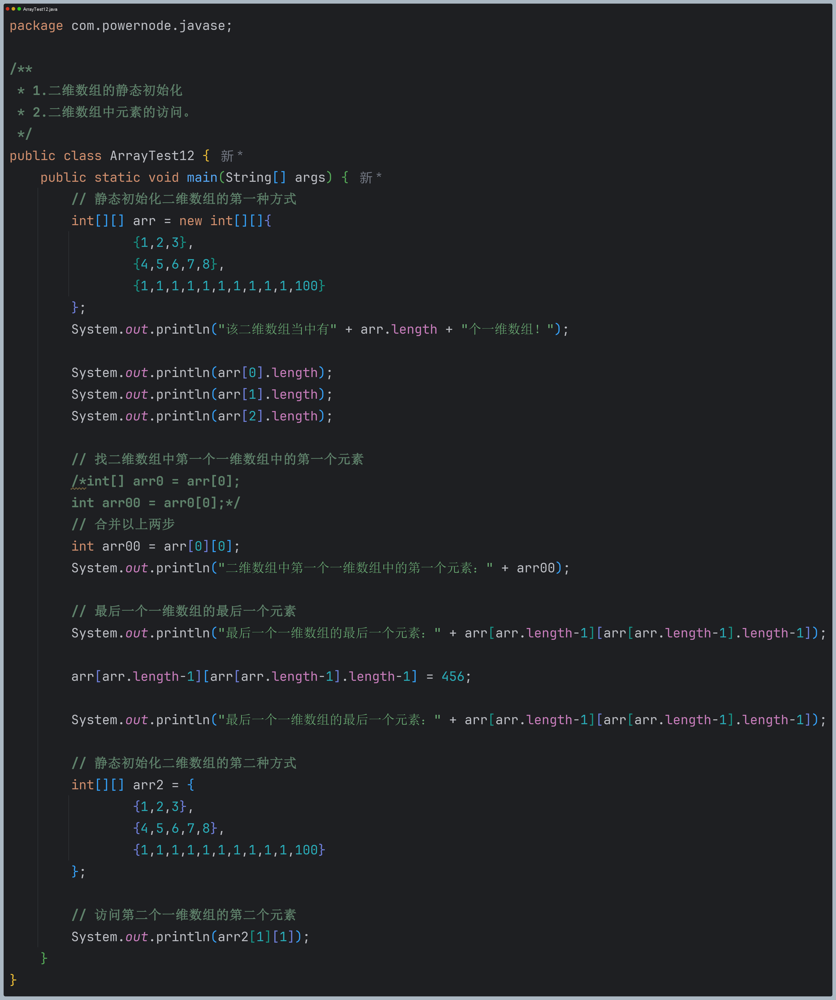

### 二维数组的静态初始化

```java
int[][] arr = new int[][]{ {},{},{} };
```

  ```java
  // 静态初始化二维数组的第一种方式
  int[][] arr = new int[][]{
     {1,2,3},
     {4,5,6,7,8},
     {1,1,1,1,1,1,1,1,1,1,100}
  };
  
  System.out.println("该二维数组当中有" + arr.length + "个一维数组！"); // 该二维数组当中有3个一维数组！
  
  System.out.println(arr[0].length); // 3
  System.out.println(arr[1].length); // 5
  System.out.println(arr[2].length); // 11
  ```

```java
int[][] arr = { {},{},{} };
```

  ```java
  // 静态初始化二维数组的第二种方式
  int[][] arr2 = {
     {1,2,3},
     {4,5,6,7,8},
     {1,1,1,1,1,1,1,1,1,1,100}
  };
  
  // 访问第二个一维数组的第二个元素
  System.out.println(arr2[1][1]); // 5
  ```

  ### 二维数组中元素的访问

+ 第一个元素：**`arr[0][0]`**

  ```java
  // 找二维数组中第一个一维数组中的第一个元素
  /*int[] arr0 = arr[0];
  int arr00 = arr0[0];*/
  // 合并以上两步
  int arr00 = arr[0][0];
  System.out.println("二维数组中第一个一维数组中的第一个元素：" + arr00); // 1
  ```

+ 最后一个元素：**`arr[arr.length-1][arr[arr.length-1].length-1]`**

  ```java
  // 最后一个一维数组的最后一个元素
  System.out.println("最后一个一维数组的最后一个元素：" + arr[arr.length-1][arr[arr.length-1].length-1]); // 100
  
  arr[arr.length-1][arr[arr.length-1].length-1] = 456;
  
  System.out.println("最后一个一维数组的最后一个元素：" + arr[arr.length-1][arr[arr.length-1].length-1]); // 456
  ```
  

### 二维数组的动态初始化(等长)

```java
int[][] arr = new int[3][4];
```

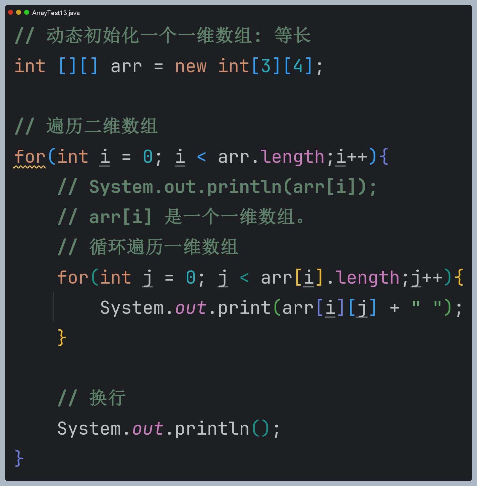


### 二维数组的动态初始化（不等长）

```java
int[][] arr = new int[3][];
```

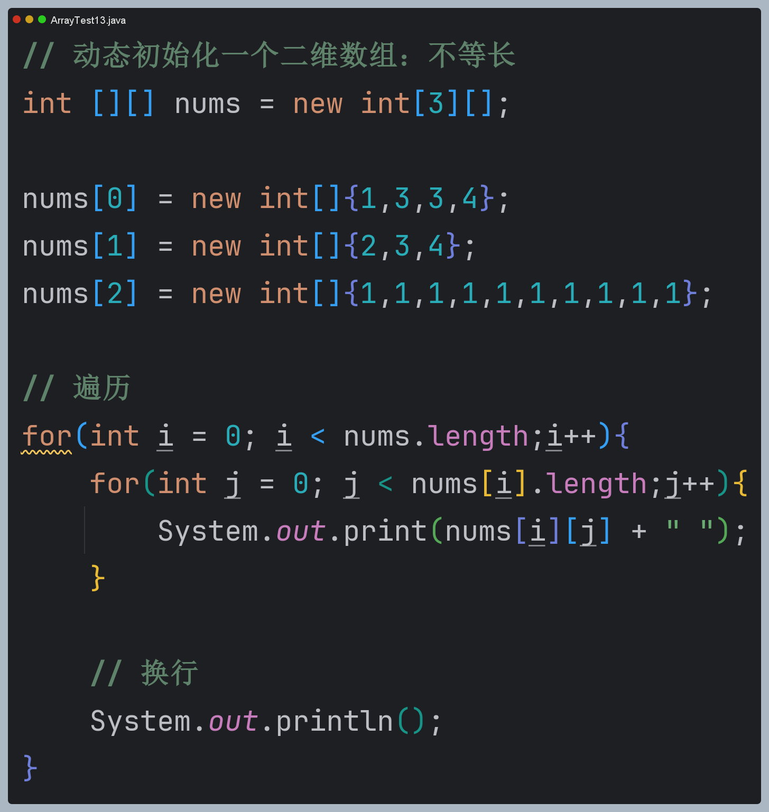

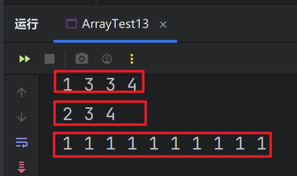

### 二维数组中元素的遍历

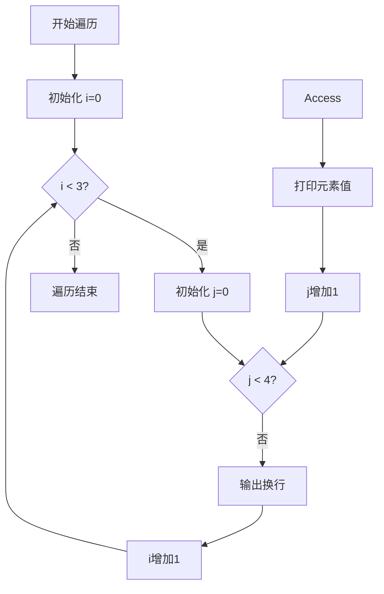
```mermaid
flowchart TD
    Start[开始遍历] --> InitI[初始化 i=0]
    InitI --> CheckI{i < 3?}
    
    CheckI -- 是 --> InitJ[初始化 j=0]
    CheckI -- 否 --> End[遍历结束]
    
    InitJ --> CheckJ{j < 4?}
    Access --> Print[打印元素值]
    Print --> IncJ[j增加1]
    IncJ --> CheckJ
    
    CheckJ -- 否 --> NewLine[输出换行]
    NewLine --> IncI[i增加1]
    IncI --> CheckI
```

```java
// 动态初始化一个一维数组: 等长
int [][] arr = new int[3][4];

// 遍历二维数组
for(int i = 0; i < arr.length;i++){
    // System.out.println(arr[i]);
    // arr[i] 是一个一维数组。
    // 循环遍历一维数组
    for(int j = 0; j < arr[i].length;j++){
        System.out.print(arr[i][j] + " ");
    }
    /*
    0 0 0 0 
    0 0 0 0 
    0 0 0 0
    */
    
    // 换行
    System.out.println();
}
```


### 二维数组内存图

```java
public class Demo06Array {
    public static void main(String[] args) {
        int[][] arr1 = new int[3][];

        arr1[1] = new int[]{1,2,3};

        arr1[2] = new int[3];

        arr1[2][1] = 100;
    }
}
```


### 小项目

①请使用二维数组实现酒店管理系统。功能如下：

1.查看酒店所有房间的状态。

2.预订房间。

3.退房。

4.退出系统。

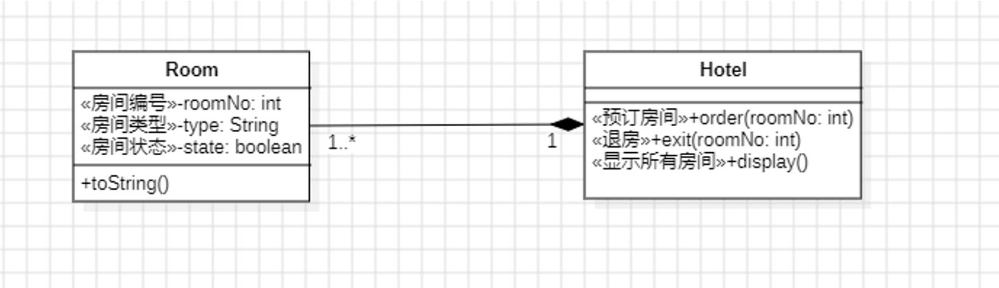

```java
package com.powernode.javase.hotel;

/**
 * 酒店的房间
 * @author 星纪
 * @version 1.0
 * @since 1.0
 */
public class Room {
    /**
     * 房间编号：
     * 101........................110
     * 201........
     * ....
     * ....
     * 601........................610
     */
    private int roomNo;
    /**
     * 单人间，标准间，豪华间
     */
    private String type;
    /**
     * true表示占用，false表示空闲
     */
    private boolean state;

    public Room() {
    }

    public Room(int roomNo, String type, boolean state) {
        this.roomNo = roomNo;
        this.type = type;
        this.state = state;
    }

    public int getRoomNo() {
        return roomNo;
    }

    public void setRoomNo(int roomNo) {
        this.roomNo = roomNo;
    }

    public String getType() {
        return type;
    }

    public void setType(String type) {
        this.type = type;
    }

    public boolean isState() {
        return state;
    }

    public void setState(boolean state) {
        this.state = state;
    }

    @Override
    public String toString() {
        return "["+this.roomNo+","+this.type+","+(this.state ? "占用" : "空闲")+"]";
    }
}
```

```java
package com.powernode.javase.hotel;

/**
 * 酒店
 * @author 星纪
 * @version 1.0
 * @since 1.0
 */
public class Hotel {
    /**
     * 酒店当中所有的房间
     */
    private Room [][] rooms = new Room [6][10]; // 60个null

    /**
     * 构造方法，通过该方法可以盖一个酒店出来。
     */
public Hotel(){
       for (int i = 0; i < rooms.length; i++) {
          for (int j = 0; j < rooms[i].length; j++) {
              if(i == 0 || i == 1) {
              rooms[i][j] = new Room((i + 1) * 100 + j + 1, "单人间", false);
              }else if(i == 2 || i == 3) {
              rooms[i][j] = new Room((i + 1) * 100 + j + 1, "标准间", false);
              }else if(i == 4 || i == 5){
              rooms[i][j] = new Room((i + 1) * 100 + j + 1, "豪华间", false);
              }
          }
        }
   }

    /**
     * 预定房间
     * @param roomNo 房间编号
     */
    public void order(int roomNo){
        // 101
        // i = 0
        // j = 0
        rooms[roomNo / 100 - 1][roomNo % 100 - 1].setState(true);
    }

    /**
     * 退房
     * @param roomNo 房间编号
     */
    public void exit(int roomNo){
        rooms[roomNo / 100 - 1][roomNo % 100 - 1].setState(false);
    }

    /**
     * 显示酒店中所有的房间状态
     */
    public void display(){
        for (int i = 0; i < rooms.length; i++) {
            for (int j = 0; j < rooms[i].length; j++) {
                System.out.print(rooms[i][j]);
            }
            System.out.println();
        }
    }
}
```

```java
package com.powernode.javase.hotel;

import java.util.Scanner;

/**
 * 酒店前台使用的。
 */
public class Test {
    public  static void main(String[] args) {
        // 创建Hotel
        Hotel hotel = new Hotel();

        System.out.println("欢迎使用酒店管理系统，请认真阅读以下使用说明：");
        System.out.println("请通过选择对应的功能编号来使用对应的功能：");
        System.out.println("[1]查看酒店所有的房间状态");
        System.out.println("[2]预定房间");
        System.out.println("[3]退房");
        System.out.println("[0]退出系统");
        Scanner s = new Scanner(System.in);

        while(true){
            System.out.print("请输入功能编号：");
            // 获取功能编号
            int no = s.nextInt();
            switch (no){
                case 1 -> hotel.display();
                case 2 -> {
                    System.out.print("请输入预定的房间号：");
                    int roomNo = s.nextInt();
                    hotel.order(roomNo);
                    System.out.println("预定房间["+roomNo+"]成功！");
                }
                case 3 -> {
                    System.out.print("请输入退房的房间号：");
                    int roomNo = s.nextInt();
                    hotel.exit(roomNo);
                    System.out.println("退房["+roomNo+"]成功！");
                }
                case 0 -> {
                    System.out.println("再见，欢迎下次使用！");
                    // 退出系统，终止JVM。
                    System.exit(0);
                }
            }
        }
    }
}
```

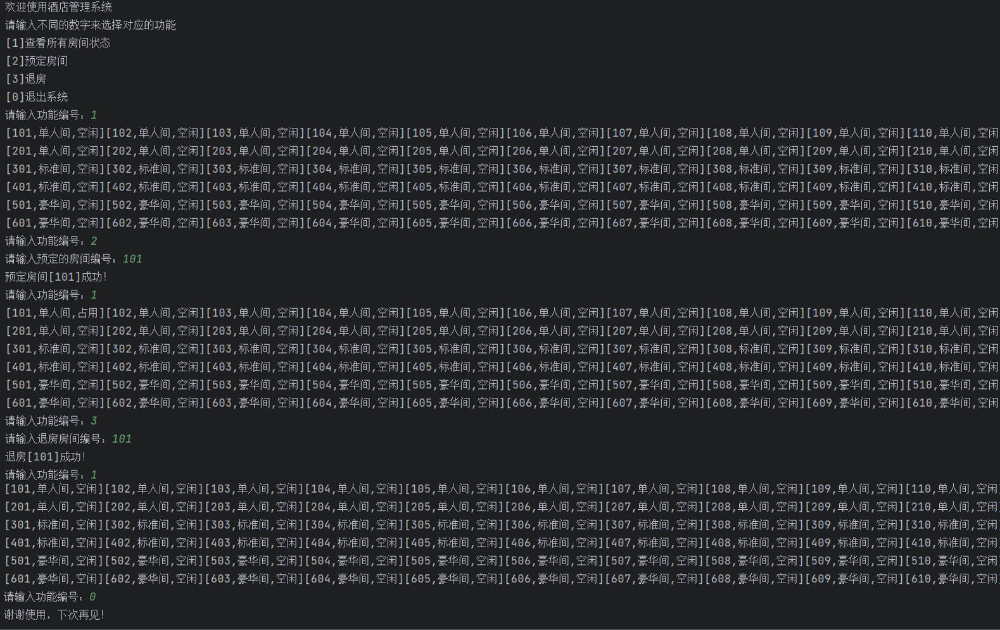

### 练一练（实现一个学生管理系统）

1. 程序启动时，读取一个预设的学生数组，其中已经保存了学生信息（包括学生姓名、学号、出生日期、性别、联系方式等）。

   

2. 程序提供以下操作选项：

   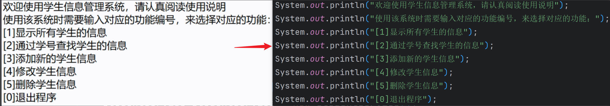

+ 显示所有学生的信息

  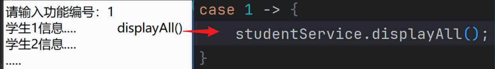

+ 通过学号查找学生的信息

  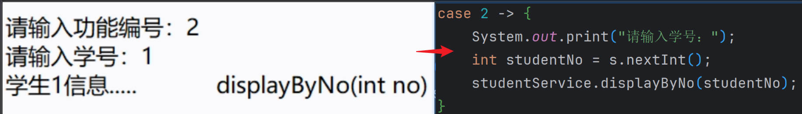

+ 添加新的学生信息

  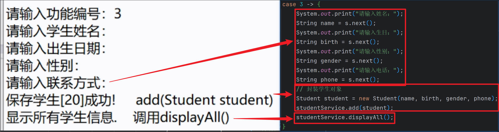

+ 修改学生信息

  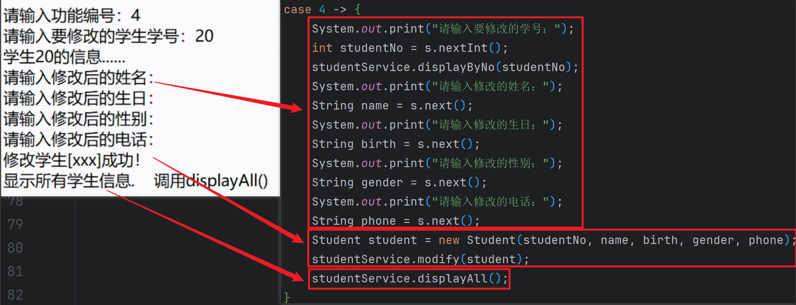

+ 删除学生信息

  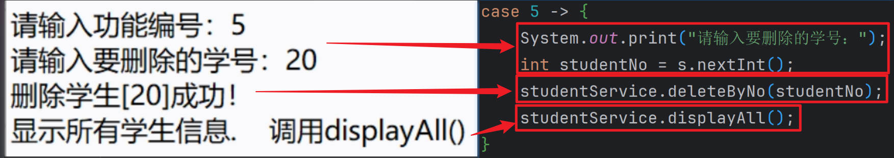

+ 退出程序

  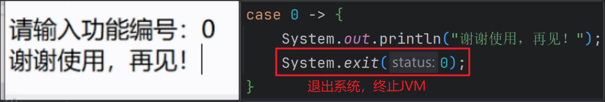

3. 添加新的学生信息时，要求输入学生所有信息，并自动添加到学生数组中，学号自动生成，不能与已有学生的学号重复。

4. 修改学生信息时，提示用户输入要修改的学生的学号，然后允许用户修改该学生的信息（包括姓名、出生日期、性别、联系方式等）。

5. 删除学生信息时，提示用户输入要删除的学生的学号，并将该学生从学生数组中删除。

6. 修改、添加和删除学生信息后，重新显示所有学生的信息。

```java
package com.powernode.javase.student;

/**
 * 学生类
 * @author 星纪
 * @version 1.0
 * @since 1.0
 */
public class Student {
    // 学生信息（包括学生姓名、学号、出生日期、性别、联系方式等
    /**
     * 学号
     */
    private int no;
    /**
     * 姓名
     */
    private String name;
    /**
     * 生日
     */
    private String birth;
    /**
     * 性别
     */
    private String gender;
    /**
     * 电话
     */
    private String phone;

    public Student() {
    }

    public Student(int no, String name, String birth, String gender, String phone) {
        this.no = no;
        this.name = name;
        this.birth = birth;
        this.gender = gender;
        this.phone = phone;
    }

    public Student(String name, String birth, String gender, String phone) {
        this.name = name;
        this.birth = birth;
        this.gender = gender;
        this.phone = phone;
    }

    public int getNo() {
        return no;
    }

    public void setNo(int no) {
        this.no = no;
    }

    public String getName() {
        return name;
    }

    public void setName(String name) {
        this.name = name;
    }

    public String getBirth() {
        return birth;
    }

    public void setBirth(String birth) {
        this.birth = birth;
    }

    public String getGender() {
        return gender;
    }

    public void setGender(String gender) {
        this.gender = gender;
    }

    public String getPhone() {
        return phone;
    }

    public void setPhone(String phone) {
        this.phone = phone;
    }

    @Override
    public String toString() {
        return "{" +
                "学号=" + no +
                ", 姓名='" + name + '\'' +
                ", 生日='" + birth + '\'' +
                ", 性别='" + gender + '\'' +
                ", 电话='" + phone + '\'' +
                '}';
    }

    @Override
    public boolean equals(Object obj) {
        if (obj == null) return false;
        if (this == obj) return true;
        if(obj instanceof Student){
            Student student = (Student)obj;
            // 如果学号一样，就表示同一个学生
            return this.no == student.no;
        }
        return false;
    }
}
```

```java
package com.powernode.javase.student;

/**
 * 学生业务类
 */
public class StudentService {
    /**
     * 显示所有学生的信息
     * 通过学号查找学生的信息
     * 添加新的学生信息
     * 修改学生信息
     * 删除学生信息
     * 退出程序
     */
    /**
     * 默认初始化的时候，Student数组中10个学生。
     */
    private Student[] students = new Student[10];

    // 静态变量来生成学号
    private static int generateNo = 0;

    public StudentService(){
        students[0] = new Student(++generateNo, "张三", "1980-11-10", "男", "12345678910");
        students[1] = new Student(++generateNo, "李四", "1981-11-10", "男", "12345678911");
        students[2] = new Student(++generateNo, "王五", "1982-11-10", "女", "12345678912");
        students[3] = new Student(++generateNo, "赵六", "1980-10-10", "女", "12345678913");
        students[4] = new Student(++generateNo, "jack", "1979-11-10", "男", "12345678940");
        students[5] = new Student(++generateNo, "lucy", "1990-11-10", "女", "12345678950");
        students[6] = new Student(++generateNo, "tom", "2000-11-10", "男", "12345678916");
        students[7] = new Student(++generateNo, "jetty", "2002-11-10", "男", "12345678710");
        students[8] = new Student(++generateNo, "logic", "2003-11-10", "男", "12345678810");
        students[9] = new Student(++generateNo, "AiSen", "2001-11-10", "男", "12345678990");
    }

    /**
     * 显示所以学生信息
     */
    public void displayAll(){
        for(int i=0;i < students.length; i++){
            if(students[i] != null){
                System.out.println(students[i]);
            }
        }
    }

    /**
     * 显示一个学生的信息
     * @param no
     */
    public void displayByNo(int no){
        for(Student student : students){
            if(student.getNo() == no){
                System.out.println(student);
                return;
            }
        }
    }

    /**
     * 增加一个学生
     * @param student
     */
    public void add(Student student) {
        // 设置学生的学号
        student.setNo(++generateNo);
        // 假设有空位置
        for (int i = 0; i < students.length; i++) {
            if (students[i] == null) {
                students[i] = student;
                System.out.println("添加学生["+student.getNo()+"]成功！");
                return;
            }
        }
        // 程序如果执行到这里说明没有空位置
        // 扩容
        // 创建新数组，然后将老数组拷贝到新数组当中
        Student[] newStudents = new Student[students.length * 2];
        System.arraycopy(students, 0, newStudents, 0, students.length);
        // 这一步很重要
        this.students = newStudents;
        // 注意下标越界
        this.students[this.students.length / 2] = student;
        System.out.println("添加学生["+student.getNo()+"]成功！");
    }

    /**
     * 根据学号删除学生
     * @param no
     */
    public void deleteByNo(int no){
        for (int i = 0; i < students.length; i++) {
            if (students[i].getNo() == no) {
                students[i] = null;
                System.out.println("删除学生[" + no + "]成功");
                return;
            }
        }
    }

    /**
     * 修改学生信息
     * @param student
     */
    public void modify(Student student){
        for (int i = 0; i < students.length; i++) {
            if (students[i] != null && students[i].equals(student)) {
                students[i] = student;
                System.out.println("修改学生["+student.getNo()+"]成功！");
                return;
            }
        }
    }
}
```

```java
package com.powernode.javase.student;

import java.util.Scanner;

public class Client {
    public  static void main(String[] args) {
        StudentService studentService = new StudentService();
        System.out.println("欢迎使用学生信息管理系统，请认真阅读使用说明");
        System.out.println("使用该系统时需要输入对应的功能编号，来选择对应的功能：");
        System.out.println("[1]显示所有学生的信息");
        System.out.println("[2]通过学号查找学生的信息");
        System.out.println("[3]添加新的学生信息");
        System.out.println("[4]修改学生信息");
        System.out.println("[5]删除学生信息");
        System.out.println("[0]退出程序");
        Scanner s = new Scanner(System.in);
        while(true){
            System.out.print("请输入功能编号：");
            // 获取功能编号
            int useNo = s.nextInt();
            switch (useNo) {
                case 1 -> {
                    studentService.displayAll();
                }
                case 2 -> {
                    System.out.print("请输入学号：");
                    int studentNo = s.nextInt();
                    studentService.displayByNo(studentNo);
                }
                case 3 -> {
                    System.out.print("请输入姓名：");
                    String name = s.next();
                    System.out.print("请输入生日：");
                    String birth = s.next();
                    System.out.print("请输入性别：");
                    String gender = s.next();
                    System.out.print("请输入电话：");
                    String phone = s.next();
                    // 封装学生对象
                    Student student = new Student(name, birth, gender, phone);
                    studentService.add(student);
                    studentService.displayAll();
                }
                case 4 -> {
                    System.out.print("请输入要修改的学号：");
                    int studentNo = s.nextInt();
                    studentService.displayByNo(studentNo);
                    System.out.print("请输入修改的姓名：");
                    String name = s.next();
                    System.out.print("请输入修改的生日：");
                    String birth = s.next();
                    System.out.print("请输入修改的性别：");
                    String gender = s.next();
                    System.out.print("请输入修改的电话：");
                    String phone = s.next();
                    Student student = new Student(studentNo, name, birth, gender, phone);
                    studentService.modify(student);
                    studentService.displayAll();
                }
                case 5 -> {
                    System.out.print("请输入要删除的学号：");
                    int studentNo = s.nextInt();
                    studentService.deleteByNo(studentNo);
                    studentService.displayAll();
                }
                case 0 -> {
                    System.out.print("谢谢使用，再见！");
                    System.exit(0);
                }
            }
        }
    }
}
```

> **测试结果:**
>
> **程序提供以下操作选项：**
>
> 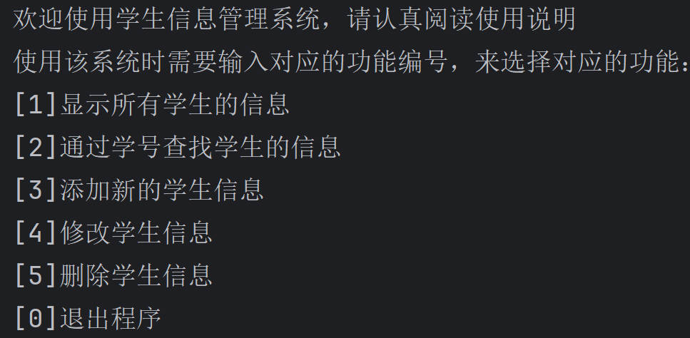
>
> + 显示所有学生的信息
>
>   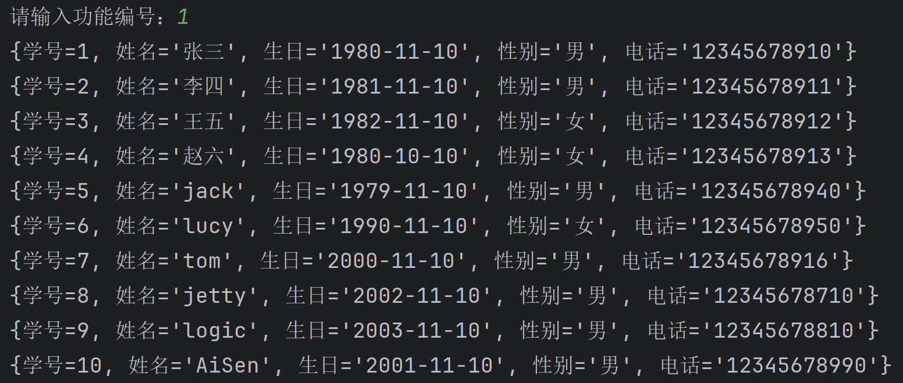
>
> + 通过学号查找学生的信息
>
>   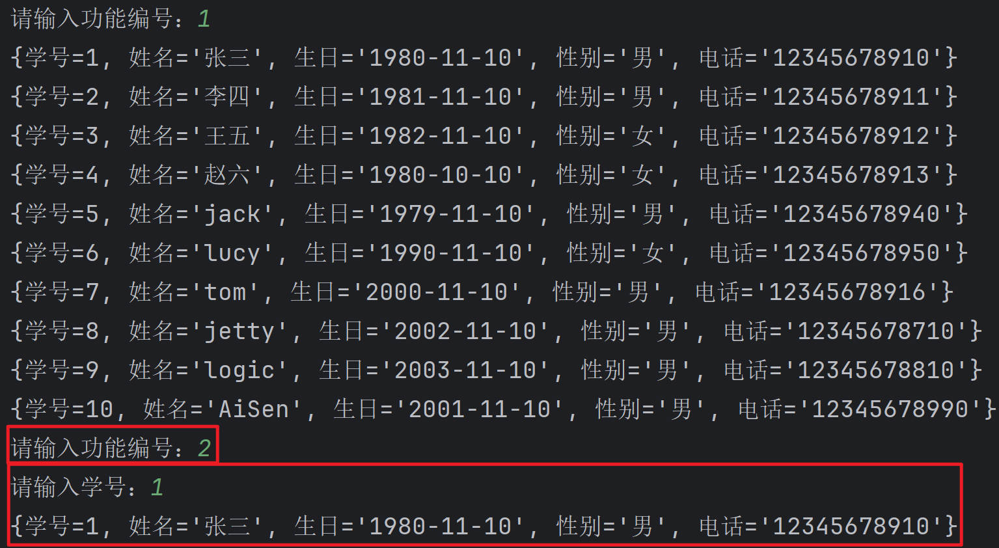
>
> + 添加新的学生信息
>
>   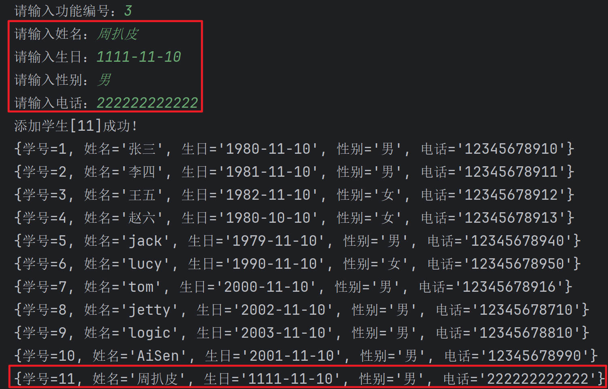
>
> + 修改学生信息
>
>   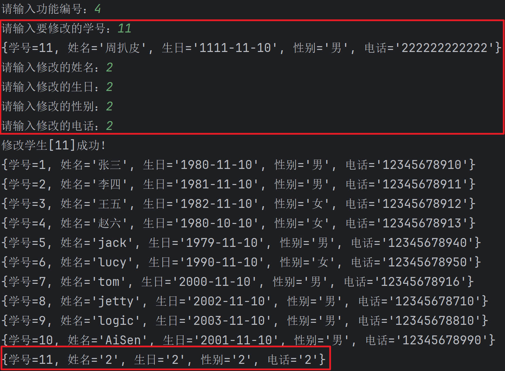
>
> + 删除学生信息
>
>   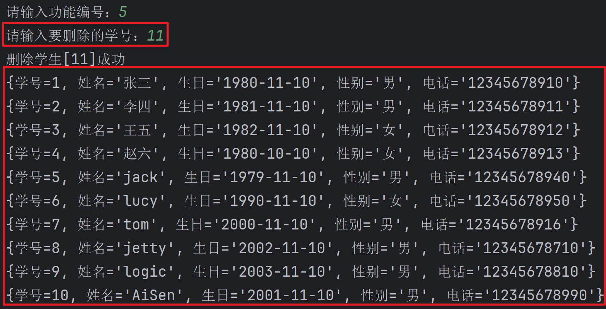
>
> + 退出程序
>
>   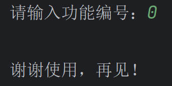
>


## IDEA中的Debug调试

### 如何使用IDEA找bug，解决问题

①在可能出现问题的代码附近添加断点。一般是将断点添加在方法体的某一行代码上。

②断点可以添加多个。点一次添加一个断点。再点一次断点则消失。

③添加断点后，如果想让程序运行到断点处停下来，需要使用Debug模式运行程序。

④Debug窗口中的按钮

⑤给断点添加条件

⑥Debug窗口中的隐藏按钮

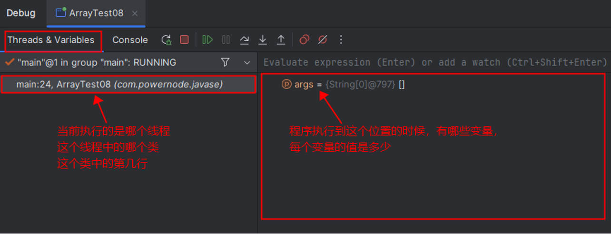

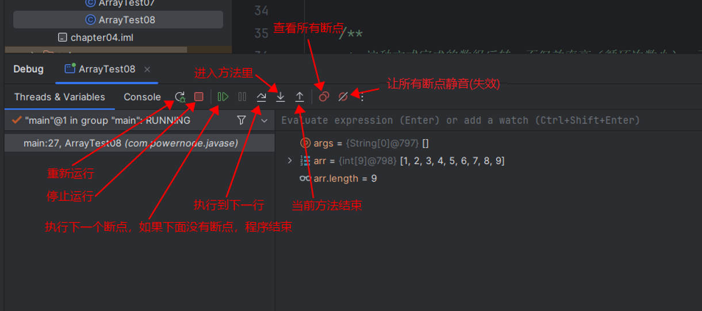

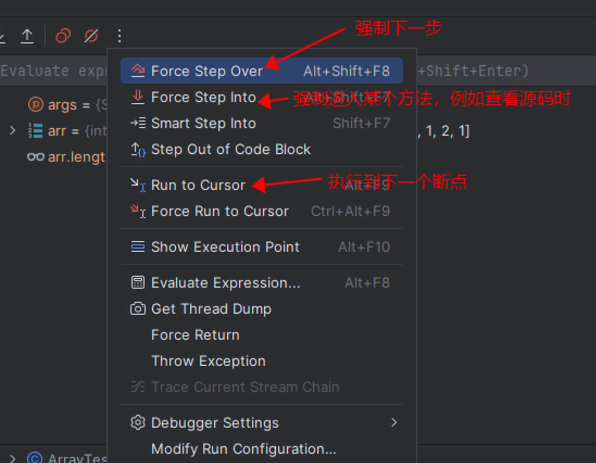

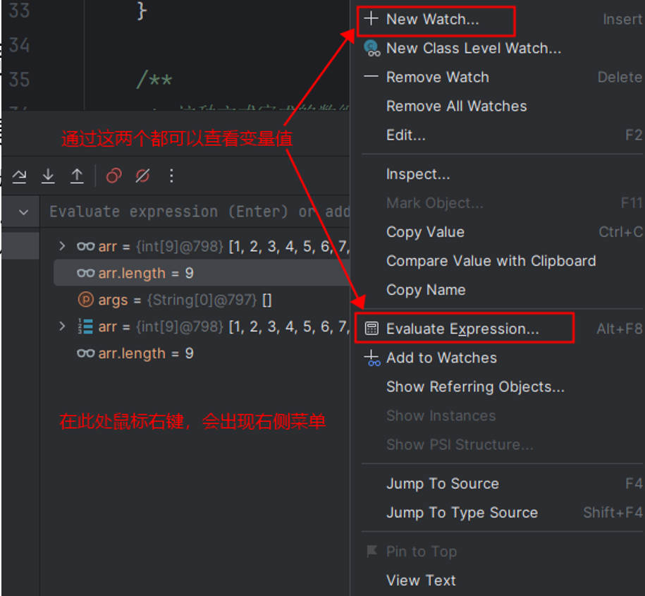

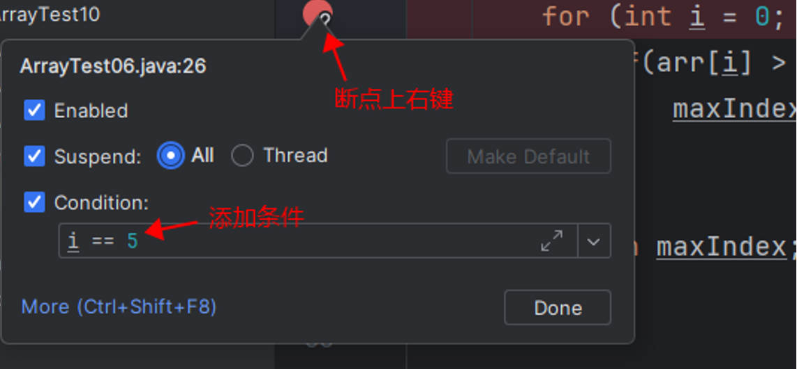


## JUnit单元测试

1.什么是单元测试，为什么要进行单元测试？

+ 一个项目是巨大的，只有保证你写的每一块都是正确的，最后整个项目才能正常运行。这里所谓的每一块就是`一个单元`。

2.做单元测试需要引入JUnit框架，JUnit框架在JDK中没有，需要额外引入，也就是引入JUnit框架的class文件（jar包）

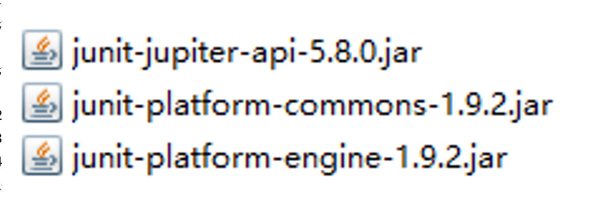

3.单元测试类（测试用例）怎么写？

+ 单元测试类名：XxxTest

  ```java
  // 项目方法
  Math.java
  ```

  ```java
  // 测试方法
  MathTest.java
  ```

4.单元测试方法怎么写？

```java
@Test
public void testSum(){
      // 实际值：程序运行之后的结果
      int actual = Math.sum(10,20);
      // 期望值：你觉得这个结果应该是多少
      int expected = 30;
      // 断言（断言机制）
      Assertions.assertEquals(expected,actual);
}
```

+ 单元测试方法需要使用`@Test注解标注`。

+ 单元测试`方法返回值类型`必须是`void`

+ 单元测试方法`形参个数为0`

+ 建议`单元测试方法名`：`testXxx`

5.什么是期望值，什么是实际值？

+ `期望值`就是在程序执行之前，你觉得`正确的输出结果应该是多少`

+ `实际值`就是程序在`实际运行之后得到的结果`

6..验证测试是否成功

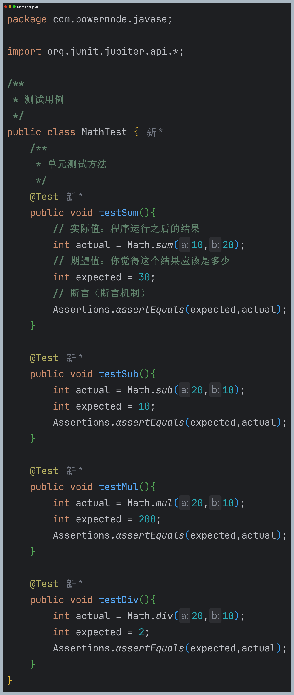

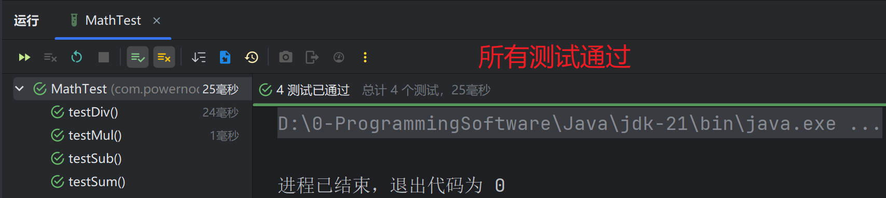

7.常见注解：

+ **`@BeforeAll` `@AfterAll `主要用于`在测试开始之前/之后执行必要的代码`。被标注的方法需要是`静态的`。**

  ```java
  package com.powernode.javase;
  
  import org.junit.jupiter.api.*;
  
  /**
   * 测试用例
   */
  public class MathTest {
  
      @BeforeAll
      public static void before() {
          System.out.println("开始执行单元测试！");
      }
  
      @AfterAll
      public static void after() {
          System.out.println("单元测试执行完毕！");
      }
  
  
      /**
       * 单元测试方法
       */
      @Test
      public void testSum(){
          System.out.println("testSum");
          // 实际值：程序运行之后的结果
          int actual = Math.sum(10,20);
          // 期望值：你觉得这个结果应该是多少
          int expected = 30;
          // 断言（断言机制）
          Assertions.assertEquals(expected,actual);
      }
  
      @Test
      public void testSub(){
          System.out.println("testSub");
          int actual = Math.sub(20,10);
          int expected = 10;
          Assertions.assertEquals(expected,actual);
      }
  
      @Test
      public void testMul(){
          System.out.println("testMul");
          int actual = Math.mul(20,10);
          int expected = 200;
          Assertions.assertEquals(expected,actual);
      }
  
      @Test
      public void testDiv(){
          System.out.println("testDiv");
          int actual = Math.div(20,10);
          int expected = 2;
          Assertions.assertEquals(expected,actual);
      }
  }
  ```

  ```java
  开始执行单元测试！
  testDiv
  testMul
  testSub
  testSum
  单元测试执行完毕！
  ```

+ **`@BeforeEach` `@AfterEach `主要用于`在每个测试方法执行前/后执行必要的代码`。**

  ```java
  package com.powernode.javase;
  
  import org.junit.jupiter.api.*;
  
  /**
   * 测试用例
   */
  public class MathTest {
  
      @BeforeEach
      public void beforeEach() {
          System.out.println("单元测试方法开始执行");
      }
  
      @AfterEach
      public void afterEach() {
          System.out.println("单元测试方法执行结束");
      }
  
  
      /**
       * 单元测试方法
       */
      @Test
      public void testSum(){
          System.out.println("testSum");
          // 实际值：程序运行之后的结果
          int actual = Math.sum(10,20);
          // 期望值：你觉得这个结果应该是多少
          int expected = 30;
          // 断言（断言机制）
          Assertions.assertEquals(expected,actual);
      }
  
      @Test
      public void testSub(){
          System.out.println("testSub");
          int actual = Math.sub(20,10);
          int expected = 10;
          Assertions.assertEquals(expected,actual);
      }
  
      @Test
      public void testMul(){
          System.out.println("testMul");
          int actual = Math.mul(20,10);
          int expected = 200;
          Assertions.assertEquals(expected,actual);
      }
  
      @Test
      public void testDiv(){
          System.out.println("testDiv");
          int actual = Math.div(20,10);
          int expected = 2;
          Assertions.assertEquals(expected,actual);
      }
  }
  ```

  ```java
  单元测试方法开始执行
  testDiv
  单元测试方法执行结束
  单元测试方法开始执行
  testMul
  单元测试方法执行结束
  单元测试方法开始执行
  testSub
  单元测试方法执行结束
  单元测试方法开始执行
  testSum
  单元测试方法执行结束
  ```

8.单元测试中使用Scanner失效怎么办？

+ **选中导航栏的“Help”，然后选中“Edit Custom VM Options...”，接着在“IDEA64.exe.vmoptions”文件中添加内容“`-Deditable.java.test.console=true`”，最后在重启IDEA即可解决**

  ```java
  @Test
  public void testAdd() {
         Scanner s =  new Scanner(System.in);
         int i = s.nextInt();
         System.out.println("程序执行到这里了！");
  }
  ```

  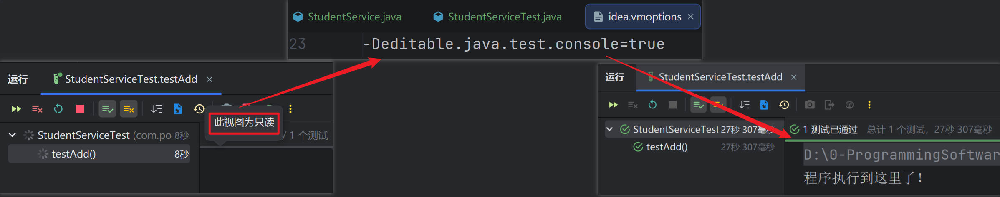


## 数据结构与算法

### 数据结构概述

①数据结构是指`用来存储和组织数据的一种方式`，就像在生活中我们用文件柜、书架、衣柜等来整理我们的物品一样，数据结构也可以帮助我们`整理和管理程序中的数据`。

②数据结构分为：数据的`逻辑结构`、数据的`物理结构`

1. 逻辑结构是指`数据元素之间的逻辑关系`，它是`从抽象的角度描述数据元素之间的关系`，`不涉及具体的存储方式或实现细节`。逻辑结构主要`关注问题的本质、特点和抽象模型`，是数据结构的逻辑表示。

2. 物理结构是指`数据结构在计算机内存中实际存储和组织的方式`。它是`从具体的角度描述数据结构的实现方式和存储结构`，包括`数据元素在内存中的存储分布和访问方式`等。物理结构主要`关注问题的具体实现和操作`。

3. **因此，逻辑结构与物理结构的区别在于：`逻辑结构`是`从抽象的角度描述数据元素之间的关系`，`物理结构`是`从具体的角度描述内存中数据元素的存储方式和组织形式`。`逻辑结构`主要`关注问题的本质和特点`，`物理结构`主要`关注问题的具体实现和操作`。**

③逻辑结构的划分？

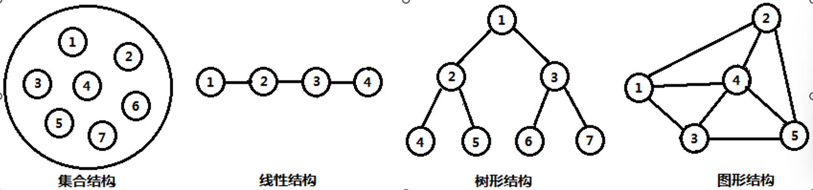

1. **集合结构：数据结构中的元素之间`除了在“同属一个集合”的关系外`，`别无其它关系`；**

2. **线性结构：数据结构中的元素存在`“一对一”的线性关系`，例如`冰糖葫芦`； **

3. **树形结构：数据结构中的元素存在`“一对多”的层次关系`，例如`公司组织架构`； **

4. **图形结构或网状结构：数据结构中的元素存在`“多对多”的任意关系`，例如`地图`。 **

④物理结构的划分？

1. **顺序存储结构：用一组`连续的存储空间单元`来`依次的存储数据元素`，例如`数组`。**

   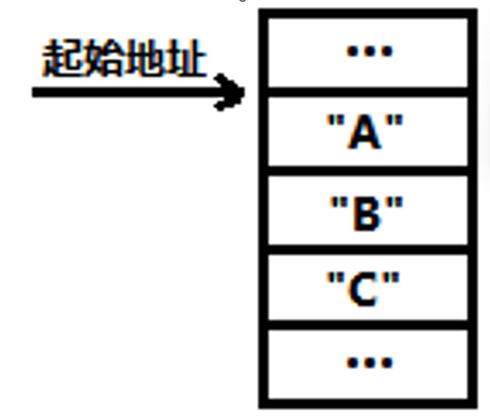

2. **链式存储结构：用一组`任意的存储单元`来存储元素，通过`保存地址`找到`相关联的元素`，元素之间的逻辑关系用`引用来表示`，例如`链表`。**

   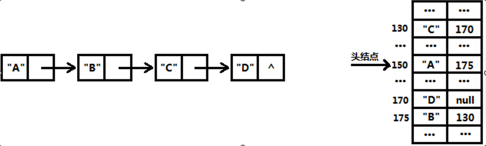

3. **散列存储结构：根据`节点key计算出该节点的存储地址`。例如：`java集合中的HashMap采用了散列存储结构，添加、查询速度都很快`。**

   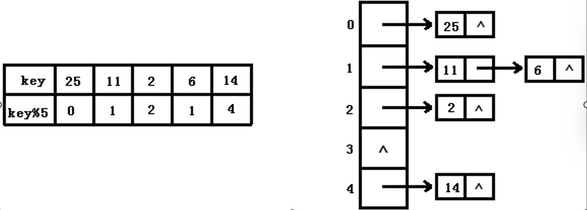


### 算法概述

①什么是算法？

算法就是`解决问题的方法和步骤`，可以让计算机`完成特定任务`，并提高计算机系统的`效率和性能`。就像烹饪食品需要遵循一定的步骤和配方一样，例如，做牛排需要选择牛排肉、煎炸的方式、烹饪的时间等，按照一定的步骤最终会有一个好的成品。一个良好的算法可以提高程序的执行效率。

②怎么评价一个算法好不好？

如何计算1+2+3+...+100的结果？

1. 算法1：通过循环，依次累加来实现。耗费时间

2. 算法2：使用递归来实现。耗费内存

3. 算法3：高斯算法。(1 + 100)*50。既节省时间，又节省空间。

同一问题可用不同的算法来解决，而一个算法的质量优劣将影响到算法乃至程序的效率。因此，我们学习算法目的在于选择合适算法和改进算法，一个算法的评价主要从`时间复杂度和空间复杂度`来考虑。

1. **时间复杂度：评估执行程序`所需的时间`，可以估算出程序`对处理器的使用程度`。**

2. **空间复杂度：评估执行程序`所需的存储空间`，可以估算出程序`对计算机内存的使用程度`。**


### 数据结构与算法的关系

①**程序的灵魂 = 数据结构 + 算法**

②数据结构可以提供算法的运行环境和基础，而算法又可以通过对数据结构的设计和操作，实现对数据的高效管理和处理。数据结构和算法是互相依存的，应该统一考虑，合理利用不同的数据结构和算法来解决实际问题，从而提高程序的执行效率。

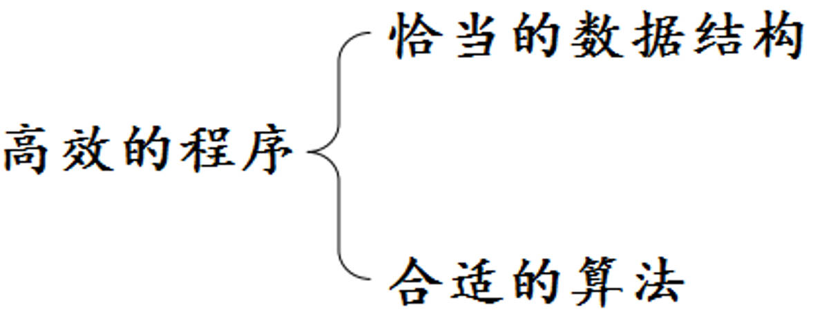


### 时间复杂度

①什么叫做时间复杂度？

我们用`T(n)`来表示算法中基本操作（例如比较、赋值、运算等）的`重复执行次数`。`n`是程序需要处理的`数据量`（专业术语叫做问题规模n）。

若有某个趋势函数`f(n)【f(n)代表了时间复杂度的趋势】`，使得`当n趋近于无穷大时`，`T(n)/f(n)`的极限值为`不等于零的常数`，则称`f(n)是T(n)的同数量级函数`。记作`T(n)=O(f(n))`，我们称O(f(n))为时间复杂度。我们也把它叫做`大O表示法`。

②时间复杂度计算步骤：

1. 计算基本操作的执行次数`T(n)`

在做算法分析时，一般默认考虑`最坏的情况`。因为最坏的情况下，基本操作执行的次数是最多的。对算法效率的评估会更加准确。

2. 通过T(n)得到`f(n)`

求T(n)的数量级f(n)，只需要将T(n)做两个操作：

（一）忽略`常数项`、`低次幂项`和`最高次幂项`的`系数`。

（二）例如，在`T(n)=4n2+2n+2`中，T(n)的数量级函数`f(n)=n2`。

计算T(n)的数量级f(n)，我们只要保证T(n)中的最高次幂正确即可，可以`忽略所有常数项、低次幂项和最高次幂的系数`。这样能够简化算法分析，将注意力集中在最重要的一点上：增长率。

3. 用大O表示时间复杂度

得到f(n)的结果是`n2`，所以时间复杂度是：`O(n2)`。

切记，时间频度不相同，时间复杂度有可能相同，如`T(n)=n2+3n+4`与`T(n)=4n2+2n+1`它们的`时间频度不同`，但`时间复杂度相同`，都为`O(n2)`。


### 常见的时间复杂度

①常数阶O(1)

无论代码执行了多少行，只要`没有循环等复杂结构`，那这个代码的`时间复杂度就都是O(1)`

```java
int num1 = 3, num2 = 5;

int temp = num1;

num1 = num2;

num2 = temp;

System.out.println("num1:" + num1 + " num2:" + num2);
```

在上述代码中，没有循环等复杂结构，它消耗的时间并不随着某个变量的增长而增长，那么无论这类代码有多长，即使有几万几十万行，都可以用`O(1)来表示它的时间复杂度`


②对数阶O(log2n)

O(log2n)指的就是：在循环中，每趟循环执行完毕后，`循环变量都放大两倍`。

```java
int n = 1024;

for(int i = 1; i < n; i *= 2) {

 System.out.println("hello powernode");

}
```

推算过程：假设该循环的执行次数为x次（也就是i的取值为2x），就满足了循环的结束条件，即满足了2x等于n，通过数学公式转换后，即得到了x = log2n，也就是说最多循环log2n次以后，这个代码就结束了，因此这个代码的时间复杂度为：O(log2n) 。 

同理，如果每趟循环执行完毕后，`循环变量都放大3倍`，那么时间复杂度就为：`O(log3n) `。


③线性阶O(n)

```java
int n = 100;

for(int i = 0; i < n; i++) {

 System.out.println("hello powernode");

}
```

在上述代码中，`for循环会执行n趟`，因此它消耗的时间是随着n的变化而变化的，因此这类代码都可以用O(n)来表示它的时间复杂度 。


④线性对数阶 O(nlog2n)

```java
int n = 100;

for(int i = 1; i <= n; i++) {

    for(int j = 1; j <= n; j *= 2) {
       System.out.println("hello powernode");
    }
}
```

线性对数阶O(nlog2n) 其实非常容易理解，将时间复杂度为O(log2n)的代码循环n遍的话，那么它的时间复杂度就是n*O(log2n)，也就是了O(nlog2n)。


⑤平方阶 O(n^2)

```java
int n = 100;

for(int i = 1; i <= n; i++) {
    for(int j = 1; j <= n; j++) {
       System.out.println("hello powernode");
    }
}
```

外层i的循环执行一次，内层j的循环就要执行n次。因为外层执行n次，总的就`需要执行n*n次`，也就是`需要执行n^2次`。因此这个代码时间复杂度为：`O（n2）`。

平方阶的另外一个例子：

```java
int n = 100;

for(int i = 1; i <= n; i++) {
    for(int j = i; j <= n; j++) {
       System.out.println("hello powernode");
    }
}
```

当i=1的时候，内侧循环执行n次，当i=2的时候，内侧循环执行（n-1）次，......一直这样子下去就可以构造出一个等差数列：`n+（n-1）+（n-2）+......+2+1 ≈ (n2)/2`。根据大O表示法，去掉最高次幂的系数，就可以得到时间复杂度为：`O（n^2）`。

同理，立方阶 O(n^3)，参考上面的O(n^2)去理解，也就是`需要用到3层循环`


⑥指数阶O(2n)

当n为10的时候，需要执行2^10次


⑦阶乘阶O(n!)

当n为10的时候，需要执行`10*9*8*...*2*1`次 


### 常见的时间复杂度耗时比较

①算法的时间复杂度是衡量一个算法好坏的重要指标。**一般情况下，随着`规模n的增大`，T(n)的`增长较慢`的算法为`最优算法`**

②其中x轴代表n值，y轴代表T(n)值。T(n)值随着n的值的变化而变化，其中可以看出`O(n!)和O(2^n)`随着n值的增大，它们的`T(n)值上升幅度非常大`，而`O(logn)、O(n)、O(nlogn)、O(n^2)`随着n值的增大，`T(n)值上升幅度相对较小`。

③常用的时间复杂度按照耗费的时间从小到大依次是：`O(1) < O(logn) < O(n) < O(nlogn) < O(n^2) < O(n^3) < O(2^n) < O(n!)`

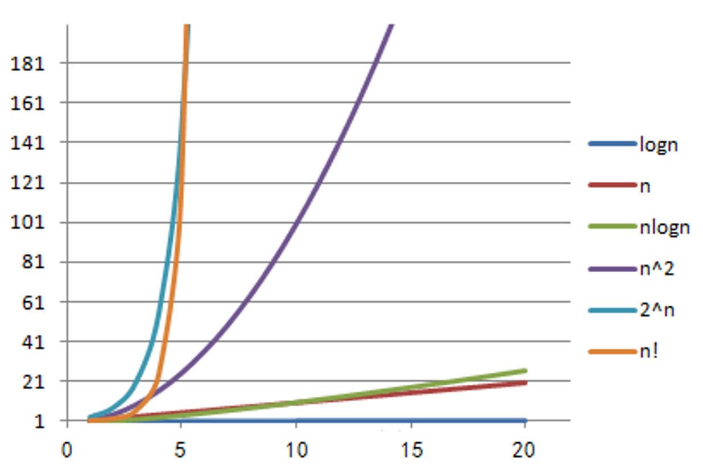


## 数组的排序算法


### 冒泡排序

①冒泡排序的核心思想？

相邻两个元素做比较大小，如果前一个元素大于后一个元素，则交换位置

```java
/**
 * 冒泡排序算法
 *
 * 分析原理：
 *  3, 2, 7, 6, 1
 *
 *  (1)参与比较的数据：3, 2, 7, 6, 1
 *  第一次循环：2, 3, 7, 6, 1
 *  第二次循环：2, 3, 7, 6, 1
 *  第三次循环：2, 3, 6, 7, 1
 *  第四次循环：2, 3, 6, 1, 7
 *
 *  (2)参与比较的数据：2, 3, 6, 1
 *  第一次循环：2, 3, 6, 1
 *  第二次循环：2, 3, 6, 1
 *  第三次循环：2, 3, 1, 6
 *
 *  (3)参与比较的数据：2, 3, 1
 *  第一次循环：2, 3, 1
 *  第二次循环：2, 1, 3
 *
 *  (4)参与比较的数据：2, 1
 *  第一次循环：1, 2
 *
 *  1     4
 *  2     3
 *  3     2
 *  4     1
 */
```

②升序排序代码如何实现？

```java
package com.powernode.javase;

import java.util.Arrays;

public class ArrayTest14 {
    public static void main(String[] args) {

        int [] arr = {5, 1, 2, 3, 4};

        // 调用冒泡排序的方法进行冒泡排序
        bubbleSort(arr);

        System.out.println(Arrays.toString(arr));
    }

    private static void bubbleSort(int[] arr) {
        for (int i = 0; i < arr.length - 1; i++) {
            for (int j = 0; j < arr.length - 1 - i; j++) {
                System.out.println("=======================");
                // 两个两个进行比较
                if (arr[j] > arr[j + 1]) {
                    int temp = arr[j];
                    arr[j] = arr[j + 1];
                    arr[j + 1] = temp;
                }
            }
        }
    }

    private static void bubbleSort(int[] arr) {
        for (int i = arr.length - 1; i >= 0; i--) {
            for (int j = 0; j < i; j++) {
                System.out.println("=======================");
                // 两个两个进行比较
                if (arr[j] > arr[j + 1]) {
                    int temp = arr[j];
                    arr[j] = arr[j + 1];
                    arr[j + 1] = temp;
                }
            }
        }
    }
}
```

```java
=======================
=======================
=======================
=======================
=======================
=======================
=======================
=======================
=======================
=======================
[1, 2, 3, 4, 5]
```

③冒泡排序算法优化？

```java
package com.powernode.javase;

import java.util.Arrays;

public class ArrayTest14 {
    public static void main(String[] args) {

        int [] arr = {5, 1, 2, 3, 4};

        // 调用冒泡排序的方法进行冒泡排序
        bubbleSort(arr);

        System.out.println(Arrays.toString(arr));
    }

    /**
     * 冒泡排序算法的优化
     * @param arr
     */
    private static void bubbleSort(int[] arr) {
        for (int i = arr.length - 1; i >= 0; i--) {
            // 默认是排好序的
            boolean flag = true;
            for (int j = 0; j < i; j++) {
                System.out.println("=======================");
                // 两个两个进行比较
                if (arr[j] > arr[j + 1]) {
                    int temp = arr[j];
                    arr[j] = arr[j + 1];
                    arr[j + 1] = temp;
                    flag = false;
                }
            }
            if (flag) {
                break;
            }
        }
    }
}
```

```java
=======================
=======================
=======================
=======================
=======================
=======================
=======================
[1, 2, 3, 4, 5]
```

因为冒泡排序存在提前排序成功的可能，因此我们需要对以上冒泡排序算法进行优化，此处的优化思路使用了“假设法”来实现


### 选择排序算法

①选择排序的核心思想？

```java
/**
 * 选择排序：
 *      核心原理：找出参与比较的这些数据中最小的，然后拿着这个最小的数据和参与比较的这堆数据中最左边的元素交换位置。
 *      优点：交换的次数比冒泡排序的少。执行效率比冒泡排序高。（冒泡排序中的元素每一次比完之后就交换，这个交换有时是没必要的。）
 *
 * 原理：
 *      (1)参与比较的数据：3, 2, 7, 6, 1
 *      第一次循环之后的结果：1, 2, 7, 6, 3
 *
 *      (2)参与比较的数据：x, 2, 7, 6, 3
 *      第二次循环之后的结果：1, 2, 7, 6, 3
 *
 *      (3)参与比较的数据：x, x, 7, 6, 3
 *      第三次循环之后的结果：1, 2, 3, 6, 7
 *
 *      (4)参与比较的数据：x, x, x, 6, 7
 *      第四次循环之后的结果：1, 2, 3, 6, 7
 */
```

在未排序的序列中，把未排序第一个元素和未排序的最小元素交换位置。

②升序排序代码如何实现？

```java
package com.powernode.javase;

import java.util.Arrays;

public class ArrayTest15 {
    public static void main(String[] args) {
        int[] arr = {3, 2, 7, 6, 1, 100, 200, 80, 870};

        selectSort(arr);

        System.out.println(Arrays.toString(arr));
    }

    private static void selectSort(int[] arr) {
        for (int i = 0; i < arr.length - 1; i++) {
            // 假定参与比较的这些数据中最左边的是最小的。
            int min = i;
            for (int j = i + 1; j < arr.length; j++) {
                if (arr[j] < arr[min]) {
                    min = j;
                }
            }
            if(min != i){ // 说明有更小的值
                // 交换位置（拿着当下的最小值和参与比较的这些数据中最前面的值交换位置）
                int temp = arr[min];
                arr[min] = arr[i];
                arr[i] = temp;
            }
        }
    }
}
```


## 数组的查找算法

### 线性查找

①线性查找是一种最简单粗暴的查找法了，采用逐一比对的方式进行对数组的遍历，如果发现了匹配值，返回数组下标即可。

②线性查找，优点是查找数组无需有序；其缺点是查找的次数多，效率低下。

```java
package com.powernode.javase;

/**
 * 线性查找算法。一个一个遍历，一个一个找。不需要排序。
 */
public class ArrayTest16 {
    public static void main(String[] args) {
        int[] arr = {102,3,4,54,5,6,67,7,78,8,8,87,67,6};
        // 找出以上数组中67元素的下标（67元素第一次出现处的下标）
        int num = 67;
        int index = search(arr, num);
        System.out.println(index >= 0 ? num + "第一次出现处的索引是：" + index : "对不起，没有这个数据");
    }

    private static int search(int[] arr, int num) {
        for (int i = 0; i < arr.length; i++) {
            if (num == arr[i]) {
                return i;
            }
        }
        return -1;
    }
}
```

> **测试结果:**
>
> ```jav
> 67第一次出现处的索引是：6
> ```


### 二分法查找

①`二分查找`又称`折半查找`，优点是比较次数少，查找速度快，平均性能好；缺点是要求待查数组必须排序，且执行插入和删除操作困难。因此，折半查找方法适用于不经常变动而查找频繁的数组。

②查找思路：

假设查找的数组为升序排序，则首先定义两个变量，分别用于保存查找元素（value）所在范围的最小索引值（min）和最大索引值（max）。

然后开启二分查找，每次查找前都定义一个mid变量，并设置该变量的初始值为：(max + min)/2。在查找的过程中，发生以下三种情况，则做对应的处理。

1. 如果arr[mid]大于value，则证明查找的元素在mid的左侧，那么更新max的值为：mid-1

2. 如果arr[mid]小于value，则证明查找的元素在mid的右侧，那么更新min的值为：mid+1

3. 如果arr[mid]等于value，则证明查找元素的索引值就是mid，返回mid的值即可！

```java
二分法查找/折半查找算法:
    
1. 二分法查找是建立在排序的基础之上的。
2. 二分法查找的原理？
    
从这里：1,20,50,77,80,99,101,256,666,888 找到 20 的下标？
begin = 0;
end = 9;
mid = 4
arr[mid] --> 80
20
arr[mid] > 20  （20在左边）

begin = 0;
end = 3;
mid = 1
arr[mid] --> 20
20
arr[mid] == 20 --> mid
```

在以上的操作中，我们不停的更改min和max的值，如果发生min大于max的情况，则证明查找的元素不存在，那么返回-1（表示找不到）即可！

```java
package com.powernode.javase;

public class ArrayTest17 {
    public static void main(String[] args) {
        int[] arr = {1,20,50,77,80,99,101,256,666,888};

        int num = 101;
        int index = binarySearch(arr, num);
        System.out.println(index >= 0 ? num + "的下标是：" + index : "找不到");
    }

    private static int binarySearch(int[] arr, int num) {
        int begin = 0;
        int end = arr.length - 1;

        while (begin <= end) {
            int mid = (begin + end) / 2;
            if (arr[mid] == num) {
                return mid;
            }else if (num > arr[mid]) {
                begin = mid + 1;
            }else {
                end = mid - 1;
            }

        }
        return -1;
    }
}
```

> **测试结果:**
>
> ```java
> 101的下标是：6
> ```


## Arrays工具类

**①Arrays.toString()方法：将数组转换成字符串**

```java
@Test
public void testToString() {
       int[] arr = {1,2,3,34,54};
       System.out.println(arr); // [I@48fa0f47
       System.out.println(Arrays.toString(arr)); // [1, 2, 3, 34, 54]

       String[] names = {"zhangsan", "lisi", "wangwu"};
       System.out.println(names); // [Ljava.lang.String;@6ac13091
       System.out.println(Arrays.toString(names)); // [zhangsan, lisi, wangwu]
}
```

**②Arrays.deepToString()方法：可以将二维数组转换成字符串**

```java
/**
* Arrays.deepToString()作用是：适合于将多维数组转换成字符串。
*/
@Test
public void testDeepToString(){
      // 适合于二维数组以及多维数组的。
      int[][] arr = {
              {12,2,3,3},
              {4,45,5,5},
              {1,1,1,1,1,1}
      };
      System.out.println(Arrays.toString(arr)); // [[I@3aefe5e5, [I@149e0f5d, [I@1b1473ab]
      System.out.println(Arrays.deepToString(arr)); // [[12, 2, 3, 3], [4, 45, 5, 5], [1, 1, 1, 1, 1, 1]]
}
```

**③Arrays.equals(int[] arr1, int[] arr2)方法：判断两个数组是否相等**

**④Arrays.equals(Object[] arr1, Object[] arr2)方法**

**⑤Arrays.deepEquals(Object[] arr1, Object[] arr2)方法：判断两个二维数组是否相等**

```java
@Test
public void testEquals(){
       int[] arr1 = {1,2,3};
       int[] arr2 = {2,1,3};
       System.out.println(Arrays.equals(arr1, arr2)); // false

       String[] names1 = new String[]{"abc", "def", "xyz"};
       String[] names2 = new String[]{"abc", "def", "xyz"};
       System.out.println(Arrays.equals(names1, names2)); // true
}
```

**⑥Arrays.sort(int[] arr)方法：基于快速排序算法，适合小型数据量排序。**

**⑦Arrays.sort(String[] arr)方法**

```java
package com.powernode.javase;

// 凡事自定义的类型要做比较的话，这个自定义类型必须实现一个接口：Comparable接口，并且实现compareTo方法，在这个方法中编写比较规则。
public class Person implements Comparable {

    private int age;
    private String name;

    public Person() {
    }

    public Person(int age) {
        this.age = age;
    }

    public int getAge() {
        return age;
    }
    public void setAge(int age) {
        this.age = age;
    }

    @Override
    public String toString() {
        return "Person{" +
                "age=" + age +
                '}';
    }

    @Override
    public int compareTo(Object o) {
        // 编写比较规则。
        // 根据年龄进行比较
        // p1.compareTo(p2) p1和p2之间进行比较。
        // this是p1
        // o是p2
        // 当前对象的年龄
        //this.age;

        // 另一个对象的年龄
        Person person = (Person) o;
        //person.age;

        // 按照年龄进行比较。
        return this.age - person.age;
        //return person.age - this.age;

        // 按照字符串进行比较。
        // 升序
        //return this.name.compareTo(person.name);
        // 降序
        //return person.name.compareTo(this.name);
    }
}
```

```java
@Test
public void testSort(){
       int[] arr = {1,3,45,5,6,7,87,8};
       Arrays.sort(arr);
       System.out.println(Arrays.toString(arr)); // [1, 3, 5, 6, 7, 8, 45, 87]

       String[] strs = {"a", "ac", "ab", "b"};
       // 应该是根据字典的顺序排序的。
       Arrays.sort(strs);
       System.out.println(Arrays.toString(strs)); // [a, ab, ac, b]

       // 能不能对Person数组排序
       Person p1 = new Person(20);
       Person p2 = new Person(22);
       Person p3 = new Person(19);
       Person p4 = new Person(18);
       /*
       java.lang.ClassCastException: class com.powernode.javase.Person cannot be cast to class java.lang.Comparable
       猜测，底层一定有这样一行代码：
       Comparable c = (Comparable)p1; 为什么会报这样的错误呢？也进一步说明了我们的Person类不是可比较的。
       Comparable字面意思：可比较的。
        */
        Person[] persons = {p1, p2, p3, p4};
        // 排序
        Arrays.sort(persons);
        System.out.println(Arrays.toString(persons)); // [Person{age=18}, Person{age=19}, Person{age=20}, Person{age=22}]
}
```

**⑧Arrays.parallelSort(int[] arr)方法：基于分治的`归并排序算法`，支持`多核CPU排序`，`适合大数据量排序`。**

```java
/**
* 启用多核CPU并行排序。
* 首先你的电脑是支持多核的。
* 注意：数据量太小的话，不要调用这个方法，因为启动多核也是需要耗费资源的。
* Java8引入的方法。
* 数据量较大的时候，建议使用这个方法效率比较高。
*
* 通过源码分析：如果超过4096个长度，则会启用多核。
* 4096以内就自动调用sort方法就行了。
*/
@Test
public void testParallelSort(){
       int [] arr = new int[100000000];

       Random random = new Random();
       for (int i = 0; i < arr.length; i++) {
           int num = random.nextInt(100000000);
           arr[i] = num;
       }

       // 获取系统当前时间的毫秒数（1970-1-1 0:0:0 000到当前系统时间的总毫秒数 1秒=1000毫秒）
       long begin = System.currentTimeMillis();

       // 排序
       Arrays.parallelSort(arr);

       // 获取系统当前时间的毫秒数
       long end = System.currentTimeMillis();

       // 耗时
       System.out.println(end - begin); // 1900 毫秒 = 1.9秒
}
```

**⑨int binarySearch(int[] arr, int elt)方法：二分法查找**

```java
@Test
public void testBinarySearch(){
       int[] arr = {1,2,3,4,5,6,7};
       System.out.println(Arrays.binarySearch(arr, 5)); // 4
}
```

**⑩Arrays.fill(int[] arr, int data)方法：填充数组**

**⑪Arrays.fill(int[] a, int fromIndex, int toIndex, int val)方法**

```java
@Test
public void testFill(){
       int[] arr = new int[5]; // 5个0
       Arrays.fill(arr,10);
       System.out.println(Arrays.toString(arr)); // [10, 10, 10, 10, 10]

       // 不包含toIndex
       Arrays.fill(arr, 1, 3, 100); // [10, 100, 100, 10, 10]
       //arr, fromIndex, toIndex, val
       System.out.println(Arrays.toString(arr));
}
```

**⑫int[] Arrays.copyOf(int[] original, int newLength)方法：数组拷贝**

**⑬int[] Arrays.copyOfRange(int[] original, int from, int to)**

```java
@Test
public void testCopyOf(){
       // 数组拷贝
       int[] arr = {1,2,3,4,5,6,7,8,9};
       int[] newArr = Arrays.copyOf(arr, 3);
       System.out.println(Arrays.toString(newArr)); // [1, 2, 3]

       // to不包含
       int[] newArr2 = Arrays.copyOfRange(arr, 2, 4);
       // original, from, to
       System.out.println(Arrays.toString(newArr2)); // [3, 4]
}
```

**⑭Arrays.asList(T... data)方法：将一组数据转换成List集合。**

```java
@Test
public void testAsList(){
       // 将一串数字转换成List集合。
       List list = Arrays.asList(1, 2, 3, 3, 4, 4, 5, 5, 6, 6, 7);
       for (int i = 0; i < list.size(); i++) {
           System.out.println(list.get(i));
           /*1
            2
            3
            3
            4
            4
            5
            5
            6
            6
            7*/
       }
}
```
