## 注解概述

```java
1.什么是注解？
	注解是JDK1.5才引入的。
	注解可以标注在 类上，属性上，方法上 等。
	注解可以做到在不改变代码逻辑的前提下在代码中嵌入补充信息。
           
2. 注解与注释
	注释：给程序员看的，编译器编译时会忽略注释。
	注解：给编译器看的，或给其它程序看的，程序根据有没有这个注解来决定不同的处理方式。

3.注解的重要性
	框架是如何实现的：框架 = 反射 + 注解 + 设计模式
```


## Java预置注解

```java
1.@Deprecated
	用来标记过时的元素，在编译阶段遇到这个注解时会发出提醒警告，告诉开发者正在调用一个过时的元素比如过时的类、过时的方法、过时的属性等。
    
2.@Override
	修饰实例方法，则该方法必须是个重写方法，否则就会编译失败。
    
3.@SuppressWarnings（抑制警告的注解）：在实际开发中，建议尽量不要忽略警告，而是真正的去解决警告。
	@SuppressWarnings("rawtypes")：抑制未使用泛型的警告
	@SuppressWarnings("resource")：抑制未关闭资源的警告
	@SuppressWarnings("deprecation")：抑制使用了已过时资源时的警告
	@SuppressWarnings("all")：抑制所有警告
    
4.@FunctionalInterface
	“函数式接口”的注解，这个是 JDK1.8 版本引入的新特性。使用@FunctionalInterface标注的接口，则该接口就有且只能存在一个抽象方法，否则就会发生编译错误。（注意：接口中的默认方法或静态方法可以有多个。）
```


### @Deprecated注解

```java
JDK的内置注解：@Deprecated
    1.被这个注解标注的元素已过时
    2.这个注解是给编译器看的。编译器看到这个注解之后会有警告提示信息
    3. 经过测试 @Deprecated 注解可以标注的元素很多，例如：类上，方法上，属性上....
```

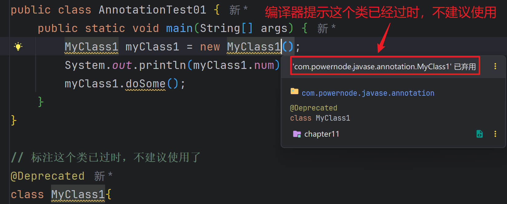

```java
package com.powernode.javase.annotation;

public class AnnotationTest01 {
    public static void main(String[] args) {
        MyClass1 myClass1 = new MyClass1();
        System.out.println(myClass1.num);
        myClass1.doSome();
    }
}

// 标注这个类已过时，不建议使用了
@Deprecated
class MyClass1{

    // since属性值表示从哪个版本开始已过时。
    // forRemoval属性值如果是true表示已移除。
    @Deprecated(since = "9", forRemoval = true)
    public int num = 100;

    @Deprecated
    public void doSome(){

    }
}
```


### @Override注解

```java
JDK内置的注解：@Override
	1. 给编译器看的。
	2. 这个注解标注实例方法，被标注的方法必须是重写父类的方法。
	3. 这个注解就是在编译阶段进行方法检查的，检查这个方法是否重写了父类方法，如果没有重写父类方法，则报错。
	4. 通过测试这个@Override注解只能使用在实例方法上。其他位置不能应用。
```

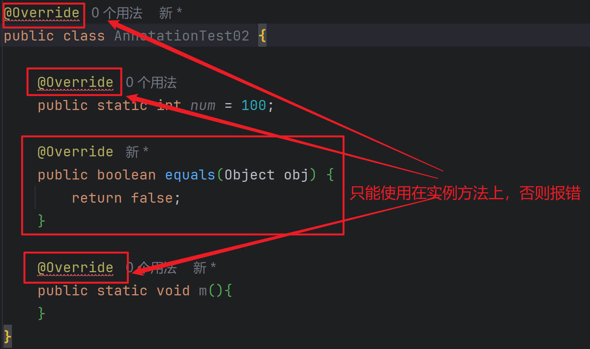

```java
package com.powernode.javase.annotation;

//@Override
public class AnnotationTest02 {

    //@Override
    public static int num = 100;

    @Override
    public boolean equals(Object obj) {
        return false;
    }

    //@Override
    public static void m(){
    }
}
```


### @SuppressWarnings注解

```java
Java内置注解：@SuppressWarnings
1. 主要作用是：抑制警告。
    
2. 该注解常见的属性值：
	rawtypes：抑制未使用泛型的警告
	resource: 抑制未关闭资源的警告
	deprecation: 抑制使用了已过时资源时的警告
	all：抑制所有警告
```

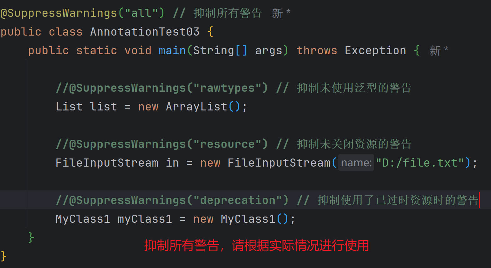

```java
package com.powernode.javase.annotation;

import java.io.FileInputStream;
import java.util.ArrayList;
import java.util.List;

@SuppressWarnings("all") // 抑制所有警告
public class AnnotationTest03 {
    public static void main(String[] args) throws Exception {

        //@SuppressWarnings("rawtypes") // 抑制未使用泛型的警告
        List list = new ArrayList();

        //@SuppressWarnings("resource") // 抑制未关闭资源的警告
        FileInputStream in = new FileInputStream("D:/file.txt");

        //@SuppressWarnings("deprecation") // 抑制使用了已过时资源时的警告
        MyClass1 myClass1 = new MyClass1();
    }
}
```


### @FunctionalInterface注解

```java
关于Java内置注解：@FunctionalInterface
	1. 这个注解是专门用来标注接口的。
	2. 被标注的接口必须是一个函数式接口，如果不是函数式接口，则编译器报错。
	3. 这个注解也是给编译器看的。
	4. 什么是函数式接口？
    		如果这个接口中抽象方法只有一个（有且仅有一个）。称为函数式接口。
	5. 被 @FunctionalInterface 标注的接口中，允许有多个默认方法和静态方法。
```

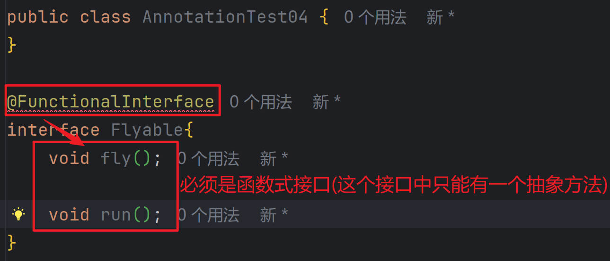

```java
package com.powernode.javase.annotation;

public class AnnotationTest04 {
}

@FunctionalInterface
interface Flyable{
    void fly();

    //void run();

    default void run(){
        System.out.println("默认方法是可以的");
    }

    static void doSome(){
        System.out.println("静态方法");
    }
}
```


## 自定义注解


### 定义注解和使用注解

```java
1.自定义注解
	使用 @interface 来定义注解。
	默认情况下注解可以出现在类上、方法上、属性上、构造方法上、方法参数上等......
	所有自定义的注解，它的父类是：java.lang.annotation.Annotation

2.注解的使用
	@MyAnnotation(自己定义的注解名)
```

> **定义注解:**

```java
package com.powernode.javase.annotation;

/**
 * 自定义的注解。（以下这是注解的定义过程！！！！！）
 */
public @interface MyAnnotation {
}
```

> **使用注解:**

```java
package com.powernode.javase.annotation;

/**
 * 以下是使用注解的过程！！！！！！
 */
@MyAnnotation
public class AnnotationTest05 {
    @MyAnnotation
    private String name;

    @MyAnnotation
    public void doSome(){

    }

    public void doOther(@MyAnnotation String name, @MyAnnotation String password){

    }

    public void toDo(
            @MyAnnotation
            String name,
            @MyAnnotation
            String password){

    }
}
```


### 定义注解的属性

```java
1.注解在使用时必须给属性赋值，除非你使用了default关键字为属性指定了默认值。
    String driver() default "com.mysql.cj.jdbc.Driver"; // 使用 default 关键字来指定属性的默认值。
	如果没有指定默认值:
	driver="oracle.jdbc.driver.OracleDriver",
    
2.如果属性只有一个，并且属性名是value时，使用注解时value可以省略不写。
    /**
     * 有一个属性，并且这个属性的名字是value
     */
    String value();

	@Table(value="t_user")
	//如果属性名是value的话， 在使用注解的时候，该属性名可以省略。
	@Table("t_user")
    
3.如果属性是一个数组，使用注解时，数组值只有一个，数组的大括号是可以省略的。
    String[] value();
	
	@Table(value={"t_user1", "t_user2"})
	// value可以省略。
	@Table({"t_user1", "t_user2"})
	// value可以省略。
	@Table({"t_user"})
	@Table(value = "t_user")
    
4.注解也可以定义属性，不过属性定义时，属性名后面必须加一个小括号。
    
5.属性的类型只能是：
	byte，short，int，long，float，double，boolean，char
	String、Class、枚举类型、注解类型
	以上所有类型的一维数组形式
```

```java
package com.powernode.javase.annotation;

/**
 * 这是一个数据库信息的注解（自定义的注解）
 */
public @interface DataBaseInfo {
    /**
     * 注解也可以定义属性，但是属性定义时有要求，属性名后面必须添加：()
     * 语法：
     *      属性的类型 属性的名字();
     */
    String driver() default "com.mysql.cj.jdbc.Driver"; // 使用 default 关键字来指定属性的默认值。
    String url();
    String user();
    String password();

    byte b() default 0;
    short s() default 0;
    int i() default 0;
    long l() default 0L;
    float f() default 0.0F;
    double d() default 0.0;
    boolean flag() default false;
    char c() default '0';
    Class clazz() default String.class;
    Season season() default Season.SPRING;
    MyAnnotation myAnnotation();

    /**
     * 可以是一维数组形式
     * @return
     */
    String[] names();

    // 注解的属性的数据类型，必须是以上的几种类型，或者这几种类型的一维数组，不能是其他类型。
    //Object obj();
}
```

```java
package com.powernode.javase.annotation;

/**
 * 季节的枚举类型
 */
public enum Season {
    SPRING, SUMMER, AUTUMN, WINTER
}
```

```java
package com.powernode.javase.annotation;

/**
 * 使用自定义的注解：@DataBaseInfo
 */
public class AnnotationTest06 {
    // 语法规则：如果这个注解中有属性，那么使用的时候，必须给属性赋值。没有赋值则报错。
    // 除非你定义注解的时候给属性指定了默认值。
    // 怎么给属性赋值？语法：@DataBaseInfo(属性名=值,属性名=值,属性名=值,属性名=值,属性名=值)
    @DataBaseInfo(
            //driver="oracle.jdbc.driver.OracleDriver",
            url="jdbc:mysql://localhost:3306/powernode",
            user="root",
            password="123456",
            myAnnotation=@MyAnnotation,
            names={"zhangsan", "lisi", "wangwu"},
            flag=true,
            i=100,
            clazz=Integer.class,
            season=Season.WINTER
    )
    public void connDB(){

    }
}
```

> **当`属性名是value`和数组中`只有一个值`时:**

```java
package com.powernode.javase.annotation;

public @interface Table {
    /**
     * 有一个属性，并且这个属性的名字是value
     */
    //String value();

    String[] value();
}
```

```java
package com.powernode.javase.annotation;

//@Table(value="t_user")
// 如果属性名是value的话， 在使用注解的时候，该属性名可以省略。
//@Table("t_user")
//@Table(value={"t_user1", "t_user2"})
// value可以省略。
//@Table({"t_user1", "t_user2"})
//@Table({"t_user"})
@Table(value = "t_user")
public class AnnotationTest07 {
    public static void main(String[] args) {

    }
}
```


## 元注解

```java
1.用来标注注解的注解叫做元注解。(也是JDK内置的注解。)
    
2.常用的元注解：
	@Retention：设置注解的保持性
	@Target：设置注解可以出现的位置
	@Documented：设置注解是否可以生成到帮助文档中
	@Inherited：设置注解是否支持继承
	@Repeatable：设置注解在某一个元素上是否可以重复使用（Java8的新特性。）
```

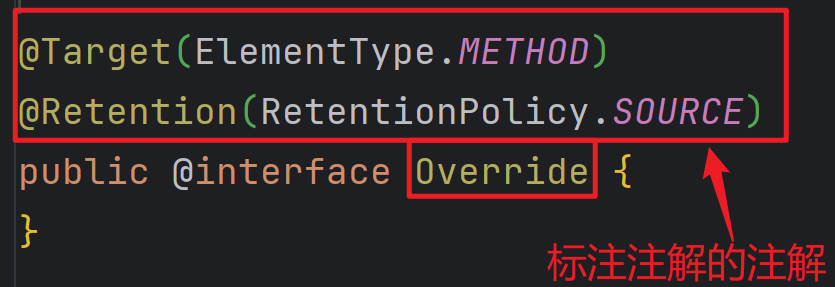


### @Retention(设置注解的保持性)

```java
1.Retention英文意思有保留、保持的意思，它表示注解存在阶段是保留在源代码（编译期），字节码（类加载）或者运行时（JVM中运行）。
    
2.在@Retention注解中使用枚举RetentionPolicy来表示注解保留时期。
	@Retention(RetentionPolicy.SOURCE)：注解仅存在于源代码中，在字节码文件中不包含。
	@Retention(RetentionPolicy.CLASS)：注解在字节码文件中存在，但运行时无法获得（默认）。
	@Retention(RetentionPolicy.RUNTIME)：注解在字节码文件中存在，且运行时可通过反射获取。
```

```java
package com.powernode.javase.annotation.meta1;

import java.lang.annotation.Retention;
import java.lang.annotation.RetentionPolicy;

//@Retention(value= RetentionPolicy.SOURCE) // @MyAnnotation 注解保留在源码中。
//@Retention(value= RetentionPolicy.CLASS) // @MyAnnotation 注解保留在字节码中，这是默认的行为，但不能被反射。
//@Retention(value= RetentionPolicy.RUNTIME) // @MyAnnotation 注解保留在字节码中，并且在运行时可以被反射。
@Retention(RetentionPolicy.SOURCE)
public @interface MyAnnotation {
}
```

```java
package com.powernode.javase.annotation.meta1;

import java.lang.annotation.Annotation;

@MyAnnotation // 这个注解会被保留到字节码中，并且在运行时可以被反射。
public class Test {

    public static void main(String[] args) {
        // 获取这个类
        Class<Test> testClass = Test.class;

        // 获取这个类上的注解
        //MyAnnotation annotation = testClass.getAnnotation(MyAnnotation.class);
        // java.lang.annotation.Annotation是所有注解的老祖宗。
        Annotation annotation = testClass.getAnnotation(MyAnnotation.class);

        System.out.println(annotation); // null
    }
}
```


### @Target(设置注解的位置)

```java
1.用于描述注解可以使用的位置，该注解使用ElementType枚举类型用于描述注解可以出现的位置
    
2.ElementType有如下枚举值：
	@Target(ElementType.TYPE)：作用于接口、类、枚举、注解
	@Target(ElementType.FIELD)：作用于属性、枚举的常量
	@Target(ElementType.METHOD)：作用于方法
	@Target(ElementType.PARAMETER)：作用于方法参数
	@Target(ElementType.CONSTRUCTOR)：作用于构造方法
	@Target(ElementType.LOCAL_VARIABLE)：作用于局部变量
	@Target(ElementType.ANNOTATION_TYPE)：作用于注解
	@Target(ElementType.PACKAGE)：作用于包
	@Target(ElementType.TYPE_PARAMETER)：作用于泛型，即泛型方法、泛型类和泛型接口。 
	@Target(ElementType.TYPE_USE)：作用于任意类型。
```

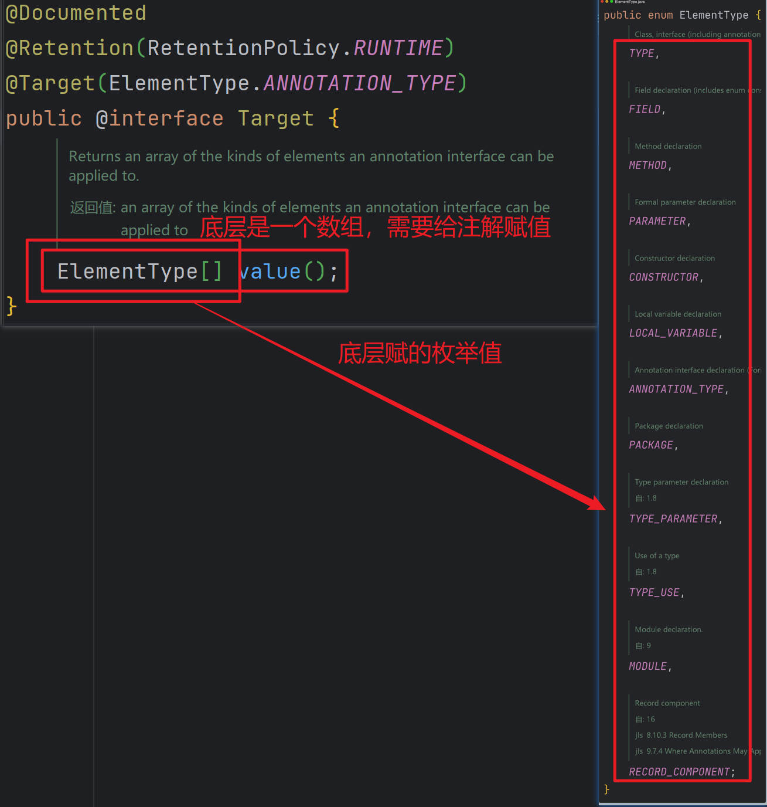

```java
package com.powernode.javase.annotation.meta2;

import java.lang.annotation.ElementType;
import java.lang.annotation.Target;

//@Target(value={ElementType.METHOD})
//@Target(ElementType.METHOD) // 限定注解只能出现在方法上
@Target({ElementType.METHOD, ElementType.TYPE, ElementType.FIELD})
public @interface MyAnnotation {
}
```

```java
package com.powernode.javase.annotation.meta2;

@MyAnnotation
public class Test {

    @MyAnnotation
    int num = 100;

    @MyAnnotation
    public static void main(String[] args) {

    }
}
```


### @Documented(设置注解可以被文档化)

```java
Documented的英文意思是文档。
    1.使用javadoc.exe工具可以从程序源代码中抽取类、方法、属性等注释形成一个源代码配套的API帮助文档，而该工具抽取时默认不包括注释内容。
    
    2.如果使用的注解被@Documented标注，那么该注解就能被javadoc.exe工具提取到API文档。
```

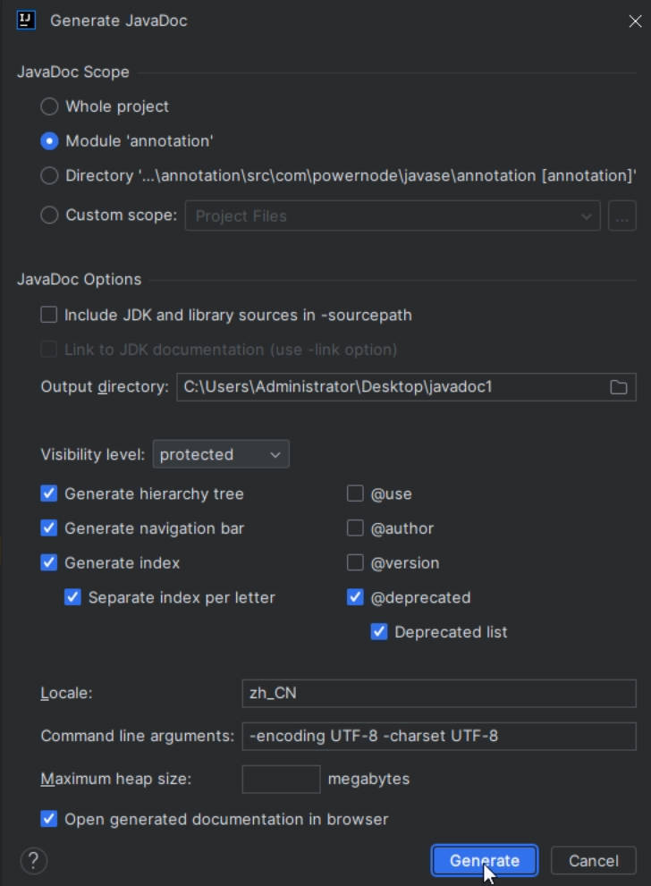

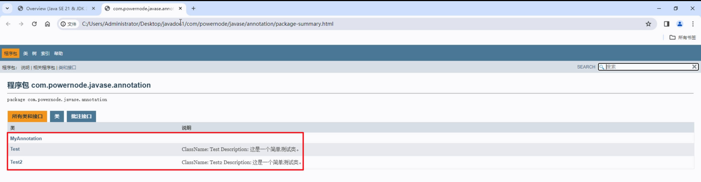

```java
package com.powernode.javase.annotation;

import java.lang.annotation.Documented;

@Documented
public @interface MyAnnotation {
}
```

```java
package com.powernode.javase.annotation;

/**
 * ClassName: Test
 * Description: 这是一个简单测试类。
 * <p>
 * Datetime: 2024/1/31 11:30
 * Author: XINGJI
 * Version: 1.0
 */
public class Test {
    /**
     * number field
     */
    @MyAnnotation
    public static int num = 100;

    /**
     * do something!
     */
    @MyAnnotation
    public void doSome(){

    }

    /**
     * constructor
     */
    @MyAnnotation
    public Test(){

    }
}
```

```java
package com.powernode.javase.annotation;

/**
 * ClassName: Test2
 * Description: 这是一个简单测试类。
 * <p>
 * Datetime: 2024/1/31 11:30
 * Author: XINGJI
 * Version: 1.0
 */
public class Test2 {
}
```


### @Inherited(设置注解可以被继承)

```java
Inherited的英文意思是继承，但是这个继承和我们平时理解的继承大同小异，一个被@Inherited注解了的注解修饰了一个父类，则它的子类也继承了父类的注解。
```

```java
package com.powernode.javase.annotation.meta3;

import java.lang.annotation.Inherited;
import java.lang.annotation.Retention;
import java.lang.annotation.RetentionPolicy;

@Retention(RetentionPolicy.RUNTIME)
@Inherited // 表示 @MyAnnotation注解能够被继承
public @interface MyAnnotation {
}
```

```java
package com.powernode.javase.annotation.meta3;

@MyAnnotation
public class Animal {
}
```

```java
package com.powernode.javase.annotation.meta3;

public class Cat extends Animal {
}
```

```java
package com.powernode.javase.annotation.meta3;

public class Test {
    public static void main(String[] args) {
        Class<Cat> catClass = Cat.class;
        MyAnnotation annotation = catClass.getAnnotation(MyAnnotation.class);
        System.out.println(annotation); // @com.powernode.javase.annotation.meta3.MyAnnotation()
    }
}
```


### @Repeatable(设置注解可以重复出现在某个元素上)

```java
Repeatable表示可重复的含义，该注解属于JDK1.8版本的新特性。
```

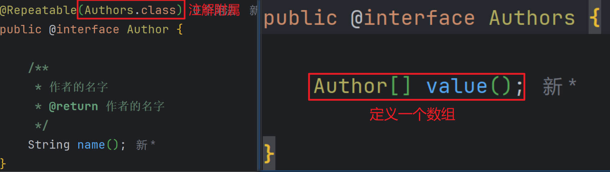

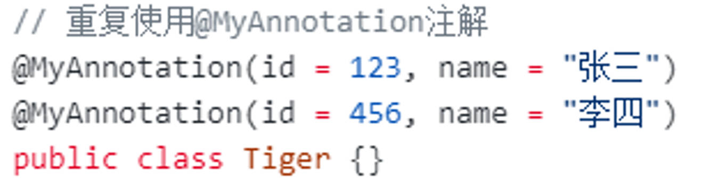

```java
package com.powernode.javase.annotation.meta4;

import java.lang.annotation.Repeatable;

@Repeatable(Authors.class)
public @interface Author {

    /**
     * 作者的名字
     * @return 作者的名字
     */
    String name();
}
```

```java
package com.powernode.javase.annotation.meta4;

public @interface Authors {

    Author[] value();

}
```

```java
package com.powernode.javase.annotation.meta4;

public class Test {

    @Author(name = "张三")
    @Author(name = "李四")
    public void doSome(){

    }
}
```


## 反射注解

```java
1.获取类上的所有注解
	Annotation[] annotations = clazz.getAnnotations();

2.获取类上指定的某个注解
	clazz.isAnnotationPresent(AnnotationTest01.class)
	AnnotationTest01 an = clazz.getAnnotation(AnnotationTest01.class);

3.获取属性上的所有注解
	Annotation[] annotations = field.getAnnotations();

4.获取属性上指定的某个注解
	field.isAnnotationPresent(AnnotationTest02.class)
	AnnotationTest02 an = field.getAnnotation(AnnotationTest02.class);

5.获取方法上的所有注解
	Annotation[] annotations = method.getAnnotations();

6.获取方法上指定的某个注解
	method.isAnnotationPresent(AnnotationTest02.class)
	AnnotationTest02 an = method.getAnnotation(AnnotationTest02.class);
```


> **以类为示例:**
>
> 1.获取类上的所有注解
> 	Annotation[] annotations = clazz.getAnnotations();
>
> 2.获取类上指定的某个注解
> 	clazz.isAnnotationPresent(AnnotationTest01.class)
> 	AnnotationTest01 an = clazz.getAnnotation(AnnotationTest01.class);

```java
package com.powernode.javase.annotation.reflect;

import java.lang.annotation.*;

@Target({ElementType.TYPE, ElementType.FIELD, ElementType.METHOD})
@Retention(RetentionPolicy.RUNTIME)
@Inherited
@Documented
public @interface Annotation1 {
    String name() default "";
    int age() default 0;
}
```

```java
package com.powernode.javase.annotation.reflect;

import java.lang.annotation.*;

@Target({ElementType.TYPE, ElementType.FIELD, ElementType.METHOD})
@Retention(RetentionPolicy.RUNTIME)
@Inherited
@Documented
public @interface Annotation2 {
    String email() default "";
    double price() default 0.0;
}
```

```java
package com.powernode.javase.annotation.reflect;

@Annotation1(name="zhangsan22222", age=3333)
@Annotation2(email="zhangsan@123.com", price = 3000.5)
public class MyClass {

    @Annotation1
    @Annotation2
    String s;

    @Annotation1
    @Annotation2
    public void doSome(){

    }
}
```

```java
package com.powernode.javase.annotation.reflect;

public class Test {
    public static void main(String[] args) {
        // 获取类
        Class<MyClass> mcClass = MyClass.class;

        // 获取类上的所有注解
        /*Annotation[] annotations = mcClass.getAnnotations();
        for(Annotation a : annotations){
            System.out.println(a);
        }*/

        // 判断该类上是否存在这个注解
        if (mcClass.isAnnotationPresent(Annotation1.class)) {
            // 获取指定的某个注解
            Annotation1 a1 = mcClass.getAnnotation(Annotation1.class);
            // 访问注解对象中的属性
            System.out.println(a1.name());
            System.out.println(a1.age());
        }

        if (mcClass.isAnnotationPresent(Annotation2.class)) {
            Annotation2 a2 = mcClass.getAnnotation(Annotation2.class);
            System.out.println(a2.email());
            System.out.println(a2.price());
        }
    }
}
```

```java
zhangsan22222
3333
zhangsan@123.com
3000.5
```


## 综合练习

```java
数据库是用来组织数据的，数据库使用表来组织数据，一个数据库表如图所示。
    
1.一张表应该有表名，例如：t_user
    
2.一张表中应该有很多字段，每个字段有字段名和数据类型，例如age字段是int类型。
    
3.数据库中整数对应的类型是：int。字符串对应的类型是：varchar。
    
4.建表语句如下：
	create table t_user(
		id int,
		name varchar,
		age int,
		email varchar
	);
```

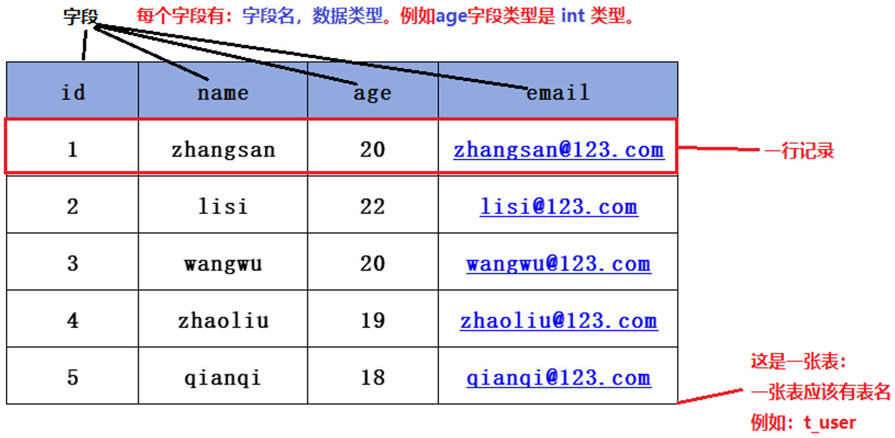

> **编写程序扫描一个包下所有的类，凡是被 `@Table 注解标注的类`都要`生成一条建表语句`，表名在 `@Table 注解中指定`。被`@Table 标注的类`中的`属性被 @Column 注解标注`，在 `@Column注解中`描述`字段的名称和字段`的数据类型。**

```java
package annotation;

import java.lang.annotation.ElementType;
import java.lang.annotation.Retention;
import java.lang.annotation.RetentionPolicy;
import java.lang.annotation.Target;

/**
 * 被 @Table 注解标注的类，要生成建表语句。
 */
@Target(ElementType.TYPE) // 只允许Table出现在类上
@Retention(RetentionPolicy.RUNTIME) // 可以被反射读取
public @interface Table {
    /**
     * 用来指定表的名字
     * @return 表的名字
     */
    String value();
}
```

```java
package annotation;

import java.lang.annotation.ElementType;
import java.lang.annotation.Retention;
import java.lang.annotation.RetentionPolicy;
import java.lang.annotation.Target;

/**
 * 该注解用来标注一个类中的属性，被标注的属性参与建表。
 */
@Target(ElementType.FIELD) // 只允许Table出现在字段上
@Retention(RetentionPolicy.RUNTIME) // 可以被反射读取
public @interface Column {

    /**
     * 字段的名字
     * @return 字段的名字
     */
    String name();

    /**
     * 字段的数据类型
     * @return 字段的数据类型
     */
    String type() default "varchar";
}
```

```java
package a;

import annotation.Column;
import annotation.Table;

@Table("t_user")
public class User {
    @Column(name = "uid")
    private String userid;
    @Column(name = "uname")
    private String username;
    @Column(name = "pwd")
    private String password;
    @Column(name = "age", type = "int")
    private int age;
    private String email;
}
```

```java
package a.b;

import annotation.Column;
import annotation.Table;

@Table("t_vip")
public class Vip {
    @Column(name = "id")
    private String id;
    //@Column(name = "name")
    private String name;
    //@Column(name = "grade")
    private String grade;
}
```

```java
package c;

import annotation.Column;
import annotation.Table;

@Table("t_customer")
public class Customer {
    @Column(name = "cid")
    private String cid;
    @Column(name = "name")
    private String name;
    @Column(name = "age", type = "int")
    private int age;
    @Column(name = "addr")
    private String address;
}
```

```java
package d;

import annotation.Column;
import annotation.Table;

import java.io.File;
import java.lang.reflect.Field;


public class Test {

    private static String classpathRoot;

    private static StringBuilder sb = new StringBuilder();

    public static void main(String[] args) {
        // 扫描类路径当中所有的文件，找到所有的.class结尾的文件
        // 通过.class文件的路径找到对应的全限定类名（全限定类名是带包名的。）
        classpathRoot = Thread.currentThread().getContextClassLoader().getResource(".").getPath();
        //System.out.println("类路径的根：" + classpathRoot);
        // 创建File对象
        File file = new File(classpathRoot);
        // 调用方法来生成建表语句
        generateCreateStatement(file);
        System.out.println(sb);
    }

    /**
     * 通过这个方法，来生成建表语句
     *
     * @param file 起初的这个file代表的是类的根目录
     */
    private static void generateCreateStatement(File file) {
        if (file.isFile()) { // file是一个文件的时候，递归结束
            //System.out.println(file.getAbsolutePath());
            String classFileAbsolutePath = file.getAbsolutePath();
            if (classFileAbsolutePath.endsWith(".class")) {
                // 程序执行到这里，表示文件一定是一个字节码文件
                //System.out.println(classFileAbsolutePath);
                String className = classFileAbsolutePath.substring(classpathRoot.length() - 1, classFileAbsolutePath.length() - ".class".length()).replace("\\", ".");
                //System.out.println(className);

                try {
                    // 获取类
                    Class<?> clazz = Class.forName(className);
                    // 判断类上面是否有@Table注解
                    if(clazz.isAnnotationPresent(Table.class)){
                        Table tableAnnotation = clazz.getAnnotation(Table.class);
                        // 获取到表的名字
                        String tableName = tableAnnotation.value();
                        System.out.println(tableName);
                        sb.append("create table ");
                        sb.append(tableName);
                        sb.append("(");
                        // 获取所有的属性
                        Field[] fields = clazz.getDeclaredFields();
                        for(Field field : fields){
                            // 判断字段上是否存在 @Column 注解
                            if(field.isAnnotationPresent(Column.class)){
                                Column columnAnnotation = field.getAnnotation(Column.class);
                                // 字段名
                                String columnName = columnAnnotation.name();
                                System.out.println(columnName);
                                sb.append(columnName);
                                sb.append(" ");
                                // 字段的类型
                                String columnType = columnAnnotation.type();
                                System.out.println(columnType);
                                sb.append(columnType);
                                sb.append(",");
                            }
                        }
                        // 删除当前sb中的最后一个逗号
                        sb.deleteCharAt(sb.length() - 1);
                        sb.append(");\n");
                    }
                } catch (Exception e) {
                    throw new RuntimeException(e);
                }

            }
            return;
        }
        File[] files = file.listFiles();
        for (File f : files) {
            //System.out.println(f.getAbsolutePath());
            generateCreateStatement(f);
        }
    }
}
```

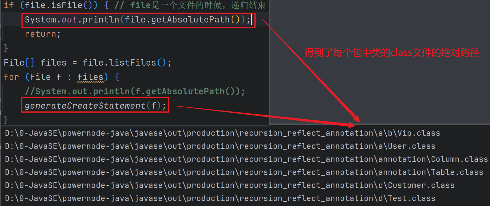

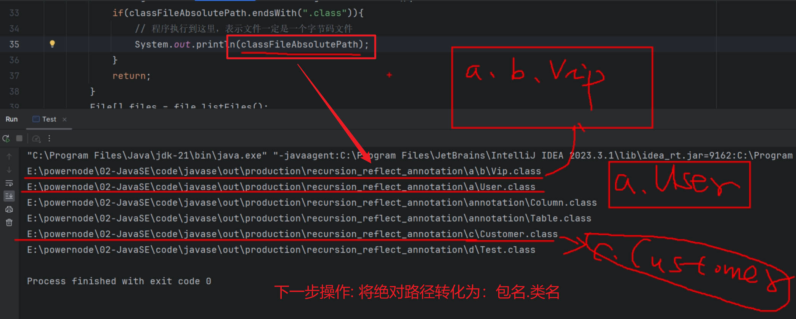

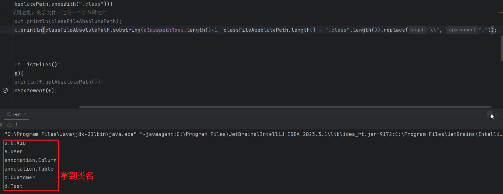

> **获取注解上的`表名`、`属性`、`属性数据类型`**

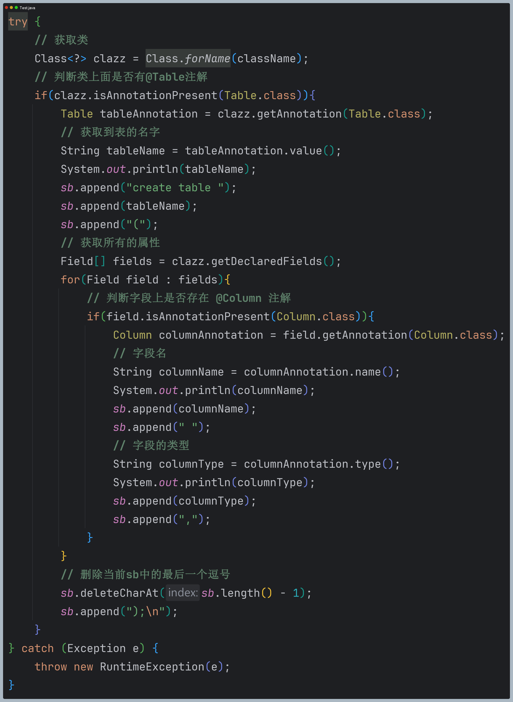

```java
t_vip
id
varchar
    
t_user
uid
varchar
    
uname
varchar
    
pwd
varchar
    
age
int
    
t_customer
cid
varchar
    
name
varchar
    
age
int
    
addr
varchar
    
create table t_vip(id varchar);
create table t_user(uid varchar,uname varchar,pwd varchar,age int);
create table t_customer(cid varchar,name varchar,age int,addr varchar);
```
