## 软件结构

- **C/S结构** ：全称为Client/Server结构，是指客户端和服务器结构。常见程序有ＱＱ、红蜘蛛、飞秋等软件。


**B/S结构** ：全称为Browser/Server结构，是指浏览器和服务器结构。常见浏览器有IE、谷歌、火狐等。


两种架构各有优势，但是无论哪种架构，都离不开网络的支持。**网络编程**，就是在一定的协议下，实现两台计算机的通信的程序。


## 服务器概念

```java
1.概述:安装了服务器软件的计算机
2.后面马上要见到的服务器软件:tomcat    
```

> 网络通信协议:两台计算机在做数据交互时要遵守的规则,协议会对数据的格式,速率等进行规定,只有都遵守了这个协议,才能完成数据交互
>
> 两台计算机想完成数据交互,需要遵守网络通信协议


## 网络编程概述


### 什么是网络编程？

**`网络编程`是指`利用计算机网络实现程序之间通信的一种编程方式`。在网络编程中，程序需要通过`网络协议（如 TCP/IP）`来进行通信，以实现不同计算机之间的`数据传输和共享`。**


### 在网络编程中，通常有三个基本要素

+ **`IP 地址`：定位网络中某台计算机**

+ **`端口号port`：定位计算机上的某个进程（某个应用）**

+ **`通信协议`：通过IP地址和端口号定位后，如何保证数据可靠高效的传输，这就需要依靠通信协议了。**

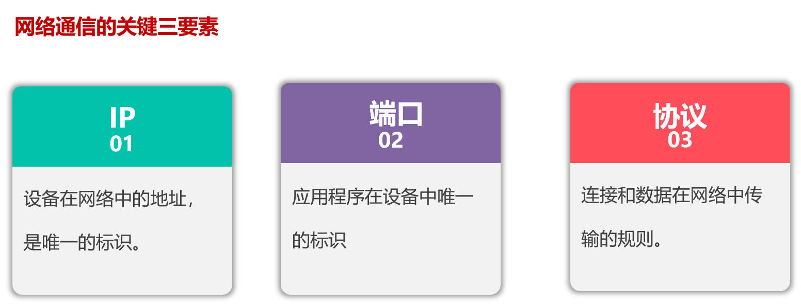

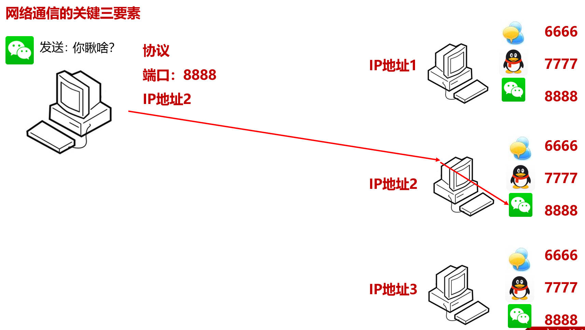


## 网络编程三要素


### IP地址

+ **IP 地址用于`唯一标识网络中的每一台计算机`。在 Internet 上，使用` IPv4 或 IPv6 地址`来表示 `IP 地址`。通常 `IPv4 地址`格式为 `xxx.xxx.xxx.xxx`，其中`每个 xxx `都表示`一个 8 位的二进制数`（`每一个xxx的取值范围是0-255`），组合起来可以表示 `2^32 个不同的 IP 地址`。**

+ **IPv4 地址的`总数量是4294967296 个`，但并`不是所有的 IPv4 地址都可以使用`。IPv4 地址被分为网络地址和主机地址两部分，`前3个字节`用于`表示网络（省市区）`，`最后1个字节`用于`表示主机（家门牌）`。而一些 IP 地址被保留或者被私有机构使用，不能用于公网的地址分配。另外，一些 IP 地址被用作多播地址，仅用于特定的应用场景。因此实际上可供使用的 IPv4 地址数量要少于总数量，而且随着 IPv4 地址的逐渐枯竭，IPv6 地址已经开始逐渐普及，IPv6 地址数量更是相当巨大。**

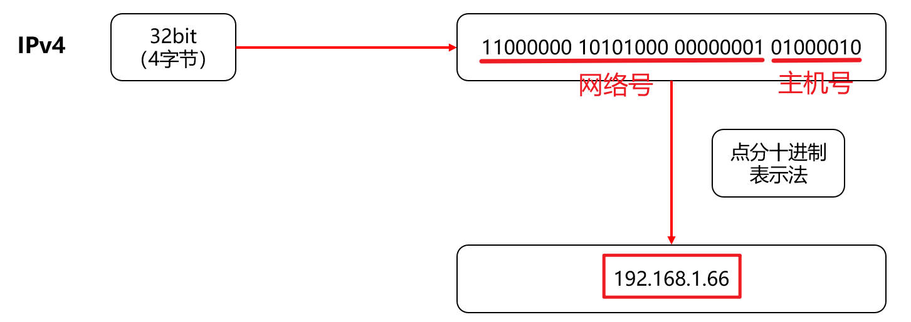

+ **IPv6使用`16个字节`表示`IP地址(128位)`，这样就解决了网络地址资源数量不够的问题。IPv6 地址`由 8 组 16 位十六进制数`表示，每组之间用`冒号分隔`，如：`3ffe:3201:1401:1280:c8ff:fe4d:db39:1984`**

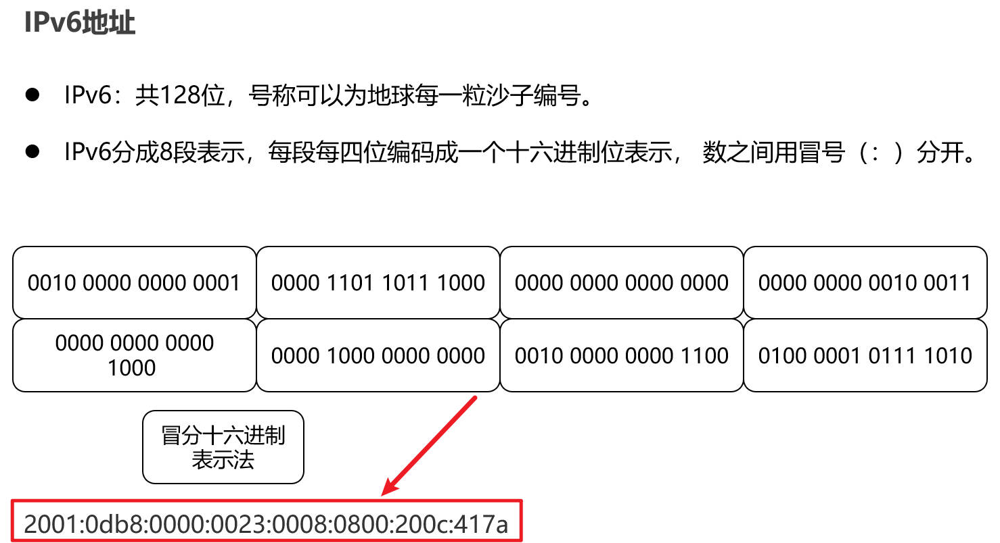

+ **`本机地址`：`127.0.0.1`，主机名：`localhost`。**

+ **`局域网地址`: `192.168.0.0-192.168.255.255`为`私有地址`，属于`非注册地址`，专门为`组织机构内部使用`。**


#### 域名与DNS 

+ **域名**

**IP地址毕竟是数字标识，使用时不好记忆和书写，因此在IP地址的基础上又发展出一种符号化的地址方案，来代替数字型的IP地址。`每一个符号化的地址`都与`特定的IP地址`对应。这个与网络上的`数字型IP地址相对应的字符型地址`，就被称为`域名`。**

**目前域名已经成为互联网品牌、网上商标保护必备的要素之一，除了识别功能外，还有引导、宣传等作用。如：`www.baidu.com`**

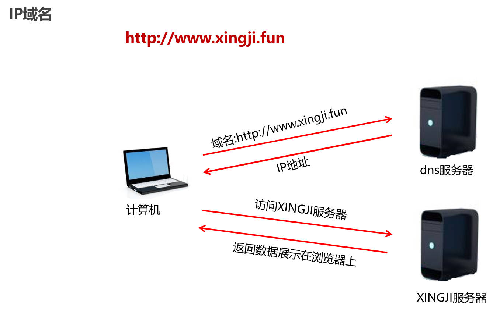

+ **DNS**

**在Internet上域名与IP地址之间是`一对一（或者多对一）`的，域名虽然便于人们记忆，但机器之间只能互相认识IP地址，它们之间的转换工作称为域名解析，域名解析需要由专门的域名解析服务器来完成，`DNS（Domain Name System域名系统）`就是进行`域名解析的服务器`，域名的最终指向是IP。**

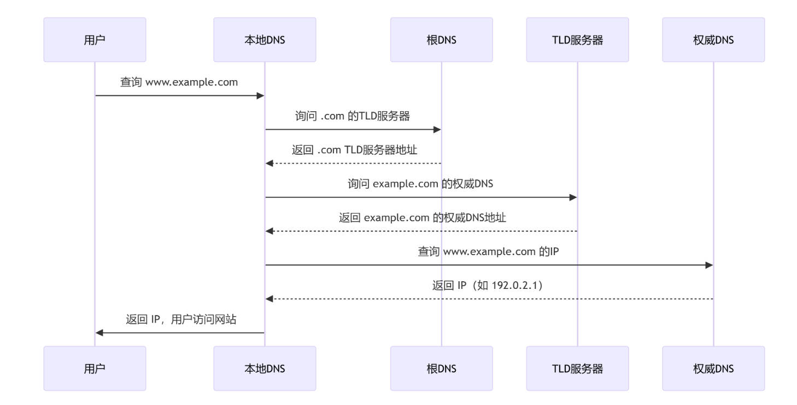


### 端口号（port）

1.**在计算机中，`不同的应用程序`是通过`端口号区分的`。 **

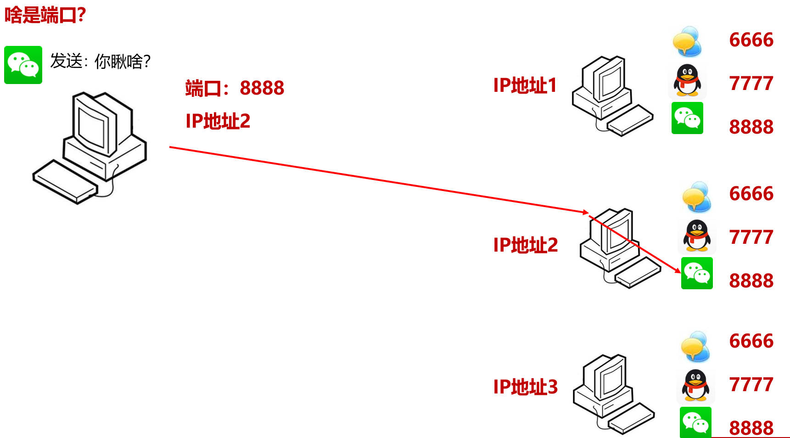

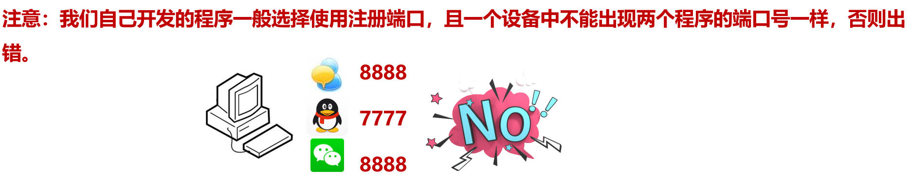

2.**端口号是用两个字节（无符号）表示的，它的`取值范围是0~65535`，而这些计算机端口可分为3大类：**

+ **`公认端口`：`0~1023`。被预先定义的`服务通信占用`（如：`HTTP占用端口80，FTP占用端口21，Telnet占用端口23`等）**

+ **`注册端口`：`1024~49151`。分配给`用户进程或应用程序`。（如：`Tomcat占用端口8080，MySQL占用端口3306，Oracle占用端口1521`等）。**

+ **`动态/私有端口`：`49152~65535`。**

3.**通常情况下，`服务器程序`使用`固定的端口号`来`监听客户端的请求`，而`客户端`则使用`随机端口`连接`服务器`。**

4.**IP地址好比每个人的地址（门牌号），端口好比是房间号。必须同时指定IP地址和端口号才能够正确的发送数据。接下来通过一个图例来描述IP地址和端口号的作用，如图所示: **

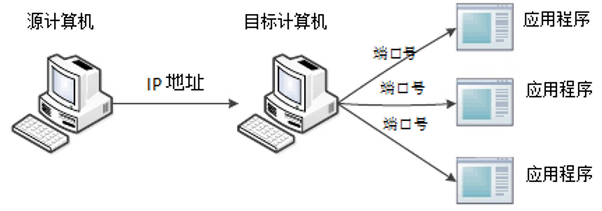


### 通信协议


1.**通过计算机网络可以使多台计算机实现连接，位于同一个网络中的计算机在进行连接和通信时需要遵守一定的规则。就像两个人想要顺利沟通就必须使用同一种语言一样，如果一个人只懂英语而另外一个人只懂中文，这样就会造成没有共同语言而无法沟通。**

2.**在计算机网络中，这些连接和通信的规则被称为网络通信协议，它对数据的传输格式、传输速率、传输步骤等做了统一规定，通信双方必须同时遵守才能完成数据交换。**

3.**在计算机网络中，`常用的协议有 TCP、UDP、HTTP、FTP `等。这些协议规定了数据传输的格式、传输方式和传输顺序等细节。其中，`TCP（传输控制协议）`是`一种可靠的面向连接的协议`，它提供`数据传输的完整性保证`；而` UDP（用户数据报协议）`则是`一种无连接的协议`，`传输效率高`。在网络编程中，需要选取合适的协议类型来实现数据传输。**


#### OSI参考模型

1.**世界上第一个网络体系结构由IBM公司提出（1974年，SNA），以后其他公司也相继提出自己的网络体系结构如：Digital公司的DNA，美国国防部的TCP/IP等，多种网络体系结构并存，其结果是若采用IBM的结构，只能选用IBM的产品，只能与同种结构的网络互联。**

2.**为了促进计算机网络的发展，国际标准化组织ISO（International Organization for Standardization）于1977年成立了一个委员会，在现有网络的基础上，提出了不基于具体机型、操作系统或公司的网络体系结构，称为开放系统互连参考模型，即OSI/RM （Open System Interconnection Reference Model）。`OSI模型`把网络通信的工作分为`7层`，分别是`物理层`、`数据链路层`、`网络层`、`传输层`、`会话层`、`表示层`和`应用层`。OSI七层协议模型如图所示：**

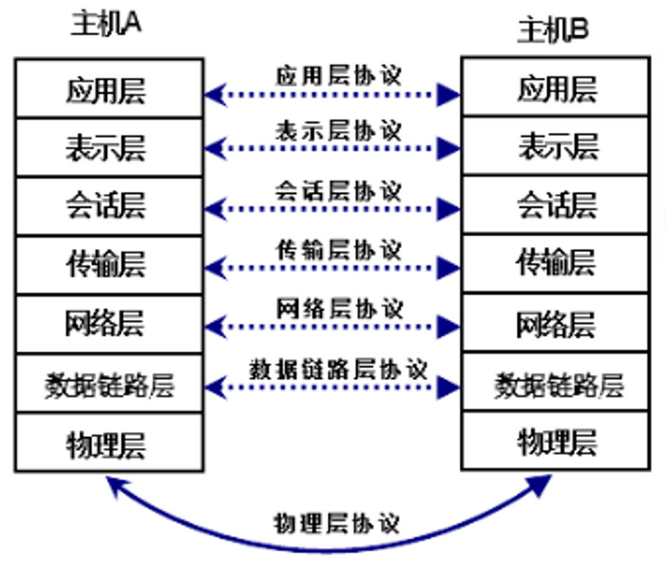


#### TCP/IP参考模型

1.**OSI参考模型的初衷是提供全世界范围的计算机网络都要遵循的统一标准，但是由于存在模型和协议自身的缺陷，迟迟没有成熟的产品推出。TCP/IP协议在实践中不断完善和发展取得成功，作为网络的基础，Internet的语言，可以说没有TCP/IP参考模型就没有互联网的今天。**

2.**`TCP/IP`，即`Transmission Control Protocol/Internet Protocol`的简写，中译名为`传输控制协议/因特网互联协议`，是Internet最基本的协议、Internet国际互联网络的基础。**

3.**TCP/IP协议是一个开放的网络协议簇，它的名字主要取自最重要的网络层IP协议和传输层TCP协议。TCP/IP协议定义了电子设备如何连入因特网，以及数据如何在它们之间传输的标准。`TCP/IP参考模型`采用`4层的层级结构`，每一层都呼叫它的下一层所提供的协议来完成自己的需求，这4个层次分别是：`网络接口层`、`互联网层（IP层）`、`传输层（TCP层）`、`应用层`。**

4.**OSI模型与TCP/IP模型的对应关系如图所示：**

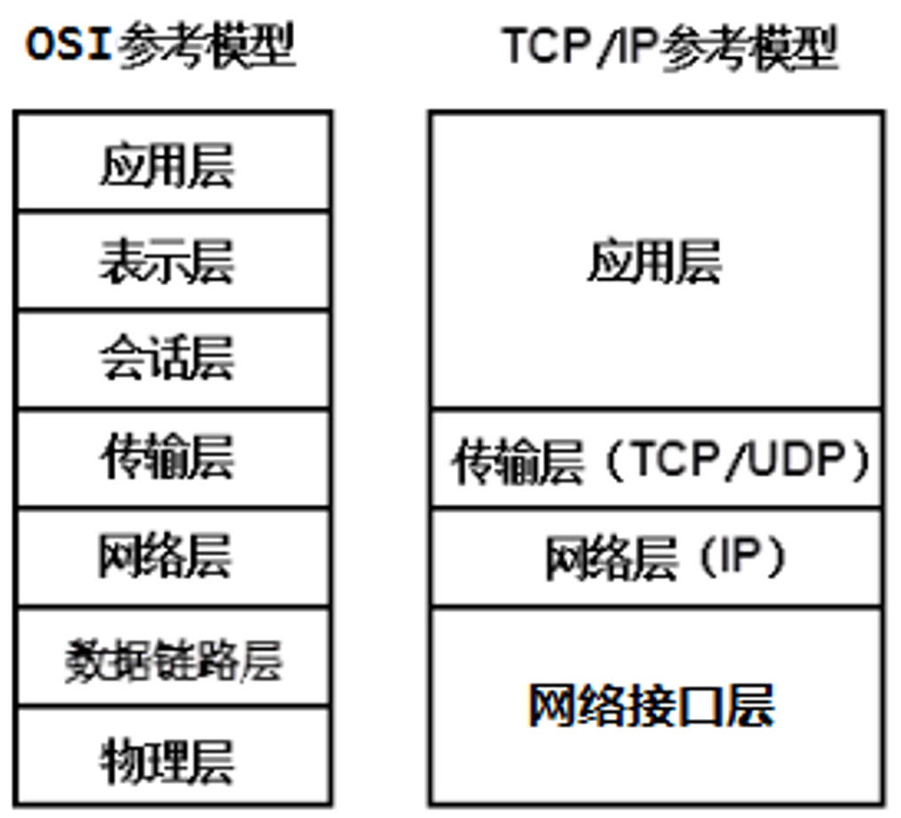


#### OSI参考模型 与 TCP/IP参考模型区别

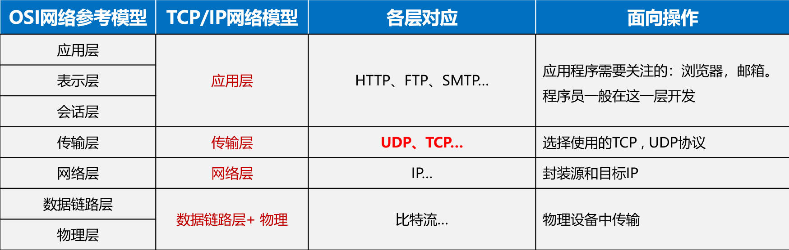

1.**`OSI 参考模型`是`理论上的`，而 `TCP/IP 参考模型`是`实践上的`。TCP/IP 参考模型被许多实际的协议（如 `IP、TCP、HTTP` 等）所支持和实现，而 OSI 参考模型则主要是作为理论框架和标准进行研究和讨论。**

2.**`OSI 参考模型`是`由国际标准化组织提出的网络通信协议框架`，其中分为 7 层，各层之间明确了功能的划分，从物理层到应用层，逐层向上升，每层只对自己下一层提供服务，并`依次封装和解封数据`。OSI 参考模型是一种理论上的协议框架，用于描述计算机系统间的通信原理和规范。**

3.**`TCP/IP 参考模型（也称互联网参考模型）`是`实际应用中最广泛的协议框架`。它将网络协议划分为 4 层：`网络接口层、网络层、传输层和应用层`。TCP/IP 参考模型与 OSI 参考模型之间有着相对应的层次结构，但是其中的每一层都是实际存在的协议，而不是纯粹的框架。TCP/IP 参考模型被广泛应用于互联网上，是计算机系统间进行通信的重要基础。**


## 网络编程基础类


### InetAddress类

```java
1.java.net.IntAddress类用来封装计算机的IP地址和DNS（没有端口信息），它包括一个主机名和一个IP地址，是java对IP地址的高层表示。大多数其它网络类都要用到这个类，包括Socket、ServerSocket、URL、DatagramSocket、DatagramPacket等
    
2.常用静态方法
	static InetAddress getLocalHost() 得到本机的InetAddress对象，其中封装了IP地址和主机名
	static InetAddress getByName(String host) 传入目标主机的名字或IP地址得到对应的InetAddress对象，其中封装了IP地址和主机名（底层会自动连接DNS服务器进行域名解析）
    
3.常用实例方法
	public String getHostAddress() 获取IP地址
	public String getHostName() 获取主机名/域名
```

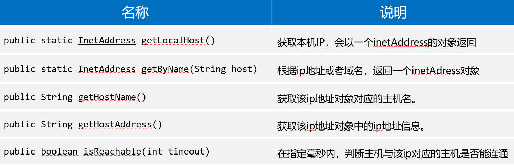

```java
package com.powernode.javase.net;

import java.net.InetAddress;

public class InetAddressTest {
    public static void main(String[] args) throws Exception {
        // 获取本机的IP地址和主机名的封装对象：InetAddress
        InetAddress ia = InetAddress.getLocalHost();

        // 获取本机的IP地址
        String hostAddress = ia.getHostAddress();
        System.out.println("本机IP地址：" + hostAddress); // 本机IP地址：192.168.219.1

        // 获取本机的主机名
        String hostName = ia.getHostName();
        System.out.println("本机的主机名：" + hostName); // 本机的主机名：LAPTOP-5HCUL9AK

        // 通过域名来获取InetAddress对象
        InetAddress ia2 = InetAddress.getByName("www.baidu.com");
        System.out.println(ia2.getHostName()); // www.baidu.com
        System.out.println(ia2.getHostAddress()); // 157.148.69.151
    }
}
```


### URL类

```java
1.URL是统一资源定位符，对可以从互联网上得到的资源的位置和访问方法的一种简洁的表示，是互联网上标准资源的地址。互联网上的每个文件都有一个唯一的URL，它包含的信息指出文件的位置以及浏览器应该怎么处理它。
    
2.URL由4部分组成：协议、存放资源的主机域名、端口号、资源文件名。如果未指定该端口号，则使用协议默认的端口。例如HTTP协议的默认端口为80。在浏览器中访问网页时，地址栏显示的地址就是URL。
    
3.URL标准格式为：<协议>://<域名或IP>:<端口>/<路径>。其中，<协议>://<域名或IP>是必需的，<端口>/<路径>有时可省略。如：https://www.baidu.com。

4.为了方便程序员编程，JDK中提供了URL类，该类的全名是java.net.URL，该类封装了大量复杂的涉及从远程站点获取信息的细节，可以使用它的各种方法来对URL对象进行分割、合并等处理。
    
5.URL类的构造方法：URL url = new URL(“http://127.0.0.1:8080/oa/index.html?name=zhangsan#tip”);
                            
6.URL类的常用方法：
	获取协议：url.getProtocol()	获取域名：url.getHost()  获取默认端口：url.getDefaultPort()
	获取端口：url.getPort()		获取路径：url.getPath()	获取资源：url.getFile()		
	获取数据：url.getQuery()		获取锚点：url.getRef()
                              
7.使用URL类的openStream()方法可以打开到此URL的连接并返回一个用于从该连接读入的InputStream，实现最简单的网络爬虫
```

```java
package com.powernode.javase.net;


import java.net.URL;

/**
 *URL包括四部分：协议，IP地址，端口号，资源名称
 *URL是网络中某个资源的地址。某个资源的唯一标识。
 *通过URL是可以真实的定位到资源的。
 *在Java中，java类库提供了一个URL类，来提供对URL的支持。
 *
 * URL类的构造方法
 *      URL url = new URL("url");
 *
 * URL类的常用方法
 *      url.getXxx();
 */
public class URLTest01 {
    public static void main(String[] args) throws Exception {
        // 创建URL类型的对象
        URL url = new URL("http://www.baidu.com:8888/oa/index.html?name=zhangsan&password=123#tip");

        // 获取URL中的信息
        String protocol = url.getProtocol();
        System.out.println("协议：" + protocol);

        // 获取资源路径
        String path = url.getPath();
        System.out.println("资源路径：" + path);

        // 获取默认端口（HTTP协议的默认端口是80）
        int defaultPort = url.getDefaultPort();
        System.out.println("默认端口：" + defaultPort);

        // 获取当前的端口
        int port = url.getPort();
        System.out.println("当前端口号：" + port);

        // 获取URL中的IP地址
        String host = url.getHost();
        System.out.println("主机地址：" + host);

        // 获取URL准备传送的数据
        String query = url.getQuery();
        System.out.println("需要提交给服务器的数据：" + query);

        // 获取锚点
        String ref = url.getRef();
        System.out.println("获取锚点：" + ref);

        // 获取 资源路径 + 数据
        String file = url.getFile();
        System.out.println("资源路径+数据：" + file);
    }
}
```

```java
协议：http
资源路径：/oa/index.html
默认端口：80
当前端口号：8888
主机地址：www.baidu.com
需要提交给服务器的数据：name=zhangsan&password=123
获取锚点：tip
资源路径+数据：/oa/index.html?name=zhangsan&password=123
```


#### 模拟网络爬虫(openStream()方法)

> **使用`URL类`的`openStream()方法`可以打开到此URL的连接并返回一个用于从该连接读入的`InputStream`，实现`最简单的网络爬虫`**

```java
package com.powernode.javase.net;

import java.io.BufferedReader;
import java.io.InputStream;
import java.io.InputStreamReader;
import java.net.URL;

public class URLTest02 {
    public static void main(String[] args) throws Exception {
        URL url = new URL("https://tianqi.qq.com/");
        InputStream inputStream = url.openStream();
        BufferedReader br = new BufferedReader(new InputStreamReader(inputStream));

        String s = null;
        while ((s = br.readLine()) != null) {
            System.out.println(s);
        }

        br.close();
    }
}
```

```html
<!DOCTYPE html>
<html lang="zh-CN">

<head>
  <meta charset="UTF-8">
  <title>腾讯天气</title>
  <meta http-equiv=X-UA-Compatible content="IE=Edge,chrome=1">
  <!--[if lte IE 7]><meta http-equiv="refresh" content="0; url=http://sports.qq.com/kbsweb/upgrade.htm"><![endif]-->
  <meta name="description" content="腾讯天气">
  <meta name="keywords" content="天气 腾讯天气 天气预报 空气质量">
  <link rel="shortcut icon" href="//mat1.gtimg.com/www/icon/favicon2.ico" />
  <link rel="stylesheet" href="https://mat1.gtimg.com/rain/apub2019/820a05b640db.main_20251024.css">
</head>
...
</html>
```


## TCP与UDP协议

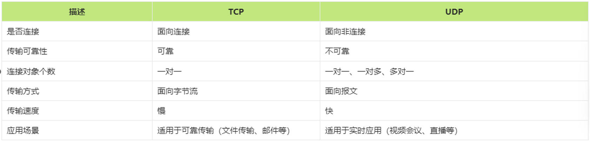

### Socket套接字概述

+ **我们开发的网络应用程序位于应用层，`TCP和UDP`属于`传输层协议`，在应用层如何使用传输层的服务呢？在`应用层和传输层`之间，则是`使用套接Socket`来进行分离。**

+ **`套接字`就像是`传输层为应用层开的一个小口`，应用程序通过这个小口向远程发送数据，或者接收远程发来的数据。而这个小口以内，也就是数据进入这个口之后，或者数据从这个口出来之前，是不知道也不需要知道的，也不会关心它如何传输，这属于网络其它层次工作。**

+ **`Socket`实际是`传输层供给应用层的编程接口`。`Socket`就是`应用层与传输层之间的桥梁`。使用`Socket编程`可以`开发客户机和服务器应用程序`，可以在本地网络上进行通信，也可`通过Internet在全球范围内通信`。**

+ **`TCP协议和UDP协议`是`传输层的两种协议`。`Socket`是`传输层供给应用层的编程接口`，所以`Socket编程`就分为`TCP编程和UDP编程`两类。**

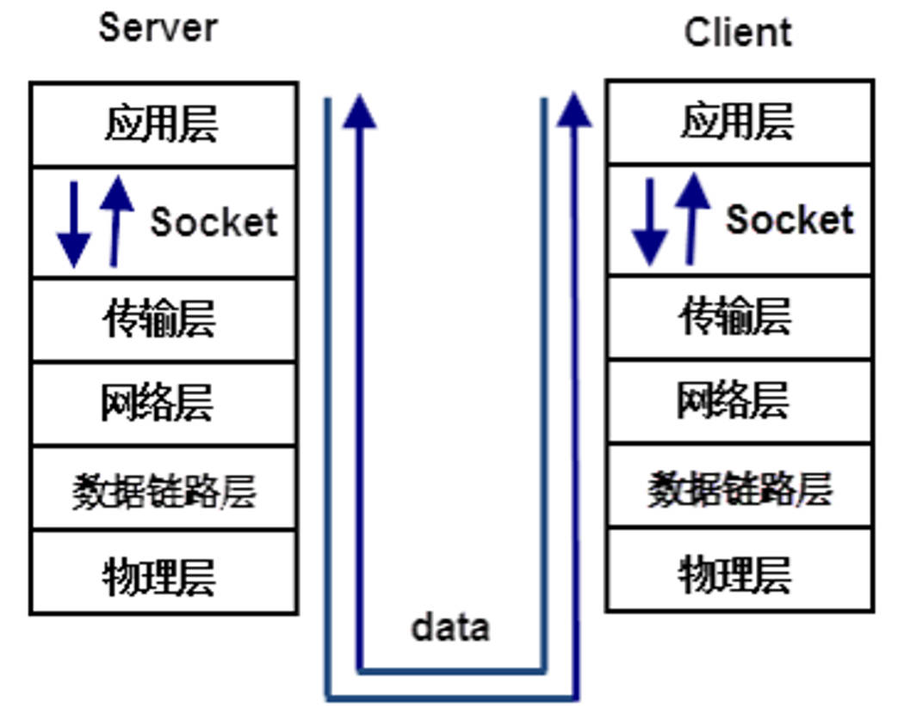


### TCP协议

+ **使用`TCP协议`，须先`建立TCP连接`，形成`传输数据通道`，似于`拨打电话`**

+ **传输前，采用`“三次握手”方式`，属于`点对点通信`，是`面向连接的`，`效率低`。**

+ **仅支持`单播传输`，`每条TCP传输连接只能有两个端点（客户端、服务端）`。**

+ **两个端点的数据传输，采用的是`“字节流”`来传输，属于`可靠的数据传输`。**

+ **传输完毕，需`释放已建立的连接`，`开销大`，`速度慢`，适用于`文件传输、邮件`等。**


### UDP协议

+ **采用`数据报（数据、源、目的）`的方式来传输，`无需建立连接`，类似于`发短信`。**

+ **`每个数据报`的`大小限制在64K内`，超出64k可以分为`多个数据报来发送`。**

+ **发送`不管对方是否准备好`，接收方`即使收到也不确认`，因此属于`不可靠的`。**

+ **可以`广播发送`，也就是属于`一对一、一对多和多对一`连接的通信协议。**

+ **发送数据结束时`无需释放资源`，`开销小，速度快`，适用于`视频会议、直播`等。**


### TCP协议的三次握手（通道建立）

> **TCP（传输控制协议）是一种`面向连接的`、`可靠的`传输层协议。它使用三次握手来建立连接，以确保数据在两个设备之间可靠地传输。**

**三次握手的过程如下：**

1. **`客户端`发送 `SYN（同步）数据包`。这个数据包包含客户端的`初始序列号（ISN）`。**
2. **`服务器`收到 `SYN 数据包`后，发送 `SYN-ACK（同步确认）数据包`。这个数据包包含`服务器的初始序列号（ISN）`和`对客户端 ISN 的确认号（ACK）`。**
3. **`客户端`收到 `SYN-ACK 数据包`后，发送 `ACK（确认）数据包`。这个数据包包含对`服务器 ISN 的确认号（ACK）`。**

**三次握手完成后，客户端和服务器就可以开始交换数据了。**

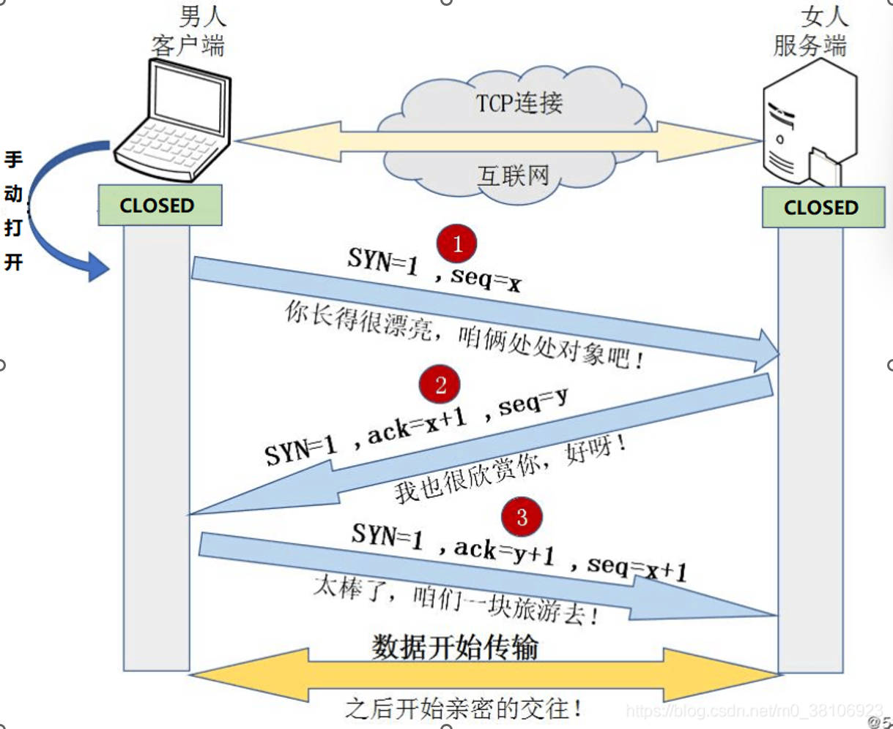


**三次握手的意义：**

> **三次握手可以确保数据在两个设备之间可靠地传输。它可以防止以下情况的发生：**
>
> **不会丢失：如果没有三次握手，客户端和服务器可能会同时发送数据，导致数据丢失。**
>
> **不会重复：如果没有三次握手，客户端和服务器可能会重复发送数据，导致数据重复。**
>
> **不会乱序：如果没有三次握手，客户端和服务器可能会乱序发送数据，导致数据乱序。**


### TCP协议的四次挥手（通道关闭）

> **使用四次挥手来`关闭连接`，以确保数据在两个设备之间可靠地传输。**

**四次挥手的过程如下：**

1. **`客户端`发送 `FIN（结束）数据包`。这个数据包表示`客户端已经完成数据传输`，并`希望关闭连接`。**
2. **`服务器`收到 `FIN 数据包后`，发送 `ACK（确认）数据包`。这个数据包表示`服务器已经收到客户端的 FIN 数据包`，并`同意关闭连接`。**
3. **`服务器`发送 `FIN 数据包`。这个数据包表示`服务器已经完成数据传输`，并`希望关闭连接`。**
4. **`客户端`收到 `FIN 数据包后`，发送 `ACK（确认）数据包`。这个数据包表示`客户端已经收到服务器的 FIN 数据包`，并`同意关闭连接`。四次挥手完成后，`客户端和服务器之间的连接就关闭了`。**

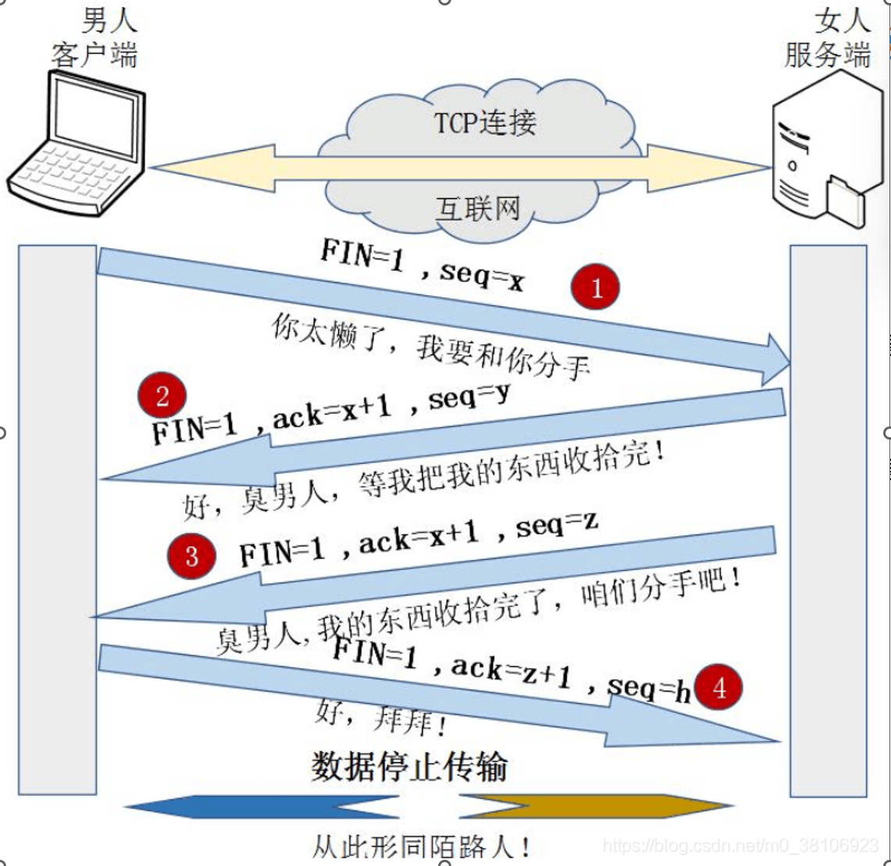


**四次挥手的意义:**

> **四次挥手可以确保数据在两个设备之间可靠地传输。它可以防止以下情况的发生：**
>
> **如果没有四次挥手，客户端和服务器可能会同时关闭连接，导致数据丢失。**
>
> **如果没有四次挥手，客户端和服务器可能会重复发送数据，导致数据重复。**
>
> **如果没有四次挥手，客户端和服务器可能会乱序发送数据，导致数据乱序。**


## 基于TCP协议的编程


### TCP协议编程概述

+ **套接字是一种进程间的数据交换机制，利用套接字(Socket)开发网络应用程序早已被广泛的采用，以至于成为事实上的标准。**

+ **在网络通讯中，第一次主动发起通讯的程序被称作客户端(Client)，而在第一次通讯中等待连接的程序被称作服务端(Server)。一旦通讯建立，则客户端和服务器端完全一样，没有本质的区别。**

+ **套接字与主机地址和端口号相关联，主机地址就是客户端或服务器程序所在的主机的IP地址，端口地址是指客户端或服务器程序使用的主机的通信端口。在客户端和服务器中，分别创建独立的Socket，并通过Socket的属性，将两个Socket进行连接，这样客户端和服务器通过套接字所建立连接并使用IO流进行通信。**

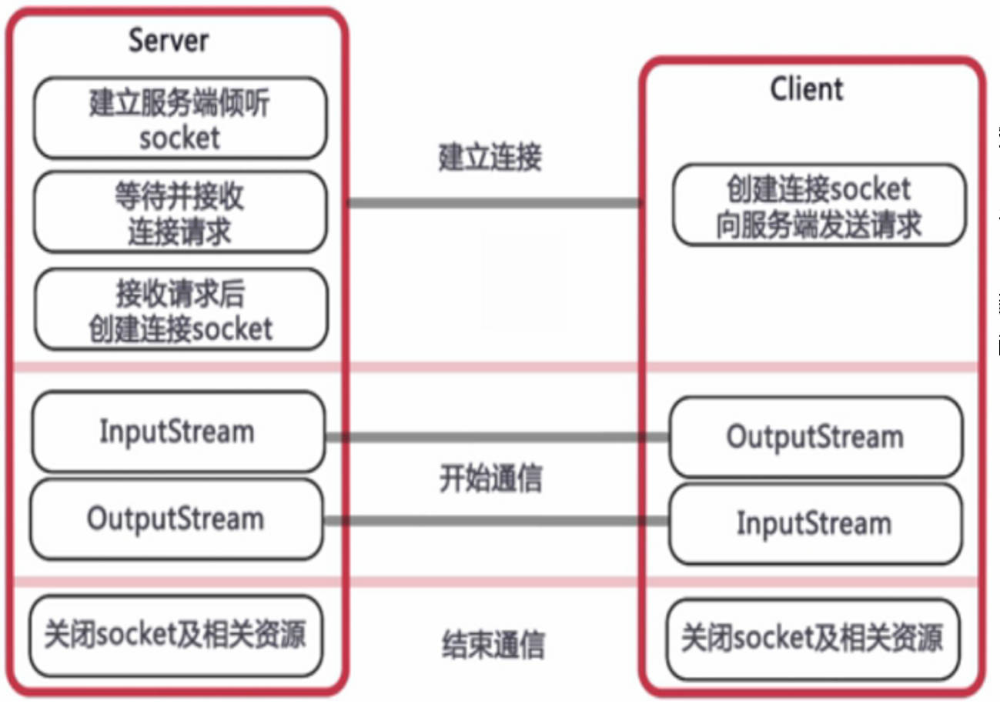


### Socket类概述

```java
1.Socket类实现客户端套接字(Client），套接字是两台机器间通信的端点

2.Socket类构造方法：
	public Socket(InetAddress a, int p) 创建套接字并连接到指定IP地址的指定端口号

3.Socket类实例方法：
	public InetAddress getInetAddress() 返回此套接字连接到的远程 IP 地址。

	public InputStream getInputStream() 返回此套接字的输入流（接收网络消息）。

	public OutputStream getOutputStream() 返回此套接字的输出流（发送网络消息）。

	public void shutdownInput() 禁用此套接字的输入流

	public void shutdownOutput() 禁用此套接字的输出流。

	public synchronized void close() 关闭此套接字（默认会关闭IO流）。
```


### ServerSocket类概述

```java
1.ServerSocket类用于实现服务器套接字(Server服务端)。服务器套接字等待请求通过网络传入。它基于该请求执行某些操作，然后可能向请求者返回结果

2.ServerSocket构造方法：
	public ServerSocket(int port)

3.ServerSocket实例方法：
	public Socket accept() 侦听要连接到此套接字并接受它。

	public InetAddress getInetAddress() 返回此服务器套接字的本地地址。

	public void close() 关闭此套接字。
```


### TCP单向通讯的实现

> **Java语言的基于套接字编程分为`服务端编程`和`客户端编程`，其通信模型如图所示:**

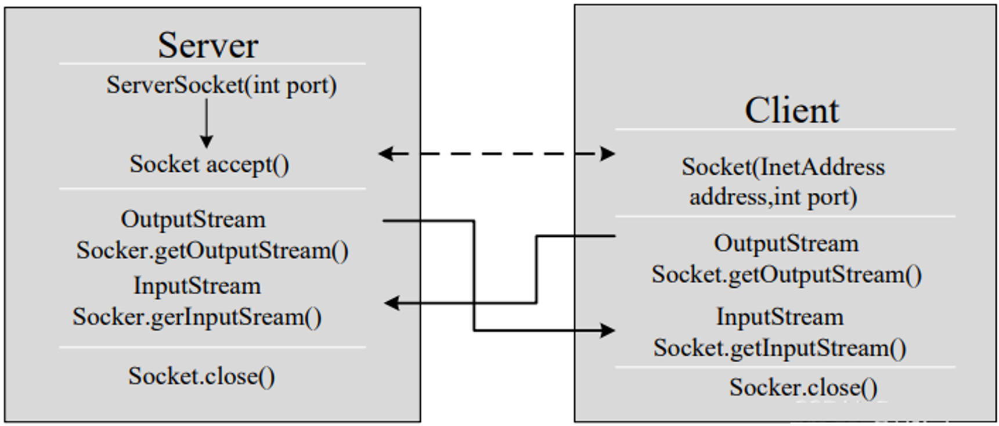

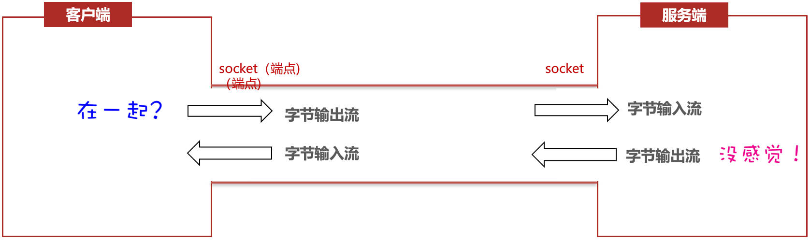

#### 服务器端实现步骤

```java
1. 创建ServerSocket对象，绑定并监听端口；
2. 通过accept监听客户端的请求；
3. 建立连接后，通过输出输入流进行读写操作；
4. 调用close()方法关闭资源。
```

```java
package com.powernode.javase.net;

import java.io.BufferedReader;
import java.io.IOException;
import java.io.InputStreamReader;
import java.net.ServerSocket;
import java.net.Socket;

/**
 * 现在使用Java中的Socket实现单向通信。基于TCP协议。属于TCP编程。
 * 这个类充当的是服务器端。
 */
public class Server {
    public static void main(String[] args) {
        ServerSocket serverSocket = null;
        Socket clientSocket = null;
        BufferedReader br = null;

        try {
            int port = 8888;
            serverSocket = new ServerSocket(8888);
            
            // 服务器启动提示信息
            System.out.println("服务器正在启动，请稍后....");
            System.out.println("服务器启动成功，端口号" + port + "，等待客户端的请求！");

            // 开始接收客户端的请求
            clientSocket = serverSocket.accept();

            // 后续代码怎么写一会再说！
            // 服务器端接收消息，所以服务器端应该获取输入流。
            br = new BufferedReader(new InputStreamReader(clientSocket.getInputStream()));


            // 开始读
            String s = null;
            while ((s = br.readLine()) != null) {
                System.out.println(s);
            }

        } catch (IOException e) {
            throw new RuntimeException(e);
        }finally {
            // 关闭流
            if (br != null) {
                try {
                    br.close();
                } catch (IOException e) {
                    throw new RuntimeException(e);
                }
            }
            if (clientSocket != null) {
                try {
                    clientSocket.close();
                } catch (IOException e) {
                    throw new RuntimeException(e);
                }
            }
            // 关闭服务器端套接字
            if (serverSocket != null) {
                try {
                    serverSocket.close();
                } catch (IOException e) {
                    throw new RuntimeException(e);
                }
            }
        }
    }
}
```


#### 客户端实现步骤

```java
1. 创建Socket对象，指定服务端的地址和端口号；
2. 建立连接后，通过输入输出流进行读写操作；
3. 通过输出输入流获取服务器返回信息；
4. 调用close()方法关闭资源。
```

```java
package com.powernode.javase.net;

import java.io.BufferedWriter;
import java.io.IOException;
import java.io.OutputStreamWriter;
import java.net.InetAddress;
import java.net.Socket;
import java.util.Scanner;

/**
 * 现在使用Java中的Socket实现单向通信。基于TCP协议。属于TCP编程。
 * 这个类充当的是客户端。
 */
public class Client {
    public static void main(String[] args) {
        Socket clientSocket = null;
        BufferedWriter bw = null;

        try {
            // 创建客户端套接字对象
            // 需要指定服务器的IP地址，和端口号
            InetAddress ia = InetAddress.getLocalHost();
            int port = 8888;
            clientSocket = new Socket(ia,8888);

            // 客户端给服务器端发送消息
            // 客户端你是输出流
            bw = new BufferedWriter(new OutputStreamWriter(clientSocket.getOutputStream()));

            // 发送消息
            /*while(true){
                bw.write("你好，最近身体怎么样啊！");
                bw.write("\n");
                bw.write("你收到消息了吗？");
                // 刷新流
                bw.flush();
                // 延迟效果
                Thread.sleep(1000);
            }*/

            // 改为键盘输入发送效果
            Scanner scanner = new Scanner(System.in);
            while (true) {
                System.out.print("请输入您要发送的消息：");
                // 从键盘上接收的消息
                String msg = scanner.next();
                // 把消息发送给服务器
                bw.write(msg);
                bw.write("\n");

                // 刷新
                bw.flush();
            }


        } catch (IOException e) {
            throw new RuntimeException(e);
        } finally {
            if (bw != null) {
                try {
                    bw.close();
                } catch (IOException e) {
                    throw new RuntimeException(e);
                }
            }
            if (clientSocket != null) {
                try {
                    clientSocket.close();
                } catch (IOException e) {
                    throw new RuntimeException(e);
                }
            }
        }
    }
}
```

> **通讯效果测试:**
>
> <!-- -->
>
> 
>
> ```mermaid
> sequenceDiagram
>  participant Client as 客户端(Client)
>  participant Server as 服务器端(Server)
> 
>  Note over Client,Server: 初始化阶段
> 
>  Server->>Server: 创建ServerSocket(8888)
>  Server->>Server: 打印启动信息
>  Server->>Server: accept()阻塞等待连接
> 
>  Client->>Client: 获取本地主机地址
>  Client->>Server: 创建Socket连接(8888)
> 
>  Note over Client,Server: 连接建立成功
> 
>  Server-->>Client: 返回连接成功的Socket
> 
>  loop 消息通信循环
>      Client->>Client: 等待用户键盘输入
>      Client->>Client: scanner.next()读取输入
>      Client->>Server: bw.write(msg)发送消息
>      Client->>Server: bw.write("\\n")发送换行
>      Client->>Server: bw.flush()刷新缓冲区
> 
>      Server->>Server: br.readLine()读取消息
>      Server->>Server: System.out.println()打印消息
>  end
> 
>  Note over Client,Server: 连接关闭阶段
> 
>  Client->>Client: 用户强制终止程序
>  Client->>Server: 关闭Socket连接
> 
>  Server->>Server: br.readLine()返回null
>  Server->>Server: 退出消息循环
>  Server->>Server: 关闭所有资源
> 
>  Note over Client,Server: 程序结束
> ```
>
> **注意：一定是`先启动服务器程序`，然后`再启动客户端程序`，`先后顺序千万别弄混了`！**


### TCP双向通讯的实现

> **在双向通讯的案例中，`客户端`需要向`服务端`发送`一张图片`，`服务端收到客户端发送`的图片后，则需要`向客户端回复收到图片的反馈`。在客户端给服务端发送图片的时候，图片发送完毕必须`调用shutdownOutput()方法`来`关闭socket输出流`，否则`服务端读取数据就会一直阻塞`。**


#### 服务器端实现步骤

```java
1. 创建ServerSocket对象，绑定监听端口；
2. 通过accept()方法监听客户端请求；
3. 使用输入流接收客户端发送的图片，然后通过输出流保存图片
4. 通过输出流返回客户端图片收到。
5. 调用close()方法关闭资源
```

```java
package com.powernode.javase.net;

import java.io.*;
import java.net.ServerSocket;
import java.net.Socket;

/**
 * 接收客户端发送过来的图片。
 * 回复消息给客户端。
 */
public class TwoWayServer {
    public static void main(String[] args) {
        ServerSocket serverSocket = null;
        Socket clientSocket = null;
        BufferedInputStream bis = null;
        BufferedOutputStream bos = null;
        BufferedWriter bw = null;

        try {
            // 创建服务器套接字对象
            serverSocket = new ServerSocket(8888);

            System.out.println("服务器启动成功，正在接收客户端的请求！");

            // 开始接收客户端的请求
            clientSocket = serverSocket.accept();

            // 获取输入流
            bis = new BufferedInputStream(clientSocket.getInputStream());

            // 新建输出流
            bos = new BufferedOutputStream(new FileOutputStream("./dog.jpg"));

            // 开始读
            byte[] bytes = new byte[1024];
            int readCount = 0;
            while ((readCount = bis.read(bytes)) != -1) {
                // 把客户端发送过来的图片，保存到本地服务器中。
                bos.write(bytes, 0, readCount);
            }

            // 刷新流
            bos.flush();

            // 服务器接收完图片之后给客户端回个话
            bw = new BufferedWriter(new OutputStreamWriter(clientSocket.getOutputStream()));

            bw.write("你发的图片我已经收到了，真可爱！\n");

            // 刷新流
            bw.flush();

        } catch (IOException e) {
            throw new RuntimeException(e);
        }finally {
            // 关闭相关流
            if (bw != null) {
                try {
                    bw.close();
                } catch (IOException e) {
                    throw new RuntimeException(e);
                }
            }
            if (bis != null) {
                try {
                    bis.close();
                } catch (IOException e) {
                    throw new RuntimeException(e);
                }
            }
            if (bos != null) {
                try {
                    bos.close();
                } catch (IOException e) {
                    throw new RuntimeException(e);
                }
            }
            if (clientSocket != null) {
                try {
                    clientSocket.close();
                } catch (IOException e) {
                    throw new RuntimeException(e);
                }
            }
            if (serverSocket != null) {
                try {
                    serverSocket.close();
                } catch (IOException e) {
                    throw new RuntimeException(e);
                }
            }
        }
    }
}
```


#### 客户端实现步骤

```java
1. 创建socket对象，指明需要连接的服务器地址和端口号；
2. 建立连接后，通过输出流向服务器端发送图片；
3. 通过输入流获取服务器的响应信息；
4. 调用close()方法关闭资源
```

```java
package com.powernode.javase.net;

import java.io.*;
import java.net.InetAddress;
import java.net.Socket;

/**
 * 发送一个图片给服务器。
 * 接收服务器返回的消息。
 */
public class TwoWayClient {
    public static void main(String[] args) {
        Socket clientSocket = null;
        BufferedOutputStream bos = null;
        BufferedInputStream bis = null;
        BufferedReader br = null;

        try {
            // 创建客户端套接字对象
            clientSocket = new Socket(InetAddress.getLocalHost(), 8888);

            // 发送一张图片给服务器
            bos = new BufferedOutputStream(clientSocket.getOutputStream());

            // 开始写图片到服务器
            // 一边读一边写（读客户端本地硬盘上的图片）
            bis = new BufferedInputStream(new FileInputStream("D:/0-JavaSE/powernode-java/dog.jpg"));

            // 开始读
            byte[] bytes = new byte[1024];
            int readCount = 0;
            while ((readCount = bis.read(bytes)) != -1) {
                bos.write(bytes, 0, readCount);
            }

            // 刷新流
            bos.flush();

            // 关闭输出（输出结束）
            clientSocket.shutdownOutput();

            // 接收服务器响应回来的消息
            br = new BufferedReader(new InputStreamReader(clientSocket.getInputStream()));
            String s = null;
            while ((s = br.readLine()) != null) {
                System.out.println(s);
            }

        } catch (IOException e) {
            throw new RuntimeException(e);
        } finally {
            // 关闭流
            if (bos != null) {
                try {
                    bos.close();
                } catch (IOException e) {
                    throw new RuntimeException(e);
                }
            }
            if (bis != null) {
                try {
                    bis.close();
                } catch (IOException e) {
                    throw new RuntimeException(e);
                }
            }
            if (clientSocket != null) {
                try {
                    clientSocket.close();
                } catch (IOException e) {
                    throw new RuntimeException(e);
                }
            }
        }
    }
}
```

> **通讯效果测试:**
>
> <!-- -->
>
> 
>
> ```mermaid
> sequenceDiagram
>  participant Client as 客户端(TwoWayClient)
>  participant Server as 服务器端(TwoWayServer)
> 
>  Note over Client,Server: 初始化阶段
> 
>  Server->>Server: 创建ServerSocket(8888)
>  Server->>Server: 打印启动信息
>  Server->>Server: accept()阻塞等待连接
> 
>  Client->>Client: 创建Socket连接服务器
>  Client->>Server: TCP连接请求(8888)
> 
>  Note over Client,Server: 连接建立成功
> 
>  Server-->>Client: 返回连接成功的Socket
> 
>  Note over Client,Server: 文件传输阶段
> 
>  Client->>Client: 读取本地图片文件(dog.jpg)
>  Client->>Server: 分批发送图片数据(1024字节/次)
>  Client->>Server: bos.flush()刷新缓冲区
>  Client->>Server: shutdownOutput()表示发送完成
> 
>  Server->>Server: 接收图片数据并写入本地文件
>  Server->>Server: bos.flush()确保文件保存完成
> 
>  Note over Client,Server: 服务器响应阶段
> 
>  Server->>Client: 发送确认消息文本
>  Server->>Client: bw.flush()刷新输出
> 
>  Client->>Client: 读取服务器响应消息
>  Client->>Client: 打印响应到控制台
> 
>  Note over Client,Server: 连接关闭阶段
> 
>  Client->>Client: 关闭所有流和Socket
>  Server->>Server: 关闭所有流和Socket
> 
>  Note over Client,Server: 程序结束
> ```


## 基于UDP协议的编程


### UDP协议编程概述

+ **在UDP通信协议下，两台计算机之间进行数据交互，并不需要先建立连接，发送端直接往指定的IP和端口号上发送数据即可，但是它并不能保证数据一定能让对方收到，也不能确定什么时候可以送达。**

+ **`java.net.DatagramSocket类`和`java.net.DatagramPacket类`是`使用UDP编程`中需要使用的两个类，并且`发送端和接收端都需要使用这个俩类`，并且`发送端与接收端`是`两个独立的运行程序`。**

```java
1. DatagramSocket：负责接收和发送数据，创建接收端时需要指定端口号。
    
2. DatagramPacket：负责把数据打包，创建发送端时需指定接收端的IP地址和端口。
```

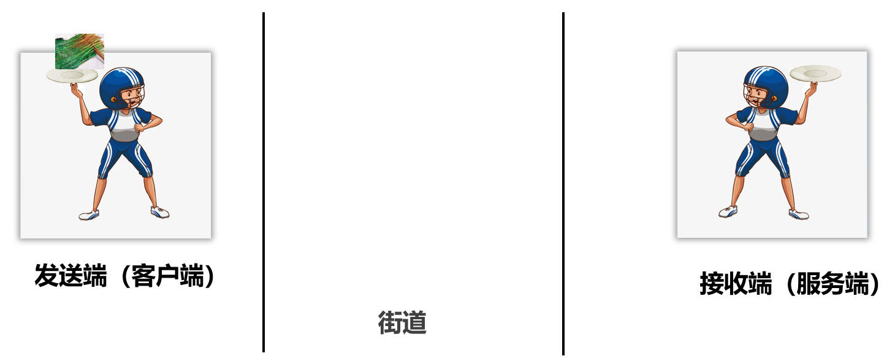


### DatagramSocket类的概述

```java
1.DatagramSocket类作为基于UDP协议的Socket，使用DatagramSocket类可以用于接收和发送数据，同时创建接收端时还需指定端口号。

2.DatagramSocket的构造方法：

	public DatagramSocket() 创建发送端的数据报套接字

	public DatagramSocket(int port) 创建接收端的数据报套接字，并指定端口号

3.DatagramSocket的实例方法：

	public void send(DatagramPacket p) 发送数据报。

	public void receive(DatagramPacket p) 接收数据报。

	public void close() 关闭数据报套接字。
```


### DatagramPacket类的概述

```java
1.DatagramPacket类负责把发送的数据打包（打包的数据为byte类型的数组），并且创建发送端时需指定接收端的IP地址和端口

2.DatagramPacket的构造方法：

	public DatagramPacket(byte buf[], int offset, int length) 创建接收端的数据报。

	public DatagramPacket(byte buf[], int offset, int length, InetAddress address, int port) 创建发送端的数据报，并指定接收端的IP地址和端口号。

3.DatagramPacket的实例方法：

	public synchronized byte[] getData() 返回数据报中存储的数据

	public synchronized int getLength() 获得发送或接收数据报中的长度
```


### 基于UDP编程的实现


#### 接收端实现步骤

```java
1. 创建DatagramSocket对象（接收端），并指定端口号；
2. 创建DatagramPacket对象（数据报）；
3. 调用receive()方法，用于接收数据报；
4. 调用close()方法关闭资源
```

```java
package com.powernode.javase.net;

import java.net.DatagramPacket;
import java.net.DatagramSocket;

/**
 * 演示UDP编程，这个接收方。
 */
public class Receive {
    public static void main(String[] args) throws Exception {
        // 创建DatagramSocket对象（接收端），并指定端口号
        DatagramSocket ds = new DatagramSocket(8888);

        byte[] bytes = new byte[1024];
        // 准备一个包，这个包接收发送方的信息。
        DatagramPacket dp = new DatagramPacket(bytes, bytes.length);
        // 程序执行到这里，停下来，等待发送方的发送。
        ds.receive(dp);

        // 程序执行到这里说明，已经完全将发送方发送的数据接收到了。
        // 从包中取出来数据。
        String msg = new String(bytes, 0, dp.getLength()); // 将byte数组转化我字符串类型
        System.out.println("接收到的发送方发过来的消息：" + msg);

        // 关闭通道
        ds.close();
    }
}
```


#### 发送端实现步骤

```java
1. 创建DatagramSocket对象（发送端）；
2. 创建DatagramPacket对象（数据报），并指定接收端IP地址和端口；
3. 调用send()方法，用于发送数据报；
4. 调用close()方法关闭资源。
```

```java
package com.powernode.javase.net;

import java.net.DatagramPacket;
import java.net.DatagramSocket;
import java.net.InetAddress;

/**
 * 演示UDP编程，这个是发送方。
 */
public class Send {
    public static void main(String[] args) throws Exception {
        // 创建DatagramSocket对象（发送端）
        DatagramSocket ds = new DatagramSocket();

        // 创建DatagramPacket对象（数据报），并指定接收端IP地址和端口
        byte[] bytes = "动力节点".getBytes();
        DatagramPacket dp = new DatagramPacket(bytes,0, bytes.length, InetAddress.getLocalHost(), 8888);
        /*
        bytes,           // 数据内容
    	0,               // 偏移量
    	bytes.length,    // 数据长度
    	InetAddress.getLocalHost(),  // 目标地址
    	8888             // 目标端口
    	*/

        // 发送消息
        ds.send(dp);

        // 关闭资源
        ds.close();
    }
}
```

> **通讯效果测试:**
>
> <!-- -->
>
> 
>
> ```mermaid
> sequenceDiagram
>  participant Send as 发送方(Send)
>  participant Network as 网络
>  participant Receive as 接收方(Receive)
> 
>  Note over Receive: 启动阶段
>  Receive->>Receive: 创建DatagramSocket(8888)
>  Receive->>Receive: 创建接收缓冲区(1024字节)
>  Receive->>Receive: 创建DatagramPacket(接收包)
>  Receive->>Receive: ds.receive(dp)阻塞等待
> 
>  Note over Send: 启动阶段
>  Send->>Send: 创建DatagramSocket(随机端口)
>  Send->>Send: 准备数据:"动力节点"
>  Send->>Send: 创建DatagramPacket(指定目标地址和端口)
> 
>  Note over Send,Receive: UDP数据报发送
> 
>  Send->>Network: ds.send(dp)发送数据报
>  Note over Network: UDP数据报传输<br/>无连接、不可靠
> 
>  Network->>Receive: 数据报到达8888端口
>  Receive->>Receive: ds.receive(dp)返回
> 
>  Note over Receive: 数据处理阶段
>  Receive->>Receive: 从数据包提取数据
>  Receive->>Receive: 转换为字符串并打印
>  Receive->>Receive: 关闭DatagramSocket
> 
>  Note over Send: 资源清理
>  Send->>Send: 关闭DatagramSocket
> ```
