## 集合概述

①什么是集合，有什么用？

1. **`集合`是一种`容器`，用来`组织和管理数据的`。非常重要。**

2. **Java的`集合框架`对应的这套类库其实就是`对各种数据结构的实现`。**

3. **`每一个集合类底层`采用的`数据结构不同`，例如`ArrayList集合`底层采用了`数组`，`LinkedList集合`底层采用了`双向链表`，`HashMap集合`底层采用了`哈希表`，`TreeMap集合`底层采用了`红黑树`。**

4. **我们不用写数据结构的实现了。`直接用就行了`。但我们需要知道的是在哪种场合下选择哪一个集合效率是最高的。**

②集合中存储的是`引用`，不是把堆中的对象存储到集合中，是`把对象的地址存储到集合`中。

③默认情况下，**如果不使用泛型的话**，集合中`可以存储任何类型的引用`，只要是`Object的子类`都`可以存储`。

④Java集合框架相关的类都在` java.util `包下。

⑤Java集合框架分为两部分：

1. **Collection结构：元素以`单个形式存储`。**

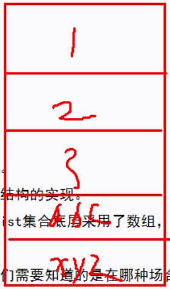

2. **Map结构：元素以`键值对的映射关系存储`。**

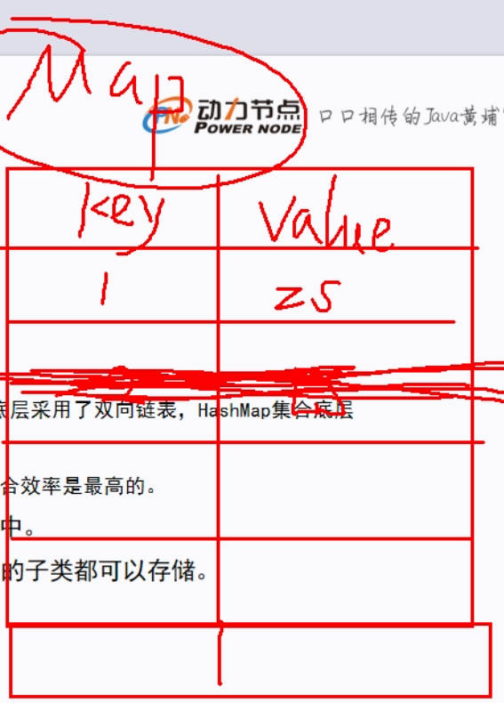


## Collection继承结构

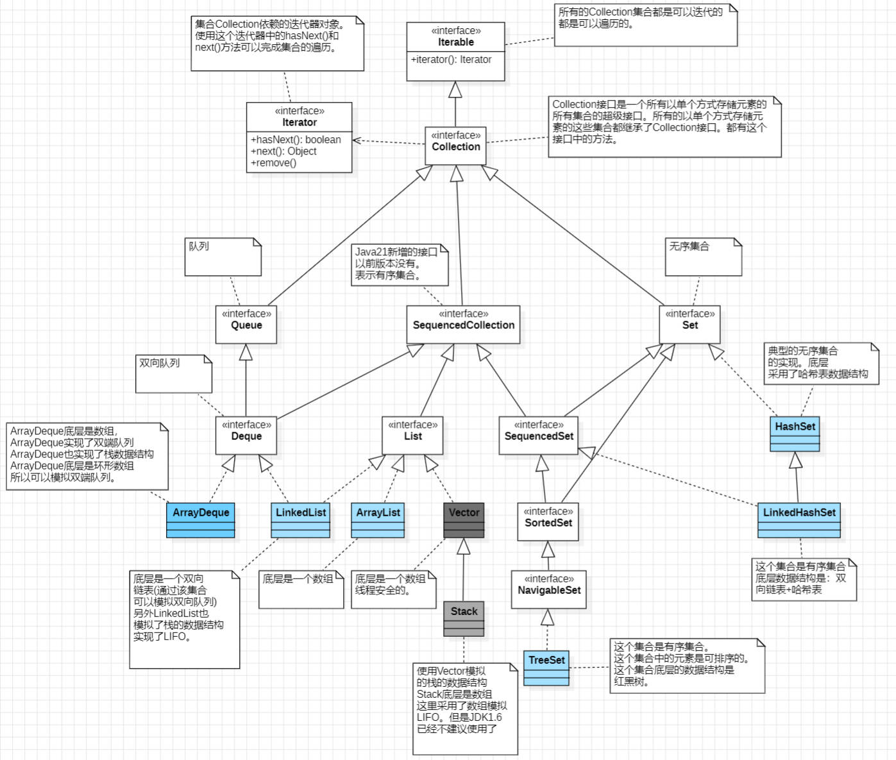

①`SequencedCollection`和`SequencedSet接口`都是`Java21新增的接口`。

②上图中`蓝色的`是`实现类`。其它的都是`接口`。

③6个实现类中`只有HashSet是无序集合`。剩下的`都是有序集合`。

1. 有序集合：集合中存储的元素有下标**或者**集合中存储的元素是可排序的。

2. 无序集合：集合中存储的元素没有下标**并且**集合中存储的元素也没有排序。

④每个集合实现类对应的数据结构如下：

1. **LinkedList:双向链表（不是队列数据结构，但使用它可以模拟队列）**

2. **ArrayList：数组**

3. **Vector：数组（线程安全的）**

4. **HashSet：哈希表**

5. **LinkedHashSet：双向链表和哈希表结合体**

6. **TreeSet：红黑树**

⑤**`List集合`中存储的元素`可重复`。`Set集合`中存储的元素`不可重复`。**


## Collection接口

### Collection接口的通用方法

①**boolean add(E e); 向集合中添加元素**

```java
// 创建一个集合对象
Collection c = new ArrayList();
// 添加元素
c.add(100); // 自动装箱
c.add(3.14); // 自动装箱
c.add(false); // 自动装箱
c.add("jack");
c.add(new Object());
```


②**int size(); 获取集合中元素个数**

```java
package com.powernode.javase.collection;

import java.util.ArrayList;
import java.util.Collection;

public class CollectionTest02 {
    public static void main(String[] args) {
        // 创建一个集合对象
        Collection c = new ArrayList();
        // 添加元素
        c.add(100);
        c.add(3.14);
        c.add(false);
        c.add("jack");
        c.add(new Object());
        // 查看集合中元素个数
        System.out.println("集合中元素个数：" +c.size()); // 集合中元素个数：5
    }
}
```


③**boolean addAll(Collection c); 将参数集合中`所有元素`全部加入`当前集合`**

```java
package com.powernode.javase.collection;

import java.util.ArrayList;
import java.util.Collection;

public class CollectionTest02 {
    public static void main(String[] args) {
        // 创建一个集合对象
        Collection c = new ArrayList();
        // 添加元素
        c.add(100); // 自动装箱
        c.add(3.14); // 自动装箱
        c.add(false); // 自动装箱
        c.add("jack");
        c.add(new Object());
        // 查看集合中元素个数
        System.out.println("集合中元素个数：" +c.size()); // 集合中元素个数：5

        // 再创建一个集合对象
        Collection c2 = new ArrayList();
        c2.add("zhangsan");
        c2.add("lisi");
        c2.add("wangwu");
        // 一次添加多个，将一个集合中所有的元素添加到当前集合对象中
        c.addAll(c2);
        System.out.println("集合中元素个数：" + c.size()); // 集合中元素个数：8
    }
}
```


④**boolean contains(Object o); 判断集合中是否包含对象o（底层到底包含o还是不包含o，调用equals方法进行比对。）**

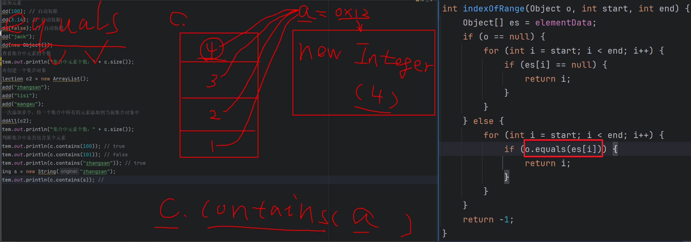

```java
// 判断集合中是否包含某个元素
System.out.println(c.contains(100)); // true
System.out.println(c.contains(101)); // false
System.out.println(c.contains("zhangsan")); // true

// 底层到底包含o还是不包含o，调用equals方法进行比对
String s = new String("zhangsan");
System.out.println(c.contains(s)); // true
```

> **相关示例:**
>
> ```java
> package com.powernode.javase.collection;
> 
> import java.util.Objects;
> 
> public class Date {
>     private int year;
>     private int month;
>     private int day;
> 
>     @Override
>     public boolean equals(Object obj) {
>         if (obj == null) return false;
>         if (this == obj) return true;
>         if (obj instanceof Date) {
>             Date date = (Date) obj;
>             return this.year == date.year && this.month == date.month && this.day == date.day;
>         }
>         return false;
>     }
> 
>     @Override
>     public int hashCode() {
>         return Objects.hash(year, month, day);
>     }
> 
>     public Date(int year, int month, int day) {
>         this.year = year;
>         this.month = month;
>         this.day = day;
>     }
> 
>     public int getYear() {
>         return year;
>     }
> 
>     public void setYear(int year) {
>         this.year = year;
>     }
> 
>     public int getMonth() {
>         return month;
>     }
> 
>     public void setMonth(int month) {
>         this.month = month;
>     }
> 
>     public int getDay() {
>         return day;
>     }
> 
>     public void setDay(int day) {
>         this.day = day;
>     }
> }
> ```
>
> 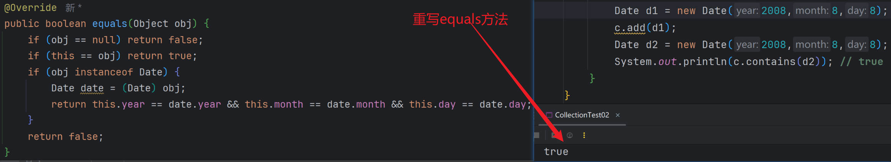
>
> 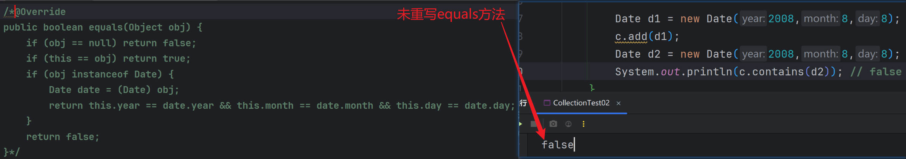


⑤**boolean remove(Object o); 从集合中删除对象o（底层也会调用equals方法来完成删除。）**

```java
// 删除集合中的某个元素（底层也会调用equals方法来完成删除。）
System.out.println(c.size()); // 9
c.remove(d2);
System.out.println(c.size()); // 8
```


⑥**void clear(); 清空集合**

```java
// 清空集合
System.out.println(c.isEmpty()); // false
c.clear();
System.out.println(c.size()); // 0
System.out.println(c.isEmpty()); // true
```


⑦**boolean isEmpty(); 判断集合中元素个数是否为0**

```java
// 清空集合
System.out.println(c.isEmpty()); // false
c.clear();
System.out.println(c.size()); // 0
System.out.println(c.isEmpty()); // true
```


⑧**Object[] toArray(); 将集合转换成`一维数组`**

```java
// 创建一个集合对象
Collection c = new ArrayList();
// 添加元素
c.add(100); // 自动装箱
c.add(3.14); // 自动装箱
c.add(false); // 自动装箱
c.add("jack");
c.add(new Object());

// 将集合转换成Object数组
Object[] objs = c.toArray();
for(Object obj : objs){
     System.out.println(obj);
    /*
    100
    3.14
    false
    jack
    java.lang.Object@b4c966a
    */
}
```


### Collection的遍历（集合的通用遍历方式）

```java
关于Collection集合的通用迭代方式/遍历方式
     1. 以下遍历方式适用于所有Collection的子。通用的。
     2. 遍历其实本质上就是将集合中每一个元素逐一获取到。
     3. 怎么遍历/迭代？3步
         第一步：获取集合依赖的迭代器对象
             Iterator it = collection.iterator();
         第二步：判断当前光标指向的位置是否存在元素
             boolean has = it.hasNext();
             true:表示当前光标指向的位置有数据。
             false:表示当前光标指向的位置没有数据。
         第三步：取出当前光标指向位置的元素，并且将光标向下移动一位。
             Object obj = it.next();
```

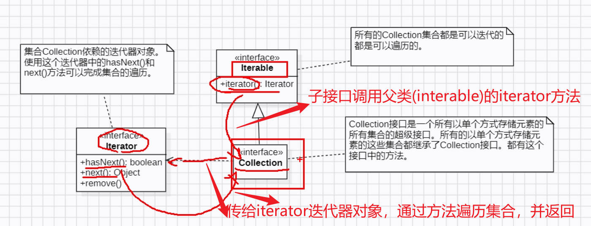

```java
1.第一步：获取当前集合依赖的迭代器对象

Iterator it = collection.iterator();

2.第二步：编写循环，循环条件是：当前光标指向的位置是否存在元素。

while(it.hasNext()){}

3.第三步：如果有，将光标指向的当前元素返回，并且将光标向下移动一位。

Object obj = it.next();
```

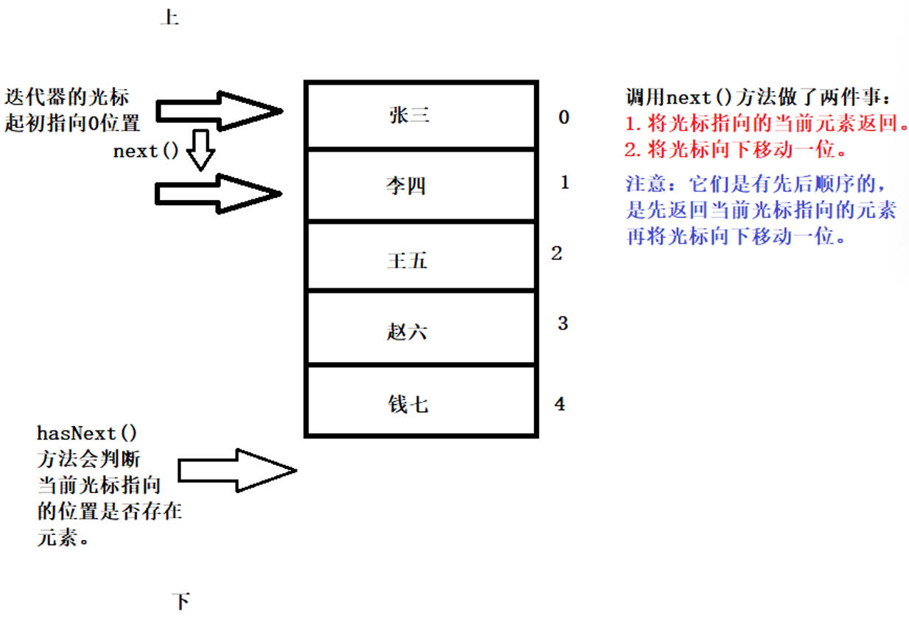

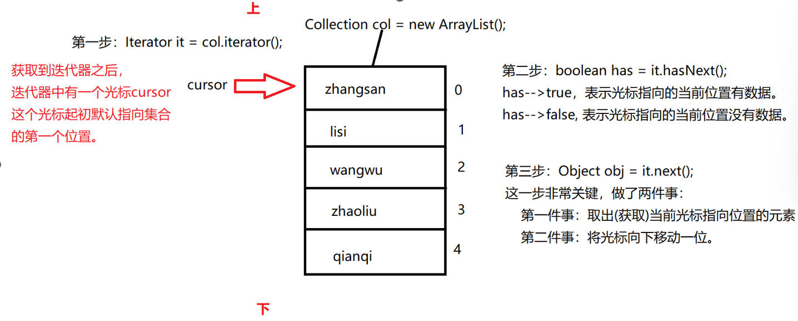

```java
package com.powernode.javase.collection;

import java.util.ArrayList;
import java.util.Collection;
import java.util.Iterator;

public class CollectionTest03 {
    public static void main(String[] args) {
        // 创建集合对象
        Collection col = new ArrayList();
        // 修改成这个代码之后底层数据结构就变成了链表的结构，但是后续的代码不需要进行任何修改。
        // 这是因为后续所有的代码都是面向接口编程的。去更换数据结构，后续的迭代程序不需要修改。
        //Collection col = new LinkedList();

        // 向集合中添加元素
        col.add("zhangsan");
        col.add("lisi");
        col.add("wangwu");
        col.add("zhaoliu");
        col.add("qianqi");

        // 迭代/遍历
        /*// 第一步：获取迭代器
        Iterator it = col.iterator();
        // 第二步：判断当前光标指向的位置有没有数据
        boolean has = it.hasNext();
        // 第三步：如果has是true，表示当前光标指向的位置有数据
        if(has){
            // 1. 先将光标指向的当前位置的元素获取到。
            // 2. 再将cursor向下移动一位。
            Object obj = it.next();
            System.out.println(obj);
        }

        has = it.hasNext();
        if(has){
            Object obj = it.next();
            System.out.println(obj);
        }*/

        Iterator it = col.iterator();
        System.out.println("输出迭代器：" + it);
        while(it.hasNext()){
            Object obj = it.next();
            System.out.println(obj);
        }

        // for循环也是可以的
        // for (初始化表达式; 条件表达式; 更新表达式){}
        /*for(Iterator it = col.iterator(); it.hasNext(); ){
            // 循环体
            Object obj = it.next();
            System.out.println(obj);
        }*/
    }
}
```


## SequencedCollection接口

> **所有的`有序集合`都实现了`SequencedCollection接口`**

①**SequencedCollection接口是`Java21版本新增的`。**

②**SequencedCollection接口中的方法：**

1. **`void addFirst(Object o)`：向头部添加**

2. **`void addLast(Object o)`：向末尾添加**

3. **`Object removeFirst()`：删除头部**

4. **`Object removeLast()`：删除末尾**

5. **`Object getFirst()`：获取头部节点**

6. **`Object getLast()`：获取末尾节点**

7. **`SequencedCollection reversed(); `反转集合中的元素**

```java
package com.powernode.javase.collection;

import java.util.ArrayList;
import java.util.Iterator;
import java.util.SequencedCollection;

/**
 * 有序集合的祖宗接口。测试一下它的公共通用方法：
 *      addFirst()
 *      addLast()
 *      removeFirst()
 *      removeLast()
 *      getFirst()
 *      getLast()
 *      reversed()
 */
public class SequencedCollectionTest {
    public static void main(String[] args) {
        // 创建集合对象
        SequencedCollection sc = new ArrayList();

        // 添加元素
        sc.add(1);
        sc.add(2);
        sc.add(3);
        sc.add(4);

        // 向头部添加一个元素
        sc.addFirst(0);
        /*
        0
        1
        2
        3
        4
         */

        // 向尾部添加一个元素
        sc.addLast(5);
        /*
        0
        1
        2
        3
        4
        5
         */

        // 遍历
        Iterator it = sc.iterator();
        while(it.hasNext()) {
            Object obj = it.next();
            System.out.println(obj);
            /*
            0
            1
            2
            3
            4
            5
             */
        }

        // 获取头
        System.out.println(sc.getFirst()); // 0

        // 获取尾
        System.out.println(sc.getLast()); // 5

        // 删除头
        sc.removeFirst();
        /*
        1
        2
        3
        4
        5
         */

        // 删除尾巴
        sc.removeLast();
        /*
        1
        2
        3
        4
         */

        System.out.println("======================");

        // 遍历
        it = sc.iterator();
        while(it.hasNext()) {
            Object obj = it.next();
            System.out.println(obj);
            /*
            1
            2
            3
            4
             */
        }

        System.out.println("======================");

        // 反转
        SequencedCollection reversed = sc.reversed();
        it = reversed.iterator();
        while(it.hasNext()) {
            Object obj = it.next();
            System.out.println(obj);
            /*
            4
            3
            2
            1
             */
        }
    }
}
```

③**`ArrayList，LinkedList，Vector，LinkedHashSet，TreeSet,Stack` 都可以`调用这个接口`中的方法。**


## 泛型

①**泛型是`Java5的新特性`，属于`编译阶段的功能`。**

②**泛型可以让开发者在编写代码时`指定集合中存储的数据类型`**

③**泛型作用：**

1. **`类型安全`：指定了集合中元素的类型之后，编译器会在`编译时进行类型检查`，如果尝试将错误类型的元素添加到集合中，就会在`编译时报错`，避免了在`运行时出现类型错误的问题`。**

2. **`代码简洁`：使用泛型可以`简化代码`，避免了`繁琐的类型转换操作`。比如，在没有泛型的时候，需要`使用 Object 类型`来保存集合中的元素，并在使用时`强制类型转换成实际类型`，而有了泛型之后，只需要在`定义集合时指定类型即可`。**

④**在集合中使用泛型**

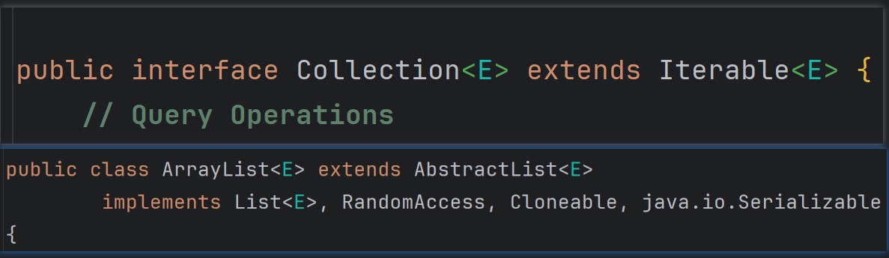

```java
Collection<String> strs = new ArrayList<String>();

1.这就表示该集合只能存储字符串，存储其它类型时编译器报错。

2.并且以上代码使用泛型后，避免了繁琐的类型转换，集合中的元素可以直接调用String类特有的方法。
```

> **示例:**
>
> ```java
> package com.powernode.javase.collection;
> 
> public class User {
>     private String name;
> 
>     public User(String name) {
>         this.name = name;
>     }
> 
>     public String getName() {
>         return name;
>     }
> 
>     public void setName(String name) {
>         this.name = name;
>     }
> 
>     public void pay() {
>         System.out.println(this.name + "正在支付...");
>     }
> }
> ```
>
> ```java
> package com.powernode.javase.collection;
> 
> import java.util.ArrayList;
> import java.util.Collection;
> import java.util.Iterator;
> 
> /**
>  * 当前程序先不使用泛型，分析存在什么缺点？
>  *      不好看，代码写的比较多。每一次从集合中取出的元素要想访问子类中特有的方法，必须向下转型。
>  *      大部分都是要写向下转型的。因为Object类中的方法肯定是不够用的。一定会调用子类方法。
>  */
> public class GenericTest01 {
>     public static void main(String[] args) {
>         // 创建集合对象
>         Collection c = new ArrayList();
> 
>         // 创建User类型的对象
>         User u1 = new User("张三");
>         User u2 = new User("李四");
>         User u3 = new User("王五");
> 
>         // 添加到集合中
>         c.add(u1);
>         c.add(u2);
>         c.add(u3);
> 
>         // 遍历集合
>         Iterator it = c.iterator();
>         while (it.hasNext()) {
>             Object obj = it.next();
>             if (obj instanceof User) {
>                 // 支付
>                 // 这里没有使用泛型机制，那么要想调用pay()方法，必须进行向下转型
>                 User user = (User) obj;
>                 user.pay();
>                 /*
>                 张三正在支付...
>                 李四正在支付...
>                 王五正在支付...
>                  */
>             }
>         }
>     }
> }
> ```
>
> ```java
> package com.powernode.javase.collection;
> 
> import java.util.ArrayList;
> import java.util.Collection;
> import java.util.Iterator;
> 
> /**
>  * 使用泛型机制。
>  */
> public class GenericTest02 {
>     public static void main(String[] args) {
>         // 程序编写的时候，是否可以使用泛型，看哪里？
>         // 看帮助文档中有没有“<>”符号。
>         // 有这个符号的都可以使用泛型。
>         // 创建一个集合，要求这个集合中只能存放User类型的对象。不能存储其他类型。
>         // Collection<User> users = new ArrayList<User>();
>         Collection<User> users = new ArrayList<>();
> 
> 
>         // 向集合中添加User对象
>         User u1 = new User("张三");
>         User u2 = new User("李四");
>         User u3 = new User("王五");
>         users.add(u1);
>         users.add(u2);
>         users.add(u3);
> 
>         // 编译器报错，不能添加其他类型，只能添加User类型。
>         //users.add("abc");
> 
>         // 遍历集合
>         Iterator<User> it = users.iterator();
>         while (it.hasNext()) {
>             User user = it.next();
>             user.pay();
>             /*
>             张三正在支付...
>             李四正在支付...
>             王五正在支付...
>             */
>         }
>     }
> }
> ```


⑤**Java7的新特性：`钻石表达式`**

```java
Collection<String> strs = new ArrayList<>();

//Collection<String> strs = new ArrayList<String>();
// java7的新特性：钻石表达式。
Collection<String> strs = new ArrayList<>();
strs.add("jack");
strs.add("lisi");
strs.add("lucy");
strs.add("tom");
Iterator<String> it2 = strs.iterator();
while(it2.hasNext()){
     String str = it2.next();
     System.out.println(str.charAt(1));
     /*
     a
     i
     u
     o
     */
}
```


### 泛型的擦除与补偿（了解）

①**泛型的出现提高了编译时的安全性，正因为编译时对添加的数据做了检查，则程序运行时才不会抛出类型转换异常。因此泛型本质上是编译时期的技术，是`专门给编译器用的`。加载类的时候，会`将泛型擦除掉`（擦除之后的类型为Object类型），这个称为`泛型擦除`。**

②**为什么要有泛型擦除呢？其本质是为了让JDK1.4和JDK1.5能够兼容同一个类加载器。在JDK1.5版本中，程序编译时期会对集合添加的元素进行安全检查，如果检查完是安全的、没有错误的，那么就意味着添加的元素都属于同一种数据类型，则加载类时就可以把这个泛型擦除掉，将泛型擦除后的类型就是Object类，这样擦除之后的代码就与JDK1.4的代码一致。**

③**由于加载类的时候，会默认将类中的泛型擦除为Object类型，所以添加的元素就被转化为Object类型，同时取出的元素也默认为Object类型。而我们获得集合中的元素时，按理说取出的元素应该是Object类型，为什么取出的元素却是实际添加的元素类型呢？**

④**这里又做了一个默认的操作，我们称之为`泛型的补偿`。在程序运行时，通过`获取元素的实际类型进行强转`，这就叫做`泛型补偿`（不必手动实现强制转换）。获得集合中的元素时，虚拟机会根据获得元素的实际类型进行向下转型，也就是会恢复获得元素的实际类型，因此我们就`无需手动执行向下转型操作`，从本质上`避免了抛出类型转换异常`。**


### 泛型的使用


#### 在类上定义泛型

```java
语法：
    class 类名<泛型1,泛型2,泛型3...>{}
```

> **示例:**
>
> ```java
> package com.powernode.javase.collection;
> 
> /**
>  * 在类上自定义泛型。
>  */
> public class MyClass<T> { // 这一行代码的作用是：表示在类声明的时候，给类声明/定义一个泛型。
>     private T name;
> 
>     public MyClass(T name) {
>         this.name = name;
>     }
> 
>     public T getName() {
>         return name;
>     }
> 
>     public void setName(T name) {
>         this.name = name;
>     }
> 
>     public static void main(String[] args) {
>         MyClass<String> myClass = new MyClass<>("zhangsan");
>         myClass.setName("lisi");
> 
>         MyClass<Integer> myClass2 = new MyClass<>(100);
>         myClass2.setName(120);
>     }
> }
> ```
>
> ```java
> package com.powernode.javase.collection;
> 
> public class Vip<NameType, AgeType> {
>     private NameType name;
>     private AgeType age;
> 
>     public Vip(NameType name, AgeType age) {
>         this.name = name;
>         this.age = age;
>     }
> 
>     public NameType getName() {
>         return name;
>     }
> 
>     public void setName(NameType name) {
>         this.name = name;
>     }
> 
>     public AgeType getAge() {
>         return age;
>     }
> 
>     public void setAge(AgeType age) {
>         this.age = age;
>     }
> 
>     public static void main(String[] args) {
>         // 创建Vip对象
>         Vip<String, Integer> vip = new Vip<>("zhangsan", 20);
> 
>         // 编译报错
>         //Vip<String, Integer> vip2 = new Vip<>("zhangsan", "20");
> 
>         String name = vip.getName();
>         Integer age = vip.getAge();
>         System.out.println(name); // "zhangsan"
>         System.out.println(age); // 20
>     }
> }
> ```


#### 在静态方法上定义泛型

**在`类上定义的泛型`，在`静态方法中无法使用`。如果在静态方法中使用泛型，则需要再方法返回值类型前面进行`泛型的声明`。**

```java
语法：
    <泛型1, 泛型2, 泛型3, ...> 返回值类型 方法名(形参列表) {}
```

```java
package com.powernode.javase.collection;

//public class Customer<T> {
public class Customer {

    /*public void shopping(T type){

    }*/

    /**
     * 在静态方法上使用泛型之前，类型必须是提前定义好之后才能用。
     * 在静态方法中定义泛型需要在返回值类型前面定义/声明。
     *
     */
    public static <T> void shopping(T type){

    }

    public static <E> void print(E[] elts){
        for (E elt : elts){
            System.out.println(elt);
        }
    }

    public static void main(String[] args) {
        /*Customer<String> c = new Customer<String>();
        c.shopping("abc");*/

        //Customer.shopping();

        String[] strs = {"zhangsan","lisi"};
        Customer.print(strs);
    }
}
```


#### 在接口上定义泛型

①**语法格式：**

```java
interface 接口名<泛型1,泛型2,...> {}
```


②**例如：**

```java
public interface Flayable<T>{}
```


③实现接口时，如果知道具体的类型，则：

```java
public class MyClass implements Flyable<Bird>{}
```


④实现接口时，如果不知道具体的类型，则：

```java
public class MyClass<T> implements Flyable<T>{}
```

> **示例:**
>
> ```java
> package com.powernode.javase.collection;
> 
> /**
>  * 在接口上定义泛型
>  * @param <T>
>  */
> public interface MyComparable<T> {
>     int compareTo(T o);
> }
> ```
>
> ```java
> package com.powernode.javase.collection;
> 
> // 第一种实现接口的方式。
> public class Product implements MyComparable<Product>{
> 
>     // 单价
>     private int price;
> 
>     public Product(int price) {
>         this.price = price;
>     }
> 
>     public int getPrice() {
>         return price;
>     }
> 
>     public void setPrice(int price) {
>         this.price = price;
>     }
> 
>     @Override
>     public int compareTo(Product o) {
>         // 编写比较规则
>         return this.price - o.price;
>     }
> 
>     public static void main(String[] args) {
>         Product p1 = new Product(7);
>         Product p2 = new Product(6);
> 
>         System.out.println(p1.compareTo(p2)); // 1
>     }
> }
> ```
>
> ```java
> package com.powernode.javase.collection;
> 
> // 第二种实现接口的方式。
> public class Order<T> implements MyComparable<T>{
>     @Override
>     public int compareTo(T o) {
>         return 0;
>     }
> }
> ```


### 泛型通配符

①**泛型是在限定数据类型，当在集合或者其他地方使用到泛型后，那么这时一旦明确泛型的数据类型，那么在使用的时候只能给其传递和数据类型匹配的类型，否则就会报错。**

②**有的情况下，我们在定义方法时，根本无法确定集合中存储元素的类型是什么。为了解决`这个“无法确定集合中存储元素类型”问题`，那么Java语言就提供了`泛型的通配符`。**

③**通配符的几种形式：**

1. **无限定通配符，`<?>`，此处`“？”可以为任意引用数据类型`。**

```java
package com.powernode.javase.collection;

import java.util.ArrayList;

/**
 * 注意，以下讲解内容是泛型通配符。这个是站在使用泛型的角度来说的。不属于泛型定义的相关内容。
 * 别人把泛型定义好了，我来使用。使用的时候可以使用泛型通配符。
 *
 * 1. 无限定通配符，<?>，此处“？”可以为任意引用数据类型。
 * 2. 上限(界)通配符，<? extends Number>，此处“？”必须为Number及其子类。
 * 3. 下限(界)通配符，<? super Number>，此处“？”必须为Number及其父类。
 */
public class GenericTest03 {

    public static void print(ArrayList<?> list){}

    public static void main(String[] args) {
        print(new ArrayList<String>());
        print(new ArrayList<Object>());
        print(new ArrayList<Integer>());
        print(new ArrayList<User>());
    }
}
```

2. **上限(界)通配符，`<? extends Number>`，此处“？”必须为`Number及其子类`。**

```java
package com.powernode.javase.collection;

import java.util.ArrayList;

/**
 * 注意，以下讲解内容是泛型通配符。这个是站在使用泛型的角度来说的。不属于泛型定义的相关内容。
 * 别人把泛型定义好了，我来使用。使用的时候可以使用泛型通配符。
 *
 * 1. 无限定通配符，<?>，此处“？”可以为任意引用数据类型。
 * 2. 上限(界)通配符，<? extends Number>，此处“？”必须为Number及其子类。
 * 3. 下限(界)通配符，<? super Number>，此处“？”必须为Number及其父类。
 */
public class GenericTest03 {

    public static void print2(ArrayList<? extends Number> list){}

    public static void main(String[] args) {

        print2(new ArrayList<Integer>());
        print2(new ArrayList<Double>());
        print2(new ArrayList<Byte>());

        // 编译报错
        //print2(new ArrayList<String>());
    }
}
```

3. **下限(界)通配符，`<? super Number>`，此处“？”必须为`Number及其父类`。**

```java
package com.powernode.javase.collection;

import java.util.ArrayList;

/**
 * 注意，以下讲解内容是泛型通配符。这个是站在使用泛型的角度来说的。不属于泛型定义的相关内容。
 * 别人把泛型定义好了，我来使用。使用的时候可以使用泛型通配符。
 *
 * 1. 无限定通配符，<?>，此处“？”可以为任意引用数据类型。
 * 2. 上限(界)通配符，<? extends Number>，此处“？”必须为Number及其子类。
 * 3. 下限(界)通配符，<? super Number>，此处“？”必须为Number及其父类。
 */
public class GenericTest03 {

    public static void print3(ArrayList<? super String> list){}

    public static void print4(ArrayList<? super B> list){}

    public static void main(String[] args) {

        print3(new ArrayList<Object>());
        print3(new ArrayList<String>());
        print3(new ArrayList<String>());

        // 编译报错
        //print3(new ArrayList<A>());

        print4(new ArrayList<B>());
        print4(new ArrayList<A>());
        // 报错
        //print4(new ArrayList<C>());
    }
}


class A{

}

class B extends A{

}

class C extends B{
}
```


## 迭代时删除元素

```java
package com.powernode.javase.collection;

import java.util.ArrayList;
import java.util.Collection;
import java.util.Iterator;

/**
 * 集合迭代过程中元素的删除问题
 */
public class CollectionTest04 {
    public static void main(String[] args) {
        // 创建集合元素
        Collection<String> names = new ArrayList<>();

        // 添加元素
        names.add("zhangsan");
        names.add("lisi");
        names.add("wangwu");
        names.add("zhaoliu");
        names.add("zhoubapi");

        // 迭代集合，删除集合中的某个元素
        Iterator<String> it = names.iterator();
        while (it.hasNext()) {
            String name = it.next(); // java.util.ConcurrentModificationException 并发修改异常 modCount expectedModCount
            if ("lisi".equals(name)) {
                // 删除元素（使用集合带的remove方法删除元素）
                //names.remove(name);
                // 删除元素（使用迭代器的remove方法删除元素）
                it.remove();
            }
            System.out.println(name);
            /*
            zhangsan
            lisi
            wangwu
            zhaoliu
            zhoubapi
             */
        }

        System.out.println(names.size()); // 4
        System.out.println("============================");
        // 再次迭代
        Iterator<String> it2 = names.iterator();
        while (it2.hasNext()) {
            String name = it2.next();
            System.out.println(name);
            /*
            zhangsan
            wangwu
            zhaoliu
            zhoubapi
             */
        }
    }
}
```

①**迭代集合时删除元素**

+ **使用“`集合对象.remove(元素)`”：会出现`ConcurrentModificationException异常`。**

+ **使用“`迭代器对象.remove()`”：`不会出现异常`。**

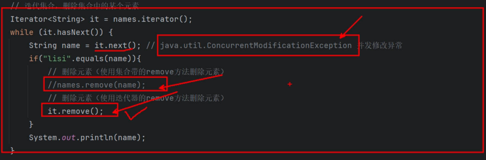

②**关于集合的`并发修改问题`**

+ **想象一下，有两个线程：A和B。`A线程`负责`迭代遍历集合`，`B线程`负责`删除集合中的某个元素`。当这两个线程同时执行时会有什么问题？**

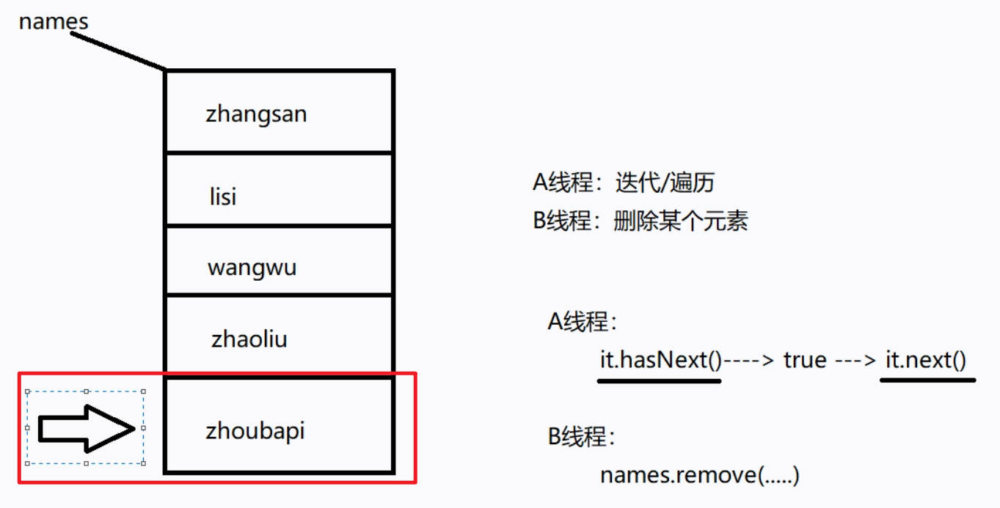

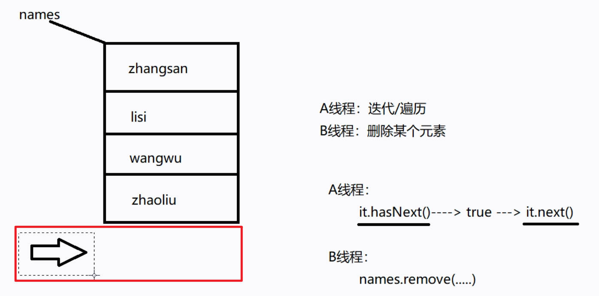


③**如何`解决并发修改问题`：`fail-fast机制(快速失败机制)`**

+ **fail-fast机制又被称为：`快速失败机制`。也就是说只要程序发现了程序对集合进行了并发修改。就会`立即让其失败`，以防`出现错误`。**

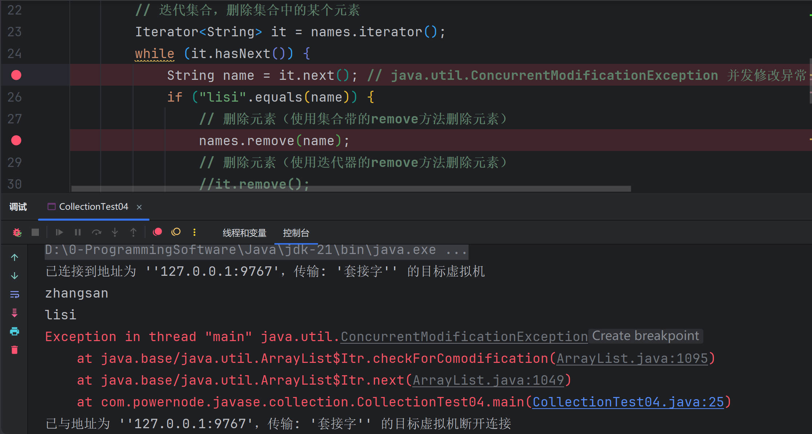

④**fail-fast机制是如何实现的？以下是源码中的实现原理：**

+ **集合中设置了一个modCount属性，用来记录修改次数，使用集合对象执行增，删，改中任意一个操作时，modCount就会自动加1。**

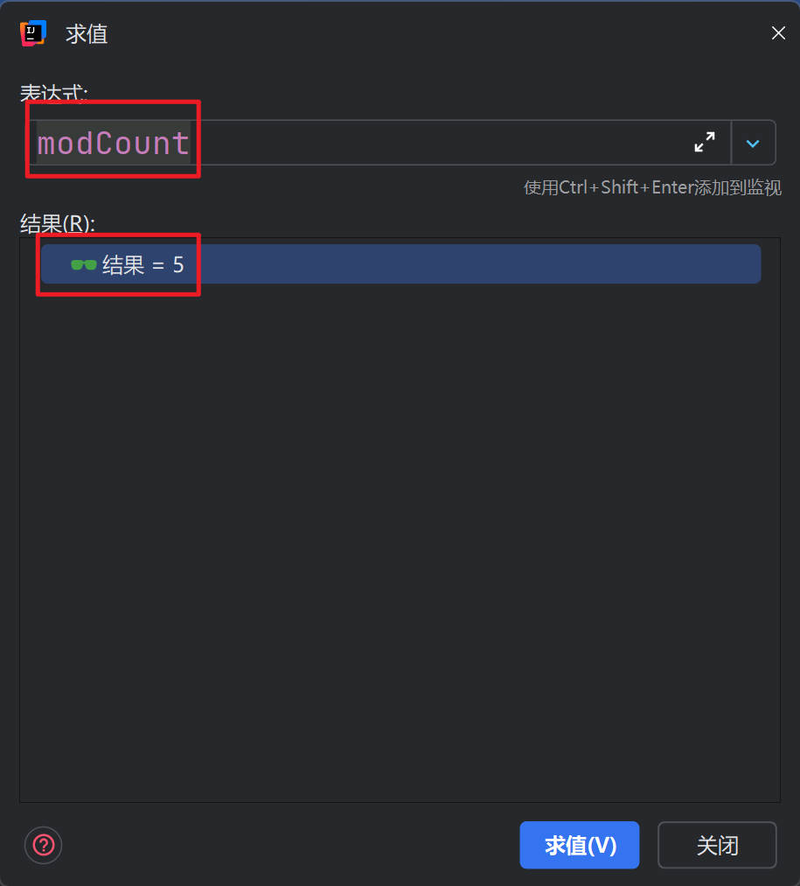

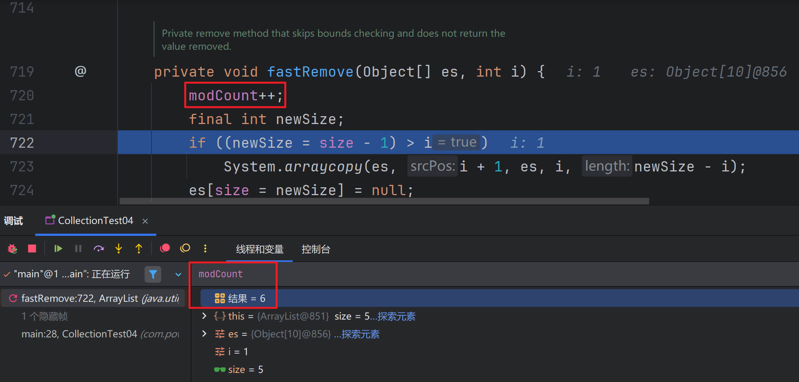

+ **获取迭代器对象的时候，会给迭代器对象初始化一个expectedModCount属性。并且将expectedModCount初始化为modCount，即：int expectedModCount = modCount;**

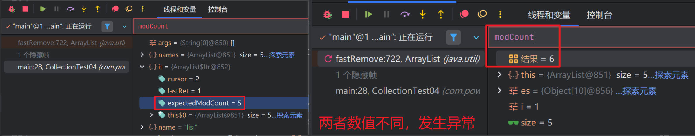

+ **当使用`集合对象删除元素`时：`modCount会加1`。但是迭代器中的`expectedModCount不会加1`。而当迭代器对象的`next()方法执行`时，会检测`expectedModCount和modCount是否相等`，如果`不相等`，则抛出：`ConcurrentModificationException异常`。**

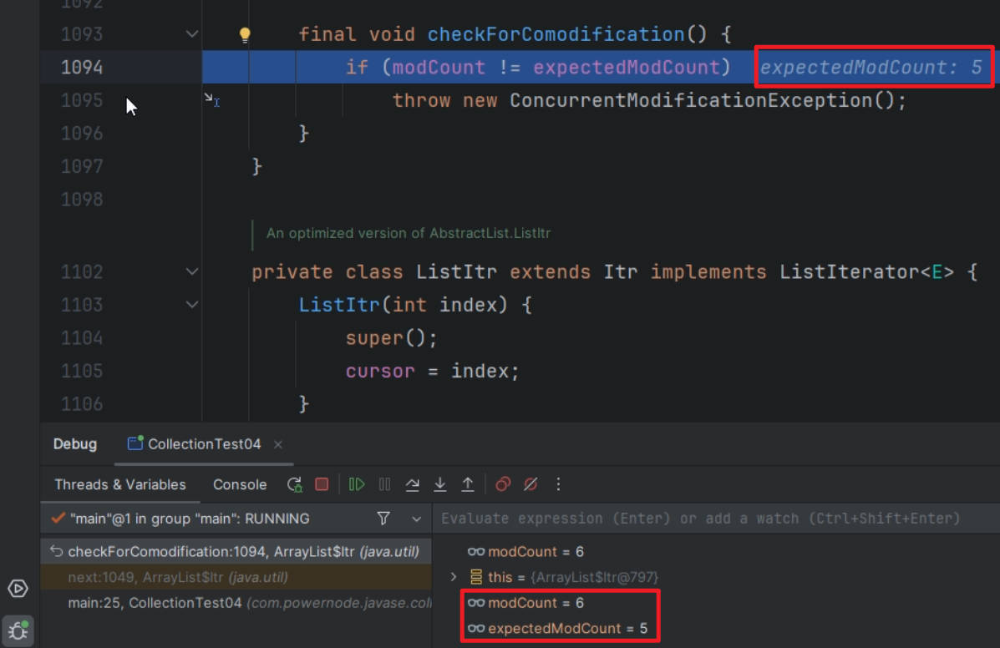

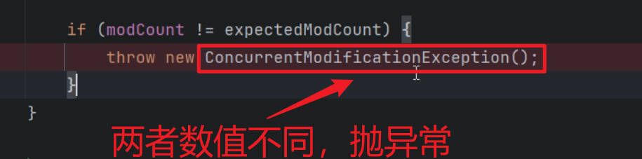

+ **当使用`迭代器删除元素`的时候：`modCount会加1`，并且`expectedModCount也会加1`。这样当迭代器对象的`next()方法执行`时，检测到的`expectedModCount和modCount相等`，则`不会出现ConcurrentModificationException异常`。**


⑤**注意：虽然我们当前写的程序是单线程的程序，并没有使用多线程，但是通过`迭代器去遍历`的同时`使用集合去删除元素`，这个行为将被认定为`并发修改`。**

⑥**结论：迭代集合时，删除元素要使用“`迭代器对象.remove()`”方法来删除，避免使用“`集合对象.remove(元素)`”。主要是为了`避免ConcurrentModificationException异常`的发生。注意：`迭代器的remove()方法删除的是next()方法的返回的那个数据`。`remove()方法调用`之前一定是`先调用了next()方法`，如果不是这样的，就会报错。**


## List接口

### List接口常用方法

①**List集合存储元素特点：`有序可重复`。**

1. **有序：是因为List集合中的元素`都是有下标的`，从0开始，以1递增。**

2. **可重复：`存进去1`，还可以`再存一个1`。**

```java
package com.powernode.javase.collection;

import java.util.ArrayList;
import java.util.Iterator;
import java.util.List;

/**
 * java.util.List:接口 （List家族）
 * 1. List家族特点：有序可重复（有序：每个元素有下标，从0开始，以1递增。可重复：存储了一个1，可以再存储一个1。）
 */
public class ListTest01 {
    public static void main(String[] args) {
        // 创建一个List集合
        List<Integer> nums = new ArrayList<>();

        nums.add(1);
        nums.add(2);
        nums.add(3);
        nums.add(4);
        nums.add(5);
        nums.add(6);
        nums.add(1);

        // 遍历
        Iterator<Integer> iterator = nums.iterator();
        while (iterator.hasNext()) {
            Integer num = iterator.next();
            System.out.println(num);
            /*
            1
            2
            3
            4
            5
            6
            1
             */
        }
    }
}
```


②**List接口下常见的实现类有：**

1. **ArrayList：数组**

2. **Vector、Stack：数组（线程安全的）**

3. **LinkedList：双向链表**

③**List接口特有方法：（在`Collection`和`SequencedCollection`中`没有的方法`，`只适合List家族`使用的方法，这些方法`都和下标有关系`。）**

1. **void add(int index, E element) 在`指定索引处插入元素`**

```java
package com.powernode.javase.collection;

import java.util.ArrayList;
import java.util.Iterator;
import java.util.List;

public class ListTest02 {
    public static void main(String[] args) {
        // 创建List集合对象
        List<String> list = new ArrayList<String>();

        // 添加元素
        list.add("1");
        list.add("2");
        list.add("3");
        list.add("4");
        list.add("5");
        list.add("6");

        // 在指定位置添加元素
        list.add(1,"zhangsan");

        // 遍历
        Iterator<String> iterator = list.iterator();
        while (iterator.hasNext()) {
            String s = iterator.next();
            System.out.println(s);
            /*
            1
            zhangsan
            2
            3
            4
            5
            6
             */
        }
    }
}
```


2. **E set(int index, E element); `修改索引处的元素`**

```java
package com.powernode.javase.collection;

import java.util.ArrayList;
import java.util.Iterator;
import java.util.List;

public class ListTest02 {
    public static void main(String[] args) {
        // 创建List集合对象
        List<String> list = new ArrayList<String>();

        // 添加元素
        list.add("1");
        list.add("2");
        list.add("3");
        list.add("4");
        list.add("5");
        list.add("6");

        // 在指定位置添加元素
        list.add(1,"zhangsan");

        // 修改索引处的元素
        list.add(1,"李四");

        // 遍历
        Iterator<String> iterator = list.iterator();
        while (iterator.hasNext()) {
            String s = iterator.next();
            System.out.println(s);
            /*
            1
            李四
            2
            3
            4
            5
            6
             */
        }
    }
}
```


3. **E get(int index); 根据`索引获取元素`（通过这个方法List集合具有自己特殊的遍历方式：根据下标遍历）**

```java
package com.powernode.javase.collection;

import java.util.ArrayList;
import java.util.Iterator;
import java.util.List;

public class ListTest02 {
    public static void main(String[] args) {
        // 创建List集合对象
        List<String> list = new ArrayList<String>();

        // 添加元素
        list.add("1");
        list.add("2");
        list.add("3");
        list.add("4");
        list.add("5");
        list.add("6");

        list.add("1");
        // 获取某个对象在当前集合中第一次出现处的下标
        int index = list.indexOf("1");
        System.out.println("第一次出现处的下标：" + index); // 0

        // 获取某个对象在当前集合中最后一次出现处的下标
        int lastIndex = list.lastIndexOf("1");
        System.out.println("最后一次出现处的下标：" + lastIndex); // 6

        // 遍历
        Iterator<String> iterator = list.iterator();
        while (iterator.hasNext()) {
            String s = iterator.next();
            System.out.println(s);
            /*
            1
            2
            3
            4
            5
            6
            1
             */
        }
    }
}
```


4. **E remove(int index); 删除索引处的元素**

```java
package com.powernode.javase.collection;

import java.util.ArrayList;
import java.util.Iterator;
import java.util.List;

public class ListTest02 {
    public static void main(String[] args) {
        // 创建List集合对象
        List<String> list = new ArrayList<String>();

        // 添加元素
        list.add("1");
        list.add("2");
        list.add("3");
        list.add("4");
        list.add("5");
        list.add("6");

        // 在指定位置添加元素
        list.add(1,"zhangsan");

        // 修改索引处的元素
        list.add(1,"李四");

        // 删除下标1处的元素
        list.remove(1);

        // 遍历
        Iterator<String> iterator = list.iterator();
        while (iterator.hasNext()) {
            String s = iterator.next();
            System.out.println(s);
            /*
            1
            2
            3
            4
            5
            6
             */
        }
    }
}
```


5. **int indexOf(Object o); 获取对象o在当前集合中第一次出现时的索引。**

6. **int lastIndexOf(Object o); 获取对象o在当前集合中最后一次出现时的索引。**

```java
package com.powernode.javase.collection;

import java.util.ArrayList;
import java.util.Iterator;
import java.util.List;

public class ListTest02 {
    public static void main(String[] args) {
        // 创建List集合对象
        List<String> list = new ArrayList<>();

        // 添加元素
        list.add("1");
        list.add("2");
        list.add("3");
        list.add("4");
        list.add("5");
        list.add("6");

        list.add("1");
        // 获取某个对象在当前集合中第一次出现处的下标
        int index = list.indexOf("1");
        System.out.println("第一次出现处的下标：" + index); // 0

        // 获取某个对象在当前集合中最后一次出现处的下标
        int lastIndex = list.lastIndexOf("1");
        System.out.println("最后一次出现处的下标：" + lastIndex); // 6

        // 遍历
        Iterator<String> iterator = list.iterator();
        while (iterator.hasNext()) {
            String s = iterator.next();
            System.out.println(s);
            /*
            1
            2
            3
            4
            5
            6
            1
             */
        }
    }
}
```


7. **`List<E> subList(int fromIndex, int toIndex); `截取子List集合生成一个新集合（对原集合无影响）。`[fromIndex, toIndex)`**

```java
package com.powernode.javase.collection;

import java.util.ArrayList;
import java.util.Iterator;
import java.util.List;

public class ListTest02 {
    public static void main(String[] args) {
        // 创建List集合对象
        List<String> list = new ArrayList<>();

        // 添加元素
        list.add("1");
        list.add("2");
        list.add("3");
        list.add("4");
        list.add("5");
        list.add("6");

        // 再次添加元素
        list.add("1");
        // 遍历
        Iterator<String> it = list.iterator();
        while (it.hasNext()) {
            String s = it.next();
            System.out.println(s);
            /*
            1
            2
            3
            4
            5
            6
            1
            */
        }

        // 截取一个子List集合
        List<String> newList = list.subList(3, 5); // [3,5)  最终截取的下标对应的是：3,4下标
        // 遍历（对于List集合来说有特殊的遍历方式，这种方式只适合于List集合的家族）
        for (int i = 0; i < newList.size(); i++) {
            String s = newList.get(i);
            System.out.println(s);
            /*
            4
            5
             */
        }
    }
}
```


8. **`static List<E> of(E... elements);`静态方法，返回`包含任意数量元素的不可修改列表`。（获取的集合是`只读的`，`不可修改的`。）**

```java
package com.powernode.javase.collection;

import java.util.ArrayList;
import java.util.Iterator;
import java.util.List;

public class ListTest02 {
    public static void main(String[] args) {
        // 创建List集合对象
        List<String> list = new ArrayList<>();

        // 获取一个不可修改的集合，只读的集合。
        List<Integer> nums = List.of(1, 2, 3, 43, 45, 5, 6, 76, 7);
        for (int i = 0; i < nums.size(); i++) {
            Integer num = nums.get(i);
            System.out.println(num);
            /*
            1
            2
            3
            43
            45
            5
            6
            76
            7
             */
        }
        
        // 尝试修改（出现异常，该集合是不可修改的，只读的。）
        //nums.set(0, 110); // java.lang.UnsupportedOperationException
    }
}
```


### List接口特有迭代

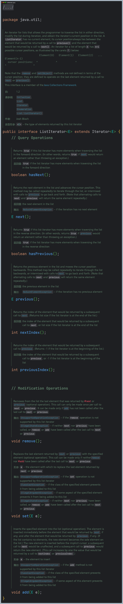

①**特有的迭代方式**

+ **`ListIterator<E> listIterator(); `获取`List集合特有的迭代器`（该迭代器功能更加强大，但`只适合于List集合`使用）**

+ **`ListIterator<E> listIterator(int index); `从列表中的`指定位置开始`，返回`列表中元素`的列表迭代器**

```java
package com.powernode.javase.collection;

import java.util.ArrayList;
import java.util.List;
import java.util.ListIterator;

/**
 * java.util.ListIterator：List接口专用的迭代器。Set集合不能使用。
 */
public class ListIteratorTest {
    public static void main(String[] args) {
        // 创建集合List对象
        List<String> names = new ArrayList<>();

        // 添加元素
        names.add("zhangsan");
        names.add("lisi");
        names.add("wangwu");
        names.add("zhaoliu");

        /*// 使用普通的通用迭代器遍历
        Iterator<String> it = names.iterator();
        while (it.hasNext()) {
            String name = it.next();
            System.out.println(name);
            *//*
            zhangsan
            lisi
            wangwu
            zhaoliu
             *//*
        }*/

        // 使用ListIterator进行遍历
        ListIterator<String> li = names.listIterator();
        while (li.hasNext()) {
            String name = li.next();
            System.out.println(name);
            /*
            zhangsan
            lisi
            wangwu
            zhaoliu
             */
        }
    }
}
```


②**ListIterator接口中的常用方法：**

+ **boolean hasNext();  判断光标当前指向的位置是否存在元素。**

+ **E next(); 将当前光标指向的元素返回，然后将光标向下移动一位。**

+ **void remove(); 删除`上一次next()方法返回的那个数据`(删除的是集合中的)。`remove()方法调用的前提`是：你先调用`next()方法`。不然`会报错`。**

```java
package com.powernode.javase.collection;

import java.util.ArrayList;
import java.util.List;
import java.util.ListIterator;

public class ListIteratorTest {
    public static void main(String[] args) {
        // 创建集合List对象
        List<String> names = new ArrayList<>();

        // 添加元素
        names.add("zhangsan");
        names.add("lisi");
        names.add("wangwu");
        names.add("zhaoliu");
        
        // remove方法：通过迭代器去删除
        //li.remove(); // java.lang.IllegalStateException（调用迭代器的remove方法之前也是需要调用了next()/previous()方法。）
        //删除上一次next()方法返回的那个数据(删除的是集合中的)。remove()方法调用的前提是：你先调用next()方法。不然会报错。
        ListIterator<String> li = names.listIterator();
        while (li.hasNext()) {
            String name = li.next();
            if("lisi".equals(name)){
                // 删除
                li.remove();
            }
        }

        System.out.println(names); // [zhangsan, wangwu, zhaoliu]
    }
}
```


+ **void add(E e); 添加元素（将元素`添加到光标指向的位置`，然后`光标向下移动一位`。）**

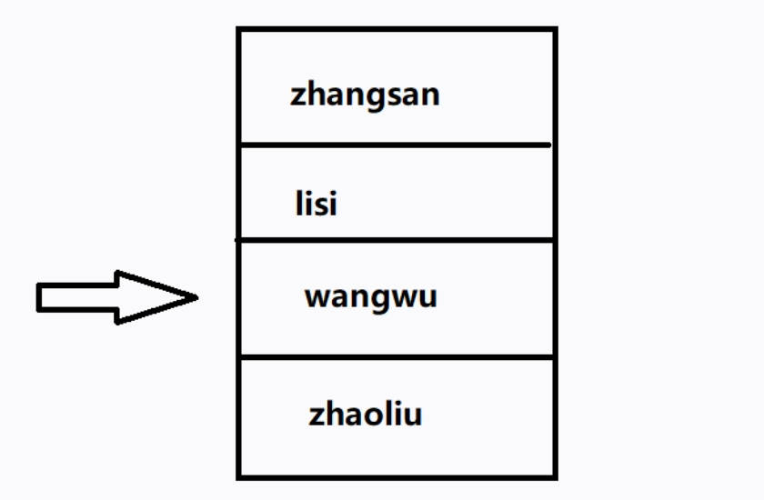

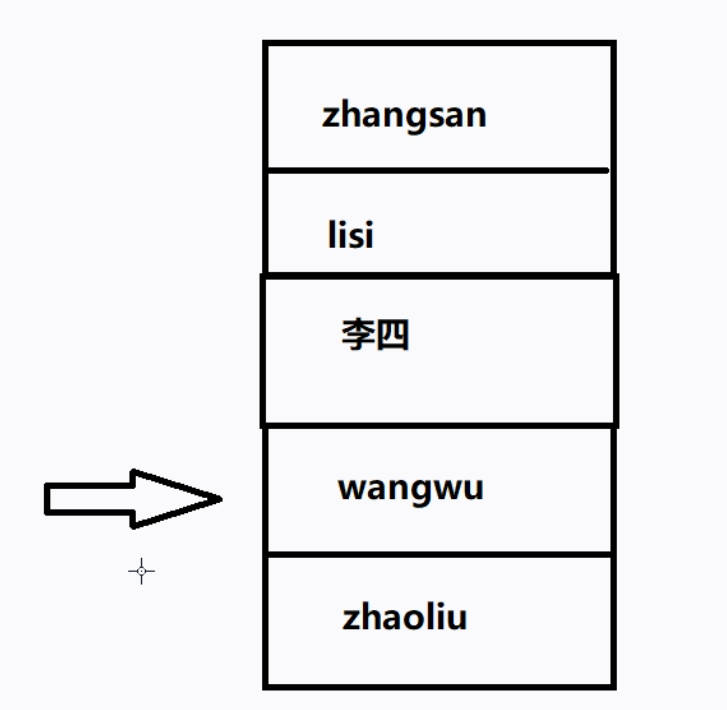

```java
package com.powernode.javase.collection;

import java.util.ArrayList;
import java.util.List;
import java.util.ListIterator;

public class ListIteratorTest {
    public static void main(String[] args) {
        // 创建集合List对象
        List<String> names = new ArrayList<>();

        // 添加元素
        names.add("zhangsan");
        names.add("lisi");
        names.add("wangwu");
        names.add("zhaoliu");

        // 使用ListIterator进行遍历
        // 测试的add方法
        ListIterator<String> li = names.listIterator();
        while (li.hasNext()) {
            String name = li.next();
            if ("lisi".equals(name)) {
                li.add("李四");
            }
            System.out.println(name);
            /*
            zhangsan
            lisi
            wangwu
            zhaoliu
             */
        }
        //System.out.println(names); // [zhangsan, lisi, 李四, wangwu, zhaoliu]
    }
}
```


+ **boolean hasPrevious(); 判断`当前光标指向位置`的上一个位置`是否存在元素`。**

```java
package com.powernode.javase.collection;

import java.util.ArrayList;
import java.util.List;
import java.util.ListIterator;

public class ListIteratorTest {
    public static void main(String[] args) {
        // 创建集合List对象
        List<String> names = new ArrayList<>();

        // 添加元素
        names.add("zhangsan");
        names.add("lisi");
        names.add("wangwu");
        names.add("zhaoliu");

        // 测试hasPrevious()方法
        // 判断是否有上一个
        // 判断当前光标指向位置的上一个位置是否存在元素。
        ListIterator<String> li = names.listIterator();
        System.out.println("光标当前指向的位置的上一个位置是否有元素：" + li.hasPrevious()); // false

        while (li.hasNext()) {
            String name = li.next();
            System.out.println(name);
            /*
            zhangsan
            lisi
            wangwu
            zhaoliu
             */
        }

        System.out.println("光标当前指向的位置的上一个位置是否有元素：" + li.hasPrevious()); // true
    }
}
```


+ **E previous(); 获取`上一个元素`（将`光标向上移动一位`，然后`将光标指向的元素返回`）**

```java
package com.powernode.javase.collection;

import java.util.ArrayList;
import java.util.List;
import java.util.ListIterator;

public class ListIteratorTest {
    public static void main(String[] args) {
        // 创建集合List对象
        List<String> names = new ArrayList<>();

        // 添加元素
        names.add("zhangsan");
        names.add("lisi");
        names.add("wangwu");
        names.add("zhaoliu");

        // E previous(); 获取上一个元素（将光标向上移动一位，然后将光标指向的元素返回）
        ListIterator<String> li = names.listIterator();
        while (li.hasNext()) {
            String name = li.next();
            System.out.println(name);
        }

        System.out.println("========================");

        System.out.println(li.previous()); // zhaoliu
        System.out.println(li.previous()); // wangwu
        System.out.println(li.previous()); // lisi
        System.out.println(li.previous()); // zhangsan
        //System.out.println(li.previous()); // java.util.NoSuchElementException(没有元素异常)*/
    }
}
```


+ **int nextIndex(); 获取光标指向的那个位置的下标**

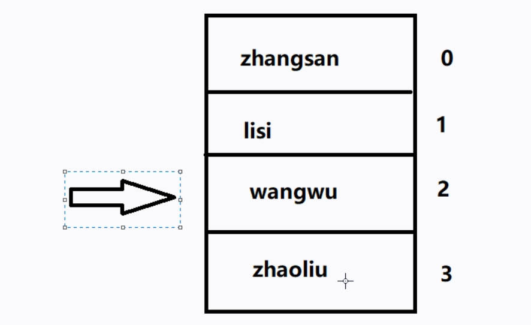

+ **int previousIndex(); 获取光标指向的那个位置的上一个位置的下标**

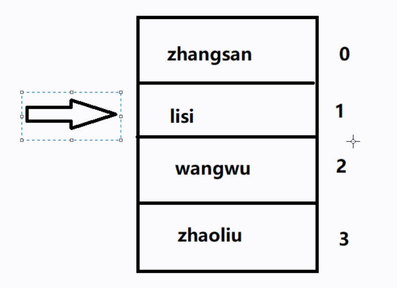

```java
package com.powernode.javase.collection;

import java.util.ArrayList;
import java.util.List;
import java.util.ListIterator;

public class ListIteratorTest {
    public static void main(String[] args) {
        // 创建集合List对象
        List<String> names = new ArrayList<>();

        // 添加元素
        names.add("zhangsan");
        names.add("lisi");
        names.add("wangwu");
        names.add("zhaoliu");
        
        //int nextIndex(); 获取光标指向的那个位置的下标
        ListIterator<String> li = names.listIterator();
        while (li.hasNext()) {
            String name = li.next();
            if("lisi".equals(name)){ // 当前取出的元素是"lisi"
                System.out.println(li.nextIndex()); //2
                // int previousIndex();	获取光标指向的那个位置的上一个位置的下标
                System.out.println(li.previousIndex()); // 1
            }
            System.out.println(name);
        }
    }
}
```


+ **void set(E e); 修改的是`上一次next()方法返回的那个数据`（修改的是`集合中的`）。set()方法调用的前提是：你先调用了`next()方法`。不然会`报错`。**

```java
package com.powernode.javase.collection;

import java.util.ArrayList;
import java.util.List;
import java.util.ListIterator;

public class ListIteratorTest {
    public static void main(String[] args) {
        // 创建集合List对象
        List<String> names = new ArrayList<>();

        // 添加元素
        names.add("zhangsan");
        names.add("lisi");
        names.add("wangwu");
        names.add("zhaoliu");

        // void set(E e);修改的是上一次next()方法返回的那个数据（修改的是集合中的）。set()方法调用的前提是：你先调用了next()方法。不然会报错。
        ListIterator<String> li = names.listIterator();

        // set方法不能随意使用，set调用的前提是：之前调用了next()或者previous()
        // li.set("xxxxxxxxxxxxxx"); // java.lang.IllegalStateException

        while (li.hasNext()) {
            String name = li.next();
            // 在这里时可以调用set方法
            if("lisi".equals(name)) {
                li.set("李四");
            }
            System.out.println(name);
        }

        System.out.println(names); // [zhangsan, 李四, wangwu, zhaoliu]
    }
}
```


### List接口使用Comparator排序

①**回顾数组中自定义类型是如何排序的？**

+ **所有自定义类型排序时`必须指定排序规则`。（`int不需要指定`，`String不需要指定`，因为他们都有`固定的排序规则`。int按照`数字大小`。String按照`字典中的顺序`）**

+ **如何给自定义类型指定排序规则？让自定义类型实现`java.lang.Comparable接口`，然后`重写compareTo方法`，在该方法中`指定比较规则`。**

```java
package com.powernode.javase.collection.arraysort;

public class User implements  Comparable<User> {
    private String name;
    private int age;

    public User(String name, int age) {
        this.name = name;
        this.age = age;
    }

    public String getName() {
        return name;
    }

    public void setName(String name) {
        this.name = name;
    }

    public int getAge() {
        return age;
    }

    public void setAge(int age) {
        this.age = age;
    }

    @Override
    public String toString() {
        return "User{" +
                "name='" + name + '\'' +
                ", age=" + age +
                '}';
    }

    /*
    关于compareTo方法的返回值：
        a - b == 0   a == b
        a - b > 0    a > b
        a - b < 0    a < b

        当compareTo方法执行结束之后，返回结果是0，表示：a == b
        当compareTo方法执行结束之后，返回结果大于0，表示：a > b
        当compareTo方法执行结束之后，返回结果小于0，表示：a < b
     */
    @Override
    public int compareTo(User user) { // 这个int是compareTo方法的返回值。相当于a - b之后的结果。
        // 这里提供比较规则
        // 可以按照名字进行排序，也可以按照年龄进行排序。
        // return this.age - user.age; // this放前表示升序。
        //return user.age - this.age; // this放后表示降序。

        // 按照姓名排序
        //return this.name.compareTo(user.name); // 升序
        return user.name.compareTo(this.name); // 降序
    }
}
```

```java
package com.powernode.javase.collection.arraysort;

import java.util.Arrays;

public class ArraySort {
    public static void main(String[] args) {
        User u1 = new User("abc", 20);
        User u2 = new User("bbc", 18);
        User u3 = new User("abb", 19);
        User u4 = new User("cbc", 25);
        User u5 = new User("acb", 6);

        User[] users = {u1, u2, u3, u4, u5};


        // 排序
        // class User cannot be cast to class Comparable
        // Arrays数组工具类在对User类型的数组进行排序的时候出现了：java.lang.ClassCastException
        // 因为User对象不是可比较的。User没有实现 java.lang.Comparable接口。
        // 换句话说：User没有提供比较规则。程序无法进行比较。
        // 怎么让User是可排序的。让User实现Comparable接口，实现compareTo方法，在该方法中编写比较规则。
        Arrays.sort(users);

        System.out.println(Arrays.toString(users));
        /*
        // 按照年龄排
        return this.age - user.age; // this放前表示升序。 // [User{name='acb', age=6}, User{name='bbc', age=18}, User{name='abb', age=19}, User{name='abc', age=20}, User{name='cbc', age=25}]
        return user.age - this.age; // this放后表示降序。 // [User{name='cbc', age=25}, User{name='abc', age=20}, User{name='abb', age=19}, User{name='bbc', age=18}, User{name='acb', age=6}]

        // 按照姓名排
        return this.name.compareTo(user.name); // 升序 // [User{name='abb', age=19}, User{name='abc', age=20}, User{name='acb', age=6}, User{name='bbc', age=18}, User{name='cbc', age=25}]
        return user.name.compareTo(this.name); // 降序 // [User{name='cbc', age=25}, User{name='bbc', age=18}, User{name='acb', age=6}, User{name='abc', age=20}, User{name='abb', age=19}]
         */
    }
}
```


②**List集合的排序**

+ **`default void sort(Comparator<? super E> c);` 对List集合中元素排序可以`调用此方法`。**

+ **sort方法需要一个参数: `java.util.Comparator`。我们把这个参数叫做`比较器`。这是`一个接口`。**

+ **如何给`自定义类型指定比较规则`？可以对Comparator提供一个`实现类`，并`重写compare方法`来指定比较规则。**

```java
package com.powernode.javase.collection.listsort;

public class Person {
    private String name;
    private int age;

    public Person(String name, int age) {
        this.name = name;
        this.age = age;
    }

    public String getName() {
        return name;
    }

    public void setName(String name) {
        this.name = name;
    }

    public int getAge() {
        return age;
    }

    public void setAge(int age) {
        this.age = age;
    }

    @Override
    public String toString() {
        return "Person{" +
                "name='" + name + '\'' +
                ", age=" + age +
                '}';
    }
}
```

```java
package com.powernode.javase.collection.listsort;

import java.util.Comparator;

/**
 * 一个单独的比较器。在这个比较器中编写Person的比较规则。
 */
public class PersonComparator implements Comparator<Person> {
    @Override
    public int compare(Person o1, Person o2) {
        // 按照年龄排序
        // 按照名字排序
        //return o1.getAge() - o2.getAge(); // 升序
        /*
        Person{name='acb', age=6}
        Person{name='bbc', age=18}
        Person{name='abb', age=19}
        Person{name='abc', age=20}
        Person{name='cbc', age=25}
         */
        //return o2.getAge() - o1.getAge(); // 降序
        /*
        Person{name='cbc', age=25}
        Person{name='abc', age=20}
        Person{name='abb', age=19}
        Person{name='bbc', age=18}
        Person{name='acb', age=6}
         */

        return o1.getName().compareTo(o2.getName());
        /*
        Person{name='abb', age=19}
        Person{name='abc', age=20}
        Person{name='acb', age=6}
        Person{name='bbc', age=18}
        Person{name='cbc', age=25}
         */
        //return o2.getName().compareTo(o1.getName());
        /*
        Person{name='cbc', age=25}
        Person{name='bbc', age=18}
        Person{name='acb', age=6}
        Person{name='abc', age=20}
        Person{name='abb', age=19}
         */
    }
}
```

```java
package com.powernode.javase.collection.listsort;

import java.util.ArrayList;
import java.util.List;

public class ListSort {
    public static void main(String[] args) {
        // 创建Person对象
        Person p1 = new Person("abc", 20);
        Person p2 = new Person("bbc", 18);
        Person p3 = new Person("abb", 19);
        Person p4 = new Person("cbc", 25);
        Person p5 = new Person("acb", 6);

        // 创建List集合
        List<Person> persons = new ArrayList<>();

        persons.add(p1);
        persons.add(p2);
        persons.add(p3);
        persons.add(p4);
        persons.add(p5);

        // 排序
        persons.sort(new PersonComparator());

        // 遍历
        for (int i = 0; i < persons.size(); i++) {
            System.out.println(persons.get(i));
            // 按照年龄排序
            // 按照名字排序
            //return o1.getAge() - o2.getAge(); // 升序
        /*
        Person{name='acb', age=6}
        Person{name='bbc', age=18}
        Person{name='abb', age=19}
        Person{name='abc', age=20}
        Person{name='cbc', age=25}
         */
            //return o2.getAge() - o1.getAge(); // 降序
        /*
        Person{name='cbc', age=25}
        Person{name='abc', age=20}
        Person{name='abb', age=19}
        Person{name='bbc', age=18}
        Person{name='acb', age=6}
         */

            //return o1.getName().compareTo(o2.getName());
        /*
        Person{name='abb', age=19}
        Person{name='abc', age=20}
        Person{name='acb', age=6}
        Person{name='bbc', age=18}
        Person{name='cbc', age=25}
         */
            //return o2.getName().compareTo(o1.getName());
        /*
        Person{name='cbc', age=25}
        Person{name='bbc', age=18}
        Person{name='acb', age=6}
        Person{name='abc', age=20}
        Person{name='abb', age=19}
         */
        }
    }
}
```


+ **当然，`Comparator接口的实现类`也`可以采用匿名内部类`的方式。**

```java
package com.powernode.javase.collection.listsort;

import java.util.ArrayList;
import java.util.Comparator;
import java.util.List;

/**
 * 使用匿名内部类
 */
public class ListSort2 {
    public static void main(String[] args) {
        // 创建Person对象
        Person p1 = new Person("abc", 20);
        Person p2 = new Person("bbc", 18);
        Person p3 = new Person("abb", 19);
        Person p4 = new Person("cbc", 25);
        Person p5 = new Person("acb", 6);

        // 创建List集合
        List<Person> persons = new ArrayList<>();

        persons.add(p1);
        persons.add(p2);
        persons.add(p3);
        persons.add(p4);
        persons.add(p5);

        // 排序
        persons.sort(new Comparator<Person>() {
            @Override
            public int compare(Person o1, Person o2) {
                return o1.getAge() - o2.getAge();
                /*
                Person{name='acb', age=6}
                Person{name='bbc', age=18}
                Person{name='abb', age=19}
                Person{name='abc', age=20}
                Person{name='cbc', age=25}
                 */
            }
        });


        for (int i = 0; i < persons.size(); i++) {
            System.out.println(persons.get(i));
        }
    }
}
```


## ArrayList

①**ArrayList集合底层采用了`数组`这种数据结构。**

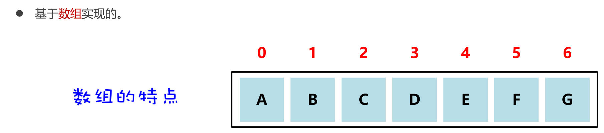

②**ArrayList集合优点：**

+ 底层是数组，因此根据下标查找元素的时间复杂度是O(1)。因此检索效率高。

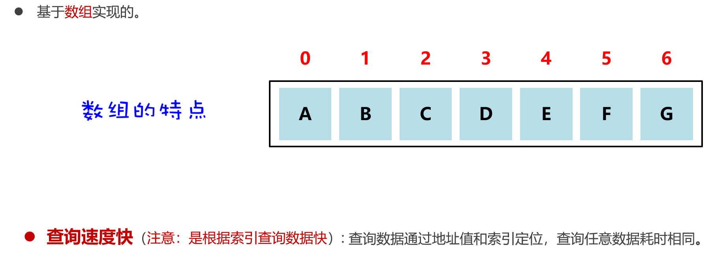

③**ArrayList集合缺点：**

+ 随机增删元素效率较低。不过只要数组的容量还没满，对末尾元素进行增删，效率不受影响。

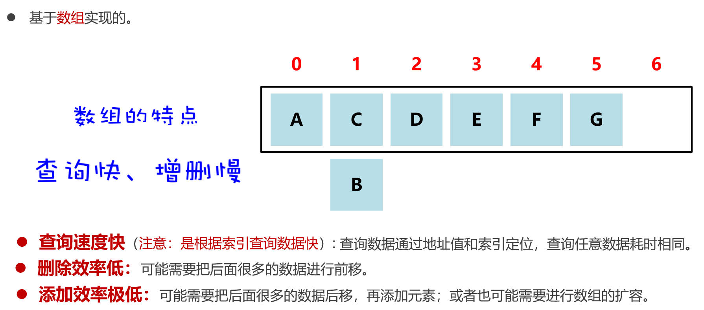

④**ArrayList集合适用场景：**

+ 需要频繁的检索元素，并且很少的进行随机增删元素时建议使用。

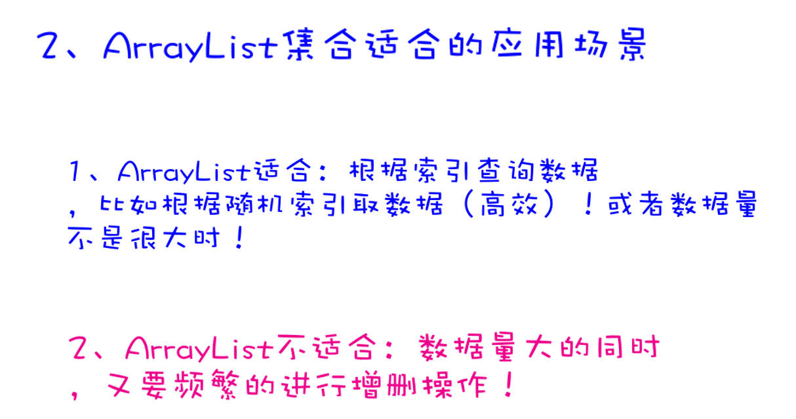

⑤**ArrayList默认初始化容量？**

+ 从源码角度可以看到，当`调用无参数构造方法`时，`初始化容量0`。
+ 当`第一次调用add方法`时将`ArrayList容量`初始化为`10个长度`。

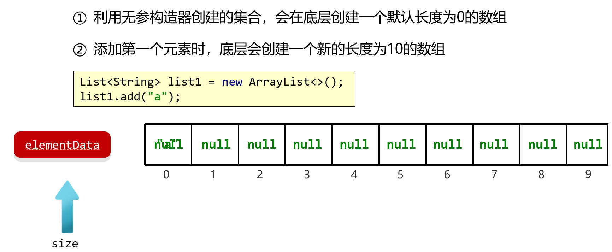

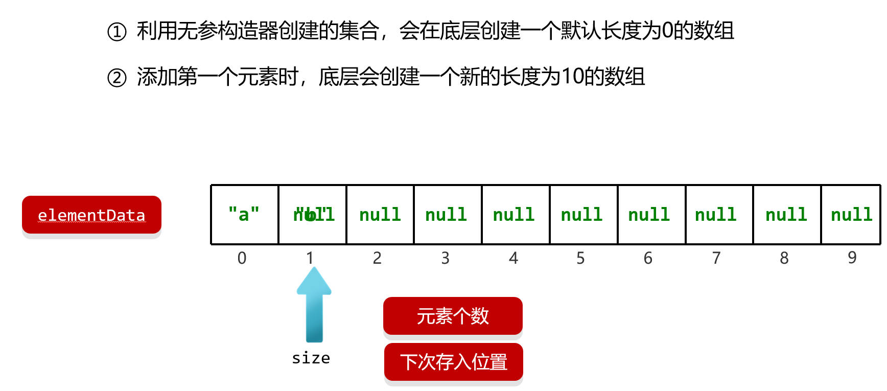


⑥**ArrayList集合扩容策略？**

+ 底层扩容会`创建一个新的数组`，然后使用`数组拷贝`。扩容之后的新容量是原容量的**1.5**倍。

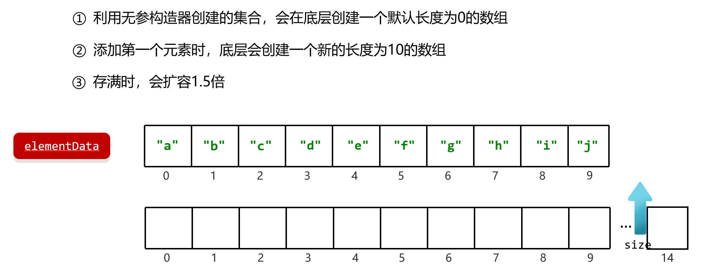

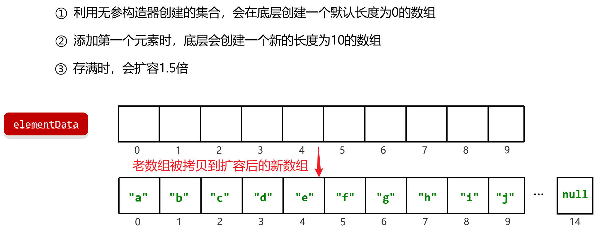

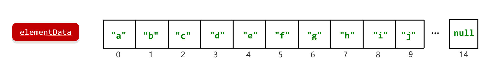

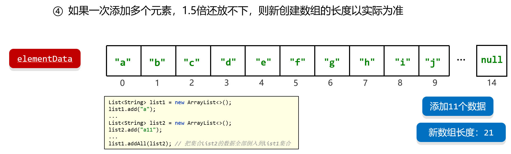


⑦**ArrayList集合源码分析：**

+ **属性分析**

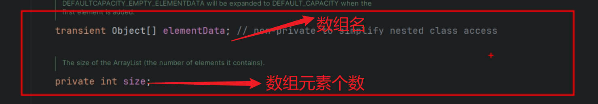

+ **构造方法分析（使用ArrayList集合时`最好也是预测大概数量`，给定`初始化容量`，减少`扩容次数`。）**

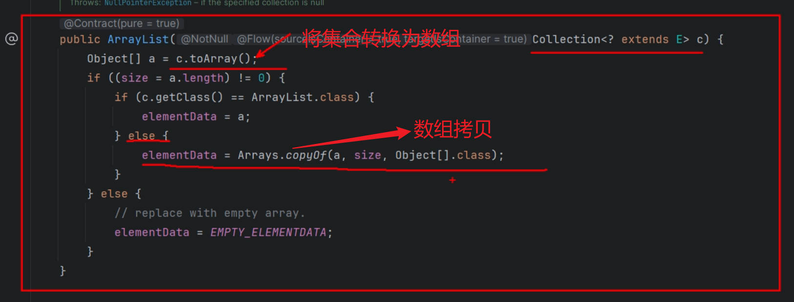

+ 添加元素

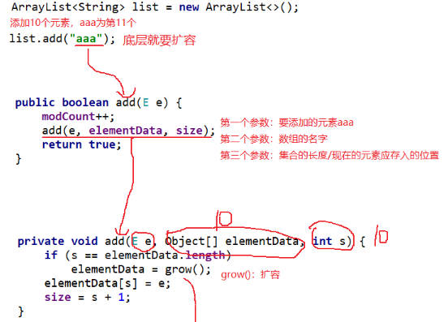

+ 修改元素

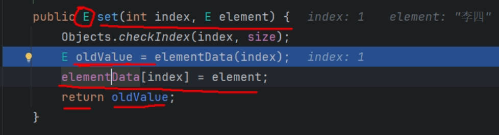

+ 插入元素

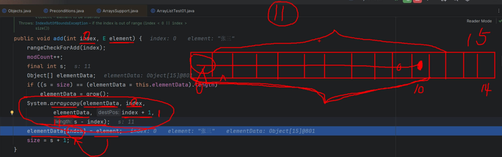

+ 删除元素

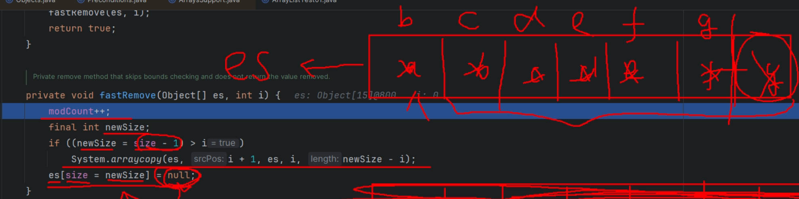

> **示例:**
>
> ```java
> package com.powernode.javase.collection;
> 
> import java.util.ArrayList;
> import java.util.List;
> 
> public class ArrayListTest01 {
>     public static void main(String[] args) {
>         // 创建一个ArrayList
>         // 1. 调用ArrayList集合的无参数构造方法时，默认初始化的容量是0
>         List<String> names = new ArrayList<>();
> 
>         // 向ArrayList集合中添加元素
>         // 第一次调用add方法的时候，初始化容量变为10
>         names.add("zhangsan");
>         names.add("lisi");
>         names.add("lisi");
>         names.add("lisi");
>         names.add("lisi");
>         names.add("lisi");
>         names.add("lisi");
>         names.add("lisi");
>         names.add("lisi");
>         names.add("lisi");
>         // ArrayList集合的增长/扩容策略？扩容之后的新容量是原容量的1.5倍。
>         names.add("lisi11");
> 
>         // 修改ArrayList集合中的某个元素
>         String oldData = names.set(1, "李四");
>         System.out.println(oldData); // lisi
> 
>         // 插入元素
>         names.add(0, "张三");
> 
>         // 删除元素
>         names.remove(0);
>     }
> }
> ```


## Vector

①**Vector底层也是`数组`，和ArrayList相同。**

②**不同的是Vector几乎所有的方法都是`线程同步`的（被synchronized修饰：线程排队执行，不能并发），因此Vector是`线程安全的`，但由于`效率较低`，`很少使用`。因为控制线程安全有新方式。**

③**Vector初始化容量：`10`**

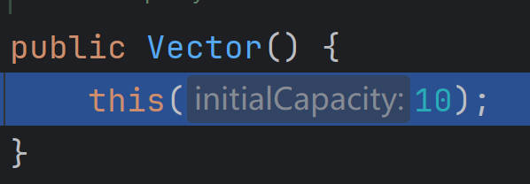

④**Vector扩容策略：扩容之后的容量是`原容量的2倍`。**

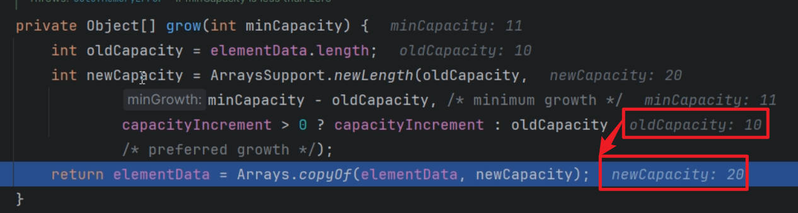

> **示例:**
>
> ```java
> package com.powernode.javase.collection;
> 
> import java.util.List;
> import java.util.Vector;
> 
> /**
>  * Vector中所有的方法都有synchronized修饰。所有的方法都是线程安全的。
>  * 整体执行效率较低。已经很少使用了。因为现在保证线程安全有新手段。
>  */
> public class VectorTest01 {
>     public static void main(String[] args) {
>         // 创建Vector集合（Vector底层也是一个数组，线程安全的数组。）
>         // 分析源码：看看初始化容量是多少？
>         List<String> list = new Vector<>();
> 
>         // 分析源码：看看怎么扩容的？扩容之后的容量是原容量的2倍。
>         list.add("1");
>         list.add("2");
>         list.add("3");
>         list.add("4");
>         list.add("5");
>         list.add("6");
>         list.add("7");
>         list.add("8");
>         list.add("9");
>         list.add("10");
>         list.add("11");
>     }
> }
> ```


## 链表存储结构

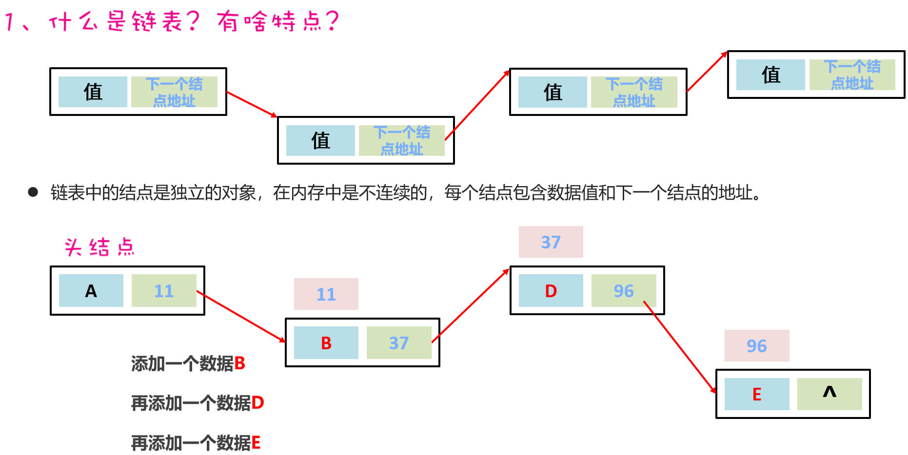

①单向链表

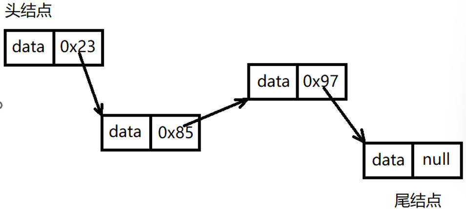

> **给单向链表添加下标索引：**

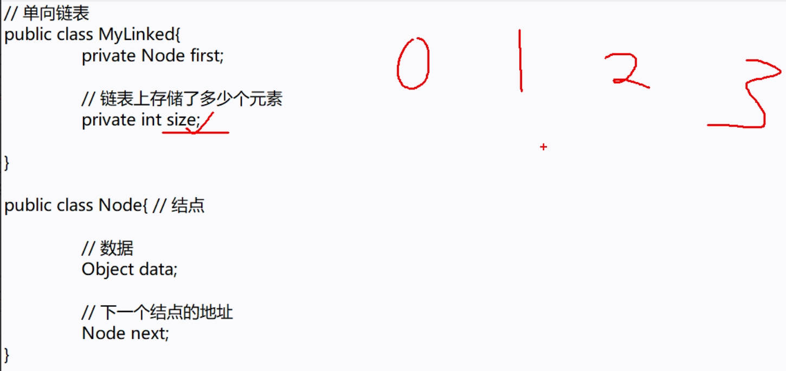

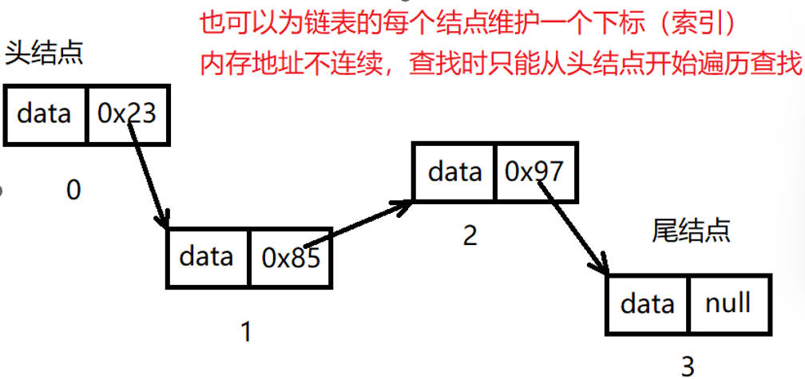

> **删除结点：**


> **新增结点：**

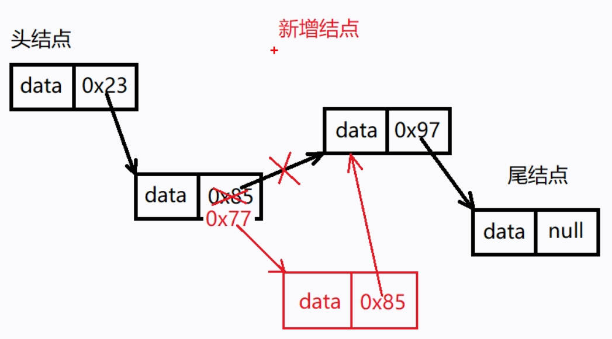

②双向链表

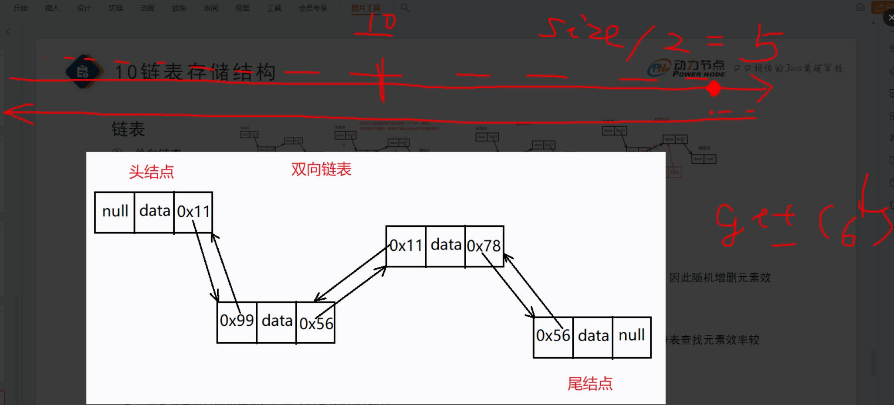

③环形链表

环形单链表

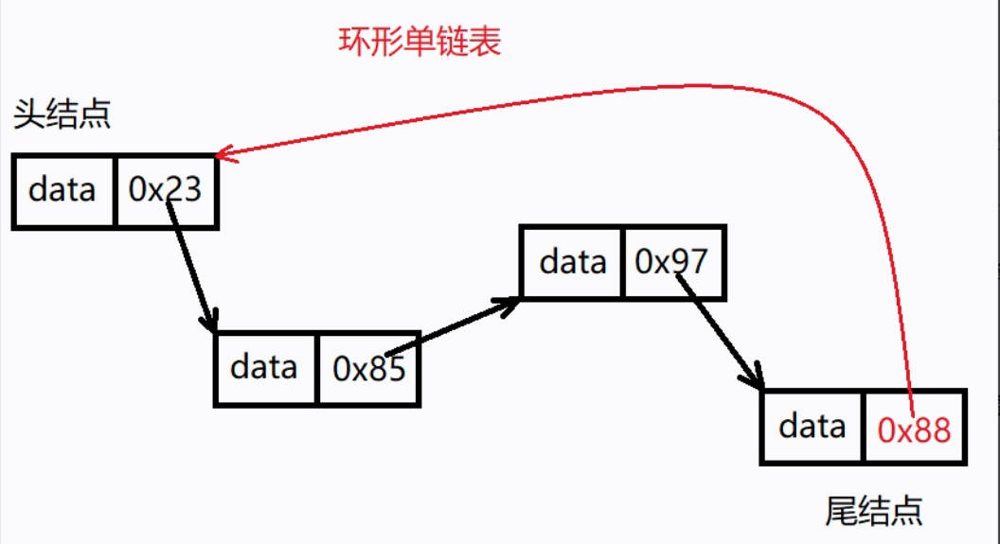

环形双链表

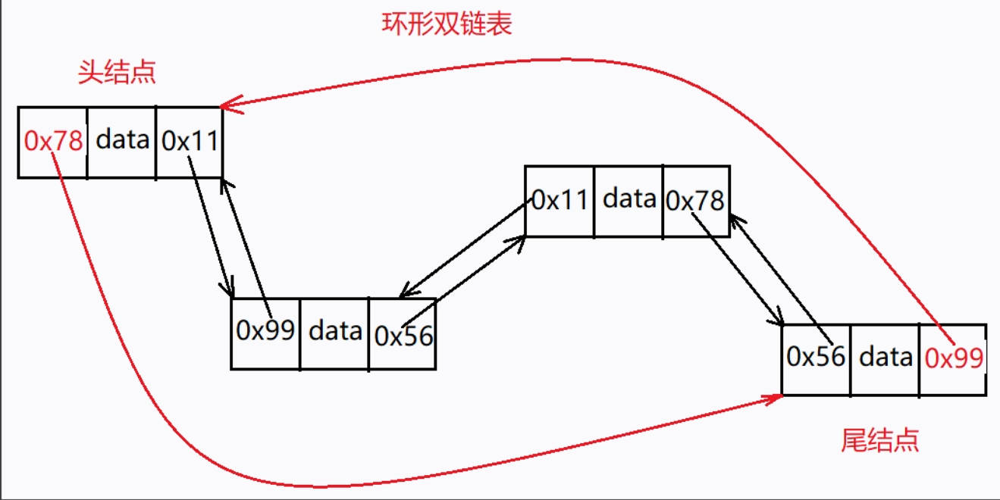

④**链表优点：**

**因为链表节点在空间存储上，内存地址`不是连续的`。因此删除某个结点时不需要涉及到元素位移的问题。因此`随机增删元素效率较高`。`时间复杂度O(1)`**

⑤**链表缺点：**

**链表中元素在查找时，只能从某个节点开始`顺序查找`，因为链表结点的`内存地址在空间上不是连续的`。链表`查找元素效率较低`，`时间复杂度O(n)`**


⑥**链表的适用场景：**

**需要`频繁进行随机增删`，但`很少的查找`的操作时。**


## LinkedList

①**LinkedList是`一个双向链表`**


②源码分析：

> **属性分析**


构造方法分析

> **添加元素**


> **修改元素**


> **插入元素**


> **删除元素**


> **示例:**
>
> ```java
> package com.powernode.javase.collection;
> 
> import java.util.LinkedList;
> 
> /**
>  * LinkedList集合底层是一个双向链表的数据结构
>  */
> public class LinkedListTest {
>     public static void main(String[] args) {
>         // 创建一个双向链表 集合。
>         // LinkedList是一个双向链表
>         // 调用无参数构造方法，创建了一个空链表。
>         LinkedList<String> ll = new LinkedList<>();
> 
>         // 新增
>         ll.add("1");
>         ll.add("2");
>         ll.add("3");
>         ll.add("4");
>         ll.add(2, "5");
> 
>         // 修改
>         String oldVal = ll.set(1, "110");
>         System.out.println(oldVal); // 2
> 
>         // 删除
>         String removedValue = ll.remove(1);
>         System.out.println(removedValue); // 110
> 
>         // 根据下标查询元素
>         String s = ll.get(ll.size() - 1);
>         System.out.println(s); // 4
>     }
> }
> ```


③**手写单向链表**

```java
package com.powernode.javase.collection;

/**
 * 自定义的单向链表
 */
public class MyLinked<E> {
    /**
     * 元素个数
     */
    private int size;
    /**
     * 单向链表的头结点
     */
    private Node<E> first;

    /**
     * 构建一个空链表
     */
    public MyLinked() {

    }


    /**
     * 获取集合中元素的个数
     * @return 个数
     */
    public int size(){
        return size;
    }

    /**
     * 向单向链表的末尾添加一个元素。
     * @param data 数据
     */
    public void add(E data) {
        // 如果first是空，表示是一个空链表
        if(first == null){
            first = new Node<>(data, null);
            size++;
            return;
        }
        // 找到末尾结点
        Node<E> last = findLast();
        last.next = new Node<>(data, null);
        size++;
    }

    /**
     * 找到单向链表的末尾结点
     * @return 末尾结点
     */
    private Node<E> findLast() {
        if(first == null){
            // 空链表
            return null;
        }
        // 程序指定到这里，first肯定不是null，不是一个空链表
        // 假设第一个结点就是最后一个结点。
        Node<E> last = first;
        while(last.next != null){
            // 把last.next看做是最后一个结点
            last = last.next;
        }
        return last;
    }

    /**
     * 将元素添加到指定索引处
     * @param index 下标
     * @param data 数据
     */
    public void add(int index, E data) {
        // 这里按说应该进行下标的检查，防止越界。
        // 创建新的结点对象
        Node<E> newNode = new Node<>(data, null);
        // 后期再写node(int)方法，这个方法可以根据下标找到对应的结点对象
        Node<E> prev = node(index - 1);
        newNode.next = prev.next;
        prev.next = newNode;
        size++;
    }

    /**
     * 返回索引处的结点对象
     * @param index 索引
     * @return 结点对象
     */
    private Node<E> node(int index) {
        // 假设头结点是下一个结点
        Node<E> next = first;
        for (int i = 0; i < index; i++) {
            next = next.next;
        }
        return next;
    }

    /**
     * 删除指定索引处的元素
     * @param index 索引
     */
    public void remove(int index) {
        // 检查index是否越界
        // 假如删除的结点是头结点
        if(index == 0){
            Node<E> oldFirst = first;
            first = first.next;
            oldFirst.next = null;
            return;
        }
        // 删除的不是头结点
        // 被删除的结点的上一个结点
        Node<E> prev = node(index - 1);
        // 获取被删除的那个结点
        Node<E> removed = node(index);
        prev.next = removed.next;
        removed.next = null;
        removed.item = null;
        size--;
    }

    /**
     * 修改指定索引处的数据
     * @param index 索引
     * @param data 数据
     */
    public void set(int index, E data) {
        Node<E> node = node(index);
        node.item = data;
    }

    /**
     * 根据下标获取数据
     * @param index 下标
     * @return 数据
     */
    public E get(int index) {
        return node(index).item;
    }

    /**
     * 单向链表当中的结点（建议定义为静态内部类。）
     */
    private static class Node<E> {
        /**
         * 数据
         */
        E item;
        /**
         * 下一个结点的内存地址
         */
        Node<E> next;

        /**
         * 构造一个结点对象
         * @param item 结点中的数据
         * @param next 下一个结点的内存地址。
         */
        public Node(E item, Node<E> next) {
            this.item = item;
            this.next = next;
        }
    }
}
```

> **测试示例：**
>
> ```java
> package com.powernode.javase.collection;
> 
> public class MyLinkedTest {
>     public static void main(String[] args) {
>         // 创建一个单向链表对应的集合对象
>         MyLinked<String> myLinked = new MyLinked<>();
> 
>         // 添加元素
>         myLinked.add("zhangsan");
>         myLinked.add("lisi");
>         myLinked.add("wangwu");
>         myLinked.add("zhaoliu");
> 
>         //在指定位置添加元素
>         myLinked.add(1, "李四");
> 
>         // 遍历
>         for (int i = 0; i < myLinked.size(); i++) {
>             System.out.println(myLinked.get(i));
>         }
>         /*
>         zhangsan
>         李四
>         lisi
>         wangwu
>         zhaoliu
>          */
> 
>         // 删除下标位置上的元素
>         myLinked.remove(1);
> 
>         System.out.println("=========================");
> 
>         // 遍历
>         for (int i = 0; i < myLinked.size(); i++) {
>             System.out.println(myLinked.get(i));
>         }
>         /*
>         zhangsan
>         lisi
>         wangwu
>         zhaoliu
>          */
> 
>         // 修改
>         myLinked.set(1,"李四2");
> 
> 
>         System.out.println("=========================");
> 
>         // 遍历
>         for (int i = 0; i < myLinked.size(); i++) {
>             System.out.println(myLinked.get(i));
>         }
>         /*
>         zhangsan
>         李四2
>         wangwu
>         zhaoliu
>          */
>     }
> }
> ```

### LinkedList源码分析：

> 底层是双向链表结构

**核心步骤如下：**

1. **刚开始创建的时候，底层创建了两个变量：一个记录头结点first，一个记录尾结点last，默认为null**
2. **添加第一个元素时，底层创建一个结点对象，first和last都记录这个结点的地址值**
3. **添加第二个元素时，底层创建一个结点对象，第一个结点会记录第二个结点的地址值，last会记录新结点的地址值**


## 栈数据结构

①**LIFO原则（Last In，First Out）：`后进先出`**


②**实现栈数据结构，可以用数组来实现，也可以用`双向链表`来实现。**


③**用`数组实现`的代表是：`Stack、ArrayDeque`**

①`Stack`：`Vetor的子类`，实现了`栈数据结构`，除了`具有Vetor的方法`，还扩展了其它方法，完成了`栈结构的模拟`。不过`在JDK1.6（Java6）之后就不建议`使用了，因为它是`线程安全的`，太慢了。Stack中的方法如下：

+ E push(E item)：压栈

+ E pop()：弹栈（将栈顶元素删除，并返回被删除的引用）

+ int search(Object o)：查找栈中元素（返回值的意思是：以1为开始，从栈顶往下数第几个）

+ E peek()：窥视栈顶元素（不会将栈顶元素删除，只是看看栈顶元素是什么。注意：如果栈为空时会报异常。）

②ArrayDeque

+ E push(E item)

+ E pop()

④**用`链表实现`的代表是：`LinkedList`**

①LinkedList

+ E push(E item)

+ E pop()


> **测试示例：**
>
> ```java
> package com.powernode.javase.collection;
> 
> import java.util.ArrayDeque;
> import java.util.LinkedList;
> import java.util.Stack;
> 
> /**
>  * java.util.Stack：底层是数组，线程安全的，JDK1.6不建议用了。
>  * java.util.ArrayDeque：底层是数组（实现LIFO的同时，又实现了双端队列。）
>  * java.util.LinkedList：底层是双向链表（实现LIFO的同时，又实现了双端队列。）
>  * 以上三个类都实现了栈数据结构。都实现了LIFO。
>  */
> public class StackTest {
>     public static void main(String[] args) {
>         // 创建栈
>         Stack<String> stack1 = new Stack<>();
>         LinkedList<String> stack2 = new LinkedList<>();
>         ArrayDeque<String> stack3 = new ArrayDeque<>();
> 
>         // 压栈
>         stack1.push("1");
>         stack1.push("2");
>         stack1.push("3");
>         stack1.push("4");
> 
>         // seach方法
>         System.out.println("位置：" + stack1.search("1")); // 位置：4
> 
>         // 弹栈
>         System.out.println(stack1.pop()); // 4
>         System.out.println(stack1.pop()); // 3
>         System.out.println(stack1.pop()); // 2
>         // 窥视
>         System.out.println("此时栈顶元素：" + stack1.peek()); // 此时栈顶元素：1
>         //System.out.println(stack1.pop()); // 1
>         // java.util.EmptyStackException 栈已空异常
>         //System.out.println(stack1.pop());
> 
>         System.out.println("====================");
> 
>         // 压栈
>         stack2.push("1");
>         stack2.push("2");
>         stack2.push("3");
>         stack2.push("4");
>         // 弹栈
>         System.out.println(stack2.pop()); // 4
>         System.out.println(stack2.pop()); // 3
>         System.out.println(stack2.pop()); // 2
>         System.out.println(stack2.pop()); // 1
> 
>         System.out.println("====================");
> 
>         // 压栈
>         stack3.push("1");
>         stack3.push("2");
>         stack3.push("3");
>         stack3.push("4");
>         // 弹栈
>         System.out.println(stack3.pop()); // 4
>         System.out.println(stack3.pop()); // 3
>         System.out.println(stack3.pop()); // 2
>         System.out.println(stack3.pop()); // 1
>     }
> }
> ```


## 队列数据结构

①**队列是一种特殊的线性表，特殊之处在于它`只允许在表的前端（front）进行删除`操作，而`在表的后端（rear）进行插入`操作，队列是一种`操作受限制的线性表`。进行`插入操作`（入口）的端称为`队尾`，进行`删除操作`（出口）的端称为`队头`。**


②**队列的插入操作只能在队尾操作，队列的删除操作只能在队头操作，因此队列是一种`先进先出（First In First Out）`的线性表，简称`FIFO表`。**


③`Queue接口`是一种基于`FIFO（先进先出）`的数据结构，而`Deque接口`则同时`支持FIFO和LIFO（后进先出）`两种操作。因此`Deque接口`也被称为`“双端队列”`。


④**Java集合框架中队列的实现：**

+ **链表实现方式：`LinkedList`**

+ **数组实现方式：`ArrayDeque`**

③`LinkedList`和`ArrayDeque`都实现了`Queue、Deque接口`，因此这两个类都具备`队列和双端队列`的特性。


④`LinkedList`底层是基于`双向链表实现`的，因此它天然就是一个双端队列，既`支持从队尾入队，从队头出队`，也支持`从队头入队，从队尾出队`。用Deque的实现方式来说，就是它既实现了`队列的offer()和poll()`方法，也实现了`双端队列的offerFirst()、offerLast()、pollFirst()和pollLast()`方法等。


⑤`ArrayDeque`底层是使用`环形数组`实现的，也是一个`双端队列`。它比LinkedList更加高效，因为在数组中随机访问元素的`时间复杂度是O(1)`，而链表中需要从头或尾部遍历链表寻找元素，`时间复杂度是O(N)`。循环数组：`index = (start + i) % capacity`


### Queue 和 Deque 接口

1. **Queue接口基于Collection扩展的方法包括：**

```java
boolean offer(E e); 入队。

E poll(); 出队，如果队列为空，返回null。

E remove(); 出队，如果队列为空，抛异常。

E peek(); 查看队头元素，如果为空则返回null。

E element(); 查看对头元素，如果为空则抛异常。
```

```java
package com.powernode.javase.collection;

import java.util.ArrayDeque;
import java.util.LinkedList;
import java.util.Queue;

/**
 * java.util.ArrayDeque
 * java.util.LinkedList
 * 以上两个类都实现了双端队列。
 */
public class QueueTest {
    public static void main(String[] args) {
        // 创建队列对象
        Queue<String> queue1 = new ArrayDeque<>();

        // 入队
        queue1.offer("1");
        queue1.offer("2");
        queue1.offer("3");
        queue1.offer("4");

        // 出队
        System.out.println(queue1.poll());
        System.out.println(queue1.poll());
        System.out.println(queue1.poll());
        System.out.println(queue1.poll());
        /*
        /*
        1
        2
        3
        4
         */

        // 创建队列对象
        Queue<String> queue2 = new LinkedList<>();

        // 入队
        queue2.offer("1");
        queue2.offer("2");
        queue2.offer("3");
        queue2.offer("4");

        // 出队
        System.out.println(queue2.poll());
        System.out.println(queue2.poll());
        System.out.println(queue2.poll());
        System.out.println(queue2.poll());
        /*
        1
        2
        3
        4
         */
    }
}
```


2. **Deque接口基于Queen接口扩展的方法包括：**

```java
以下2个方法可模拟队列：

boolean offerLast(E e);  从队尾入队

E pollFirst();  从队头出队
    

以下4个方法可模拟双端队列：

boolean offerLast(E e);  从队尾入队

E pollFirst();  从队头出队 

boolean offerFirst(E e);  从队头入队

E pollLast();  从队尾出队
    

另外offerLast+pollLast或者pollFirst+offerFirst可以模拟栈数据结构。或者也可以直接调用push/pop方法。
```

```java
package com.powernode.javase.collection;

import java.util.ArrayDeque;
import java.util.Deque;

/**
 * java.util.ArrayDeque
 * java.util.LinkedList
 * 以上两个类都实现了双端队列。
 */
public class DequeTest {
    public static void main(String[] args) {

        // 队尾进，队头出
        // 创建双端队列对象
        //Deque<String> deque1 = new ArrayDeque<>();
        Deque<String> deque1 = new ArrayDeque<>();

        deque1.offerLast("1");
        deque1.offerLast("2");
        deque1.offerLast("3");
        deque1.offerLast("4");

        System.out.println(deque1.pollFirst());
        System.out.println(deque1.pollFirst());
        System.out.println(deque1.pollFirst());
        System.out.println(deque1.pollFirst());
        /*
        1
        2
        3
        4
         */

        // 队头进，队尾出
        deque1.offerFirst("a");
        deque1.offerFirst("b");
        deque1.offerFirst("c");
        deque1.offerFirst("d");

        System.out.println(deque1.pollLast());
        System.out.println(deque1.pollLast());
        System.out.println(deque1.pollLast());
        System.out.println(deque1.pollLast());
        /*
        a
        b
        c
        d
         */
    }
}
```


## Map 接口（⭐）

### Map继承结构


①**`Map集合`以`key和value`的`键值对`形式存储。`key和value`存储的都是`引用`。**

②**Map集合中key起主导作用。`value`是`附属在key上`的。**

③`SequencedMap`是`Java21`新增的。

④**`LinkedHashMap`和`TreeMap`都是`有序集合`。（`key是有序的`）**

⑤**`HashMap`，`Hashtable`，`Properties`都是`无序集合`。（`key是无序的`）**

⑥**Map集合的key都是`不可重复的`。`key重复`的话，value会`覆盖`。**


⑦**HashSet集合底层是new了一个HashMap。往HashSet集合中存储元素实际上是将元素存储到HashMap集合的key部分。HashMap集合的key是无序不可重复的，因此HashSet集合就是无序不可重复的。HashMap集合底层是哈希表/散列表数据结构，因此HashSet底层也是哈希表/散列表。**


⑧**TreeSet集合底层是new了一个TreeMap。往TreeSet集合中存储元素实际上是将元素存储到TreeMap集合的key部分。TreeMap集合的key是不可重复但可排序的，因此TreeSet集合就是不可重复但可排序的。TreeMap集合底层是红黑树，因此TreeSet底层也是红黑树。它们的排序通过java.lang.Comparable和java.util.Comparator均可实现。**


⑨**LinkedHashSet集合底层是new了一个LinkedHashMap。LinkedHashMap集合只是为了保证元素的插入顺序，效率比HashSet低，底层采用的哈希表+双向链表实现。**


⑩**根据源码可以看到向Set集合中add时，底层会向Map中put。`value只是一个固定不变的常量`，只是起到`一个占位符的作用`。`主要是key`。**


### Map接口的常用方法

①**V put(K key, V value); 添加键值对**

②**void putAll(Map<? extends K,? extends V> m); 添加多个键值对**

```java
package com.powernode.javase.collection;

import java.util.HashMap;
import java.util.Map;

public class MapTest01 {
    public static void main(String[] args) {
        // 创建一个Map集合
        Map<Integer, String> maps = new HashMap<>();

        // 添加键值对
        maps.put(120, "张三");
        maps.put(110, "李四");
        maps.put(119, "王五");

        System.out.println("键值对个数：" + maps.size()); // 3

        // 在创建一个Map集合
        Map<Integer, String> newMaps = new HashMap<>();
        newMaps.put(111,"赵六");
        newMaps.putAll(maps); // 添加多个键值对
        
        System.out.println("键值对个数：" + maps.size()); // 4
    }
}
```


③**V get(Object key); 通过key获取value**


④**boolean containsKey(Object key); 是否包含某个key**

⑤**boolean containsValue(Object value); 是否包含某个value**

```java
package com.powernode.javase.collection;

import java.util.HashMap;
import java.util.Map;

public class MapTest01 {
    public static void main(String[] args) {
        // 创建一个Map集合
        Map<Integer, String> maps = new HashMap<>();

        // 添加键值对
        maps.put(120, "张三");
        maps.put(110, "李四");
        maps.put(119, "王五");

        // 根据key获取value
        String name = maps.get(110);
        System.out.println(name); // 李四

        // key对应的value不存在的时候返回null
        System.out.println(maps.get(11111)); // null
        

        // 判断集合中是否包含某个key(底层会调用equals方法)
        System.out.println(maps.containsKey(1100)); // false

        // 判断集合中是否包含某个value(底层会调用equals方法)
        System.out.println(maps.containsValue("李四2")); // false
    }
}
```


⑥**V remove(Object key); 通过`key`删除`key-value`**

```java
package com.powernode.javase.collection;

import java.util.HashMap;
import java.util.Map;

public class MapTest01 {
    public static void main(String[] args) {
        // 创建一个Map集合
        Map<Integer, String> maps = new HashMap<>();

        // 添加键值对
        maps.put(120, "张三");
        maps.put(110, "李四");
        maps.put(119, "王五");

        // 在创建一个Map集合
        Map<Integer, String> newMaps = new HashMap<>();
        newMaps.put(111,"赵六");
        newMaps.putAll(maps);
        System.out.println("键值对个数：" + newMaps.size()); // 4

        // 通过key删除整个key-value对儿。
        newMaps.remove(111);

        System.out.println(newMaps.size()); // 3
    }
}
```


⑦**void clear(); 清空Map**

```java
package com.powernode.javase.collection;

import java.util.HashMap;
import java.util.Map;

public class MapTest01 {
    public static void main(String[] args) {
        // 创建一个Map集合
        Map<Integer, String> maps = new HashMap<>();

        // 添加键值对
        maps.put(120, "张三");
        maps.put(110, "李四");
        maps.put(119, "王五");

        // 清空map集合
        maps.clear();

        // 获取键值对个数
        System.out.println("个数：" + maps.size()); // 0
    }
}
```


⑧**int size(); 键值对个数**

```java
package com.powernode.javase.collection;

import java.util.HashMap;
import java.util.Map;

public class MapTest01 {
    public static void main(String[] args) {
        // 创建一个Map集合
        Map<Integer, String> maps = new HashMap<>();

        // 添加键值对
        maps.put(120, "张三");
        maps.put(110, "李四");
        maps.put(119, "王五");

        System.out.println("键值对个数：" + maps.size()); // 3
    }
}
```


⑨**boolean isEmpty(); `判断是否为空Map`**

```java
package com.powernode.javase.collection;

import java.util.HashMap;
import java.util.Map;

public class MapTest01 {
    public static void main(String[] args) {
        // 创建一个Map集合
        Map<Integer, String> maps = new HashMap<>();

        // 添加键值对
        maps.put(120, "张三");
        maps.put(110, "李四");
        maps.put(119, "王五");

        System.out.println("键值对个数：" + maps.size()); // 3

        // 判断集合是否为空（判断键值对的个数是否为0）
        System.out.println(maps.isEmpty()); // false
    }
}
```


⑩**`Collection<V> values();` 获取所有的value**

⑪**`Set<K> keySet();`获取所有的key**

⑫**`Set<Map.Entry<K,V>> entrySet();` 获取所有键值对的Set视图。**


```java
package com.powernode.javase.collection;

import java.util.Collection;
import java.util.HashMap;
import java.util.Map;

public class MapTest01 {
    public static void main(String[] args) {
        // 创建一个Map集合
        Map<Integer, String> maps = new HashMap<>();

        // 添加键值对
        maps.put(120, "张三");
        maps.put(110, "李四");
        maps.put(119, "王五");

        // 获取所有的value
        Collection<String> values = maps.values();
        // for-each迭代集合。
        for(String value : values){
            System.out.println(value);
            /*
            王五
            张三
            李四
             */
        }
    }
}
```


⑬**`static <K,V> Map<K,V> of(K k1, V v1, K k2, V v2, K k3, V v3); `静态方法，使用现有的key-value构造Map**

```java
package com.powernode.javase.collection;

import java.util.Collection;
import java.util.HashMap;
import java.util.Map;

public class MapTest01 {
    public static void main(String[] args) {
        
        // 静态方法of
        Map<Integer, String> userMap = Map.of(1, "zhangsan", 2, "lisi", 3, "wangwu", 4, "zhaoliu");
        System.out.println(userMap.size()); // 4
    }
}
```


### Map遍历方式

#### 键找值

* 返回所有的键：

```java
Set<K> keySet();
```

* 根据键找值：

```java
V get(Object key);
```

```java
/**
* 如果键存在，则返回对应的 value
* 如果键不存在，则返回指定的默认值
*/
default V getOrDefault(Object key, V defaultValue) {
    ...
}
```

> [!NOTE]
>
> **点我查看 核心思路：**
>
> 
>


* 示例：

```java [Test.java]
package com.powernode.javase.collection;

import java.util.HashMap;
import java.util.Map;
import java.util.Set;

/**
 * Map集合如何遍历？
 */
public class MapTest02 {
    public static void main(String[] args) {
        // 创建Map集合
        Map<Integer,String> maps = new HashMap<>();

        // 存放元素
        maps.put(1, "张三");
        maps.put(2, "李四");
        maps.put(3, "王五");
        maps.put(4, "赵六");

        // 遍历Map集合（第一种方式）
        // 思路：获取Map集合的所有key，然后遍历每个key，通过key获取value。
        /*Set<Integer> keys = maps.keySet();
        Iterator<Integer> it = keys.iterator();
        while (it.hasNext()) {
            Integer key = it.next();
            String value = maps.get(key);
            System.out.println(key + " = " + value);
            *//*
            1 = 张三
            2 = 李四
            3 = 王五
            4 = 赵六
             *//*
        }*/

        // // 遍历：键 = 值 (for-each语法)
        Set<Integer> keys = maps.keySet();
        for (Integer key : keys) {
            System.out.println(key + " = " + maps.get(key));
            /*
            1 = 张三
            2 = 李四
            3 = 王五
            4 = 赵六
            */
        }
    }
}
```

```txt [cmd 控制台]
1 = 张三
2 = 李四
3 = 王五
4 = 赵六
```


#### 键值对

* 返回所有的 Entry 对象：

```java
Set<Map.Entry<K, V>> entrySet();
```


> [!NOTE]
>
> **点我查看 核心思路：**
>
> 

* 示例：

```java [Test.java]
package com.powernode.javase.collection;

import java.util.HashMap;
import java.util.Map;
import java.util.Set;

/**
 * Map集合如何遍历？
 */
public class MapTest02 {
    public static void main(String[] args) {
        // 创建Map集合
        Map<Integer,String> maps = new HashMap<>();

        // 存放元素
        maps.put(1, "张三");
        maps.put(2, "李四");
        maps.put(3, "王五");
        maps.put(4, "赵六");

        // 遍历Map集合（第二种方式）
        // 这种方式效率较高，建议使用。
        /*Set<Map.Entry<Integer, String>> entries = maps.entrySet();
        Iterator<Map.Entry<Integer, String>> it = entries.iterator();
        while (it.hasNext()) {
            Map.Entry<Integer, String> entry = it.next();
            Integer key = entry.getKey();
            String value = entry.getValue();
            System.out.println(key + " = " + value);
            *//*
            1 = 张三
            2 = 李四
            3 = 王五
            4 = 赵六
            *//*
        }*/

        // 遍历：键值对 (for-each语法)
        Set<Map.Entry<Integer,String>> entries = maps.entrySet();
        for (Map.Entry<Integer,String> entry : entries) {
            System.out.println(entry.getKey() + " = " + entry.getValue());
            /*
            1 = 张三
            2 = 李四
            3 = 王五
            4 = 赵六
             */
        }
    }
}
```

```txt [cmd 控制台]
 1 = 张三
 2 = 李四
3 = 王五
4 = 赵六
```


#### Lambda 表达式(了解)

* 直接通过 Lambda 表达式遍历：

```java
default void forEach(BiConsumer<? super K, ? super V> action) { // [!code focus]
    Objects.requireNonNull(action);
    for (Map.Entry<K, V> entry : entrySet()) {
        K k;
        V v;
        try {
            k = entry.getKey();
            v = entry.getValue();
        } catch (IllegalStateException ise) {
            // this usually means the entry is no longer in the map.
            throw new ConcurrentModificationException(ise);
        }
        action.accept(k, v);
    }
} // [!code focus]
```


* 示例：

```java [Test.java]
package com.github.collection3;

import java.util.HashMap;
import java.util.Map;

public class Test {
    public static void main(String[] args) {
        // 创建 Map 集合
        Map<String, String> map = new HashMap<>();
        // 添加元素
        map.put("郭靖", "黄蓉");
        map.put("杨过", "小龙女");
        map.put("杨康", "穆念慈");
        map.put("张无忌", "赵敏");
        map.put("萧峰", "阿朱");
        map.put("令狐冲", "任盈盈");
        map.put("袁承志", "夏青青");
        // 打印 Map 集合中的元素
        map.forEach((key, value) -> System.out.println(key + ":" + value));
    }
}
```

```txt [cmd 控制台]
令狐冲:任盈盈
杨过:小龙女
杨康:穆念慈
袁承志:夏青青
萧峰:阿朱
郭靖:黄蓉
张无忌:赵敏
```


### 综合练习

* 需求：某个班级 80 个学生，现在需要组成秋游活动，班长提供了四个景点依次是（A、B、C、D），每个学生只能选择一个景点，请统计出最终哪个景点想去的人数最多。

> [!NOTE]
>
> 思路：创建 Map 集合，`每个景点`和`投票次数`组成一个元素，如下所示：
>
> 

* 示例：

```java [Test.java]
package com.github.collection3;

import java.security.SecureRandom;
import java.util.*;

public class Test {
    public static void main(String[] args) {
        /* 生成学生们的投票 */
        String[] arr = new String[]{"A", "B", "C", "D"};
        List<String> voteList = new ArrayList<>();
        Random random = new SecureRandom();
        for (int i = 0; i < 80; i++) {
            // 获取随机索引
            int index = random.nextInt(arr.length);
            // 获取投票
            String vote = arr[index];
            // 保存起来
            voteList.add(vote);
        }
        // 创建集合对象
        Map<String, Integer> map = new HashMap<>();
        // 添加景点以及次数
        for (String str : arr) {
            map.put(str, 0); // [!code highlight]
        }
        // 遍历学生们的投票
        for (String vote : voteList) {
            // 获取投票景点
            Integer count = map.get(vote);
            // 计数器+1
            count++;
            // 保存到 Map 中
            map.put(vote, count);
        }

        // 打印每个景点的投票次数
        map.forEach((k, v) -> System.out.println(k + " : " + v));

        // 获取投票次数最多的景点
        String maxVote = Collections
                .max(map.entrySet(), Comparator.comparingInt(Map.Entry::getValue))
                .getKey();
        System.out.println("投票次数最多的景点：" + maxVote);
    }
}
```

```txt [cmd 控制台]
A : 19
B : 21
C : 24
D : 16
投票次数最多的景点：C
```


### 综合练习

* 需求：某个班级 80 个学生，现在需要组成秋游活动，班长提供了四个景点依次是（A、B、C、D），每个学生只能选择一个景点，请统计出最终哪个景点想去的人数最多。

> [!NOTE]
>
> * ① 之前在遍历投票结果之前，就已经给每个景点设置了次数为 0 ，虽然可以实现效果；但是，如果某些景点，一个同学都没投票，我们依然需要在 Map 中给其添加，效率有点低。
> * ② 改进方案：遍历同学的投票结果，如果景点在 map 中不存在，则设置为 1 ；否则，就获取该景点的次数，自增，然后再覆盖。

* 示例：

```java [Test.java]
package com.github.collection3;

import java.util.*;

public class Test {
    public static void main(String[] args) {
        /* 生成学生们的投票 */
        String[] arr = new String[]{"A", "B", "C", "D"};
        List<String> voteList = new ArrayList<>();
        Random random = new Random();
        for (int i = 0; i < 80; i++) {
            // 获取随机索引
            int index = random.nextInt(arr.length);
            // 获取投票
            String vote = arr[index];
            // 保存起来
            voteList.add(vote);
        }
        // 创建集合对象
        Map<String, Integer> map = new HashMap<>();

        // 遍历学生们的投票
        for (String vote : voteList) { // [!code highlight:9]
            if (map.containsKey(vote)) { // 如果存在
                Integer count = map.get(vote);
                count++;
                map.put(vote, count);
            } else { // 如果不存在
                map.put(vote, 1);
            }
        }

        // 打印每个景点的投票次数
        map.forEach((k, v) -> System.out.println(k + " : " + v));

        // 获取投票次数最多的景点
        String maxVote = Collections
                .max(map.entrySet(), Comparator.comparingInt(Map.Entry::getValue))
                .getKey();
        System.out.println("投票次数最多的景点：" + maxVote);
    }
}
```

```txt [cmd 控制台]
A : 24
B : 17
C : 18
D : 21
投票次数最多的景点：A
```


### 综合练习

* 需求：某个班级 80 个学生，现在需要组成秋游活动，班长提供了四个景点依次是（A、B、C、D），每个学生只能选择一个景点，请统计出最终哪个景点想去的人数最多。

> [!NOTE]
>
> * ① 之前的方案：遍历同学的投票结果，如果景点在 map 中不存在，则设置为 1 ；否则，就获取该景点的次数，自增，然后再覆盖。
> * ② 改进方案：遍历同学的投票结果，如果景点在 map 中不存在，返回 0，并设置为 1 ；否则，就获取该景点的次数，自增，然后再覆盖。

* 示例：

```java [Test.java]
package com.github.collection3;

import java.util.*;

public class Test {
    public static void main(String[] args) {
        /* 生成学生们的投票 */
        String[] arr = new String[]{"A", "B", "C", "D"};
        List<String> voteList = new ArrayList<>();
        Random random = new Random();
        for (int i = 0; i < 80; i++) {
            // 获取随机索引
            int index = random.nextInt(arr.length);
            // 获取投票
            String vote = arr[index];
            // 保存起来
            voteList.add(vote);
        }
        // 创建集合对象
        Map<String, Integer> map = new HashMap<>();

        // 遍历学生们的投票
        for (String vote : voteList) { // [!code highlight:3]
            map.put(vote, map.getOrDefault(vote, 0) + 1);
        }

        // 打印每个景点的投票次数
        map.forEach((k, v) -> System.out.println(k + " : " + v));

        // 获取投票次数最多的景点
        String maxVote = Collections
                .max(map.entrySet(), Comparator.comparingInt(Map.Entry::getValue))
                .getKey();
        System.out.println("投票次数最多的景点：" + maxVote);
    }
}
```

```txt [cmd 控制台]
A : 24
B : 17
C : 18
D : 21
投票次数最多的景点：A
```


### 综合练习

* 需求：某个班级 80 个学生，现在需要组成秋游活动，班长提供了四个景点依次是（A、B、C、D），每个学生只能选择一个景点，请统计出最终哪个景点想去的人数最多。

> [!NOTE]
>
> * ① 之前的方案：遍历同学的投票结果，如果景点在 map 中不存在，返回 0，并设置为 1 ；否则，就获取该景点的次数，自增，然后再覆盖。
> * ② 改进方案：遍历同学的投票结果，如果景点在 map 中不存在，设置为 1 ；否则，就获取该景点的次数，自增，然后再覆盖。

* 示例：

```java [Test.java]
package com.github.collection3;

import java.util.*;

public class Test {
    public static void main(String[] args) {
        /* 生成学生们的投票 */
        String[] arr = new String[]{"A", "B", "C", "D"};
        List<String> voteList = new ArrayList<>();
        Random random = new Random();
        for (int i = 0; i < 80; i++) {
            // 获取随机索引
            int index = random.nextInt(arr.length);
            // 获取投票
            String vote = arr[index];
            // 保存起来
            voteList.add(vote);
        }
        // 创建集合对象
        Map<String, Integer> map = new HashMap<>();

        // 遍历学生们的投票
        for (String vote : voteList) { // [!code highlight:3]
            // 如果 Map 中没有该元素，则设置为 1
            // 如果 Map 中已经有了该元素，则在上一次的基础上累加
            map.merge(vote, 1, Integer::sum);
        }

        // 打印每个景点的投票次数
        map.forEach((k, v) -> System.out.println(k + " : " + v));

        // 获取投票次数最多的景点
        String maxVote = Collections
                .max(map.entrySet(), Comparator.comparingInt(Map.Entry::getValue))
                .getKey();
        System.out.println("投票次数最多的景点：" + maxVote);
    }
}
```

```txt [cmd 控制台]
A : 18
B : 25
C : 18
D : 19
投票次数最多的景点：B
```


## HashMap（面试常考⭐）

* 在双列集合中，Map 接口是它们的顶层接口，如下所示：


```mermaid
classDiagram
    Map <|-- HashMap :implements
    Map <|-- LinkedHashMap :implements
    Map <|-- Hashtable :implements
    Hashtable <|-- Properties :extends
    note for Hashtable "涉及 IO，暂时不讲解"
    note for Properties "涉及 IO，暂时不讲解"
    Map <|-- TreeMap :implements
    class Map{
        <<interface>>
    }
```

### 概述

①**HashMap集合的`key`是`无序不可重复`的。**

1. **`无序`：插入顺序和取出`顺序不一定相同`。**

2. **`不可重复`：`key`具有`唯一性`。**


②**向HashMap集合中`put`时，`key`如果`重复`的话，`value会覆盖`。**


③**HashMap集合的`key具有唯一性`，向key部分`插入自定义的类型`会怎样？如果自定义的类型`重写equals`之后会怎样？？？**

```java
package com.powernode.javase.collection.hashmap;

public class User {
    private String name;
    private int age;

    @Override
    public boolean equals(Object obj) {
        // 如果name一样，age也一样，就表示同一个用户
        if(obj == null) return false;
        if(obj == this) return true;
        if(obj instanceof User){
            User user = (User)obj;
            return user.getName().equals(this.getName()) && user.getAge() == this.getAge();
        }
        return false;
    }

    @Override
    public String toString() {
        return "User{" +
                "name='" + name + '\'' +
                ", age=" + age +
                '}';
    }

    public User(String name, int age) {
        this.name = name;
        this.age = age;
    }

    public String getName() {
        return name;
    }

    public void setName(String name) {
        this.name = name;
    }

    public int getAge() {
        return age;
    }

    public void setAge(int age) {
        this.age = age;
    }
}
```

```java
package com.powernode.javase.collection.hashmap;

import java.util.HashMap;
import java.util.Map;
import java.util.Set;

/**
 * HashMap集合特点：key是无序不可重复
 *      1. key无序：存进去的顺序和取出的顺序不一定相同。
 *      2. 不可重复：具有唯一性。（注意：如果key重复的话，value就会覆盖。）
 */
public class HashMapTest01 {
    public static void main(String[] args) {
        // Map集合的key部分存储的是自定义的类型
        Map<User, Integer> map = new HashMap<>();

        // 准备User对象
        User user1 = new User("zhangsan", 20);
        User user2 = new User("lisi", 22);
        User user3 = new User("wangwu", 21);
        User user4 = new User("zhaoliu", 19);
        User user5 = new User("zhaoliu", 19);

        System.out.println(user4.equals(user5)); // true

        // 向Map集合中put：key+value
        map.put(user1, 110);
        map.put(user2, 111);
        map.put(user3, 112);
        map.put(user4, 113);
        map.put(user5, 114);

        // 遍历
        Set<User> users = map.keySet();
        for (User user : users) {
            Integer value = map.get(user);
            System.out.println(user + "====>" + value);
        }
    }
}
```

```txt [cmd 控制台]
true
User{name='wangwu', age=21}====>112
User{name='zhangsan', age=20}====>110
User{name='zhaoliu', age=19}====>114 // 重复显示
User{name='lisi', age=22}====>111
User{name='zhaoliu', age=19}====>113 // 重复显示
```


④HashMap底层的数据结构是：哈希表/散列表


1. **哈希表是一种查询和增删效率都很高的一种数据结构，非常重要，在很多场合使用，并且面试也很常见。必须掌握。**

2. **哈希表如何做到的查询和增删效率都好的呢，因为哈希表是“数组 + 链表”的结合体。数组和链表的结合不是绝对的。**

3. **哈希表可能是：数组 + 链表，数组 + 红黑树， 数组 + 链表 + 红黑树等。**

> [!NOTE]
>
> * ① 在 JDK8 之前，HashMap 的底层是`数组+链表`。
> * ② 在 JDK8 之后，为了提高性能，增加了`红黑树`，即：HashMap 的底层是`数组+链表+红黑树`。

```java [HashSet.java]
public class HashSet<E>
    extends AbstractSet<E>
    implements Set<E>, Cloneable, java.io.Serializable {
 	
    public HashSet() {
        map = new HashMap<>(); // [!code highlight]
    }
    
    public HashSet(Collection<? extends E> c) {
        map = new HashMap<>(Math.max((int) (c.size()/.75f) + 1, 16)); // [!code highlight]
        addAll(c);
    }
    
    ...
}    
```

```java [HashMap.java]
public class HashMap<K,V> extends AbstractMap<K,V>
    implements Map<K,V>, Cloneable, Serializable {
    
    ...
        
}
```


⑤HashMap集合底层部分源码：


### 哈希表存储原理

#### 概述


```java
一.概念
1. 哈希表：一种数据结构的名字。

2. 哈希函数：

	2.1通过哈希函数可以将一个Java对象映射为一个数字。（就像现实世界中，每个人（对象）都会映射一个身份证号（哈希值）一样。）

	2.2也就是说通过哈希函数的执行可以得到一个哈希值。

	2.3在Java中，hashCode()方法就是哈希函数。

	2.4也就是说hashCode()方法的返回值就是哈希值。

	2.5一个好的哈希函数，可以让散列分布均匀。

3. 哈希值：也叫做哈希码。是哈希函数执行的结果。

4. 哈希碰撞：也叫做哈希冲突。

	4.1 当两个对象“哈希值%数组长度”之后得到的下标相同时，就发生了哈希冲突。

    4.2 如何解决哈希冲突？将冲突的挂到同一个链表上或同一个红黑树上。

5.以上描述凡是“哈希”都可以换为“散列”。


二.重点：

1. 存放在HashMap集合key部分的元素必须同时重写hashCode+equals方法。

2. equals返回true时，hashCode必须相同。
```


#### 底层原理

* ① 当我们创建`Map`集合对象的时候，会设置默认加载因子为`0.75`：

> [!NOTE]
>
> 默认加载因子决定了底层数组的扩容机制！！！

```java
// 底层仅仅设置默认加载因子为 0.75，并没有创建数组
Map<String, String> map = new HashMap<>();
```

* 其内存动态图，如下所示：


* ② 当我们向集合中添加第一个元素时：

```java
map.put("???","???");  
```

* 其会在底层创建一个默认长度是`16`的数组，数组名是`table`：


* put 方法会在底层将`键值对`（键值对对象）封装为`Entry`对象：


* 然后利用`键`(key)来计算`哈希值`(hash)：

> [!CAUTION]
>
> 通过`键`(key)来计算`哈希值`(hash)，和`值`(value)没有任何关系！！！


* 并利用下面的公式，计算出在数组中的存储位置（索引）：

```txt
计算存储位置索引公式：int index = (length -1) & 哈希值
```


* 如果存储位置为`null`（存储位置没有元素），那么就将当前元素添加进去：


* ③ 继续添加元素：

```java
map.put("???","???");  
```

* 底层不会再创建数组，而是直接将`键值对`（键值对对象）封装为`Entry`对象：


* 然后利用`键`(key)来计算`哈希值`(hash)：

> [!CAUTION]
>
> 通过`键`(key)来计算`哈希值`(hash)，和`值`(value)没有任何关系！！！


* 并利用下面的公式，计算出在数组中的存储位置（索引）：

```txt
计算存储位置索引公式：int index = (length -1) & 哈希值
```


* 如果存储位置不为`null`（存储位置有元素），就需要调用`equals()`方法比较属性值：

> [!NOTE]
>
> equals() 比较的是`键`(key)的属性值，和`值`(value)没有任何关系！！！


* 如果相等，直接覆盖（新元素覆盖老元素）：


* 如果不相等，则形成链表（新元素挂在老元素的下面）：


* ④ 继续添加元素：

```java
map.put("???","???");  
...    
map.put("???","???");      
```

* 底层会重复之前的步骤：


* ⑤ 为了提高查询性能，如果满足以下的情况，将自动转为红黑树：

```txt
链表长度 > 8 && 数组长度 >=64 ，链表将自动转为红黑树
```

* 其内存动态图，如下所示：


#### 总结

* ① HashMap 的底层是`哈希表`结构。
* ② 依赖`hashCode()`方法和`equals()`方法来保证`键`(key)的唯一。
* ③ 如果`键`(key)是自定义对象，`需要`重写`hashCode()`方法和`equals()`方法。

> [!NOTE]
>
> * ① 如果`键`(key)是 JDK 内置的引用数据类型，`不需要`重写`hashCode()`方法和`equals()`方法。
> * ② 像`Integer`等 JDK 内置的引用数据类型，JDK 开发人员已经重写了`hashCode()`方法和`equals()`方法。

* ④ 如果`值`(value)是自定义对象，`不需要`重写`hashCode()`方法和`equals()`方法。


### 手写put方法

```java
1.【第一步】：处理key为null的情况

如果添加键值对的key就是null，则将该键值对存储到table数组索引为0的位置。

2.【第二步】：获得key对象的哈希值

如果添加键值对的key不是null，则就调用key的hashcode()方法，获得key的哈希值。

3.【第三步】：获得键值对的存储位置

因为获得的哈希值在数组合法索引范围之外，因此我们就需要将获得的哈希值转化为[0，数组长度-1]范围的整数，那么可以通过取模法来实现，也就是通过“哈希值 % 数组长度”来获得索引位置（i）。

4.【第四步】：将键值对添加到table数组中

当table[i]返回结果为null时，则键键值对封装为Node对象并存入到table[i]的位置。

当table[i]返回结果不为null时，则意味着table[i]存储的是单链表。我们首先遍历单链表，如果遍历出来节点的key和添加键值对的key相同，那么就执行覆盖操作；如果遍历出来节点的key和添加键值对的key都不同，则就将键值对封装为Node对象并插入到单链表末尾。
```

```java
package com.powernode.javase.collection.hashmap;

/**
 * 手写HashMap集合的put方法和get方法。
 */
public class MyHashMap<K,V> {
    /**
     * 哈希表
     */
    private Node<K,V>[] table;

    /**
     * 键值对的个数
     */
    private int size;

    @SuppressWarnings("unchecked")
    public MyHashMap() {
        // 注意：new数组的时候，不能使用泛型。这样写是错误的：new Node<K,V>[16];
        this.table = new Node[16];
    }

    static class Node<K,V>{
        /**
         * key的hashCode()方法的返回值。
         * 哈希值,哈希码
         */
        int hash;
        /**
         * key
         */
        K key;
        /**
         * value
         */
        V value;
        /**
         * 下一个结点的内存地址
         */
        Node<K,V> next;

        /**
         * 构造一个结点对象
         * @param hash 哈希值
         * @param key 键
         * @param value 值
         * @param next 下一个结点地址
         */
        public Node(int hash, K key, V value, Node<K, V> next) {
            this.hash = hash;
            this.key = key;
            this.value = value;
            this.next = next;
        }

        @Override
        public String toString(){
            return "["+key+", "+value+"]";
        }
    }

    /**
     * 获取集合中的键值对的个数
     * @return 个数
     */
    public int size(){
        return size;
    }

    /**
     * 向MyHashMap集合中添加一个键值对。
     * @param key 键
     * @param value 值
     * @return value，如果key重复，则返回oldValue，如果key不重复，则返回newValue
     */
    public V put(K key, V value){
        /*
        【第一步】：处理key为null的情况
            如果添加键值对的key就是null，则将该键值对存储到table数组索引为0的位置。
        【第二步】：获得key对象的哈希值
            如果添加键值对的key不是null，则就调用key的hashcode()方法，获得key的哈希值。
        【第三步】：获得键值对的存储位置
            因为获得的哈希值在数组合法索引范围之外，因此我们就需要将获得的哈希值转化为[0，数组长度-1]范围的整数，
            那么可以通过取模法来实现，也就是通过“哈希值 % 数组长度”来获得索引位置（i）。
        【第四步】：将键值对添加到table数组中
            当table[i]返回结果为null时，则键键值对封装为Node对象并存入到table[i]的位置。
            当table[i]返回结果不为null时，则意味着table[i]存储的是单链表。我们首先遍历单链表，如果遍历出来节点的
            key和添加键值对的key相同，那么就执行覆盖操作；如果遍历出来节点的key和添加键值对的key都不同，则就将键键
            值对封装为Node对象并插入到单链表末尾。
         */
        if(key == null){
            return putForNullKey(value);
        }
        // 程序执行到此处说明key不是null
        // 获取哈希值
        int hash = key.hashCode();
        // 将哈希值转换成数组的下标
        int index = Math.abs(hash % table.length);
        // 取出下标index位置的Node
        Node<K,V> node = table[index];
        if(null == node){
            table[index] = new Node<>(hash, key, value, null);
            size++;
            return value;
        }
        // 有单向链表（遍历单向链表，尾插法）
        Node<K,V> prev = null;
        while(null != node){
            if(node.key.equals(key)){
                V oldValue = node.value;
                node.value = value;
                return oldValue;
            }
            prev = node;
            node = node.next;
        }
        prev.next = new Node<>(hash, key, value, null);
        size++;
        return value;
    }

    private V putForNullKey(V value) {
        Node<K,V> node = table[0];
        if(node == null){
            table[0] = new Node<>(0, null,value,null);
            size++;
            return value;
        }
        // 程序可以执行到此处，说明下标为0的位置上有单向链表
        Node<K, V> prev = null;
        while(node != null){
            if(node.key == null){
                V oldValue = node.value;
                node.value = value;
                return oldValue;
            }
            prev = node;
            node = node.next;
        }
        prev.next = new Node<>(0, null,value,null);
        size++;
        return value;
    }
```


### 手写get方法

```java
1.【第一步】：处理key为null的情况

如果查询的key就是null，则就在table数组索引为0的位置去查询。

2.【第二步】：获得key对象的哈希值

如果查询的key不是null，则就调用key的hashcode()方法，获得key的哈希值。

3.【第三步】：获得键值对的存储位置

因为获得的哈希值在数组合法索引范围之外，因此我们就需要将获得的哈希值转化为[0，数组长度-1]范围的整数，那么可以通过取模法来实现，也就是通过“哈希值 % 数组长度”来获得索引位置（i）。

4.【第四步】：遍历单链表，根据key获得value值

如果table[i]返回的结果为null，则证明单链表不存在，那么返回null即可

如果table[i]返回的结果不为null时，则证明单链表存在，那么就遍历整个单链表。如果遍历出来节点的key和查询的key相同，那么就返回遍历出来节点的value值；如果整个单链表遍历完毕，则遍历出来节点的key和查询的key都不相等，那么就证明查询key在链表中不存在，则直接返回null即可。
```

```java
package com.powernode.javase.collection.hashmap;

/**
 * 手写HashMap集合的put方法和get方法。
 */
public class MyHashMap<K,V> {
    /**
     * 哈希表
     */
    private Node<K,V>[] table;

    /**
     * 键值对的个数
     */
    private int size;

    @SuppressWarnings("unchecked")
    public MyHashMap() {
        // 注意：new数组的时候，不能使用泛型。这样写是错误的：new Node<K,V>[16];
        this.table = new Node[16];
    }

    static class Node<K,V>{
        /**
         * key的hashCode()方法的返回值。
         * 哈希值,哈希码
         */
        int hash;
        /**
         * key
         */
        K key;
        /**
         * value
         */
        V value;
        /**
         * 下一个结点的内存地址
         */
        Node<K,V> next;

        /**
         * 构造一个结点对象
         * @param hash 哈希值
         * @param key 键
         * @param value 值
         * @param next 下一个结点地址
         */
        public Node(int hash, K key, V value, Node<K, V> next) {
            this.hash = hash;
            this.key = key;
            this.value = value;
            this.next = next;
        }

        @Override
        public String toString(){
            return "["+key+", "+value+"]";
        }
    }

    /**
     * 获取集合中的键值对的个数
     * @return 个数
     */
    public int size(){
        return size;
    }

    /**
     * 通过key获取value
     * @param key 键
     * @return 值
     */
    public V get(K key){
        /*
        【第一步】：处理key为null的情况
        如果查询的key就是null，则就在table数组索引为0的位置去查询。
        【第二步】：获得key对象的哈希值
        如果查询的key不是null，则就调用key的hashcode()方法，获得key的哈希值。
        【第三步】：获得键值对的存储位置
        因为获得的哈希值在数组合法索引范围之外，因此我们就需要将获得的哈希值转化为[0，数组长度-1]范围的整数，
        那么可以通过取模法来实现，也就是通过“哈希值 % 数组长度”来获得索引位置（i）。
        【第四步】：遍历单链表，根据key获得value值
        如果table[i]返回的结果为null，则证明单链表不存在，那么返回null即可
        如果table[i]返回的结果不为null时，则证明单链表存在，那么就遍历整个单链表。如果遍历出来节点的key和查询
        的key相同，那么就返回遍历出来节点的value值；如果整个单链表遍历完毕，则遍历出来节点的key和查询的key都不
        相等，那么就证明查询key在链表中不存在，则直接返回null即可。
         */
        if(null == key){
            Node<K,V> node = table[0];
            if(null == node){
                return null;
            }
            // 程序执行到这里，数组下标为0的位置不是null。就是有单向链表。
            while(node != null){
                if(null == node.key){
                    return node.value;
                }
                node = node.next;
            }
        }
        // key不是null
        int hash = key.hashCode();
        int index = Math.abs(hash % table.length);
        Node<K,V> node = table[index];
        if(null == node){
            return null;
        }
        while(null != node){
            if(node.key.equals(key)){
                return node.value;
            }
            node = node.next;
        }
        return null;
    }

    /**
     * 重写toString方法，直接输出Map集合是会调用。
     * @return ""
     */
    @Override
    public String toString(){
        StringBuilder sb = new StringBuilder();
        for (int i = 0; i < table.length; i++) {
            Node<K,V> node = table[i];
            // 如果node不是空，就遍历整个单向链表
            while(node != null){
                sb.append(node);
                node = node.next;
            }
        }
        return sb.toString();
    }
}
```

> **测试示例:**
>
> ```java
> package com.powernode.javase.collection.hashmap;
> 
> /**
>  * 测试自己编写的HashMap集合的方法。
>  */
> public class MyHashMapTest {
>     public static void main(String[] args) {
>         MyHashMap<String,String> map = new MyHashMap<>();
> 
>         map.put("110", "张三");
>         map.put("120", "李四");
>         map.put("130", "王五");
>         map.put("140", "赵六");
>         map.put("110", "张三2");
>         map.put(null, "钱七1");
>         map.put(null, "钱七2");
>         map.put(null, "钱七3");
>         map.put(null, "钱七4");
> 
>         System.out.println(map); // [110, 张三2][null, 钱七4][140, 赵六][130, 王五][120, 李四]
> 
>         System.out.println(map.get(null)); // 钱七4
>         System.out.println(map.get("110")); // 张三2
>         System.out.println(map.get("120")); // 李四
> 
>         MyHashMap<User, String> userMap = new MyHashMap<>();
> 
>         User user1 = new User("张三", 20);
>         User user2 = new User("李四", 22);
>         User user3 = new User("王五", 23);
>         User user4 = new User("王五", 23);
> 
>         userMap.put(user1, "110");
>         userMap.put(user2, "120");
>         userMap.put(user3, "130");
>         userMap.put(user4, "abc");
> 
>         System.out.println(userMap); // [User{name='李四', age=22}, 120][User{name='张三', age=20}, 110][User{name='王五', age=23}, abc]
>     }
> }
> ```


### Java8后的改进（包含Java8）

①**初始化时机：**

1. **Java8之前，构造方法执行时初始化table数组。**

2. **Java8之后，第一次调用put方法时初始化table数组。**

②**插入法：**

1. **Java8之前，头插法**

2. **Java8之后，尾插法**

③**数据结构：**


1. **Java8之前：数组 + 单向链表**

2. **Java8之后：数组 + 单向链表 + 红黑树。**

3. **最开始使用单向链表解决哈希冲突。如果结点数量 >= 8，并且table的长度 >= 64。单向链表转换为红黑树。**


4. **当删除红黑树上的结点时，结点数量 <= 6 时。红黑树转换为单向链表。**


### 初始化容量永远都是2的次幂

①**HashMap集合初始化容量`16`（`第一次调用put方法时初始化`）**

②**HashMap集合的容量永远都是`2的次幂`，假如给定`初始化容量为31`，它底层也会`变成32的容量`。**


③**将容量设置为2的次幂作用是：`加快哈希计算，减少哈希冲突`。**

④**为什么会加快哈希计算？**

1. **首先你要知道，使用`二进制运算是最快的`。**

2. **当一个数字是2的次幂时，例如数组的长度是2的次幂：**

+ **`hash & (length-1) `的结果和` hash % length`的`结果相同`。**

+ **注意：只有是2的次幂时，以上等式才会成立。因为了`使用 & 运算符`，让效率提升，因此`建议容量一直是2的次幂`。**

```java
package com.powernode.javase.collection.hashmap;

import java.util.HashMap;
import java.util.Map;

/**
 * 测试：HashMap集合的容量是否一直都是2的次幂。
 *      为什么？原因有二：
 *          第一：提高哈希计算的效率。（位运算肯定比%取模操作速度快。）
 *          第二：减少哈希冲突。让散列分布更加均匀。
 */
public class HashMapTest03 {
    public static void main(String[] args) {
        Map<String,String> map = new HashMap<>(50);

        int length = (int)Math.pow(2, 11);
        System.out.println(length); // 2048

        // 使用取模 % 进行哈希计算
        int hash = "张三".hashCode();
        int index = hash % length;
        System.out.println(index); // 745

        // 使用 & 计算哈希值
        int index2 = hash & length - 1;
        System.out.println(index2); // 745
    }
}
```


⑤**为什么会减少哈希冲突？**

1. **底层运算是：hash & length - 1**

2. **如果`length是偶数`：`length-1`后一定是`奇数`，奇数二进制位`最后一位一定是1`,1和其他二进制位进行`与运算`，`结果可能是1`，`也可能是0`，这样`可以减少哈希冲突`，让散列`分布更加均匀`。**

3. **如果`length是奇数`：`length-1`后一定是`偶数`，偶数二进制位`最后一位一定是0`,0和任何数进行`与运算`，`结果一定是0`，这样就会`导致发生大量的哈希冲突`，白白`浪费了一半的空间`。**

```java
package com.powernode.javase.collection.hashmap;

import java.util.HashMap;
import java.util.Map;

/**
 * 测试：HashMap集合的容量是否一直都是2的次幂。
 *      为什么？原因有二：
 *          第一：提高哈希计算的效率。（位运算肯定比%取模操作速度快。）
 *          第二：减少哈希冲突。让散列分布更加均匀。
 */
public class HashMapTest03 {
    public static void main(String[] args) {
        Map<String,String> map = new HashMap<>(50);

        int length = (int)Math.pow(2, 11);
        System.out.println(length); // 2048

        // 使用取模 % 进行哈希计算
        int hash = "张三".hashCode();
        int index = hash % length;
        System.out.println(index); // 745
        

        // 使用 & 进行哈希计算
        /*
        假设length是偶数，length - 1结果一定是奇数。
        hash & length - 1;这个式子中 length - 1 是奇数。
        奇数的二进制位的最后一位一定是1.
        length - 1计算之后的结果对应的二进制位最低位一定是1.
        也就是：xxxxxxxxxxxxxxxxxxxx1
        然后拿着这个二进制位和hash进行与操作：
        hash可能得二进制位是：
            yyyyyyyyyyyyyyyyyyyy0
        也可能是：
            yyyyyyyyyyyyyyyyyyyy1

        xxxxxxxxxxxxxxxxxxxx1  (length - 1)
      & yyyyyyyyyyyyyyyyyyyy0  hash
      ----------------------------
        zzzzzzzzzzzzzzzzzzzz0 (index) 是偶数

        xxxxxxxxxxxxxxxxxxxx1  (length - 1)
      & yyyyyyyyyyyyyyyyyyyy1  hash
      -----------------------------
        zzzzzzzzzzzzzzzzzzzz1（index）是奇数


        假设length是奇数，那么lenght - 1一定是偶数。
        它一定是：xxxxxxxxxxxxxxxxxxxxx0
        hash值可能是：yyyyyyyyyyyyyyyyyyyyy1
        也可能是：yyyyyyyyyyyyyyyyyyyyy0

        xxxxxxxxxxxxxxxxxxxxx0   length-1
        yyyyyyyyyyyyyyyyyyyyy1   hash
        -------------------------------
        zzzzzzzzzzzzzzzzzzzzz0   一定是偶数


        xxxxxxxxxxxxxxxxxxxxx0   length-1
        yyyyyyyyyyyyyyyyyyyyy0   hash
        -------------------------------
        zzzzzzzzzzzzzzzzzzzzz0   一定是偶数

         */

        // 使用 & 计算哈希值
        int index2 = hash & length - 1;
        System.out.println(index2); // 745
    }
}
```


### 关于初始化容量的设置

①**当哈希表中的元素越来越多的时候，散列碰撞的几率也就越来越高（因为数组的长度是固定的），从而导致单链表过长，`降低了哈希表的性能`，此时我们就`需要对哈希表进行扩容操作`。**


②***那么HashMap什么时候进行扩容呢？当执行put()操作的时候，如果HashMap中存储元素的个数超过“数组长度* loadFactor”的结果（loadFactor指的是负载因子，loadFactor的默认值一般为0.75），那么就需要执行数组扩容操作。**

③**所谓的扩容操作，就是把数组的空间大小扩大一倍，然后遍历哈希表中元素，把这些元素重新均匀分散到扩容后的哈希表中。例如，默认情况下，`数组大小为16`，那么当HashMap中元素个数`超过16x0.75=12`的时候，就需要`执行扩容操作`，把数组的`大小扩展为2x16=32`，然后重新计算每个元素在数组中的位置，这是一个`非常消耗性能的操作`。**


④**为了避免扩容带来的性能损坏，建议使用哈希表之前，先预测哈希表需要存储元素的个数，提前为哈希表中的数组设置合适的存储空间大小，避免去执行扩容的操作，进一步提升哈希表的性能。例如：我们需要`存储1000个元素`，按照哈希表的容量设置为2的整数次幂的思想，我们设置哈希表的`容量为1024更合适`。但是`0.75x1024 < 1024`，需要`执行消耗性能的扩容操作`，因此我们`设置哈希表的容量为2048`更加合适，这样`既考虑了&的问题`，也`避免了扩容的问题`。 **


⑤**思考：当我们创建一个HashMap对象，设置哈希表的容量为15，请问HashMap对象创建成功后，哈希表的实际容量为多少呢？？？**

>  **实际容量：`16(数组真实长度) x 0.75 = 12`**


### 综合练习

* 需求：创建一个 HashMap 集合，键是学生对象（Student），值是籍贯（String）。

> [!NOTE]
>
> * ① 存储三个键值对元素，并遍历 Map 集合。
> * ② 如果 id、姓名、年龄一样，就认为是同一个学生。

* 示例：

```java [Student.java]
package com.github.collection3;

import java.util.Objects;

public class Student {
    private Integer id;
    private String name;
    private Integer age;

    public Student(Integer id, String name, Integer age) {
        this.id = id;
        this.name = name;
        this.age = age;
    }

    public Integer getId() {
        return id;
    }

    public void setId(Integer id) {
        this.id = id;
    }

    public String getName() {
        return name;
    }

    public void setName(String name) {
        this.name = name;
    }

    public Integer getAge() {
        return age;
    }

    public void setAge(Integer age) {
        this.age = age;
    }

    @Override
    public boolean equals(Object o) { // [!code highlight:7]
        if (o == null || getClass() != o.getClass()) return false;
        Student student = (Student) o;
        return Objects.equals(getId(), student.getId())
                && Objects.equals(getName(), student.getName())
                && Objects.equals(getAge(), student.getAge());
    }

    @Override
    public int hashCode() { // [!code highlight:3]
        return Objects.hash(getId(), getName(), getAge());
    }

    @Override
    public String toString() {
        return "{" +
                "id=" + id +
                ", name='" + name + '\'' +
                ", age=" + age +
                '}';
    }
}
```

```java [Test.java]
package com.github.collection3;

import java.util.HashMap;
import java.util.Map;

public class Test {
    public static void main(String[] args) {
        Student s1 = new Student(1, "张三", 18);
        Student s2 = new Student(1, "张三", 18);
        Student s3 = new Student(2, "李四", 18);
        Student s4 = new Student(2, "李四", 19);
        Student s5 = new Student(3, "王五", 25);
        Student s6 = new Student(4, "赵六", 35);
        Student s7 = new Student(5, "田七", 18);

        Map<Student, String> map = new HashMap<>();

        map.put(s1, "江苏");
        map.put(s2, "北京");
        map.put(s3, "上海");
        map.put(s4, "天津");
        map.put(s5, "重庆");
        map.put(s6, "西安");
        map.put(s7, "鹤岗");

        map.forEach((k, v) -> System.out.println(k + " --> " + v));
    }
}
```

```txt [cmd 控制台]
{id=5, name='田七', age=18} --> 鹤岗
{id=4, name='赵六', age=35} --> 西安
{id=1, name='张三', age=18} --> 北京
{id=2, name='李四', age=18} --> 上海
{id=2, name='李四', age=19} --> 天津
{id=3, name='王五', age=25} --> 重庆
```


## LinkedHashMap

### 概述

```java
1. LinkedHashMap集合和HashMap集合的用法完全相同。

2. 不过LinkedHashMap可以保证插入顺序。

3. LinkedHashMap集合因为可以保证插入顺序，因此效率比HashMap低一些。

4. LinkedHashMap是如何保证插入顺序的？底层采用了双向链表来记录顺序。

5. LinkedHashMap集合底层采用的数据结构是：哈希表 + 双向链表。

6. LinkedHashMap集合的key是：有序不可重复。key部分也需要同时重写hashCode + equals。

7. key的取值可以为null，key如果相同，value也是覆盖。
```

```java
package com.powernode.javase.collection.linkedhashmap;

import java.util.LinkedHashMap;
import java.util.Map;
import java.util.Set;

/**
 * 1.LinkedHashMap是HashMap集合的子类
 * 2.LinkedHashMap几乎和HashMap集合的用法一样。
 * 3.只不过LinkedHashMap集合可以保证元素的插入顺序。（有序的）
 * 4.LinkedHashMap集合是：有序不可重复。
 * 5.LinkedHashMap集合的key也需要同时重写hashCode + equals。
 * 6.LinkedHashMap集合底层的数据结构是：哈希表 + 双向链表。
 */
public class LinkedHashMapTest01 {
    public static void main(String[] args) {
        // 创建一个有序不可重复的Map集合。
        Map<Integer, String> map = new LinkedHashMap<>();

        // 有序：插入顺序和取出顺序一致。
        map.put(100, "张三1");
        map.put(101, "张三2");
        map.put(5, "张三3");
        map.put(3000, "张三4");
        map.put(88, "张三5");
        map.put(66, "张三6");
        map.put(66, "张三X");
        map.put(null, null);

        // 遍历
        Set<Map.Entry<Integer, String>> entries = map.entrySet();
        for (Map.Entry<Integer, String> entry : entries) {
            System.out.println(entry.getKey() + "=" + entry.getValue());
            /*
            100=张三1
            101=张三2
            5=张三3
            3000=张三4
            88=张三5
            66=张三X
            null=null
             */
        }
    }
}
```

> **底层源码结构:**

```java
static class Entry<K,V> extends HashMap.Node<K,V> {
    Entry<K,V> before, after;
    Entry(int hash, K key, V value, Node<K,V> next) {
         super(hash, key, value, next);
    }
}
```


### 底层原理

* ① 当我们创建`Map`集合对象的时候，会设置默认加载因子为`0.75` ：

> [!NOTE]
>
> 默认加载因子决定了底层数组的扩容机制！！！

```java
// 底层仅仅设置默认加载因子为 0.75，并没有创建数组
Map<String, String> map = new LinkedHashMap<>();
```

* 其内存动态图，如下所示：


* ② 当我们向集合中添加第一个元素时：

```java
map.put("???","???");
```

* 其会在底层创建一个默认长度是`16`的数组，数组名是`table`：


* put 方法会在底层将`键值对`（键值对对象）封装为`Entry`对象：


- 然后利用`键`(key)来计算`哈希值`(hash)：

> [!CAUTION]
>
> 通过`键`(key)来计算`哈希值`(hash)，和`值`(value)没有任何关系！！！


* 并利用下面的公式，计算出在数组中的存储位置（索引）：

```txt
计算存储位置索引公式：int index = (length -1) & 哈希值
```


* 如果存储位置为`null`（存储位置没有元素），那么就将当前元素添加进去：


* 并且底层会维护一个双链链表结构，当前元素是双向链表的头节点：


- ③ 继续添加元素：

```java
map.put("???","???");
```

* 底层不会再创建数组，而是直接将`键值对`（键值对对象）封装为`Entry`对象：


* 然后利用`键`(key)来计算`哈希值`(hash)：

> [!CAUTION]
>
> 通过`键`(key)来计算`哈希值`(hash)，和`值`(value)没有任何关系！！！


* 并利用下面的公式，计算出在数组中的存储位置（索引）：

```txt
计算存储位置索引公式：int index = (length -1) & 哈希值
```


* 如果存储位置为`null`（存储位置没有元素），那么就将当前元素添加进去：


* 并且第一个元素会记录第二个元素的地址，并且第二个元素也会记录第一个元素的地址（双向链表）：


* ④ 继续添加元素：

```java
map.put("???","???");  
...    
map.put("???","???");
```

* 底层会重复之前的步骤：


* ⑤ 遍历的时候，只需要遍历双向链表就可以了：

```java
 map.forEach((k, v) -> System.out.println(k + " --> " + v));
```

* 其内存动态图，如下所示：


#### 总结

* LinkedHashMap 的特点是由`键`决定的：
  * `有序`：存和取的顺序一样。
  * `不重复`：HashMap 中的键是不能重复的。
  * `无索引`：不能通过索引获取集合中的元素。

* LinkedHashMap 的底层原理和 HashMap 的底层原理是一样的，都是`哈希表`结构。但是，每个键值对元素额外多了一个`双向链表`的机制记录存储的顺序。


### 综合练习

* 需求：创建一个 LinkedHashMap 集合，键是学生对象（Student），值是籍贯（String）。

> [!NOTE]
>
> * ① 存储三个键值对元素，并遍历 Map 集合。
> * ② 如果 id、姓名、年龄一样，就认为是同一个学生。

* 示例：

```java [Student.java]
package com.github.collection3;

import java.util.Objects;

public class Student {
    private Integer id;
    private String name;
    private Integer age;

    public Student(Integer id, String name, Integer age) {
        this.id = id;
        this.name = name;
        this.age = age;
    }

    public Integer getId() {
        return id;
    }

    public void setId(Integer id) {
        this.id = id;
    }

    public String getName() {
        return name;
    }

    public void setName(String name) {
        this.name = name;
    }

    public Integer getAge() {
        return age;
    }

    public void setAge(Integer age) {
        this.age = age;
    }

    @Override
    public boolean equals(Object o) { // [!code highlight:7]
        if (o == null || getClass() != o.getClass()) return false;
        Student student = (Student) o;
        return Objects.equals(getId(), student.getId())
                && Objects.equals(getName(), student.getName())
                && Objects.equals(getAge(), student.getAge());
    }

    @Override
    public int hashCode() { // [!code highlight:3]
        return Objects.hash(getId(), getName(), getAge());
    }

    @Override
    public String toString() {
        return "{" +
                "id=" + id +
                ", name='" + name + '\'' +
                ", age=" + age +
                '}';
    }
}
```

```java [Test.java]
package com.github.collection3;

import java.util.LinkedHashMap;
import java.util.Map;

public class Test {
    public static void main(String[] args) {
        Student s1 = new Student(1, "张三", 18);
        Student s2 = new Student(1, "张三", 18);
        Student s3 = new Student(2, "李四", 18);
        Student s4 = new Student(2, "李四", 19);
        Student s5 = new Student(3, "王五", 25);
        Student s6 = new Student(4, "赵六", 35);
        Student s7 = new Student(5, "田七", 18);


        Map<Student, String> map = new LinkedHashMap<>();

        map.put(s1, "江苏");
        map.put(s2, "北京");
        map.put(s3, "上海");
        map.put(s4, "天津");
        map.put(s5, "重庆");
        map.put(s6, "西安");
        map.put(s7, "鹤岗");

        map.forEach((k, v) -> System.out.println(k + " --> " + v));
    }
}
```

```txt [cmd 控制台]
{id=1, name='张三', age=18} --> 北京
{id=2, name='李四', age=18} --> 上海
{id=2, name='李四', age=19} --> 天津
{id=3, name='王五', age=25} --> 重庆
{id=4, name='赵六', age=35} --> 西安
{id=5, name='田七', age=18} --> 鹤岗
```


## Hashtable

①**Hashtable和HashMap一样，`底层`也是`哈希表`。**

②**Hashtable是`线程安全的`，方法上`都有synchronized关键字`。使用较少，因为`保证线程安全有其他方式`。**


③**Hashtable的`初始化容量`：`11`。默认`加载因子`：`0.75`**

④**Hashtable的`扩容策略`：`2倍`。**


⑤**Hashtable中有一些传统方法，这些方法不属于集合框架：**

+ Enumeration keys(); 获取所有key的迭代器

+ Enumeration elements(); 获取所有value的迭代器

⑥**Enumeration的相关方法**

+ boolean hasMoreElements(); 是否含有元素

+ E nextElement(); 获取元素

```java
package com.powernode.javase.collection.hashtable;

import java.util.Enumeration;
import java.util.Hashtable;

/**
 *      1. Hashtable独有的方法：
 *          Enumeration keys = hashtable.keys();
 *          Enumeration values = hashtable.elements();
 *      2. Enumeration是一个迭代器，常用的两个方法：
 *          boolean has = enumeration.hasMoreElements();
 *          Object obj = enumeration.nextElement();
 */
public class HashtableTest {
    public static void main(String[] args) {
        // 普通方法遍历Hashtable
        Map<Integer,String> map = new Hashtable<>();
        
        map.put(1, "zhangsan");
        map.put(2, "lisi");
        map.put(3, "wangwu");
        map.put(4, "zhaoliu");

        Set<Map.Entry<Integer, String>> entries = map.entrySet();
        for(Map.Entry<Integer, String> entry: entries){
            System.out.println(entry.getKey() + "=" + entry.getValue());
        }
        

        // 独有方法遍历Hashtable
        // 在Hashtable中仍然保留着一些比较传统的方法，例如Hashtable中独有的迭代方式。
        // Hashtable独有的传统的方法，就需要使用Hashtable来调用。
        Hashtable<Integer,String> hashtable = new Hashtable<>();

        hashtable.put(1, "zhangsan");
        hashtable.put(2, "lisi");
        hashtable.put(3, "wangwu");
        hashtable.put(4, "zhaoliu");

        // 迭代
        // 获取含有所有key的迭代器
        Enumeration<Integer> keys = hashtable.keys();
        while (keys.hasMoreElements()) {
            Integer key = keys.nextElement();
            System.out.println(key);
            /*
            4
            3
            2
            1
             */
        }

        // 获取含有所有value的迭代器
        Enumeration<String> values = hashtable.elements();
        while (values.hasMoreElements()) {
            String value = values.nextElement();
            System.out.println(value);
            /*
            zhaoliu
            wangwu
            lisi
            zhangsan
             */
        }
    }
}
```


⑦**Hashtable和HashMap集合的区别：**

+ **HashMap集合线程不安全，效率高，`key和value允许null`。**

+ **Hashtable集合线程安全，效率低，`key和value不允许null`。**

```java
package com.powernode.javase.collection.hashtable;

import java.util.*;

/**
HashMap的key和value都是可以是null。但是Hashtable的key和value都不能为null。
 */
public class HashtableTest {
    public static void main(String[] args) {
        
        Map<Integer, String> map = new HashMap<>();
        map.put(null, null);
        System.out.println(map.size()); // 1

        
        Map<Integer,String> map2 = new Hashtable<>(); 

        // java.lang.NullPointerException
        map2.put(null, "zhangsan");
        // java.lang.NullPointerException
        map2.put(1, null);

        // Hashtable的key和value都不能为null。
        map2.put(null, null);
        
        System.out.println(map2.size()); // 0
    }
}
```


## Properties

①**Properties被称为`属性类`。通常和`xxx.properties属性文件`一起使用。**

②**`Properties的父类`是`Hashtable`。因此Properties也是`线程安全的`。**

③**Properties`不支持泛型`，key和value`只能是String类型`。**

④Properties相关方法：

1. **`Object setProperty(String key, String value); `和`put方法一样`。**

```java
// 往属性类对象中存储key和value，类似于map.put(k, v)
pro.setProperty("jdbc.driver", "com.mysql.jdbc.Driver");
pro.setProperty("jdbc.user", "root");
pro.setProperty("jdbc.password", "123123");
pro.setProperty("jdbc.url", "jdbc:mysql://localhost:3306/powernode");
```


2. **`String getProperty(String key); `通过`key获取value`**

```java
// 通过key获取value
String driver = pro.getProperty("jdbc.driver");
String user = pro.getProperty("jdbc.user");
String password = pro.getProperty("jdbc.password");
String url = pro.getProperty("jdbc.url");

System.out.println(driver); // com.mysql.jdbc.Driver
System.out.println(user); // root
System.out.println(password); // 123123
System.out.println(url); // jdbc:mysql://localhost:3306/powernode
```


3. **`Set<String> propertyNames(); `获取`所有的key`**

```java
// 获取所有的key
Enumeration<?> names = pro.propertyNames();
while (names.hasMoreElements()) {
       String name = (String)names.nextElement();
       String value = pro.getProperty(name);
       System.out.println(name + "=" + value);
       /*
       jdbc.url=jdbc:mysql://localhost:3306/powernode
       jdbc.driver=com.mysql.jdbc.Driver
       jdbc.user=root
       jdbc.password=123123
      */
}
```


## 二叉树与红黑二叉树


### 二叉树

①**二叉树(BinaryTree)由`一个结点及两棵互不相交的`、分别称作这个根的`左子树和右子树`的`二叉树`组成。**

②下图中展现了五种不同基本形态的二叉树。


(a) **为空树。**

(b) **为仅有一个结点的二叉树。**

(c) **是仅有左子树而右子树为空的二叉树。**

(d) **是仅有右子树而左子树为空的二叉树。**

(e)**是左、右子树均非空的二叉树。**


### 排序二叉树

①**排序二叉树采用`左小右大`原则存储，按照`中序遍历方式`，自动就是`排好序的`**

1. 中序遍历：左根右

2. 前序遍历：根左右

3. 后序遍历：左右根

②**比如：我们要将数据【14, 12, 23, 4, 16, 13, 8, 3】存储到排序二叉树中，如右图所示**


③**排序二叉树的问题：排序二叉树本身实现了排序功能，可以快速检索。但如果插入的节点集本身就是`有序的`，要么是由小到大排列，要么是由大到小排列，那么最后得到的排序二叉树将变成普通的链表，其`检索效率就会很差`。**

④**先进行排序变成：【3, 4, 8, 12, 13, 14, 16, 23】，然后存储到排序二叉树中，显然就`变成了链表`，如下图所示**


### 平衡二叉树（AVL）

①**为了避免出现上述一边倒的存储，科学家提出了`“平衡二叉树”`。**

②**在平衡二叉树中`任何结点的两个子树`的`高度最大差别为1`，所以它也被称为`高度平衡树`。 `增加和删除结点`可能需要通过`一次或多次树旋转`来`重新平衡这个树`。**


③**结点的平衡因子是它的`左子树的高度减去它的右子树的高度(有时相反)`。带有`平衡因子1、0或 -1`的节点被认为是`平衡的`。带有`平衡因子-2或2`的节点被认为是`不平衡的`，并需要`重新平衡这个树`。**

④比如，我们存储排好序的数据【3, 4, 8, 12, 13, 14, 16, 23】，增加结点如果出现不平衡，则通过节点的左旋或右旋，重新平衡树结构，最终平衡二叉树如下图所示（另参见：https://www.cs.usfca.edu/~galles/visualization/Algorithms.html）


### 红黑二叉树

①**红黑二叉树(简称：红黑树)，它首先是一棵二叉树，同时也是一棵自平衡的排序二叉树。**

②**红黑树在原有的排序二叉树增加了如下几个要求：**

1. 每个结点要么红色，要么黑色。
2. 根结点永远是黑色。
3. 所有的叶子结点都是空结点(即null)，并且是黑色的。
4. 每个红色结点的两个子结点都是黑色 (从每个叶子结点到根结点的路径上不会有两个连续的红色结点) 。
5. 从任一结点到其子树中每个叶子结点的路径都包含相同数量的黑色结点。
6. 每次新结点在插入时，颜色是红色的。插入后，会根据红黑树的约束条件进行：树的旋转和颜色的调整。


③**这些约束强化了红黑树的关键性质：从根到叶子的最长的可能路径`不多于最短的可能路径`的`两倍长`。这样就让树大致上是平衡的。**

④**红黑树是一个更高效的检索二叉树，JDK 提供的集合类 TreeMap、TreeSet 本身就是一个红黑树的实现。红黑树的基本操作：插入、删除、左旋、右旋、着色。每插入或者删除一个节点，可能会导致树不在符合红黑树的特征，需要进行修复，进行 “左旋、右旋、着色” 操作，使树继续保持红黑树的特性。**


## TreeMap

①**TreeMap底层就是`红黑树`。**


②**TreeMap和HashMap用法一样，只不过需要`key排序`的时候，就可以`使用TreeMap`。**

③**TreeMap的`key不能是null`。**

④让TreeMap集合的key可排序，有两种方式：

1. 第一种方式：key实现了Comparable接口，并且提供了compareTo方法，在该方法中添加了比较规则。(**比较规则不变的话建议这种。**)

```java
package com.powernode.javase.collection.treemap;

import java.util.Objects;

/**
 * 这种排序方式是让key元素实现Comparable接口。
 * 这种设计方案有点侵入式。
 *
 * 什么时候使用这种方式？比较规则不会发生改变的时候。
 */
public class Person implements Comparable<Person>{
    private String name;
    private int age;

    @Override
    public boolean equals(Object o) {
        if (this == o) return true;
        if (o == null || getClass() != o.getClass()) return false;
        Person person = (Person) o;
        return Objects.equals(name, person.name);
    }

    @Override
    public int hashCode() {
        return Objects.hash(name);
    }

    @Override
    public String toString() {
        return "Person{" +
                "name='" + name + '\'' +
                ", age=" + age +
                '}';
    }

    public Person() {
    }

    public Person(String name, int age) {
        this.name = name;
        this.age = age;
    }

    public String getName() {
        return name;
    }

    public void setName(String name) {
        this.name = name;
    }

    public int getAge() {
        return age;
    }

    public void setAge(int age) {
        this.age = age;
    }

    @Override
    public int compareTo(Person o) {
        // 编写比较规则
        // 按照年龄排序
        //return this.age - o.age; // this在前是升序。o在前是降序。
        // 按照名字排序
        //return this.name.compareTo(o.name);

        // 先按照名字进行排序，如果名字相同，则按照年龄排序。
        /*if(this.name.equals(o.name)){
            return this.age - o.age;
        }
        return this.name.compareTo(o.name);*/

        // 先按照年龄排序，如果年龄相同，再按照名字排序。
        if(this.age == o.age){
            return this.name.compareTo(o.name);
        }
        return this.age - o.age;
    }
}
```

```java
package com.powernode.javase.collection.treemap;

import java.util.Map;
import java.util.TreeMap;

/**
 * 如果key是自定义类型的，能排序吗？
 *      默认情况下是不行的，会出现：ClassCastException
 *      底层会将key向下转型为：Comparable接口类型。
 */
public class TreeMapTest02 {
    public static void main(String[] args) {
        // 创建Map集合
        Map<Person, String> persons = new TreeMap<>();

        // 创建Person
        Person p1 = new Person("bbc", 20);
        Person p2 = new Person("abc", 19);
        Person p3 = new Person("bbb", 5);
        Person p4 = new Person("ccc", 25);
        Person p5 = new Person("aaa", 25);

        // 添加
        // java.lang.ClassCastException
        // class Person cannot be cast to class java.lang.Comparable
        persons.put(p1, "1");
        persons.put(p2, "2");
        persons.put(p3, "3");
        persons.put(p4, "4");
        persons.put(p5, "5");

        System.out.println(persons); // {Person{name='bbb', age=5}=3, Person{name='abc', age=19}=2, Person{name='bbc', age=20}=1, Person{name='aaa', age=25}=5, Person{name='ccc', age=25}=4}
    }
}
```


2. 第二种方式：创建TreeMap集合时，传一个比较器，比较器实现Comparator接口，在compare方法中添加比较规则。

```java
package com.powernode.javase.collection.treemap;

import java.util.Objects;

public class User {
    private String name;
    private int age;

    @Override
    public boolean equals(Object o) {
        if (this == o) return true;
        if (o == null || getClass() != o.getClass()) return false;
        User user = (User) o;
        return age == user.age && Objects.equals(name, user.name);
    }

    @Override
    public int hashCode() {
        return Objects.hash(name, age);
    }

    @Override
    public String toString() {
        return "User{" +
                "name='" + name + '\'' +
                ", age=" + age +
                '}';
    }

    public User(String name, int age) {
        this.name = name;
        this.age = age;
    }

    public String getName() {
        return name;
    }

    public void setName(String name) {
        this.name = name;
    }

    public int getAge() {
        return age;
    }

    public void setAge(int age) {
        this.age = age;
    }
}
```

```java
package com.powernode.javase.collection.treemap;

import java.util.Comparator;

/**
 * 单独的比较器。如果比较规则会发生变化，建议单独编写一个比较器。这样扩展能力强，更加符合OCP原则。
 */
public class UserComparator implements Comparator<User> {

    @Override
    public int compare(User o1, User o2) {
        //return o1.getAge() - o2.getAge(); // o1在前是升序。
        return o2.getAge() - o1.getAge();
    }

}
```

```java
package com.powernode.javase.collection.treemap;

import java.util.Comparator;
import java.util.Map;
import java.util.TreeMap;

/**
 * 使用比较器的方式完成排序。
 */
public class TreeMapTest03 {
    public static void main(String[] args) {

        /*// 创建一个比较器对象
        UserComparator comparator = new UserComparator();

        // 创建TreeMap集合的时候，可以给构造方法传递一个比较器。
        Map<User,String> map = new TreeMap<>(comparator);*/


        // 创建Map集合
        Map<User,String> map = new TreeMap<>(new UserComparator());

        User user1 = new User("zhangsan1", 20);
        User user2 = new User("zhangsan2", 2);
        User user3 = new User("zhangsan3", 10);
        User user4 = new User("zhangsan4", 18);
        User user5 = new User("zhangsan5", 9);

        map.put(user1, "1");
        map.put(user2, "1");
        map.put(user3, "1");
        map.put(user4, "1");
        map.put(user5, "1");

        System.out.println(map); // {User{name='zhangsan1', age=20}=1, User{name='zhangsan4', age=18}=1, User{name='zhangsan3', age=10}=1, User{name='zhangsan5', age=9}=1, User{name='zhangsan2', age=2}=1}

        
        // 匿名内部类方式
        Map<User, Integer> map2 = new TreeMap<>(new Comparator<User>() {
            @Override
            public int compare(User o1, User o2) {
                return o1.getAge() - o2.getAge();
            }
        });

        map2.put(user1, 1);
        map2.put(user2, 1);
        map2.put(user3, 1);
        map2.put(user4, 1);
        map2.put(user5, 1);

        System.out.println(map2); // {User{name='zhangsan2', age=2}=1, User{name='zhangsan5', age=9}=1, User{name='zhangsan3', age=10}=1, User{name='zhangsan4', age=18}=1, User{name='zhangsan1', age=20}=1}
    }
}
```


## 哪些集合不能添加null

```java
都是哪些集合不能添加null。哪些可以？？？

1. Hashtable的key和value都不能为null。
2. Properties的key和value都不能为null。
3. TreeMap的key不能为null。
4. TreeSet不能添加null。
```

```java
package com.powernode.javase.collection.treemap;

import java.util.Map;
import java.util.Properties;
import java.util.TreeMap;

public class TreeMapTest04 {
    public static void main(String[] args) {
        Map<Integer, String> map = new TreeMap<>();

        // java.lang.NullPointerException
        // TreeMap集合的key不能为null
        //map.put(null, "abc");

        // TreeMap集合的value可以是null
        map.put(1, null);

        Properties pro = new Properties();
        // java.lang.NullPointerException
        //pro.setProperty(null, "abc");
        // java.lang.NullPointerException
        //pro.setProperty("abc", null);
    }
}
```


## Set接口

①**`Set接口`继承`Collection`，没有任何`新增任何方法`。**

②**Set接口常用实现类包括：`HashSet`、`LinkedHashSet`、`TreeSet`。**

③**通过源码得知：HashSet底层就是`HashMap`，往HashSet集合中存储元素，实际上是放到了`HashMap集合的key部分`。因此放在HashSet集合中的元素，要`同时重写hashCode+equals`。`底层`当然也是`哈希表`。HashSet集合存储元素特点：`无序不可重复`。**

```java
package com.powernode.javase.collection.set;

import java.util.Objects;

public class Vip{
    private String idCard;
    private String name;
    private int age;

    @Override
    public boolean equals(Object o) {
        if (this == o) return true;
        if (o == null || getClass() != o.getClass()) return false;
        Vip vip = (Vip) o;
        return Objects.equals(idCard, vip.idCard);
    }

    @Override
    public int hashCode() {
        return Objects.hash(idCard);
    }

    @Override
    public String toString() {
        return "Vip{" +
                "idCard='" + idCard + '\'' +
                ", name='" + name + '\'' +
                ", age=" + age +
                '}';
    }

    public Vip(String idCard, String name, int age) {
        this.idCard = idCard;
        this.name = name;
        this.age = age;
    }

    public String getIdCard() {
        return idCard;
    }

    public void setIdCard(String idCard) {
        this.idCard = idCard;
    }

    public String getName() {
        return name;
    }

    public void setName(String name) {
        this.name = name;
    }

    public int getAge() {
        return age;
    }

    public void setAge(int age) {
        this.age = age;
    }
}
```

```java
package com.powernode.javase.collection.set;

import java.util.HashSet;
import java.util.Set;

/**
 * HashSet集合底层特点：无序不可重复。
 * 放在HashSet集合中的元素需要同时重写hashCode + equals
 */
public class HashSetTest {
    public static void main(String[] args) {

        // int类型
        Set<Integer> set1 = new HashSet<>();

        // 无序不可重复
        set1.add(100);
        set1.add(100);
        set1.add(100);
        set1.add(120);
        set1.add(99);
        set1.add(1);
        set1.add(888);
        set1.add(666);

        System.out.println(set1); // [1, 99, 100, 120, 888, 666]

        // String类型
        Set<String> set2 = new HashSet<>();

        set2.add("bbc");
        set2.add("bbc");
        set2.add("abc");
        set2.add("acc");
        set2.add("abb");
        set2.add("acc");

        System.out.println(set2); // [acc, abb, bbc, abc]


        // 自定义类型
        Set<Vip> vips = new HashSet<>();

        Vip vip1 = new Vip("11111111", "zhangsan", 20);
        Vip vip2 = new Vip("11111111", "zhangsan", 20);
        Vip vip3 = new Vip("11111111", "zhangsan", 20);
        Vip vip4 = new Vip("11111112", "zhangsan", 20);

        vips.add(vip1);
        vips.add(vip2);
        vips.add(vip3);
        vips.add(vip4);

        System.out.println(vips); // [Vip{idCard='11111112', name='zhangsan', age=20}, Vip{idCard='11111111', name='zhangsan', age=20}]
    }
}
```


④**通过源码得知：LinkedHashSet底层就是`LinkedHashMap`。所以底层是`“哈希表+双向链表”`。LinkedHashSet集合存储元素特点：`有序不可重复`。有序指的是`存进去的顺序和取出的顺序一样`。放进去的元素也需要`重写hashCode+equals`。**

```java
package com.powernode.javase.collection.set;

import java.util.LinkedHashSet;
import java.util.Set;

/**
 * LinkedHashSet集合特点：有序不可重复。
 * 同样需要重写hashCode + equals
 * 有序：插入顺序有保障。
 */
public class LinkedHashSetTest {
    public static void main(String[] args) {
        Set<Integer> set1 = new LinkedHashSet<>();

        // 添加元素
        set1.add(100);
        set1.add(2);
        set1.add(300);
        set1.add(111);
        set1.add(222);

        // 遍历
        for (Integer value : set1) {
            System.out.println(value);
            /*
            100
            2
            300
            111
            222
             */
        }
    }
}
```


⑤**通过源码得知：TreeSet底层就是`TreeMap`。所以底层也是`红黑树`。TreeSet集合存储元素特点：`有序不可重复`。有序表示`可排序`。放在TreeSet集合中元素要想排序，要么存储的元素`实现Comparable接口`，要么在`构造TreeSet集合的时候传一个比较器`。`TreeSet中不能存放null`。**

```java
package com.powernode.javase.collection.set;

import java.util.Objects;

//public class Vip implements Comparable<Vip>{
public class Vip{
    private String idCard;
    private String name;
    private int age;

    @Override
    public boolean equals(Object o) {
        if (this == o) return true;
        if (o == null || getClass() != o.getClass()) return false;
        Vip vip = (Vip) o;
        return Objects.equals(idCard, vip.idCard);
    }

    @Override
    public int hashCode() {
        return Objects.hash(idCard);
    }

    @Override
    public String toString() {
        return "Vip{" +
                "idCard='" + idCard + '\'' +
                ", name='" + name + '\'' +
                ", age=" + age +
                '}';
    }

    public Vip(String idCard, String name, int age) {
        this.idCard = idCard;
        this.name = name;
        this.age = age;
    }

    public String getIdCard() {
        return idCard;
    }

    public void setIdCard(String idCard) {
        this.idCard = idCard;
    }

    public String getName() {
        return name;
    }

    public void setName(String name) {
        this.name = name;
    }

    public int getAge() {
        return age;
    }

    public void setAge(int age) {
        this.age = age;
    }

   /* @Override
    public int compareTo(Vip o) {
        return this.age - o.age;
    }*/
}
```

```java
package com.powernode.javase.collection.set;

import java.util.Comparator;
import java.util.Set;
import java.util.TreeSet;

/**
 * TreeSet中不能存储null。
 * TreeSet集合存储元素特点：有序不可重复。
 * 不可重复：hashCode + equals需要重写。
 * TreeSet集合有序：可排序。
 *
 * 两种排序的方式：
 *      第一种：存放在HashSet集合中的元素实现 java.lang.Comparable接口。
 *      第二种：创建HashSet集合的时候，给构造方法传递一个比较器： java.util.Comparator的实现类。
 */
public class TreeSetTest {
    public static void main(String[] args) {
        /*Set<Vip> vips = new TreeSet<>();

        vips.add(new Vip("123451", "张三1", 20));
        vips.add(new Vip("123452", "张三2", 21));
        vips.add(new Vip("123453", "张三3", 19));
        vips.add(new Vip("123454", "张三4", 18));
        vips.add(new Vip("123455", "张三5", 50));

        for(Vip vip : vips){
            System.out.println(vip);
        }*/


        Set<Vip> vips2 = new TreeSet<>(new Comparator<Vip>() {
            @Override
            public int compare(Vip o1, Vip o2) {
                return o2.getAge() - o1.getAge();
            }
        });

        vips2.add(new Vip("123451", "张三1", 20));
        vips2.add(new Vip("123452", "张三2", 21));
        vips2.add(new Vip("123453", "张三3", 19));
        vips2.add(new Vip("123454", "张三4", 18));
        vips2.add(new Vip("123455", "张三5", 50));

        for(Vip vip : vips2){
            System.out.println(vip);
            /*
            Vip{idCard='123455', name='张三5', age=50}
            Vip{idCard='123452', name='张三2', age=21}
            Vip{idCard='123451', name='张三1', age=20}
            Vip{idCard='123453', name='张三3', age=19}
            Vip{idCard='123454', name='张三4', age=18}
             */
        }
    }
}
```


### HashSet面试题

   ```java
    HashSet<Student> set = new HashSet<>();
   
   Student stu = new Student("张三", 18);
   
   set.add(stu);
   
   set.add(new Student("李四", 21));
   
   stu.setName("王五");
   
   // 问题1：请问是否删除了HashSet集合中的stu对象呢？？？
   
   set.remove(stu);
   
   // 问题2：添加以下Student对象是否成功？？？
   
   set.add(new Student("王五", 18));
   
   // 问题3：添加以下Student对象是否成功？？？
   
   set.add(new Student("张三", 18));
   ```

> **测试程序:**
>
> 

```java
package com.powernode.javase.collection.set;

import java.util.Objects;

public class Student {
    private String name;
    private int age;

    @Override
    public boolean equals(Object o) {
        if (this == o) return true;
        if (o == null || getClass() != o.getClass()) return false;
        Student student = (Student) o;
        return age == student.age && Objects.equals(name, student.name);
    }

    @Override
    public int hashCode() {
        return Objects.hash(name, age);
    }

    @Override
    public String toString() {
        return "Student{" +
                "name='" + name + '\'' +
                ", age=" + age +
                '}';
    }

    public Student(String name, int age) {
        this.name = name;
        this.age = age;
    }

    public String getName() {
        return name;
    }

    public void setName(String name) {
        this.name = name;
    }

    public int getAge() {
        return age;
    }

    public void setAge(int age) {
        this.age = age;
    }
}
```

```java
package com.powernode.javase.collection.set;

import java.util.HashSet;

/**
 * HashSet面试题
 */
public class HashSetExam {
    public static void main(String[] args) {
        // 创建HashSet集合（底层HashMap，哈希表数据结构）
        HashSet<Student> set = new HashSet<>();
        // 创建Student对象
        Student stu = new Student("张三", 18);
        // 添加Student对象
        set.add(stu);
        // 又添加了新的Student对象
        set.add(new Student("李四", 21));
        System.out.println(set); // [Student{name='张三', age=18}, Student{name='李四', age=21}]


        // 将张三学生的名字修改为王五
        // 虽然修改了，但是这个节点Node还是采用了之前 张三 的哈希值
        stu.setName("王五");

        // 问题1：请问是否删除了HashSet集合中的stu对象呢？？？
        // 不能删除
        set.remove(stu);
        //System.out.println(set); // [Student{name='王五', age=18}, Student{name='李四', age=21}]

        // 问题2：添加以下Student对象是否成功？？？
        // 可以添加成功
        set.add(new Student("王五", 18));
        //System.out.println(set); // [Student{name='王五', age=18}, Student{name='王五', age=18}, Student{name='李四', age=21}]


        // 问题3：添加以下Student对象是否成功？？？
        // 可以添加成功
        set.add(new Student("张三", 18));
        System.out.println(set); // [Student{name='王五', age=18}, Student{name='王五', age=18}, Student{name='张三', age=18}, Student{name='李四', age=21}]
    }
}
```


## Collections工具类

①**针对List集合又准备了排序方法：`sort`**


```java
package com.powernode.javase.collection;

import java.util.ArrayList;
import java.util.Collections;
import java.util.Comparator;
import java.util.List;

/**
 * 测试集合工具类 java.util.Collections
 */
public class CollectionsTest {
    public static void main(String[] args) {
        // sort方法，专门针对List集合提供的一个sort方法
        List<Integer> list = new ArrayList<>();

        // 添加元素
        list.add(1);
        list.add(2);
        list.add(10);
        list.add(8);
        list.add(7);

        // 针对List集合的排序方法
        Collections.sort(list);
        System.out.println(list); // [1, 2, 7, 8, 10]


        
        // 如果List集合中的元素是自定义类型的，可以排序吗？
        // 当然可以，前提是需要实现Comparable接口，提供比较规则。
        Person p1 = new Person(20);
        Person p2 = new Person(25);
        Person p3 = new Person(18);
        List<Person> personList = new ArrayList<>();
        personList.add(p1);
        personList.add(p2);
        personList.add(p3);

        // 普通排序方法
       /* Collections.sort(personList);
        System.out.println(personList); // [Person{age=18}, Person{age=20}, Person{age=25}]
        */

        // sort的重载方法，可以单独提供一个比较器的方式来达到排序。
        Collections.sort(personList, new Comparator<Person>() {
            @Override
            public int compare(Person o1, Person o2) {
                return o2.getAge() - o1.getAge();
            }
        });

        System.out.println(personList); // [Person{age=18}, Person{age=20}, Person{age=25}]
    }
}

class Person{
/*class Person implements Comparable<Person> {*/
    private int age;

    public Person(int age) {
        this.age = age;
    }

    public int getAge() {
        return age;
    }

    public void setAge(int age) {
        this.age = age;
    }

    @Override
    public String toString() {
        return "Person{" +
                "age=" + age +
                '}';
    }

    /*@Override
    public int compareTo(Person o) {
        return this.getAge() - o.getAge();
    }*/
}
```


②**混排，打乱顺序：`shuffle`**

```java
package com.powernode.javase.collection;

import java.util.*;

/**
 * 测试集合工具类 java.util.Collections
 */
public class CollectionsTest {
    public static void main(String[] args) {
        // sort方法，专门针对List集合提供的一个sort方法
        List<Integer> list = new ArrayList<>();

        // 添加元素
        list.add(1);
        list.add(2);
        list.add(10);
        list.add(8);
        list.add(7);

        // 打乱顺序
        List<Integer> list2 = Arrays.asList(1, 2, 3, 4, 5, 6, 7);
        Collections.shuffle(list2);
        System.out.println(list2); // [2, 1, 3, 7, 6, 5, 4]
    }
}
```


③**反转：`reverse`**

```java
package com.powernode.javase.collection;

import java.util.*;

/**
 * 测试集合工具类 java.util.Collections
 */
public class CollectionsTest {
    public static void main(String[] args) {
        // sort方法，专门针对List集合提供的一个sort方法
        List<Integer> list = new ArrayList<>();

        // 添加元素
        list.add(1);
        list.add(2);
        list.add(10);
        list.add(8);
        list.add(7);

        // 反转List集合中的元素
        Collections.reverse(list2);
        System.out.println(list2); // [7, 6, 5, 4, 3, 2, 1]
    }
}
```


④**替换所有元素：`fill`**

```java
package com.powernode.javase.collection;

import java.util.*;

/**
 * 测试集合工具类 java.util.Collections
 */
public class CollectionsTest {
    public static void main(String[] args) {
        // sort方法，专门针对List集合提供的一个sort方法
        List<Integer> list = new ArrayList<>();

        // 添加元素
        list.add(1);
        list.add(2);
        list.add(10);
        list.add(8);
        list.add(7);

        // 替换所有元素
        Collections.fill(list2,null);
        System.out.println(list2); // [null, null, null, null, null, null, null]
    }
}
```
