## 面向对象概述

软件开发方法：`面向过程`和`面向对象`

1. **面向过程：`关注点`在`实现功能的步骤上`。**
+ PO：Procedure Oriented。代表语言：C语言

+ 面向过程就是分析出解决问题`所需要的步骤`，然后用函数把这些步骤一步一步实现，使用的时候一个一个依次调用就可以了。

+ 例如开汽车：`启动、踩离合、挂挡、松离合、踩油门、车走了`。

+ 再例如装修房子：`做水电、刷墙、贴地砖、做柜子和家具、入住`。

+ 对于简单的流程是适合使用面向过程的方式进行的。复杂的流程`不适合使用面向过程的开发方式`。

2. **面向对象：`关注点`在`实现功能需要哪些对象的参与`。**
+ `OO`：Object Oriented `面向对象`。包括OOA,OOD,OOP。`OOA`：Object Oriented Analysis `面向对象分析`。`OOD`：Object Oriented Design `面向对象设计`。`OOP`：Object Oriented Programming `面向对象编程`。代表语言：Java、C#、Python等。

+ 人类是以面向对象的方式去认知世界的。所以采用面向对象的思想更加`容易处理复杂的问题`。

+ 面向对象就是分析出解决这个问题都需要哪些对象的参加，然后让对象与对象之间协作起来形成一个系统。

+ 例如开汽车：`汽车对象、司机对象`。司机对象有一个驾驶的行为。`司机对象驾驶汽车对象`。

+ 再例如装修房子：水电工对象，油漆工对象，瓦工对象，木工对象。每个对象都有自己的行为动作。最终完成装修。

+ 面向对象开发方式`耦合度低，扩展能力强`。例如采用面向过程生产一台电脑，不会分CPU、内存和硬盘，它会按照电脑的工作流程一次成型。采用面向对象生产一台电脑，`CPU是一个对象`，`内存条是一个对象`，`硬盘是一个对象`，如果觉得`硬盘容量小`，`后期是很容易更换的`，这就是`扩展性`。

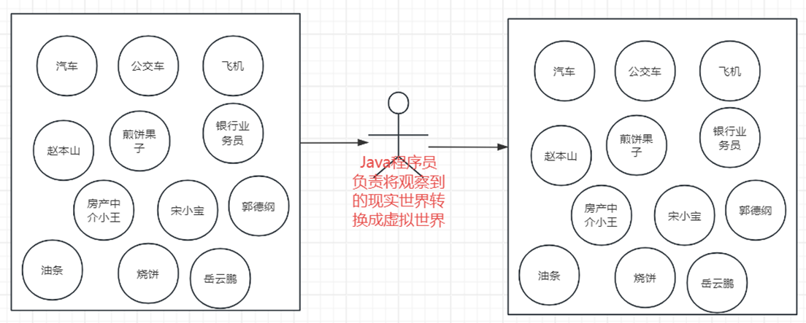

**面向对象三大特征：`封装、继承、多态`**
+ 封装（Encapsulation）
+ 继承（Inheritance）
+ 多态（Polymorphism）


## 类与对象

### 类

+ 现实世界中，`事物与事物之间具有共同特征`，例如：刘德华和梁朝伟都有`姓名、身份证号、身高`等`状态`，都有`吃、跑、跳`等`行为`。将这些共同的`状态和行为`提取出来，`形成了一个模板，称为类`。

+ 类实际上是人类大脑思考`总结的一个模板`，`类`是一个`抽象的概念`。

+ `状态`在程序中对应`属性`。`属性`通常`用变量来表示`。

+ `行为`在程序中对应`方法`。`方法`通常`用函数来表示`。

+ **类 = 属性 + 方法。**


### 对象

+ `实际存在`的`个体`。

+ `对象`又称为`实例（instance）`。

+ 通过类这个模板可以`实例化n个对象`。（`通过类可以创造多个对象`）

+ 例如通过`“明星类”`可以创造出`“刘德华对象”和“梁朝伟对象”`。

+ 明星类中有一个`属性姓名`：`String name;`

+ `“刘德华对象”和“梁朝伟对象”`由于是通过`明星类`造出来的，所以这两个都有`name属性`，但是**值是不同的**。因此这种属性被称为`实例变量`。

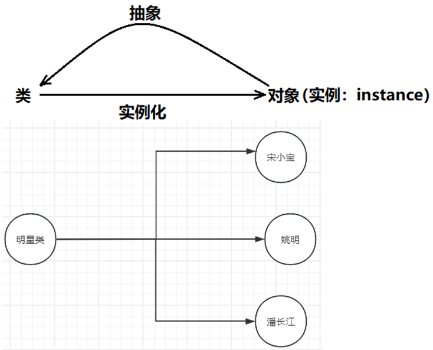


## 对象的创建和使用

### 类的定义

**语法格式:**
```java title="Java"
[修饰符列表] class 类名 {
    // 属性（描述状态）
    // 方法（描述行为动作）
}
```

> **例如：学生类**

```java title="Student.java"
package com.powernode.javase.oop01;
/*
1.定义类的语法格式:
     [修饰符列表] class 类名{
          类体 = 属性 + 方法

     //属性(实例变量)，描述的是状态

     //方法，描述的是行为动作

     }

2.为什么定义类？
   因为要通过类实例化对象，有了对象，让对象和对象之间协作起来形成系统

3.一个类可以实例化多个java对象，(通过一个类可以造出多个java对象)

4. 实例变量是一个对象一份，比如创建3个学生对象，每个学生对象中应该都有name变量。

5. 实例变量属于成员变量，成员变量如果没有手动赋值，系统会赋默认值
    数据类型        默认值
    ----------------------
    byte            0
    short           0
    int             0
    long            0L
    float           0.0F
    double          0.0
    boolean         false
    char            \u0000
    引用数据类型      null
 */
public class Student {

    //属性：姓名，年龄，性别，它们都是实例变量

    //姓名
    String name;

    //年龄
    int age;

    //性别
    boolean gender;
}
```

### 对象的创建和使用

**语法格式:**
```java title="Java"
类名 对象名 = new 类名();
```

**对象的创建：**
```java title="Java"
Student s = new Student();
```
> 在Java中，使用`class定义的类`，属于`引用数据类型`。所以`Student`属于`引用数据类型`。类型名为：Student。

> `Student s`; 表示`定义一个变量`。数据类型是`Student`。变量名是`s`。

**对象的使用：**
```java title="Java"
读取属性值：s.name
修改属性值：s.name = “jackson”;
```

**通过一个类可以实例化多个对象：**
```java title="Java"
Student s1 = new Student();
Student s2 = new Student();
```


> **例如：创建一个学生对象**

```java title="StudentTest01.java"
package com.powernode.javase.oop01;

public class StudentTest01 {
    public static void main(String[] args) {
        // 局部变量
        int i = 10;

        // 通过学生类Student实例化学生对象（通过类创造对象）
        // Student s1; 是什么？s1是变量名。Student是一种数据类型名。属于引用数据类型。
        // s1也是局部变量。和i一样。
        // s1变量中保存的是：堆内存中Student对象的内存地址。
        // s1有一个特殊的称呼：引用
        // 什么是引用？引用的本质上是一个变量，这个变量中保存了java对象的内存地址。
        // 引用和对象要区分开。对象在JVM堆当中。引用是保存对象地址的变量。
        Student s1 = new Student();

        // 访问对象的属性（读变量的值）
        // 访问实例变量的语法：引用.变量名
        // 两种访问方式：第一种读取，第二种修改。
        // 读取：引用.变量名 s1.name; s1.age; s1.gender;
        // 修改：引用.变量名 = 值; s1.name = "jack"; s1.age = 20; s1.gender = true;
        System.out.println("姓名：" + s1.name); // null
        System.out.println("年龄：" + s1.age); // 0
        System.out.println("性别：" + (s1.gender ? "男" : "女"));

        // 修改对象的属性（修改变量的值，给变量重新赋值）
        s1.name = "张三";
        s1.age = 20;
        s1.gender = true;

        System.out.println("姓名：" + s1.name); // 张三
        System.out.println("年龄：" + s1.age); // 20
        System.out.println("性别：" + (s1.gender ? "男" : "女")); // 男

        // 再创建一个新对象
        Student s2 = new Student();

        // 访问对象的属性
        System.out.println("姓名=" + s2.name); // null
        System.out.println("年龄=" + s2.age); // 0
        System.out.println("性别=" + (s2.gender ? "男" : "女"));

        // 修改对象的属性
        s2.name = "李四";
        s2.age = 20;
        s2.gender = false;

        System.out.println("姓名=" + s2.name); // 李四
        System.out.println("年龄=" + s2.age); // 20
        System.out.println("性别=" + (s2.gender ? "男" : "女")); // 女
    }
}
```


## JVM内存分析

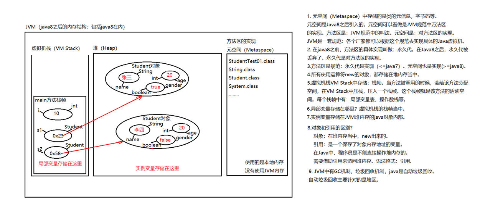

+ `堆内存`：存储`new出来的对象`。堆内存中的`对象是有生命周期的`。堆内存中的`对象不使用时，由GC回收`。

+ `栈内存`：存储`局部变量`。栈内存中的`局部变量`使用完毕，`立即出栈`，空间被释放。

+ `方法区`：存储`类信息`。方法区中的`类信息`不会被回收。

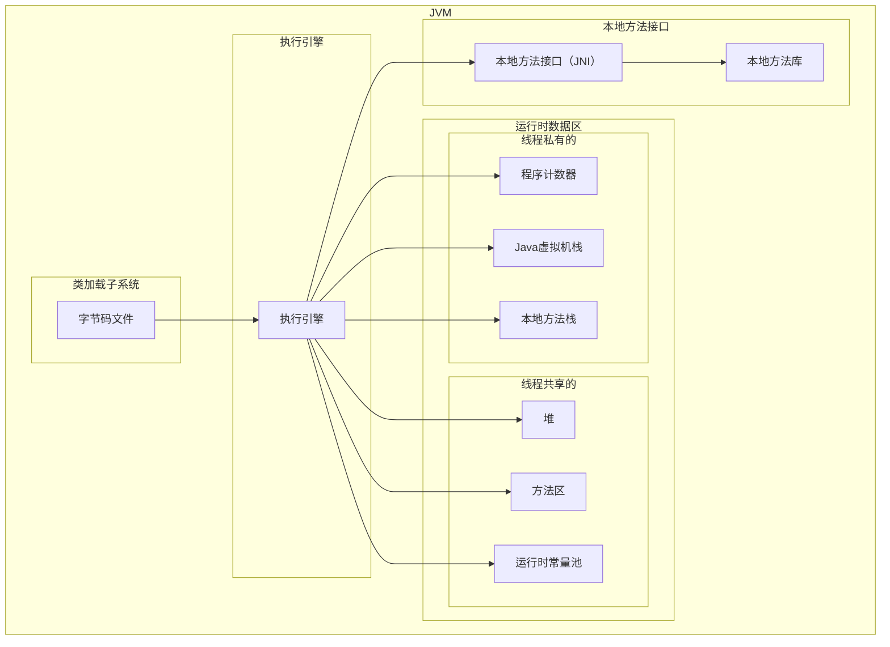
```mermaid
%% 带箭头的 JVM 结构图
flowchart TD
    subgraph JVM
        subgraph 类加载子系统
            A[字节码文件]
        end

        subgraph 运行时数据区
            subgraph 线程私有的
                B[程序计数器]
                C[Java虚拟机栈]
                D[本地方法栈]
            end

            subgraph 线程共享的
                E[堆]
                F[方法区]
                G[运行时常量池]
            end
        end

        subgraph 执行引擎
            H[执行引擎]
        end

        subgraph 本地方法接口
            I[本地方法接口（JNI）]
            J[本地方法库]
        end
    end

    %% 箭头关系
    A --> H
    H --> B
    H --> C
    H --> D
    H --> E
    H --> F
    H --> G
    H --> I
    I --> J
```

---

## 封装

### 面向对象三大特征之一：封装

1. 现实世界中封装：

`液晶电视`也是一种`封装好的电视设备`，它`将电视所需的各项零部件封装在一个整体`的`外壳`中，提供给用户一个简单而便利的使用接口，让用户可以轻松地切换频道、调节音量、等。液晶电视内部包含了很多复杂的技术，如显示屏、LED背光模块、电路板、扬声器等等，而这些`内部结构`对于大多数普通用户来说是`不可见的`，用户只需要通过遥控器就可以完成电视的各种设置和操作，这就是封装的好处。液晶电视的封装不仅提高了用户的便利程度和使用效率，而且还起到了保护设备内部部件的作用，防止灰尘、脏物等干扰。同时，液晶电视外壳材料的选择也能起到防火、防潮、防电等效果，为用户的生活带来更安全的保障。

2. 什么是封装？

封装是一种将数据和方法加以包装，使之成为一个独立的实体，并且把它与外部对象隔离开来的机制。具体来说，封装是将一个对象的所有“状态（属性）”以及“行为（方法）”统一封装到一个类中，从而隐藏了对象内部的具体实现细节，向外界提供了有限的访问接口，以实现对对象的保护和隔离。

3. 封装的好处？

封装通过限制外部对对象内部的直接访问和修改，保证了数据的安全性，并提高了代码的可维护性和可复用性。

4. 在代码上如何实现封装？

属性私有化，对外提供getter和setter方法。

### 封装概述

+ `封装`是面向对象三大特性之一。

+ `封装`就是把对象的`属性`和`方法`结合成一个独立的体，对外隐藏内部实现细节。

+ `封装`的好处：`隐藏实现细节`，`提高安全性和易用性`。

+ `封装`的体现：`方法`就是一种封装。`类`也是一种封装。

### 封装的实现方式

+ 将属性私有化（private），提供公共的（public）方法访问私有属性。

+ 例如：学生类

```java title="Student.java"
package com.powernode.javase.oop02;

public class Student {
    // 属性：姓名，年龄，性别，它们都是实例变量
    // 姓名
    private String name;
    // 年龄
    private int age;
    // 性别
    private char gender;// true表示男，false表示女


    public void setName(String name) { // 设置姓名

        this.name = name;
    }

    public String getName() { // 获取姓名
        return name;
    }

    public void setAge(int age) { // 设置年龄
        this.age = age;
    }

    public int getAge() { // 获取年龄
        return age;
    }

    public void setGender(char gender) { // 设置性别
        this.gender = gender;
    }

    public char getGender() { // 获取性别
        return gender;
    }
    
    public void show() { // 显示信息
        System.out.println("姓名：" + name);
        System.out.println("年龄：" + age);
        System.out.println("性别：" + (gender ? "男" : "女"));
    }
}
```

### 封装的使用

```java title="StudentTest02.java"
package com.powernode.javase.oop02;

public class StudentTest02 {
    public static void main(String[] args) {
        // 创建学生对象
        Student s = new Student();

        // 读取属性值
        // System.out.println("姓名：" + s.name); // 编译错误。name是私有的，不能直接访问。
        // System.out.println("年龄：" + s.age); // 编译错误。age是私有的，不能直接访问。
        // System.out.println("性别：" + s.gender); // 编译错误。gender是私有的，不能直接访问。

        // 修改属性值   
        s.setName("张三");
        s.setAge(20);
        s.setGender(true);

        // 读取属性值
        System.out.println("姓名：" + s.getName()); // 张三
        System.out.println("年龄：" + s.getAge()); // 20
        System.out.println("性别：" + (s.getGender() ? "男" : "女")); // 男


        // 调用方法
        s.show();
    }
}
```

----


## 构造方法(Constructor(构造器))


```java title="Student.java"
package com.powernode.javase.oop09;

/**
 * 构造方法/Constructor/构造器
 *
 * 1. 构造方法有什么作用？
 *    作用1：对象的创建（通过调用构造方法可以完成对象的创建）
 *    作用2：对象的初始化（给对象的所有属性赋值就是对象的初始化）
 * 2. 怎么定义构造方法呢？
 *  [修饰符列表] 构造方法名(形参列表){
 *      构造方法体;
 *  }
 *  注意：
 *      构造方法名必须和类名一致。
 *      构造方法不需要提供返回值类型。
 *      如果提供了返回值类型，那么这个方法就不是构造方法了，就变成普通方法了。
 *
 * 3. 构造方法怎么调用呢？
 *  使用new运算符来调用。
 *  语法：new 构造方法名(实参);
 *  注意：构造方法最终执行结束之后，会自动将创建的对象的内存地址返回。但构造方法体中不需要提供“return 值;”这样的语句。
 *
 * 4.在java语言中，如果一个类没有显示的去定义构造方法，系统会默认提供一个无参数的构造方法。（通常把这个构造方法叫做缺省构造器。）
 *
 * 5.一个类中如果显示的定义了构造方法，系统则不再提供缺省构造器。所以，为了对象创建更加方便，建议把无参数构造方法手动的写出来。
 *
 * 6.在java中，一个类中可以定义多个构造方法，而且这些构造方法自动构成了方法的重载(overload)。
 *
 * 7. 构造方法中给属性赋值了？为什么还需要单独定义set方法给属性赋值呢？
 *  在构造方法中赋值是对象第一次创建时属性赋的值。set方法可以在后期的时候调用，来完成属性值的修改。
 *
 * 8.构造方法执行原理？
 *  - 构造方法执行包括两个重要的阶段：
 *      第一阶段：对象的创建
 *      第二阶段：对象的初始化
 *  - 对象在什么时候创建的？
 *      new的时候，会直接在堆内存中开辟空间。然后给所有属性赋默认值，完成对象的创建。（这个过程是在构造方法体执行之前就完成了。）
 *  - 对象初始化在什么时候完成的？
 *      构造方法体开始执行，标志着开始进行对象初始化。构造方法体执行完毕，表示对象初始化完毕。
 *
 * 9. 构造代码块？
 *  语法格式：
 *      {}
 *  构造代码块什么时候执行，执行几次？
 *      每一次在new的时候，都会先执行一次构造代码块。
 *      构造代码块是在构造方法执行之前执行的。
 *
 * 10. 构造代码块有什么用？
 *  如果所有的构造方法在最开始的时候有相同的一部分代码，不妨将这个公共的代码提取到构造代码块当中，这样代码可以得到复用。
 */

public class Student {

    //构造代码块
    {
        //System.out.println("构造代码块执行！");
        // 这里能够使用this，这说明，构造代码块执行之前对象已经创建好了，并且系统也完成了默认赋值。
        //System.out.println(this.name);

        for(int i = 0; i < 10; i++){
            System.out.println("iiiiiiiiiii = " + i);
        }
    }

    /**
     * 无参数的构造方法显示的定义出来。
     */
    public Student(){
        /*for(int i = 0; i < 10; i++){
            System.out.println("i = " + i);
        }*/
        System.out.println("Student类的无参数构造方法执行了");
    }

    public Student(String name, int age,boolean sex,String address) {
        /*for(int i = 0; i < 10; i++){
            System.out.println("i = " + i);
        }*/
        this.name = name;
        this.age = age;
        this.sex = sex;
        this.address = address;
    }

    public Student(String name){
        /*for(int i = 0; i < 10; i++){
            System.out.println("i = " + i);
        }*/
        this.name=name;
    }

    public Student(String name,int age){
        /*for(int i = 0; i < 10; i++){
            System.out.println("i = " + i);
        }*/
        this.name=name;
        this.age=age;
    }


    /**
     * 姓名
     */
    private String name;

    /**
     * 年龄
     */
    private int age;

    /**
     * 性别
     */
    private boolean sex;

    /**
     * 家庭住址
     */
    private String address;

    public String getName() {
        return name;
    }

    public void setName(String name) {
        this.name = name;
    }

    public int getAge() {
        return age;
    }

    public void setAge(int age) {
        this.age = age;
    }

    public boolean isSex() {
        return sex;
    }

    public void setSex(boolean sex) {
        this.sex = sex;
    }

    public String getAddress() {
        return address;
    }

    public void setAddress(String address) {
        this.address = address;
    }
}
```

```java title="ConstructorTest01.java"
package com.powernode.javase.oop09;

public class ConstructorTest01 {
    public static void main(String[] args) {
        // 调用Student类的构造方法来完成Student类型对象的创建。
        // 以下代码本质上是：通过new运算符调用无参数的构造方法来完成对象的实例化。
        // s1是一个引用。保存了内存地址指向了堆内存当中的Student类型的对象。
        // 这样就完成了学生对象的创建以及初始化。
        // 无参数构造方法没有给属性手动赋值，但是系统会赋默认值
        Student s1 = new Student();

        System.out.println("姓名：" + s1.getName());
        System.out.println("年龄：" + s1.getAge());
        System.out.println("性别：" + (s1.isSex() ? "男" : "女"));
        System.out.println("住址：" + s1.getAddress());

        // 通过调用另一个有参数的构造方法来创建对象，完成对象的初始化。
        Student zhangsan = new Student("张三", 20, true, "北京朝阳");
        System.out.println("姓名：" + zhangsan.getName());
        //修改名字
        zhangsan.setName("张三2");
        System.out.println("姓名：" + zhangsan.getName());
        System.out.println("年龄：" + zhangsan.getAge());
        System.out.println("性别：" + (zhangsan.isSex() ? "男" : "女"));
        System.out.println("住址：" + zhangsan.getAddress());

        Student wangwu = new Student("王五");
        System.out.println("姓名：" + wangwu.getName());
        System.out.println("年龄：" + wangwu.getAge());
        System.out.println("性别：" + (wangwu.isSex() ? "男" : "女"));
        System.out.println("住址：" + wangwu.getAddress());

        Student zhaoliu = new Student("赵六", 30);
        System.out.println("姓名：" + zhaoliu.getName());
        System.out.println("年龄：" + zhaoliu.getAge());
        System.out.println("性别：" + (zhaoliu.isSex() ? "男" : "女"));
        System.out.println("住址：" + zhaoliu.getAddress());
    }
}

```

```java title="ConstructorTest02.java"
package com.powernode.javase.oop09;

public class ConstructorTest02 {
    public static void main(String[] args) {
        new Student();
        /*new Student();
        new Student();
        new Student();*/

        new Student("zhangsan");
    }
}

```


### 构造方法有什么作用？

> **作用1**：**`对象的创建`（`通过调用构造方法可以完成对象的创建`）**

> **作用2**：**`对象的初始化`（`给对象的所有属性赋值就是对象的初始化`）**


### 怎么定义构造方法呢？


```java title="Java"
[修饰符列表] 构造方法名(形参列表){
       构造方法体;
}

注意：

1. 构造方法名必须和类名一致。
   
2. 构造方法不能有返回值。构造方法不需要提供返回值类型。

3. 构造方法不能有返回值。 如果提供了返回值类型，那么这个方法就不是构造方法了，就变成普通方法了。
```


### 构造方法怎么调用呢？

```java title="Java"
1. 使用new运算符来调用。

2. 语法：new 构造方法名(实参);

3. 注意：构造方法最终执行结束之后，会自动将创建的对象的内存地址返回。但构造方法体中不需要提供“return 值;”这样的语句。
```


### 无参构造方法

> 在java语言中，如果`一个类没有显示的去定义构造方法`，系统会默认提供一个`无参数的构造方法`。（通常把`这个构造方法`叫做`缺省构造器`。）

<!--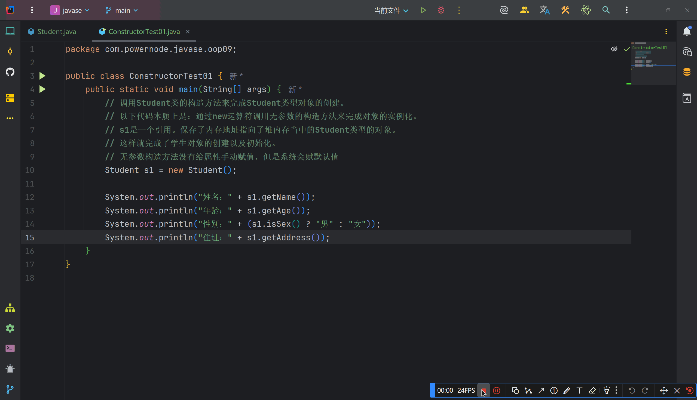-->


> 一个类中`如果显示的定义了构造方法`，系统则`不再提供缺省构造器`。所以，为了对象创建更加方便，**建议把`无参数构造方法`手动的写出来**。 

<!--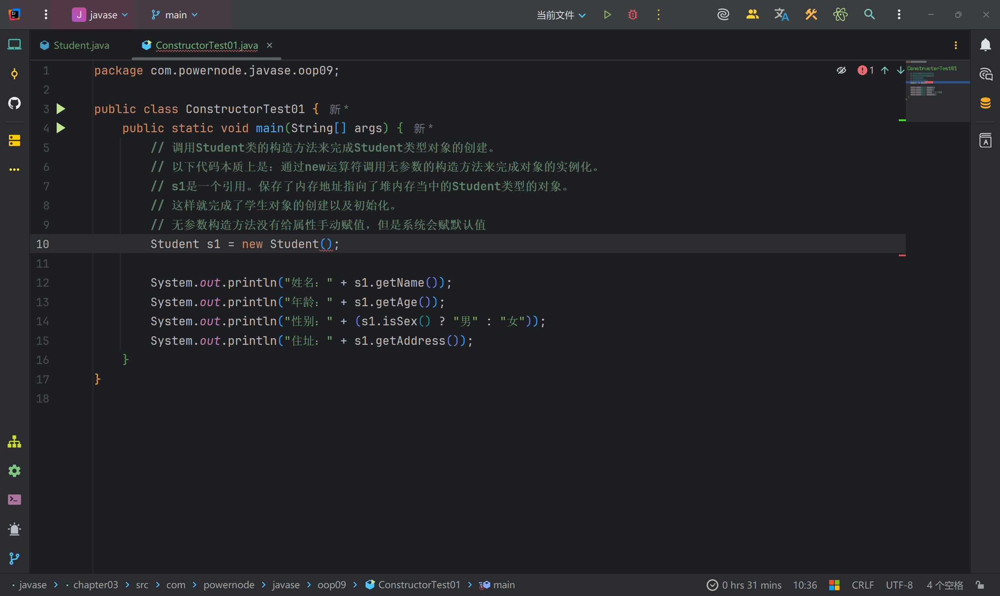-->


### 方法的重载(overload)

> 在java中，`一个类`中可以`定义多个构造方法`，而且这些构造方法`自动构成了方法的重载(overload)`。

> 方法重载：在同一个类中，`方法名相同`，`参数列表不同`（参数的类型、个数、顺序不同），`返回值类型可以相同也可以不同`。

<!--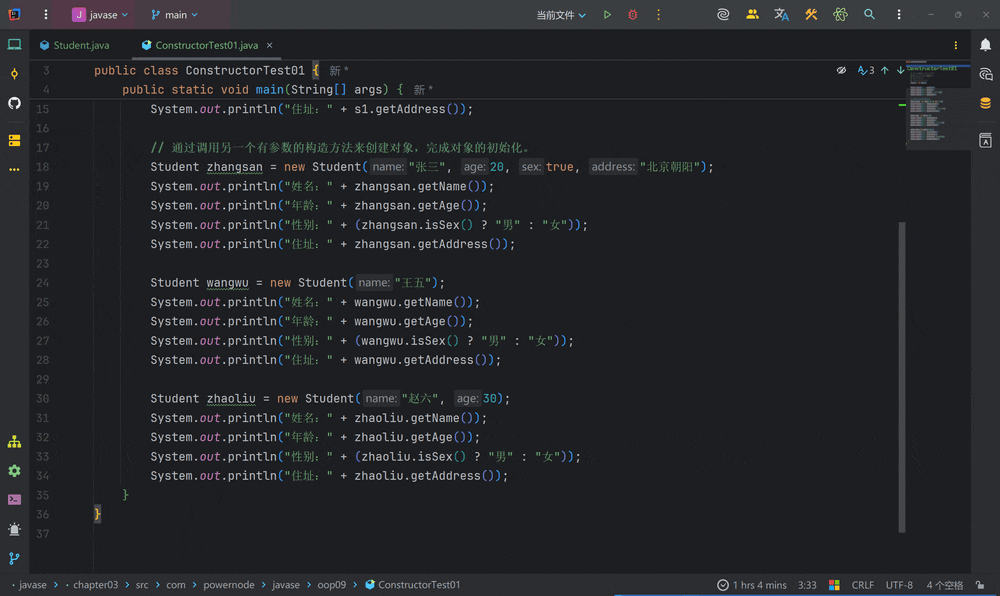-->


### 构造方法赋值和set方法赋值区别

> **构造方法赋值**

**构造方法赋值**：**对象`第一次创建时`属性赋的值**

> **set方法赋值**

**set方法赋值**：**可以在`后期的时候调用`，来完成`属性值的修改`**

```java title="Java"
Student zhangsan = new Student("张三", 20, true, "北京朝阳"); // 构造方法赋值

        System.out.println("姓名：" + zhangsan.getName()); // 张三

        //修改名字
        zhangsan.setName("张三2"); // set方法赋值

        System.out.println("姓名：" + zhangsan.getName()); // 张三2
        System.out.println("年龄：" + zhangsan.getAge());
        System.out.println("性别：" + (zhangsan.isSex() ? "男" : "女"));
        System.out.println("住址：" + zhangsan.getAddress());
```

```java title="Java"
姓名：张三
姓名：张三2
年龄：20
性别：男
住址：北京朝阳
```


### 构造方法执行原理？

> 构造方法执行包括两个重要的阶段：

>> 第一阶段：对象的创建

>> 第二阶段：对象的初始化


> **对象在什么时候创建的？**

>> `new的时候`，会直接在`堆内存中开辟空间`。然后给`所有属性赋默认值`，完成`对象的创建`。（这个过程是**在构造方法体`执行之前`就完成了**。）


> **对象初始化在什么时候完成的？**

>> `构造方法体开始执行`，标志着`开始进行对象初始化`。构造方法体`执行完毕`，表示`对象初始化完毕`。


### 构造代码块？

> **对象的创建和初始化过程梳理**：

+ **new的时候在堆内存中开辟空间，给所有属性赋默认值**

+ **执行构造代码块进行初始化**

+ **执行构造方法体进行初始化**

+ **构造方法执行结束，对象初始化完毕。**

> **构造代码块**：`{}`，**在`构造方法体执行之前`，先执行构造代码块。**

> **执行次数** ：`类中定义了多少个构造代码块，创建多少个对象，构造代码块就执行多少次。`

<!--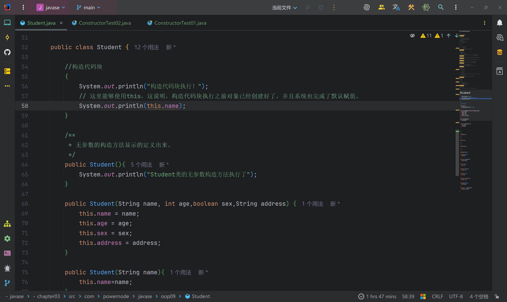-->


### 构造代码块有什么用？

> 如果`所有的构造方法`在最开始的时候`有相同的一部分代码`，不妨将`这个公共的代码提取到构造代码块当中`，这样代码`可以得到复用`。

<!---->


## 构造方法练习

1. **请定义一个`交通工具Vehicle类`，属性：`品牌brand，速度speed，尺寸长length,宽width,高height`等，`属性封装`。方法：`移动move()，加速speedUp()，减速speedDown()`等。最后在`测试类中实例化一个交通工具对象`，并通过构造方法给它`初始化brand,speed,length,width,height的值`，`调用加速，减速的方法`对`速度进行改变`。**

```java title="Vehicle.java"
package com.powernode.javase.oop10;

/**
 * 请定义一个交通工具Vehicle类，属性：品牌brand，速度speed，尺寸长length,宽width,高height等，属性封装。
 * 方法：移动move()，加速speedUp()，减速speedDown()等。最后在测试类中实例化一个交通工具对象，并通过构造
 * 方法给它初始化brand,speed,length,width,height的值，调用加速，减速的方法对速度进行改变。
 */
public class Vehicle {
    /**
     * 品牌
     */
    private String brand;

    /**
     * 速度
     */
    private int speed;

    /**
     * 长(毫米)
     */
    private int length;

    /**
     * 宽(毫米)
     */
    private int width;

    /**
     * 高(毫米)
     */
    private int height;

    public Vehicle(String brand, int speed, int length, int width, int height) {
        this.brand = brand;
        this.speed = speed;
        this.length = length;
        this.width = width;
        this.height = height;
    }

    /**
     * 移动
     */
    public void move(){
        //System.out.println(this.brand);
        //System.out.println(brand);
        System.out.println(this.getBrand() + "正在以" + this.getSpeed() + "迈的速度行驶");
        //System.out.println(getBrand());
    }

    /**
     * 加速
     */
    public void speedUp(){
        //每次加10迈
        System.out.println("加速10迈");
        this.setSpeed(this.getSpeed() + 10);
        this.move();
    }

    /**
     *减速
     */
    public void speedDown(){
        //每次减10迈
        System.out.println("减速10迈");
        this.setSpeed(this.getSpeed() - 10);
        this.move();
    }


    public String getBrand() {
        return brand;
    }

    public void setBrand(String brand) {
        this.brand = brand;
    }

    public int getSpeed() {
        return speed;
    }

    public void setSpeed(int speed) {
        this.speed = speed;
    }

    public int getLength() {
        return length;
    }

    public void setLength(int length) {
        this.length = length;
    }

    public int getWidth() {
        return width;
    }

    public void setWidth(int width) {
        this.width = width;
    }

    public int getHeight() {
        return height;
    }

    public void setHeight(int height) {
        this.height = height;
    }
}
```


```java title="VehicleTest.java"
package com.powernode.javase.oop10;

public class VehicleTest {
    public static void main(String[] args) {
        //创建交通工具对象
        Vehicle bmw535li = new Vehicle("BMW535li",0,5200,1800,1500);

        //加速
        bmw535li.speedUp();

        //加速
        bmw535li.speedUp();

        //减速
        bmw535li.speedDown();

        // 单独调用move()方法
        bmw535li.move();
    }
}
```

```java title="输出结果.java"
加速10迈
BMW535li正在以10迈的速度行驶
加速10迈
BMW535li正在以20迈的速度行驶
减速10迈
BMW535li正在以10迈的速度行驶
BMW535li正在以10迈的速度行驶
```

2. **编写 Java 程序，`模拟简单的计算器`。定义名为 `Number 的类`，其中有`两个int类型属性n1,n2`，`属性封装`。编写`构造方法为n1和n2`赋初始值，再为该类定义 `加(add)、减(sub)、乘(mul)、除(div)`等`实例方法`，分别对`两个属性执行加、减、乘、除的运算`。在`main方法中创建Number类的对象，调用各个方法`，并显示计算结果。**

```java title="Number.java"
package com.powernode.javase.oop10;

/**
 * 编写 Java 程序，模拟简单的计算器。定义名为 Number 的类，
 * 其中有两个int类型属性n1,n2，属性封装。编写构造方法为n1和n2赋初始值，
 * 再为该类定义 加(add)、减(sub)、乘(mul)、除(div)等实例方法，
 * 分别对两个属性执行加、减、乘、除的运算。在main方法中创建Number类
 * 的对象，调用各个方法，并显示计算结果。
 */
public class Number {
    public void add() {
        System.out.println(this.getN1() + "+" + this.getN2() + "=" + (this.getN1() + this.getN2()));
    }

    public void sub() {
        System.out.println(this.getN1() + "-" + this.getN2() + "=" + (this.getN1() - this.getN2()));
    }

    public void mul() {
        System.out.println(this.getN1() + "*" + this.getN2() + "=" + (this.getN1() * this.getN2()));
    }

    public void div() {
        System.out.println(this.getN1() + "/" + this.getN2() + "=" + (this.getN1() / this.getN2()));
    }

    private int n1;

    private int n2;

    public Number() {
    }

    public Number(int n1, int n2) {
        this.n1 = n1;
        this.n2 = n2;
    }

    public int getN1() {
        return n1;
    }

    public void setN1(int n1) {
        this.n1 = n1;
    }

    public int getN2() {
        return n2;
    }

    public void setN2(int n2) {
        this.n2 = n2;
    }
}

```

```java title="NumberTest.java"
package com.powernode.javase.oop10;

public class NumberTest {
    public static void main(String[] args) {
        //创建Number对象
        Number number = new Number(10,2);

        //调用相关方法完成加减乘除
        number.add();
        number.sub();
        number.mul();
        number.div();
    }
}
```

```java title="输出结果.java"
10+2=12
10-2=8
10*2=20
10/2=5
```

3.**定义一个`网络用户类`，要处理的信息有`用户id、用户密码、 email地址`。在`建立类的实例`时，把以上三个信息都`作为构造方法的参数输入`，其中用`户id和用户密码是必须的`，`缺省的 email 地址是用户id加上字符串"@powernode.com"`**

```java title="NetworkUser.java"
package com.powernode.javase.oop10;

/**
 * 定义一个网络用户类，要处理的信息有用户id、用户密码、 email地址。在建立类的实例时，把以上三个信息都作为构造方法的参数输入，
 * 其中用户id和用户密码是必须的，缺省的 email 地址是用户id加上字符串"@powernode.com"
 *
 * 1. 不能定义无参数构造方法。
 * 2. 提供两个构造方法：
 *      一个是两个参数的：id和用户密码
 *      一个是三个参数的：id和用户名和email
 */
public class NetworkUser {
    private String userId;

    private String password;

    private String email;

    /**
     * 打印网络用户信息
     */
    public void display() {
        System.out.println("用户ID：" + this.getUserId() + "，密码：" + this.getPassword() + "，邮箱：" + this.getEmail());
    }

    public NetworkUser(String userId, String password) {
        this.userId = userId;
        this.password = password;
        this.email = this.getUserId() + "@powernode.com";
    }

    public NetworkUser(String userId, String password, String email) {
        this.userId = userId;
        this.password = password;
        this.email = email;
    }

    public String getUserId() {
        return userId;
    }

    public void setUserId(String userId) {
        this.userId = userId;
    }

    public String getPassword() {
        return password;
    }

    public void setPassword(String password) {
        this.password = password;
    }

    public String getEmail() {
        return email;
    }

    public void setEmail(String email) {
        this.email = email;
    }
}
```

```java title="NetworkUserTest.java"
package com.powernode.javase.oop10;

public class NetworkUserTest {
    public static void main(String[] args) {
        //新建网络用户对象
        NetworkUser user1 = new NetworkUser("123456","abc");

        user1.display();

        NetworkUser user2 = new NetworkUser("789456","abc123","lisi@123.com");

        user2.display();
    }
}
```

```java title="输出结果.java"
用户ID：123456，密码：abc，邮箱：123456@powernode.com
用户ID：789456，密码：abc123，邮箱：lisi@123.com
```


## this关键字

```java title="Date.java"
package com.powernode.javase.oop12;

/**
 * 需求：定义一个日期类，代表日期。日期属性包括：年月日。
 * 提供两个构造方法，一个是无参数构造方法，当通过无参数构造方法实例化日期对象的时候，默认创建的日期是1970-01-01
 * 另一个构造方法三个参数，通过传递年月日三个参数来确定一个日期。注意属性要提供封装。
 *
 * this(实参)：
 *      1. 通过这种语法可以在构造方法中调用本类中其他的构造方法。
 *      2. 作用：代码复用。
 *      3. this(实参); 只能出现在构造方法第一行。
 */
public class Date {
    /**
     * 年
     */
    private int year;

    /**
     * 月
     */
    private int month;

    /**
     * 日
     */
    private int day;

    public Date() {
        /*this.year = 1970;
        this.month = 1;
        this.day = 1;*/

        // 不要这么写，这样会导致再创建一个新的对象。
        //new Date(1970,1,1);

        // 不会创建新对象。只是通过一个构造方法去调用另一个构造方法。
        this(1970,1,1);

        System.out.println("日期创建成功！~");
    }

    public Date(int year, int month, int day) {
        this.year = year;
        this.month = month;
        this.day = day;
    }

    public int getYear() {
        return year;
    }

    public void setYear(int year) {
        this.year = year;
    }

    public int getMonth() {
        return month;
    }

    public void setMonth(int month) {
        this.month = month;
    }

    public int getDay() {
        return day;
    }

    public void setDay(int day) {
        this.day = day;
    }

    /**
     * 打印日期
     */
    public void display() {
        System.out.println(this.getYear() + "年" + this.getMonth() + "月" + this.getDay() + "日");
    }
}
```

```java title="DateTest.java"
package com.powernode.javase.oop12;

public class DateTest {
    public static void main(String[] args) {
        // 创建默认日期对象
        Date d1 = new Date();
        d1.display();

        // 创建指定的日期
        Date d2 = new Date(2008, 8, 8);
        d2.display();
    }
}
```

```java title="输出结果.java"
日期创建成功！~
1970年1月1日
2008年8月8日
```

> this是一个`关键字`。

> this出现在`实例方法`中，代表`当前对象`。语法是：`this.`

> this本质上是`一个引用`，该引用保存`当前对象的内存地址`。

> 通过“`this.`”可以`访问实例变量`，可以`调用实例方法`。

> this存储在：**`栈帧的局部变量表`的`第0个槽位上`。**

> `this.` 大部分情况下`可以省略`，用于区分`局部变量`和`实例变量`时`不能省略`。

> this`不能`出现在`静态方法`中。

> “this(实参)”语法：
1. **通过这种语法可以在`构造方法`中调用`本类中其他的构造方法`。**

2. 作用：`代码复用`。

3. this(实参); `只能出现在构造方法第一行`。


## static关键字

```java title="Chinese.java"
package com.powernode.javase.oop13;

/**
 * static关键字：
 *      1. static翻译为静态的
 *      2. static修饰的变量：静态变量
 *      3. static修饰的方法：静态方法
 *      4. 所有static修饰的，访问的时候，直接采用“类名.”，不需要new对象。
 *      5. 什么情况下把成员变量定义为静态成员变量？
 *          当一个属性是对象级别的，这个属性通常定义为实例变量。（实例变量是一个对象一份。100个对象就应该有100个空间）
 *          当一个属性是类级别的（所有对象都有这个属性，并且这个属性的值是一样的），建议将其定义为静态变量，在内存空间上只有一份。节省内存开销。
 *          这种类级别的属性，不需要new对象，直接通过类名访问。
 *      6. 静态变量存储在哪里？静态变量在什么时候初始化？（什么时候开辟空间）
 *          JDK8之后：静态变量存储在堆内存当中。
 *          类加载时初始化。
 */
public class Chinese { // 中国人类

    // 身份证号
    String idCard;

    // 姓名
    String name;

    // 国籍
    static String country = "中国";

    public Chinese(String idCard, String name) {
        this.idCard = idCard;
        this.name = name;
    }

    public void display(){
        System.out.println("身份证号："+this.idCard+"，姓名："+this.name+"，国籍：" + this.country);
    }

    /*int i; // 实例变量
    static int j; // 静态变量

    public static void main(String[] args) {
        int i; // 局部变量
    }*/

    // 静态方法
    public static void test(){
        System.out.println("静态方法test执行了");

        // 这个不行
        //display();
        //System.out.println(name);

        // 这些可以
        System.out.println(Chinese.country);
        System.out.println(country); // 在同一个类中，类名. 可以省略。

        Chinese.test2();
        test2();
    }

    public static void test2(){

    }


    // 实例方法
    public void doSome(){
        // 正规访问方式
        /*System.out.println(this.k);
        System.out.println(Chinese.f);
        this.doOther1();
        Chinese.doOther2();*/

        // 省略的方式
        System.out.println(k);
        System.out.println(f);
        doOther1();
        doOther2();
    }

    // 实例变量
    int k = 100;

    // 静态变量
    static int f = 1000;

    // 实例方法
    public void doOther1(){
        System.out.println("do other1....");
    }

    // 静态方法
    public static void doOther2(){
        System.out.println("do other2....");
    }
}
```

```java title="ChineseTest.java"
package com.powernode.javase.oop13;

public class ChineseTest {
    public static void main(String[] args) {
        // 创建中国人对象3个
        Chinese zhangsan = new Chinese("12122322223232", "张三");
        Chinese lisi = new Chinese("12000022223232", "李四");
        Chinese wangwu = new Chinese("12111111123232", "王五");

        zhangsan.doSome();

        zhangsan.display();
        lisi.display();
        wangwu.display();

        System.out.println("国籍：" + Chinese.country);

        // 静态变量可以采用“引用.”来访问吗？可以（但不建议：会给程序员造成困惑，程序员会认为country是一个实例变量。）
        // 建议还是使用“类名.”来访问。这是正规的。
        System.out.println(zhangsan.country);
        System.out.println(lisi.country);
        System.out.println(wangwu.country);

        zhangsan = null;
        lisi = null;
        wangwu = null;

        // 静态变量也可以用“引用.”访问，但是实际运行时和对象无关。
        // 以下程序也不会出现空指针异常。
        System.out.println(zhangsan.country);
        System.out.println(lisi.country);
        System.out.println(wangwu.country);

        // 什么时候会出现空指针异常？
        // 一个空引用访问实例相关的，都会出现空指针异常。
        //System.out.println(zhangsan.name);

        Chinese.test();

        // 也不会出现空指针异常。
        // 但是这种访问是不建议的。
        // 静态方法就应该使用“类名.”来访问。
        zhangsan.test();

    }
}
```
```java title="输出结果.java"
100
1000
do other1....
do other2....
身份证号：12122322223232，姓名：张三，国籍：中国
身份证号：12000022223232，姓名：李四，国籍：中国
身份证号：12111111123232，姓名：王五，国籍：中国
国籍：中国
中国
中国
中国
中国
中国
中国
静态方法test执行了
中国
中国
静态方法test执行了
中国
中国
```

```java title="StaticTest01.java"
package com.powernode.javase.oop13;

/**
 * static关键字还可以定义静态代码块：
 *
 * 1.语法格式：
 *      static {
 *
 *      }
 *
 * 2. 静态代码块什么时候执行？执行几次？
 *      静态代码块在类加载时执行，并且只执行一次。
 *
 * 3. 静态代码块可以编写多个，并且遵循自上而下的顺序依次执行。
 *
 * 4. 静态代码块什么时候使用？
 *      本质上，静态代码块就是为程序员预留的一个特殊的时间点：类加载时刻
 *      如果你需要再类加载时刻执行一段程序的话，这段代码就可以写到静态代码块当中。
 *      例如，有这样一个需求：请在类加载时，记录日志。那么记录日志的代码就可以编写到静态代码块当中。
 */
public class StaticTest01 { // com.powernode.javase.oop13.StaticTest01

    // 实例方法
    public void doSome(){ // com.powernode.javase.oop13.StaticTest01.doSome
        System.out.println(name);
    }

    // 实例变量
    String name = "zhangsan"; // com.powernode.javase.oop13.StaticTest01.doSome.name

    // 静态变量
    static int i = 100;

    // 静态代码块
    static {
        // 报错原因：在静态上下文中无法直接访问实例相关的数据。
        //System.out.println(name);
        // 这个i可以访问，是因为i变量是静态变量，正好也是在类加载时初始化。
        System.out.println(i);
        System.out.println("静态代码块1执行了");
        // j无法访问的原因是：程序执行到这里的时候，j变量不存在。
        //System.out.println(j);

        System.out.println("xxxx-xx-xx xx:xx:xx 000 -> StaticTest01.class完成了类加载！");
    }

    // 静态变量
    static int j = 10000;

    // 静态代码块
    static {
        System.out.println("静态代码块2执行了");
    }

    public static void main(String[] args) {
        System.out.println("main execute!");
    }

    // 静态代码块
    static {
        System.out.println("静态代码块3执行了");
    }
}
```

```java title="输出结果.java"
100
静态代码块1执行了
xxxx-xx-xx xx:xx:xx 000 -> StaticTest01.class完成了类加载！
静态代码块2执行了
静态代码块3执行了
main execute!
```


### 实例变量、静态变量、局部变量 


```java title="java"
int i; // 实例变量

static int j; // 静态变量

public static void main(String[] args) {
        int i; // 局部变量
    }
```


> **什么情况下把`成员变量`定义为`静态成员变量`？**

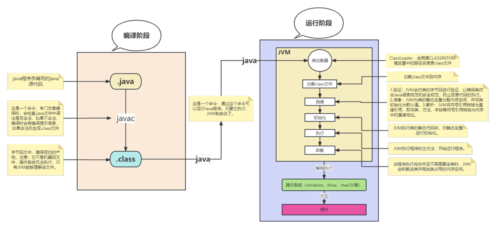

```java title="java"
当一个属性是对象级别的，这个属性通常定义为实例变量。（实例变量是一个对象一份。100个对象就应该有100个空间）
//国籍
String country = "中国"; // 实例变量，100个对象就应该有100个空间。
```
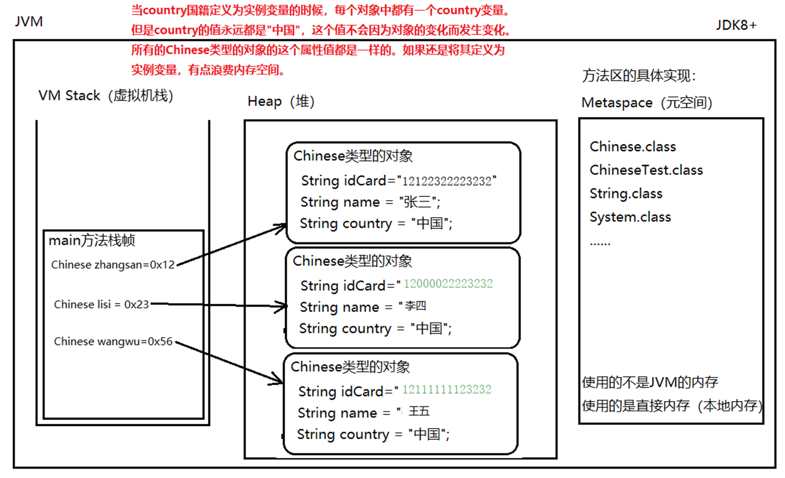

```java title="java"
1. 当一个属性是类级别的（所有对象都有这个属性，并且这个属性的值是一样的），建议将其定义为静态变量，在内存空间上只有一份。节省内存开销。

2. 这种类级别的属性，不需要new对象，直接通过类名访问。
//国籍
static String country = "中国";
```
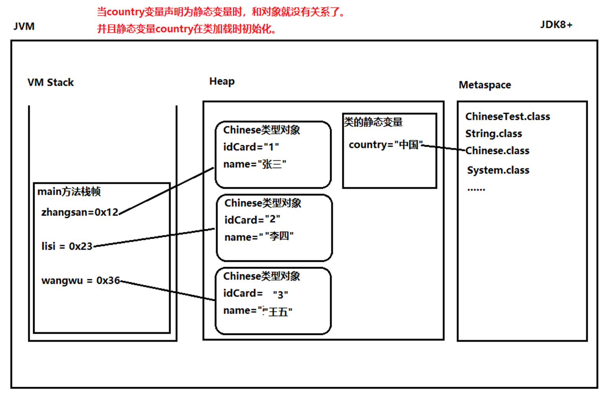


> static是一个`关键字`，翻译为：`静态的`。

> 1. static`修饰的变量`叫做`静态变量`。当所有对象的`某个属性的值是相同的`，建议将该属性定义为`静态变量`，来`节省内存的开销`。
> 2. static`修饰的方法`叫做`静态方法`。

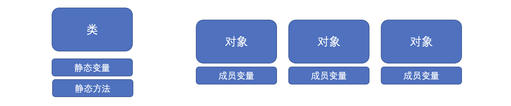

> 静态变量`在类加载时初始化`，存储在`堆中`。

> 所有静态变量和静态方法，统一使用“`类名.`”调用。虽然可以使用“`引用.`”来调用，但实际`运行时和对象无关`，所以`不建议这样写`，因为这样写会给其他人造成疑惑。

```java title="java"
// 静态变量可以采用“引用.”来访问吗？可以（但不建议：会给程序员造成困惑，程序员会认为country是一个实例变量。）
// 建议还是使用“类名.”来访问。这是正规的。
System.out.println(zhangsan.country);
System.out.println(lisi.country);
System.out.println(wangwu.country);

// 静态变量也可以用“引用.”访问，但是实际运行时和对象无关。
// 以下程序也不会出现空指针异常。
System.out.println(zhangsan.country);
System.out.println(lisi.country);
System.out.println(wangwu.country);
```
> 使用“`引用.`”访问静态相关的，即使`引用为null`，也`不会出现空指针异常`。

```java title="java"
zhangsan = null;
lisi = null;
wangwu = null;

// 静态变量也可以用“引用.”访问，但是实际运行时和对象无关。
// 以下程序也不会出现空指针异常。
System.out.println(zhangsan.country);
System.out.println(lisi.country);
System.out.println(wangwu.country);
```

> 静态方法中`不能使用this关键字`。因此无法直接`访问实例变量`和`调用实例方法`。


### 静态代码块

> 静态代码块在`类加载时执行`，`一个类`中可以编写`多个静态代码块`，遵循`自上而下的顺序依次执行`。

```java title="java"
public class Person {
    String name = test();  //这里我们用test方法的返回值作为变量的初始值，便于观察
    int age;
    String sex;

    {
        System.out.println("我是普通代码块");
    }
    
    Person(){
        System.out.println("我是构造方法");
    }
    
    String test(){
        System.out.println("我是成员变量初始化");
        return "小明";
    }

    static String info = init();   //这里我们用init静态方法的返回值作为变量的初始值，便于观察

    static {
        System.out.println("我是静态代码块");
    }

    static String init(){
        System.out.println("我是静态变量初始化");
        return "test";
    }
}
```
```java title="输出结果.java"
我是静态变量初始化
我是静态代码块
我是成员变量初始化
我是普通代码块
我是构造方法
```

> 静态代码块代表了`类加载时刻`，如果你有代码需要在此时刻执行，可以将该代码放到`静态代码块`中(比如打印日志)。

```java title="java"
static {
    System.out.println("静态代码块1执行了");
    System.out.println("xxxx-xx-xx xx:xx:xx 000 -> StaticTest01.class完成了类加载！");
}
```
```java title="输出结果.java"
静态代码块1执行了
xxxx-xx-xx xx:xx:xx 000 -> StaticTest01.class完成了类加载！
```


## JVM体系结构

`JVM（Java虚拟机）`遵循一套统一的规范（即`Java虚拟机规范`），但这一规范可以有多种不同的实现方式。

### 主要JVM实现

目前主流的JVM实现包括：

- **HotSpot**：由Oracle公司开发，是目前应用`最广泛的JVM实现`。`作为Oracle JDK和OpenJDK的默认虚拟机`，HotSpot在生产环境中得到了广泛验证。

- **JRockit**：同样由Oracle公司开发，`专门针对生产环境进行优化`，以高性能和良好的可扩展性著称。

- **IBM JDK**：IBM公司开发的Java环境，采用独特的`J9 VM架构`。相比HotSpot，IBM JDK具有`更小的内存占用`和`更快的启动速度`。

- **Azul Zing**：Azul Systems开发的商业JVM，专注于`高性能和实时处理能力`，特别适用于高负载企业应用和实时分析场景。

- **OpenJ9**：IBM开源的JVM实现，以`轻量级架构`、`低延迟GC`、`优化的JIT编译器`和完善的可观测性工具为特色。

> 下图截取自Oracle官方文档中的Java虚拟机规范（建议读者查阅Oracle官方文档获取完整信息）。

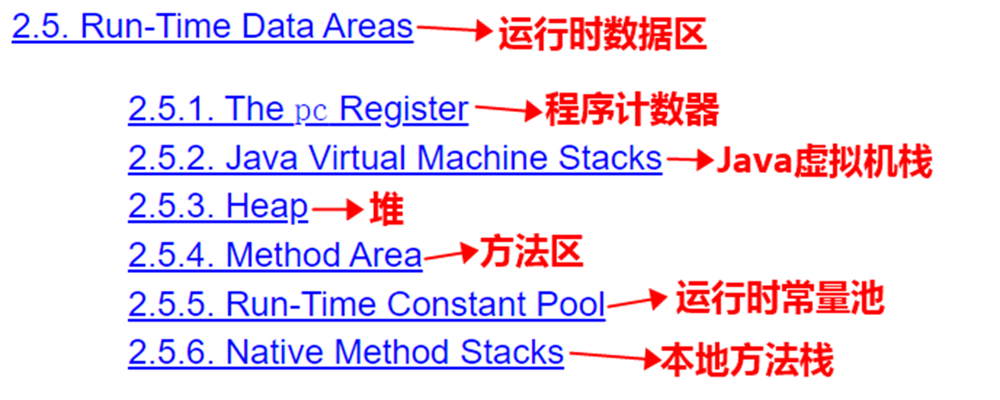

### JVM运行时数据区

JVM的运行时数据区主要包括以下六个部分：

1. **程序计数器**（`The PC Register`）
2. **Java虚拟机栈**（`Java Virtual Machine Stacks`）
3. **堆**（`Heap`）
4. **方法区**（`Method Area`）
5. **运行时常量池**（`Run-Time Constant Pool`）
6. **本地方法栈**（`Native Method Stacks`）


### JVM规范中的运行时数据区

**程序计数器（Program Counter Register）**：一块`较小的内存空间`，记录`当前线程`正在执行的`虚拟机字节码指令地址`。

**Java虚拟机栈（Java Virtual Machine Stacks）**：`存储栈帧`，每个栈帧包含`局部变量表`、`操作数栈`、`动态链接`和`方法出口`等信息。

**堆（Heap）**：JVM管理的`最大内存区域`，用于存放`对象实例和数组`，是`垃圾回收`的 **`主要区域`**。

**方法区（Method Area）**：`存储已加载的类信息、常量、静态变量和即时编译后的代码`。

**运行时常量池（Run-Time Constant Pool）**：`方法区的一部分`，存放`编译期生成的字面量和符号引用`。

**本地方法栈（Native Method Stacks）**：`为本地方法调用提供服务`，与`Java虚拟机栈结构相似`。

> **总结**：这些运行时数据区在功能上各有侧重，均在JVM启动时创建，运行期间持续存在，直至JVM终止时被销毁。不同JVM实现对数据区的管理方式可能存在差异，进而影响性能表现和功能特性。


### JVM体系结构图（该图属于JVM规范，不是具体的实现）

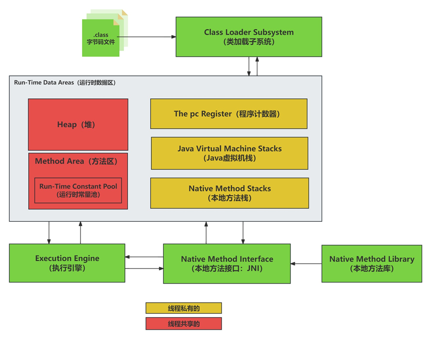


#### JDK6的HotSpot

> **`JVM规范的实现`：`HotSpot（Oracle JDK/Open JDK内部使用的JVM就是HotSpot）`**


> **以下是`JDK6的HotSpot`**

+ 年轻代：`刚new出来的对象`放在这里。

+ 老年代：`经过垃圾回收之后仍然存活的对象`放在这里。

+ 永久代：`存储类的元数据信息`，例如`类的名称`、`方法的签名`、`字段的类型`等。

+ 符号引用：`类全名`，`字段全名`，`方法全名`等。

+ 这个时期的`永久代和堆`是`相邻的`，使用`连续的物理内存`，但是`内存空间是隔离的`。

+ `永久代`的`垃圾收集`是和`老年代捆绑在一起`的，因此无论谁满了，都会触发`永久代和老年代的垃圾收集`。

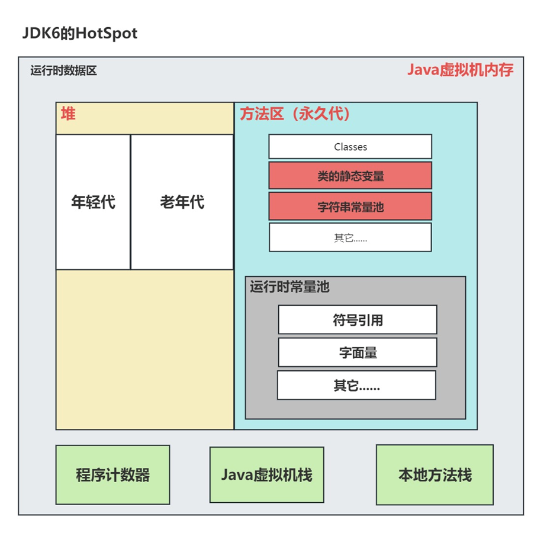


#### JDK7的HotSpot

> **`JVM规范的实现`：`HotSpot（Oracle JDK/Open JDK内部使用的JVM就是HotSpot）`**

> **以下是`JDK7的HotSpot`**

+ `类的静态变量`转移到`堆`中了

+ `字符串常量`池转移到`堆`中了

+ `运行时常量池`中的`符号引用`转移到`本地内存`了


#### JDK8的HotSpot

> **`JVM规范的实现`：`HotSpot（Oracle JDK/Open JDK内部使用的JVM就是HotSpot）`**

> **以下是`JDK8及更高版本的HotSpot`**

+ `彻底删除`了`永久代`（为了`避免OOM错误的发生`）

+ 将`方法区的实现`转移到`本地内存`

+ 将`符号引用`重新放回`运行时常量池`

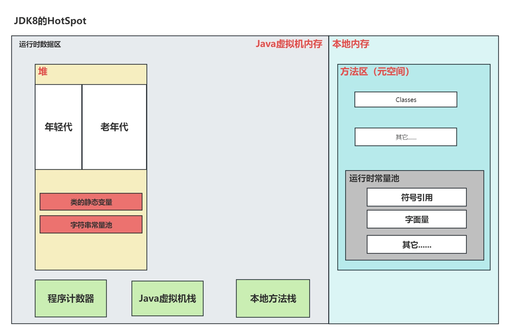


## 单例模式

### 设计模式概述

#### 什么是设计模式？

**设计模式（Design Pattern）是一套被广泛接受的、经过试验验证的、可反复使用的基于面向对象的软件设计经验总结，它是软件开发人员在软件设计中，对常见问题的解决方案的`总结和抽象`。设计模式是针对软件开发中`常见问题和模式`的`通用解决方案`**

#### 设计模式有哪些？

+ **`GoF设计模式`**：《Design Patterns: Elements of Reusable Object-Oriented Software》（即后述《设计模式》一书），由 Erich Gamma、Richard Helm、Ralph Johnson 和 John Vlissides 合著（Addison-Wesley，1995）。这几位作者常被称为四人组（Gang of Four）。

+ **架构设计模式（Architectural Pattern）**：主要用于软件系统的整体架构设计，包括多层架构、MVC架构、微服务架构、REST架构和大数据架构等。

+ **企业级设计模式（Enterprise Pattern）**：主要用于企业级应用程序设计，包括基于服务的架构（SOA）、企业集成模式（EIP）、业务流程建模（BPM）和企业规则引擎（BRE）等。

+ **领域驱动设计模式（Domain Driven Design Pattern）**：主要用于领域建模和开发，包括聚合、实体、值对象、领域事件和领域服务等。

+ **并发设计模式（Concurrency Pattern）**：主要用于处理并发性问题，包括互斥、线程池、管道、多线程算法和Actor模型等。

+ **数据访问模式（Data Access Pattern）**：主要用于处理数据访问层次结构，包括数据访问对象（DAO）、仓库模式和活动记录模式等。

#### GoF设计模式的分类？

+ **创建型**：主要解决`对象的创建问题`

+ **结构型**：通过`设计和构建对象`之间的关系，以达到更好的`重用性、扩展性和灵活性`

+ **行为型**：主要用于`处理对象之间的算法和责任分配`


### 单例模式（`GoF23种设计模式`之一，最简单的设计模式：如何保证某种类型的`对象只创建一个`）

#### 判断是否为单例模式

> 非单例模式：创建多个对象

```java title="Student.java"
package com.powernode.javase.oop14;

/**
 * Student目前来说不是单例的。
 */
public class Student {

}
```

```java title="StudentTest.java"
package com.powernode.javase.oop14;

public class StudentTest {
    public static void main(String[] args) {
        Student s1 = new Student();
        System.out.println(s1); //com.powernode.javase.oop14.Student@2f4d3709

        Student s2 = new Student();
        System.out.println(s2); //com.powernode.javase.oop14.Student@4e50df2e

        System.out.println(s1 == s2); // false

        int a = 10;
        int b = 10;
        System.out.println(a == b); // true
    }
}
```

```java title="输出结果.java"
com.powernode.javase.oop14.Student@2f4d3709
com.powernode.javase.oop14.Student@4e50df2e
false
true
```

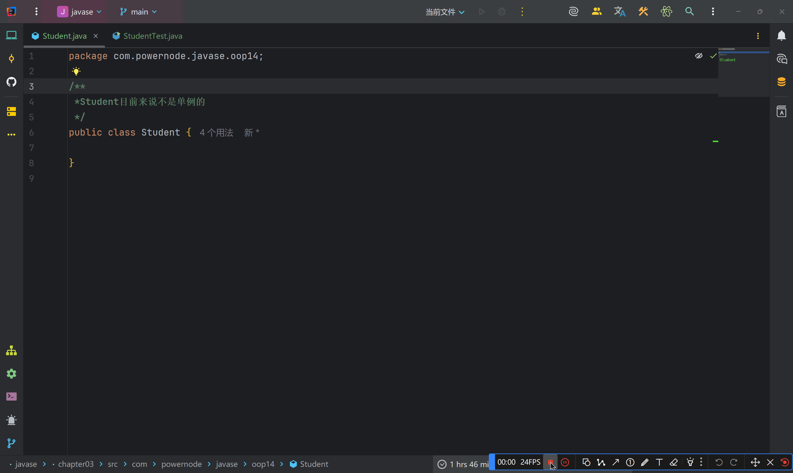

**`0例模式`：**

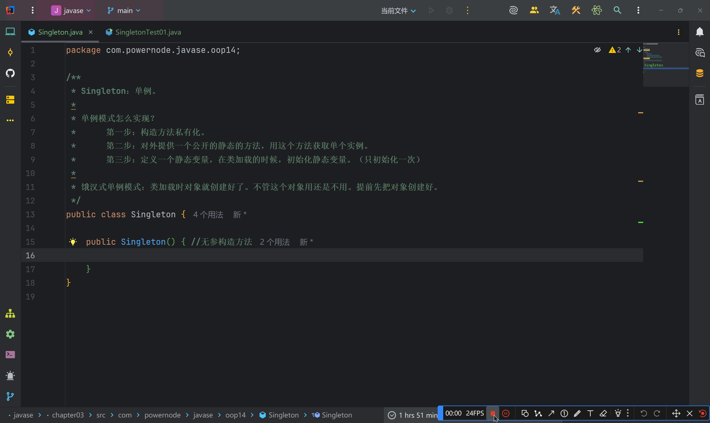


### 单例模式怎么实现？

> **第一步：`构造方法私有化。`**

> **第二步：对外提供一个`公开的静态的方法`，用这个方法`获取单个实例`。**

> **第三步：定义一个`静态变量`，在`类加载`的时候，`初始化静态变量`。（`只初始化一次`）**

#### **`饿汉式`：类加载时就创建对象**

```java title="Singleton.java" 
package com.powernode.javase.oop14;

/**
 * Singleton：单例。
 *
 * 单例模式怎么实现？
 *      第一步：构造方法私有化。
 *      第二步：对外提供一个公开的静态的方法，用这个方法获取单个实例。
 *      第三步：定义一个静态变量，在类加载的时候，初始化静态变量。（只初始化一次）
 *
 * 饿汉式单例模式：类加载时对象就创建好了。不管这个对象用还是不用。提前先把对象创建好。
 */
public class Singleton {

    private static Singleton s = new Singleton(); // 在类加载的时候就创建实例

    private Singleton() { //无参构造方法 // 将构造方法设为私有化

    }

    //实例方法
    public static Singleton get(){ // 提供一个公有的静态方法，以获取实例
        return s;
    }
}
```

```java title="SingletonTest01.java"
package com.powernode.javase.oop14;

public class SingletonTest01 {
    public static void main(String[] args) {
        /*Singleton s1=new Singleton();
        Singleton s2=new Singleton();
        System.out.println(s1==s2);*/

        Singleton s1 = Singleton.get();
        Singleton s2 = Singleton.get();

        System.out.println(s1 == s2);
    }
}
```

```java title="输出结果.java"
true
```

#### **`懒汉式`：第一次调用get方法时才会创建对象**

```java title="Singleton.java"
package com.powernode.javase.oop15;

/**
 * Singleton是单例的。
 *
 * 懒汉式的单例模式：用到这个对象的时候再创建对象。别在类加载的时候创建对象。
 *
 * 第一步：构造方法私有化。
 * 第二步：对外提供一个静态方法，通过这个方法可以获取到Singleton对象。
 * 第三步：提供一个静态变量，但是这个变量值为null。
 */
public class Singleton {

    private static Singleton s; // 声明一个静态的、私有的该类类型的变量，用于存储该类的实例

    private Singleton(){} // 将构造方法设为私有化

    public  static Singleton get(){ // 提供一个公有的静态方法，以获取实例
        if (s == null) { // 第一次调用该方法时，才真正创建实例
            s = new Singleton(); // 创建实例
            System.out.println("对象创建了");
        }
        return s;
    }
}
```

```java title="SingletonTest.java"
package com.powernode.javase.oop15;

public class SingletonTest {
    public static void main(String[] args) {
        Singleton s1 = Singleton.get();
        Singleton s2 = Singleton.get();
        Singleton s3 = Singleton.get();
        Singleton s4 = Singleton.get();
        Singleton s5 = Singleton.get();
        Singleton s6 = Singleton.get();

        System.out.println(s1);
        System.out.println(s2);
        System.out.println(s3);
        System.out.println(s4);
        System.out.println(s5);
        System.out.println(s6);

        System.out.println(s1 == s2);
    }
}
```

```java title="输出结果.java"
对象创建了
com.powernode.javase.oop15.Singleton@2f4d3709
com.powernode.javase.oop15.Singleton@2f4d3709
com.powernode.javase.oop15.Singleton@2f4d3709
com.powernode.javase.oop15.Singleton@2f4d3709
com.powernode.javase.oop15.Singleton@2f4d3709
com.powernode.javase.oop15.Singleton@2f4d3709
true
```

## static关键字、this关键字、高级习题

### 1. **`static关键字练习题`**

> 设计一个`人类（Person）`，拥有`姓名、年龄、性别`三个`属性`，需要`统计总人口数`。在`每次创建Person对象`时，需要将`总人口数加1`，实现这个功能需要使用`static关键字`。

```java title="StaticTest02.java"
package com.powernode.javase.oop16;

/**
 * 设计一个人类（Person），拥有姓名、年龄、性别三个属性，需要统计总人口数。
 * 在每次创建Person对象时，需要将总人口数加1，实现这个功能需要使用static关键字。
 */
public class Person {
    private String name;

    private int age;

    private boolean grade;

    /**
     * 总人口数
     */
    private static int count;

    public Person(){
        count++;
    }

    public Person(String name, int age, boolean grade) {
        this.name = name;
        this.age = age;
        this.grade = grade;
        count++;
    }

    public String getName() {
        return name;
    }

    public void setName(String name) {
        this.name = name;
    }

    public int getAge() {
        return age;
    }

    public void setAge(int age) {
        this.age = age;
    }

    public boolean isGrade() {
        return grade;
    }

    public void setGrade(boolean grade) {
        this.grade = grade;
    }

    /**
     * 获取总入口数
     * @return
     */
    public static  int getCount() {
        return count;
    }
}
```

```java title="StaticTest02.java"
package com.powernode.javase.oop16;

public class PersonTest {
    public static void main(String[] args) {
        //获取总人口数
        System.out.println("目前的总人口数" + Person.getCount());

        //创建Person对象
        Person p1 = new Person();
        Person p2 = new Person("张三",20,true);
        Person p3 = new Person("",21,false);
        //获取总人口数
        System.out.println("目前的总人口数" + Person.getCount());
    }
}
```

```java title="输出结果.java"
目前的总人口数0
目前的总人口数3
```

### 2. **`this关键字练习题`**

> 设计一个`银行卡类（Card）`，拥有持卡人`姓名、卡号、余额`三个`属性`，实现`构造方法、取款、存款、查询余额`等方法。在实现`取款和存款`方法时，需要使用`this关键字`来区分`对象的属性和方法的参数`。

```java title="Card.java"
package com.powernode.javase.oop16;

/**
 * 设计一个银行卡类（Card），拥有持卡人姓名、卡号、余额三个属性，
 * 实现构造方法、取款、存款、查询余额等方法。
 * 在实现取款和存款方法时，需要使用this关键字来区分对象的属性和方法的参数。
 * this. 什么时候不能省略。
 */
public class Card {
    private String name;

    private String actno;

    private double balance;

    public Card() {
    }

    public Card(String name, String actno, double balance) {
        this.name = name;
        this.actno = actno;
        this.balance = balance;
    }

    public String getName() {
        return name;
    }

    public void setName(String name) {
        this.name = name;
    }

    public String getActno() {
        return actno;
    }

    public void setActno(String actno) {
        this.actno = actno;
    }

    public double getBalance() {
        return balance;
    }

    public void setBalance(double balance) {
        this.balance = balance;
    }

    /**
     * 取款
     *
     */
    public void withdraw(double money){
        System.out.println("取款中...");

        this.setBalance(this.getBalance()-money);

        //System.out.println("取款成功，当前余额" + this.getBalance());
        //System.out.println("取款成功，当前余额" + this.balance);
        System.out.println("取款成功，当前余额" + balance);
    }

    /**
     * 存款
     */
    public void save(double money){
        System.out.println("存款中...");

        this.setBalance(this.getBalance()+money);

        System.out.println("存款成功，当前余额" + this.balance);
    }

    /**
     *查询余额
     */
    public void query(){
        System.out.println("余额查询中...");
        System.out.println("当前余额是" + this.getBalance());
    }
}
```

```java title="CardTest.java"
package com.powernode.javase.oop16;

public class CardTest {
    public static void main(String[] args) {
        //创建card对象
        Card card = new Card("张三", "act-001", 10000);

        //取款
        card.withdraw(5000);

        //存款
        card.save(5000);

        //查询余额
        card.query();
    }
}
```

```java title="输出结果.java"
取款中...
取款成功，当前余额5000.0
存款中...
存款成功，当前余额10000.0
余额查询中...
当前余额是10000.0
```

### 3. **`高级习题`**

> 设计一个`学生选课系统`，有两个类，一个是`学生类（Student）`，一个是`课程类（Course）`。`学生类`包含`姓名、学号、已选课程`三个属性，`课程类`包含`课程名称、课程编号、所属学院、授课老师、课程学分`五个属性。需要设计`学生选课`和`退课`的`方法`。再设计一个`打印某学生具体的选课信息`的方法。

>>**例子1:**

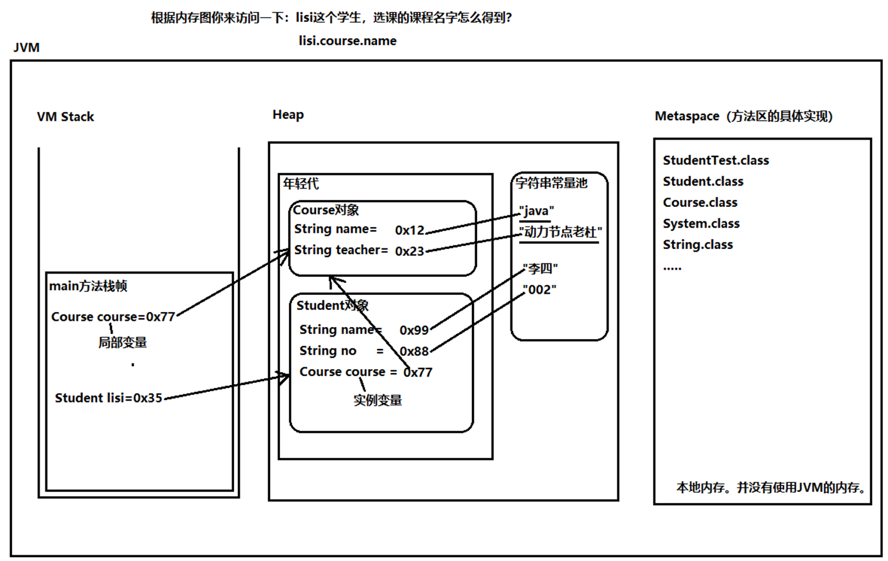

```java title="Course.java"
package com.powernode.javase.oop16;

/**
 * 课程类
 */
public class Course {
    String name;
    String teacher;

    public Course(String name, String teacher) {
        this.name = name;
        this.teacher = teacher;
    }

    public String getName() {
        return name;
    }

    public void setName(String name) {
        this.name = name;
    }

    public String getTeacher() {
        return teacher;
    }

    public void setTeacher(String teacher) {
        this.teacher = teacher;
    }

    public void display(){
        System.out.println("课程名称：" + this.getName() + "，授课老师：" + this.getTeacher());
    }
}
```

```java title="Student.java"
package com.powernode.javase.oop16;

/**
 * 设计一个学生选课系统，有两个类，一个是学生类（Student），一个是课程类（Course）。
 * 学生类包含姓名、学号、已选课程三个属性（根据目前所学，我们只能让学生最多选择一门课），课程类包含课程名称、授课老师属性。
 * 需要设计学生选课和退课的方法。再设计一个打印某学生具体的选课信息的方法。
 */
public class Student { // 学生类
    /**
     * 姓名
     */
    String name;
    /**
     * 学号
     */
    String no;
    /**
     * 学生所选的一门课
     */
    Course course;

    public Student(String name, String no) {
        this.name = name;
        this.no = no;
    }

    public Student(String name, String no, Course course) {
        this.name = name;
        this.no = no;
        this.course = course;
    }

    public String getName() {
        return name;
    }

    public void setName(String name) {
        this.name = name;
    }

    public String getNo() {
        return no;
    }

    public void setNo(String no) {
        this.no = no;
    }

    public Course getCourse() {
        return course;
    }

    public void setCourse(Course course) {
        this.course = course;
    }

    /**
     * 选课
     * @param course
     */
    public void selection(Course course){
        //this.course = course;
        this.setCourse(course);
        System.out.println(this.getName() + "选课成功，课程是：" + course.getName());
    }

    /**
     * 退课
     */
    public void cancel(){
        String courseName = this.getCourse().getName();
        // 退课代码
        this.setCourse(null);
        //this.course = null;
        System.out.println(this.getName() + "退课成功，所退课程是：" + courseName);
    }

    public void display(){
        System.out.print("学号："+this.getNo()+"，姓名："+this.getName());
        if (this.getCourse() == null) {
            System.out.println("，还未选课");
        }else{
            System.out.println("，所选课程名称："+this.getCourse().getName()+"，授课老师：" + this.getCourse().getTeacher());
        }
    }
}
```

```java title="StudentTest.java"
package com.powernode.javase.oop16;

public class StudentTest {
    public static void main(String[] args) {

        // 创建课程对象
        Course course = new Course("java", "动力节点老杜");
        System.out.println(course.teacher);
        System.out.println(course.name);

        Student lisi = new Student("李四", "002", course);
        System.out.println(lisi.no);
        System.out.println(lisi.name);
        System.out.println(lisi.course.name);
        System.out.println(lisi.course.teacher);

        System.out.println("=============>" + lisi.course.name);

        // 创建学生对象
        Student zhangsan = new Student("张三", "001");

        // 显示学生的信息
        zhangsan.display();

        // 选课
        zhangsan.selection(course);

        // 显示学生的信息
        zhangsan.display();

        // 退课
        zhangsan.cancel();

        // 显示学生信息
        zhangsan.display();

        // 创建课程对象
        Course c = new Course("mysql", "动力节点老杨");

        zhangsan.selection(c);

        zhangsan.display();

        zhangsan.cancel();

        zhangsan.display();

    }
}
```


```java title="输出结果.java"
动力节点老杜
java
002
李四
java
动力节点老杜
=============>java
学号：001，姓名：张三，还未选课
张三选课成功，课程是：java
学号：001，姓名：张三，所选课程名称：java，授课老师：动力节点老杜
张三退课成功，所退课程是：java
学号：001，姓名：张三，还未选课
张三选课成功，课程是：mysql
学号：001，姓名：张三，所选课程名称：mysql，授课老师：动力节点老杨
张三退课成功，所退课程是：mysql
学号：001，姓名：张三，还未选课
```

>>**例子2:**

#### 1. 创建一个类`Customer`，用于模拟顾客信息。

```java title="Customer.java"
package com.powernode.javase.oop16;

/**
 * 顾客类
 */
public class Customer {
    /**
     * 名字
     */
    String name;
    /**
     * 年龄
     */
    int age;
    /**
     * 顾客的家庭住址
     */
    Address addr;

    public Customer(String name, int age, Address addr) {
        this.name = name;
        this.age = age;
        this.addr = addr;
    }
}
```

#### 2. 创建一个类`Address`，用于模拟顾客的家庭住址。

```java title="Address.java"
package com.powernode.javase.oop16;

public class Address {
    /**
     * 城市
     */
    String city;
    /**
     * 街道
     */
    String street;

    public Address(String city, String street) {
        this.city = city;
        this.street = street;
    }
}
```

#### 3. 创建一个类`CustomerTest`，用于测试`Customer`类。

```java title="CustomerTest.java"
package com.powernode.javase.oop16;

public class CustomerTest {
    public static void main(String[] args) {
        // 创建一个家庭住址对象
        Address a = new Address("北京","大兴区向阳路街道");
        System.out.println(a); //com.powernode.javase.oop16.Address@2f4d3709
        System.out.println(a.street);

        // 创建一个顾客对象
        Customer c = new Customer("张三",20,a);

        // 我想知道张三是哪个街道的？
        System.out.println("顾客姓名：" + c.name);
        System.out.println("顾客年龄：" + c.age);
        System.out.println("顾客住址：" + c.addr.street);
    }
}
```

```java title="输出结果.java"
com.powernode.javase.oop16.Address@2f4d3709
大兴区向阳路街道
顾客姓名：张三
顾客年龄：20
顾客住址：大兴区向阳路街道
```

总结:

```java title="总结.java" 
System.out.println("顾客住址：" + c.addr.street);

输出的是地址对象的street属性值，即：大兴区向阳路街道。

1. 创建对象
Customer c = new Customer("张三",20,a);
2. 创建地址对象
Address a = new Address("北京","大兴区向阳路街道");
3. 创建顾客对象
c.addr = a; // 将地址对象赋值给顾客对象的addr属性
4. 访问属性
System.out.println(c.addr.street);
5. 输出结果
输出的是地址对象的street属性值，即：大兴区向阳路街道。
```


## 继承

### 面向对象三大特征之一：继承

> **继承是面向对象三大特征之一，`继承`就是将`父类的属性和方法`，通过`继承`给`子类`使用。**


### 继承作用？

> **基本作用：代码复用**

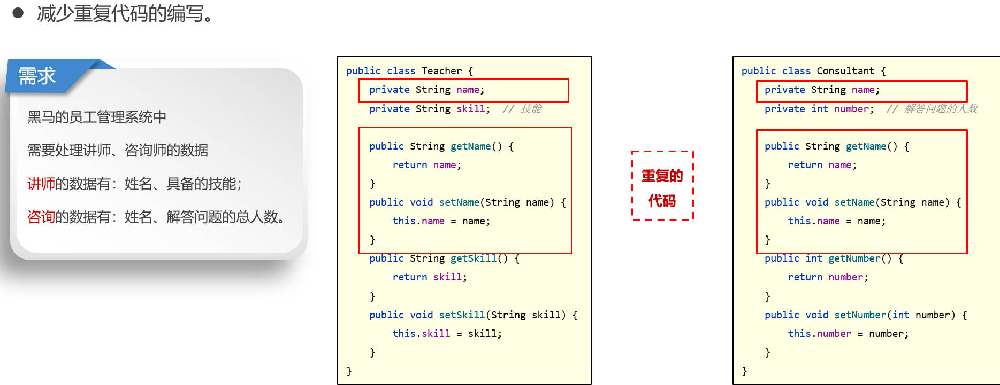

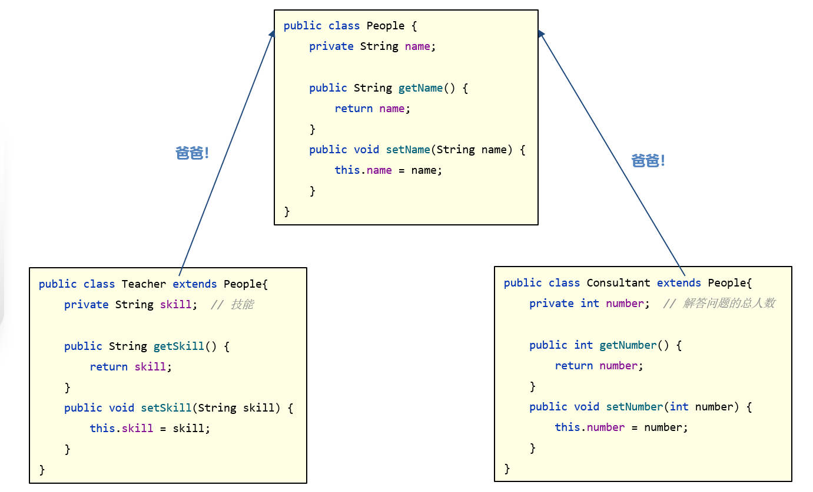

> **重要作用：有了`继承`，才有了`方法覆盖`和`多态机制`。**

### 继承在java中如何实现？

```java title="继承在java中如何实现？.java"
[修饰符列表] class 类名 extends 父类名{
    // 子类自己的属性和方法
}
```
> **`extends`翻译为`扩展`。表示`子类`继承`父类`后，`子类`是对`父类`的扩展。**

### 继承相关的术语

> **当`B类`继承`A类`时**：

>> **`A类`称为：`父类`、`超类`、`基类`、`superclass`**

>> **`B类`称为：`子类`、`派生类`、`subclass`**

### 只支持单继承

> **Java只支持`单继承`，`一个类`只能直接`继承一个类`。**

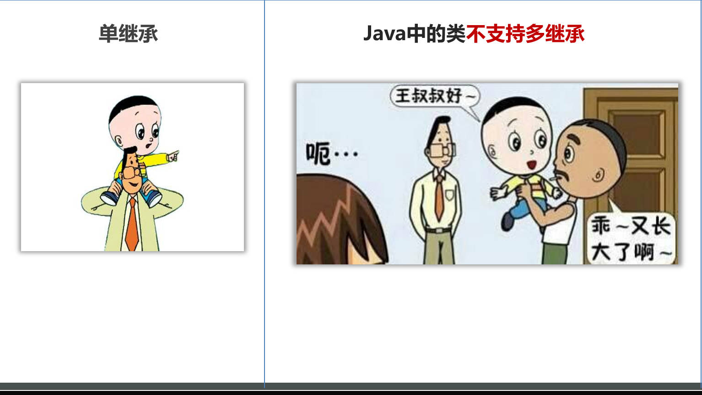

#### **`为何Java中的类不支持多继承`**


### 支持多层继承

> **Java不支持`多继承`，但支持`多重继承`（`多层继承`）。**

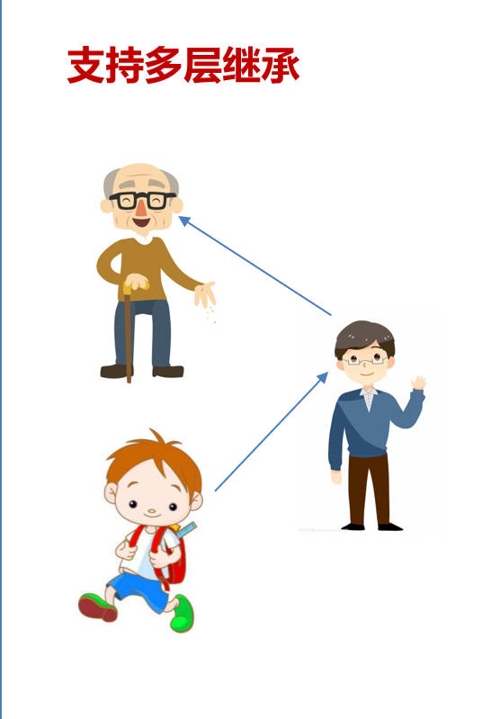

### 继承的特点

> **继承的特点：子类继承父类后，`除私有的不支持继承`、`构造方法不支持继承`。其它的`全部会继承`。**

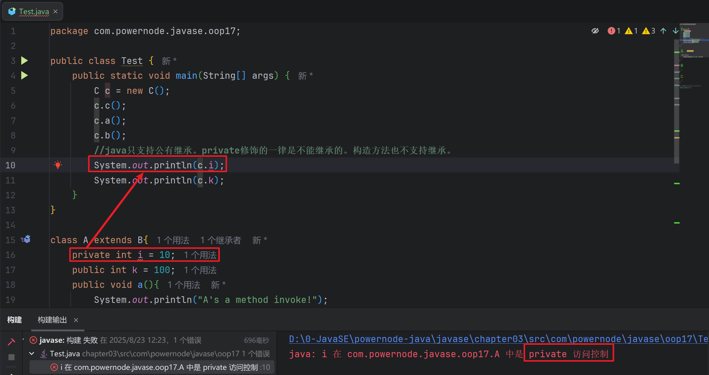

```java title="继承的特点.java"
package com.powernode.javase.oop17;

public class Test {
    public static void main(String[] args) {
        C c = new C();
        c.c();
        c.a();
        c.b();
        //java只支持公有继承。private修饰的一律是不能继承的。构造方法也不支持继承。
        //System.out.println(c.i);
        System.out.println(c.k); // 100
    }
}

class A extends B{
    //private int i = 10;
    public int k = 100;
    public void a(){
        System.out.println("A's a method invoke!");
    }
}

class B {
    public void b(){
        System.out.println("B's b method invoke!");
    }
}

class C extends A{
    public void c(){
        System.out.println("C's c method invoke!");
    }
}

// 语法错误：java不支持多继承，不能同时直接继承多个类。只能“直接”继承1个类。单继承。
//class C extends A, B{ }
```
```java title="输出结果.java"
C's c method invoke!
A's a method invoke!
B's b method invoke!
100
```

### Object类

> **Object类是所有类的根类。**

> **一个类没有显示继承任何类时，默认继承java.lang.Object类。**

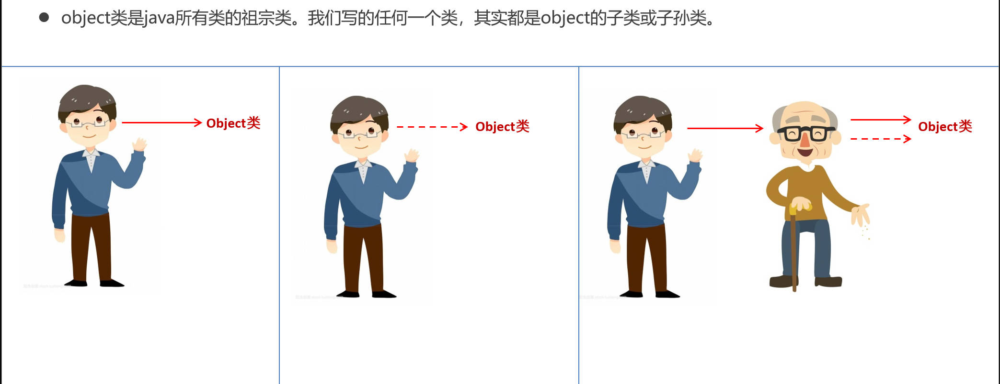


```java title="Object类.java"
package com.powernode.javase.oop17;

/**
 * java语言中，一个类没有显示的继承任何类，默认继承Object。
 * Object是老祖宗。是JDK类库中的根类。（类全名：java.lang.Object）
 */
public class Test2 {
    public static void main(String[] args) {
        E e = new E();
        // 为什么可以调用toString()?
        // 因为E类默认继承Object
        String s = e.toString();
        System.out.println(s);

        F f = new F();
        System.out.println(f.toString());
    }
}

class E {

}

class F extends E {

}
```
```java title="输出结果.java"
com.powernode.javase.oop17.E@2f4d3709
com.powernode.javase.oop17.F@1d81eb93
```


## 方法覆盖

> **`方法覆盖`/`override`/`方法重写`/`overwrite`**

```java title=".java"
package com.powernode.javase.oop18;

/**
 * 动物类
 */
public class Animal {
    /**
     * 吃的行为
     */
    public void eat(){
        System.out.println("动物在吃东西");
    }

    /**
     * 移动的行为
     */
    public void move(){
        System.out.println("动物在移动");
    }

    public Object getObj(long a, String b){
        return null;
    }
}
```

```java title=".java"
package com.powernode.javase.oop18;

public class Brid extends Animal {

    /**
     * Bird对继承过来的move()方法不满意。
     * Bird类有权利将move()方法进行重写/覆盖。
     */
    @Override
    public void move(){
        System.out.println("鸟儿在飞翔");
    }

    @Override
    public String getObj(long a, String b){
        return "";
    }
}
```
```java title="OverrideTest01.java"
package com.powernode.javase.oop18;

/**
 * 回顾方法重载 overload
 * 1. 什么时候考虑使用方法重载？
 *      在一个类中，如果功能相似，可以考虑使用方法重载。
 *      这样做的目的是：代码美观，方便编程。
 *
 * 2. 当满足什么条件的时候构成方法重载？
 *      条件1：在同一个类中。
 *      条件2：相同的方法名。
 *      条件3：不同的参数列表：类型，个数，顺序
 *
 * 3. 方法重载机制属于编译阶段的功能。（方法重载机制是给编译器看的。）
 *
 * 方法覆盖/override/方法重写/overwrite
 * 1. 什么时候考虑使用方法重写？
 *      当从父类中继承过来的方法，无法满足子类的业务需求时。
 *
 * 2. 当满足什么条件的时候，构成方法重写？
 *      条件1：方法覆盖发生在具有继承关系的父子类之间。
 *      条件2：具有相同的方法名（必须严格一样）
 *      条件3：具有相同的形参列表（必须严格一样）
 *      条件4：具有相同的返回值类型（可以是子类型）
 *
 * 3. 关于方法覆盖的细节：
 *      3.1 当子类将父类方法覆盖之后，将来子类对象调用方法的时候，一定会执行重写之后的方法。
 *      3.2 在java语言中，有一个注解，这个注解可以在编译阶段检查这个方法是否是重写了父类的方法。
 *          @Override注解是JDK5引入，用来标注方法，被标注的方法必须是重写父类的方法，如果不是重写的方法，编译器会报错。
 *          @Override注解只在编译阶段有用，和运行期无关。
 *      3.3 如果返回值类型是引用数据类型，那么这个返回值类型可以是原类型的子类型
 *      3.4 访问权限不能变低，可以变高。
 *      3.5 抛出异常不能变多，可以变少。（后面学习异常的时候再说。）
 *      3.6 私有的方法，以及构造方法不能继承，因此他们不存在方法覆盖。
 *      3.7 方法覆盖针对的是实例方法。和静态方法无关。（讲完多态再说。）
 *      3.8 方法覆盖针对的是实例方法。和实例变量没有关系。
 */
public class OverrideTest01 {
    public static void main(String[] args) {
        // 创建鸟儿对象
        Brid b = new Brid();

        // 调用对象
        b.eat();
        b.move();
    }
}
```

```java title="输出结果.java"
动物在吃东西
鸟儿在飞翔
```


### 什么情况下考虑使用方法覆盖？

> **当从`父类`中`继承过来的方法`无法满足`当前子类的业务需求`时。**

### 发生方法覆盖的条件？

> 1. **具有继承关系的父子类之间**

>2. **相同的返回值类型，相同的方法名，相同的形式参数列表**

>3. **访问权限不能变低，可以变高。**

>4. **抛出异常不能变多，可以变少。**

>5. **返回值类型可以是父类方法返回值类型的子类。**

### 方法覆盖的小细节：

> 1. **@Override注解标注的方法会在编译阶段检查该方法是否重写了父类的方法。**


>2. **私有方法不能继承，所以不能覆盖。**


>3. **构造方法不能继承，所以不能覆盖。**


>4. **静态方法不存在方法覆盖，方法覆盖针对的是实例方法。**


>5. **方法覆盖说的实例方法，和实例变量无关。（可以写程序测试一下）**


## 多态

### 多态的基础语法

#### 什么是向上转型和向下转型？

1. **java允许具有`继承关系`的`父子类型`之间的`类型转换`。**

2. **`向上转型`（upcasting）：`子-->父`**

+ 子类型的对象可以赋值给一个父类型的`引用`。

3. **`向下转型`（downcasting）：`父-->子`**

+ `父类型的引用`可以转换为`子类型的引用`。但是需要加`强制类型转换符`。

4. **无论是向上转型还是向下转型，前提条件是：两种类型之间必须`存在继承关系`。这样`编译器才能编译通过`。**


#### 什么是多态？

1. **多态：`同一个方法名`，`参数列表`不同，`返回值类型`不同。**


> **多态的基础语法：`父类类型 变量名 = new 子类类型();`**

```java title="PolymorphismTest01.java"
package com.powernode.javase.oop19;

public class PolymorphismTest01 {
    public static void main(String[] args) {
        // 多态的基础语法
        // 父类类型 变量名 = new 子类类型();
        Animal a = new Brid();
    }
}
```


## super关键字

```java title="Person.java"
package com.powernode.javase.oop24;

/**
 * 父类
 */
public class Person {
    String name;

    int age;

    String email;

    String address;

    public Person() {
    }

    public String getName() {
        return name;
    }

    public void setName(String name) {
        this.name = name;
    }

    public String getEmail() {
        return email;
    }

    public void setEmail(String email) {
        this.email = email;
    }

    public int getAge() {
        return age;
    }

    public void setAge(int age) {
        this.age = age;
    }

    public String getAddress() {
        return address;
    }

    public void setAddress(String address) {
        this.address = address;
    }
}
```

```java title="Teacher.java"
package com.powernode.javase.oop24;

/**
 * 子类
 */
public class Teacher extends Person {
    /**
     * 特有的属性
     */
    double sal;

    String name;

    public Teacher() {
    }

    public Teacher(String name,int age,String email,String address,double sal) {
        // super();
        this.name = name;
        this.age = age;
        this.email = email;
        this.address = address;
        this.sal = sal;
    }

    public double getSal() {
        return sal;
    }

    public void setSal(double sal) {
        this.sal = sal;
    }

    public void display() {
        /*System.out.println(this.getName());
        System.out.println(this.getAge());
        System.out.println(this.getEmail());
        System.out.println(this.getAddress());
        System.out.println(this.getSal());*/

        System.out.println("姓名：" + super.name);
        System.out.println("年龄：" + super.age);
        System.out.println("邮箱：" + super.email);
        System.out.println("住址：" + super.address);
        System.out.println("工资：" + this.sal);

        System.out.println("姓名：" + this.name);
        System.out.println("年龄：" + this.age);
        System.out.println("邮箱：" + this.email);
        System.out.println("住址：" + this.address);
        System.out.println("工资：" + this.sal);
    }

    // this和super都不能使用在静态上下文中
    /*public static void test(){
        System.out.println(this);
        System.out.println(super.name);
    }*/

    @Override
    public void doSome() {
        // 重写的要求：在父类方法的执行基础之上额外再添加一些代码
        System.out.println("do some开始执行了");
        // super. 什么时候不能省略？父中有，子中有相同的，但是想在子类中访问父类的，必须添加 super.
        super.doSome();
        System.out.println("do some方法执行结束了");

        // this 本身是一个引用。所以可以直接输出
        System.out.println(this);
        // super甭说不是一个引用。super只是代表了当前对象的父类型特征那部分
        // super 不能单独的输出
        // System.out.println(super); // 编译错误
    }
}
```

```java title="Test01.java"
package com.powernode.javase.oop24;

public class Test01 {
    public static void main(String[] args) {
        // 创建Teacher对象
        Teacher t = new Teacher("张三",20,"zhangsan@123.com","北京朝阳",10000.0);

        t.display();

        t.doSome();
    }
}
```


### super关键字的使用注意事项

> `super关键字`和`this关键字`对比来学习。`this`代表的是`当前对象`。`super`代表的是**`当前对象`中的`父类型特征`。**
>
> 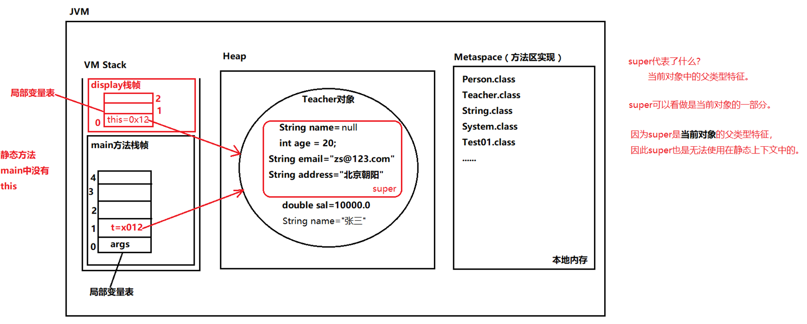

> super不能使用在静态上下文中。
>
> 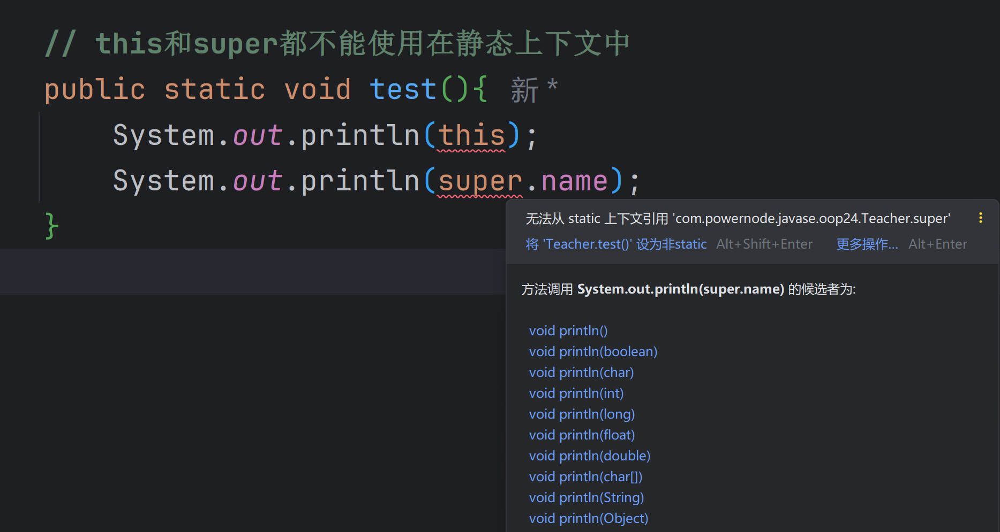


> **`“super.”`大部分情况下是`可以省略的`。什么时候`不能省略`？**

>> **当`父类和子类`中**没有**定义了`相同的属性（实例变量）或者相同方法（实例方法）`时，如果需要在`子类中访问父类的属性或方法`时,`super.`能`省略`。**
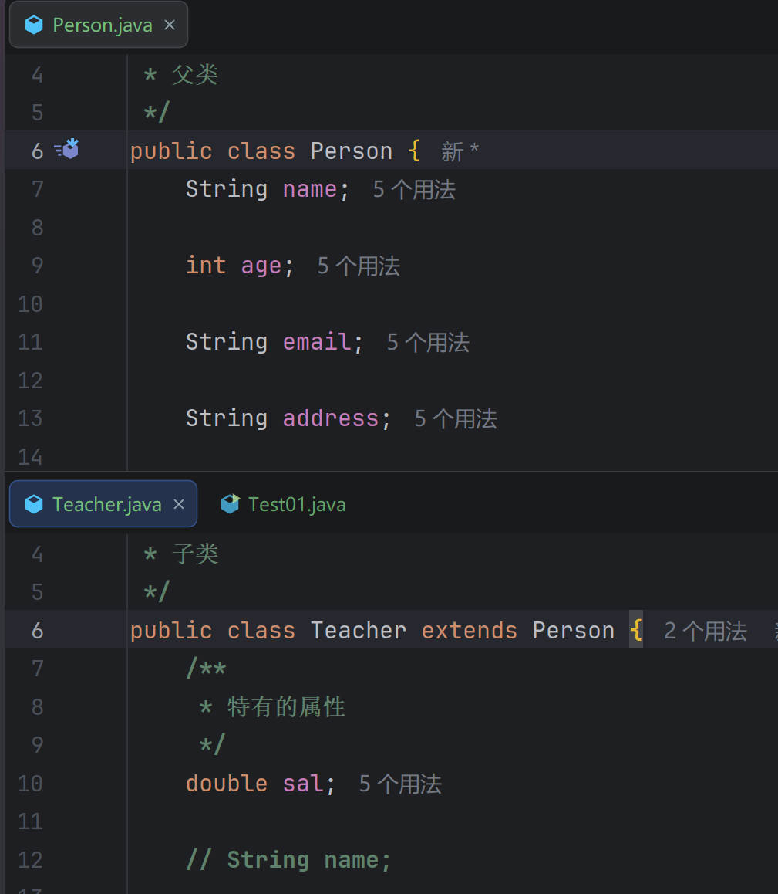
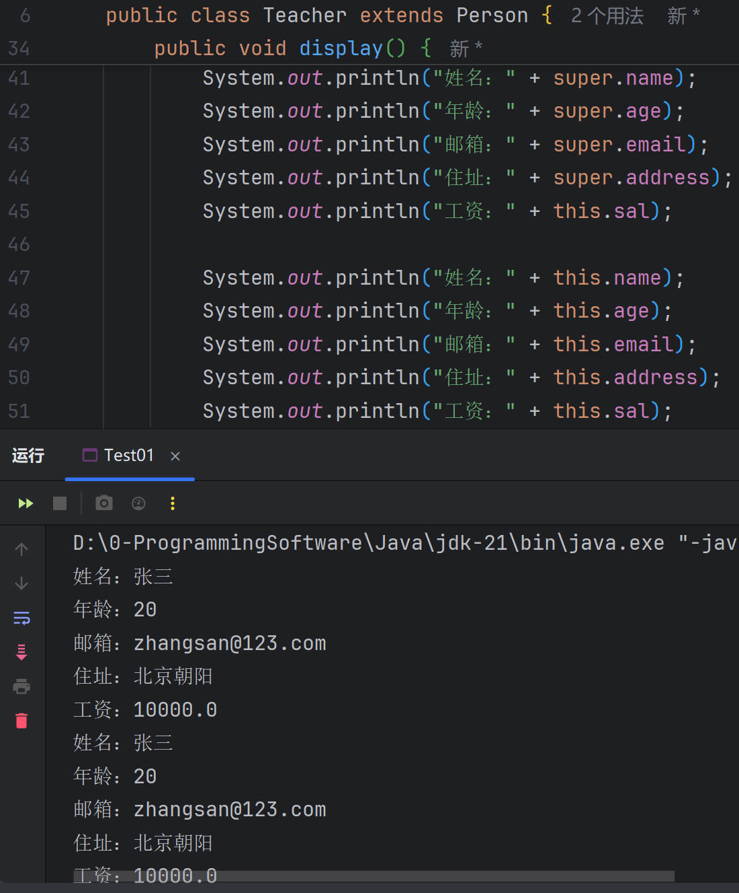

>> **当`父类和子类`中定义了`相同的属性（实例变量）或者相同方法（实例方法）`时，如果需要在`子类中访问父类的属性或方法`时，`super.`不能`省略`。**
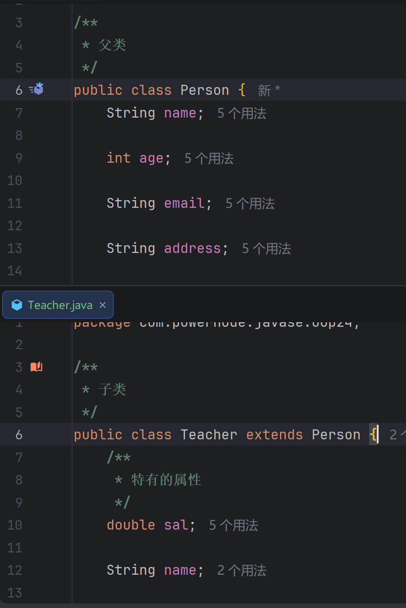
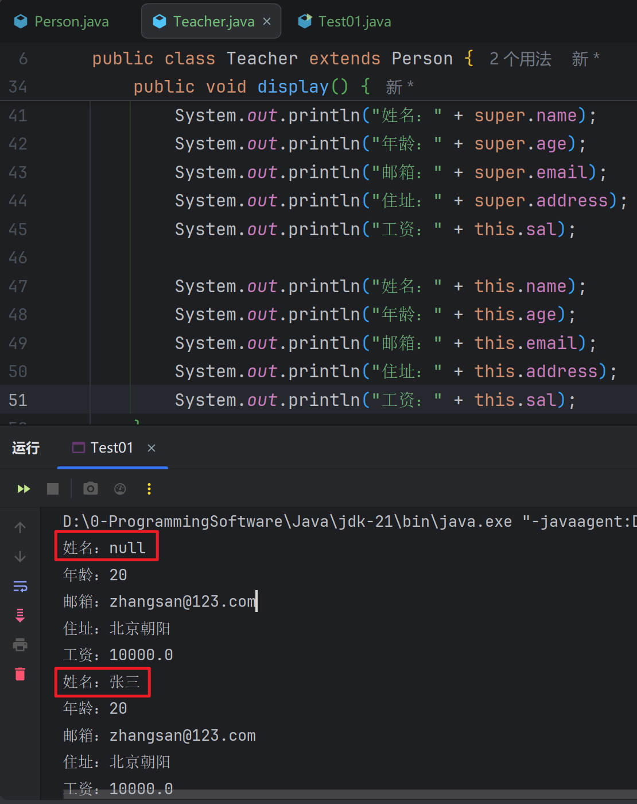

> **`this`可以`单独输出`，`super`不能`单独输出`。**
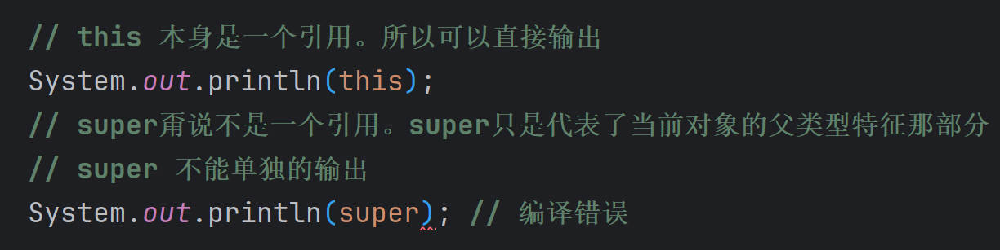

> **`super(实参); `通过子类的构造方法调用父类的`构造方法`，目的是为了`完成父类型特征的初始化`。**
+ 父类
```java title="Account.java"
public class Account {
    String actno;

    double balance;

    public Account() {
    }

    public Account(String actno, double balance) {
        this.actno = actno;
        this.balance = balance;
    }
}
```
+ 子类
```java title="BankAccount.java"
public class CreditAccount extends Account {
    /**
     * 子类特有的属性
     * 信用度：0.999
     */
    double credit;

    public CreditAccount(String actno, double banlance,double credit) {
        // 通过子类构造方法调用父类的构造方法
        // 引用这个语法的作用：1.代码复用。2.为了"模拟“现实世界中的要有儿子，得先有父亲。3.通过子类构造方法调用父类构造方法是为了给继承过来的父类型特征初始化
        super(actno,banlance);
        this.credit = credit;
    }
}
```


> **当一个构造方法`第一行没有显示的调用“super(实参);”`，也`没有显示的调用“this(实参)”`，系统会`自动调用super()`。因此`一个类中的无参数构造方法建议显示的定义出来`。**
```java
1.注意:new子类对象时,会先初始化父类(先走父类无参构造方法)
2.原因:
  每个构造方法的第一行,默认都会有一个super(),不写jvm自动提供一个
  super()代表的是父类无参构造      
```
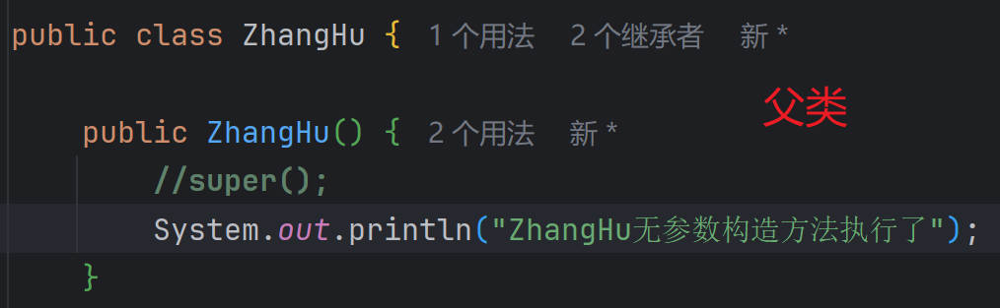
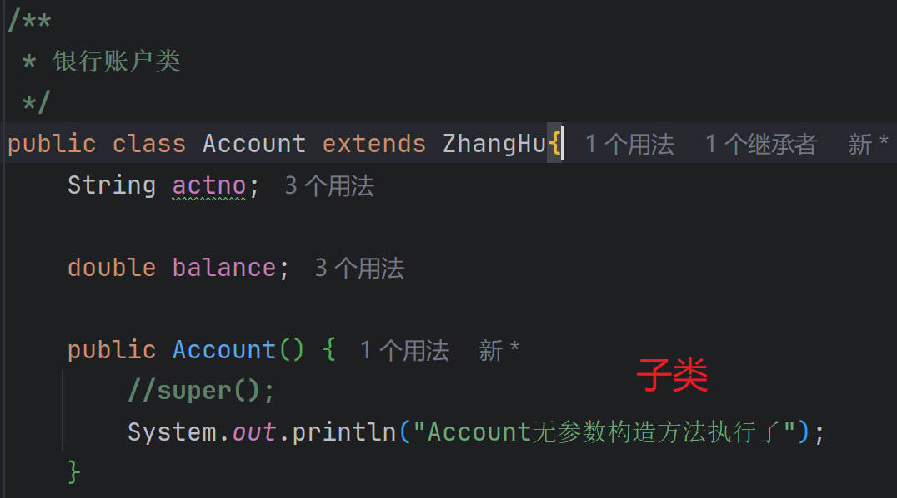
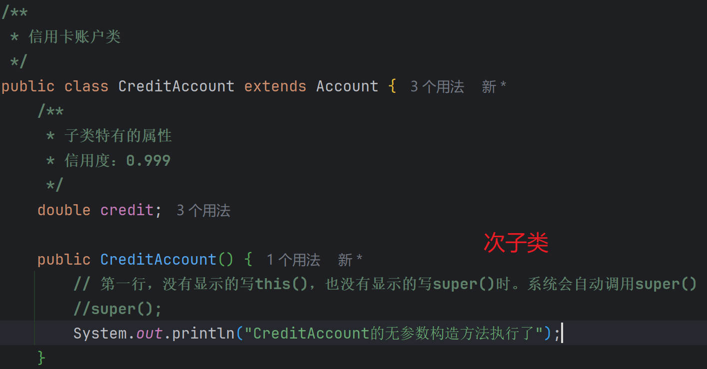


> **super(实参); 这个语法`只能`出现在构造方法`第一行`。**
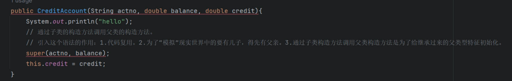

> **在Java语言中`只要new对象`，`Object`的`无参数构造方法一定会执行`。**


## final关键字

```java
1.概述:最终的
2.使用:
  a.修饰一个类
  b.修饰一个方法
  c.修饰一个局部变量
  d.修饰一个成员变量
  e.修饰一个对象
      
3.怎么学final:只需要知道被final修饰之后特点是啥即可
```

### final修饰类

```java
1.格式:
  public final class 类名{}
2.特点:
  被final修饰的类不能被继承
```
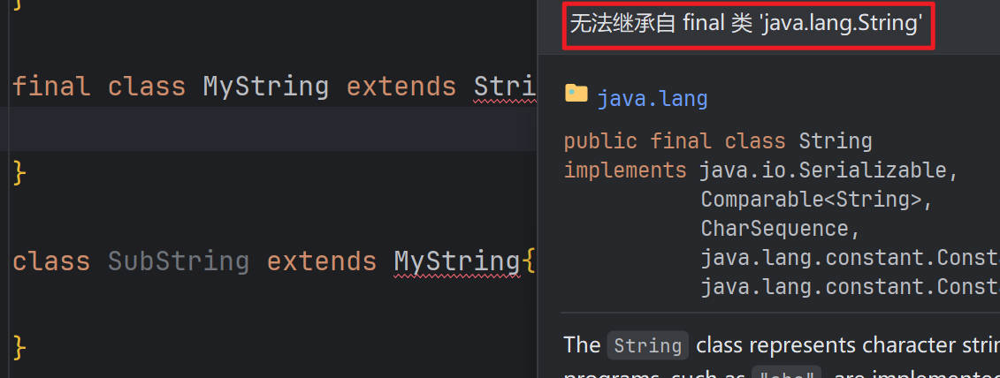

```java
// 编译报错：java.lang.String类被final修饰，无法继承
final class MyString /*extends String*/{
}
```

```java
class SubString /*extends MyString*/{
}
```


### final修饰方法

```java
1.格式:
  修饰符 final 返回值类型 方法名(形参){
      方法体
      return 结果
  }
2.特点:
  被final修饰的方法,不能被重写
      
3.注意:
  final和abstract不能同时修饰一个方法
```
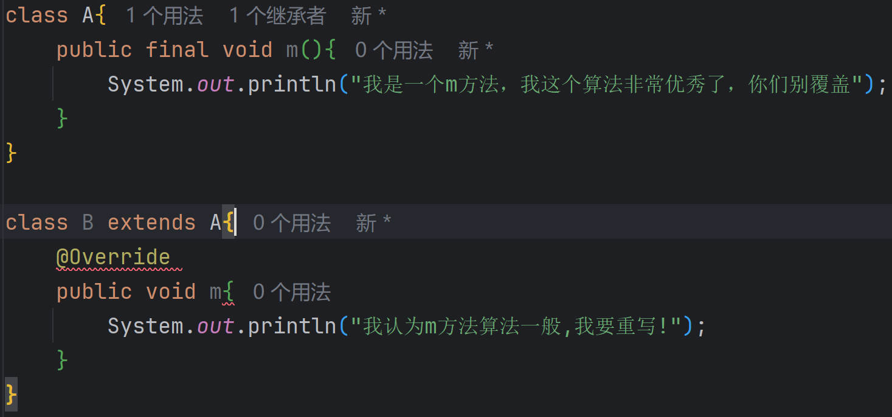

```java
class A{
    public final void m(){
        System.out.println("我是一个m方法，我这个算法非常优秀了，你们别覆盖");
    }
}
```

```java
class B extends A{
    // 编译报错：m()方法被final修饰,无法从最终A中覆盖
    /*@Override
    public void m{
        System.out.println("我认为m方法算法一般,我要重写!");
    }*/
}
```

> 注意:
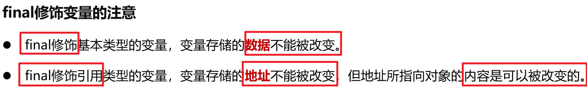


### final修饰局部变量

```java
1.格式:
  final 数据类型 变量名 = 值
2.特点:
  被final修饰的变量不能二次赋值
```
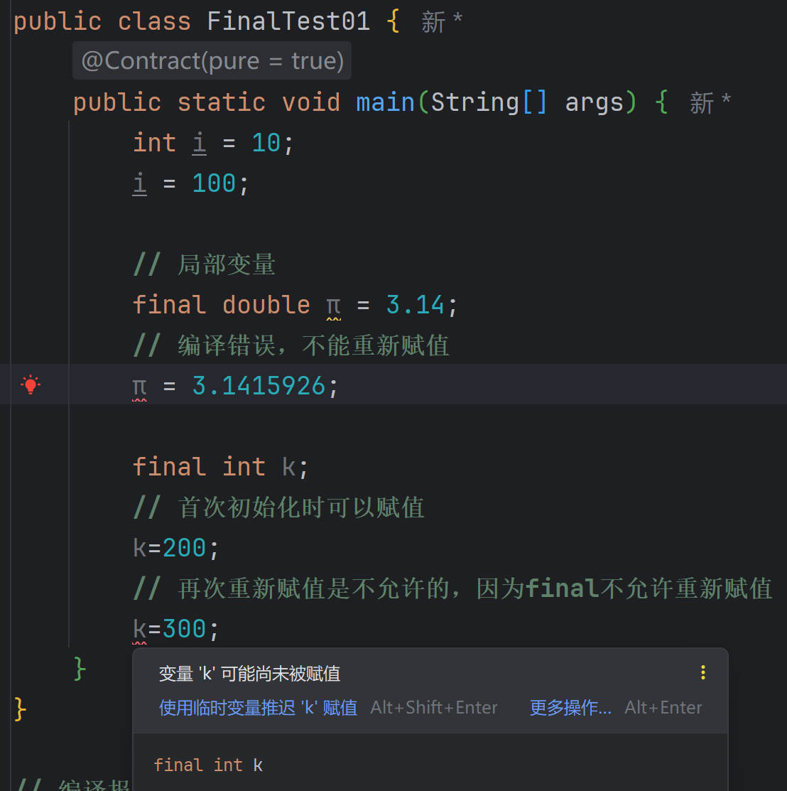

```java
public class FinalTest01 {
    public static void main(String[] args) {
        int i = 10;
        i = 100;

        // 局部变量
        final double π = 3.14;
        // 编译错误，不能重新赋值
        // π = 3.1415926; 被final修饰的变量不能二次赋值

        final int k;
        // 首次初始化时可以赋值
        k=200;
        // 再次重新赋值是不允许的，因为final不允许重新赋值
        // k=300; 被final修饰的变量不能二次赋值
    }
}
```

### final修饰成员变量

```java
1.格式:
  final 数据类型 变量名 = 值
2.特点:
  a.需要手动赋值
  b.不能二次赋值
  c.一般和static联合使用,称为常量
```
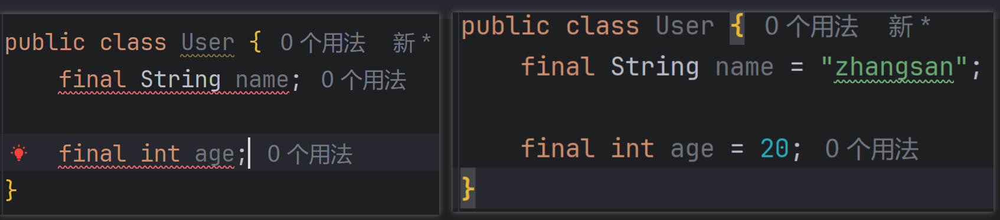

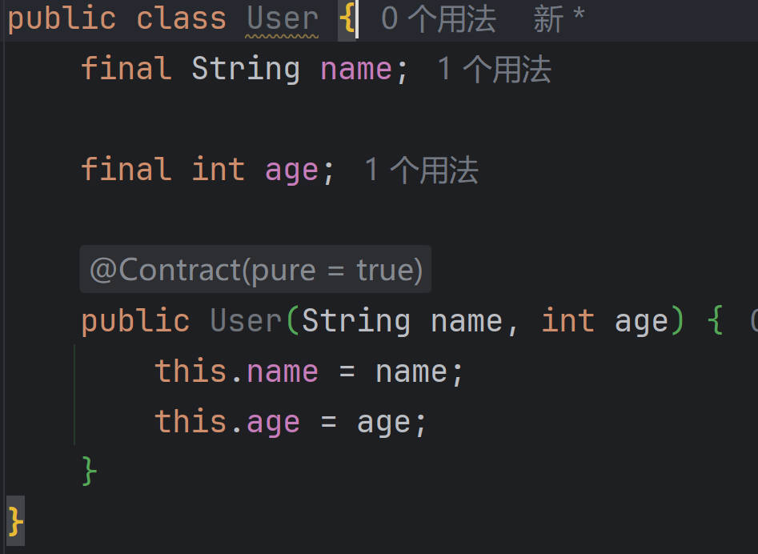

```java
public class User {
    final String name = "zhangsan";

    final int age = 20;

    /* 有参构造现在属于二次赋值了
    public User(String name, int age) {
        this.name = name;
        this.age = age;
    }
    */

    public String getName() {
        return name;
    }

    public int getAge() {
        return age;
    }

    /* set方法现在属于二次赋值了
    public void setName(String name) {
        this.name;
    }

    public void setAge(int age) {
        this.age;
    }
    */
}
```

### static final 修饰的成员变量

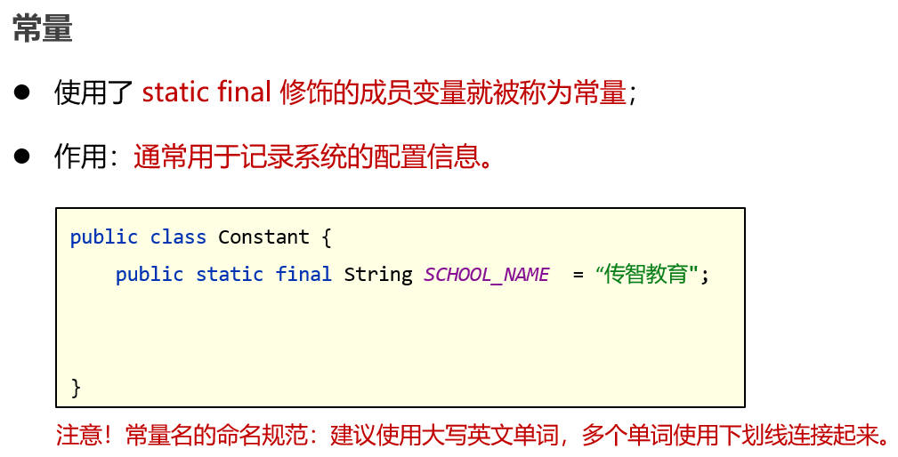

```java
使用常量记录系统配置信息的优势、执行原理:

1. 代码可读性更好，可维护性也更好。

2. 程序编译后，常量会被“宏替换”：出现常量的地方全部会被替换成其记住的字面量，这样可以保证使用常量和直接用字面量的性能是一样的。
```

```java 
public class Math {

    /**
     * 常量：
     * 1. 怎么定义常量：public static final 数据类型 常量名 = 常量值;
     * 2. 常量名的命名规范：全部单词大写，每个代词采用“_”衔接
     */
    public static final double MATH_PAI = 3.1415926;

    public static void main(String[] args){
        System.out.println("π=" + Math.MATH_PAI);
    }
}
```
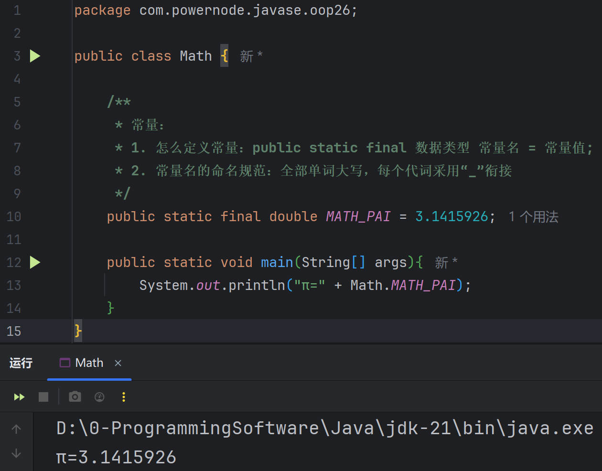


### final修饰对象

```java
1.格式:
  final 数据类型 对象名 = new 对象();
2.特点:
  被final修饰的对象,地址值不能改变,但是对象中的属性值可以改变
```

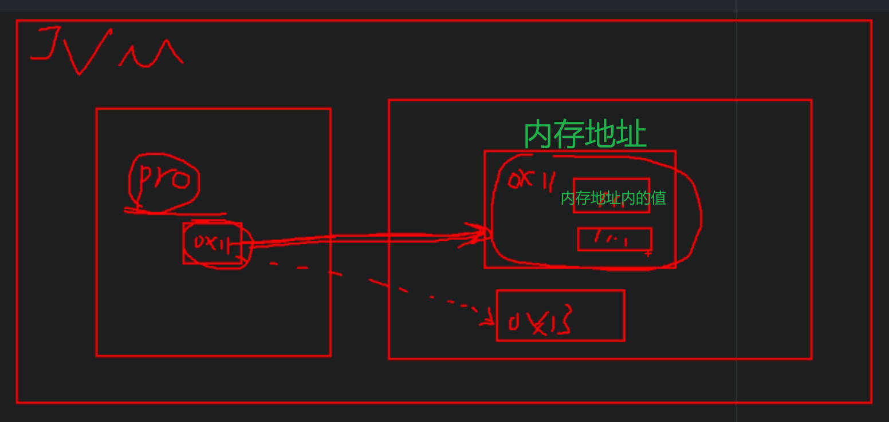

> 例子1：商品类

```java
public class Product {
    private String name;

    private double price;

    public Product() {
    }

    public Product(String name, double price) {
        this.name = name;
        this.price = price;
    }

    public String getName() {
        return name;
    }

    public void setName(String name) {
        this.name = name;
    }

    public double getPrice() {
        return price;
    }

    public void setPrice(double price) {
        this.price = price;
    }

    public void display() {
        System.out.println("商品名称: " + this.name+ "商品价格: " + this.price);
    }
}
```
```java
public class ProductTest {
    public static void main(String[] args) {
        // 创建商品对象
        final Product pro = new Product("BMW535li",10.0);

        pro.display();

        // 报错
        // pro = new Product("BenzE300L",20.0);

        // 指向的对象的内部内存可以修改。没问题。
        pro.setName("BenzE300L");
        pro.setPrice(20.0);

        pro.display();
    }
}
```
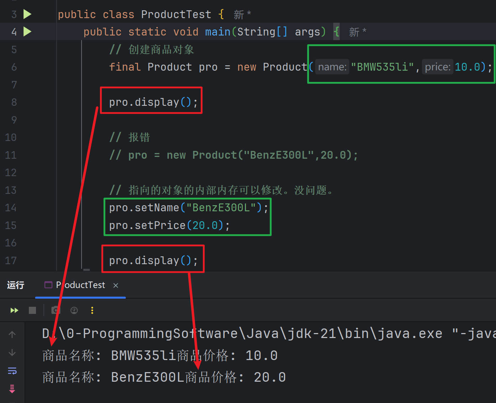


> 例子2：人
```java
public class Person {
    private String name;
    private int age;

    public Person() {
    }

    public Person(String name, int age) {
        this.name = name;
        this.age = age;
    }

    public String getName() {
        return name;
    }

    public void setName(String name) {
        this.name = name;
    }

    public int getAge() {
        return age;
    }

    public void setAge(int age) {
        this.age = age;
    }
}

```
```java
public class Test02 {
    public static void main(String[] args) {
        //Person p1 = new Person("金莲",26);
        //System.out.println(p1);//地址值
        //p1 = new Person("涛哥",18);
        //System.out.println(p1);//地址值

        final Person p1 = new Person("金莲",26);
        System.out.println(p1);//地址值
        //p1 = new Person("涛哥",18);
        //System.out.println(p1);//地址值

        p1.setName("大郎");
        p1.setAge(30);
        System.out.println(p1.getName()+"..."+p1.getAge());
    }
}
```


## 抽象类


### 抽象的介绍

```java
   1.抽象类怎么来的？
     抽取共性方法,放到父类中,发现方法没法实现,因为每个子类对此方法的实现方式细节不一样此时方法体说不清道不明,
     可以定义成抽象方法
     
     抽象方法所在的类一定是抽象类


   2.关键字: abstract

   3.抽象方法:
      修饰符 abstract 返回值类型 方法名(参数);

   4.抽象类:
       public  abstract class 类名{}

   5.注意:
       a.抽象方法所在的类一定是抽象类
       b.抽象类中不一定非得有抽象方法
       c.子类继承父类之后,需要重写父类
          中所有的抽象方法,不然编译报错
       d.抽象类不能new对象,只能通过new子类对象调动重写方法
           
   6.可以将抽象类看成是一类事物的标准,要求只要是属于这一类的,都必须要拥有抽象类中的方法,必须要给我实现,怎么证明拥有了,怎么证明实现了呢?-> 重写
     至于这个方法怎么实现,就看子类重写之后怎么写方法体了
```

```java
public abstract class Animal {
   public abstract void eat();
   public abstract void drink();
}
```

```java
public class Dog extends Animal{
    @Override
    public void eat() {
        System.out.println("狗啃骨头");
    }

    @Override
    public void drink() {
        System.out.println("狗喝水");
    }
}
```

```java
public class Cat extends Animal{
    @Override
    public void eat() {
        System.out.println("猫吃鱼");
    }

    @Override
    public void drink() {
        System.out.println("猫喝水");
    }
}

```

```java
public class Test01 {
    public static void main(String[] args) {
        Dog dog = new Dog();
        dog.eat();
        dog.drink();
        System.out.println("===================");
        Cat cat = new Cat();
        cat.eat();
        cat.drink();
    }
}
```

### 抽象的注意事项

```java
1.抽象类不能直接new对象,只能创建非抽象子类的对象
2.抽象类中不一定非得有抽象方法,但是抽象方法所在的类一定抽象类
3.抽象类的子类,必须重写父类中的所有抽象方法,否则,编译报错,除非该子类也是抽象类
4.抽象类中可以有成员变量,构造,成员方法
5.抽象类中可以有构造方法,是供子类创建对象时,初始化父类属性使用的 
6.abstract关键字不能和private，final，static关键字共存。
```


> 例1: 员工类

```java
public abstract class Employee {
    private String name;
    private int age;

    public Employee() {
    }

    public Employee(String name, int age) {
        this.name = name;
        this.age = age;
    }

    public String getName() {
        return name;
    }

    public void setName(String name) {
        this.name = name;
    }

    public int getAge() {
        return age;
    }

    public void setAge(int age) {
        this.age = age;
    }

    public abstract void work();
}
```

```java
public class Teacher extends Employee{
    public Teacher() {
    }

    public Teacher(String name, int age) {
        super(name, age);
    }

    @Override
    public void work() {
        System.out.println("涛哥在讲java");
    }
}
```

```java
public class Test01 {
    public static void main(String[] args) {
        Teacher t1 = new Teacher("涛哥", 18);
        System.out.println(t1.getName()+"..."+t1.getAge());
    }
}
```

```java title="输出结果"
涛哥...18
```


> 例2: 什么时候考虑将类定义为抽象类？
**如果类中有些方法无法实现或者没有意义，可以将方法定义为抽象方法。类定义为抽象类。这样在抽象类中只提供公共代码，`具体的实现`强行交给`子类去做`。比如一个`Person类`有一个`问候的方法greet()`，但是`不同国家的人问候的方式不同`，因此`greet()方法具体实现应该交给子类`。再比如主人喂养宠物的例子中的`宠物Pet`，Pet中的`eat()方法`的方法体就是没有意义的。**


```java 
package com.powernode.javase.oop27;

/**
 * 人类
 */
abstract public class Person { // 父类(所有子类的公共属性+公共方法的一个集合)
    private String name;

    private int age;

    public Person() {
    }

    public Person(String name, int age) {
        this.name = name;
        this.age = age;
    }

    public String getName() {
        return name;
    }

    public void setName(String name) {
        this.name = name;
    }

    public int getAge() {
        return age;
    }

    public void setAge(int age) {
        this.age = age;
    }

    /**
     * 显示人类的详细信息
     */
    public void display() {
        System.out.println("名字：" + this.name + "年龄：" + this.age);
    }

    /**
     * 问候的方法，不同国家的人，问候的方式肯定是不同的。
     * 因此，具体是怎么问候的，Person中是不确定，无法实现的。
     * 针对这种方法既然不确定具体的实现是什么，那么就不应该给实现。
     * 注意：在java中，只要一个方法带着大括号，不管大括号中有什么，
     * 只要有大括号就表示一种实现。
     *
     * 因此像这种无法确定实现的方法，建议定义为抽象方法。
     */
    //public void greet(){}

    // 抽象方法怎么定义：修饰符列表中添加abstract，然后不能有方法体，以“;”结束。
    // public和abstract关键字的顺序没有要求。
    // 当一个类中有抽象方法，java要求该类必须是抽象的。
    public abstract void greet();
}
```

```java
package com.powernode.javase.oop27;

/**
 * 一个非抽象的类继承抽象类之后，必须将抽象类中所有的抽象方法全部重写/实现。
 */
public class EnglishPerson extends Person {

    public EnglishPerson() {
        super();
    }

    public EnglishPerson(String name,int age) {
        super(name,age);
    }

    @Override
    public void greet() {
        System.out.println("Hello,my name is " + this.getName());
    }
}
```

```java
package com.powernode.javase.oop27;

public class ChinesePerson extends Person {

    public ChinesePerson(){
        super();
    }

    public ChinesePerson(String name,int age){
        super(name,age);
    }

    @Override
    public void greet() {
        System.out.println("你好，我的名字叫" + this.getName());
    }
}
```

```java
package com.powernode.javase.oop27;

public class PersonTest {
    public static void main(String[] args) {
        // 创建对象
        Person p1 = new EnglishPerson("jack",20);
        p1.display();
        p1.greet();

        Person p2 = new ChinesePerson("张三",30);
        p2.display();
        p2.greet();

        // 抽象类虽然有构造方法，但是无法实例化。
        // 抽象类中构造方法的作用：给子类实现的。
        //new Person();
    }
}
```
> **输出结果**：
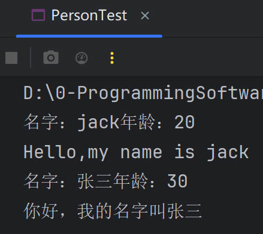


### 练一练（super，final，抽象类 综合练习）

> **请根据题目要求编写程序，实现一个包含抽象类和抽象方法的Java程序，要求**：

>1. 定义一个`抽象类Shape`，包含属性：`name、color、抽象方法area()`，`非抽象方法display()`。思考为什么`area()方法定义为抽象方法`？
```java title="Shape.java"
package com.powernode.javase.oop28;

/**
 * 形状类：抽象类
 */
abstract public class Shape {
    private String name;

    private String color;

    public Shape() {
    }
    public Shape(String name, String color) {
        this.name = name;
        this.color = color;
    }

    public String getName() {
        return name;
    }

    public void setName(String name) {
        this.name = name;
    }

    public String getColor() {
        return color;
    }

    public void setColor(String color) {
        this.color = color;
    }

    /**
     * 计算图形面积的抽象方法。因为在父类中不确定具体是什么图形。
     * 因此该方法无法在Shape类中实现，只能延迟到子类中实现。
     * @return
     */
    public abstract double area();

    /**
     * 显示图形的信息。
     */
    public void display() {
        System.out.println(this.getName() + "的颜色是" + this.getColor());
    };
}
```
>2. 定义一个`Circle类`，`继承Shape类`，包含一个`双精度类型实例变量radius`，以及`一个构造方法`，该构造方法使用`super关键字调用父类Shape的构造方法`，来初始化`color和name`。`Circle类`还实现了`抽象方法area()`，用于`计算圆形的面积`。定义一个`常量类`，`常量类`中`定义一个常量用来专门存储圆周率`。
```java title="Circle.java"
package com.powernode.javase.oop28;

/**
 * 圆形类
 */
public class Circle extends Shape {

    private double radius;

    public Circle() {
        super();
    }

    @Override
    public double area() {
        return Constant.MATH_PI * this.radius * this.radius;
    }

    public Circle(String name, String color, double radius) {
        super(name, color);
        this.radius = radius;
    }

    public double getRadius() {
        return radius;
    }

    public void setRadius(double radius) {
        this.radius = radius;
    }
}
```
```java title="Constant.java"
package com.powernode.javase.oop28;

/**
 * 一个项目中通常会有一个常量类，专门用来存储常量。
 */
public class Constant {
    /**
     * 数学中的圆周率。
     */
    public static final double MATH_PI = 3.14;
}
```
>3. 定义一个`Rectangle类`，`继承Shape类`，包含两个`双精度类型实例变量width和height`，以及`一个构造方法`，该构造方法使用`super关键字调用父类Shape的构造方法`，来初始化`color和name`。`Rectangle类`还实现了`抽象方法area()`，用于`计算矩形的面积`。
```java title="Rectangle.java"
package com.powernode.javase.oop28;

/**
 * 长方形
 */
public class Rectangle extends Shape {
    private double width;

    private double height;

    public Rectangle() {
        super();
    }

    public Rectangle(String name,String color,double width, double height) {
        super(name,color);
        this.width = width;
        this.height = height;
    }

    @Override
    public double area() {
        return this.getWidth() * this.getHeight();
    }

    public double getWidth() {
        return width;
    }

    public void setWidth(double width) {
        this.width = width;
    }

    public double getHeight() {
        return height;
    }

    public void setHeight(double height) {
        this.height = height;
    }
}
```
>4. 在程序的`main()方法`中，创建`一个Circle对象`、`一个Rectangle对象`，并分别`调用它们的display()方法`，输出结果。`调用area()方法输出面积`。
```java title="Test.java"
package com.powernode.javase.oop28;

public class Test {
    public static void main(String[] args) {
        // 创建圆形对象
        Circle circle = new Circle("圆形", "红色", 3.0);

        circle.display();

        System.out.println(circle.getName() + "的面积是：" + circle.area());

        // 创建长方形对象
        Rectangle rectangle = new Rectangle("长方形", "蓝色", 2.0, 3.0);

        rectangle.display();

        System.out.println(rectangle.getName() + "的面积是：" + rectangle.area());
    }
}
```

> **输出结果**：
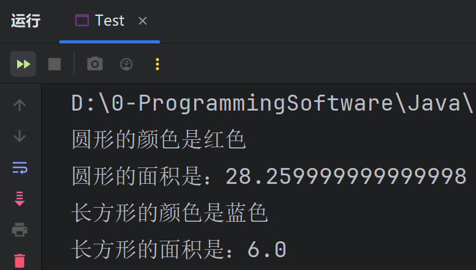


## 接口

### 接口的介绍

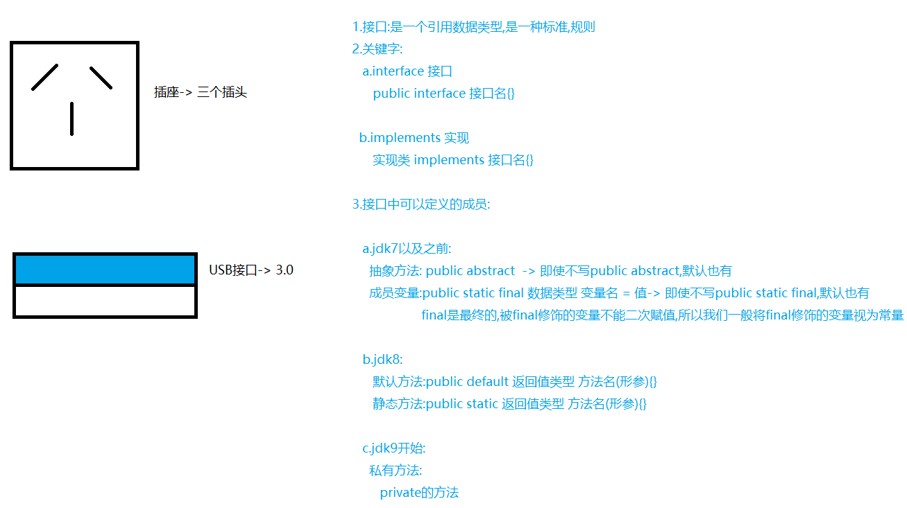

### 接口的定义以及使用

```java
1.接口:是一个引用数据类型,是一种标准,规则
2.关键字:
   a.interface 接口
      public interface 接口名{}
   
  b.implements 实现
      实现类 implements 接口名{}

3.接口中可以定义的成员:
   
   a.jdk7以及之前:
     抽象方法: public abstract  -> 即使不写public abstract,默认也有
     成员变量:public static final 数据类型 变量名 = 值-> 即使不写public static final,默认也有
                    final是最终的,被final修饰的变量不能二次赋值,所以我们一般将final修饰的变量视为常量

   b.jdk8:
      默认方法:public default 返回值类型 方法名(形参){}
      静态方法:public static 返回值类型 方法名(形参){}

   c.jdk9开始:
     私有方法:
        private的方法
```

```java
1.定义接口:
  public interface 接口名{}
2.实现:
  public class 实现类类名 implements 接口名{}
3.使用:
  a.实现类实现接口
  b.重写接口中的抽象方法
  c.创建实现类对象(接口不能直接new对象)
  d.调用重写的方法    
```

```java
public interface USB {
    public abstract void open();
    public abstract void close();
}

```

```java
public class Mouse implements USB{
    @Override
    public void open() {
        System.out.println("鼠标打开");
    }

    @Override
    public void close() {
        System.out.println("鼠标关闭");
    }
}

```

```java
public class Test01 {
    public static void main(String[] args) {
        Mouse mouse = new Mouse();
        mouse.open();
        mouse.close();
    }
}

```

### 接口中的成员

#### 抽象方法

```java
1.定义格式:
  public abstract 返回值类型 方法名(形参);
2.注意:
  不写public abstract 默认也有
3.使用:
  a.定义实现类,实现接口
  b.重写抽象方法
  c.创建实现类对象,调用重写的方法
```

```java
public interface USB {
    public abstract void open();
    String close();
}
```

```java
public class Mouse implements USB{
    @Override
    public void open() {
        System.out.println("鼠标打开");
    }

    @Override
    public String close() {
        return "鼠标关闭";
    }
}
```

```java
public class Test01 {
    public static void main(String[] args) {
        Mouse mouse = new Mouse();
        mouse.open();
        String result = mouse.close();
        System.out.println("result = " + result);
    }
}

```

#### 默认方法

```java
1.格式:
  public default 返回值类型 方法名(形参){
      方法体
      return 结果
  }
2.使用:
  a.定义实现类,实现接口
  b.默认方法可重写,可不重写
  c.创建实现类对象,调用默认方法     
```

```java
public interface USB {
   //默认方法
    public default void methodDef(){
        System.out.println("我是默认方法");
    }
}

```

```java
public class Mouse implements USB {
    @Override
    public void methodDef(){
        System.out.println("我是重写接口中的默认方法");
    }
}

```

```java
public class Test01 {
    public static void main(String[] args) {
        Mouse mouse = new Mouse();
        mouse.methodDef();
    }
}
```

#### 静态方法

```java
1.定义格式:
  public static 返回值类型 方法名(形参){
      方法体
      return 结果
  } 

2.使用:
  接口名直接调用
      
```

```java
public interface USB {
   //默认方法
    public default void methodDef(){
        System.out.println("我是默认方法");
    }

    //静态方法
    public static void methodSta(){
        System.out.println("我是接口中的静态方法");
    }
}
```

```java
public class Test01 {
    public static void main(String[] args) {
        Mouse mouse = new Mouse();
        mouse.methodDef();

        System.out.println("=============");

        USB.methodSta();
    }
}

```
> 默认方法和静态方法 -> 可以作为临时加的一个小功能来使用


#### 成员变量

```java
1.格式:
  public static final 数据类型 变量名 = 值
2.相关知识点:final
  final代表最终的,被它修饰的变量,不能二次赋值,可以视为常量
3.特点:
  不写public static final 默认也有
4.使用:
  接口名直接调用
5.注意:
  a.被static final修饰的成员变量需要手动赋值
  b.习惯上我们会将static final修饰的成员变量名大写
```

```java
public interface USB {
    public static final int NUM1 = 100;
    int NUM2 = 200;//不写public static final 默认也有
}
```

```java
public class Test01 {
    public static void main(String[] args) {
        System.out.println(USB.NUM1);
        System.out.println(USB.NUM2);
    }
}
```

### 接口的特点

```java
1.接口可以多继承 -> 一个接口可以继承多个接口
  public interface InterfaceA extends InterfaceB,InterfaceC{}
2.接口可以多实现 -> 一个实现类可以实现一个或者多个接口
  public class InterfaceImpl implements InterfaceA,InterfaceB{}
3.一个子类可以继承一个父类的同时实现一个或者多个接口
  public class Zi extends Fu implements  InterfaceA,InterfaceB{}

4.注意:
  继承也好,实现接口也罢,只要是父类中或者接口的抽象方法,子类或者实现类都要重写
```

> 当一个类实现多个接口时,如果接口中的抽象方法有重名且参数一样的,只需要重写一次
>
> ```java
> public interface InterfaceA {
>     public abstract void method();
> }
> 
> public interface InterfaceB {
>     public abstract void method();
> }
> 
> public class InterfaceImpl implements InterfaceA,InterfaceB{
>     @Override
>     public void method() {
>         System.out.println("重写的method方法");
>     }
> }
> ```
>
> 当一个类实现多个接口时,如果多个接口中默认方法有重名的,且参数一样的,必须重写一次默认方法
>
> ```java
> public interface InterfaceA {
>     public abstract void method();
> 
>     public default void methodDef(){
>         System.out.println("我是接口A中的默认方法");
>     }
> }
> 
> public interface InterfaceB {
>     public abstract void method();
> 
>     /*    public default void methodDef(){
>             System.out.println("我是接口B中的默认方法");
>         }*/
>     public default void methodDef(int a) {
>         System.out.println("我是接口B中的默认方法");
>     }
> }
> 
> public class InterfaceImpl implements InterfaceA,InterfaceB{
>     @Override
>     public void method() {
>         System.out.println("重写的method方法");
>     }
> 
> /*    @Override
>     public void methodDef() {
>         System.out.println("重写后的默认方法");
>     }*/
> }
> 
> 
> public class Test01 {
>     public static void main(String[] args) {
>         InterfaceImpl anInterface = new InterfaceImpl();
>         anInterface.methodDef();
>         anInterface.methodDef(10);
>     }
> }
> 
> ```


### 接口的作用

```java
面向接口调用的称为：接口调用者

面向接口实现的称为：接口实现者

调用者和实现者通过接口达到了解耦合。也就是说调用者不需要关心具体的实现者，实现者也不需要关心具体的调用者，双方都遵循规范，面向接口进行开发。

面向抽象编程，面向接口编程，可以降低程序的耦合度，提高程序的扩展力。

例如定义一个Usb接口，提供read()和write()方法，通过read()方法读，通过write()方法写：
定义一个电脑类Computer，它是调用者，面向Usb接口来调用。
Usb接口的实现可以有很多，例如：打印机（Printer），硬盘（HardDrive）。

public class Computer{

public void conn(Usb usb){
    usb.read();
    usb.write();
    }
}

再想想，我们平时去饭店吃饭，这个场景中有没有接口呢？食谱菜单就是接口。顾客是调用者。厨师是实现者。
```

### 接口和抽象类的区别

```java
相同点:
  a.都位于继承体系的顶端,用于被其他类实现或者继承
  b.都不能new
  c.都包含抽象方法,其子类或者实现类都必须重写这些抽象方法
      
不同点:
  a.抽象类:一般作为父类使用,可以有成员变量,构造,成员方法,抽象方法等
  b.接口:成员单一,一般抽取接口,抽取的都是方法,视为功能的大集合
  c.类不能多继承,但是接口可以
```

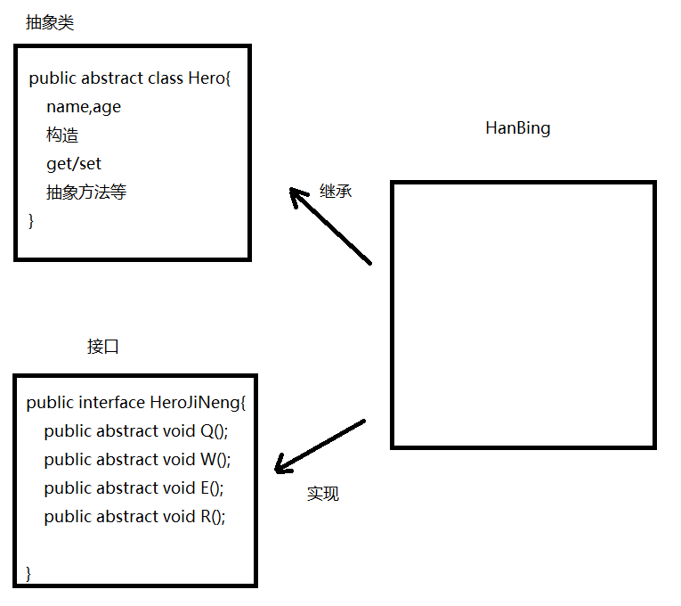

### 接口与抽象类如何选择

#### 适用场景不同


```java 
1. 抽象类和接口虽然在代码角度都能达到同样的效果，但适用场景不同：

1.1.抽象类主要适用于公共代码的提取。当多个类中有共同的属性和方法时，为了达到代码的复用，建议为这几个类提取出来一个父类，在该父类中编写公共的代码。如果有一些方法无法在该类中实现，可以延迟到子类中实现。这样的类就应该使用抽象类。

1.2.接口主要用于功能的扩展。例如有很多类，一些类需要这个方法，另外一些类不需要这个方法时，可以将该方法定义到接口中。需要这个方法的类就去实现这个接口，不需要这个方法的就可以不实现这个接口。接口主要规定的是行为。
```

#### 练一练：

> **定义一个`动物类Animal`，`属性`包括`name，age`。`方法`包括`display()，eat()`。`display()`方法可以有`具体的实现`，`显示动物的基本信息`。但因为`不同的动物会有不同的吃的方式`，因此`eat()方法`应该定义为`抽象方法`，`延迟给子类来实现`。**
>
> ```java
> package com.powernode.javase.oop33;
> 
> public abstract class Animal {
>     private String name;
> 
>     private int age;
> 
>     public Animal() {
>     }
> 
>     public Animal(String name, int age) {
>         this.name = name;
>         this.age = age;
>     }
> 
>     public String getName() {
>         return name;
>     }
> 
>     public void setName(String name) {
>         this.name = name;
>     }
> 
>     public int getAge() {
>         return age;
>     }
> 
>     public void setAge(int age) {
>         this.age = age;
>     }
> 
>     public void display() {
>         System.out.println("动物的名字：" + this.getName() + "，动物的年龄：" + this.getAge());
>     }
> 
>     /**
>      * 抽象方法
>      */
>     public abstract void eat();
> }
> ```

> **定义`多个子类`，例如：`XiaoYanZi`、`Dog`、`YingWu`。分别`继承Animal`，实现`eat()方法`。**
>
> ```java
> package com.powernode.javase.oop33;
> 
> public class XiaoYanZi extends Animal implements Flyable {
> 
>     public XiaoYanZi() {
> 
>     }
> 
>     public XiaoYanZi(String name, int age) {
>         super(name, age);
>     }
> 
>     @Override
>     public void eat() {
>         System.out.println(this.getName() + "正在吃虫子");
>     }
> 
>     @Override
>     public void fly() {
>         System.out.println(this.getName() + "在飞翔！");
>     }
> }
> ```
>
> ```java
> package com.powernode.javase.oop33;
> 
> public class Dog extends Animal {
> 
>     public Dog(){
> 
>     }
> 
>     public Dog(String name,int age){
>         super(name,age);
>     }
> 
>     @Override
>     public void eat() {
>         System.out.println(this.getName() + "正在啃骨头");
>     }
> }
> ```
>
> ```java
> package com.powernode.javase.oop33;
> 
> /**
>  * java语言中，一个类单继承另一个类，可以同时实现多个接口。
>  * extends在前。implements在后。
>  */
> public class YingWu extends Animal implements Flyable,Speakable {
> 
>     public YingWu() {
> 
>     }
> 
>     public YingWu(String name, int age) {
>         super(name, age);
>     }
> 
>     @Override
>     public void eat() {
>         System.out.println(this.getName() + "在吃爆米花");
>     }
> 
>     @Override
>     public void fly() {
>         System.out.println(this.getName() + "在飞翔！");
>     }
> 
>     @Override
>     public void speak() {
>         System.out.println(this.getName() + "在说话！");
>     }
> }
> ```

> **不是所有的动物`都会飞`，其中只有`XiaoYanZi和YingWu会飞`，请定义一个`Flyable`接口，接口中定义`fly()`方法。让`XiaoYanZi和YingWu都能飞`。**
>
> ```java
> package com.powernode.javase.oop33;
> 
> public interface Flyable {
>     void fly();
> }
> ```

> **不是所有的动物`都会说话`，其中只有`YingWu会说话`，请定义一个`Speakable`接口，接口中定义`speak()`方法。让`YingWu会说话`。**
>
> ```java
> package com.powernode.javase.oop33;
> 
> public interface Speakable {
>     void speak();
> }
> ```

> **编写测试程序，创建各个动物对象，调用`display()`方法，`eat()`方法，`能飞的`动物`让它飞`，`能说话`的动物`让它说话`。**
>
> ```java
> package com.powernode.javase.oop33;
> 
> public class Test {
>     public static void main(String[] args) {
>         // 创建小燕子对象
>         // XiaoYanZi xiaoYanZi = new XiaoYanZi("小燕子",1);
>         Animal xiaoYanZi = new XiaoYanZi("小燕子",1);
>         xiaoYanZi.display();
>         xiaoYanZi.eat();
> 
> 
>         // 会飞的让它飞，会说话的让它说话
>         //xiaoYanZi.fly();
>         if(xiaoYanZi instanceof  Flyable){
>             Flyable f = (Flyable)xiaoYanZi;
>             f.fly();
>         }
>         if(xiaoYanZi instanceof Speakable){
>             // 向下转型，类也可以转换成接口。
>             // 并且java中有语法规定：类 转换成 接口的时候，类和接口之间不需要有继承关系，编译器也不会报错。
>             Speakable s = (Speakable)xiaoYanZi;
>             s.speak();
>         }
> 
>         // 创建狗对象
>         Dog dog = new Dog("狗狗", 1);
>         dog.display();
>         dog.eat();
> 
>         //ClassCastException
>         //Flyable f = (Flyable)dog;
> 
>         // 会飞的让它飞，会说话的让它说话
>         if(dog instanceof Flyable){
>             // Dog类和Flyable接口之间在代码上没有任何继承关系。
>             // 但是编译器也让通过了。说明类向下转型为某种接口类型时，不需要有继承关系，编译器也能通过。
>             Flyable f = (Flyable)dog;
>             f.fly();
>         }
> 
>         if(dog instanceof Speakable){
>             Speakable s = (Speakable)dog;
>             s.speak();
>         }
> 
>         // 创建鹦鹉对象
>         YingWu yingWu = new YingWu("鹦鹉", 1);
>         yingWu.display();
>         yingWu.eat();
> 
>         // 会飞的让它飞，会说话的让它说话
>         yingWu.fly();
>         yingWu.speak();
>     }
> }
> ```

> **测试结果:**
>
> 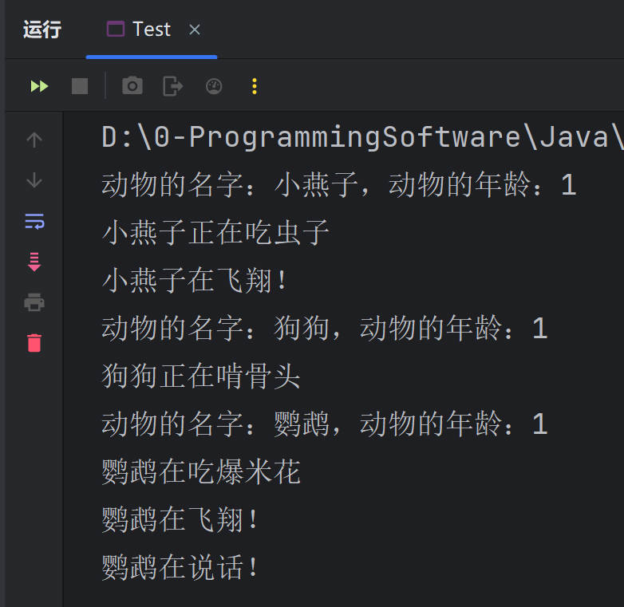

> 1. **注意：一个类继承某个类的同时可以实现多个接口：class 类 extends 父类 implements 接口A,接口B{}**
>
> 2. **注意：当某种类型向下转型为某个接口类型时，接口类型和该类之间可以没有继承关系，编译器不会报错的。**

### 练一练

假设你正在编写一个游戏，其中有一些怪物和英雄，并且它们都可以进行战斗。具体来说，每个角色都有自己的名字、生命值、攻击力和防御力，并且可以进行攻击和防御等操作。

请按照以下步骤设计一个程序：

> **创建一个 `Character` 接口，它具有 `getName()`、`getHealth()`、`getAttack()`、`getDefense()`、`attack()` 和 `defense()` 六个方法，分别用于获取角色的名字、生命值、攻击力、防御力，以及进行攻击和防御操作。**
>
> ```java
> package com.powernode.javase.oop34;
> 
> /**
>  * 角色接口
>  */
> public interface Character {
>     /**
>      * 获取角色名字
>      * @return
>      */
>     String getName();
> 
>     /**
>      * 获取生命值
>      * @return
>      */
>     int getHealth();
> 
>     /**
>      * 获取攻击力
>      * @return
>      */
>     int getAttack();
> 
>     /**
>      * 获取防御力
>      * @return
>      */
>     int getDefense();
> 
>     /**
>      * 攻击另一个角色
>      * @param character 被攻击的对象。
>      */
>     void attack(Character character);
> 
>     /**
>      * 防御另一个角色的攻击
>      * @param character 被防御的对象。
>      */
>     void defense(Character character);
> }
> ```

> **创建一个 `Monster` 接口，它继承自 `Character` 接口，具有一个 `getReward()` 方法，返回这个怪物打败后可以获得的奖励。**
>
> ```java
> package com.powernode.javase.oop34;
> 
> /**
>  * 怪物接口
>  */
> public interface Monster extends Character {
>     /**
>      * 获取奖励
>      * @return
>      */
>     int getReward();
> }
> ```

> **创建一个英雄类 `Hero`，它实现了 `Character` 接口，具有名字、生命值、攻击力和防御力属性。它的 `attack()` 和 `defense()` 方法用于进行攻击和防御操作，根据对手的攻击力和自己的防御力计算生命值，并输出攻击和防御的结果。**
>
> ```java
> package com.powernode.javase.oop34;
> 
> /**
>  * 英雄类
>  */
> public class Hero implements Character {
> 
>     /**
>      * 名字
>      */
>     private String name;
>     /**
>      * 生命力
>      */
>     private int health;
>     /**
>      * 攻击力
>      */
>     private int attack;
>     /**
>      * 防御力
>      */
>     private int defense;
> 
>     public Hero() {
>     }
> 
>     public Hero(String name, int health, int attack, int defence) {
>         this.name = name;
>         this.health = health;
>         this.attack = attack;
>         this.defense = defense;
>     }
> 
>     @Override
>     public String getName() {
>         return name;
>     }
> 
>     public void setName(String name) {
>         this.name = name;
>     }
> 
>     @Override
>     public int getHealth() {
>         return health;
>     }
> 
>     public void setHealth(int health) {
>         this.health = health;
>     }
> 
>     @Override
>     public int getAttack() {
>         return attack;
>     }
> 
>     @Override
>     public int getDefense() {
>         return 0;
>     }
> 
>     public void setAttack(int attack) {
>         this.attack = attack;
>     }
> 
>     public int getDefence() {
>         return defense;
>     }
> 
>     public void setDefense(int defense) {
>         this.defense = defense;
>     }
> 
>     /**
>      * 英雄向怪物发起了攻击，攻击力3，怪物进行了防御，防御力1，怪物受到2点伤害，当前怪物的生命值x
>      * 英雄向怪物发起了攻击，攻击力3，怪物进行了防御，防御力1，怪物受到2点伤害，怪物挂了，英雄得到100金币的奖励
>      * 英雄向怪物发起了攻击，攻击力3，怪物进行了防御，防御力3，怪物没有受到任何伤害
>      * 英雄向怪物发起了攻击，攻击力3，怪物进行了防御，防御力1，怪物受到2点伤害，当前怪物的生命值x，怪物愤怒了，怪物攻击力翻倍
>      *
>      * @param character 被攻击的对象。
>      */
>     @Override
>     public void attack(Character character) {
>         // 英雄进行了攻击
>         System.out.print(this.getName() + "向" + character.getName() + "发起了攻击，攻击力" + this.getAttack()
>                 + "，怪物进行了防御，防御力" + character.getDefense() + "，");
>         // 怪物进行了防御
>         character.defense(this);
>     }
> 
>     @Override
>     public void defense(Character character) {
> 
>     }
> }
> ```

> **创建一个怪物类 `MonsterImpl`，它实现了 `Monster` 接口，具有名字、生命值、攻击力、防御力和奖励属性。它的 `attack()` 和 `defense()` 方法同样根据对手的攻击力和自己的防御力计算生命值，并输出攻击和防御的结果。同时，如果自己的生命值降到一定程度以下，就会发动愤怒效果，攻击力翻倍。**
>
> ```java
> package com.powernode.javase.oop34;
> 
> /**
>  * 怪物类
>  */
> public class MonsterImpl implements Monster {
> 
>     private String name;
>     private int health;
>     private int attack;
>     private int defense;
>     private int reward;
> 
>     public MonsterImpl() {
>     }
> 
>     public MonsterImpl(String name, int health, int defense, int attack, int reward) {
>         this.name = name;
>         this.health = health;
>         this.defense = defense;
>         this.attack = attack;
>         this.reward = reward;
>     }
> 
>     @Override
>     public String getName() {
>         return name;
>     }
> 
>     public void setName(String name) {
>         this.name = name;
>     }
> 
>     @Override
>     public int getHealth() {
>         return health;
>     }
> 
>     public void setHealth(int health) {
>         this.health = health;
>     }
> 
>     @Override
>     public int getAttack() {
>         return attack;
>     }
> 
>     public void setAttack(int attack) {
>         this.attack = attack;
>     }
> 
>     @Override
>     public int getDefense() {
>         return defense;
>     }
> 
> 
> 
>     public void setDefense(int defense) {
>         this.defense = defense;
>     }
> 
>     @Override
>     public int getReward() {
>         return reward;
>     }
> 
>     public void setReward(int reward) {
>         this.reward = reward;
>     }
> 
>     @Override
>     public void attack(Character character) {
> 
>     }
> 
>     /**
>      * 英雄向怪物发起了攻击，攻击力3，怪物进行了防御，防御力1，怪物受到2点伤害，当前怪物的生命值x
>      * 英雄向怪物发起了攻击，攻击力3，怪物进行了防御，防御力1，怪物受到2点伤害，怪物挂了，英雄得到100金币的奖励
>      * 英雄向怪物发起了攻击，攻击力3，怪物进行了防御，防御力3，怪物没有受到任何伤害
>      * 英雄向怪物发起了攻击，攻击力3，怪物进行了防御，防御力1，怪物受到2点伤害，当前怪物的生命值x，怪物愤怒了，怪物攻击力翻倍
>      * @param character 被防御的对象。
>      */
>     @Override
>     public void defense(Character character) {
>         // 获取伤害值
>         int damage = character.getAttack() - this.getDefense();
>         // 设置怪兽的生命值
>         this.setHealth(this.getHealth() - damage);
>         System.out.print("怪物受到"+ damage +"点伤害，");
>         if(this.getHealth() <= 0) {
>             System.out.println("怪物挂了，英雄得到" + this.getReward() + "金币的奖励");
>         }else if(damage <= 0){
>             System.out.println("怪物没有受到任何伤害");
>         }else{
>             System.out.print("当前怪物的生命值" + this.getHealth());
>             if(this.getHealth() < 3){
>                 System.out.print("，怪物愤怒了，怪物攻击力翻倍");
>                 this.attack *= 2;
>             }
>             System.out.println();
>         }
>     }
> }
> ```

> **创建一些具体的英雄和怪物对象，例如一位攻击力为 5，防御力为 4，生命值为 10，叫做“剑士”的英雄，以及一个攻击力为 3，防御力为 3，生命值为 20，奖励为 150 金币，叫做“骷髅王”的怪物。**
>
> ```java
> // 创建一个英雄对象
> Hero hero = new Hero("剑士", 10, 5, 4);
> // 创建一个怪物对象
> MonsterImpl monster = new MonsterImpl("骷髅王",20,3,3,150);
> ```

> **最后，编写一个 `Main` 类，创建一些角色对象，模拟一些战斗场景，并演示攻击和防御的效果。**
>
> ```java
> package com.powernode.javase.oop34;
> 
> public class Test {
>     public static void main(String[] args) {
>         // 创建一个英雄对象
>         Hero hero = new Hero("剑士", 10, 5, 4);
>         // 创建一个怪物对象
>         MonsterImpl monster = new MonsterImpl("骷髅王",20,3,3,150);
> 
>         hero.attack(monster);
>         hero.attack(monster);
>         hero.attack(monster);
>         hero.attack(monster);
>         hero.attack(monster);
>         hero.attack(monster);
>         hero.attack(monster);
>         hero.attack(monster);
>         hero.attack(monster);
> 
>         monster.attack(hero);
>     }
> }
> ```

> **测试结果:**
>
> 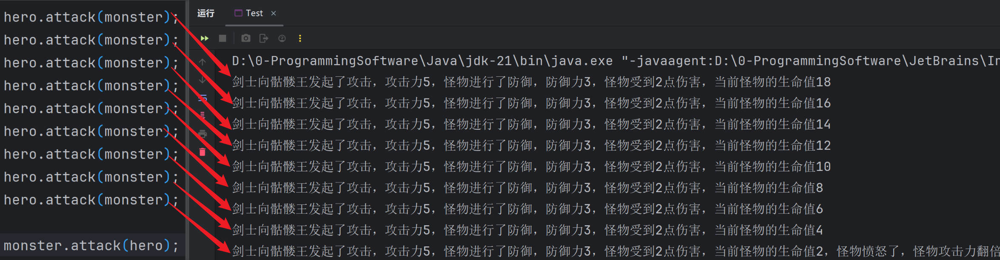

## 类之间关系

### UML

①**`UML`（Unified Modeling Language，统一建模语言）是一种用于`面向对象软件开发`的图形化的建模语言。它由`Grady Booch、James Rumbaugh和Ivar Jacobson`等三位著名的软件工程师所开发，并于1997年正式发布。`UML提供了一套通用的图形化符号和规范`，帮助开发人员以图形化的形式表达软件设计和编写的所有关键方面，从而更好地展示`软件系统的设计和实现过程`。**

②**`UML`是一种`图形化的语言`，类似于现实生活中`建筑工程师`画的`建筑图纸`，图纸上有特定的`符号代表特殊的含义`。**

③**`UML`不是`专门为java语言准备的`。只要是`面向对象的编程语言`，开发前的设计，都需要画UML图进行系统设计。（设计模式、软件开发七大原则等同样也不是只为java语言准备的。）**

④**UML图包括**：

> **类图（Class Diagram）：描述软件系统中的`类、接口、关系和其属性`等；**
>
> 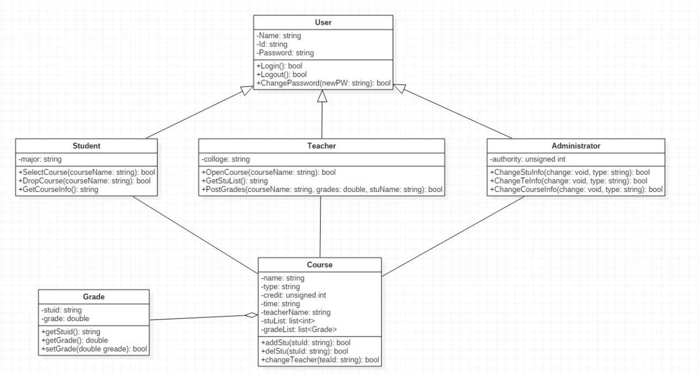


> **用例图（Use Case Diagram）：描述系统的`功能需求`和`用户与系统之间`的关系；**
>
> 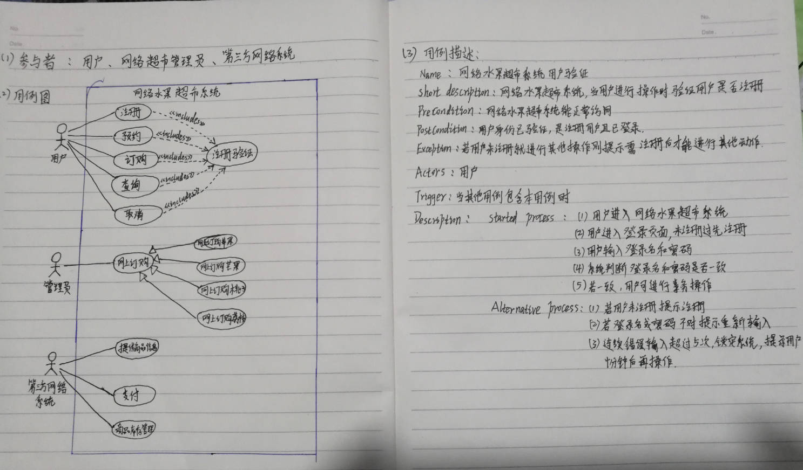

> **序列图（Sequence Diagram）：描述`对象之间`的`交互、消息传递和时序约束`等；**
>
> 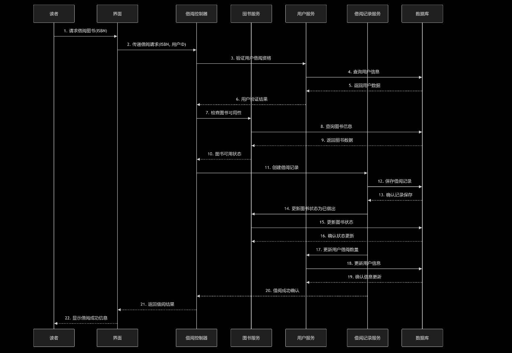

> **状态图（Statechart Diagram）：描述`类或对象`的`生命周期以及状态之间`的`转换`；**
>
> 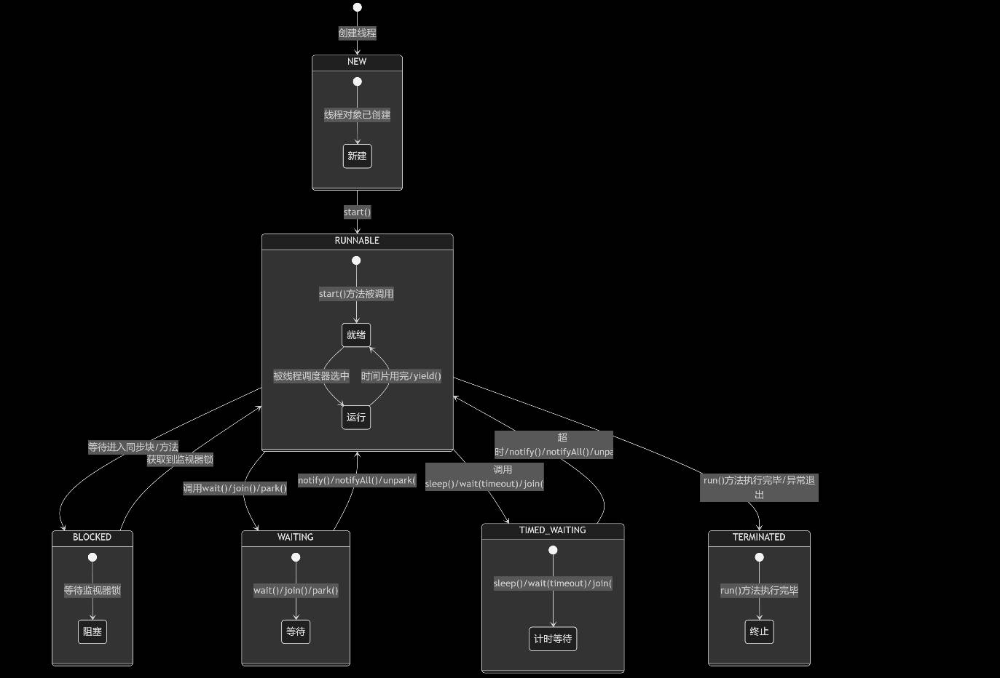

> **对象图（Object Diagram）：表示特定时间的系统状态，并显示其包含的对象及其属性；**

> **协作图（Collaboration Diagram）：描述对象之间的协作，表示对象之间相互合作来完成任务的关系；**

> **活动图（Activity Diagram）：描述系统的动态行为和流程，包括控制流和对象流；**

> **部署图（Deployment Diagram）：描述软件或系统在不同物理设备上部署的情况，包括计算机、网络、中间件、应用程序等。**

常见的UML建模工具有：StarUML，Rational Rose等。

### 类之间的关系

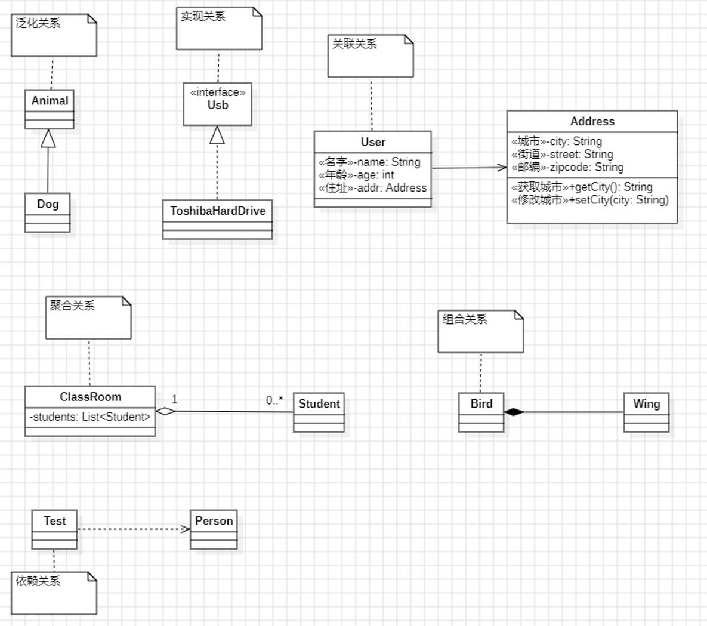

1. **泛化关系（is a）(继承关系 Cat is a Animal)**

   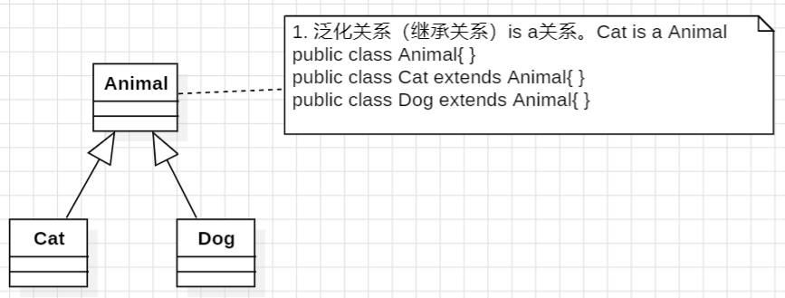

2. **实现关系（is like a）(接口实现 HardDrive implement Usb)**

   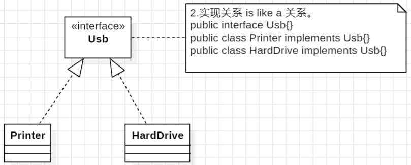

3. **关联关系（has a）**

   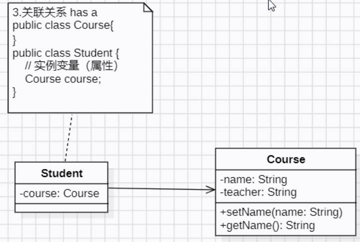

4. **聚合关系**

**聚合关系指的是`一个类包含、合成或者拥有另一个类的实例`，而这个`实例是可以独立存在的`。聚合关系是一种弱关联关系，表示`整体与部分`之间的关系。例如`一个教室有多个学生`**

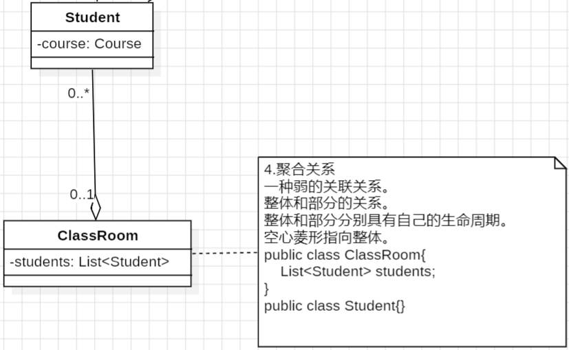

5. **组合关系（Composition）**

**组合关系是聚合关系的一种特殊情况，表示`整体与部分之间`的关系更加强烈。组合关系指的是`一个类包含、合成或者拥有另一个类的实例`，而这个实例`只能同时存在于一个整体对象中`。如果`整体对象被销毁`，那么`部分对象也会被销毁`。例如`一个人对应四个肢体`。**

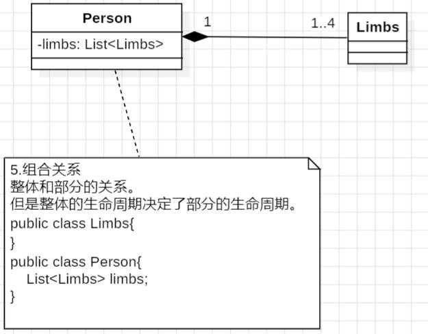

6. **依赖关系（Dependency）**

**依赖关系是一种临时性的关系，当`一个类使用另一个类的功能`时，就会产生依赖关系。如果`一个类的改变`会`影响`到`另一个类的功能`，那么这两个类之间就`存在依赖关系`。依赖关系是一种较弱的关系，可以存在`多个依赖于同一个类的对象`。例如`A类中使用了B类`，但是`B类作为A类的方法参数或者局部变量`等。**

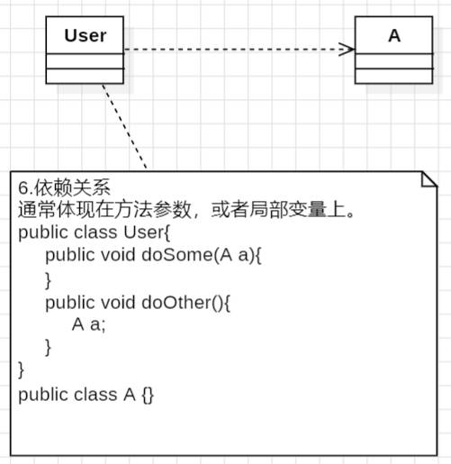

## 访问控制权限

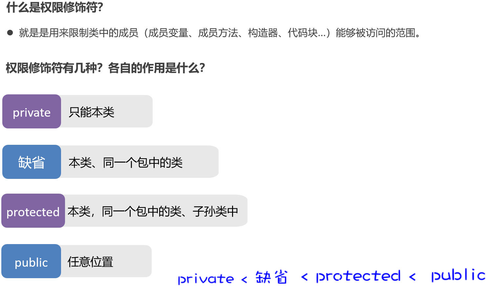

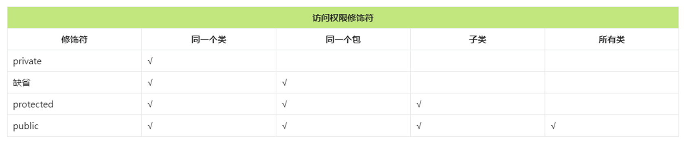

> **`private < 缺省 < protected < public`(按权限的高低，从左到右，权限逐级递增)**

> ① **private：私有的，只能在本类中访问。**
>
> 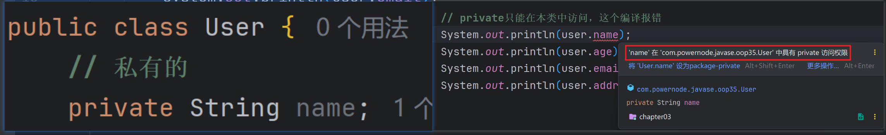

> ② **缺省：默认的，同一个包下可以访问。**
>
> 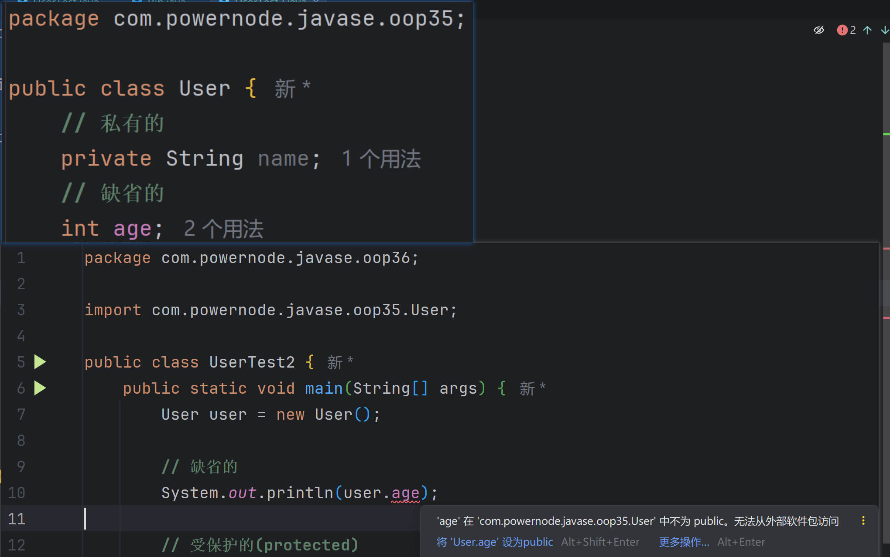

> ③ **protected：受保护的，子类中可以访问。（受保护的通常就是给`子孙用`的。）**
>
> 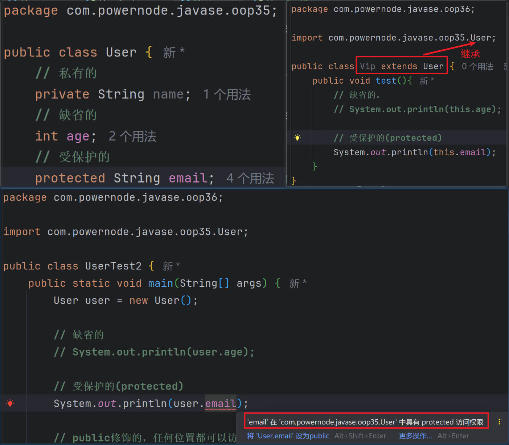

> ④ **public：公共的，在任何位置都可以访问。**
>
> 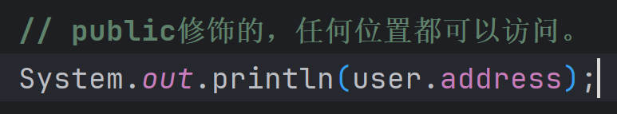

### 总结

> ①**类中的属性和方法访问权限共有四种：private、缺省、protected和public。**
>
> 
>
> ②**类的访问权限只有两种：public和 缺省。**
>
> 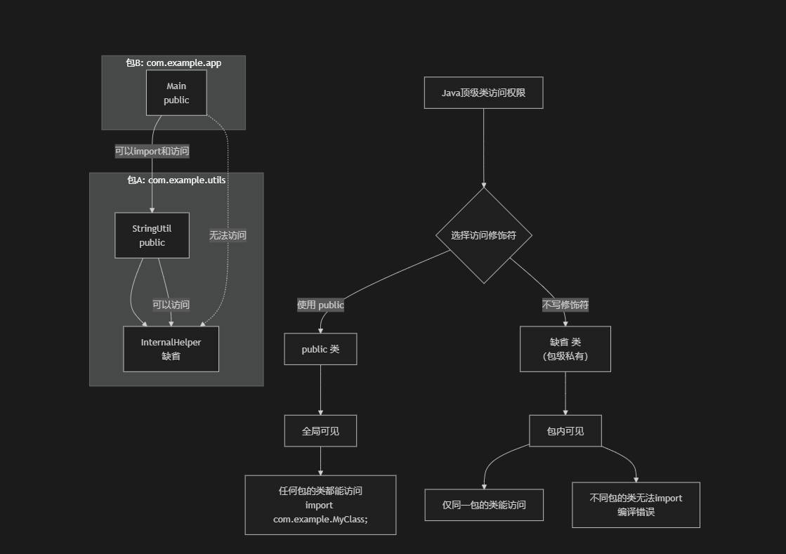
>
> ③**访问权限控制符`不能修饰局部变量`。**
>
> 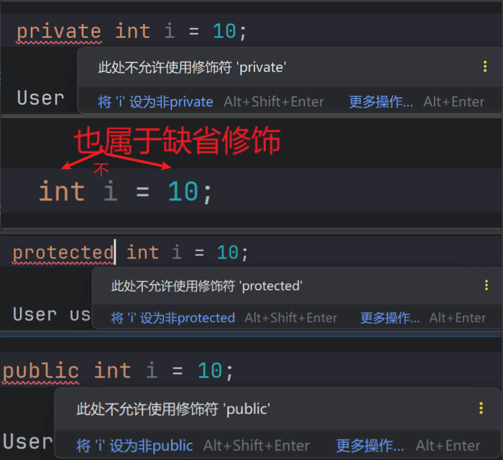

## Object类

1. java.lang.Object是所有类的超类。java中所有类都实现了这个类中的方法。

2. Object类是我们学习JDK类库的第一个类。通过这个类的学习要求掌握会查阅API帮助文档。

3. 现阶段Object类中需要掌握的方法：

+ **toString：将java对象转换成字符串。**

```java
Object类中的toString()方法：

1. Object类设计toString()方法的目的是什么？
     这个方法的作用是：将java对象转换成字符串的表示形式。

2. Object类中toString()方法的默认实现是怎样的？
    public String toString() {
        return getClass().getName() + "@" + Integer.toHexString(hashCode());
    }
     默认实现是：完整类名 + @ + 十六进制的数字
     这个输出结果可以等同看做一个java对象的内存地址。
```

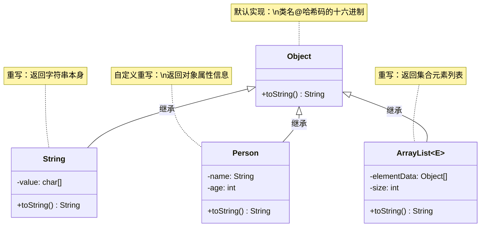
```mermaid
classDiagram
    class Object {
        +toString() String
    }
    
    class String {
        -value: char[]
        +toString() String
    }
    
    class Person {
        -name: String
        -age: int
        +toString() String
    }
    
    class ArrayList~E~ {
        -elementData: Object[]
        -size: int
        +toString() String
    }
    
    Object <|-- String : 继承
    Object <|-- Person : 继承
    Object <|-- ArrayList : 继承
    
    note for Object "默认实现：\n类名@哈希码的十六进制"
    note for String "重写：返回字符串本身"
    note for Person "自定义重写：\n返回对象属性信息"
    note for ArrayList "重写：返回集合元素列表"
```

> **应用示例:**

```java
// Object类的默认toString实现
public class Object {
    public String toString() {
        return getClass().getName() + "@" + Integer.toHexString(hashCode());
    }
}

// String类重写toString
public class String {
    public String toString() {
        return this; // 返回字符串本身
    }
}

// 自定义类重写toString
public class Person {
    private String name;
    private int age;
    
    @Override
    public String toString() {
        return "Person{name='" + name + "', age=" + age + "}";
    }
}

// ArrayList重写toString
public class ArrayList<E> {
    @Override
    public String toString() {
        // 返回格式：[element1, element2, ...]
    }
}
```

```java
Object obj = new Object();
System.out.println(obj.toString()); 
// 输出：java.lang.Object@1b6d3586

String str = "Hello";
System.out.println(str.toString()); 
// 输出：Hello

Person person = new Person("张三", 25);
System.out.println(person.toString()); 
// 输出：Person{name='张三', age=25}

List<String> list = Arrays.asList("A", "B", "C");
System.out.println(list.toString()); 
// 输出：[A, B, C]
```

> **例1-自定义`家庭住址类`**

```java
package com.powernode.javase.oop37;

/**
 * 家庭住址类
 */
public class Address {
    private String city;

    private String street;

    private String zipcode;

    public Address() {
    }

    public Address(String city, String street, String zipcode) {
        this.city = city;
        this.street = street;
        this.zipcode = zipcode;
    }

    public String getCity() {
        return city;
    }

    public void setCity(String city) {
        this.city = city;
    }

    public String getStreet() {
        return street;
    }

    public void setStreet(String street) {
        this.street = street;
    }

    public String getZipcode() {
        return zipcode;
    }

    public void setZipcode(String zipcode) {
        this.zipcode = zipcode;
    }

    @Override
    public String toString() {
        return "城市："+ this.city +"，街道："+ this.street +"，邮编：" + this.zipcode;
    }
}
```

> **重写 `toString `方法**
>
> 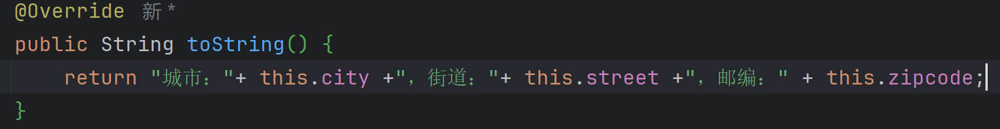

```java
package com.powernode.javase.oop37;

public class AddressTest {
    public static void main(String[] args) {
        Address addr =  new Address("北京", "朝阳", "1111111");
        // Address重写toString()方法之前：com.powernode.javase.oop37.Address@2f4d3709
        // Address重写toString()方法之后：城市：北京，街道：朝阳，邮编：1111111
        System.out.println(addr);
    }
}
```

> **测试结果:**
>
> 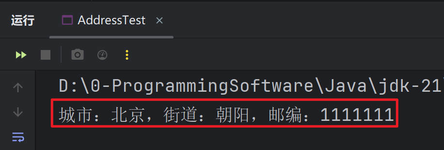

> **例2-自定义`日期类`**

```java
package com.powernode.javase.oop37;

/**
 * 自定义的日期类
 */
public class Date {
    private int year;

    private int month;

    private int day;

    public Date() {
        this(1970,1,1);
    }

    public Date(int year, int month, int day) {
        this.year = year;
        this.month = month;
        this.day = day;
    }

    public int getYear() {
        return year;
    }

    public void setYear(int year) {
        this.year = year;
    }

    public int getMonth() {
        return month;
    }

    public void setMonth(int month) {
        this.month = month;
    }

    public int getDay() {
        return day;
    }

    public void setDay(int day) {
        this.day = day;
    }

    @Override
    public  String toString() {
        return this.year + "年" + this.month + "月" + this.day + "日";
    }

    /*@Override
    public boolean equals(Object obj) {
        //d1.equals(d2)
        //this就是d1 obj就是d2
        if(obj == null) return false;
        // 能走到这里说明obj一定不是null
        if(this == obj) return true;
        // 两个对象的内存地址是不同的。
        if(obj instanceof Date){
            // this中的年月日
            int year1 = this.year;
            int month1 = this.month;
            int day1 = this.day;
            // obj中的年月日
            Date d = (Date) obj;
            int year2 = d.year;
            int month2 = d.month;
            int day2 = d.day;
            if(year1 == year2 && month1 == month2 && day1 == day2) {
                return true;
            }
        }
        return false;
    }*/

    @Override
    public boolean equals(Object obj) {
        if(obj == null) return false;
        if(this == obj) return true;
        if(obj instanceof Date){
            Date d = (Date) obj;
            return this.year == d.year && this.month == d.month && this.day == d.day;
        }
        return false;
    }
}
```

> **重写 `toString `方法**
>
> 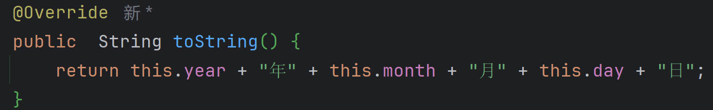

```java
package com.powernode.javase.oop37;

/**
 * Object类中的toString()方法：
 *
 * 1. Object类设计toString()方法的目的是什么？
 *      这个方法的作用是：将java对象转换成字符串的表示形式。
 *
 * 2. Object类中toString()方法的默认实现是怎样的？
 *     public String toString() {
 *         return getClass().getName() + "@" + Integer.toHexString(hashCode());
 *     }
 *     默认实现是：完整类名 + @ + 十六进制的数字
 *     这个输出结果可以等同看做一个java对象的内存地址。
 */
public class DateTest {
    public static void main(String[] args) {
        DateTest dateTest = new DateTest();
        String s = dateTest.toString();
        System.out.println(s); // com.powernode.javase.oop37.DateTest@b4c966a

        Date d = new Date();
        String s1 = d.toString();
        // Date重写toString()方法之前：com.powernode.javase.oop37.Date@4e50df2e
        // Date重写toString()方法之后：1970年1月1日
        System.out.println(s1); // com.powernode.javase.oop37.Date@4e50df2e

        Date d2 = new Date(2008,8,8);
        String s2 = d2.toString();
        System.out.println(s2);

        Date d3 = new Date(2008,5,12);
        // 当println()输出的是一个引用的时候，会自动调用“引用.toString()”
        System.out.println(d3); // 2008年5月12日
        System.out.println(d3.toString()); // 2008年5月12日

        DateTest dt2 = new DateTest();
        System.out.println(dt2); // com.powernode.javase.oop37.DateTest@1e80bfe8

        Date d4 = null;
        System.out.println(d4); // "null"
        //System.out.println(d4.toString()); // 空指针异常。

        System.out.println(d4 == null ? "null" : d4.toString());
    }
}
```

> **测试结果:**
>
> 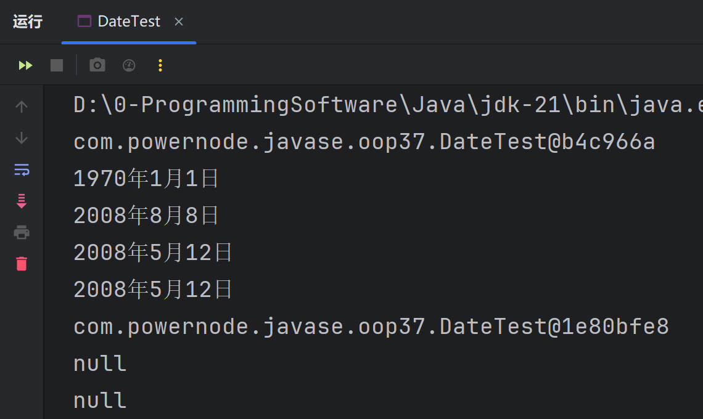

+ **equals：判断两个对象是否相等。**

```java
Object类中的equals方法：
    
1. Object类设计equals方法的作用是什么？目的是什么？
      equals方法的作用是：判断两个对象是否相等。
      equals方法的返回值是true/false
      true代表两个对象相等。
      false代表两个对象不相等。

2. Object类中对equals方法的默认实现是怎样的？
     public boolean equals(Object obj) {
         return (this == obj);
     }
     a.equals(b) 表面是a和b的比较。实际上方法体当中是：this和obj的比较。

3. 关于 == 运算符的运算规则：
      == 永远只有一个运算规则，永远比较的是变量中保存的值之间的比较。
      只不过有的时候这个值是基本数据类型。有的时候这个值是对象的内存地址。

4. equals方法为什么要重写？
      因为Object类中的equals方法在进行比较的时候，比较的是两个java对象的内存地址。
      我们希望比较的是对象的内容。只要对象的内容相等，则认为是相同的。
```

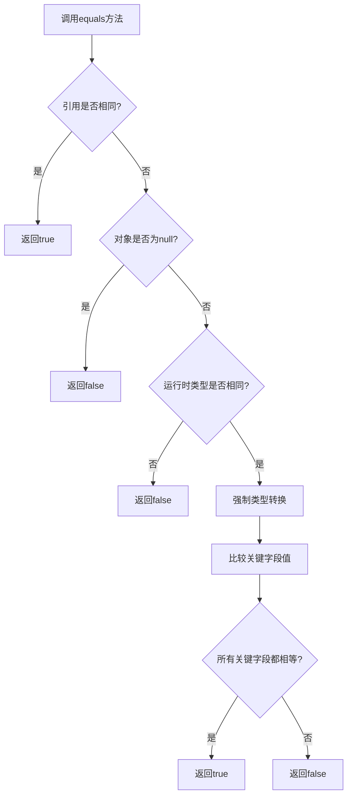
```mermaid
flowchart TD
    A[调用equals方法] --> B{引用是否相同?}
    B -->|是| C[返回true]
    B -->|否| D{对象是否为null?}
    D -->|是| E[返回false]
    D -->|否| F{运行时类型是否相同?}
    F -->|否| G[返回false]
    F -->|是| H[强制类型转换]
    H --> I[比较关键字段值]
    I --> J{所有关键字段都相等?}
    J -->|是| K[返回true]
    J -->|否| L[返回false]
```

> **例1-自定义`日期类`**

```java
package com.powernode.javase.oop37;

/**
 * 自定义的日期类
 */
public class Date {
    private int year;

    private int month;

    private int day;

    public Date() {
        this(1970,1,1);
    }

    public Date(int year, int month, int day) {
        this.year = year;
        this.month = month;
        this.day = day;
    }

    public int getYear() {
        return year;
    }

    public void setYear(int year) {
        this.year = year;
    }

    public int getMonth() {
        return month;
    }

    public void setMonth(int month) {
        this.month = month;
    }

    public int getDay() {
        return day;
    }

    public void setDay(int day) {
        this.day = day;
    }

    @Override
    public  String toString() {
        return this.year + "年" + this.month + "月" + this.day + "日";
    }

    /*@Override
    public boolean equals(Object obj) {
        //d1.equals(d2)
        //this就是d1 obj就是d2
        if(obj == null) return false;
        // 能走到这里说明obj一定不是null
        if(this == obj) return true;
        // 两个对象的内存地址是不同的。
        if(obj instanceof Date){
            // this中的年月日
            int year1 = this.year;
            int month1 = this.month;
            int day1 = this.day;
            // obj中的年月日
            Date d = (Date) obj;
            int year2 = d.year;
            int month2 = d.month;
            int day2 = d.day;
            if(year1 == year2 && month1 == month2 && day1 == day2) {
                return true;
            }
        }
        return false;
    }*/

    @Override
    public boolean equals(Object obj) {
        if(obj == null) return false;
        if(this == obj) return true;
        if(obj instanceof Date){
            Date d = (Date) obj;
            return this.year == d.year && this.month == d.month && this.day == d.day;
        }
        return false;
    }
}
```

> **重写 `equals `方法**
>
> 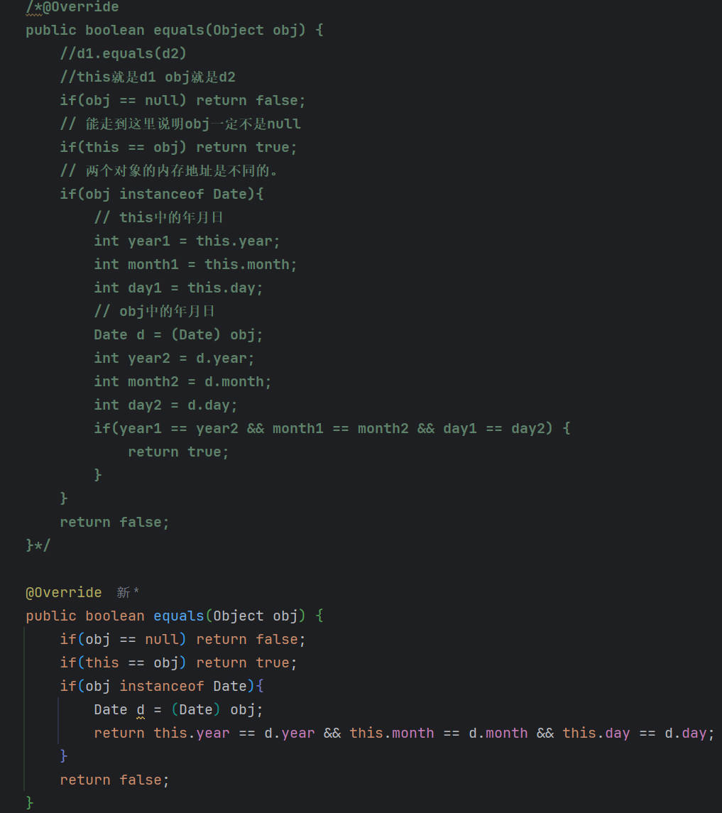

```java
package com.powernode.javase.oop37;

/**
 * Object类中的equals方法：
 *
 * 1. Object类设计equals方法的作用是什么？目的是什么？
 *      equals方法的作用是：判断两个对象是否相等。
 *      equals方法的返回值是true/false
 *      true代表两个对象相等。
 *      false代表两个对象不相等。
 *
 * 2. Object类中对equals方法的默认实现是怎样的？
 *      public boolean equals(Object obj) {
 *         return (this == obj);
 *     }
 *     a.equals(b) 表面是a和b的比较。实际上方法体当中是：this和obj的比较。
 *
 * 3. 关于 == 运算符的运算规则：
 *      == 永远只有一个运算规则，永远比较的是变量中保存的值之间的比较。
 *      只不过有的时候这个值是基本数据类型。有的时候这个值是对象的内存地址。
 *
 * 4. equals方法为什么要重写？
 *      因为Object类中的equals方法在进行比较的时候，比较的是两个java对象的内存地址。
 *      我们希望比较的是对象的内容。只要对象的内容相等，则认为是相同的。
 */
public class DateTest2 {
    public static void main(String[] args) {
        // ==
        int a = 10;
        int b = 20;
        System.out.println(a==b);// == 运算规则：比较两个变量中保存的值是否相等。
        int c = 20;
        System.out.println(a==c);// false

        Object obj1 = new Object();
        Object obj2 = new Object();
        System.out.println(obj1==obj2);// false

        Date d1 = new Date(2008,8,8);
        Date d2 = new Date(2008,8,8);
        
        System.out.println(d1==d2);// false

        // Date在重写equals方法之前：false
        // Date在重写equals方法之后：true
        System.out.println(d1.equals(d2));

        Date d3 = new Date(2008,8,9);
        System.out.println(d1.equals(d3)); // false
    }
}
```

> **测试结果:**
>
> 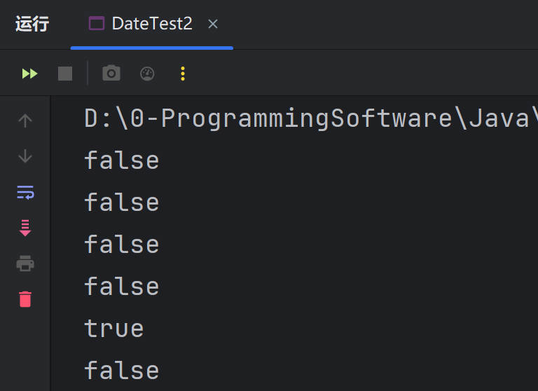

> **例2-自定义`用户类`和`家庭住址类`**

```java
package com.powernode.javase.oop38;

/**
* 用户类
*/
public class User {
    /**
     * 姓名
     */
    private String name;
    /**
     * 家庭住址
     */
    private Address addr;

    public User() {
    }

    public User(String name, Address addr) {
        this.name = name;
        this.addr = addr;
    }

    public String getName() {
        return name;
    }

    public void setName(String name) {
        this.name = name;
    }

    public Address getAddr() {
        return addr;
    }

    public void setAddr(Address addr) {
        this.addr = addr;
    }

    @Override
    public String toString() {
        return "User{" +
                "name='" + name + '\'' +
                ", addr=" + addr +
                '}';
    }

    @Override
    public boolean equals(Object obj) {
        // u.equals(u2)
        // this就是u  obj就是u2
        if (obj == null) return false;
        if (this == obj) return true;
        if(obj instanceof User){
            User user = (User)obj;
            if (this.name.equals(user.name) && this.addr.equals(user.addr)){
                return true;
            }
        }
        return false;
    }
}
```

> **重写 `toString`和`equals `方法**
>
> 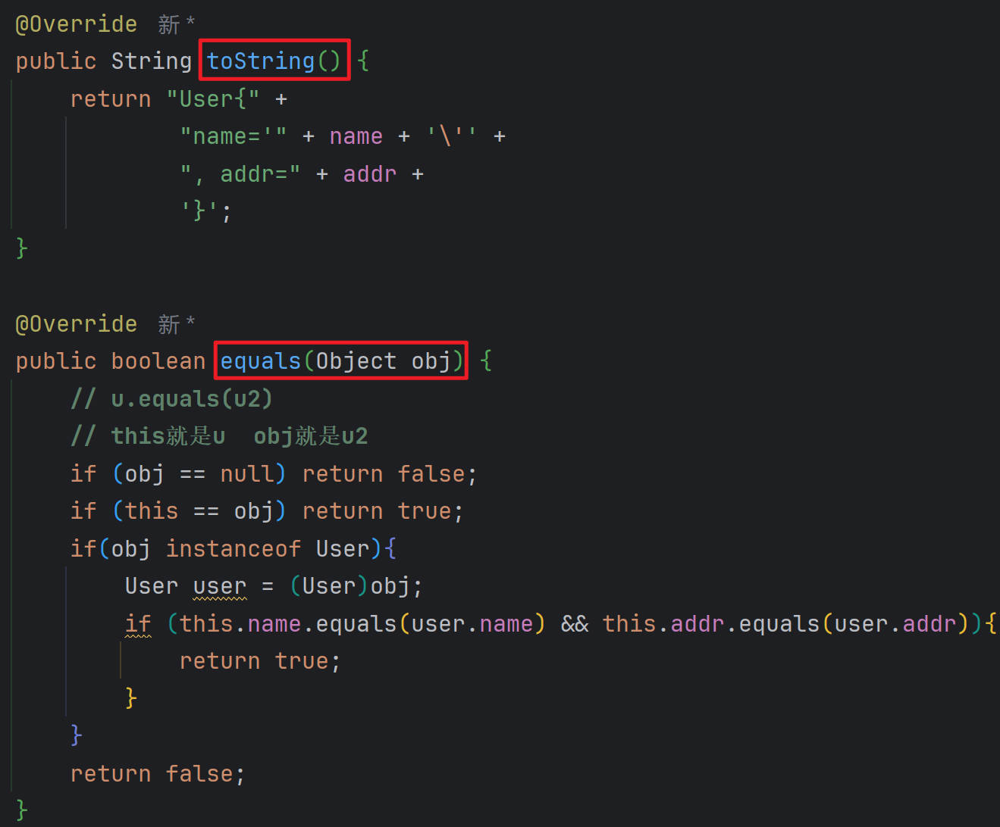

```java
package com.powernode.javase.oop38;

/**
* 家庭住址类
*/
public class Address {
    private String city;

    private String street;

    public Address() {
    }

    public Address(String city, String street) {
        this.city = city;
        this.street = street;
    }

    public String getCity() {
        return city;
    }

    public void setCity(String city) {
        this.city = city;
    }

    public String getStreet() {
        return street;
    }

    public void setStreet(String street) {
        this.street = street;
    }

    @Override
    public String toString() {
        return "Address{" +
                "city='" + city + '\'' +
                ", street='" + street + '\'' +
                '}';
    }

    @Override
    public boolean equals(Object obj) {
        if(obj == null) return false;
        if(this == obj) return true;
        if(obj instanceof Address){
            Address a = (Address)obj;
            return this.city.equals(a.city) && this.street.equals(a.street);
        }
        return false;
    }
}
```

> **重写 `toString`和`equals `方法**
>
> 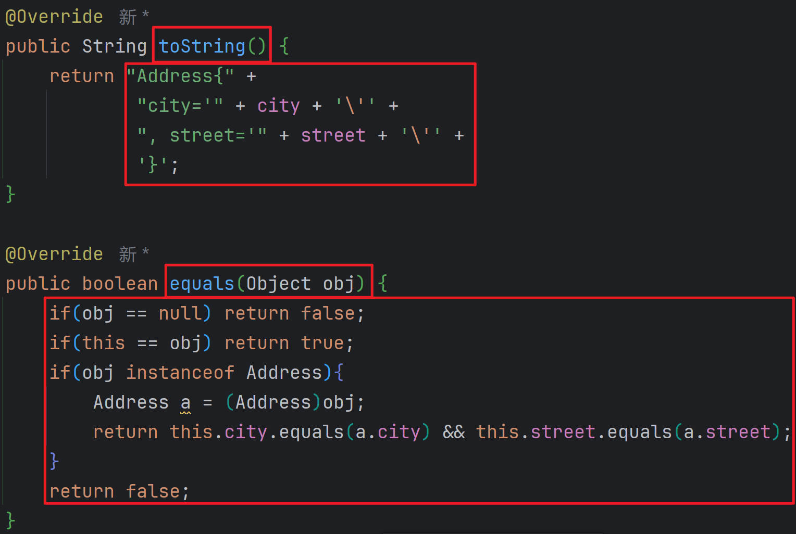

```java
package com.powernode.javase.oop38;

/**
 * equals方法重写需要“彻底”重写。
 */
public class Test {
    public static void main(String[] args) {
        // 创建家庭住址对象
        Address a = new Address("北京","大兴");
        System.out.println(a);// Address{city='北京', street='大兴'}

        // 创建用户对象
        User u = new User("张三",a);
        System.out.println(u);// User{name='张三', addr=Address{city='北京', street='大兴'}}

        // 创建家庭住址对象2
        Address a2 = new Address("北京","大兴");

        // 创建用户对象2
        User u2 = new User("张三",a2);

        // 只要人名一样，家庭住址一样，我就认为是同一个人。
        System.out.println(u.equals(u2));// false
    }
}
```

> **测试结果:**
>
> 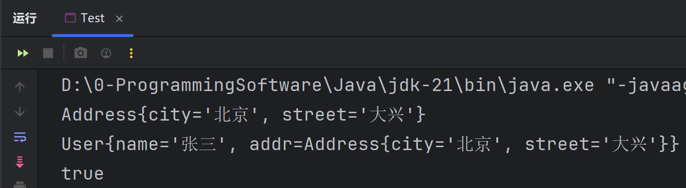

```java
package com.powernode.javase.oop38;

/**
 * 字符串的比较不能使用 ==，必须使用equals方法进行比较。
 * 字符串String类型已经重写了equals方法。
 */
public class Test2 {
    public static void main(String[] args) {
        String s1 = new String("hello");
        String s2 = new String("hello");

        // 比较两个字符串是否相等，不能使用 ==
        System.out.println(s1 == s2); // false

        // 比较两个字符串是否相等，应该调用equals方法
        System.out.println(s1.equals(s2));

        // String有没有重写toString()方法？已经重写了。
        String s3 = new String("动力节点");
        s3.toString();
        System.out.println(s3); // 如果String没有重写toString()方法，结果应该是：java.lang.String@十六进制的数字。
    }
}
```

> **测试结果:**
>
> 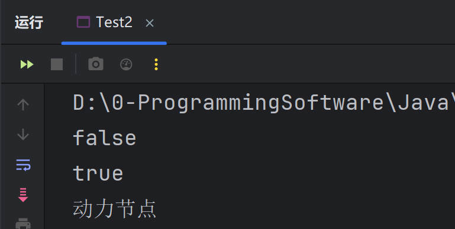

4. 现阶段Object类中需要了解的方法：

+ **hashCode：返回`一个对象`的`哈希值`，通常作为在`哈希表`中`查找该对象`的`键值`。Object类的默认实现是`根据对象的内存地址生成一个哈希码`（即`将对象的内存地址`转换为`整数作为哈希值`）。`hashCode()方法`是为了`HashMap、Hashtable、HashSet`等集合类进行优化而设置的，以便更快地查找和存储对象。**

  ```java
  1.关于Object类的hashCode()方法：
       hashCode：返回一个对象的哈希值，通常作为在哈希表中查找该对象的键值。
       Object类的默认实现是根据对象的内存地址生成一个哈希码（即将对象的内存地址转换为整数作为哈希值）。
  hashCode()方法是为了HashMap、Hashtable、HashSet等集合类进行优化而设置的，以便更快地查找和存储对象
  
  2.hashCode()方法在Object类中的默认实现：
           public native int hashCode();
           这是一个本地方法，底层调用了C++写的动态链接库程序：xxx.dll
  ```

  ```mermaid
  flowchart TD
      A[创建对象] --> B[调用hashCode方法]
      B --> C{native实现}
      C --> D[默认返回内存地址相关值]
      D --> E[用于哈希表存储]
  ```

  

  ```java
  package com.powernode.javase.oop39;
  
  /**
   * 关于Object类的hashCode()方法：
   *      hashCode：返回一个对象的哈希值，通常作为在哈希表中查找该对象的键值。
   *      Object类的默认实现是根据对象的内存地址生成一个哈希码（即将对象的内存地址转换为整数作为哈希值）。
   *      hashCode()方法是为了HashMap、Hashtable、HashSet等集合类进行优化而设置的，以便更快地查找和存储对象
   *
   *      hashCode()方法在Object类中的默认实现：
   *          public native int hashCode();
   *          这是一个本地方法，底层调用了C++写的动态链接库程序：xxx.dll
   */
  public class Test01 {
      public static void main(String[] args) {
          Test01 t = new Test01();
  
          int i = t.hashCode();
  
          System.out.println(i);// 189568618
  
          Test01 t1 = new Test01();
  
          int i1 = t1.hashCode();
  
          System.out.println(i1);// 793589513
  
          System.out.println(new Object().hashCode());
          System.out.println(new Object().hashCode());
          System.out.println(new Object().hashCode());
          System.out.println(new Object().hashCode());
          System.out.println(new Object().hashCode());
          System.out.println(new Object().hashCode());
      }
  }
  ```

  > **测试结果:**
  >
  > 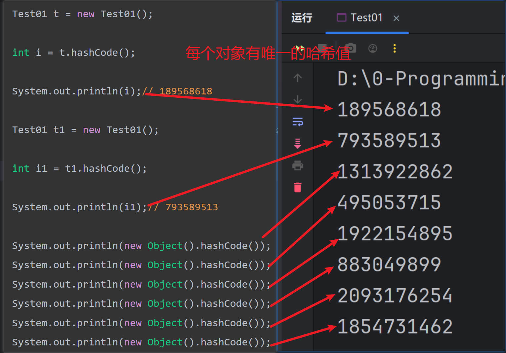

+ **finalize：当java对象被回收时，由`GC自动调用被回收对象`的`finalize方法`，通常在该方法中完成`销毁前的准备`。**

  ```java
  关于Object类中的finalize()方法：
      finalize：当java对象被回收时，由GC自动调用被回收对象的finalize方法，通常在该方法中完成销毁前的准备
      
      从Java9开始，这个方法被标记已过时，不建议使用。作为了解。
  
      在Object类中是这样实现的：很显然，这个方法是需要子类重写的。
          protected void finalize() throws Throwable { }
  ```

  ```mermaid
  flowchart TD
      A[对象变成垃圾] --> B{重写了finalize?}
      B -->|是| C[放入队列等待执行]
      B -->|否| D[直接回收]
      
      C --> E[执行finalize方法]
      E --> F{对象复活?}
      F -->|是| G[对象恢复使用]
      F -->|否| H[最终回收]
      
      G --> I[再次变成垃圾] --> D
  ```

  ```java
  package com.powernode.javase.oop39;
  
  public class Person {
  
      @Override
      protected void finalize() throws Throwable {
          System.out.println(this + "即将被回收");
      }
  }
  ```

  > **重写finalize方法**
  >
  > 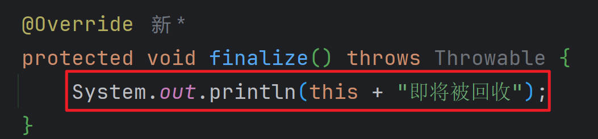

  ```java
  package com.powernode.javase.oop39;
  
  /**
   * 关于Object类中的finalize()方法：
   *      finalize：当java对象被回收时，由GC自动调用被回收对象的finalize方法，通常在该方法中完成销毁前的准备
   *      从Java9开始，这个方法被标记已过时，不建议使用。作为了解。
   *
   *      在Object类中是这样实现的：很显然，这个方法是需要子类重写的。
   *          protected void finalize() throws Throwable { }
   *
   */
  public class Test02 {
      public static void main(String[] args) {
          for(int i = 0; i < 10000000; i++) {
              Person p1 = new Person();
              p1 = null;
  
              // 建议启动垃圾回收器（这只是建议启动垃圾回收器）
              if(i % 1000 == 0){
                  System.gc();
              }
          }
      }
  }
  ```

  >**启动GC垃圾回收器**
  >
  >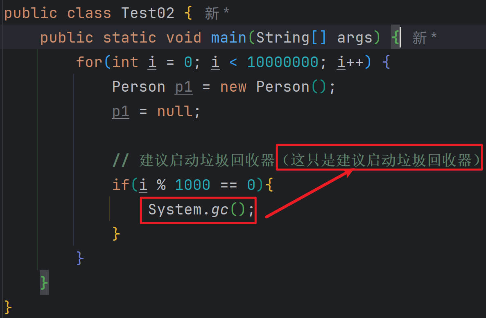

> **测试结果:**
>
> 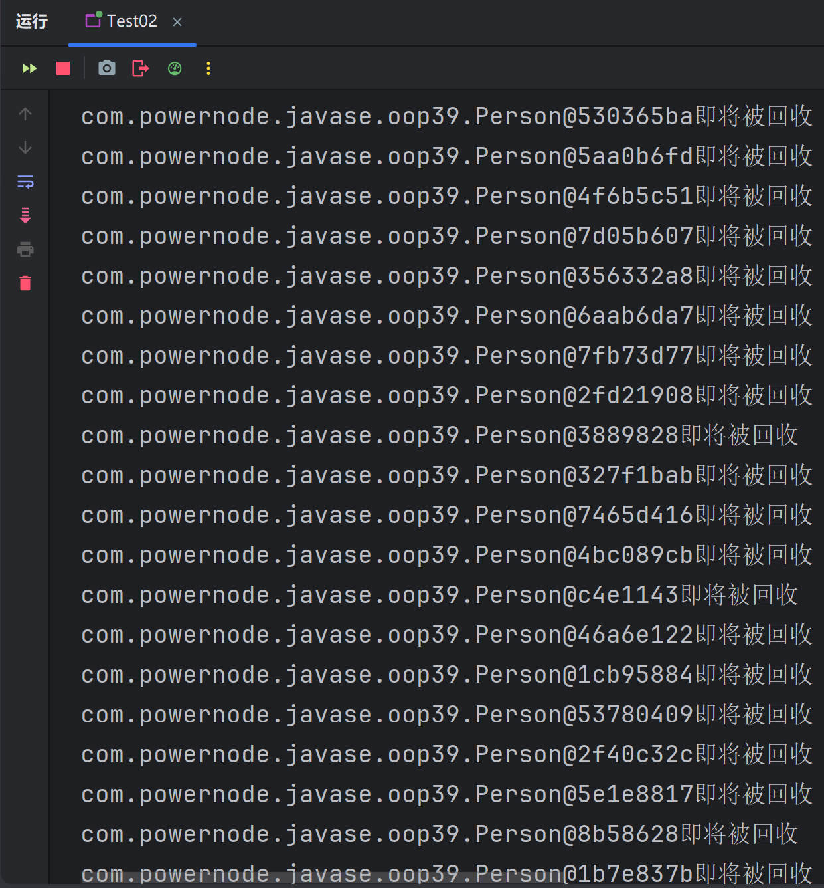

+ **clone：对象的拷贝。（浅拷贝，深拷贝）**

  ```java
  
  关于Object类中的clone()方法：
  
  1. clone方法作用：对象拷贝。通常在开发中需要保护原对象数据结构。通常复制一份，生成一个新对象，对新对象进行操作。
  
  2. Object类中的默认实现：
        protected native Object clone() throws CloneNotSupportedException;
        受保护的方法，专门给子类使用的。
        本地方法。
        底层调用C++程序已经可以完成对象的创建了。
        我们现在要解决的问题是：怎么调用这个方法。
  
  3. 怎么解决clone()方法的调用问题？
       在子类中重写该clone()方法。
       为了保证clone()方法在任何位置都可以调用，建议将其修饰符修改为：public
  
  4. 凡事参加克隆的对象，必须实现一个标志接口：java.lang.Cloneable
       java中接口包括两大类：
           一类是：起到标志的作用，标志型接口。
           另一类是：普通接口。
  ```

  ```mermaid
  graph LR
  %% 浅克隆
  A[原始Person对象] --> B[Address对象]
  C[克隆Person对象] --> B
  
  %% 深克隆  
  D[原始Person对象] --> E[Address对象 A]
  F[克隆Person对象] --> G[Address对象 B]
  
  H[浅克隆: 共享Address] --> I[修改会影响双方]
  J[深克隆: 独立Address] --> K[修改互不影响]
  ```
  
  > **浅克隆(浅拷贝):浅克隆`只复制对象本身`，而`不复制`对象内部包含的`引用类型字段所指向的对象`。克隆对象和原始对象`共享引用类型字段指向的同一个对象`。**
  >
  > **实现原理:**
  >
  > ```java
  > class Person implements Cloneable {
  >     private String name;
  >     private int age;
  >     private Address address;  // 引用类型字段
  >     
  >     // 浅克隆实现
  >     @Override
  >     public Person clone() {
  >         try {
  >             return (Person) super.clone();  // 只复制当前对象
  >         } catch (CloneNotSupportedException e) {
  >             throw new AssertionError();
  >         }
  >     }
  > }
  > ```
  >
  > **内存结构:**
  >
  > ```mermaid
  > graph TD
  >     A[原始Person对象] --> B[堆内存地址: 0x100]
  >     C[克隆Person对象] --> D[堆内存地址: 0x200]
  >     
  >     B --> E[name: String<br>age: int]
  >     D --> F[name: String副本<br>age: int副本]
  >     
  >     B --> G[address: 引用地址 0x300]
  >     D --> H[address: 引用地址 0x300]
  >     
  >     G --> I[Address对象<br>堆内存地址: 0x300]
  >     H --> I
  >     
  >     style I fill:#f9f,stroke:#333,stroke-width:2px
  > ```
  >
  > **特点:**
  >
  > - ✅ **基本类型字段**：完全复制值
  > - ✅ **String类型字段**：由于String的不可变性，表现类似深克隆
  > - ❌ **引用类型字段**：只复制引用，不复制实际对象
  > - ❌ **共享问题**：克隆对象和原始对象共享引用类型数据
  > - ❌ **副作用**：修改共享对象会影响双方
  >
  > **测试结果:**
  >
  > ```java
  > class Address {
  >     public String city;
  >     public Address(String city) { this.city = city; }
  > }
  > 
  > class Person implements Cloneable {
  >     public String name;
  >     public Address address;
  >     
  >     @Override
  >     public Person clone() throws CloneNotSupportedException {
  >         return (Person) super.clone();  // 浅克隆
  >     }
  > }
  > 
  > // 测试浅克隆
  > Person original = new Person();
  > original.name = "张三";
  > original.address = new Address("北京");
  > 
  > Person shallowCopy = original.clone();
  > 
  > // 测试效果
  > System.out.println(original.address.city);  // 输出：北京
  > System.out.println(shallowCopy.address.city); // 输出：北京
  > 
  > // 修改克隆对象的address
  > shallowCopy.address.city = "上海";
  > 
  > System.out.println(original.address.city);  // 输出：上海 ← 原始对象也被影响了！
  > System.out.println(shallowCopy.address.city); // 输出：上海
  > ```
  
  > **例子1:**
  
  ```java
  package com.powernode.javase.oop40;
  
  public class User implements Cloneable {
      private  int age;
  
      public User() {
      }
  
      public User(int age) {
          this.age = age;
      }
  
      public int getAge() {
          return age;
      }
  
      public void setAge(int age) {
          this.age = age;
      }
  
      @Override
      public String toString() {
          return "User{" +
                  "age=" + age +
                  '}';
      }
  
      @Override
      public Object clone() throws CloneNotSupportedException {
          return super.clone();
      }
  
      /*public void test() throws CloneNotSupportedException {
          this.clone();
      }*/
  }
  ```
  
  > **重写 `toString`和`clone `方法**
  >
  > 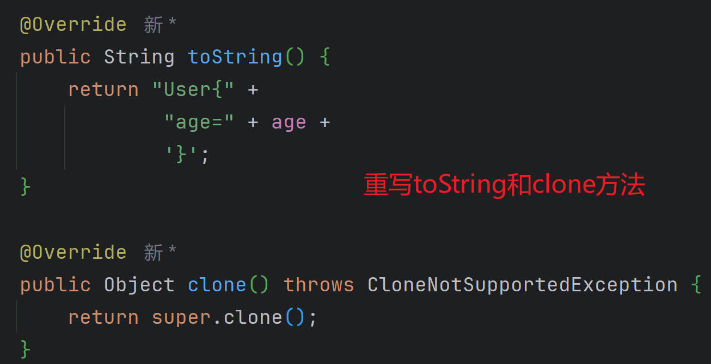
  
  ```java
  package com.powernode.javase.oop40;
  
  public class UserTest {
      public  static void main(String[] args) throws CloneNotSupportedException {
          // 创建User对象
          User user = new User(20);
          System.out.println(user);
  
          // 克隆一个user对象
          // 报错原因：因为Object类中的clone()方法是protected修饰的。
          // protected修饰的只能在：本类，同包，子类中访问。
          // 但是以下这行代码不满足以上所说条件。
          // 这是一种浅克隆/浅拷贝。
          Object obj = user.clone();
          System.out.println(user);
  
          // 修改克隆之后的对象的age属性
          User copyUser = (User) obj;
          copyUser.setAge(100);
          System.out.println("克隆之后的新对象的年龄" + copyUser.getAge());
          
          System.out.println("原始对象的年龄" + user.getAge());
      }
  }
  ```
  
  > **测试结果:**
  >
  > 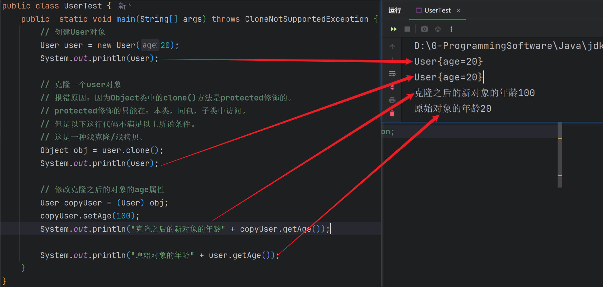
  
  > **例子2:**
  >
  > 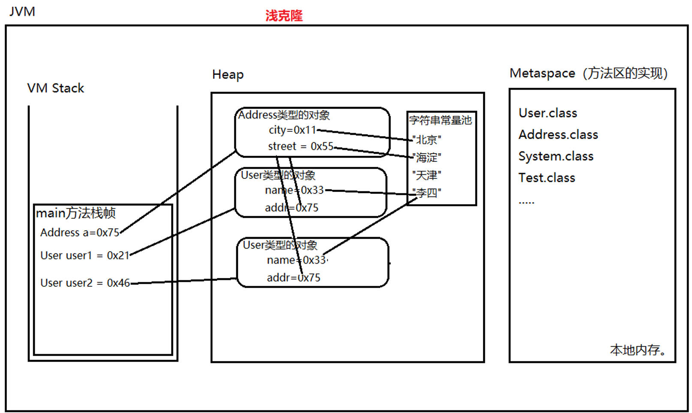
  
  ```java
  package com.powernode.javase.oop41;
  
  public class User implements Cloneable {
      private String name;
  
      private Address addr;
  
      public User() {
      }
  
      public User(String name, Address addr) {
          this.name = name;
          this.addr = addr;
      }
  
      public String getName() {
          return name;
      }
  
      public void setName(String name) {
          this.name = name;
      }
  
      public Address getAddr() {
          return addr;
      }
  
      public void setAddr(Address addr) {
          this.addr = addr;
      }
  
      @Override
      public String toString() {
          return "User{" +
                  "name='" + name + '\'' +
                  ", addr=" + addr +
                  '}';
      }
  
      @Override
      public Object clone() throws CloneNotSupportedException {
          return super.clone();
      }
  }
  ```
  
  > **重写 `toString`和`clone `方法**
  >
  > 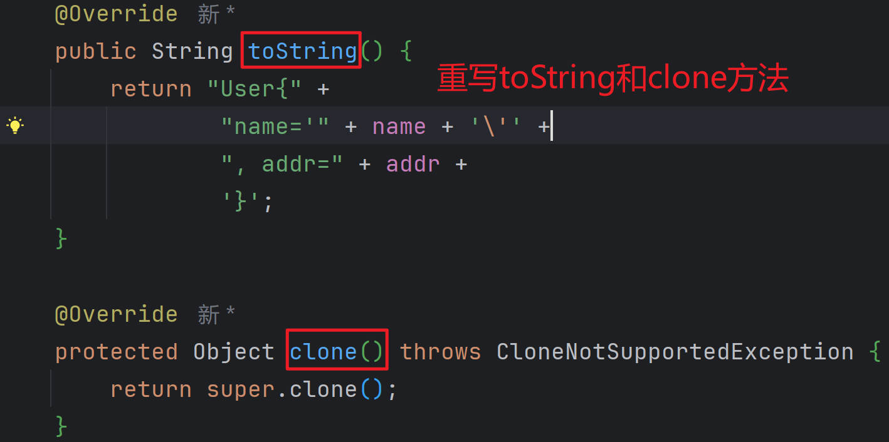
  
  ```java
  package com.powernode.javase.oop41;
  
  public class Address implements Cloneable {
      private String city;
  
      private String street;
  
      @Override
      public Object clone() throws CloneNotSupportedException {
          return super.clone();
      }
  
      @Override
      public String toString() {
          return "Address{" +
                  "city='" + city + '\'' +
                  ", street='" + street + '\'' +
                  '}';
      }
  
      public Address() {
      }
  
      public Address(String city, String street) {
          this.city = city;
          this.street = street;
      }
  
      public String getCity() {
          return city;
      }
  
      public void setCity(String city) {
          this.city = city;
      }
  
      public String getStreet() {
          return street;
      }
  
      public void setStreet(String street) {
          this.street = street;
      }
  }
  ```
  
  > **重写 `toString`和`clone `方法**
  >
  > 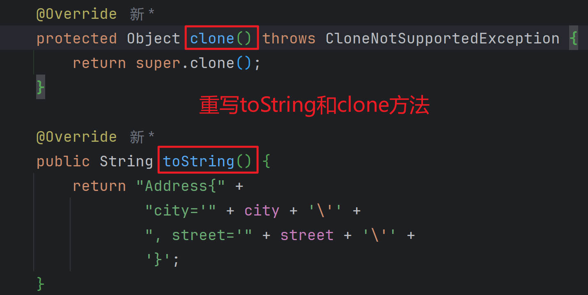
  
  ```java
  package com.powernode.javase.oop41;
  
  public class Test {
      public static void main(String[] args) throws CloneNotSupportedException {
          // 创建住址对象
          Address a = new Address("北京","海淀");
          // 创建User对象
          User user1 = new User("李四",a);
  
          // 克隆一个User对象
          User user2 = (User)user1.clone();
  
          System.out.println(user1);
          System.out.println(user2);
  
          user2.getAddr().setCity("天津");
          System.out.println("===================================");
  
          System.out.println(user1);
          System.out.println(user2);
      }
  }
  ```
  
  > **测试结果:**
  >
  > 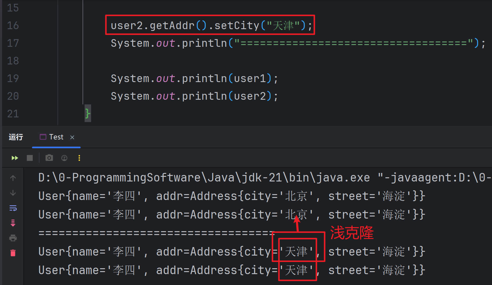
  
  
  
    > **深克隆(深拷贝):深克隆会递归复制`对象本身以及所有引用类型字段`指向的对象，创建一个`完全独立的对象图`。**
    >
    > **实现原理:**
    >
    > ```java
    > class Person implements Cloneable {
    >  private String name;
    >  private int age;
    >  private Address address;
    > 
    >  // 深克隆实现
    >  @Override
    >  public Person clone() {
    >      try {
    >          Person cloned = (Person) super.clone();
    >          cloned.address = this.address.clone();  // 递归克隆引用对象
    >          return cloned;
    >      } catch (CloneNotSupportedException e) {
    >          throw new AssertionError();
    >      }
    >  }
    > }
    > 
    > class Address implements Cloneable {
    >  private String city;
    > 
    >  @Override
    >  public Address clone() {
    >      try {
    >          return (Address) super.clone();
    >      } catch (CloneNotSupportedException e) {
    >          throw new AssertionError();
    >      }
    >  }
    > }
    > ```
    >
    > **内存结构:**
    >
    > ```mermaid
    > graph TD
    >  A[原始Person对象] --> B[堆内存地址: 0x100]
    >  C[克隆Person对象] --> D[堆内存地址: 0x200]
    > 
    >  B --> E[name: String<br>age: int]
    >  D --> F[name: String副本<br>age: int副本]
    > 
    >  B --> G[address: 引用地址 0x300]
    >  D --> H[address: 引用地址 0x400]
    > 
    >  G --> I[Address对象 A<br>堆内存地址: 0x300]
    >  H --> J[Address对象 B<br>堆内存地址: 0x400]
    > 
    >  style I fill:#9f9,stroke:#333,stroke-width:2px
    >  style J fill:#9f9,stroke:#333,stroke-width:2px
    > ```
    >
    > **特点:**
    >
    > - ✅ **基本类型字段**：完全复制值
    > - ✅ **引用类型字段**：递归复制所有关联对象
    > - ✅ **完全独立**：克隆对象和原始对象完全隔离
    > - ✅ **无副作用**：修改任何一方都不会影响另一方
    > - ⚠️ **实现复杂**：需要递归处理所有引用类型字段
    > - ⚠️ **性能开销**：复制整个对象图，性能较低
    >
    > **测试结果:**
    >
    > ```java
    > class Address implements Cloneable {
    >     public String city;
    >     public Address(String city) { this.city = city; }
    > 
    >     @Override
    >     public Address clone() throws CloneNotSupportedException {
    >         return (Address) super.clone();
    >     }
    > }
    > 
    > class Person implements Cloneable {
    >     public String name;
    >     public Address address;
    > 
    >     @Override
    >     public Person clone() throws CloneNotSupportedException {
    >         Person cloned = (Person) super.clone();
    >         cloned.address = this.address.clone();  // 深克隆关键步骤
    >         return cloned;
    >     }
    > }
    > 
    > // 测试深克隆
    > Person original = new Person();
    > original.name = "张三";
    > original.address = new Address("北京");
    > 
    > Person deepCopy = original.clone();
    > 
    > // 测试效果
    > System.out.println(original.address.city);  // 输出：北京
    > System.out.println(deepCopy.address.city);  // 输出：北京
    > 
    > // 修改克隆对象的address
    > deepCopy.address.city = "上海";
    > 
    > System.out.println(original.address.city);  // 输出：北京 ← 原始对象不受影响！
    > System.out.println(deepCopy.address.city);  // 输出：上海
    > ```
  
  >  **深克隆:**
  >
  > 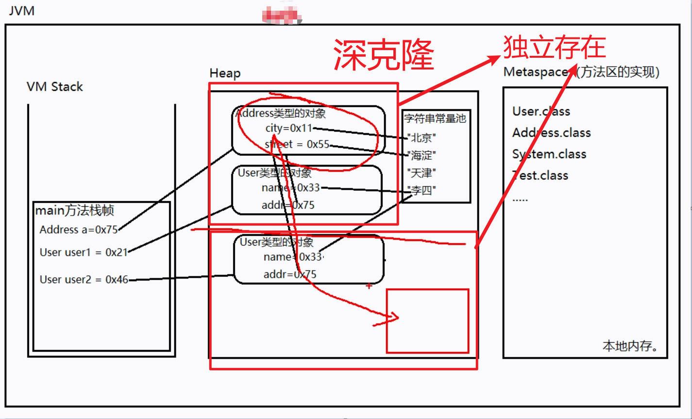
  
  ```java
  package com.powernode.javase.oop41;
  
  public class User implements Cloneable {
      private String name;
  
      private Address addr;
  
      public User() {
      }
  
      public User(String name, Address addr) {
          this.name = name;
          this.addr = addr;
      }
  
      public String getName() {
          return name;
      }
  
      public void setName(String name) {
          this.name = name;
      }
  
      public Address getAddr() {
          return addr;
      }
  
      public void setAddr(Address addr) {
          this.addr = addr;
      }
  
      @Override
      public String toString() {
          return "User{" +
                  "name='" + name + '\'' +
                  ", addr=" + addr +
                  '}';
      }
  
      @Override
      public Object clone() throws CloneNotSupportedException {
          // 重写方法，让其达到深克隆的效果。
          // User要克隆，User对象关联的Address对象也需要克隆一份。
          Address copyAddr = (Address)this.getAddr().clone();
  
          User copyUser = (User)super.clone();
          copyUser.setAddr(copyAddr);
          return copyUser;
      }
  }
  ```
  
  > **重写 `clone `方法**
  >
  > 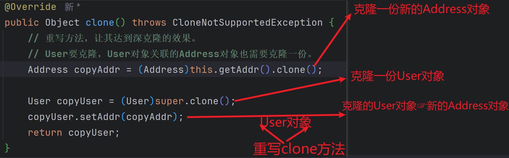
  
  ```java
  package com.powernode.javase.oop41;
  
  public class Address implements Cloneable {
      private String city;
  
      private String street;
  
      @Override
      public Object clone() throws CloneNotSupportedException {
          return super.clone();
      }
  
      @Override
      public String toString() {
          return "Address{" +
                  "city='" + city + '\'' +
                  ", street='" + street + '\'' +
                  '}';
      }
  
      public Address() {
      }
  
      public Address(String city, String street) {
          this.city = city;
          this.street = street;
      }
  
      public String getCity() {
          return city;
      }
  
      public void setCity(String city) {
          this.city = city;
      }
  
      public String getStreet() {
          return street;
      }
  
      public void setStreet(String street) {
          this.street = street;
      }
  }
  ```
  
  ```java
  package com.powernode.javase.oop41;
  
  public class Test {
      public static void main(String[] args) throws CloneNotSupportedException {
          // 创建住址对象
          Address a = new Address("北京","海淀");
          // 创建User对象
          User user1 = new User("李四",a);
  
          // 克隆一个User对象
          User user2 = (User)user1.clone();
  
          System.out.println(user1);
          System.out.println(user2);
  
          user2.getAddr().setCity("天津");
          System.out.println("===================================");
  
          System.out.println(user1);
          System.out.println(user2);
      }
  }
  ```
  
  > **测试结果:**
  >
  > 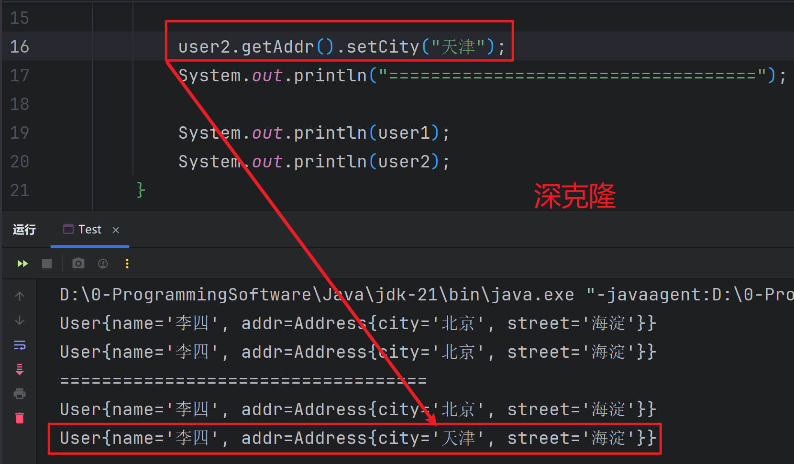
  
  
  + protected修饰的只能在同一个包下或者子类中访问。
  
    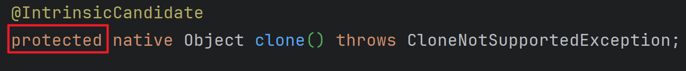
  
    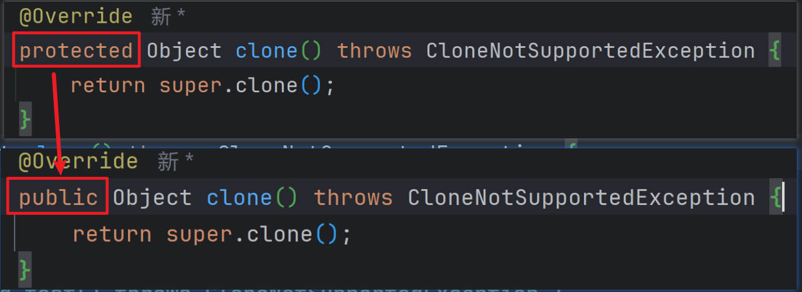
  
  + 只有实现了Cloneable接口的对象才能被克隆。
  
    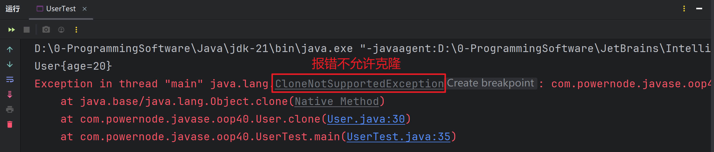
  
    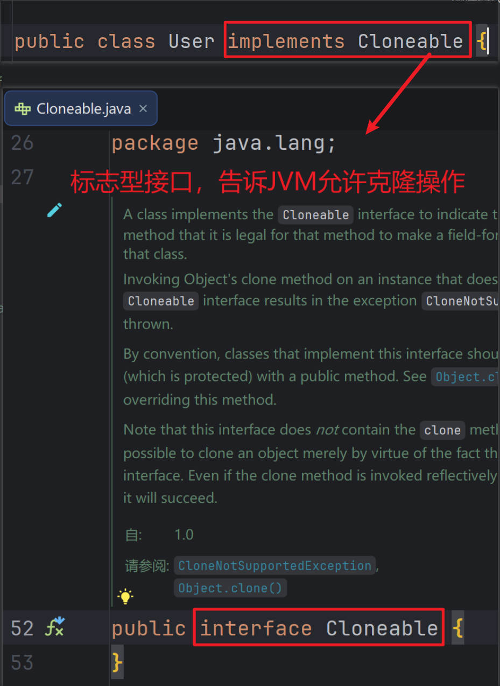

## 内部类

### 什么是内部类？

+ 定义在一个类中的类。

### 什么时候使用内部类？

+ 一个类用到了另外一个类，而这两个类的联系比较`密切`，但是如果把这两个类定义为`独立的类`，`不但增加了类的数量，也不利于代码的阅读和维护`。

+ `内部类`可以访问`外部类`的`私有成员`，这样可以将相关的`类和接口`隐藏在`外部类`的`内部`，从而提高封装性。

+ `匿名内部类`是指`没有名字的内部类`，通常用于`定义一个只使用一次的类`，比如在事件处理中。

### 内部类包括哪几种？

+ **静态内部类：和`静态变量`一个级别**

  ```java
  /**
   * 静态内部类：可以把静态内部类当做静态变量来看。
   * 结论：在静态内部类当中，无法直接访问外部类的实例相关的数据。
   */
  ```

  + `无法直接访问`外部类中`实例变量和实例方法`。

    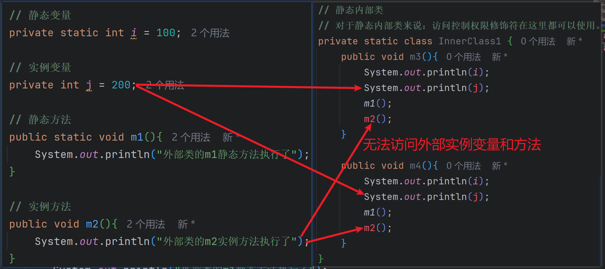

  + 静态内部类如何实例化：

    ```java
    OuterClass.InnerClass InnerClass = new OuterClass.InnerClass();
    ```

    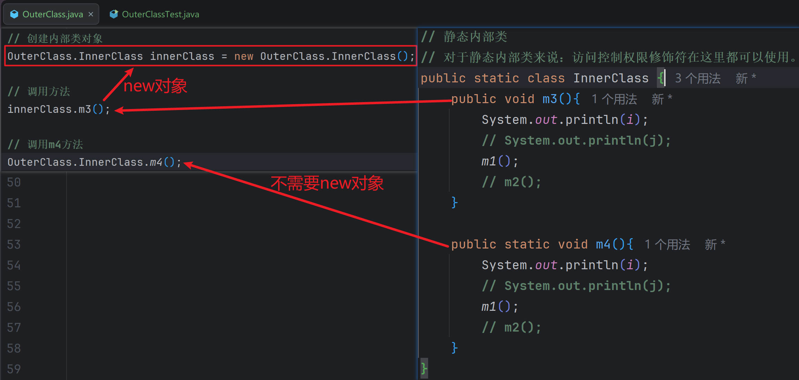

    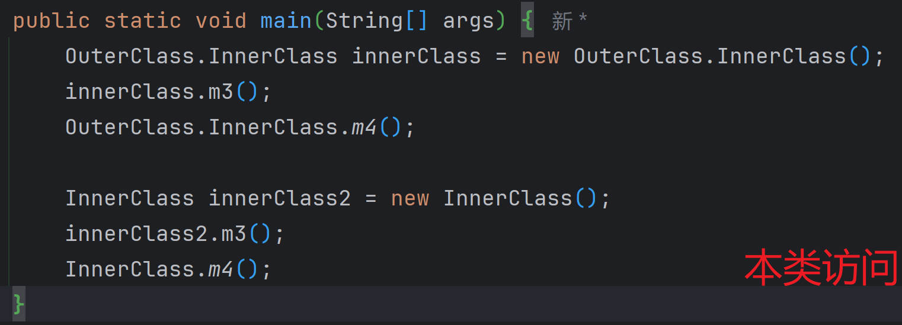

+ **实例内部类：和`实例变量`一个级别**

  ```java
  /**
   * 实例内部类：等同可以看做实例变量。
   * 结论：实例内部类中可以直接访问外部类中实例成员和静态成员。
   */
  ```

  + `可以直接访问`外部类中所有的`实例变量，实例方法，静态变量，静态方法`。

    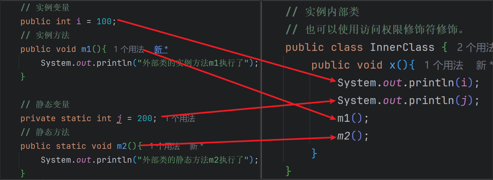

  + 实例内部类如何实例化：

    ```java
    OuterClass.InnerClass innerClass = new OuterClass().new InnerClass();
    /**
    * 或者分开写
    */
    OuterClass outerClass = new OuterClass();
    OuterClass.InnerClass innerClass = OuterClass().new InnerClass();
    ```

    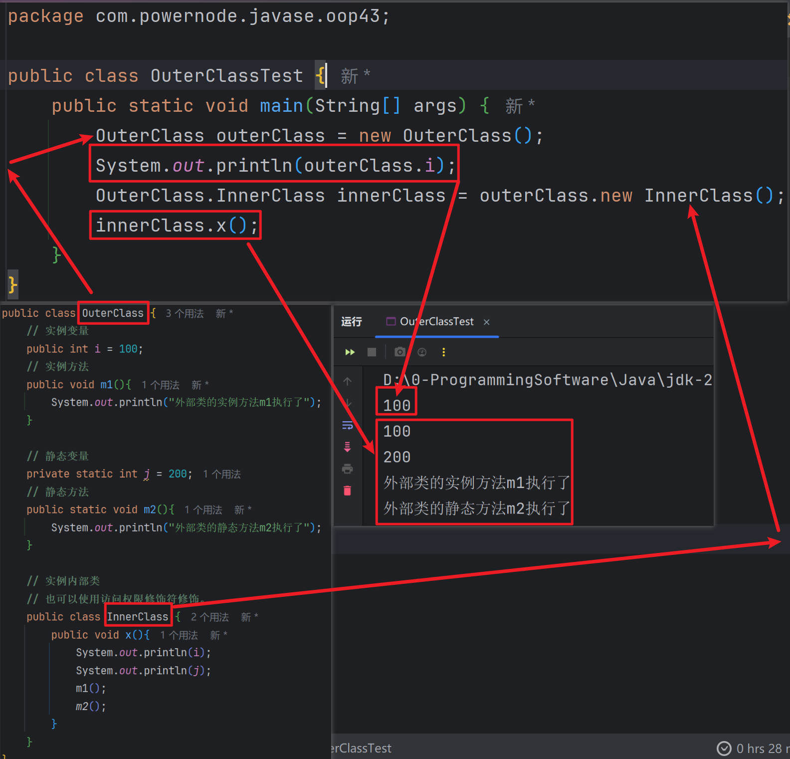

+ **局部内部类：和`局部变量`一个级别**

  ```java
  /**
   * 局部内部类：等同于局部变量。
   *
   * 结论：局部内部类能不能访问外部类的数据，取决于局部内部类所在的方法。
   * 如果这个方法是静态的：只能访问外部类中静态的。
   * 如果这个方法是实例的：可以都访问。
   *
   * 局部内部类不能使用访问权限修饰符修饰(private,缺省,protected,public)。
   *
   * 局部内部类在访问外部的局部变量时，这个局部变量必须是final的。只不过从JDK8开始。这个final关键字不需要提供了。系统自动提供。
   */
  ```

  + 局部内部类访问外类外部的局部变量时，局部变量需要被final修饰。

  + 从JDK8开始，不需要手动添加final了，但JVM会自动添加。

    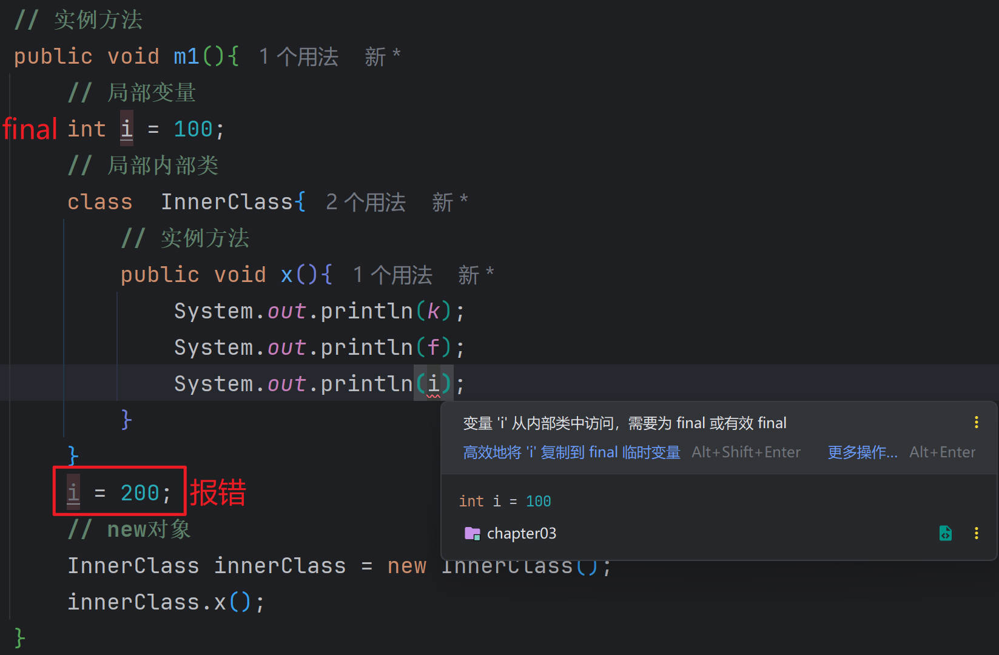

+ **匿名内部类：`特殊的局部内部类`，没有`名字`，只能用`一次`。**

  ```java
  /**
   * 匿名内部类：没有名字的类。只能使用一次。
   */
  ```

  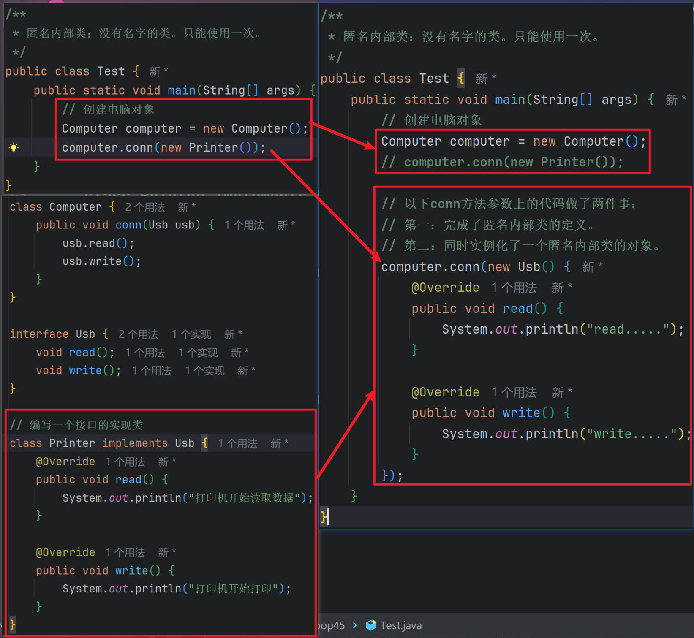

## 内部类

```java
1.什么时候使用内部类:
  当一个事物的内部,还有一个部分需要完整的结构去描述,而这个内部的完整结构又只为外部事物提供服务,那么整个内部的完成结构最好使用内部类
      
  比如:人类都有心脏,人类本身需要用属性,行为去描述,那么人类内部的心脏也需要心脏特殊的属性和行为去描述,此时心脏就可以定义成内部类,人类中的一个心脏类
      
2.在java中允许一个类的定义位于另外一个类内部,前者就称之为内部类,后者称之为外部类
  class A{
      class B{
          
      }
  }

  类A就是类B的外部类
  类B就是类A的内部类
      
3.分类:
  成员内部类(静态,非静态)
  局部内部类
  匿名内部类(重点)
```

### 静态成员内部类

```java
1.格式:直接在定义内部类的时候加上static关键字
  public class A{
      static class B{
          
      }
  }

2.注意:
  a.内部类可以定义属性,方法,构造等
  b.静态内部类可以被final或者abstract修饰
    被final修饰之后,不能被继承
    被abstract修饰之后,不能new
  c.静态内部类不能调用外部的非静态成员
  d.内部类还可以被四种权限修饰符修饰
      
3.调用静态内部类成员:
  外部类.内部类 对象名 = new 外部类.内部类()
```

```java
public class Person {
    public void eat(){
        System.out.println("人要干饭");
    }

    static class Heart{
        public void jump(){
            System.out.println("心脏哐哐哐跳");
        }
    }
}
```

```java
public class Test01 {
    public static void main(String[] args) {
       // 外部类.内部类 对象名 = new 外部类.内部类()
        Person.Heart heart = new Person.Heart();
        heart.jump();
    }
}

```

### 非静态成员内部类

```java
1.格式:直接在定义内部类的时候加上static关键字
  public class A{
      class B{
          
      }
  }

2.注意:
  a.内部类可以定义属性,方法,构造等
  b.静态内部类可以被final或者abstract修饰
    被final修饰之后,不能被继承
    被abstract修饰之后,不能new
  c.静态内部类不能调用外部的非静态成员
  d.内部类还可以被四种权限修饰符修饰
      
3.调用非静态内部类成员:
  外部类.内部类 对象名 = new 外部类().new 内部类()
```

```java
public class Person {
    public void eat(){
        System.out.println("人要干饭");
    }

    class Heart{
        public void jump(){
            System.out.println("心脏哐哐哐跳");
        }
    }
}
```

```java
public class Test01 {
    public static void main(String[] args) {
       // 外部类.内部类 对象名 = new 外部类().new 内部类()
        Person.Heart heart = new Person(). new Heart();
        heart.jump();
    }
}
```

> 外部类的成员变量和内部类的成员变量以及内部类的局部变量重名时,怎么区分?
>
> ```java
> public class Student {
>  String name = "金莲";
>  class Heart{
>      String name = "大郎";
>      public void display(String name){
>          System.out.println(name);//内部类的局部变量
>          System.out.println(this.name);//内部类的成员变量
>          System.out.println(Student.this.name);//外部类的成员变量
>      }
>  }
> }
> 
> 
> public class Test02 {
>  public static void main(String[] args) {
>      Student.Heart heart = new Student().new Heart();
>      heart.display("涛哥");
>  }
> }
> 
> ```

### 局部内部类

#### 局部内部类基本操作

```java
1.可以定义在方法中,代码块中,构造中
```

```java
public class Person {
    public void eat(){
        class Heart{
            public void jump(){
                System.out.println("心脏哐哐哐的跳");
            }
        }

        new Heart().jump();
    }
}

```

```java
public class Test01 {
    public static void main(String[] args) {
        Person person = new Person();
        person.eat();
    }
}

```

#### 局部内部类实际操作

##### 接口类型作为方法参数传递和返回

> 1.接口作为方法参数,传递实参时,传递的是实现类对象
>
> 2.接口作为返回值类型返回,实际返回的是实现类对象

```java
public interface USB {
    public abstract void open();
}
```

```java
public class Mouse implements USB{
    @Override
    public void open() {
        System.out.println("鼠标打开");
    }
}
```

```java
public class Test01 {
    public static void main(String[] args) {
        Mouse mouse = new Mouse();
        method(mouse);
        System.out.println("================");

        USB usb = method01();//USB usb = new Mouse();
        usb.open();
    }

    /*
       接口作为方法参数,传递实参时,传递的是实现类对象
     */
    public static void method(USB usb){//USB usb = mouse -> 多态
        usb.open();
    }

    /*
      接口作为返回值类型返回,实际返回的是实现类对象
    */
    public static USB method01(){
        //Mouse mouse = new Mouse();
        //return mouse;
        return new Mouse();
    }
}

```

##### 抽象类作为方法参数和返回值

> 1.抽象类作为方法参数传递,传递实参时,传递的是其子类对象
>
> 2.抽象类作为方法返回值类型返回时,实际返回的是其子类对象

```java
public abstract class Animal {
    public abstract void eat();
}
```

```java
public class Dog extends Animal{
    @Override
    public void eat() {
        System.out.println("狗啃骨头");
    }
}
```

```java
public class Test02 {
    public static void main(String[] args) {
        Dog dog = new Dog();
        method01(dog);
        System.out.println("=================");
        Animal animal = method02();//Animal animal = new Dog()
        animal.eat();
    }

    public static void method01(Animal animal){//Animal animal = dog
        animal.eat();
    }

    public static Animal method02(){
        return new Dog();
    }
}

```

##### 普通类做方法参数和返回值

> 普通类作为方法参数传递,传递的是对象
>
> 普通类作为方法返回值返回,返回的是对象

```java
public class Person {
    public void eat(){
        System.out.println("人要干饭");
    }
}

```

```java
public class Test03 {
    public static void main(String[] args) {
        Person person = new Person();
        method01(person);
        System.out.println("==================");
        Person person1 = method02();//Person person1 = new Person()
        person1.eat();
    }
    public static void method01(Person person){
        person.eat();
    }

    public static Person method02(){
        return new Person();
    }
}

```

##### 局部内部类实际操作

```java
public interface USB {
    void open();
}

```

```java
public class Test01 {
    public static void main(String[] args) {
        USB usb = method();//USB usb = new Mouse()
        usb.open();
    }

    public static USB method(){
        //局部内部类
        class Mouse implements USB{

            @Override
            public void open() {
                System.out.println("鼠标打开");
            }
        }

        return new Mouse();
    }
}
```

### 匿名内部类(重点)

> 所谓的匿名内部类,可以理解为没有显式声明出类名的内部类

```java
1.问题描述:我们如果想实现接口,简单使用一次抽象方法,我们就需要创建一个实现类,实现这个接口,重写抽象方法,还要new实现类对象,所以我们在想如果就单纯的想使用一次接口中的方法,我们能不能不这么麻烦呢?可以
  a.创建实现类,实现接口
  b.重写方法
  c.创建实现类对象
  d.调用方法
    
2.如果就想单纯的使用一下接口中的方法,我们就没必要经过以上四步了,我们可以四合一
    
3.匿名内部类怎么学:就按照一种格式来学,这一种格式就代表了实现类对象或者子类对象
    
4.格式:
  new 接口/抽象类(){
      重写方法
  }.重写的方法();

  =================================

  类名 对象名 = new 接口/抽象类(){
      重写方法
  }
  对象名.重写的方法();
```

```java
public interface USB {
    void open();
    void close();
}
```

```java
public class Test01 {
    public static void main(String[] args) {
        new USB(){

            @Override
            public void open() {
                System.out.println("usb打开了");
            }

            @Override
            public void close() {
                System.out.println("usb关闭了");
            }
        }.open();

        System.out.println("===================");

        USB usb = new USB() {
            @Override
            public void open() {
                System.out.println("USB打开了");
            }

            @Override
            public void close() {
                System.out.println("USB关闭了");
            }
        };
        usb.open();
        usb.close();
    }
}
```


> 1.什么时候使用匿名内部类:
>
>  当简单调用一次接口中的方法,我们就可以使用匿名内部类
>
> 2.将一种格式代表实现类对象或者子类对象来看待,来学习
>
> 3.匿名内部类会编译生成的,咱们不要管,我们只需要利用咱们讲的格式去new对象,调用重写的方法即可

#### 匿名内部类复杂用法_当参数传递

```java
public interface USB {
    void open();
}
```

```java
public class Test01 {
    public static void main(String[] args) {
        method01(new USB() {
            @Override
            public void open() {
                System.out.println("usb打开了");
            }
        });
    }
    public static void method01(USB usb){
        usb.open();
    }
}
```


#### 匿名内部类复杂用法_当返回值返回

```java
public interface USB {
    void open();
}

```

```java
public class Test02 {
    public static void main(String[] args) {
        USB usb = method01();
        usb.open();

    }

    public static USB method01(){
        return new USB() {
            @Override
            public void open() {
                System.out.println("USB打开了");
            }
        };
    }
}

```

 