## 会话

### 会话管理概述

#### 为什么需要会话管理

> HTTP是无状态协议

+ 无状态就是不保存状态,即无状态协议(stateless),HTTP协议自身不对请求和响应之间的通信状态进行保存,也就是说,在HTTP协议这个级别,协议对于发送过的请求或者响应都不做持久化处理
+ 简单理解:浏览器发送请求,服务器接收并响应,但是服务器不记录请求是否来自哪个浏览器,服务器没记录浏览器的特征,就是客户端的状态

> 举例: 张三去一家饭馆点了几道菜,觉得味道不错,第二天又去了,对老板说,还点上次的那几道菜

+ **`无状态`: 老板没有记录张三是否来过,更没有记录上次他点了那些菜,张三只能重新再点一遍**
+ **`有状态`: 老板把每次来吃饭的用户都做好记录,查阅一下之前的记录,查到了张三之前的菜单,直接下单**


#### 会话管理实现的手段

> **Cookie和Session配合解决**

+ cookie是在客户端保留少量数据的技术,主要通过响应头向客户端响应一些客户端要保留的信息
+ session是在服务端保留更多数据的技术,主要通过HttpSession对象保存一些和客户端相关的信息
+ cookie和session配合记录请求状态

> **举例: 张三去银行办业务**

+ **张三第一次去某个银行办业务,银行会为`张三开户(Session)`,并向张三发放`一张银行卡(cookie)`**
+ **张三后面每次去银行,就可以携带之间的`银行卡(cookie)`,银行根据银行卡找到之前`张三的账户(session)`**

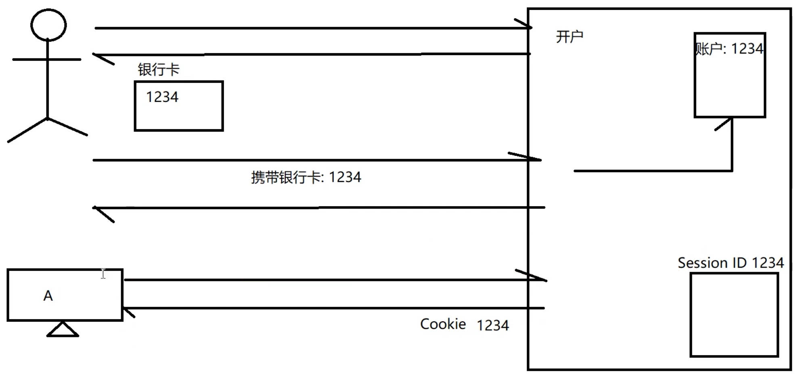


### Cookie

#### Cookie概述

> **cookie是一种`客户端会话技术`,cookie由`服务端产生`,它是服务器`存放在浏览器的一小份数据`,浏览器以后每次访问该服务器的时候都会`将这小份数据携带到服务器去`。**

+ 服务端创建cookie,将cookie放入响应对象中,Tomcat容器将cookie转化为set-cookie响应头,响应给客户端
+ 客户端在收到cookie的响应头时,在下次请求该服务的资源时,会以cookie请求头的形式携带之前收到的Cookie
+ cookie是一种键值对格式的数据,从tomcat8.5开始可以保存中文,但是不推荐
+ 由于cookie是存储于客户端的数据,比较容易暴露,一般不存储一些敏感或者影响安全的数据

> 原理图


> 应用场景举例

1. 记录用户名

    当我们在用户名的输入框中输入完用户名后,浏览器记录用户名,下一次再访问登录页面时,用户名自动填充到用户名的输入框.

2. 保存电影播放进度

    在网页上播放电影的时候,如果中途退出浏览器了,下载再打开浏览器播放同一部电影的时候,会自动跳转到上次退出时候的进度,因为在播放的时候会将播放进度保存到cookie中


####   Cookie的使用

> **servletA`向响应中增加Cookie`**

```java title="Java"
@WebServlet("/servletA")
public class ServletA extends HttpServlet {
    @Override
    protected void service(HttpServletRequest req, HttpServletResponse resp) throws ServletException, IOException {
        // 创建cookie
        Cookie cookie1 = new Cookie("keya", "valuea");
        Cookie cookie2 = new Cookie("keyb", "valueb");
        // 将cookie放入response对象
        resp.addCookie(cookie1);
        resp.addCookie(cookie2);
    }
}
```

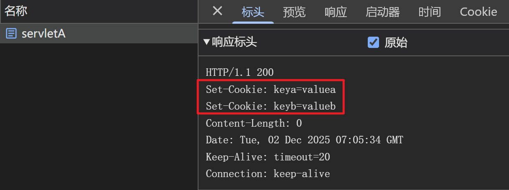

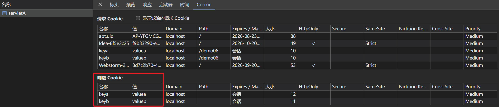


> **servletB`从请求中读取Cookie`**

```java title="Java"
@WebServlet("/servletB")
public class ServletB extends HttpServlet {
    @Override
    protected void service(HttpServletRequest req, HttpServletResponse resp) throws ServletException, IOException {
        // 获取请求中携带的cookie
        Cookie[] cookies = req.getCookies();

        // 请求中的多个cookie会进入该数组，请求中如果没有cookie cookie数组是为null 还是长度为0？
        if (cookies != null && cookies.length != 0) {
            for (Cookie cookie : cookies) {
                System.out.println(cookie.getName() +  " : " + cookie.getValue());
            }
        }
    }
}
```

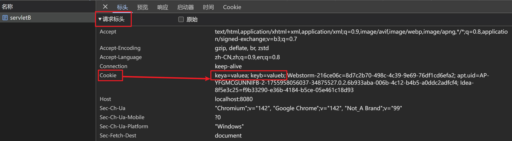

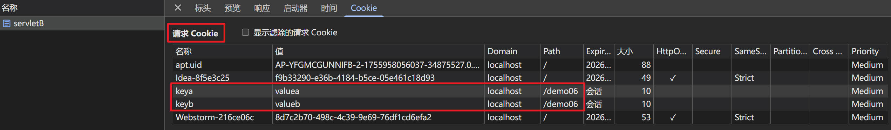


####  Cookie的时效性

> **默认情况下`Cookie的有效期`是`一次会话范围内`，我们可以通过cookie的`setMaxAge()方法`让`Cookie持久化保存到浏览器上`**

-   **会话级Cookie(`关闭浏览器后Cookie消失,保存在内存中，受浏览器端影响`)**
    
    -   服务器端并没有明确指定Cookie的存在时间
    -   在浏览器端，Cookie数据存在于内存中
    -   只要浏览器还开着，Cookie数据就一直都在
    -   浏览器关闭，内存中的Cookie数据就会被释放
    
-   **持久化Cookie(`关闭浏览器后Cookie还存在,保存硬盘中,受服务器端影响`)**
    
    -   服务器端明确设置了Cookie的存在时间
    -   在浏览器端，Cookie数据会被保存到硬盘上
    -   Cookie在硬盘上存在的时间根据服务器端限定的时间来管控，不受浏览器关闭的影响
    -   持久化Cookie到达了预设的时间会被释放

> **`cookie.setMaxAge(int expiry)`参数`单位是秒`，表示`cookie的持久化时间`，如果`设置参数为0`，表示`将浏览器中保存的该cookie删除`**

+ **servletA设置`一个Cookie为持久化cookie`**

```java title="Java"
@WebServlet("/servletA")
public class ServletA extends HttpServlet {
    @Override
    protected void service(HttpServletRequest req, HttpServletResponse resp) throws ServletException, IOException {
        // 创建cookie
        Cookie cookie1 = new Cookie("keya", "valuea");

        // 设置cookie1保存在硬盘上的时间(单位秒)
        cookie1.setMaxAge(60 * 5);

        Cookie cookie2 = new Cookie("keyb", "valueb");

        // 将cookie放入response对象
        resp.addCookie(cookie1);
        resp.addCookie(cookie2);
    }
}
```

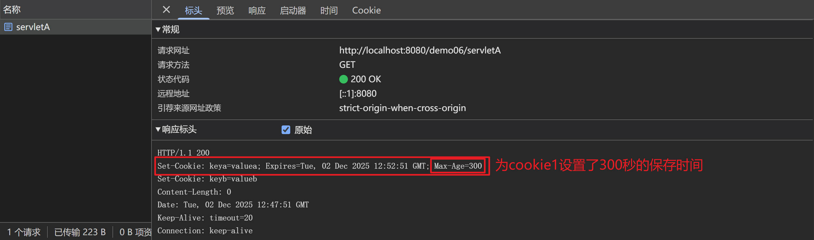


+ **servletB`接收Cookie`,浏览器`中间发生一次重启`再`请求servletB测试`**

```java title="Java"
@WebServlet("/servletB")
public class ServletB extends HttpServlet {
    @Override
    protected void service(HttpServletRequest req, HttpServletResponse resp) throws ServletException, IOException {
        // 获取请求中携带的cookie
        Cookie[] cookies = req.getCookies();

        // 请求中的多个cookie会进入该数组，请求中如果没有cookie cookie数组是为null 还是长度为0？
        if (cookies != null && cookies.length != 0) {
            for (Cookie cookie : cookies) {
                System.out.println(cookie.getName() +  " : " + cookie.getValue());
            }
        }
    }
}
```


#### Cookie的提交路径

> **访问互联网资源时不能每次都需要把所有Cookie带上。访问不同的资源时,可以携带不同的cookie,我们可以通过cookie的`setPath(String path) `对`cookie的路径`进行设置**

+ 从ServletA中获取cookie

```java title="Java"
@WebServlet("/servletA")
public class ServletA extends HttpServlet {
    @Override
    protected void service(HttpServletRequest req, HttpServletResponse resp) throws ServletException, IOException {
        // 创建cookie
        Cookie cookie1 = new Cookie("keya", "valuea");

        // 设置cookie1保存在硬盘上的时间(单位秒)
        //cookie1.setMaxAge(60 * 5);

        // 设置cookie1的提交路径
        cookie1.setPath("demo06/servletB");

        Cookie cookie2 = new Cookie("keyb", "valueb");

        // 将cookie放入response对象
        resp.addCookie(cookie1);
        resp.addCookie(cookie2);
    }
}
```

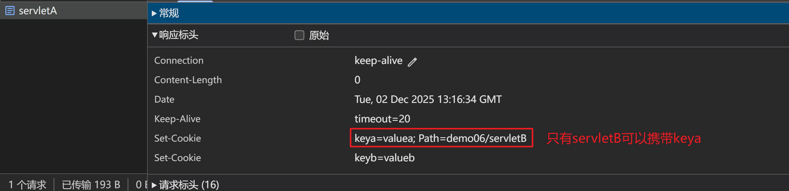


+ **向`ServletB请求`时`携带了keya`**

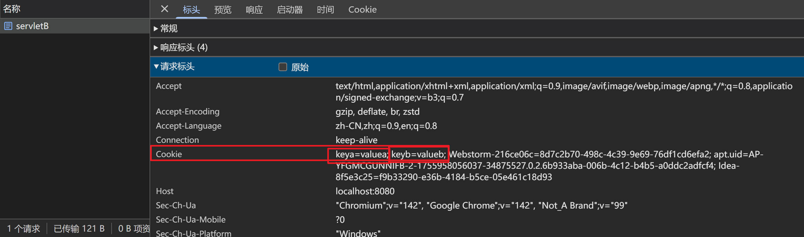

+ **向`其他资源请求`时就`不携带keya`了**


### Session

#### HttpSession概述

>  HttpSession是一种保留更多信息在服务端的一种技术,服务器会为每一个客户端开辟一块内存空间,即session对象. 客户端在发送请求时,都可以使用自己的session. 这样服务端就可以通过session来记录某个客户端的状态了

+ 服务端在为客户端创建session时,会同时将session对象的id,即JSESSIONID以cookie的形式放入响应对象
+ 后端创建完session后,客户端会收到一个特殊的cookie,叫做JSESSIONID
+ 客户端下一次请求时携带JSESSIONID,后端收到后,根据JSESSIONID找到对应的session对象
+ 通过该机制,服务端通过session就可以存储一些专门针对某个客户端的信息了
+ session也是域对象(后续详细讲解)

> 原理图如下


> 应用场景

1. **记录用户的登录状态**

    用户登录后,将用户的账号等敏感信息存入session

2. **记录用户操作的历史**

    例如记录用户的访问痕迹,用户的购物车信息等临时性的信息


#### HttpSession的使用

> **用户提交form表单到`ServletA`,`携带用户名`,ServletA获取`session 将用户名存到Session`,用户再`请求其他任意Servlet`,获取`之间存储的用户`**

> **服务器给`每个浏览器客户端`产生`唯一的Session`**
>
> 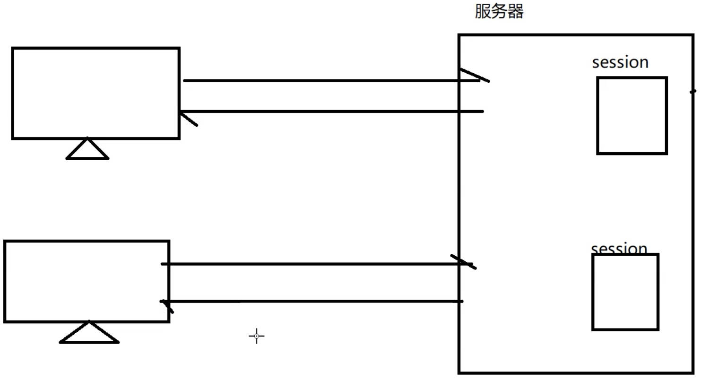

+ **定义Servlet1,`将用户名存入session`**

```java title="Java"
@WebServlet("/servlet1")
public class Servlet1 extends HttpServlet {
    @Override
    protected void service(HttpServletRequest req, HttpServletResponse resp) throws ServletException, IOException {
        // 接收请求中的username参数
        String username = req.getParameter("username");

        // 获取session对象
        HttpSession session = req.getSession();
        // 判断请求中有没有一个特殊的cookie JSESSIONID 值 *** ***
            // 1.有
                // 根据JSESSIONID找对应session对象
                    // 1.找到了
                        // 返回之前的session对象
                    // 2.没找到
                        // 创建一个新的session返回，并且向response对象中存放一个JSESSIONID 的cookie
            // 2.没有
                // 创建一个新的session返回，并且向response对象中存放一个JSESSIONID 的cookie
        System.out.println(session.getId());
        System.out.println(session.isNew()); // true表示新session/false2表示旧session

        // 将username放入session中
        session.setAttribute("username", username);

        // 客户端响应信息
        resp.setContentType("text/html;charset=utf-8");
        resp.getWriter().write("成功");
    }
}
```

+ **`响应中`收到了`一个JSESSIONID`的`cookie`**

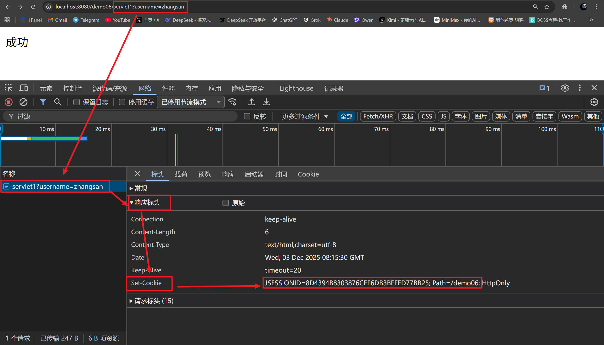


+ **定义其他Servlet,从`session`中读取`用户名`**

```java title="Java"
@WebServlet("/servlet2")
public class Servlet2 extends HttpServlet {
    @Override
    protected void service(HttpServletRequest req, HttpServletResponse resp) throws ServletException, IOException {
        // 获取session对象
        HttpSession session = req.getSession();
        System.out.println(session.getId());
        System.out.println(session.isNew());

        // 读取session中存储的用户名
        String username = (String)session.getAttribute("username");
        System.out.println("servlet2 got username" + username); // true表示新session/false2表示旧session
    }
}
```

+ **`请求中`携带了`一个JSESSIONID`的`cookie`**

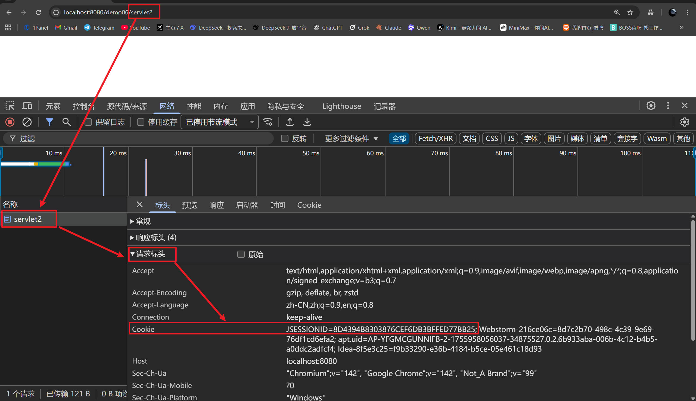

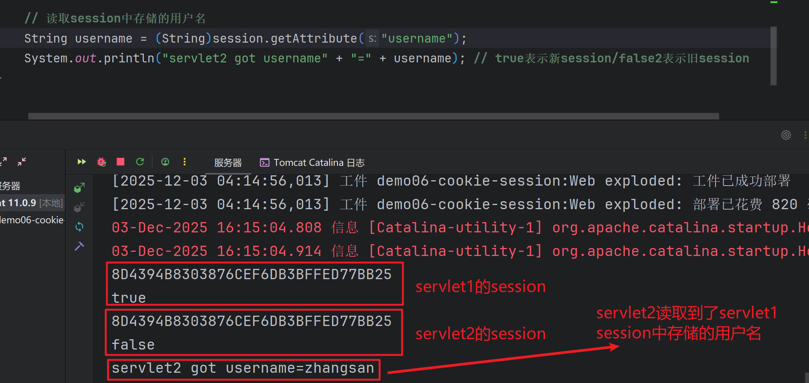


> **getSession方法的`处理逻辑`**


#### HttpSession时效性

> 为什么要设置session的时效

+ 用户量很大之后，Session对象相应的也要创建很多。如果一味创建不释放，那么服务器端的内存迟早要被耗尽。
+ 客户端关闭行为无法被服务端直接侦测,或者客户端较长时间不操作也经常出现,类似这些的情况,就需要对session的时限进行设置了

> **`默认的session`最大`闲置时间`(`两次使用同一个session中的间隔时间`) 在`tomcat/conf/web.xml`配置为`30分钟`**


> **我们可以自己`在当前项目的web.xml`对最大闲置时间`进行重新设定`**


> **也可以通过`HttpSession的API `对最大闲置时间`进行设定`**

```java title="Java"
// 获取session对象
HttpSession session = req.getSession();

// 设置最大闲置时间
session.setMaxInactiveInterval(60);
```

> **也可以`直接让session失效`**

```java title="Java"
// 直接让session失效
session.invalidate();
```

> **测试效果:**
>
> 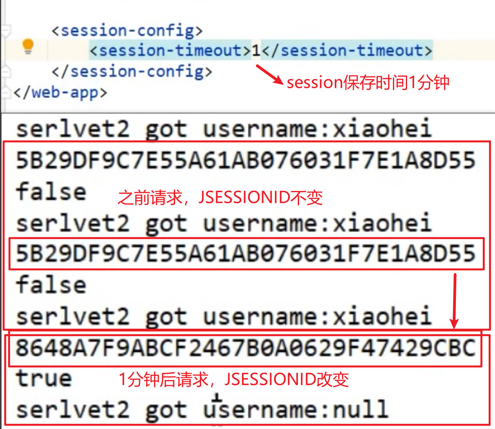


### 三大域对象

#### 域对象概述

> **域对象: 一些`用于存储数据和传递数据的对象`,传递数据`不同的范围`,我们称之为`不同的域,`不同的`域对象`代表`不同的域,`共享数据的`范围也不同`**

+ **web项目中,我们一定要熟练使用的域对象分别是`请求域,会话域,应用域`**
+ **`请求域`对象是`HttpServletRequest `,传递数据的范围是`一次请求之内及请求转发`**
+ **`会话域`对象是`HttpSession`,传递数据的范围是`一次会话之内`,可以`跨多个请求`**
+ **`应用域`对象是`ServletContext`,传递数据的范围是`本应用之内`,可以`跨多个会话`**

> **生活举例: 热水器摆放位置不同,使用的范围就不同**

1. **摆在`张三工位下`,就`只有张三一个人能用`**
2. **摆在`办公室的公共区`,`办公室内`的`所有人都可以用`**
3. **摆在`楼层的走廊区`,`该楼层`的`所有人都可以用`**

> **三大域对象的数据`作用范围图解`**
>
> ```mermaid
> graph TD
>     A[需要存储什么数据？] --> B{数据的作用范围？}
>     
>     B --> C[仅一次请求内使用]
>     B --> D[同一用户多次请求使用]
>     B --> E[所有用户共享使用]
>     
>     C --> F[选择请求域<br/>生命周期最短<br/>内存效率最高]
>     
>     D --> G{数据类型？}
>     G --> H[用户状态/身份信息]
>     G --> I[临时用户数据]
>     H --> J[必须用会话域]
>     I --> K[考虑用数据库/缓存替代]
>     
>     E --> L{数据类型？}
>     L --> M[只读/频繁读配置]
>     L --> N[需要频繁更新]
>     M --> O[选择应用域<br/>注意线程安全]
>     N --> P[考虑用缓存系统替代]
> ```

+ 请求域


+ 会话域


+ 应用域


+ 所有域在一起


#### 域对象的使用

> 域对象的API

| API                                         | 功能                    |
| ------------------------------------------- | ----------------------- |
| void setAttribute(String name,String value) | 向域对象中添加/修改数据 |
| Object getAttribute(String name);           | 从域对象中获取数据      |
| removeAttribute(String name);               | 移除域对象中的数据      |

> API测试

+ **ServletA向三大域中`放入数据`**

```java title="Java"
@WebServlet("/servletA")
public class ServletA extends HttpServlet {
    @Override
    protected void service(HttpServletRequest req, HttpServletResponse resp) throws ServletException, IOException {
        // 向请求域中放入数据
        req.setAttribute("request","request-message");
        //req.getRequestDispatcher("servletB").forward(req,resp);

        // 向会话域中放入数据
        HttpSession session = req.getSession();
        session.setAttribute("session","session-message");

        // 向应用域中放入数据
        ServletContext application = getServletContext();
        application.setAttribute("application","application-message");

        // 获取请求域数据
        String reqMessage = (String) req.getAttribute("request");
        System.out.println("请求域:" + reqMessage);

        // 请求转发
        req.getRequestDispatcher("servletB").forward(req,resp);
    }
}
```

+ **ServletB从三大于中`取出数据`**

```java title="Java"
@WebServlet("/servletB")
public class ServletB extends HttpServlet {
    @Override
    protected void service(HttpServletRequest req, HttpServletResponse resp) throws ServletException, IOException {
        // 向请求域存放数据
        String reqMessage = (String) req.getAttribute("request");
        System.out.println("请求域:" + reqMessage);

        // 获取会话域中的数据
        HttpSession session = req.getSession();
        String sessionMessage = (String) session.getAttribute("session");
        System.out.println("会话域:" + sessionMessage);

        // 获取应用域中的数据
        ServletContext application = getServletContext();
        String appMessage = (String) application.getAttribute("application");
        System.out.println("应用域:" + appMessage);
    }
}
```

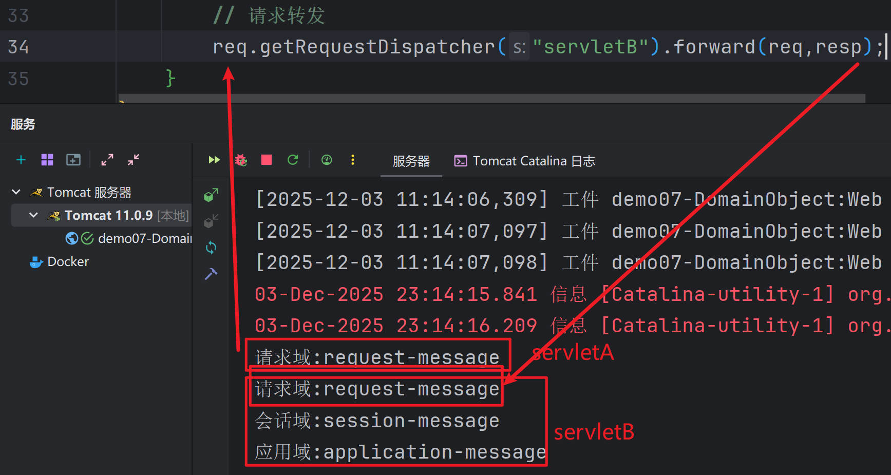

+ **请求转发时,请求域可以传递数据`请求域内一般放本次请求业务有关的数据,如:查询到的所有的部门信息`**

> **请求域`不能跨请求域对象`:**
>
> 
>
> 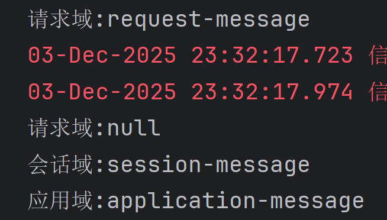

+ **同一个会话内,不用请求转发,会话域可以传递数据`会话域内一般放本次会话的客户端有关的数据,如:当前客户端登录的用户`** 

> **会话域不能跨客户端：**
>
> 
>
> 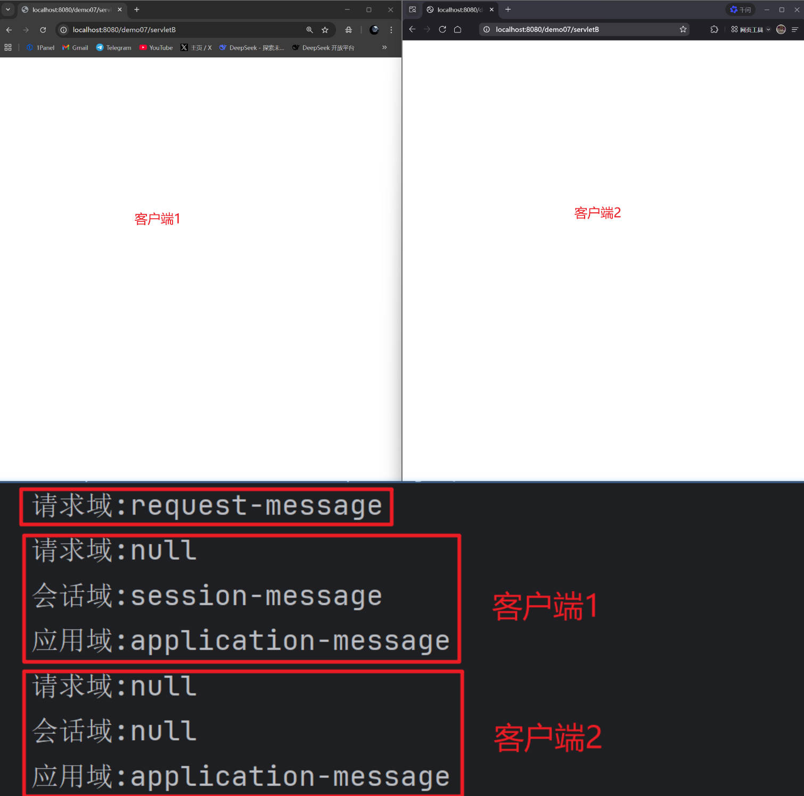

+ **同一个APP内,不同的客户端,应用域可以传递数据`应用域内一般放本程序应用有关的数据 如:Spring框架的IOC容器`**

> **应用域不能跨程序应用:**
>
> 
>
> 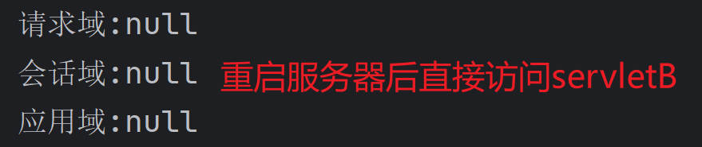


## 过滤器

### 过滤器概述

> **`Filter`,即`过滤器`,是JAVAEE技术规范之一,作用`目标资源的请求进行过滤`的一套技术规范,是Java Web项目中`最为实用的技术之一`**

+ Filter接口定义了过滤器的开发规范,所有的过滤器都要实现该接口
+ Filter的工作位置是项目中所有目标资源之前,容器在创建HttpServletRequest和HttpServletResponse对象后,会先调用Filter的doFilter方法
+ Filter的doFilter方法可以控制请求是否继续,如果放行,则请求继续,如果拒绝,则请求到此为止,由过滤器本身做出响应
+ Filter不仅可以对请求做出过滤,也可以在目标资源做出响应前,对响应再次进行处理
+ Filter是GOF中责任链模式的典型案例
+ Filter的常用应用包括但不限于: 登录权限检查,解决网站乱码,过滤敏感字符,日志记录,性能分析... ...

> **生活举例: 公司前台,停车场安保,地铁验票闸机**

+ 公司前台对来访人员进行审核,如果是游客则拒绝进入公司,如果是客户则放行 . 客户离开时提醒客户不要遗忘物品
+ 停车场保安对来访车辆进行控制,如果没有车位拒绝进入,如果有车位,发放停车卡并放行,车辆离开时收取请车费
+ 地铁验票闸机在人员进入之前检查票,没票拒绝进入,有票验票后放行,人员离开时同样验票

> **过滤器开发中应用的场景**

+ 日志的记录
+ 性能的分析
+ 乱码的处理
+ 事务的控制
+ 登录的控制
+ 跨域的处理
+ ... ...

> **过滤器工作位置图解**


> **Filter接口API**

+ 源码

```java title="Java"
package jakarta.servlet;
import java.io.IOException;

public interface Filter {
    default public void init(FilterConfig filterConfig) throws ServletException {
    }
    
    public void doFilter(ServletRequest request, ServletResponse response, FilterChain chain)
            throws IOException, ServletException;
    
    default public void destroy() {
    }
}

```

+ **API目标**

| API                                                          | 目标                                                         |
| ------------------------------------------------------------ | ------------------------------------------------------------ |
| **default public void init(FilterConfig filterConfig)**      | **初始化方法,由容器调用并传入初始配置信息filterConfig对象**  |
| **public void doFilter(ServletRequest request, ServletResponse response, FilterChain chain)** | **过滤方法,核心方法,过滤请求,决定是否放行,响应之前的其他处理等都在该方法中** |
| **default public void destroy()**                            | **销毁方法,容器在回收过滤器对象之前调用的方法**              |


### 过滤器使用

> **目标:开发一个`日志记录过滤器`**

+ **用户请求到达目标资源之前,记录用户的请求资源路径**
+ **响应之前记录本次请求目标资源运算的耗时**
+ **可以选择将日志记录进入文件,为了方便测试,这里将日志直接在控制台打印**

>  **定义`一个过滤器类`,编写功能代码**

```java title="Java"
package fun.xingji.filters;

import jakarta.servlet.*;
import jakarta.servlet.http.HttpServletRequest;
import jakarta.servlet.http.HttpServletResponse;

import java.io.IOException;
import java.text.SimpleDateFormat;
import java.util.Date;

/*
日志过滤器   记录请求的历史，将日志打印到控制台

开发步骤：
1.实现Filter接口
2.重写过滤方法
3.配置过滤器
    web.xml
    注解

 */
public class LoggingFilter implements Filter {

    /*
    过滤请求和响应的方法
        1.请求到达目标资源之前，先经过该方法
        2.该方法有能力控制请求是否继续向后到达目标资源，可以在该方法内直接向客户端做响应处理
        3.请求到目标资源后，响应之前，还会经过该方法
     */
    @Override
    public void doFilter(ServletRequest servletRequest, ServletResponse servletResponse, FilterChain filterChain) throws IOException, ServletException {

        SimpleDateFormat dateFormat = new SimpleDateFormat("yyyy-MM-dd HH:mm:ss");

        /*
        1.请求到达目标资源之前的代码
            判断是否登录
            校验权限是否满足
            ... ...
        2.放行代码

        3.响应之前  HttpServletResponse 转换为响应报文前的功能代码
         */

        // 参数父转子
        HttpServletRequest request = (HttpServletRequest) servletRequest;
        HttpServletResponse response = (HttpServletResponse) servletResponse;

        
        //  拼接日志文本
        // 请求到达目标资源之前 打印日志 yyyy-MM-dd HH:mm:ss ...被访问了
        String requestURI = request.getRequestURI();
        String dateTime = dateFormat.format(new Date());
        String beforeLogging = requestURI + "在" + dateTime + "被访问了";
        // 打印日志
        System.out.println(beforeLogging);

        
        // 获取系统时间
        long t1 = System.currentTimeMillis();

        // 放行请求
        filterChain.doFilter(servletRequest, servletResponse);

        // 获取系统时间
        long t2 = System.currentTimeMillis();
        

        //  拼接日志文本
        // 响应之前的功能代码 ...资源 在yyyy-MM-dd HH:mm:ss的请求 耗时 毫秒
        String afterLogging = requestURI + "资源在" + dateTime + "的请求耗时:" +(t2 - t1) + "毫秒";
        
        // 打印日志
        System.out.println(afterLogging);
    }
}
```

+ 说明
    + **doFilter方法中的`请求和响应`对象是以`父接口的形式声明的`,实际传入的实参就是`HttpServletRequest`和`HttpServletResponse`子接口级别的,可以`安全强转`**
    + **`filterChain.doFilter(servletRequest, servletResponse); `这行代码的功能是放行请求,如果没有这一行代码,则`请求到此为止`**
    + **`filterChain.doFilter(servletRequest, servletResponse);`在放行时需要传入`request和response`,意味着`请求和响应对象`要继续传递给`后续的资源`,这里`没有产生新的request和response对象`**

> **定义一个Servlet和HTML作为目标资源**

+ **Servlet1**

```java title="Java" 
@WebServlet(value = "/servlet1", name = "servlet1")
public class Servlet1 extends HttpServlet {
    @Override
    protected void service(HttpServletRequest req, HttpServletResponse resp) throws ServletException, IOException {
        System.out.println("servlet1的service方法执行了");

        // 向客户端响应数据
        resp.getWriter().write("servlet1 message");
    }
}
```

+ **aaa.html**

```java title="Java" 
<!DOCTYPE html>
<html lang="en" xmlns:th="http://www.thymeleaf.org">
<head>
    <meta charset="UTF-8">
    <title>Title</title>
</head>
<body>
this is page aaa
</body>
</html>
```


> **配置过滤器以及过滤器的`过滤范围`**

+ **web.xml**

```xml
<?xml version="1.0" encoding="UTF-8"?>
<web-app xmlns="http://xmlns.jcp.org/xml/ns/javaee"
         xmlns:xsi="http://www.w3.org/2001/XMLSchema-instance"
         xsi:schemaLocation="http://xmlns.jcp.org/xml/ns/javaee http://xmlns.jcp.org/xml/ns/javaee/web-app_4_0.xsd"
         version="4.0">

    <!--配置filter,并为filter起别名-->
    <filter>
        <filter-name>loggingFilter</filter-name>
        <filter-class>fun.xingji.filters.LoggingFilter</filter-class>
    </filter>

    <!--为别名对应的filter配置要过滤的目标资源-->
    <filter-mapping>
    <filter-name>loggingFilter</filter-name>
        <!--
        url-pattern     根据请求资源路径 对指定的请求进行过滤
            /*          过滤全部资源、
            /a/*        过滤以a开头的资源
            *.html      过滤以html为后缀的资源
            /servlet1   对servlet1请求进行过滤

        servlet-name    通过servlet别名确定过滤资源
        <servlet-name>servlet1</servlet-name>
        
        一个filter-mapping下,servlet-name和url-pattern子标签可以同时存在
        -->
        <url-pattern>/*</url-pattern>
    </filter-mapping>
</web-app>
```

+ 说明

    + **filter-mapping标签中定义了过滤器对那些资源进行过滤**
    + **子标签url-pattern通过映射路径确定过滤范围**
        + **/servletA  精确匹配,表示对servletA资源的请求进行过滤**
        + ***.html 表示对以.action结尾的路径进行过滤**
        + **/* 表示对所有资源进行过滤**
        + **一个filter-mapping下可以配置多个url-pattern**
    + **子标签servlet-name通过servlet别名确定对那些servlet进行过滤**
        + **使用该标签确定目标资源的前提是servlet已经起了别名**
        + **一个filter-mapping下可以定义多个servlet-name**
        + **一个filter-mapping下,servlet-name和url-pattern子标签可以同时存在**


> **日志过滤器测试:**
>
> 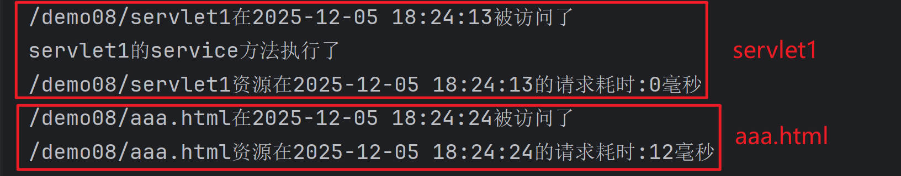


> **过滤过程图解**


### 过滤器生命周期

> **过滤器作为web项目的组件之一,和Servlet的生命周期类似,略有不同,`没有servlet`的`load-on-startup的配置`,`默认就是系统启动立刻构造`**

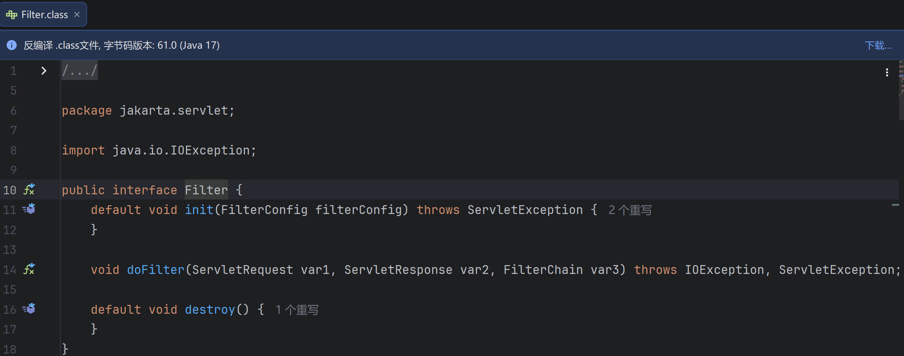

| 阶段       | 对应方法                                                     | 执行时机          | 执行次数 |
| ---------- | ------------------------------------------------------------ | ----------------- | -------- |
| 创建对象   | **构造器**                                                   | **web应用启动时** | **1**    |
| 初始化方法 | **void init(FilterConfig filterConfig)**                     | **构造完毕**      | **1**    |
| 过滤请求   | **void doFilter(ServletRequest servletRequest, ServletResponse servletResponse, FilterChain filterChain)** | **每次请求**      | **多次** |
| 销毁       | **default void destroy()**                                   | **web应用关闭时** | **1次**  |

> **测试代码**

```java title="Java"
package fun.xingji.filters;

import jakarta.servlet.*;

import java.io.IOException;

public class LifeCycleFilter implements Filter {

    // 构造   构造器  项目启动  执行1次
    public LifeCycleFilter(){
        System.out.println("构造器");
    }

    // 初始化  init  构造完毕  执行1次
    @Override
    public void init(FilterConfig filterConfig) throws ServletException {
        System.out.println("初始化");
        //拿取web.xml里的init-param配置信息
        System.out.println(filterConfig.getInitParameter("dateTimePattern"));
    }

    // 过滤  doFilter  每次请求  执行多次
    @Override
    public void doFilter(ServletRequest servletRequest, ServletResponse servletResponse, FilterChain filterChain) throws IOException, ServletException {
        System.out.println("过滤方法");

        // 放行请求
        filterChain.doFilter(servletRequest,servletResponse);
    }

    // 销毁  destroy  服务关闭  执行1次
    @Override
    public void destroy() {
        System.out.println("销毁方法");
    }
}
```

```java
<?xml version="1.0" encoding="UTF-8"?>
<web-app xmlns="http://xmlns.jcp.org/xml/ns/javaee"
         xmlns:xsi="http://www.w3.org/2001/XMLSchema-instance"
         xsi:schemaLocation="http://xmlns.jcp.org/xml/ns/javaee http://xmlns.jcp.org/xml/ns/javaee/web-app_4_0.xsd"
         version="4.0">
             
    <filter>
        <filter-name>lifeCycleFilter</filter-name>
        <filter-class>fun.xingji.filters.LifeCycleFilter</filter-class>
        <init-param>
            <param-name>dateTimePattern</param-name>
            <param-value>yyyy-MM-dd HH:mm:ss</param-value>
        </init-param>
    </filter>

    <filter-mapping>
        <filter-name>lifeCycleFilter</filter-name>
        <url-pattern>/*</url-pattern>
    </filter-mapping>
</web-app>
```

```java
已连接到服务器
[2025-12-05 07:21:28,813] 工件 demo08-filter:Web exploded: 正在部署工件，请稍候…
/*=====================================================================*/
构造器
初始化
yyyy-MM-dd HH:mm:ss
/*=====================================================================*/
[2025-12-05 07:21:29,696] 工件 demo08-filter:Web exploded: 工件已成功部署
/*=====================================================================*/
过滤方法
/*=====================================================================*/  
/demo08/资源在2025-12-05 19:21:29的请求耗时:2毫秒
/demo08/在2025-12-05 19:21:30被访问了
/*=====================================================================*/
过滤方法
/*=====================================================================*/
05-Dec-2025 19:22:40.762 信息 [main] org.apache.catalina.core.StandardService.stopInternal 正在停止服务[Catalina]
/*=====================================================================*/
销毁方法
/*=====================================================================*/
05-Dec-2025 19:22:40.776 信息 [main] org.apache.coyote.AbstractProtocol.stop 正在停止ProtocolHandler ["http-nio-8080"
已与服务器断开连接
```


### 过滤器链的使用

> **一个web项目中,可以同时定义多个过滤器,多个过滤器对同一个资源进行过滤时,工作位置有先后,整体形成一个工作链,称之为过滤器链**

+ 过滤器链中的过滤器的顺序由filter-mapping顺序决定
+ 每个过滤器过滤的范围不同,针对同一个资源来说,过滤器链中的过滤器个数可能是不同的
+ 如果某个Filter是使用ServletName进行匹配规则的配置，那么这个Filter执行的优先级要更低

> **图解过滤器链**


> **过滤器链功能测试**

+ 定义三个过滤器,对目标资源Servlet的请求进行过滤

+ 目标Servlet资源代码

```java title="Java"
package fun.xingji.servlet;

import jakarta.servlet.ServletException;
import jakarta.servlet.annotation.WebServlet;
import jakarta.servlet.http.HttpServlet;
import jakarta.servlet.http.HttpServletRequest;
import jakarta.servlet.http.HttpServletResponse;

import java.io.IOException;

@WebServlet(value = "/servlet1", name = "servlet1")
public class Servlet1 extends HttpServlet {
    @Override
    protected void service(HttpServletRequest req, HttpServletResponse resp) throws ServletException, IOException {
        System.out.println("servlet1的service方法执行了");

        // 向客户端响应数据
        resp.getWriter().write("servlet1 message");
    }
}
```


+ 三个过滤器代码

```java title="Java"
public class Filter1 implements Filter {
    @Override
    public void doFilter(ServletRequest servletRequest, ServletResponse servletResponse, FilterChain filterChain) throws IOException, ServletException {
        System.out.println("filter1 before doFilter invoked");

        filterChain.doFilter(servletRequest,servletResponse);

        System.out.println("filter1 after doFilter invoked");
    }
}


public class Filter2 implements Filter {
    @Override
    public void doFilter(ServletRequest servletRequest, ServletResponse servletResponse, FilterChain filterChain) throws IOException, ServletException {
        System.out.println("filter2 before doFilter invoked");

        filterChain.doFilter(servletRequest,servletResponse);

        System.out.println("filter2 after doFilter invoked");
    }
}


public class Filter3 implements Filter {
    @Override
    public void doFilter(ServletRequest servletRequest, ServletResponse servletResponse, FilterChain filterChain) throws IOException, ServletException {
        System.out.println("filter3 before doFilter invoked");

        filterChain.doFilter(servletRequest,servletResponse);

        System.out.println("filter3 after doFilter invoked");
    }
}
```


+ 过滤器配置代码

```xml
<?xml version="1.0" encoding="UTF-8"?>
<web-app xmlns="http://xmlns.jcp.org/xml/ns/javaee"
         xmlns:xsi="http://www.w3.org/2001/XMLSchema-instance"
         xsi:schemaLocation="http://xmlns.jcp.org/xml/ns/javaee http://xmlns.jcp.org/xml/ns/javaee/web-app_4_0.xsd"
         version="4.0">

    <!--配置多个过滤器-->
    <filter>
        <filter-name>filter1</filter-name>
        <filter-class>fun.xingji.filters.Filter1</filter-class>
    </filter>

    <filter>
        <filter-name>filter2</filter-name>
        <filter-class>fun.xingji.filters.Filter2</filter-class>
    </filter>

    <filter>
        <filter-name>filter3</filter-name>
        <filter-class>fun.xingji.filters.Filter3</filter-class>
    </filter>


    <!--filter-mapping的顺序决定了过滤器的工作顺序-->
    <filter-mapping>
        <filter-name>filter1</filter-name>
        <url-pattern>/*</url-pattern>
    </filter-mapping>

    <filter-mapping>
        <filter-name>filter2</filter-name>
        <url-pattern>/*</url-pattern>
    </filter-mapping>

    <filter-mapping>
        <filter-name>filter3</filter-name>
        <url-pattern>/*</url-pattern>
    </filter-mapping>

</web-app>
```

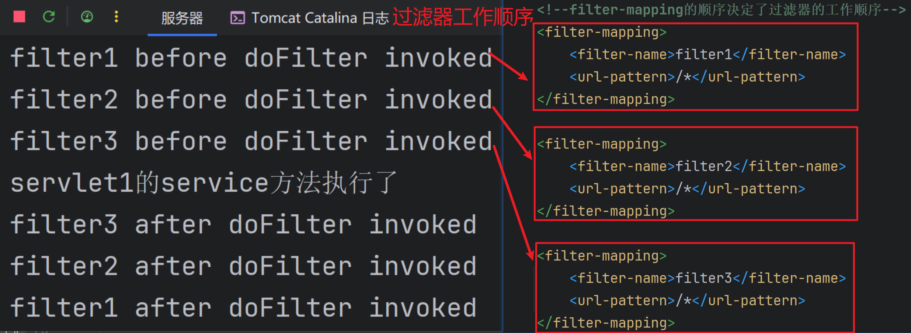


> **工作流程图解**


### 注解方式配置过滤器

> **@WebFilter注解的使用**
>
> 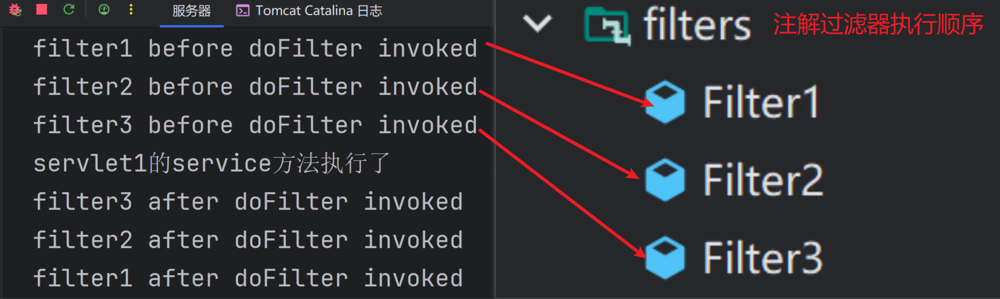

+ 源码

```java title="Java"
package jakarta.servlet.annotation;

import jakarta.servlet.DispatcherType;
import java.lang.annotation.Documented;
import java.lang.annotation.ElementType;
import java.lang.annotation.Retention;
import java.lang.annotation.RetentionPolicy;
import java.lang.annotation.Target;

@Target({ElementType.TYPE})
@Retention(RetentionPolicy.RUNTIME)
@Documented
public @interface WebFilter {
    String description() default "";

    String displayName() default "";

    WebInitParam[] initParams() default {};

    String filterName() default "";

    String smallIcon() default "";

    String largeIcon() default "";

    String[] servletNames() default {};

    String[] value() default {};

    String[] urlPatterns() default {};

    DispatcherType[] dispatcherTypes() default {DispatcherType.REQUEST};

    boolean asyncSupported() default false;
}

```

+ 一个比较完整的Filter的XML配置

```xml
<!--配置filter,并为filter起别名-->
<filter>
    <filter-name>loggingFilter</filter-name>
    <filter-class>com.atguigu.filters.LoggingFilter</filter-class>
    <!--配置filter的初始参数-->
    <init-param>
        <param-name>dateTimePattern</param-name>
        <param-value>yyyy-MM-dd HH:mm:ss</param-value>
    </init-param>
</filter>
<!--为别名对应的filter配置要过滤的目标资源-->
<filter-mapping>
    <filter-name>loggingFilter</filter-name>
    <!--通过映射路径确定过滤资源-->
    <url-pattern>/servletA</url-pattern>
    <!--通过后缀名确定过滤资源-->
    <url-pattern>*.html</url-pattern>
    <!--通过servlet别名确定过滤资源-->
    <servlet-name>servletBName</servlet-name>
</filter-mapping>
```

+ 将xml配置转换成注解方式实现

```java title="Java"
package com.atguigu.filters;


import jakarta.servlet.*;
import jakarta.servlet.annotation.WebFilter;
import jakarta.servlet.annotation.WebInitParam;
import jakarta.servlet.http.HttpServletRequest;
import jakarta.servlet.http.HttpServletResponse;

import java.io.IOException;
import java.text.SimpleDateFormat;
import java.util.Date;


@WebFilter(
        filterName = "loggingFilter",
        initParams = {@WebInitParam(name="dateTimePattern",value="yyyy-MM-dd HH:mm:ss")},
        urlPatterns = {"/servletA","*.html"},
        servletNames = {"servletBName"}
)
public class LoggingFilter  implements Filter {
    private SimpleDateFormat dateFormat ;

    /*init初始化方法,通过filterConfig获取初始化参数
    * init方法中,可以用于定义一些其他初始化功能代码
    * */
    @Override
    public void init(FilterConfig filterConfig) throws ServletException {
        // 获取初始参数
        String dateTimePattern = filterConfig.getInitParameter("dateTimePattern");
        // 初始化成员变量
        dateFormat=new SimpleDateFormat(dateTimePattern);
    }
    @Override
    public void doFilter(ServletRequest servletRequest, ServletResponse servletResponse, FilterChain filterChain) throws IOException, ServletException {
        // 参数父转子
        HttpServletRequest request =(HttpServletRequest)  servletRequest;
        HttpServletResponse  response =(HttpServletResponse)  servletResponse;
        // 拼接日志文本
        String requestURI = request.getRequestURI();
        String time = dateFormat.format(new Date());
        String beforeLogging =requestURI+"在"+time+"被请求了";
        // 打印日志
        System.out.println(beforeLogging);
        // 获取系统时间
        long t1 = System.currentTimeMillis();
        // 放行请求
        filterChain.doFilter(request,response);
        // 获取系统时间
        long t2 = System.currentTimeMillis();
        String afterLogging =requestURI+"在"+time+"的请求耗时:"+(t2-t1)+"毫秒";
        // 打印日志
        System.out.println(afterLogging);

    }
}
```


## 监听器

### 监听器概述

> **监听器：专门用于对域对象对象身上发生的`事件或状态`改变进行监听和相应处理的对象**

+ 监听器是GOF设计模式中,观察者模式的典型案例
+ 观察者模式: 当被观察的对象发生某些改变时, 观察者自动采取对应的行动的一种设计模式

+ 监听器使用的感受类似JS中的事件,被观察的对象发生某些情况时,自动触发代码的执行
+ 监听器并不监听web项目中的所有组件,仅仅是对三大域对象做相关的事件监听


> **监听器的分类**

+ ***web中定义八个监听器接口作为监听器的规范,这八个接口按照不同的标准可以形成不同的分类**


+ **按监听的对象划分**

    + application域监听器 ServletContextListener  ServletContextAttributeListener 
    + session域监听器 HttpSessionListener  HttpSessionAttributeListener  HttpSessionBindingListener  HttpSessionActivationListener  
    + request域监听器 ServletRequestListener  ServletRequestAttributeListener 

+ **按监听的事件分**

    + 域对象的创建和销毁监听器 ServletContextListener   HttpSessionListener   ServletRequestListener  
    + 域对象数据增删改事件监听器 ServletContextAttributeListener  HttpSessionAttributeListener   ServletRequestAttributeListener 
    + 其他监听器  HttpSessionBindingListener  HttpSessionActivationListener  


### 监听器的六个主要接口

#### application域监听器

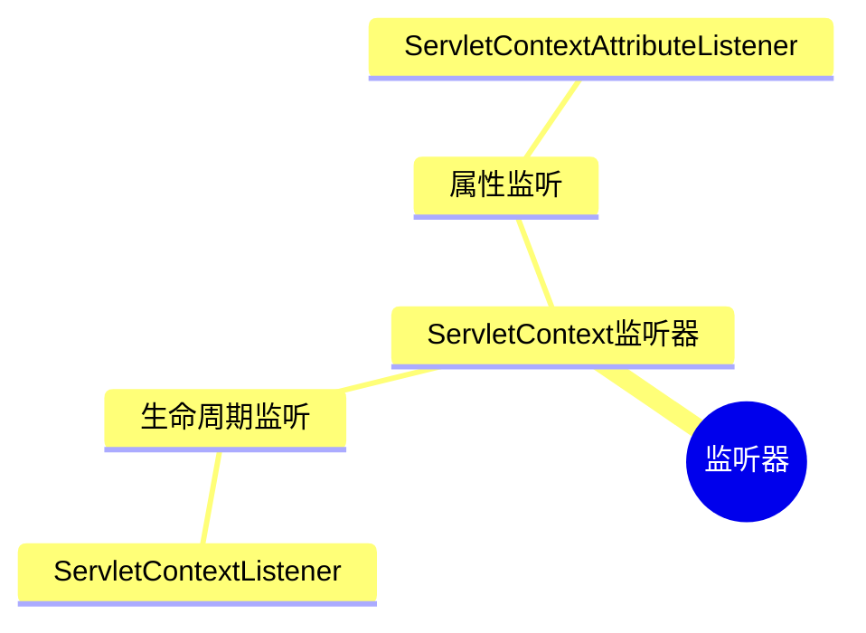
```mermaid
mindmap
  root((监听器))
      ServletContext监听器
        生命周期监听
        	ServletContextListener
        属性监听
        	ServletContextAttributeListener
```


> **ServletContextListener  监听ServletContext对象的创建与销毁**

| 方法名                                          | 作用                         |
| ----------------------------------------------- | ---------------------------- |
| **contextInitialized(ServletContextEvent sce)** | **ServletContext创建时调用** |
| **contextDestroyed(ServletContextEvent sce)**   | **ServletContext销毁时调用** |

+ ServletContextEvent对象代表从ServletContext对象身上捕获到的事件，通过这个事件对象我们可以获取到ServletContext对象。


> **ServletContextAttributeListener 监听ServletContext中属性的添加、移除和修改**

| 方法名                                                   | 作用                                     |
| -------------------------------------------------------- | ---------------------------------------- |
| **attributeAdded(ServletContextAttributeEvent scab)**    | **向ServletContext中添加属性时调用**     |
| **attributeRemoved(ServletContextAttributeEvent scab)**  | **从ServletContext中移除属性时调用**     |
| **attributeReplaced(ServletContextAttributeEvent scab)** | **当ServletContext中的属性被修改时调用** |


+ **ServletContextAttributeEvent对象代表属性变化事件，它包含的方法如下：**

| 方法名                  | 作用                         |
| ----------------------- | ---------------------------- |
| **getName()**           | **获取修改或添加的属性名**   |
| **getValue()**          | **获取被修改或添加的属性值** |
| **getServletContext()** | **获取ServletContext对象**   |


> **测试代码**

+ **定义监听器**

```java title="Java"
package fun.xingji.listener;

import jakarta.servlet.*;
import jakarta.servlet.annotation.WebListener;

@WebListener
public class MyApplicationListener implements ServletContextListener, ServletContextAttributeListener {
    // 监听初始化
    @Override
    public void contextInitialized(ServletContextEvent sce) {
        ServletContext application = sce.getServletContext();
        System.out.println(application.hashCode() + "应用域初始化了");
    }

    // 监听销毁
    @Override
    public void contextDestroyed(ServletContextEvent sce) {
        ServletContext application = sce.getServletContext();
        System.out.println(application.hashCode() + "应用域销毁了");
    }


    // 监听数据增加
    @Override
    public void attributeAdded(ServletContextAttributeEvent scae) {
        ServletContext application = scae.getServletContext();
        String key = scae.getName();
        Object value = scae.getValue();
        System.out.println(application.hashCode() + "应用域增加了" + key + ":" + value);
    }

    // 监听数据移除
    @Override
    public void attributeRemoved(ServletContextAttributeEvent scae) {
        ServletContext application = scae.getServletContext();
        String key = scae.getName();
        Object value = scae.getValue();
        System.out.println(application.hashCode() + "应用域移除了" + key + ":" + value);
    }

    // 监听数据修改
    @Override
    public void attributeReplaced(ServletContextAttributeEvent scae) {
        ServletContext application = scae.getServletContext();
        String key = scae.getName();
        Object value = scae.getValue(); // 获取的是旧的值
        Object newValue = application.getAttribute(key); // 获取最新的值
        System.out.println(application.hashCode() + "应用域修改了" + key + ":" + value + "为:" + newValue);
    }
}
```


+ **定义触发监听器的代码**

```java title="Java"
// Servlet1用于向application域中放入数据
@WebServlet("/servlet1")
public class Servlet1 extends HttpServlet {
    @Override
    protected void service(HttpServletRequest req, HttpServletResponse resp) throws ServletException, IOException {

        // 向application域中放入数据
        ServletContext application = this.getServletContext();
        application.setAttribute("keya", "valuea");
    }
}


// Servlet2用于向application域中修改数据
@WebServlet("/servlet2")
public class Servlet2 extends HttpServlet {
    @Override
    protected void service(HttpServletRequest req, HttpServletResponse resp) throws ServletException, IOException {

        // 修改application域中的数据
        ServletContext application = this.getServletContext();
        application.setAttribute("keya", "valuexx");
    }
}


// Servlet3用于向application域中移除数据
@WebServlet("/servlet3")
public class Servlet3 extends HttpServlet {
    @Override
    protected void service(HttpServletRequest req, HttpServletResponse resp) throws ServletException, IOException {

        // 删除application域中的数据
        ServletContext application = this.getServletContext();
        application.removeAttribute("keya");
    }
}
```

> **测试:**
>
> 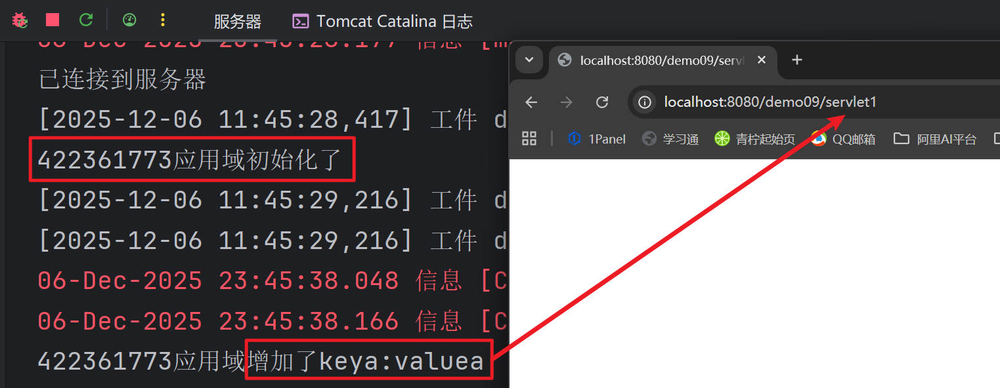
>
> 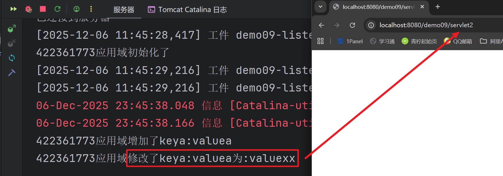
>
> 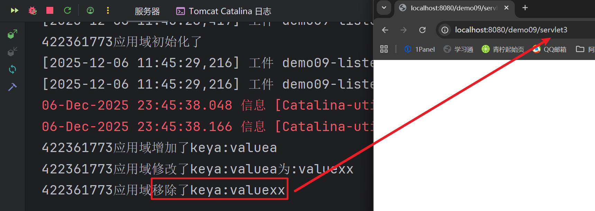


#### session域监听器

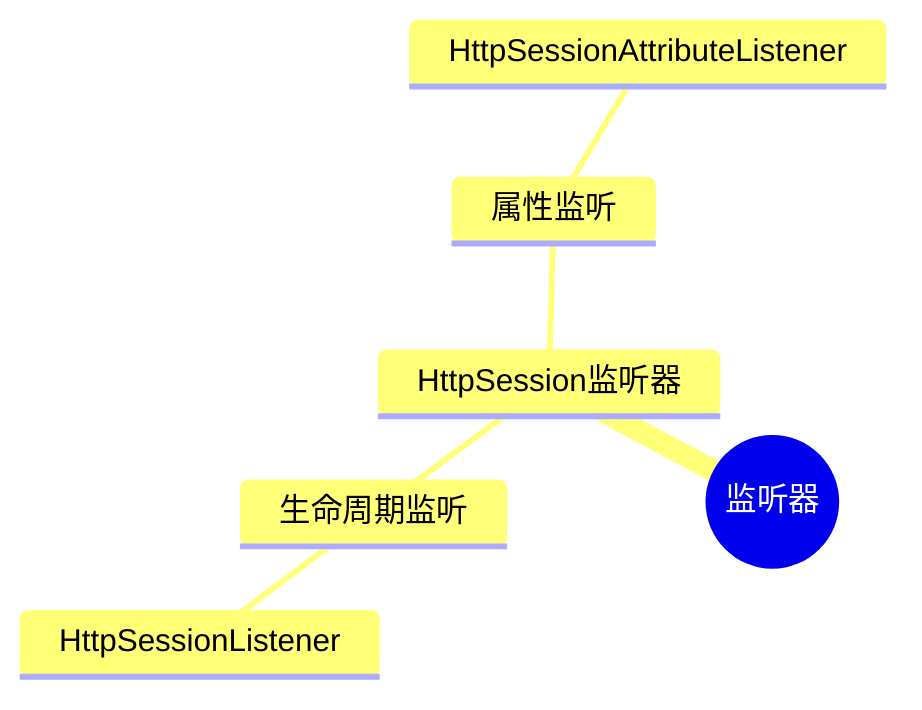
```mermaid
mindmap
  root((监听器))
      HttpSession监听器
        生命周期监听
        	HttpSessionListener
        属性监听
        	HttpSessionAttributeListener
```


> **HttpSessionListener  监听HttpSession对象的创建与销毁**

| 方法名                                     | 作用                          |
| ------------------------------------------ | ----------------------------- |
| **sessionCreated(HttpSessionEvent hse)**   | **HttpSession对象创建时调用** |
| **sessionDestroyed(HttpSessionEvent hse)** | **HttpSession对象销毁时调用** |

+ **HttpSessionEvent对象代表从HttpSession对象身上捕获到的事件，通过这个事件对象我们可以获取到触发事件的HttpSession对象。**


> **HttpSessionAttributeListener 监听HttpSession中属性的添加、移除和修改**

| 方法名                                            | 作用                                  |
| ------------------------------------------------- | ------------------------------------- |
| **attributeAdded(HttpSessionBindingEvent se)**    | **向HttpSession中添加属性时调用**     |
| **attributeRemoved(HttpSessionBindingEvent se)**  | **从HttpSession中移除属性时调用**     |
| **attributeReplaced(HttpSessionBindingEvent se)** | **当HttpSession中的属性被修改时调用** |


+ **HttpSessionBindingEvent对象代表属性变化事件，它包含的方法如下：**

| 方法名           | 作用                              |
| ---------------- | --------------------------------- |
| **getName()**    | **获取修改或添加的属性名**        |
| **getValue()**   | **获取被修改或添加的属性值**      |
| **getSession()** | **获取触发事件的HttpSession对象** |

> 测试代码

+ 定义监听器

```java title="Java"
package fun.xingji.listener;

import jakarta.servlet.annotation.WebListener;
import jakarta.servlet.http.*;

@WebListener
public class MySessionListener implements HttpSessionListener, HttpSessionAttributeListener {

    // 监听session创建
    @Override
    public void sessionCreated(HttpSessionEvent se) {
        // 任何一个session域对象的创建都会触发该方法的执行
        HttpSession session = se.getSession();
        System.out.println("session"+session.hashCode()+" created");
    }

    // 监听session销毁
    @Override
    public void sessionDestroyed(HttpSessionEvent se) {
        // 任何一个session域对象的销毁都会触发该方法的执行
        HttpSession session = se.getSession();
        System.out.println("session"+session.hashCode()+" destroyed");
    }


    // 监听数据增加
    @Override
    public void attributeAdded(HttpSessionBindingEvent se) {
        // 任何一个session域中增加了数据都会触发该方法的执行
        String name = se.getName();
        Object value = se.getValue();
        HttpSession session = se.getSession();
        System.out.println("session"+session.hashCode()+" add:"+name+"="+value);
    }

    // 监听数据移除
    @Override
    public void attributeRemoved(HttpSessionBindingEvent se) {
        // 任何一个session域中移除了数据都会触发该方法的执行
        String name = se.getName();
        Object value = se.getValue();
        HttpSession session = se.getSession();
        System.out.println("session"+session.hashCode()+" remove:"+name+"="+value);
    }

    // 监听数据销毁
    @Override
    public void attributeReplaced(HttpSessionBindingEvent se) {
        // 任何一个session域中销毁了数据都会触发该方法的执行
        String name = se.getName();
        Object value = se.getValue();
        HttpSession session = se.getSession();
        Object newValue = session.getAttribute(name);
        System.out.println("session"+session.hashCode()+" change:"+name+"="+value+" to "+newValue);
    }
}
```

+ 定义触发监听器的代码

```java title="Java"
// servletA用于创建session并向session中放数据
@WebServlet(urlPatterns = "/servletA",name = "servletAName")
public class ServletA extends HttpServlet {
    @Override
    protected void service(HttpServletRequest req, HttpServletResponse resp) throws ServletException, IOException {
        // 创建session,并向session中放入数据
        HttpSession session = req.getSession();

        session.setAttribute("k1","v1");
        session.setAttribute("k2","v2");
    }
}


// servletB用于修改删除session中的数据并手动让session不可用
@WebServlet(urlPatterns = "/servletB", name = "servletBName")
public class ServletB extends HttpServlet {
    @Override
    protected void service(HttpServletRequest req, HttpServletResponse resp) throws ServletException, IOException {
        HttpSession session = req.getSession();
        //  修改session域中的数据
        session.setAttribute("k1","value1");
        //  删除session域中的数据
        session.removeAttribute("k2");
        // 手动让session不可用
        session.invalidate();
    }
}
```


#### request域监听器

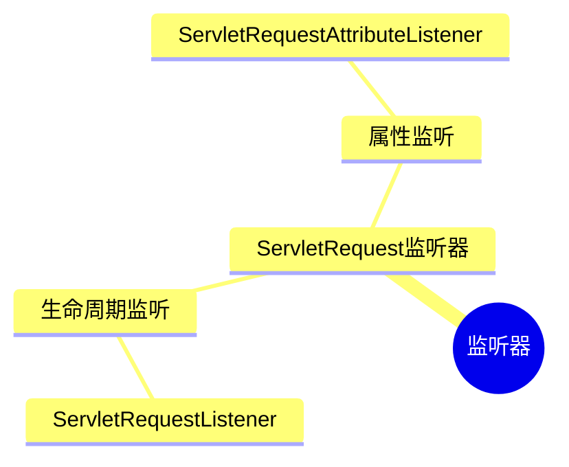
```mermaid
mindmap
  root((监听器))
      ServletRequest监听器
        生命周期监听
        	ServletRequestListener
        属性监听
        	ServletRequestAttributeListener
```


> **ServletRequestListener 监听ServletRequest对象的创建与销毁**

| 方法名                                          | 作用                             |
| ----------------------------------------------- | -------------------------------- |
| **requestInitialized(ServletRequestEvent sre)** | **ServletRequest对象创建时调用** |
| **requestDestroyed(ServletRequestEvent sre)**   | **ServletRequest对象销毁时调用** |

+ **ServletRequestEvent对象代表从HttpServletRequest对象身上捕获到的事件，通过这个事件对象我们可以获取到触发事件的HttpServletRequest对象。另外还有一个方法可以获取到当前Web应用的ServletContext对象。**


> **ServletRequestAttributeListener 监听ServletRequest中属性的添加、移除和修改**

| 方法名                                                   | 作用                                     |
| -------------------------------------------------------- | ---------------------------------------- |
| **attributeAdded(ServletRequestAttributeEvent srae)**    | **向ServletRequest中添加属性时调用**     |
| **attributeRemoved(ServletRequestAttributeEvent srae)**  | **从ServletRequest中移除属性时调用**     |
| **attributeReplaced(ServletRequestAttributeEvent srae)** | **当ServletRequest中的属性被修改时调用** |


+ **ServletRequestAttributeEvent对象代表属性变化事件，它包含的方法如下：**

| 方法名                   | 作用                                 |
| ------------------------ | ------------------------------------ |
| **getName()**            | **获取修改或添加的属性名**           |
| **getValue()**           | **获取被修改或添加的属性值**         |
| **getServletRequest ()** | **获取触发事件的ServletRequest对象** |

+ 定义监听器

```java title="Java"
package fun.xingji.listener;

import jakarta.servlet.*;
import jakarta.servlet.annotation.WebListener;

@WebListener
public class MyRequestListener implements ServletRequestListener , ServletRequestAttributeListener {

    // 监听初始化
    @Override
    public void requestInitialized(ServletRequestEvent sre) {
        // 任何一个请求域对象的初始化都会触发该方法的执行
        ServletRequest request = sre.getServletRequest();
        System.out.println("request"+request.hashCode()+" initialized");
    }

    // 监听销毁
    @Override
    public void requestDestroyed(ServletRequestEvent sre) {
        // 任何一个请求域对象的销毁都会触发该方法的执行
        ServletRequest request = sre.getServletRequest();
        System.out.println("request"+request.hashCode()+" destoryed");
    }


    // 监听数据增加
    @Override
    public void attributeAdded(ServletRequestAttributeEvent srae) {
        // 任何一个请求域中增加了数据都会触发该方法的执行
        String name = srae.getName();
        Object value = srae.getValue();
        ServletRequest request = srae.getServletRequest();
        System.out.println("request"+request.hashCode()+" add:"+name+"="+value);
    }

    //  监听数据移除
    @Override
    public void attributeRemoved(ServletRequestAttributeEvent srae) {
        // 任何一个请求域中移除了数据都会触发该方法的执行
        String name = srae.getName();
        Object value = srae.getValue();
        ServletRequest request = srae.getServletRequest();
        System.out.println("request"+request.hashCode()+" remove:"+name+"="+value);
    }

    // 监听数据修改
    @Override
    public void attributeReplaced(ServletRequestAttributeEvent srae) {
        // 任何一个请求域中修改了数据都会触发该方法的执行
        String name = srae.getName();
        Object value = srae.getValue();
        ServletRequest request = srae.getServletRequest();
        Object newValue = request.getAttribute(name);
        System.out.println("request"+request.hashCode()+" change:"+name+"="+value+" to "+newValue);
    }
}
```

+ 定义触发监听器的代码

```java title="Java"
//  servletA向请求域中放数据
@WebServlet(urlPatterns = "/servletA",name = "servletAName")
public class ServletA extends HttpServlet {
    @Override
    protected void service(HttpServletRequest req, HttpServletResponse resp) throws ServletException, IOException {
        // 向request中增加数据
        req.setAttribute("k1","v1");
        req.setAttribute("k2","v2");
        // 请求转发
        req.getRequestDispatcher("servletB").forward(req,resp);
    }
}

// servletB修改删除域中的数据
@WebServlet(urlPatterns = "/servletB", name = "servletBName")
public class ServletB extends HttpServlet {
    @Override
    protected void service(HttpServletRequest req, HttpServletResponse resp) throws ServletException, IOException {
        //  修改request域中的数据
        req.setAttribute("k1","value1");
        //  删除session域中的数据
        req.removeAttribute("k2");

    }
}
```


### session域的两个特殊监听器(了解)

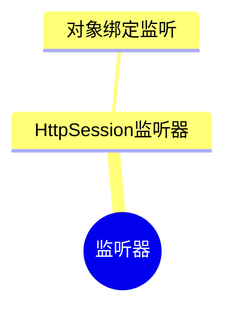
```mermaid
mindmap
  root((监听器))
      HttpSession监听器
        对象绑定监听
```


####  session绑定监听器

> **HttpSessionBindingListener 监听当前监听器对象在Session域中的增加与移除**

| 方法名                                          | 作用                                  |
| ----------------------------------------------- | ------------------------------------- |
| **valueBound(HttpSessionBindingEvent event)**   | **该类的实例被放到Session域中时调用** |
| **valueUnbound(HttpSessionBindingEvent event)** | **该类的实例从Session中移除时调用**   |

+ **HttpSessionBindingEvent对象代表属性变化事件，它包含的方法如下：**

| 方法名           | 作用                              |
| ---------------- | --------------------------------- |
| **getName()**    | **获取当前事件涉及的属性名**      |
| **getValue()**   | **获取当前事件涉及的属性值**      |
| **getSession()** | **获取触发事件的HttpSession对象** |

> 测试代码

+ 定义监听器

```java title="Java"
package fun.xingji.listener;

import jakarta.servlet.http.HttpSession;
import jakarta.servlet.http.HttpSessionBindingEvent;
import jakarta.servlet.http.HttpSessionBindingListener;

public class SessionBindingListener implements HttpSessionBindingListener {

    //  监听绑定
    @Override
    public void valueBound(HttpSessionBindingEvent event) {
        // 当前监听器实例放入某个session中作为数据  绑定
        HttpSession session = event.getSession();
        String name = event.getName();
        System.out.println("MySessionBindingListener"+this.hashCode()+" binding into session"+session.hashCode()+" with name "+name);
    }

    // 监听解除绑定
    @Override
    public void valueUnbound(HttpSessionBindingEvent event) {
        // 当前监听器实例从某个session中移除  解绑定
        HttpSession session = event.getSession();
        String name = event.getName();
        System.out.println("MySessionBindingListener"+this.hashCode()+" unbond outof session"+session.hashCode()+" with name "+name);
    }
}
```

+ 定义触发监听器的代码

```java title="Java"
@WebServlet(urlPatterns = "/servletA",name = "servletAName")
public class ServletA extends HttpServlet {
    @Override
    protected void service(HttpServletRequest req, HttpServletResponse resp) throws ServletException, IOException {
        HttpSession session = req.getSession();
        // 绑定监听器
        session.setAttribute("bindingListener",new MySessionBindingListener());
        // 解除绑定监听器
        session.removeAttribute("bindingListener");
    }
}
```


#### 钝化活化监听器

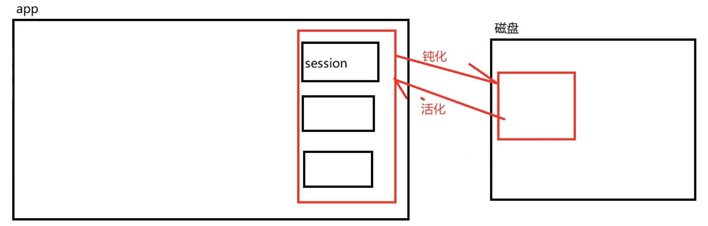

> **HttpSessionActivationListener  监听某个对象在Session中的`序列化`与`反序列化`。**

| 方法名                                    | 作用                                  |
| ----------------------------------------- | ------------------------------------- |
| sessionWillPassivate(HttpSessionEvent se) | 该类实例和Session一起钝化到硬盘时调用 |
| sessionDidActivate(HttpSessionEvent se)   | 该类实例和Session一起活化到内存时调用 |

+ HttpSessionEvent对象代表事件对象，通过getSession()方法获取事件涉及的HttpSession对象。

> 什么是钝化活化

+ session对象在服务端是以对象的形式存储于内存的,session过多,服务器的内存也是吃不消的
+ 而且一旦服务器发生重启,所有的session对象都将被清除,也就意味着session中存储的不同客户端的登录状态丢失
+ 为了分摊内存 压力并且为了保证session重启不丢失,我们可以设置将session进行钝化处理
+ 在关闭服务器前或者到达了设定时间时,对session进行序列化到磁盘,这种情况叫做session的钝化
+ 在服务器启动后或者再次获取某个session时,将磁盘上的session进行反序列化到内存,这种情况叫做session的活化


> 如何配置钝化活化

+ 在web目录下,添加 META-INF下创建Context.xml


+ 文件中配置钝化

```xml
<?xml version="1.0" encoding="UTF-8"?>
<Context>
    <Manager className="org.apache.catalina.session.PersistentManager" maxIdleSwap="1">
        <Store className="org.apache.catalina.session.FileStore" directory="d:\mysession"></Store>
    </Manager>
</Context>
```

+  请求servletA,获得session,并存入数据,然后重启服务器

```java title="Java"
@WebServlet(urlPatterns = "/servletA",name = "servletAName")
public class ServletA extends HttpServlet {
    @Override
    protected void service(HttpServletRequest req, HttpServletResponse resp) throws ServletException, IOException {
        HttpSession session = req.getSession();
        // 添加数据
        session.setAttribute("k1","v1");
    }
}
```

+ 请求servletB获取session,获取重启前存入的数据

```java title="Java"
@WebServlet(urlPatterns = "/servletB", name = "servletBName")
public class ServletB extends HttpServlet {
    @Override
    protected void service(HttpServletRequest req, HttpServletResponse resp) throws ServletException, IOException {
        HttpSession session = req.getSession();
        Object v1 = session.getAttribute("k1");
        System.out.println(v1);

    }
}
```

> 如何监听钝化活化

+ 定义监听器

```java title="Java"
package fun.xingji.listener;

import jakarta.servlet.http.HttpSession;
import jakarta.servlet.http.HttpSessionActivationListener;
import jakarta.servlet.http.HttpSessionEvent;

public class MyActivationListener implements HttpSessionActivationListener {

    //  监听钝化
    @Override
    public void sessionWillPassivate(HttpSessionEvent se) {
        // session  对象即将进行钝化之前执行
        HttpSession session = se.getSession();
        System.out.println("session with JSESSIONID "+ session.getId()+" will passivate");
    }

    //  监听活化
    @Override
    public void sessionDidActivate(HttpSessionEvent se) {
        // session  活化完毕之后执行
        HttpSession session = se.getSession();
        System.out.println("session with JSESSIONID "+ session.getId()+" did activate");
    }
}
```

+ 定义触发监听器的代码

```java title="Java"
@WebServlet(urlPatterns = "/servletA",name = "servletAName")
public class ServletA extends HttpServlet {
    @Override
    protected void service(HttpServletRequest req, HttpServletResponse resp) throws ServletException, IOException {
        HttpSession session = req.getSession();
        // 添加数据
        session.setAttribute("k1","v1");
        // 添加钝化活化监听器
        session.setAttribute("activationListener",new ActivationListener());
    }
}
```


## 案例开发-日程管理-第三期

### 过滤器控制登录校验

> **需求说明:`未登录状态`下`不允许访问showShedule.html`和`SysScheduleController相关增删改处理`,`重定向`到`login.html`,登录成功后`可以自由访问`**
>
> 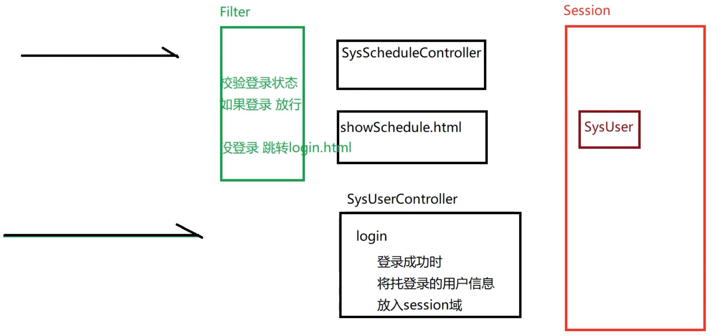

+ **开发`登录过滤器`,对`指定资源`的`请求进行过滤`**

```java title="Java"
package fun.xingji.schedule.filter;

import fun.xingji.schedule.pojo.SysUser;
import jakarta.servlet.*;
import jakarta.servlet.annotation.WebFilter;
import jakarta.servlet.http.HttpServletRequest;
import jakarta.servlet.http.HttpServletResponse;
import jakarta.servlet.http.HttpSession;

import java.io.IOException;

@WebFilter(urlPatterns = {"/showSchedule.html","/schedule/*"})
public class LoginFilter implements Filter {

    @Override
    public void doFilter(ServletRequest servletRequest, ServletResponse servletResponse, FilterChain filterChain) throws IOException, ServletException {
        // 参数父转子
        HttpServletRequest request = (HttpServletRequest) servletRequest;
        HttpServletResponse response = (HttpServletResponse) servletResponse;

        // 获得session域对象
        HttpSession session = request.getSession();

        // 从session域中获取登录的用户对象
        SysUser sysUser = (SysUser)session.getAttribute("sysUser");


        // 判断用户对象是否为空
        if (null == sysUser) {
            // 用户未登录,重定向到登录页
            response.sendRedirect("/login.html");
        }else  {
            // session中如果存在登录的用户 代表用户登录过,则放行
            filterChain.doFilter(request, response);
        }
    }
}
```

+ 修改用户登录请求的login方法,登录成功时,将用户信息存入session

```java title="Java"
 /**
     * 接收用登录请求,完成的登录业务接口
     * @param req
     * @param resp
     * @throws ServletException
     * @throws IOException
     */
    protected void login(HttpServletRequest req, HttpServletResponse resp) throws ServletException, IOException {
        // 1.接收用户名和密码
        String username = req.getParameter("username");
        String userPwd = req.getParameter("userPwd");

        // 2.调用服务层方法,根据用户名查询用户信息
        SysUser loginUser = userService.findByUsername(username);

        // 3.判断用户名是否匹配
        if (loginUser == null) {
            // 跳转到用户名有误提示页
            resp.sendRedirect("/loginUsernameError.html");
        }else if (!MD5Util.encrypt(userPwd).equals(loginUser.getUserPwd())) {
            // 4.判断密码是否匹配
            // 跳转到密码有误提示页
            resp.sendRedirect("/loginUserPwdError.html");
        }else  {
 
            /*================================================================*/

            // 登录成功之后，将登录的用户名信息放入session
            HttpSession session = req.getSession();
            session.setAttribute("sysUser", loginUser);

            // 合并书写: req.getSession().setAttribute("sysUser", loginUser);
            /*================================================================*/

            // 5.跳转到首页
            resp.sendRedirect("/showSchedule.html");
        }
    }
```


## Ajax

### 什么是ajax

+ **AJAX = Asynchronous JavaScript and XML（异步的 JavaScript 和 XML）。**

+ **AJAX 不是新的编程语言，而是一种使用现有标准的新方法。**

+ **AJAX 最大的优点是`在不重新加载整个页面的情况下`，可以`与服务器交换数据并更新部分网页内容`。**

+ **`AJAX 不需要任何浏览器插件`，但需要`用户允许JavaScript在浏览器上执行`。**

+ **`XMLHttpRequest`只是`实现 Ajax 的一种方式`。**

> **发送请求的方式:**
>
> 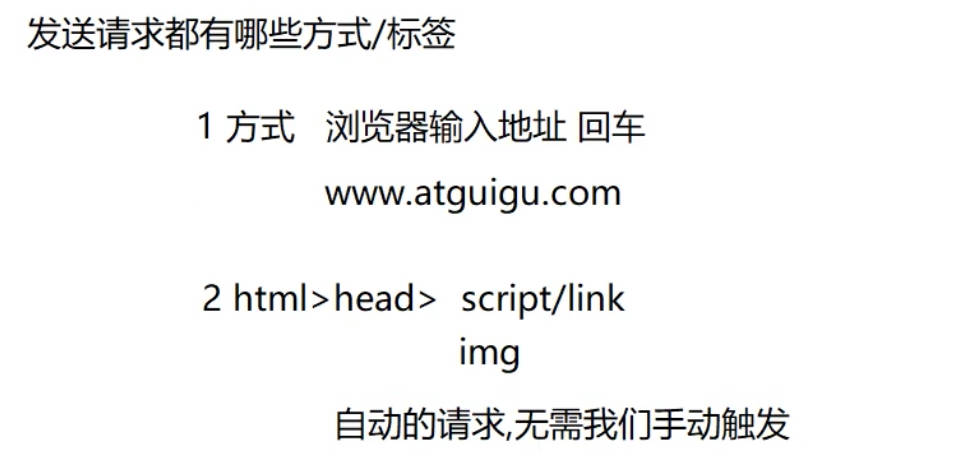
>
> 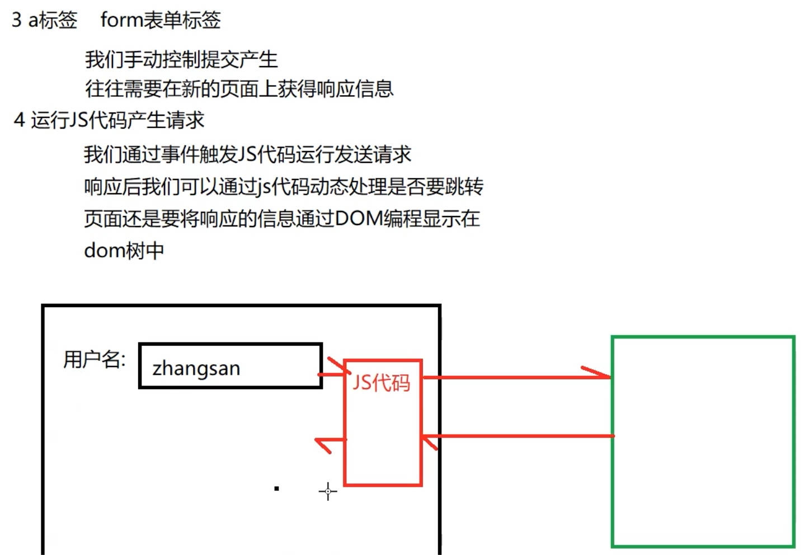

> **同步交互和异步交互:**
>
> 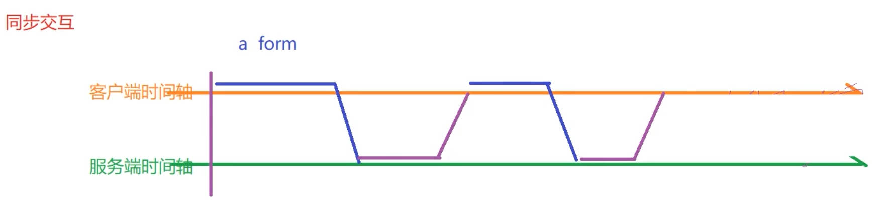
>
> 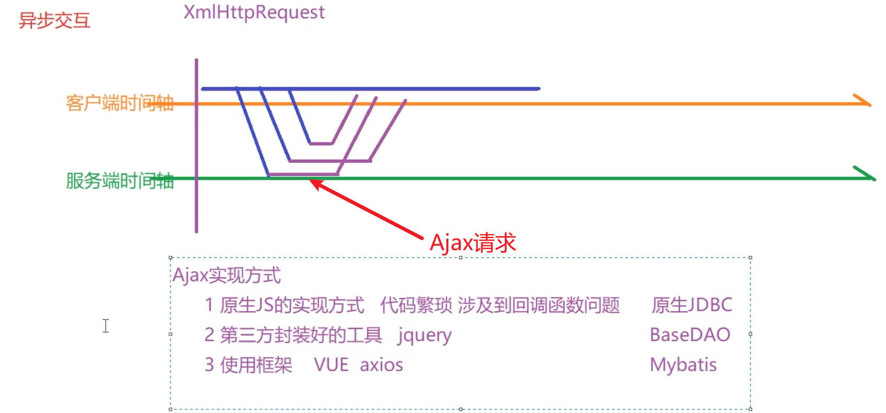


**ajax工作原理：**


+ **简单来说,我们之前发的请求通过类似`form表单标签`,`a标签` 这种方式,现在通过`运行js代码`动态决定`什么时候发送什么样的请求`**
+ **通过运行JS代码发送的请求浏览器`可以不用跳转页面`,我们可以在JS代码中决定`是否要跳转页面`**
+ **通过运行JS代码发送的请求,接收到返回结果后,我们可以将结果通过`dom编程渲染到页面的某些元素上`,实现`局部更新`**


### 如何实现ajax请求

> 原生**javascript方式进行ajax(了解):**

```html title="HTML"
<!DOCTYPE html>
<html lang="en" xmlns:th="http://www.thymeleaf.org">
<head>
    <meta charset="UTF-8">
    <title>Title</title>

    <script>
        function getMessage() {
            // 实例化一个xmlHttpRequest
            var request = new XMLHttpRequest();

            // 设置xmlHttpRequest对象的回调函数
            // request.readState    1 2 3 4
            // request.status       响应状态码   响应行状态码
            request.onreadystatechange = function () {
                if (this.readyState == 4 && this.status == 200) {
                    // 接收响应结果，处理结果
                    alert("后端响应了")

                    // request.responseText 后端响应回来的响应体中的数据
                    //console.log(request.responseText);

                    // 将信息放入到指定的位置
                    //var inputEle = document.getElementById("message");
                    //inputEle.value = request.responseText;

                    // window.location.href = "http://www.atguigu.com/";
                }
            }

            // 设置发送请求的方式和请求的资源路径
            request.open("GET", "/hello?username=zhangsan");
            // 发送请求
            request.send();
        }
    </script>
</head>
<body>


<button onclick="getMessage()">按钮</button>

<!--<input type="text" id="message" />-->

</body>
</html>
```

> **HelloServlet:**

```java
package fun.xingji.servlet;

import jakarta.servlet.ServletException;
import jakarta.servlet.annotation.WebServlet;
import jakarta.servlet.http.HttpServlet;
import jakarta.servlet.http.HttpServletRequest;
import jakarta.servlet.http.HttpServletResponse;

import java.io.IOException;

@WebServlet("/hello")
public class HelloServlet extends HttpServlet {
    @Override
    protected void service(HttpServletRequest req, HttpServletResponse resp) throws ServletException, IOException {

        // 接收参数
        String username = req.getParameter("username");

        // 做出响应
        resp.getWriter().write("hello:" + username);
    }
}
```

> **1.跳弹窗提示:**
>
> ```html title="HTML"
> <!DOCTYPE html>
> <html lang="en" xmlns:th="http://www.thymeleaf.org">
> <head>
>     <meta charset="UTF-8">
>     <title>Title</title>
> 
>     <script>
>         function getMessage() {
>             // 实例化一个xmlHttpRequest
>             var request = new XMLHttpRequest();
> 
>             // 设置xmlHttpRequest对象的回调函数
>             // request.readState    1 2 3 4
>             // request.status       响应状态码   响应行状态码
>             request.onreadystatechange = function () {
>                 if (this.readyState == 4 && this.status == 200) {
>                     // 接收响应结果，处理结果
>                     alert("后端响应了")
>                     
>                 }
>             }
> 
>             // 设置发送请求的方式和请求的资源路径
>             request.open("GET", "/hello?username=zhangsan");
>             // 发送请求
>             request.send();
>         }
>     </script>
> </head>
> <body>
> </body>
> </html>
> ```
>
> 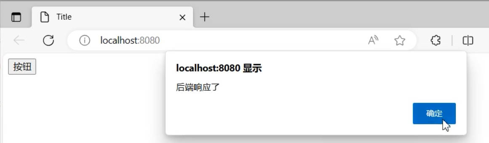
>
> **2.后端响应回来的响应体中的数据**
>
> ```html title="HTML"
> <!DOCTYPE html>
> <html lang="en" xmlns:th="http://www.thymeleaf.org">
> <head>
>     <meta charset="UTF-8">
>     <title>Title</title>
> 
>     <script>
>         function getMessage() {
>             // 实例化一个xmlHttpRequest
>             var request = new XMLHttpRequest();
> 
>             // 设置xmlHttpRequest对象的回调函数
>             // request.readState    1 2 3 4
>             // request.status       响应状态码   响应行状态码
>             request.onreadystatechange = function () {
>                 if (this.readyState == 4 && this.status == 200) {
>                     // 接收响应结果，处理结果
>                     // request.responseText 后端响应回来的响应体中的数据
>                     console.log(request.responseText);
>                     
>                 }
>             }
> 
>             // 设置发送请求的方式和请求的资源路径
>             request.open("GET", "/hello?username=zhangsan");
>             // 发送请求
>             request.send();
>         }
>     </script>
> </head>
> <body>
> </body>
> </html>
> ```
>
> 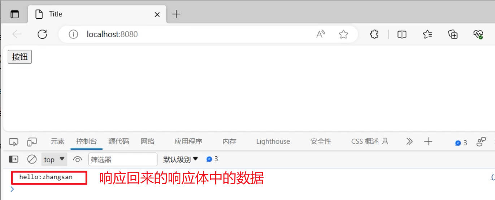
>
> **3.将信息放入到指定的位置**
>
> ```html title="HTML"
> <!DOCTYPE html>
> <html lang="en" xmlns:th="http://www.thymeleaf.org">
> <head>
>     <meta charset="UTF-8">
>     <title>Title</title>
> 
>     <script>
>         function getMessage() {
>             // 实例化一个xmlHttpRequest
>             var request = new XMLHttpRequest();
> 
>             // 设置xmlHttpRequest对象的回调函数
>             // request.readState    1 2 3 4
>             // request.status       响应状态码   响应行状态码
>             request.onreadystatechange = function () {
>                 if (this.readyState == 4 && this.status == 200) {
>                     // 接收响应结果，处理结果
>                     // request.responseText 后端响应回来的响应体中的数据
>                     console.log(request.responseText);
> 
>                     // 将信息放入到指定的位置
>                     var inputEle = document.getElementById("message");
>                     inputEle.value = request.responseText;
>                 }
>             }
> 
>             // 设置发送请求的方式和请求的资源路径
>             request.open("GET", "/hello?username=zhangsan");
>             // 发送请求
>             request.send();
>         }
>     </script>
> </head>
> <body>
> 
> <button onclick="getMessage()">按钮</button>
> <input type="text" id="message" />
> 
> </body>
> </html>
> ```
>
> 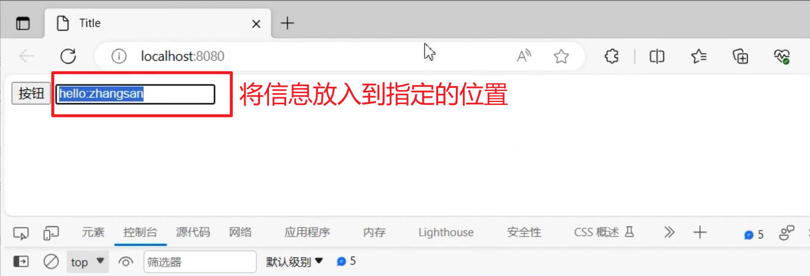


## 案例开发-日程管理-第四期

### 注册提交前校验用户名是否占用功能

>  **客户端代码编写处理**

+ **regist.html页面代码**

```html title="HTML"
<!DOCTYPE html>
<html lang="en">
<head>
    <meta charset="UTF-8">
    <title>Title</title>
    <style>

        .ht {
            text-align: center;
            color: cadetblue;
            font-family: 幼圆;
        }

        .tab {
            width: 500px;
            border: 5px solid cadetblue;
            margin: 0px auto;
            border-radius: 5px;
            font-family: 幼圆;
        }

        .ltr td {
            border: 1px solid powderblue;

        }

        .ipt {
            border: 0px;
            width: 50%;

        }

        .btn1 {
            border: 2px solid powderblue;
            border-radius: 4px;
            width: 60px;
            background-color: antiquewhite;

        }

        .msg {
            color: gold;
        }

        .buttonContainer {
            text-align: center;
        }
    </style>

    <script>
        function checkUsername() {
            var usernameReg = /^[a-zA-Z0-9]{5,10}$/
            var usernameInput = document.getElementById("usernameInput")
            var username = usernameInput.value
            var usernameMsg = document.getElementById("usernameMsg")
            if (!usernameReg.test(username)) {
                usernameMsg.innerText = "格式有误"
                return false
            }


/*==============================添加Ajax功能=======================*/
            /*
                * 1 响应乱码问题
                * 2 响应信息格式不规范,处理方式不规范
                *       后端响应回来的信息应当有一个统一的格式,前后端共同遵守
                *       响应一个JSON串
                *       {
                *           "code":"101  102 103 104 105 201 202 203 204 205 ...  ", 业务状态码   本次请求的业务是否成功? 如果失败了,是什么原因失败了? 不是响应报文中的响应码
                *           "message":"业务状态码的  补充说明/描述",
                *           "data":{}  本次响应的数据   成功/不成功  List<Schedule> ...
                *           ... ...
                *       }

                * 3 校验不通过,无法阻止表单提交的问题   未来使用VUE axios 结合promise处理
                * */

            // 格式正确，通过之后，继续校验用户名是否被占用
            var request = new XMLHttpRequest();
            // 设置回调函数，设置响应回来的信息如何处理
            request.onreadystatechange = function () {
                // request.readyState == 4 代表请求结束,已经接收到响应结果
                // request.status== 200  表示后端响应状态码是200
                if (request.readyState == 4 && request.status == 200) {
                    /*// 将后端响应回来的数据放入到指定位置
                    console.log(request.responseText)*/

                    // 后端的响应的JSON字符串转换为前端的对象
                    var result = JSON.parse(request.responseText);
                    //  判断业务码是否是200
                    if (result.code !== 200) {
                        usernameMsg.innerText = "不可用"
                    }
                }
            }

            // 设置请求方式,请求资源路径,是否为异步请求
            request.open("GET", "/user/checkUsernameUsed?username=" + username)
            // 发送请求
            request.send()
/*==============================添加Ajax功能=======================*/

            // 前面校验都通过
            usernameMsg.innerText = "OK"
            return true
        }


        function checkUserPwd() {
            var userPwdReg = /^\d{6}$/
            var userPwdInput = document.getElementById("userPwdInput")
            var userPwd = userPwdInput.value
            var userPwdMsg = document.getElementById("userPwdMsg")
            if (!userPwdReg.test(userPwd)) {
                userPwdMsg.innerText = "格式有误"
                return false
            }
            userPwdMsg.innerText = "OK"
            return true
        }


        function checkReUserPwd() {
            var userPwdReg = /^\d{6}$/
            // 再次输入的密码的格式
            var reUserPwdInput = document.getElementById("reUserPwdInput")
            var reUserPwd = reUserPwdInput.value
            var reUserPwdMsg = document.getElementById("reUserPwdMsg")
            if (!userPwdReg.test(reUserPwd)) {
                reUserPwdMsg.innerText = "格式有误"
                return false
            }
            // 获得上次密码,对比两次密码是否一致
            var userPwdInput = document.getElementById("userPwdInput")
            var userPwd = userPwdInput.value
            if (reUserPwd != userPwd) {
                reUserPwdMsg.innerText = "两次密码不一致"
                return false
            }
            reUserPwdMsg.innerText = "OK"
            return true
        }


        function checkForm() {
            var flag1 = checkUsername()
            var flag2 = checkUserPwd()
            var flag3 = checkReUserPwd()

            return flag1 && flag2 && flag3
        }
    </script>


</head>
<body>
<h1 class="ht">欢迎使用日程管理系统</h1>
<h3 class="ht">请注册</h3>
<form method="post" action="/user/regist" onsubmit="return checkForm()">
    <table class="tab" cellspacing="0px">
        <tr class="ltr">
            <td>请输入账号</td>
            <td>
                <input class="ipt" id="usernameInput" type="text" name="username" onblur="checkUsername()">
                <span id="usernameMsg" class="msg"></span>
            </td>
        </tr>
        <tr class="ltr">
            <td>请输入密码</td>
            <td>
                <input class="ipt" id="userPwdInput" type="password" name="userPwd" onblur="checkUserPwd()">
                <span id="userPwdMsg" class="msg"></span>
            </td>
        </tr>
        <tr class="ltr">
            <td>确认密码</td>
            <td>
                <input class="ipt" id="reUserPwdInput" type="password" onblur="checkReUserPwd()">
                <span id="reUserPwdMsg" class="msg"></span>
            </td>
        </tr>
        <tr class="ltr">
            <td colspan="2" class="buttonContainer">
                <input class="btn1" type="submit" value="注册">
                <input class="btn1" type="reset" value="重置">
                <button class="btn1"><a href="login.html">去登录</a></button>
            </td>
        </tr>
    </table>

</form>
</body>
</html>
```


>  **服务端代码处理**

+ **添加`公共的JSON数据响应格式类`**

```java title="Java"
package fun.xingji.schedule.common;

/**
 * 业务含义和状态码对应关系的枚举
 */
public enum ResultCodeEnum {

    SUCCESS(200,"success"), // 成功码
    USERNAEM_ERROR(501,"usernameError"), // 用户名有误
    PASSWORD_ERROR(503,"passwordError"), // 密码有误
    NOTLOGIN(504,"notlogin"), // 用户没有登录账户
    USERNAME_USED(505,"usernameUsed"); // 用户名被占用

    private Integer code;
    private String message;

    // 私有构造器
    private ResultCodeEnum(Integer code, String message) {
        this.code = code;
        this.message = message;
    }

    public Integer getCode() {
        return code;
    }

    public String getMessage() {
        return message;
    }
}
```

```java title="Java"
package fun.xingji.schedule.common;

/**
 * 全局统一响应的JSON格式处理类
 * {
 *    "code":"101  102 103 104 105 201 202 203 204 205 ...  ", 业务状态码   本次请求的业务是否成功? 如果失败了,是什么原因失败了? 不是响应报文中的响应码
 *    "message":"业务状态码的  补充说明/描述",
 *    "data":{}  本次响应的数据   成功/不成功  List<Schedule> ...
 *     ... ...
 * }
 */
public class Result<T> {
    // 返回码
    private Integer code;
    // 返回消息
    private String message;
    // 返回数据
    private T data;

    public Result(){
    }

    // 返回数据
    protected static <T> Result<T> build(T data) {
        Result<T> result = new Result<T>();
        if (data != null)
            result.setData(data);
        return result;
    }
    // 重载方法
    public static <T> Result<T> build(T body, Integer code, String message) {
        Result<T> result = build(body);
        result.setCode(code);
        result.setMessage(message);
        return result;
    }
    public static <T> Result<T> build(T body, ResultCodeEnum resultCodeEnum) {
        Result<T> result = build(body);
        result.setCode(resultCodeEnum.getCode());
        result.setMessage(resultCodeEnum.getMessage());
        return result;
    }


    /**
     * 操作成功
     * @param data  baseCategory1List
     * @param <T>
     * @return
     */
    public static<T> Result<T> ok(T data){
        Result<T> result = build(data);
        return build(data, ResultCodeEnum.SUCCESS);
    }
    public Result<T> message(String msg){
        this.setMessage(msg);
        return this;
    }
    public Result<T> code(Integer code){
        this.setCode(code);
        return this;
    }
    public Integer getCode() {
        return code;
    }
    public void setCode(Integer code) {
        this.code = code;
    }
    public String getMessage() {
        return message;
    }
    public void setMessage(String message) {
        this.message = message;
    }
    public T getData() {
        return data;
    }
    public void setData(T data) {
        this.data = data;
    }
}
```

+ **增加Jackson依赖**


+ **添加WEBUtil工具类**

```java title="Java"
package fun.xingji.schedule.util;

import com.fasterxml.jackson.databind.ObjectMapper;
import fun.xingji.schedule.common.Result;
import jakarta.servlet.http.HttpServletRequest;
import jakarta.servlet.http.HttpServletResponse;

import java.io.BufferedReader;
import java.io.IOException;
import java.text.SimpleDateFormat;

public class WebUtil {

    private static ObjectMapper objectMapper;
    // 初始化objectMapper
    static{
        objectMapper=new ObjectMapper();
        // 设置JSON和Object转换时的时间日期格式
        objectMapper.setDateFormat(new SimpleDateFormat("yyyy-MM-dd HH:mm:ss"));
    }

    // 从请求中获取JSON串并转换为Object
    public static <T> T readJson(HttpServletRequest request, Class<T> clazz){
        T t =null;
        BufferedReader reader = null;
        try {
            reader = request.getReader();
            StringBuffer buffer =new StringBuffer();
            String line =null;
            while((line = reader.readLine())!= null){
                buffer.append(line);
            }

            t= objectMapper.readValue(buffer.toString(),clazz);
        } catch (IOException e) {
            throw new RuntimeException(e);
        }
        return t;
    }

    // 将Result对象转换成JSON串并放入响应对象
    public static void writeJson(HttpServletResponse response, Result result){
        response.setContentType("application/json;charset=UTF-8");
        try {
            String json = objectMapper.writeValueAsString(result);
            response.getWriter().write(json);
        } catch (IOException e) {
            throw new RuntimeException(e);
        }
    }
}
```


+ **用户名校验业务接口代码**

```java title="Java"
/**
     * 注册时,接收要注册的用户名,校验用户名是否被占用的业务接口
     * @param req
     * @param resp
     * @throws ServletException
     * @throws IOException
     */
    protected void checkUsernameUsed(HttpServletRequest req, HttpServletResponse resp) throws ServletException, IOException {
        // 接收用户名
        String username = req.getParameter("username");

        // 调用服务层业务处理方法查询该用户名是否有对应的用户名
        SysUser sysUser = userService.findByUsername(username);

        // 如果有 响应 已占用
        // 如果没有 响应 可用
        Result result = Result.ok(null);

        if (sysUser != null) {
            Result.build(null, ResultCodeEnum.USERNAME_USED);
        }

        /*// 将result对象转换为JSON串响应给客户端
        // ObjectMapper
        ObjectMapper mapper = new ObjectMapper();
        String info = mapper.writeValueAsString(result);

        // 告诉客户端响应给你的是一个JSON串
        resp.setContentType("application/json;charset=utf-8");
        
        // 作出响应
        resp.getWriter().println(info);*/

        // 将result对象转换为JSON串响应给客户端
        WebUtil.writeJson(resp,result);
    }
```