## 项目简介

### 微头条业务简介

> 微头条新闻发布和浏览平台,主要包含业务如下

+ 用户功能
    + 注册功能
    + 登录功能
+ 头条新闻
    + 新闻的分页浏览
    + 通过标题关键字搜索新闻
    + 查看新闻详情
    + 新闻的修改和删除
+ 权限控制
    + 用户只能修改和自己发布的头条新闻

### 技术栈介绍

> 前端技术栈

+ ES6作为基础JS语法
+ nodejs用于运行环境
+ npm用于项目依赖管理工具
+ vite用于项目的构建架工具
+ Vue3用于项目数据的渲染框架
+ Axios用于前后端数据的交互
+ Router用于页面的跳转
+ Pinia用于存储用户的数据
+ LocalStorage作为用户校验token的存储手段
+ Element-Plus提供组件

> 后端技术栈

+ JAVA作为开发语言,版本为JDK17
+ Tomcat作为服务容器,版本为10.1.7
+ Mysql8用于项目存储数据
+ Servlet用于控制层实现前后端数据交互
+ JDBC用于实现数据的CURD
+ Druid用于提供数据源的连接池
+ MD5用于用户密码的加密
+ Jwt用于token的生成和校验
+ Jackson用于转换JSON
+ Filter用于用户登录校验和跨域处理
+ Lombok用于处理实体类


### 功能展示

> 头条首页信息搜索


> 登录功能


> 注册功能


> 权限控制功能


> 发布头条功能


> 修改头条功能


> 删除头条功能


## 前端项目环境搭建

+ 解压前端项目代码并存放到磁盘的合适位置


+ 使用vscode打开工程


+ 进入项目后打开集成终端或者在src上右击选择在集成终端中打开


+ 通过 npm run dev启动前端项目


## 后端项目环境搭建

###  数据库准备

> `news_users` 用户表


> `news_type` 新闻类型表


> `news_headline` 新闻信息表


> **数据库创建SQL**

+ 导入资料中的top_news.sql文件即可


> **更新头条发布时间和最后修改时间:**
>
> ```sql
> update news_headline set create_time =now() ,update_time =now()
> ```


### MVC项目架构模式

>  MVC（Model View Controller）是软件工程中的一种**`软件架构模式`**，它把软件系统分为**`模型`**、**`视图`**和**`控制器`**三个基本部分。用一种业务逻辑、数据、界面显示分离的方法组织代码，将业务逻辑聚集到一个部件里面，在改进和个性化定制界面及用户交互的同时，不需要重新编写业务逻辑。

+ **M**：Model 模型层,具体功能如下
    1. 存放和数据库对象的实体类以及一些用于存储非数据库表完整相关的VO对象
    2. 存放一些对数据进行逻辑运算操作的的一些业务处理代码

+ **V**：View 视图层,具体功能如下
    1. 存放一些视图文件相关的代码 html css js等
    2. 在前后端分离的项目中,后端已经没有视图文件,该层次已经衍化成独立的前端项目

+ **C**：Controller 控制层,具体功能如下
    	1. 接收客户端请求,获得请求数据
      2. 将准备好的数据响应给客户端

> MVC模式下,项目中的常见包

+ M:
    1. 实体类包(pojo /entity /bean) 专门存放和数据库对应的实体类和一些VO对象
    2. 数据库访问包(dao/mapper)  专门存放对数据库不同表格CURD方法封装的一些类
    3. 服务包(service)                       专门存放对数据进行业务逻辑预算的一些类

+ C:
    1. 控制层包(controller)

+ V:
    1. web目录下的视图资源 html css js img 等
    2. 前端工程化后,在后端项目中已经不存在了


### 搭建项目

#### 创建WEB项目


#### 导入依赖


#### 准备包结构


+ controller 控制层代码,主要由Servlet组成
+ service     服务层代码,主要用于处理业务逻辑
+ dao          数据访问层,主要用户定义对于各个表格的CURD的方法
+ pojo         实体类层,主要用于存放和数据库对应的实体类以及一些VO对象
+ util           工具类包,主要用存放一些工具类
+ common  公共包,主要用户存放一些其他公共代码
+ filters       过滤器包,专门用于存放一些过滤器
+ test          测试代码包,专门用于定义一些测试的功能代码,上线前应该删掉,后期用maven可以自动处理掉

### 准备工具类

#### 异步响应规范格式类

+ **Result类**

```java title="Java"
package fun.xingji.headline.common;

/**
 * 全局统一返回结果类
 */
public class Result<T> {
    // 返回码
    private Integer code;
    // 返回消息
    private String message;
    // 返回数据
    private T data;
    public Result(){}
    // 返回数据
    protected static <T> Result<T> build(T data) {
        Result<T> result = new Result<T>();
        if (data != null)
            result.setData(data);
        return result;
    }
    public static <T> Result<T> build(T body, Integer code, String message) {
        Result<T> result = build(body);
        result.setCode(code);
        result.setMessage(message);
        return result;
    }
    public static <T> Result<T> build(T body, ResultCodeEnum resultCodeEnum) {
        Result<T> result = build(body);
        result.setCode(resultCodeEnum.getCode());
        result.setMessage(resultCodeEnum.getMessage());
        return result;
    }
    /**
     * 操作成功
     * @param data  baseCategory1List
     * @param <T>
     * @return
     */
    public static<T> Result<T> ok(T data){
        Result<T> result = build(data);
        return build(data, ResultCodeEnum.SUCCESS);
    }
    public Result<T> message(String msg){
        this.setMessage(msg);
        return this;
    }
    public Result<T> code(Integer code){
        this.setCode(code);
        return this;
    }
    public Integer getCode() {
        return code;
    }
    public void setCode(Integer code) {
        this.code = code;
    }
    public String getMessage() {
        return message;
    }
    public void setMessage(String message) {
        this.message = message;
    }
    public T getData() {
        return data;
    }
    public void setData(T data) {
        this.data = data;
    }
}
```

+ **ResultCodeEnum 枚举类**

```java title="Java"
package fun.xingji.headline.common;

/**
 * 统一返回结果状态信息类
 */
public enum ResultCodeEnum {

    SUCCESS(200,"success"), // 成功码
    USERNAEM_ERROR(501,"usernameError"), // 用户名有误
    PASSWORD_ERROR(503,"passwordError"), // 密码有误
    NOTLOGIN(504,"notlogin"), // 用户没有登录账户
    USERNAME_USED(505,"usernameUsed"); // 用户名被占用

    private Integer code;
    private String message;

    // 私有构造器
    private ResultCodeEnum(Integer code, String message) {
        this.code = code;
        this.message = message;
    }

    public Integer getCode() {
        return code;
    }

    public String getMessage() {
        return message;
    }
}
```


#### MD5加密工具类

```java title="Java"
package fun.xingji.headline.util;

import java.security.MessageDigest;
import java.security.NoSuchAlgorithmException;

public class MD5Util {

    public static String encrypt(String strSrc) {
        try {
            char hexChars[] = { '0', '1', '2', '3', '4', '5', '6', '7', '8',
                    '9', 'a', 'b', 'c', 'd', 'e', 'f' };
            byte[] bytes = strSrc.getBytes();
            MessageDigest md = MessageDigest.getInstance("MD5");
            md.update(bytes);
            bytes = md.digest();
            int j = bytes.length;
            char[] chars = new char[j * 2];
            int k = 0;
            for (int i = 0; i < bytes.length; i++) {
                byte b = bytes[i];
                chars[k++] = hexChars[b >>> 4 & 0xf];
                chars[k++] = hexChars[b & 0xf];
            }
            return new String(chars);
        } catch (NoSuchAlgorithmException e) {
            e.printStackTrace();
            throw new RuntimeException("MD5加密出错！！+" + e);
        }
    }
}
```


#### JDBCUtil连接池工具类

```java title="Java"
package fun.xingji.headline.util;

import com.alibaba.druid.pool.DruidDataSourceFactory;

import javax.sql.DataSource;
import java.io.IOException;
import java.io.InputStream;
import java.sql.Connection;
import java.sql.SQLException;
import java.util.Properties;

public class JDBCUtil {

    private static ThreadLocal<Connection> threadLocal =new ThreadLocal<>();

    private static DataSource dataSource;
    // 初始化连接池
    static{
        // 可以帮助我们读取.properties配置文件
        Properties properties =new Properties();
        InputStream resourceAsStream = JDBCUtil.class.getClassLoader().getResourceAsStream("jdbc.properties");
        try {
            properties.load(resourceAsStream);
        } catch (IOException e) {
            throw new RuntimeException(e);
        }

        try {
            dataSource = DruidDataSourceFactory.createDataSource(properties);
        } catch (Exception e) {
            throw new RuntimeException(e);
        }


    }
    /*1 向外提供连接池的方法*/
    public static DataSource getDataSource(){
        return dataSource;
    }

    /*2 向外提供连接的方法*/
    public static Connection getConnection(){
        Connection connection = threadLocal.get();
        if (null == connection) {
            try {
                connection = dataSource.getConnection();
            } catch (SQLException e) {
                throw new RuntimeException(e);
            }
            threadLocal.set(connection);
        }

        return connection;
    }


    /*定义一个归还连接的方法 (解除和ThreadLocal之间的关联关系) */
    public static void releaseConnection(){
        Connection connection = threadLocal.get();
        if (null != connection) {
            threadLocal.remove();
            // 把连接设置回自动提交的连接
            try {
                connection.setAutoCommit(true);
                // 自动归还到连接池
                connection.close();
            } catch (SQLException e) {
                throw new RuntimeException(e);
            }
        }
    }
}
```

+ 添加jdbc.properties配置文件

```properties title="properties"
driverClassName=com.mysql.cj.jdbc.Driver
url=jdbc:mysql://localhost:3306/top_news
username=root
password=root
initialSize=5
maxActive=10
maxWait=1000
```


####  JwtHelper工具类

```java title="Java"
package fun.xingji.headline.util;

import com.alibaba.druid.util.StringUtils;
import io.jsonwebtoken.*;

import java.util.Date;

public class JwtHelper {

    private static long tokenExpiration = 1000*60*60;
    private static String tokenSignKey = "123456";

    //生成token字符串
    public static String createToken(Long userId ) {
        String token = Jwts.builder()

                .setSubject("YYGH-USER")
                .setExpiration(new Date(System.currentTimeMillis() + tokenExpiration))
                .claim("userId", userId)

                .signWith(SignatureAlgorithm.HS512, tokenSignKey)
                .compressWith(CompressionCodecs.GZIP)
                .compact();
        return token;
    }

    //从token字符串获取userid
    public static Long getUserId(String token) {
        if(StringUtils.isEmpty(token)) return null;
        Jws<Claims> claimsJws = Jwts.parser().setSigningKey(tokenSignKey).parseClaimsJws(token);
        Claims claims = claimsJws.getBody();
        Integer userId = (Integer)claims.get("userId");
        return userId.longValue();
    }


    //判断token是否有效
    public static boolean isExpiration(String token){
        try {
            boolean isExpire = Jwts.parser()
                    .setSigningKey(tokenSignKey)
                    .parseClaimsJws(token)
                    .getBody()
                    .getExpiration().before(new Date());
            //没有过期，有效，返回false
            return isExpire;
        }catch(Exception e) {
            //过期出现异常，返回true
            return true;
        }
    }
}
```


#### JSON转换的WEBUtil工具类

```java title="Java"
package fun.xingji.headline.util;

import com.fasterxml.jackson.databind.ObjectMapper;
import fun.xingji.headline.common.Result;
import jakarta.servlet.http.HttpServletRequest;
import jakarta.servlet.http.HttpServletResponse;

import java.io.BufferedReader;
import java.io.IOException;
import java.text.SimpleDateFormat;

public class WebUtil {

    private static ObjectMapper objectMapper;
    // 初始化objectMapper
    static{
        objectMapper=new ObjectMapper();
        // 设置JSON和Object转换时的时间日期格式
        objectMapper.setDateFormat(new SimpleDateFormat("yyyy-MM-dd HH:mm:ss"));
    }
    // 从请求中获取JSON串并转换为Object
    public static <T> T readJson(HttpServletRequest request,Class<T> clazz){
        T t =null;
        BufferedReader reader = null;
        try {
            reader = request.getReader();
            StringBuffer buffer =new StringBuffer();
            String line =null;
            while((line = reader.readLine())!= null){
                buffer.append(line);
            }

            t= objectMapper.readValue(buffer.toString(),clazz);
        } catch (IOException e) {
            throw new RuntimeException(e);
        }
        return t;
    }
    // 将Result对象转换成JSON串并放入响应对象
    public static void writeJson(HttpServletResponse response, Result result){
        response.setContentType("application/json;charset=UTF-8");
        try {
            String json = objectMapper.writeValueAsString(result);
            response.getWriter().write(json);
        } catch (IOException e) {
            throw new RuntimeException(e);
        }
    }
}
```


### 准备各层的接口和实现类

> **注意启用注解处理(启用后Lombok才生效):**
>
> 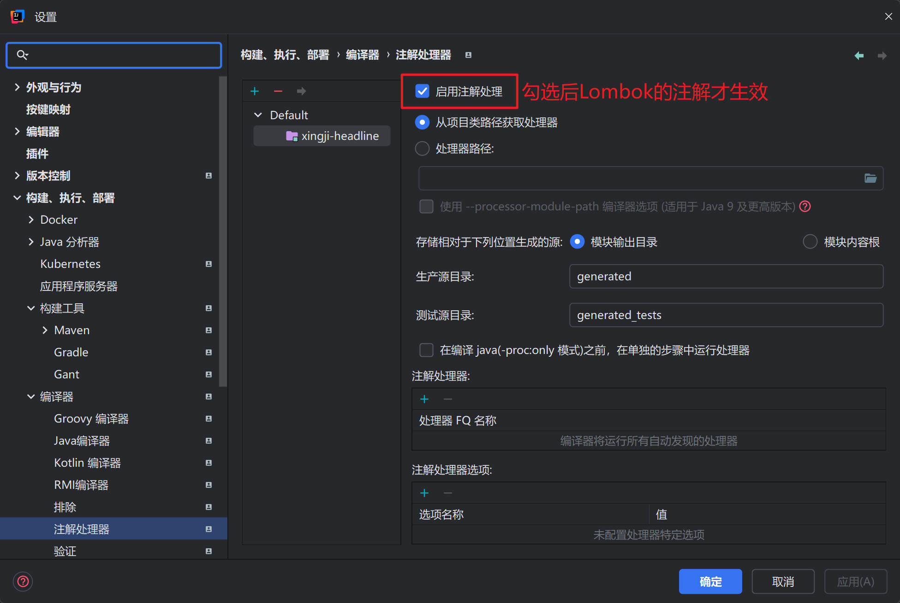


#### 准备实体类和VO对象

> **NewsUser**
>
> 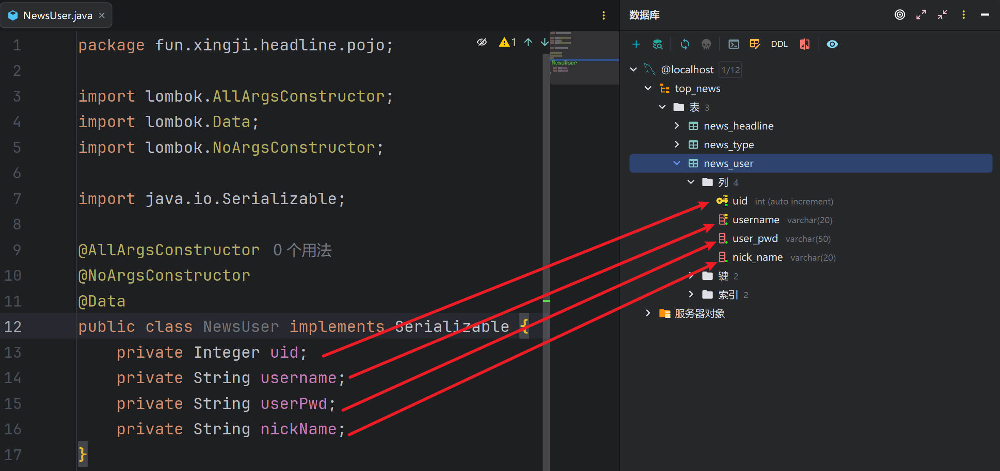

```java title="Java"
package fun.xingji.headline.pojo;

import lombok.AllArgsConstructor;
import lombok.Data;
import lombok.NoArgsConstructor;

import java.io.Serializable;

@AllArgsConstructor
@NoArgsConstructor
@Data
public class NewsUser implements Serializable {
    private Integer uid;
    private String username;
    private String userPwd;
    private String nickName;
}
```

> **NewsType**
>
> 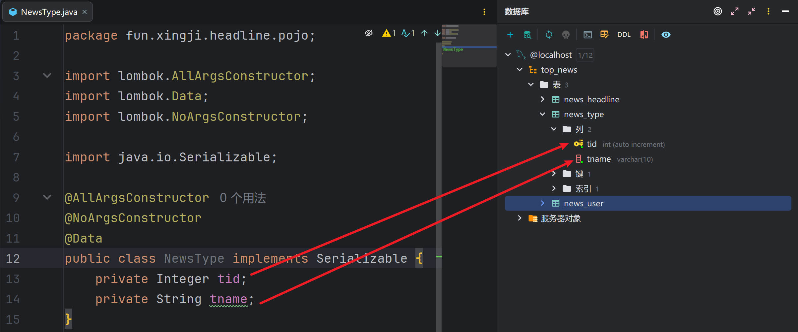

```java title="Java"
package fun.xingji.headline.pojo;

import lombok.AllArgsConstructor;
import lombok.Data;
import lombok.NoArgsConstructor;

import java.io.Serializable;

@AllArgsConstructor
@NoArgsConstructor
@Data
public class NewsType implements Serializable {
    private Integer tid;
    private String tname;
}
```

> **NewsHeadline**
>
> 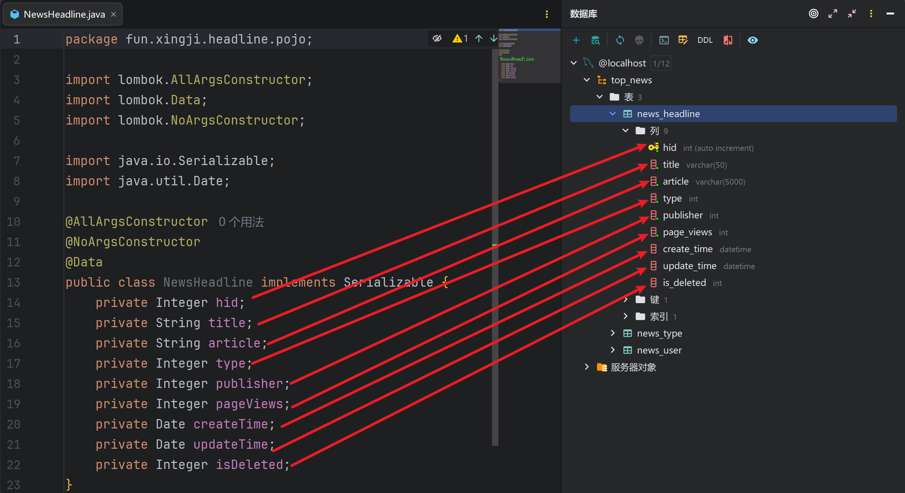

```java title="Java"
package fun.xingji.headline.pojo;

import lombok.AllArgsConstructor;
import lombok.Data;
import lombok.NoArgsConstructor;

import java.io.Serializable;
import java.util.Date;

@AllArgsConstructor
@NoArgsConstructor
@Data
public class NewsHeadline implements Serializable {
    private Integer hid;
    private String title;
    private String article;
    private Integer type;
    private Integer publisher;
    private Integer pageViews;
    private Date createTime;
    private Date updateTime;
    private Integer isDeleted;
}
```

> **HeadlineQueryVo**

```java title="Java"
package fun.xingji.headline.pojo.vo;

/*
用于封装分页查询的数据
 */
import lombok.AllArgsConstructor;
import lombok.Data;
import lombok.NoArgsConstructor;

import java.io.Serializable;


@AllArgsConstructor
@NoArgsConstructor
@Data
public class HeadlineQueryVo implements Serializable {
    private String keyWords;
    private Integer type ;
    private Integer pageNum;
    private Integer pageSize;
}
```

> **HeadlinePageVo**

```java title="Java"
package fun.xingji.headline.pojo.vo;

/*
用于封装响应给客户端的分页查询数据
 */
import lombok.AllArgsConstructor;
import lombok.Data;
import lombok.NoArgsConstructor;

import java.io.Serializable;


@AllArgsConstructor
@NoArgsConstructor
@Data
public class HeadlinePageVo implements Serializable {
    private Integer hid;
    private String title;
    private Integer type;
    private Integer pageViews;
    private Long pastHours;
    private Integer publisher;
}
```

> **HeadlineDetailVo**

```java title="Java"
package fun.xingji.headline.pojo.vo;

/*
用于显示新闻详情数据
 */

import lombok.AllArgsConstructor;
import lombok.Data;
import lombok.NoArgsConstructor;

import java.io.Serializable;

@AllArgsConstructor
@NoArgsConstructor
@Data
public class HeadlineDetailVo implements Serializable {
    private Integer hid;
    private String title;
    private String article;
    private Integer type;
    private String typeName;
    private Integer pageViews;
    private Long pastHours;
    private Integer publisher;
    private String author;
}
```


#### DAO层接口和实现类


> **`BaseDao基础类`,封装了`公共的查询方法`和`公共的增删改方法`**

+ **`注意,所有的Dao接口的实现类都要继承BaseDao`**

```java title="Java"
package fun.xingji.headline.dao;

import fun.xingji.headline.util.JDBCUtil;

import java.lang.reflect.Field;
import java.sql.*;
import java.time.LocalDateTime;
import java.util.ArrayList;
import java.util.List;

public class BaseDao {
    // 公共的查询方法  返回的是单个对象
    public <T> T baseQueryObject(Class<T> clazz, String sql, Object ... args) {
        T t = null;
        Connection connection = JDBCUtil.getConnection();
        PreparedStatement preparedStatement = null;
        ResultSet resultSet = null;
        int rows = 0;
        try {
            // 准备语句对象
            preparedStatement = connection.prepareStatement(sql);
            // 设置语句上的参数
            for (int i = 0; i < args.length; i++) {
                preparedStatement.setObject(i + 1, args[i]);
            }

            // 执行 查询
            resultSet = preparedStatement.executeQuery();
            if (resultSet.next()) {
                t = (T) resultSet.getObject(1);
            }
        } catch (Exception e) {
            throw new RuntimeException(e);
        } finally {
            if (null != resultSet) {
                try {
                    resultSet.close();
                } catch (SQLException e) {
                    throw new RuntimeException(e);
                }
            }
            if (null != preparedStatement) {
                try {
                    preparedStatement.close();
                } catch (SQLException e) {
                    throw new RuntimeException(e);
                }

            }
            JDBCUtil.releaseConnection();
        }
        return t;
    }
    // 公共的查询方法  返回的是对象的集合

    public <T> List<T> baseQuery(Class clazz, String sql, Object ... args){
        List<T> list =new ArrayList<>();
        Connection connection = JDBCUtil.getConnection();
        PreparedStatement preparedStatement=null;
        ResultSet resultSet =null;
        int rows = 0;
        try {
            // 准备语句对象
            preparedStatement = connection.prepareStatement(sql);
            // 设置语句上的参数
            for (int i = 0; i < args.length; i++) {
                preparedStatement.setObject(i+1,args[i]);
            }

            // 执行 查询
            resultSet = preparedStatement.executeQuery();

            ResultSetMetaData metaData = resultSet.getMetaData();
            int columnCount = metaData.getColumnCount();

            // 将结果集通过反射封装成实体类对象
            while (resultSet.next()) {
                // 使用反射实例化对象
                Object obj =clazz.getDeclaredConstructor().newInstance();

                for (int i = 1; i <= columnCount; i++) {
                    String columnName = metaData.getColumnLabel(i);
                    Object value = resultSet.getObject(columnName);
                    // 处理datetime类型字段和java.util.Data转换问题
                    if(value.getClass().equals(LocalDateTime.class)){
                        value= Timestamp.valueOf((LocalDateTime) value);
                    }
                    Field field = clazz.getDeclaredField(columnName);
                    field.setAccessible(true);
                    field.set(obj,value);
                }

                list.add((T)obj);
            }

        } catch (Exception e) {
            throw new RuntimeException(e);
        } finally {
            if (null !=resultSet) {
                try {
                    resultSet.close();
                } catch (SQLException e) {
                    throw new RuntimeException(e);
                }
            }
            if (null != preparedStatement) {
                try {
                    preparedStatement.close();
                } catch (SQLException e) {
                    throw new RuntimeException(e);
                }
            }
            JDBCUtil.releaseConnection();
        }
        return list;
    }

    // 通用的增删改方法
    public int baseUpdate(String sql,Object ... args) {
        // 获取连接
        Connection connection = JDBCUtil.getConnection();
        PreparedStatement preparedStatement=null;
        int rows = 0;
        try {
            // 准备语句对象
            preparedStatement = connection.prepareStatement(sql);
            // 设置语句上的参数
            for (int i = 0; i < args.length; i++) {
                preparedStatement.setObject(i+1,args[i]);
            }

            // 执行 增删改 executeUpdate
            rows = preparedStatement.executeUpdate();
            // 释放资源(可选)


        } catch (SQLException e) {
            throw new RuntimeException(e);
        } finally {
            if (null != preparedStatement) {
                try {
                    preparedStatement.close();
                } catch (SQLException e) {
                    throw new RuntimeException(e);
                }

            }
            JDBCUtil.releaseConnection();
        }
        // 返回的是影响数据库记录数
        return rows;
    }
}
```

> **dao层的`所有接口`**

```java title="Java"
package fun.xingji.headline.dao;
public interface NewsHeadLineDao {
    
}

package fun.xingji.headline.dao;
public interface NewsTypeDao {
    
}


package fun.xingji.headline.dao;
public interface NewsUserDao {

}
```

> **dao层`所有实现类`**

```java title="Java"
package fun.xingji.headline.dao.impl;
import fun.xingji.headline.dao.BaseDao;
import fun.xingji.headline.dao.NewsHeadlineDao;
public class NewsHeadlineDaoImpl extends BaseDao implements NewsHeadLineDao{
    
}

package fun.xingji.headline.dao.impl;
import fun.xingji.headline.dao.BaseDao;
import fun.xingji.headline.dao.NewsTypeDao;
public class NewsTypeDaoImpl extends BaseDao implements NewsTypeDao{
    
}

package fun.xingji.headline.dao.impl;
import fun.xingji.headline.dao.BaseDao;
import fun.xingji.headline.dao.NewsUserDao;
public class NewsUserDaoImpl extends BaseDao implements NewsUserDao{
    
}
```


#### Service层接口和实现类


> **service层`所有接口`**

```java title="Java"
package fun.xingji.headline.service;
public interface NewsHeadlineService {
    
}

package fun.xingji.headline.service;
public interface NewsTypeService {
    List<NewsType> findAll();
}

package fun.xingji.headline.service;
public interface NewsUserService {
    
}
```

> **service层`所有实现类`**

```java title="Java"
package fun.xingji.headline.service.impl;
import fun.xingji.headline.service.NewsHeadlineService;
public class NewsHeadlineServiceImpl  implements NewsHeadlineService {
}


package fun.xingji.headline.service.impl;
import fun.xingji.headline.service.NewsTypeService;
public class NewsTypeServiceImpl implements NewsTypeService {
  
}

package fun.xingji.headline.service.impl;
import fun.xingji.headline.service.NewsUserService;
public class NewsUserServiceImpl implements NewsUserService {
   
}

```


#### Controller层接口和实现类

> **BaseController 用于`将路径关联到处理方法`的基础控制器**

+ **`所有的Controller都要继承该类`**

```java title="Java"
package fun.xingji.headline.controller;

import jakarta.servlet.ServletException;
import jakarta.servlet.http.HttpServlet;
import jakarta.servlet.http.HttpServletRequest;
import jakarta.servlet.http.HttpServletResponse;

import java.io.IOException;
import java.lang.reflect.Method;

public class BaseController extends HttpServlet {
    @Override
    protected void service(HttpServletRequest req, HttpServletResponse resp) throws ServletException, IOException {
        // 响应的MIME类型和乱码问题
        resp.setContentType("application/json;charset=UTF-8");

        String requestURI = req.getRequestURI();
        String[] split = requestURI.split("/");
        String methodName =split[split.length-1];
        // 通过反射获取要执行的方法
        Class clazz = this.getClass();
        try {
            Method method=clazz.getDeclaredMethod(methodName,HttpServletRequest.class,HttpServletResponse.class);
            // 设置方法可以访问
            method.setAccessible(true);
            // 通过反射执行代码
            method.invoke(this,req,resp);
        } catch (Exception e) {
            e.printStackTrace();
            throw new RuntimeException(e.getMessage());
        }
    }
}
```

> **所有的Controller类**

```java title="Java"
package fun.xingji.headline.controller;
import jakarta.servlet.annotation.WebServlet;
@WebServlet("/headline/*")
public class NewsHeadlineController extends BaseController{
    
}

package fun.xingji.headline.controller;
import jakarta.servlet.annotation.WebServlet;
@WebServlet("/type/*")
public class NewsTypeController extends BaseController{
    
}

package fun.xingji.headline.controller;
import jakarta.servlet.annotation.WebServlet;
@WebServlet("/user/*")
public class NewsUserController extends BaseController{
    
}

package fun.xingji.headline.controller;
/*
门户  控制器
那些不想要登录，不需要做增删改的门户页的请求都放在这里
 */
import jakarta.servlet.annotation.WebServlet;
@WebServlet("/portal/*")
public class PortalController extends BaseController{
    
}
```


### 开发跨域CORS过滤器

#### 什么是跨域

> 同源策略（Sameoriginpolicy）是浏览器最核心也最基本的安全功能，如果缺少了同源策略，则浏览器的正常功能可能都会受到影响。可以说Web是构建在同源策略基础之上的，浏览器只是针对同源策略的一种实现。**`同源策略会阻止一个域的javascript脚本和另外一个域的内容进行交互。所谓同源（即指在同一个域）就是两个页面具有相同的协议（protocol），主机（host）和端口号`**

#### 为什么会产生跨域

> 前后端分离模式下,客户端请求前端服务器获取视图资源,然后客户端自行向后端服务器获取数据资源,前端服务器的 协议,IP和端口和后端服务器很可能是不一样的,这样就产生了跨域


#### 如何解决跨域

> **前端项目代理模式处理**


> **后端跨域过滤器方式处理**


+ **CrosFilter过滤器**

```java title="Java"
package fun.xingji.headline.filters;

import jakarta.servlet.*;
import jakarta.servlet.annotation.WebFilter;
import jakarta.servlet.http.HttpServletRequest;
import jakarta.servlet.http.HttpServletResponse;

import java.io.IOException;

@WebFilter("/*")
public class CrosFilter implements Filter {
    @Override
    public void doFilter(ServletRequest servletRequest, ServletResponse servletResponse, FilterChain filterChain) throws IOException, ServletException {
        HttpServletResponse response = (HttpServletResponse) servletResponse;
        HttpServletRequest request =(HttpServletRequest) servletRequest;
        
        response.setHeader("Access-Control-Allow-Origin", "*");
        response.setHeader("Access-Control-Allow-Methods", "POST, GET, OPTIONS, DELETE, HEAD");
        response.setHeader("Access-Control-Max-Age", "3600");
        response.setHeader("Access-Control-Allow-Headers", "access-control-allow-origin, authority, content-type, version-info, X-Requested-With");
        // 非预检请求,放行即可,预检请求,则到此结束,不需要放行
        if(!request.getMethod().equalsIgnoreCase("OPTIONS")){
            filterChain.doFilter(servletRequest, servletResponse);
        }
    }
}
```

+ 未来我们使用框架,直接用一个@CrossOrigin 就可以解决跨域问题了


## PostMan测试工具

### 什么是PostMan

+  Postman是一个**`接口测试工具`**,在做接口测试的时候,Postman相当于一个客户端,它可以模拟用户发起的各类HTTP请求,将请求数据发送至服务端,获取对应的响应结果, 从而验证响应中的结果数据是否和预期值相匹配;并确保开发人员能够及时处理接口中的bug,进而保证产品上线之后的稳定性和安全性。 它主要是用来模拟各种HTTP请求的(如:get/post/delete/put..等等),Postman与浏览器的区别在于有的浏览器不能输出Json格式,而Postman更直观接口返回的结果。 

### 怎么安装PostMan

+ 官网下载地址: https://www.getpostman.com ,或者使用资料中提供的安装包
+ 安装过程简单,一路next即可
+  第一次启动postman 会要求输入用户名和密码，如果没有的话，关闭，再次启动就可以直接进入了 

### 怎么使用PostMan

> 启动PostMan后,创建一个collection,在该collection下专门存放和微头条项目相关的测试


> 创建完毕后,增加新的接口测试


> 填写要测试的接口相关的路径,参数,请求体内容等信息


> 测试完毕后,可以选择将该接口的测试进行保存,方便后续随时再次测试


## 登录注册功能

### 登录表单提交


> 需求描述

+ 用户在客户端输入用户名密码并向后端提交,后端根据用户名和密码判断登录是否成功,用户有误或者密码有误响应不同的提示信息

> uri: 

```http title="http"
user/login
```

> 请求方式:

```http title="http"
POST
```


> 请求参数

```json title="Json"
{
    "username":"zhangsan", //用户名
    "userPwd":"123456"     //明文密码
}
```

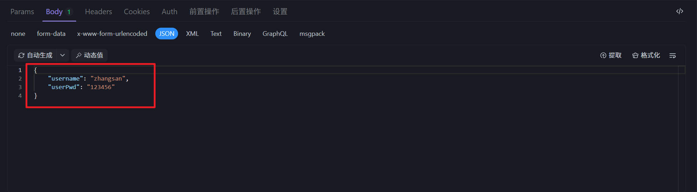


> 响应示例

+ 登录成功

```json title="Json"
{
    "code":"200",         // 成功状态码 
 	"message":"success"   // 成功状态描述
 	"data":{
		"token":"... ..." // 用户id的token
	}
}
```

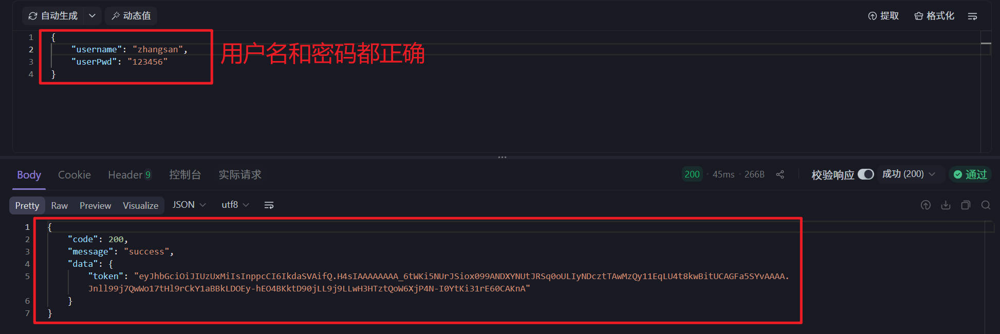


+ 用户名有误

```json title="Json"
{
    "code":"501",
 	"message":"用户名有误"
 	"data":{}
}
```

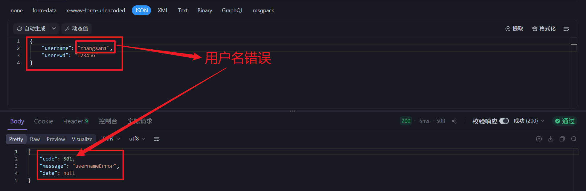


+ 密码有误

```json title="Json"
{
    "code":"503",
 	"message":"密码有误"
 	"data":{}
}
```

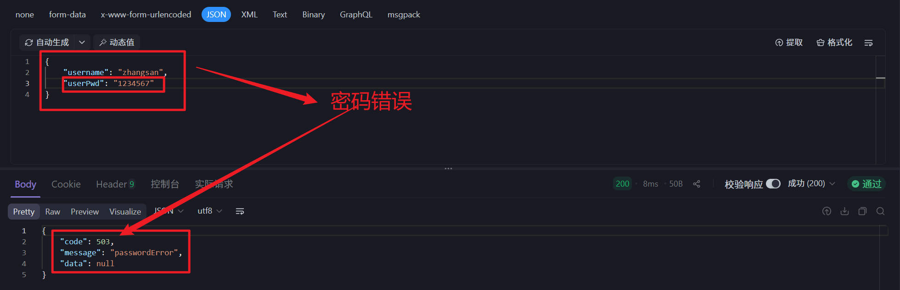


> 后端代码

+ **NewsUserController**

```java title="Java"
package fun.xingji.headline.controller;

import fun.xingji.headline.common.Result;
import fun.xingji.headline.common.ResultCodeEnum;
import fun.xingji.headline.pojo.NewsUser;
import fun.xingji.headline.service.NewsUserService;
import fun.xingji.headline.service.impl.NewsUserServiceImpl;
import fun.xingji.headline.util.JwtHelper;
import fun.xingji.headline.util.MD5Util;
import fun.xingji.headline.util.WebUtil;
import jakarta.servlet.ServletException;
import jakarta.servlet.annotation.WebServlet;
import jakarta.servlet.http.HttpServletRequest;
import jakarta.servlet.http.HttpServletResponse;

import java.io.IOException;
import java.util.HashMap;
import java.util.Map;

@WebServlet("/user/*")
public class NewsUserController extends BaseController{

    private NewsUserService userService=  new NewsUserServiceImpl();

    /**
     * 处理登录表单提交的业务接口的实现
     * @param req HTTP请求对象，包含客户端提交的登录数据
     * @param resp HTTP响应对象，用于向客户端返回登录结果
     * @throws ServletException 如果发生Servlet相关异常
     * @throws IOException 如果发生输入输出异常
     */
    protected void login(HttpServletRequest req, HttpServletResponse resp) throws ServletException, IOException {
        // 1. 接收客户端提交的用户名和密码
        // 请求体JSON格式示例：
        /*{
            "username":"zhangsan", //用户名
            "userPwd":"123456"     //明文密码
        }*/

        // 使用工具类将JSON请求体转换为NewsUser对象
        NewsUser paramUser = WebUtil.readJson(req, NewsUser.class);

        // 2. 调用服务层方法，根据用户名查询数据库中的用户信息
        NewsUser loginUser = userService.findByUsername(paramUser.getUsername());

        // 定义返回结果对象
        Result result = null;

        // 3. 判断用户是否存在
        if (loginUser != null) {
            // 用户存在，继续验证密码

            // 3.1 验证密码（忽略大小写比较MD5密文）
            if (MD5Util.encrypt(paramUser.getUserPwd()).equalsIgnoreCase(loginUser.getUserPwd())) {
                // 密码验证通过，登录成功

                /*// 获取用户ID
                Integer uid = loginUser.getUid();

                // 3.2 生成JWT令牌（Token），包含用户ID信息
                String token = JwtHelper.createToken(loginUser.getUid().longValue());

                // 3.3 构建返回数据
                Map data = new HashMap<>();
                data.put("token", token); // 将token放入响应数据*/
                // 合并编写，构建返回数据
                Map data = new HashMap();

                data.put("token",JwtHelper.createToken(loginUser.getUid().longValue()));

                // 3.4 构建成功响应结果
                result = Result.ok(data);
            } else {
                // 3.5 密码错误，构建密码错误响应
                result = Result.build(null, ResultCodeEnum.PASSWORD_ERROR);
            }
        } else {
            // 3.6 用户不存在，构建用户名错误响应
            // 注意：这里使用了USERNAME_ERROR
            // 根据实际业务需求，此处可能需要调整
            result = Result.build(null, ResultCodeEnum.USERNAEM_ERROR);
        }

        // 4. 向客户端返回JSON格式的登录验证结果
        WebUtil.writeJson(resp, result);
    }
}
```

+ **NewsUserService**

```java title="Java"
package fun.xingji.headline.service;

import fun.xingji.headline.pojo.NewsUser;

public interface NewsUserService {

    /**
     * 根据用户名,获得查询用户的方法
     * @param username 要查询的用户名
     * @return 如果找到返回NewsUser对象,找不到返回null
     */
    NewsUser findByUsername(String username);
}
```

+ **NewsUserServiceImpl**

```java title="Java" 
package fun.xingji.headline.service.impl;

import fun.xingji.headline.dao.NewsUserDao;
import fun.xingji.headline.dao.impl.NewsUserDaoImpl;
import fun.xingji.headline.pojo.NewsUser;
import fun.xingji.headline.service.NewsUserService;

public class NewsUserServiceImpl implements NewsUserService {

    private NewsUserDao userDao = new NewsUserDaoImpl();

    @Override
    public NewsUser findByUsername(String username) {
        return userDao.findByUsername(username);
    }
}
```

+ **NewUserDao**

```java title="Java"
package fun.xingji.headline.dao;

import fun.xingji.headline.pojo.NewsUser;

public interface NewsUserDao {

    /**
     * 根据用户名查询用户信息
     * @param username 要查询的用户名
     * @return 找到返回NewsUser对象,找不到返回null
     */
    NewsUser findByUsername(String username);
}
```

+ **NewsUserDaoImpl**

```java title="Java"
package fun.xingji.headline.dao.impl;

import fun.xingji.headline.dao.BaseDao;
import fun.xingji.headline.dao.NewsUserDao;
import fun.xingji.headline.pojo.NewsUser;

import java.util.List;

public class NewsUserDaoImpl extends BaseDao implements NewsUserDao {
    @Override
    public NewsUser findByUsername(String username) {
        // 准备SQL
        String sql = """
                select
                    uid,
                    username,
                    user_pwd userPwd,
                    nick_name nickName 
                from 
                    news_user
                where
                    username = ?
                """;

        // 调用BaseDao公共查询方法
        List<NewsUser> newsUserList = baseQuery(NewsUser.class, sql, username);

        // 如果找到,返回集合中的第一个数据(其实就一个)
        return newsUserList != null  && newsUserList.size()>0 ? newsUserList.get(0):null ;
    }
}
```


### 根据token获取完整用户信息

> 需求描述

+ 客户端发送请求,提交token请求头,后端根据token请求头获取登录用户的详细信息并响应给客户端进行存储

> uri

```http title="http"
user/getUserInfo
```

> 请求方式

```http title="http"
GET
```

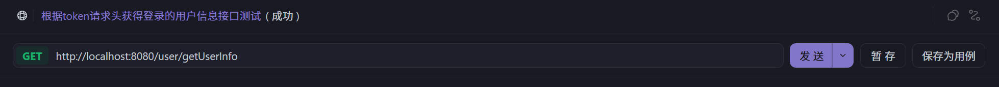


> 请求头

```json title="Json"
token: ... ...
```

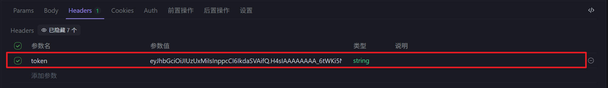

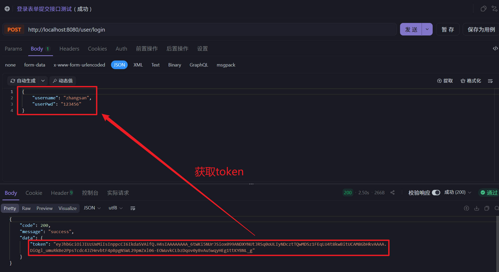


> 响应示例

+ 成功获取

```json title="Json"
{
    "code": 200,
    "message": "success",
    "data": {
        "loginUser": {
            "uid": 1,
            "username": "zhangsan",
            "userPwd": "",
            "nickName": "张三"
        }
    }
}
```

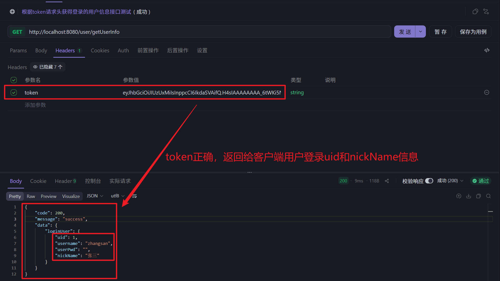


+ 获取失败

```json title="Json"
{
    "code": 504,
    "message": "notLogin",
    "data": null
}
```

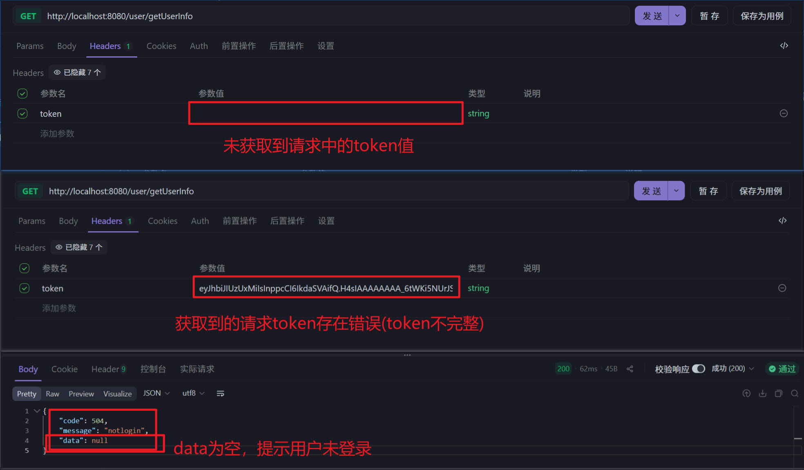


> 后端代码

+ **NewsUserController**

```java title="Java" 
package fun.xingji.headline.controller;

import fun.xingji.headline.common.Result;
import fun.xingji.headline.common.ResultCodeEnum;
import fun.xingji.headline.pojo.NewsUser;
import fun.xingji.headline.service.NewsUserService;
import fun.xingji.headline.service.impl.NewsUserServiceImpl;
import fun.xingji.headline.util.JwtHelper;
import fun.xingji.headline.util.MD5Util;
import fun.xingji.headline.util.WebUtil;
import jakarta.servlet.ServletException;
import jakarta.servlet.annotation.WebServlet;
import jakarta.servlet.http.HttpServletRequest;
import jakarta.servlet.http.HttpServletResponse;

import java.io.IOException;
import java.util.HashMap;
import java.util.Map;

@WebServlet("/user/*")
public class NewsUserController extends BaseController{

    private NewsUserService userService=  new NewsUserServiceImpl();


    /**
     * 通过token口令获得用户的接口实现
     * @param req
     * @param resp
     * @throws ServletException
     * @throws IOException
     */
    protected void getUserInfo(HttpServletRequest req, HttpServletResponse resp) throws ServletException, IOException {
        // 获取请求中的token
        String token = req.getHeader("token");


        // 响应结果(用户没有进行登录)
        Result result = Result.build(null,ResultCodeEnum.NOTLOGIN);

        if(token != null && (!"".equals(token))){
            // 判断token是否过期
            if(!JwtHelper.isExpiration(token)){
                Integer userId = JwtHelper.getUserId(token).intValue();

                // 调用服务层方法，获取userId
                NewsUser newsUser = userService.findByUid(userId);

                // 判断newsUser是否存在
                if(newsUser != null){
                    // 通过校验 查询用户信息放入Result
                    Map data = new HashMap();

                    // 将响应回来的用户密码设置为空串
                    newsUser.setUserPwd("");

                    data.put("loginUser",newsUser); // 将token放入响应数据

                    result = Result.ok(data);
                }
            }
        }
        // 向客户端返回JSON格式的登录验证结果
        WebUtil.writeJson(resp, result);
    }
}
```

+ **NewsUserService**

```java title="Java" 
package fun.xingji.headline.service;

import fun.xingji.headline.pojo.NewsUser;

public interface NewsUserService {
    
    /**
     * 根据用户id查询用户信息
     * @param userId 要查询的用户id
     * @return 找到返回NewsUser对象,找不到返回null
     */
    NewsUser findByUid(Integer userId);
}
```

+ **NewsUserServiceImpl**

```java title="Java"
package fun.xingji.headline.service.impl;

import fun.xingji.headline.dao.NewsUserDao;
import fun.xingji.headline.dao.impl.NewsUserDaoImpl;
import fun.xingji.headline.pojo.NewsUser;
import fun.xingji.headline.service.NewsUserService;

public class NewsUserServiceImpl implements NewsUserService {

    private NewsUserDao userDao = new NewsUserDaoImpl();

    @Override
    public NewsUser findByUid(Integer userId) {
        return userDao.findByUid(userId);
    }
}
```

+ **NewUserDao**

```java title="Java"
package fun.xingji.headline.dao;

import fun.xingji.headline.pojo.NewsUser;

public interface NewsUserDao {
    
    /**
     * 根据用户id连接数据库查询用户信息
     * @param userId  要查询的用户id
     * @return 找到返回NewsUser对象,找不到返回null
     */
    NewsUser findByUid(Integer userId);
}
```

+ **NewUserDaoImpl**

```java title="Java"
package fun.xingji.headline.dao.impl;

import fun.xingji.headline.dao.BaseDao;
import fun.xingji.headline.dao.NewsUserDao;
import fun.xingji.headline.pojo.NewsUser;

import java.util.List;

public class NewsUserDaoImpl extends BaseDao implements NewsUserDao {
    @Override
    public NewsUser findByUid(Integer userId) {
        // 准备SQL
        String sql = """
                select
                    uid,
                    username,
                    user_pwd userPwd,
                    nick_name nickName 
                from 
                    news_user
                where
                    uid = ?
                """;

        // 调用BaseDao公共查询方法
        List<NewsUser> newsUserList = baseQuery(NewsUser.class, sql, userId);

        // 如果找到,返回集合中的第一个数据(其实就一个)
        return newsUserList != null  && newsUserList.size()>0 ? newsUserList.get(0):null ;
    }
}
```


### 注册时用户名占用校验


> 需求说明

+ 用户在注册时输入用户名时,立刻将用户名发送给后端,后端根据用户名查询用户名是否可用并做出响应

> uri:

```http title="http"
user/checkUserName
```

> 请求方式:

```http title="http"
POST
```

> 请求参数

```json title="Json"
username=zhangsan
```

> 响应示例

+ 用户名校验通过

```json title="Json"
{
    "code":"200",
 	"message":"success"
 	"data":{}
}
```

+ 用户名占用

```json title="Json"
{
    "code":"505",
 	"message":"用户名占用"
 	"data":{}
}
```

> 后端代码

+ **NewsUserController**

```java title="Java" 
package fun.xingji.headline.controller;

import fun.xingji.headline.common.Result;
import fun.xingji.headline.common.ResultCodeEnum;
import fun.xingji.headline.pojo.NewsUser;
import fun.xingji.headline.service.NewsUserService;
import fun.xingji.headline.service.impl.NewsUserServiceImpl;
import fun.xingji.headline.util.JwtHelper;
import fun.xingji.headline.util.MD5Util;
import fun.xingji.headline.util.WebUtil;
import jakarta.servlet.ServletException;
import jakarta.servlet.annotation.WebServlet;
import jakarta.servlet.http.HttpServletRequest;
import jakarta.servlet.http.HttpServletResponse;

import java.io.IOException;
import java.util.HashMap;
import java.util.Map;

@WebServlet("/user/*")
public class NewsUserController extends BaseController {

    private NewsUserService userService = new NewsUserServiceImpl();
    
    /**
     * 校验用户名是否被占用的业务接口实现
     * @param req
     * @param resp
     * @throws ServletException
     * @throws IOException
     */
    protected void checkUserName(HttpServletRequest req, HttpServletResponse resp) throws ServletException, IOException {
        // 获取账号
        String username = req.getParameter("username");
        // 根据用户名获取用户信息  找到了 返回505   找不到 返回200
        NewsUser newuser = userService.findByUsername(username);

        // 定义返回结果对象
        Result result = Result.ok(null);

        // 判断用户是否注册
        if (newuser != null) {
            // 响应结果(用户名被占用)
            result = Result.build(null,ResultCodeEnum.USERNAME_USED);
        }
        // 向客户端返回JSON格式的登录验证结果
        WebUtil.writeJson(resp, result);
    }
}
```


### 注册表单提交


> 需求说明

+ 客户端将新用户信息发送给服务端,服务端将新用户存入数据库,存入之前做用户名是否被占用校验,校验通过响应成功提示,否则响应失败提示


> uri:

```http title="http"
user/regist
```

> 请求方式:

```http title="http"
POST
```

> 请求参数

```json title="Json"
{
    "username":"zhangsan",
    "userPwd":"123456",
    "nickName":"张三"
}
```

> 响应示例

+ 注册成功

```json title="Json"
{
    "code":"200",
 	"message":"success"
 	"data":{}
}
```

+ 用户名占用

```json title="Json"
{
    "code":"505",
 	"message":"用户名占用"
 	"data":{}
}
```

> 后端代码

+ **NewsUserController**

```java title="Java" 
package fun.xingji.headline.controller;

import fun.xingji.headline.common.Result;
import fun.xingji.headline.common.ResultCodeEnum;
import fun.xingji.headline.pojo.NewsUser;
import fun.xingji.headline.service.NewsUserService;
import fun.xingji.headline.service.impl.NewsUserServiceImpl;
import fun.xingji.headline.util.JwtHelper;
import fun.xingji.headline.util.MD5Util;
import fun.xingji.headline.util.WebUtil;
import jakarta.servlet.ServletException;
import jakarta.servlet.annotation.WebServlet;
import jakarta.servlet.http.HttpServletRequest;
import jakarta.servlet.http.HttpServletResponse;

import java.io.IOException;
import java.util.HashMap;
import java.util.Map;

@WebServlet("/user/*")
public class NewsUserController extends BaseController {

    private NewsUserService userService = new NewsUserServiceImpl();

    /**
     * 完成注册的业务接口
     * @param req
     * @param resp
     * @throws ServletException
     * @throws IOException
     */
    protected void regist(HttpServletRequest req, HttpServletResponse resp) throws ServletException, IOException {
        // 接收JSON信息
        NewsUser registUser = WebUtil.readJson(req, NewsUser.class);

        // 调用服务层将用户名存入数据
        Integer rows = userService.registUser(registUser);

        // 根据存入是否成功处理响应值
        Result result = Result.ok(null);
        if(rows == 0){
            // 响应结果(用户名被占用)
            result = Result.build(null,ResultCodeEnum.USERNAME_USED);
        }
        // 向客户端返回JSON格式的登录验证结果
        WebUtil.writeJson(resp, result);
    }
}
```

+ **NewsUserService**

```java title="Java" 
package fun.xingji.headline.service;

import fun.xingji.headline.pojo.NewsUser;

public interface NewsUserService {
    /**
     * 注册用户信息,注册成功返回大于0的整数,失败返回0
     * @param registUser
     * @return
     */
    Integer registUser(NewsUser registUser);
}
```

+ **NewsUserServiceImpl**

```java title="Java"
package fun.xingji.headline.service.impl;

import fun.xingji.headline.dao.NewsUserDao;
import fun.xingji.headline.dao.impl.NewsUserDaoImpl;
import fun.xingji.headline.pojo.NewsUser;
import fun.xingji.headline.service.NewsUserService;
import fun.xingji.headline.util.MD5Util;

public class NewsUserServiceImpl implements NewsUserService {
    @Override
    public Integer registUser(NewsUser registUser) {
        // 处理增加数据的业务
        // 将明文密码转换为密文密码
        registUser.setUserPwd(MD5Util.encrypt(registUser.getUserPwd()));

        // 存入数据库
        return userDao.insertUser(registUser);
    }
}
```

+ **NewUserDao**

```java title="Java"
package fun.xingji.headline.dao;

import fun.xingji.headline.pojo.NewsUser;

public interface NewsUserDao {
    /**
     * 将用户信息存入数据库
     * @param registUser
     * @return
     */
    Integer insertUser(NewsUser registUser);
}
```

+ **NewUserDaoImpl**

```java title="Java"
package fun.xingji.headline.dao.impl;

import fun.xingji.headline.dao.BaseDao;
import fun.xingji.headline.dao.NewsUserDao;
import fun.xingji.headline.pojo.NewsUser;

import java.util.List;

public class NewsUserDaoImpl extends BaseDao implements NewsUserDao {
    @Override
    public Integer insertUser(NewsUser registUser) {
        // 准备sql
        String sql = """
                insert into news_user values (DEFAULT,?,?,?)
                """;
        // 返回用户相关信息
        return baseUpdate(sql,
                registUser.getUsername(),
                registUser.getUserPwd(),
                registUser.getNickName()
        );
    }
}
```


## 头条首页功能

### 查询所有头条分类


> 需求说明

+ 进入新闻首页,查询所有分类并动态展示新闻类别栏位

> uri:

```http title="http"
portal/findAllTypes
```

> 请求方式

```http title="http"
GET
```

> 请求参数

```json title="Json"
无
```

> 响应示例

```json title="Json"
{
    "code":"200",
 	"message":"OK"
 	"data":
            [
                {
                    "tid":"1",
                    "tname":"新闻"
                },
                {
                    "tid":"2",
                    "tname":"体育"
                },
                {
                    "tid":"3",
                    "tname":"娱乐"
                },
                {
                    "tid":"4",
                    "tname":"科技"
                },
                {
                    "tid":"5",
                    "tname":"其他"
                }
            ]
    
}
```

> 后端代码

+ **PortalController**

```java title="Java" 
package fun.xingji.headline.controller;

import fun.xingji.headline.common.Result;
import fun.xingji.headline.pojo.NewsType;
import fun.xingji.headline.service.NewsTypeService;
import fun.xingji.headline.service.impl.NewsTypeServiceImpl;
import fun.xingji.headline.util.WebUtil;
import jakarta.servlet.ServletException;
import jakarta.servlet.annotation.WebServlet;
import jakarta.servlet.http.HttpServletRequest;
import jakarta.servlet.http.HttpServletResponse;

import java.io.IOException;
import java.util.List;

@WebServlet("/portal/*")
public class PortalController extends BaseController{

    private NewsTypeService typeService = new NewsTypeServiceImpl();

    /**
     * 查询所有头条类型的业务接口实现
     * @param req
     * @param resp
     * @throws ServletException
     * @throws IOException
     */
    protected void findAllTypes(HttpServletRequest req, HttpServletResponse resp) throws ServletException, IOException {
        // 查询所有的新闻类型，装入Result响应给客户端
        List<NewsType> newsTypeList = typeService.findAll();
        // 将响应结果传给客户端
        WebUtil.writeJson(resp, Result.ok(newsTypeList));
    }
}
```

+ **NewsTypeService**

```java title="Java" 
package fun.xingji.headline.service;

import fun.xingji.headline.pojo.NewsType;

import java.util.List;

public interface NewsTypeService {
    /**
     * 查询所有头条类型的方法
     * @return 多个头条类型以List<NewsType>集合形式返回
     */
    List<NewsType> findAll();
}
```

+ **NewsTypeServiceImpl**

```java title="Java"
package fun.xingji.headline.service.impl;

import fun.xingji.headline.dao.NewsTypeDao;
import fun.xingji.headline.dao.impl.NewsTypeDaoImpl;
import fun.xingji.headline.pojo.NewsType;
import fun.xingji.headline.service.NewsTypeService;

import java.util.List;

public class NewsTypeServiceImpl implements NewsTypeService {

    private NewsTypeDao typeDao =  new NewsTypeDaoImpl();

    @Override
    public List<NewsType> findAll() {
        return typeDao.findAll();
    }
}
```

+ **NewsTypeDao**

```java title="Java"
package fun.xingji.headline.dao;

import fun.xingji.headline.pojo.NewsType;

import java.util.List;

public interface NewsTypeDao {
    /**
     * 从数据库中查询全部新闻类型
     * @return
     */
    List<NewsType> findAll();
}
```

+ **NewsTypeDaoImpl**

```java title="Java"
package fun.xingji.headline.dao.impl;

import fun.xingji.headline.dao.BaseDao;
import fun.xingji.headline.dao.NewsTypeDao;
import fun.xingji.headline.pojo.NewsType;

import java.util.List;

public class NewsTypeDaoImpl extends BaseDao implements NewsTypeDao {
    @Override
    public List<NewsType> findAll() {
        // 编写查询语句
        String sql = "select tid,tname from news_type";
        return baseQuery(NewsType.class,sql);
    }
}
```


### 分页带条件查询所有头条


> 需求说明

+ 客户端向服务端发送查询关键字,新闻类别,页码数,页大小
+ 服务端根据条件搜索分页信息,返回含页码数,页大小,总页数,总记录数,当前页数据等信息,并根据时间降序,浏览量降序排序

> uri:

```http title="http"
portal/findNewsPage
```

> 请求方式:

```http title="http"
POST
```

> 请求参数:

```json title="Json"
{
    "keyWords":"马斯克", // 搜索标题关键字
    "type":0,           // 新闻类型
    "pageNum":1,        // 页码数
    "pageSize":"10"     // 页大小
}
```

> 响应示例:

```json title="Json"
{
    "code":"200",
 	"message":"success"
 	"data":{
    	"pageInfo":{
    		"pageData":[                           // 本页的数据
    			{
    				"hid":"1",                     // 新闻id 
    				"title":"尚硅谷宣布 ... ...",   // 新闻标题
    				"type":"1",                    // 新闻所属类别编号
    				"pageViews":"40",              // 新闻浏览量
    				"pastHours":"3" ,              // 发布时间已过小时数
    				"publisher":"1"                // 发布用户ID
				},
				{
    				"hid":"1",                     // 新闻id 
    				"title":"尚硅谷宣布 ... ...",   // 新闻标题
    				"type":"1",                    // 新闻所属类别编号
    				"pageViews":"40",              // 新闻浏览量
    				"pastHours":"3",              // 发布时间已过小时数
    				"publisher":"1"                // 发布用户ID
				},
				{
    				"hid":"1",                     // 新闻id 
    				"title":"尚硅谷宣布 ... ...",   // 新闻标题
    				"type":"1",                    // 新闻所属类别编号
    				"pageViews":"40",              // 新闻浏览量
    				"pastHours":"3",               // 发布时间已过小时数
    				"publisher":"1"                // 发布用户ID
				}
    		],
			"pageNum":1,    //页码数
			"pageSize":10,  // 页大小
			"totalPage":20, // 总页数
			"totalSize":200 // 总记录数
		}
	}
}
```

>  后端代码

+ **PortalController**

```java title="Java" 
package fun.xingji.headline.controller;

/*
门户  控制器
那些不想要登录，不需要做增删改的门户页的请求都放在这里
 */
import fun.xingji.headline.common.Result;
import fun.xingji.headline.pojo.NewsType;
import fun.xingji.headline.pojo.vo.HeadlineQueryVo;
import fun.xingji.headline.service.NewsHeadlineService;
import fun.xingji.headline.service.NewsTypeService;
import fun.xingji.headline.service.impl.NewsHeadlineServiceImpl;
import fun.xingji.headline.service.impl.NewsTypeServiceImpl;
import fun.xingji.headline.util.WebUtil;
import jakarta.servlet.ServletException;
import jakarta.servlet.annotation.WebServlet;
import jakarta.servlet.http.HttpServletRequest;
import jakarta.servlet.http.HttpServletResponse;

import java.io.IOException;
import java.util.HashMap;
import java.util.List;
import java.util.Map;

@WebServlet("/portal/*")
public class PortalController extends BaseController {

    private NewsTypeService typeService = new NewsTypeServiceImpl();

    private NewsHeadlineService headlineService = new NewsHeadlineServiceImpl();

    /**
     * 分页查询头条信息的接口实现
     *
     * @param req
     * @param resp
     * @throws ServletException
     * @throws IOException
     */
    protected void findNewsPage(HttpServletRequest req, HttpServletResponse resp) throws ServletException, IOException {
        // 接收请求中的参数
        HeadlineQueryVo headlineQueryVo = WebUtil.readJson(req, HeadlineQueryVo.class);

        // 将参数传递给服务层 进行分页查询
        /*
        pageData:[
           {
                    "hid":"1",                     // 新闻id
    				"title":"尚硅谷宣布 ... ...",   // 新闻标题
    				"type":"1",                    // 新闻所属类别编号
    				"pageViews":"40",              // 新闻浏览量
    				"pastHours":"3",              // 发布时间已过小时数
    				"publisher":"1"
           }
        * ],
        * pageNum:1,
        * pageSize:1,
        * totalPage:1,
        * totalSize:1
        * */
        // 查询分页五项数据
        Map pageInfo = headlineService.findPage(headlineQueryVo);

        // 将分页五项数据放入pageInfo
        Map data = new HashMap();
        data.put("pageInfo", pageInfo);

        // 将分页查询的结果转换成JSON响应给客户端
        WebUtil.writeJson(resp, Result.ok(data));
    }
}
```

+ **NewsHeadlineService**

```java title="Java" 
package fun.xingji.headline.service;

import fun.xingji.headline.pojo.vo.HeadlineQueryVo;

import java.util.Map;

public interface NewsHeadlineService {

    /**
     * 分页查询头条新闻方法
     * @param headlineQueryVo
     * @return
     */
    Map findPage(HeadlineQueryVo headlineQueryVo);
}
```

+ **NewsHeadlineServiceImpl**

```java title="Java"
package fun.xingji.headline.service.impl;

import fun.xingji.headline.dao.NewsHeadlineDao;
import fun.xingji.headline.dao.impl.NewsHeadlineDaoImpl;
import fun.xingji.headline.pojo.vo.HeadlinePageVo;
import fun.xingji.headline.pojo.vo.HeadlineQueryVo;
import fun.xingji.headline.service.NewsHeadlineService;

import java.util.HashMap;
import java.util.List;
import java.util.Map;

public class NewsHeadlineServiceImpl implements NewsHeadlineService {

    private NewsHeadlineDao headlineDao = new NewsHeadlineDaoImpl();

    /*
        totalPage:1,
        totalSize:1
        pageData:[
                    {
                       "hid":"1",                     // 新闻id
                        "title":"尚硅谷宣布 ... ...",   // 新闻标题
                        "type":"1",                    // 新闻所属类别编号
                        "pageViews":"40",              // 新闻浏览量
                        "pastHours":"3",              // 发布时间已过小时数
                        "publisher":"1"
                   }
                 ],
        pageNum:1,
        pageSize:1,
     */
    @Override
    public Map findPage(HeadlineQueryVo headlineQueryVo) {
        // 当前页码数
        int pageNum = headlineQueryVo.getPageNum();
        // 页大小
        int pageSize = headlineQueryVo.getPageSize();
        // 分页查询本页数据
        List<HeadlinePageVo>  pageData = headlineDao.findPageList(headlineQueryVo);

        // 分页查询满足记录的总数据量
        int totalSize = headlineDao.findPageCount(headlineQueryVo);

        // 总页码数
        int totalPage = totalSize % pageSize == 0 ? totalSize / pageSize : totalSize / pageSize + 1;


        // 准备一个map,用于装分页的五项数据
        Map pageInfo = new HashMap();
        pageInfo.put("pageNum", pageNum);
        pageInfo.put("pageSize", pageSize);
        pageInfo.put("totalSize", totalSize);
        pageInfo.put("totalPage", totalPage);
        pageInfo.put("pageData", pageData);
        
        return pageInfo;
    }
}
```

+ **NewsHeadLineDao**

```java title="Java"
package fun.xingji.headline.dao;

import fun.xingji.headline.pojo.vo.HeadlinePageVo;
import fun.xingji.headline.pojo.vo.HeadlineQueryVo;

import java.util.List;

public interface NewsHeadlineDao {

    /**
     * 根据查询条件,查询当前页数据
     * @param headlineQueryVo
     * @return
     */
    List<HeadlinePageVo> findPageList(HeadlineQueryVo headlineQueryVo);

    /**
     * 根据查询条件,查询满足条件的记录数
     * @param headlineQueryVo
     * @return
     */
    int findPageCount(HeadlineQueryVo headlineQueryVo);
}
```

+ **NewsHeadlineDaoImpl**

```java title="Java"
package fun.xingji.headline.dao.impl;

import fun.xingji.headline.dao.BaseDao;
import fun.xingji.headline.dao.NewsHeadlineDao;
import fun.xingji.headline.pojo.vo.HeadlinePageVo;
import fun.xingji.headline.pojo.vo.HeadlineQueryVo;

import java.util.ArrayList;
import java.util.List;

public class NewsHeadlineDaoImpl extends BaseDao implements NewsHeadlineDao {
    /*
    *
    *       private Integer hid;
            private String title;
            private Integer type;
            private Integer pageViews;
            private Long pastHours;
            private Integer publisher;
            *
            *
            *
            *       private String keyWords;
                    private Integer type ;
                    private Integer pageNum;
                    private Integer pageSize;
            *
            * */
    @Override
    public List<HeadlinePageVo> findPageList(HeadlineQueryVo headlineQueryVo) {
        List params = new ArrayList();

        String sql = """
                select 
                    hid,
                    title,
                    type,
                    page_views pageViews,
                    TIMESTAMPDIFF(HOUR,create_time,now()) pastHours,
                    publisher 
                from 
                    news_headline
                where 
                    is_deleted = 0
                
                """;
        // 进行拼接操作
        if (headlineQueryVo.getType() != 0) {
            sql = sql.concat("and type=? ");
            params.add(headlineQueryVo.getType());

        }
        if (headlineQueryVo.getKeyWords() != null && !headlineQueryVo.getKeyWords().equals("")) {
            sql = sql.concat("and title like ? ");
            params.add("%" + headlineQueryVo.getKeyWords() + "%");
        }

        sql = sql.concat(" order by pastHours ASC , page_views DESC ");
        sql = sql.concat(" limit ? , ? ");
        params.add((headlineQueryVo.getPageNum() - 1) * headlineQueryVo.getPageSize());
        params.add(headlineQueryVo.getPageSize());

        return baseQuery(HeadlinePageVo.class, sql, params.toArray());
    }

    @Override
    public int findPageCount(HeadlineQueryVo headlineQueryVo) {
        List params = new ArrayList();

        String sql = """
                select 
                    count(1)
                from 
                    news_headline
                where 
                    is_deleted = 0
                
                """;
        // 进行拼接操作
        if (headlineQueryVo.getType() != 0) {
            sql = sql.concat("and type = ? ");
            params.add(headlineQueryVo.getType());

        }
        if (headlineQueryVo.getKeyWords() != null && !headlineQueryVo.getKeyWords().equals("")) {
            sql = sql.concat("and title like ? ");
            params.add("%" + headlineQueryVo.getKeyWords() + "%");
        }

        Long count = baseQueryObject(Long.class, sql, params.toArray());
        return count.intValue();
    }
}
```


### 查看头条详情


> 需求说明

+ 用户点击"查看全文"时,向服务端发送新闻id
+ 后端根据新闻id查询完整新闻文章信息并返回
+ 后端要同时让新闻的浏览量+1

> url

```http title="http"
portal/showHeadlineDetail
```

> 请求方式

```http title="http"
POST
```

> 请求参数

```json title="Json"
hid=1
```

> 响应示例

```json title="Json"
{
    "code":"200",
    "message":"success",
    "data":{
        "headline":{
            "hid":"1",                     // 新闻id 
            "title":"马斯克宣布 ... ...",   // 新闻标题
            "article":"... ..."            // 新闻正文
            "type":"1",                    // 新闻所属类别编号
            "typeName":"科技",             // 新闻所属类别
            "pageViews":"40",              // 新闻浏览量
            "pastHours":"3" ,              // 发布时间已过小时数
            "publisher":"1" ,               // 发布用户ID
            "author":"张三"                 // 新闻作者
        }
    }
}
```

> 后端代码

+ PortalController

```java title="Java" 
package fun.xingji.headline.controller;

/*
门户  控制器
那些不想要登录，不需要做增删改的门户页的请求都放在这里
 */
import fun.xingji.headline.common.Result;
import fun.xingji.headline.pojo.NewsType;
import fun.xingji.headline.pojo.vo.HeadlineDetailVo;
import fun.xingji.headline.pojo.vo.HeadlineQueryVo;
import fun.xingji.headline.service.NewsHeadlineService;
import fun.xingji.headline.service.NewsTypeService;
import fun.xingji.headline.service.impl.NewsHeadlineServiceImpl;
import fun.xingji.headline.service.impl.NewsTypeServiceImpl;
import fun.xingji.headline.util.WebUtil;
import jakarta.servlet.ServletException;
import jakarta.servlet.annotation.WebServlet;
import jakarta.servlet.http.HttpServletRequest;
import jakarta.servlet.http.HttpServletResponse;

import java.io.IOException;
import java.util.HashMap;
import java.util.List;
import java.util.Map;

@WebServlet("/portal/*")
public class PortalController extends BaseController {

    private NewsTypeService typeService = new NewsTypeServiceImpl();

    private NewsHeadlineService headlineService = new NewsHeadlineServiceImpl();


    /**
     * 查询头条详情的业务接口实现
     * @param req
     * @param resp
     * @throws ServletException
     * @throws IOException
     */
    protected void showHeadlineDetail(HttpServletRequest req, HttpServletResponse resp) throws ServletException, IOException {
        // 接收查询的头条ID
        int hid = Integer.parseInt(req.getParameter("hid"));
        // 调用服务层完成查询处理
        HeadlineDetailVo headlineDetailVo = headlineService.findHeadlineDetail(hid);
        // 将查询到的信息响应给客户端
        Map data = new HashMap();
        data.put("headline", headlineDetailVo);

        // 将分页查询的结果转换成JSON响应给客户端
        WebUtil.writeJson(resp, Result.ok(data));
    }
}
```

+ NewsHeadlineService

```java title="Java" 
package fun.xingji.headline.service;

import fun.xingji.headline.pojo.vo.HeadlineDetailVo;
import fun.xingji.headline.pojo.vo.HeadlineQueryVo;

import java.util.Map;

public interface NewsHeadlineService {
    /**
     * 根据头条id,显示头条详情
     * @param hid
     * @return
     */
    HeadlineDetailVo findHeadlineDetail(int hid);
}
```

+ NewsHeadlineServiceImpl

```java title="Java"
package fun.xingji.headline.service.impl;

import fun.xingji.headline.dao.NewsHeadlineDao;
import fun.xingji.headline.dao.impl.NewsHeadlineDaoImpl;
import fun.xingji.headline.pojo.vo.HeadlineDetailVo;
import fun.xingji.headline.pojo.vo.HeadlinePageVo;
import fun.xingji.headline.pojo.vo.HeadlineQueryVo;
import fun.xingji.headline.service.NewsHeadlineService;

import java.util.HashMap;
import java.util.List;
import java.util.Map;

public class NewsHeadlineServiceImpl implements NewsHeadlineService {

    private NewsHeadlineDao headlineDao = new NewsHeadlineDaoImpl();

    @Override
    public HeadlineDetailVo findHeadlineDetail(int hid) {
        // 修改该头条的浏览量 +1
        headlineDao.incrPageViews(hid);
        // 查询头条的详情
        return headlineDao.findHeadlineDetail(hid);
    }
}
```

+ NewsHeadLineDao

```java title="Java"
package fun.xingji.headline.dao;

import fun.xingji.headline.pojo.vo.HeadlineDetailVo;
import fun.xingji.headline.pojo.vo.HeadlinePageVo;
import fun.xingji.headline.pojo.vo.HeadlineQueryVo;

import java.util.List;

public interface NewsHeadlineDao {
    /**
     * 多表查询新闻详情
     * @param hid
     * @return
     */
    HeadlineDetailVo findHeadlineDetail(int hid);

    int incrPageViews(int hid);
}
```

+ NewsHeadlineDaoImpl

```java title="Java"
package fun.xingji.headline.dao.impl;

import fun.xingji.headline.dao.BaseDao;
import fun.xingji.headline.dao.NewsHeadlineDao;
import fun.xingji.headline.pojo.vo.HeadlineDetailVo;
import fun.xingji.headline.pojo.vo.HeadlinePageVo;
import fun.xingji.headline.pojo.vo.HeadlineQueryVo;

import java.util.ArrayList;
import java.util.List;

public class NewsHeadlineDaoImpl extends BaseDao implements NewsHeadlineDao {

    
    @Override
    public int incrPageViews(int hid) {
        String sql ="update  news_headline set page_views = page_views + 1 where hid = ?";

        return baseUpdate(sql,hid);
    }


    @Override
    public HeadlineDetailVo findHeadlineDetail(int hid) {
        String sql = """
                select
                  h.hid hid ,
                  h.title title ,
                  h.article article ,
                  h.type type ,
                  t.tname typeName ,
                  h.page_views pageViews ,
                  TIMESTAMPDIFF(HOUR,h.create_time,now() )pastHours ,
                  h.publisher publisher ,
                  u.nick_name author 
                from 
                    news_headline h
                left join 
                    news_type  t
                on  
                    h.type = t.tid
                left join
                    news_user u
                on
                    h.publisher = u.uid
                where 
                    h.hid = ?
                """;
        List<HeadlineDetailVo> list = baseQuery(HeadlineDetailVo.class, sql, hid);

        return null != list && list.size()>0 ?  list.get(0):null;
    }
}
```

> **新闻的浏览量+1**
>
> 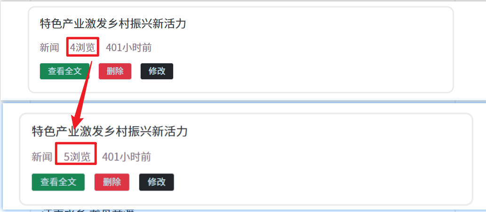


> 1. **用户点击"查看全文"时,向服务端发送新闻id**
>
> 2. **后端根据新闻id查询完整新闻文章信息并返回**
>
> 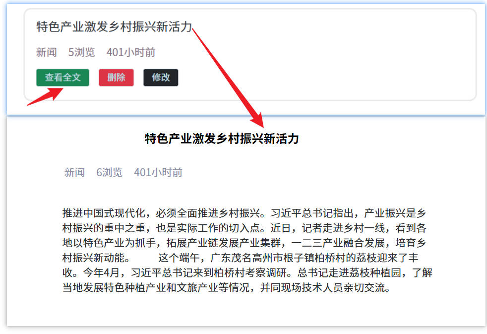


## 头条发布修改和删除

### 登录校验

> 需求说明

+ **客户端在进入发布页前、发布新闻前、进入修改页前、修改前、删除新闻前先向服务端发送`请求携带token请求头`**
+ **后端接收token请求头后,校验`用户登录是否过期并做响应`**
+ **前端根据响应信息`提示用户进入登录页还是进入正常业务页面`**

> uri

```http title="http"
user/checkLogin
```

> 请求方式

```http title="http"
GET
```

> 请求参数

```json title="Json"
无
```

> 请求头

```json title="Json"
token: ... ...
```

> 响应示例

+ 登录未过期

```json title="Json"
{
    "code":"200",
    "message":"success",
    "data":{}
}
```

+ 登录已过期

```json title="Json"
{
    "code":"504",
    "message":"loginExpired",
    "data":{}
}
```

> 后端代码

+ **NewsUserController**

```java title="Java" 
package fun.xingji.headline.controller;

import fun.xingji.headline.common.Result;
import fun.xingji.headline.common.ResultCodeEnum;
import fun.xingji.headline.pojo.NewsUser;
import fun.xingji.headline.service.NewsUserService;
import fun.xingji.headline.service.impl.NewsUserServiceImpl;
import fun.xingji.headline.util.JwtHelper;
import fun.xingji.headline.util.MD5Util;
import fun.xingji.headline.util.WebUtil;
import jakarta.servlet.ServletException;
import jakarta.servlet.annotation.WebServlet;
import jakarta.servlet.http.HttpServletRequest;
import jakarta.servlet.http.HttpServletResponse;

import java.io.IOException;
import java.util.HashMap;
import java.util.Map;

@WebServlet("/user/*")
public class NewsUserController extends BaseController {

    private NewsUserService userService = new NewsUserServiceImpl();

    /**
     * 前端自己校验是否失去登录状态的接口
     * @param req
     * @param resp
     * @throws ServletException
     * @throws IOException
     */
    protected void checkLogin(HttpServletRequest req, HttpServletResponse resp) throws ServletException, IOException {
        // 获取token
        String token = req.getHeader("token");

        // 根据存入是否成功处理响应值
        // 响应504(用户没有登录)
        Result result = Result.build(null,ResultCodeEnum.NOTLOGIN);
        // 判断token是否为空
        if(token != null){
            // 判断token是否过期
            if (!JwtHelper.isExpiration(token)) {
                // 响应200
                result = Result.ok(null);
            }
        }
        // 向客户端返回JSON格式的登录验证结果
        WebUtil.writeJson(resp, result);
    }
}
```

+ **登录校验过滤器**

```java title="Java"
package fun.xingji.headline.filters;

import fun.xingji.headline.common.Result;
import fun.xingji.headline.common.ResultCodeEnum;
import fun.xingji.headline.util.JwtHelper;
import fun.xingji.headline.util.WebUtil;
import jakarta.servlet.*;
import jakarta.servlet.annotation.WebFilter;
import jakarta.servlet.http.HttpServletRequest;
import jakarta.servlet.http.HttpServletResponse;

import java.io.IOException;

@WebFilter("/headline/*")
public class LoginFilter implements Filter {

    @Override
    public void doFilter(ServletRequest servletRequest, ServletResponse servletResponse, FilterChain filterChain) throws IOException, ServletException {
        HttpServletRequest request = (HttpServletRequest) servletRequest;
        HttpServletResponse response = (HttpServletResponse) servletResponse;

        // 获取token
        String token = request.getHeader("token");

        // token不为空并且没过期
        boolean flag = token != null && (!JwtHelper.isExpiration(token));
        if (flag) {
            filterChain.doFilter(servletRequest, servletResponse);
        } else {
            WebUtil.writeJson(response, Result.build(null, ResultCodeEnum.NOTLOGIN));
        }
    }
}
```

+ **web.xml中配置登录校验过滤器**

```xml
    <!--登录校验过滤器-->
    <filter>
        <filter-name>loginFilter</filter-name>
        <filter-class>fun.xingji.headline.filters.LoginFilter</filter-class>
    </filter>
    <filter-mapping>
        <filter-name>loginFilter</filter-name>
        <url-pattern>/headline/*</url-pattern>
    </filter-mapping>
```


### 提交发布头条


> 需求说明

+ 用户在客户端输入发布的新闻信息完毕后
+ 发布前先请求后端的登录校验接口验证登录
+ 登录通过则提交新闻信息
+ 后端将新闻信息存入数据库

> uri

```http title="http"
headline/publish
```

> 请求方式

```http title="http"
POST
```

> 请求头

```json title="Json"
token: ... ...
```

> 请求参数

```json title="Json"
{
    "title":"尚硅谷宣布 ... ...",   // 文章标题
    "article":"... ...",          // 文章内容
    "type":"1"                    // 文章类别
}
```

> 响应示例

+ 发布成功

```json title="Json"
{
    "code":"200",
    "message":"success",
    "data":{}
}
```

+ 失去登录状态发布失败

```  json
{
    "code":"504",
    "message":"loginExpired",
    "data":{}
}
```

> 后端代码


+ **NewsHeadlineController**

```java title="Java" 
package fun.xingji.headline.controller;

import fun.xingji.headline.common.Result;
import fun.xingji.headline.pojo.NewsHeadline;
import fun.xingji.headline.service.NewsHeadlineService;
import fun.xingji.headline.service.impl.NewsHeadlineServiceImpl;
import fun.xingji.headline.util.JwtHelper;
import fun.xingji.headline.util.WebUtil;
import jakarta.servlet.ServletException;
import jakarta.servlet.annotation.WebServlet;
import jakarta.servlet.http.HttpServletRequest;
import jakarta.servlet.http.HttpServletResponse;

import java.io.IOException;

@WebServlet("/headline/*")
public class NewsHeadlineController extends BaseController{

    private NewsHeadlineService headlineService = new NewsHeadlineServiceImpl();

    /**
     * 发布头条的接口实现
     * @param req
     * @param resp
     * @throws ServletException
     * @throws IOException
     */
    protected void publish(HttpServletRequest req, HttpServletResponse resp) throws ServletException, IOException {

        // 接收参数的过程
        // 获取token
        String token = req.getHeader("token");
        // 获取uid
        Long userId = JwtHelper.getUserId(token);


        // 获取请求体的JSON
        NewsHeadline newsHeadline = WebUtil.readJson(req, NewsHeadline.class);
        newsHeadline.setPublisher(userId.intValue());


        // 将信息存入数据库
        headlineService.addNewsHeadline(newsHeadline);

        WebUtil.writeJson(resp, Result.ok(null));
    }
}
```

+ **NewsHeadlineService**

```java title="Java" 
package fun.xingji.headline.service;

import fun.xingji.headline.pojo.NewsHeadline;
import fun.xingji.headline.pojo.vo.HeadlineDetailVo;
import fun.xingji.headline.pojo.vo.HeadlineQueryVo;

import java.util.Map;

public interface NewsHeadlineService {
    /**
     * 新增头条
     * @param newsHeadline
     * @return
     */
    int addNewsHeadline(NewsHeadline newsHeadline);
}
```

+ **NewsHeadlineServiceImpl**

```java title="Java"
package fun.xingji.headline.service.impl;

import fun.xingji.headline.dao.NewsHeadlineDao;
import fun.xingji.headline.dao.impl.NewsHeadlineDaoImpl;
import fun.xingji.headline.pojo.NewsHeadline;
import fun.xingji.headline.pojo.vo.HeadlineDetailVo;
import fun.xingji.headline.pojo.vo.HeadlinePageVo;
import fun.xingji.headline.pojo.vo.HeadlineQueryVo;
import fun.xingji.headline.service.NewsHeadlineService;

import java.util.HashMap;
import java.util.List;
import java.util.Map;

public class NewsHeadlineServiceImpl implements NewsHeadlineService {
    private NewsHeadlineDao headlineDao = new NewsHeadlineDaoImpl();
    
    @Override
    public int addNewsHeadline(NewsHeadline newsHeadline) {
        return headlineDao.addNewsHeadline(newsHeadline);
    }
}
```

+ **NewsHeadLineDao**

```java title="Java"
package fun.xingji.headline.dao;

import fun.xingji.headline.pojo.NewsHeadline;
import fun.xingji.headline.pojo.vo.HeadlineDetailVo;
import fun.xingji.headline.pojo.vo.HeadlinePageVo;
import fun.xingji.headline.pojo.vo.HeadlineQueryVo;

import java.util.List;

public interface NewsHeadlineDao {
    /**
     * 头条存入数据库
     * @param newsHeadline
     * @return
     */
    int addNewsHeadline(NewsHeadline newsHeadline);
}
```

+ **NewsHeadlineDaoImpl**

```java title="Java"
package fun.xingji.headline.dao.impl;

import fun.xingji.headline.dao.BaseDao;
import fun.xingji.headline.dao.NewsHeadlineDao;
import fun.xingji.headline.pojo.NewsHeadline;
import fun.xingji.headline.pojo.vo.HeadlineDetailVo;
import fun.xingji.headline.pojo.vo.HeadlinePageVo;
import fun.xingji.headline.pojo.vo.HeadlineQueryVo;

import java.util.ArrayList;
import java.util.List;

public class NewsHeadlineDaoImpl extends BaseDao implements NewsHeadlineDao {
    @Override
    public int addNewsHeadline(NewsHeadline newsHeadline) {
        String sql = """
                insert into news_headline 
                values (DEFAULT,?,?,?,?,0,now(),now(),0)
                """;
        return baseUpdate(sql,
                newsHeadline.getTitle(),
                newsHeadline.getArticle(),
                newsHeadline.getType(),
                newsHeadline.getPublisher()
        );
    }
}
```

> **发布新闻测试:**
>
> :::: steps
> 1. 点击右上角用户名下拉框选择发布新闻
>
>    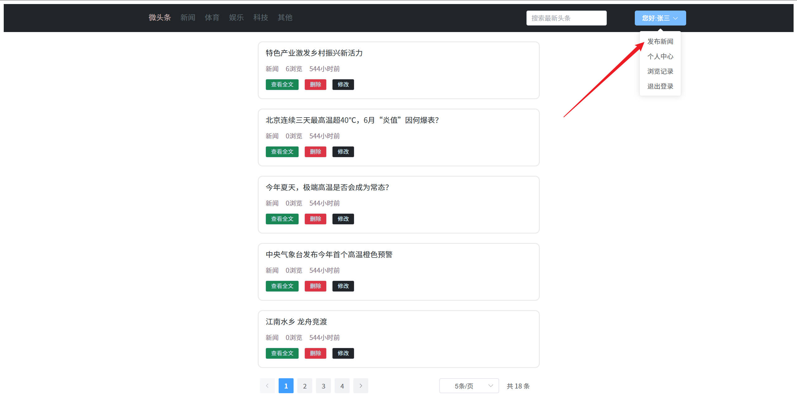
>
> 2. 完成相关新闻内容的编写
>
>    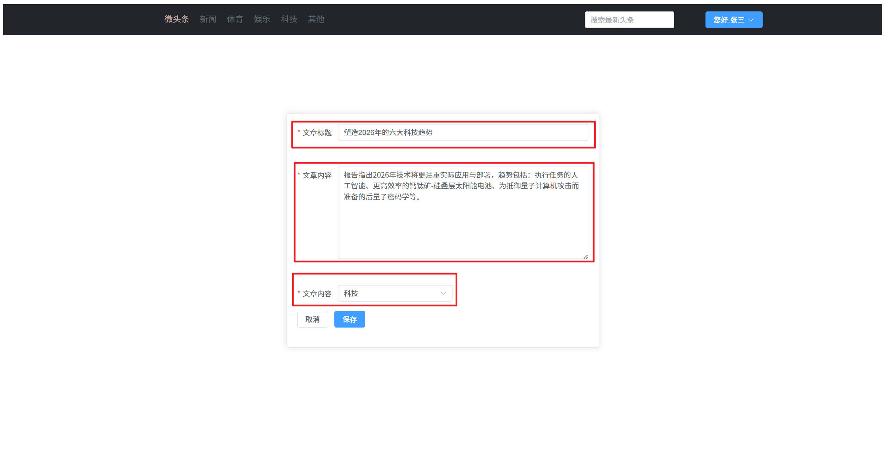
>
> 3. 查看刚才发布的新闻
>
>    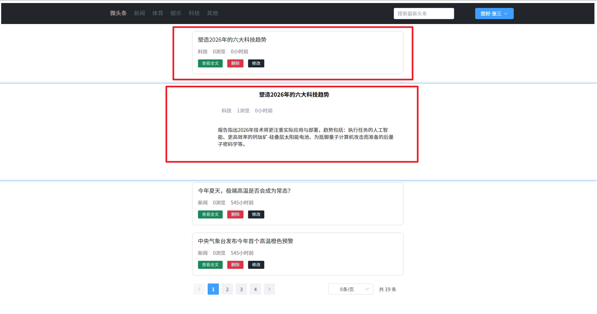
>
> 4. 通过以上内容可知，测试成功
>
>   ::::


### 修改头条回显


> 需求说明

+ **前端先调用登录校验接口,校验登录是否过期**
+ **登录校验通过后 ,则根据新闻id查询新闻的完整信息并响应给前端**

> uri

```http title="http"
headline/findHeadlineByHid
```

> 请求方式

```http title="http"
POST
```

> 请求参数

```json title="Json"
hid=1
```

> 响应示例

+ 查询成功

```json title="Json"
{
    "code":"200",
    "message":"success",
    "data":{
        "headline":{
            "hid":"1",
            "title":"马斯克宣布",
            "article":"... ... ",
            "type":"2"
        }
    }
}
```

> 后端代码

+ **NewsHeadlineController**

```java title="Java" 
package fun.xingji.headline.controller;

import fun.xingji.headline.common.Result;
import fun.xingji.headline.pojo.NewsHeadline;
import fun.xingji.headline.service.NewsHeadlineService;
import fun.xingji.headline.service.impl.NewsHeadlineServiceImpl;
import fun.xingji.headline.util.JwtHelper;
import fun.xingji.headline.util.WebUtil;
import jakarta.servlet.ServletException;
import jakarta.servlet.annotation.WebServlet;
import jakarta.servlet.http.HttpServletRequest;
import jakarta.servlet.http.HttpServletResponse;

import java.io.IOException;
import java.util.HashMap;
import java.util.Map;

@WebServlet("/headline/*")
public class NewsHeadlineController extends BaseController{

    private NewsHeadlineService headlineService = new NewsHeadlineServiceImpl();

    /**
     * 修改头条回显业务接口
     * @param req
     * @param resp
     * @throws ServletException
     * @throws IOException
     */
    protected void findHeadlineByHid(HttpServletRequest req, HttpServletResponse resp) throws ServletException, IOException {
        // 获取hid
        Integer hid = Integer.parseInt(req.getParameter("hid"));
        NewsHeadline headline = headlineService.findByHid(hid);

        // 将响应的信息发送给客户端
        Map data = new HashMap();
        data.put("headline", headline);

        // 返回JSON数据给前端
        WebUtil.writeJson(resp, Result.ok(data));
    }
}
```

+ **NewsHeadlineService**

```java title="Java" 
package fun.xingji.headline.service;

import fun.xingji.headline.pojo.NewsHeadline;
import fun.xingji.headline.pojo.vo.HeadlineDetailVo;
import fun.xingji.headline.pojo.vo.HeadlineQueryVo;

import java.util.Map;

public interface NewsHeadlineService {
    /**
     * 根据新闻id查询单个新闻
     * @param hid
     * @return
     */
    NewsHeadline findByHid(Integer hid);
}
```

+ **NewsHeadlineServiceImpl**

```java title="Java"
package fun.xingji.headline.service.impl;

import fun.xingji.headline.dao.NewsHeadlineDao;
import fun.xingji.headline.dao.impl.NewsHeadlineDaoImpl;
import fun.xingji.headline.pojo.NewsHeadline;
import fun.xingji.headline.pojo.vo.HeadlineDetailVo;
import fun.xingji.headline.pojo.vo.HeadlinePageVo;
import fun.xingji.headline.pojo.vo.HeadlineQueryVo;
import fun.xingji.headline.service.NewsHeadlineService;

import java.util.HashMap;
import java.util.List;
import java.util.Map;

public class NewsHeadlineServiceImpl implements NewsHeadlineService {

    private NewsHeadlineDao headlineDao = new NewsHeadlineDaoImpl();
    
    @Override
    public NewsHeadline findByHid(Integer hid) {
        return headlineDao.findByHid(hid);
    }
}
```

+ **NewsHeadLineDao**

```java title="Java"
package fun.xingji.headline.dao;

import fun.xingji.headline.pojo.NewsHeadline;
import fun.xingji.headline.pojo.vo.HeadlineDetailVo;
import fun.xingji.headline.pojo.vo.HeadlinePageVo;
import fun.xingji.headline.pojo.vo.HeadlineQueryVo;

import java.util.List;

public interface NewsHeadlineDao {
    /**
     * 根据新闻id查询单个新闻
     * @param hid
     * @return
     */
    NewsHeadline findByHid(Integer hid);
}
```

+ **NewUserDaoImpl**

```java title="Java"
package fun.xingji.headline.dao.impl;

import fun.xingji.headline.dao.BaseDao;
import fun.xingji.headline.dao.NewsHeadlineDao;
import fun.xingji.headline.pojo.NewsHeadline;
import fun.xingji.headline.pojo.vo.HeadlineDetailVo;
import fun.xingji.headline.pojo.vo.HeadlinePageVo;
import fun.xingji.headline.pojo.vo.HeadlineQueryVo;

import java.util.ArrayList;
import java.util.List;

public class NewsHeadlineDaoImpl extends BaseDao implements NewsHeadlineDao {
    @Override
    public NewsHeadline findByHid(Integer hid) {
        String sql = """
                select
                    hid,
                    title,
                    article,
                    type,
                    publisher,
                    page_views pageViews,
                    create_time createTime,
                    update_time updateTime,
                    is_deleted isDeleted
                from 
                    news_headline
                where 
                    hid = ?      
                """;
        List<NewsHeadline> list = baseQuery(NewsHeadline.class, sql, hid);
        return null  != list && list.size()>0? list.get(0):null;
    }
}
```

> **修改头条功能测试:**
>
> :::: steps
>
> 1. 点击文章右下角的修改按钮
>
>    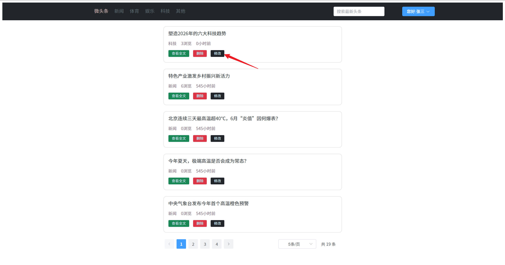
>
> 2. 内容显示出来，功能实现成功
>
>    
>
>   ::::


### 保存修改

> 需求描述

+ **客户端将新闻信息修改后,提交前先请求登录校验接口校验登录状态**
+ **登录校验通过则提交修改后的新闻信息,后端接收并更新进入数据库**

> uri

```http title="http"
headline/update
```

> 请求方式 

```http title="http"
POST
```

> 请求参数

```json title="Json"
{
    "hid":"1",
    "title":"尚硅谷宣布 ... ...",
    "article":"... ...",
    "type":"2"
}
```

> 响应示例

+ 修改成功

```json title="Json"
{
    "code":"200",
    "message":"success",
    "data":{}
}
```

+ 修改失败

```  json
{
    "code":"504",
    "message":"loginExpired",
    "data":{}
}
```

> 后端代码

+ **NewsHeadlineController**

```java title="Java" 
package fun.xingji.headline.controller;

import fun.xingji.headline.common.Result;
import fun.xingji.headline.pojo.NewsHeadline;
import fun.xingji.headline.service.NewsHeadlineService;
import fun.xingji.headline.service.impl.NewsHeadlineServiceImpl;
import fun.xingji.headline.util.JwtHelper;
import fun.xingji.headline.util.WebUtil;
import jakarta.servlet.ServletException;
import jakarta.servlet.annotation.WebServlet;
import jakarta.servlet.http.HttpServletRequest;
import jakarta.servlet.http.HttpServletResponse;

import java.io.IOException;
import java.util.HashMap;
import java.util.Map;

@WebServlet("/headline/*")
public class NewsHeadlineController extends BaseController{

    private NewsHeadlineService headlineService = new NewsHeadlineServiceImpl();

    /**
     * 更新头条的业务接口实现
     * @param req
     * @param resp
     * @throws ServletException
     * @throws IOException
     */
    protected void update(HttpServletRequest req, HttpServletResponse resp) throws ServletException, IOException {
        // 获取JSON数据
        NewsHeadline newsHeadline = WebUtil.readJson(req, NewsHeadline.class);
        headlineService.update(newsHeadline);

        // 返回JSON数据给前端
        WebUtil.writeJson(resp,Result.ok(null));
    }
}
```

+ **NewsHeadlineService**

```java title="Java" 
package fun.xingji.headline.service;

import fun.xingji.headline.pojo.NewsHeadline;
import fun.xingji.headline.pojo.vo.HeadlineDetailVo;
import fun.xingji.headline.pojo.vo.HeadlineQueryVo;

import java.util.Map;

public interface NewsHeadlineService {
    int update(NewsHeadline newsHeadline);
}
```

+ **NewsHeadlineServiceImpl**

```java title="Java"
package fun.xingji.headline.service.impl;

import fun.xingji.headline.dao.NewsHeadlineDao;
import fun.xingji.headline.dao.impl.NewsHeadlineDaoImpl;
import fun.xingji.headline.pojo.NewsHeadline;
import fun.xingji.headline.pojo.vo.HeadlineDetailVo;
import fun.xingji.headline.pojo.vo.HeadlinePageVo;
import fun.xingji.headline.pojo.vo.HeadlineQueryVo;
import fun.xingji.headline.service.NewsHeadlineService;

import java.util.HashMap;
import java.util.List;
import java.util.Map;

public class NewsHeadlineServiceImpl  implements NewsHeadlineService {
    
    private NewsHeadlineDao headlineDao = new NewsHeadlineDaoImpl();
    
    @Override
    public int update(NewsHeadline newsHeadline) {
        return headlineDao.update(newsHeadline);
    }
}
```

+ **NewsHeadLineDao**

```java title="Java"
package fun.xingji.headline.dao;

import fun.xingji.headline.pojo.NewsHeadline;
import fun.xingji.headline.pojo.vo.HeadlineDetailVo;
import fun.xingji.headline.pojo.vo.HeadlinePageVo;
import fun.xingji.headline.pojo.vo.HeadlineQueryVo;

import java.util.List;

public interface NewsHeadLineDao {
    int update(NewsHeadline newsHeadline);
}
```

+ **NewUserDaoImpl**

```java title="Java"
package fun.xingji.headline.dao.impl;

import fun.xingji.headline.dao.BaseDao;
import fun.xingji.headline.dao.NewsHeadlineDao;
import fun.xingji.headline.pojo.NewsHeadline;
import fun.xingji.headline.pojo.vo.HeadlineDetailVo;
import fun.xingji.headline.pojo.vo.HeadlinePageVo;
import fun.xingji.headline.pojo.vo.HeadlineQueryVo;

import java.util.ArrayList;
import java.util.List;

public class NewsHeadlineDaoImpl extends BaseDao implements NewsHeadLineDao{
    @Override
    public int update(NewsHeadline newsHeadline) {
        String sql = """
                update 
                    news_headline
                set 
                    title = ?,
                    article = ?,
                    type = ?,
                    update_time = now(),
                where 
                    hid = ?
                """;
        return baseUpdate(sql,
                newsHeadline.getTitle(),
                newsHeadline.getArticle(),
                newsHeadline.getType(),
                newsHeadline.getHid()
                );
    }
}
```

> **保存修改功能测试:**
>
> :::: steps
>
> 1. 点击文章右下角的修改按钮
>
>    
>
> 2. 修改相关内容后，点击保存
>
>    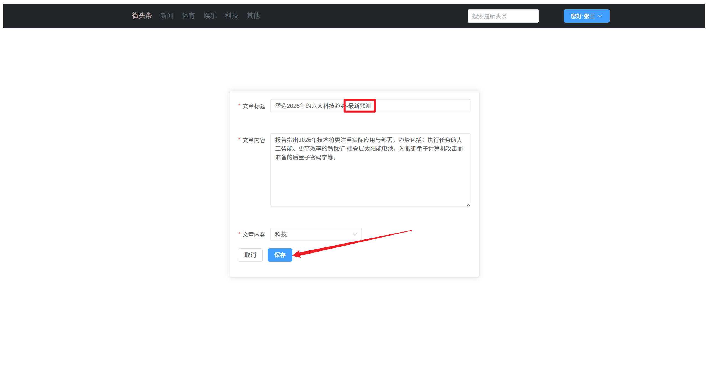
>
> 3. 查看修改后的文章内容
>
>    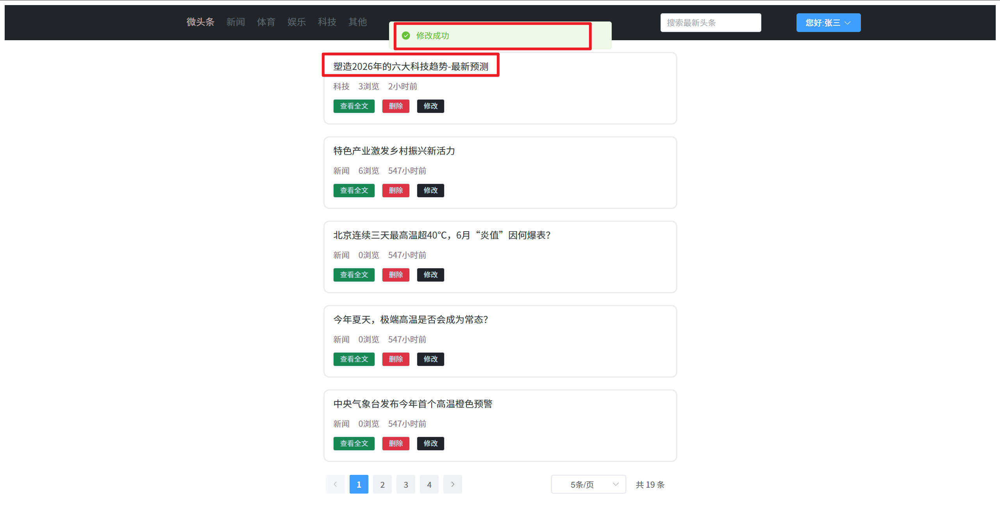
>
> 4. 测试成功
>
>   ::::


### 删除头条


> 需求说明

+ **将要`删除的新闻id`发送给`服务端`**
+ **`服务端`校验`登录是否过期`,`未过期`则`直接删除`,`过期`则`响应登录过期`信息**

> uri

```http title="http"
headline/removeByHid
```

> 请求方式

```http title="http"
POST
```

> 请求参数

```  json
hid=1
```

> 响应示例

+ 删除成功

```json title="Json"
{
    "code":"200",
    "message":"success",
    "data":{}
}
```

+ 删除失败

```json title="Json"
{
    "code":"504",
    "message":"loginExpired",
    "data":{}
    
}
```

> 后端代码

+ **NewsHeadlineController**

```java title="Java" 
package fun.xingji.headline.controller;

import fun.xingji.headline.common.Result;
import fun.xingji.headline.pojo.NewsHeadline;
import fun.xingji.headline.service.NewsHeadlineService;
import fun.xingji.headline.service.impl.NewsHeadlineServiceImpl;
import fun.xingji.headline.util.JwtHelper;
import fun.xingji.headline.util.WebUtil;
import jakarta.servlet.ServletException;
import jakarta.servlet.annotation.WebServlet;
import jakarta.servlet.http.HttpServletRequest;
import jakarta.servlet.http.HttpServletResponse;

import java.io.IOException;
import java.util.HashMap;
import java.util.Map;

@WebServlet("/headline/*")
public class NewsHeadlineController extends BaseController {
    
    private NewsHeadlineService headlineService = new NewsHeadlineServiceImpl();
    
    /**
     * 删除头条业务接口实现
     * @param req
     * @param resp
     * @throws ServletException
     * @throws IOException
     */
    protected void removeByHid(HttpServletRequest req, HttpServletResponse resp) throws ServletException, IOException {
        // 获取hid
        int hid = Integer.parseInt(req.getParameter("hid"));

        headlineService.removeByHid(hid);

        // 返回JSON数据给前端
        WebUtil.writeJson(resp, Result.ok(null));
    }
}
```

+ **NewsHeadlineService**

```java title="Java" 
package fun.xingji.headline.service;

import fun.xingji.headline.pojo.NewsHeadline;
import fun.xingji.headline.pojo.vo.HeadlineDetailVo;
import fun.xingji.headline.pojo.vo.HeadlineQueryVo;

import java.util.Map;

public interface NewsHeadlineService {
    int removeByHid(int hid);
}
```

+ **NewsHeadlineServiceImpl**

```java title="Java"
package fun.xingji.headline.service.impl;

import fun.xingji.headline.dao.NewsHeadlineDao;
import fun.xingji.headline.dao.impl.NewsHeadlineDaoImpl;
import fun.xingji.headline.pojo.NewsHeadline;
import fun.xingji.headline.pojo.vo.HeadlineDetailVo;
import fun.xingji.headline.pojo.vo.HeadlinePageVo;
import fun.xingji.headline.pojo.vo.HeadlineQueryVo;
import fun.xingji.headline.service.NewsHeadlineService;

import java.util.HashMap;
import java.util.List;
import java.util.Map;

public class NewsHeadlineServiceImpl  implements NewsHeadlineService {
    
    private NewsHeadlineDao headlineDao = new NewsHeadlineDaoImpl();
    
    @Override
    public int removeByHid(int hid) {
        return headlineDao.removeByHid(hid);
    }
}
```

+ **NewsHeadLineDao**

```java title="Java"
package fun.xingji.headline.dao;

import fun.xingji.headline.pojo.NewsHeadline;
import fun.xingji.headline.pojo.vo.HeadlineDetailVo;
import fun.xingji.headline.pojo.vo.HeadlinePageVo;
import fun.xingji.headline.pojo.vo.HeadlineQueryVo;

import java.util.List;

public interface NewsHeadLineDao {
    int removeByHid(int hid);
}
```

+ **NewsHeadlineDaoImpl**

```java title="Java"
package fun.xingji.headline.dao.impl;

import fun.xingji.headline.dao.BaseDao;
import fun.xingji.headline.dao.NewsHeadlineDao;
import fun.xingji.headline.pojo.NewsHeadline;
import fun.xingji.headline.pojo.vo.HeadlineDetailVo;
import fun.xingji.headline.pojo.vo.HeadlinePageVo;
import fun.xingji.headline.pojo.vo.HeadlineQueryVo;

import java.util.ArrayList;
import java.util.List;

public class NewsHeadlineDaoImpl extends BaseDao implements NewsHeadLineDao{
    @Override
    public int removeByHid(int hid) {
        String sql = """
                update
                    news_headline
                set 
                    is_deleted = 1
                where
                    hid = ?
                """;
        return baseUpdate(sql,hid);
    }
}
```

> **删除功能测试:**
>
> :::: steps
>
> 1. 点击文章中间的删除按钮,点击确定
>
>    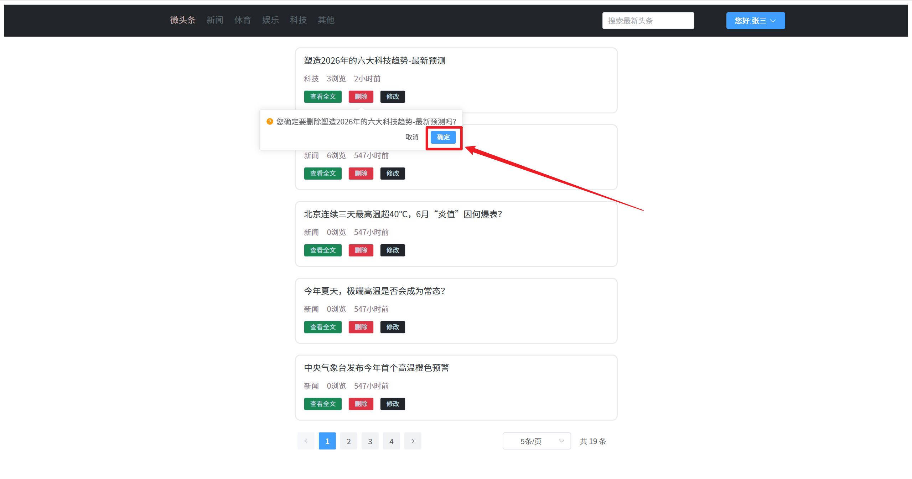
>
> 2. 删除成功后，查看到文章已经消失，表示删除功能成功
>
>    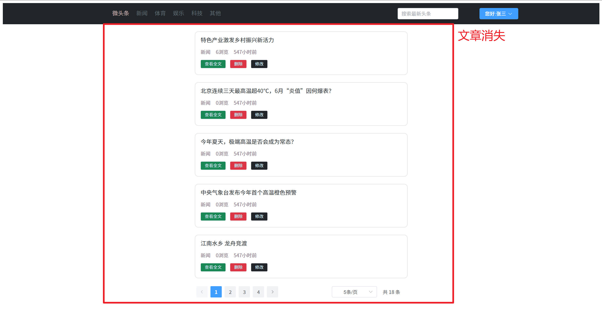
>
>   ::::
