## 环境

**主机**：Windows 11 **VMware Workstation**: 17.6.4 **虚拟机**：Ubuntu 22.04 LTS

**注：** 主机系统和VMware Workstation版本无影响，只有Ubuntu配置固定IP方式略有不同。


## 问题

最近本地部署服务就装了VMware Workstation，创建了1台Ubuntu 22的虚拟机，默认网络的配置是**NAT模式(N): 用于共享主机的IP地址**（如下图），每次重新启动都会对虚拟机自动分配IP地址，使用SSH远程连接时每次都需要修改IP，极其不便。

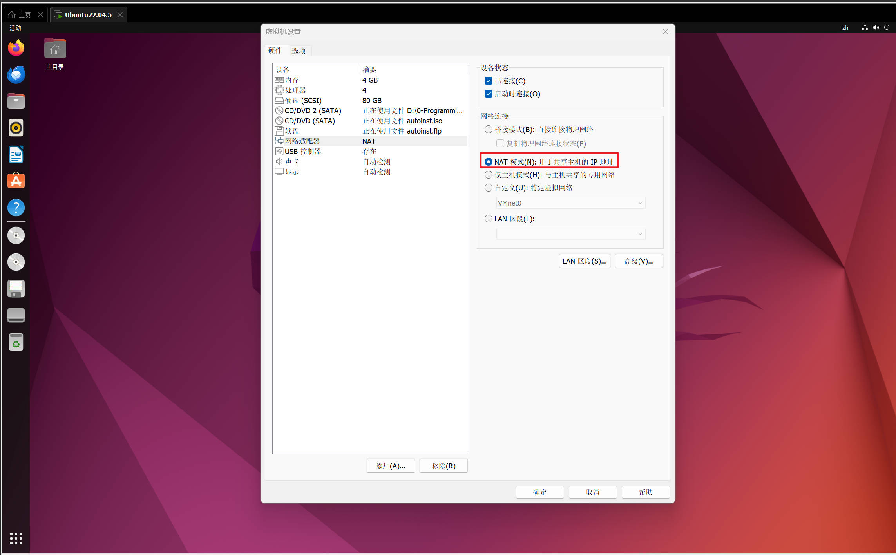因此，想到可以通过设置固定IP来解决此问题，但设置固定IP的过程中，出现了主机PING不通虚拟机或虚拟机无法访问外部网络等问题，经过查询资料，研究配置，终于解决。为了避免有同样问题的兄弟们走弯路，在此记录一下完整的配置过程供参考。


## 配置过程

省略安装VMware Workstation和创建虚拟机过程。


### 配置虚拟机网络适配器

将虚拟机网络适配器设置为VMnet8(NAT 模式)。

1.在VMware Workstation主界面，选中要配置的虚拟机，双击**网络适配器**，进入虚拟机设置->网络适配器，如下图所示：

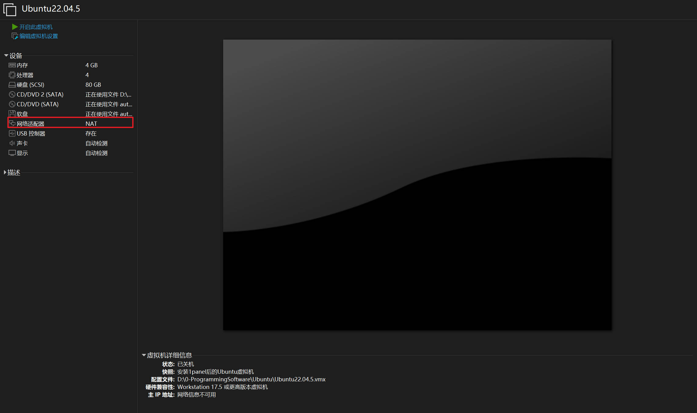

2.勾选设备状态下的**启动时连接**，设置网络连接为自定义(U): **特定虚拟网络->VMnet8（NAT 模式）**，设置完成点击**确认**保存，如下图所示：

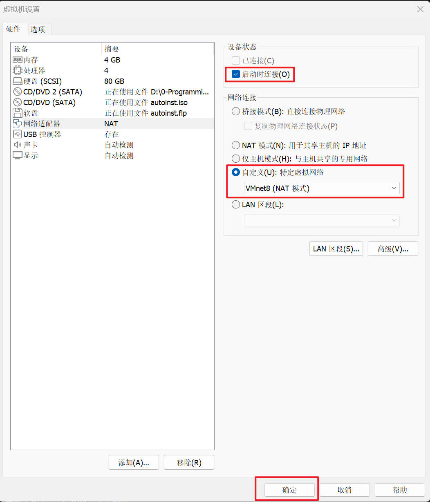

3.如有其他虚拟机，按照如上两个步骤依次设置。


### 配置虚拟机网络

将虚拟机网络设置为NAT模式，并设置虚拟网络的网段。

1.在VMware Workstation主界面，点击菜单中的 **编辑->虚拟机网络编辑器(N)...** 进入编辑界面，如下图所示：

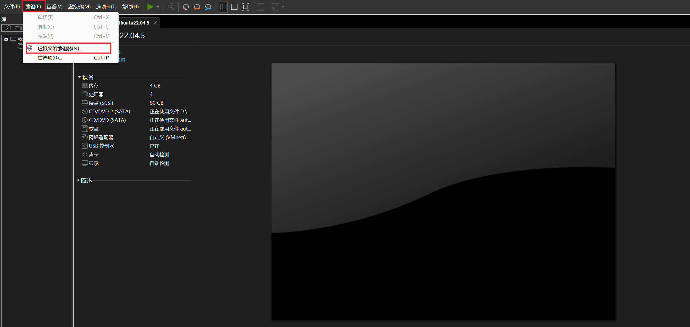

2.选中**VMnet8**，如下图中步骤“**1**”。

3.点击**更改设置**，更改为管理员权限才能进行修改(*如管理员权限运行VMware Workstation，略过此步骤*)，如下图步骤“**2**”。

3.VMnet信息设置，选中**NAT模式(与虚拟机共享主机的IP地址)(N)**，如下图中步骤“**3**”。

4.VMnet信息设置，勾选**将主机虚拟机适配器连接到此网络(V)**，如下图中步骤“**4**”。

5.设置子网IP和子网掩码，子网IP一般为192.168.xxx.0（此处为192.168.119.0，记住此IP），子网掩码为255.255.255.0，如下图中步骤“**5**”。

6.以上步骤都配置完成后如下图所示，确认无问题后点击**NAT设置(S)...**，下图中步骤“**6**”：

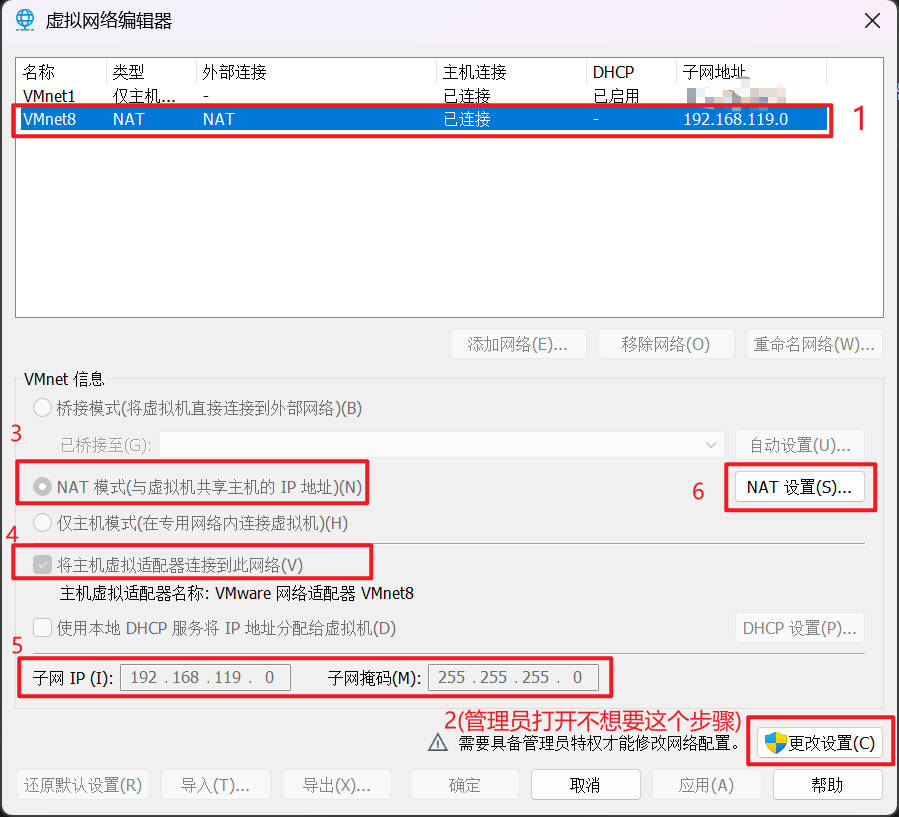

7.设置网关IP，将网关IP设置为**192.168.xxx.2**(192.168.xxx和步骤5一致)，设置完成后点击确认保存，如下图所示：

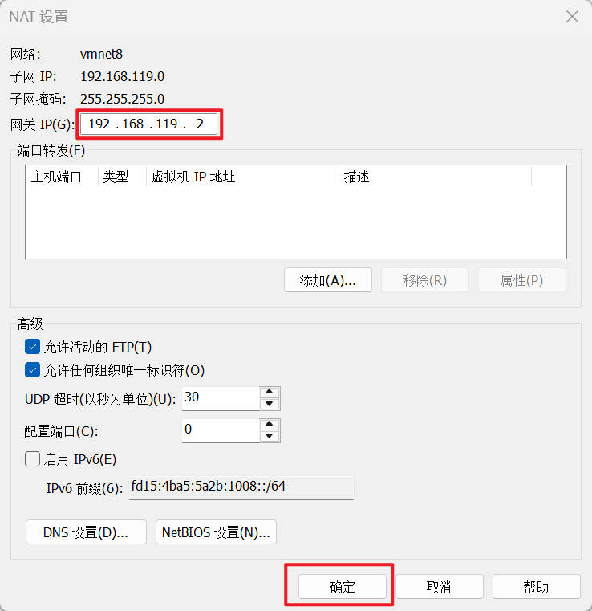


### 配置虚拟网卡网络适配器

将VMnet8设置为192.168.xxx网段的固定IP，否则默认分配的可能为其他网段IP，导致主机无法连通虚拟机。

1.进入主机的系统设置，选中**网络和Internet**->**高级网络设置**，如下图所示：

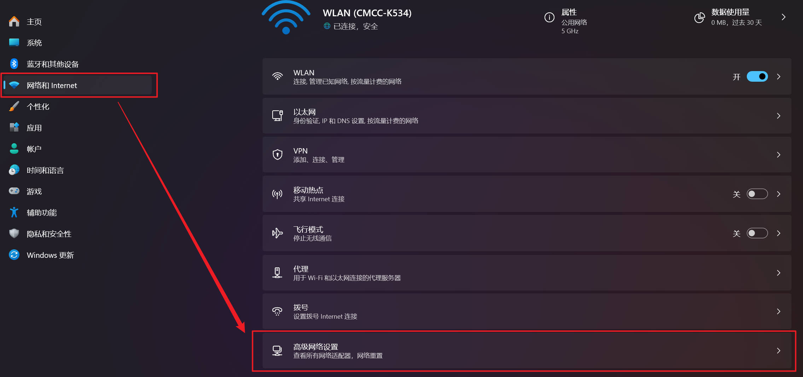

2.进入**VMware Network Adapter VMnet8**的**更多适配器选项**的编辑页，如下图所示：

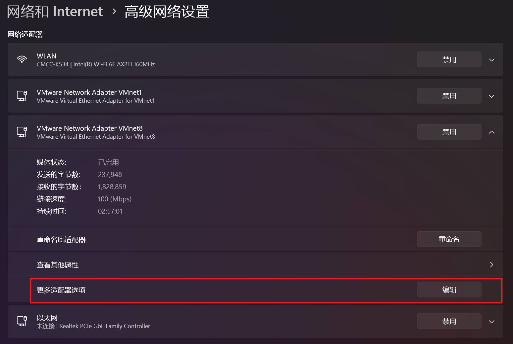

3.双击**Internet 协议版本 4 (TCP/IPv4) 进入属性设置页面，如下图所示：**

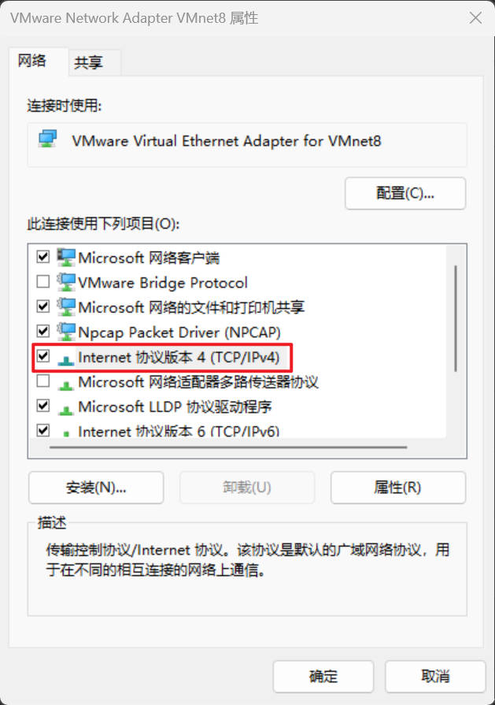

**Network Adapter VMnet8**设置为固定IP，IP地址为**192.168.xxx.1**（需和虚拟机网络的子网IP、网关IP的前缀192.168.xxx一致，此处为192.168.119.1）,子网掩码为**255.255.255.0**，默认网关为**192.168.xxx.2**(需和虚拟机网络的网关一致，此处为192.168.227.2)，DNS服务器可按照下图配置为**114.114.114.114、8.8.8.8**(国内三大运营商通用的114.114.114.114，备用的选的是Google的8.8.8.8)。全部配置完成后，点击确认保存。

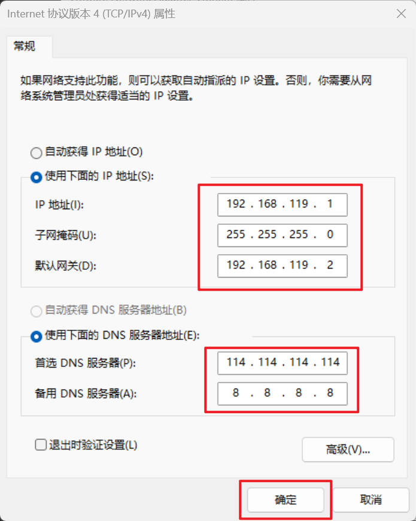


### 配置虚拟机固定IP

#### 使用netplan配置（系统原生）

1.**备份原配置文件**

> **启动虚拟机，切换root权限，使用以下命令:**

```bash
# 查看现有配置文件
ls -la /etc/netplan/

# 备份配置文件
cp /etc/netplan/01-network-manager-all.yaml /etc/netplan/01-network-manager-all.yaml.backup
# 或者备份其他可能的配置文件
```

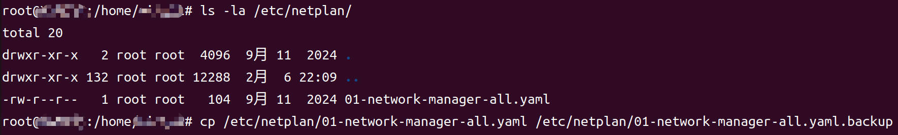


2.**编辑netplan配置文件**

> **启动虚拟机，切换root权限，使用以下命令:**

```bash
# 使用nano编辑（推荐新手）
nano /etc/netplan/01-network-manager-all.yaml

# 或使用vim
vim /etc/netplan/01-network-manager-all.yaml
```

> 1. **删除原有内容**：
>    - 按 `Ctrl+K` 可以剪切当前行（多次按可以删除多行）
>    - 或者按 `Ctrl+Shift+V` 粘贴新内容覆盖
> 2. **粘贴新配置**：
>    - 复制我上面的配置内容
>    - 在nano中按 `Ctrl+Shift+V` 粘贴
> 3. **保存文件**：
>    - 按 `Ctrl+O`（字母O，不是零）
>    - 按 `Enter` 确认文件名
> 4. **退出nano**：
>    - 按 `Ctrl+X` 退出

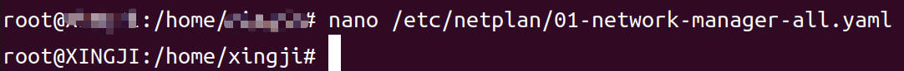


3.**配置内容示例**

> 根据之前配置的IP网段192.168.xxx将配置内容修改为如下:

```yaml
network:
  version: 2
  ethernets:
    ens33:
      dhcp4: no
      addresses:
        - 192.168.119.100/24
      routes:
        - to: default
          via: 192.168.119.2
      nameservers:
        addresses: [114.114.114.114, 8.8.8.8]
```

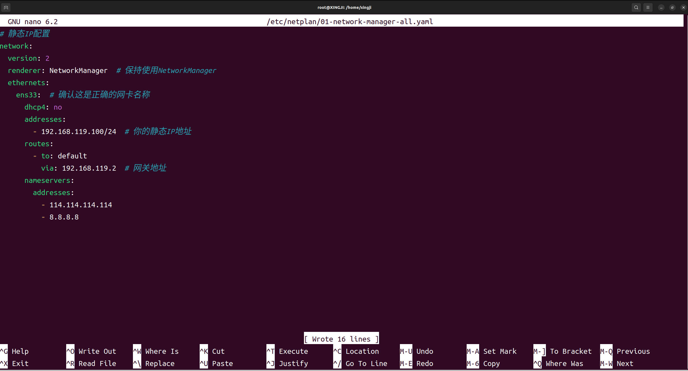


4.**应用配置**

```bash
# 或直接应用配置
netplan apply

# 重启网络服务（可选）
systemctl restart systemd-networkd
```

注意：这是一个权限警告，不是错误。说明你的配置文件权限过于宽松，有安全风险。让我们修复它：

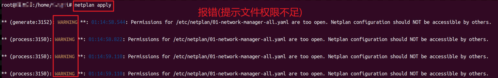

#### 修复配置文件权限

```bash
# 修复权限（只有root可读写）
sudo chmod 600 /etc/netplan/01-network-manager-all.yaml

# 确认权限已修改
ls -la /etc/netplan/01-network-manager-all.yaml
```


应该显示：

```text
-rw------- 1 root root ... /etc/netplan/01-network-manager-all.yaml
```


#### 再次应用配置

```bash
# 再次应用配置
netplan apply
```

这次应该不再显示权限警告。


## 结果验证

到此，所有配置就完成了，对配置结果进行验证。

1.主机是否可PING通虚拟机，如下图收到回复即验证成功：

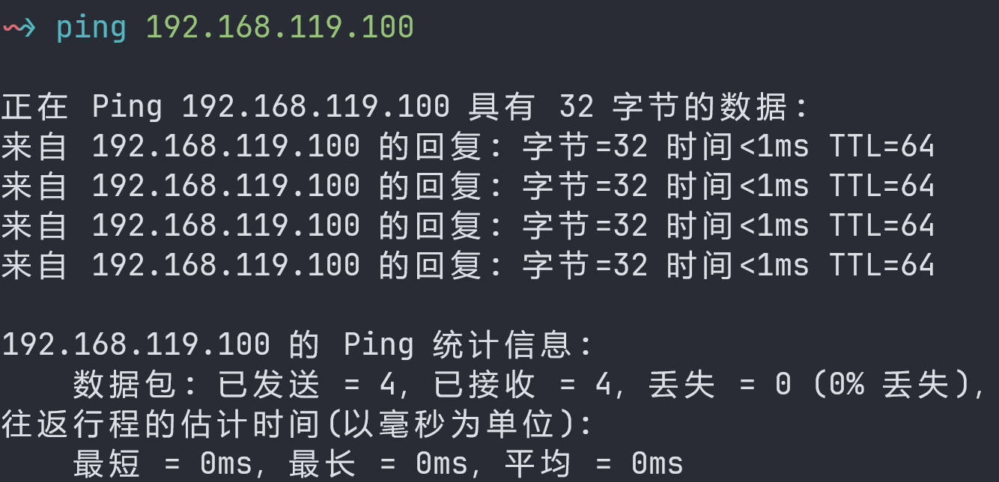


2.虚拟机是否可PING通主机，如下图收到回复即验证成功：

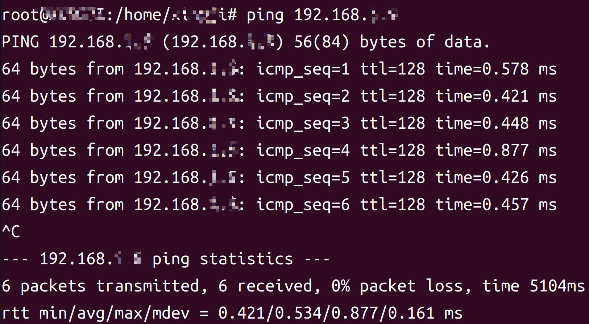


3.虚拟机是否可访问外部网络(命令`wget www.baidu.com`)，响应为**200 OK**即验证成功，如下图所示：

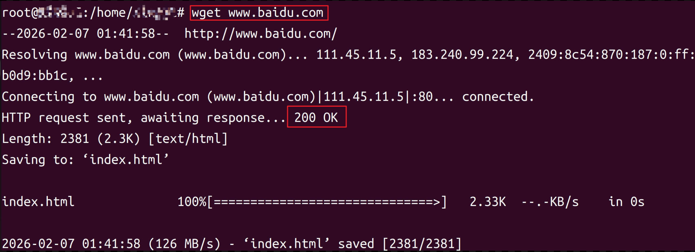