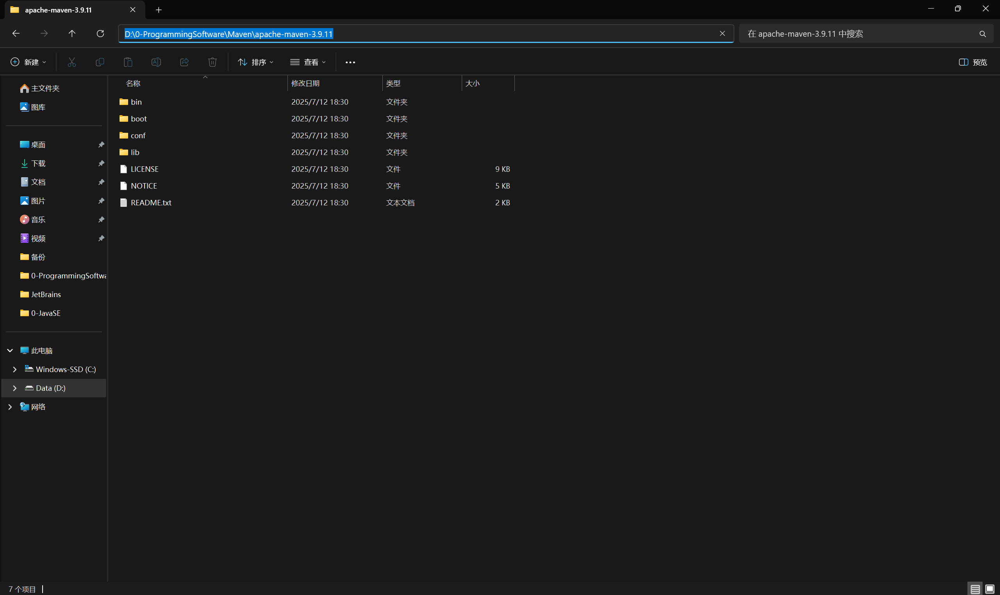
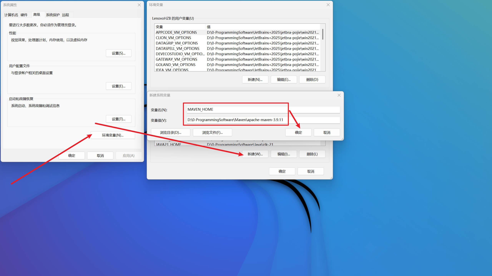
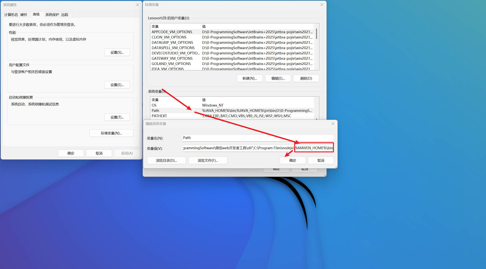

Maven 是一个开源的构建工具，用于 Java 项目的构建、测试和发布。Maven 构建项目时，会自动下载项目所依赖的包，并自动构建项目。Maven 的主要功能是管理项目依赖关系，并自动下载依赖的包。Maven 的主要优点是：

- 简化项目构建过程
- 自动管理项目依赖关系
- 提供项目构建的标准化
- 提供项目构建的自动化

## Maven 安装

Maven 是一个 Java 程序，因此需要先安装 Java 运行环境（JRE）或 Java 开发工具包（JDK）。JDK 是 Java 开发工具包，包含了 Java 运行环境（JRE）和 Java 开发工具。JRE 是 Java 运行环境，包含了 Java 运行时环境和 Java 开发工具。

### 下载 Maven

Maven 的官方网站是 [Maven](https://maven.apache.org/)，可以在该网站上下载 Maven 的最新版本。


### 安装 Maven

1. 下载 Maven 压缩包，解压到指定目录，例如 `D:\0-ProgrammingSoftware\Maven`。


2. 复制 Maven 的解压目录`D:\0-ProgrammingSoftware\Maven\apache-maven-3.9.11`



3. 配置环境变量，将 Maven 的 `bin` 目录添加到系统的 `PATH` 环境变量中。






4. 打开命令行窗口，输入 `mvn -v`，如果输出 Maven 的版本信息，则表示 Maven 安装成功。


## Maven 配置

@[bilibili p4](BV1uApMeWErY)

### 配置本地仓库

Maven 的本地仓库是存储项目依赖的包的目录。Maven 默认的本地仓库是 `${user.home}/.m2/repository`，可以通过修改 `settings.xml` 文件来修改本地仓库的路径。
1. 打开 Maven 的 `conf` 目录，找到 `settings.xml` 文件。

2. 在 `settings.xml` 文件中，找到 `<localRepository>` 标签，修改其值为本地仓库的路径，例如 `D:\0-ProgrammingSoftware\Maven\apache-maven-3.9.11\Maven-Repository`。

```xml title="settings.xml"
<localRepository>D:\0-ProgrammingSoftware\Maven\apache-maven-3.9.11\Maven-Repository</localRepository>
```

3. 保存 `settings.xml` 文件。

### 配置远程仓库

Maven 的远程仓库是存储项目依赖的包的仓库。Maven 默认的远程仓库是 Maven 中央仓库，可以通过修改 `settings.xml` 文件来配置远程仓库。
1. 打开 Maven 的 `conf` 目录，找到 `settings.xml` 文件。

2. 在 `settings.xml` 文件中，找到 `<mirrors>` 标签，添加一个 `<mirror>` 标签，例如：

```xml title="settings.xml"
<mirror>
    <id>aliyun</id>
    <mirrorOf>central</mirrorOf>
    <name>aliyun maven</name>
    <url>https://maven.aliyun.com/repository/public</url>
</mirror>
```

3. 保存 `settings.xml` 文件。

### 配置 JDK 版本
1. 打开 `conf` 目录，找到 `settings.xml` 文件。
2. 在 `settings.xml` 文件中，找到 `<profiles>` 标签，添加一个 `<profile>` 标签，例如：

```xml title="settings.xml"
<profile>
    <id>jdk-17</id>
    <activation>
        <activeByDefault>true</activeByDefault>
        <jdk>17</jdk>
    </activation>
    <properties>
        <project.build.sourceEncoding>UTF-8</project.build.sourceEncoding>
        <maven.compiler.source>17</maven.compiler.source>
        <maven.compiler.target>17</maven.compiler.target>
        <maven.compiler.compilerVersion>17</maven.compiler.compilerVersion>
    </properties>
</profile>
```

3. 保存 `settings.xml` 文件。


## IDEA 配置 Maven

> **打开 IDEA，点击 `File` -> `Settings` -> `Build, Execution, Deployment` -> `Build Tools` -> `Maven`。**

