### Maven 快速上手

Maven 翻译为"专家"、"内行"，是 Apache 下的一个纯 Java 开发的开源项目。基于项目对象模型（缩写：POM）概念，Maven利用一个中央信息片断能管理一个项目的构建、报告和文档等步骤。Maven 是一个项目管理工具，可以对 Java 项目进行构建、依赖管理。Maven 也可被用于构建和管理各种项目，例如 C#，Ruby，Scala 和其他语言编写的项目。Maven 曾是 Jakarta 项目的子项目，现为由 Apache 软件基金会主持的独立 Apache 项目。

通过Maven，可以帮助我们做：

- 项目的自动构建，包括代码的编译、测试、打包、安装、部署等操作。
- 依赖管理，项目使用到哪些依赖，可以快速完成导入，不需要手动导入jar包。

Maven也需要安装环境，但是IDEA已经自带了Maven环境，因此我们不需要再去进行额外的环境安装（无IDEA也能使用Maven，但是配置过程很麻烦，并且我们现在使用的都是IDEA的集成开发环境，所以这里就不讲解Maven命令行操作了）我们直接创建一个新的Maven项目即可。

### Maven项目结构

我们之前使用的都是最原始的Java项目目录格式，其中`src`目录直接包含我们的包以及对应的代码：

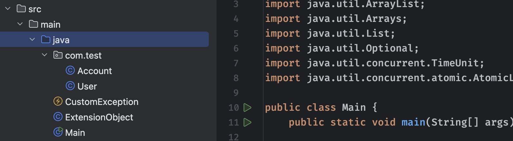

这是IDEA为我们提供的一种非常高效简洁的项目目录格式，虽然它用起来非常的简单方便，但是在管理依赖上，确实比较麻烦，我们得手动将我们需要的依赖以jar包的形式导入，光寻找这些jar包就得花费很多时间，并且不同的jar包还会依赖更多jar包，就像下崽一样，所以对于大型项目来说，这并不是一个很好的使用方式。

而Maven就很好地解决了这个问题，我们可以先来看一下，一个Maven项目和我们普通的项目有什么区别：

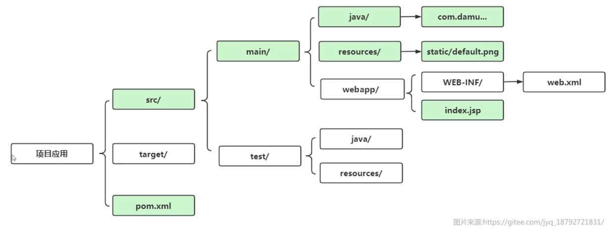

其中src目录下存放我们的源代码和测试代码，分别位于main和test目录下，而test和main目录下又具有java、resources目录，它们分别用于存放Java源代码、静态资源（如配置文件、图片等）、很多JavaWeb项目可能还会用到webapp目录。

而下面的pom.xml则是Maven的核心配置，也是整个项目的所有依赖、插件、以及各种配置的集合，它也是使用XML格式编写的，一个标准的pom配置长这样：

```xml title="XML"
<?xml version="1.0" encoding="UTF-8"?>
<project xmlns="http://maven.apache.org/POM/4.0.0"
         xmlns:xsi="http://www.w3.org/2001/XMLSchema-instance"
         xsi:schemaLocation="http://maven.apache.org/POM/4.0.0 http://maven.apache.org/xsd/maven-4.0.0.xsd">
    <modelVersion>4.0.0</modelVersion>

    <groupId>cn.itbaima</groupId>
    <artifactId>BookManage</artifactId>
    <version>1.0</version>

    <properties>
        <maven.compiler.source>17</maven.compiler.source>
        <maven.compiler.target>17</maven.compiler.target>
        <project.build.sourceEncoding>UTF-8</project.build.sourceEncoding>
    </properties>

</project>
```

我们可以看到，Maven的配置文件是以`project`为根节点，而`modelVersion`定义了当前模型的版本，一般是4.0.0，我们不用去修改。

`groupId`、`artifactId`、`version`这三个元素合在一起，用于唯一区别每个项目，别人如果需要将我们编写的代码作为依赖，那么就必须通过这三个元素来定位我们的项目，我们称为一个项目的基本坐标，所有的项目一般都有自己的Maven坐标，因此我们通过Maven导入其他的依赖只需要填写这三个基本元素就可以了，无需再下载Jar文件，而是Maven自动帮助我们下载依赖并导入：

* `groupId` 一般用于指定组名称，命名规则一般和包名一致，比如我们这里使用的是`org.example`，一个组下面可以有很多个项目。
* `artifactId` 一般用于指定项目在当前组中的唯一名称，也就是说在组中用于区分于其他项目的标记。
* `version` 代表项目版本，随着我们项目的开发和改进，版本号也会不断更新，就像LOL一样，每次赛季更新都会有一个大版本更新，我们的Maven项目也是这样，我们可以手动指定当前项目的版本号，其他人使用我们的项目作为依赖时，也可以根本版本号进行选择（这里的SNAPSHOT代表快照，一般表示这是一个处于开发中的项目，正式发布项目一般只带版本号）

`properties`中一般都是一些变量和选项的配置，我们这里指定了JDK的源代码和编译版本为17，同时下面的源代码编码格式为UTF-8，无需进行修改。

### Maven依赖导入

现在我们尝试使用Maven来帮助我们快速导入依赖，我们需要导入之前的JDBC驱动依赖、JUnit依赖、Mybatis依赖、Lombok依赖，那么如何使用Maven来管理依赖呢？

我们可以创建一个`dependencies`节点：

```xml title="XML"
<dependencies>
    //里面填写的就是所有的依赖
</dependencies>
```

那么现在就可以向节点中填写依赖了，那么我们如何知道每个依赖的坐标呢？我们可以在：https://central.sonatype.com 进行查询，我们直接搜索Lombok即可，打开后可以看到已经给我们写出了依赖的坐标：

<!---->


```xml title="XML"
<dependency>
    <groupId>org.projectlombok</groupId>
    <artifactId>lombok</artifactId>
    <version>1.18.36</version>
</dependency>
```

我们直接将其添加到`dependencies`节点中即可，现在我们来编写一个测试用例看看依赖导入成功了没有：

```java title="java"
public class Main {
    public static void main(String[] args) {
        Student student = new Student("小明", 18);
        System.out.println(student);
    }
}
```

```java title="java"
@Data
@AllArgsConstructor
public class Student {
    String name;
    int age;
}
```

项目运行成功，表示成功导入了依赖。那么，Maven是如何进行依赖管理呢，以致于如此便捷的导入依赖，我们来看看Maven项目的依赖管理流程：

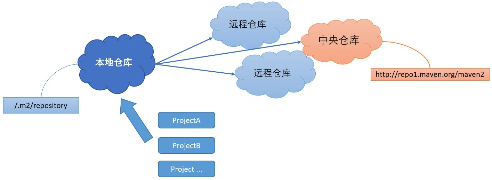

通过流程图我们得知，一个项目依赖一般是存储在中央仓库中，也有可能存储在一些其他的远程仓库（可以自行搭建私服）几乎所有的依赖都被放到了中央仓库中，因此，Maven可以直接从中央仓库中下载大部分的依赖（因此Maven第一次导入依赖是需要联网的，否则无法下载）远程仓库中下载之后 ，会暂时存储在本地仓库，我们会发现我们本地存在一个`.m2`文件夹，这就是Maven本地仓库文件夹，默认建立在C盘，如果你C盘空间不足，会出现问题。

在下次导入依赖时，如果Maven发现本地仓库中就已经存在某个依赖，那么就不会再去远程仓库下载了。

**注意：** 因为中心仓库服务器位于国外，下载速度缓慢，可能在导入依赖时会出现卡顿等问题，我们需要使用国内的镜像仓库服务器来加速访问（镜像仓库与中心仓库自动同步所有依赖，访问速度更快）有两种方式配置：

1. 可以配置IDEA自带的Maven插件远程仓库镜像地址，我们打开IDEA的安装目录，找到`安装根目录/plugins/maven/lib/maven3/conf`文件夹，找到`settings.xml`文件，打开编辑，找到mirros标签，添加以下内容：

   ```xml title="XML"
   <mirror>
     <id>aliyunmaven</id>
     <mirrorOf>central</mirrorOf>
     <name>阿里云公共仓库</name>
     <url>https://maven.aliyun.com/repository/public</url>
   </mirror>
   ```

2. 自行前往Maven官网并下载最新版的Maven安装，然后将IDEA的Maven配置为我们自行安装的位置（好处是IDEA更新后不需要重新配置）可以一直使用，镜像配置方式同第1步。

这样，我们就将默认的远程仓库地址（国外），配置为国内的阿里云仓库地址了（依赖的下载速度就会快起来了）

### Maven依赖作用域

除了三个基本的属性用于定位坐标外，依赖还可以添加以下属性：

- **type**：**依赖的类型，对于项目坐标定义的packaging。大部分情况下，该元素不必声明，其默认值为jar**
- **scope**：**依赖的范围（作用域，着重讲解）**
- **optional**：**标记依赖是否可选**
- **exclusions**：**用来排除传递性依赖（一个项目有可能依赖于其他项目，就像我们的项目，如果别人要用我们的项目作为依赖，那么就需要一起下载我们项目的依赖，如Lombok）**

我们着重来讲解一下`scope`属性，它决定了依赖的作用域范围：

- **compile** ：默认的依赖有效范围，如果在定义依赖关系的时候，没有明确指定依赖有效范围的话，则**`默认采用该依赖有效范围`**，此范围表示在**`编译`、`运行`、`测试`**时均有效。

<!--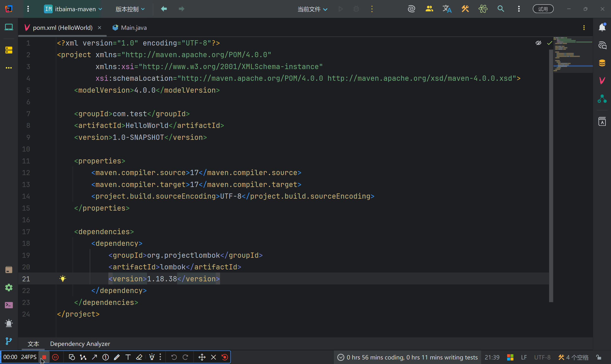-->


- **provided** ：**仅在`编译`、`测试`时有效**，但是在**`运行时无效`**，也就是说，项目在运行时，不需要此依赖，比如我们上面的Lombok，我们只需要在编译阶段使用它，编译完成后，**实际上已经转换为对应的代码了**，因此Lombok不需要在项目**运行时也存在**。

<!--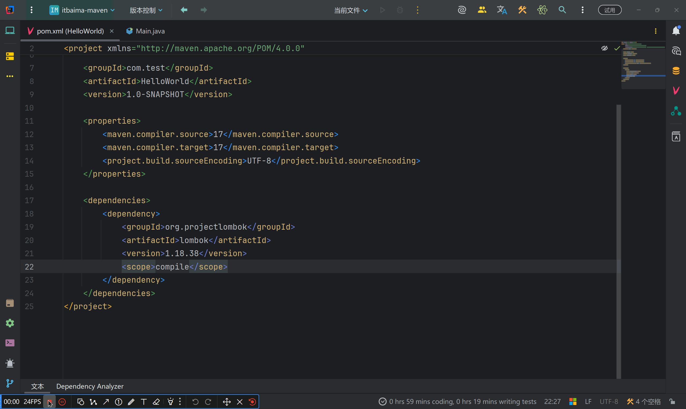-->


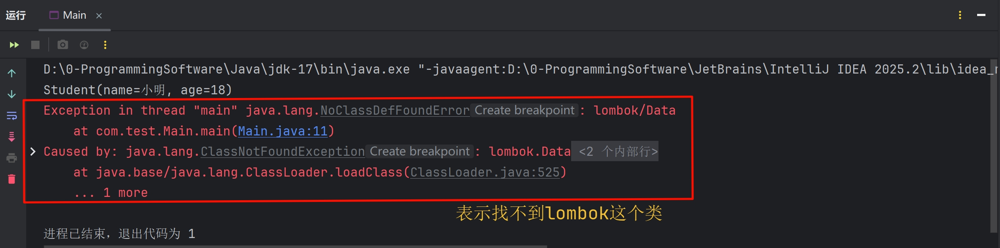

- **runtime** ：**在`运行`、`测试`时有效**，但是在**`编译代码时无效`**。比如**JDBC驱动**就是典型的**只需要运行时使用**，因为**JDBC驱动**由**数据库厂商开发**，我们**使用的始终是JDK中提供的`接口`**，不需要直接使用特定驱动中的**类或是方法**，因此**只需在运行时包含即可**。

<!--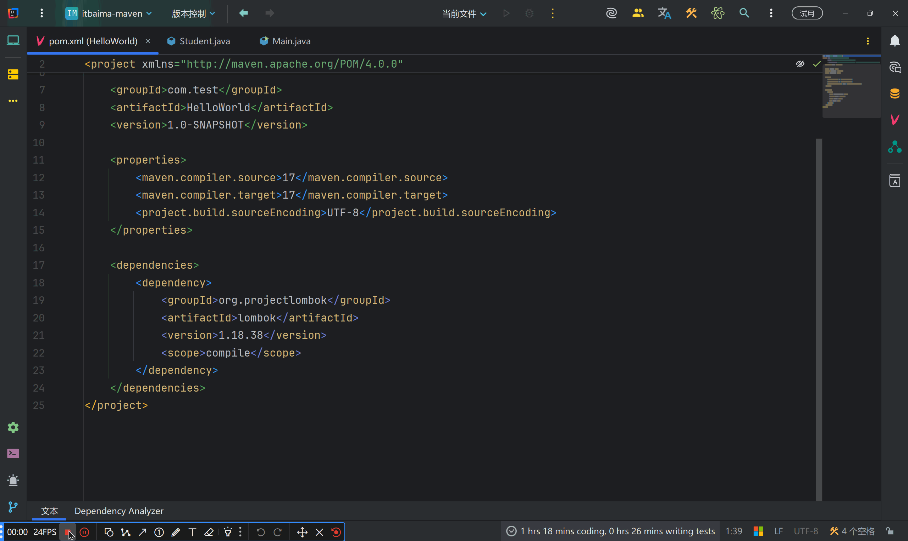-->


- **test** ：**只在`测试`时有效**，例如：`JUnit框架`，我们一般只会在测试阶段使用`JUnit`，而实际项目运行时，我们就用不到测试了，所以这个选项非常适合`测试相关的框架`。

<!--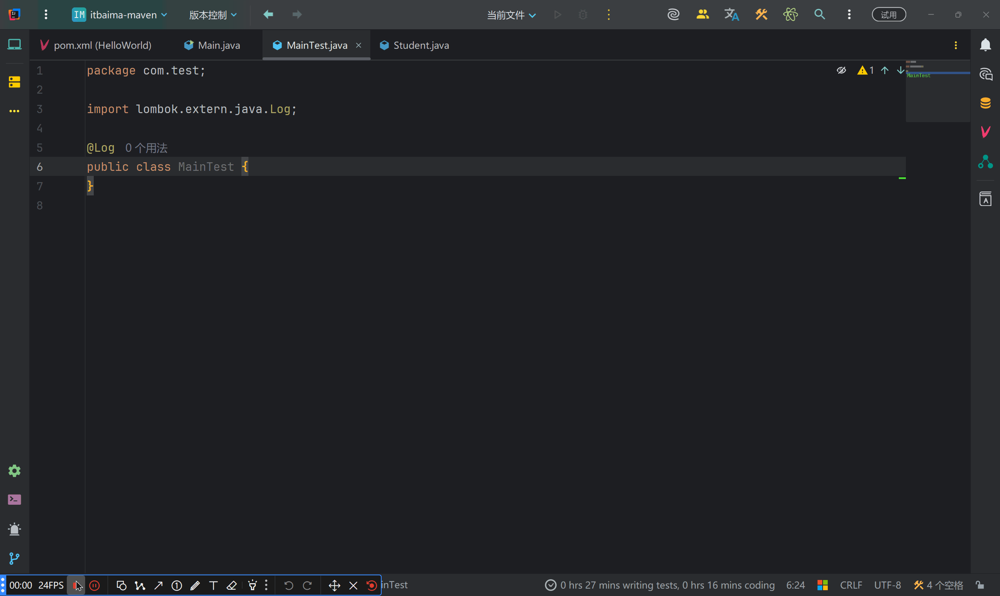-->


这里我们来测试一下JUnit，我们可以在网站上搜索JUnit的依赖，我们这里导入最新的JUnit5作为依赖：

```xml title="XML"
<dependency>
    <groupId>org.junit.jupiter</groupId>
    <artifactId>junit-jupiter</artifactId>
    <version>5.8.1</version>
    <scope>test</scope>
</dependency>
```

我们所有的测试用例全部编写到Maven项目给我们划分的test目录下，位于此目录下的内容不会在最后被打包到项目中，只用作开发阶段测试使用：

```java title="java"
public class MainTest {

    @Test
    public void test(){
        System.out.println("测试");
      	//Assert在JUnit5时名称发生了变化Assertions
        Assertions.assertArrayEquals(new int[]{1, 2, 3}, new int[]{1, 2});
    }
}
```

因此，一般仅用作测试的依赖如`JUnit只保留在测试`中即可，那么现在我们再来添加`JDBC和Mybatis`的依赖：

```xml title="XML"
<dependency>
    <groupId>mysql</groupId>
    <artifactId>mysql-connector-java</artifactId>
    <version>8.0.33</version>
    <scope>runtime</scope>
</dependency>
<dependency>
    <groupId>org.mybatis</groupId>
    <artifactId>mybatis</artifactId>
    <version>3.5.19</version>
</dependency>
```

我们发现，Maven还给我们提供了一个`resource`目标，我们可以将一些静态资源，比如配置文件，放入到这个文件夹中，项目在打包时会将资源文件夹中文件一起打包的Jar中，比如我们在这里编写一个Mybatis的配置文件：

<!--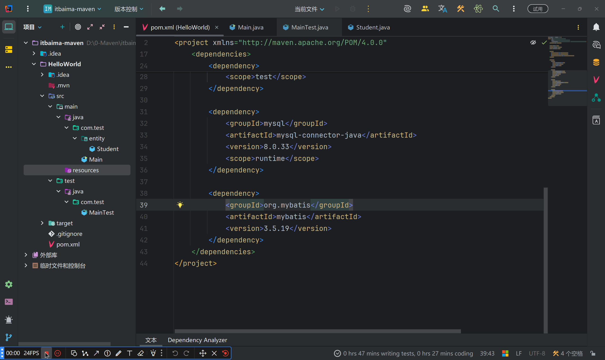-->


```xml title="XML"
<?xml version="1.0" encoding="UTF-8" ?>
<!DOCTYPE configuration
        PUBLIC "-//mybatis.org//DTD Config 3.0//EN"
        "http://mybatis.org/dtd/mybatis-3-config.dtd">
<configuration>
    <settings>
        <setting name="mapUnderscoreToCamelCase" value="true"/>
        <setting name="cacheEnabled" value="true"/>
        <setting name="logImpl" value="JDK_LOGGING" />
    </settings>
    <!-- 需要在environments的上方 -->
    <typeAliases>
        <package name="com.test.entity"/>
    </typeAliases>
    
    <environments default="development">
        <environment id="development">
            <transactionManager type="JDBC"/>
            <dataSource type="POOLED">
                <property name="driver" value="com.mysql.cj.jdbc.Driver"/>
                <property name="url" value="jdbc:mysql://localhost:3306/web_study"/>
                <property name="username" value="root"/>
                <property name="password" value="1225"/>
            </dataSource>
        </environment>
    </environments>
    <mappers>
        <mapper class="com.test.mapper.TestMapper"/>
    </mappers>
</configuration>
```

设计一个名为web_study的数据库，写入相关数据：

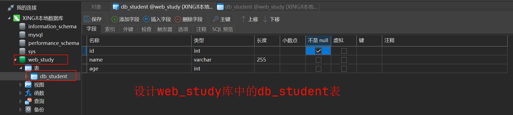

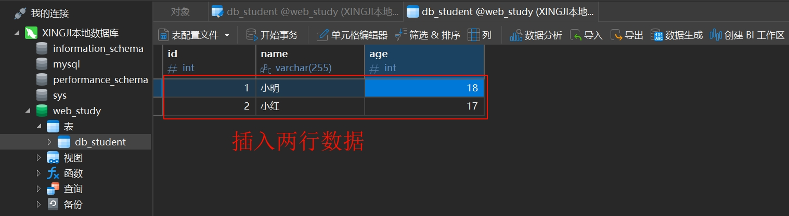

定义一个TestMapper的测试接口:

```java title="java"
package com.test.mapper;

import com.test.entity.Student;
import org.apache.ibatis.annotations.Select;

public interface TestMapper {

    @Select("SELECT * FROM db_student WHERE id = #{id}")
    Student selectById(int id);
}
```

现在我们创建一下测试用例，顺便带大家回顾一下JUnit5的使用：

```java title="java"
public class MainTest {

    //因为配置文件位于内部，我们需要使用Resources类的getResourceAsStream来获取内部的资源文件
    private static SqlSessionFactory factory;

    //在JUnit5中@Before被废弃，它被细分了：
    @BeforeAll // 一次性开启所有测试案例只会执行一次 (方法必须是static)
    // @BeforeEach 一次性开启所有测试案例每个案例开始之前都会执行一次
    @SneakyThrows
    public static void before(){
        factory = new SqlSessionFactoryBuilder()
                .build(Resources.getResourceAsStream("mybatis-config.xml"));
    }


    @DisplayName("Mybatis数据库测试")  //自定义测试名称
    @RepeatedTest(3)  //自动执行多次测试
    public void test(){
        try (SqlSession sqlSession = factory.openSession(true)){
            TestMapper testMapper = sqlSession.getMapper(TestMapper.class);
            System.out.println(testMapper.selectById(1));
        }
    }
}
```

<!---->


进行`Mybatis连接数据库测试`:

<!--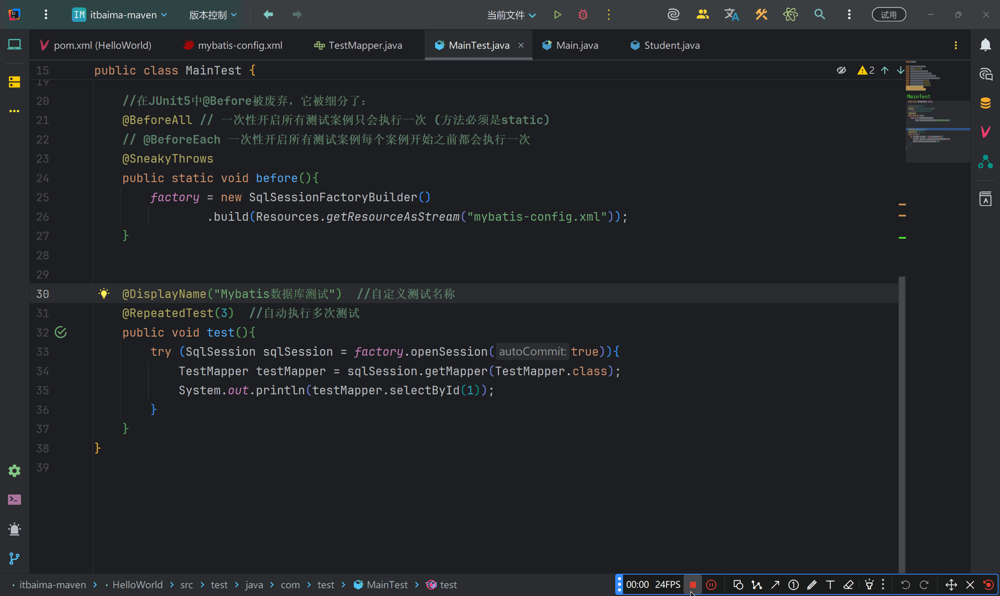-->


那么就有人提问了，如果我需要的依赖没有上传的远程仓库，而是只有一个Jar怎么办呢？我们可以使用第四种作用域：

- **system**：作用域和provided是一样的，但是它不是从远程仓库获取，而是直接导入本地Jar包。

```xml title="XML"
<dependency>
     <groupId>javax.jntm</groupId>
     <artifactId>lbwnb</artifactId>
     <version>2.0</version>
     <scope>system</scope>
     <systemPath>C://学习资料/4K高清无码/test.jar</systemPath>
</dependency>
```

比如上面的例子，如果scope为system，那么我们需要添加一个systemPath来指定jar文件的位置，这里就不再演示了。

### Maven安装、可选和排除

前面我们给大家介绍了依赖的导入方式和各种作用域，我们接着来看如何在其他项目中引入我们自己编写的Maven项目作为依赖使用。这里我们创建一个用于测试的简单项目：

```xml title="XML"
<?xml version="1.0" encoding="UTF-8"?>
<project xmlns="http://maven.apache.org/POM/4.0.0"
         xmlns:xsi="http://www.w3.org/2001/XMLSchema-instance"
         xsi:schemaLocation="http://maven.apache.org/POM/4.0.0 http://maven.apache.org/xsd/maven-4.0.0.xsd">
    <modelVersion>4.0.0</modelVersion>

    <groupId>com.test</groupId>
    <artifactId>itbaima-mavenTest</artifactId>
    <version>1.0-SNAPSHOT</version>

    ...

</project>
```

```java title="java"
public class TestUtils {
    public static void test(){
        System.out.println("啊真的是你丫");
    }
}
```

接着我们点击右上角的Maven选项，然后执行`install`或直接在命令行中输入`mvn install`来安装我们自己的项目到**`本地Maven仓库`**中。

<!---->


接着我们就可以在需要使用此项目作为依赖的其他项目中使用它了，只需要填写和这边一样的坐标：

```xml title="XML"
<dependency>
    <groupId>com.test</groupId>
    <artifactId>itbaima-mavenTest</artifactId>
    <version>1.0-SNAPSHOT</version>
</dependency>
```

<!--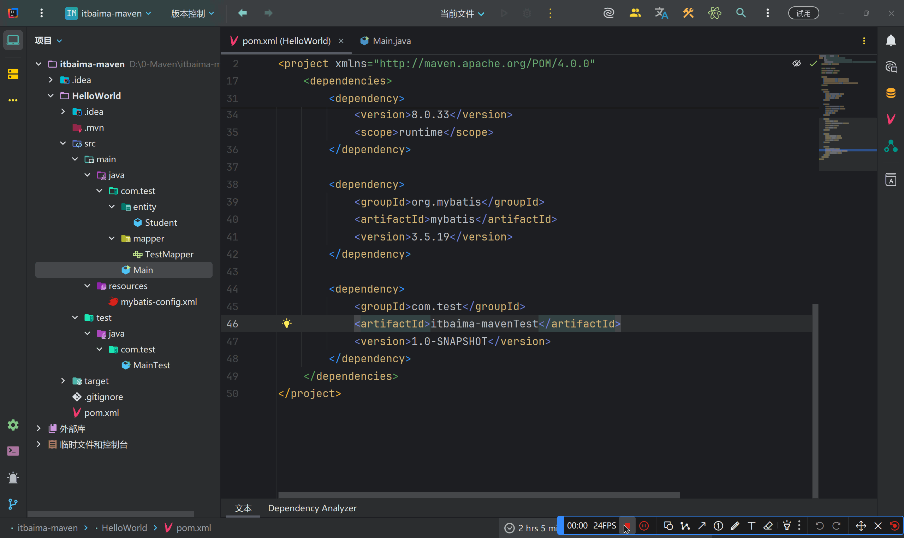-->


接着我们就可以在项目中直接使用了：

```java title="java"
public static void main(String[] args) {
    TestUtils.test();
}
```

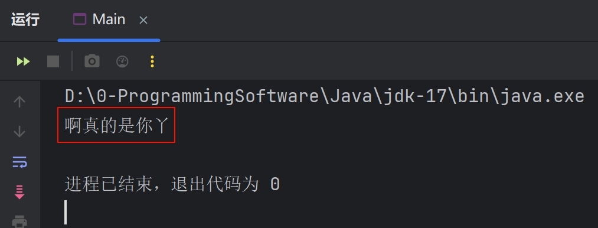

注意，如果我们的旧项目中引入了一些其他的依赖，那么此依赖是会一起被传递的，比如这里我们添加了MyBatis的依赖到原项目中：

```xml title="XML"
<dependencies>
    <dependency>
        <groupId>org.mybatis</groupId>
        <artifactId>mybatis</artifactId>
        <version>3.5.19</version>
    </dependency>
</dependencies>
```

此时在引入此项目的其他项目中，此依赖也被一起传递：

<!---->


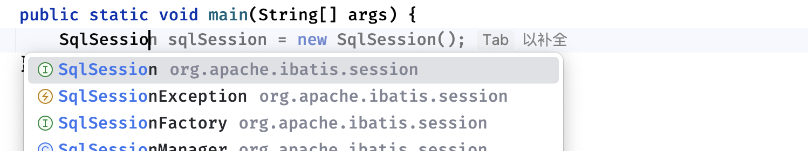

也就是说，当我们的项目依赖于其他内容时，为了保证完整性，默认情况下会一并引入所有此项目包含的依赖项。

在某些情况下，可能我们并不希望某些依赖直接被项目连带引入，因此，当项目中的`某些依赖不希望被使用`此项目作为依赖的项目使用时，我们可以给依赖添加`optional`标签表示此依赖是可选的，默认在导入依赖时，`不会导入`可选的依赖：

```xml title="XML"
<optional>true</optional>
```

```xml title="XML"
<dependencies>
    <dependency>
        <groupId>org.mybatis</groupId>
        <artifactId>mybatis</artifactId>
        <version>3.5.19</version>
        <optional>true</optional>
    </dependency>
</dependencies>
```

<!---->


比如Mybatis的POM文件中，就存在大量的可选依赖：

```xml title="XML"
<dependency>
  <groupId>org.slf4j</groupId>
  <artifactId>slf4j-api</artifactId>
  <version>1.7.30</version>
  <optional>true</optional>
</dependency>
<dependency>
  <groupId>org.slf4j</groupId>
  <artifactId>slf4j-log4j12</artifactId>
  <version>1.7.30</version>
  <optional>true</optional>
</dependency>
<dependency>
  <groupId>log4j</groupId>
  <artifactId>log4j</artifactId>
  <version>1.2.17</version>
  <optional>true</optional>
</dependency>
 ...
```

由于Mybatis要支持多种类型的日志，需要用到很多种不同的日志框架，因此需要导入这些依赖来做兼容，但是我们项目中并不一定会使用这些日志框架作为Mybatis的日志打印器，因此这些日志框架仅Mybatis内部做兼容需要导入使用，而我们可以选择不使用这些框架或是选择其中一个即可，也就是说我们导入Mybatis之后想用什么日志框架再自己加就可以了。

现在我们可以让使用此项目作为依赖的项目不使用可选依赖，但是如果别人的项目中没有将我们不希望的依赖作为可选依赖，这就导致我们还是会连带引入这些依赖，这个时候我们就可以通过排除依赖来防止添加不必要的依赖，只需添加`exclusion`标签即可：

```xml title="XML"
<dependency>
    <groupId>com.test</groupId>
    <artifactId>itbaima-mavenTest</artifactId>
    <version>1.3-SNAPSHOT</version>
    <exclusions>
        <exclusion>
            <groupId>org.mybatis</groupId>
            <artifactId>mybatis</artifactId>
          	<!--  可以不指定版本号，只需要组名和项目名称  -->
        </exclusion>
    </exclusions>
</dependency>
```

<!---->


此时我们通过这种方式手动排除了`Test项目`中`包含的MyBatis依赖`，这样项目中就`不会包含此依赖了`。

### Maven继承和多模块

一个Maven项目可以继承自另一个Maven项目，比如`多个子项目`**都需要**`父项目的依赖`，我们就可以使用`继承关系`来快速配置。在我们学习到`SpringBoot`或是`SpringCloud`开发时，很多项目往往都会采用这种`多模块子项目`的形式的去编写，来更加合理地对项目中代码进行职责划分。

父项目(pom.xml文件):

```xml title="XML"
<?xml version="1.0" encoding="UTF-8"?>
<project xmlns="http://maven.apache.org/POM/4.0.0"
         xmlns:xsi="http://www.w3.org/2001/XMLSchema-instance"
         xsi:schemaLocation="http://maven.apache.org/POM/4.0.0 http://maven.apache.org/xsd/maven-4.0.0.xsd">
    <modelVersion>4.0.0</modelVersion>

    <groupId>com.test</groupId>
    <artifactId>hello</artifactId>
    <version>1.0-SNAPSHOT</version>
    <packaging>pom</packaging>
    <modules>
        <module>hello-user</module>
    </modules>

    <properties>
        <maven.compiler.source>17</maven.compiler.source>
        <maven.compiler.target>17</maven.compiler.target>
        <project.build.sourceEncoding>UTF-8</project.build.sourceEncoding>
    </properties>

    <dependencies>
        <dependency>
            <groupId>org.mybatis</groupId>
            <artifactId>mybatis</artifactId>
            <version>3.5.19</version>
        </dependency>

        <dependency>
            <groupId>org.projectlombok</groupId>
            <artifactId>lombok</artifactId>
            <version>1.18.38</version>
        </dependency>
    </dependencies>

</project>
```

要创建一个子项目非常简单，我们只需右键左侧栏，新建模块，来`创建一个子项目`：

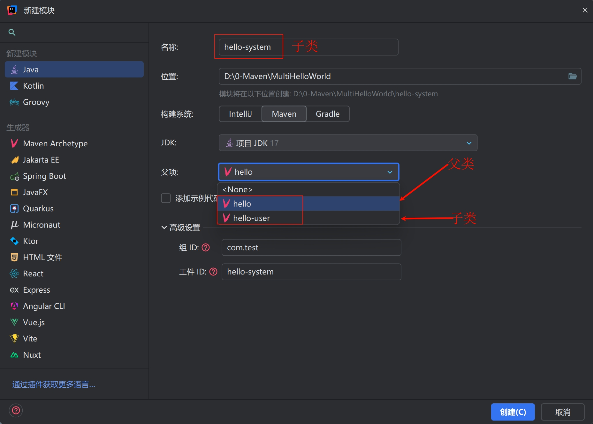

```xml title="XML"
<?xml version="1.0" encoding="UTF-8"?>
<project xmlns="http://maven.apache.org/POM/4.0.0"
         xmlns:xsi="http://www.w3.org/2001/XMLSchema-instance"
         xsi:schemaLocation="http://maven.apache.org/POM/4.0.0 http://maven.apache.org/xsd/maven-4.0.0.xsd">
    <modelVersion>4.0.0</modelVersion>
    <parent>
        <groupId>com.test</groupId>
        <artifactId>hello</artifactId>
        <version>1.0-SNAPSHOT</version>
    </parent>

    <artifactId>hello-user</artifactId>

    <properties>
        <maven.compiler.source>17</maven.compiler.source>
        <maven.compiler.target>17</maven.compiler.target>
        <project.build.sourceEncoding>UTF-8</project.build.sourceEncoding>
    </properties>

</project>
```

我们可以看到，IDEA默认给我们添加了一个`parent节点`，表示此Maven项目是**父Maven项目的`子项目`**，子项目直接继承父项目的`groupId`，子项目会继承父项目的`所有依赖`，我们来编写一个测试用例尝试一下:

```java title="java"
import lombok.extern.java.Log;

@Log
public class Main {
    public static void main(String[] args) {
        log.info("Hello World!");
    }
}
```

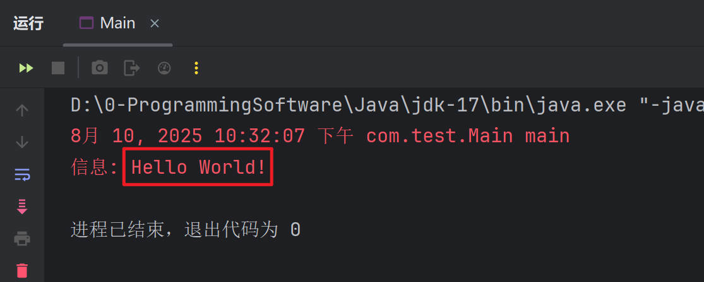

可以看到，子项目也成功继承了`Lombok依赖`。

我们还可以让父Maven项目**统一管理所有的`依赖`，包括`版本号`等**，子项目可以选取需要的作为依赖，而**`版本`全由`父项目`管理**，我们可以将`dependencies`全部放入`dependencyManagement`节点，这样父项目就完全作为依赖统一管理。

```xml title="XML"
<dependencyManagement>
        <dependencies>
            <dependency>
                <groupId>org.mybatis</groupId>
                <artifactId>mybatis</artifactId>
                <version>3.5.19</version>
            </dependency>

            <dependency>
                <groupId>org.projectlombok</groupId>
                <artifactId>lombok</artifactId>
                <version>1.18.38</version>
            </dependency>
        </dependencies>
    </dependencyManagement>
```

我们发现，`子项目`的`依赖失效了`，因为现在`父项目没有依赖`，而是将所有的依赖进行`集中管理`，子项目需要什么再拿什么即可，同时子项目`无需指定版本`，`所有的版本`全部由`父项目决定`，子项目只需要使用即可：

```xml title="XML"
<dependencies>
    <dependency>
        <groupId>org.projectlombok</groupId>
        <artifactId>lombok</artifactId>
        <scope>provided</scope>
    </dependency>
</dependencies>
```

<!--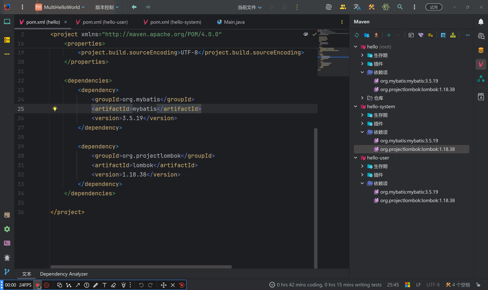-->


当然，父项目如果还存在`dependencies节点`的话，里面的内依赖依然是`直接继承`：

```xml title="XML"
<dependencies>
    <dependency>
        <groupId>org.junit.jupiter</groupId>
        <artifactId>junit-jupiter</artifactId>
        <version>5.8.1</version>
        <scope>test</scope>
    </dependency>
</dependencies>

<dependencyManagement>
    <dependencies>
      ...
```

<!---->


### Maven测试和打包

我们可以看到在IDEA右上角Maven板块中，每个Maven项目都有一个生命周期，实际上这些是Maven的一些插件，每个插件都有各自的功能，比如：

- `clean`命令，执行后会清理整个`target`文件夹，在之后编写Springboot项目时可以解决一些缓存没更新的问题。

  <!--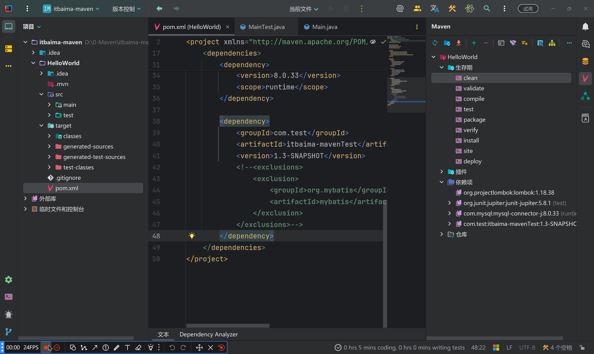-->
  

- `validate`命令可以验证项目的可用性。

  <!---->
  

- `compile`命令可以将项目编译为.class文件。

  <!--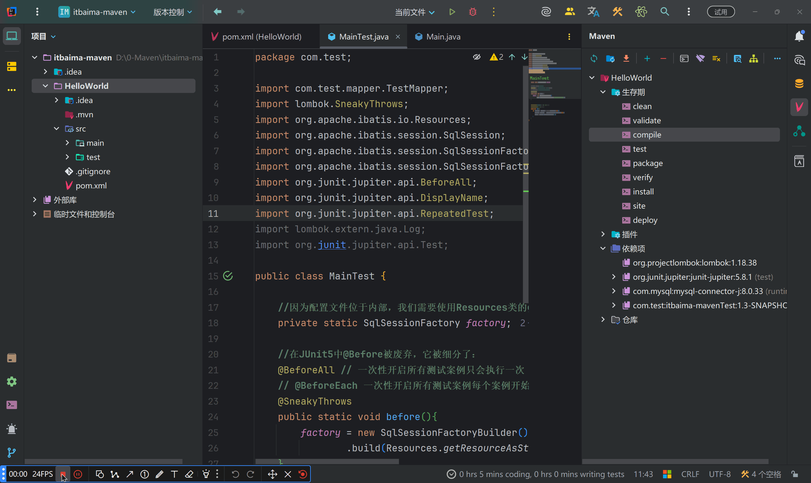-->
  

- `install`命令可以将当前项目安装到本地仓库，以供其他项目导入作为依赖使用

- `verify`命令可以按顺序执行每个默认生命周期阶段（`validate`，`compile`，`package`等）

  <!---->
  

比如`clean`命令会自动清理`target`目录下的所有内容：

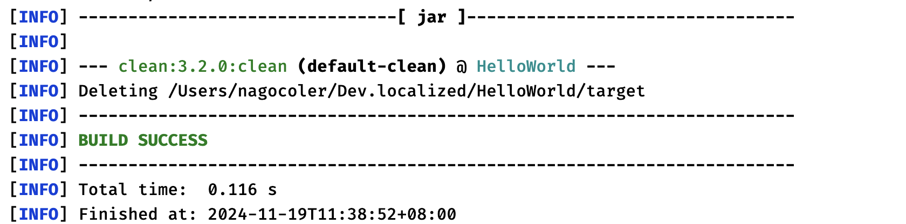

所有的命令在执行完成之后都会显示`BUILD SUCCESS`，否则就是在执行过程中出现了什么错误。

除了上述介绍的几种命令外，我们还可以通过使用`test`命令，一键测试所有位于test目录下的测试案例，但是请注意默认的`test`命令有以下要求：

- 测试类的名称必须是以`Test`结尾，比如`MainTest`

- 测试方法上必须标注`@Test`注解或是其他标记JUnit测试案例的注解

  <!--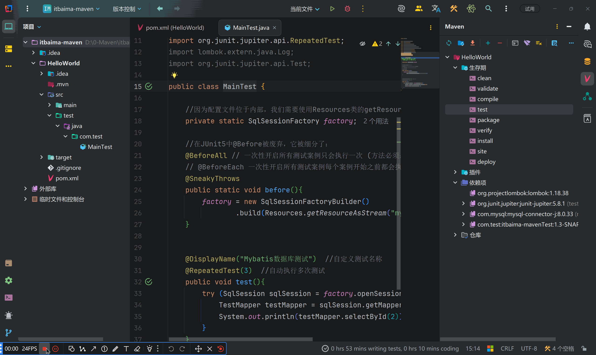-->
  

```java title="java"
public class MainTest {

    //因为配置文件位于内部，我们需要使用Resources类的getResourceAsStream来获取内部的资源文件
    private static SqlSessionFactory factory;

    //在JUnit5中@Before被废弃，它被细分了：
    @BeforeAll // 一次性开启所有测试案例只会执行一次 (方法必须是static)
    // @BeforeEach 一次性开启所有测试案例每个案例开始之前都会执行一次
    @SneakyThrows
    public static void before(){
        factory = new SqlSessionFactoryBuilder()
                .build(Resources.getResourceAsStream("mybatis-config.xml"));
    }


    @DisplayName("Mybatis数据库测试")  //自定义测试名称
    @RepeatedTest(3)  //自动执行多次测试
    public void test(){
        try (SqlSession sqlSession = factory.openSession(true)){
            TestMapper testMapper = sqlSession.getMapper(TestMapper.class);
            System.out.println(testMapper.selectById(2));
        }
    }
}
```

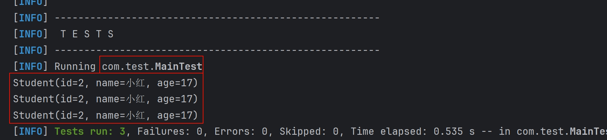

我们接着来看`package`命令，它用于将我们的项目打包为jar文件，以供其他项目作为依赖引入，或是作为一个可执行的Java应用程序运行。

<!--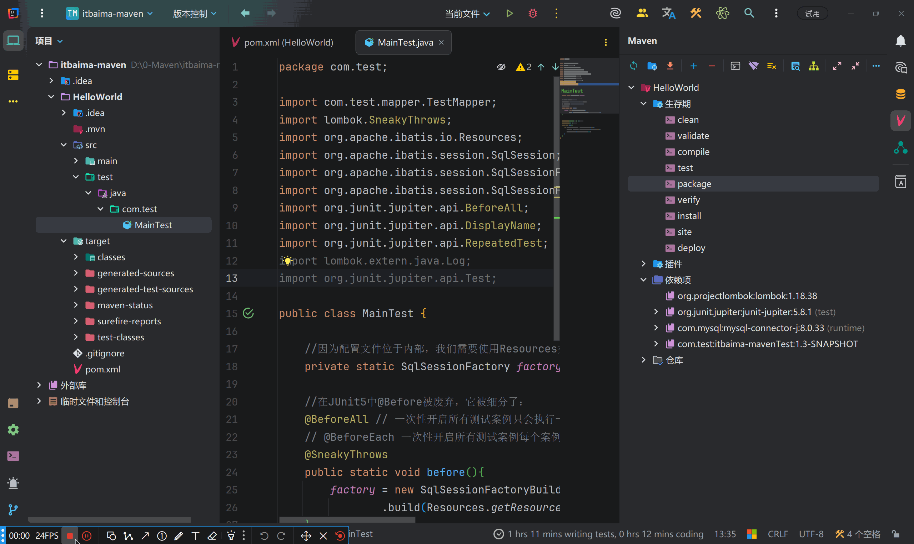-->


我们可以直接点击`package`来进行打包操作。注意，在使用`package`命令打包之前也会自动执行一次`test`命令，来保证项目能够正常运行，当测试出现问题时，打包将无法完成，我们也可以手动跳过，选择`执行Maven目标`来手动执行Maven命令，输入`mvn package -Dmaven.test.skip=true `来以跳过测试的方式进行打包。

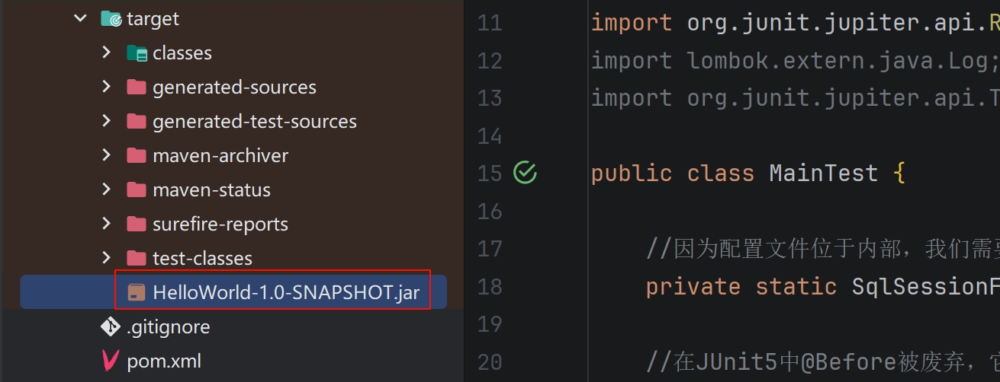

接着在target目录下会出现我们打包完成的jar包，在JavaSE中我们就给大家介绍过，一个jar包实际上就是对我们生成的字节码文件进行的压缩打包，因此，我们也可以使用常见的压缩工具打开jar包查看其内部文件。

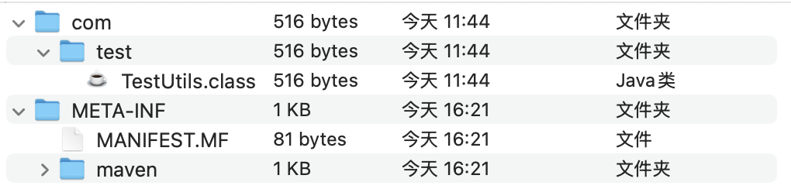

此时jar包中已经包含了我们项目中编写的类了，可以直接被其他项目导入使用。

当然，以上方式存在一定的问题，比如这里并没有包含项目中用到的一些其他依赖，如果我们需要打包一个可执行文件，那么我不仅需要将自己编写的类打包到Jar中，同时还需要将依赖也一并打包到Jar中，因为我们使用了别人为我们提供的框架，自然也需要运行别人的代码，我们需要使用另一个插件来实现一起打包：

<!---->


```xml title="XML"
<plugin>
    <artifactId>maven-assembly-plugin</artifactId>
    <version>3.1.0</version>
    <configuration>
        <descriptorRefs>
            <descriptorRef>jar-with-dependencies</descriptorRef>
        </descriptorRefs>
        <archive>
            <manifest>
                <addClasspath>true</addClasspath>
                <mainClass>com.test.Main</mainClass>
            </manifest>
        </archive>
    </configuration>
    <executions>
        <execution>
            <id>make-assembly</id>
            <phase>package</phase>
            <goals>
                <goal>single</goal>
            </goals>
        </execution>
    </executions>
</plugin>
```

导入插件后，我们可以重新进行一次打包任务，等待打包完成即可得到我们的Jar文件，此时会出现两个文件，其中一个是之前的正常打包得到的jar文件，还有一个就是包含了所有依赖以及配置了主类的jar文件。

我们只需要执行`java -jar`命令即可运行打包好的Java程序：

```CMD title="CMD"
D:\0-Maven\itbaima-maven>cd D:\0-Maven\itbaima-maven\HelloWorld\target

D:\0-Maven\itbaima-maven\HelloWorld\target>java -jar HelloWorld-1.0-SNAPSHOT-jar-with-dependencies.jar      
啊真的是你丫
```

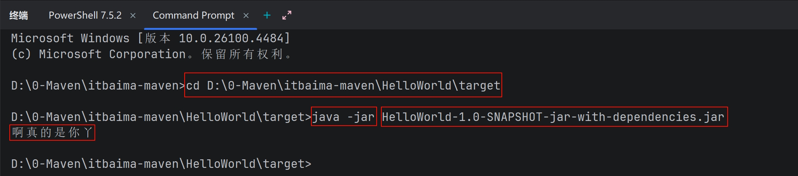

我们之前还讲解了多模块项目，那么多模块下父项目存在一个`packing`打包类型标签，所有的父级项目的`packing`都为`pom`，`packing`默认是`jar`类型，如果不作配置，maven会将该项目打成jar包：

```xml title="XML"
<packaging>pom</packaging>
```

作为父级项目，还有一个重要的属性，那就是modules，通过modules标签将项目的所有子项目引用进来，在`build`父级项目时，会根据子模块的相互依赖关系整理一个`build`顺序，然后依次`build`直到所有任务都完成。