## 缓存机制

::: tip 

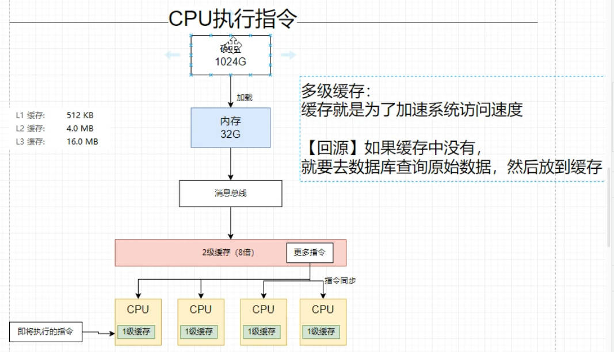

**MyBatis 拥有二级缓存机制：**

+ **一级缓存`默认开启`； 事务级别：`当前事务共享`**

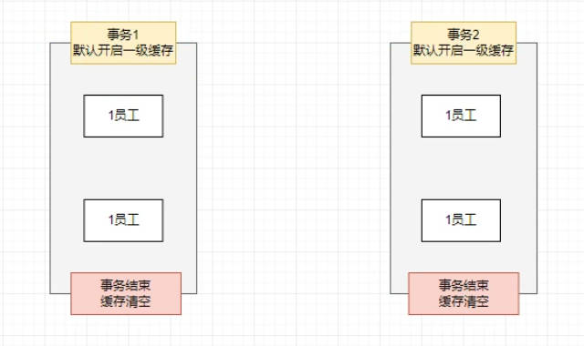

+ **二级缓存`需要手动配置开启`：`所有事务共享`** 

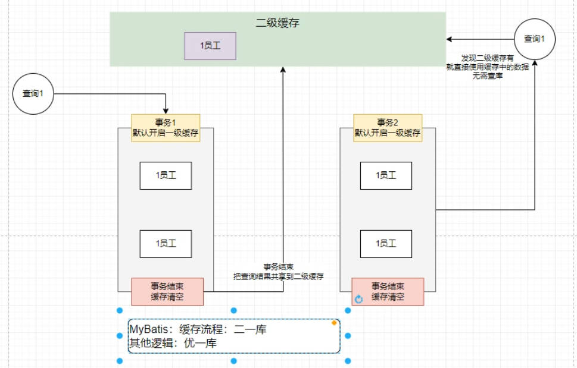

+ **缓存中有就`不用查数据库`；**

**L1~LN：N级缓存**

+ **数字越小离我越近，查的越快。存储越小，造价越高。**

+ **数字越大离我越远，查的越慢。存储越大，造价越低。**


:::


### 一级缓存

::: tip 

- **作用域**：`SqlSession` 级别，由 `BaseExecutor` 维护。
- **实现**：`BaseExecutor` 内部持有 `localCache` 对象（`PerpetualCache` 类型，基于 `HashMap`）。
- **生命周期**：随着 `SqlSession` 的创建而存在，提交、回滚或关闭时清空；执行更新操作后也会清空。
- **特点**：默认开启，无法完全关闭，可通过 `localCacheScope=STATEMENT` 实现语句级缓存（每次查询后清空）。

:::

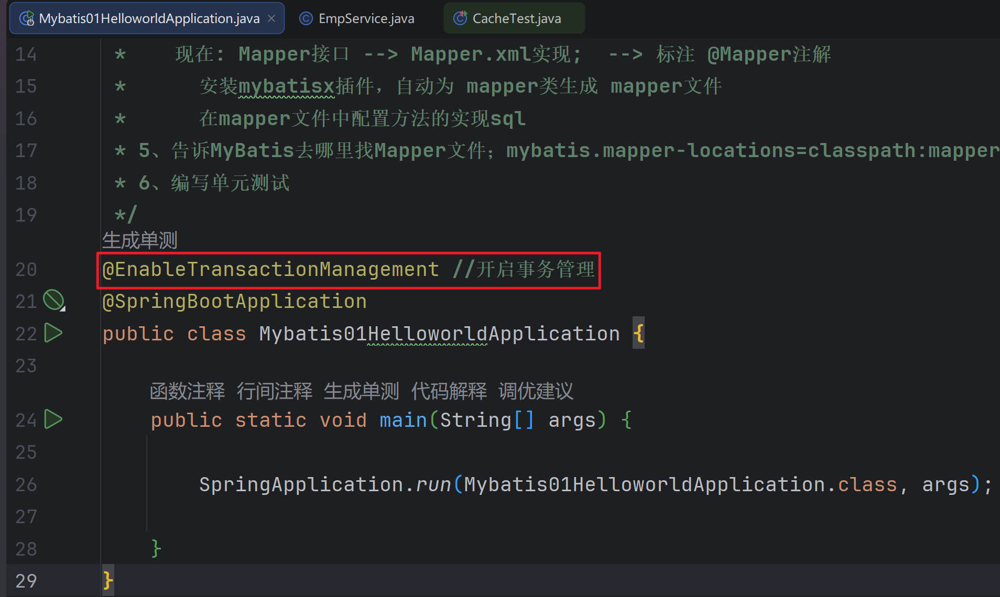

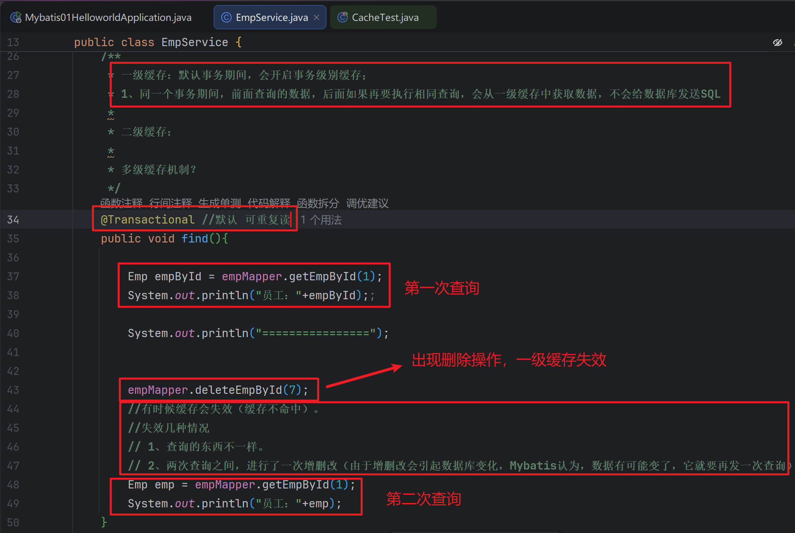


### 二级缓存

::: tip 

- **作用域**：`namespace` 级别（Mapper），由 `CachingExecutor` 和 `MappedStatement` 协同实现。
- **实现**：
  - `CachingExecutor` 装饰底层 `Executor`，优先从二级缓存（`MappedStatement` 持有的 `Cache` 对象）中获取数据。
  - 每个 `namespace` 对应一个 `Cache` 实例，通过 `<cache/>` 标签配置，默认使用 `PerpetualCache` 并叠加装饰器（如同步、日志、序列化等）。
  - `Configuration` 维护全局 `caches` 映射，以 namespace 为键。
- **生命周期**：缓存在应用启动时创建，随应用关闭而销毁；可通过 `flushInterval` 定时刷新，或在执行更新操作时清空整个 namespace 的缓存。
- **特点**：需要显式开启（`<cache/>`），支持可读写（需实体类序列化）和只读模式，可集成第三方缓存（如 Redis、Ehcache）。

:::

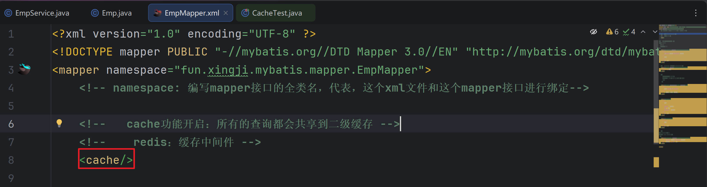

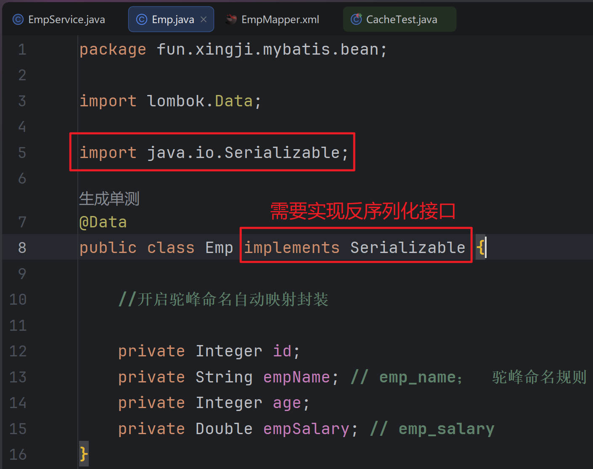


## 插件机制

::: tip 

1.**MyBatis 底层使用 拦截器机制提供插件功能，方便用户在`SQL执行前后进行拦截增强`。**

2.**拦截器：Interceptor**

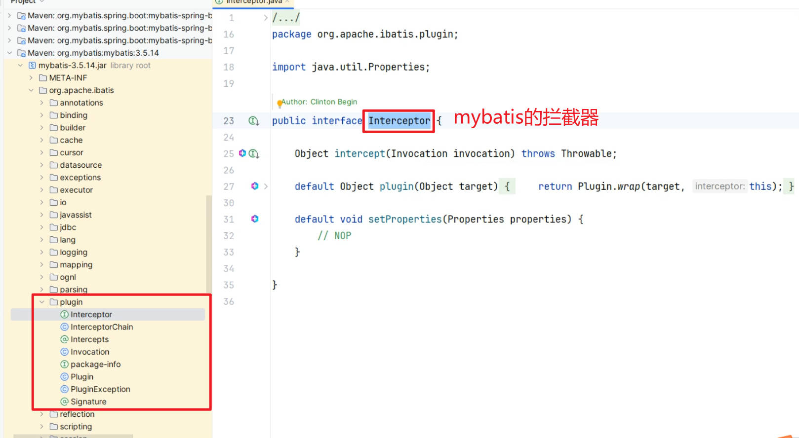

3.**拦截器可以拦截`四大对象`的执行**

+ **ParameterHandler：`处理SQL的参数对象`**

+ **ResultSetHandler：`处理SQL的返回结果集`**

+ **StatementHandler：数据库的处理对象，`用于执行SQL语句`**

+ **Executor：MyBatis的执行器，`用于执行增删改查操作`**

:::


## PageHelper 分页

**MyBatis分页插件 PageHelper地址**：[https://pagehelper.github.io/](https://pagehelper.github.io/)

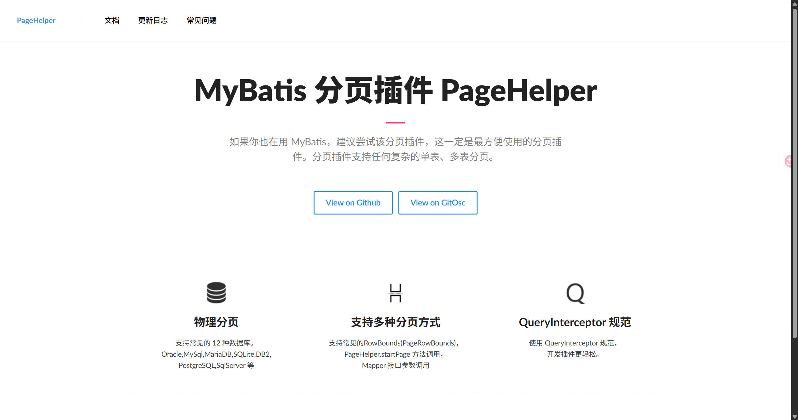

::: tip 

1.**PageHelper 是可以用在 MyBatis 中的一个强大的分页插件**

2.**分页插件就是利用MyBatis 插件机制，在底层编写了 分页Interceptor，每次SQL查询之前会自动拼装分页数据**

+ **select * from emp limit 0,10**

+ **分页重点：**

::: note 

+ **前端 第1页： limit 0,10**

+ **前端 第2页： limit 10,10**

+ **前端 第3页： limit 20,10**

+ **前端 第N页：limit startIndex,pageSize**

+ **计算规则： pageNum = 1， pageSize = 10**

+ **startIndex = (pageNum - 1)*pageSize**

:::

:::

+ **在pom.xml中添加Maven依赖**

**快速搜索Maven依赖工具**：[https://mvn.coderead.cn/](https://mvn.coderead.cn/)

```xml
<dependency>
	<groupId>com.github.pagehelper</groupId>
	<artifactId>pagehelper</artifactId>
	<version>6.1.1</version>
</dependency>
```

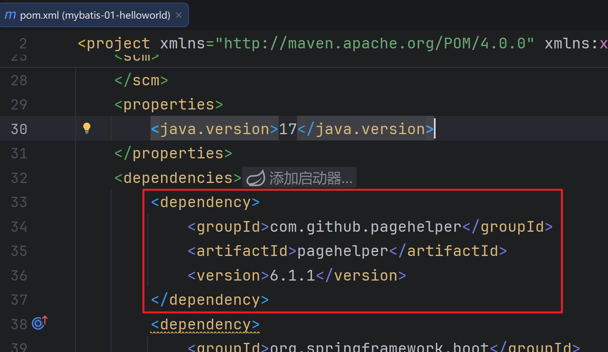


+ **配置拦截器插件**

> **在 Spring 配置文件中配置拦截器插件**

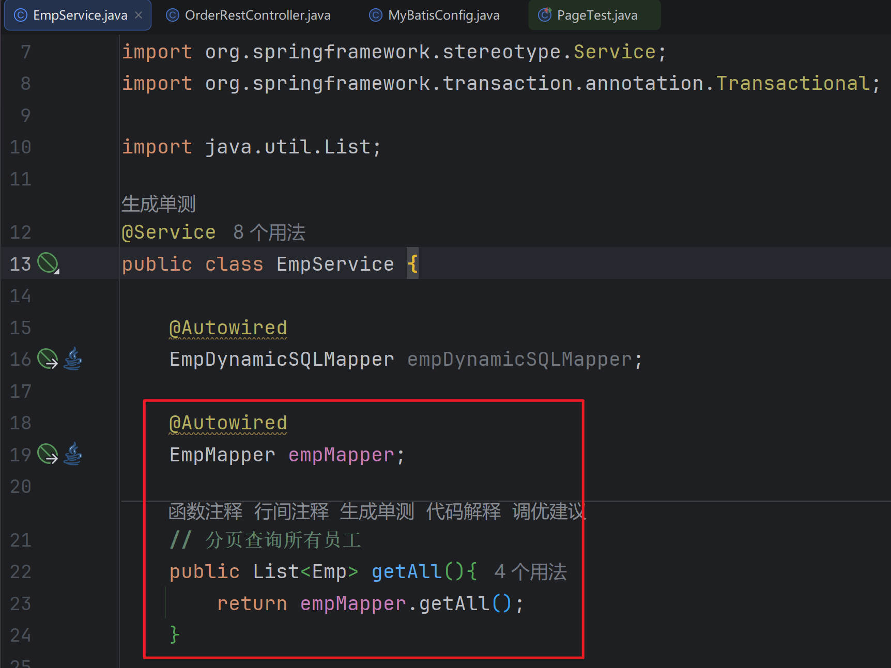

+ **MyBatisConfig.java**

> **`reasonable`：分页合理化参数，默认值为`false`。当该参数设置为 `true` 时，`pageNum<=0` 时会查询第一页， `pageNum>pages`（超过总数时），会查询最后一页。默认`false` 时，直接根据参数进行查询。**

```java
package fun.xingji.mybatis.config;

import com.github.pagehelper.PageInterceptor;
import org.springframework.context.annotation.Bean;
import org.springframework.context.annotation.Configuration;

import java.util.Properties;

@Configuration
public class MyBatisConfig {

    @Bean
    PageInterceptor pageInterceptor() {
        // 1. 创建PageInterceptor 分页插件 对象
        PageInterceptor interceptor = new PageInterceptor();
        // 2.设置分页插件的属性
        // ......

        // 设置分页插件的属性(合理化分页)
        Properties properties = new Properties();
        properties.setProperty("reasonable", "true");

        interceptor.setProperties(properties);

        return interceptor;
    }
}
```


+ **PageTest.java**

::: note 

**原理：拦截器；**
         **原业务底层：select * from emp;**

​         **拦截做两件事：**
​         **1）统计这个表的总数量**
​        **2）给原业务底层SQL 动态拼接上 limit 0,5;**

**ThreadLocal： 同一个线程共享数据**

​	**1、第一个查询从 ThreadLocal 中获取到共享数据，执行分页**

​	**2、第一个执行完会把 ThreadLocal 分页数据删除**

​	**3、以后的查询，从 ThreadLocal 中拿不到分页数据，就不会分页**

:::

```java
package fun.xingji.mybatis;

import com.github.pagehelper.PageHelper;
import com.github.pagehelper.PageInfo;
import fun.xingji.mybatis.bean.Emp;
import fun.xingji.mybatis.service.EmpService;
import org.junit.jupiter.api.Test;
import org.springframework.beans.factory.annotation.Autowired;
import org.springframework.boot.test.context.SpringBootTest;

import java.util.List;

@SpringBootTest
public class PageTest {

    @Autowired
    EmpService empService;

    @Test
    void test02(){

        //后端收到前端传来的页码


        //响应前端需要的数据：
        //1、总页码、总记录数
        //2、当前页码
        //3、本页数据
        PageHelper.startPage(3,5);
        // 紧跟着 startPage 之后 的方法就会执行的 SQL 分页查询
        List<Emp> all = empService.getAll();
        System.out.println("============");

        //以后给前端返回它
        PageInfo<Emp> info = new PageInfo<>(all);

        //当前第几页
        System.out.println("当前页码："+info.getPageNum());
        //总页码
        System.out.println("总页码："+info.getPages());
        //总记录
        System.out.println("总记录数："+info.getTotal());
        //有没有下一页
        System.out.println("有没有下一页："+info.isHasNextPage());
        //有没有上一页
        System.out.println("有没有上一页："+info.isHasPreviousPage());
        //本页数据
        System.out.println("本页数据："+info.getList());

    }

    @Test
    void test01(){

        /**
         * 原理：拦截器；
         * 原业务底层：select * from emp;
         * 拦截做两件事：
         * 1）、统计这个表的总数量
         * 2）、给原业务底层SQL 动态拼接上 limit 0,5;
         *
         * ThreadLocal： 同一个线程共享数据
         *    1、第一个查询从 ThreadLocal 中获取到共享数据，执行分页
         *    2、第一个执行完会把 ThreadLocal 分页数据删除
         *    3、以后的查询，从 ThreadLocal 中拿不到分页数据，就不会分页
         *
         */
        PageHelper.startPage(3,5);
        // 紧跟着 startPage 之后 的方法就会执行的 SQL 分页查询
        List<Emp> all = empService.getAll();
        for (Emp emp : all) {
            System.out.println(emp);
        }

        System.out.println("===============");
        List<Emp> all1 = empService.getAll();
        System.out.println(all1.size());
    }
}
```


+ **OrderRestController.java**

```java
package fun.xingji.mybatis.controller;

import com.github.pagehelper.PageHelper;
import com.github.pagehelper.PageInfo;
import fun.xingji.mybatis.bean.Emp;
import fun.xingji.mybatis.service.EmpService;
import org.springframework.beans.factory.annotation.Autowired;
import org.springframework.web.bind.annotation.GetMapping;
import org.springframework.web.bind.annotation.RequestParam;
import org.springframework.web.bind.annotation.RestController;

import java.util.List;

@RestController
public class OrderRestController {

    @Autowired
    EmpService empService;

    // 分页查询所有员工
    @GetMapping("/emp/page")
    public PageInfo getPage(@RequestParam(value = "pageNum",defaultValue = "1") Integer pageNum){
        // 开启分页插件
        PageHelper.startPage(pageNum, 5);
        // 查询所有员工
        List<Emp> all = empService.getAll();
        // 封装成PageInfo对象
        return new PageInfo<>(all);
    }
}
```

::: note 

+ **测试分页操作**

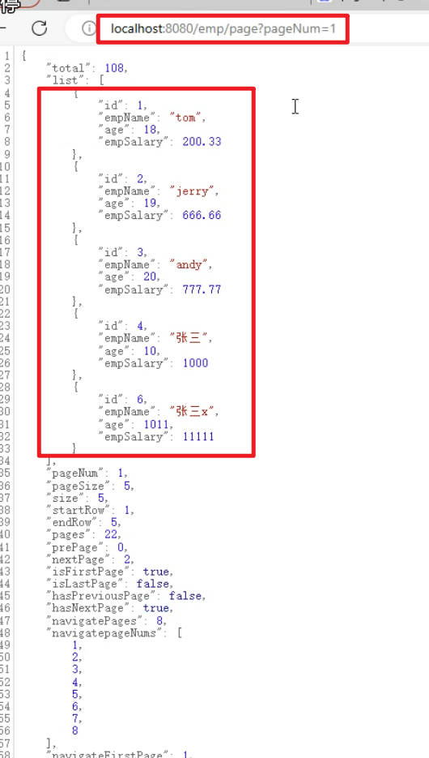

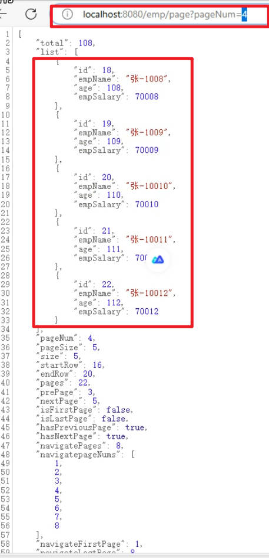

::: warning 

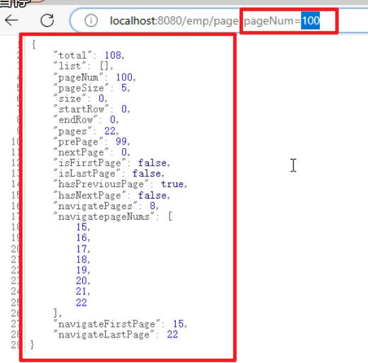

> **`reasonable`：分页合理化参数，默认值为`false`。当该参数设置为 `true` 时，`pageNum<=0` 时会查询第一页， `pageNum>pages`（超过总数时），会查询最后一页。默认`false` 时，直接根据参数进行查询。**
>
> 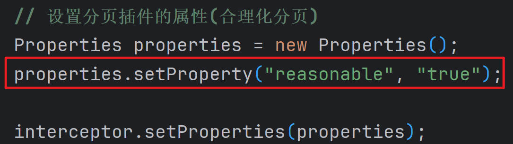

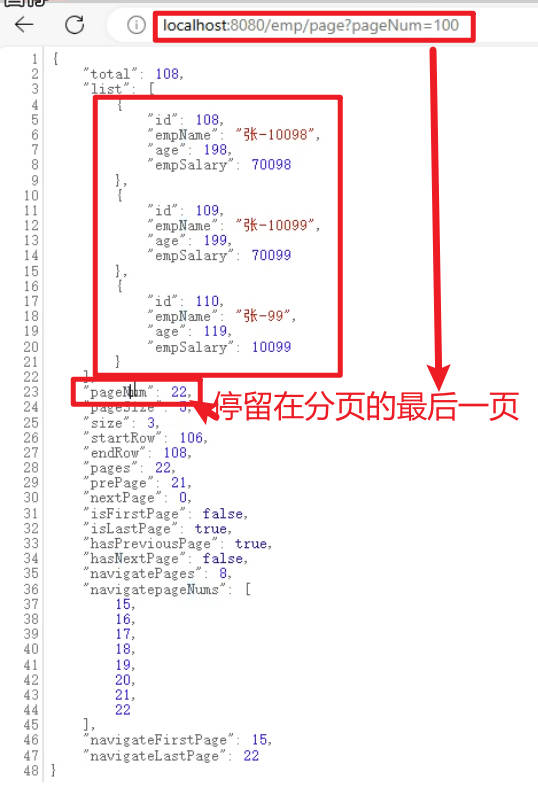

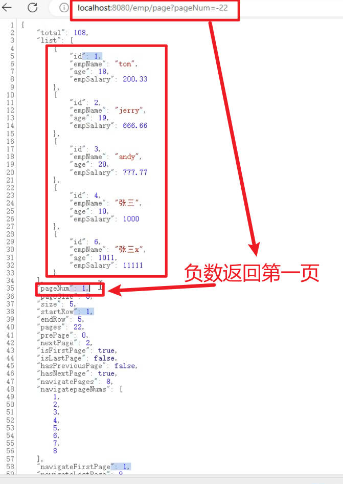

:::

:::


## mybatisx 逆向生成

> **IDEA 安装 mybatisx 插件，即可根据数据库表一键生成常用CRUD**

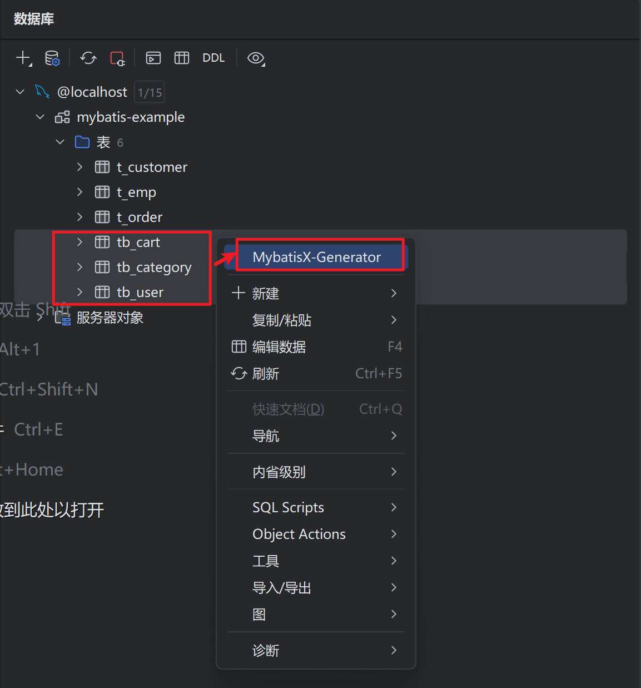


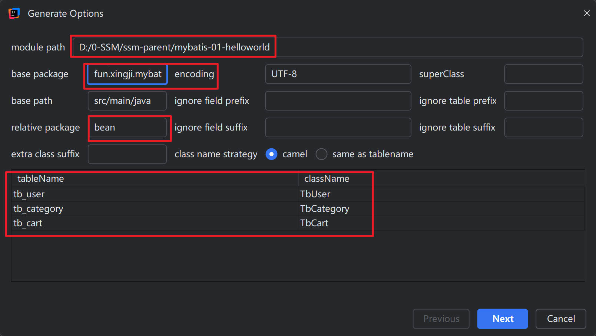

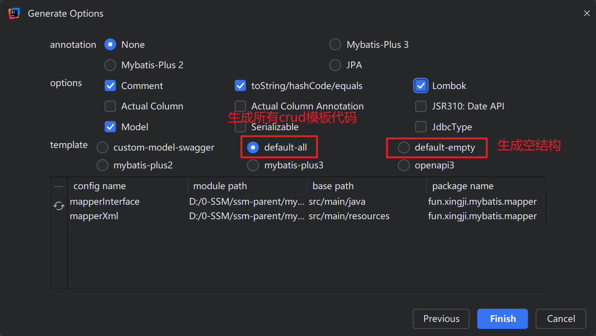
