## 介绍

官网：https://mybatis.org/

+ **MyBatis 是一款优秀的持久层框架，它支持自定义 SQL、存储过程以及高级映射。** 

+ **MyBatis 不像 Hibernete 等这些全自动框架，它把关键的SQL部分交给程序员自己编写，而不是自动生成**


## Hello World

+ **创建项目**

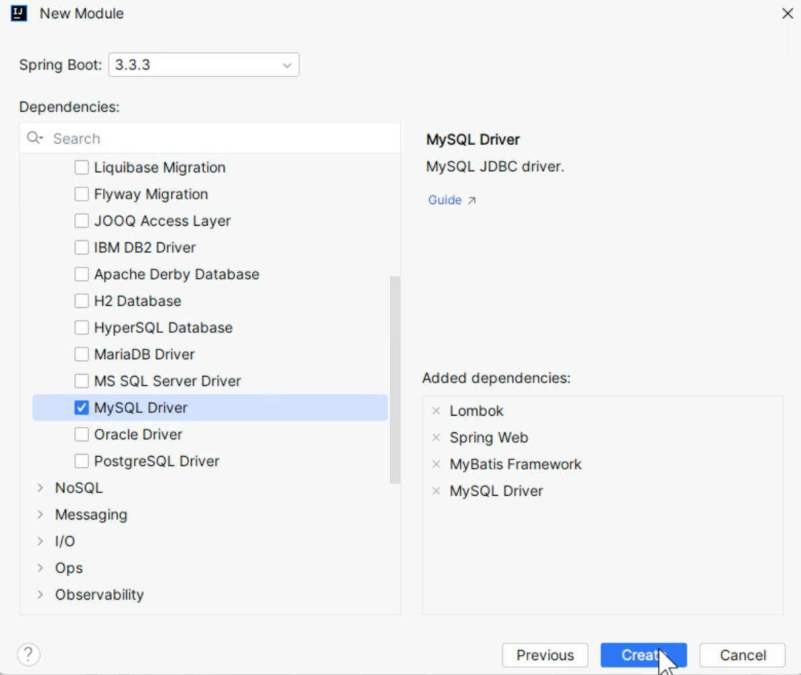

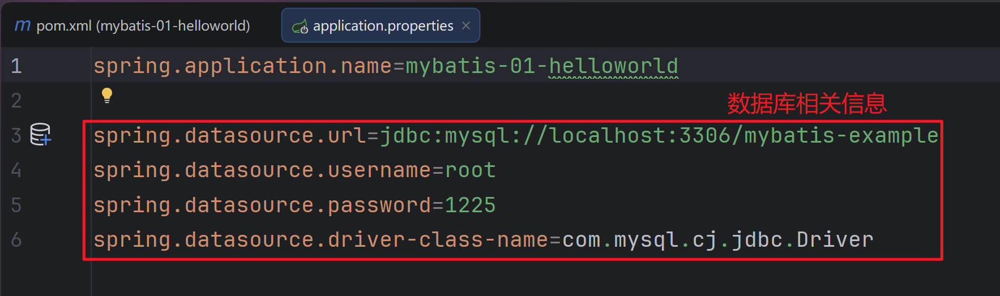

+ **准备数据库环境（helloworld.sql）**

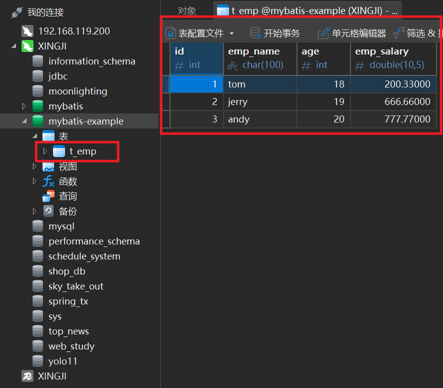

+ **编写dao接口（EmpMapper.java(查询员工)）**

```java
package fun.xingji.mybatis.bean;

import lombok.Data;

@Data
public class Emp {

    private Integer id;
    private String empName;
    private Integer age;
    private Double empSalary;
}
```


````java
package fun.xingji.mybatis.mapper;

import fun.xingji.mybatis.bean.Emp;
import org.apache.ibatis.annotations.Mapper;

@Mapper
public interface EmpMapper {
    // 按照id查询
    Emp getEmpById(Integer id);
}
````


+ **编写dao实现（EmpMapper.xml）**

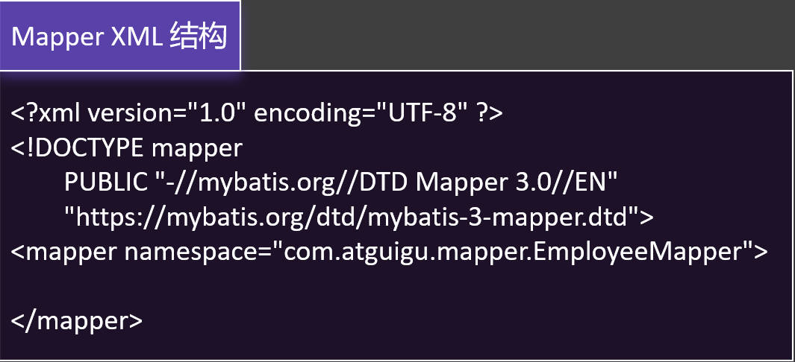

```xml
<?xml version="1.0" encoding="UTF-8" ?>
<!DOCTYPE mapper PUBLIC "-//mybatis.org//DTD Mapper 3.0//EN" "http://mybatis.org/dtd/mybatis-3-mapper.dtd" >
<mapper namespace="fun.xingji.mybatis.mapper.EmpMapper">

<!-- namespace: 编写mapper接口的全类名，代表，这个xml文件和这个mapper接口进行绑定-->

<!--    Emp getEmpById(Integer id);
select 标签代表一次查询
   id：绑定方法名
   resultType：返回值类型
-->
    <select id="getEmpById" resultType="fun.xingji.mybatis.bean.Emp">
        select
            id,emp_name empName,age,emp_salary empSalary
        from
            t_emp
        where
            id = ${id}
    </select>

</mapper>
```


+ **配置xml扫描位置**

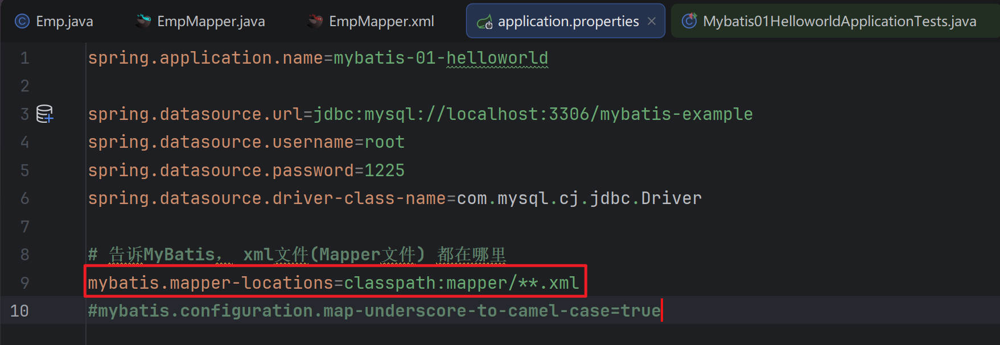

+ **单元测试**

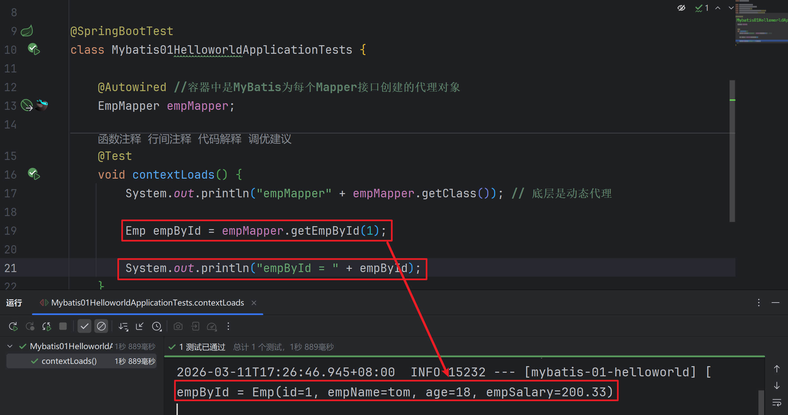

+ **开启SQL日志**

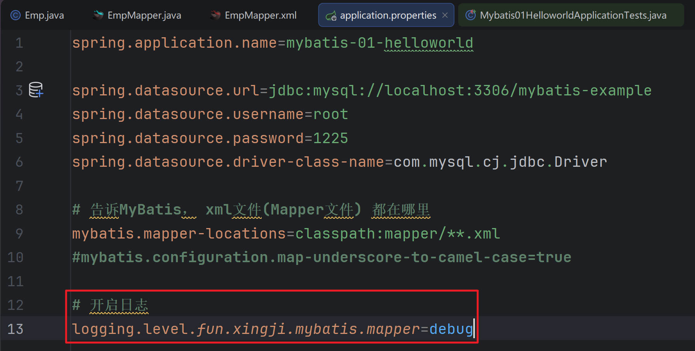

::: tip 

**步骤：**

1、导入mybatis依赖

2、配置数据源信息

3、编写一个JavaBean对应数据库一个表模型

4、以前: Dao接口 --> Dao实现 --> 标注 @Repository注解

+ 现在: Mapper接口 --> Mapper.xml实现;  --> 标注 @Mapper注解

+ 安装mybatisx插件，自动为 mapper类生成 mapper文件

+ 在mapper文件中配置方法的实现sql

5、告诉MyBatis去哪里找Mapper文件；mybatis.mapper-locations=classpath:mapper/**.xml

6、编写单元测试

:::


### HelloWorld - 细节

```java
1. 每个Dao 接口 对应一个 XML 实现文件
    
2. Dao 实现类 是一个由 MyBatis 自动创建出来的代理对象
    
3. XML 中 namespace 需要绑定 Dao 接口 的全类名
    
4. XML 中使用 select、update、insert、delete 标签来代表增删改查
    
5. 每个 CRUD 标签 的 id 必须为Dao接口的方法名
    
6. 每个 CRUD标签的 resultType 是Dao接口的返回值类型全类名
    
7. 未来遇到复杂的返回结果封装，需要指定 resultMap 规则
    
8. 以后 xxxDao 我们将按照习惯命名为 xxxMapper，这样更明显的表示出 持久层是用 MyBatis 实现的
```


## CRUD

>**使用CRUD标签完成完整的功能**
>
>+ **定义 Mapper 接口(EmpMapper.java)**
>
>```java
>package fun.xingji.mybatis.mapper;
>
>import fun.xingji.mybatis.bean.Emp;
>import org.apache.ibatis.annotations.Mapper;
>
>@Mapper
>public interface EmpMapper {
>
>    // 按照id查询
>    Emp getEmpById(Integer id);
>
>
>    //添加员工
>    void addEmp(Emp emp);
>
>
>    //更新员工
>    void updateEmp(Emp emp);
>
>    //删除员工
>    void deleteEmpById(Integer id);
>
>}
>```
>
>+ **定义 CRUD 标签实现(EmpMapper.xml)**
>
>```xml
><?xml version="1.0" encoding="UTF-8" ?>
><!DOCTYPE mapper PUBLIC "-//mybatis.org//DTD Mapper 3.0//EN" "http://mybatis.org/dtd/mybatis-3-mapper.dtd" >
><mapper namespace="fun.xingji.mybatis.mapper.EmpMapper">
>    <!-- namespace: 编写mapper接口的全类名，代表，这个xml文件和这个mapper接口进行绑定-->
>
><!--    Emp getEmpById(Integer id);
>select 标签代表一次查询
>   id：绑定方法名
>   resultType：返回值类型
>-->
>    <select id="getEmpById" resultType="fun.xingji.mybatis.bean.Emp">
>        select
>            id,emp_name empName,age,emp_salary empSalary
>        from
>            t_emp
>        where
>            id = ${id}
>    </select>
>
>
>    <!--   返回的是集合，不用管集合， resultType 还写对象类型（集合中的元素类型）-->
>    <!--<select id="getAll" resultType="fun.xingji.mybatis.bean.Emp">
>        select * from t_emp
>    </select>-->
>
>    <!--
>        useGeneratedKeys： 使用自动生成的id
>        keyProperty： 指定自动生成id对应的属性； 把自动生成的id封装到Emp对象的id属性中
>        自增id回填
>      -->
>    <insert id="addEmp" useGeneratedKeys="true" keyProperty="id">
>        insert into
>            t_emp(emp_name, age, emp_salary)
>        values
>            (#{empName},#{age},#{empSalary})
>    </insert>
>
>
>    <update id="updateEmp">
>        update
>            t_emp
>        set
>            emp_name = #{empName},
>            age = #{age},
>            emp_salary = #{empSalary}
>        where
>            id = #{id}
>    </update>
>
>    <delete id="deleteEmpById">
>        delete from
>            t_emp
>        where
>            id = #{id}
>    </delete>
>
></mapper>
>```

### 查(select)

```java
@Autowired //容器中是MyBatis为每个Mapper接口创建的代理对象
EmpMapper empMapper;

@Test
void contextLoads() {
     System.out.println("empMapper" + empMapper.getClass()); // 底层是动态代理

     Emp empById = empMapper.getEmpById(1);

     System.out.println("empById = " + empById);
}
```


### 增(add)

```java
@Autowired //容器中是MyBatis为每个Mapper接口创建的代理对象
EmpMapper empMapper;

@Test
void testCRUD(){
     Emp emp = new Emp();
     emp.setEmpName("张三");
     emp.setAge(10);
     emp.setEmpSalary(1000.0D);

     empMapper.addEmp(emp);
}
```

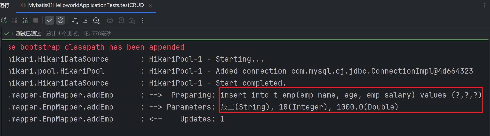


### 改(update)

```java
@Autowired //容器中是MyBatis为每个Mapper接口创建的代理对象
EmpMapper empMapper;

@Test
void testCRUD(){
     Emp emp = new Emp();
     emp.setId(5);
     emp.setEmpName("张三5");
     emp.setAge(105);
     emp.setEmpSalary(1005.0D);

     // empMapper.addEmp(emp);
     empMapper.updateEmp(emp);
}
```

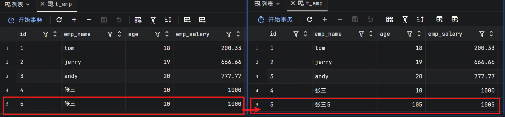


### 删(delect)

```java
@Autowired //容器中是MyBatis为每个Mapper接口创建的代理对象
EmpMapper empMapper;

@Test
void testCRUD(){
     Emp emp = new Emp();
     emp.setId(5);
     emp.setEmpName("张三5");
     emp.setAge(105);
     emp.setEmpSalary(1005.0D);

        // empMapper.addEmp(emp);
        //empMapper.updateEmp(emp);
     empMapper.deleteEmpById(5);
}
```

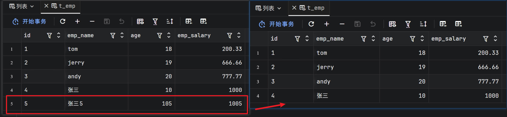


## 自增id

::: tip 

MyBatis自动回填自增id，需要进行以下设置:

+ **useGeneratedKeys：jdbc规范中提供了此设置，mybatis对此也进行了实现**

+ **keyProperty：指定主键的属性名**

:::

```xml
<!--
useGeneratedKeys： 使用自动生成的id
keyProperty： 指定自动生成id对应的属性； 把自动生成的id封装到Emp对象的id属性中
自增id回填
-->
<insert id="addEmp" useGeneratedKeys="true" keyProperty="id">
      insert into
            t_emp(emp_name, age, emp_salary)
      values
            (#{empName},#{age},#{empSalary})
</insert>
```

+ **Mybatis01HelloworldApplicationTests.java**

```java
    @Autowired //容器中是MyBatis为每个Mapper接口创建的代理对象
    EmpMapper empMapper;

    @Test
    void testCRUD() {
        Emp emp = new Emp();
        emp.setEmpName("张三x");
        emp.setAge(1011);
        emp.setEmpSalary(11111.0D);

        // 添加是id自增；
        empMapper.addEmp(emp);

        Integer id = emp.getId();
        System.out.println("上次自增id = " + id);

//        empMapper.updateEmp(emp);
//        empMapper.deleteEmpById(5);
    }
```

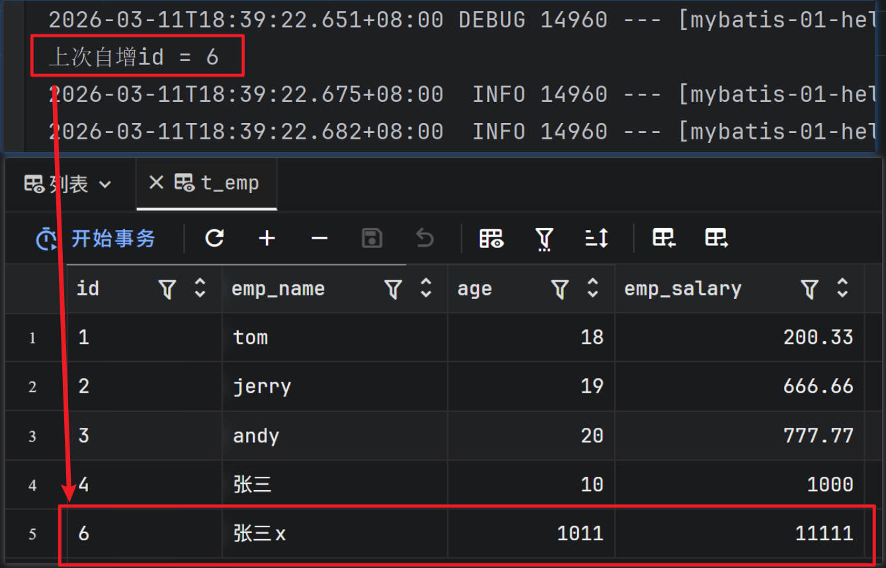


## 查询所有

+ **Mybatis01HelloworldApplicationTests.java**

```java
@Autowired //容器中是MyBatis为每个Mapper接口创建的代理对象
EmpMapper empMapper;

@Test
void testAll() {
    List<Emp> all = empMapper.getAll();
    for (Emp emp : all) {
        System.out.println(emp);
    }
}
```

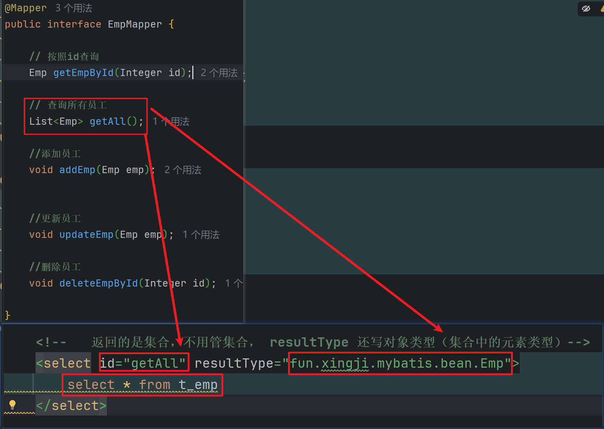

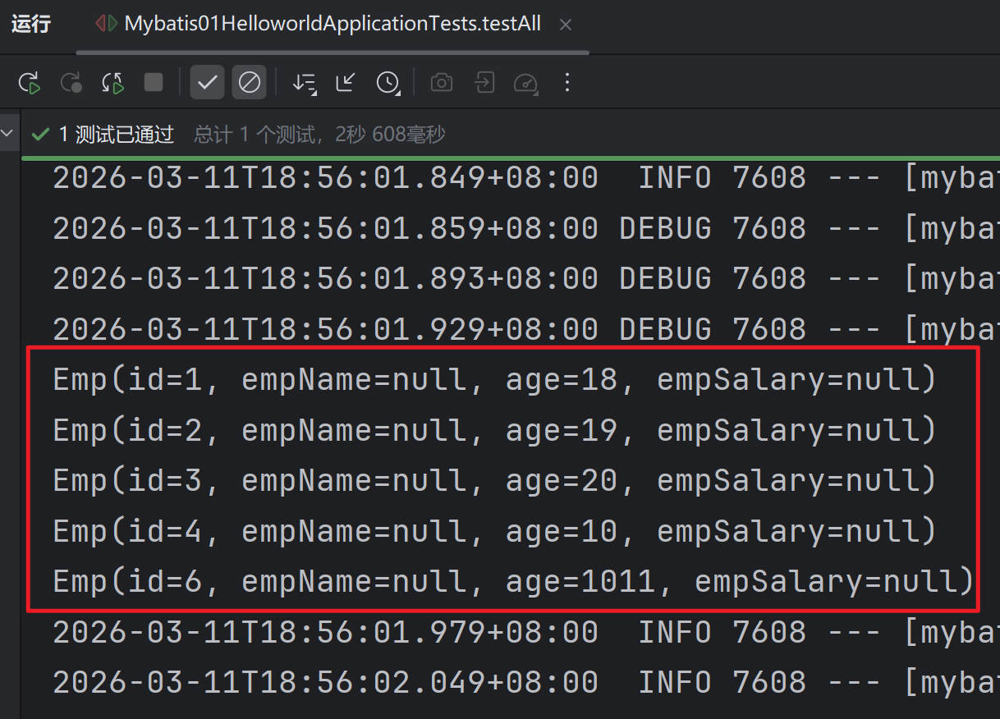

+ 开启驼峰命名

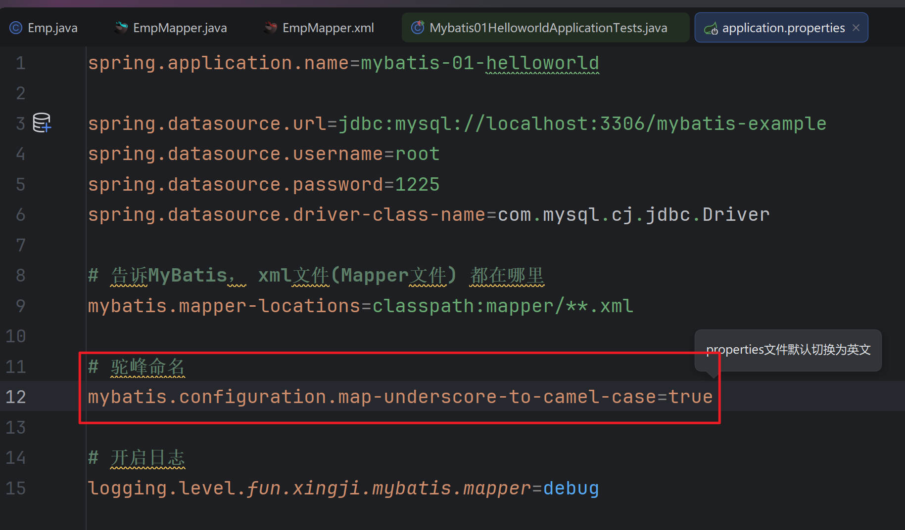

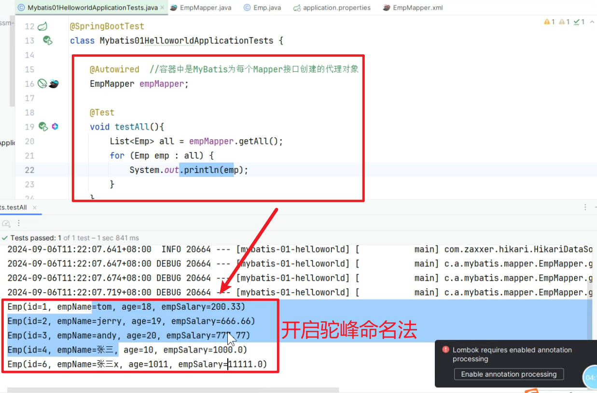
