## 简介

::: tip 

**`动态 SQL`是 MyBatis 的强大特性之一。如果你使用过 JDBC 或其它类似的框架，你应该能理解`根据不同条件拼接 SQL 语句`有多痛苦，例如拼接时要确保不能忘记添加必要的空格，还要注意去掉列表最后一个列名的逗号。利用动态 SQL，可以彻底摆脱这种痛苦。**

**使用动态 SQL 并非一件易事，但借助可用于任何 SQL 映射语句中的强大的动态 SQL 语言，MyBatis 显著地提升了这一特性的易用性。**

:::

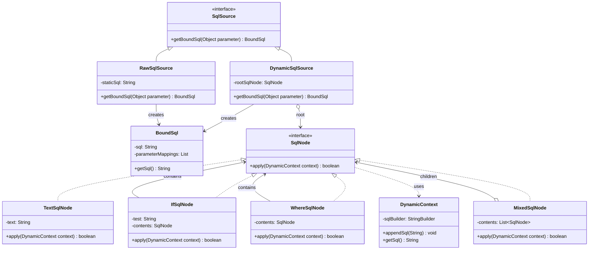
```mermaid
classDiagram
    class SqlSource {
        <<interface>>
        +getBoundSql(Object parameter) BoundSql
    }
    class DynamicSqlSource {
        -rootSqlNode: SqlNode
        +getBoundSql(Object parameter) BoundSql
    }
    class RawSqlSource {
        -staticSql: String
        +getBoundSql(Object parameter) BoundSql
    }
    class BoundSql {
        -sql: String
        -parameterMappings: List
        +getSql() String
    }
    class SqlNode {
        <<interface>>
        +apply(DynamicContext context) boolean
    }
    class IfSqlNode {
        -test: String
        -contents: SqlNode
        +apply(DynamicContext context) boolean
    }
    class WhereSqlNode {
        -contents: SqlNode
        +apply(DynamicContext context) boolean
    }
    class TextSqlNode {
        -text: String
        +apply(DynamicContext context) boolean
    }
    class MixedSqlNode {
        -contents: List~SqlNode~
        +apply(DynamicContext context) boolean
    }
    class DynamicContext {
        -sqlBuilder: StringBuilder
        +appendSql(String) void
        +getSql() String
    }

    SqlSource <|-- DynamicSqlSource
    SqlSource <|-- RawSqlSource
    DynamicSqlSource --> BoundSql : creates
    RawSqlSource --> BoundSql : creates
    DynamicSqlSource o--> SqlNode : root

    SqlNode <|.. IfSqlNode
    SqlNode <|.. WhereSqlNode
    SqlNode <|.. TextSqlNode
    SqlNode <|.. MixedSqlNode
    IfSqlNode --> SqlNode : contains
    WhereSqlNode --> SqlNode : contains
    MixedSqlNode o--> SqlNode : children

    SqlNode ..> DynamicContext : uses
```

::: note 

- **SqlSource** 接口：定义如何从参数获取可执行 SQL。
  - **DynamicSqlSource**：处理包含动态标签（如 `<if>`、`<where>`）的 SQL，内部持有一个 `SqlNode` 组合树。
  - **RawSqlSource**：处理纯静态 SQL（仅有 `#{}` 占位符），直接生成 `BoundSql`。
- **SqlNode** 接口：动态 SQL 节点的抽象，每种标签对应一个实现。
  - **IfSqlNode**：对应 `<if>`，根据条件判断是否包含子节点。
  - **WhereSqlNode**：对应 `<where>`，处理条件前缀和多余的 `AND/OR`。
  - **TextSqlNode**：普通文本或 `${}` 占位符。
  - **MixedSqlNode**：有序子节点列表，按顺序执行。
- **DynamicContext**：在递归解析过程中暂存 SQL 片段，最终拼接成完整 SQL。
- **BoundSql**：最终产物，包含可执行的 SQL 字符串和参数映射信息。

:::


## if、where 标签

::: tip 

**if标签：`判断`**

**test：判断条件； java代码怎么写，它怎么写**

**where标签：解决 where后面`语法错误问题`（多and、or, 无任何条件多where）**

```xml
<!-- 按照 empName 和 empSalary 查询员工 -->
<select id="queryEmpByNameAndSalary" resultType="fun.xingji.mybatis.bean.Emp">
        <where>
            select * from t_emp where
            <if test="name != null">
                emp_name = #{name}
            </if>
            <if test="salary != null">
                and emp_salary = #{salary}
            </if>
        </where>
</select>
```

:::

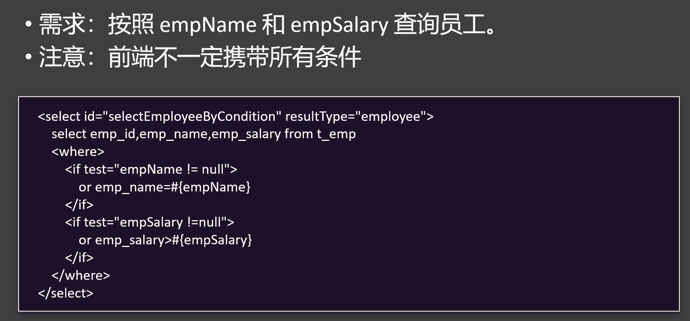

```java
package fun.xingji.mybatis;

import fun.xingji.mybatis.bean.Emp;
import fun.xingji.mybatis.mapper.EmpDynamicSQLMapper;
import org.junit.jupiter.api.Test;
import org.springframework.beans.factory.annotation.Autowired;
import org.springframework.boot.test.context.SpringBootTest;

@SpringBootTest
public class DynamicSQLTest {

    @Autowired
    EmpDynamicSQLMapper empDynamicSQLMapper;

    @Test
    void test01(){

        // 1、 select * from t_emp where and emp_salary = ?;
//        empDynamicSQLMapper.queryEmpByNameAndSalary(null, new BigDecimal("1000.00"));

        // 2、select * from t_emp where
        empDynamicSQLMapper.queryEmpByNameAndSalary(null, null);
    }
}
```

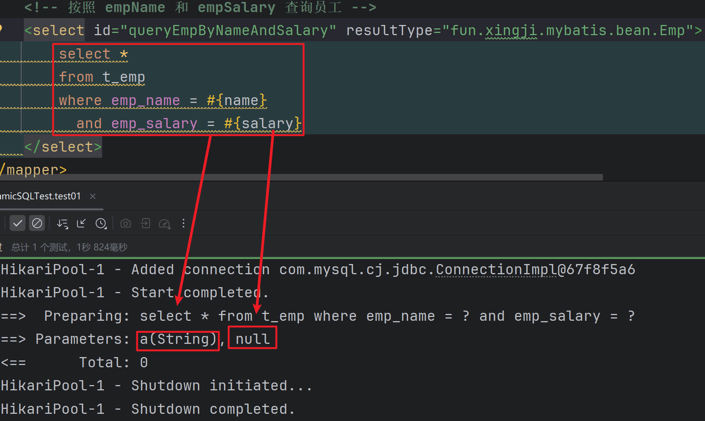

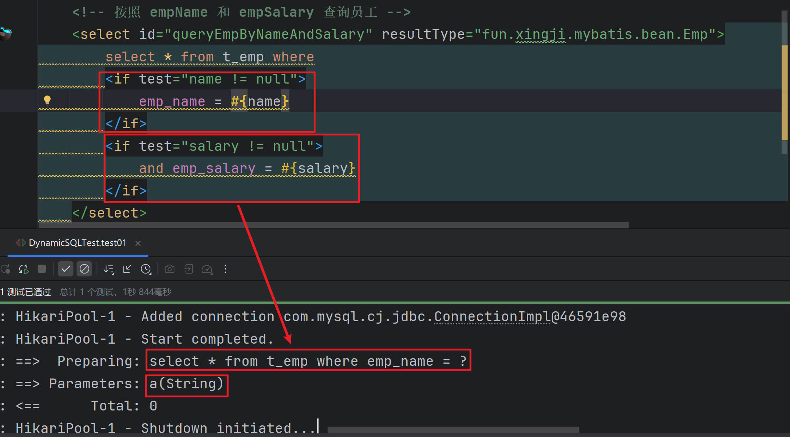

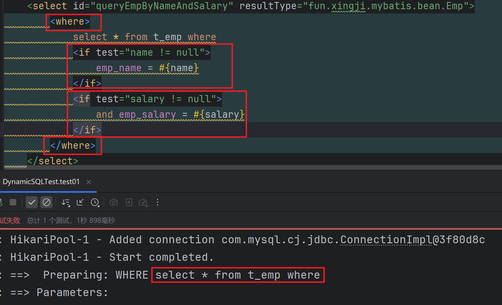


## trim、choose、set 标签


### set标签

```xml
 <!--  set：和where一样，解决语法错误问题。
   update t_emp where id=1
  -->
    <!-- 更新员工信息 -->
<update id="updateEmp">
        update t_emp
        <set>
            <if test="empName != null">
                emp_name = #{empName},
            </if>-->
            <if test="empSalary != null">
                emp_salary = #{empSalary},
            </if>-->
            <if test="age!=null">
                age = #{age}
            </if>
        </set>
        where id = #{id}
</update>
```

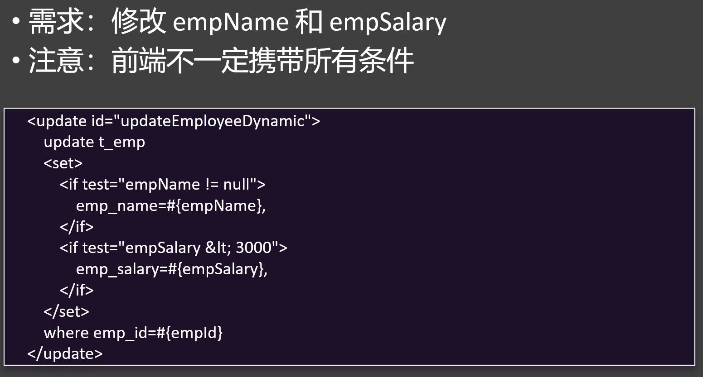

```java
package fun.xingji.mybatis;

import fun.xingji.mybatis.bean.Emp;
import fun.xingji.mybatis.mapper.EmpDynamicSQLMapper;
import org.junit.jupiter.api.Test;
import org.springframework.beans.factory.annotation.Autowired;
import org.springframework.boot.test.context.SpringBootTest;

@SpringBootTest
public class DynamicSQLTest {

    @Autowired
    EmpDynamicSQLMapper empDynamicSQLMapper;

    @Test
    void test02(){
        Emp emp = new Emp();
        emp.setId(4);
        emp.setEmpName("哈哈222");

        // update t_emp set emp_name = ?, where id = ?
//        emp.setAge(18);
//        emp.setEmpSalary(10.0D);


        // 带了那个只更新那个
        empDynamicSQLMapper.updateEmp(emp);
    }
}
```

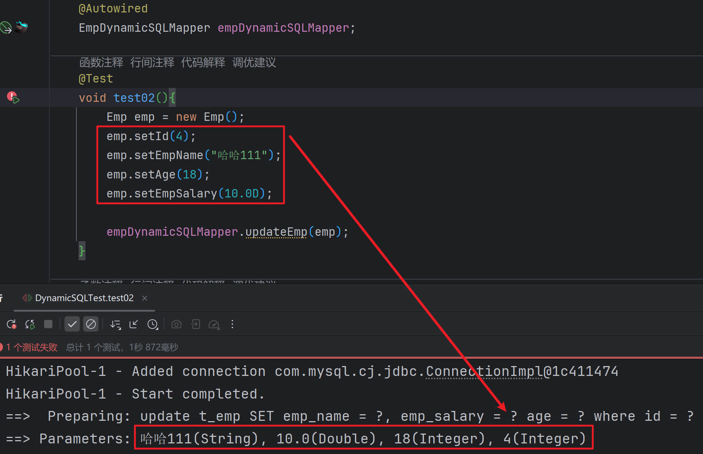

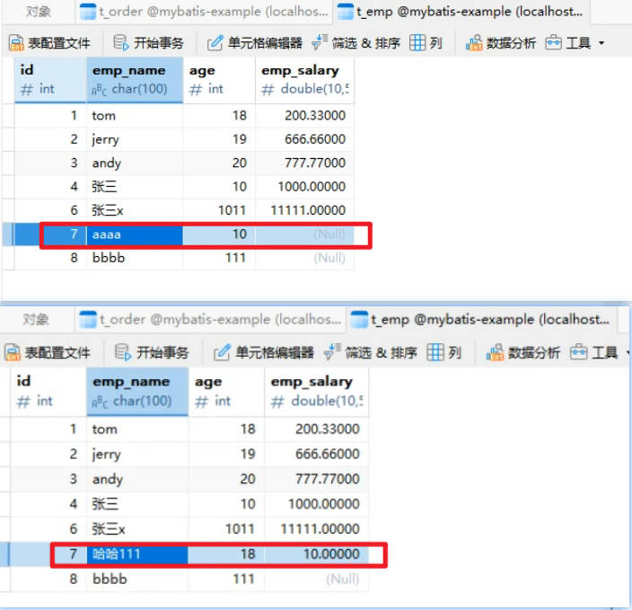

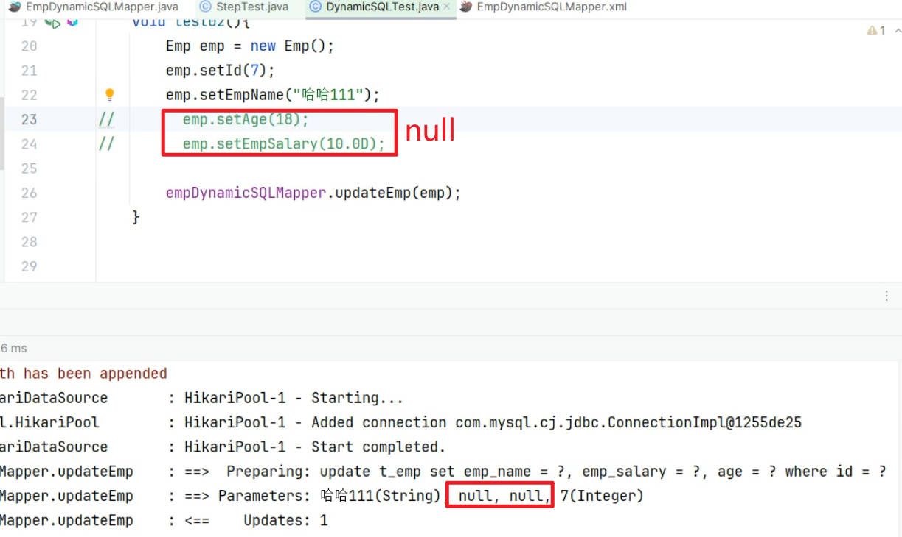


### trim标签

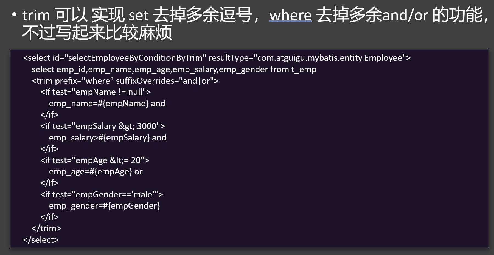


#### trim标签实现where

```xml
<!-- trim版本实现where
    prefix：前缀 ; 如果标签体中有东西，就给它们拼一个前缀
    suffix：后缀
    prefixOverrides：前缀覆盖； 标签体中最终生成的字符串，如果以指定前缀开始，就覆盖成空串
    suffixOverrides：后缀覆盖
-->
<select id="queryEmpByNameAndSalary" resultType="fun.xingji.mybatis.bean.Emp">
        select * from t_emp
        <trim prefix="where" prefixOverrides="and || or">
            <if test="name != null">
                emp_name= #{name}
            </if>
            <if test="salary != null">
                and emp_salary = #{salary}
            </if>
        </trim>

</select>
```


#### trim标签实现set

```xml
<!--   trim： 版本实现 set
    suffix="where id = #{id}"
-->
<update id="updateEmp">
        update t_emp
        <trim prefix="set" suffixOverrides="," >
            <if test="empName != null">
                emp_name = #{empName},
            </if>
            <if test="empSalary != null">
                emp_salary &lt; #{empSalary},
            </if>
            <if test="age!=null">
                age = #{age}
            </if>
        </trim>
        where id = #{id}
    </update>
    <update id="updateBatchEmp">
        <foreach collection="emps" item="e" separator=";">
            update t_emp
            <set>
                <if test="e.empName != null">
                    emp_name = #{e.empName},
                </if>
                <if test="e.empSalary != null">
                    emp_salary = #{e.empSalary},
                </if>
                <if test="e.age!=null">
                    age = #{e.age}
                </if>
            </set>
            where id=#{e.id}
        </foreach>
</update>
```


### choose/when/otherwise标签

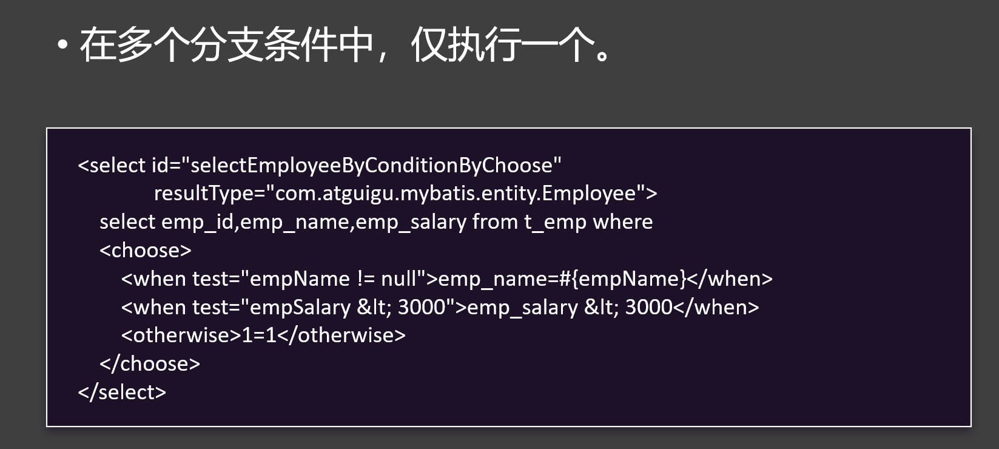

```xml
<select id="queryEmpByNameAndSalaryWhen" resultType="fun.xingji.mybatis.bean.Emp">
        select * from t_emp
        <where>
            <choose>
                <when test="name != null">
                    emp_name= #{name}
                </when>
                <when test="salary > 3000">
                    emp_salary = #{salary}
                </when>
                <otherwise>
                    id = 1
                </otherwise>
            </choose>
        </where>
</select>
```


## foreach 遍历

::: tip 

**for(Integer id :ids)**
**foreach: 遍历List,Set,Map,数组**
        **collection：指定要遍历的集合名**
        **item：将当前遍历出的元素赋值给指定的变量**
        **separator：指定在每次遍历时，元素之间拼接的分隔符**
        **open：遍历开始前缀； 不开始遍历就不会有这个**
        **close：遍历结束后缀**

:::

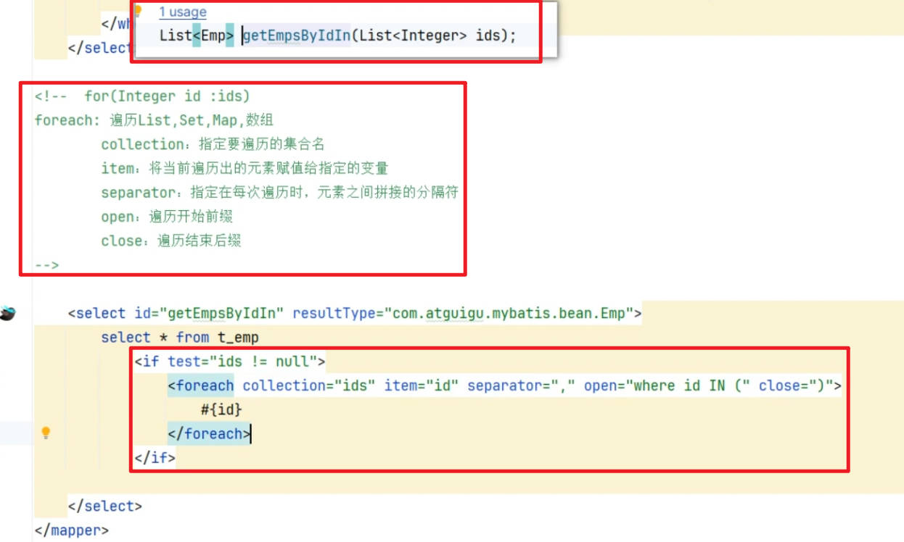

```xml
    <!-- 查询指定id集合中的员工 -->
    <!--  for(Integer id :ids)
foreach: 遍历List,Set,Map,数组
        collection：指定要遍历的集合名
        item：将当前遍历出的元素赋值给指定的变量
        separator：指定在每次遍历时，元素之间拼接的分隔符
        open：遍历开始前缀； 不开始遍历就不会有这个
        close：遍历结束后缀
-->
<select id="getEmpsByIdIn" resultType="fun.xingji.mybatis.bean.Emp">
        select *
        from t_emp
        <if test="ids != null">
            <foreach collection="ids" item="id" separator="," open="where id IN (" close=")">
                #{id}
            </foreach>
        </if>
</select>
```


### 进行批量导入

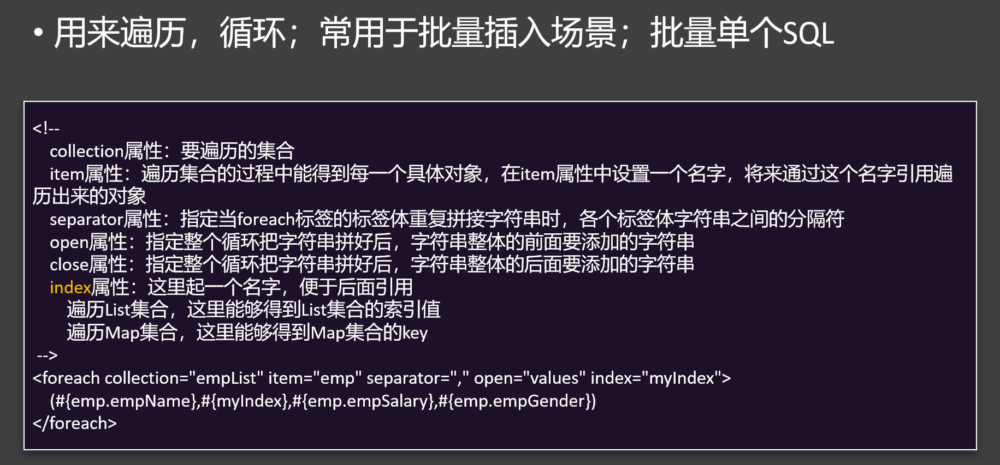

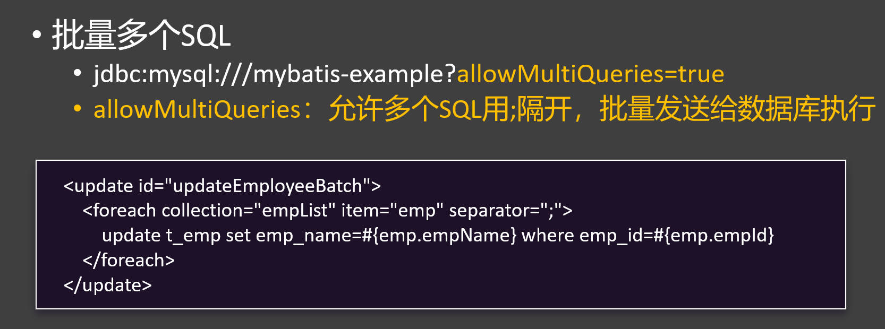

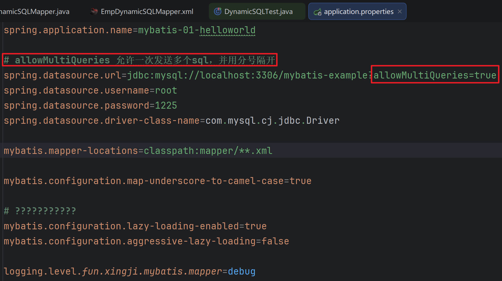


### 批量插入一批员工

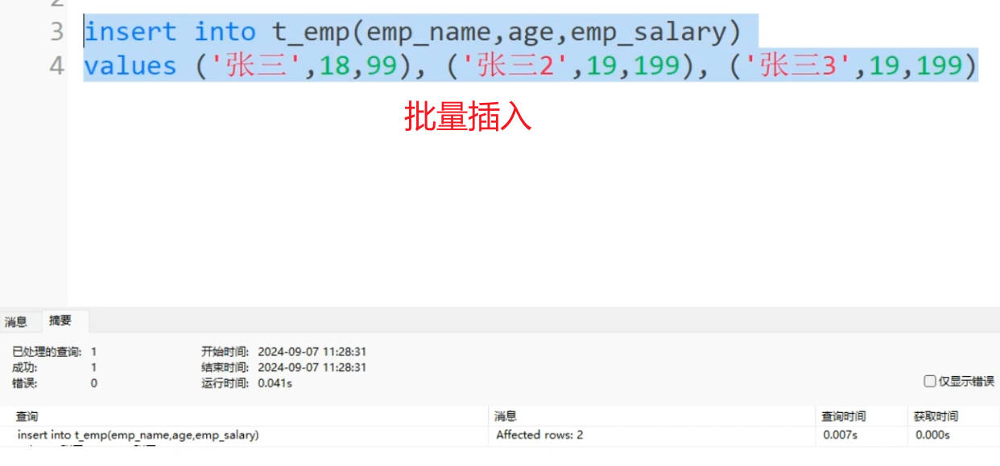

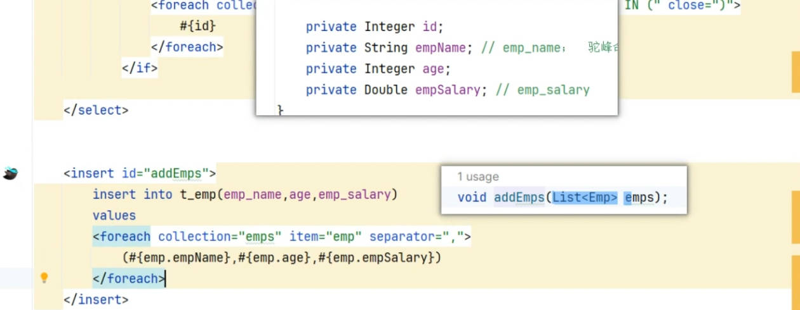

+ **EmpDynamicSQLMapper.xml**

```xml
<!-- 批量插入一批员工 -->
<insert id="addEmps">
        insert into t_emp(emp_name,age,emp_salary)
        values
        <foreach collection="emps" item="emp" separator=",">
            (#{emp.empName},#{emp.age},#{emp.empSalary})
        </foreach>
</insert>
```

+ **DynamicSQLTest.java**

```java
package fun.xingji.mybatis;

import fun.xingji.mybatis.bean.Emp;
import fun.xingji.mybatis.mapper.EmpDynamicSQLMapper;
import org.junit.jupiter.api.Test;
import org.springframework.beans.factory.annotation.Autowired;
import org.springframework.boot.test.context.SpringBootTest;

import java.util.ArrayList;
import java.util.Arrays;
import java.util.List;

@SpringBootTest
public class DynamicSQLTest {

    @Autowired
    EmpDynamicSQLMapper empDynamicSQLMapper;

    //批量插入效率最高。
    @Test
    void test05(){
        List<Emp> emps = new ArrayList<>();
        for (int i = 0; i < 100; i++) {
            Emp emp = new Emp();
            emp.setEmpName("张-"+i);
            emp.setAge(20+i);
            emp.setEmpSalary(10000.0D+i);
            emps.add(emp);
        }

        //批量插入  values (?, ?, ?), (?, ?, ?)
        empDynamicSQLMapper.addEmps(emps);
    }
}
```

+ **测试:**

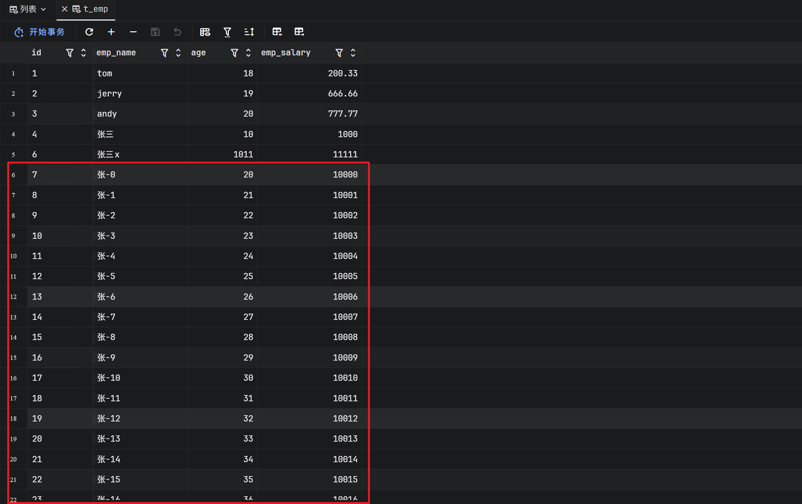


### 批量更新一批员工

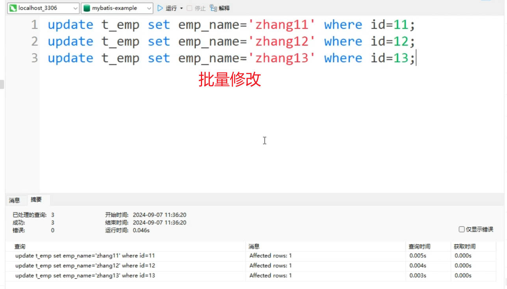

+ **EmpDynamicSQLMapper.xml**

```xml
<!-- 批量更新员工信息 -->
<update id="updateBatchEmp">
        <foreach collection="emps" item="e" separator=";">
            update t_emp
            <set>
                <if test="e.empName != null">
                    emp_name = #{e.empName},
                </if>
                <if test="e.empSalary != null">
                    emp_salary = #{e.empSalary},
                </if>
                <if test="e.age!=null">
                    age = #{e.age}
                </if>
            </set>
            where id=#{e.id}
        </foreach>
</update>
```

+ **DynamicSQLTest.java**

```java
package fun.xingji.mybatis;

import fun.xingji.mybatis.bean.Emp;
import fun.xingji.mybatis.mapper.EmpDynamicSQLMapper;
import fun.xingji.mybatis.service.EmpService;
import org.junit.jupiter.api.Test;
import org.springframework.beans.factory.annotation.Autowired;
import org.springframework.boot.test.context.SpringBootTest;

import java.util.ArrayList;
import java.util.Arrays;
import java.util.List;

@SpringBootTest
public class DynamicSQLTest {

    @Autowired
    EmpDynamicSQLMapper empDynamicSQLMapper;

    @Autowired
    EmpService empService;

    //分布式项目情况下，分布式事务很多不支持多SQL批量操作的回滚；
    @Test
    void test08(){
        List<Emp> emps = new ArrayList<>();
        for (int i = 0; i < 100; i++) {
            Emp emp = new Emp();
            emp.setId(10+i);
            emp.setEmpName("张-"+100+i);
            emp.setAge(100+i);
            emp.setEmpSalary(90000.0D+i);
            emps.add(emp);
        }
        empService.updateBatch(emps);
        System.out.println("批量更新完成");
    }


    // 普通方式进行更新效率最低。
    @Test
    void test07(){
        for (int i = 0; i < 100; i++) {
            empDynamicSQLMapper.updateEmp(new Emp());
        }
    }

    //批量更新效率最高。
    //一口气发一堆SQL效率最高。
    @Test
    void test06(){
        List<Emp> emps = new ArrayList<>();
        for (int i = 0; i < 100; i++) {
            Emp emp = new Emp();
            emp.setId(10+i);
            emp.setEmpName("张-"+100+i);
            emp.setAge(100+i);
            emp.setEmpSalary(70000.0D+i);
            emps.add(emp);
        }

        /**
         * update t_emp SET emp_name = ?, emp_salary = ?, age = ? where id=? ;
         * update t_emp SET emp_name = ?, emp_salary = ?, age = ? where id=? ;
         * update t_emp SET emp_name = ?, emp_salary = ?, age = ? where id=? ;
         * update t_emp SET emp_name = ?, emp_salary = ?, age = ? where id=? ;
         */
        empDynamicSQLMapper.updateBatchEmp(emps);
    }
}
```

+ **测试:**

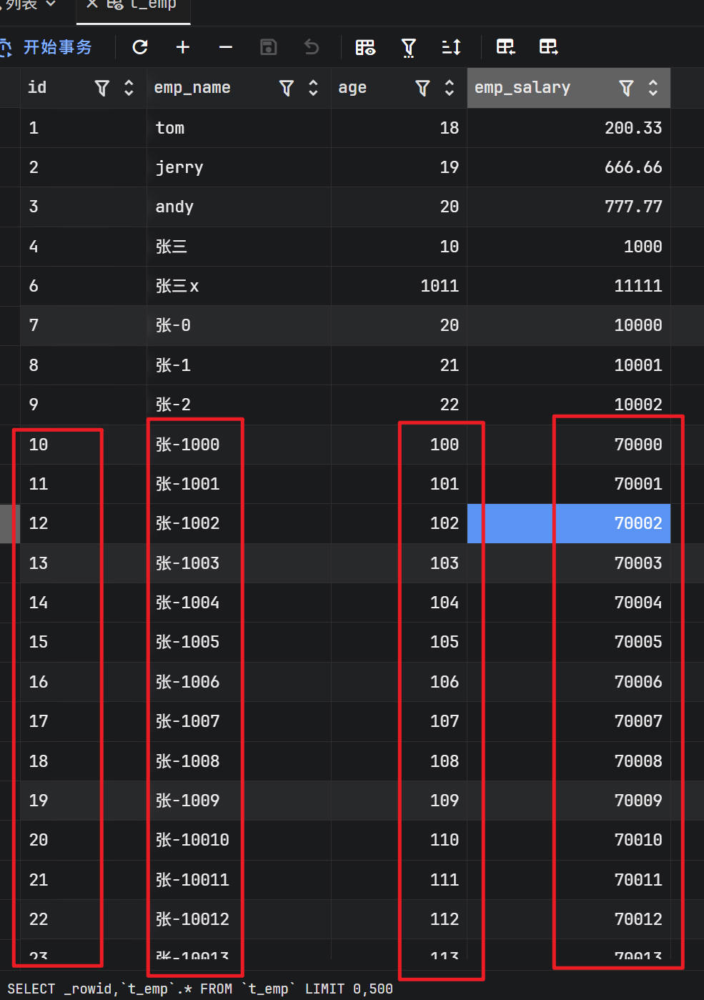


## sql 片段抽取

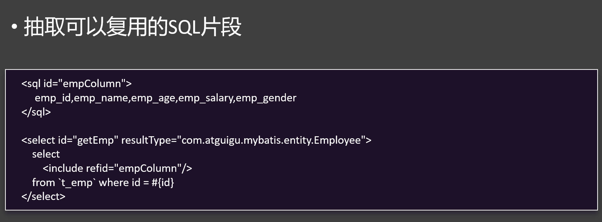

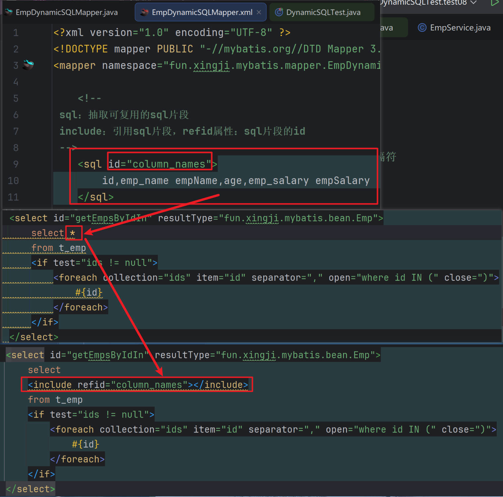


## 特殊字符

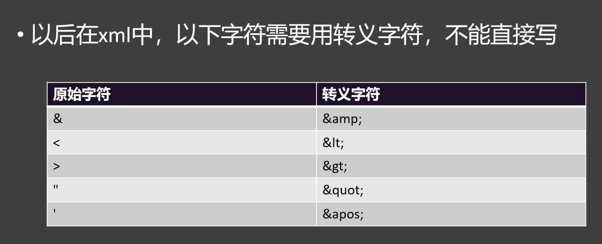

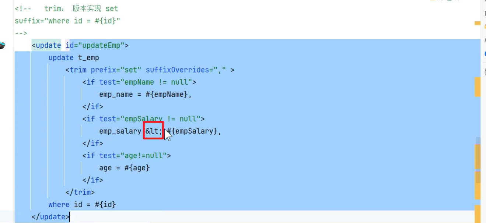
