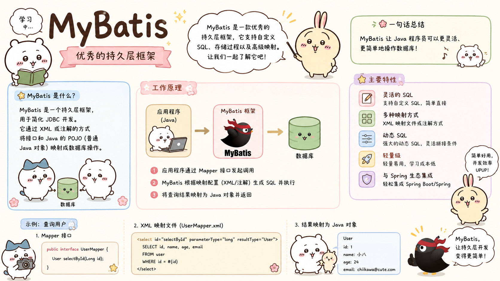

## \#{}与${}

::: tip 

**#{}**：**底层使用 PreparedStatement 方式，SQL预编译后设置参数，`无SQL注入攻击风险`**

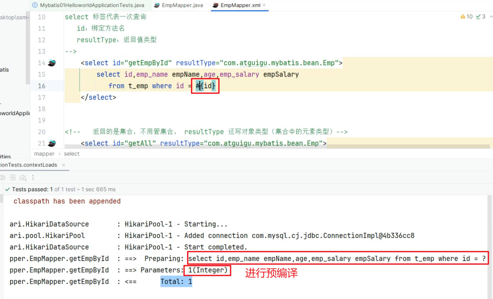

**${}**：**底层使用 Statement 方式，SQL无预编译，直接拼接参数，`有SQL注入攻击风险`**

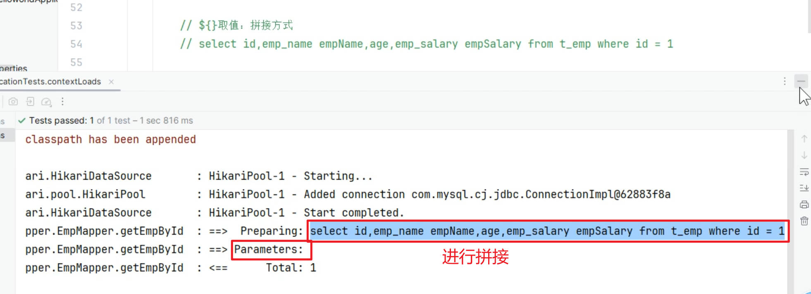

+ **所有`参数位置`，都应该用 `#{}`**

+ **需要`动态表名`等，才用 `${}`**

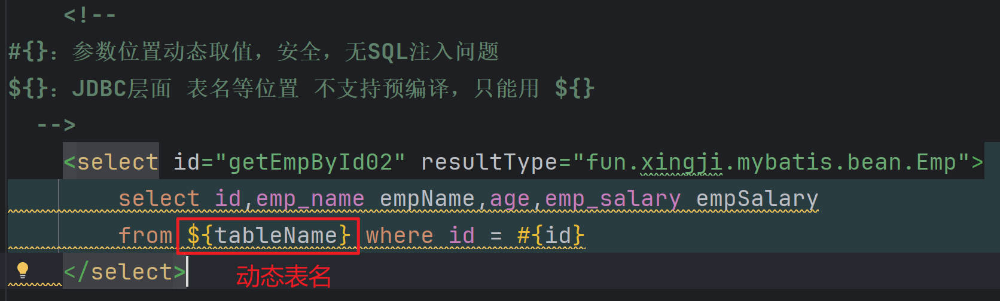

最佳实践：

+ **凡是使用了 `${} ` 的业务，一定要自己编写`防SQL注入攻击`代码**

:::


## 参数取值

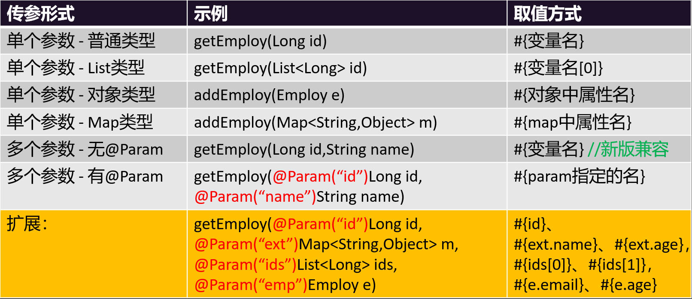

> **最佳实践：即使`只有一个参数`，也用 `@Param 指定参数名`**

+ **EmpParamMapper.java**

```java
package fun.xingji.mybatis.mapper;

import fun.xingji.mybatis.bean.Emp;
import org.apache.ibatis.annotations.Mapper;
import org.apache.ibatis.annotations.Param;

import java.util.List;
import java.util.Map;


//单个参数：
//  1、#{参数名} 就可以取值。
//  2、Map和JavaBean，#{key/属性名} 都可以取值。
//多个参数：
//  用@Param指定参数名， #{参数名} 就可以取值。
@Mapper //告诉Spring，这是MyBatis操作数据库用的接口; Mapper接口
public interface EmpParamMapper {

    Emp getEmploy(Long id);

    // 获取数组中第二个元素指定的用户
    Emp getEmploy02(List<Long> ids);

    // 对象属性取值，直接获取
    void addEmploy(Emp e);

    // map中的属性也是直接取值
    void addEmploy2(Map<String, Object> m);

    //==========以上是单个参数测试==============

    //以后多个参数，用@Param指定参数名， #{参数名} 就可以取值。
    Emp getEmployByIdAndName(@Param("id") Long id, @Param("empName") String name);


    // select * from emp where id = #{id} and emp_name = #{从map中取到的name} and age = #{ids的第三个参数值} and salary = #{e中的salary}
    Emp getEmployHaha(@Param("id") Long id,
                      @Param("m") Map<String,Object> m,
                      @Param("ids") List<Long> ids,
                      @Param("e") Emp e);
}
```


+ **EmpParamMapper.xml**

```xml
<?xml version="1.0" encoding="UTF-8" ?>
<!DOCTYPE mapper PUBLIC "-//mybatis.org//DTD Mapper 3.0//EN" "http://mybatis.org/dtd/mybatis-3-mapper.dtd" >
<mapper namespace="fun.xingji.mybatis.mapper.EmpParamMapper">

    <!-- 单个参数测试 -->
    <select id="getEmploy" resultType="fun.xingji.mybatis.bean.Emp">
        select * from t_emp where id = #{id}
    </select>

    <!-- 获取数组中第二个元素指定的用户 -->
    <select id="getEmploy02" resultType="fun.xingji.mybatis.bean.Emp">
        select * from t_emp where id = #{ids[1]}
    </select>

    <!-- 对象属性取值，直接获取 -->
    <insert id="addEmploy">
        insert into t_emp(emp_name, age) values (#{empName}, #{age})
    </insert>

    <!-- map中的属性也是直接取值 -->
    <insert id="addEmploy2">
        insert into t_emp(emp_name, age) values (#{name}, #{age})
    </insert>

    <!--
    新版 MyBatis支持多个参数情况下，直接用 #{参数名}
    老版 MyBatis不支持以上操作，需要用 @Param 注解指定参数名
    -->
    <!-- 多个参数测试 -->
    <select id="getEmployByIdAndName" resultType="fun.xingji.mybatis.bean.Emp">
        select * from t_emp where id = #{id} and emp_name = #{empName}
    </select>

    <!-- 多个参数测试 -->
    <select id="getEmployHaha" resultType="fun.xingji.mybatis.bean.Emp">
        select * from t_emp where id = #{id}
                            and emp_name = #{m.name}
                            and age = #{ids[2]}
                            and emp_salary = #{e.empSalary}
    </select>
</mapper>
```


+ **ParamTest.java**

```java
package fun.xingji.mybatis;

import fun.xingji.mybatis.bean.Emp;
import fun.xingji.mybatis.mapper.EmpParamMapper;
import org.junit.jupiter.api.Test;
import org.springframework.beans.factory.annotation.Autowired;
import org.springframework.boot.test.context.SpringBootTest;

import java.util.Arrays;
import java.util.HashMap;
import java.util.Map;


@SpringBootTest
public class ParamTest {


    @Autowired
    EmpParamMapper empParamMapper;


    @Test
    void testParam3() {
        Map<String, Object> params = new HashMap<>();
        params.put("name", "bbbb");
        Emp emp = new Emp();
        emp.setEmpSalary(1000.0D);

        empParamMapper.getEmployHaha(1L, params, Arrays.asList(19L, 20L, 21L, 22L, 34L), emp);
    }


    @Test
    void testParam2() {
        Emp employ = empParamMapper.getEmployByIdAndName(1L, "张三");
        System.out.println("employ:" + employ);
    }

    @Test
    void testParam1() {
        // Emp employ = empParamMapper.getEmploy(1L);

        //empParamMapper.getEmploy02(Arrays.asList(1L,2L,3L,4L));

        Emp emp = new Emp();
        emp.setEmpName("aaaa");
        emp.setAge(10);
        emp.setEmpSalary(0.0D);

        Map<String, Object> map = new HashMap<>();
        map.put("name", "bbbb");
        map.put("age", 111);

        empParamMapper.addEmploy2(map);
    }
}
```


### 单个参数

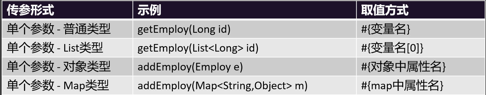

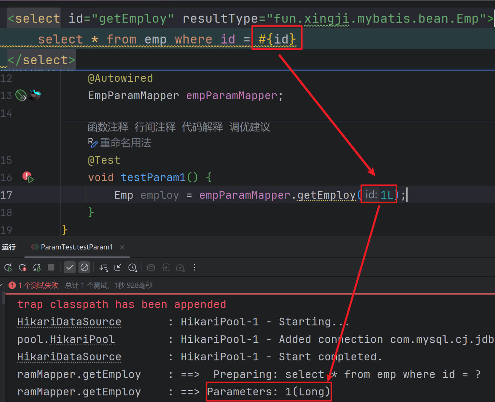

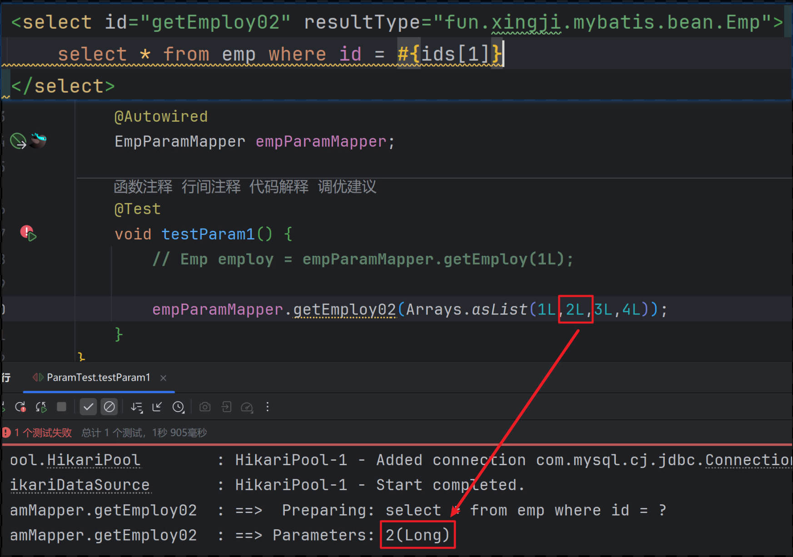

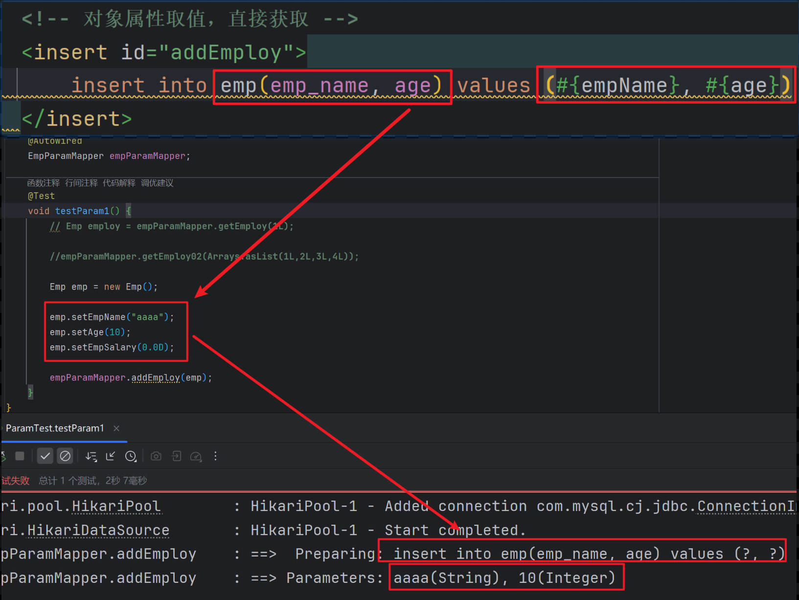

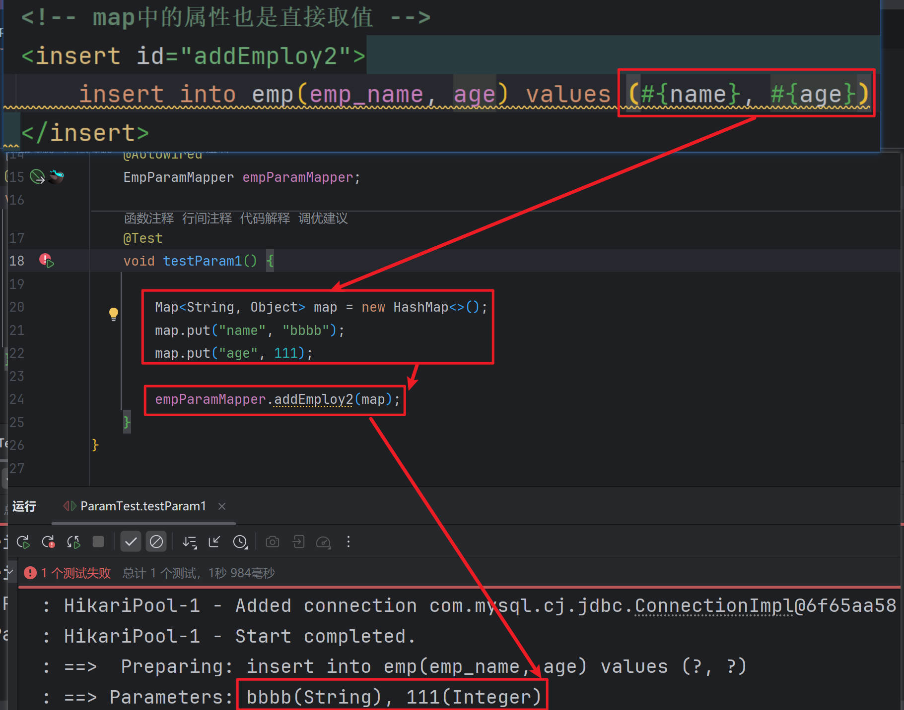


### 多个参数

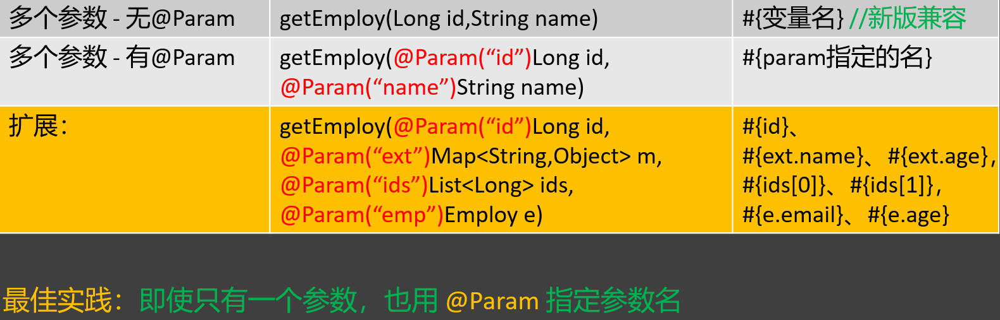

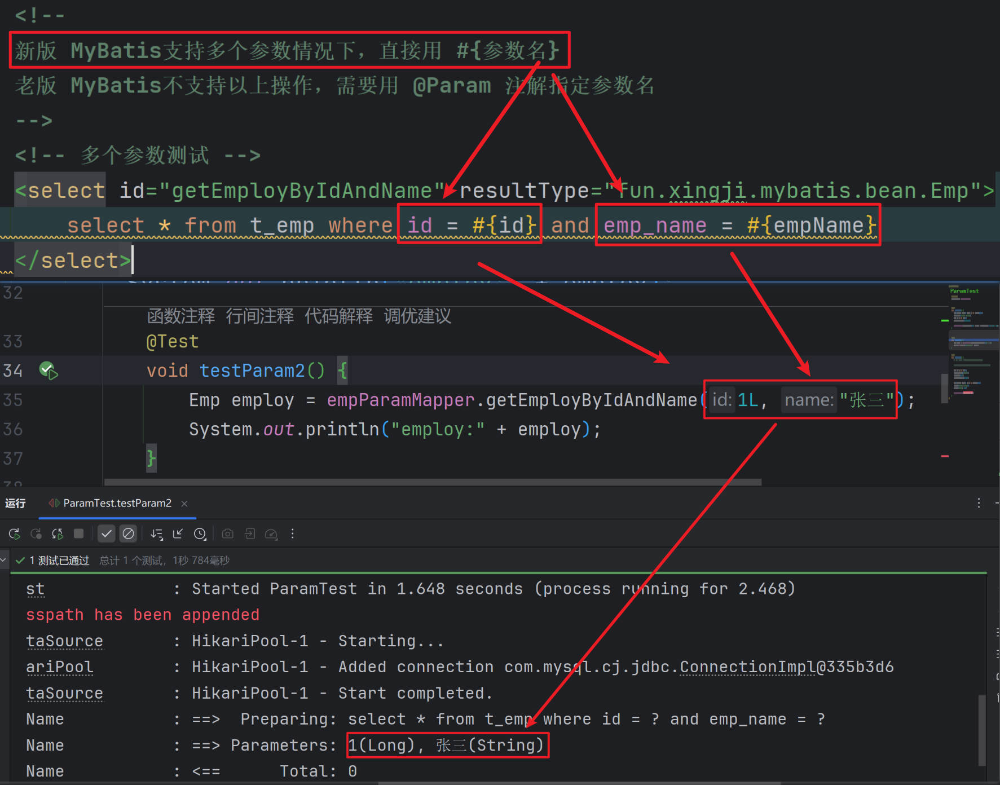

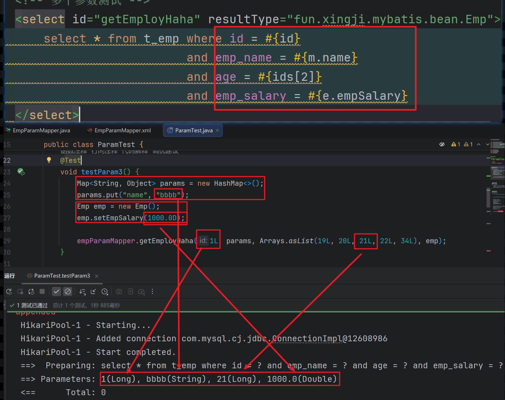


