## 返回普通数据

::: tip 

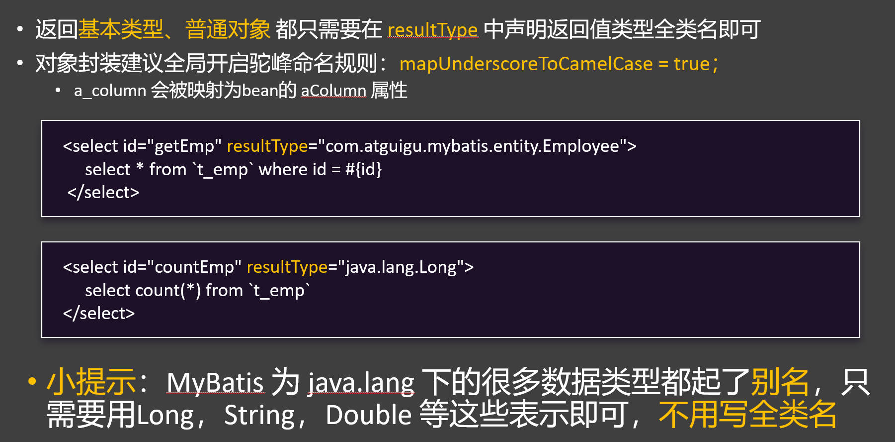

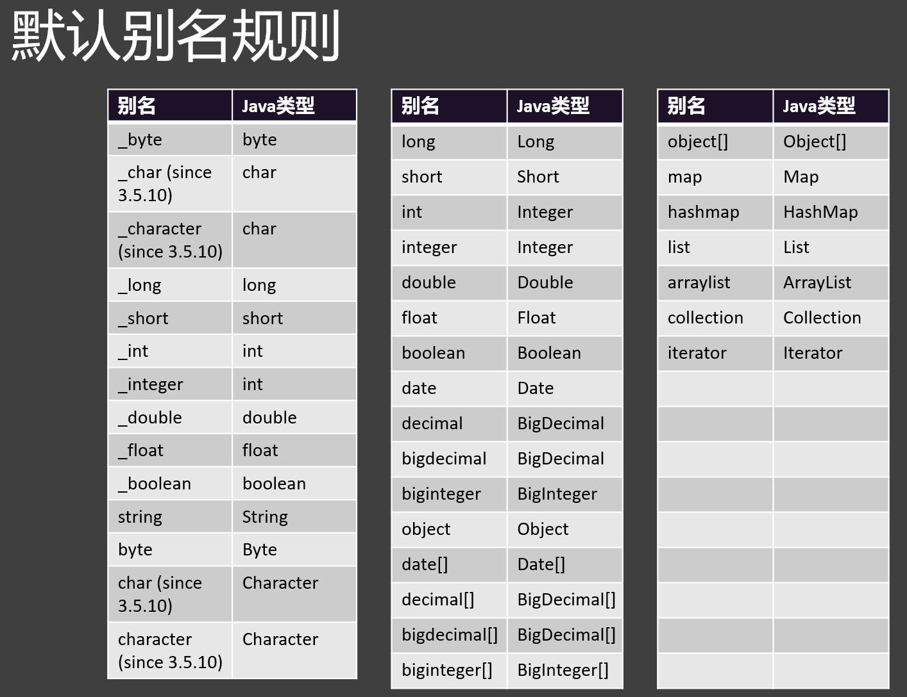

:::

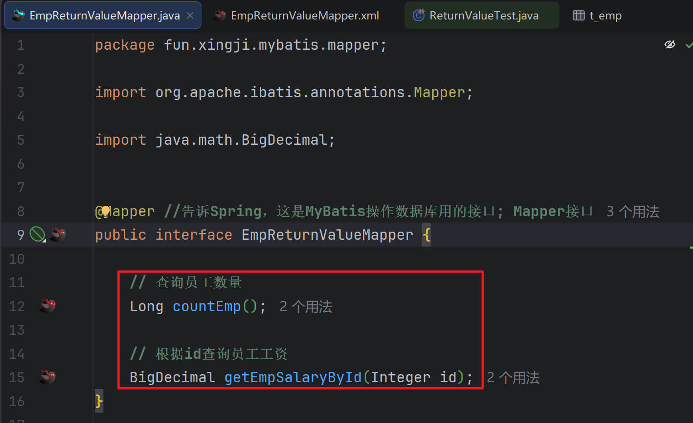

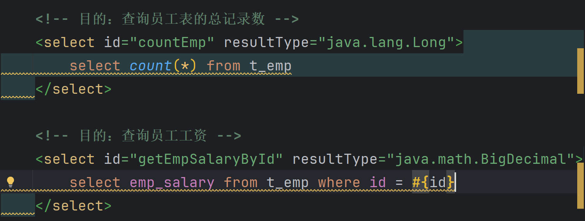

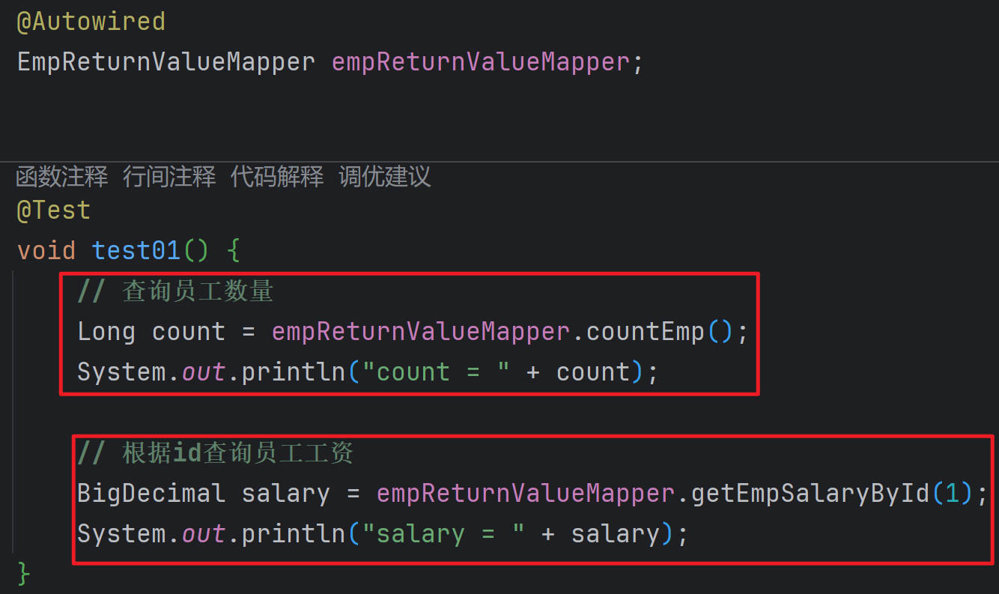

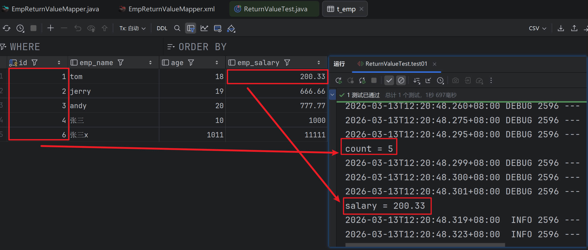


## 返回List、Map

::: tip 

::: warning

> **数据库列名与实体字段名不一致**

- 实体类字段为 `empName` 和 `empSalary`（驼峰命名）。
- 数据库中常见的命名风格是下划线分隔，例如 `emp_name` 和 `emp_salary`。
- MyBatis 默认不会自动将下划线映射为驼峰，所以找不到对应的列，导致值为 `null`。

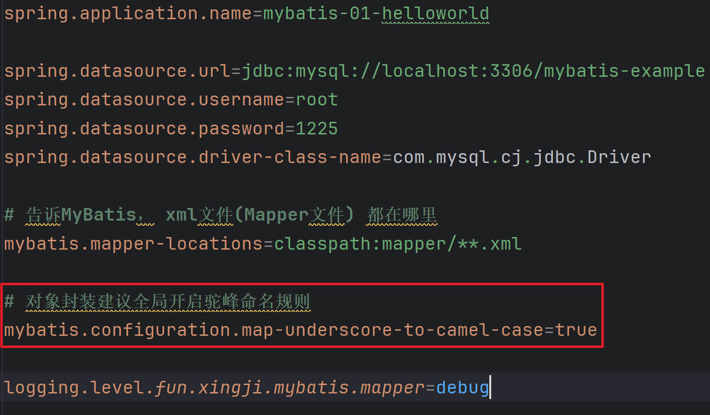

:::

**List：resultType 为集合中的 元素类型**

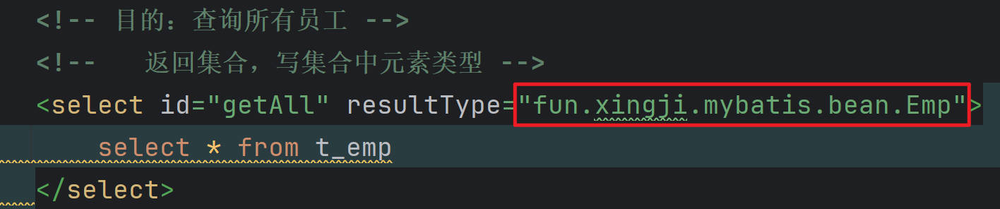

**Map：`resultType 为 map`，配合 `@MapKey`指定``哪一列的值`作为`Map 的 key`，Map 的 Value 为这一行数据的完整信息**

+ **Map<Key,Map>**

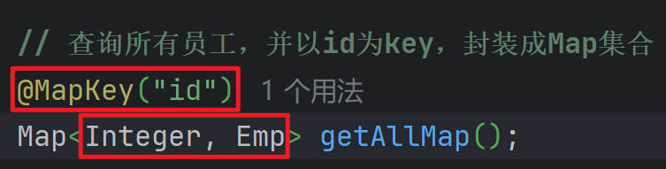

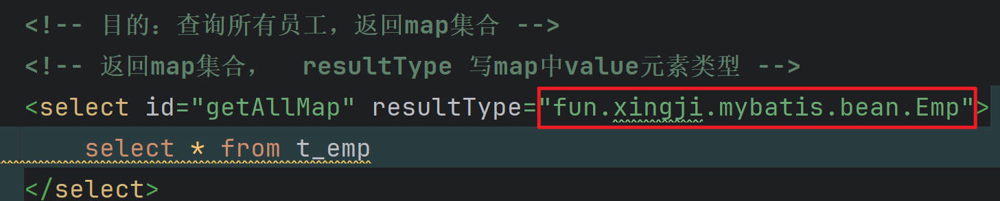

:::

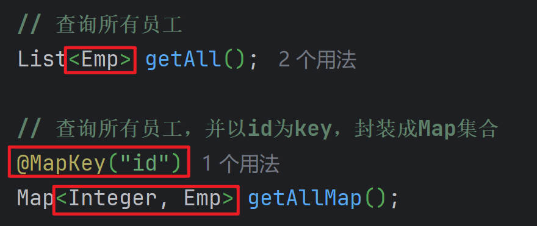

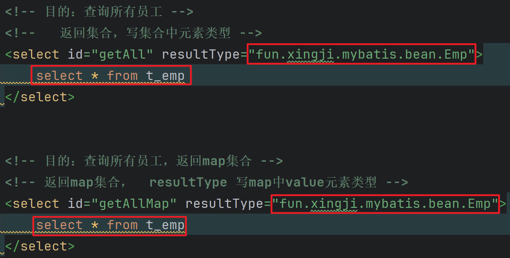

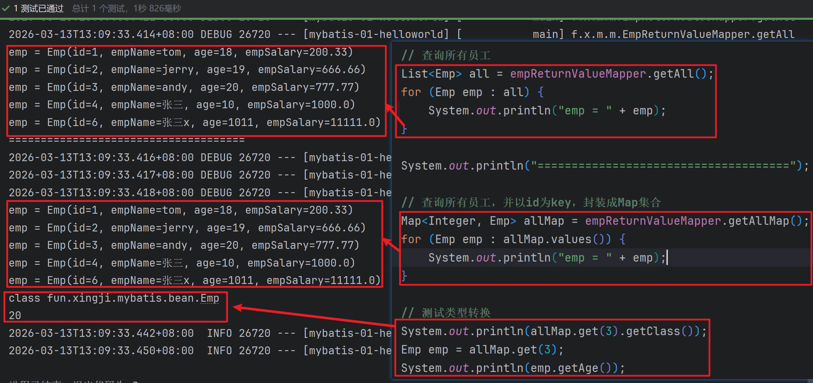


## 自定义结果集


### ResultMap

::: tip 

**`数据库的字段`如果和`Bean的属性`不能`一一对应`，有两种办法**

1、**如果符合驼峰命名，则开启驼峰命名规则**

2、**编写自定义结果集（ResultMap） 进行封装**

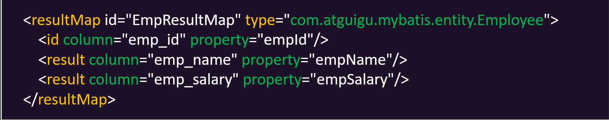

+ **id 标签：必须指定主键列映射规则**

+ **result 标签：指定普通列映射规则**

+ **collection 标签：指定自定义集合封装规则**

+ **association 标签：指定自定义对象封装规则**

:::

+ **EmpReturnValueMapper.xml**

```xml
<!-- 目的：查询单个员工 -->
<!--
        默认封装规则（resultType）：JavaBean 中的属性名 去数据库表中 找对应列名的值。一一映射封装。
        自定义结果集（resultMap）：我们来告诉MyBatis 如何把结果封装到Bean中;
             明确指定每一列如何封装到指定的Bean中
-->
    <resultMap id="EmpRM" type="fun.xingji.mybatis.bean.Emp">
        <!--id：声明主键映射规则-->
        <id column="id" property="id"></id>
        <!--result：声明普通列映射规则-->
        <result column="emp_name" property="empName"></result>
        <result column="age" property="age"></result>
        <result column="emp_salary" property="empSalary"></result>
    </resultMap>

    <!-- resultMap：指定自定义映射规则   -->
    <select id="getEmpById" resultMap="EmpRM">
        select *
        from t_emp
        where id = #{id}
    </select>
```


### 数据关联关系

::: tip 

**1-1：一对一；多表联查产生一对一关系，比如一个订单对应唯一一个下单客户；此时需要保存关系键到某个表中**

**1-N：一对多；多表联查产生一对多关系，比如一个客户产生了多个订单记录；此时多的一端需要保存关系键到自己表中**

**N-N：多对多：无论从哪端出发看，都是对多关系，这就是一个多对多的关系，比如 一个学生有多个老师、一个老师又教了多个学生；此时需要一个中间表记录学生和老师的关联关系**

:::


#### 关联关系 - 1-1、1-N

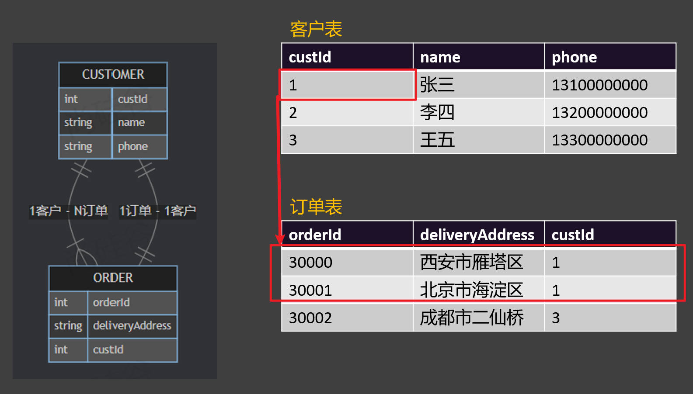


#### 数据关联关系 N-N

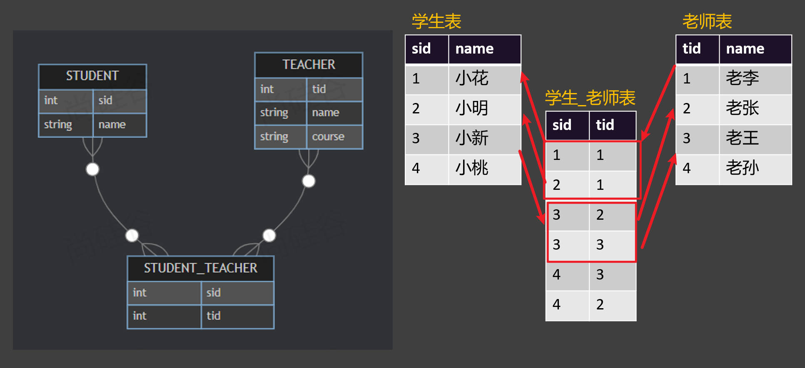


#### 自定义结果集 - 一对一关系封装

::: tip 

**association 标签：指定自定义对象封装规则，一般用户联合查询一对一关系的封装。比如一个用户对应一个订单**

+ **`javaType`：指定`关联的Bean的类型`**

+ **`select`：指定`分步查询调用的方法`**

+ **`column`：指定`分步查询传递的参数列`**

:::


+ **Order,java**

```java
package fun.xingji.mybatis.bean;

import lombok.Data;

import java.math.BigDecimal;

@Data
public class Order {
    private Long id;
    private String address;
    private BigDecimal amount;
    private Long customerId;

    // 订单对应的客户
    private Customer customer;
}
```


+ **OrderMapper.java**

```java
package fun.xingji.mybatis.mapper;

import fun.xingji.mybatis.bean.Order;
import org.apache.ibatis.annotations.Mapper;

@Mapper // 标记这是一个MyBatis的Mapper接口
public interface OrderMapper {

    // 按照id查询订单以及下单的客户信息
    Order getOrderByIdWithCustomer(Long id);

}
```


+ **OrderMapper.xml**

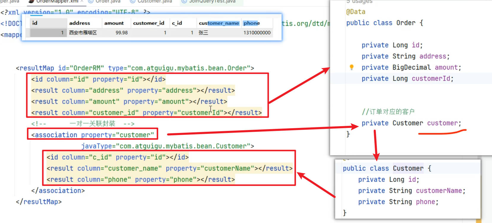

```xml
<?xml version="1.0" encoding="UTF-8" ?>
<!DOCTYPE mapper PUBLIC "-//mybatis.org//DTD Mapper 3.0//EN" "http://mybatis.org/dtd/mybatis-3-mapper.dtd" >
<mapper namespace="fun.xingji.mybatis.mapper.OrderMapper">

    <!--   自定义结果集 -->
    <resultMap id="OrderRM" type="fun.xingji.mybatis.bean.Order">
        <id column="id" property="id"></id>
        <result column="address" property="address"></result>
        <result column="amount" property="amount"></result>
        <result column="customer_id" property="customerId"></result>
        <!--      一对一关联封装  -->
        <association property="customer"
                     javaType="fun.xingji.mybatis.bean.Customer">
            <id column="c_id" property="id"></id>
            <result column="customer_name" property="customerName"></result>
            <result column="phone" property="phone"></result>
        </association>
    </resultMap>

    <select id="getOrderByIdWithCustomer" resultMap="OrderRM">
        select o.*,
               c.id c_id,
               c.customer_name,
               c.phone
        from t_order o
                 left join t_customer c on o.customer_id = c.id
        where o.id = #{id}
    </select>
</mapper>
```


+ **JoinQueryTest,java**

```java
package fun.xingji.mybatis;


import fun.xingji.mybatis.bean.Order;
import fun.xingji.mybatis.mapper.CustomerMapper;
import fun.xingji.mybatis.mapper.OrderMapper;
import org.junit.jupiter.api.Test;
import org.springframework.beans.factory.annotation.Autowired;
import org.springframework.boot.test.context.SpringBootTest;

@SpringBootTest
public class JoinQueryTest {

    @Autowired
    OrderMapper orderMapper;

    // 测试查询订单，并且关联查询出顾客信息
    @Test
    public void test01() {
        Order order = orderMapper.getOrderByIdWithCustomer(3L);
        System.out.println("order = " + order);
    }
}
```


+ **测试:**

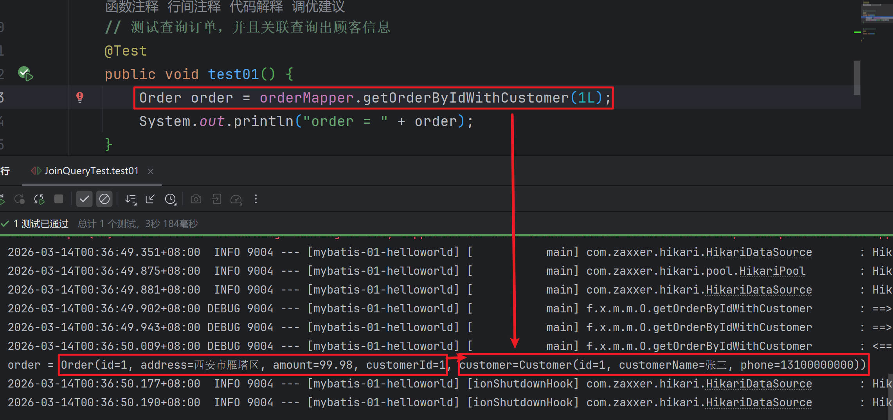

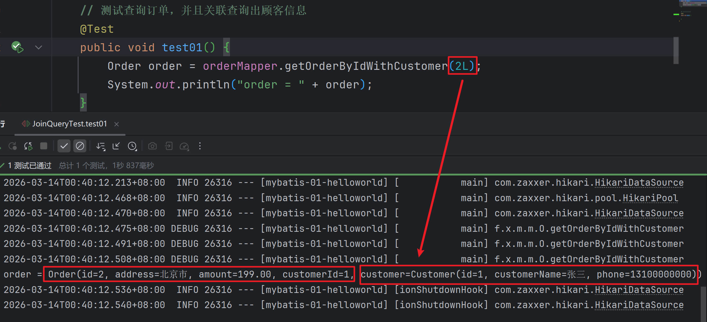

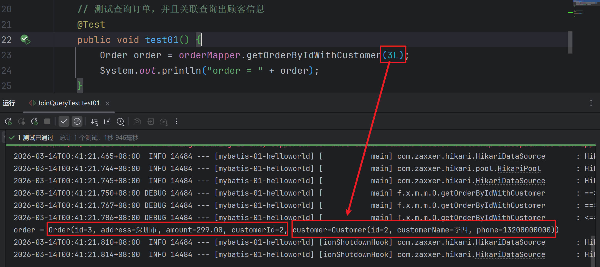


#### 自定义结果集 - 一对多关系封装

::: tip 

**collection 标签：指定自定义对象封装规则，一般用户联合查询一对一关系的封装。比如一个用户对应一个订单**

+ **`ofType`：指定`集合中每个元素的类型`**

+ **`select`：指定`分步查询调用的方法`**

+ **`column`：指定`分步查询传递的参数列`**

:::


+ **Customer.java**

```java
package fun.xingji.mybatis.bean;

import lombok.Data;

import java.util.List;

@Data
public class Customer {
    private Long id;
    private String customerName;
    private String phone;

    //保存所有订单
    List<Order> orders;
}
```


+ **CustomerMapper.java**

```java
package fun.xingji.mybatis.mapper;

import fun.xingji.mybatis.bean.Customer;
import org.apache.ibatis.annotations.Mapper;

@Mapper // 标记这是一个MyBatis的Mapper接口
public interface CustomerMapper {

    // 按照id查询客户以及下的所有订单
    Customer getCustomerByIdWithOrders(Long id);
}
```


+ **CustomerMapper.xml**

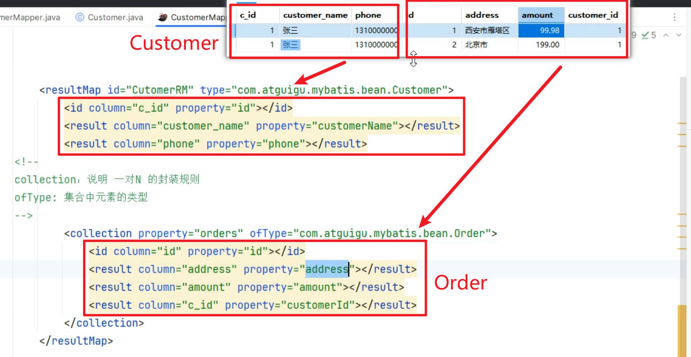

```xml
<?xml version="1.0" encoding="UTF-8" ?>
<!DOCTYPE mapper PUBLIC "-//mybatis.org//DTD Mapper 3.0//EN" "http://mybatis.org/dtd/mybatis-3-mapper.dtd" >
<mapper namespace="fun.xingji.mybatis.mapper.CustomerMapper">

    <resultMap id="CutomerRM" type="fun.xingji.mybatis.bean.Customer">
        <id column="c_id" property="id"></id>
        <result column="customer_name" property="customerName"></result>
        <result column="phone" property="phone"></result>
        <!--
        collection：说明 一对N 的封装规则
        ofType: 集合中元素的类型
        -->
        <collection property="orders" ofType="fun.xingji.mybatis.bean.Order">
            <id column="id" property="id"></id>
            <result column="address" property="address"></result>
            <result column="amount" property="amount"></result>
            <result column="c_id" property="customerId"></result>
        </collection>
    </resultMap>

    <select id="getCustomerByIdWithOrders" resultMap="CutomerRM">
        select c.id c_id,
               c.customer_name,
               c.phone,
               o.*
        from t_customer c
                 left join t_order o on c.id = o.customer_id
        where c.id = #{id}
    </select>
</mapper>
```


+ **JoinQueryTest,java**

```java
package fun.xingji.mybatis;


import fun.xingji.mybatis.bean.Customer;
import fun.xingji.mybatis.bean.Order;
import fun.xingji.mybatis.mapper.CustomerMapper;
import fun.xingji.mybatis.mapper.OrderMapper;
import org.junit.jupiter.api.Test;
import org.springframework.beans.factory.annotation.Autowired;
import org.springframework.boot.test.context.SpringBootTest;

@SpringBootTest
public class JoinQueryTest {

    @Autowired
    CustomerMapper customerMapper;

    // 测试查询顾客，并且关联查询出所有订单信息
    @Test
    public void test02() {
        Customer customer = customerMapper.getCustomerByIdWithOrders(2L);
        for (Order order : customer.getOrders()) {
            System.out.println("order = " + order);
        }
    }
}
```

+ **测试:**

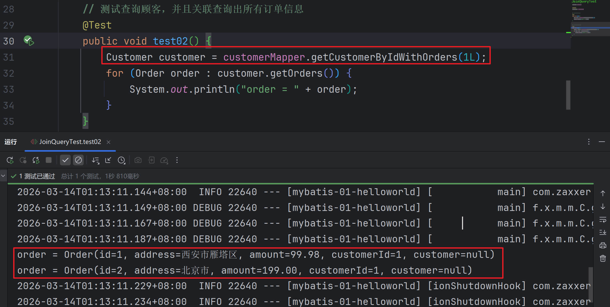

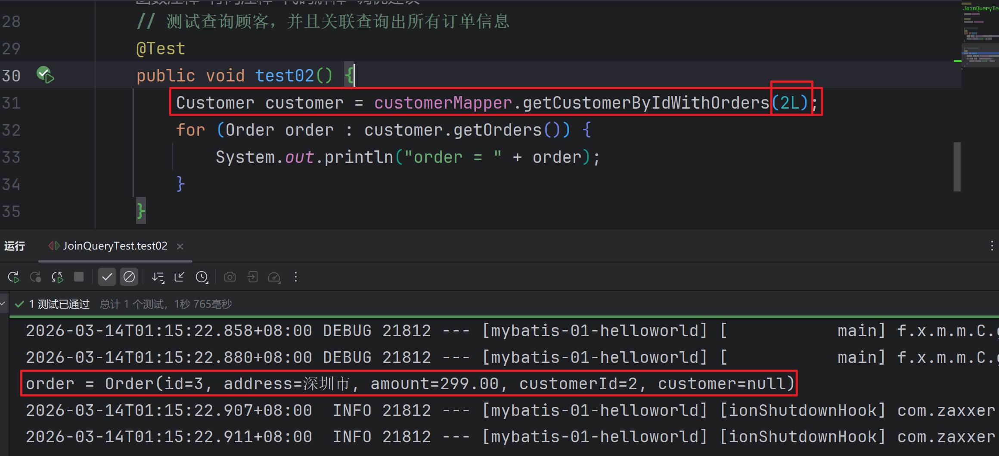


## 分步查询(了解)

::: tip 

**在 association 和 collection 的封装过程中，可以使用 select + column 指定分步查询逻辑**

+ **select：指定分步查询调用的方法**

+ **column：指定分步查询传递的参数**

**传递单个：直接写列名，表示将这列的值作为参数传递给下一个查询**

**传递多个：column="{prop1=col1,prop2=col2}"，下一个查询使用prop1、prop2取值**

:::

### 原生分步写法


+ **OrderCustomerStepMapper.java**

```java
package fun.xingji.mybatis.mapper;

import fun.xingji.mybatis.bean.Customer;
import fun.xingji.mybatis.bean.Order;
import org.apache.ibatis.annotations.Mapper;

import java.util.List;

@Mapper // 标记这是一个MyBatis的Mapper接口
public interface OrderCustomerStepMapper {

    // 需求:【分步查询】案例1：按照id查询客户 以及 他下的所有订单
    // 1. 按照id查询客户
    Customer getCustomerById(Long id);
    // 2. 按照客户id查询所有订单列表
    List<Order> getOrdersByCustomerId(Long cid);
    // 3.封装客户和订单
}
```


+ **OrderCustomerStepMapper.xml**

```xml
<?xml version="1.0" encoding="UTF-8" ?>
<!DOCTYPE mapper PUBLIC "-//mybatis.org//DTD Mapper 3.0//EN" "http://mybatis.org/dtd/mybatis-3-mapper.dtd" >
<mapper namespace="fun.xingji.mybatis.mapper.OrderCustomerStepMapper">

    <!-- 按照id查询客户 -->
    <select id="getCustomerById" resultType="fun.xingji.mybatis.bean.Customer">
        select *
        from t_customer
        where id = #{id}
    </select>

    <!-- 按照客户id查询所有订单列表 -->
    <select id="getOrdersByCustomerId" resultType="fun.xingji.mybatis.bean.Order">
        select *
        from t_order
        where customer_id = #{cid}
    </select>
</mapper>
```


+ **StepTest.java**

```java
package fun.xingji.mybatis;

import fun.xingji.mybatis.bean.Customer;
import fun.xingji.mybatis.bean.Order;
import fun.xingji.mybatis.mapper.OrderCustomerStepMapper;
import org.junit.jupiter.api.Test;
import org.springframework.beans.factory.annotation.Autowired;
import org.springframework.boot.test.context.SpringBootTest;

import java.util.List;

@SpringBootTest
public class StepTest {

    @Autowired
    OrderCustomerStepMapper orderCustomerStepMapper;

    // 原生分步，需要调用两次数据库，效率低
    @Test
    void testStep01() {
        // 1. 按照id查询客户
        Customer customer = orderCustomerStepMapper.getCustomerById(1L);

        // 2. 按照客户id查询所有订单列表
        List<Order> orders = orderCustomerStepMapper.getOrdersByCustomerId(customer.getId());

        // 3.封装客户和订单
        customer.setOrders(orders);

        System.out.println(customer);
    }
}
```


+ **测试:**

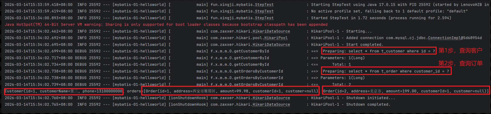


### collection - select 属性指定需要启动的下一次查询


+ **OrderCustomerStepMapper.java**

```java
package fun.xingji.mybatis.mapper;

import fun.xingji.mybatis.bean.Customer;
import fun.xingji.mybatis.bean.Order;
import org.apache.ibatis.annotations.Mapper;

import java.util.List;

@Mapper // 标记这是一个MyBatis的Mapper接口
public interface OrderCustomerStepMapper {

    // 需求:【分步查询】案例1：按照id查询客户 以及 他下的所有订单
    // 1. 按照id查询客户
    Customer getCustomerById(Long id);
    // 2. 按照客户id查询所有订单列表
    List<Order> getOrdersByCustomerId(Long cid);


    /**
     *
     * @param id 客户id
     * @return
     */
    //3、分步查询：自动做两步 = 查询客户 + 查询客户下的订单
    Customer getCustomerByIdAndOrdersStep(Long id);
}
```


+ **OrderCustomerStepMapper.xml**

::: tip 

```java
告诉MyBatis，封装 orders 属性的时候，是一个集合，但是这个集合需要调用另一个 方法 进行查询；select：来指定我们要调用的另一个方法
column：来指定我们要调用方法时，把哪一列的值作为传递的参数，交给这个方法
	1）、column="id"： 单传参：id传递给方法
	2）、column="{cid=id,name=customer_name}"：多传参（属性名=列名）；
		cid=id：cid是属性名，它是id列的值
		name=customer_name：name是属性名，它是customer_name列的值
```

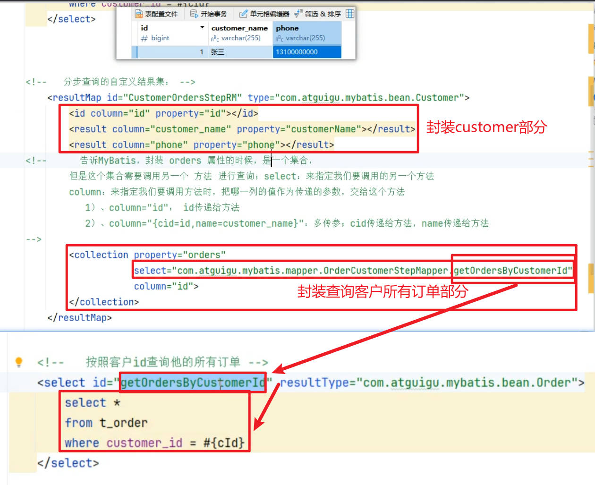

:::

```xml
<?xml version="1.0" encoding="UTF-8" ?>
<!DOCTYPE mapper PUBLIC "-//mybatis.org//DTD Mapper 3.0//EN" "http://mybatis.org/dtd/mybatis-3-mapper.dtd" >
<mapper namespace="fun.xingji.mybatis.mapper.OrderCustomerStepMapper">

    <!-- 按照id查询客户 -->
    <select id="getCustomerById" resultType="fun.xingji.mybatis.bean.Customer">
        select *
        from t_customer
        where id = #{id}
    </select>

    <!-- 按照客户id查询所有订单列表 -->
    <select id="getOrdersByCustomerId" resultType="fun.xingji.mybatis.bean.Order">
        select *
        from t_order
        where customer_id = #{cid}
    </select>


    <!-- 分步查询：自动做两步 = 查询客户 + 查询客户下的订单 -->
    <!--   分步查询的自定义结果集： -->
    <resultMap id="CustomerOrdersStepRM" type="fun.xingji.mybatis.bean.Customer">
        <id column="id" property="id"></id>
        <result column="customer_name" property="customerName"></result>
        <result column="customer_name" property="customerName"></result>
        <result column="phone" property="phone"></result>
        <!--    告诉MyBatis，封装 orders 属性的时候，是一个集合，
            但是这个集合需要调用另一个 方法 进行查询；select：来指定我们要调用的另一个方法
            column：来指定我们要调用方法时，把哪一列的值作为传递的参数，交给这个方法
           1）、column="id"： 单传参：id传递给方法
           2）、column="{cid=id,name=customer_name}"：多传参（属性名=列名）；
                cid=id：cid是属性名，它是id列的值
                name=customer_name：name是属性名，它是customer_name列的值
         -->
        <association property="orders" select="fun.xingji.mybatis.mapper.OrderCustomerStepMapper.getOrdersByCustomerId"
                     column="id">
        </association>
    </resultMap>

    <select id="getCustomerByIdAndOrdersStep" resultMap="CustomerOrdersStepRM">
        select *
        from t_customer
        where id = #{id}
    </select>
</mapper>
```


+ **StepTest.java**

```java
package fun.xingji.mybatis;

import fun.xingji.mybatis.bean.Customer;
import fun.xingji.mybatis.bean.Order;
import fun.xingji.mybatis.mapper.OrderCustomerStepMapper;
import org.junit.jupiter.api.Test;
import org.springframework.beans.factory.annotation.Autowired;
import org.springframework.boot.test.context.SpringBootTest;

import java.util.List;

@SpringBootTest
public class StepTest {

    @Autowired
    OrderCustomerStepMapper orderCustomerStepMapper;


    // 分步查询：自动做两步 = 查询客户 + 查询客户下的订单
    @Test
    void testStep02() {
        // 1. 按照id查询客户
        Customer customer = orderCustomerStepMapper.getCustomerByIdAndOrdersStep(1L);

        System.out.println(customer);
    }

    // 原生分步，需要调用两次数据库，效率低
    @Test
    void testStep01() {
        // 1. 按照id查询客户
        Customer customer = orderCustomerStepMapper.getCustomerById(1L);

        // 2. 按照客户id查询所有订单列表
        List<Order> orders = orderCustomerStepMapper.getOrdersByCustomerId(customer.getId());

        // 3.封装客户和订单
        customer.setOrders(orders);

        System.out.println(customer);
    }
}
```


+ **测试:**

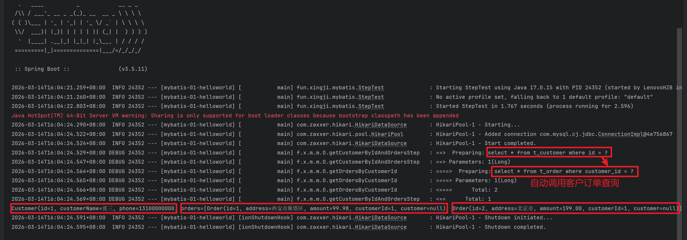


### association - select 属性指定需要启动的下一次查询


+ **OrderCustomerStepMapper.java**

```java
package fun.xingji.mybatis.mapper;

import fun.xingji.mybatis.bean.Customer;
import fun.xingji.mybatis.bean.Order;
import org.apache.ibatis.annotations.Mapper;

import java.util.List;

@Mapper // 标记这是一个MyBatis的Mapper接口
public interface OrderCustomerStepMapper {

    // 需求:【分步查询】案例1：按照id查询客户 以及 他下的所有订单
    // 1. 按照id查询客户
    Customer getCustomerById(Long id);
    // 2. 按照客户id查询所有订单列表
    List<Order> getOrdersByCustomerId(Long cid);


    /**
     *
     * @param id 客户id
     * @return
     */
    //3、分步查询：自动做两步 = 查询客户 + 查询客户下的订单
    Customer getCustomerByIdAndOrdersStep(Long id);


    /**
     *
     * @param id 订单id
     * @return
     */
    //4、分步查询：自动做两步 = 按照id查询订单 + 查询下单的客户
    Order getOrderByIdAndCustomerStep(Long id);
}
```


+ **OrderCustomerStepMapper.xml**

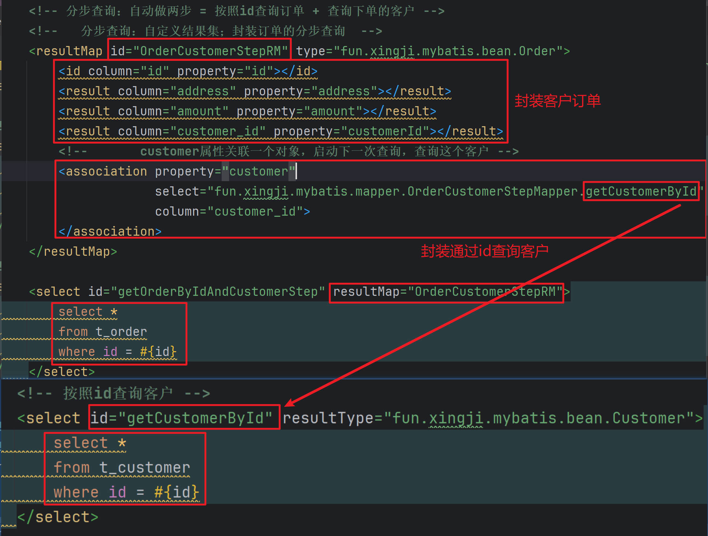

```xml
<?xml version="1.0" encoding="UTF-8" ?>
<!DOCTYPE mapper PUBLIC "-//mybatis.org//DTD Mapper 3.0//EN" "http://mybatis.org/dtd/mybatis-3-mapper.dtd" >
<mapper namespace="fun.xingji.mybatis.mapper.OrderCustomerStepMapper">

    <!-- 按照id查询客户 -->
    <select id="getCustomerById" resultType="fun.xingji.mybatis.bean.Customer">
        select *
        from t_customer
        where id = #{id}
    </select>

    <!-- 按照客户id查询所有订单列表 -->
    <select id="getOrdersByCustomerId" resultType="fun.xingji.mybatis.bean.Order">
        select *
        from t_order
        where customer_id = #{cid}
    </select>


    <!-- 分步查询：自动做两步 = 查询客户 + 查询客户下的订单 -->
    <!--   分步查询的自定义结果集： -->
    <resultMap id="CustomerOrdersStepRM" type="fun.xingji.mybatis.bean.Customer">
        <id column="id" property="id"></id>
        <result column="customer_name" property="customerName"></result>
        <result column="customer_name" property="customerName"></result>
        <result column="phone" property="phone"></result>
        <!--    告诉MyBatis，封装 orders 属性的时候，是一个集合，
            但是这个集合需要调用另一个 方法 进行查询；select：来指定我们要调用的另一个方法
            column：来指定我们要调用方法时，把哪一列的值作为传递的参数，交给这个方法
           1）、column="id"： 单传参：id传递给方法
           2）、column="{cid=id,name=customer_name}"：多传参（属性名=列名）；
                cid=id：cid是属性名，它是id列的值
                name=customer_name：name是属性名，它是customer_name列的值
         -->
        <association property="orders" select="fun.xingji.mybatis.mapper.OrderCustomerStepMapper.getOrdersByCustomerId"
                     column="id">
        </association>
    </resultMap>

    <select id="getCustomerByIdAndOrdersStep" resultMap="CustomerOrdersStepRM">
        select *
        from t_customer
        where id = #{id}
    </select>


    <!-- 分步查询：自动做两步 = 按照id查询订单 + 查询下单的客户 -->
    <!--   分步查询：自定义结果集；封装订单的分步查询  -->
    <resultMap id="OrderCustomerStepRM" type="fun.xingji.mybatis.bean.Order">
        <id column="id" property="id"></id>
        <result column="address" property="address"></result>
        <result column="amount" property="amount"></result>
        <result column="customer_id" property="customerId"></result>
        <!--       customer属性关联一个对象，启动下一次查询，查询这个客户 -->
        <association property="customer"
                     select="fun.xingji.mybatis.mapper.OrderCustomerStepMapper.getCustomerById"
                     column="customer_id">
        </association>
    </resultMap>

    <select id="getOrderByIdAndCustomerStep" resultMap="OrderCustomerStepRM">
        select *
        from t_order
        where id = #{id}
    </select>
</mapper>
```


+ **StepTest.java**

```java
package fun.xingji.mybatis;

import fun.xingji.mybatis.bean.Customer;
import fun.xingji.mybatis.bean.Order;
import fun.xingji.mybatis.mapper.OrderCustomerStepMapper;
import org.junit.jupiter.api.Test;
import org.springframework.beans.factory.annotation.Autowired;
import org.springframework.boot.test.context.SpringBootTest;

import java.util.List;

@SpringBootTest
public class StepTest {

    @Autowired
    OrderCustomerStepMapper orderCustomerStepMapper;


    // 分步查询：自动做两步 = 按照id查询订单 + 查询下单的客户
    @Test
    void testStep03() {
        // 1. 按照id查询订单
        Order order = orderCustomerStepMapper.getOrderByIdAndCustomerStep(2L);

        System.out.println(order);
    }


    // 分步查询：自动做两步 = 查询客户 + 查询客户下的订单
    @Test
    void testStep02() {
        // 1. 按照id查询客户
        Customer customer = orderCustomerStepMapper.getCustomerByIdAndOrdersStep(1L);

        System.out.println(customer);
    }

    // 原生分步，需要调用两次数据库，效率低
    @Test
    void testStep01() {
        // 1. 按照id查询客户
        Customer customer = orderCustomerStepMapper.getCustomerById(1L);

        // 2. 按照客户id查询所有订单列表
        List<Order> orders = orderCustomerStepMapper.getOrdersByCustomerId(customer.getId());

        // 3.封装客户和订单
        customer.setOrders(orders);

        System.out.println(customer);
    }
}
```


+ **测试:**

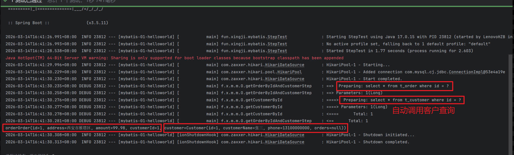


### 超级分步


+ **OrderCustomerStepMapper.java**

```java
package fun.xingji.mybatis.mapper;

import fun.xingji.mybatis.bean.Customer;
import fun.xingji.mybatis.bean.Order;
import org.apache.ibatis.annotations.Mapper;

import java.util.List;

@Mapper // 标记这是一个MyBatis的Mapper接口
public interface OrderCustomerStepMapper {

    // 需求:【分步查询】案例1：按照id查询客户 以及 他下的所有订单
    // 1. 按照id查询客户
    Customer getCustomerById(Long id);
    // 2. 按照客户id查询所有订单列表
    List<Order> getOrdersByCustomerId(Long cid);


    /**
     *  分步查询：自动做两步 = 查询客户 + 查询客户下的订单
     * @param id 客户id
     * @return
     */
    //3、分步查询：自动做两步 = 查询客户 + 查询客户下的订单
    Customer getCustomerByIdAndOrdersStep(Long id);


    /**
     *  分步查询：自动做两步 = 按照id查询订单 + 查询下单的客户
     * @param id 订单id
     * @return
     */
    //4、分步查询：自动做两步 = 按照id查询订单 + 查询下单的客户
    Order getOrderByIdAndCustomerStep(Long id);


    /**
     * 【超级分步】案例2：按照id查询订单 以及 下单的客户 以及 此客户的所有订单
     * @param id
     * @return
     */
    // 【超级分步】案例3：按照id查询订单 以及 下单的客户 以及 此客户的所有订单
    Order getOrderByIdAndCustomerAndOtherOrdersStep(Long id);
}
```


+ **OrderCustomerStepMapper.xml**

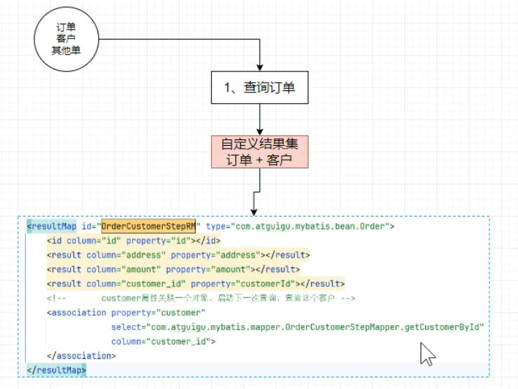

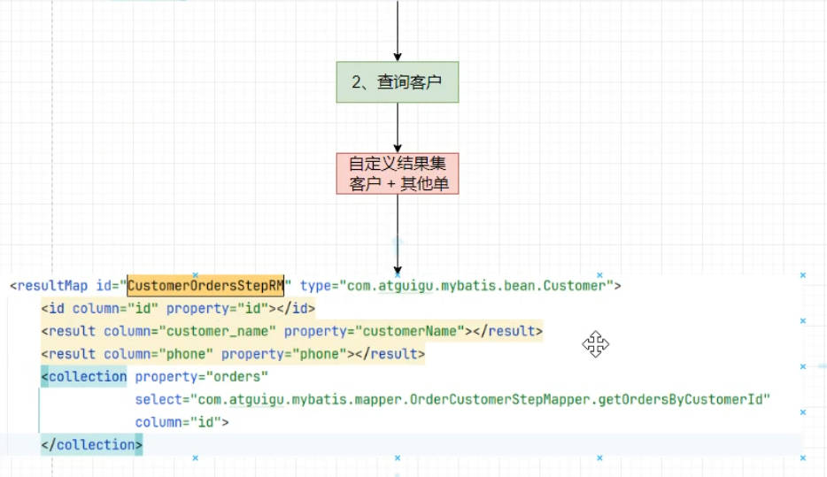

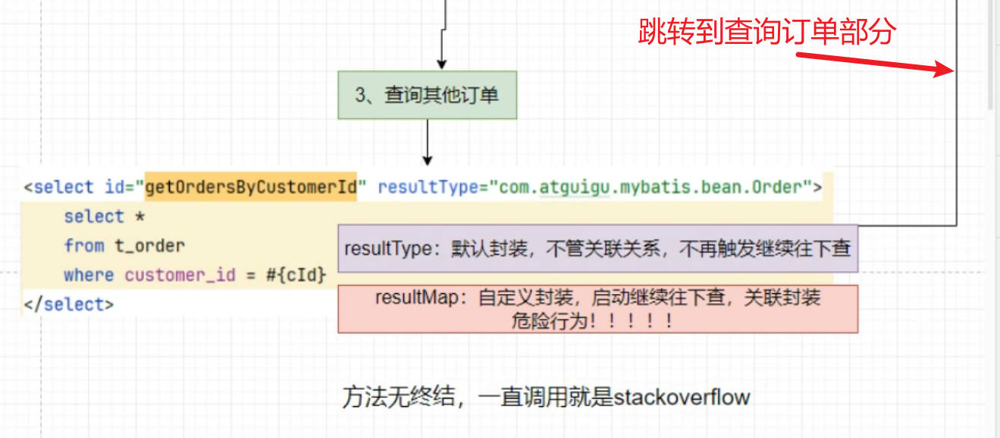

```xml
<?xml version="1.0" encoding="UTF-8" ?>
<!DOCTYPE mapper PUBLIC "-//mybatis.org//DTD Mapper 3.0//EN" "http://mybatis.org/dtd/mybatis-3-mapper.dtd" >
<mapper namespace="fun.xingji.mybatis.mapper.OrderCustomerStepMapper">

    <!-- 按照id查询客户 -->
    <select id="getCustomerById" resultMap="CustomerOrdersStepRM">
        select *
        from t_customer
        where id = #{id}
    </select>

    <!--   按照客户id查询他的所有订单  resultType="fun.xingji.mybatis.bean.Order" -->
    <select id="getOrdersByCustomerId" resultType="fun.xingji.mybatis.bean.Order">
        select *
        from t_order
        where customer_id = #{cid}
    </select>


    <!-- 分步查询：自动做两步 = 查询客户 + 查询客户下的订单 -->
    <!--   分步查询的自定义结果集： -->
    <resultMap id="CustomerOrdersStepRM" type="fun.xingji.mybatis.bean.Customer">
        <id column="id" property="id"></id>
        <result column="customer_name" property="customerName"></result>
        <result column="customer_name" property="customerName"></result>
        <result column="phone" property="phone"></result>
        <!--    告诉MyBatis，封装 orders 属性的时候，是一个集合，
            但是这个集合需要调用另一个 方法 进行查询；select：来指定我们要调用的另一个方法
            column：来指定我们要调用方法时，把哪一列的值作为传递的参数，交给这个方法
           1）、column="id"： 单传参：id传递给方法
           2）、column="{cid=id,name=customer_name}"：多传参（属性名=列名）；
                cid=id：cid是属性名，它是id列的值
                name=customer_name：name是属性名，它是customer_name列的值
         -->
        <association property="orders" select="fun.xingji.mybatis.mapper.OrderCustomerStepMapper.getOrdersByCustomerId"
                     column="id">
        </association>
    </resultMap>

    <select id="getCustomerByIdAndOrdersStep" resultMap="CustomerOrdersStepRM">
        select *
        from t_customer
        where id = #{id}
    </select>


    <!-- 分步查询：自动做两步 = 按照id查询订单 + 查询下单的客户 -->
    <!--   分步查询：自定义结果集；封装订单的分步查询  -->
    <resultMap id="OrderCustomerStepRM" type="fun.xingji.mybatis.bean.Order">
        <id column="id" property="id"></id>
        <result column="address" property="address"></result>
        <result column="amount" property="amount"></result>
        <result column="customer_id" property="customerId"></result>
        <!--       customer属性关联一个对象，启动下一次查询，查询这个客户 -->
        <association property="customer"
                     select="fun.xingji.mybatis.mapper.OrderCustomerStepMapper.getCustomerById"
                     column="customer_id">
        </association>
    </resultMap>

    <select id="getOrderByIdAndCustomerStep" resultMap="OrderCustomerStepRM">
        select *
        from t_order
        where id = #{id}
    </select>

    <!-- 【超级分步】案例3：按照id查询订单 以及 下单的客户 以及 此客户的所有订单 -->
    <!--   查询订单 + 下单的客户 + 客户的其他所有订单 -->
    <select id="getOrderByIdAndCustomerAndOtherOrdersStep" resultMap="OrderCustomerStepRM">
        select *
        from t_order
        where id = #{id}
    </select>

</mapper>
```


+ **StepTest.java**

```java
package fun.xingji.mybatis;

import fun.xingji.mybatis.bean.Customer;
import fun.xingji.mybatis.bean.Order;
import fun.xingji.mybatis.mapper.OrderCustomerStepMapper;
import fun.xingji.mybatis.mapper.OrderMapper;
import org.junit.jupiter.api.Test;
import org.springframework.beans.factory.annotation.Autowired;
import org.springframework.boot.test.context.SpringBootTest;

import java.util.List;

@SpringBootTest
public class StepTest {

    @Autowired
    OrderCustomerStepMapper orderCustomerStepMapper;

    @Autowired
    OrderMapper orderMapper;


    @Test
    void testStep04() {
        // 1. 按照id查询订单
        Order order = orderCustomerStepMapper.getOrderByIdAndCustomerAndOtherOrdersStep(1L);

        System.out.println("order" + order);
    }

    // 分步查询：自动做两步 = 按照id查询订单 + 查询下单的客户
    @Test
    void testStep03() {
        // 1. 按照id查询订单
        Order order = orderCustomerStepMapper.getOrderByIdAndCustomerStep(1L);

        System.out.println("order" + order);
    }


    // 分步查询：自动做两步 = 查询客户 + 查询客户下的订单
    @Test
    void testStep02() {
        // 1. 按照id查询客户
        Customer customer = orderCustomerStepMapper.getCustomerByIdAndOrdersStep(1L);

        System.out.println(customer);
    }

    // 原生分步，需要调用两次数据库，效率低
    @Test
    void testStep01() {
        // 1. 按照id查询客户
        Customer customer = orderCustomerStepMapper.getCustomerById(1L);

        // 2. 按照客户id查询所有订单列表
        List<Order> orders = orderCustomerStepMapper.getOrdersByCustomerId(customer.getId());

        // 3.封装客户和订单
        customer.setOrders(orders);

        System.out.println(customer);
    }
}
```


+ **测试:**

```java
orderOrder(id=1, address=西安市雁塔区, amount=99.98, customerId=1, 
           
customer=Customer(id=1, customerName=张三, phone=13100000000, 
 
orders=[
Order(id=1, address=西安市雁塔区, amount=99.98, customerId=1, customer=null), 
    
Order(id=2, address=北京市, amount=199.00, customerId=1, customer=null)]))
```

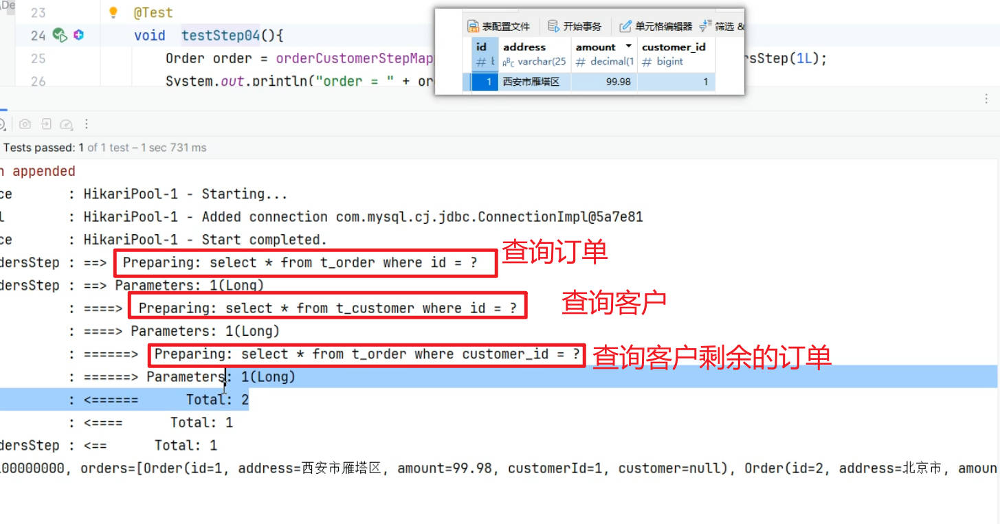

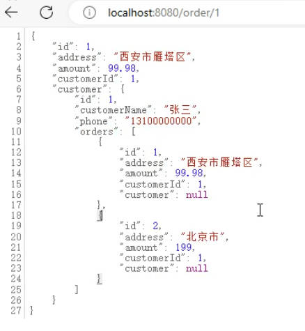


## 延迟加载

::: tip 

**分步查询 有时候并`不需要立即运行`，我们希望在`用到的时候再去查询`，可以`开启延迟加载`的功能**

全局配置：

```properties
# 开启懒加载（延迟加载）
mybatis.configuration.lazy-loading-enabled=true
mybatis.configuration.aggressive-lazy-loading=false
```

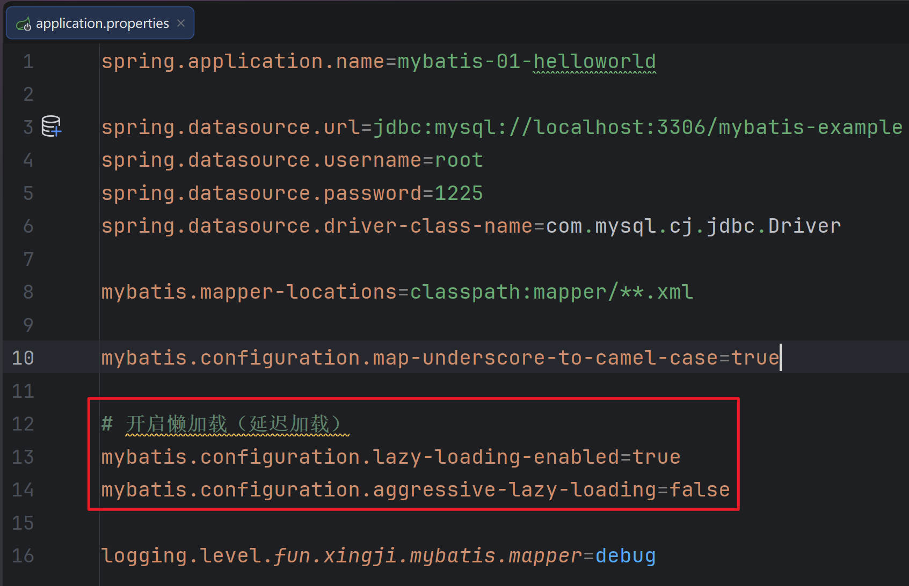

:::

+ **StepTest.java**

```java
package fun.xingji.mybatis;

import fun.xingji.mybatis.bean.Customer;
import fun.xingji.mybatis.bean.Order;
import fun.xingji.mybatis.mapper.OrderCustomerStepMapper;
import org.junit.jupiter.api.Test;
import org.springframework.beans.factory.annotation.Autowired;
import org.springframework.boot.test.context.SpringBootTest;

import java.util.List;

@SpringBootTest
public class StepTest {

    @Autowired
    OrderCustomerStepMapper orderCustomerStepMapper;

    @Test
    void test05() throws InterruptedException {
        // 1. 按照id查询订单
        Order order = orderCustomerStepMapper.getOrderByIdAndCustomerStep(1L);
        // System.out.println("order = " + order);
        System.out.println("================================");
        System.out.println("order = " + order.getAmount());
        System.out.println("================================");

        Thread.sleep(3000);
        //用到客户信息了，才会继续发送分步查询sql
        Customer customer = order.getCustomer();
        System.out.println("customer = " + customer.getCustomerName());
    }
}
```

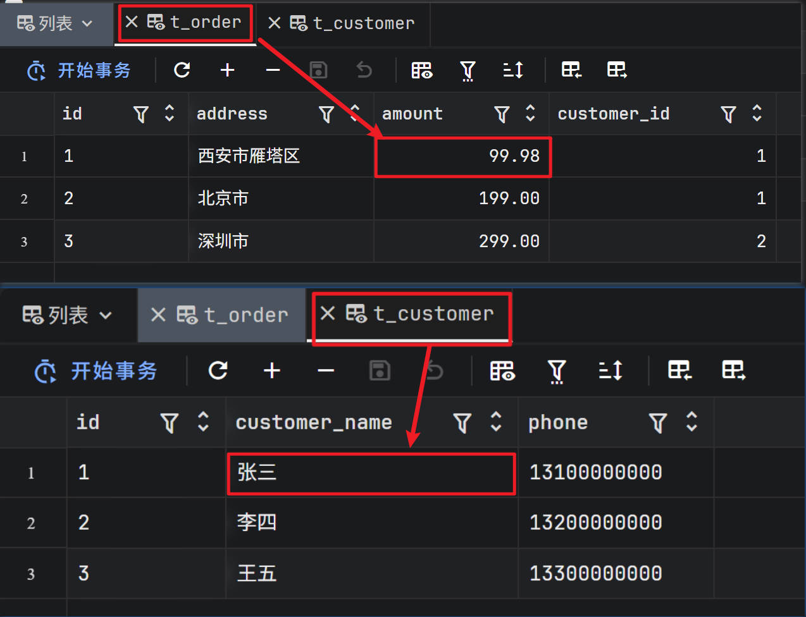

```java
==>  Preparing: select * from t_order where id = ?
==> Parameters: 1(Long)
<==      Total: 1

================================
order = 99.98
================================
    
    
==>  Preparing: select * from t_customer where id = ?
==> Parameters: 1(Long)
<==      Total: 1
    
customer = 张三
```
