## 什么是CRUD

::: tip

+ **C: Create增**

+ **R: Retrieve查（检索）**

+ **U: Update改**

+ **D: Delete删**

:::


## 完成CRUD

+ 准备工作
    - 创建module（Maven的普通Java模块）：mybatis-002-crud
    - pom.xml
        * 打包方式jar
        * 依赖：
            + mybatis依赖
            + mysql驱动依赖
            + junit依赖
            + logback依赖
    - mybatis-config.xml放在类的根路径下
    - CarMapper.xml放在类的根路径下
    - logback.xml放在类的根路径下
    - 提供fun.xingji.mybatis.utils.SqlSessionUtil工具类
    - 创建测试用例：fun.xingji.mybatis.CarMapperTest


### insert（Create）

分析以下SQL映射文件中SQL语句存在的问题

```xml
<?xml version="1.0" encoding="UTF-8" ?>
<!DOCTYPE mapper
        PUBLIC "-//mybatis.org//DTD Mapper 3.0//EN"
        "http://mybatis.org/dtd/mybatis-3-mapper.dtd">
<!--namespace先随意写一个-->
<mapper namespace="car">
    <!--insert sql：保存一个汽车信息-->
    <insert id="insertCar">
        insert into t_car(id,car_num,brand,guide_price,produce_time,car_type)
        values(null,'1003','丰田霸道',30.0,'2000-10-11','燃油车')
    </insert>
</mapper>
```

存在的问题是：SQL语句中的值不应该写死，值应该是用户提供的。之前的JDBC代码是这样写的：

```java
// JDBC中使用 ? 作为占位符。那么MyBatis中会使用什么作为占位符呢？
String sql = "insert into t_car(id,car_num,brand,guide_price,produce_time,car_type)values(null,?,?,?,?,?)"
// ......
// 给 ? 传值。那么MyBatis中应该怎么传值呢？
ps.setString(1,"1003");
ps.setString(2,"丰田霸道");
ps.setDouble(3,30.0);
ps.setString(4,"2000-10-11");
ps.setString(5,"燃油车");
```

在MyBatis中可以这样做：

::: tip

+ **在Java程序中，将数据放到Map集合中**

+ **在sql语句中使用 #{map集合的key} 来完成传值，#{} 等同于JDBC中的 ? ，#{}就是占位符**

:::

Java程序这样写：

```java
package fun.xingji.mybatis.test;

import fun.xingji.mybatis.utils.SqlSessionUtil;
import org.apache.ibatis.session.SqlSession;
import org.junit.Test;

import java.util.HashMap;
import java.util.Map;

public class CarMapperTest {

    @Test
    public void testInsertCar(){
        // 获取SqlSession对象
        SqlSession sqlSession = SqlSessionUtil.openSession();

        // 前端传过来
        // 这个对象我们先使用Map集合进行数据的封装
        Map<String, Object> map = new HashMap<>();
        map.put("k1", "1111");
        map.put("k2", "比亚迪汉");
        map.put("k3", 10.0);
        map.put("k4", "2020-11-11");
        map.put("k5", "电车");

        // 执行SQL语句（使用map集合给sql语句传递数据）
        // insert方法的参数：
        // 第一个参数：sqlId，从CarMapper.xml文件中复制。
        // 第二个参数：封装数据的对象。
        int count = sqlSession.insert("insertCar",map);
        System.out.println("插入了几条记录：" + count);

        sqlSession.commit();
        sqlSession.close();
    }
}
```

SQL语句这样写：

```xml
<?xml version="1.0" encoding="UTF-8" ?>
<!DOCTYPE mapper
        PUBLIC "-//mybatis.org//DTD Mapper 3.0//EN"
        "http://mybatis.org/dtd/mybatis-3-mapper.dtd">
<!--namespace先随意写一个-->
<mapper namespace="car">
    <!--insert sql：保存一个汽车信息-->
    <insert id="insertCar">
        insert into t_car(id,car_num,brand,guide_price,produce_time,car_type) values(null,#{k1},#{k2},#{k3},#{k4},#{k5})
    </insert>
</mapper>
```

> **`#{} `的里面必须填写`map集合的key`，`不能随便写`。**运行测试程序，查看数据库：

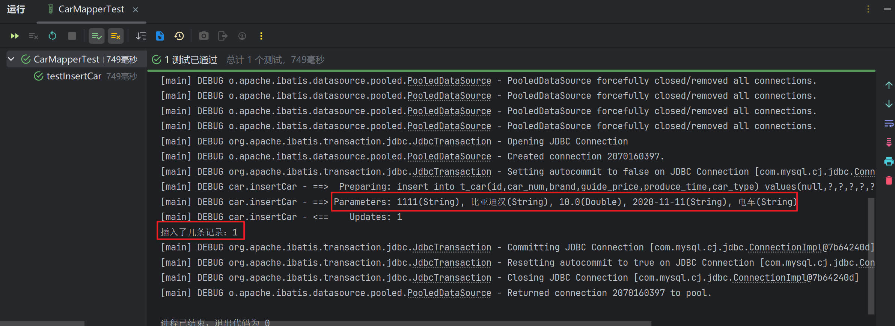

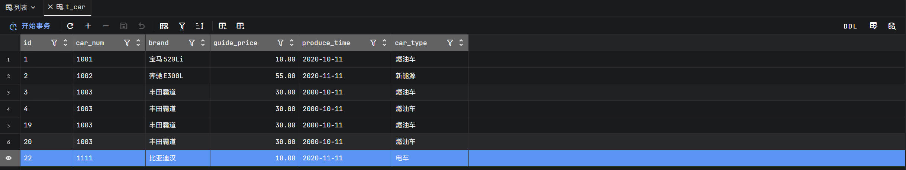


::: warning

> **如果`#{}里写的是map集合中不存在的key`会有什么问题？**

```xml
<?xml version="1.0" encoding="UTF-8" ?>
<!DOCTYPE mapper
        PUBLIC "-//mybatis.org//DTD Mapper 3.0//EN"
        "http://mybatis.org/dtd/mybatis-3-mapper.dtd">
<!--namespace先随意写一个-->
<mapper namespace="car">
    <!--insert sql：保存一个汽车信息-->
    <insert id="insertCar">
        insert into t_car(id,car_num,brand,guide_price,produce_time,car_type) values(null,#{k},#{k2},#{k3},#{k4},#{k5})
    </insert>
</mapper>
```

运行程序：

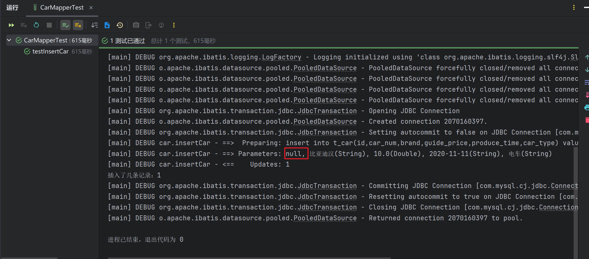

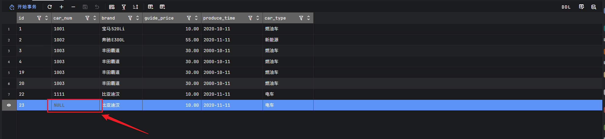

> **通过测试，看到程序并没有报错。正常执行。不过 #{k} 的写法导致`无法获取到map集合中的数据`，最终导致`数据库表car_num插入了NULL`。**

:::


::: tip


> **在以上sql语句中，可以看到`#{k1} #{k2} #{k3} #{k4} #{k5}`的`可读性太差`，为了增强可读性，我们可以将Java程序做如下修改：**

```java
Map<String, Object> map = new HashMap<>();
// 让key的可读性增强
map.put("carNum", "1111");
map.put("brand", "比亚迪汉2");
map.put("guidePrice", 10.0);
map.put("produceTime", "2020-11-11");
map.put("carType", "电车");
```

SQL语句做如下修改，这样可以增强程序的可读性：

```xml
<?xml version="1.0" encoding="UTF-8" ?>
<!DOCTYPE mapper
        PUBLIC "-//mybatis.org//DTD Mapper 3.0//EN"
        "http://mybatis.org/dtd/mybatis-3-mapper.dtd">
<!--namespace先随意写一个-->
<mapper namespace="car">
    <!--insert sql：保存一个汽车信息-->
    <insert id="insertCar">
    <!--insert into t_car(id,car_num,brand,guide_price,produce_time,car_type) values(null,#{k1},#{k2},#{k3},#{k4},#{k5})-->
        
        insert into t_car(id,car_num,brand,guide_price,produce_time,car_type) values(null,#{carNum},#{brand},#{guidePrice},#{produceTime},#{carType})
    </insert>
</mapper>
```

运行程序，查看数据库表：

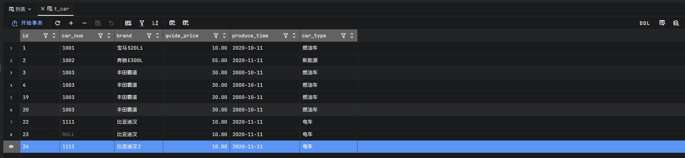

:::


::: tip

> **使用`Map集合可以传参`，那使用**pojo**（简单普通的java对象）可以完成传参吗？测试一下：**

+ 第一步：定义一个pojo类Car，提供相关属性。

```java
package fun.xingji.mybatis.pojo;

/**
 * 封装汽车相关信息的pojo类。普通的java类
 */
public class Car {
    // 数据库表当中的字段应该和pojo类的属性一一对应。
    // 建议使用包装类，这样可以防止null的问题。
    private Long id;
    private String carNum;
    private String brand;
    private Double guidePrice;
    private String produceTime;
    private String carType;

    @Override
    public String toString() {
        return "Car{" +
                "id=" + id +
                ", carNum='" + carNum + '\'' +
                ", brand='" + brand + '\'' +
                ", guidePrice=" + guidePrice +
                ", produceTime='" + produceTime + '\'' +
                ", carType='" + carType + '\'' +
                '}';
    }

    /*有参构成方法*/
    public Car(Long id, String carNum, String brand, Double guidePrice, String produceTime, String carType) {
        this.id = id;
        this.carNum = carNum;
        this.brand = brand;
        this.guidePrice = guidePrice;
        this.produceTime = produceTime;
        this.carType = carType;
    }

    /*无参构造方法*/
    public Car() {
    }

    public Long getId() {
        return id;
    }

    public void setId(Long id) {
        this.id = id;
    }

    public String getCarNum() {
        return carNum;
    }

    /*public String getXyz() {
        return carNum;
    }*/

    public void setCarNum(String carNum) {
        this.carNum = carNum;
    }

    public String getBrand() {
        return brand;
    }

    public void setBrand(String brand) {
        this.brand = brand;
    }

    public Double getGuidePrice() {
        return guidePrice;
    }

    public void setGuidePrice(Double guidePrice) {
        this.guidePrice = guidePrice;
    }

    public String getProduceTime() {
        return produceTime;
    }

    public void setProduceTime(String produceTime) {
        this.produceTime = produceTime;
    }

    public String getCarType() {
        return carType;
    }

    public void setCarType(String carType) {
        this.carType = carType;
    }
}
```

+ 第二步：Java程序

```java
@Test
public void testInsertCarByPOJO(){
        // 获取SqlSession对象
        SqlSession sqlSession = SqlSessionUtil.openSession();

        // 创建POJO，封装数据
        Car car = new Car();

        car.setId(null);
        car.setCarNum("3333");
        car.setBrand("比亚迪秦");
        car.setGuidePrice(30.0);
        car.setProduceTime("2020-11-11");
        car.setCarType("新能源");
    
    /*合并以上两个步骤
    Car car = new Car(null, "3333", "比亚迪秦", 30.0, "2020-11-11", "新能源");
    */

        // 执行sql
        int count =  sqlSession.insert("insertCar",car); // ORM
        System.out.println("插入了几条记录" + count);

        sqlSession.commit();
        sqlSession.close();
}
```

+ 第三步：SQL语句

```xml
<insert id="insertCar">
    <!--#{} 里写的是POJO的属性名-->
    insert into t_car(id,car_num,brand,guide_price,produce_time,car_type)
    values(null,#{carNum},#{brand},#{guidePrice},#{produceTime},#{carType})
</insert>
```

+ 运行程序，查看数据库表：

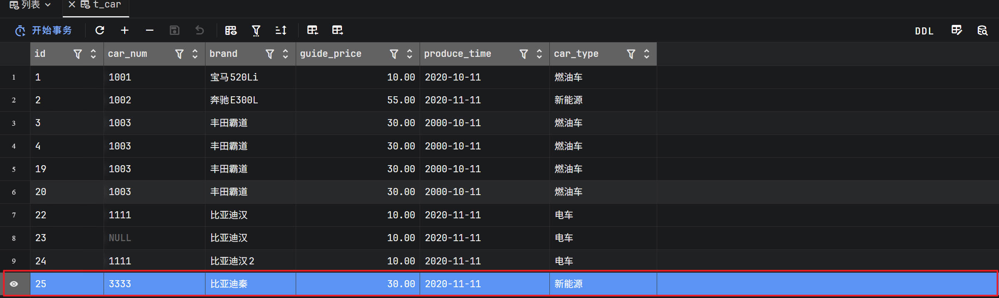

:::

::: warning

> **#{} 里写的是POJO的属性名，如果`写成其他的`会有问题吗？**

```xml
<insert id="insertCarByPOJO">
  insert into t_car(car_num,brand,guide_price,produce_time,car_type) values(#{xyz},#{brand},#{guidePrice},#{produceTime},#{carType})
</insert>
```

运行程序，出现了以下异常：

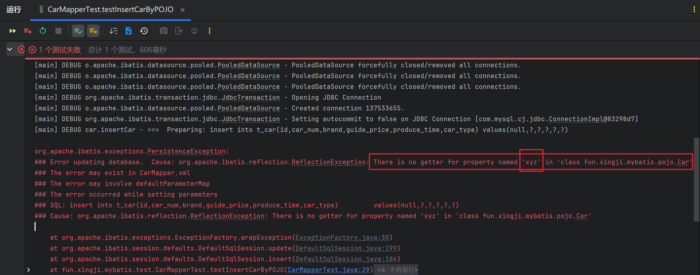

> **错误信息中描述：在Car类中`没有找到a属性的getter方法`。**

修改POJO类Car的代码，**只将getCarNum()方法名修改为getXyz()，其他代码不变**，如下：

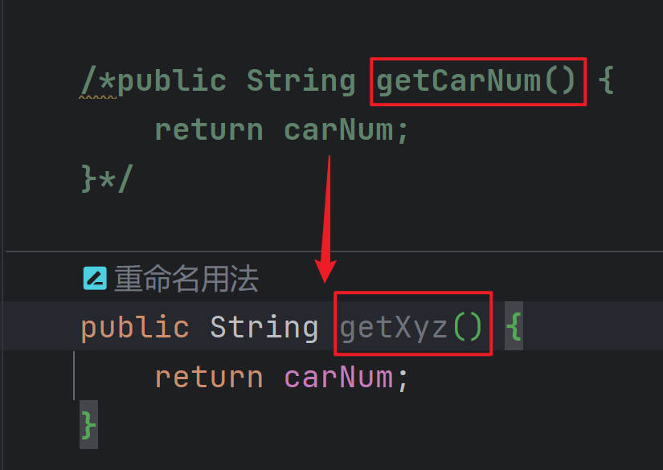

> **再运行程序，查看数据库表中数据：**

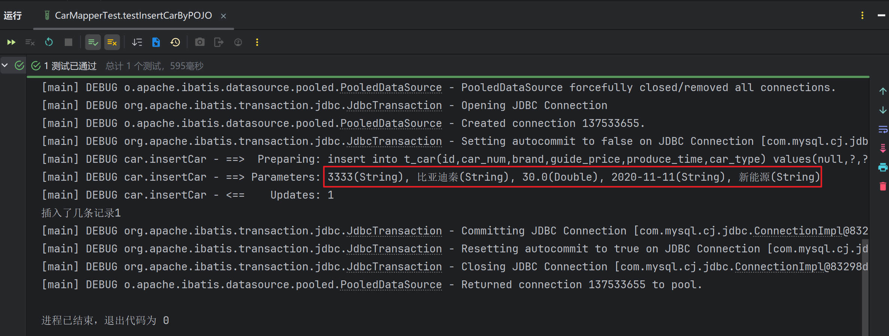

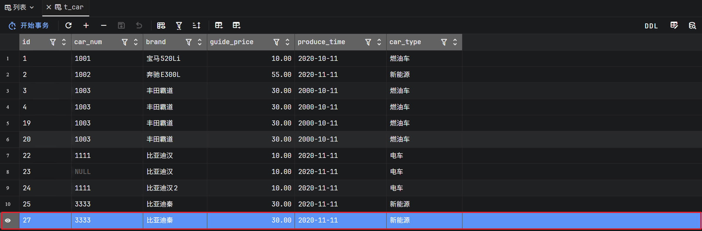

:::


::: tip

> **经过测试得出结论：**

+ **如果`采用map集合传参`，`#{} 里`写的是`map集合的key`，如果`key不存在不会报错`，数据库表中会`插入NULL`。**

+ **如果`采用POJO传参`，`#{} `里写的是`get方法的方法名去掉get之后将剩下的单词首字母变小写（例如：getAge对应的是#{age}`，`getUserName对应的是#{userName}）`，如果这样的get方法`不存在会报错`。**

> **注意：其实传参数的时候有一个属性parameterType，这个属性用来指定传参的数据类型，不过这个属性是可以省略的**

```xml
<insert id="insertCar" parameterType="java.util.Map">
  insert into t_car(car_num,brand,guide_price,produce_time,car_type) values(#{carNum},#{brand},#{guidePrice},#{produceTime},#{carType})
</insert>

<insert id="insertCarByPOJO" parameterType="fun.xingji.mybatis.pojo.Car">
  insert into t_car(car_num,brand,guide_price,produce_time,car_type) values(#{carNum},#{brand},#{guidePrice},#{produceTime},#{carType})
</insert>
```

:::


### delete（Delete）

> **需求：根据`id进行删除`。**

SQL语句这样写：

```xml
<delete id="deleteById">
     delete from t_car where id = #{id}
</delete>
```

Java程序这样写：

```java
@Test
public void testDeleteById() {
      // 获取SqlSession对象
      SqlSession sqlSession = SqlSessionUtil.openSession();

      // 执行SQL语句
      int count = sqlSession.delete("deleteById",23);  
      System.out.println("删除了几条记录" + count);

      sqlSession.commit();
      sqlSession.close();
}
```

运行结果：

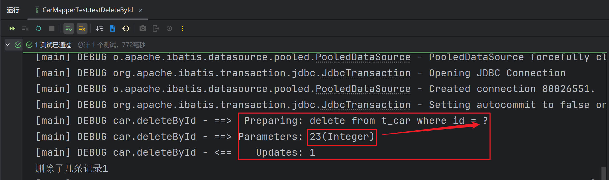

> **注意：当占位符只有一个的时候，${} 里面的内容可以随便写。**


### update（Update）

> **需求：修改id=3的Car信息，car_num为9999，brand为凯美瑞，guide_price为30.3，produce_time为1999-11-10，car_type为燃油车**

修改前：


SQL语句如下：

```xml
<update id="updateById">
        update t_car set
            car_num=#{carNum},
            brand=#{brand},
            guide_price=#{guidePrice},
            produce_time=#{produceTime},
            car_type=#{carType}
        where
            id = #{id}
</update>
```

Java代码如下：

```java
@Test
public void updateById() {
      // 获取SqlSession对象
      SqlSession sqlSession = SqlSessionUtil.openSession();

      // 准备数据
      Car car = new Car(3L, "9999", "凯美瑞", 30.3, "1999-11-10", "燃油车");

      // 执行SQL语句
      int count = sqlSession.update("updateById", car);
      System.out.println("更新了几条记录" + count);

      sqlSession.commit();
      sqlSession.close();
}
```

运行结果：


> **当然了，如果使用**map**传数据也是可以的。**


### select（Retrieve）

select语句和其它语句不同的是：查询会有一个结果集。来看mybatis是怎么处理结果集的！！！


#### 查询一条数据

需求：查询id为1的Car信息

SQL语句如下：

```xml
<select id="selectCarById">
  select * from t_car where id = #{id}
</select>
```

Java程序如下：

```java
@Test
public void testSelectCarById(){
    // 获取SqlSession对象
    SqlSession sqlSession = SqlSessionUtil.openSession();
    // 执行SQL语句
    Object car = sqlSession.selectOne("selectCarById", 1);
    System.out.println(car);
}
```

运行结果如下：

```java
### Error querying database.  Cause: org.apache.ibatis.executor.ExecutorException: 
    A query was run and no Result Maps were found for the Mapped Statement 'car.selectCarById'.  【翻译】：对于一个查询语句来说，没有找到查询的结果映射。
    It's likely that neither a Result Type nor a Result Map was specified.						 【翻译】：很可能既没有指定结果类型，也没有指定结果映射。
```

以上的异常大致的意思是：对于一个查询语句来说，你需要指定它的“结果类型”或者“结果映射”。

所以说，你想让mybatis查询之后返回一个Java对象的话，至少你要告诉mybatis返回一个什么类型的Java对象，可以在`<select>`标签中添加resultType属性，用来指定查询要转换的类型：

```xml
<select id="selectCarById" resultType="com.powernode.mybatis.pojo.Car">
  select * from t_car where id = #{id}
</select>
```

运行结果：


运行后之前的异常不再出现了，这说明添加了resultType属性之后，解决了之前的异常，可以看出resultType是不能省略的。

仔细观察控制台的日志信息，不难看出，结果查询出了一条。并且每个字段都查询到值了：Row: 1, 100, 宝马520Li, 41.00, 2022-09-01, 燃油车

但是奇怪的是返回的Car对象，只有id和brand两个属性有值，其它属性的值都是null，这是为什么呢？我们来观察一下查询结果列名和Car类的属性名是否能一一对应：

查询结果集的列名：id, car_num, brand, guide_price, produce_time, car_type

Car类的属性名：id, carNum, brand, guidePrice, produceTime, carType

通过观察发现：只有id和brand是一致的，其他字段名和属性名对应不上，这是不是导致null的原因呢？我们尝试在sql语句中使用as关键字来给查询结果列名起别名试试：

```xml
<select id="selectCarById" resultType="com.powernode.mybatis.pojo.Car">
  select 
    id, car_num as carNum, brand, guide_price as guidePrice, produce_time as produceTime, car_type as carType 
  from 
    t_car 
  where 
    id = #{id}
</select>
```

运行结果如下：


通过测试得知，如果当查询结果的字段名和java类的属性名对应不上的话，可以采用as关键字起别名，**当然还有其它解决方案，我们后面再看**。


#### 查询多条数据

需求：查询所有的Car信息。

SQL语句如下：

```xml
<!--虽然结果是List集合，但是resultType属性需要指定的是List集合中元素的类型。-->
<select id="selectCarAll" resultType="com.powernode.mybatis.pojo.Car">
  <!--记得使用as起别名，让查询结果的字段名和java类的属性名对应上。-->
  select
    id, car_num as carNum, brand, guide_price as guidePrice, produce_time as produceTime, car_type as carType
  from
    t_car
</select>
```

Java代码如下：

```java
@Test
public void testSelectCarAll(){
    // 获取SqlSession对象
    SqlSession sqlSession = SqlSessionUtil.openSession();
    // 执行SQL语句
    List<Object> cars = sqlSession.selectList("selectCarAll");
    // 输出结果
    cars.forEach(car -> System.out.println(car));
}
```

运行结果如下：


## SQL Mapper的namespace

在SQL Mapper配置文件中`<mapper>`标签的namespace属性可以翻译为命名空间，这个命名空间主要是为了防止sqlId冲突的。

创建CarMapper2.xml文件，代码如下：

```xml
<?xml version="1.0" encoding="UTF-8" ?>
<!DOCTYPE mapper
        PUBLIC "-//mybatis.org//DTD Mapper 3.0//EN"
        "http://mybatis.org/dtd/mybatis-3-mapper.dtd">

<mapper namespace="car2">
    <select id="selectCarAll" resultType="com.powernode.mybatis.pojo.Car">
        select
            id, car_num as carNum, brand, guide_price as guidePrice, produce_time as produceTime, car_type as carType
        from
            t_car
    </select>
</mapper>
```

不难看出，CarMapper.xml和CarMapper2.xml文件中都有 id="selectCarAll"

将CarMapper2.xml配置到mybatis-config.xml文件中。

```xml
<mappers>
  <mapper resource="CarMapper.xml"/>
  <mapper resource="CarMapper2.xml"/>
</mappers>
```

编写Java代码如下：

```java
@Test
public void testNamespace(){
    // 获取SqlSession对象
    SqlSession sqlSession = SqlSessionUtil.openSession();
    // 执行SQL语句
    List<Object> cars = sqlSession.selectList("selectCarAll");
    // 输出结果
    cars.forEach(car -> System.out.println(car));
}
```

运行结果如下：

```plain
org.apache.ibatis.exceptions.PersistenceException: 
### Error querying database.  Cause: java.lang.IllegalArgumentException: 
  selectCarAll is ambiguous in Mapped Statements collection (try using the full name including the namespace, or rename one of the entries) 
  【翻译】selectCarAll在Mapped Statements集合中不明确（请尝试使用包含名称空间的全名，或重命名其中一个条目）
  【大致意思是】selectCarAll重名了，你要么在selectCarAll前添加一个名称空间，要有你改个其它名字。
```

Java代码修改如下：

```java
@Test
public void testNamespace(){
    // 获取SqlSession对象
    SqlSession sqlSession = SqlSessionUtil.openSession();
    // 执行SQL语句
    //List<Object> cars = sqlSession.selectList("car.selectCarAll");
    List<Object> cars = sqlSession.selectList("car2.selectCarAll");
    // 输出结果
    cars.forEach(car -> System.out.println(car));
}
```

运行结果如下：

