## 一、目标

> **生产者`发送消息`，消费者`接收消息`，用最简单的方式实现**

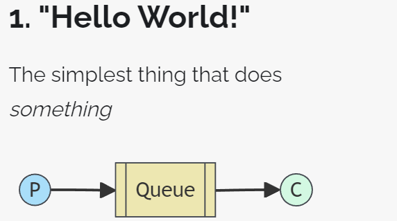

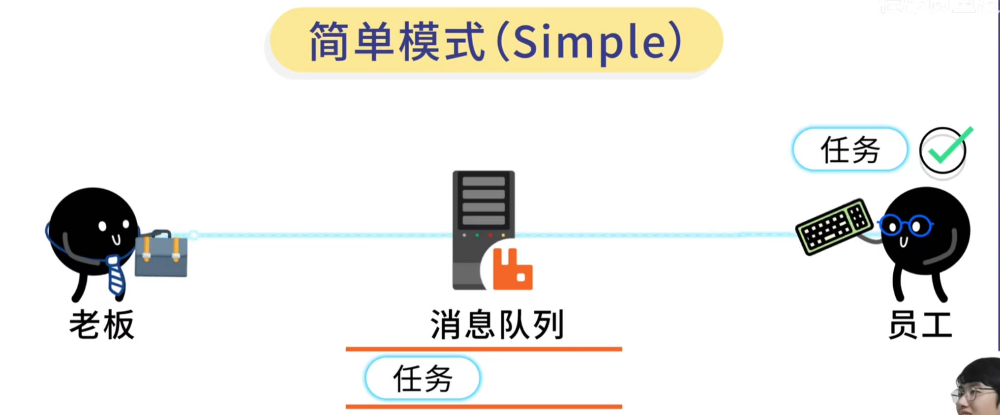


## 二、创建队列


队列名称：xingji.queue.simple

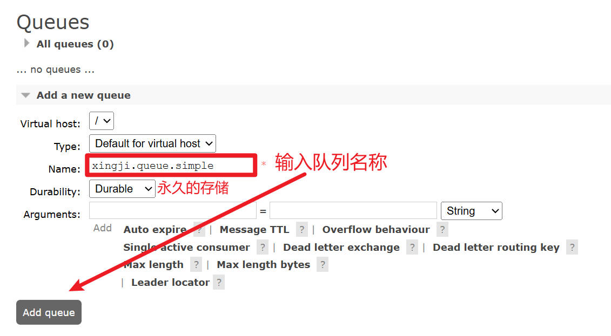

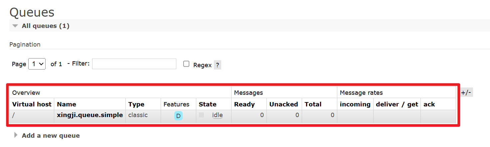


## 三、Java 客户端：整合 SpringBoot

### 1、生产者端工程

#### ①创建module


#### ②配置POM

```xml
<parent>
    <groupId>org.springframework.boot</groupId>
    <artifactId>spring-boot-starter-parent</artifactId>
    <version>3.1.5</version>
</parent>

<dependencies>
    <dependency>
        <groupId>org.springframework.boot</groupId>
        <artifactId>spring-boot-starter-amqp</artifactId>
    </dependency>
    <dependency>
        <groupId>org.springframework.boot</groupId>
        <artifactId>spring-boot-starter-test</artifactId>
    </dependency>
</dependencies>
```


#### ③YAML

```yaml
spring:
  rabbitmq:
    host: localhost
    port: 5672 # 基于AMQP协议
    username: guest # 默认用户名
    password: 123456 # 默认密码
    virtual-host: / # 默认虚拟主机,用于管理交换机和队列，以及之间的绑定关系
```


#### ④主启动类

```java
package fun.xingji.mq;

import org.springframework.boot.SpringApplication;
import org.springframework.boot.autoconfigure.SpringBootApplication;

@SpringBootApplication
public class RabbitMQProducerMainType {
    public static void main(String[] args) {
        // 启动SpringBoot应用
        SpringApplication.run(RabbitMQProducerMainType.class, args);
    }
}
```


#### ⑤测试程序

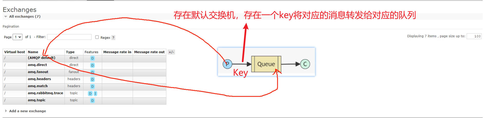

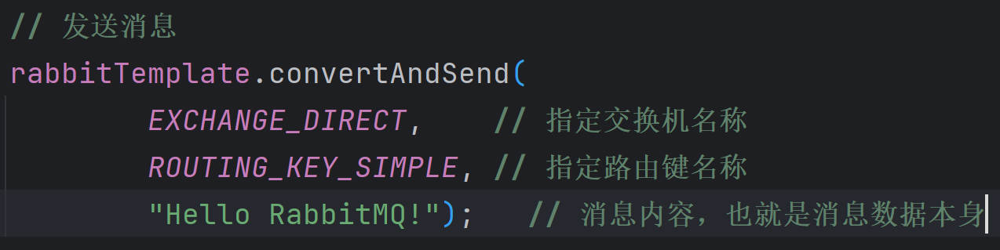

```java
package fun.xingji.mq.test;

import org.junit.jupiter.api.Test;
import org.springframework.amqp.rabbit.core.RabbitTemplate;
import org.springframework.beans.factory.annotation.Autowired;
import org.springframework.boot.test.context.SpringBootTest;

@SpringBootTest
public class RabbbitMQTest {

    // 在简单模式下，默认交换机：名称是空串
    public static final String EXCHANGE_DIRECT = "";

    // 路由key:在简单消息模式下，路由key是队列名称。通过默认交换机进行转发消息的。
    public static final String ROUTING_KEY_SIMPLE = "xingji.queue.simple";

    // 注入 RabbitTemplate 执行
    @Autowired
    RabbitTemplate rabbitTemplate; // SpringBoot自动配置，用于发送消息
    

    // 发送简单消息
    @Test
    public void testSendMessage() {
        // 发送消息
        rabbitTemplate.convertAndSend(
                EXCHANGE_DIRECT,   	// 指定交换机名称
                ROUTING_KEY_SIMPLE, // 指定路由键名称
                "Hello RabbitMQ!");   // 消息内容，也就是消息数据本身
    }
}
```

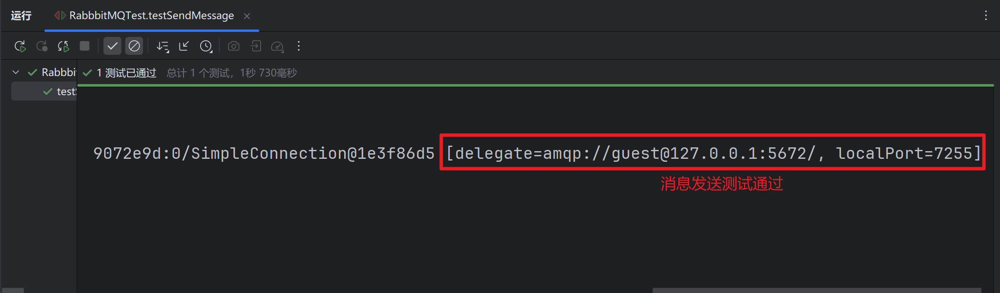


#### ⑥测试效果

> **消息`发送到了队列`中：**

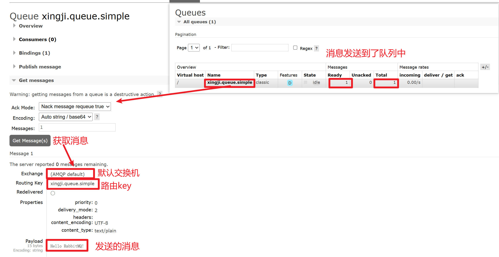


### 2、消费端工程

#### ①创建module

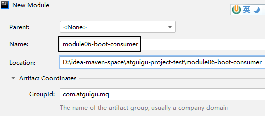


#### ②配置POM

```xml
<parent>
    <groupId>org.springframework.boot</groupId>
    <artifactId>spring-boot-starter-parent</artifactId>
    <version>3.1.5</version>
</parent>

<dependencies>
    <dependency>
        <groupId>org.springframework.boot</groupId>
        <artifactId>spring-boot-starter-amqp</artifactId>
    </dependency>
</dependencies>
```


#### ③YAML

```yaml
spring:
  rabbitmq:
    host: localhost
    port: 5672 # 基于AMQP协议
    username: guest # 默认用户名
    password: 123456 # 默认密码
    virtual-host: / # 默认虚拟主机,用于管理交换机和队列，以及之间的绑定关系
```


#### ④主启动类

仿照生产者工程的主启动类，改一下类名即可

```java
package fun.xingji.mq;

import org.springframework.boot.SpringApplication;
import org.springframework.boot.autoconfigure.SpringBootApplication;

@SpringBootApplication
public class RabbitMQConsumerMainType {
    public static void main(String[] args) {
        // 启动SpringBoot应用
        SpringApplication.run(RabbitMQConsumerMainType.class, args);
    }
}
```


#### ⑤监听器

- 使用 @RabbitListener 注解设定要监听的队列名称
- 消息数据使用和发送端一样的数据类型接收

```java
package fun.xingji.mq.listener;

import com.rabbitmq.client.Channel;
import org.springframework.amqp.rabbit.annotation.RabbitListener;
import org.springframework.messaging.Message;
import org.springframework.stereotype.Component;

@Component
public class MyMessageListener {

    // 默认采用自动确认模式，消费者获取消息处理后，自动给服务器发送异步确认，服务器收到确认就会删除队列的消息
    @RabbitListener(queues = {"xingji.queue.simple"})
    public void processMessage(
            String messageContent, // 消息内容
            Message message, // 消息对象
            Channel channel // 信道对象
    ) {
        // 处理消息
        System.out.println("messageContent = " + messageContent);
    }
}
```

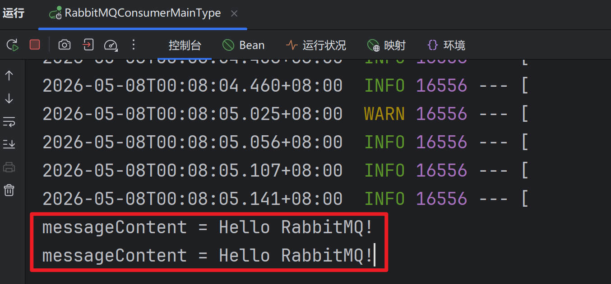


#### ⑥执行测试

监听方法不能直接运行，请大家通过主启动类运行微服务。消费端取走消息之后，队列中就没有消息了：

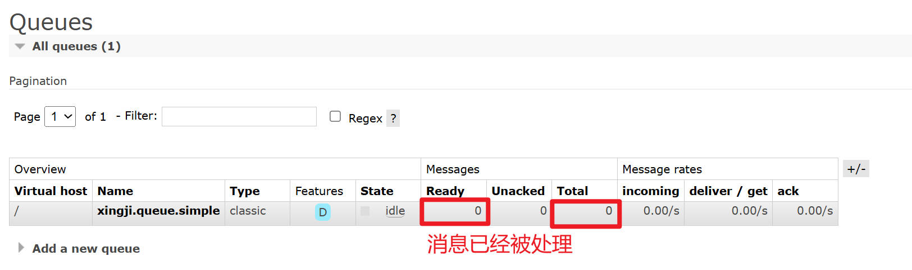
