## RabbitMQ工作模式概述

* RabbitMQ提供了**多种工作模式**：简单模式，work模式 ，Publish/Subscribe发布与订阅模式，Routing路由模式，Topics主题模式等


官网对应模式介绍：https://www.rabbitmq.com/getstarted.html 


## 1.Work queues工作队列模式

### 1.1 模式说明

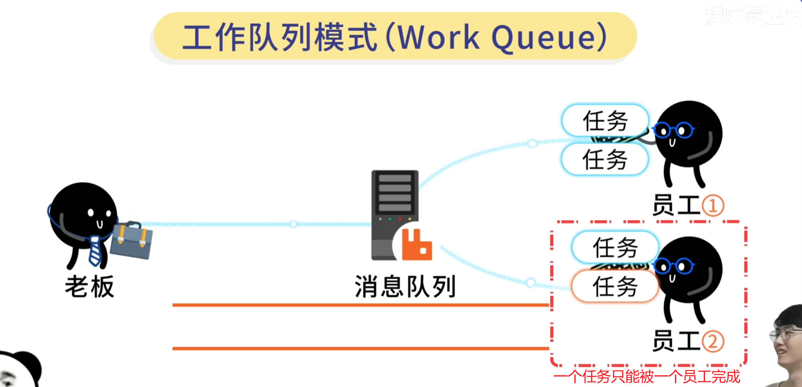

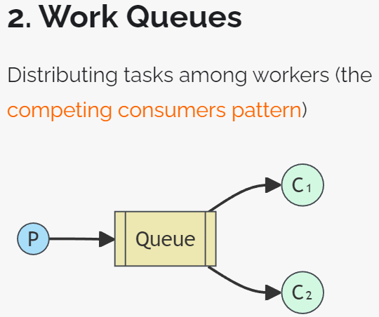

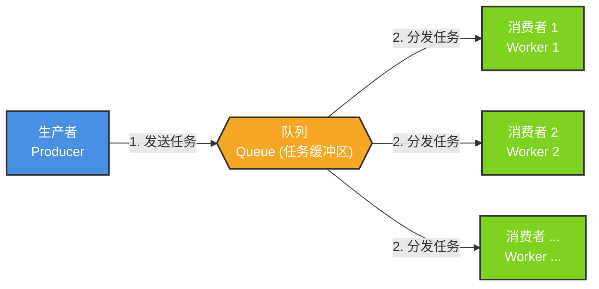

Work Queues与入门程序的简单模式相比，多了一个或一些消费端，多个消费端共同消费同一个队列中的消息。

**应用场景**：对于 任务过重或任务较多情况使用工作队列可以提高任务处理的速度


### 1.2 工作队列模式代码

#### 1.2.1 生产者代码

```java
public static final String EXCHANGE_DIRECT2 = ""; // 指定交换机名称

public static final String ROUTING_KEY_WORK = "xingji.queue.work"; // 指定路由键名称


@Test
public void testSendMessageWork() {
     for (int i = 1; i <= 10; i++) {
         rabbitTemplate.convertAndSend(
                 EXCHANGE_DIRECT2, // 指定交换机名称
                 ROUTING_KEY_WORK, // 指定路由键名称
                 "Hello RabbitMQ...i=" + i); // 消息内容
     }
}
```


* **发送消息效果**

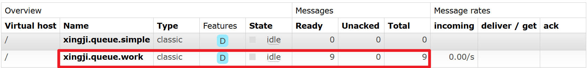

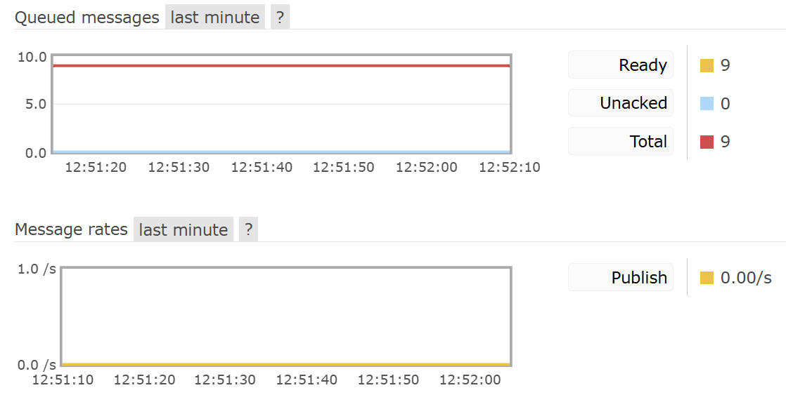


#### 1.2.2 消费者代码

##### ①创建模块，配置POM

```xml
<parent>
    <groupId>org.springframework.boot</groupId>
    <artifactId>spring-boot-starter-parent</artifactId>
    <version>3.1.5</version>
</parent>

<dependencies>
    <dependency>
        <groupId>org.springframework.boot</groupId>
        <artifactId>spring-boot-starter-amqp</artifactId>
    </dependency>
</dependencies>
```


##### ②YAML

```yaml
spring:
  rabbitmq:
    host: localhost
    port: 5672 # 基于AMQP协议
    username: guest # 默认用户名
    password: 123456 # 默认密码
    virtual-host: / # 默认虚拟主机,用于管理交换机和队列，以及之间的绑定关系
```


##### ③主启动类

仿照生产者工程的主启动类，改一下类名即可

```java
package fun.xingji.mq;

import org.springframework.boot.SpringApplication;
import org.springframework.boot.autoconfigure.SpringBootApplication;

@SpringBootApplication
public class RabbitMQConsumerMainType {
    public static void main(String[] args) {
        // 启动SpringBoot应用
        SpringApplication.run(RabbitMQConsumerMainType.class, args);
    }
}
```


##### ④监听器

```java
package fun.xingji.mq.listener;

import com.rabbitmq.client.Channel;
import org.springframework.amqp.rabbit.annotation.RabbitListener;
import org.springframework.messaging.Message;
import org.springframework.stereotype.Component;

@Component
public class MyMessageListener {
//=========================Work queues工作队列模式============================
// work消息模式下，多个消费者默认是轮询处理消息的。多个消费者之间是竞争关系，不能同时消费到同一个消息
// 多消费者目的：快速处理消息队列，避免消息积压

    @RabbitListener(queues = {"xingji.queue.work"})
    public void messageWork1Handler(
            String messageContent, // 消息内容
            Message message, // 消息对象
            Channel channel // 信道对象
    ) {
        // 处理消息
        System.out.println("Work1 messageContent = " + messageContent);
    }


    @RabbitListener(queues = {"xingji.queue.work"})
    public void messageWork2Handler(
            String messageContent, // 消息内容
            Message message, // 消息对象
            Channel channel // 信道对象
    ) {
        // 处理消息
        System.out.println("Work2 messageContent = " + messageContent);
    }
}
```


#### 1.2.3 运行效果

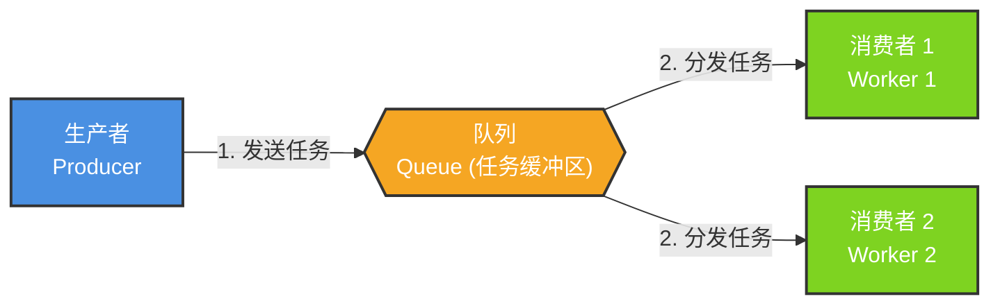

##### ①消费端A

> Work1 messageContent = Hello RabbitMQ...i=1
> Work1 messageContent = Hello RabbitMQ...i=3
> Work1 messageContent = Hello RabbitMQ...i=5
> Work1 messageContent = Hello RabbitMQ...i=7
> Work1 messageContent = Hello RabbitMQ...i=9


##### ②消费端B

> Work1 messageContent = Hello RabbitMQ...i=2
> Work1 messageContent = Hello RabbitMQ...i=4
> Work1 messageContent = Hello RabbitMQ...i=6
> Work1 messageContent = Hello RabbitMQ...i=8
> Work1 messageContent = Hello RabbitMQ...i=10


## 2.订阅模式类型

> **订阅模式示例图：** 

前面2个案例中，只有3个角色：

+ P：生产者，也就是要发送消息的程序

+ C：消费者：消息的接受者，会一直等待消息到来。

+ queue：消息队列，图中红色部分

而在订阅模型中，多了一个exchange角色，而且过程略有变化：

+ P：生产者，也就是要发送消息的程序，但是不再发送到队列中，而是发给X（交换机）

+ C：消费者，消息的接受者，会一直等待消息到来。

+ Queue：消息队列，接收消息、缓存消息。

**Exchange：交换机，图中的X。一方面，接收生产者发送的消息。另一方面，知道如何处理消息，例如递交给某个特别队列、递交给所有队列、或是将消息丢弃。到底如何操作，取决于Exchange的类型。**

::: tip

**Exchange(交换机)有常见以下3种类型**：

+ **`Fanout：广播`，将消息交给`所有绑定到交换机的队列`**

+ **`Direct：定向`，把消息交给`符合指定routing key的队列`**

+ **`Topic：通配符`，把消息交给`符合routing pattern（路由模式）的队列`**

**Exchange（交换机）只负责转发消息，不具备存储消息的能力**，因此如果没有任何队列与Exchange绑定，或者没有符合路由规则的队列，那么消息会丢失！

:::


## 3.Publish/Subscribe发布订阅模式

### 3.1 模式说明

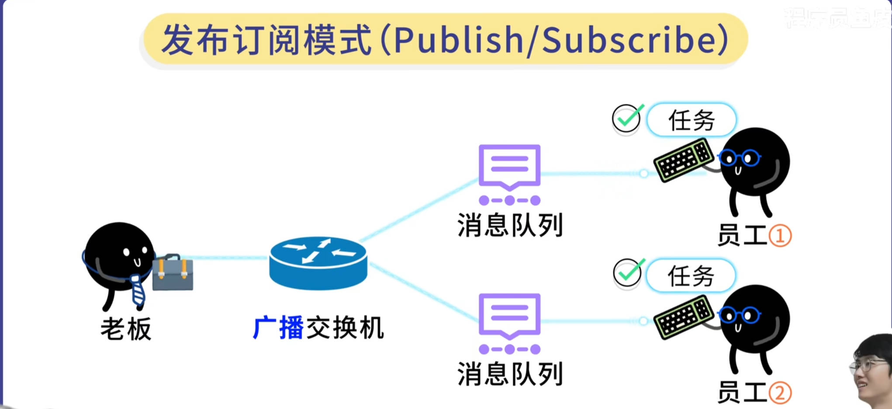

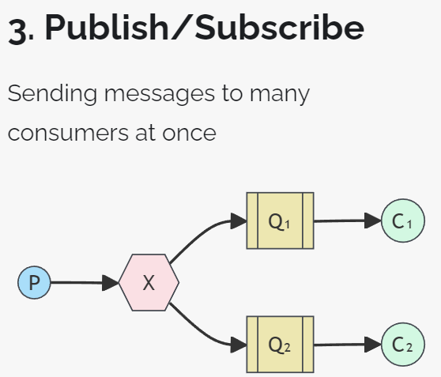 

发布订阅模式：
1、每个消费者监听自己的队列。
2、生产者将消息发给broker，由交换机将消息转发到绑定此交换机的每个队列，每个绑定交换机的队列都将接收
到消息


### 3.2 代码实现

#### 1 创建组件

* 名称列表

| 组件   | 组件名称                                         |
| ------ | ------------------------------------------------ |
| 交换机 | xingji.exchange.fanout                           |
| 队列   | xingji.queue.fanout01<br />xingji.queue.fanout02 |


#### 2 创建交换机

> <span style="color:blue;">**注意**</span>：`发布订阅模式`要求交换机是`Fanout类型`

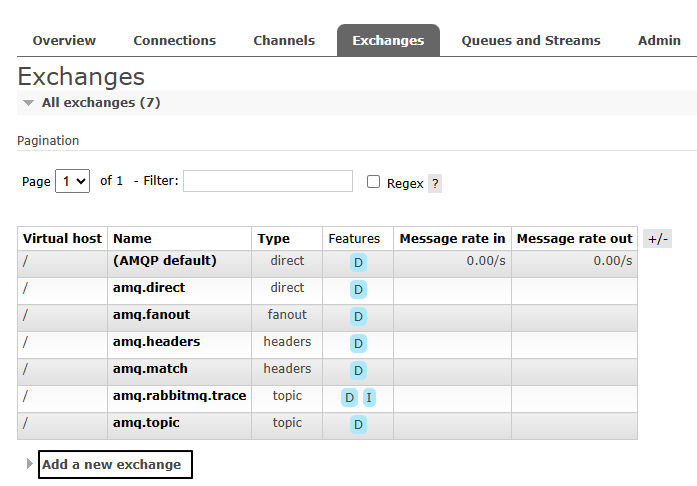

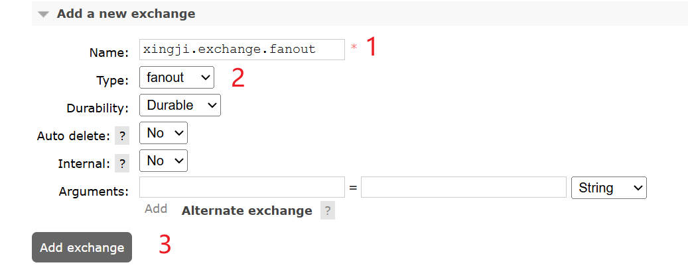


#### 3 创建队列并绑定交换机

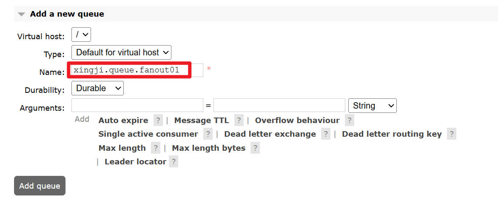

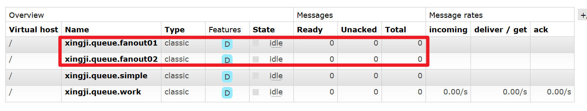

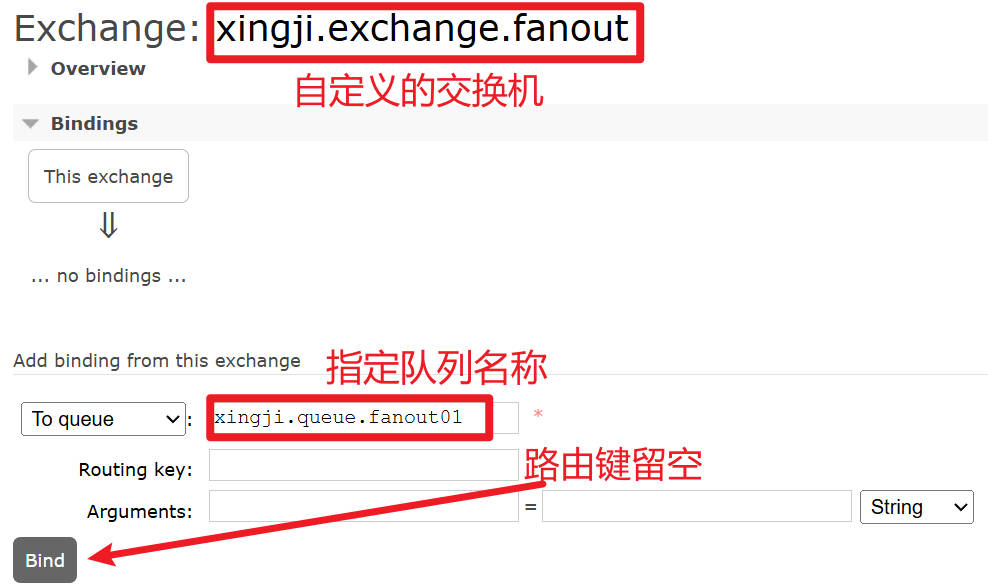


此时可以到交换机下查看绑定关系：

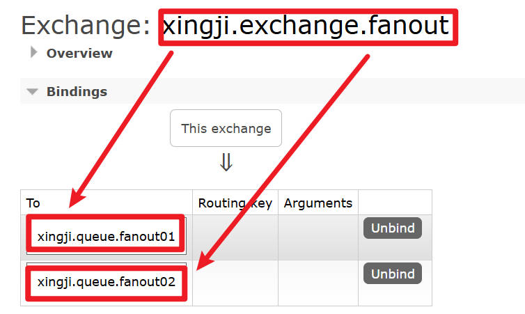


#### 4 生产者代码

```java
//====================Publish/Subscribe发布订阅模式=======================
// deliveryMode=2，表示持久化消息。服务器重启消息不会丢失。前提队列也需要支持持久化的。
public static final String EXCHANGE_FANOUT = "xingji.exchange.fanout";

@Test
public void testSendMessageFanout() {
    rabbitTemplate.convertAndSend(
           EXCHANGE_FANOUT, // 指定交换机名称
           "", // 空字符串，表示不指定路由键
           "Hello fanout ~"); // 消息内容
}
```

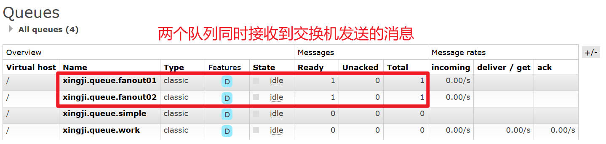


#### 5.消费者代码

两个监听器可以写在同一个微服务中，分别监听两个不同队列：

```java
package fun.xingji.mq.listener;

import com.rabbitmq.client.Channel;
import org.springframework.amqp.rabbit.annotation.RabbitListener;
import org.springframework.messaging.Message;
import org.springframework.stereotype.Component;

@Component
public class MyMessageListener {
//=====================Publish/Subscribe发布订阅模式=======================
    @RabbitListener(queues = {"xingji.queue.fanout01"})
    public void messageFanout01Handler(
            String messageContent, // 消息内容
            Message message, // 消息对象
            Channel channel // 信道对象
    ) {
        // 处理消息
        System.out.println("Fanout01 messageContent = " + messageContent);
    }


    @RabbitListener(queues = {"xingji.queue.fanout02"})
    public void messageFanout02Handler(
            String messageContent, // 消息内容
            Message message, // 消息对象
            Channel channel // 信道对象
    ) {
        // 处理消息
        System.out.println("Fanout02 messageContent = " + messageContent);
    }
}
```


#### 6 运行效果

> **先启动消费者，然后再运行生产者程序发送消息：**

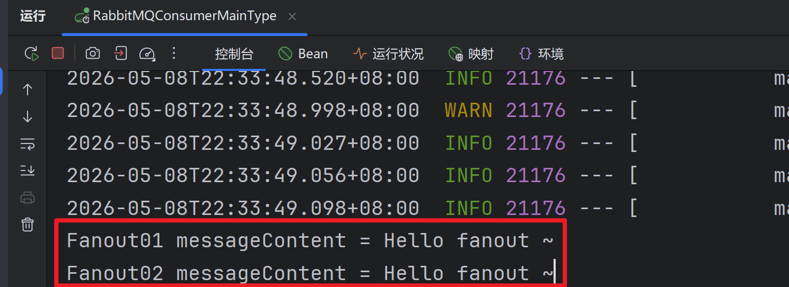


### 3.3 小结

交换机需要与队列进行绑定，绑定之后；一个消息可以被多个消费者都收到。

::: tip 

**发布订阅模式与工作队列模式的区别：**

- **工作队列模式本质上是绑定默认交换机**
- **发布订阅模式绑定指定交换机**
- **监听同一个队列的消费端程序彼此之间是竞争关系**
- **绑定同一个交换机的多个队列在发布订阅模式下，消息是广播的，每个队列都能接收到消息**

:::


## 4.Routing路由模式

### 4.1 模式说明

::: tip

路由模式特点：

+ 队列与交换机的绑定，不能是任意绑定了，而是要指定一个RoutingKey（路由key）

+ 消息的发送方在 向 Exchange发送消息时，也必须指定消息的 RoutingKey。

+ Exchange不再把消息交给每一个绑定的队列，而是根据消息的Routing Key进行判断，只有队列的Routingkey与消息的 Routing key完全一致，才会接收到消息

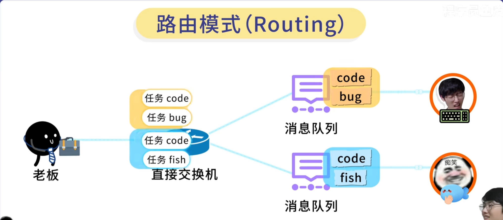

 

图解：

+ P：生产者，向Exchange发送消息，发送消息时，会指定一个routing key。

+ X：Exchange（交换机），接收生产者的消息，然后把消息递交给 与routing key完全匹配的队列

+ C1：消费者，其所在队列指定了需要routing key 为 error 的消息

+ C2：消费者，其所在队列指定了需要routing key 为 info、error、warning 的消息

:::


### 4.2 代码实现

#### 1 创建组件

* **组件清单**

没有特殊设置，名称外的其它参数都使用默认值：

| 组件   | 组件名称                |
| ------ | ----------------------- |
| 交换机 | xingji.exchange.direct  |
| 路由键 | xingji.routing.key.good |
| 队列   | xingji.queue.direct     |


#### 2 绑定


#### 3 生产者代码

```java
public static final String EXCHANGE_DIRECT = "atguigu.exchange.direct";

public static final String ROUTING_KEY_GOOD = "atguigu.routing.key.good";

@Test
public void testSendMessageRouting() {
    rabbitTemplate.convertAndSend(EXCHANGE_DIRECT, ROUTING_KEY_GOOD, "Hello routing ~");
}
```


#### 4 消费者代码

```java
@RabbitListener(queues = {"atguigu.queue.direct"})
public void processMessageRouting(String messageContent, Message message, Channel channel) {
    System.out.println("Message Content:" + messageContent);
}
```


#### 5 运行结果


## 5.Topics通配符模式

### 5.1. 模式说明

Topic类型与Direct相比，都是可以根据RoutingKey把消息路由到不同的队列。只不过Topic类型Exchange可以让队列在绑定Routing key 的时候**使用通配符**！

Routingkey 一般都是有一个或多个单词组成，多个单词之间以”.”分割，例如： item.insert

通配符规则：

\#：匹配零个或多个词

*：匹配不多不少恰好1个词

举例：

item.#：能够匹配item.insert.abc 或者 item.insert

item.*：只能匹配item.insert

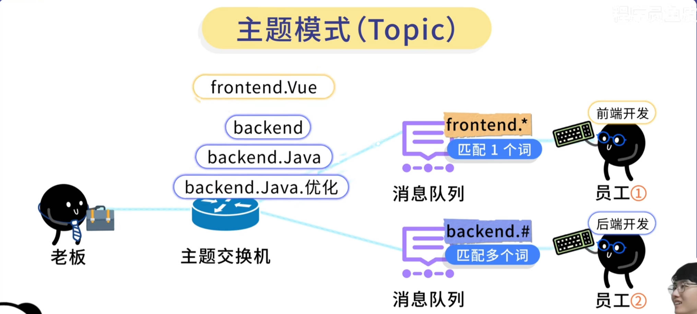

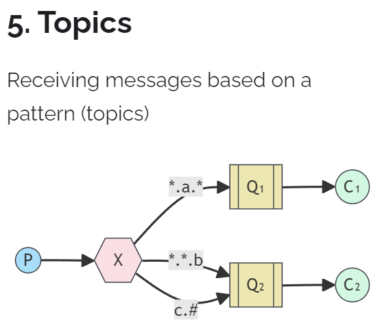 

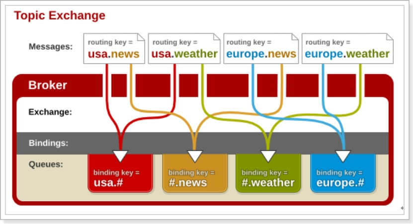 

图解：

· 红色Queue：绑定的是usa.# ，因此凡是以 usa.开头的routing key 都会被匹配到

· 黄色Queue：绑定的是#.news ，因此凡是以 .news结尾的 routing key 都会被匹配


### 5.2 代码实现

#### 1 创建组件

* 组件清单

| 组件   | 组件名称                                       |
| ------ | ---------------------------------------------- |
| 交换机 | atguigu.exchange.topic                         |
| 路由键 | #.error<br />order.*<br />\*.\*                |
| 队列   | atguigu.queue.message<br />atguigu.queue.order |


#### 2 创建交换机


#### 3 绑定关系


#### 4 生产者代码

```java
public static final String EXCHANGE_TOPIC = "atguigu.exchange.topic";
public static final String ROUTING_KEY_ERROR = "#.error";
public static final String ROUTING_KEY_ORDER = "order.*";
public static final String ROUTING_KEY_ALL = "*.*";

@Test
public void testSendMessageTopic() {
    rabbitTemplate.convertAndSend(EXCHANGE_TOPIC, "order.info", "message order info ...");
    rabbitTemplate.convertAndSend(EXCHANGE_TOPIC, "goods.info", "message goods info ...");
    rabbitTemplate.convertAndSend(EXCHANGE_TOPIC, "goods.error", "message goods error ...");
}
```


#### 5 消费者代码

```java
package com.atguigu.mq.listener;

import com.rabbitmq.client.Channel;
import org.springframework.amqp.core.Message;
import org.springframework.amqp.rabbit.annotation.RabbitListener;
import org.springframework.stereotype.Component;

@Component
public class MyMessageListener {

    @RabbitListener(queues = {"atguigu.queue.message"})
    public void processMessage01(String messageContent, Message message, Channel channel) {
        System.out.println("Queue Message:" + messageContent);
    }

    @RabbitListener(queues = {"atguigu.queue.order"})
    public void processMessage02(String messageContent, Message message, Channel channel) {
        System.out.println("Queue Order:" + messageContent);
    }

}
```


#### 6 运行效果

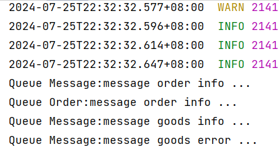


## 6.模式总结

### **1、简单模式 HelloWorld**

一个生产者、一个消费者，不需要设置交换机（使用默认的交换机）

 


### **2、工作队列模式 Work Queue**

一个生产者、多个消费者（竞争关系），不需要设置交换机（使用默认的交换机）

 


### **3、发布订阅模式 Publish/subscribe**

需要设置类型为fanout的交换机，并且交换机和队列进行绑定，当发送消息到交换机后，交换机会将消息发送到绑定的队列

 


### **4、路由模式 Routing**

需要设置类型为direct的交换机，交换机和队列进行绑定，并且指定routing key，当发送消息到交换机后，交换机会根据routing key将消息发送到对应的队列

 


### **5、通配符模式 Topic**

需要设置类型为topic的交换机，交换机和队列进行绑定，并且指定通配符方式的routing key，当发送消息到交换机后，交换机会根据routing key将消息发送到对应的队列

 
