## 1.概述

### 1.1 问题引入

* **正常的下单流程**

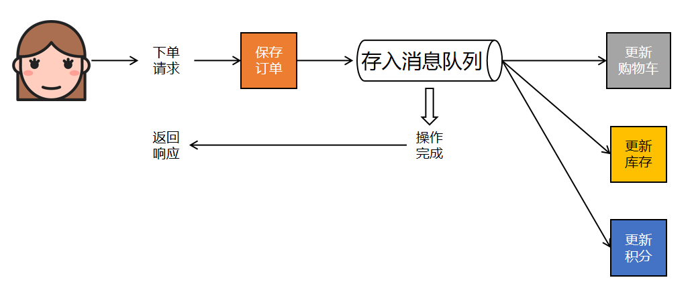

::: warning

* **故障情况1：**

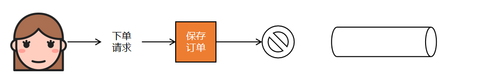

消息没有发送到消息队列上，后果：消费者拿不到消息，业务功能缺失，数据错误


* **故障情况2：**

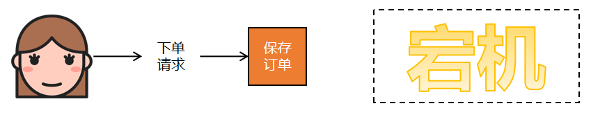

消息成功存入消息队列，但是消息队列服务器宕机了，原本保存在内存中的消息也丢失了，即使服务器重新启动，消息也找不回来了。后果：消费者拿不到消息，业务功能缺失，数据错误


* **故障情况3：**

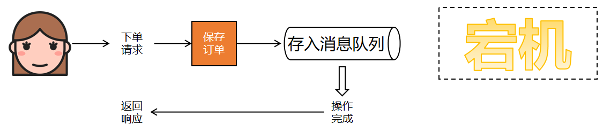

消息成功存入消息队列，但是消费端出现问题，例如：宕机、抛异常等等。后果：业务功能缺失，数据错误

:::


### 1.2 解决方案

::: tip 

* **故障情况1：消息没有发送到消息队列在生产者端进行确认，具体操作中我们会分别针对交换机和队列来确认，如果没有成功发送到消息队列服务器上，那就可以尝试重新发送**


* **故障情况2：消息队列服务器宕机导致内存中消息丢失解决思路：消息持久化到硬盘上，哪怕服务器重启也不会导致消息丢失**


* **故障情况3：消费端宕机或抛异常导致消息没有成功被消费消费端消费消息成功，给服务器返回ACK信息，然后消息队列删除该消息消费端消费消息失败，给服务器端返回NACK信息，同时把消息恢复为待消费的状态，这样就可以再次取回消息，重试一次（当然，这就需要消费端接口支持幂等性）**

:::


## 2.故障1解决：生产者端消息确认机制

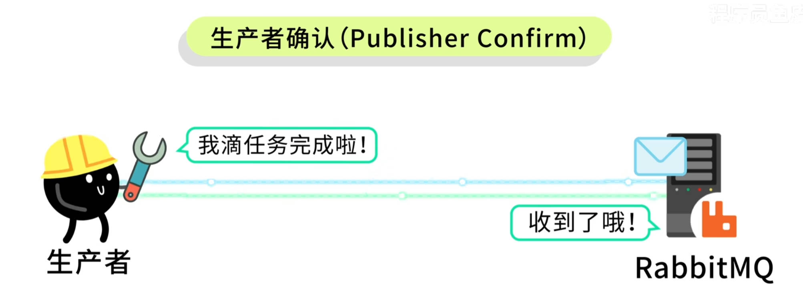

### 一、概述

* 在使用 RabbitMQ 的时候，作为消息发送方希望**杜绝任何消息丢失**或者**投递失败**场景。RabbitMQ 为我们提供了**两种方式**用来**控制消息的投递可靠性模式**。

+ **confirm 确认模式**

+ **return 退回模式**

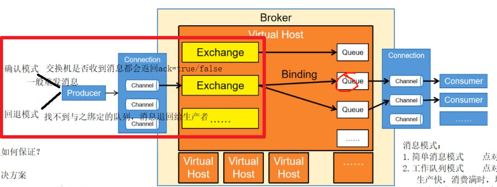

* **rabbitmq 整个消息投递的路径为：**

producer—>rabbitmq broker—>exchange—>queue—>consumer

+ 消息从 producer 到 exchange 则会返回一个 confirmCallback 。

+ 消息从 exchange–>queue 投递失败则会返回一个 returnCallback 。

我们将利用这两个callback 控制消息的可靠性投递


### 二、创建module

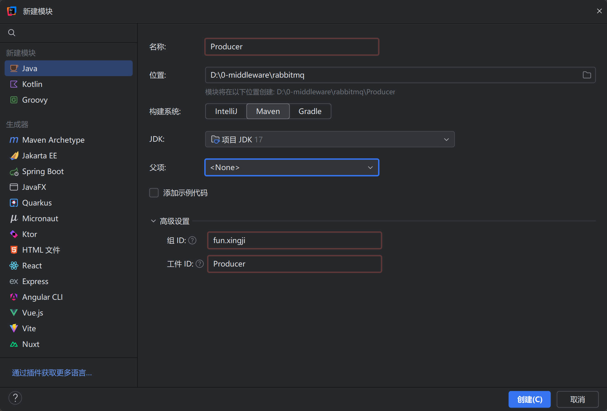


### 三、搭建环境

#### 1、配置POM

```xml
<parent>
    <groupId>org.springframework.boot</groupId>
    <artifactId>spring-boot-starter-parent</artifactId>
    <version>3.1.5</version>
</parent>

<dependencies>
    <dependency>
        <groupId>org.springframework.boot</groupId>
        <artifactId>spring-boot-starter-amqp</artifactId>
    </dependency>
    <dependency>
        <groupId>org.springframework.boot</groupId>
        <artifactId>spring-boot-starter-test</artifactId>
    </dependency>
    <dependency>
        <groupId>org.projectlombok</groupId>
        <artifactId>lombok</artifactId>
    </dependency>
</dependencies>
```


#### 2、主启动类

没有特殊设定：

```java
package fun.xingji.mq;

import org.springframework.boot.SpringApplication;
import org.springframework.boot.autoconfigure.SpringBootApplication;

@SpringBootApplication
public class RabbitMQProducerMainType {
    public static void main(String[] args) {
        // 启动SpringBoot应用
        SpringApplication.run(RabbitMQProducerMainType.class, args);
    }
}
```


#### 3、YAML

> <span style="color:blue;font-weight:bold;">注意</span>：publisher-confirm-type和publisher-returns是两个必须要增加的配置，如果没有则本节功能不生效

```yaml
spring:
  rabbitmq:
    host: localhost
    port: 5672 # 基于AMQP协议
    username: guest # 默认用户名
    password: 123456 # 默认密码
    virtual-host: / # 默认虚拟主机,用于管理交换机和队列，以及之间的绑定关系
    publisher-confirm-type: CORRELATED # 交换机的确认 交换机收到或没收到消息都会给生产者返回ack
    publisher-returns: true # 队列的确认 队列没有收到消息才会执行后退处理。收到消息了是不回退的。

logging:
  level:
    fun.xingji.mq.config.MQProducerAckConfig: info # 生产者确认机制日志级别
```


### 四、创建配置类

#### 1、目标

在这里我们为什么要创建这个配置类呢？首先，我们需要声明回调函数来接收RabbitMQ服务器返回的确认信息：

| 方法名            | 方法功能                 | 所属接口        | 接口所属类     |
| ----------------- | ------------------------ | --------------- | -------------- |
| confirm()         | 确认消息是否发送到交换机 | ConfirmCallback | RabbitTemplate |
| returnedMessage() | 确认消息是否发送到队列   | ReturnsCallback | RabbitTemplate |


然后，就是对RabbitTemplate的功能进行增强，因为回调函数所在对象必须设置到RabbitTemplate对象中才能生效。

原本RabbitTemplate对象并没有生产者端消息确认的功能，要给它设置对应的组件才可以。

而设置对应的组件，需要调用RabbitTemplate对象下面两个方法：

| 设置组件调用的方法   | 所需对象类型            |
| -------------------- | ----------------------- |
| setConfirmCallback() | ConfirmCallback接口类型 |
| setReturnCallback()  | ReturnCallback接口类型  |


#### 2、API说明

##### ①ConfirmCallback接口

这是RabbitTemplate内部的一个接口，源代码如下：

```java
	/**
	 * A callback for publisher confirmations.
	 */
	@FunctionalInterface
	public interface ConfirmCallback {

		/**
		 * Confirmation callback.
		 * @param correlationData correlation data for the callback.
		 * @param ack true for ack, false for nack
		 * @param cause An optional cause, for nack, when available, otherwise null.
		 */
		void confirm(@Nullable CorrelationData correlationData, boolean ack, @Nullable String cause);

	}
```

生产者端发送消息之后，回调confirm()方法

- ack参数值为true：表示消息成功发送到了交换机
- ack参数值为false：表示消息没有发送到交换机


##### ②ReturnCallback接口

同样也RabbitTemplate内部的一个接口，源代码如下：

```java
	/**
	 * A callback for returned messages.
	 * @since 2.3
	 */
	@FunctionalInterface
	public interface ReturnsCallback {

		/**
		 * Returned message callback.
		 * @param returned the returned message and metadata.
		 */
		void returnedMessage(ReturnedMessage returned);

	}
```

<span style="color:blue;font-weight:bold;">注意</span>：接口中的returnedMessage()方法<span style="color:blue;font-weight:bold;font-size:25px;">仅</span>在消息<span style="color:blue;font-weight:bold;font-size:25px;">没有</span>发送到队列时调用

ReturnedMessage类中主要属性含义如下：

| 属性名     | 类型                                  | 含义                         |
| ---------- | ------------------------------------- | ---------------------------- |
| message    | org.springframework.amqp.core.Message | 消息以及消息相关数据         |
| replyCode  | int                                   | 应答码，类似于HTTP响应状态码 |
| replyText  | String                                | 应答码说明                   |
| exchange   | String                                | 交换机名称                   |
| routingKey | String                                | 路由键名称                   |


#### 3、配置类代码

##### ①要点1

加@Component注解，加入IOC容器


##### ②要点2

配置类自身实现ConfirmCallback、ReturnCallback这两个接口，然后通过this指针把配置类的对象设置到RabbitTemplate对象中。

操作封装到了一个专门的void init()方法中。

为了保证这个void init()方法在应用启动时被调用，我们使用@PostConstruct注解来修饰这个方法。

关于@PostConstruct注解大家可以参照以下说明：

> @PostConstruct注解是<span style="color:blue;font-weight:bolder;">Java中的一个标准注解</span>，它用于指定在<span style="color:blue;font-weight:bolder;">对象创建之后立即执行</span>的方法。当使用依赖注入（如Spring框架）或者其他方式创建对象时，@PostConstruct注解可以确保在对象完全初始化之后，执行相应的方法。
>
> 使用@PostConstruct注解的方法必须满足以下条件：
>
> 1. <span style="color:blue;font-weight:bolder;">方法不能有任何参数</span>。
> 2. <span style="color:blue;font-weight:bolder;">方法必须是非静态的</span>。
> 3. <span style="color:blue;font-weight:bolder;">方法不能返回任何值</span>。
>
> 当容器实例化一个带有@PostConstruct注解的Bean时，它会在<span style="color:blue;font-weight:bolder;">调用构造函数之后</span>，并在<span style="color:blue;font-weight:bolder;">依赖注入完成之前</span>调用被@PostConstruct注解标记的方法。这样，我们可以在该方法中进行一些初始化操作，比如读取配置文件、建立数据库连接等。


##### ③代码

有了以上说明，下面我们就可以展示配置类的整体代码：

```java
package fun.xingji.mq.config;

import jakarta.annotation.PostConstruct;
import lombok.extern.slf4j.Slf4j;
import org.springframework.amqp.core.ReturnedMessage;
import org.springframework.amqp.rabbit.connection.CorrelationData;
import org.springframework.amqp.rabbit.core.RabbitTemplate;
import org.springframework.beans.factory.annotation.Autowired;
import org.springframework.stereotype.Component;

@Component
@Slf4j
public class MQProducerAckConfig implements RabbitTemplate.ConfirmCallback, RabbitTemplate.ReturnsCallback {

    @Autowired
    private RabbitTemplate rabbitTemplate;

    /*
    @PostConstruct
        1. 在IOC容器初始化Bean对象后，执行一些额外初始化操作
        2. 方法声明：必须public，没有返回值，没有参数
     */
    @PostConstruct
    public void init() {
        rabbitTemplate.setConfirmCallback(this); // 设置ConfirmCallback
        rabbitTemplate.setReturnsCallback(this); // 设置ReturnsCallback
    }

    /*
     1. ConfirmCallback接口用于实现消息发送到RabbitMQ交换器后接收ack回调
     */
    @Override
    public void confirm(CorrelationData correlationData, // 关联数据。类似电子邮件的附件
                        boolean ack, // ack=true表示交换机收到消息了；ack=false表示交换机没有收到消息(没有收到一般会重新发送)
                        String cause) { // 交换机没有收到消息的原因。收到为空
        // 如果发送消息时携带了关联数据，那么确认回调方法也会携带该关联数据
        log.info("correlationData: " + correlationData);
        log.info("ack: " + ack);
        if (ack) {
            log.info("交换机收到消息了");
            log.error("cause: " + cause); // 收到空说明是正常发送的
        } else {
            log.info("交换机没有收到消息，怎么了...");
            log.error("cause: " + cause); // 收到非空说明是发送失败,并且打印相关日志
        }
    }


    /*
     2. ReturnsCallback接口用于实现消息发送到RabbitMQ交换器，但无相应队列与交换器绑定时的回调
     */
    @Override
    public void returnedMessage(ReturnedMessage returned) { // 消息被封装成ReturnedMessage对象
        log.info("returned: " + returned); // 返回的消息
        log.info("消息主体: " + new String(returned.getMessage().getBody())); // 返回的消息体
        log.info("应答码: " + returned.getReplyCode()); // 应答码
        log.info("描述：" + returned.getReplyText()); // 描述
        log.info("消息使用的交换器 exchange : " + returned.getExchange()); // 交换器名称
        log.info("消息使用的路由键 routing : " + returned.getRoutingKey()); // 路由键key
    }
}
```


### 五、发送消息

```java
package fun.xingji.mq.test;

import org.junit.jupiter.api.Test;
import org.springframework.amqp.rabbit.core.RabbitTemplate;
import org.springframework.beans.factory.annotation.Autowired;
import org.springframework.boot.test.context.SpringBootTest;

@SpringBootTest
public class RabbbitMQTest {
    
    // 注入 RabbitTemplate 执行
    @Autowired
    RabbitTemplate rabbitTemplate; // SpringBoot自动配置，用于发送消息

    //=====================故障1解决：生产者端消息确认机制=====================
    @Test
    public void testSendConfirmMessage() {
        // 1.正确测试 交换机名称和路由key名称都正确
        rabbitTemplate.convertAndSend(
                "xingji.exchange.direct", // 指定交换机名称
                "xingji.routing.key.good", // 指定路由键key名称
                "Hello confirm message ~"); // 消息内容


        // 2.错误测试 交换机正确、路由键不正确，无法发送到队列
        rabbitTemplate.convertAndSend(
                "xingji.exchange.direct", // 指定交换机名称
                "xingji.routing.key.good123", // 指定路由键key名称
                "Hello confirm message ~"); // 消息内容

        // 3.错误测试 交换机不正确、路由键不正确，无法发送到交换机
        rabbitTemplate.convertAndSend(
                "xingji.exchange.direct123", // 指定交换机名称
                "xingji.routing.key.good", // 指定路由键key名称
                "Hello confirm message ~"); // 消息内容
    }
}
```

通过调整代码，测试如下三种情况：

- **交换机`正确`、路由键`正确`**

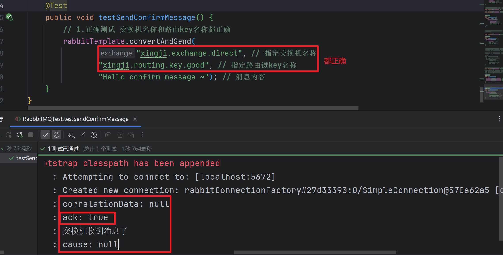

- **交换机`正确`、路由键`不正确`，`无法发送到队列`**

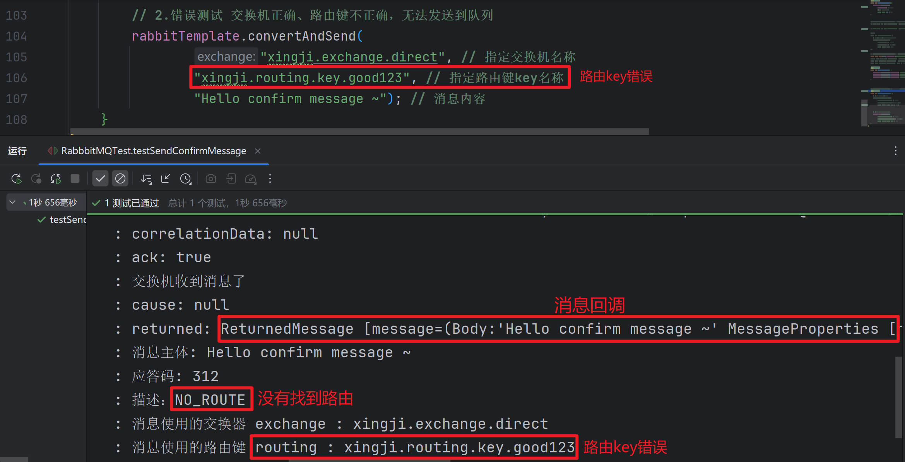

- **交换机`不正确`、路由键`正确`，`无法发送到交换机`**

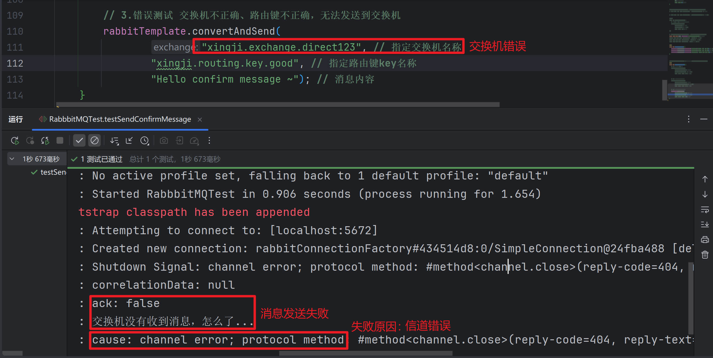


## 3.故障2解决：交换机和队列持久化

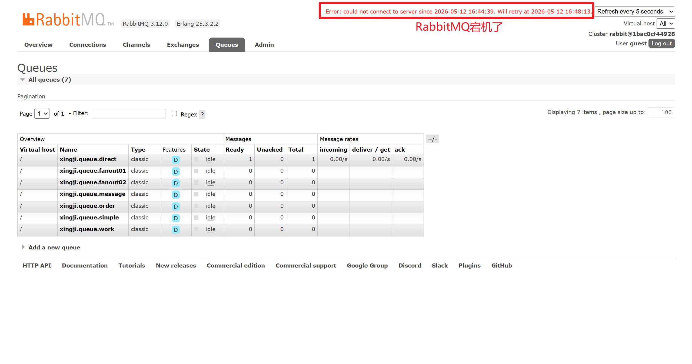

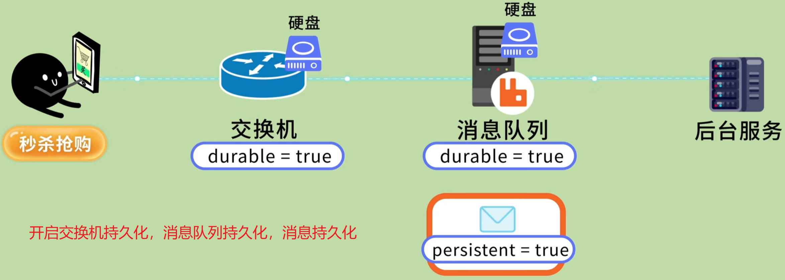

### 一、测试非持久化交换机和队列

#### 1、创建非持久化交换机

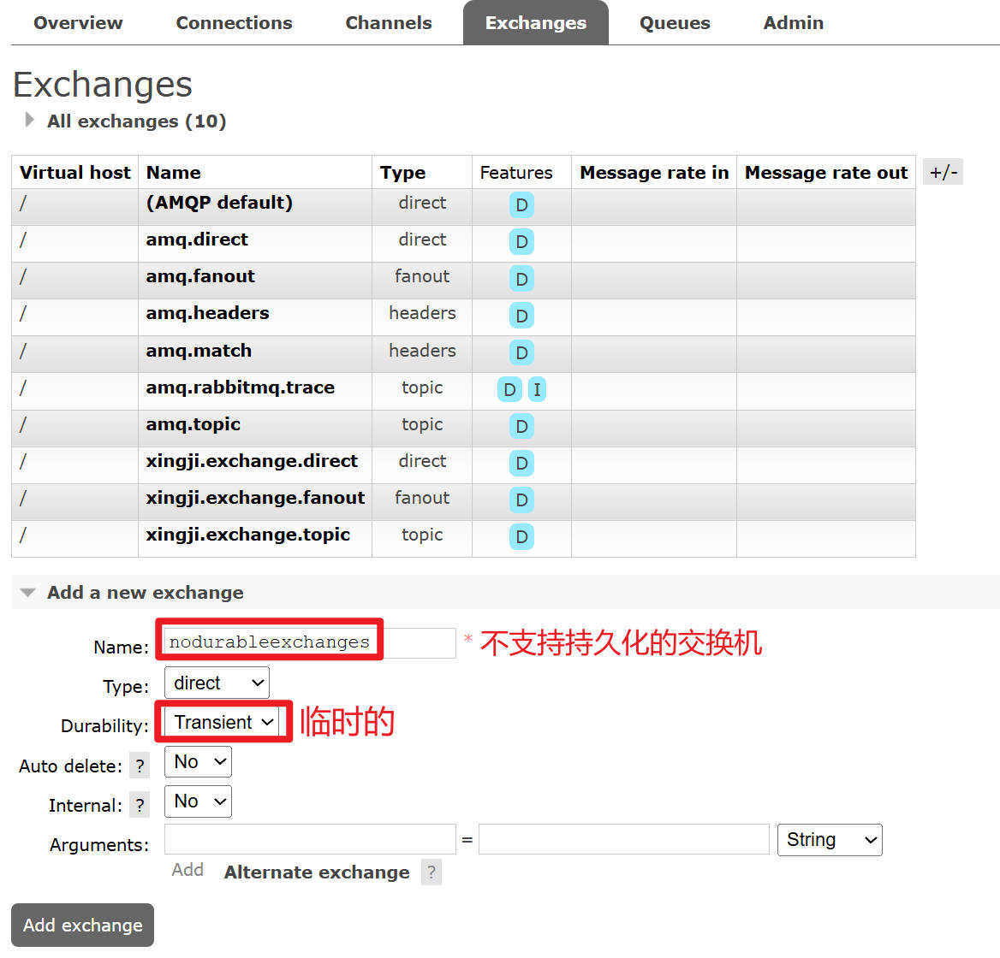


创建之后，可以在列表中看到：

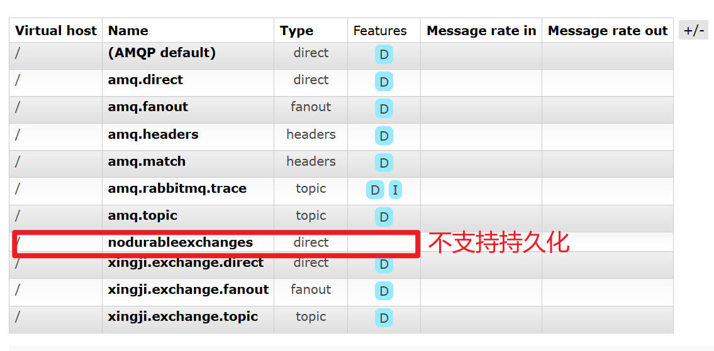


#### 2、创建非持久化队列

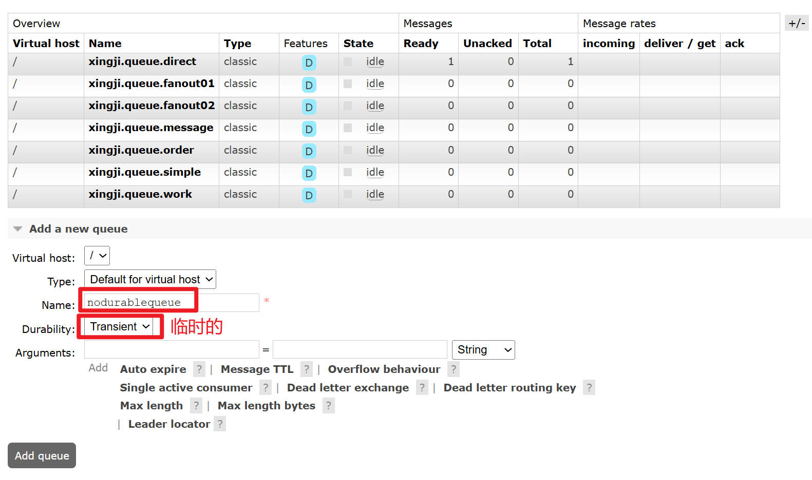


创建之后，可以在列表中看到：

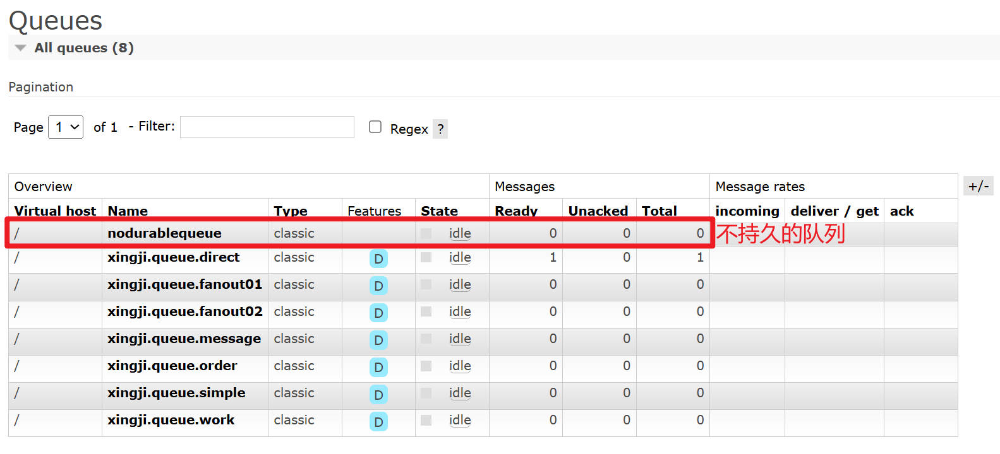


#### 3、绑定

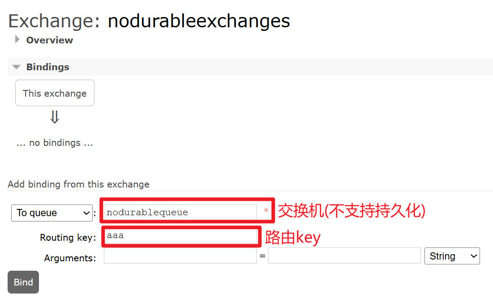


#### 4、发送消息

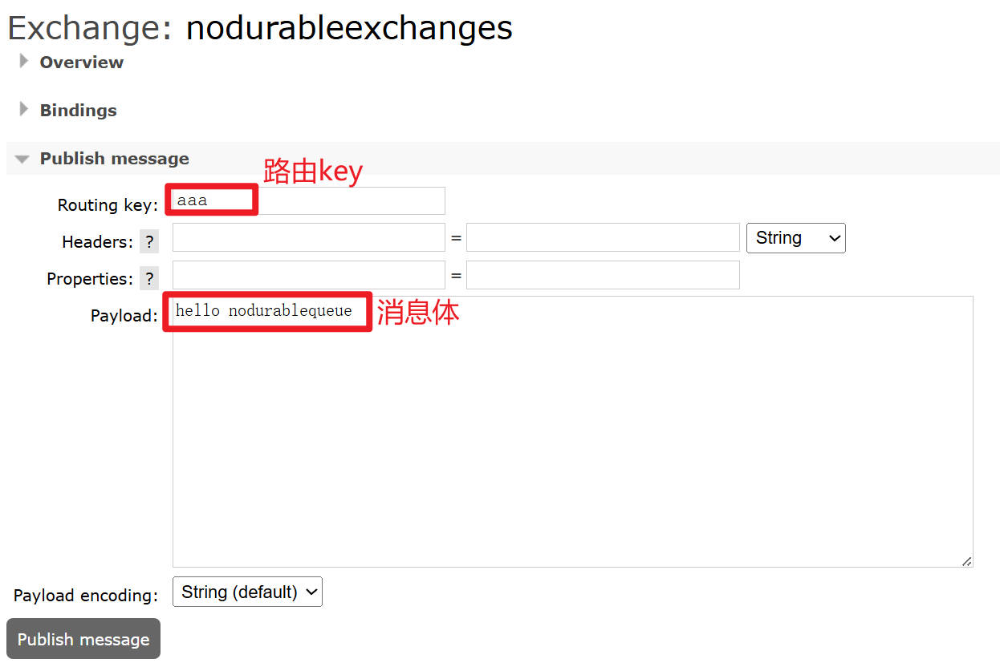


#### 5、查看已发送消息

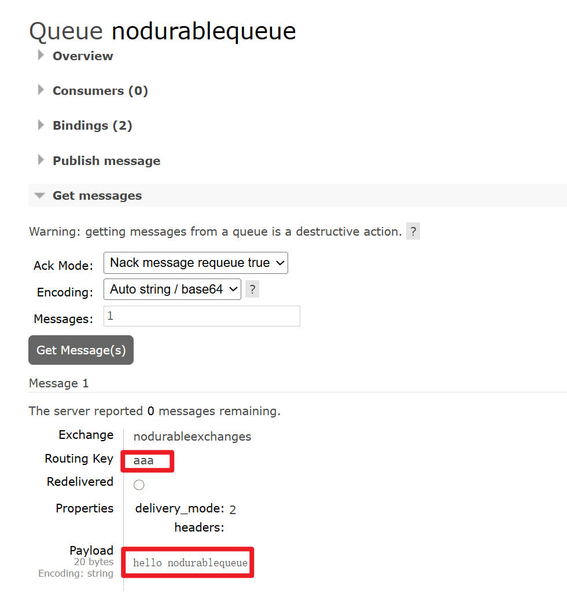

> **结论：临时性的交换机和队列也`能够接收消息`，但如果`RabbitMQ服务器重启之后`会怎么样呢？**


#### 6、重启RabbitMQ服务器

```shell
docker restart rabbitmq
```

> **重启之后，刚才临时性的`交换机和队列都没了`。在交换机和队列这二者中，队列是`消息存储的容器`，`队列没了，消息就也跟着没了`。**

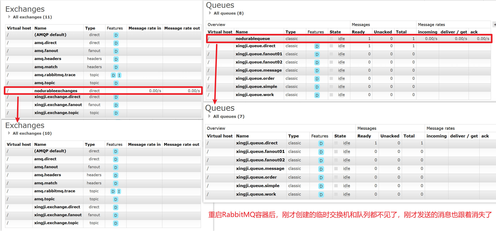


### 二、持久化的交换机和队列

我们其实不必专门创建持久化的交换机和队列，因为它们默认就是持久化的。接下来我们只需要确认一下：存放到队列中，尚未被消费端取走的消息，是否会随着RabbitMQ服务器重启而丢失？

#### 1、发送消息

运行以前的发送消息方法即可，不过要关掉消费端程序


#### 2、在管理界面查看消息

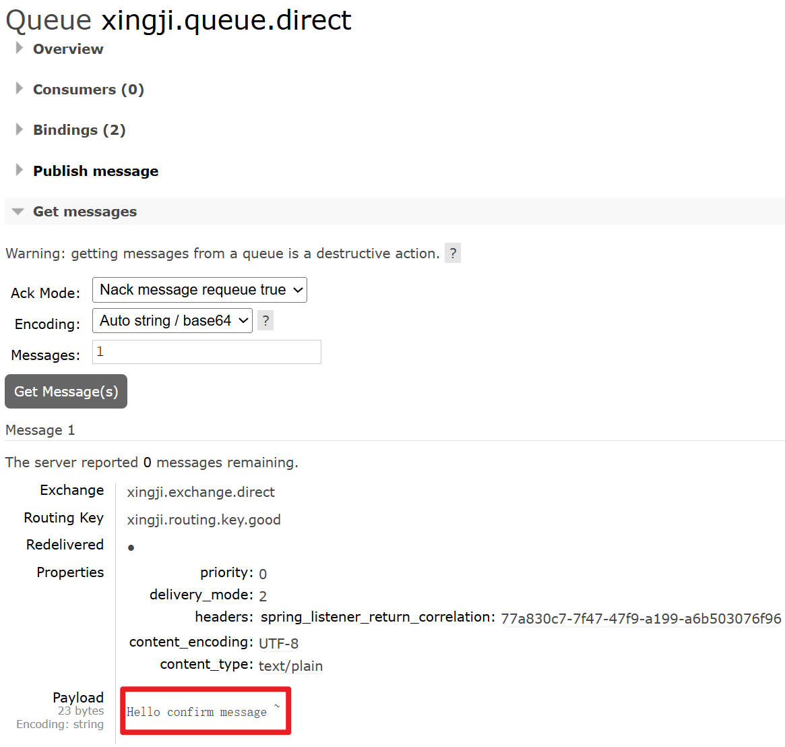


#### 3、重启RabbitMQ服务器

```shell
docker restart rabbitmq
```


#### 4、再次查看消息

仍然还在：

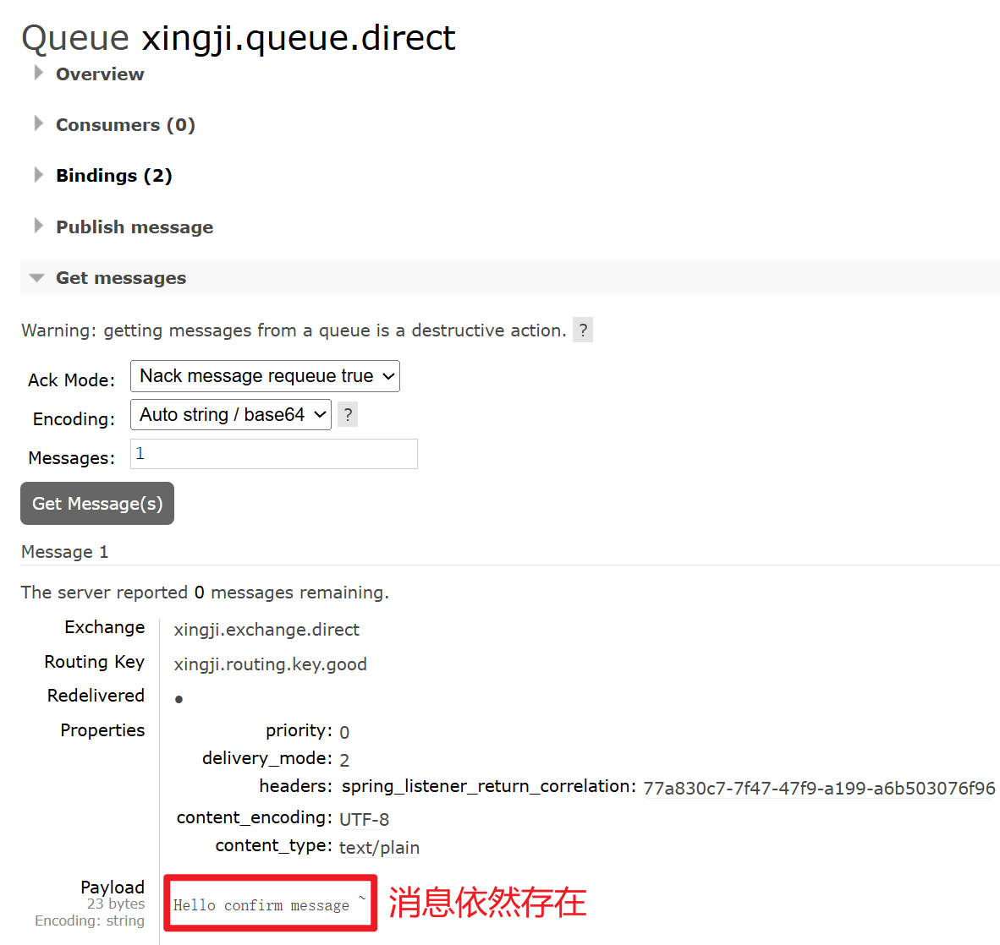


### 三、结论

> + **在后台管理界面创建`交换机和队列`时，默认就是`持久化的模式`。**
>
> + **此时`消息也是持久化`的，`不需要额外设置`。**
>
> 


## 4.故障3解决：消费端消息确认

+ **手动确认**

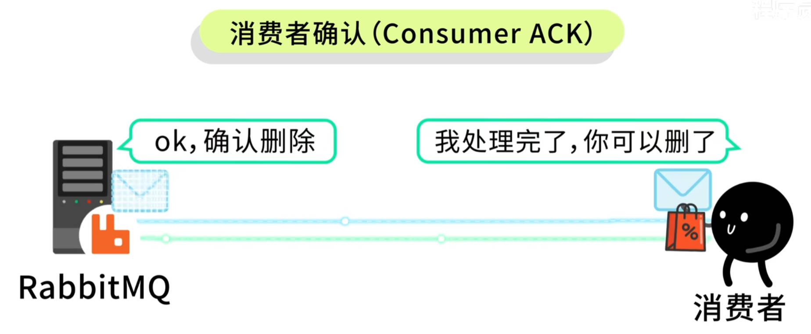

+ **自动确认**

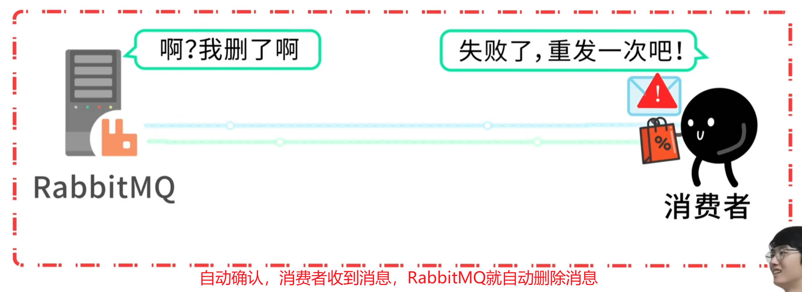

### 一、ACK

ACK是acknowledge的缩写，表示已确认


### 二、默认情况

默认情况下，消费端取回消息后，默认会自动返回ACK确认消息，所以在前面的测试中消息被消费端消费之后，RabbitMQ得到ACK确认信息就会删除消息

但实际开发中，消费端根据消息队列投递的消息执行对应的业务，未必都能执行成功，如果希望能够多次重试，那么默认设定就不满足要求了

所以还是要修改成手动确认


### 三、创建消费端module

#### 1、配置POM

```xml
<parent>
    <groupId>org.springframework.boot</groupId>
    <artifactId>spring-boot-starter-parent</artifactId>
    <version>3.1.5</version>
</parent>

<dependencies>
    <dependency>
        <groupId>org.springframework.boot</groupId>
        <artifactId>spring-boot-starter-amqp</artifactId>
    </dependency>
    <dependency>
        <groupId>org.springframework.boot</groupId>
        <artifactId>spring-boot-starter-web</artifactId>
    </dependency>
    <dependency>
        <groupId>org.projectlombok</groupId>
        <artifactId>lombok</artifactId>
    </dependency>
</dependencies>
```


#### 2、YAML

增加针对监听器的设置：

```yaml
spring:
  rabbitmq:
    host: localhost
    port: 5672 # 基于AMQP协议
    username: guest # 默认用户名
    password: 123456 # 默认密码
    virtual-host: / # 默认虚拟主机,用于管理交换机和队列，以及之间的绑定关系
    listener:
      simple:
        acknowledge-mode: manual # 把消息确认模式改为手动确认
```


#### 3、主启动类

没有特殊设定：

```java
package fun.xingji.mq;

import org.springframework.boot.SpringApplication;
import org.springframework.boot.autoconfigure.SpringBootApplication;

@SpringBootApplication
public class RabbitMQConsumerMainType {
    public static void main(String[] args) {
        // 启动SpringBoot应用
        SpringApplication.run(RabbitMQConsumerMainType.class, args);
    }
}
```


### 四、消费端监听器

#### 1、创建监听器类

```java
package fun.xingji.mq.listener;

import com.rabbitmq.client.Channel;
import lombok.extern.slf4j.Slf4j;
import org.springframework.amqp.core.ExchangeTypes;
import org.springframework.amqp.core.Message;
import org.springframework.amqp.rabbit.annotation.Exchange;
import org.springframework.amqp.rabbit.annotation.Queue;
import org.springframework.amqp.rabbit.annotation.QueueBinding;
import org.springframework.amqp.rabbit.annotation.RabbitListener;
import org.springframework.stereotype.Component;

@Component
public class ConsumerMessageListener {

    // 利用注解方式创建交换机、队列、绑定关系
    /*
    name = "queue.order" , 指定队列名称
    durable = "true" ,是否支持持久化
    exclusive = "false" , 是否排他性队列（仅限于当前连接有效）,当前连接断开后，队列自动删除
    autoDelete = "false" , 是否自动删除队列（没有消费者时），当最后一个消费者断开连接后，队列自动删除
    declare = "true" , 队列不在就创建，队列已经存在就直接使用。注意：队列属性信息必须一致。队列属性不能修改。只能删除重建。

    internal = "false" , 是否为内部队列，内部队列只给内部模块访问，不对外暴露。
     */
    @RabbitListener(
            bindings = {
                    @QueueBinding(
                            value = @Queue(name = "queue.order", durable = "true", exclusive = "false", autoDelete = "false", declare = "true"),
                            exchange = @Exchange(name = "exchange.direct.order", durable = "true", type = ExchangeTypes.DIRECT, autoDelete = "false", internal = "false", declare = "true"),
                            key = {
                                    "order", "xxx"
                            }
                    )
            }
    )
public void messageHandler(String msg, Message message, Channel channel){

}
```


#### 2、在接收消息的方法上应用注解

```java
    // 利用注解方式创建交换机、队列、绑定关系
    /*
    name = "queue.order" , 指定队列名称
    durable = "true" ,是否支持持久化
    exclusive = "false" , 是否排他性队列（仅限于当前连接有效）,当前连接断开后，队列自动删除
    autoDelete = "false" , 是否自动删除队列（没有消费者时），当最后一个消费者断开连接后，队列自动删除
    declare = "true" , 队列不在就创建，队列已经存在就直接使用。注意：队列属性信息必须一致。队列属性不能修改。只能删除重建。

    internal = "false" , 是否为内部队列，内部队列只给内部模块访问，不对外暴露。
     */
@RabbitListener(
bindings = {
@QueueBinding(
	value = @Queue(name = "queue.order", durable = "true", exclusive = "false", autoDelete = "false", declare = "true"),
	exchange = @Exchange(name = "exchange.direct.order", durable = "true", type = ExchangeTypes.DIRECT, autoDelete = "false", internal = "false", declare = "true"),
	key = {"order", "xxx"}
			)
		}
)
public void messageHandler(String msg, Message message, Channel channel){

}
```


#### 3、接收消息方法内部逻辑

- 业务处理成功：手动返回ACK信息，表示消息成功消费
- 业务处理失败：手动返回NACK信息，表示消息消费失败。此时有两种后续操作供选择：
  - 把消息重新放回消息队列，RabbitMQ会重新投递这条消息，那么消费端将重新消费这条消息——从而让业务代码再执行一遍
  - 不把消息放回消息队列，返回reject信息表示拒绝，那么这条消息的处理就到此为止


#### 4、相关API

先回到PPT理解“deliveryTag：交付标签机制”

下面我们探讨的三个方法都是来自于com.rabbitmq.client.<span style="color:blue;font-weight:bolder;">Channel</span>接口

##### ①basicAck()方法

- 方法功能：给Broker返回ACK确认信息，表示消息已经在消费端成功消费，这样Broker就可以把消息删除了
- 参数列表：

| 参数名称         | 含义                                                         |
| ---------------- | ------------------------------------------------------------ |
| long deliveryTag | Broker给每一条进入队列的消息都设定一个唯一标识               |
| boolean multiple | 取值为true：为小于、等于deliveryTag的消息批量返回ACK信息<br/>取值为false：仅为指定的deliveryTag返回ACK信息 |


##### ②basicNack()方法

- 方法功能：给Broker返回NACK信息，表示消息在消费端消费失败，此时Broker的后续操作取决于参数requeue的值
- 参数列表：

| 参数名称         | 含义                                                         |
| ---------------- | ------------------------------------------------------------ |
| long deliveryTag | Broker给每一条进入队列的消息都设定一个唯一标识               |
| boolean multiple | 取值为true：为小于、等于deliveryTag的消息批量返回ACK信息<br/>取值为false：仅为指定的deliveryTag返回ACK信息 |
| boolean requeue  | 取值为true：Broker将消息重新放回队列，接下来会重新投递给消费端<br/>取值为false：Broker将消息标记为已消费，不会放回队列 |


##### ③basicReject()方法

- 方法功能：根据指定的deliveryTag，对该消息表示拒绝
- 参数列表：

| 参数名称         | 含义                                                         |
| ---------------- | ------------------------------------------------------------ |
| long deliveryTag | Broker给每一条进入队列的消息都设定一个唯一标识               |
| boolean requeue  | 取值为true：Broker将消息重新放回队列，接下来会重新投递给消费端<br/>取值为false：Broker将消息标记为已消费，不会放回队列 |

- basicNack()和basicReject()有啥区别？
  - basicNack()有批量操作
  - basicReject()没有批量操作


#### 5、完整代码示例

```java
package fun.xingji.mq.listener;

import com.rabbitmq.client.Channel;
import lombok.extern.slf4j.Slf4j;
import org.springframework.amqp.core.ExchangeTypes;
import org.springframework.amqp.core.Message;
import org.springframework.amqp.rabbit.annotation.Exchange;
import org.springframework.amqp.rabbit.annotation.Queue;
import org.springframework.amqp.rabbit.annotation.QueueBinding;
import org.springframework.amqp.rabbit.annotation.RabbitListener;
import org.springframework.stereotype.Component;

@Slf4j
@Component
public class ConsumerMessageListener {

    // 利用注解方式创建交换机、队列、绑定关系
    /*
    name = "queue.order" , 指定队列名称
    durable = "true" ,是否支持持久化
    exclusive = "false" , 是否排他性队列（仅限于当前连接有效）,当前连接断开后，队列自动删除
    autoDelete = "false" , 是否自动删除队列（没有消费者时），当最后一个消费者断开连接后，队列自动删除
    declare = "true" , 队列不在就创建，队列已经存在就直接使用。注意：队列属性信息必须一致。队列属性不能修改。只能删除重建。

    internal = "false" , 是否为内部队列，内部队列只给内部模块访问，不对外暴露。
     */
    @RabbitListener(
            bindings = {
                    @QueueBinding(
                            value = @Queue(name = "queue.order", durable = "true", exclusive = "false", autoDelete = "false", declare = "true"),
                            exchange = @Exchange(name = "exchange.direct.order", durable = "true", type = ExchangeTypes.DIRECT, autoDelete = "false", internal = "false", declare = "true"),
                            key = {
                                    "order", "xxx"
                            }
                    )
            }
    )
    public void messageHandler(String msg, Message message, Channel channel) throws Exception {
        // 获取消息的唯一标识：id
        long deliveryTag = message.getMessageProperties().getDeliveryTag();
        try {
            // 1.业务逻辑处理，可以操作数据库完成CRUD
            log.info("msg = " + msg);
            log.info("message = " + message);

            int i = 1 / 0; // 模拟业务异常

            // 2.手动确认消息
            /*
            deliveryTag：消息的唯一标识，表示对那个消息进行确认。
            multiple：true 批量确认多个消息，效率高。推荐重要的消息，每个消息都要手动的确认，并且一个一个确认。
             */
            channel.basicAck(deliveryTag, false);
        } catch (Exception e) {
            Boolean redelivered = message.getMessageProperties().getRedelivered(); // 信息是否为重复投递

            if (!redelivered) { // 不是重复投递
                // 重复投递多次，拒绝消息，不再重新投递。
                channel.basicNack(deliveryTag, false, true); // requeue=true，给一次重复处理的机会
            } else {
                // 不确认，还不能回到原队列，要么丢弃，要么进入死信队列。
                channel.basicReject(deliveryTag, false); // requeue=false，不再处理
            }
        }
    }
}
```


### 五、要点总结

- 要点1：把消息确认模式改为<span style="color:blue;font-weight:bold;">手动确认</span>
- 要点2：调用Channel对象的方法返回信息
  - ACK：Acknowledgement，表示消息处理成功
  - NACK：Negative Acknowledgement，表示消息处理失败
  - Reject：拒绝，同样表示消息处理失败
- 要点3：后续操作
  - requeue为true：重新放回队列，重新投递，再次尝试
  - requeue为false：不放回队列，不重新投递
- 要点4：deliveryTag 消息的唯一标识，查找具体某一条消息的依据


### 六、流程梳理

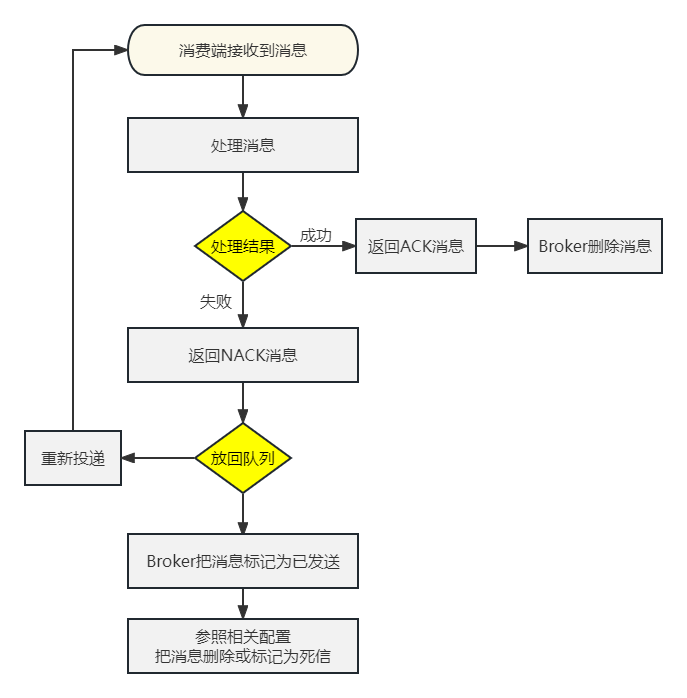


### 七、多啰嗦一句

消费端如果设定消息重新放回队列，Broker重新投递消息，那么消费端就可以再次消费消息，这是一种“重试”机制，这需要消费端代码支持“<span style="color:blue;font-weight:bold;">幂等性</span>”——这属于前置知识，不展开了。
