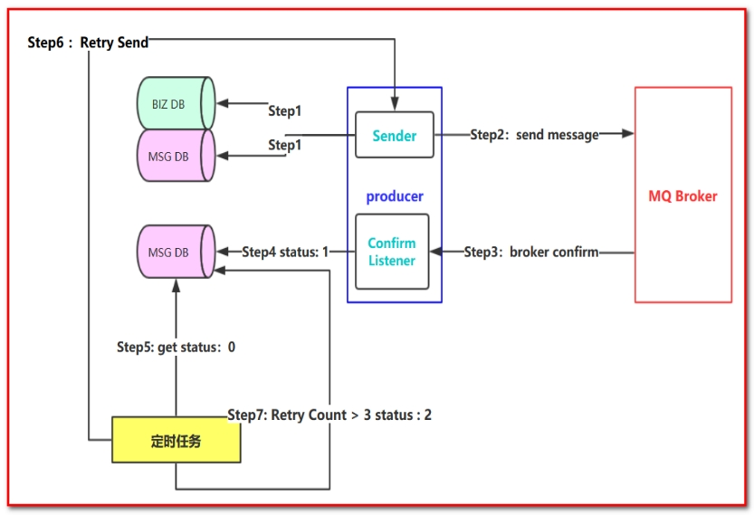
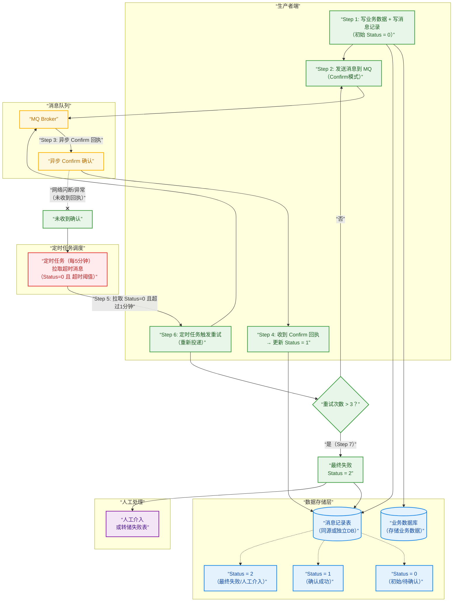
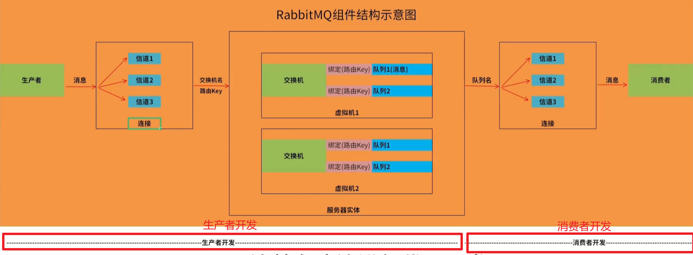
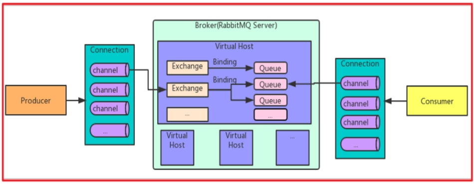
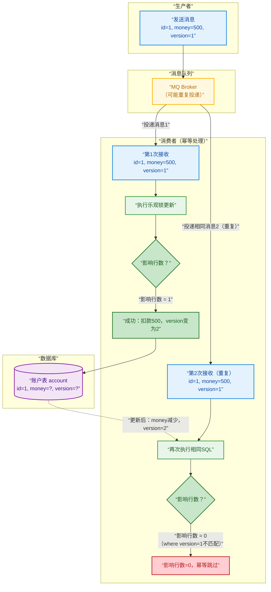

## 1.消息百分百成功投递

谈到消息的可靠性投递，无法避免的，在实际的工作中会经常碰到，比如一些核心业务需要保障消息不丢失，接下来我们看一个可靠性投递的流程图，说明可靠性投递的概念：





:::: steps 

1. Step 1： 

   **首先把消息信息(业务数据）存储到数据库中，紧接着，我们再把这个消息记录也存储到一张消息记录表里（或者另外一个同源数据库的消息记录表）**

2. Step 2：

   **发送消息到MQ Broker节点（采用confirm方式发送，会有异步的返回结果）**

3. Step 3、4：

   **生产者端接受MQ Broker节点返回的Confirm确认消息结果，然后进行更新消息记录表里的消息状态。比如默认Status = 0 当收到消息确认成功后，更新为1即可！**

4. Step 5：

   **但是在消息确认这个过程中可能由于网络闪断、MQ Broker端异常等原因导致 回送消息失败或者异常。这个时候就需要发送方（生产者）对消息进行可靠性投递了，保障消息不丢失，100%的投递成功！（有一种极限情况是闪断，Broker返回的成功确认消息，但是生产端由于网络闪断没收到，这个时候重新投递可能会造成消息重复，需要消费端去做幂等处理）所以我们需要有一个定时任务，（比如每5分钟拉取一下处于中间状态的消息，当然这个消息可以设置一个超时时间，比如超过1分钟 Status = 0 ，也就说明了1分钟这个时间窗口内，我们的消息没有被确认，那么会被定时任务拉取出来）**

5. Step 6：

   **接下来我们把中间状态的消息进行重新投递 retry send，继续发送消息到MQ ，当然也可能有多种原因导致发送失败**

6. Step 7：

   **我们可以采用设置最大努力尝试次数，比如投递了3次，还是失败，那么我们可以将最终状态设置为Status = 2 ，最后 交由人工解决处理此类问题（或者把消息转储到失败表中）。**

::::


## 2.消息幂等性保障

> **`幂等性`指`一次和多次请求某一个资源`，对于资源本身应该`具有同样的结果`。也就是说，其`任意多次执行`对`资源本身所产生的影响`均与`一次执行`的`影响相同`。**



 

> **在MQ中指，消费多条`相同的消息`，得到与消费该消息`一次相同的结果`。**

> ==**消息幂等性保障 乐观锁机制**==



::: note 

1. 关键流程说明（乐观锁机制）

图中的颜色区分了不同角色，重点展示**第二次重复消息被幂等拦截**的过程：

- **生产者（蓝色）** 发送初始消息：`{id=1, money=500, version=1}`。

- **MQ（黄色）** 可能因为网络或重试机制，将 **同一条消息投递了两次**（重复消费场景）。

- **消费者（绿色）** 执行 SQL：

  ```sql
  UPDATE account 
  SET money = money - 500, version = version + 1 
  WHERE id = 1 AND version = 1
  ```

- **数据库（紫色）** 首次执行成功（影响1行），`version` 从 1 变为 2，`money` 减少 500。

- **第二次重复消息** 到达时，再次执行同样的 SQL，但此时数据库中的 `version` 已经是 2，`WHERE version = 1` 条件不满足，**影响行数为 0**。

- 影响行数为 0 表示该消息已被处理过，消费者直接跳过或返回 ACK，保证了**幂等性**——扣款只发生一次。

2. 乐观锁幂等的核心要点

| 要素     | 说明                                                     |
| :------- | :------------------------------------------------------- |
| 适用场景 | 更新同一行数据，且需要避免重复扣款、重复累加等操作       |
| 前提条件 | 记录必须带有版本号（version）或时间戳（last_updated）    |
| 一次消费 | `version` 匹配 → 更新成功，版本号自增                    |
| 重复消费 | `version` 已改变 → 更新影响 0 行，判定为重复，直接忽略   |
| 优点     | 无需额外去重表或 Redis，完全依赖数据库行锁机制，轻量可靠 |

这个流程图可以直接用于技术方案讲解或设计文档中，清晰说明了乐观锁如何解决消息重复消费问题。

:::

> ==**消息幂等性保障 乐观锁机制**==

:::: steps 

1. 生产者发送消息：

```sql
id=1,money=500,version=1
```


2. 消费者接收消息

```sql
id=1,money=500,version=1

id=1,money=500,version=1
```


3. 消费者需要保证幂等性：第一次执行SQL语句

+ **第一次执行：`version=1`**

```sql
update account set money = money - 500 , version = version + 1
where id = 1 and version = 1
```


4. 消费者需要保证幂等性：第二次执行SQL语句

+ **第二次执行：`version=2`**

```sql
update account set money = money - 500 , version = version + 1
where id = 1 and version = 1
```


