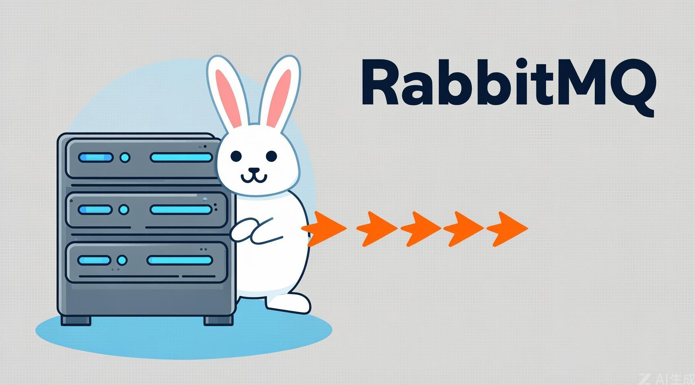
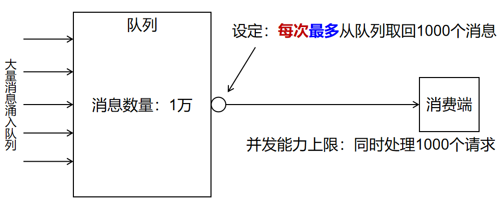
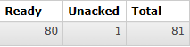
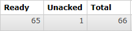

## 一、概述



- 生产者发送10000个消息
- 消费端并发能力上限：同时处理1000个请求
- 设定：

​		每次最多从队列取回1000个请求


## 二、生产者端代码

```java
// 测试消费者限流，模拟高并发消息
@Test
public void testSendConcurrentMessage() {
      for (int i = 1; i <= 10000; i++) {
          rabbitTemplate.convertAndSend(
                  "exchange.direct.order", // 指定交换机名称
                  "order", // 指定路由键key名称
                  "Hello xingji" + i); // 消息内容
      }
}
```


## 三、消费者端代码

```java
// 1.业务逻辑处理，可以操作数据库完成CRUD
log.info("msg = " + msg);
log.info("message = " + message);

// int i = 1 / 0; // 模拟业务异常

// 2.手动确认消息
/*
deliveryTag：消息的唯一标识，表示对那个消息进行确认。
multiple：true 批量确认多个消息，效率高。推荐重要的消息，每个消息都要手动的确认，并且一个一个确认。
*/
channel.basicAck(deliveryTag, false);

// 模拟业务处理时间，每睡眠5秒处理一次消息
Thread.sleep(500);
```


## 四、测试

### 1、未使用prefetch

- **不要启动消费端程序，如果正在运行就把它停了**
- **运行`生产者端程序发送100条消息`**
- **查看队列中消息的情况：**


::: tip

- 说明：
  - **`Ready`表示`已经发送到队列的消息数量`**
  - **`Unacked`表示`已经发送到消费端但是消费端尚未返回ACK信息的消息数量`**
  - **`Total`未被`删除的消息总数`**

- **接下来启动消费端程序，再查看队列情况：**


- **能看到消息全部被消费端取走了，正在逐个处理、确认，说明有多少消息消费端就并发处理多少**

:::


### 2、设定prefetch

#### ①YAML配置

```yaml
spring:
  rabbitmq:
    host: localhost
    port: 5672 # 基于AMQP协议
    username: guest # 默认用户名
    password: 123456 # 默认密码
    virtual-host: / # 默认虚拟主机,用于管理交换机和队列，以及之间的绑定关系
    listener:
      simple:
        acknowledge-mode: manual # 把消息确认模式改为手动确认
        prefetch: 100 # 消费者端限流。确认了消息再补发。一般配合手动确认。
```


#### ②测试流程

- **停止消费端程序**
- **运行生产者端程序发送100条消息**
- **查看队列中消息的情况：**


::: tip

- **接下来启动消费端程序，持续观察队列情况：**







> **能看到消息不是一次性全部取走的，而是有个过程**

:::
