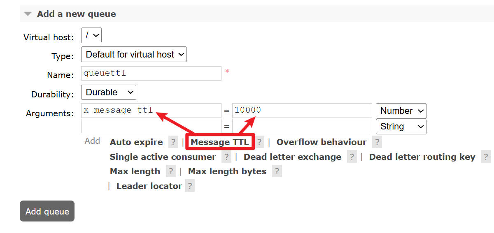
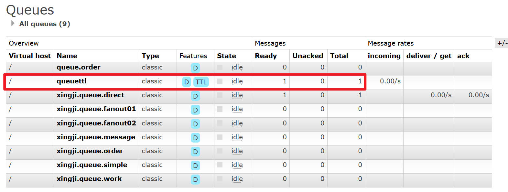
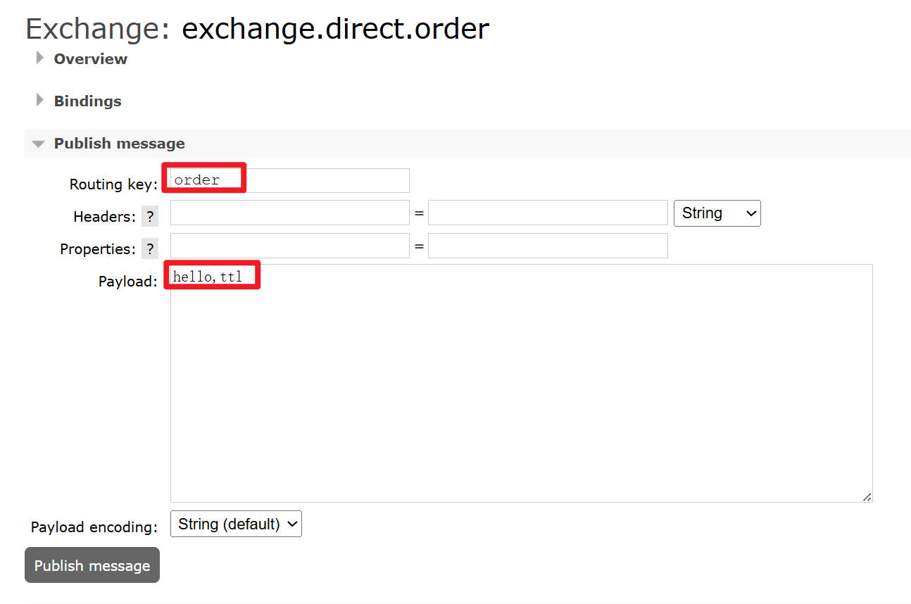
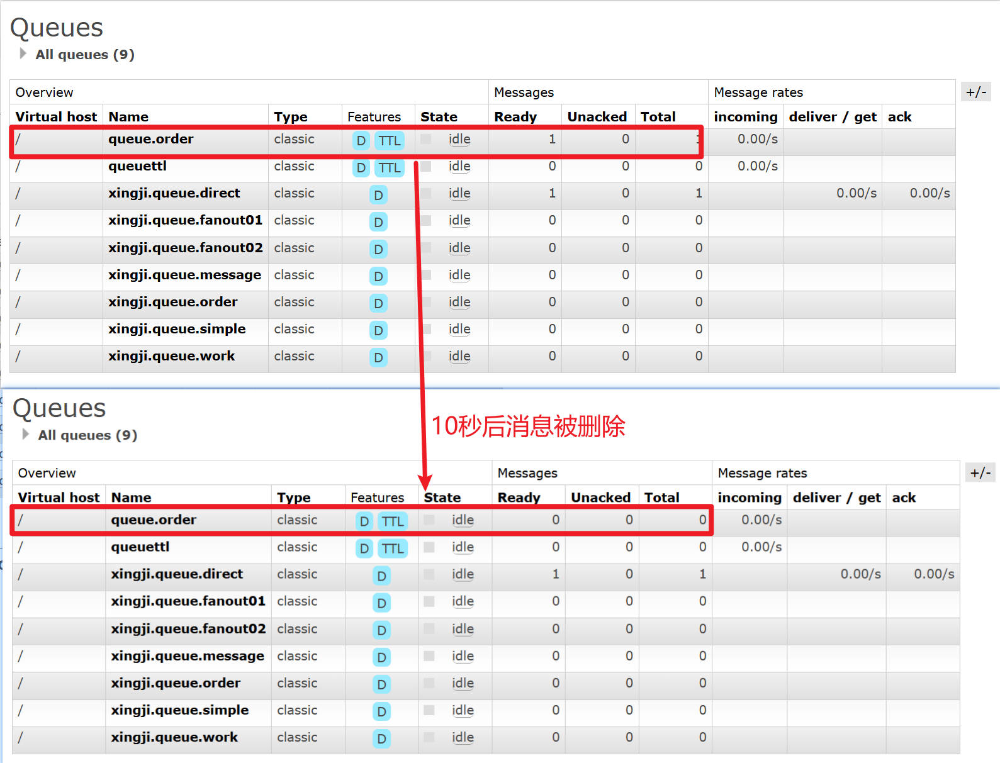
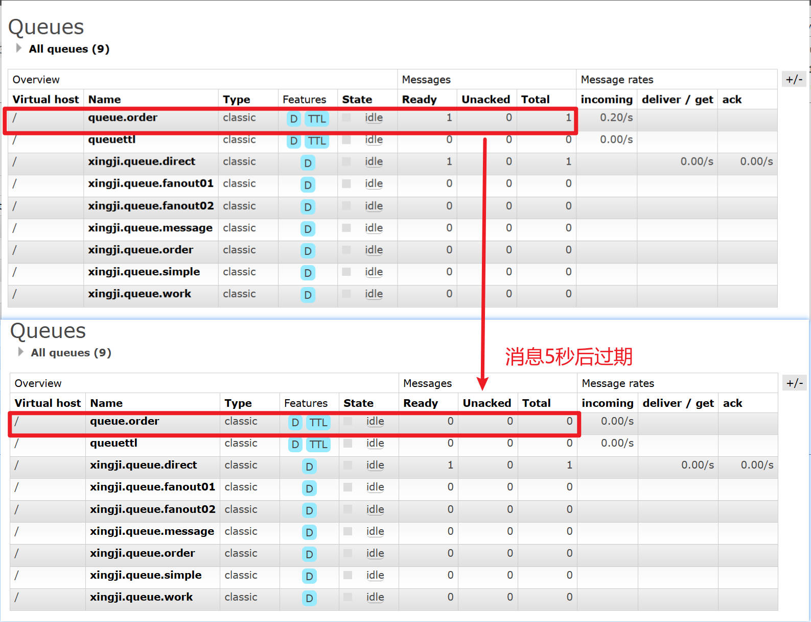

## 1.概述

**`TTL`全称`Time To Live（存活时间/过期时间）`**

**当`消息到达存活时间后`，还`没有被消费`，会被`自动清除`。**

**RabbitMQ可以对`消息设置过期时间`，也可以对`整个队列（Queue）设置过期时间`。**


## 2.具体实现

### 一、队列层面设置

#### 1、设置




#### 2、测试

- 不启动消费端程序
- 向设置了过期时间的队列中发送1条消息
- 等10秒后，看是否全部被过期删除




#### 3.示例代码

```java
package fun.xingji.mq.listener;

import com.rabbitmq.client.Channel;
import lombok.extern.slf4j.Slf4j;
import org.springframework.amqp.core.ExchangeTypes;
import org.springframework.amqp.core.Message;
import org.springframework.amqp.rabbit.annotation.*;
import org.springframework.stereotype.Component;

@Slf4j
@Component
public class ConsumerMessageListener {

    // 利用注解方式创建交换机、队列、绑定关系
    /*
    name = "queue.order" , 指定队列名称
    durable = "true" ,是否支持持久化
    exclusive = "false" , 是否排他性队列（仅限于当前连接有效）,当前连接断开后，队列自动删除
    autoDelete = "false" , 是否自动删除队列（没有消费者时），当最后一个消费者断开连接后，队列自动删除
    declare = "true" , 队列不在就创建，队列已经存在就直接使用。注意：队列属性信息必须一致。队列属性不能修改。只能删除重建。

    internal = "false" , 是否为内部队列，内部队列只给内部模块访问，不对外暴露。

    x-message-ttl="10000" 队列的总体超时设置

    队列一旦修改，属性信息不能修改。只能删除重建。
    Shutdown Signal: channel error; protocol method: #method<channel.close>(reply-code=406,
    reply-text=PRECONDITION_FAILED - inequivalent arg 'x-message-ttl' for queue 'queue.order'
    in vhost '/': received the value '10000' of type 'longstr' but current is none, class-id=50, method-id=10)
     */
    @RabbitListener(
            bindings = {
                    @QueueBinding(
                            value = @Queue(name = "queue.order", durable = "true", exclusive = "false", autoDelete = "false", declare = "true",
                                    // 队列的总体超时设置
                                    arguments = {
                                            @Argument(name = "x-message-ttl", value = "10000", type = "java.lang.Integer")
                                    }),
                            exchange = @Exchange(name = "exchange.direct.order", durable = "true", type = ExchangeTypes.DIRECT, autoDelete = "false", internal = "false", declare = "true"),
                            key = {
                                    "order", "xxx"
                            }
                    )
            }
    )
    public void messageHandler(String msg, Message message, Channel channel) throws Exception {
        // 获取消息的唯一标识：id
        long deliveryTag = message.getMessageProperties().getDeliveryTag();
        try {
            // 1.业务逻辑处理，可以操作数据库完成CRUD
            log.info("msg = " + msg);// 1.业务逻辑处理，可以操作数据库完成CRUD
            log.info("msg = " + msg);
            log.info("message = " + message);

            // int i = 1 / 0; // 模拟业务异常

            // 2.手动确认消息
            /*
            deliveryTag：消息的唯一标识，表示对那个消息进行确认。
            multiple：true 批量确认多个消息，效率高。推荐重要的消息，每个消息都要手动的确认，并且一个一个确认。
             */
            channel.basicAck(deliveryTag, false);

            // 模拟业务处理时间，每睡眠5秒处理一次消息
            Thread.sleep(500);
            log.info("message = " + message);

            // int i = 1 / 0; // 模拟业务异常

            // 2.手动确认消息
            /*
            deliveryTag：消息的唯一标识，表示对那个消息进行确认。
            multiple：true 批量确认多个消息，效率高。推荐重要的消息，每个消息都要手动的确认，并且一个一个确认。
             */
            channel.basicAck(deliveryTag, false);

            // 模拟业务处理时间，每睡眠5秒处理一次消息
            Thread.sleep(500);

        } catch (Exception e) {
            Boolean redelivered = message.getMessageProperties().getRedelivered(); // 信息是否为重复投递

            if (!redelivered) { // 不是重复投递
                // 重复投递多次，拒绝消息，不再重新投递。
                channel.basicNack(deliveryTag, false, true); // requeue=true，给一次重复处理的机会
            } else {
                // 不确认，还不能回到原队列，要么丢弃，要么进入死信队列。
                channel.basicReject(deliveryTag, false); // requeue=false，不再处理
            }
        }
    }
}
```

+ **发送消息**



+ **消息发送到队列中，10秒后过期删除**




### 二、消息层面设置

#### 1、设置

```java
import org.springframework.amqp.core.Message;
import org.springframework.amqp.core.MessagePostProcessor;

// 测试消息单独过期设置
@Test
public void testSendMessageTTL() {
        // 消息单独过期设置
        MessagePostProcessor messagePostProcessor = (message) -> {
            // 队列过期设置和消息过期设置同时存在，以时间短生效
            message.getMessageProperties().setExpiration("5000");
            return message;
        };

        rabbitTemplate.convertAndSend(
                "exchange.direct.order", // 指定交换机名称
                "order", // 指定路由键key名称
                "Hello xingji ttl" + messagePostProcessor); // 消息内容
}
```


#### 2、查看效果

这次我们是发送到普通队列上：

