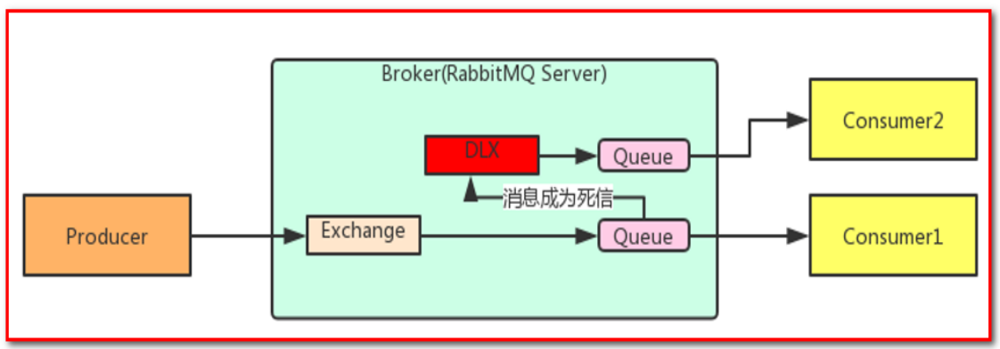
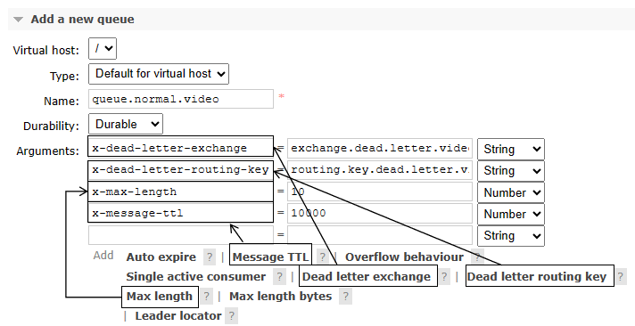
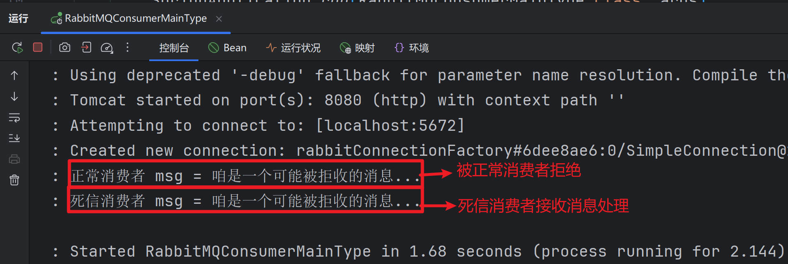
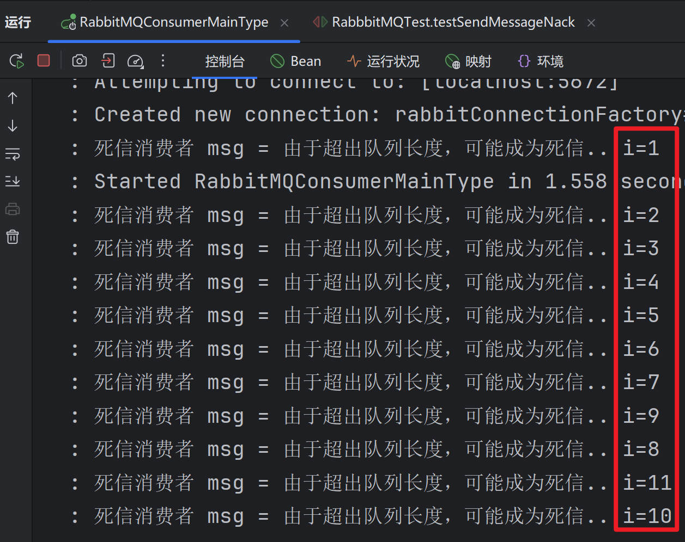
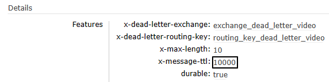
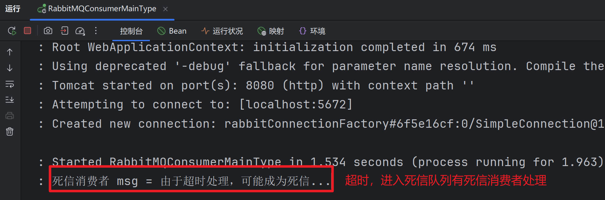

## 1.概述

### 1.1 什么是死信队列

**==`死信队列`，英文缩写：`DLX` 。`DeadLetter Exchange（死信交换机）`，当消息成为`Dead message`后，可以被`重新发送到另一个交换机`，这个`交换机就是DLX`。==**



先从概念解释上搞清楚这个定义，死信，顾名思义就是无法被消费的消息，字面意思可以这样理解，一般来说，producer将消息投递到broker或者直接到queue里了，consumer从queue取出消息进行消费，但某些时候由于特定的原因导致queue中的某些消息无法被消费，这样的消息如果没有后续的处理，就变成了死信，有死信，自然就有了死信队列；


### 1.2 **消息成为死信的三种情况**

::: tip :::

* **==拒绝==：** **消费者拒接消息，basicNack()/basicReject()，并且不把消息重新放入原目标队列，requeue=false**
* **==溢出==：** **队列中消息数量到达限制。比如队列最大只能存储10条消息，且现在已经存储了10条，此时如果再发送一条消息进来，根据先进先出原则，队列中最早的消息会变成死信**
* **==超时==：** **消息`到达超时时间未被消费`**

:::


### 1.3 死信的处理方式

**死信的产生既然不可避免，那么就需要从实际的业务角度和场景出发，对这些死信进行后续的处理，常见的处理方式大致有下面几种：**

::: tip

**① ==丢弃==，**如果不是很重要，可以选择丢弃

**② ==记录死信入库==，**然后做后续的业务分析或处理

**③ ==通过死信队列==，**由负责监听死信的应用程序进行处理

综合来看，更常用的做法是第三种，即通过死信队列，将产生的死信通过程序的配置路由到指定的死信队列，然后应用监听死信队列，对接收到的死信做后续的处理

:::


## 2.实现

### 一、测试相关准备

#### 1、创建死信交换机和死信队列

常规设定即可，没有特殊设置：

- ==死信交换机：`exchange.dead.letter.video`==
- ==死信队列：`queue.dead.letter.video`==
- ==死信路由键：`routing.key.dead.letter.video`==


#### 2、创建正常交换机和正常队列

<span style="color:blue;font-weight:bolder;">注意</span>：一定要注意正常队列有诸多限定和设置，这样才能让无法处理的消息进入死信交换机



- ==正常交换机：`exchange.normal.video`==
- ==正常队列：`queue.normal.video`==
- ==正常路由键：`routing.key.normal.video`==


全部设置完成后参照如下细节：


#### 3、Java代码中的相关常量声明

```java
// 正常交换机和死信交换机
public static final String EXCHANGE_NORMAL = "exchange.normal.video";
public static final String EXCHANGE_DEAD_LETTER = "exchange.dead.letter.video";

// 正常路由键和死信路由键
public static final String ROUTING_KEY_NORMAL = "routing.key.normal.video";
public static final String ROUTING_KEY_DEAD_LETTER = "routing.key.dead.letter.video";

// 正常队列和死信队列
public static final String QUEUE_NORMAL = "queue.normal.video";
public static final String QUEUE_DEAD_LETTER = "queue.dead.letter.video";
```


### 二、消费端拒收消息

#### 1、发送消息的代码

```java
// DLX死信队列 测试1 测试消费端拒收
@Test
public void testSendMessageNack() {
      rabbitTemplate.convertAndSend(
              EXCHANGE_NORMAL, // 正常交换机
              ROUTING_KEY_NORMAL, // 正常路由键
              "咱是一个可能被拒收的消息...");
}
```


#### 2、接收消息的代码

##### ①监听正常队列

```java
// 正常消费者
// 监听正常队列，但是拒绝消息
@RabbitListener(queues = QUEUE_NORMAL)
public void nackHandler(String msg, Message message, Channel channel) throws Exception {
        long deliveryTag = message.getMessageProperties().getDeliveryTag();
        log.info("正常消费者 msg = " + msg);
        channel.basicNack(deliveryTag, false, false); // 拒收不能回原队列，只能进入死信队列
}
```


##### ②监听死信队列

```java
// 死信消费者
// 监听死信队列，进入死信队列进行处理
@RabbitListener(queues = QUEUE_DEAD_LETTER)
public void dlxHandler(String msg, Message message, Channel channel) throws Exception {
        long deliveryTag = message.getMessageProperties().getDeliveryTag();
        log.info("死信消费者 msg = " + msg);
        channel.basicAck(deliveryTag, false); // 死信消费者正常处理消息
}
```


#### 3、执行结果




### 三、消息数量超过队列容纳极限

#### 1、发送消息的代码

```java
@Test
public void testSendMessageNack() {
        // DLX死信队列 测试3 测试超出队列长度成为死信-溢出
        for (int i = 1; i <= 11; i++) {
            rabbitTemplate.convertAndSend(
                    EXCHANGE_NORMAL, // 正常交换机
                    ROUTING_KEY_NORMAL, // 正常路由键
                    "由于超出队列长度，可能成为死信...i=" + i);
        }
}
```


#### 2、接收消息的代码

消息接收代码不再拒绝消息：

```java
// 死信消费者
@RabbitListener(queues = QUEUE_DEAD_LETTER)
public void dlxHandler(String msg, Message message, Channel channel) throws Exception {
        long deliveryTag = message.getMessageProperties().getDeliveryTag();
        log.info("死信消费者 msg = " + msg);
        channel.basicAck(deliveryTag, false); // 死信消费者正常处理消息
}
```

重启微服务使代码修改生效。


#### 3、执行效果

正常队列的参数如下图所示：


生产者发送20条消息之后，消费端死信队列接收到前10条消息：




### 四、消息超时未消费

#### 1、发送消息的代码

正常发送一条消息即可，所以使用第一个例子的代码。

```java
@Test
public void testSendMessageNack() {
      // DLX死信队列 测试2 测试超时成为死信
      rabbitTemplate.convertAndSend(
              EXCHANGE_NORMAL, // 正常交换机
              ROUTING_KEY_NORMAL, // 正常路由键
              "由于超时处理，可能成为死信...");
}
```


#### 2、执行效果

队列参数生效：




因为没有消费端监听程序，所以消息未超时前滞留在队列中：


消息超时后，进入死信队列：


