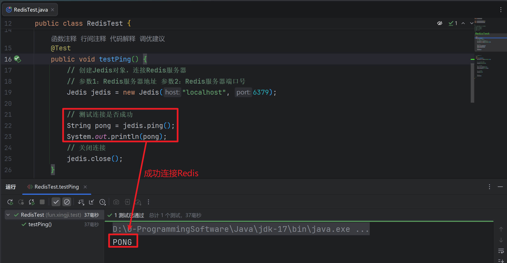

## 第一节 Jedis简介

```纯文本
Redis不仅是使用命令来操作，现在基本上主流的语言都有客户端支持，比如java、C、C#、C++、php、Node.js、Go等。在官方网站里列一些Java的客户端，有Jedis、Redisson、Jredis、JDBC-Redis、等其中官方推荐使用Jedis和Redisson。 在企业中用的最多的就是Jedis。Jedis提供了完整Redis命令，而Redisson有更多分布式的容器实现。
```


## 第二节 环境准备

> 1. **创建maven普通项目,导入如下依赖**

```xml
<dependencies>
        <!-- 引入Jedis依赖 -->
        <dependency>
            <groupId>redis.clients</groupId>
            <artifactId>jedis</artifactId>
            <version>2.9.0</version>
        </dependency>
        <!-- 引入JUnit5依赖 -->
        <!-- https://mvnrepository.com/artifact/org.junit.jupiter/junit-jupiter-api -->
        <dependency>
            <groupId>org.junit.jupiter</groupId>
            <artifactId>junit-jupiter-api</artifactId>
            <version>5.8.1</version>
            <scope>test</scope>
        </dependency>
</dependencies>
```

::: tip

> 2. **虚拟机和Redis设置**

-   **禁用Linux的`防火墙`：`Linux(CentOS7)里执行命令`**
-   **`systemctl stop/disable firewalld.service`**
-   **`redis.conf`中`注释掉bind 127.0.0.1 `,然后 `protected-mode 的值设置为no`**

:::

> 3. **测试JAVA程序和Redis之间的通信**

```java
package fun.xingji.test;

import org.junit.jupiter.api.Test;
import redis.clients.jedis.Jedis;

/*
总结： 1. Jedis是Jedis客户端的类，用于连接Redis服务器
2. Jedis对象可以用来操作Redis数据库
3. Jedis对象可以用来执行Redis命令
4. Jedis不推荐使用...
 */
public class RedisTest {
    @Test
    public void testPing() {
        // 创建Jedis对象，连接Redis服务器
        // 参数1：Redis服务器地址 参数2：Redis服务器端口号
        Jedis jedis = new Jedis("localhost", 6379);

        // 测试连接是否成功
        String pong = jedis.ping();
        System.out.println(pong);
        // 关闭连接
        jedis.close();
    }
}
```




## 第三节 key相关API

```java
@Test
public void testKeyAPI(){
    jedis.set("k1", "v1");
    // 添加 键值对并设置过期时间
    jedis.setex("k2",100, "v2");
    jedis.set("k3", "v3");
    // 获取所有的键
    Set<String> keys = jedis.keys("*");
    System.out.println(keys.size());
    for (String key : keys) {
        System.out.println(key);
    }
    // 判断某个键是否存在
    System.out.println(jedis.exists("k1"));
    // 查看键剩余过期时间
    System.out.println(jedis.ttl("k2"));
    // 根据键获取值
    System.out.println(jedis.get("k1"));
}
```


## 第四节 String相关API

```java
// 添加String
System.out.println(jedis.set("k1", "v1"));
// 一次添加多个
System.out.println(jedis.mset("ka","aaa","kb","bbb"));
//  获取
System.out.println(jedis.get("k1"));
// 一次获取多个
System.out.println(jedis.mget("k1","ka","kb"));
// 追加
System.out.println(jedis.append("k1", "vvvvv"));
// 获取长度
System.out.println(jedis.strlen("k1"));
// 不存在时进行设置
System.out.println(jedis.setnx("k1","xxxxx"));
System.out.println(jedis.setnx("k2","10"));
// 增长/减少
System.out.println(jedis.incr("k2"));
System.out.println(jedis.decr("k2"));
System.out.println(jedis.incrBy("k2", 10));
System.out.println(jedis.decrBy("k2", 10));
```


## 第五节 List相关API

```java
@Test
public void testList(){
    // 放入List
    Long lpush = jedis.lpush("klist", "a", "b", "c", "d", "d");
    System.out.println(lpush);
    // 获取List
    List<String> kList = jedis.lrange("klist", 0, -1);
    kList.forEach(System.out::println);
    // 取值
    String klist = jedis.lpop("klist");

}
```


## 第六节 Set相关API

```java
@Test
public void testSet(){
    // 添加一个set集合
    jedis.sadd("skey","a","b","c","d","e");
    // 获取制定的set集合
    Set<String> skey = jedis.smembers("skey");
    skey.forEach(System.out::println);
    //判断是否包含
    System.out.println(jedis.sismember("skey","a"));
    //删除元素
    jedis.srem("skey","a","b");
    //弹出一个元素
    System.out.println(jedis.spop("skey"));
    //弹出N个元素
    System.out.println(jedis.spop("skey",2));
    //从一个set向另一个set移动元素
    jedis.smove("skey","bkey","X");
    // ……

}
```


## 第七节 Hash相关API

```java
// 添加值
jedis.hset("player1","pname","宇智波赵四儿");
jedis.hset("player1","page","14");
jedis.hset("player1","gender","boy");
// 获取值
System.out.println(jedis.hget("player1","pname"));

//  批量添加值
Map<String,String> player2=new HashMap<String,String>();
player2.put("pname","旋涡刘能");
player2.put("page","13");
player2.put("gender","boy");
jedis.hmset("player2",player2);

// 查看filed是否存在
System.out.println(jedis.hexists("player1", "pname"));
// 查看集合中所有的field
Set<String> player1fields = jedis.hkeys("player1");
player1fields.forEach(System.out::println);
// 查看集合中所有的value
List<String> player1vals = jedis.hvals("player1");
player1vals.forEach(System.out::println);
// 给制定属性+1
jedis.hincrBy("player1","page",5);
// 如不存在,添加某个属性
jedis.hsetnx("player1","height","156");
System.out.println(jedis.hget("player1","page"));
System.out.println(jedis.hget("player1","height"));
```


## 第八节 ZSet相关API

```java
// 准备数据
Map<String ,Double> map=new HashMap<>();
map.put("李四",11d);
map.put("王五",8d);
map.put("赵六",20d);
map.put("刘七",3d);
//  添加元素
jedis.zadd("zkey",10,"张三");
jedis.zadd("zkey",map);
 // 升序返回有序
 Set<String> zkeys = jedis.zrange("zkey", 0, -1);
 zkeys.forEach(System.out::println);
 //  降序返回元素
 Set<String> zkeys2 = jedis.zrevrange("zkey", 0, -1);
 zkeys2.forEach(System.out::println);

 System.out.println("===========");
 Set<String> zkeys3 = jedis.zrangeByScore("zkey", 10, 20);
 zkeys3.forEach(System.out::println);
 System.out.println("===========");
 Set<String> zkeys4 = jedis.zrevrangeByScore("zkey", 20, 10);
 zkeys4.forEach(System.out::println);
 // 增加分数
 jedis.zincrby("zkey",5,"张三");
 jedis.zincrby("zkey",-5,"赵六");
 //  删除 元素
 jedis.zrem("zkey","张三");
 System.out.println(jedis.zcount("zkey",10,20));
 System.out.println(jedis.zrank("zkey","李四"));
```
