## 第一节 什么是主从复制

> 主机数据更新后根据配置和策略， 自动同步到备机的master/slaver机制，Master以写为主，Slave以读为主


## 第二节 主从复制的作用

-   读写分离，性能扩展
-   容灾快速恢复

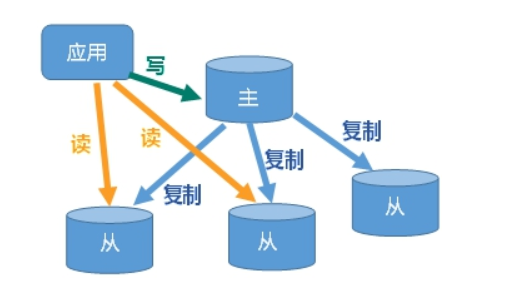


## 第三节 主从复制具体操作

### （1）实现思路

- 1 一个redis服务作为主机,主要负责写操作

- 2 两个redis服务作为从机,主要负责读操作

- 3 从机自动从主机同步数据下来

- 4 从机主动找主机,而主机不会找从机

- 5 正常来说主机和从机应该在不同的IP上开启redis服务,我们为了快速模拟,可以在一台机器上模拟出三个redis服务即可

  

### （2） 一台机器上启动多个redis服务

-   使用redis-server启动服务时,要以来redis.conf配置文件.那么我们可以准备三个redis.conf文件,用来配置三个不同的服务,启动三次分别以来三个不同的服务即可


### （3）新建三个redis配置文件

**用于定义每个服务的专属配置**

- 新建redis6379.conf

  关闭aof功能

  

  ```纯文本
  include /root/myredis/redis.conf
  pidfile /var/run/redis_6379.pid
  port 6379
  dbfilename dump6379.rdb
  ```

  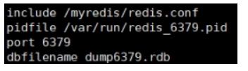

  -   含义介绍

  ```纯文本
  include /root/myredis/redis.conf # 引入共同的配置
  pidfile /var/run/redis_6379.pid # 使用独立的进程文件
  port 6379 # 设置当前服务的端口号
  dbfilename dump6379.rdb # 使用独立的RDB持久化文件  暂时不适用AOP持久化
  ```


- 新建redis6380.conf

  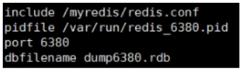

- 新建redis6381.conf

  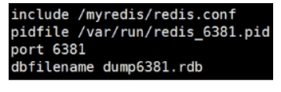

  -   在redis6381中多添加一个配置,设置从机的优先级，值越小，优先级越高，用于选举主机时使用。默认100

  ```纯文本
  replica-priority 10  0-100 哨兵模式下，选举的时候，有用！ 谁的值小谁优先级高！谁当主机！！
  ```


### （4）启动三个服务

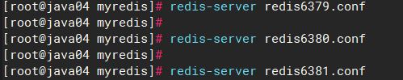


### （5）查看启动服务进程

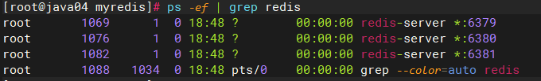


### （6）使用info replication查看主从相关信息

* 连接redis，使用：redis-cli -p 端口号
* 执行 info replication查看信息

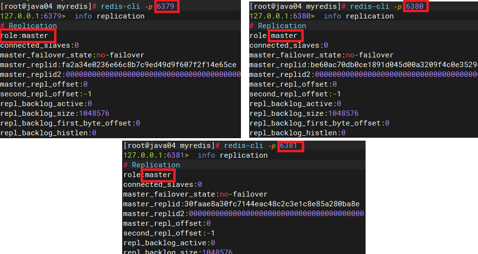


### （7） 配置主从机器

- 配从不配主,是让从机主动去找主机

- 在6380 和6381的机器上执行如下命令

  ```纯文本
  slaveof 127.0.0.1 6379
  ```

- 执行完毕再次查看主从配置信息

  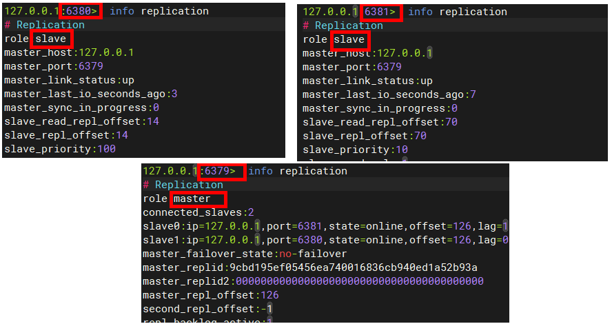


### （8）测试主从读写操作

- 主机上写入数据OK

- 在从机上写数据报错

  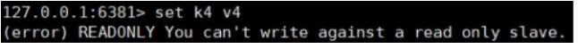

- 主机宕机,重启即可恢复主从状态,无需其他操作

- 从机宕机,重启后需要重新执行 slaveof 127.0.0.1 6379 才能恢复

- 从机可以在配置文件中写入slaveof 127.0.0.1 6379 ,这样重启无需手动输入slaveof 127.0.0.1 6379就可以恢复从机状态

  

## 第四节 主从复制原理

-   Slave启动成功连接到master后会发送一个sync命令
-   Master接到命令启动后台的存盘进程，同时收集所有接收到的用于修改数据集命令， 在后台进程执行完毕之后，master将传送整个数据文件到slave,以完成一次完全同步
-   全量复制：而slave服务在接收到数据库文件数据后，将其存盘并加载到内存中。
-   增量复制：Master继续将新的所有收集到的修改命令依次传给slave,完成同步
-   但是只要是重新连接master,一次完全同步（全量复制)将被自动执行

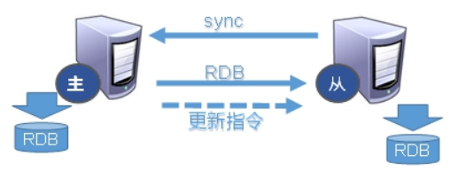


## 第五节 主从复制三种模式

> 第一种 一主多仆

-   问题1: 切入点问题,slave1、slave2是从头开始复制还是从切入点开始复制?比如从k4进来，那之前的k1,k2,k3是否也可以复制？(半路加入,全量赋值,原有小弟,增量复制)
-   问题2 :从机是否可以写？set可否？ (从机 readony)
-   问题3:主机shutdown后情况如何？从机是上位还是[原地待命]？
-   问题4:主机又回来了后，主机新增记录，从机还能否顺利复制？ 
-   问题5:其中一台从机down后情况如何？依照原有它能跟上大部队吗(还会自动变为从机吗?)？ 

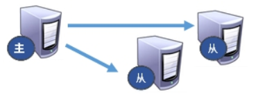

> 第二种 薪火相传

```纯文本
上一个Slave可以是下一个slave的Master，Slave同样可以接收其他 slaves的连接和同步请求，那么该slave作为了链条中下一个的master, 可以有效减轻master的写压力,去中心化降低风险。用 slaveof  <ip><port>
​中途变更转向:会清除之前的数据，重新建立拷贝最新的,风险是一旦某个slave宕机，后面的slave都没法备份,主机挂了，从机还是从机，无法写数据了
```

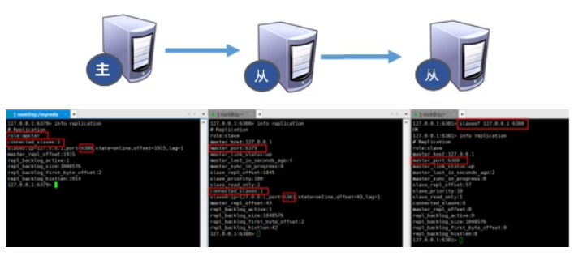

> 第三种 反客为主

-   当一个master宕机后，后面的slave可以立刻升为master，其后面的slave不用做任何修改。用 slaveof no one  将从机变为主机。

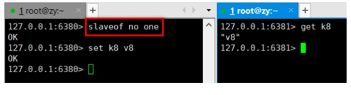

## 第六节 哨兵模式(自动版的反客为主)

### 6.1 哨兵模式简介

> 反客为主的自动版，能够后台监控主机是否故障，如果故障了根据投票数自动将从库转换为主库


### 6.2 哨兵模式的使用步骤

#### （1）第一步: 设置简单的一主二仆

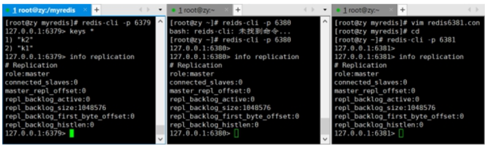


#### （2）第二步: 为哨兵模式准备配置文件

- 在/root/myredis 目录下新建sentinel.conf 配置文件中放入如下内容

  ```text
  sentinel monitor mymaster 127.0.0.1 6379 1
  ```

- 其中mymaster为监控对象起的服务器名称， 1 为至少有多少个哨兵同意迁移的数量。

- 注意: 此处的ip地址可以测试127系列,也可以是真实系列,建议配置成真实系列! &#x20;

#### （3）第三步: 启动哨兵

- 运行/usr/local/bin 下 redis-sentinel 命令,执行/root/myredis/sentinel.conf配置文件

  ```text
  redis-sentinel /root/myredis/sentinel.conf
  ```

- redis做压测可以用自带的redis-benchmark工具 &#x20;

### 6.3 哨兵模式的操作演示

#### （1）主机宕机演示

 	当主机宕机,会从从机中选择一个作为新的主机,根据优先级slave-properity, 原主机重启后会成为从机

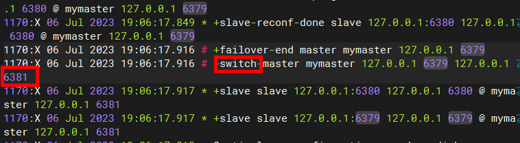


#### （2）复制延时

```纯文本
由于所有的写操作都是先在Master上操作，然后同步更新到Slave上，所以从Master同步到Slave机器有一定的延迟，当系统很繁忙的时候，延迟问题会更加严重，Slave机器数量的增加也会使这个问题更加严重。
```

#### （3）故障恢复

- 优先级在redis.conf中默认：replica-priority 100，值越小优先级越高

- 偏移量是指获得原主机数据最全的

  在 Redis 中，复制偏移量（Replication Offset）是用于表示从节点与主节点之间数据同步的进度的一个重要指标。它是一个递增的整数值，用于记录从节点复制主节点数据时已经复制的字节数量。

  复制偏移量越高，说明从节点复制主节点的数据越完整，数据同步得越快。

- 每个redis实例启动后都会随机生成一个40位的runid

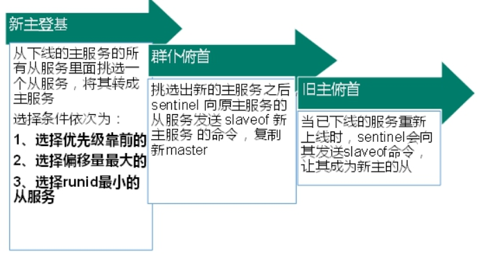


## 第七节 RedisTemplate连接哨兵模式

### 7.1 导入依赖

``` xml
<dependencies>
    <!-- 基本启动 starter - autoconfigure - 142配置类  web-->
    <dependency>
        <groupId>org.springframework.boot</groupId>
        <artifactId>spring-boot-starter-web</artifactId>
    </dependency>

    <dependency>
        <groupId>org.springframework.boot</groupId>
        <artifactId>spring-boot-starter-test</artifactId>
    </dependency>

    <dependency>
        <groupId>org.springframework.boot</groupId>
        <artifactId>spring-boot-starter-data-redis</artifactId>
    </dependency>

    <!-- 连接池-->
    <dependency>
        <groupId>org.apache.commons</groupId>
        <artifactId>commons-pool2</artifactId>
    </dependency>

</dependencies>
```

### 7.2 哨兵配置

``` yaml
spring:
  data:
    redis:
      client-type: lettuce
      lettuce:
        pool:
          enabled: true
          max-active: 8
          max-idle: 5
          max-wait: 100
      sentinel:
        # 哨兵名称
        master: mymaster
        # 哨兵地址,集群继续配置多个
        nodes:
          - 192.168.6.100:26379
```

### 7.3 读写策略配置

``` java
@Configuration
public class RedisTemplateConfig {

    @Bean
    public RedisTemplate<String, Object> redisTemplate(RedisConnectionFactory connectionFactory){
        // 创建RedisTemplate对象
        RedisTemplate<String, Object> template = new RedisTemplate<>();
        // 设置连接工厂
        template.setConnectionFactory(connectionFactory);
        // 创建JSON序列化工具
        GenericJackson2JsonRedisSerializer jsonRedisSerializer =
            							new GenericJackson2JsonRedisSerializer();
        // 设置Key的序列化
        template.setKeySerializer(RedisSerializer.string());
        template.setHashKeySerializer(RedisSerializer.string());
        // 设置Value的序列化
        template.setValueSerializer(jsonRedisSerializer);
        template.setHashValueSerializer(jsonRedisSerializer);
        // 返回
        return template;
    }


    /**
     * 配置主和从节点访问策略
     * - MASTER：从主节点读取
     * - MASTER_PREFERRED：优先从master节点读取，master不可用才读取replica
     * - REPLICA：从slave（replica）节点读取
     * - REPLICA _PREFERRED：优先从slave（replica）节点读取，所有的slave都不可用才读取master
     * @return
     */
    @Bean
    public LettuceClientConfigurationBuilderCustomizer clientConfigurationBuilderCustomizer(){
        //设置访问策略值
        return clientConfigurationBuilder -> clientConfigurationBuilder.readFrom(ReadFrom.REPLICA_PREFERRED);
    }
}
```
