## 第一节 Redis事务和锁机制

### 1.1 Redis事务的定义

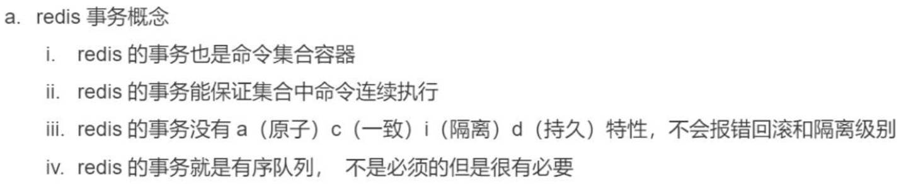

```text
  Redis事务是一个单独的隔离操作：事务中的所有命令都会序列化、按顺序地执行。事务在执行的过程中，不会被其他客户端发送来的命令请求所打断。Redis事务的主要作用就是串联多个命令防止别的命令插队。
```

### 1.2 Redis事务控制命令

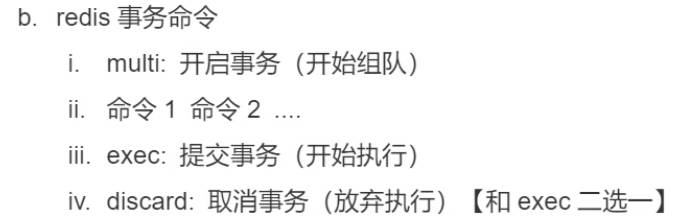

| 命令    | 功能             |
| ------- | ---------------- |
| multi   | 开始组队         |
| exec    | 执行队列中的命令 |
| discard | 取消组队         |

```纯文本
从输入Multi命令开始，输入的命令都会依次进入命令队列中，但不会执行，直到输入Exec后，Redis会将之前的命令队列中的命令依次执行。组队的过程中可以通过discard取消组队
```

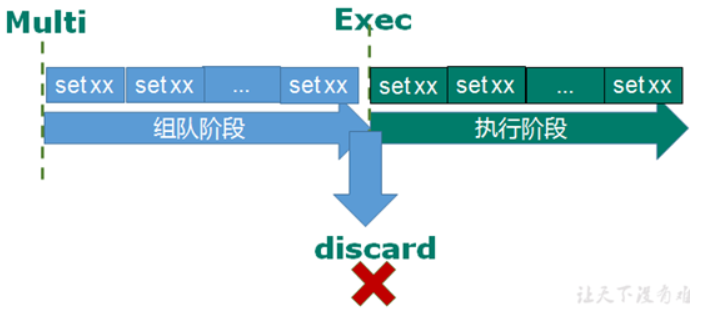

> 情况1 ,组队成功,提交成功

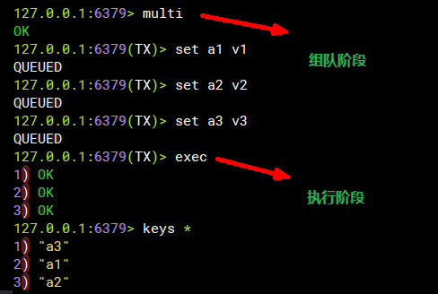


### 1.3 Redis事务错误处理

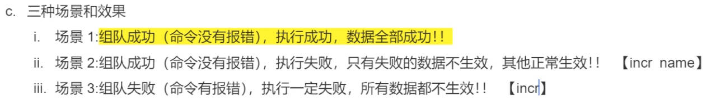

> 情况2,组队报错,提交失败：提交失败组队中某个命令出现了报告错误，执行时整个的所有队列都会被取消

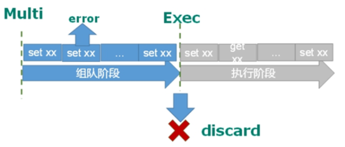

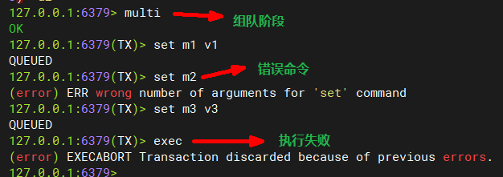


> 情况3, 组队成功,提交时有成功有失败。如果执行阶段某个命令报出了错误，则只有报错的命令不会被执行，其他的命令都会执行，不会回滚。

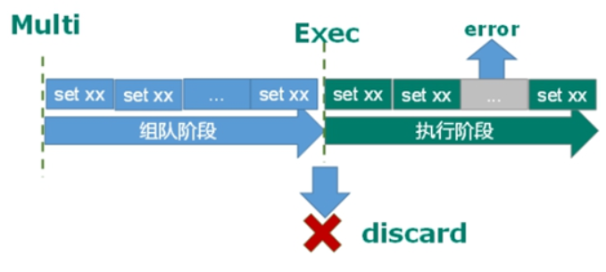

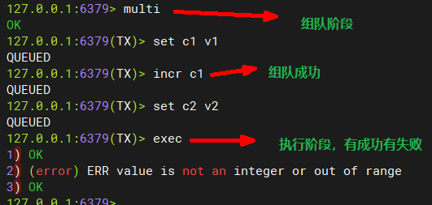


### 1.4 Redis事务和锁案例

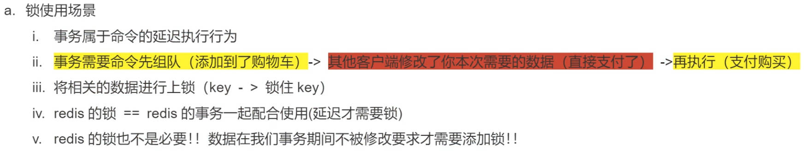

> 场景说明

```纯文本
想想一个场景：有很多人有你的账户,同时去参加双十一抢购  
一个请求想给金额减8000
一个请求想给金额减5000
一个请求想给金额减1000
```

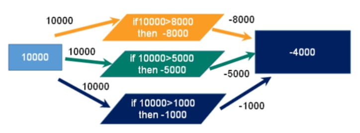

> **悲观锁**

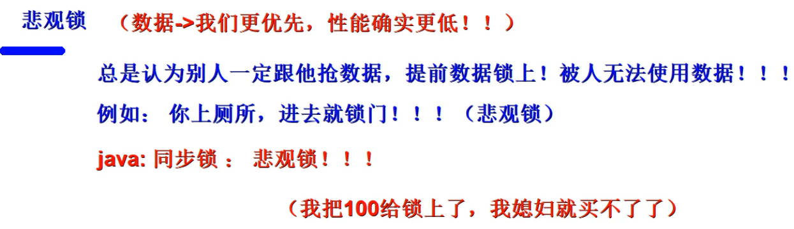

```纯文本
悲观锁(Pessimistic Lock), 顾名思义，就是很悲观，每次去拿数据的时候都认为别人会修改，所以每次在拿数据的时候都会上锁，这样别人想拿这个数据就会block直到它拿到锁。传统的关系型数据库里边就用到了很多这种锁机制，比如行锁，表锁等，读锁，写锁等，都是在做操作之前先上锁。
```

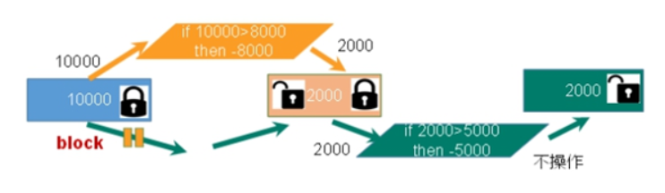

> **乐观锁**

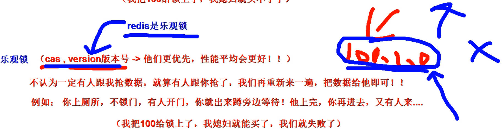

```纯文本
乐观锁(Optimistic Lock), 顾名思义，就是很乐观，每次去拿数据的时候都认为别人不会修改，所以不会上锁，但是在更新的时候会判断一下在此期间别人有没有去更新这个数据，可以使用版本号等机制。乐观锁适用于多读的应用类型，这样可以提高吞吐量。Redis就是利用这种check-and-set机制实现事务的。
```

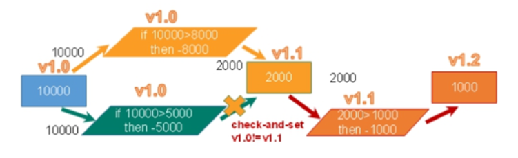

> **监视和取消监视key**

```纯文本
在执行multi之前，先执行watch key1 [key2],可以监视一个(或多个) key ，如果在事务**执行之前这个(或这些) key 被其他命令所改动，那么事务将被打断。**
```

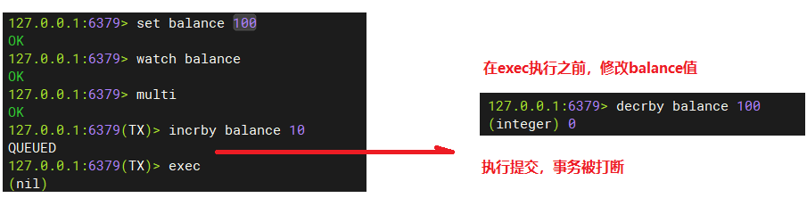

```纯文本
取消 WATCH 命令对所有 key 的监视。如果在执行 WATCH 命令之后，EXEC 命令或DISCARD 命令先被执行了的话，那么就不需要再执行UNWATCH 了。 
```


### 1.5 Redis事务的三个特性

::: tip 

-   单独的隔离操作
    -   事务中的所有命令都会序列化、按顺序地执行。事务在执行的过程中，不会被其他客户端发送来的命令请求所打断。
-   没有隔离级别的概念
    -   队列中的命令没有提交之前都不会实际被执行，因为事务提交前任何指令都不会被实际执行
-   不保证原子性
    -   事务中如果有一条命令执行失败，其后的命令仍然会被执行，没有回滚

:::


### 1.6 使用RedisTemplate进行事务代码演示(了解)

```  java
@Test
public void performTransaction() {
    redisTemplate.setEnableTransactionSupport(true);

    Object execute = redisTemplate.execute(new SessionCallback<Object>() {
        @Override
        public Object execute(RedisOperations operations) throws DataAccessException {
            //可以开启锁
            operations.watch("key1");
            operations.multi(); // 开启事务
            try {
                Thread.sleep(10000);
            } catch (InterruptedException e) {
                throw new RuntimeException(e);
            }
            try {
                // 在事务中执行多个命令
                operations.opsForValue().set("key1", "value111");
                operations.opsForValue().set("key2", "value222");
                operations.exec(); // 提交事务
            } catch (Exception e) {
                e.printStackTrace();
                operations.discard(); // 取消事务，释放锁
            }
            return "xxx";
        }
    });

    System.out.println("execute = " + execute);
}
```


## 第二节 Redis Lua 脚本

### 2.1 什么是LUA

> 什么是LUA脚本


```text
Lua 是一个小巧的[脚本语言](http://baike.baidu.com/item/脚本语言)，Lua脚本可以很容易的被C/C++ 代码调用，也可以反过来调用C/C++的函数，Lua并没有提供强大的库，一个完整的Lua解释器不过200k，所以Lua不适合作为开发独立应用程序的语言，而是作为嵌入式脚本语言。很多应用程序、游戏使用LUA作为自己的嵌入式脚本语言，以此来实现可配置性、可扩展性。这其中包括魔兽争霸地图、魔兽世界、博德之门、愤怒的小鸟等众多游戏插件或外挂。
```

> LUA脚本的优势

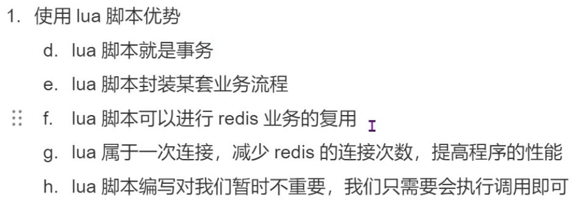

```纯文本
将复杂的或者多步的redis操作，写为一个脚本，一次提交给redis执行，减少反复连接redis的次数。提升性能。
LUA脚本是类似redis事务，有一定的原子性，不会被其他命令插队，可以完成一些redis事务性的操作。但是注意redis的lua脚本功能，只有在Redis 2.6以上的版本才可以使用。利用lua脚本淘汰用户，解决超卖问题。redis 2.6版本以后，通过lua脚本解决争抢问题，实际上是redis利用其单线程的特性，用任务队列的方式解决多任务并发问题。
```

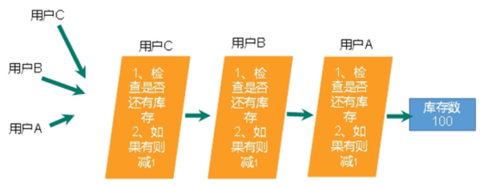


### 2.2 创建SpringBoot工程

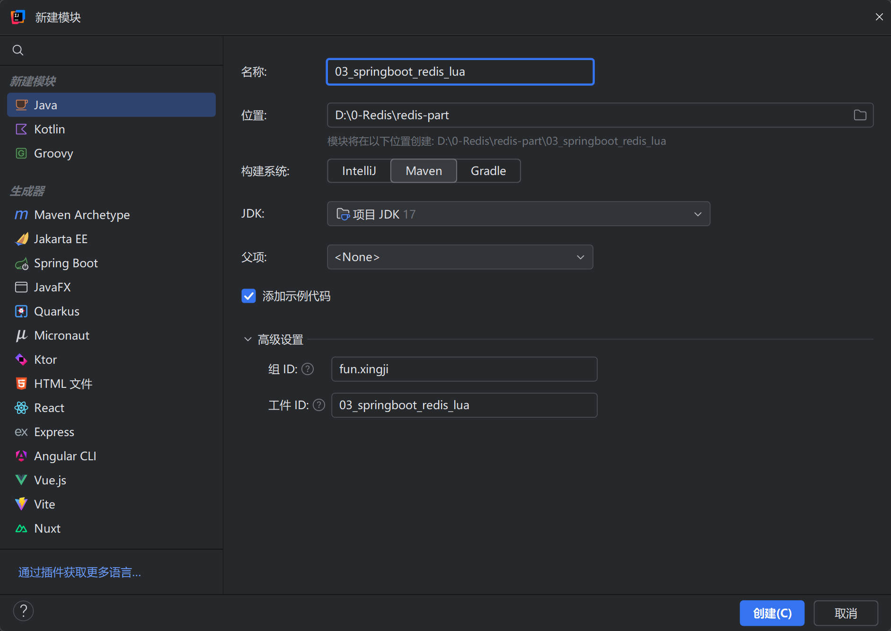


### 2.3 引入相关依赖

```xml
<parent>
    <groupId>org.springframework.boot</groupId>
    <artifactId>spring-boot-starter-parent</artifactId>
    <version>3.0.5</version>
</parent>

<dependencies>
    <dependency>
        <groupId>org.springframework.boot</groupId>
        <artifactId>spring-boot-starter-web</artifactId>
    </dependency>

    <dependency>
        <groupId>org.springframework.boot</groupId>
        <artifactId>spring-boot-starter-test</artifactId>
    </dependency>

    <dependency>
        <groupId>org.springframework.boot</groupId>
        <artifactId>spring-boot-starter-data-redis</artifactId>
    </dependency>
     <!-- 连接池-->
        <dependency>
            <groupId>org.apache.commons</groupId>
            <artifactId>commons-pool2</artifactId>
        </dependency>
        <dependency>
            <groupId>org.projectlombok</groupId>
            <artifactId>lombok</artifactId>
        </dependency>
</dependencies>
```


### 2.4 创建配置文件

```yaml
spring:
  data:
    redis:
      host: localhost # Redis服务器地址
      port: 6379 # Redis服务器连接端口
```


### 2.5 创建LUA脚本

> **创建`文件夹lua`，创建脚本文件`change.lua`**


> **LUA脚本**

```bash
local current = redis.call('GET', KEYS[1])
if current == ARGV[1]
  then redis.call('SET', KEYS[1], ARGV[2])
  return true
end
return false
```


### 2.6 创建配置类

```java
package fun.xingji;


import org.springframework.boot.SpringApplication;
import org.springframework.boot.autoconfigure.SpringBootApplication;
import org.springframework.context.annotation.Bean;
import org.springframework.core.io.ClassPathResource;
import org.springframework.core.io.Resource;
import org.springframework.data.redis.connection.RedisConnectionFactory;
import org.springframework.data.redis.core.RedisTemplate;
import org.springframework.data.redis.core.script.RedisScript;
import org.springframework.data.redis.serializer.GenericJackson2JsonRedisSerializer;
import org.springframework.data.redis.serializer.RedisSerializer;

@SpringBootApplication
public class Main {
    public static void main(String[] args) {
        // 启动SpringBoot应用
        SpringApplication.run(Main.class, args);
    }


    //简单序列化
    @Bean
    public RedisTemplate<String,Object> redisTemplate(RedisConnectionFactory redisConnectionFactory){
        RedisTemplate<String,Object> redisTemplate = new RedisTemplate<>();
        // 设置连接工厂
        redisTemplate.setConnectionFactory(redisConnectionFactory);

        //设置序列化器
        redisTemplate.setKeySerializer(RedisSerializer.string());
        redisTemplate.setHashKeySerializer(RedisSerializer.string());

        // 设置反序列化器
        GenericJackson2JsonRedisSerializer jsonRedisSerializer = new GenericJackson2JsonRedisSerializer();
        // 设置默认的序列化器
        redisTemplate.setValueSerializer(jsonRedisSerializer);
        redisTemplate.setHashValueSerializer(jsonRedisSerializer);

        return redisTemplate;
    }


    //加载lua脚本，设置返回值类型
    @Bean
    public RedisScript<Boolean> booleanRedisScript(){
        //加载脚本文件
        Resource resource = new ClassPathResource("lua/change.lua");
        //参数1： 加载脚本的资源对象 参数2： 返回值类型
        RedisScript<Boolean> booleanRedisScript = RedisScript.of(resource, Boolean.class);
        return booleanRedisScript;
    }
}
```


### 2.7 创建测试类

```java
package fun.xingji.test;

import org.junit.jupiter.api.Test;
import org.springframework.beans.factory.annotation.Autowired;
import org.springframework.boot.test.context.SpringBootTest;
import org.springframework.data.redis.core.RedisTemplate;
import org.springframework.data.redis.core.script.RedisScript;

import java.util.ArrayList;
import java.util.List;


@SpringBootTest
public class RedisTest {

    @Autowired
    private RedisTemplate<String,Object> redisTemplate;

    @Autowired
    private RedisScript<Boolean> redisScript;


    //修改密码 【redis -> password  123456 】
    // 账号 原密码 新密码(654321)
    @Test
    public void testSavePassword(){
        redisTemplate.opsForValue().set("password","123456");
        Object password = redisTemplate.opsForValue().get("password");
        System.out.println("password = " + password);
    }


    @Test
    public void testChangePassword(){
        //1.获取redis账号对应原密码 2.比较原密码和输入的密码 3.修改新的密码

        /**
         * 参数1： 执行的脚本对象
         * 参数2： (keys) 集合 -》是否向脚本内传入keys相关的参数(key集合) -》脚本 KEYS[1] (角标从1开始) “password” (redis 数据key)
         * 参数3： (argv) Object...args （修改的值） -》 argv1 argv2
         */
        //修改密码 【redis -> password  123456 】
        // 账号 原密码 新密码(654321)
        List<String> keys = new ArrayList<>();
        keys.add("password");
        Boolean execute = redisTemplate.execute(redisScript, keys, "123456", "654321");

        if (execute){
            System.out.println("密码修改成功:"+redisTemplate.opsForValue().get("password"));
        }else {
            System.out.println("密码修改失败！！");
        }
    }
}
```

+ **保存密码**

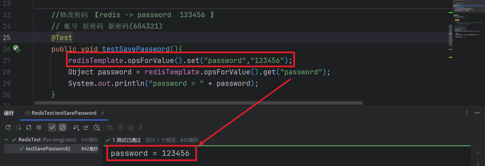

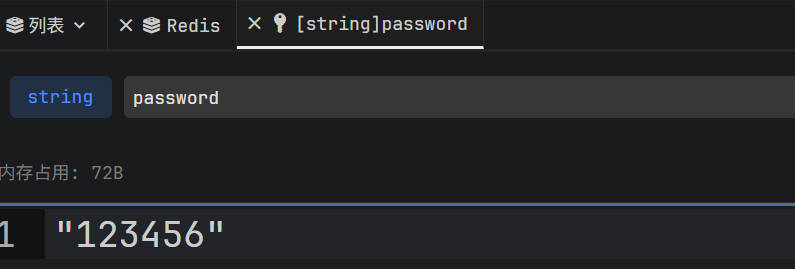

+ **使用lua脚本修改密码**

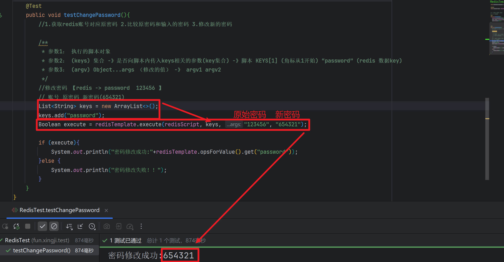

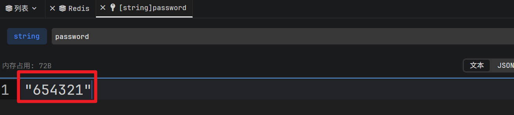

::: tip

* RedisTemplate.execute说明


**RedisTemplate.execute需要传入三个值**

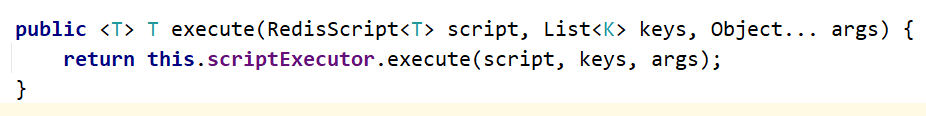

* **第一个参数 RedisScript script：** Lua脚本

- **第二个参数 List keys：**集合
  - 如果是单个参数，使用这个可以转换为**单元素集合**
    - Collections.singletonList(参数)；
  - 多参数
    - `List<String> keys = Arrays.asList(key1, key2, key3);`
- **第三个参数 args：**ARGV，也就是其他类型参数

:::
