## 第一章 NoSQL数据库


### 第一节 NoSQL数据库概述


#### 1.1 什么是NoSQL数据库(Map)

::: tip 

> NoSQL(NoSQL = Not Only SQL )，意即“不仅仅是SQL”，泛指非关系型的数据库。

> NoSQL 不依赖业务逻辑方式存储，而以简单的key-value模式存储。因此大大的增加了数据库的扩展能力。

-   不遵循SQL标准。
-   不支持ACID。
-   远超于SQL的性能。

:::

#### 1.2 NoSQL适用的场景

::: tip 

-   对数据高并发的读写
-   海量数据的读写
-   对数据高可扩展性的

:::

#### 1.3 NoSQL不适用的场景

::: tip 

-   需要事务支持(报错能回滚)
-   基于sql的结构化查询存储，处理复杂的关系查询(显示学生信息 , 显示学生和学生的分数信息)

:::


#### 1.4 常见NoSQL数据库


##### 1.4.1 Memcached


1 很早出现的NoSql数据库

2 **数据都在内存中，一般不持久化**

3 支持简单的key-value模式，**支持类型单一**

4 一般是作为**缓存数据库**辅助持久化的数据库


##### 1.4.2 Redis


1 几乎覆盖了Memcached的绝大部分功能

2 数据都在内存中，**支持持久化，主要用作备份恢复**

3 除了支持简单的key-value模式，还支持多种数据结构的存储，比如 String,list、set、hash、zset等。

4 一般是作为**缓存数据库**辅助持久化的数据库


##### 1.4.3 MongoDB


1 高性能、开源、模式自由(schema free)的**文档型数据库**

2 数据都在内存中， 如果内存不足，把不常用的数据保存到硬盘

3 虽然是key-value模式，但是对value（尤其是**json**）提供了丰富的查询功能

4 支持二进制数据及大型对象

5 可以根据数据的特点**替代RDBMS** ，成为独立的数据库。或者配合RDBMS，存储特定的数据。


### 第二节 DB-Engines数据库排名

查看连接[**http://db-engines.com/en/ranking**](http://db-engines.com/en/ranking "http://db-engines.com/en/ranking")


## 第二章 Redis简介和安装

### 第一节 Redis简介和适用场景

::: tip 

* Redis是当前比较热门的NOSQL系统之一，它是一个开源的使用ANSI c语言编写的key-value存储系统（区别于MySQL的二维表格的形式存储。）

* Redis数据都是缓存在计算机内存中，但是Redis会周期性的把更新的数据写入磁盘或者把修改操作写入追加的记录文件，实现数据的持久化。

* Redis读写速度快，Redis读取的速度是110000次/s，写的速度是81000次/s；

* Redis的所有操作都是原子性的。(不可拆分,redis的命令执行过程中不会被打断和拆分)

* Redis支持多种数据结构：string（字符串），list（列表），hash（哈希），set（集合），zset(有序集合)

* Redis支持集群部署

* 支持过期时间，支持事务，消息订阅

:::

#### 1.1 配合关系型数据库做高速缓存

1 高频次，热门访问的数据，降低数据库IO

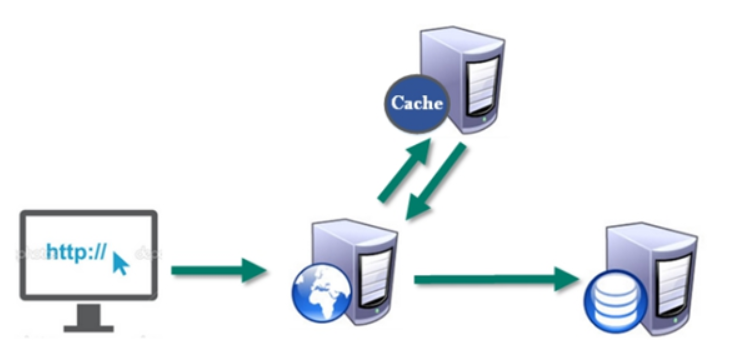

#### 1.2 多样的数据结构存储持久化数据


### 第二节 Redis的安装和基本操作

#### 2.1 Redis的官网和下载

> 官网

| Redis官方网站 | Redis中文官方网站                                       |
| ------------- | ------------------------------------------------------- |
|               | [http://redis.cn/](http://redis.cn/ "http://redis.cn/") |

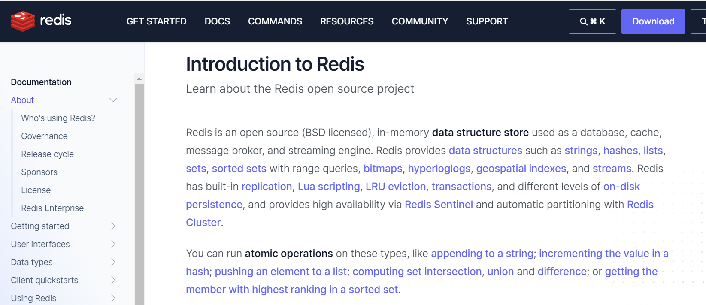


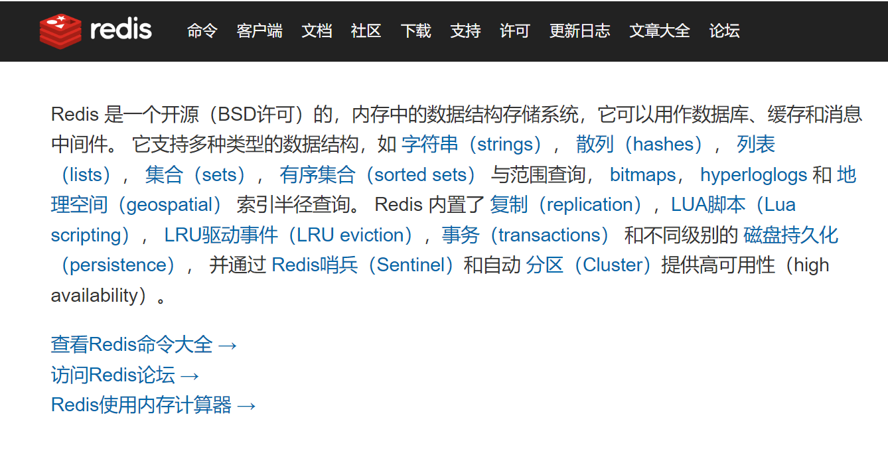

#### 2.2 Redis安装

> 第一步 下载redis及版本选择

- 7. 0.10 for Linux（redis-7.0.10.tar.gz）或者安装新版本

  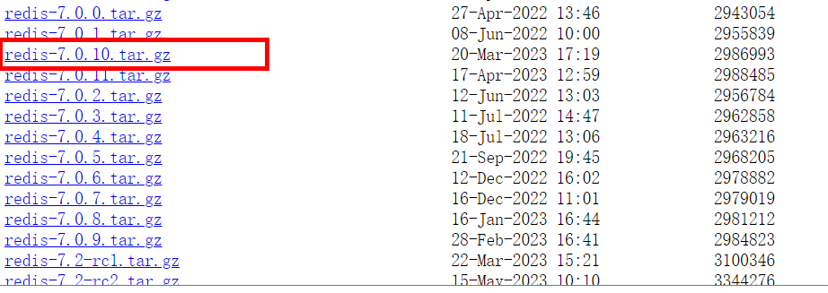

- 不用考虑在windows环境下对Redis的支持

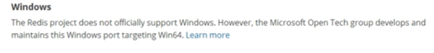

> 第二步 下载安装最新版本的gcc编译器

- 安装C语言环境

  ```纯文本
  yum -y install gcc
  ```

- 测试安装是否成功

  ```纯文本
  gcc --version
  ```

  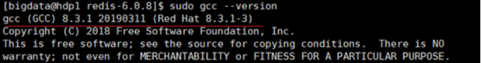

> 第三步 上传redis-7.0.10.tar.gz放/opt目录

> 第四步 解压命令：tar -zxvf redis-7.0.10.tar.gz

> 第五步 解压完成后进入目录：cd redis-7.0.10

> 第六步 在redis-7.0.10目录下再次执行make命令（只是编译好）

- 如果没有准备好C语言编译环境，make 会报错

  -   Jemalloc/jemalloc.h：没有那个文件
      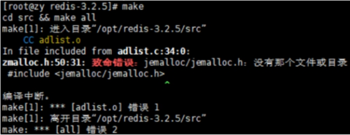
  -   此时解决方案:运行make distclean

  ```纯文本
  make disclean
  ```

  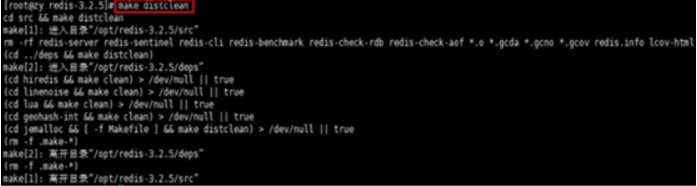

  -   安装好 gcc后再次make
      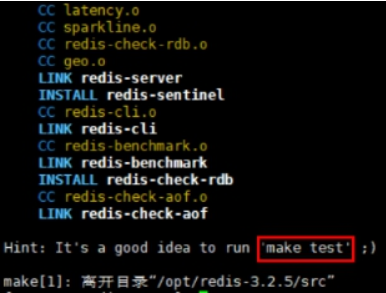

> 第七步 跳过make test,继续执行make install

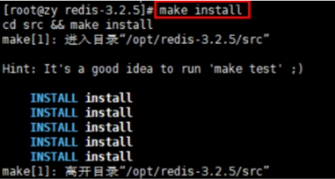


##### Redis安装(Docker)

**Docker运行Redis**: [https://redis.io/docs/latest/operate/oss_and_stack/install/install-stack/docker/](https://redis.io/docs/latest/operate/oss_and_stack/install/install-stack/docker/)

+ **安装redis镜像**

```shell
docker run -d --name redis -p 6379:6379 redis:<version>

# 安装7.0.10版本
docker run -d --name redis -p 6379:6379 redis:7.0.10
```

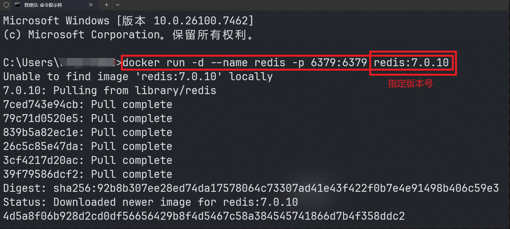

+ **连接Docker容器中的redis-cli工具**

```shell
docker exec -it redis redis-cli
```

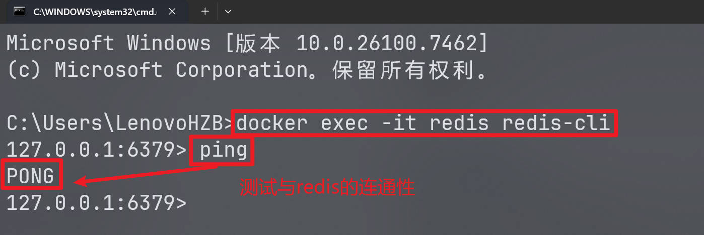


#### 2.3 Redis的启动和停止

##### 2.3.1 查看安装目录

```纯文本
cd /usr/local/bin
```

-   redis-benchmark:性能测试工具，可以在自己本子运行，看看自己本子性能如何
-   redis-check-aof：修复有问题的AOF文件，rdb和aof后面讲
-   redis-check-dump：修复有问题的dump.rdb文件
-   redis-sentinel：Redis集群使用
-   redis-server：Redis服务器启动命令
-   redis-cli：客户端，操作入口


##### 2.3.2 前台启动方式

```纯文本
redis-server  配置文件[后台启动即可]
```

-   不推荐原因: 窗口不能关闭,关闭则服务停止


##### 2.3.3 后台启动方式

-   在/root目录下创建myredis目录,用于存储启动使用的配置文件

```纯文本
cd /root
mkdir myredis
```

-   拷贝一份redis.conf到myredis目录

```纯文本
cp /opt/redis-7.0.10/redis.conf /root/myredis
```

-   修改配置文件中的内容         daemonize no改成yes&#x20;

```纯文本
修改redis.conf(309行附近?或者搜索 ) 文件将里面的daemonize no 改成 yes，让服务在后台启动  
修改配置文件中的 bind ,注释该配置,取消绑定仅主机登录(89)
修改protected-mode 为no,取消保护模式(111)
```

-   启动redis时,使用我们自己修改之后的配置文件

```纯文本
redis-server /root/myredis/redis.conf
```

-   查看服务启动状态

```纯文本
ps -ef | grep redis
```


##### 2.3.4 通过客户端连接redis

-   通过客户端指令连接redis

```text
redis-cli
```

-   如果想退出客户端可以 按 Ctrl+c  ,退出客户端不会关闭redis服务
-   通过客户端连接制定端口下的redis (默认6379)

```text
redis-cli -p 6379
```

-   连接后,测试与redis的连通性

```text
ping
```


##### 2.3.5 停止redis服务

-   单实例非客户端连接模式下关闭服务

```text
redis-cli shutdown
```

-   在客户端连接模式下,直接使用shutdown关闭当前连接的redis服务

```text
shutdown
```

-   多实例关闭指定端口的redis服务

```text
redis-cli -p 6379 shutdown
```


##### 2.3.6 Redis小知识及操作

##### （1）端口号 6379 由来

   Alessia **Merz**

##### （2）数据库操作

```纯文本
默认16个数据库，类似数组下标从0开始，初始默认使用0号库
使用命令 select <dbid>来切换数据库。如: select 8
统一密码管理，所有库同样密码。
dbsize查看当前数据库的key的数量
flushdb清空当前库
flushall通杀全部库
```


##### （3）Redis单线程+IO多路复用

::: tip 

> **Redis 之所以快速，是由于以下几个关键因素：**

1. **内存存储：Redis 将数据存储在内存中，这使得数据的读取和写入非常快速。与传统的磁盘存储数据库相比，内存访问速度更快，因为它不需要进行磁盘 I/O 操作。**
2. **单线程模型：Redis 使用单线程模型，即每个 Redis 实例都是由单个主线程处理所有请求。这简化了内部数据结构和操作的管理，并避免了多线程之间的竞争条件和线程同步开销。**
3. **非阻塞I/O（Non-blocking I/O）和事件驱动：Redis 使用了一种称为多路 I/O 复用的技术，通过底层的 I/O 多路复用机制（如 select、poll、epoll）来处理并发连接请求。这意味着 Redis 可以同时处理多个客户端请求，而不需要为每个客户端连接创建一个线程。通过事件驱动的方式，Redis 可以高效地监听和处理网络和文件系统的 I/O 事件。**

:::

现在来解释一下多路 I/O 复用：

多路 I/O 复用是一种技术，通过在一个线程中同时监听多个 I/O 通道（如套接字）的 I/O 事件，来提供高效的并发连接处理。它避免了每个连接使用一个线程的开销，并允许一个线程同时处理多个连接的 I/O 操作。

在 Redis 中，它使用多路 I/O 复用机制（如 select、poll、epoll）在一个线程中管理和处理多个客户端连接。通过监听套接字的读写事件，Redis 可以实现非阻塞的 I/O 操作。当一个连接有数据可读或可写时，Redis 就会触发相应的事件回调函数进行处理，而不需要阻塞等待每个连接的操作完成。

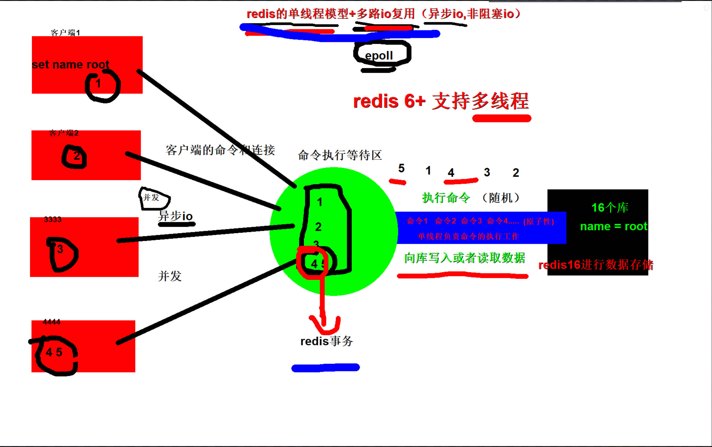

多路 I/O 复用使得 Redis 可以高效地处理大量的客户端连接，同时保持响应性能。它减少了线程切换和创建线程的开销，并提供了高度并发和实时处理能力。

> **需要注意的是，`多路 I/O 复用`对于 `Redis 等单线程模型的数据库`是非常适用的，但对于`多线程或多进程的数据库`，可能`采用其他并发处理策略`。**

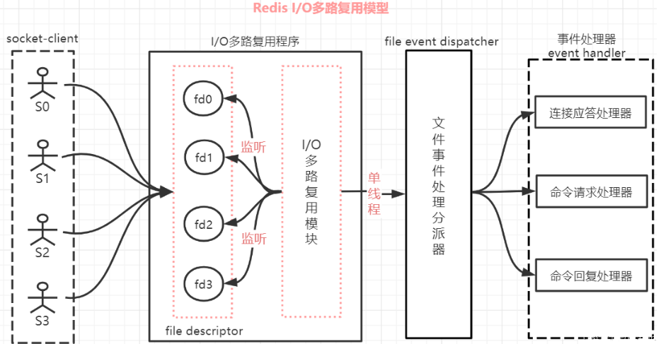
