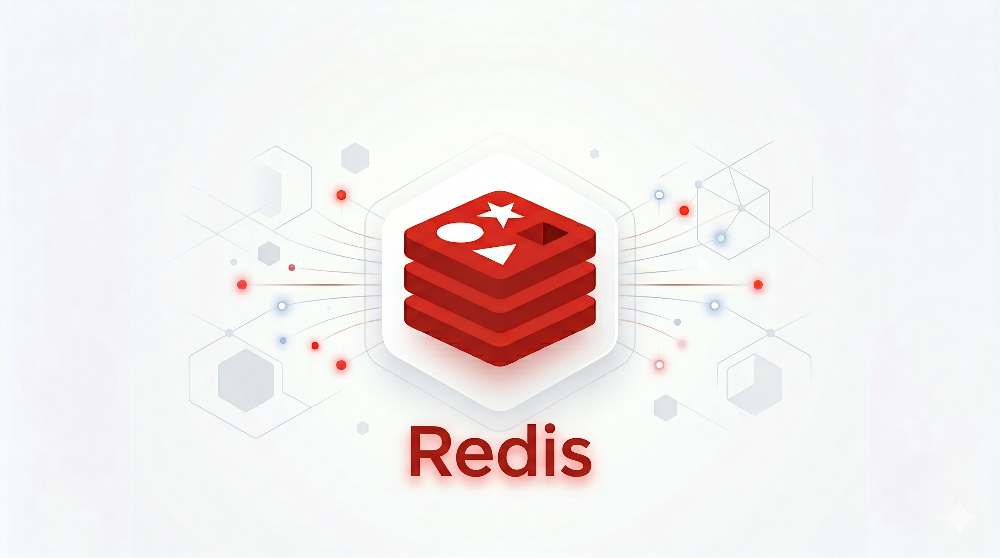

## 1. 持久化概述

### 1.1 什么是持久化

::: tip

> Redis 是内存数据库，数据都存储在内存中，**如果 Redis 重启或关机，数据会丢失**。为了让数据在重启后能够恢复，需要将数据从内存写入磁盘，这个过程就是**持久化**。

:::

### 1.2 持久化方式

Redis 支持两种持久化方式：

| 持久化方式 | 特点 | 优点 | 缺点 |
| ---------- | ---- | ---- | ---- |
| **RDB** | 定时生成数据快照 | 文件紧凑，恢复快 | 可能丢失最后一份数据 |
| **AOF** | 记录每次写操作命令 | 数据安全性高 | 文件较大，恢复慢 |


## 2. RDB 持久化

### 2.1 什么是 RDB

RDB（Redis Database）持久化是 Redis  默认的持久化方式，会在指定的时间间隔内，将内存中的数据**快照**保存到磁盘上的 `dump.rdb` 文件中。

### 2.2 触发方式

#### （1）自动触发

在 `redis.conf` 配置文件中配置：

```bash
# 900秒内至少有1个key发生变化时触发
save 900 1

# 300秒内至少有10个key发生变化时触发  
save 300 10

# 60秒内至少有10000个key发生变化时触发
save 60 10000
```

#### （2）手动触发

```bash
# 阻塞式生成快照（会阻塞主进程）
BGSAVE

# 立即生成快照（Redis fork子进程处理，不阻塞）
SAVE
```

#### （3）其他触发

- 执行 `shutdown` 命令时（如果没有开启 AOF）
- 主从复制时

### 2.3 RDB 优缺点

::: tip

**优点：**

- 文件紧凑，适合备份和灾难恢复
- 恢复速度快（直接加载 RDB 文件）
- 适合容灾备份

**缺点：**

- 可能丢失最后一次快照之后的数据
- RDB 文件在某些情况下可能比较大
- fork 子进程会占用一定内存

:::


## 3. AOF 持久化

### 3.1 什么是 AOF

AOF（Append Only File）持久化以**日志的形式**记录每个写操作命令，重启时重新执行这些命令来恢复数据。

### 3.2 开启 AOF

在 `redis.conf` 中配置：

```bash
# 开启 AOF 持久化
appendonly yes

# AOF 文件名
appendfilename "appendonly.aof"

# AOF 策略配置
appendfsync always     # 每条命令都同步（最安全，但最慢）
appendfsync everysec  # 每秒同步（默认，推荐）
appendfsync no       # 由操作系统决定（最快，但不安全）
```

### 3.3 AOF 重写

随着时间推移，AOF 文件会越来越大。Redis 支持**重写压缩**功能：

```bash
# 手动触发重写
BGREWRITEAOF

# 自动触发（当 AOF 文件大小超过上次重写后的 xx% 时）
auto-aof-rewrite-percentage 100
auto-aof-rewrite-min-size 64mb
```

### 3.4 AOF 优缺点

::: tip

**优点：**

- 数据安全性更高（可配置不丢失）
- 文件易读（可手动编辑）
- 支持多种同步策略

**缺点：**

- 文件通常比 RDB 大
- 恢复速度比 RDB 慢
- 可能存在个别 bug

:::


## 4. RDB vs AOF 对比

| 特性 | RDB | AOF |
| ---- | --- | --- |
| 启动优先级 | 低（文件存在时先加载） | 高 |
| 文件大小 | 小（紧凑） | 大 |
| 恢复速度 | 快 | 慢 |
| 数据安全性 | 可能丢失数据 | 最多丢失1秒 |
| 资源消耗 | fork 子进程 | 持续 IO |
| 适用场景 | 备份容灾 | 核心数据 |

### 4.1 如何选择

::: tip

**推荐策略：**

1. **同时开启 RDB 和 AOF**
2. 使用 AOF 保证数据安全
3. 使用 RDB 做定期备份

:::